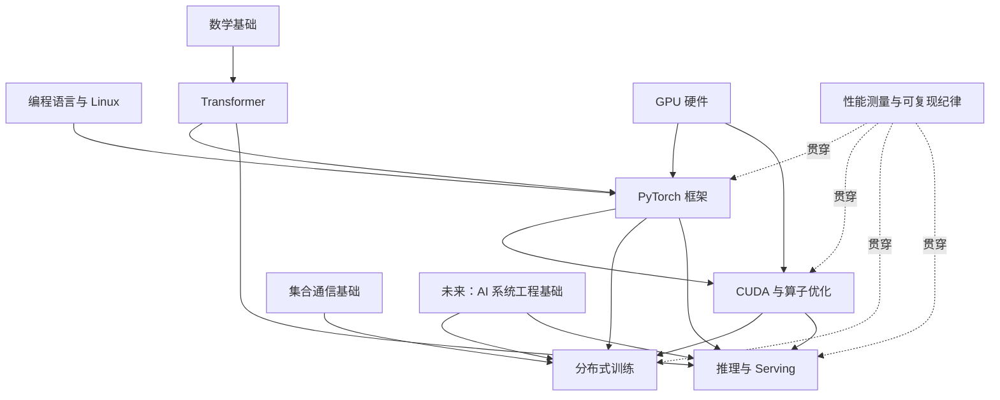
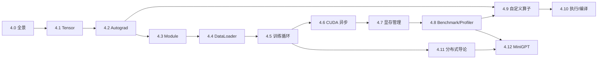

# AIInfraGuide 系统化课程体系 V2 设计规范

> 状态：**冻结（Phase 1）**
> 冻结日期：2026-08-10
> 适用范围：现有四个学习模块与未来课程迁移；本阶段只落地模块一第 4 章 PyTorch，不新增顶级栏目。

## 1. 课程目标与证据

AIInfraGuide V2 不再以“是否提到某个名词”判断覆盖，而以学习者是否能够完成可观察动作判断完成。每个主题都要走完以下闭环：

```text
建立直觉 → 解释机制 → 写出最小实现 → 诊断错误
       → 测量正确性/性能 → 说明权衡 → 完成综合项目
```

近期 AI Infra 岗位将能力集中在五条线上：

1. **框架与模型执行**：PyTorch、Megatron、DeepSpeed、vLLM、SGLang；
2. **GPU 与算子**：C++、CUDA、Triton、算子融合和性能分析；
3. **分布式训练/推理**：collective、并行策略、通信计算重叠、容错；
4. **系统与平台**：Linux、网络、存储、Kubernetes、调度和可观测性；
5. **可证明的工程能力**：可复现实验、开源贡献、端到端项目和技术文档。

岗位证据入口（检索日期 2026-08-10）：

- [ByteDance Research Intern (AI Infra Compute)](https://joinbytedance.com/search/7537118884496312584)：强调 PyTorch/vLLM/SGLang 开源贡献与端到端项目；
- [NVIDIA AI Inference Performance Engineer](https://jobs.nvidia.com/careers/job/893393884394)：强调 TensorRT-LLM、SGLang、vLLM 和可规模化 benchmark；
- [Tencent 大模型推理性能优化岗位](https://careers.tencent.com/jobdesc.html?postId=2072330938095943680)：强调 C++/Python、推理框架、并行、RDMA、算子、Triton 和异构硬件；
- [PyTorch 官方文档](https://docs.pytorch.org/docs/stable/index.html)：把 autograd、CUDA、profiler、distributed、library/operator registration 作为一等子系统；
- [PyTorch Dispatcher 教程](https://docs.pytorch.org/tutorials/advanced/dispatcher.html)与[自定义算子入口](https://docs.pytorch.org/tutorials/advanced/custom_ops_landing_page.html)：证明 AI Infra 学习不能停在高层训练 API。

## 2. 内容层级判定标准

### 2.1 什么应成为栏目（Category）

只有同时满足以下条件，内容才升级为顶级栏目：

- 有独立的问题域、术语和工程对象；
- 至少能组织成 5 个章节，每章至少 3 个有效学习单元；
- 对应一种清晰岗位方向或一组长期维护的工程职责；
- 能形成至少一个独立综合项目；
- 不是另一个栏目中某个工具的展开；
- 新增后不会靠复制已有正文填充。

据此：

- **PyTorch 是章节，不是栏目**：它是所有专项模块共享的执行框架；
- **AI 系统工程基础具备未来成栏资格**：操作系统、网络/RDMA、分布式系统、存储/I/O、容器/虚拟化、集群调度/可靠性可形成独立知识体系；
- **性能分析在当前阶段是横切能力**：先嵌入 PyTorch、CUDA、分布式和推理课程，等形成独立课程与项目后再决定是否启用现有 `performance-analysis` category；
- **综合项目不是栏目**：它必须依附章节或跨模块学习路径，用来验收而非制造另一套知识树。

### 2.2 什么应成为章节（Chapter）

章节必须围绕一个稳定心智模型，具备：

- 6～12 篇递进课程文章，外加最多 1 个综合项目；
- 明确的入口门槛、依赖图与跳过条件；
- 一个章首页；
- 一个能够串联本章关键能力的综合项目；
- 对后续章节的清晰交接边界；
- 可量化的章级完成标准。

章首页不承担完整教学，只回答“为什么学、按什么顺序学、做到什么算完成”。

### 2.3 什么应成为子文章（Lesson）

一篇子文章只解决一个主问题，并包含：

1. 前置知识；
2. 本节学习成果；
3. 直觉与正式机制；
4. 可运行的最小示例，或明确标记的伪代码；
5. 至少一个常见错误及诊断方式；
6. 正确性、资源或性能验证；
7. “牺牲什么、换取什么”的边界；
8. 与上一节和下一节的接口；
9. 8～12 条以“能 + 动词”开头的验收项；
10. 以官方文档、论文或源码为主的参考资料。

不得用篇幅或术语密度替代学习成果。

### 2.4 什么应成为综合项目（Capstone）

综合项目至少串联 4 个本章能力，并交付：

- 可运行源码与固定配置；
- 最小测试和 smoke 命令；
- 正确性判据；
- 资源账本或 benchmark 口径；
- 常见故障与恢复步骤；
- README 或课程内复现说明；
- 无硬件时的降级路径与未验证清单。

## 3. 章节文章模板（内容契约）

### 3.1 章首页

```text
本章定位
→ 前置与跳过条件
→ 子文章地图
→ 依赖图
→ 综合项目
→ 章级验收
→ 后续去向与不讲内容
```

### 3.2 子文章

```text
frontmatter
→ 核心结论开篇
→ 前置知识与学习成果
→ 问题/直觉
→ 机制与数值例子
→ 可运行实现
→ 常见错误
→ 验证与权衡
→ 本节边界和下一节
→ 总结
→ “能 + 动词”自检
→ 官方资料
```

### 3.3 代码与性能纪律

- 文内代码若非逐字可运行，必须标明“简化示意/伪代码”；
- 完整示例放入 `examples/<topic>/`，文章给出对应命令；
- CPU 可覆盖的正确性测试不得以“没有 GPU”为由跳过；
- GPU 性能数字必须来自本仓库可复现实验或明确引用的权威来源；
- 无 GPU 时只给理论口径或“未实测”，禁止用估算冒充实测；
- benchmark 固定输入、预热、同步点、重复次数、软硬件环境和统计量；
- 每篇文章至少给一个失败断言或错误现象，不能只有 happy path。

## 4. 全站课程依赖图



依赖不是“必须按文件顺序全部读完”。章节应标明最小前置与可跳过条件，让已有经验的工程师能够从目标能力反向选课。

## 5. 栏目边界

| 领域 | 当前归属 | 讲到哪里 | 继续深入的位置 |
|---|---|---|---|
| Tensor、Autograd、Module、DataLoader | 模块一 PyTorch | 语义、执行、调试和工程闭环 | PyTorch 源码专题（未来） |
| CUDA stream/allocator | 模块一 PyTorch | 从框架侧观察和正确使用 | 模块二 CUDA 执行与内存 |
| 自定义算子/Dispatcher | 模块一 PyTorch | 注册、组合性与最小 CPU 实现 | 模块二 CUDA/Triton 高性能 Kernel |
| `torch.compile` | 模块一 PyTorch | 全链路心智模型与边界 | 模块二 7.2 Graph Break/编译器 |
| DDP/FSDP | 模块一 PyTorch | 单机入口与关键对象 | 模块三并行策略与规模化训练 |
| Profiler/Benchmark | 各模块横切 | 与本模块对象对应的测量 | Nsight/集群 tracing/Serving benchmark |
| Kubernetes/调度/存储 | 模块四保留场景实践 | LLM Serving 落地 | 未来 AI 系统工程基础栏目讲通用机制 |

## 6. PyTorch 第 4 章冻结内容契约

### 6.1 课程地图

| 节 | 核心问题 | 最小产物 | 后续交接 |
|---|---|---|---|
| 4.0 快速入门 | 一次训练如何跑通 | 现有全景脚本 | 4.1～4.5 |
| 4.1 Tensor 存储与视图 | shape/stride/storage 如何决定数据布局 | 视图共享与连续性实验 | Autograd、CUDA 访存 |
| 4.2 Autograd | 动态图如何保存并传播梯度 | 手写 Function + gradcheck | 训练、编译 |
| 4.3 Module 与状态 | 参数、buffer、state_dict 如何组成模型 | 状态往返与共享参数测试 | Checkpoint、DDP |
| 4.4 DataLoader | 如何持续给设备供数 | worker/pin/prefetch 对照 | 训练与数据系统 |
| 4.5 训练循环工程 | 如何正确更新、恢复和复现 | 可恢复训练循环 | MiniGPT、分布式 |
| 4.6 CUDA 异步执行 | 为什么 Python 结束不等于 GPU 完成 | Event/Stream 正确计时 | CUDA 模块 |
| 4.7 显存管理 | allocated/reserved/peak 如何解释 OOM | 显存账本与降级诊断 | FSDP、推理 KV Cache |
| 4.8 Benchmark 与 Profiler | 如何得到可信时间线 | CPU benchmark + profiler trace | Nsight、回归门禁 |
| 4.9 自定义算子与 Dispatcher | API 如何找到后端 Kernel | `torch.library` CPU 算子 | CUDA/Triton |
| 4.10 执行与编译链路 | eager 到 Inductor 发生了什么 | 执行链路探针 | 模块二编译器 |
| 4.11 分布式 PyTorch 导论 | rank/process group/DDP 如何协作 | CPU 单机多进程 smoke | 模块三 |
| 4.12 MiniGPT 综合项目 | 如何把本章变成一个可复现训练系统 | 完整项目与测试 | CUDA/分布式/推理 |

### 6.2 依赖图



### 6.3 章级验收

学习者完成第 4 章后应当：

- 能手算一个小 Tensor 的 stride，并判断 reshape/transpose 是否共享 storage；
- 能解释 leaf、`grad_fn`、版本计数和 in-place 错误，写出通过 gradcheck 的自定义反向；
- 能区分 Parameter、buffer 与普通属性，并验证 state_dict 精确往返；
- 能调节 DataLoader worker、pin memory 和搬运策略并说明收益边界；
- 能从 checkpoint 恢复模型、优化器和 step，继续得到一致训练轨迹；
- 能指出至少 3 个 CUDA 隐式同步点并用 Event 正确计时；
- 能区分 allocated、reserved 和 peak memory，输出显存账本；
- 能用 `torch.utils.benchmark` 和 `torch.profiler` 产出可信证据；
- 能注册最小自定义算子并解释 Dispatcher 的后端选择；
- 能画出 eager/Autograd/ATen/Dispatcher 与 Dynamo/AOTAutograd/Inductor 的关系；
- 能用 CPU/Gloo 跑通单机多进程 DDP smoke，并说明 FSDP 的位置；
- 能运行 MiniGPT smoke，完成数据、训练、AMP、Checkpoint、Profiler 和分布式入口的闭环。

## 7. 迁移优先级

### P0：课程基础设施与 PyTorch 样板

1. 冻结本规范；
2. 保留 `pyroch/PyTorch框架入门.md` 公开 URL，将其定位为 4.0；
3. 新内容写入 `模块一-前置知识/pytorch/`，以 `chapter: 4` 接入现有分组；
4. 落地 4.1～4.12 与 `examples/pytorch/`；
5. 更新章首页、学习路线、README 和 roadmap。

### P1：未来 AI 系统工程基础栏目（需用户单独批准）

候选章节：Linux/操作系统、网络/RDMA、分布式系统、存储/I/O 与数据流水线、容器/虚拟化/Kubernetes、集群调度/可靠性。新增栏目需要修改 schema、分类、路由和导航，因此不在本阶段实施。

### P2：分布式训练实战化

把模块三第 5～11 章从浓缩章升级为带示例和实验的系统课程，优先 FSDP/ZeRO、Megatron TP/PP、MoE/EP、Checkpoint/容错。

### P3：CUDA 编译器纵深

在现有 Triton 与 `torch.compile` 基础上补 TileLang、MLIR/LLVM、CUTLASS/CuTe 与异构后端，但不得挤入 PyTorch 基础章。

### P4：推理模块去重与多模态扩展

保留现有完整主体，补 vLLM/SGLang/TensorRT-LLM 对照项目及 VLM/DiT/Omni 性能路径；把通用 K8s/存储机制链接到未来系统栏目。

### P5：跨模块作品集

为 CUDA、分布式训练、推理和系统工程各建设一个可复现综合项目，并以统一实验报告模板输出正确性、性能、环境和风险。

## 8. URL、编号与分组策略

- 不删除、不移动、不重定向现有 `pyroch/PyTorch框架入门.md`；
- 该文件保留 `order: 400`、`chapter: 4`，标题调整为 4.0；
- 新文章使用 `order: 401`～`412`、`chapter: 4`、`category: prerequisites`；
- 新文件放入拼写正确的 `pytorch/`，但不改变旧 URL；
- `chapterGrouping.ts` 按 `chapter` 归组、按 `order` 排序，目录不同不影响侧栏；
- 章首页保持 `order: 4` 且不设置 `chapter`；
- 深入编译器和分布式内容只链接，不复制。

## 9. 发布与审计门禁

每篇文章进入下一篇前必须通过：

1. frontmatter schema 与 order/chapter 检查；
2. 文章内部目录及站内链接检查；
3. 关联示例 `compileall`；
4. 环境可用时运行 CPU smoke；
5. `npm run build`；
6. 性能数字来源检查；
7. 与 4.0 和相邻文章的去重检查。

每三篇做一次衔接审计；全部完成后最多三轮聚焦修订。最终以构建产物、示例输出和文件清单证明完成，而不是以“文章已写”证明完成。

## 10. 本阶段明确不做

- 不新增顶级 category；
- 不迁移或重编号模块二至模块四；
- 不删除或重定向 `pyroch` 旧 URL；
- 不安装大型 PyTorch/CUDA 依赖；
- 不编造 GPU 性能；
- 不把编译器、分布式训练或系统工程的深入正文复制进 PyTorch 章；
- 不修改面经、Paper、部署配置或默认分支历史。

## 11. PyTorch 样板章完成证据

> 记录日期：2026-08-10。以下数字只证明本次 worktree 的正确性与可运行性，不是通用性能结论。

### 11.1 环境与文件清单

验证环境为 Python 3.10.12、PyTorch `2.11.0+cu130`、CUDA runtime 13.0；可见 2 张 NVIDIA RTX 6000D。本阶段新增/更新：

- 课程规范：`docs/CURRICULUM_DESIGN.md`；
- 课程入口：`README.md`、`docs/guides/AI Infra学习路线.md`、`src/pages/about/roadmap.astro`；
- 章首页与旧 URL：`第4章-PyTorch框架.md`、`pyroch/PyTorch框架入门.md`；
- 12 篇新课：`pytorch/4.1-*.md` 至 `pytorch/4.12-*.md`；
- 12 个示例：`examples/pytorch/*.py`；
- 12 个测试文件：`examples/pytorch/tests/test_*.py`。

旧页面 `/AIInfraGuide/prerequisites/模块一-前置知识/pyroch/pytorch框架入门/` 仍存在；新生成页 4.1～4.12 共 12 个，章首页渲染的侧栏按 4.0～4.12 排序。

### 11.2 最终命令与结果

```text
python3 -m unittest discover -s examples/pytorch/tests -p 'test_*.py' -v
# Ran 77 tests in 13.608s — OK

python3 -m compileall examples/pytorch
# examples/pytorch 与 examples/pytorch/tests 全部编译通过

npm run build
# Astro build 完成；Pagefind 索引 484 个生成页面、1 种语言

git diff --check
# 无输出，退出码 0
```

此外逐个执行了 4.1～4.12 的 CPU 路径：Tensor、Autograd、Module、DataLoader、训练循环、内存账本、Benchmark/Profiler、自定义算子、compile 入口、两进程 Gloo DDP、MiniGPT CPU 与 DDP smoke 均通过。CPU fallback 测试会显式保留 `CUDA unavailable/not measured`，不填充伪 GPU 结果。

CUDA 可用时额外执行了 DataLoader transfer、CUDA Stream/Event、allocator current/peak、CUDA Profiler activity、MiniGPT autocast/GradScaler 与 CUDA checkpoint RNG 恢复；这些检查均通过，且只作为正确性/资源观测，不据此声称加速倍率。

### 11.3 明确未实测项

- 未做破坏性 OOM、超大模型或长时间稳定性实验；
- 未做 NCCL、多机 DDP、FSDP、ZeRO 或分布式 checkpoint 分片；
- `torch.compile` 默认用 `backend="eager"` 验证 Dynamo/guard/Graph Break，不把它当作 Inductor 性能测试；
- 自定义算子只验证 CPU/FakeTensor/Autograd 注册，未实现 CUDA/Triton Kernel；
- 未给出跨硬件可泛化的吞吐、延迟、显存节省或扩展效率数字；
- MiniGPT checkpoint 保存组件状态，不包含 DataLoader 游标或每 rank RNG；精确数据轨迹恢复由 4.5 演示，规模化恢复进入模块三。
