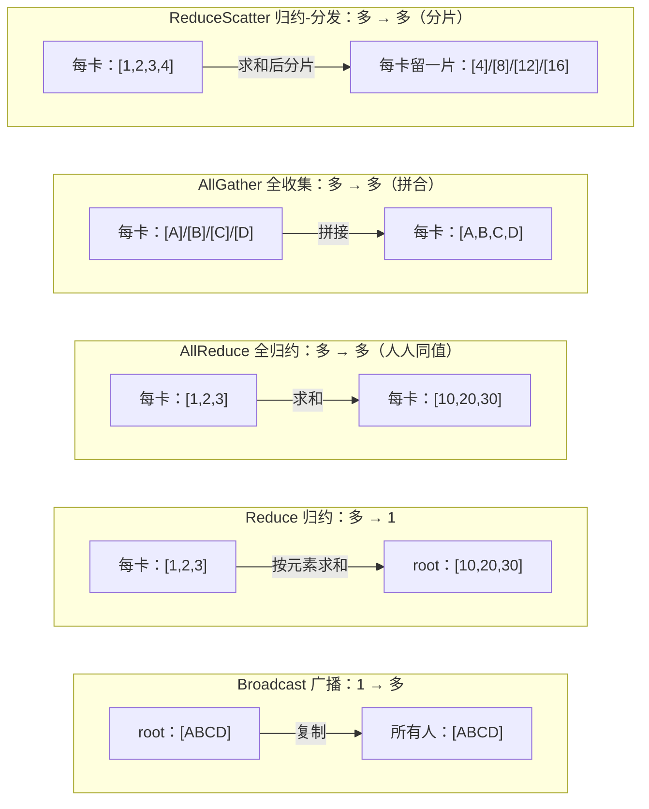
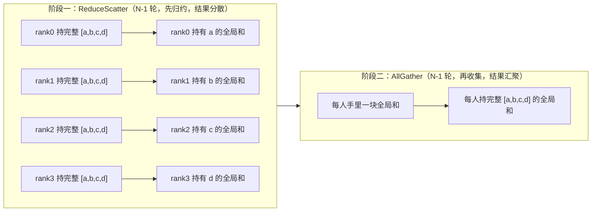

多卡训练的本质是数据搬运：一张卡算完的东西，另一张卡要接着用。上一篇 [5.7 多卡互联拓扑](/AIInfraGuide/prerequisites/模块一-前置知识/gpu/57-多卡互联拓扑) 讲了搬数据的“路”——NVLink 900 GB/s、InfiniBand 50 GB/s，这一篇讲“车”：数据在 GPU 之间具体以什么动作流动。答案是五种被反复使用的标准动作——**集合通信原语**：Broadcast（广播）、Reduce（归约）、AllReduce（全归约）、AllGather（全收集）、ReduceScatter（归约-分发）。原语的选择直接决定每张卡要搬多少字节：DDP 同步一次 7B 模型的梯度（14 GB），每张卡要经手约 28 GB（≈2M）；而 AllGather 每卡只搬 $(N-1)/N \times M$。记住一句话——**“谁有数据、结果落在谁手里”**——五种原语就全通了。本篇是第 6 章《集合通信基础》的入口篇，从最基础的点对点 Send/Recv 讲起，下一节 6.2 的 Ring AllReduce 就建立在本篇“AllReduce 可以拆成 ReduceScatter + AllGather”这个分解之上。

<!-- more -->

## 📑 目录

- [1. 为什么需要通信原语：多卡协作的第一步](#1-为什么需要通信原语多卡协作的第一步)
- [2. 起点：点对点通信 Send / Recv](#2-起点点对点通信-send--recv)
- [3. 五大集合通信原语：给数据搬运立规矩](#3-五大集合通信原语给数据搬运立规矩)
- [4. 关键分解：AllReduce = ReduceScatter + AllGather](#4-关键分解allreduce--reducescatter--allgather)
- [5. 通信量账本：每个原语搬多少数据](#5-通信量账本每个原语搬多少数据)
- [6. 原语 ↔ 并行策略：一张映射表](#6-原语--并行策略一张映射表)
- [7. 动手跑一遍：PyTorch + NCCL](#7-动手跑一遍pytorch--nccl)
- [8. 常见误区：三组易混概念 + 一个死锁陷阱](#8-常见误区三组易混概念--一个死锁陷阱)
- [总结](#-总结)
- [自我检验清单](#-自我检验清单)
- [参考资料](#-参考资料)

---

## 1. 为什么需要通信原语：多卡协作的第一步

### 1.1 多卡训练到底多了什么成本

**单卡训练里，数据只在一张卡的显存（HBM）内部流动**：从显存读进计算单元，算完写回显存。这就像一个人在自家房间里干活，所有材料都在手边。

多卡训练多了一个全新的成本项——**卡间搬运**。三个最常见的协作场景：

- **数据并行（DP）**：每张卡拿同一份模型、不同的一批数据，各自算出梯度。梯度是“全班答案的一部分”，需要合并——搬运的是梯度；
- **张量并行（TP）**：一个大矩阵被切成几段放在不同卡上，算完要拼起来——搬运的是中间结果（激活值）；

> **最小走查（$2\times2$ 按列切 vs 按行切）：**
> 设输出投影 $Y=XW$，$W=\begin{bmatrix}a&b\\c&d\end{bmatrix}$ 按列切 $W=[W_1|W_2]$，$X=[x_1\ x_2]$，则卡1得 $[a x_1;\ c x_1]$、卡2得 $[b x_2;\ d x_2]$，两者相加 $= [a x_1+b x_2;\ c x_1+d x_2]$ 才为完整 $Y$——故列切出口必 **AllReduce**（各卡部分和相加、人人得完整结果）求和；若按行切则为 **AllGather**（每人交一片、人人收齐）拼接。通信量≈$2M$。

- **流水线并行（PP）**：模型按层切分，第 1 层算完的激活值要传给第 2 层所在的卡——搬运的是激活值。

问题来了：这些场景里“搬数据”的动作高度重复——合并、复制、拼接、分发。能不能把这些动作标准化，像函数一样一次调用就完成？

### 1.2 核心思想：把“搬运模式”标准化成原语

**可以。这就是集合通信原语（collective communication primitives）**——一组预先定义好的、所有 GPU 一起参与的数据搬运模式。打个比方：你不需要每次都说“请把 4 张卡上的数按位置相加，再把结果发给每个人”，你只需要说“AllReduce”。

先交代两个贯穿全文的术语：

- **Rank**：分布式训练里每个进程的编号，从 0 到 N-1。N 叫 **world_size**（参与进程总数）。下文“rank 0”“rank 1”就是指编号为 0、1 的进程（通常每张卡一个进程）；
- **集合通信 vs 点对点通信**：点对点（Send/Recv）只有两个进程参与；集合通信是一组进程（默认所有 rank）共同参与、按统一规则交换数据的操作。

集合通信原语由谁执行？你自己不写传输代码，而是调用通信库——在 GPU 上几乎都是 **NCCL**（NVIDIA Collective Communications Library）在背后执行。原语是“需求”，NCCL 负责把需求翻译成硬件上真实的传输动作（怎么传、走哪条路，下一节 6.2 的 Ring 算法会揭示一个 AllReduce 内部其实是一连串点对点操作）。

---

## 2. 起点：点对点通信 Send / Recv

### 2.1 两个人打电话

**点对点通信（point-to-point）是最基础的积木：一个进程发，一个进程收，一对一、定向传递。** 就像两个人打电话——A 拨号说出去，B 接电话听进来，只有这两个人参与。

```python
import torch
import torch.distributed as dist

# 假设已完成 dist.init_process_group(backend="nccl")
if dist.get_rank() == 0:
    tensor = torch.tensor([1.0, 2.0, 3.0]).cuda()
    dist.send(tensor, dst=1)          # rank 0 发送给 rank 1
else:
    tensor = torch.zeros(3).cuda()
    dist.recv(tensor, src=0)          # rank 1 接收来自 rank 0 的数据
    print(f"rank 1 received: {tensor}")
```

运行输出（rank 1 的终端）：

```
rank 1 received: tensor([1., 2., 3.])
```

操作前后的数据流：

```
操作前:                          Send / Recv 后:
rank0: [1.0, 2.0, 3.0]   rank0: [1.0, 2.0, 3.0]   (发送方保留自己的数据)
rank1: [  0,   0,   0 ]   rank1: [1.0, 2.0, 3.0]   (接收方拿到一份副本)
```

注意一个容易忽略的细节：**Send 之后，发送方的数据还在**。通信是“复制”不是“搬走”——接收方拿到副本，发送方不丢数据。

### 2.2 用途与局限

Send/Recv 用得最多的地方是**流水线并行（PP）**：模型按层切分到不同机器后，前一层的激活值要传给下一层所在的机器，每次只涉及两台机器、两个进程，正是一对一场景（PP 的完整讨论在模块三 [第 7 章流水线并行](/AIInfraGuide/distributed/模块三-分布式训练/第7章-流水线并行)）。

但当你需要“多方同时协作”时，点对点就不够用了：4 张卡两两交换数据要手动写 12 次 Send/Recv，还得自己保证配对顺序——繁琐且极易出错。能不能把“大家都参与、按固定规则交换”打包成一个操作？这正是下一节的五大集合通信原语。

---

## 3. 五大集合通信原语：给数据搬运立规矩

### 3.1 先记白话分类

先把五种原语翻译成一句话，建立直觉再上细节：

| 原语 | 白话一句话 | 数据方向 |
|------|-----------|---------|
| Broadcast（广播） | 1 对多：root 手里有完整数据，复制给所有人 | 一个 → 所有 |
| Reduce（归约） | 多对 1：所有人的数据按元素求和，结果只落在 root | 所有 → 一个 |
| AllReduce（全归约） | 多对多：先归约再广播，结果人人各有一份 | 所有 → 所有（同值） |
| AllGather（全收集） | 每人交一片，人人拿全部：拼起来才完整 | 所有 → 所有（拼合） |
| ReduceScatter（归约-分发） | 归约后的结果，每人留一片 | 所有 → 所有（分片） |



这张图讲的是五种原语“操作前 → 操作后”的压缩版：**横着看每个子图，左边是谁持有数据，右边是操作后数据落在谁手里**。Broadcast 是复制、Reduce 是收拢到一个人、AllReduce 是收拢后再发给大家、AllGather 是每人出一片拼成完整、ReduceScatter 是归约完每人拿一块。下面逐个展开。

### 3.2 Broadcast：一对多复制

**Broadcast（广播）：一个 rank（叫 root）把自己的完整数据复制给所有其他 rank。** 典型用途：把初始模型参数从 rank 0 分发给所有卡——训练开始时所有卡必须拿到一模一样的模型。

```
操作前:                    Broadcast 后:
GPU0: [ABCD]     GPU0: [ABCD]
GPU1: [    ]     GPU1: [ABCD]
GPU2: [    ]     GPU2: [ABCD]
GPU3: [    ]     GPU3: [ABCD]
```

🔑 **核心概念**：Broadcast 里 **root 是唯一的数据来源**，操作前后数据内容不变，只是副本变多了。**结果落在谁手里？所有人。数据原本在谁手里？只有 root。**

### 3.3 Reduce：多对一归约

**Reduce（归约）：所有 rank 的数据按元素做聚合运算（通常是求和），结果只汇总到一个 rank（root）上。** 典型用途：把各卡算出的 loss 汇总到主卡上看一眼训练曲线。

```
操作前:                    Reduce(sum) 到 GPU0 后:
GPU0: [1,2,3]    GPU0: [10,20,30]    (1+2+3+4, 2+4+6+8, 3+6+9+12)
GPU1: [2,4,6]    GPU1: [2,4,6]       (未变)
GPU2: [3,6,9]    GPU2: [3,6,9]       (未变)
GPU3: [4,8,12]   GPU3: [4,8,12]      (未变)
```

🔑 **核心概念**：**只有 root 拿到结果，其他 rank 的数据原地不动**。注意“按元素”三个字——每个位置单独求和，第一列加起来是 $1+2+3+4=10$，第二列是 $2+4+6+8=20$，第三列是 $3+6+9+12=30$。

### 3.4 AllReduce：归约结果人人有份

**AllReduce（全归约）：所有 rank 的数据归约（求和），归约结果每一个 rank 都拿到一份。** 用生活语言说：全班同学先把各自的答案汇总求平均，再把最终答案发给每个人。

```
操作前:                    AllReduce(sum) 后:
GPU0: [1,2,3]    GPU0: [10,20,30]
GPU1: [2,4,6]    GPU1: [10,20,30]
GPU2: [3,6,9]    GPU2: [10,20,30]
GPU3: [4,8,12]   GPU3: [10,20,30]
```

🔑 **核心概念**：**结果人人有一份，且人人相同**。对比上一节：Reduce 只有 root 拿到结果，AllReduce 是“每个 rank 都当了一次 root”。

为什么要“人人都有”？因为**数据并行（DDP）里每张卡下一步要用完全相同的梯度更新自己的参数副本**——如果只有一张卡知道平均梯度，其他卡就不知道该往哪个方向更新。这是训练的一致性需求，正是 AllReduce 存在的理由。

### 3.5 AllGather：每人交一片，人人拿全部

**AllGather（全收集）：每个 rank 把自己手里的一片数据交出来，操作结束后，人人手里都是完整拼好的全部数据。** 打个比方，这就是拼图：每人手里一块拼图，拼完之后人人都拿到一张完整图画（每人自己留一份完整副本）。

```
操作前:                    AllGather 后:
GPU0: [A]        GPU0: [A,B,C,D]
GPU1: [B]        GPU1: [A,B,C,D]
GPU2: [C]        GPU2: [A,B,C,D]
GPU3: [D]        GPU3: [A,B,C,D]
```

🔑 **核心概念**：**操作前没有任何人持有完整数据，每人只有 1/N 片；操作后人人持有完整数据**。NCCL 的约定是输出缓冲按 rank 顺序拼接：rank 0 的数据在第 0 段，rank 1 的数据在第 1 段，依此类推。典型用途：ZeRO-3 里参数被切分存放在各卡，前向传播前用 AllGather 把完整的模型参数收集回来。

### 3.6 ReduceScatter：归约结果每人留一片

**ReduceScatter（归约-分发）：先做归约（求和），再把归约后的结果切成 N 片，每个 rank 只保留属于自己的那一片。** 注意它和 Reduce 的区别：Reduce 的完整结果集中在 root；ReduceScatter 的完整结果被拆开、分散存放。

```
操作前:                     ReduceScatter(sum) 后:
GPU0: [1,2,3,4]   GPU0: [4]    (第 0 片的和: 1+1+1+1)
GPU1: [1,2,3,4]   GPU1: [8]    (第 1 片的和: 2+2+2+2)
GPU2: [1,2,3,4]   GPU2: [12]   (第 2 片的和: 3+3+3+3)
GPU3: [1,2,3,4]   GPU3: [16]   (第 3 片的和: 4+4+4+4)
```

🔑 **核心概念**：**归约做了，但结果不发给所有人，而是每人留一片**——每个 rank 拿到的是“全局结果的一个分片”。典型用途：ZeRO 系列把归约后的梯度分片存储到各卡，每卡只存自己负责的那一段。

---

## 4. 关键分解：AllReduce = ReduceScatter + AllGather

### 4.1 拆开看：AllReduce 其实做了两件事

**AllReduce 的语义可以拆成两步：先把所有人的数据“加”起来（归约），再把完整结果“发”给每个人（收集）。** 而上文已经有两个原语恰好各管一件事：ReduceScatter 负责归约但结果分散，AllGather 负责收集但要求每人手里先有一片。

把两步串起来：



这张图讲的是 AllReduce 的两阶段分解：**阶段一做完，全局归约结果已经算出来了，但被打散成 N 片、每人手里一片；阶段二把散落的片收集起来，人人都拼出完整的全局结果。** 两阶段合起来，语义正好等于 AllReduce。

用 4 个同学分组做题来验证：每人先算出自己负责题目的结果；阶段一，每人负责把某一题的四个答案汇总（结果分散在四个人手里）；阶段二，每个人把自己汇总好的答案念给所有人听——最后人人都抄下完整答案。这正是 AllReduce 要的“人人拿到完整结果”。

💡 **提示**：这个分解不是数学游戏，NCCL 官方文档明确写了 **“ReduceScatter followed by AllGather is equivalent to AllReduce”**（归约-分发后接全收集等价于全归约）；这个分解也正是分片式训练（sharded training，如 ZeRO）的实际用法（见 §4.2）。

### 4.2 为什么这个分解重要

📌 **关键点**：**“AllReduce = ReduceScatter + AllGather”正是 Ring AllReduce 算法的核心思想**——下一节 6.2 会看到，把 N 个节点排成一个环，先沿着环做 N-1 轮传递完成 ReduceScatter，再沿环做 N-1 轮传递完成 AllGather，所有链路同时工作，每张卡的通信量降到约 2M，这就是“带宽最优”的来源。现在先记住这个分解，6.2 用它推导通信量公式。

另外，分解也解释了为什么 ZeRO 只需要“半截”AllReduce：ZeRO 的梯度分片只要阶段一（ReduceScatter），根本不需要阶段二——因为它本来就不需要每张卡都有完整梯度，分散存放正是它的目的。

---

## 5. 通信量账本：每个原语搬多少数据

### 5.1 为什么要先算通信量

**通信时间 = 数据量 ÷ 带宽。** 带宽是硬件给的（5.7 讲过：机内 NVLink 900 GB/s、机间 InfiniBand 50 GB/s），你改不了；**数据量取决于你选哪个原语、切多碎——这是软件层面能控制的部分**。所以“每个原语搬多少字节”是分析一切并行策略通信开销的第一性工具：看到一种并行策略，先问它每步调什么原语、搬多少数据，就能估算它会不会被通信卡死。

### 5.2 一张表看清五种原语

设 $M$ = 总数据量（比如一份完整梯度的大小），$N$ = 参与节点数。每个 rank 在整个操作过程中的收发量如下（通信量的口径定义与 [6.2 Ring AllReduce](/AIInfraGuide/prerequisites/模块一-前置知识/communication/62-ring-allreduce) 的推导保持一致，这里补充说明）：

| 🔧 原语 | 📤 每 rank 发送量 | 📥 每 rank 接收量 | 典型用途 |
|--------|----------------|----------------|---------|
| Broadcast | $M$（root）/ 0 | 0（root）/ $M$ | 参数初始化广播 |
| Reduce | $M$ | $M$（root）/ 0 | Loss 汇总 |
| AllReduce | $\approx 2M$ | $\approx 2M$ | DDP 梯度同步 |
| AllGather | $(N-1)M/N$ | $(N-1)M/N$ | ZeRO-3 参数收集 |
| ReduceScatter | $(N-1)M/N$ | $(N-1)M/N$ | ZeRO 梯度分片 |

⚠️ **注意（读表口径）**：这张表记的是**每个 rank 的链路流量**（下文 5.5 详述），并且是“量级账”——Broadcast 的 root 实际要把 $M$ 复制给其余 $N-1$ 个 rank（总发出 $(N-1)M$），Reduce 的 root 实际要收 $(N-1)M$；表里写 $M$ 是“每个接收方收到多少”的记账方式。**root 承担全部流量的不均等现象，正是这两个原语不适合做梯度同步的原因**——AllReduce 把流量摊平到所有 rank 的链路上。

### 5.3 逐行解读：直觉、注解、算例

**Broadcast——复制一份完整数据。** 直觉：只有 root 往外发，内容就是完整的 $M$，发完数据本身没变。算例：$N=4$、$M=16$（单位任意，比如 16 个浮点数），root 发 16 单位，其余每卡收 16 单位。

**Reduce——每卡把完整数据送出去。** 直觉：每个非 root 把自己手里的 $M$ 发给 root，root 汇总。算例：$N=4$、$M=16$，每张非 root 卡发 16 单位，root 一共收到 $3 \times 16 = 48$ 单位（表里 root 的“接收 $M$”是每个发送方视角的记账）。这就是为什么 Reduce 只在“汇总一个小东西”（如一个标量 loss）时用——数据一多，root 的链路就是瓶颈。

**AllReduce——约两倍于数据量的经手。** 直觉：把数据送出去参与归约（约 $M$），再把完整结果收回来（约 $M$），两头加起来每 rank 约 $2M$（精确值是 $2(N-1)M/N$，下一节 6.2 推导）。算例：7B 模型 FP16 梯度 $M=14$ GB，8 卡 DDP 每次 AllReduce 每卡经手约 $2 \times 14 = 28$ GB，按 NVLink 4.0（900 GB/s）算约 31 毫秒（数字继承本章总览 §9.2）。**这就是为什么梯度同步必须走机内 NVLink、而且各框架都在拼命压缩 AllReduce 次数——每步训练都至少一次，经手量还是梯度的两倍。**

**AllGather / ReduceScatter——每卡经手 $\frac{N-1}{N}M$。** 直觉：自己手里的 $1/N$ 片不用收，只需要和其余 $N-1$ 个 rank 打交道，每片大小 $M/N$，所以收发各 $(N-1) \times M/N$。算例：$N=4$、$M=16$，每卡收 $3 \times 4 = 12$ 单位、发 12 单位（下一小节完整推导）。工程含义：**当 $N$ 很大时 $(N-1)M/N \to M$，每卡经手量约等于一份完整数据，与集群规模基本无关**——这正是 ZeRO-3 敢在几百上千卡集群上每个前向都 AllGather 参数的原因。

### 5.4 推导：AllGather 每 rank 收 (N-1)×(M/N)

这一行公式值得单独推一遍，它是理解 AllGather 家族通信量的钥匙。

**直觉先行**：AllGather 的目标是人人拿到完整的 $M$。你手里本来就有自己那片（$M/N$），所以**只需要从其余 $N-1$ 个 rank 各收一片，每片 $M/N$**。

**公式**：

$$
\text{每 rank 接收量} = \underbrace{(N-1)}_{\text{其余 N-1 个 rank 各送一片}} \times \underbrace{\frac{M}{N}}_{\substack{\text{每片大小} \\ \text{（总数据切 N 片）}}} = \frac{(N-1)M}{N}
$$

发送量同理：你自己的那片 $M/N$ 要送到其余 $N-1$ 个 rank，所以发送量也是 $(N-1)M/N$。

**数值算例**：$N=4$、$M=16$（每 rank 初始持有 $16/4 = 4$ 单位）。每 rank 接收 $3 \times 4 = 12$ 单位，发送 12 单位。校验：收 12 + 自己原有的 4 = 16 = $M$ ✓——拼图拼满了。

💡 **提示（边界条件）**：$N=1$ 时接收量 $(1-1)M/1 = 0$——单卡没有通信，原语退化为本地操作，这是公式的退化情况，符合直觉。

**工程结论**：AllGather 每卡经手量 $(N-1)M/N$ 永远小于等于 $M$（N=2 时是 $M/2$）。对比 AllReduce 的 $\approx 2M$——**AllGather 比 AllReduce 便宜一半**。ZeRO-3 的“贵”不在 AllGather 本身，而在它每层前向和反向都要做（频率高）；DDP 的“省”不在量而在频率（每步一次）。频率 × 数据量才是完整账本。

### 5.5 链路视角：为 6.2 的 busbw 埋伏笔

**5.2 的通信量表是“链路视角”（bus 视角）**：每张卡的网口/链路上实际流过的字节数。为什么要特意强调这个视角？因为真正决定通信时间的是链路字节数——**时间 = 链路字节 ÷ 链路带宽**——而不是“应用想要的结果大小”。

举个反直觉的例子：AllReduce 应用层只想要 $M$ 的结果（一份完整梯度），但每张卡的链路上实际要经手 $\approx 2M$——**两倍**。如果你按“结果大小”算时间，会低估一倍。

这就是为什么评测通信性能时不能只看一个带宽数字：NVIDIA 的 nccl-tests 工具报告两个指标——**algbw（算法带宽，按结果大小 $M$ 算，应用视角）和 busbw（总线带宽，按链路字节 $2(N-1)M/N$ 修正，链路视角）**。对照硬件理论带宽时看 busbw 才有意义。busbw 的修正公式怎么来的，正是 6.2 篇推导 Ring AllReduce 通信量时的事，这里先记住结论：**算通信开销，永远用链路视角。**

---

## 6. 原语 ↔ 并行策略：一张映射表

掌握了五种原语，现在回答一个关键问题：**各种并行策略到底调哪些原语？** 映射关系如下（继承本章总览 §4.3）：

| 并行策略 | 主要通信原语 | 通信频率 | 通信数据量 |
|---------|------------|---------|-----------|
| 数据并行（DDP） | AllReduce | 每层反向后 | 梯度大小 |
| ZeRO-1/2 | ReduceScatter + AllReduce | 每层反向后 | 梯度大小 |
| ZeRO-3 | AllGather + ReduceScatter | 每层前向 + 反向 | 参数大小 |
| 张量并行（TP） | AllReduce / AllGather | 每层前向 + 反向 | 激活大小 |
| 流水线并行（PP） | 点对点 Send/Recv | 每个 micro-batch | 激活大小 |

📌 **关键点**：这张表能读出两条工程准则。**第一，TP 的通信频率最高（每层前向、反向各一次，而且是 AllReduce），通信量跟激活大小挂钩——这就是 TP 必须限制在 NVLink 机内互联范围内的原因**（5.7 已详述，不重复）。**第二，PP 虽然跨机，但只用 Send/Recv、频率低、数据量小，机间 InfiniBand 完全扛得住**——所以 PP 是唯一适合跨机的张量级并行。

为什么 DDP 偏偏用 AllReduce？因为每张卡的梯度都要合并、且每张卡都需要完整梯度——AllReduce 的语义（多对多、人人同值）正好一一对应。为什么 ZeRO-3 用 AllGather？因为参数被切了，用之前要拼回来——AllGather 的语义（每人交一片、人人拿全部）正好一一对应。**每种策略的完整通信分析（怎么算账、怎么优化）留给 6.6 篇展开**，这里先背下映射关系；模块三的 [4.1 数据并行详解](/AIInfraGuide/distributed/模块三-分布式训练/41-数据并行详解)、[第 6 章张量并行](/AIInfraGuide/distributed/模块三-分布式训练/第6章-张量并行与序列并行) 会逐个用到。

---

## 7. 动手跑一遍：PyTorch + NCCL

### 7.1 初始化：init_process_group

PyTorch 的 `torch.distributed` 包提供了全部五种原语的 API，底层默认走 NCCL。**所有代码都在多进程环境下运行：每个 rank 一个进程**，用 `torchrun --nproc_per_node=4 collectives_demo.py` 启动（需要 4 张 GPU；单机 4 卡即可，跨机时加上 `--nnodes` 等参数，以你所用 PyTorch 版本的 `torchrun --help` 为准）。

```python
# collectives_demo.py —— 演示四种原语的最小完整程序（NCCL 后端，4 进程）
# 启动方式: torchrun --nproc_per_node=4 collectives_demo.py
import os
import torch
import torch.distributed as dist

def main():
    # torchrun 会把 RANK / WORLD_SIZE 等写进环境变量（以你所用版本为准）
    rank = int(os.environ["RANK"])
    world_size = int(os.environ["WORLD_SIZE"])

    # 初始化进程组: 所有 rank 用同一个地址/端口汇合，NCCL 负责后续传输
    dist.init_process_group(backend="nccl")
    torch.cuda.set_device(int(os.environ["LOCAL_RANK"]))

    print(f"rank {rank}/{world_size} ready")
    # ... 下面按序执行四种原语 ...
    dist.destroy_process_group()

if __name__ == "__main__":
    main()
```

`init_process_group(backend="nccl")` 是第一步：所有进程通过 `MASTER_ADDR`/`MASTER_PORT`（torchrun 自动设置）互相认识，组成一个通信组。之后所有集合调用都在这组进程之间进行。

### 7.2 AllReduce / AllGather / ReduceScatter 三连

在 `main()` 里依次加上三段，每段之后标注了 4 rank 下的运行输出：

```python
    # ① AllReduce: 每 rank 各持 [1,2,3]，求和后每 rank 都拿到 [4,8,12]
    t = torch.tensor([1.0, 2.0, 3.0], device="cuda")
    dist.all_reduce(t, op=dist.ReduceOp.SUM)
    print(f"rank {rank}: all_reduce -> {t}")
    # 输出（每个 rank 都打印同一行）:
    #   rank i: all_reduce -> tensor([4., 8., 12.])   （4 rank 各持 [1,2,3] 求和）

    # ② AllGather: 每 rank 交出一片（自己的 rank 编号），人人拼出 [0,1,2,3]
    local_chunk = torch.tensor([float(rank)], device="cuda")
    gathered = [torch.zeros(1, device="cuda") for _ in range(world_size)]
    dist.all_gather(gathered, local_chunk)
    print(f"rank {rank}: all_gather -> {gathered}")
    # 输出（每个 rank 相同）:
    #   rank i: all_gather -> [tensor([0.]), tensor([1.]), tensor([2.]), tensor([3.])]

    # ③ ReduceScatter: 每 rank 持 [0,1,2,3]，先求和成 [0,4,8,12]，每 rank 只留一片
    chunks = torch.tensor([0.0, 1.0, 2.0, 3.0], device="cuda")
    out = torch.zeros(1, device="cuda")
    dist.reduce_scatter(out, list(chunks.chunk(world_size)), op=dist.ReduceOp.SUM)
    print(f"rank {rank}: reduce_scatter -> {out}")
    # 输出（每个 rank 不同）:
    #   rank 0: reduce_scatter -> tensor([0.])
    #   rank 1: reduce_scatter -> tensor([4.])
    #   rank 2: reduce_scatter -> tensor([8.])
    #   rank 3: reduce_scatter -> tensor([12.])
```

先自己预测一下 ③ 的输出再对照：每 rank 的输入都是 `[0,1,2,3]`，四卡按位置求和得 `[0,4,8,12]`，然后分四片、rank i 拿第 i 片——所以 rank 0 拿 `0`、rank 1 拿 `4`、rank 2 拿 `8`、rank 3 拿 `12`。**预测输出是检验你是否真懂原语语义的最好方法**：能预测对，说明“谁有数据、结果落在谁手里”过关了。

⚠️ **注意（集合操作的纪律）**：所有 rank 必须**按相同顺序调用相同的集合操作**。如果 rank 0 先做 all_reduce 而 rank 1 先做 all_gather，程序会直接挂起（死锁）——集合操作是全局同步点，NCCL 的实现要求全员对齐。调试多卡程序卡住时，第一件事就是看各 rank 的日志停在哪一行。

### 7.3 每个 API 背后的 NCCL 函数

`torch.distributed` 的集合 API 是“普通话”，NCCL 是执行者。两者的对应关系（NCCL 官方 API 文档 api/colls.html 与 api/p2p.html 的函数名）：

| PyTorch API | NCCL 函数 | 语义一句话 |
|------------|----------|-----------|
| `dist.broadcast(t, src=0)` | `ncclBroadcast` | root 的 t 复制给所有 rank |
| `dist.reduce(t, dst=0, op=SUM)` | `ncclReduce` | 归约结果只落在 dst |
| `dist.all_reduce(t, op=SUM)` | `ncclAllReduce` | 归约结果人人有份 |
| `dist.all_gather(list, t)` | `ncclAllGather` | 每 rank 的 t 拼成完整 |
| `dist.reduce_scatter(out, list, op=SUM)` | `ncclReduceScatter` | 先归约，每 rank 留一片 |
| `dist.send(t, dst=1)` / `dist.recv(t, src=0)` | `ncclSend` / `ncclRecv` | 点对点发送/接收 |

看懂这张表，你在 PyTorch 里写的每个集合调用，心里都能浮现出它对应的 NCCL 函数签名——排查通信问题时（`NCCL_DEBUG=INFO` 的输出会直接打印这些函数名），这个对应关系就是你的地图。

---

## 8. 常见误区：三组易混概念 + 一个死锁陷阱

### 8.1 Reduce ≠ AllReduce

**误区**：觉得 Reduce 和 AllReduce 差不多，都是求和。

**区别**：Reduce 的**结果只落在 root 一个 rank** 上，其他 rank 的数据保持原样；AllReduce 的**结果人人有一份且完全相同**。判别方法就一句话——问“结果落在谁手里”：一个人 → Reduce；所有人 → AllReduce。

**顺带回答一个高频面试题**：“DDP 为什么不用 Reduce + Broadcast 拼出 AllReduce？” 因为要两趟通信（先归约到 root、再从 root 广播出去），root 变成流量热点，而且两次都卡在 root 一条链路上；AllReduce 把归约和广播合并成一个操作，由 NCCL 用所有链路均衡地完成（6.2 的 Ring 算法正是为此设计的）。

### 8.2 Broadcast ≠ AllGather

**误区**：Broadcast 和 AllGather 都是“把数据发给所有人”，混着用。

**区别**：Broadcast 是**复制**——root 手里已经有完整数据，发给所有人，数据内容不变；AllGather 是**合并**——每人手里只有一片，拼起来才是完整数据，操作前没有任何人有完整数据。错误用法示例：想收集所有 rank 的梯度，却调了 `broadcast`——你只会得到 root 自己的梯度，其他 rank 的梯度全丢了。

**判别口诀**：先问“谁手里有完整数据”。**有人有完整** → 走 Broadcast 家族（复制/收拢）；**没人有完整、每人只有一片** → 走 AllGather 家族（拼合/分片）。

### 8.3 Send/Recv 是同步阻塞的

**误区**：以为 `send` 像发微信一样，发完就继续跑。

**事实（PyTorch 官方文档）**：`dist.send` / `dist.recv` 是**同步阻塞**的——`send` 会一直等到数据发完，`recv` 会一直等到匹配的数据到达。**如果两个 rank 都先 `send` 而不 `recv`（或者都先 `recv`），两边互相等，死锁**。需要非阻塞版本时用 `dist.isend` / `dist.irecv`，它们立即返回一个 `Work` 对象，之后调用 `work.wait()` 等待完成；注意在 `wait()` 之前不能修改 `isend` 的发送缓冲（未定义行为）。另外 NCCL 后端不支持 `tag` 参数（消息标签只在 Gloo 等后端有意义）。

**双向交换的正确姿势**：不要“先 send 再 recv”，而要“先 isend + irecv 再 wait”，或者用 `dist.batch_isend_irecv` 把收发配对批量发起——流水线并行框架跨机传激活值时，内部正是用这种非阻塞配对来避免死锁（模块三第 7 章会看到具体实现）。

### 8.4 集合通信必须全员按序参与

**误区**：认为集合操作像普通函数一样，哪个进程先到就先执行。

**事实**：集合操作是**全局同步点**——所有 rank 必须调用**同一个**集合、并且**顺序一致**，否则集体挂起。比如 rank 0 执行 all_reduce 的同时 rank 1 执行 all_gather，两边都不会完成。这也是多卡程序“卡死”最常见的原因，排查时永远先对齐各 rank 的执行顺序。

---

## 📝 总结

1. **点对点是积木**：Send/Recv 一对一、同步阻塞、数据是复制不是搬走；流水线并行用它跨机传激活值；多方协作时它繁琐易错，所以要集合通信原语。
2. **五大原语看“谁有数据、结果落在谁手里”**：Broadcast 一对多复制、Reduce 多对一收拢、AllReduce 归约结果人人有份、AllGather 每人交一片人人拿全部、ReduceScatter 归约结果每人留一片。
3. **AllReduce = ReduceScatter + AllGather**：先归约（结果分散）再收集（结果汇聚），这正是下一节 6.2 Ring AllReduce 的核心思想，也是 ZeRO 只用“半截”AllReduce 的原因。
4. **通信量用链路视角**：AllReduce 每 rank 约 2M（DDP 同步 7B 梯度 14 GB 时每卡约 28 GB、约 31 ms），AllGather/ReduceScatter 每 rank $(N-1)M/N$（N=4、M=16 时每卡 12 单位）——算通信时间永远按链路字节，不看结果大小。
5. **原语 ↔ 并行策略一一映射**：DDP→AllReduce、ZeRO-1/2→ReduceScatter+AllReduce、ZeRO-3→AllGather+ReduceScatter、TP→AllReduce/AllGather、PP→Send/Recv；TP 高频所以必须机内，PP 低频所以可以跨机。

## 🎯 自我检验清单

- 能说出 Send/Recv 和五大集合原语各自的“谁有数据、结果落在谁手里”，误差为 0（这是定义级问题）
- 能画出五种原语操作前/后的数据流示意图（复用 [ABCD] 广播、[1,2,3] 求和、[1,2,3,4] 分片三个小例子）
- 能解释 AllReduce = ReduceScatter + AllGather 的两阶段分解，并指出阶段一结束时的产物是“分散的全局结果”
- 能手动推导 AllGather 每 rank 接收量 $(N-1) \times (M/N)$，并算出 N=4、M=16 时每卡收发各 12 单位
- 能说出 AllReduce 每 rank 通信量 ≈2M 的直觉（归约约 M + 收集约 M），并说明为什么测通信性能要看链路视角
- 能写出 `dist.all_reduce` / `dist.all_gather` / `dist.reduce_scatter` 的最小代码，并预判 4 rank 下的输出（如 reduce_scatter 的 [0]/[4]/[8]/[12]）
- 能说出 Reduce 与 AllReduce、Broadcast 与 AllGather 的本质区别，并各举一个错误混用的后果
- 能解释 Send/Recv 的阻塞语义，指出“两 rank 同时 send”会死锁，以及 isend/irecv + wait() 的正确用法
- 能背出五种原语对应的 NCCL 函数名（ncclBroadcast / ncclReduce / ncclAllReduce / ncclAllGather / ncclReduceScatter）
- 能根据并行策略说出主通信原语（DDP→AllReduce、ZeRO-3→AllGather+ReduceScatter、TP→AllReduce/AllGather、PP→Send/Recv），并解释 TP 必须机内、PP 可以跨机

## 📚 参考资料

**官方文档**

- [PyTorch torch.distributed API](https://pytorch.org/docs/stable/distributed.html)：五种原语与 Send/Recv/isend 的 API 语义；send/recv 阻塞、NCCL 不支持 tag 等说明均出自此处
- [PyTorch Distributed Overview](https://pytorch.org/docs/stable/distributed.html)：分布式通信的总体介绍（进程组、后端选择）
- [NCCL Collective Operations API（api/colls.html）](https://docs.nvidia.com/deeplearning/nccl/user-guide/docs/api/colls.html)：ncclBroadcast / ncclReduce / ncclAllReduce / ncclAllGather / ncclReduceScatter 函数定义与输入输出缓冲约定
- [NCCL User Guide：Collective Operations](https://docs.nvidia.com/deeplearning/nccl/user-guide/docs/usage/collectives.html)：明确 “ReduceScatter followed by AllGather is equivalent to AllReduce”（本分解的官方出处）
- [nccl-tests（GitHub）](https://github.com/NVIDIA/nccl-tests)：algbw 与 busbw 的定义来源，busbw 的链路视角修正公式在 6.2 篇展开

**站内延伸**

- [5.7 多卡互联拓扑](/AIInfraGuide/prerequisites/模块一-前置知识/gpu/57-多卡互联拓扑)：NVLink/InfiniBand 带宽与拓扑——本篇的“路”，通信量 × 带宽 = 时间的另一半
- [第 6 章：集合通信基础（章首页）](/AIInfraGuide/prerequisites/模块一-前置知识/第6章-集合通信基础)：本章结构与学习目标
- [第 6 章 集合通信基础（章首页）](/AIInfraGuide/prerequisites/模块一-前置知识/第6章-集合通信基础)：本章 6 篇的导览，各篇相互衔接
- [模块三 4.1 数据并行详解](/AIInfraGuide/distributed/模块三-分布式训练/41-数据并行详解)：AllReduce 在 DDP 中的完整算账
