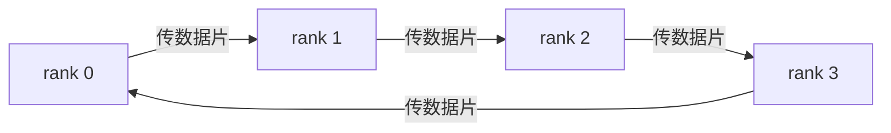
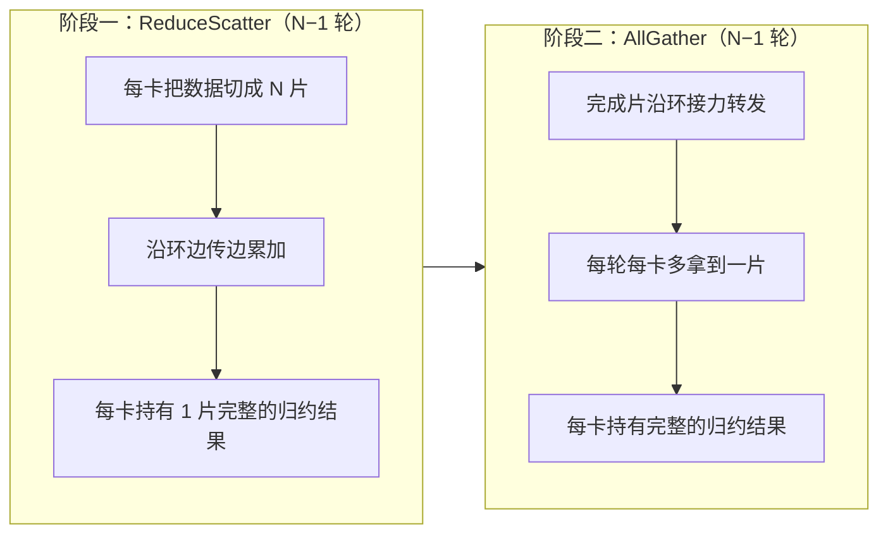

8 卡同步一次 7B 模型的梯度：最直觉的“先汇总到 rank 0 再分发”方案，要让 rank 0 独自接收 7 份共 **98 GB** 数据再发回去，其余 7 条链路全程闲着；而 Ring AllReduce 让 8 张卡围成一个逻辑环接力传递，**每张卡只收发约 24.5 GB**，在 900 GB/s 的 NVLink 上快了约 8 倍——而且卡数越多，差距越大。本文是《集群通信网络与NCCL》总览第 5 节的完整展开：把 Ring AllReduce 拆成 ReduceScatter 与 AllGather 两个阶段（6.1 讲过这个分解），用 4 卡数值算例逐轮走一遍，推导每卡通信量公式 $\frac{2(N-1)}{N} \times M$，最后回答两个问题：它凭什么“带宽最优”？又在哪一面付出了代价？

<!-- more -->

## 📑 目录

- [1. 为什么"先汇总到一家"行不通](#1-为什么先汇总到一家行不通)
- [2. 环形拓扑：让每条链路都忙起来](#2-环形拓扑让每条链路都忙起来)
- [3. 阶段一：ReduceScatter，边传边算](#3-阶段一reducescatter边传边算)
- [4. 阶段二：AllGather，把结果传遍全场](#4-阶段二allgather把结果传遍全场)
- [5. 通信量公式：为什么它几乎与卡数无关](#5-通信量公式为什么它几乎与卡数无关)
- [6. "带宽最优"：为什么不能再低](#6-带宽最优为什么不能再低)
- [7. 另一面：带宽最优 ≠ 延迟最优](#7-另一面带宽最优--延迟最优)
- [8. 动手实验：4 进程手工实现 Ring AllReduce](#8-动手实验4-进程手工实现-ring-allreduce)
- [9. 三个常见误区](#9-三个常见误区)
- [总结](#-总结)
- [自我检验清单](#-自我检验清单)
- [参考资料](#-参考资料)

---

## 1. 为什么“先汇总到一家”行不通

**先想清楚问题：给定 N 张卡，每张卡算出自己的梯度，怎么让所有卡都拿到“梯度之和”？**

> 按“任务→极限→失效→打破”四句链看：**任务**是 N 卡各持 M 梯度需人人得完整和，**极限**是 NVLink 900 GB/s / IB 50 GB/s 带宽墙，**失效**是中心化把 98 GB 压在 rank0（N=8,M=14GB 时收 98GB+发 98GB，109 ms+109 ms），**打破**是环上分片接力把每卡收发压到 $2(N-1)M/N\approx2M$（24.5 GB，约 27 ms）且与 N 解耦——本章拆两阶段如何实现。

最简单的方案不需要任何技巧：所有卡把完整梯度发给 rank 0，rank 0 逐元素求和，再把结果广播回去。打个比方，这就像让所有快递都先送到总仓库，由仓库统一分拣后再发往各地——**包裹路径简单，但总仓库必然堵车**。

用数字看看堵成什么样。假设 7B 模型用 BF16 训练，每张卡的梯度是 14 GB（7 × 10⁹ 个参数 × 2 字节）。8 卡的情况下：

| 📊 角色 | 接收 | 发送 | 链路状态 |
|--------|------|------|---------|
| rank 0 | 7 份 × 14 GB = **98 GB** | 7 份 × 14 GB = 98 GB | 全程满载（瓶颈） |
| 其余 7 卡 | 14 GB | 14 GB | 发完就干等，链路空闲 |

问题有两点，都很致命：

- **rank 0 成瓶颈**：它要独吞 196 GB 的流量。按机内 NVLink 4.0 的 900 GB/s 算（硬件带宽细节见 [5.7 多卡互联拓扑](/AIInfraGuide/prerequisites/模块一-前置知识/gpu/57-多卡互联拓扑)，这里直接用量级），收 98 GB 就要约 109 毫秒，收发合计约 218 毫秒——而 Ring AllReduce 整轮只要约 27 毫秒。
- **带宽利用率低**：N 卡中只有 rank 0 的链路在忙，其余 N-1 条链路大部分时间空闲，利用率约 $1/N$。卡数越多，浪费越严重：N=16 时 rank 0 要收 15 份（210 GB），几乎翻倍；而 Ring 每卡只从 24.5 GB 微涨到 26.25 GB。

📌 **关键点**：中心化方案的总通信量其实和 Ring 一样（都是 196 GB），区别全在“流量是否摊平”。中心化把所有流量压在一张卡上，**把“每卡 24.5 GB”变成了“rank 0 的 196 GB”**——瓶颈不是总量，是分布。

## 2. 环形拓扑：让每条链路都忙起来

**能不能让 8 条链路同时开工？**

Ring AllReduce 的想法很简单：把 N 张卡排成一个**逻辑环**，rank 0 → rank 1 → rank 2 → … → rank N-1 → rank 0，每张卡只和“逻辑上的左右邻居”通信，数据片沿环朝一个方向接力传递。



这张图讲的是**传递的约定顺序**：每张卡只跟左右两个邻居打交道，数据沿环单向流动。图中 4 条箭头构成的环对应下表 4 步状态迁移的接力路径，每步搬 $[M/4]\times2$B。

> 💡 **状态机一瞥（N=4 环，Byte 口径，HBM 驻留）**
> | 状态（持有） | 事件 | 动作（SRAM 内） | 新状态 |
> |---|---|---|---|
> | rank0:[a0,b0,c0,d0]… | 开始 ReduceScatter | 发 $[M/4]$ 片至下游，累加收片 | 每卡各持一片全局和 |
> | 每卡各持一片和 | 接力 N-1 轮 | 环上转发+累加 | ReduceScatter 完成：rank0 持 sum(a)… |
> | 每卡各持一片完整和 | 开始 AllGather | 环上转发完成片，存入 HBM | 每卡持 $[M]$ 完整结果 |
> 图中 R0→R1 的第 1 箭头对应表中“发 $[M/4]$ 片至下游”第 1 步，R3→R0 闭环箭头对应第 4 步汇合。就像全班同学手拉手围成一圈传纸条，你只需要“从左边同学手里接过来、递给右边同学”——不需要认识圈子里的每个人。

⚠️ **注意（第一个容易踩的坑）**：这里的“环”是**逻辑环，不是物理布线**。没有谁真的给 GPU 拉了一根环形网线。物理上，8 张 H100 是通过 NVSwitch 全互联的（见 [5.7 多卡互联拓扑](/AIInfraGuide/prerequisites/模块一-前置知识/gpu/57-多卡互联拓扑)），“rank i 传给 rank i+1”这条逻辑边到底走哪条物理路径，由通信库 NCCL 根据拓扑自动决定——这是 NCCL 的活，本章后面的 NCCL 篇（6.5）会专门讲。

**数据怎么分**：每张卡把自己手里的 14 GB 梯度**切成 N 片**（每片 $M/N$，本例 1.75 GB），然后进入两个阶段：



这张图是全文的地图：**阶段一负责“算”，阶段二负责“散”**。阶段一（ReduceScatter）结束后，归约结果已经被算完，但分散在 N 张卡上，每卡只持有一片；阶段二（AllGather）不做任何计算，只把完成片沿环转发 N-1 轮，让每张卡都拿到全部结果。下面用 4 卡的数值例子，把每一轮的动作都摆到桌面上。

## 3. 阶段一：ReduceScatter，边传边算

**第一个问题：N-1 轮怎么做到“每卡只发 (N-1) 片”就能算完所有归约？**

4 张卡，每卡持有 4 片数据，记为 A、B、C、D，数值如下（每卡一行）：

| 📊 rank | A 片 | B 片 | C 片 | D 片 |
|:------:|:----:|:----:|:----:|:----:|
| 0 | 1 | 2 | 3 | 4 |
| 1 | 5 | 6 | 7 | 8 |
| 2 | 9 | 10 | 11 | 12 |
| 3 | 13 | 14 | 15 | 16 |

我们的目标：算出每一片的全局和。先心算出来当“标准答案”：A = 1+5+9+13 = **28**，B = 2+6+10+14 = **32**，C = 3+7+11+15 = **36**，D = 4+8+12+16 = **40**。

传递规则一句话：**第 k 轮（k 从 0 数起），rank i 把第 $(i-k) \bmod 4$ 片传给下一家（rank i+1），同时从上一家收到第 $(i-k-1) \bmod 4$ 片，累加到本地对应的片上。**

💡 **提示**：$(x) \bmod 4$ 表示除以 4 的余数（负数时加 4 取正），比如 $(-1) \bmod 4 = 3$。规则看着绕，实际动作很简单——**每轮每卡只做三件事：发出一片、收到一片、把收到的加到本地**。

**第 1 轮**（k=0：rank i 发出自己的第 i 片）：

| rank | 动作（发出 → 收到） | 累加 |
|:----:|--------------------|------|
| 0 | 发 A=1 → rank1；收 D=16 ← rank3 | D：4 + 16 = 20 |
| 1 | 发 B=6 → rank2；收 A=1 ← rank0 | A：5 + 1 = 6 |
| 2 | 发 C=11 → rank3；收 B=6 ← rank1 | B：10 + 6 = 16 |
| 3 | 发 D=16 → rank0；收 C=11 ← rank2 | C：15 + 11 = 26 |

**第 2 轮**（k=1：rank i 发出第 $(i-1) \bmod 4$ 片，即上一轮收到的片）：

| rank | 动作（发出 → 收到） | 累加 |
|:----:|--------------------|------|
| 0 | 发 D=20 → rank1；收 C=26 ← rank3 | C：3 + 26 = 29 |
| 1 | 发 A=6 → rank2；收 D=20 ← rank0 | D：8 + 20 = 28 |
| 2 | 发 B=16 → rank3；收 A=6 ← rank1 | A：9 + 6 = 15 |
| 3 | 发 C=26 → rank0；收 B=16 ← rank2 | B：14 + 16 = 30 |

**第 3 轮**（k=2）：看看发生了什么——每张卡收齐了某一片的全部 4 份贡献：

| rank | 动作（发出 → 收到） | 累加 |
|:----:|--------------------|------|
| 0 | 发 C=29 → rank1；收 B=30 ← rank3 | B：2 + 30 = **32** ✅ |
| 1 | 发 D=28 → rank2；收 C=29 ← rank0 | C：7 + 29 = **36** ✅ |
| 2 | 发 A=15 → rank3；收 D=28 ← rank1 | D：12 + 28 = **40** ✅ |
| 3 | 发 B=30 → rank0；收 A=15 ← rank2 | A：13 + 15 = **28** ✅ |

3 轮结束，每张卡各持有一片**完整的全局和**：rank 0 有 B=32，rank 1 有 C=36，rank 2 有 D=40，rank 3 有 A=28——和“标准答案”一一对应。

📌 **关键点**：**没有任何一片数据被重复传输**。每片只沿环走了一段路，贡献在途中不断累加进部分和，N-1 轮后正好走完“自己的数据被其余 N-1 张卡各碰到一次”的全部路程。这就是“边传边算”的威力：归约在传递过程中就完成了，而不是先收齐再算。

## 4. 阶段二：AllGather，把结果传遍全场

**第二个问题：算完的结果只有 1/N 在自己手里，怎么让每张卡都拿到全部？**

不需要再算了——**纯转发**。每张卡把自己手里的完成片沿环传出去，每轮收到一片存起来，N-1 轮后人人持有全部 4 片。起点状态：rank 0 有 B=32，rank 1 有 C=36，rank 2 有 D=40，rank 3 有 A=28。

**第 1 轮**（把自己的完成片传给下一家）：

| rank | 动作（发出 → 收到） | 本轮后持有 |
|:----:|--------------------|-----------|
| 0 | 发 B=32 → rank1；收 A=28 ← rank3 | A、B |
| 1 | 发 C=36 → rank2；收 B=32 ← rank0 | B、C |
| 2 | 发 D=40 → rank3；收 C=36 ← rank1 | C、D |
| 3 | 发 A=28 → rank0；收 D=40 ← rank2 | D、A |

**第 2 轮**（转发上一轮刚收到的片）：

| rank | 动作（发出 → 收到） | 本轮后持有 |
|:----:|--------------------|-----------|
| 0 | 发 A=28 → rank1；收 D=40 ← rank3 | A、B、D |
| 1 | 发 B=32 → rank2；收 A=28 ← rank0 | A、B、C |
| 2 | 发 C=36 → rank3；收 B=32 ← rank1 | B、C、D |
| 3 | 发 D=40 → rank0；收 C=36 ← rank2 | A、C、D |

**第 3 轮**：

| rank | 动作（发出 → 收到） | 本轮后持有 |
|:----:|--------------------|-----------|
| 0 | 发 D=40 → rank1；收 C=36 ← rank3 | A、B、C、D = [28, 32, 36, 40] ✅ |
| 1 | 发 A=28 → rank2；收 D=40 ← rank0 | A、B、C、D = [28, 32, 36, 40] ✅ |
| 2 | 发 B=32 → rank3；收 A=28 ← rank1 | A、B、C、D = [28, 32, 36, 40] ✅ |
| 3 | 发 C=36 → rank0；收 B=32 ← rank2 | A、B、C、D = [28, 32, 36, 40] ✅ |

两阶段合计 6 轮，AllReduce 完成：**每张卡都持有 [28, 32, 36, 40]**，和 6.1 讲的 `AllReduce = ReduceScatter + AllGather` 分解完全对上。

## 5. 通信量公式：为什么它几乎与卡数无关

**现在可以回答文章标题的问题了：每张卡到底传了多少数据？**

数一数就能得到公式。每张卡的数据被切成 N 片，每片 $M/N$ 字节（Shape 守恒：$[M]\to N\times[M/N]$，每轮搬 $[M/N]\times2$B 从 HBM 经 SRAM 发至 NVLink）；ReduceScatter 阶段做 N-1 轮，每轮发一片，所以发 $(N-1) \times \frac{M}{N}$ 字节；  // 合计 $2(N-1)M/N\approx2M$ 时 Byte 下界与 N 无关AllGather 阶段同样再发 N-1 片。合计：

$$
\underbrace{\text{每卡总通信量}}_{\text{发出的字节数（接收量与之相同）}} = \underbrace{2}_{\text{ReduceScatter 与 AllGather 两个阶段}} \times \underbrace{(N-1)}_{\text{每阶段的轮数}} \times \underbrace{\frac{M}{N}}_{\text{每轮发一片的大小}} = \frac{2(N-1)}{N} \times M
$$

逐项说明符号的含义：$N$ 是参与归约的卡数；$M$ 是**每张卡参与归约的数据量**（在 7B BF16 例子里就是 14 GB 梯度）；每卡把 M 切成 N 片，所以每片是 $M/N$。注意公式里的是“发送量”——接收量和发送量完全对称，收发合计是它的两倍（实际链路上收发同时进行，耗时按单方向算）。

代入算例：N=8、M=14 GB 时——每片 $14/8 = 1.75$ GB；每阶段发 7 片共 12.25 GB；两个阶段合计 **24.5 GB**。在 900 GB/s 的 NVLink 4.0 上，$24.5 \div 900 \approx 27$ 毫秒，这就是第 1 节对比时用的数字。

⚠️ **注意（口径）**：总览文（primer §9.2 的表格）写的是“约 28 GB”——那是把 $(N-1)/N \approx 1$ 的近似结果 $\approx 2M = 28$ GB。N=8 时 $(N-1)/N = 7/8 = 0.875$，精确值是 24.5 GB，差 12.5%；N 越大误差越小（N=64 时 63/64 ≈ 0.98）。**本文统一用公式精确值 24.5 GB**，看到“约 28 GB”时知道它是“约等于 2M”的简写即可。

## 6. “带宽最优”：为什么不能再低

**通信量公式里最漂亮的性质：N 增大时，$(N-1)/N \to 1$，每卡通信量趋近 $2M$，与卡数基本无关。**

翻译成人话：**8 卡、64 卡、1024 卡，只要每卡的数据量 M 不变，每卡要传的字节数几乎一样**。回看第 1 节，中心化方案 rank 0 的负担随 N 线性增长；Ring 则把“每卡 24.5 GB”这个数字焊死了。这就是线性扩展性的来源——这也是为什么它是 DDP、ZeRO 等一切梯度同步方案的默认底座。

**能不能比 2M 更低？** 直觉论证如下（这是 Baidu 论文的分析思路，属于直觉论证而非严格证明）：每张卡最终要持有完整的 M 字节归约结果；其中自己的数据只占 $M/N$，其余 $(N-1)M/N$ 字节必须以部分和的形式**从链路进**到这张卡——接收侧的下界是 $(N-1)M/N$。发送侧对称：自己手里的 M 字节数据中，至少 $(N-1)M/N$ 必须**发出去**才能让其他 N-1 张卡的结果里包含自己的贡献（自己留着一片不传，因为它的贡献会在本地累加进最终结果）。收发合计下界就是：

$$
\underbrace{\frac{2(N-1)}{N} \times M}_{\text{每卡收发量的理论下界}} = \underbrace{\frac{2(N-1)}{N}}_{\text{随 N 增大趋近 2}} \times M
$$

代入第 5 节的数字验算：N=8、M=14 GB 时，下界 $= \frac{2 \times 7}{8} \times 14 = 24.5$ GB，与第 5 节算出的 Ring 每卡通信量一模一样——公式自洽，也正好验证 Ring 确实压到了下界。

而 Ring 每一轮每条链路都恰好传 $M/N$ 字节，不空转、不多传，**正好达到这个下界**——这就是“带宽最优（bandwidth-optimal）”的含义：给定链路带宽，数据传输耗时不可能再短（延迟另算，见下一节）。严格的最优性证明见 Patarasuk & Yuan 的论文（2009），Baidu 团队 2017 年把它引入深度学习，其后的 NCCL 文档也沿用“Ring 带宽最优”的结论。

💡 **提示**：这个下界论证有隐藏前提——数据可以在途中以“部分和”的形式合并（每份贡献不需要完整地到达每一张卡，合并后再转发即可），以及忽略协议开销、chunk 切分粒度等工程细节。所以它叫直觉论证；想读严格版本，去翻 Patarasuk & Yuan 2009 的分析。

## 7. 另一面：带宽最优 ≠ 延迟最优

**既然通信量已经压到理论下界，Ring AllReduce 还有短板吗？**

有，而且很致命：**端到端延迟随卡数线性增长**。整个算法要串行执行 $2(N-1)$ 轮——每一轮都必须等上一轮的数据到达才能开始（数据片在环上接力，一步等一步）。用延迟模型写出来：

$$
\underbrace{T}_{\text{端到端耗时}} = \underbrace{2(N-1)}_{\text{串行轮数}} \times \left( \underbrace{\alpha}_{\text{每轮固定开销（启动延迟）}} + \underbrace{\beta}_{\text{每字节传输时间}} \times \underbrace{\frac{M}{N}}_{\text{每轮传输一片}} \right)
$$

两个新符号的含义：$\alpha$（读作 alpha）是发起一轮通信的固定开销——握手、同步等待等，与数据大小无关，单位是秒；$\beta$（读作 beta）是传输 1 字节需要的时间，约等于 $1 / \text{带宽}$（比如 900 GB/s 带宽对应 $\beta \approx 1.1$ 皮秒/字节）。每轮要传一片 $M/N$ 字节，耗时 $\alpha + \beta \cdot M/N$。

把不同 N 代入，看“轮数翻倍、每轮数据减半”的效应：

| 📊 N | 串行轮数 $2(N-1)$ | 每轮数据量 | 端到端时间 T |
|:----:|:----------------:|:----------:|:------------|
| 8 | 14 | M/8 | $14\alpha + 1.75\beta M$ |
| 16 | 30 | M/16 | $30\alpha + 1.875\beta M$ |
| 1024 | 2046 | M/1024 | $2046\alpha + 1.998\beta M$ |

📌 **关键点**：看表中 $\beta M$ 的系数——1.75 → 1.875 → 1.998，几乎不变（这就是带宽最优：传的总字节数没变）；看 $\alpha$ 的系数——14 → 30 → 2046，线性暴涨。**两个极端场景由此而来**：

- **数据量大（M 大）**：$\beta$ 项主导，加卡几乎不增加耗时——Ring 的舒适区，梯度同步正是如此（14 GB 梯度时 $\beta$ 项合计约 $1.75 \times 14\text{ GB} \div 900\text{ GB/s} \approx 27$ 毫秒，$\alpha$ 项可忽略，和上一节的通信量结论对得上）。
- **数据量小（M 小）**：比如同步一个 loss 标量（M = 4 字节），$\beta M/N$ 趋近于 0，耗时约 $2(N-1)\alpha$——卡数翻倍，延迟就翻倍。N=1024 时 2046 轮的固定开销完全不可接受。

这就是总览文（primer §5.3）那条 ⚠️ 的完整展开——**带宽最优 ≠ 延迟最优**：Ring 用“每轮只传一点点”换来了带宽利用率的极限，代价是轮数线性增长。小数据场景怎么办？下一篇 6.3 的 Tree AllReduce 把延迟压到 $O(\log N)$，正是冲着这个短板来的（$\alpha$、$\beta$ 两个符号的详细账本分析见 6.3 第 2 节「α-β 延迟模型」）。

## 8. 动手实验：4 进程手工实现 Ring AllReduce

**光看表格不算数，把两阶段写进代码跑一遍，结果和 `dist.all_reduce` 逐元素一致，才算真的懂。**

下面这个脚本用 `dist.send` / `dist.recv` 手工实现本文的两阶段算法，用 gloo 后端，**没有 GPU 也能跑**（本机实测通过，torch 2.11）：

```python
# 6.2 动手实验：用 dist.send / dist.recv 手工模拟 Ring AllReduce
# 运行方式：python3 ring_demo.py（内部用 mp.spawn 拉起 4 个进程）
# 也可以：torchrun --nproc_per_node=4 ring_demo.py
# 代码要点：ReduceScatter（N-1 轮边传边累加）→ AllGather（N-1 轮纯转发）
import os
import torch
import torch.distributed as dist
import torch.multiprocessing as mp

N = 4          # 参与进程数（对应文章中的 4 卡）
M = 8          # 每进程持有的数据量（元素个数）；总数据量 = N × M = 32
CHUNK = M // N # 每片大小 = M / N = 2


def worker(rank: int, world_size: int):
    dist.init_process_group(backend="gloo", rank=rank, world_size=world_size)

    torch.manual_seed(42 + rank)
    data = torch.arange(M, dtype=torch.float32) * (rank + 1)  # rank 不同数值不同，方便核对
    chunks = data.view(N, CHUNK).clone()                      # 切成 N 片，对应文章的 [A,B,C,D]

    # 先让官方 dist.all_reduce 算一份"标准答案"，供最后对比
    expected = data.clone()
    dist.all_reduce(expected, op=dist.ReduceOp.SUM)

    # ---- 阶段一：ReduceScatter（N-1 轮，边传边累加）----
    # 第 step 轮：rank 把第 (rank - step) mod N 片传给下一家，
    # 同时接收上一家传来的第 (rank - step - 1) mod N 片，累加到本地对应片
    for step in range(N - 1):
        send_chunk = (rank - step) % N
        recv_chunk = (rank - step - 1) % N
        recv_buf = torch.zeros(CHUNK)
        if rank % 2 == 0:  # 偶数 rank：先发后收
            dist.send(chunks[send_chunk], dst=(rank + 1) % N)
            dist.recv(recv_buf, src=(rank - 1) % N)
        else:              # 奇数 rank：先收后发（避免阻塞式 send 互相等待造成死锁）
            dist.recv(recv_buf, src=(rank - 1) % N)
            dist.send(chunks[send_chunk], dst=(rank + 1) % N)
        chunks[recv_chunk] += recv_buf

    # 阶段一结束：rank i 持有第 (i+1) mod N 片的完整归约结果，先验证一下
    my_chunk = (rank + 1) % N
    assert torch.allclose(chunks[my_chunk], expected.view(N, CHUNK)[my_chunk]), "ReduceScatter 结果错误"

    # ---- 阶段二：AllGather（N-1 轮，纯转发，不再累加）----
    for step in range(N - 1):
        send_chunk = (rank + 1 - step) % N  # 第一轮发自己的完成片，之后转发刚收到的片
        recv_chunk = (rank - step) % N
        recv_buf = torch.zeros(CHUNK)
        if rank % 2 == 0:
            dist.send(chunks[send_chunk], dst=(rank + 1) % N)
            dist.recv(recv_buf, src=(rank - 1) % N)
        else:
            dist.recv(recv_buf, src=(rank - 1) % N)
            dist.send(chunks[send_chunk], dst=(rank + 1) % N)
        chunks[recv_chunk] = recv_buf

    # ---- 正确性验证：手工结果与官方 dist.all_reduce 逐元素对比 ----
    ok = torch.allclose(chunks.view(-1), expected)
    print(f"rank {rank}: 手工 Ring AllReduce 与 dist.all_reduce 一致 = {ok}")
    if rank == 0:
        print(f"rank 0: 归约结果 = {chunks.view(-1).tolist()}（每卡都应相同）")

    dist.destroy_process_group()
    assert ok, "手工实现与 dist.all_reduce 不一致！"


if __name__ == "__main__":
    os.environ.setdefault("MASTER_ADDR", "127.0.0.1")
    os.environ.setdefault("MASTER_PORT", "29515")
    if "RANK" in os.environ:   # torchrun 已设置好环境变量，直接进入 worker
        worker(int(os.environ["RANK"]), int(os.environ["WORLD_SIZE"]))
    else:                      # 普通 python3 运行，用 mp.spawn 拉起 4 个进程
        mp.spawn(worker, args=(N,), nprocs=N)
```

运行结果（本机实测）：

```
rank 0: 手工 Ring AllReduce 与 dist.all_reduce 一致 = True
rank 1: 手工 Ring AllReduce 与 dist.all_reduce 一致 = True
rank 2: 手工 Ring AllReduce 与 dist.all_reduce 一致 = True
rank 3: 手工 Ring AllReduce 与 dist.all_reduce 一致 = True
rank 0: 归约结果 = [0.0, 10.0, 20.0, 30.0, 40.0, 50.0, 60.0, 70.0]（每卡都应相同）
```

代码要点回顾：

- **轮次与片号的映射**：`(rank - step) % N` 和 `(rank + 1 - step) % N` 就是第 3、4 节表格里“发出哪一片”的规则，一处代码对应一张表。
- **为什么奇数 rank 先收后发**：`dist.send` 是阻塞调用，如果 4 个进程都先发送再接收，可能互相等对方先接收而死锁；让偶数先发、奇数先收，收发必然配对。生产环境通常改用 `isend`（异步发送）或直接调用 NCCL 原语，由库处理调度。
- **中间断言**：ReduceScatter 结束后立即检查自己那片是否等于标准答案，如果阶段一错了，立刻暴露，而不是等到最后。

⚠️ **注意**：这个实现是为了“看见两阶段”的教学版本，不是拿来替代 NCCL 的。真实场景直接用 `dist.all_reduce`，NCCL 会按拓扑选择算法和路径（6.5 讲）。但这 30 行代码跑通后，你对“24.5 GB 是怎么省出来的”会有切身的体感。

## 9. 三个常见误区

**误区 1：“Ring AllReduce 需要环形物理布线”** —— ❌ 错。环是**逻辑顺序**，只规定了数据沿“rank i → rank i+1”接力，不代表物理上拉了一根环形线。8 卡 H100 通过 NVSwitch 全互联（5.7），环上相邻节点之间的数据可能走完全不同的物理链路，路径选择是 NCCL 的事。

**误区 2：“Ring AllReduce 所有场景都是最优的”** —— ❌ 错。带宽最优只在**数据量大**时成立；数据量小（如 loss 标量）时，$2(N-1)$ 轮固定开销主导，延迟 $O(N)$，是明显的短板。NCCL 会按数据大小在 Ring 与 Tree 算法间自动切换（环境变量 `NCCL_ALGO` 可强制指定），这正是 6.3 的内容。

**误区 3：“通信量公式里的 M 是 N 张卡的数据总和”** —— ❌ 错。$\frac{2(N-1)}{N} \times M$ 里的 $M$ 是**每张卡参与归约的数据量**（7B BF16 例子 = 14 GB），每卡把它切成 N 片、每片 $M/N = 1.75$ GB；全集群数据总量是 $N \times M = 112$ GB，把它误当成公式里的 M 会把通信量算大 N 倍。顺带提醒：不同文章里小写 M 的口径可能不同（比如 primer §4.2 原语表格里 M 指所有卡数据之和），看公式前先确认定义，别混用。

## 📝 总结

1. **瓶颈在分布，不在总量**：中心化 AllReduce 总流量与 Ring 相同（8 卡都是 196 GB），但全部压到 rank 0（收 98 GB + 发 98 GB），其余链路空闲；Ring 把流量摊平到每卡 24.5 GB。
2. **两阶段分工**：ReduceScatter（N-1 轮边传边累加）把归约算完并分散存储，AllGather（N-1 轮纯转发）把完成片传遍全场；4 卡算例中每轮“发出哪片、收到哪片、累加结果”都有迹可循。
3. **通信量公式**：每卡发送量 $= \frac{2(N-1)}{N} \times M$，N=8、M=14 GB 时是 24.5 GB（primer 的 ~28 GB 是 $(N-1)/N \approx 1$ 的近似）；N 越大越趋近 $2M$，与卡数基本无关——带宽最优，下界直觉论证见 Baidu 论文（严格证明见 Patarasuk & Yuan 2009）。
4. **延迟是代价**：$T = 2(N-1)(\alpha + \beta M/N)$，轮数随 N 线性增长；大数据量时 $\beta$ 项主导（加卡无感），小数据量时 $\alpha$ 项主导（延迟 $O(N)$）——为 6.3 Tree AllReduce 埋下伏笔。
5. **动手是检验标准**：4 进程 `dist.send/recv` 手工实现两阶段，与 `dist.all_reduce` 逐元素一致，算法才算真懂。

## 🎯 自我检验清单

- 能解释中心化 AllReduce 的瓶颈，并算出 N=8、M=14 GB 时 rank 0 要收 98 GB、Ring 每卡只要 24.5 GB
- 能画出 N=4 的逻辑环拓扑，并说清“逻辑环”与物理布线的区别（衔接 5.7 与 6.5）
- 能手动走完 4 卡 ReduceScatter 的三轮，说出每轮每卡发出/收到哪一片、累加结果是多少
- 能手动走完 4 卡 AllGather 的三轮，说明为什么它是纯转发、不需要再计算
- 能推导每卡通信量 $\frac{2(N-1)}{N} \times M$，并代入 N=8、M=14 GB 算出 24.5 GB（误差不超过 10%）
- 能解释“约 28 GB”与 24.5 GB 的关系：$(N-1)/N \approx 1$ 的近似，N 越大误差越小
- 能复述“带宽最优”的直觉论证（每卡至少收发 $(N-1)M/N$，Ring 恰好达到），并说明它是直觉论证而非严格证明
- 能写出延迟模型 $T = 2(N-1)(\alpha + \beta M/N)$，解释 $\alpha$、$\beta$ 的含义，说出为什么小数据量场景 Ring 不占优
- 能用 `dist.send`/`dist.recv` 在 4 进程上手工实现两阶段 Ring AllReduce，并验证与 `dist.all_reduce` 一致
- 能指出“环形物理布线”“所有场景最优”“M 是数据总和”三个误区各自错在哪

## 📚 参考资料

- [Bringing HPC Techniques to Deep Learning - Baidu Research（2017，Ring AllReduce 出处，Andrew Gibiansky 博客解读）](https://andrew.gibiansky.com/blog/machine-learning/baidu-allreduce/)：原文含两阶段算法细节与 $2(N-1)K/N$ 通信量公式，脚注 [4] 指向带宽最优性证明
- [P. Patarasuk & X. Yuan, Bandwidth Optimal All-Reduce Algorithms for Clusters of Workstations, JPDC 69(2): 117–124, 2009](https://dl.acm.org/doi/10.1016/j.jpdc.2008.09.002)：环状 AllReduce 带宽最优下界的严格证明，即 Gibiansky 博客脚注 [4] 所指的期刊论文（DOI: 10.1016/j.jpdc.2008.09.002）
- [NVIDIA NCCL User Guide](https://docs.nvidia.com/deeplearning/nccl/user-guide/docs/)：官方文档，Overview 章节说明各集合通信原语与 Ring/Tree 算法
- [NCCL Environment Variables](https://docs.nvidia.com/deeplearning/nccl/user-guide/docs/env.html)：`NCCL_ALGO` 等算法选择环境变量的官方说明
- [PyTorch Distributed Documentation](https://pytorch.org/docs/stable/distributed.html)：`dist.send` / `dist.recv` / `dist.all_reduce` 的 API 参考
- 站内：[6.1 集合通信原语](/AIInfraGuide/prerequisites/模块一-前置知识/communication/61-集合通信原语)（AllReduce = ReduceScatter + AllGather 分解）；[5.7 多卡互联拓扑](/AIInfraGuide/prerequisites/模块一-前置知识/gpu/57-多卡互联拓扑)（NVLink/NVSwitch/InfiniBand 硬件细节）
