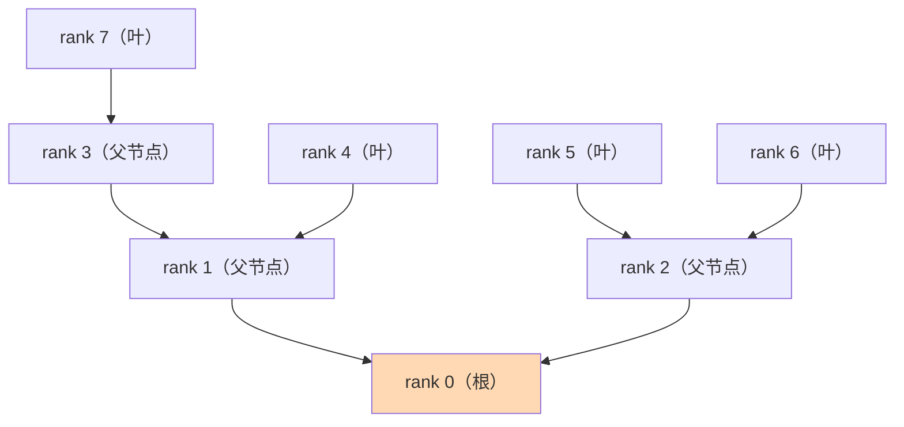
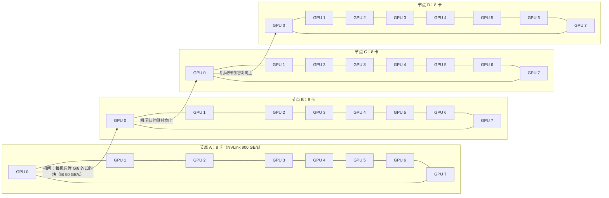

上一篇 6.2 的 Ring AllReduce 把带宽利用率做到了接近 100%，但代价是延迟随节点数线性增长：8 卡要 14 轮，64 卡要 126 轮。当同步的数据小到只有几十 KB（比如每步同步一个 loss 标量）时，带宽根本用不满，**延迟才是瓶颈**——而 Tree AllReduce 把步数从 $2(N-1)$ 压到 $2\lceil \log_2 N \rceil$：8 卡只要 6 步，64 卡只要 12 步，换来的代价是带宽利用率下降。这篇用 α-β 延迟模型把“什么时候选 Tree、什么时候选 Ring”算成一道可以套公式的选择题，再讲清楚 NCCL 里的两个升级版本——分层归约和双二叉树——以及为什么你会见到 `NCCL_ALGO` 这个环境变量。这是第 6 章“算法层”中算法选型的核心一篇：下一篇 6.4 讲通信与计算的时间怎么叠起来，6.5 讲这些算法在 NCCL 里具体怎么选、怎么调。

<!-- more -->

## 📑 目录

- [1. 问题：小数据场景下，延迟才是瓶颈](#1-问题小数据场景下延迟才是瓶颈)
- [2. α-β 延迟模型：一次通信的时间账本](#2-α-β-延迟模型一次通信的时间账本)
- [3. Tree AllReduce：两阶段，把延迟压到 O(log N)](#3-tree-allreduce两阶段把延迟压到-olog-n)
- [4. 为什么 Tree 的带宽利用率低：根节点瓶颈](#4-为什么-tree-的带宽利用率低根节点瓶颈)
- [5. 统一选型：小数据选 Tree，大数据选 Ring](#5-统一选型小数据选-tree大数据选-ring)
- [6. 分层 AllReduce：先机内归约，再跨机](#6-分层-allreduce先机内归约再跨机)
- [7. 双二叉树：NCCL 如何缓解根节点瓶颈](#7-双二叉树nccl-如何缓解根节点瓶颈)
- [8. NCCL 的算法切换：为什么有这个开关](#8-nccl-的算法切换为什么有这个开关)
- [9. 常见误区](#9-常见误区)
- [总结](#-总结)
- [自我检验清单](#-自我检验清单)
- [参考资料](#-参考资料)

---

## 1. 问题：小数据场景下，延迟才是瓶颈

**先回顾一个结论：Ring AllReduce 的延迟是 $O(N)$ 的，节点越多，等待链越长。**

6.2 讲过，Ring AllReduce 分 ReduceScatter 和 AllGather 两个阶段，每阶段 $N-1$ 轮，一共 $2(N-1)$ 轮。每一轮都依赖上一轮的结果——这是一条串行链，没法压缩。$N = 8$ 时是 14 轮，$N = 64$ 时是 126 轮，$N = 1024$ 时是 2046 轮。轮数跟着节点数线性涨，这就是 $O(N)$ 的含义。

**那“轮数多”什么时候真的会痛？答案是：数据很小的时候。**

训练里有一种数据天生就小：**loss 标量**。很多框架每步训练结束会把 loss 从所有卡上 AllReduce 一遍，用来打印和早停判断——一次只同步 8 个字节。还有调试用的梯度范数、学习率调度用的统计量，都是 KB 级的“小数据”。

想想看：同步 8 个字节，Ring 也要老老实实走 14 轮。每一轮真正传输数据的时间可以忽略，但**每一轮都有固定开销**（发起通信、握手、等待），这笔开销不会因为数据小就消失。数据越小，固定开销在总时间里占的比例越大——**传输时间退居其次，固定开销成了主角**。

打个比方：Ring 像一条 14 个站点的环形接力线，每个站点之间都要完成“交接手续”才能传下一个。如果你要送的只是一张小纸条，那 14 次交接手续的时间比纸条本身飞的时间还长得多。问题就来了：**能不能少设几个站点？** 这就是 Tree 的出发点。

## 2. α-β 延迟模型：一次通信的时间账本

**要定量回答“固定开销到底占多少”，需要一个把通信时间拆成两部分的模型：α-β 模型。**

一次通信的时间由两部分组成：

$$
\underbrace{T}_{\text{一次通信总时间}} = \underbrace{\alpha}_{\text{启动开销（与数据量无关的固定延迟）}} + \underbrace{\beta \times M}_{\text{传输开销（数据量 × 单位字节耗时）}}
$$

逐项看：$\alpha$（读作 alpha）是**启动开销**——发起一次通信的固定成本，包括软件调用、握手、传输准备，单位是秒（实际是微秒）。它和传多少数据无关：传 1 字节和传 1 KB，启动开销一样。$\beta$（读作 beta）是**每传输 1 字节需要的时间**，单位是秒/字节；$\beta$ 的倒数就是带宽：$B = 1/\beta$。$M$ 是本次通信的数据量（字节）。

💡 **提示**：这就是 5.7 里“时间 = 数据量 ÷ 带宽”的完整版——那个公式只算了 $\beta M$ 这一项，忽略了 $\alpha$。小数据时忽略 $\alpha$ 会严重低估通信时间。

代入数字感受一下。设 IB 链路上 $\alpha = 2\ \mu s$（RDMA 端到端延迟 1-2 微秒量级，见 primer 第 2 节），带宽 $B = 50\ GB/s$，则 $\beta = 1/50\ GB/s = 0.02\ \mu s/KB$：

- 传 $M = 8$ 字节（一个 loss 标量）：$T = 2 + 0.02 \times 0.008 \approx 2.00016\ \mu s$——**启动开销占了 99.99%**；
- 传 $M = 100\ MB$（10 万 KB）：$T = 2 + 2000 = 2002\ \mu s$——传输开销占了 99.9%。

📌 **关键点**：**α 项只随启动次数累加，与数据量无关；β 项随数据总量累加。小数据场景，β 项可以忽略，总时间 ≈ 启动次数 × α；大数据场景反过来，α 项可以忽略，总时间 ≈ 数据总量 × β。** 两个算法选谁，就是看哪一方的“启动次数 × α”和“数据总量 × β”加起来更小。

## 3. Tree AllReduce：两阶段，把延迟压到 O(log N)

**能不能少设站点？能——把环形接力线改成树形传话结构。**

Tree AllReduce 把 $N$ 个 rank 组织成一棵二叉树，通信分两个阶段：

- **阶段一 Reduce（归约，叶 → 根）**：每个叶子把自己的数据发给父节点，父节点累加后继续向上传。每一层的时间只够“相邻两层”完成一次收发，所以步数 = 树的层数 = $\lceil \log_2 N \rceil$；
- **阶段二 Broadcast（广播，根 → 叶）**：根节点把聚合好的完整结果逐层往下发，同样 $\lceil \log_2 N \rceil$ 步。

两个阶段合起来：

$$
\underbrace{2\lceil \log_2 N \rceil}_{\text{总步数（Reduce + Broadcast 各 } \lceil \log_2 N \rceil \text{ 步）}} 
$$

$\lceil \cdot \rceil$ 是向上取整：$N$ 不是 2 的幂时（比如 6 卡），层数按 2 的幂向上取。$N=8$ 时 $\lceil \log_2 8 \rceil = 3$，总步数 $2 \times 3 = 6$ 步；对比 Ring 的 $2(N-1) = 14$ 轮——**少了一半还多**。$N=64$ 时 Tree 是 $2 \times 6 = 12$ 步，Ring 是 126 轮，差距拉大到 10 倍。

这张图讲的是 8 个 rank 的二叉树拓扑（简化示意，实际 NCCL 建树还考虑物理拓扑）：**rank 0 是根，rank 1、2、3 是中间节点，rank 4-7 是叶子**，共 3 层。阶段一，箭头方向自下而上（叶 → 根）：第 1 步 rank 7 归约到 rank 3；第 2 步 rank 3、4 归约到 rank 1，rank 5、6 归约到 rank 2；第 3 步 rank 1、2 归约到 rank 0，rank 0 拿到完整结果。阶段二方向反过来，rank 0 逐层向下广播，又是 3 步。总步数 3 + 3 = 6，和公式 $2\lceil \log_2 N \rceil$ 对上。

用数字对比一下两种算法（$N = 8$，每步耗时 = $\alpha + \beta \times \text{每步数据量}$，$\alpha = 2\ \mu s$）：

| 📊 指标 | Ring AllReduce | Tree AllReduce |
|---|---|---|
| 总步数 | $2(N-1) = 14$ 轮 | $2\lceil \log_2 N \rceil = 6$ 步 |
| 每 rank 总通信量 | $\frac{2(N-1)}{N}M \approx 1.75M$ | 约 $2M$（叶子级别/最优情形，内部节点更高，见下节） |
| 延迟（步数 × α） | $14\alpha$ | $6\alpha$ |
| 带宽利用率 | 接近 100%（大数据量） | 较低（根节点是瓶颈） |
| 最适场景 | 大张量（梯度同步） | 小数据（loss、标量指标） |

📌 **关键点**：**Tree 用“多传一点数据”换“少走几步”**。步数从 14 降到 6，α 项成本直接砍掉 57%；代价是每层每个节点要处理的字节数变多，β 项成本上升。小数据时 α 项是主角，Tree 稳赢；大数据时 β 项是主角，Ring 反超——第 5 节用公式算给你看。

## 4. 为什么 Tree 的带宽利用率低：根节点瓶颈

**Tree 步数少，为什么 NCCL 不永远用它？因为它的带宽利用率上不去，根节点是天然的瓶颈。**

Ring 的妙处在于“流水线满载”：每个 rank 每轮都在同时收发，所有链路、所有节点一刻不闲，带宽利用率接近 100%。Tree 做不到这一点，原因有两层：

**第一层：负载不均。** 越靠近根，节点要处理的数据越多。注意归约不会让消息变大：每条边上传输的仍是 $M$ 字节，但**越靠根，节点每层经手的链路越多**。假设每个 rank 有 $M$ 字节（$N=8$ 二叉树）：叶子归约阶段向上传 $M$、广播阶段向下收 $M$，合计 $2M$；中间节点收 $2M$（两个叶子各 $M$），合并后向上只传 $M$，广播阶段再向下发 $2M$；根节点归约阶段收 $2M$（两个子节点各 $M$）、广播阶段发 $2M$，**每层经手约 $2M$**。两个阶段合计：叶子 $2M$，根节点 $4M$（收 $2M$ + 发 $2M$）——**根节点负载是叶子的 2 倍**，而它只有有限的链路——**整棵树的吞吐被根节点卡死**，其他节点再闲也只能等它。

**第二层：无法全部并行。** Ring 里所有链路同时工作；Tree 里同一层的链路可以并行，但**不同层之间是串行的**——第 2 步必须等第 1 步完成。层数越深，空闲的链路越多。树结构决定了它天生没法让所有链路都满载。

打个比方：Ring 是环形流水线，每个工位同时往传送带上放货，整条线满载运转；Tree 是**快递分拣**——所有分拣站把包裹一层层往总仓送，总仓只有几个收货口，前面再快的传送带，最终吞吐都被总仓的收货口限死。带宽利用率低，不是实现没做好，是**树结构本身的数学属性**。

⚠️ **注意**：这里说的“带宽利用率低”是相对 Ring 而言，且特指**简单二叉树**。NCCL 实际用的双二叉树（第 7 节）把数据拆成两半用两棵树并行传，能把带宽利用率拉回与 Ring 同级——但那是“多棵树分工”换来的，单棵树的根节点瓶颈依然存在。

## 5. 统一选型：小数据选 Tree，大数据选 Ring

**现在把两种算法塞进 α-β 模型，算出“什么时候选谁”的精确判据。**

设 $N$ 个 rank、总数据量 $M$、每步启动开销 $\alpha$、单位字节耗时 $\beta$。

**Ring 的总时间**：$2(N-1)$ 轮，每轮传一个分片 $M/N$，每轮耗时 $\alpha + \beta \cdot \frac{M}{N}$：

$$
T_{\text{ring}} = \underbrace{2(N-1)}_{\text{总轮数}} \times \left( \underbrace{\alpha}_{\text{每轮启动开销}} + \underbrace{\beta \cdot \frac{M}{N}}_{\text{每轮传输一个分片}} \right)
$$

**Tree 的总时间**：$2\lceil \log_2 N \rceil$ 步，每步每个节点处理的数据量记为 $M'$（树中每层单节点的实际搬运量；简单二叉树约为全量 $M$，NCCL 双二叉树约 $M/2$——**$M'$ 的精确表达式随树结构和分片方式变化，此处定性呈现，细节待核实**）：

$$
T_{\text{tree}} = \underbrace{2\lceil \log_2 N \rceil}_{\text{总步数}} \times \left( \underbrace{\alpha}_{\text{每步启动开销}} + \underbrace{\beta \cdot M'}_{\text{每步传输开销}} \right)
$$

💡 **提示**：这是教科书上常用的**延迟-带宽模型**（也叫 Hockney 模型），作用不是精确预测某次通信的微秒数，而是**量级判断**：α 项乘以“步数”，β 项乘以“每步数据量”。两个公式一比就看出本质——**Ring 的步数多但每步数据少，Tree 的步数少但每步数据多**。

代入数值算例（$N = 8$，$\alpha = 2\ \mu s$，$\beta = 0.02\ \mu s/KB$，Tree 按 $M' \approx M/2$ 估算）：

**算例一：小数据 $M = 4\ KB$（同步几个 loss 标量）**

- Ring：$14 \times (2 + 0.02 \times 0.5) = 14 \times 2.01 \approx 28.1\ \mu s$；
- Tree：$6 \times (2 + 0.02 \times 2) = 6 \times 2.04 \approx 12.2\ \mu s$。

**Tree 快约 2.3 倍。** 两个时间几乎全是 α 项（28 μs 里 27.9 μs 是启动开销），数据本身只占零头。

**算例二：大数据 $M = 1\ GB$（一次完整的梯度同步）**

- Ring：$14 \times (2 + 0.02 \times 131072) \approx 14 \times 2621 \approx 36.7\ ms$；
- Tree（简化模型 $M' = M/2$）：$6 \times (2 + 0.02 \times 524288) \approx 6 \times 10486 \approx 62.9\ ms$。

**Ring 快约 1.14 倍（真实通信量口径；简化模型算出的 1.7 倍是高估）。** 此时 α 项可以忽略，比的就是 $\frac{2(N-1)}{N}M$ 和 $2 \cdot \frac{M}{2} \cdot \lceil \log_2 N \rceil$ 谁小——Ring 每 rank 传约 $1.75M$；Tree 按“每步传输量直接相加”的简化模型算约 $3M$，但这是**高估**：真实管道化的双二叉树里每个 rank 收发总量约 $2M$（NVIDIA 博客口径：“each rank will at most receive half of the data twice and send half of the data twice”，即最多收发 $2M$），与 Ring 同级。所以大数据下 Ring 的真实优势约 $\frac{2M}{1.75M} \approx 1.14$ 倍，而非 1.7 倍量级——优势仍在（$2M > 1.75M$），只是幅度没有简化模型暗示的那么夸张；上面的 62.9 ms 是按简化模型推算的高估值。

📌 **关键点（落成一句话的规则）**：

- ✅ **数据小（KB 级及以下，步数是主要开销）** → 选 **Tree**：少走几步，省下大量 α 项；
- ✅ **数据大（MB 级以上，带宽是主要开销）** → 选 **Ring**：每 rank 通信量更少，带宽利用率高；
- ❌ 不要凭感觉定算法——**先用 $\alpha$、$\beta$、$M$、$N$ 套公式粗算一遍**，再用 `nccl-tests` 实测确认（交叉点大约出现在“中等大小”附近，具体值依赖硬件拓扑，以上算例为简化模型推算，实际以实测为准）。

## 6. 分层 AllReduce：先机内归约，再跨机

**上面的 Tree 假设所有 rank 地位平等。但真实集群不是平的——机内 NVLink 900 GB/s，机间 IB 只有 50 GB/s，差 18 倍（见 5.7）。怎么把“不等价”利用起来？分层：先机内、再机间。**

“少跨机”是分层的核心动机。想一个最常见的集群配置：**8 卡 × 4 机 = 32 卡**，每机 8 卡走 NVLink 全互联，机间走 IB。如果 32 卡拉成一个平铺的 Ring 或 Tree，所有数据都会在 IB 上走一遍——而 IB 比 NVLink 慢 18 倍，这是最贵的路。

分层 AllReduce（也叫两阶段 / hierarchical 归约）的思路是**把 32 卡的 AllReduce 拆成三步**，以梯度总大小为 $G$ 为例：

1. **机内归约 + 分片（ReduceScatter）**：每台机器内部 8 卡先做一次 Ring ReduceScatter（走 NVLink，快），每卡得到 $G/8$ 的归约块。此时每台机器内部分散地“凑齐”了完整聚合结果——**完整数据已经在这台机器里了，只是分散在 8 张卡上**；
2. **机间同步**：4 台机器之间，只需要把每个节点的代表块（$G/8$）做一次机间 AllReduce（走 IB）。**跨机的数据量从 $G$ 降到 $G/8$**；
3. **机内分发（AllGather）**：机间结果回来后，每台机器内部再做一次 AllGather（走 NVLink），让 8 张卡都拿到完整结果。

这张图讲的是 32 卡（8 卡 × 4 机）的分层 AllReduce 结构：**每个节点框内是 8 卡的环形 ReduceScatter / AllGather（走 NVLink，图中实线环）；4 个节点之间只用一条瘦链路做机间归约（走 IB，图中箭头）**。机内环在快路上跑满，机间只传 $G/8$ 的小块数据——把最贵的 IB 流量压到原来的 1/8。图中箭头仅示意机间归约的方向，实际机间 AllReduce 是双向的（环形或树形）：归约结果沿反向分发回每台机器，再靠机内 AllGather 发到全部 8 卡。

**为什么能只传 $G/8$？** 因为归约是“可交换、可结合”的加法：先把每台机器里 8 张卡的梯度加起来，得到一台机器的总梯度；4 台机器的总梯度再相加，结果和“32 张卡直接全部相加”完全一样。**先做哪一步归约不影响最终答案，只影响数据在哪条路上走**——那就先在小范围内归约，把跨机数据变小。

📌 **关键点**：分层归约不是一个新的“原语”，而是**利用拓扑的“装配方式”**——把“平的”Ring/Tree 按“机内 + 机间”拆成两级，让慢链路上跑小数据、快链路上跑大数据。这正是 hierarchical ring 的做法（NCCL 2.4 官方博客将其作为对照方案描述，三阶段“机内 reduce-scatter → 机间 all-reduce → 机内 all-gather”的原文引用准确）；NCCL 自己则通过拓扑感知建环/建树实现类似的跨机优化。8 卡 × 4 机 = 32 卡只是用来建立直觉的最小例子，层级可以继续嵌套（机架内、机架间、数据中心间）。

## 7. 双二叉树：NCCL 如何缓解根节点瓶颈

**分层解决了“跨机慢”，但第 4 节的根节点瓶颈还摆在那里：根节点每层收发全量数据，是 Tree 的带宽短板。NCCL 的解法是：一棵树不够，就用两棵。**

**双二叉树（double binary tree）**是 NCCL 从 MPI 世界借来的经典结构（MPI 社区 2009 年提出，NCCL 2.4 引入，NVIDIA 官方博客明确记载）。它的构造方法很巧妙：在一棵二叉树里，一半左右的 rank 是内部节点、一半是叶子；那就**把第二棵树建成第一棵的“镜像”**——第一棵里的叶子，在第二棵里当节点；第一棵里的节点，在第二棵里当叶子。两棵树合在一起：

- **没有哪个 rank 永远当根**：树 A 的根是 rank 0，树 B 的根换成另一个 rank，根节点负载被两棵树轮流扛（简化说法：两棵树轮流当根，细节以 NCCL 源码 `double_binary_tree` 相关实现为准，待核实）；
- **数据分半并行**：树 A 负责归约前一半数据（$M/2$），树 B 负责后一半（$M/2$），两棵树同时工作——每层每节点实际搬运量约 $M/2$ 而不是 $M$；
- **步数不变，带宽拉回**：两棵树并行，总步数还是 $2\lceil \log_2 N \rceil$，但每个 rank 收发总量约 $2M$，与 Ring 同级——NVIDIA 博客原话：“in terms of data sent/received, as optimal as rings”。

💡 **提示**：双二叉树的本质是**“把一条慢的宽通道换成两条窄的快通道”**——单棵树时根节点要顺序处理全量数据；两棵树并行后，每个根只处理一半，另一个根处理另一半，根节点吞吐翻倍。这和“流水线拆成两段并行”是同一类思想：**让原本串行的资源并行起来**。

NCCL 2.4 在 Summit 超算上把 Tree 测试到了 **24,576 张 GPU**：相比 Ring，延迟在 2.4 万卡规模下最多改善约 **180 倍**（官方博客数据），带宽在跨 L3 交换机后略有下降。这也是 NCCL 文档里把 Tree 定位为“面向大规模集群和中小消息”的原因。

## 8. NCCL 的算法切换：为什么有这个开关

**既然 NCCL 已经实现了 Ring、Tree、分层、双二叉树，谁来决定用哪个？答案是 NCCL 自己——按消息大小和拓扑自动选。那 `NCCL_ALGO` 这个开关又是干什么的？**

NCCL 的自动选择机制（以官方博客和源码 tuning 逻辑为准，细节随版本变化）：

1. 初始化时探测硬件拓扑（NVLink 有几条、IB 在哪、哪些卡在一个节点里），构建通信图；
2. 对每个可用的（算法， 协议）组合，用类似 α-β 模型的代价函数估计耗时——小消息时 α 项占主导，Tree 的估计值更小；大消息时 β 项占主导，Ring 的估计值更小；
3. 运行时按本次消息大小选估计耗时最小的组合。NVIDIA 官方博客的原话是：**“NCCL automatically switches back to rings when that pattern results in greater bandwidth”**（当 Ring 带来更高带宽时，NCCL 自动切回 Ring）。

这个自动切换对上层框架（PyTorch 等）完全透明——你调用 `dist.all_reduce`，NCCL 在底下悄悄决定跑哪个算法。**绝大多数情况下你不需要干预**。

那为什么还需要 `NCCL_ALGO` 这个环境变量？三个理由：

- **对比测试**：想验证“我的场景是不是该用 Tree”，手动强制 `NCCL_ALGO=Tree` 和 `NCCL_ALGO=Ring` 各跑一遍 `nccl-tests`，用实测数字说话；
- **绕过估计错误**：自动选择的代价模型是**估计值**，在极端拓扑、新型网络或特定消息大小下可能选错，手动强制是最后的兜底；
- **诊断问题**：怀疑算法相关故障时，强制切换是二分定位的第一步。

⚠️ **注意（强制开关有代价）**：`NCCL_ALGO=Tree` 不是万灵药。NCCL 的 Tree 算法并非对所有集合操作都可用——GitHub issue #317 记录了一个真实先例：用户在多机 Horovod 训练里强制 `NCCL_ALGO=Tree`，直接报 **“No algorithm/protocol available”** 错误。原因在源码 `src/graph/tuning.cc` 的 `ncclSetThresholds()`：`if (coll != ncclCollAllReduce && a == NCCL_ALGO_TREE) continue;`——**非 AllReduce 操作（如训练开始时的 Broadcast）与 Tree 组合的带宽被置 0**，NCCL 认为不可用，于是报错。**强制前先确认你的 NCCL 版本和操作类型支持该算法**；`NCCL_ALGO` 的完整取值枚举（Ring / Tree / CollNet 系列 / NVLS 系列 / PAT 等，各版本不同）和详细用法放在 6.5，本篇只回答“为什么有这个开关”。

## 9. 常见误区

**误区一：“Tree 一定比 Ring 快。”**

❌ 错。第 5 节算过：1 GB 大数据时 Tree 比 Ring 慢约 1.14 倍（简化模型会算出 1.7 倍，那是高估）——Tree 每 rank 总通信量约 $2M$，Ring 只有 $\frac{2(N-1)}{N}M \approx 1.75M$，数据越大 Ring 的优势越明显。**Tree 只在 α 项主导（小数据）时赢**。正确的说法是：“小数据 Tree 快，大数据 Ring 快，NCCL 会自动切换。”

**误区二：“树越宽越好，每层多几个孩子就能更快。”**

❌ 错。把二叉树改成高扇出树（每个节点 8 个孩子），层数确实更少，但**每层带宽的下界被卡死**：一个节点能同时向孩子发的数据，受限于它自己的链路带宽。第 4 节说过，树结构每层串行、根节点汇聚，这是结构属性——**扇出增大只能减少步数，不能增加总带宽，根节点每层要处理的数据反而更多**。NCCL 实际建树还要考虑物理拓扑（尽量让一条链路只服务邻近节点），“宽”不是免费的。

**误区三：“训练慢就强制 `NCCL_ALGO=Tree`，肯定能提速。”**

❌ 错，而且可能直接报错。第 8 节的 issue #317 就是反例——强制 Tree 后遇到不支持的集合操作（Broadcast），报 “No algorithm/protocol available”，训练直接崩。**正确的排查顺序**：先用 `nccl-tests` 测出当前算法的实际带宽和延迟（对照 primer 8.5 的 `busbw` 判读），确认瓶颈确实是算法选择，再用 `NCCL_DEBUG=INFO` 看 NCCL 自己选了什么算法、为什么，最后才考虑强制覆盖，并且先在单机小规模验证。

## 📝 总结

1. **问题本质**：Ring 延迟 $O(N)$，小数据场景（loss 标量、统计量）下 α 项主导，14 轮（8 卡）的启动开销比数据本身贵得多——“少设站点”的诉求催生了 Tree。
2. **α-β 模型是选型统一判据**：$T_{\text{ring}} = 2(N-1)(\alpha + \beta M/N)$，$T_{\text{tree}} = 2\lceil \log_2 N \rceil(\alpha + \beta M')$（$M'$ 随树结构变化，细节待核实）；小数据 Tree 赢（算例 4 KB 时快 2.3 倍），大数据 Ring 赢（算例 1 GB 时按真实通信量口径快约 1.14 倍，简化模型算出的 1.7 倍为高估）。
3. **Tree 的代价**：根节点每层经手约 $2M$（负载是叶子的 2 倍）、层间串行，带宽利用率低——**步数换带宽，是树结构本身的数学属性**。
4. **两个工程升级**：分层 AllReduce 利用“机内 NVLink 快、机间 IB 慢”的拓扑，把 32 卡（8 卡 × 4 机）的跨机流量从 $G$ 压到 $G/8$；双二叉树（NCCL 2.4 引入）用两棵互补树轮流当根、各处理 $M/2$，把带宽拉回与 Ring 同级，官方实测 2.4 万卡下延迟比 Ring 最多改善约 180 倍。
5. **NCCL 自动切换 + 手动开关**：NCCL 按消息大小自动在算法间切换，`NCCL_ALGO` 用于对比测试和兜底；强制 Tree 可能报 “No algorithm/protocol available”（issue #317 先例），先测再改。

## 🎯 自我检验清单

- 能用 α-β 模型写出一次通信的时间 $T = \alpha + \beta M$，并解释为什么小数据时 α 项主导（算例：8 字节时启动开销占 99.99%）
- 能写出 Ring 和 Tree 的总时间公式 $T_{\text{ring}} = 2(N-1)(\alpha + \beta M/N)$、$T_{\text{tree}} = 2\lceil \log_2 N \rceil(\alpha + \beta M')$，并说明每一项的含义
- 能手算 $N=8$ 时两种算法的步数（14 轮 vs 6 步），误差为 0，并画出 8 节点二叉树的两阶段（Reduce / Broadcast）数据流
- 能解释为什么 Tree 的带宽利用率低（根节点每层经手约 $2M$、负载是叶子的 2 倍、层间串行），并指出“树越宽越好”错在哪里
- 能根据给定 $\alpha$、$\beta$、$M$、$N$ 判断选 Tree 还是 Ring（判据：比较 $2(N-1)(\alpha+\beta M/N)$ 与 $2\lceil\log_2 N\rceil(\alpha+\beta M')$ 的大小），估算误差不超过 50% 即可（模型为量级判断）
- 能用“8 卡 × 4 机 = 32 卡”的例子讲清分层 AllReduce 的三步（机内 ReduceScatter → 机间归约 → 机内 AllGather），并说明为什么跨机流量能降到 $G/8$
- 能解释双二叉树的构造（两棵互补树、轮流当根、各处理一半数据）以及它如何把带宽拉回与 Ring 同级
- 能说出 NCCL 自动切换算法的依据（消息大小 × 拓扑的代价估计），并复述官方博客“数据量大时自动切回 Ring”的原话结论
- 能说明 `NCCL_ALGO` 开关的三种正当用途（对比测试、绕过估计错误、诊断），并复述 issue #317 报错场景（强制 Tree + Broadcast → “No algorithm/protocol available”）
- 能用 `nccl-tests` 对比 Ring 与 Tree 在小数据和大数据下的实测耗时，并解释结果与 α-β 模型预测是否一致

## 📚 参考资料

**官方文档**

- [NCCL Environment Variables（官方文档）](https://docs.nvidia.com/deeplearning/nccl/user-guide/docs/env.html)：`NCCL_ALGO` 完整取值与各版本可用性表（Ring/Tree 自 2.5 起、CollNet 系列、NVLS、PAT 等）
- [NCCL Release Notes](https://docs.nvidia.com/deeplearning/nccl/release-notes/)：各版本特性（Tree 算法相关变更以各版本 release notes 为准）
- [Massively Scale Your Deep Learning Training with NCCL 2.4（NVIDIA 官方博客）](https://developer.nvidia.com/blog/massively-scale-deep-learning-training-nccl-2-4/)：双二叉树引入版本（NCCL 2.4）、24,576 GPU 实测（延迟最多改善约 180 倍）、“数据量大时自动切回 Ring”原话
- [NCCL GitHub Issue #317：No algorithm/protocol available when NCCL_ALGO is set to Tree](https://github.com/NVIDIA/nccl/issues/317)：强制 Tree 对非 AllReduce 操作报错的真实先例与源码定位（`src/graph/tuning.cc`）

**论文与学术**

- [Sanders, Speck & Träff (2009), Two-tree algorithms for full bandwidth broadcast, reduction and scan](https://link.springer.com/chapter/10.1007/978-3-642-03770-2_8)：双二叉树在 MPI 中的原始论文
- [Patarasuk & Yuan (2009), Bandwidth Optimal All-reduce Algorithms for Clusters of Workstations](https://ieeexplore.ieee.org/document/5169783)：Ring AllReduce 步数 $2(N-1)$ 与带宽最优性的原始出处
- [Hu et al. (2025), Demystifying NCCL: An In-depth Analysis of GPU Communication Protocols and Algorithms](https://arxiv.org/abs/2507.04786)：NCCL 算法/协议选择逻辑的系统分析（ETH Zürich）

**站内延伸**

- [第 6 章 集合通信基础（章首页）](/AIInfraGuide/prerequisites/模块一-前置知识/第6章-集合通信基础)：本章导览；[6.2 Ring AllReduce](/AIInfraGuide/prerequisites/模块一-前置知识/communication/62-ring-allreduce) 的通信量推导、[6.5 NCCL 实战](/AIInfraGuide/prerequisites/模块一-前置知识/communication/65-nccl实战) 的环境变量总表与 nccl-tests 用法
- [5.7 多卡互联拓扑](/AIInfraGuide/prerequisites/模块一-前置知识/gpu/57-多卡互联拓扑)：NVLink / NVSwitch / InfiniBand 的带宽量级与“机内机外差 18 倍”的物理基础
