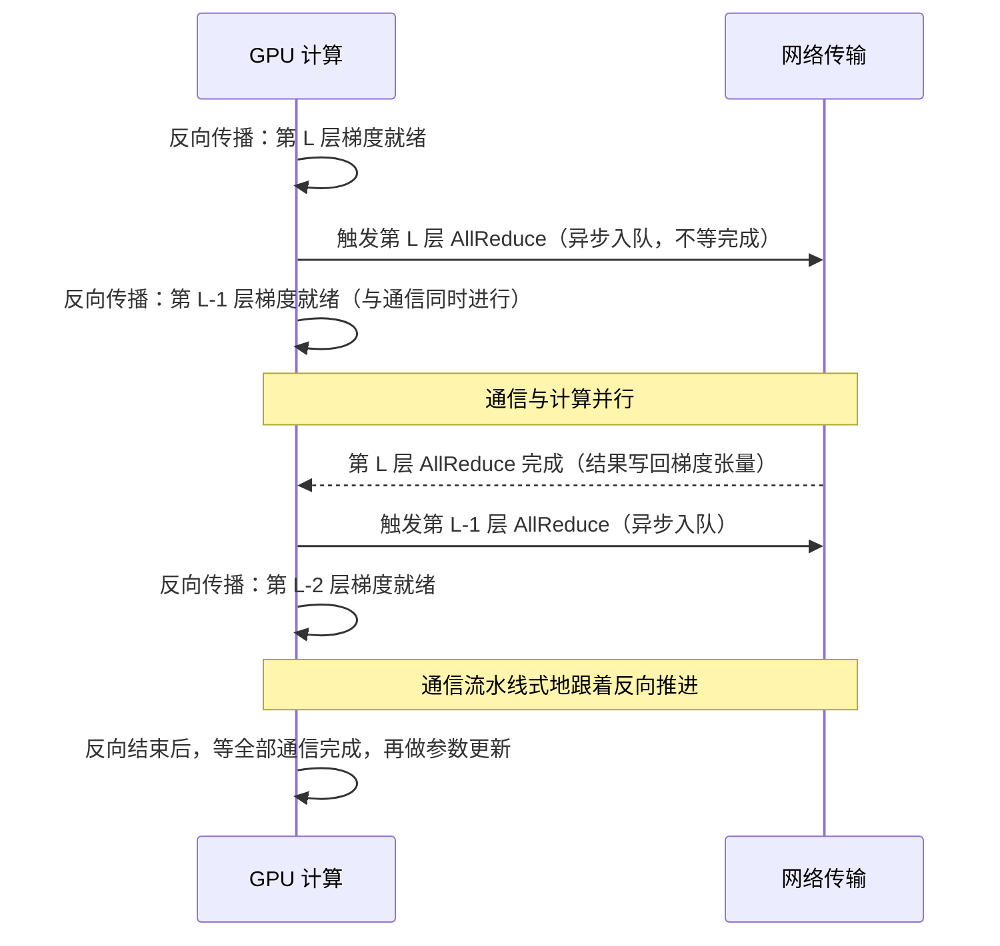

一次 8 卡 DDP（Distributed Data Parallel，分布式数据并行）的梯度 AllReduce，串行做要花约 **27 毫秒**（7B 模型 14 GB 梯度，按 Ring 口径每卡实际收发 24.5 GB ÷ NVLink 900 GB/s）；而一步训练大约 1~2 秒——27 ms 只占约 **2%**。这 2% 看起来可以不在乎，但它是“每步只同步一次、且能藏进反向计算”时的数字：一旦通信卡在关键路径上（比如张量并行每层都要等 AllReduce），同样的等待要乘上每步几十次的频率，训练时间直接崩盘。本文把“**把通信藏进计算时间里**”这件事讲透：为什么反向传播天然能藏、DDP 的 bucket 机制怎么自动做到、bucket 大小怎么调、以及“异步”在底层到底是什么语义。带宽账（NVLink 900 GB/s vs InfiniBand 50 GB/s）在 [5.7 多卡互联拓扑](/AIInfraGuide/prerequisites/模块一-前置知识/gpu/57-多卡互联拓扑)算过，AllReduce 的通信量公式来自 [6.1 集合通信原语](/AIInfraGuide/prerequisites/模块一-前置知识/communication/61-集合通信原语)——本篇只关心一件事：**通信的等待，能不能不算数**。

<!-- more -->

## 📑 目录

- [1. 先算一笔账：不 Overlap 的代价](#1-先算一笔账不-overlap-的代价)
- [2. 为什么反向传播天然能 Overlap](#2-为什么反向传播天然能-overlap)
- [3. DDP 的 bucket 机制：把“边算边传”落地](#3-ddp-的-bucket-机制把边算边传落地)
- [4. bucket 大小怎么调：U 形权衡](#4-bucket-大小怎么调u-形权衡)
- [5. 异步的底层语义：stream、事件与流水线化](#5-异步的底层语义stream事件与流水线化)
- [6. 不 Overlap 的代价与 Overlap 的上限](#6-不-overlap-的代价与-overlap-的上限)
- [7. 相邻话题：梯度压缩与梯度累积](#7-相邻话题梯度压缩与梯度累积)
- [8. 三个常见误区](#8-三个常见误区)
- [总结](#-总结)
- [自我检验清单](#-自我检验清单)
- [参考资料](#-参考资料)

---

## 1. 先算一笔账：不 Overlap 的代价

**先回答一个最基础的问题：一次梯度同步到底要花多久？**

### 1.1 一笔账：27 毫秒怎么来的

传输时间只有一个公式，先给直觉：**时间 = 数据量 ÷ 带宽**——传送带运货，货越多越慢，传送带越快越省时（这个公式在 5.7 第 5 节推过，这里直接沿用）：

$$
\underbrace{T}_{\text{传输时间（秒）}} = \frac{\underbrace{D}_{\text{数据量（字节）}}}{\underbrace{B}_{\text{带宽（字节/秒）}}}
$$

代入 7B 模型 8 卡 DDP 的场景，分三步：

**步骤 1**：算梯度总大小。7B 模型 = 70 亿个参数，BF16/FP16 下每个参数 2 字节，梯度张量与参数同尺寸：

$$
D = 7 \times 10^9 \times 2\ \text{字节} = 14\ \text{GB}
$$

**步骤 2**：算每卡实际要收发多少。Ring AllReduce 的通信量公式（推导见 6.2 篇）是每卡收发 $2(N-1)/N \times M$，$N=8$ 卡时系数为 $2 \times 7/8 = 1.75$：

$$
D_{\text{每卡}} = 1.75 \times 14\ \text{GB} \approx 24.5\ \text{GB}
$$

**步骤 3**：除以 NVLink 4.0 的 900 GB/s（双向，官方标称）：

$$
T = \frac{24.5\ \text{GB}}{900\ \text{GB/s}} \approx 27\ \text{ms}
$$

💡 **提示（估算假设，务必声明口径）**：这里是理论带宽、每卡视角的乐观估算，忽略了协议开销与链路利用率（NVLink 实测通常能到标称的 70%~90%，所以实际往往比 27 ms 略大）。primer 第 9 节用 $2M$ 近似（28 GB）算过约 31 ms，本篇用精确的 1.75 倍口径得 27 ms——两个数字同一量级，结论不变。**目的只是量级判断**，误差在 2 倍以内不影响结论。

### 1.2 27 毫秒占一步训练的多少？——几个百分点

**这个数字放在训练步里，占比是多少？** 假设 7B 模型在 8 卡 NVLink 机器上跑 DDP，一步训练（前向 + 反向 + 参数更新）大约 1~2 秒——这是 7B 模型训练的常见量级，**估算假设**，不同 batch、序列长度下会变。

$$
\frac{27\ \text{ms}}{1.5\ \text{s}} \approx 1.8\%
$$

**几个百分点。** 换句话说：如果不做任何 Overlap，梯度同步老老实实地在反向之后串行执行，一步训练也就慢 2% 左右——听起来“不重叠也没关系”。这个直觉对不对？对一半，因为这笔账有两个隐藏前提：

1. **每步只同步一次**（数据并行的属性）；
2. **通信可以和计算重叠**（下面第 2 节要讲的前提）。

只要有一个前提不成立，账就完全变了。

### 1.3 为什么“乘上频率就崩”

**如果同样的“等通信”发生在张量并行（TP）里呢？** TP 的处境是：每层要做 AllReduce（Attention 和 MLP 两个子模块各前向、反向各一次，共 4 次），一个 32 层模型就是 **128 次/步**（[5.7](/AIInfraGuide/prerequisites/模块一-前置知识/gpu/57-多卡互联拓扑) 按合并口径记为每层 2 次、64 次/步——口径不同，结论不变）。而且 TP 的通信**卡在关键路径上**：AllReduce 没完成，下一层就算不了（第 2.3 节展开）。

代入数字（估算假设）：假设单层激活张量 268 MB（batch=8 × seq=4096 × hidden=4096 × 2 字节），走 NVLink 单次约 0.3 ms，128 次共约 38 ms/步——机内 NVLink 扛得住；但如果 TP 跨机走 InfiniBand（慢 18 倍，50 GB/s），单次约 5.4 ms，128 次就是 **约 0.7 秒/步的纯等待**——一步训练时间几乎翻倍，这就是“崩”。

📌 **关键点**：不是通信量变大了，而是**“等待”发生的次数变多了、且每次躲不掉**。同样的 24.5 GB 梯度同步，DP 场景下 27 ms 摊进 1.5 s 的步里只有 2%；TP 场景下变成“每层等一次、一次都藏不住”，乘上频率就崩。**Overlap 不是锦上添花，它是 DP 能跨机、TP 必须机内这条分水岭的核心要素之一**（另一个要素是带宽，见 5.7）。

## 2. 为什么反向传播天然能 Overlap

**上一节说 DP 的通信“能和计算重叠”——凭什么能？答案是反向传播的依赖结构，这一节把它看清楚。**

### 2.1 依赖分析：梯度按什么顺序就绪

回顾反向传播（backpropagation）的数据流：梯度从 loss 出发，**从最后一层往前一层一层算**。设第 $L$ 层的梯度为 $g_L$，它需要两个输入：

- 从第 $L+1$ 层反向传回来的“上游梯度” $\delta_{L+1}$；
- 第 $L$ 层自己的权重和激活值（前向时已经存好）。

所以就绪顺序非常整齐：**第 N 层（最后一层）的梯度最先就绪，然后第 N-1 层、第 N-2 层……一路到第一层**。用文字画出来：

```
反向传播的就绪顺序（时间从左到右）：
  第 N 层梯度 → 第 N-1 层梯度 → 第 N-2 层梯度 → … → 第 1 层梯度
  （最先就绪）                                        （最后就绪）
```

这是“梯度按层从后往前就绪”这句话的完整含义。

### 2.2 核心性质：通信不在依赖链上

**关键问题来了：算第 L-1 层梯度，需不需要等第 L 层梯度的 AllReduce 结果？**

算 $g_{L-1}$ 需要的输入是 $\delta_L$（第 L 层反向算出的上游梯度）和第 L-1 层自己的权重/激活——**都不需要 $g_L$ 的通信结果**。换句话说：

> **通信操作只“消费”已就绪的梯度，不“产出”后续计算需要的东西。**

这意味着 $g_L$ 就绪之后，两件事互不依赖：

- 触发 $g_L$ 的 AllReduce（跨卡聚合）；
- 继续算 $g_{L-1}$（本卡本地计算）。

互不依赖的两件事，就可以并行做——这就是“通信藏进计算”的根源。用依赖图表达：

```
第 L 层梯度就绪
    ├──→ 触发 AllReduce(g_L) ────────┐
    └──→ 计算第 L-1 层梯度 g_{L-1} ──┼── 两者无依赖，可并行
                                       │
    （g_{L-1} 只需要 δ_L，不需要 g_L 的通信结果）
```

### 2.3 对比前向传播：为什么 TP 藏不住

**那 TP 为什么藏不住？** 看前向传播：张量并行的 AllReduce 是**计算的一部分**——每张卡算出部分结果，AllReduce 把它们拼成完整输出，下一层立刻要用这个完整输出。通信结果直接是下一层计算的输入，**通信在依赖链上**，不完成就无法继续。

两个场景摆在一起，结论就清晰了：

| 📊 对比项 | 数据并行反向（DDP） | 张量并行前向/反向（TP） |
|---|---|---|
| 通信对象 | 梯度（本层算完即可，与后续计算无关） | 层输出/梯度（是下一层计算的输入） |
| 通信在依赖链上吗 | **不在** | **在**（关键路径） |
| 能 Overlap 吗 | 能，天然可重叠 | 不能，必须等通信完成 |
| 典型频率 | 每步 1 次（DDP 全模型梯度） | 每层 2~4 次，32 层 ≈ 64~128 次/步 |

“通信能否重叠”这个要素，正是第 6 章 6.6 篇评估并行策略时用的判断维度之一；本文先把它在一个具体机制里看清楚——DDP 反向传播的 Overlap：



这张图讲的是 Overlap 的完整节奏：**GPU 每算好一层梯度，就立刻把这一层的通信“扔出去”，然后马上回头算下一层**——通信像一条并行的传送带，跟着反向计算一路推进，而不是等全部算完再统一传输。注意最后一步：反向结束后 GPU 仍然要**等所有通信完成**才能更新参数（原因在第 5 节展开）。

## 3. DDP 的 bucket 机制：把“边算边传”落地

**依赖结构说“可以重叠”，但工程上怎么自动做到？** 如果每层梯度一就绪就发一次 AllReduce，通信次数会很多——而每次 AllReduce 都有固定开销（kernel 启动、进程间握手、协议同步，微秒级），小张量还打不满带宽。**解决方案是分桶（bucket）：把参数分成若干组，一组内梯度齐了，就对该组做一次 AllReduce。**

### 3.1 bucket 是什么

bucket（桶）是 DDP 内部把参数按大小分成的通信小组，默认每个桶不超过 **25 MiB**（`bucket_cap_mb` 参数，官方文档原文：“If ``None``, a default size of 25 MiB will be used”——PyTorch 官方文档 DistributedDataParallel 参数说明，源码 `_DEFAULT_BUCKET_CAP_MB = 25`）。

```python
from torch.nn.parallel import DistributedDataParallel as DDP

model = DDP(
    model,
    device_ids=[local_rank],
    bucket_cap_mb=25,    # 桶大小上限（MiB），不传则用默认值 25
)
```

### 3.2 桶内梯度齐了，就立即触发 AllReduce

**触发条件是什么？不是“全模型梯度就绪”，而是“本桶梯度就绪”。** PyTorch 官方设计文档（Design Note: Distributed Data Parallel）对这套机制讲得很清楚，转述如下：

- 构造时，Reducer（DDP 内部负责梯度同步的组件）把参数**按 `Model.parameters()` 的倒序**装进桶——因为反向传播的梯度就绪顺序大致就是从后往前，倒序装桶能保证“先就绪的桶先触发”；
- 每个参数挂一个 autograd hook，反向传播中该参数梯度一算完，hook 就触发，标记“本参数梯度就绪”；
- **当一个桶内所有参数的梯度都就绪，立即对该桶发起异步 AllReduce**，不等其他桶；
- 所有桶都就绪后，Reducer 阻塞等待全部 AllReduce 完成，然后把聚合后的梯度写回 `param.grad`。

用伪代码表达（简化示意，非逐字源码；以你所用版本为准）：

```python
# DDP Reducer 的分桶与触发逻辑（简化示意，非逐字源码）
# 1) 构造时：按参数注册倒序装桶，每桶 ≤ bucket_cap_mb
for param in reversed(model.parameters()):
    if 当前桶容量已满: 开一个新桶
    把 param 装进当前桶
    param.register_hook(on_grad_ready)   # 每个参数挂一个“梯度就绪”钩子

# 2) 反向传播中，某个梯度算完时钩子被调用
def on_grad_ready(param):
    mark(param.grad)                     # 标记该参数梯度就绪
    if 本桶所有参数梯度都已就绪:
        all_reduce(桶张量, async_op=True)  # 立即异步发起，不等全模型！
```

⚠️ **注意**：所有进程必须**按桶序号顺序**发起 AllReduce，而不是按各自就绪的先后——官方设计文档明确说明，AllReduce 顺序不一致会导致结果错误或反向挂死。框架内部自动处理了这一点，你不需要关心，但要知道这是正确性约束。

### 3.3 效果：通信变成一条流水线

分桶之后，反向传播的过程变成：算完第 N 层的梯度 → 第 N 层所在的桶（可能包含几层）就绪 → 触发这个桶的 AllReduce → 继续算前面的层 → 前面的桶陆续就绪、陆续触发……**通信不再是“反向结束后的一次大动作”，而是跟着反向计算一路推进的流水线**。这就是 Overlap 在 DDP 里的工程形态。

## 4. bucket 大小怎么调：U 形权衡

**bucket_cap_mb 是 25，这个数能随便改吗？为什么不能调成 200 或者 5？**

### 4.1 U 形直觉：两个方向都会变坏

打个比方：bucket 像食堂打饭窗口的“凑桌发车”——**太小**，等于每来两三个人就发一趟车：发车次数多，每次发车都有固定成本（司机启动、验票），总成本被“启动开销”撑起来；**太大**，等于非要等满一桌人才开饭：早到的人干等，最后一位（梯度就绪最晚的桶成员）决定了这桌什么时候能开始吃。

对应到技术上，桶大小只有两个方向的影响：

- **桶太小** → 通信次数多：总梯度量 ÷ 桶大小 = 通信次数，每次 AllReduce 有固定启动开销（微秒级 kernel 启动 + NCCL 握手；NCCL 即 NVIDIA Collective Communications Library，英伟达集合通信库），小通信还打不满带宽，**固定开销占比上升**；
- **桶太大** → 触发得晚：一个桶覆盖的层数越多，桶内“最后一个就绪的梯度”就越靠前（第一层的梯度最后才算完），**通信开始的时间被拖后**，反向前段攒下的重叠机会被浪费。

两个方向都会让反向总耗时变长，中间存在一个最优区间——这就是 **U 形权衡**：横轴是桶大小，纵轴是反向耗时，曲线两头高、中间低。

### 4.2 用 7B 模型感受一下数量级

7B 模型 14 GB 梯度、32 层（估算假设：每层约 400 MB 参数，含 Attention + MLP）：

- `bucket_cap_mb=25`：约 14 GB ÷ 25 MB ≈ **560 个桶**，每层约 16~18 个桶（两种口径：560÷32≈17.5，或按每层约 400 MB 估算 400÷25=16）——桶粒度远小于层，重叠粒度很细；
- `bucket_cap_mb=400`：约 35 个桶，每层恰好一桶——第一层的梯度要等整层算完才触发，每层末尾都有一段“通信排队”；
- `bucket_cap_mb=4096`：约 3~4 个桶，一个桶跨 8~10 层——尾部梯度要等非常久，反向前 80% 的时间几乎没有通信发生，Overlap 名存实亡。

### 4.3 怎么调：25 MB 是好的起点

📌 **关键点**：**25 MB 是 PyTorch 默认值，对大多数模型是合理起点**（primer 第 7 节的结论，本篇继承）；它恰好是个“每层 10~20 个桶”的粒度，兼顾了通信次数和触发及时性。什么时候调、往哪调：

| 症状（怎么发现） | 诊断 | 方案 |
|---|---|---|
| Nsight Systems 里反向中段 GPU 有空闲、通信集中在末尾 | 桶太大，触发太晚 | 调小 `bucket_cap_mb`（如 10~25） |
| 通信 kernel 数量极多、每个都很短、带宽利用率低 | 桶太小，固定开销主导 | 调大 `bucket_cap_mb`（如 50~100） |
| 一切正常，反向期间通信与计算连续交错 | 无需调整 | 保持默认 25 |

- ✅ 调参方向：**让桶大小与“一层参数的大小”大致对齐或更细**（每层 10~20 个桶），重叠最顺；
- ❌ 别为了“让通信更少”盲目调大桶——U 形曲线的另一端在等你；
- ❌ 别凭感觉调，**用 Nsight Systems 抓一次训练 iteration 的 trace**，看反向阶段通信 kernel 与计算 kernel 是否交错出现，再决定方向。

## 5. 异步的底层语义：stream、事件与流水线化

**前面一直说“异步发起 AllReduce”——“异步”在 GPU 底层到底是什么语义？这一节把概念钉死，否则后面调优会踩坑。**

### 5.1 先补一个前置概念：CUDA stream

CUDA 的 stream（流）是一条**按顺序排队执行的操作队列**：同一 stream 里的操作严格按入队顺序执行，前一个没做完，后一个不开始；**不同 stream 之间互相独立，可以并行执行**（如果 GPU 资源有空闲）。

打个比方：stream 像食堂的排队窗口——同一个窗口内必须排队（先来的先打饭），但不同窗口可以同时开伙。计算和通信各排各的队，互不阻塞，这正是 Overlap 能发生的硬件前提。

### 5.2 all_reduce 的异步语义：调用返回 ≠ 完成

NCCL 官方文档（CUDA Stream Semantics 一节）对集合通信的异步语义写得非常明确，大意是：

> NCCL 调用与一个 stream 关联（stream 是集合通信函数的最后一个参数）。**NCCL 调用返回时，操作只是被“有效地入队（enqueued）”到了给定 stream**；集合操作随后在 CUDA 设备上异步执行。操作状态可以用标准 CUDA 语义查询，例如 `cudaStreamSynchronize` 或 CUDA 事件。

翻译成一句话：**调用返回 = 操作已排队，不是已执行完。** 在 PyTorch 里对应的语义是：

- `dist.all_reduce(tensor)`（默认同步模式）：函数返回前，Python 线程会等待操作完成——注意这里的“同步”指的是 Python 侧阻塞；在 CUDA 侧，NCCL 后端把集合操作放到独立的通信 stream 上执行，**调用方 stream 通过 CUDA 事件依赖等待通信完成**（事件同步的细节见 5.3，这里做了简化），所以普通代码里你“看不出”异步；
- `dist.all_reduce(tensor, async_op=True)`：函数立刻返回一个 `Work` 句柄，**只有调用 `work.wait()` 才等待完成**——这是给需要手工重叠的代码用的（比如自己把通信和计算放到不同 stream）。

💡 **提示**：框架帮你把同步管好了，所以日常用 DDP 你完全感觉不到这些。但一旦你自己写 `async_op=True` 的代码（比如手写流水线），就必须记得在**使用结果之前**调用 `work.wait()`——这正是第 8 节误区三的坑。

### 5.3 DDP 内部：独立通信 stream + 事件同步

DDP 是怎么组织“计算排队、通信也排队”的？关键事实（PyTorch 源码与文档）：

- **通信在独立的 stream 上执行**：PyTorch 的 NCCL 后端（`ProcessGroupNCCL`）为每张卡维护独立的通信 stream，集合操作在通信 stream 上入队执行（见 PyTorch 源码 `torch/csrc/distributed/c10d/ProcessGroupNCCL.cpp` 的 `enqueue` 路径；NCCL 调用本身以 stream 为最后一个参数，见 NCCL 文档 CUDA Stream Semantics），DDP 的梯度聚合（flatten 桶张量、发起 AllReduce）也在这个通信侧进行；
- **计算与通信之间用 CUDA 事件（event）同步**：通信发起前，通信 stream 要等待“本桶梯度算完”的事件（`event.record` 在计算 stream 上记录，通信 stream `wait(event)`）；反向结束、要用梯度更新参数前，计算 stream 要等待“AllReduce 完成”的事件；
- **`recordStream` 保证显存安全**：梯度张量被另一个 stream 使用，显存分配器必须知道“这个张量还没用完”，防止提前回收——这是跨 stream 编程最容易出的隐性 bug，DDP 内部替你处理了。

所以 DDP 的完整语义是：**等待没有消失，只是从“整段同步”变成了“细粒度、可与其他工作重叠的依赖”**。落成一句话：

> **异步 ≠ 无等待，而是流水线化。** 通信仍然要等（用梯度前必须等通信完成），但等待期间 GPU 在算别的层，等待不再“浪费”。

## 6. 不 Overlap 的代价与 Overlap 的上限

**把前面所有机制压缩成一张时间条：不重叠 vs 重叠，一步训练差多少？**

### 6.1 时间条对比

```mermaid
gantt
    title 一步训练的时间条：串行 vs Overlap（示意，数值非实测）
    dateFormat X
    axisFormat %s
    section 串行（不重叠）
    前向计算      :s1, 0, 2
    反向计算      :s2, 2, 2
    梯度 AllReduce :s3, 4, 1
    参数更新      :s4, 5, 1
    section 重叠（Overlap）
    前向计算      :o1, 0, 2
    反向计算      :o2, 2, 2
    梯度 AllReduce :o3, 2, 1
    参数更新      :o4, 4, 1
```



这张图讲的是同一笔账的两种排法：**上半段“串行”，通信排在反向之后，一步共 6 个时间单位；下半段“重叠”，通信被塞进反向计算的同时段（注意 o3 与 o2 的横条在时间上重叠），一步只需 5 个时间单位**——省下的恰好是通信那 1 个单位。图里的比例是示意，真实场景里通信远小于反向（如 27 ms vs 秒级），省下的占比就是第 1 节算的约 2%；但原理完全相同：**通信时间从“加法项”变成了“被覆盖项”**。

### 6.2 Overlap 的上限：通信比计算还长时，藏不住

**问题是：通信能被藏多少？有没有藏不住的时候？** 把一步训练的时间写成公式（忽略 CPU 侧开销，估算口径）：

$$
T_{\text{step}} \geq \underbrace{T_{\text{前向}}}_{\text{必须串行}} + \underbrace{\max（T_{\text{反向}},\ T_{\text{通信}}）}_{\text{两者并行，取较长者}} + \underbrace{T_{\text{参数更新}}}_{\text{必须等通信完成后}}
$$

直觉：反向和通信并行执行，整个阶段的时间取决于**较慢的那个**。于是分两种情况：

- 若 $T_{\text{通信}} \le T_{\text{反向}}$：通信完全被掩盖，**Overlap 几乎白赚**（我们的 27 ms vs 反向秒级就是这种情况，白赚约 2% 步耗时）；
- 若 $T_{\text{通信}} > T_{\text{反向}}$：多出来的部分 $T_{\text{通信}} - T_{\text{反向}}$ 暴露在关键路径上，**藏不住**。

代入一个藏不住的例子（数据来自 primer 第 9 节的口径）：70B 模型梯度 140 GB，跨机走 InfiniBand 50 GB/s，通信 $T_{\text{通信}} \approx 140 \times 1.75 / 50 \approx 4.9\ \text{s}$（primer 按 $2M$ 近似得约 5.6 s，与第 1.1 节同理，两口径同量级，结论不变）；假设反向计算 2 s（估算假设），则暴露 $4.9 - 2 \approx 2.9\ \text{s}$——**一步训练凭空多出近 3 秒**。这就是为什么跨机大模型训练必须压缩通信量（分片、压缩，见下一节），而不是指望 Overlap 兜底。

### 6.3 工程结论

📌 **关键点**：Overlap 的收益有明确上限——**通信时间 ≤ 计算时间时全额隐藏，超过部分全额暴露**。所以判断一个场景能不能靠 Overlap 救命，只要比大小：把梯度同步时间算出来（第 1 节的公式），跟反向计算时间比一比。这也是第 6 章 6.6 篇评估“能否重叠”时的量化依据。

## 7. 相邻话题：梯度压缩与梯度累积

**通信太大藏不住时怎么办？两条常见路线，各一句话，详细展开在模块三 4.1 数据并行。**

- **梯度压缩**（量化、稀疏化梯度）：把 $T_{\text{通信}}$ 本身变小——通信小了，更容易藏进计算；代价是梯度有损，可能影响收敛。**用精度换可重叠性。**
- **梯度累积**（gradient accumulation）：攒 N 个 micro-batch 的梯度再同步一次——通信频率除以 N，每步摊到的通信时间变小；代价是梯度“滞后”，且需要小心 BatchNorm 等统计量的处理。

一句话总结关系：**Overlap 让通信“不占步时间”，压缩/累积让通信“本身变小、变少”**——三者是同一道算账题的不同解法，实际训练里经常组合使用。

## 8. 三个常见误区

**把本文最容易记歪的三个点钉死：**

### 误区一：“Overlap 之后，通信就不花时间了”

❌ 错。通信只是**被掩盖**，不是消失：NCCL 的通信 kernel 仍然真实占用 GPU 资源和链路带宽，只是它的耗时被“安排”进了计算时间段。一旦 $T_{\text{通信}} > T_{\text{反向}}$（跨机、大模型、慢网络），掩盖不住的部分会原样暴露（第 6.2 节的公式）。用 Nsight Systems 抓 trace 能看到通信 kernel 依然存在，只是与计算 kernel 时间交错。

✅ 正确说法：**Overlap 把“串行的等待”变成“并行的重叠”，上限是通信时间不超过计算时间。**

### 误区二：“bucket 越大越好”（或“越小越好”）

❌ 错。U 形曲线（第 4 节）：太大 → 尾部梯度晚就绪、通信触发晚；太小 → 通信次数多、固定启动开销占比高。两个极端都让反向变慢，存在最优区间。

✅ 正确做法：**25 MB 默认值起步，用 Nsight Systems 看反向阶段通信是否与计算交错，再决定往哪个方向调；让桶大小与“一层参数大小”对齐或更细。**

### 误区三：“异步调用返回了，数据就能用了”

❌ 错。异步返回只代表“已入队”（NCCL 官方文档的语义，第 5.2 节），不代表通信完成。自己写 `async_op=True` 的代码时，**用梯度之前必须 `work.wait()`**；跨 stream 使用张量还要注意事件同步与 `recordStream`。DDP 内部自动做了这些，但手动代码里这些一步都不能省。

✅ 正确说法：**异步 = 把等待拆成细粒度的依赖，而不是取消等待。用数据前，依赖必须闭合。**

## 📝 总结

1. **账**：7B 模型 8 卡 DDP，梯度 AllReduce 串行约 27 ms（24.5 GB ÷ 900 GB/s），占 1.5 s 步耗时的约 2%——但这是“每步 1 次 + 可重叠”前提下的数字，TP 每层 64~128 次且不可重叠，乘上频率就崩。
2. **原理**：反向传播的梯度从后往前按层就绪，而通信不在计算依赖链上（算前一层梯度不需要后一层梯度的通信结果），所以天然可重叠；TP 的通信是下一层计算的输入，在关键路径上，藏不住。
3. **机制**：DDP 用 bucket 实现——参数按注册倒序分桶（默认 25 MiB），桶内梯度齐即异步触发 AllReduce，不等全模型；bucket 大小呈 U 形权衡，25 MB 是好的起点，按层大小调整。
4. **语义**：NCCL 调用返回 = 操作已入队而非完成；DDP 用独立通信 stream + 事件（record/wait）与计算流同步——异步不是无等待，而是流水线化。
5. **边界**：Overlap 上限是 $T_{\text{step}} \geq T_{\text{前向}} + \max(T_{\text{反向}}, T_{\text{通信}}) + T_{\text{更新}}$——通信超过计算的部分必定暴露，此时要靠梯度压缩、分片等手段把通信本身变小（模块三 4.1 展开）。

## 🎯 自我检验清单

- 能复述开篇算例：7B 模型梯度 14 GB、8 卡 Ring 口径每卡收发 24.5 GB、NVLink 900 GB/s 下约 27 ms，并说清其中的估算假设（理论带宽、忽略协议开销与利用率）
- 能解释为什么反向传播天然可 Overlap（梯度按层从后往前就绪 + 通信不在依赖链上），并能画出依赖图
- 能对比说明为什么 TP 的通信无法与计算重叠（通信结果是下一层计算的输入，卡在关键路径上）
- 能解释 DDP bucket 机制的三要素：参数倒序分桶、桶内梯度齐即触发 AllReduce、不等全模型就绪
- 能说出 `bucket_cap_mb` 的默认值（25 MiB）及其官方出处（PyTorch 官方文档 DistributedDataParallel 参数说明）
- 能解释 bucket 大小的 U 形权衡：太大等尾部梯度晚触发、太小固定启动开销占比高，并给出调参方向
- 能解释 NCCL 的异步语义：调用返回 = 操作已入队而非完成（官方文档 CUDA Stream Semantics 口径）
- 能区分 `dist.all_reduce` 同步模式与 `async_op=True` 的差异，并说明 `work.wait()` 的用途
- 能用 $T_{\text{step}} \geq T_{\text{前向}} + \max(T_{\text{反向}}, T_{\text{通信}}) + T_{\text{更新}}$ 判断给定场景下通信能否被完全隐藏（误差不超过 20%）
- 能指出三个常见误区（通信消失论、bucket 越大越好论、异步即无等待论）并给出正确说法
- 能一句话说明梯度压缩与梯度累积分别改变了 Overlap 账的哪一项（通信量 / 通信频率）
- 能说明用 Nsight Systems 验证 Overlap 是否生效的方法（观察反向阶段通信 kernel 与计算 kernel 是否时间交错）

## 📚 参考资料

**官方文档**

- [PyTorch DistributedDataParallel 文档](https://pytorch.org/docs/stable/generated/torch.nn.parallel.DistributedDataParallel.html)：`bucket_cap_mb` 参数说明，默认 25 MiB
- [PyTorch Design Note: Distributed Data Parallel](https://pytorch.org/docs/stable/notes/ddp.html)：Reducer 分桶机制、参数倒序分桶、桶就绪即触发 AllReduce 的官方设计说明
- [PyTorch torch.distributed 文档](https://pytorch.org/docs/stable/distributed.html)：`all_reduce` 的同步/`async_op` 语义与 CUDA stream 注意事项
- [NCCL User Guide: CUDA Stream Semantics](https://docs.nvidia.com/deeplearning/nccl/user-guide/docs/usage/streams.html)：集合通信“调用返回 = 已入队而非完成”的官方语义
- [NCCL User Guide 主页](https://docs.nvidia.com/deeplearning/nccl/user-guide/docs/)：NCCL 整体文档

**站内延伸**

- [第 6 章 集合通信基础（章首页）](/AIInfraGuide/prerequisites/模块一-前置知识/第6章-集合通信基础)：本章导览；[6.2 Ring AllReduce](/AIInfraGuide/prerequisites/模块一-前置知识/communication/62-ring-allreduce) 公式、[6.5 NCCL 实战](/AIInfraGuide/prerequisites/模块一-前置知识/communication/65-nccl实战) 环境变量与 nccl-tests
- [5.7 多卡互联拓扑](/AIInfraGuide/prerequisites/模块一-前置知识/gpu/57-多卡互联拓扑)：NVLink/InfiniBand 带宽账与“TP 必须机内、DP 可跨机”的结论
- [6.1 集合通信原语](/AIInfraGuide/prerequisites/模块一-前置知识/communication/61-集合通信原语)：AllReduce 等原语与通信量公式
- [模块三 4.1 数据并行详解](/AIInfraGuide/distributed/模块三-分布式训练/41-数据并行详解)：梯度压缩、梯度累积、DDP/FSDP 权衡的完整展开
