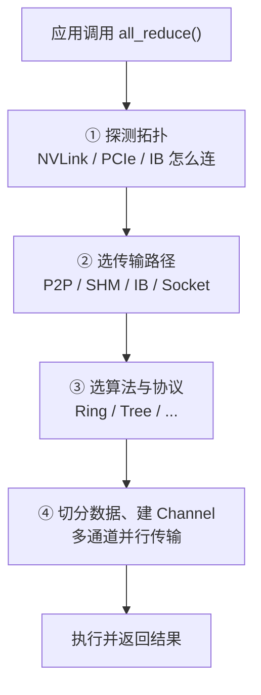
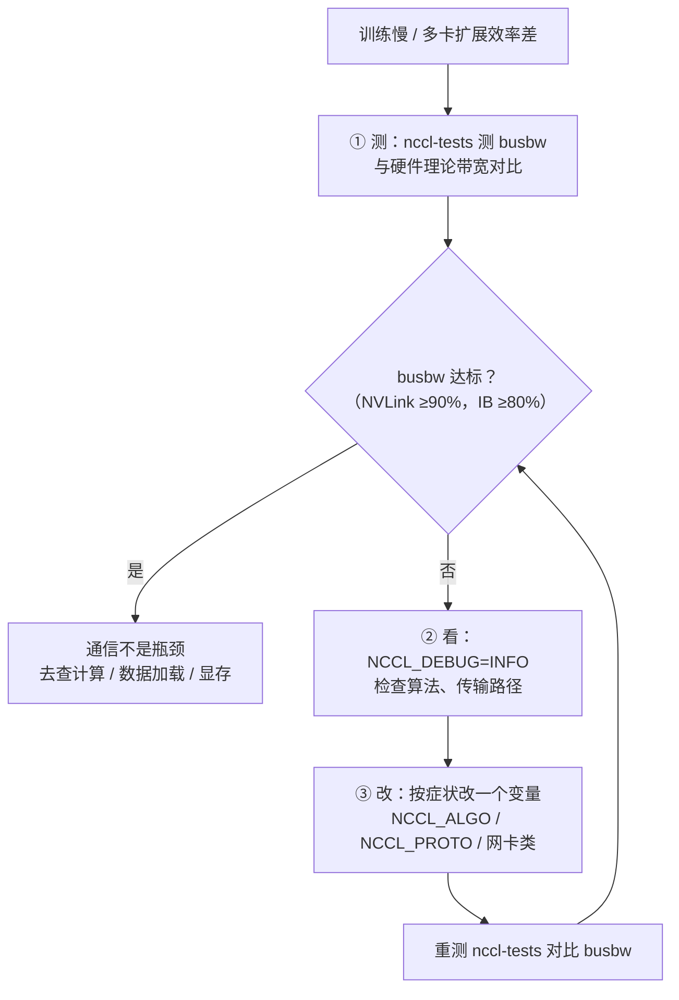

同样是 256 MiB 的一次 AllReduce，入门级 8 卡机测出来的 busbw 可能只有 **~90 GB/s**，而 8×H100 单机可以跑到 **~850 GB/s**（NVLink 4.0 理论 900 GB/s 的约 95%，「待核实」，依赖机型与 NCCL 版本）——差了将近 10 倍，而差距并不全在硬件，很大一部分在 NCCL 有没有选对算法、走对路径、用对配置。本文是第 6 章的“动手篇”：6.1~6.3 把集合通信原语和 Ring/Tree 算法讲透了，这一篇把它们落到工具和命令上——NCCL 怎么用、`NCCL_DEBUG=INFO` 日志怎么看、哪些环境变量什么时候才需要动，以及用 nccl-tests 把真实带宽测出来、区分 algbw 与 busbw 的完整排查流程。读完你就能回答：“我的集群通信慢，到底是谁的锅？”

<!-- more -->

## 📑 目录

- [1. NCCL 是什么：训练框架底层的通信总管](#1-nccl-是什么训练框架底层的通信总管)
- [2. 传输后端：NCCL 怎么选路](#2-传输后端nccl-怎么选路)
- [3. PyTorch 基本用法：从初始化到 torchrun 启动](#3-pytorch-基本用法从初始化到-torchrun-启动)
- [4. 关键环境变量：三类旋钮各管什么](#4-关键环境变量三类旋钮各管什么)
- [5. NCCL_DEBUG=INFO：调试日志怎么读](#5-nccl_debuginfo调试日志怎么读)
- [6. nccl-tests：动手测出真实带宽](#6-nccl-tests动手测出真实带宽)
- [7. 输出解读：algbw 与 busbw 的区别](#7-输出解读algbw-与-busbw-的区别)
- [8. 性能排查三步法](#8-性能排查三步法)
- [9. 三个常见误区](#9-三个常见误区)
- [10. 下一站：从工具到并行策略](#10-下一站从工具到并行策略)
- [总结](#-总结)
- [自我检验清单](#-自我检验清单)
- [参考资料](#-参考资料)

---

## 1. NCCL 是什么：训练框架底层的通信总管

**先回答一个最基础的问题：我们已经在 6.1 学会了集合通信原语，在 6.2 学会了 Ring AllReduce，为什么还需要一个叫 NCCL 的东西？**

因为算法是纸面上的，真正跑起来需要有人去探测硬件、选传输路径、把数据切块、调度多张卡协同——这些脏活累活，NCCL 全包了。NCCL（NVIDIA Collective Communications Library，NVIDIA 集合通信库，读作 “Nickel”）是 NVIDIA 开发的 GPU 集合通信库，PyTorch、DeepSpeed、Megatron-LM 这些主流训练框架底层的多卡通信，最终都由它驱动。

打个比方：NCCL 像一个**智能调度中心**。你不需要自己研究“这次 AllReduce 该走 NVLink 还是走 PCIe、该用 Ring 还是 Tree”——你只要对着调度中心喊一句“帮我做个 AllReduce”，它自己会探测当前有几张卡、卡之间怎么连的、数据有多大，然后替你选好算法和路径，把货发出去。你只关心“我要什么”，它负责“怎么运到”。

NCCL 的核心能力有四条，正好对应上面比喻里的四件事：

- **自动拓扑感知**：检测 NVLink、PCIe、InfiniBand 的连接关系，选择最优通信路径；
- **全套集合通信**：AllReduce、AllGather、ReduceScatter、Broadcast、Reduce 等原语一应俱全（原语各自干什么，回看 [6.1 集合通信原语](/AIInfraGuide/prerequisites/模块一-前置知识/communication/61-集合通信原语)）；
- **单机多卡与多机多卡透明支持**：上层代码不用区分卡在不在同一台机器里；
- **通信-计算重叠**：支持与 CUDA Stream 配合，在通信的同时执行计算，把通信延迟“藏”进计算时间里（原理见 primer 第 7 节）。

### 1.1 钻进 NCCL 内部：一次 AllReduce 调用发生了什么

**调度中心不是一句话就完事的，它内部有固定的四步流程。** 把镜头拉近，看一次 `all_reduce()` 调用从入口到出口依次做了什么：



这张图讲的是 NCCL 收到一次集合通信调用后依次做的四件事：**先看路（拓扑）、再选车（传输）、再排班（算法）、最后发车（执行）**。前两步由硬件拓扑决定，第三步由数据大小决定，第四步是把一份大数据切成多份、用多条“通道”（Channel）同时搬运——这就是为什么一次大 AllReduce 能把 NVLink 的每条链路都占满。

⚠️ **注意**：第四步的“多通道并行”不是魔法，也不会放大通信量。Ring AllReduce 之所以带宽最优，前提是所有链路同时工作；NCCL 通过建立多条 Channel、每条 Channel 各跑一个环，把带宽叠满。6.2 讲的“通信量 $\frac{2(N-1)}{N} \times M$”是每 rank 的总账：C 条 Channel 并行时，每条环只分到 $M/C$ 的数据，每 rank 的总通信量仍是 $\frac{2(N-1)}{N} \times M$——通道数叠加的是并行带宽（更多链路同时工作），不是通信量。

### 1.2 动手前先查版本：三个方法

**为什么第一步是查版本？因为 NCCL 的环境变量、算法枚举随版本变化很大，教程里写的变量在你的版本里可能不存在。**

三个常用方法，按使用场景选：

```python
import torch

# 方法 1：整数版本号，如 23007 对应 NCCL 2.30.7（规则：主版本×10000 + 次版本×100 + 补丁版本）
print(torch.cuda.nccl.version())   # 以你的 PyTorch 版本为准
# 方法 2：字符串版本号，如 "2.30.7"
print(torch.version.nccl)
```

```bash
# 方法 3：不写代码，启动任意一个用到 NCCL 的程序时打印版本
NCCL_DEBUG=VERSION python train.py
# 输出第一行形如：NCCL version 2.23.4+cuda12.3
```

第三种是 NCCL 官方文档明确给出的查版本方式：`NCCL_DEBUG=VERSION` 会在程序启动时打印 NCCL 版本。三种方法按使用场景任选其一即可。

## 2. 传输后端：NCCL 怎么选路

**上一节说 NCCL 会“自动选路”，那候选的路到底有哪些？**

NCCL 的底层传输方式按优先级大致如下表。**各后端的硬件规格与带宽数字在 [5.7 多卡互联拓扑](/AIInfraGuide/prerequisites/模块一-前置知识/gpu/57-多卡互联拓扑)已经详细讲过，这里只讲 NCCL 怎么选、以及什么情况下会退而求其次。**

| 传输方式 | 适用场景 | 一句话说明 |
|---------|---------|-----------|
| NVLink / NVSwitch | 单机卡间 | 最高带宽，NCCL 优先使用，走 GPU 直连（P2P） |
| PCIe P2P | 单机卡间（无 NVLink） | 通过 PCIe 的 GPU 直连，带宽次之 |
| SHM（共享内存） | 同机但无法 P2P | 借道主机内存中转，NCCL 在 P2P 不可用时自动启用 |
| InfiniBand Verbs | 多机间 | RDMA（Remote Direct Memory Access，远程直接内存访问）传输，低延迟高带宽，跨机首选 |
| RoCE | 多机间 | 以太网上的 RDMA，跨机备选 |
| Socket（TCP/IP） | 兜底 | 性能最差，只在没有 RDMA 时使用 |

选路逻辑一句话：**谁快用谁，NVLink 优先、PCIe 次之、跨机走 RDMA、实在不行才走 TCP**。判断标准是 NCCL 探测到的拓扑距离——卡与卡之间隔着几层 PCIe 交换机、网卡和 GPU 是不是同一个 NUMA 节点，都会影响选择。

💡 **提示**：SHM 这一行是许多教程忽略的中间层。当两张卡无法 P2P（比如被 `NCCL_P2P_DISABLE=1` 禁掉，或硬件不支持），NCCL 不会直接跳去走网络，而是先尝试经主机内存的共享内存传输——数据从 GPU 拷贝到主机内存再拷进另一张卡。这条路比 NVLink 慢得多，但比走 TCP 快。看到日志里 `via SHM` 就要警觉：说明 P2P 没生效。

## 3. PyTorch 基本用法：从初始化到 torchrun 启动

**现在进入正题：在 PyTorch 里，NCCL 到底怎么用？** 一共就两步：初始化进程组，然后调用集合通信 API。

### 3.1 初始化与三个最常用原语

`init_process_group(backend="nccl")` 是入口——它告诉 PyTorch“我要用 NCCL 作为通信后端”，同时让所有进程完成一次握手，建立起一个全局的通信组。之后所有集合通信调用都在这组进程之间进行（完整可运行的 demo 见 6.1 §7，本节只贴关键调用）：

```python
import os
import torch
import torch.distributed as dist

def setup(rank, world_size):
    # MASTER_ADDR / MASTER_PORT：所有进程都要知道"报到点"在哪（详见 3.3）
    os.environ["MASTER_ADDR"] = "localhost"
    os.environ["MASTER_PORT"] = "12355"
    dist.init_process_group(backend="nccl", rank=rank, world_size=world_size)
    torch.cuda.set_device(rank)   # 每个进程绑定自己的 GPU

# AllReduce：所有卡的 tensor 求和，结果每张卡都拿到（DDP 同步梯度就靠它）
tensor = torch.ones(1024, 1024, device=f"cuda:{dist.get_rank()}")
dist.all_reduce(tensor, op=dist.ReduceOp.SUM)

# AllGather：每人交一片，最后人人拿到完整数据（ZeRO-3 收集参数就靠它）
world_size = dist.get_world_size()
local_chunk = torch.randn(256, device=f"cuda:{dist.get_rank()}")
gathered = [torch.zeros(256, device=f"cuda:{dist.get_rank()}") for _ in range(world_size)]
dist.all_gather(gathered, local_chunk)

# ReduceScatter：先归约再分片，每卡只保留属于自己的那一片（ZeRO 分片梯度就靠它）
chunk_size = 1024 // world_size
output = torch.zeros(chunk_size, 1024, device=f"cuda:{dist.get_rank()}")
input_chunks = list(tensor.chunk(world_size))
dist.reduce_scatter(output, input_chunks, op=dist.ReduceOp.SUM)
```

代码要点回顾：

1. **每个进程必须绑定不同的 GPU**（`set_device(rank)`），否则所有进程挤在同一张卡上，通信会直接报错或性能崩坏；
2. 三个原语的“谁是发起者、谁拿到结果”规则：AllReduce 人人拿到完整结果；AllGather 人人拿到完整结果；ReduceScatter 每人只拿自己的分片——分不清时回看 6.1 的图示；
3. **集合通信必须所有进程一起调用**，任何进程单独调用都会导致死锁——机制与排查详见 6.1 §8.4。

### 3.2 用 torchrun 启动：单机与多机

**上一节的代码里 `rank` 和 `world_size` 从哪来？手动传太麻烦，`torchrun` 就是干这个的。**

`torchrun` 是 PyTorch 自带的启动器：它负责在每张 GPU 上拉起一个训练进程，自动设置好 `RANK`（全局编号）、`LOCAL_RANK`（本机内编号，选卡用）、`WORLD_SIZE`（总进程数）三个环境变量，你的代码里直接读它们即可：

```bash
# 单机 8 卡：--nproc_per_node 指定每台机器拉几个进程（通常 = 卡数）
torchrun --nproc_per_node=8 train.py
```

```bash
# 多机 16 卡（2 台机器 × 8 卡）：两台机器都要启动，命令几乎一样
# 在 node0 上：
torchrun --nnodes=2 --nproc_per_node=8 --rdzv_endpoint=node0:29500 train.py
# 在 node1 上：
torchrun --nnodes=2 --nproc_per_node=8 --rdzv_endpoint=node0:29500 train.py
```

多机场景只有一个新东西：`--rdzv_endpoint=node0:29500`——它指定“报到点”在 node0 的 29500 端口。两台机器 16 个进程全部到这个报到点登记，然后才能组成通信组。老版本或静态部署也常写成 `--master_addr=node0 --master_port=29500 --node_rank=0`（node1 上 `--node_rank=1`），效果相同，以你所用 PyTorch 版本的 `torchrun --help` 为准。

### 3.3 MASTER_ADDR 与 MASTER_PORT 到底在管什么

**为什么初始化非要这两个变量？它们的作用是：给所有进程一个共同的“报到点”。**

想象 16 个新同学第一天入学，谁也不知道别人在哪，但所有人都知道“去教务处 302 报到”——MASTER_ADDR 就是教务处地址（rank 0 所在机器的 IP），MASTER_PORT 就是 302 房间号（一个没被占用的端口）。所有进程先连到报到点，领到自己的全局编号（rank），之后才开始真正的集合通信。没有这个共同约定，进程之间互相找不到对方，初始化就会一直卡住（这是“初始化 hang”最常见的头号原因）。

💡 **提示**：`torchrun` 会自动把 `MASTER_ADDR`/`MASTER_PORT` 注入到每个进程的环境变量里（多机时注入的是 `--rdzv_endpoint` 解析出的地址），所以用 torchrun 时你甚至不用手写 `os.environ` 那两行。但理解它们的存在依然必要——排查“初始化卡住”时，第一件事就是确认所有节点能互相访问 MASTER_ADDR 的端口（`telnet node0 29500` 试试）。

## 4. 关键环境变量：三类旋钮各管什么

**NCCL 提供了上百个环境变量，但 90% 的场景只需要认识下面这 12 个。先立一条铁律：**

> **NCCL 的默认配置已经按你的硬件拓扑自动调优过了。** 官方文档明确警告：调试类环境变量“不应在生产环境使用，也不应保留在脚本里，只在排查问题时临时设置，问题解决后立刻移除”（原文：*should not be used in production nor retained in scripts*）。设置一个变量，等于剥夺 NCCL 在这个维度上的自动选择权——**你是在手动接管，不是在加固**。

下面按“调试 / 算法 / 网络”三类逐一讲。每个变量都回答两个问题：**什么时候用**（触发条件）、**排查什么**（看到什么算正常）。

### 4.1 调试类：看日志、过滤日志、导出拓扑

| 变量 | 含义（官方文档） | 什么时候用 / 排查什么 |
|------|-----------------|----------------------|
| `NCCL_DEBUG` | 日志级别：`VERSION`（只打印版本）/ `WARN`（出错时打印错误）/ `INFO`（详细信息）/ `TRACE`（每次调用的全量跟踪） | 平时用 `WARN` 或干脆不设；排查问题时升到 `INFO`；`TRACE` 日志量极大，只在需要看每次调用的算法/协议选择时用 |
| `NCCL_DEBUG_SUBSYS` | 只输出指定子系统的日志，逗号分隔；默认 `INIT,BOOTSTRAP,ENV`；常用 `NET`、`GRAPH`、`TUNING`、`P2P`、`ALL` | 日志太多时按需过滤：怀疑网卡问题用 `NCCL_DEBUG_SUBSYS=NET`，怀疑拓扑识别用 `GRAPH`，怀疑算法选择用 `TUNING` |
| `NCCL_TOPO_DUMP_FILE` | 把 NCCL 探测到的拓扑导出成 XML 文件（2.6 起支持） | 想确认 NCCL 眼中的拓扑是否和 `nvidia-smi topo -m` 一致时用；怀疑拓扑误判（虚拟化、容器里常见）时导出对比 |
| `NCCL_DEBUG_FILE` | 把日志写入文件而非终端，支持 `%h`（主机名）/ `%p`（进程号）占位符 | 多机多进程日志刷屏时用：每个进程各写一个文件，再按 rank 过滤分析（见第 5 节提示） |

### 4.2 算法类：强制指定算法与协议

| 变量 | 含义（官方文档） | 什么时候用 / 排查什么 |
|------|-----------------|----------------------|
| `NCCL_ALGO` | 强制指定允许使用的算法，逗号分隔。完整枚举（NCCL 2.30 文档）：`Ring`、`Tree`、`CollnetChain`、`CollnetDirect`、`NVLS`、`NVLSTree`、`PAT`；部分算法有版本门槛（`NVLS` 需 2.17+、`NVLSTree` 需 2.18+、`PAT` 需 2.23+，早期的 `Collnet` 名称在 2.14 后被拆分） | 默认不设置 = NCCL 自动选。排查“是不是算法选错了”时用：`NCCL_ALGO=Ring` 和 `NCCL_ALGO=Tree` 各测一遍对比 busbw。注意 `NVLS`/`NVLSTree` 依赖 NVSwitch 4.0+ 的 NVLink SHARP 硬件，没有该硬件时指定了也会被忽略 |
| `NCCL_PROTO` | 强制指定允许使用的传输协议，枚举：`LL`、`LL128`、`Simple` | **官方明确不鼓励设置**（原文：*Users are discouraged from setting this variable*）。三种协议的一句话区别：「待核实」`Simple` 是标准模式，数据与标志分开传，带宽最高但延迟最大；`LL`（Low Latency）把数据塞进标志位一起传，省一次同步，延迟最低但有效带宽减半；`LL128` 是两者的折中，128 位单元里只牺牲约 3% 带宽换低延迟。尤其注意：**在不支持 LL128 的平台上强行启用会导致数据损坏**（官方原文：*can lead to data corruption*） |

⚠️ **注意**：`NCCL_ALGO` 里 `Ring` 和 `Tree` 之外的算法（CollNet 系列、NVLS 系列、PAT）都不是“随便选”的——它们分别依赖 SHARP 交换网络、NVLink SHARP 硬件等特定基础设施。默认不设置时，NCCL 只会启用当前硬件支持的算法，这也是为什么日志里 `NCCL_ALGO=...` 那行通常列出很多算法、但实际能用的只有两三个。

### 4.3 网络类：网卡、GDR 与缓冲

| 变量 | 含义（官方文档） | 什么时候用 / 排查什么 |
|------|-----------------|----------------------|
| `NCCL_SOCKET_IFNAME` | 指定走 TCP 的网卡接口，支持前缀匹配，`^` 开头表示排除，如 `eth0`、`^lo` | 机器有多块网卡（或 docker 虚拟网卡干扰）时用；默认会跳过 `lo` 和 `docker*` 接口，并优先选 `ib*` 前缀的接口 |
| `NCCL_IB_HCA` | 指定 InfiniBand 网卡设备（HCA），如 `mlx5_0` 或 `mlx5_0:1`（：端口） | IB 集群上有多个 HCA、或 NCCL 选中了错误的网卡时用；排查方法：`ibstat` 看 HCA 状态，日志里看 `NET/IB : Using [0]mlx5_0...` 是否选对 |
| `NCCL_NET_GDR_LEVEL` | 控制 GPU Direct RDMA（GPUDirect）的使用距离。新版推荐字符串值：`LOC`（禁用）/ `PIX` / `PXB` / `PHB` / `SYS`；旧版整数 `0`~`4` 依次对应，大于 `4` 按 `SYS` 处理；不设置时 NCCL 自动选择 | IB 集群带宽不达标时排查 GDR 是否生效；日志里找不到 `GDR` 相关字样，或看到数据经过主机内存中转的迹象时，试 `NCCL_NET_GDR_LEVEL=PIX` 或 `PHB` 对比 |
| `NCCL_P2P_DISABLE` | 设为 `1` 禁用 GPU 间 P2P 传输（NVLink/PCIe 直连） | **几乎不用**。只在怀疑 P2P 导致不稳定（某些虚拟化环境）时临时禁用对比；禁用后通信退到 SHM 或网络，性能显著下降 |
| `NCCL_SHM_DISABLE` | 设为 `1` 禁用共享内存传输 | 更少用。P2P 不可用且 SHM 出问题时才会碰它；禁用后同机通信会改走网络 |
| `NCCL_BUFFSIZE` | 通信缓冲区大小，单位字节，**默认 `4194304`（4 MiB）** | 遇到显存压力，或怀疑缓冲区太小限制吞吐时调大（如 `16777216` = 16 MiB）重测对比；注意它是“每对通信 GPU 之间的缓冲”，调大要付出显存代价 |

💡 **提示**：环境变量的默认值随 NCCL 版本演进，**本文所有默认值以 NCCL 2.30 官方文档（env.html）为准**，你用其他版本时以该版本文档为准。尤其是 `NCCL_NET_GDR_LEVEL`——它过去叫 `NCCL_IB_GDR_LEVEL`（2.4.0 改名），老教程里的旧名字在新版本里不生效。

## 5. NCCL_DEBUG=INFO：调试日志怎么读

**环境变量认识完了，最关键的技能来了：打开 `NCCL_DEBUG=INFO` 之后，那一大坨日志到底看哪几行？**

先看一个典型片段（8 卡单机 + InfiniBand 多机环境的混合示意，**非逐字日志**，不同版本的行号与措辞有差异，以你所用版本为准）：

```text
[8] NCCL INFO NCCL version 2.23.4+cuda12.3
[8] NCCL INFO Setting env: NCCL_DEBUG=INFO
[8] NCCL INFO NET/IB : Using [0]mlx5_0:1/RoCE;[1]mlx5_1:1/RoCE; OOB 10.20.30.1<0>
[8] NCCL INFO Using network IB
[8] NCCL INFO comm 0 rank 0 nranks 8
[8] NCCL INFO Channel 00 : 0[0] -> 1[0] via NVLink/0
[8] NCCL INFO Channel 01 : 0[1] -> 1[1] via NVLink/0
[8] NCCL INFO Ring 00 : 0[0] -> 1[0] via NVLink/0
[8] NCCL INFO Tree 00 : 0[0] -> 1[0] via NVLink/0
[8] NCCL INFO Connected all rings
[8] NCCL INFO Connected all trees
[8] NCCL INFO NCCL_ALGO=Ring,Tree,CollnetDirect,CollnetChain,NVLS,NVLSTree,PAT
[8] NCCL INFO NCCL_PROTO=LL,LL128,Simple
```

每条日志开头的 `[8]` 是本地 rank 编号（本机第几张卡），多进程日志混在一起时靠它区分是谁在说话。这张日志里藏着四类关键信息，按顺序看：

1. **版本行**（第 1 行）：`NCCL version 2.23.4+cuda12.3`。确认版本符合预期，也确认环境变量确实被读到了（第 2 行 `Setting env` 会回显你设的变量）；
2. **网络行**（第 3~4 行）：`NET/IB : Using [0]mlx5_0...` + `Using network IB`，说明多机通信找到了 IB 网卡。**如果这里显示的是 `Using network TCP/IP`，说明 RDMA 没起来**——优先排查 `NCCL_IB_HCA` 和网卡驱动，这是跨机带宽差的第一嫌疑；
3. **通道行**（第 5~6 行）：`Channel 00 : 0[0] -> 1[0] via NVLink/0`。`via NVLink` 表示机内通信走了 NVLink 直连——正常；如果看到 `via PIX`/`via PXB`（PCIe）或 `via SHM`（共享内存），说明 P2P 没走 NVLink，机内带宽会差一个量级；
4. **算法行**（第 11~12 行）：`NCCL_ALGO=...` 和 `NCCL_PROTO=...` 打印的是**当前 NCCL 允许使用的算法/协议全集**（由硬件支持情况和你的设置共同决定），不是本次通信实际选中的那个。想知道某次具体调用实际用了什么算法/协议，两个办法：开 `NCCL_DEBUG=TRACE` 看每次调用的记录行，或者直接设 `NCCL_ALGO=Ring` / `NCCL_ALGO=Tree` 各跑一遍对比性能——后者正是第 8 节排查三步法里第 ③ 步的常规操作。

📌 **关键点**：日志不是用来逐行读完的，**四行决定论**——版本行、网络行、通道行、算法行，看这四类行就能回答“NCCL 选对路了吗”。

💡 **提示**：多机多进程时日志会疯狂刷屏，官方推荐用 `NCCL_DEBUG_FILE=/tmp/nccl_%h_%p.log`（`%h` 是主机名，`%p` 是进程号）让每个进程各写一个文件，再按 rank 过滤分析，比在终端里翻滚动日志高效得多。

## 6. nccl-tests：动手测出真实带宽

**日志只能告诉你“NCCL 选了哪条路”，不能告诉你“这条路有多快”。测速要用官方标准工具：nccl-tests。**

nccl-tests 是 NVIDIA 官方开源的通信性能测试集，所有云厂商和 HPC 集群验收网络时用的都是它。它直接调用 NCCL 的 C 接口，绕开 PyTorch 框架层，测的是**纯通信带宽**——这样测出来的数字才能用来判断“硬件和 NCCL 配置本身有没有问题”。

### 6.1 获取与编译

```bash
git clone https://github.com/NVIDIA/nccl-tests.git
cd nccl-tests

# 单机多卡测试，不依赖 MPI 也能跑
make CUDA_HOME=/usr/local/cuda NCCL_HOME=/usr/local/nccl

# 要多机测试，必须带 MPI=1 编译（MPI 负责跨机器拉起进程）
make MPI=1 MPI_HOME=/usr/local/mpi CUDA_HOME=/usr/local/cuda NCCL_HOME=/usr/local/nccl
```

`MPI=1` 的含义：nccl-tests 本身只负责调用 NCCL，**跨机器的进程编排（哪台机器起几个进程）需要 MPI 来做**——所以只有多机测试才需要 MPI=1，单机 8 卡不需要。`MPI_HOME`/`CUDA_HOME`/`NCCL_HOME` 只是告诉 make 这些库装在哪里，路径不对会直接编译失败。

### 6.2 参数速查：-b/-e/-f/-g 各是什么

所有 `*_perf` 测试（`all_reduce_perf`、`all_gather_perf` 等）共用同一套参数（以下默认值来自 nccl-tests README，以你所用版本为准）：

| 参数 | 含义 | 默认值 |
|------|------|--------|
| `-b` | 起始消息大小（bytes），如 `8` | 32M |
| `-e` | 终止消息大小（bytes），如 `256M` | 32M |
| `-f` | 每个尺寸翻倍系数，如 `-f 2` 表示 8 → 16 → 32 。。。 倍增 | 禁用（用固定增量 `-i`） |
| `-g` | 每个进程使用的 GPU 数 | 1 |
| `-w` | 预热迭代次数（不计时） | 1 |
| `-n` | 正式测试迭代次数（取最好/平均） | 20 |
| `-c` | 正确性校验迭代次数（校验结果对不对） | 1 |
| `-d` | 数据类型，如 `float` | float |
| `-o` | 归约操作，如 `sum` | sum |

参数意义一句话：**`-b` 和 `-e` 划定数据量的扫描范围，`-f` 决定扫描密度，`-g` 决定用几张卡**。测 AllReduce 的惯用组合是 `-b 8 -e 256M -f 2 -g 8`：从 8 字节测到 256 MiB，尺寸倍增，用满 8 张卡。为什么要从 8 字节开始？因为小数据量暴露的是**延迟**问题（Ring 的 $O(N)$ 轮次在这里显形），大数据量暴露的是**带宽**问题——一张表同时看出延迟和带宽，是 nccl-tests 的价值所在。

### 6.3 单机与多机测试命令

```bash
# 单机 8 卡：直接跑（编译时未带 MPI 也可以）
./build/all_reduce_perf -b 8 -e 256M -f 2 -g 8

# 多机 16 卡（2 节点 × 8 卡）：经 mpirun 启动，-N 8 表示每节点 8 个进程
mpirun -np 16 -N 8 --hostfile hosts \
  -x NCCL_DEBUG=INFO \
  -x NCCL_IB_HCA=mlx5_0 \
  ./build/all_reduce_perf -b 8 -e 256M -f 2 -g 8
```

多机测试两个易错点：第一，`-x` 负责把环境变量传给远端进程——**mpirun 默认不转发环境变量**，`NCCL_IB_HCA` 忘了 `-x`，远端进程根本看不到；第二，各节点 `LD_LIBRARY_PATH` 必须一致（都要能找到 `libnccl.so`），否则会出现“有的节点跑起来了、有的节点报找不到库”的诡异现象。

## 7. 输出解读：algbw 与 busbw 的区别

**跑完 `all_reduce_perf`，你会看到一张表。这张表只有两个数字需要关心：algbw 和 busbw。这一节把这两个名字彻底讲透。**

典型的输出（示例数据，来源为本站 primer 的实测截图行）：

```text
#  size(B)    count   type    redop    time(us)  algbw(GB/s)  busbw(GB/s)
   8388608  2097152   float     sum      285.4       29.4         51.5
  67108864 16777216   float     sum     1823.0       36.8         64.4
 268435456 67108864   float     sum     5210.0       51.5         90.1
```

### 7.1 algbw：应用视角的吞吐

**algbw（algorithm bandwidth，算法带宽）回答的问题是：“从应用的角度看，每秒成功搬运了多少数据？”**

$$\underbrace{\text{algbw} = \frac{S}{t}}_{\text{数据量 ÷ 耗时}}$$

逐项看：$S$ 是单次操作的数据量（字节），$t$ 是耗时（秒），除出来就是每秒多少字节。代入第三行算一次：$S = 268435456$ 字节（256 MiB），$t = 5210$ 微秒 $= 5210 \times 10^{-6}$ 秒：

$$\text{algbw} = \frac{268435456}{5210 \times 10^{-6}} \approx 51.5 \times 10^9 \text{ B/s} = 51.5 \text{ GB/s}$$

**工程结论**：algbw 就是你直接“看见”的搬运速度——如果你在应用里搬 256 MiB 数据，实际等待就是 $256 \text{ MiB} / 51.5 \text{ GB/s} \approx 5.2$ 毫秒。它是真实的、可感知的，但**它不等于硬件链路的速度**。

### 7.2 busbw：硬件视角的利用率

**busbw（bus bandwidth，总线带宽）回答的问题是：“每一条硬件链路实际被占用了多少带宽？”** 为什么要多算这一步？因为 AllReduce 在 Ring 算法里，同一份数据要在环上被传递接近 2 次——还记得 6.2 的结论吗？每 rank 通信量是 $\frac{2(N-1)}{N} \times M$。8 卡时 $\frac{2 \times 7}{8} = 1.75$，也就是说**链路上实际流动的数据量，是应用数据量的 1.75 倍**。nccl-tests 官方文档正是从这个公式反推出 busbw：

$$\underbrace{\text{busbw} = \text{algbw} \times \frac{2(N-1)}{N}}_{\text{算法带宽 × 数据重复传输系数}}$$

其中 $\frac{2(N-1)}{N}$ 就是 6.2 推导出的系数：$N$ 是参与通信的 GPU 数，$N-1$ 是 ReduceScatter 阶段每个 rank 的发送轮数（AllGather 阶段还要再来 $N-1$ 轮，合计 $2(N-1)$），$N$ 是同时工作的链路数。继续用第三行算：$N = 8$，系数 $= \frac{14}{8} = 1.75$：

$$\text{busbw} = 51.5 \times 1.75 \approx 90.1 \text{ GB/s}$$

**工程结论**：90.1 GB/s 才是“每条链路每秒真实搬了多少”的数字——**对照硬件理论带宽（NVLink、IB 的标称值）时必须用 busbw，不能用 algbw**。如果你拿着 51.5 GB/s 去对比 900 GB/s 的 NVLink，会得出“利用率只有 6%”的错误结论，实际上硬件利用率是 10%（90.1 / 900）。

### 7.3 为什么 algbw 会随卡数“变差”（而 busbw 不会）

**这是 busbw 存在的最重要理由，也是面试常考点：同一批硬件，从 4 卡扩到 8 卡，algbw 会下降，但硬件利用率没变。**

设硬件单链路带宽为 $B$（即 busbw 的理论值 $= B$），由 7.2 反推：

$$\text{algbw} = \frac{\text{busbw} \times N}{2(N-1)} = B \times \frac{N}{2(N-1)}$$

- 4 卡：$\frac{4}{6} = 0.667$，algbw $= 0.667B$；
- 8 卡：$\frac{8}{14} = 0.571$，algbw $= 0.571B$。

卡数翻倍，algbw 掉了约 14%（$0.667 \to 0.571$），而 busbw 始终是 $B$。**如果只看 algbw，你会误以为“扩卡后通信变慢了”；看 busbw 才知道硬件其实跑满了。** 这就是 nccl-tests 官方文档说的“algbw 随 rank 数增加而下降”（原文：*that bandwidth varies (and decreases as the number of ranks increase)*）——它不是 bug，是 Ring 算法的固有数学。

📌 **关键点（本节最该记住的一句话）**：**algbw 是应用吞吐，busbw 是硬件利用率；比硬件、比扩展性，一律看 busbw。**

### 7.4 经验参考值：什么算“正常”

**数字到手了，怎么判断正不正常？** 给出两个经验判据（均「待核实」，依赖机型、NCCL 版本与拓扑）：

| 场景 | 参考 busbw | 对照理论 |
|------|-----------|---------|
| 8×H100 SXM 单机 AllReduce（NVLink 4.0） | ~850 GB/s | 900 GB/s 的 ~95% |
| 跨机 AllReduce（NDR 400 Gb/s = 50 GB/s IB） | ~40+ GB/s | 50 GB/s 的 ~80%+ |

判据一句话：**NVLink 场景 busbw 应达到理论值的 90% 以上，IB 跨机场景 80% 以上；远低于这个数，才进入第 8 节的排查流程。** 这些参考值来自社区与厂商的实测经验汇总，你的机器跑出 80% 不一定是坏了——先看 5.7 的口径提醒：NVLink 的 900 GB/s 是双向总和，别拿单向数字去比。

## 8. 性能排查三步法

**前面所有工具都齐了，现在串成一套完整的排查流程。核心思想只有一句：用数据定位问题，一次只改一个变量。**

训练慢、扩展效率差，第一反应不该是“改环境变量”，而应该是下面这张流程：



这张图讲的是排查慢通信的完整闭环：**先测（量化问题）→ 达标就转向别处、不达标再看（定位原因）→ 一次改一个变量 → 重测对比 → 再判断**。两个关键纪律：第一，**必须用 nccl-tests 测，不要拿训练脚本的 step 时间猜**——训练慢的原因太多（数据加载、kernel 效率），通信只是嫌疑之一；第二，**一次只改一个环境变量**，同时改三个，测出变好了你也不知道是谁的功劳。

### 8.1 三步的每一步具体做什么

**第 ① 步：测。** 单机测：`./build/all_reduce_perf -b 8 -e 256M -f 2 -g 8`；跨机测：加上 mpirun 那套。记录每个数据量下的 busbw，和 7.4 的参考值对比。**看两个端点**：小数据量（8B~1K）看延迟是否异常高（对应算法问题），大数据量（≥64M）看 busbw 是否接近理论（对应路径/带宽问题）。

**第 ② 步：看。** 跑一次 `NCCL_DEBUG=INFO`（跨机加 `NCCL_DEBUG_FILE` 分文件），按第 5 节的“四行决定论”检查：版本对不对、网络走没走 IB、机内走没走 NVLink、允许的算法集正不正常。这一步把“硬件配置问题”和“NCCL 选择问题”分开。

**第 ③ 步：改。** 按症状选变量，改完**重测第 ① 步**，busbw 有提升就保留、没提升就还原，再试下一个。可尝试的变量及理由见下表。

### 8.2 症状 → 可能原因 → 排查动作

| 现象（症状） | 可能原因 | 排查动作 |
|-------------|---------|---------|
| 单机 8 卡 busbw 远低于 NVLink 理论值 | 机内 P2P 没走 NVLink（拓扑不对称、被禁用、虚拟化） | 日志看 Channel 行是否 `via NVLink`；`nvidia-smi topo -m` 对比拓扑；检查是否误设了 `NCCL_P2P_DISABLE` |
| 跨机 busbw 远低于 IB 理论值 | IB 没被选中，实际走了 TCP；或 GDR 未生效 | 日志看是否 `Using network IB`；`NCCL_IB_HCA=mlx5_0` 指定网卡；`NCCL_NET_GDR_LEVEL=PIX` 对比；`ibstat` 确认链路状态 |
| 小数据量（<1M）延迟明显偏高 | 算法选错：大数据量最优的 Ring 在小数据量下延迟 $O(N)$ | `NCCL_ALGO=Tree` 跑 `-b 8 -e 1M`，对比小尺寸的耗时（呼应 6.3 的结论：Tree 延迟 $O(\log N)$） |
| 扩卡后 algbw 下降、busbw 不变 | **正常现象**（7.3 的数学），不是故障 | 确认 busbw 达标即可，不要试图“修”它 |
| 多机初始化 hang 住 | MASTER_ADDR/PORT 不通、防火墙、rank 数不匹配 | 确认 `--rdzv_endpoint` 可访问（telnet 测端口）；确认所有节点 `--nnodes` 一致；`NCCL_DEBUG_SUBSYS=INIT,BOOTSTRAP` 看卡在哪一步 |
| 训练中偶发通信超时/报错 | 网卡、驱动或 GDR 不稳定 | `NCCL_DEBUG=WARN` 抓首次报错；必要时临时 `NCCL_NET_GDR_LEVEL=LOC` 禁 GDR 对比（牺牲性能换稳定，官方提示的降级手段） |

## 9. 三个常见误区

**工具都会用了，最后泼三盆冷水——这三句话在论坛里天天见，句句是坑。**

### 误区一：环境变量堆得越多越好

**说法**：把 `NCCL_DEBUG=INFO`、`NCCL_ALGO=Tree`、`NCCL_BUFFSIZE=16777216` 全部写进启动脚本，显得很专业。

**为什么错**：NCCL 的默认值是基于拓扑自动调优的结果。调试类变量开在生产环境，日志刷屏拖慢启动；强制算法剥夺了 NCCL 按数据量切换的能力；`NCCL_PROTO` 在不支持的平台强制 `LL128` 会**数据损坏**（官方文档原话）。你每设一个变量，就是拿“自动调优”换“手动接管”——**牺牲了自适应性，换取的是可复现的对照实验**，这个交换只在排查期间值得。

**正确做法**：默认配置直接跑；排查时一次加一个变量，问题解决后**立刻从脚本里删掉**。

### 误区二：algbw 接近理论带宽就算正常

**说法**：`all_reduce_perf` 输出 51.5 GB/s，对比 NVLink 900 GB/s，得出结论“硬件用了 6%，没救了”——或者反过来，algbw 很高就宣布“网络没问题”。

**为什么错**：两个方向都错在**拿 algbw 当硬件利用率**。7.3 已经算过：同样的硬件，4 卡和 8 卡的 algbw 天生就差 14%。algbw 的数字里混着算法因素（$2(N-1)/N$ 的重复搬运），**只有 busbw 才消除了算法因素、直接对应硬件链路速度**。

**正确做法**：比硬件、比扩展、跨卡数对比，一律看 busbw。看到有人拿 algbw 下结论，你可以礼貌地把 7.2 的公式递过去。

### 误区三：NCCL_ALGO=Tree 万能

**说法**：6.3 说 Tree 延迟低，那我把所有通信都强制成 Tree，岂不美哉？

**为什么错**：6.3 的完整结论是“**小数据量**场景 Tree 延迟占优”——Tree 的延迟是 $O(\log N)$ 但带宽利用率低（根节点是瓶颈）；Ring 的延迟是 $O(N)$ 但带宽最优。训练里同步大梯度（动辄几百 MB）是带宽问题，**强制 Tree 反而把带宽优势扔了**（6.3 篇还记录过强制 Tree 在 Broadcast 上直接报 “No algorithm/protocol available” 的真实案例）。更别说 `NVLS`/`NVLSTree` 这些算法**依赖特定硬件**（NVSwitch 的 NVLink SHARP 卸载），没有硬件时指定了也是白指定。

**正确做法**：算法必须与**数据量 + 硬件拓扑**匹配——这正是 NCCL 默认“不设置”让它自动选的原因。强制指定只用于排查对照（第 8 节第 ③ 步），不用于生产。

## 10. 下一站：从工具到并行策略

**这一篇的定位是第 6 章的“动手篇”：6.1 的原语、6.2 的 Ring、6.3 的 Tree，在这里全部落成了命令、日志和数字。**

下一篇 6.6 将换一个视角：用这一篇的语言——**通信量（一次 AllReduce 搬多少字节）、通信频率（每个 step 搬几次）、通信与计算能否重叠**——去分析 DDP、ZeRO、张量并行等并行策略。到时候你会发现，primer 第 9.2 节算过的“7B 模型梯度 14 GB、8 卡 Ring 通信量 28 GB、NVLink 上约 31 ms”这类账（6.2 篇注明过：28 GB 是 primer 的近似口径，按精确值算是 24.5 GB / 约 27 ms），就是 6.6 的分析起点；而你在 nccl-tests 里测出的 busbw，就是算这些账时的“单价”。工具的意义，正在于此。

## 📝 总结

1. **定位**：NCCL 是训练框架底层的集合通信引擎，相当于“智能调度中心”——自动探测拓扑、选传输路径、选算法，你只管调用原语（PyTorch 里 `backend="nccl"` 一行开启）。
2. **传输后端**：NVLink/PCIe P2P 管机内、IB/RoCE 管跨机、Socket 兜底；日志里 `via NVLink`、`Using network IB` 这两行直接告诉你 NCCL 选没选对路（硬件细节见 5.7）。
3. **环境变量**：三类 12 个变量，默认值已按拓扑自动调优——调试类只在排查时开、算法类只做对照实验、网络类只在网卡选错时碰；`NCCL_BUFFSIZE` 默认 4194304 字节（4 MiB），`NCCL_ALGO` 完整枚举是 Ring/Tree/CollnetChain/CollnetDirect/NVLS/NVLSTree/PAT（NCCL 2.30 文档）。
4. **日志**：`NCCL_DEBUG=INFO` 用“四行决定论”读——版本行、网络行、通道行、算法行；`NCCL_ALGO=` 行是可用全集，不是实际选择。
5. **测速**：nccl-tests 的 `all_reduce_perf -b 8 -e 256M -f 2 -g 8` 是标准动作；**algbw 是应用吞吐、busbw 才是硬件利用率**，公式 busbw = algbw × 2(N-1)/N 与 6.2 的 Ring 通信量系数同源。
6. **排查**：三步法闭环（测→看→改→重测），一次只改一个变量；8×H100 单机 AllReduce busbw 经验值 ~850 GB/s「待核实」，达不到再动手。

## 🎯 自我检验清单

- 能解释 NCCL 在训练框架中的角色，并画出一次 `all_reduce()` 调用内部的四步流程（拓扑→传输→算法→通道）
- 能用 `torch.cuda.nccl.version()` 和 `NCCL_DEBUG=VERSION` 查出 NCCL 版本，并说明为什么查版本要排在调参之前
- 能写出 `torchrun` 单机 8 卡与 2 节点 16 卡两种启动命令，并解释 `MASTER_ADDR`/`MASTER_PORT` 与 `--rdzv_endpoint` 的关系
- 能说出 `NCCL_DEBUG` 四级日志各自何时用，以及 `NCCL_DEBUG_SUBSYS=NET` 与 `=TUNING` 分别过滤什么
- 能默写 `NCCL_ALGO` 的完整枚举（Ring/Tree/CollnetChain/CollnetDirect/NVLS/NVLSTree/PAT），并说出 NVLS 依赖什么硬件
- 能说出 `NCCL_BUFFSIZE` 的默认值（4194304 字节 = 4 MiB）以及调大它的代价（显存）
- 能从一段 `NCCL_DEBUG=INFO` 日志中找出版本、网络、通道、算法四类关键行，判断机内是否走 NVLink、跨机是否走 IB
- 能写出 nccl-tests 编译命令（含 `MPI=1` 的适用条件），并解释 `-b`/`-e`/`-f`/`-g` 四个参数的含义
- 能手动推导 busbw = algbw × 2(N-1)/N，并用 268435456 字节、5210 μs、8 卡这组数字算出 algbw ≈ 51.5 GB/s、busbw ≈ 90.1 GB/s（误差不超过 10%）
- 能解释为什么 4 卡扩到 8 卡 algbw 会下降而 busbw 不变，并据此判断“扩卡后 algbw 变差”不是故障
- 能按三步法排查一次“跨机 AllReduce busbw 只有理论值 40%”的问题：先测、再看 `Using network` 行、再改网卡/GDR 变量重测
- 能指出“algbw 接近理论带宽就算正常”这句话错在哪里，并给出正确判据（比硬件看 busbw）

## 📚 参考资料

**官方文档**

- [NCCL Environment Variables（env.html）](https://docs.nvidia.com/deeplearning/nccl/user-guide/docs/env.html)——本文所有环境变量与默认值的唯一权威来源（NCCL 2.30）
- [NCCL Logging 指南](https://docs.nvidia.com/deeplearning/nccl/user-guide/docs/troubleshooting/logging.html)——`NCCL_DEBUG` 各级别、`NCCL_DEBUG_SUBSYS` 子系统清单、`NCCL_DEBUG_FILE` 用法
- [NCCL Performance and Tuning 指南](https://docs.nvidia.com/deeplearning/nccl/user-guide/docs/troubleshooting/performance_and_tuning.html)——官方给出的基线性能排查与调优顺序
- [NCCL Networking Troubleshooting](https://docs.nvidia.com/deeplearning/nccl/user-guide/docs/troubleshooting/networking_troubleshooting.html)——网卡选择、IB/RoCE 诊断的官方流程
- [PyTorch torchrun 文档](https://pytorch.org/docs/stable/elastic/run.html)——`--nproc_per_node`/`--nnodes`/`--rdzv_endpoint` 等启动参数说明

**开源项目**

- [NCCL Tests（GitHub）](https://github.com/NVIDIA/nccl-tests)——官方通信性能测试集，README 含全部参数说明
- [NCCL Tests Performance 文档](https://github.com/NVIDIA/nccl-tests/blob/master/doc/PERFORMANCE.md)——busbw 公式（$B = \text{algbw} \times 2(N-1)/N$）的官方推导
- [NCCL（GitHub）](https://github.com/NVIDIA/nccl)——NCCL 源码，版本与算法演进以这里为准

**站内关联**

- [5.7 多卡互联拓扑](/AIInfraGuide/prerequisites/模块一-前置知识/gpu/57-多卡互联拓扑)——NVLink/IB 硬件规格与带宽口径（本文 7.4 参考值的对照基准）
- [6.1 集合通信原语](/AIInfraGuide/prerequisites/模块一-前置知识/communication/61-集合通信原语)——五大原语的定义与通信量账本
