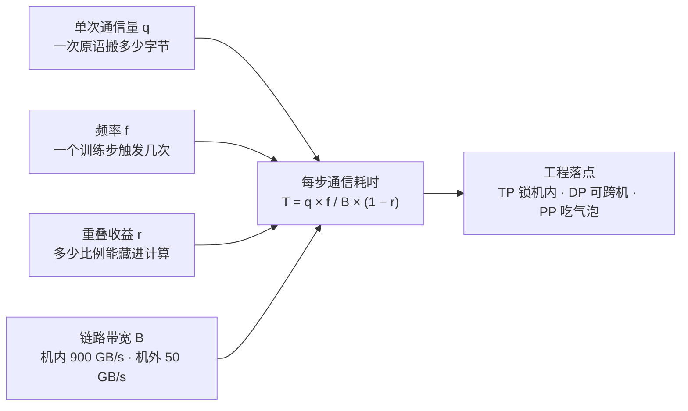
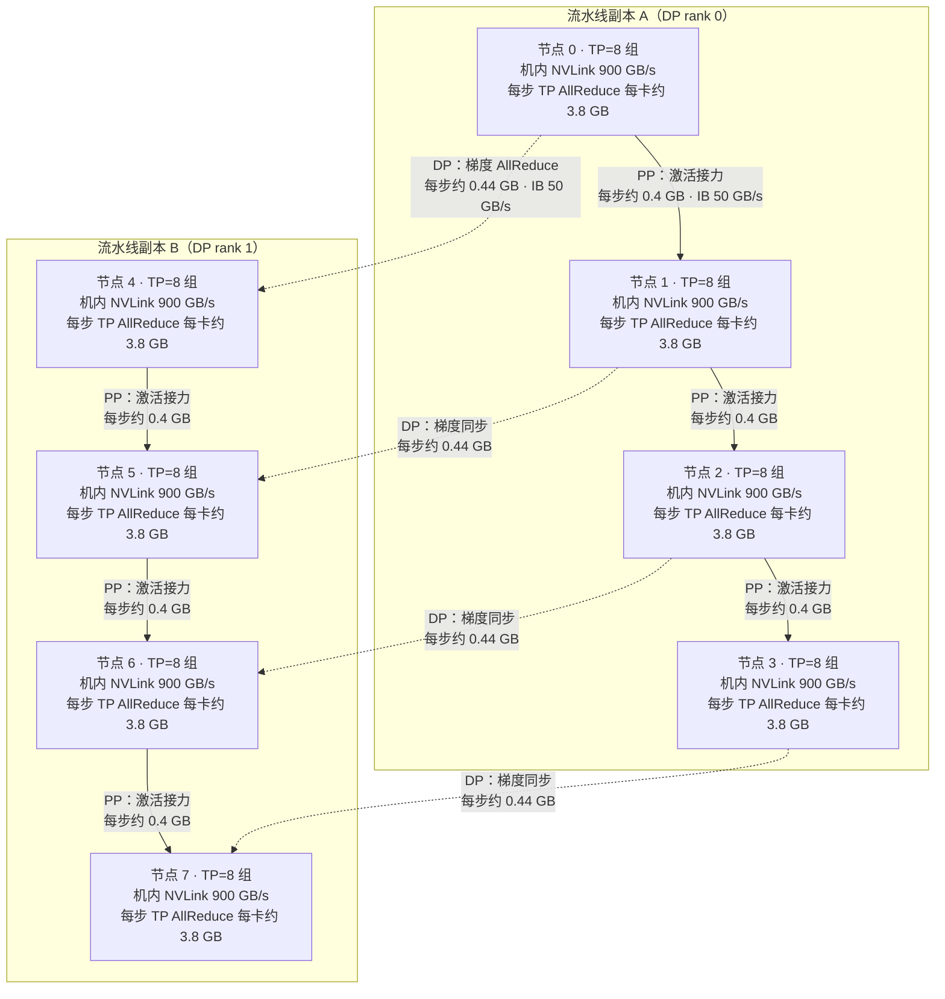

同一个 7B 模型：张量并行（TP）每步要在机内搬约 30 GB 的层输出（8 卡合计，每卡约 3.8 GB），数据并行（DP）每步要跨机同步梯度（纯 DDP 完整副本口径 14 GB，TP/PP 分片后每卡仅约 0.44 GB），流水线并行（PP）每步只在机器之间传约 0.4 GB 的"接力棒"——三种并行策略的通信画像差异巨大，而决定训练快慢的，不是其中任何一个单点数字，而是三个数字的乘积：**单次通信量 × 频率 ×（1−重叠收益）**。硬件带宽与拓扑落位在《[5.7 多卡互联拓扑](/AIInfraGuide/prerequisites/模块一-前置知识/gpu/57-多卡互联拓扑)》讲过（机内 NVLink 900 GB/s、机间 InfiniBand 50 GB/s，同口径差 18 倍），本篇接上通信原语这一环，给 TP、PP、DP 各算一笔"每步搬多少数据"的账，再从账本反推出三条工程结论：**TP 组必须等于节点物理边界、DP 可以跨机、PP 的瓶颈不在通信而在气泡**。这是第 6 章集合通信基础的收尾篇，也是模块三分布式训练的前置预演——本篇只算账，公式级的完整推导留给模块三。

<!-- more -->

## 📑 目录

- [1. 先立框架：每步通信总量怎么算](#1-先立框架每步通信总量怎么算)
- [2. TP 的通信画像：高频、小包、藏不掉](#2-tp-的通信画像高频小包藏不掉)
- [3. DP 的通信画像：低频、大包、能藏起来](#3-dp-的通信画像低频大包能藏起来)
- [4. PP 的通信画像：量小、低频、接力棒](#4-pp-的通信画像量小低频接力棒)
- [5. 三合一总表：一张表记住三种画像](#5-三合一总表一张表记住三种画像)
- [6. 每步通信总账：64 卡 7B 的 TP8、PP4、DP2 实例](#6-每步通信总账64-卡-7b-的-tp8pp4dp2-实例)
- [7. 从"搬多少数据"反推工程结论](#7-从搬多少数据反推工程结论)
- [8. 3D 并行：三种通信同时跑，各走各的路](#8-3d-并行三种通信同时跑各走各的路)
- [9. 三个常见误区](#9-三个常见误区)
- [10. 向后看：本篇是模块三、模块四的前奏](#10-向后看本篇是模块三模块四的前奏)
- [总结](#-总结)
- [自我检验清单](#-自我检验清单)
- [参考资料](#-参考资料)

---

## 1. 先立框架：每步通信总量怎么算

**为什么先立框架？** 因为"通信开销大不大"这个问题，单独看任何一张图都答不了——TP 每次只搬几十 MB，看着很小；DP 每次搬 14 GB，看着很大。但训练是一步一步跑的，**真正要紧的是"每个训练步里，某种通信总共占了多少时间"**。把这个问题拆开，就得到三个小问题：一次搬多少？一步搬几次？能不能边算边搬？

### 1.1 三个小问题 → 一个公式

打个比方，你要给一个食堂做物流预算。三个数字决定总成本：**每趟进货量**（一次搬多少菜）、**每天进货次数**（频率）、**搬运时后厨是不是在闲着**（能不能把搬运藏进备菜时间里）。食堂的账是这样，GPU 的账也是这样：

$$
\underbrace{T_{\text{step}}}_{\text{某种通信每步耗时（秒）}}
= \frac{\underbrace{q}_{\text{单次通信量（字节）}} \times \underbrace{f}_{\text{每步触发次数}}}{\underbrace{B}_{\text{链路带宽（字节/秒）}}}
\times \underbrace{(1 - r)}_{\text{1 − 重叠收益}}
$$

逐项读一遍：$q$ 是**单次通信量**——一次 AllReduce 或 Send/Recv 搬多少字节，由并行策略传什么决定；$f$ 是**频率**——一个训练步里这种通信触发几次，由并行策略的结构决定；$B$ 是**链路带宽**——数据走哪条路（机内 NVLink 还是机间 InfiniBand），由硬件决定；$r$ 是**重叠收益**——通信时间里有多大比例能藏进计算（0 表示完全不能藏，1 表示全部藏掉）。四个输入一组合，就是第 5.7 篇那句"通信量 × 频率 × 能否重叠"的量化版。

这张图把三要素公式拆成四个输入和一个输出：**单次通信量、频率、链路带宽、重叠收益汇成"每步通信耗时"，再落成三种并行策略的工程结论**——后文第 2~4 节就是分别给这四个输入填数字。

💡 **提示**：$T_{\text{step}}$ 是"纯传输时间"——假设链路独占、忽略协议开销和 Ring 算法的带宽损耗系数（第 6.2 篇会推导：8 卡 Ring AllReduce 每卡实际收发量是数据量的 $2 \times 7/8 = 1.75$ 倍，本篇算账时会把系数直接乘进 $q$）。粗算的目的是量级判断，误差在 2 倍以内不影响结论。

带宽口径沿用 5.7 篇的核对结论，本篇只复用两个数字：机内 NVLink 4.0 双向总和 900 GB/s、机间 InfiniBand NDR 单向端口 50 GB/s，同口径差 18 倍（详细核对见《[5.7 多卡互联拓扑](/AIInfraGuide/prerequisites/模块一-前置知识/gpu/57-多卡互联拓扑)》）。

代入一个数值算例找找手感。7B 模型数据并行：$q = 14$ GB（梯度大小，见第 3 节），$f = 1$（每步一次），$B = 50$ GB/s（跨机 InfiniBand），假设重叠收益 $r = 0.7$（七成藏进反向传播）：

$$T_{\text{step}} = \frac{14\ \text{GB} \times 1}{50\ \text{GB/s}} \times (1 - 0.7) \approx 0.28 \times 0.3 \approx 84\ \text{ms}$$

**含义：14 GB 跨机全传要 280 ms，但如果七成能和计算重叠，每步"看得见"的通信只有约 84 ms。** 同一个 $q$，$r$ 不同，命运不同——这为后面"DP 能跨机"埋下伏笔。下面三节，就把 TP、PP、DP 分别代入这个框架。

---

## 2. TP 的通信画像：高频、小包、藏不掉

### 2.1 为什么 TP 每层都要通信？

**张量并行（TP，Tensor Parallelism）是把一个算子的矩阵切成几份、分给多张卡算**——比如把一层 MLP 的 4096×4096 权重按列切成 8 份，8 张卡各算 1/8。切完就带来一个必须付的代价：**每张卡只算出了完整结果的一部分，下一层要算，必须先把这几部分"拼"回一个完整张量**。

打个比方，四个人合拼一幅拼图，各拼一块，拼完必须先把四块拼到一张大板上（这一步就是 AllReduce——所有卡把各自的部分和求和，结果人人拿到），才能开始拼下一幅。TP 的每一层，前向要拼一次、反向还要拼一次，躲不掉。

### 2.2 频率账：每层 4 次，80 层就是 320 次

TP 的通信频率由 Transformer 的结构决定。一个 Transformer 层里有两大块：Attention 和 MLP，每一块的前向、反向各需要一次 AllReduce 把切开的结果合流——**合计每层 4 次**。这个口径有论文原文支持：Megatron-LM 论文（Shoeybi et al., 2019）明确写道，一个模型并行 transformer 层"前向路径 2 次 all-reduce、反向路径 2 次，共 4 次通信操作"。

算频率：

$$
\underbrace{f}_{\text{TP 每步通信次数}} = \underbrace{4}_{\text{每层 4 次（Attention/MLP × 前向/反向）}} \times \underbrace{L}_{\text{层数}}
$$

80 层的大模型：$4 \times 80 = 320$ 次/步。7B 模型 32 层：128 次/步。**无论哪个数字，都是"每步上百次"的量级**——这就是 TP 频率账的全部要点。

### 2.3 时间账：同一次通信，机内机外差 18 倍

单次通信量 $q$ 是**层张量**：一层的输出激活，几百到几千的 hidden 维度 × 序列长度 × batch 大小，几十 MB 量级（具体数字见第 6 节算例）。设一次 AllReduce 搬 1 GB（教学口径，方便心算）：

- 走 NVLink 4.0（900 GB/s）：$1 / 900 \approx 1.1$ ms；
- 走 IB NDR（50 GB/s）：$1 / 50 = 20$ ms。

**同一笔通信，机内约 1.1 ms，机外约 20 ms，差 18 倍**（估算假设：理论带宽、单链路独占、未计协议开销）。再乘上频率：320 次/步 × 1.1 ms ≈ 0.35 秒（机内），320 次 × 20 ms ≈ 6.4 秒（机外）。**如果 TP 跨机，每步纯通信 6.4 秒，训练速度直接断崖式下降。** 这就是"TP 不跨机"的物理原因。

### 2.4 为什么 TP 的通信"藏不掉"？

重叠（Overlap，让通信和计算并行）是隐藏通信的标准手段，但 TP 用不上。原因在于依赖关系：**下一层的计算必须等上一层的 AllReduce 完成**——输出没拼齐，下一层无从算起。这个串行依赖链就是**关键路径**（训练步里最长的、绕不开的那条链）。TP 的每次 AllReduce 都在这条链上：等它，就是等通信；不等它，就没法往下算。通信和计算之间没有可以并行的时间窗口。

⚠️ **注意**：这正是第 6.4 篇《[通信与计算 Overlap](/AIInfraGuide/prerequisites/模块一-前置知识/communication/64-通信与计算-overlap)》的核心——不是所有通信都能重叠。TP 通信**卡在关键路径上、不可重叠**（$r \approx 0$），所以它对带宽极其敏感：高频（每步上百次）+ 不可重叠 + 机外慢 18 倍，三个条件叠加，TP 只有机内 NVLink 扛得住。

📌 **关键点**：TP 的画像 = **单次几十 MB（小包）× 每步上百次（高频）× 不可重叠**。结论：**TP 组必须锁在机内**。

---

## 3. DP 的通信画像：低频、大包、能藏起来

### 3.1 传什么、传几次？

**数据并行（DP，Data Parallelism）是每张卡各存一份完整模型，吃不同的数据**。每张卡算完自己的数据后，各自算出一份**梯度**（模型参数应有的更新量）。要让所有卡往同一个方向更新，必须把所有卡的梯度**求平均**——这就是每步一次 AllReduce。

DP 的两个数字简单到极致：**单次通信量 $q$ = 模型梯度大小，频率 $f$ = 每步 1 次**。7B 模型 BF16 梯度 = $7 \times 10^9 \times 2$ 字节 = **14 GB**。

### 3.2 用 Ring 公式严格化：8 卡到底搬多少？

直觉上，AllReduce 是"所有人把梯度求和再发给所有人"，每卡总通信量是梯度大小的 2 倍。精确的账要用第 6.2 篇的 Ring AllReduce 公式：每卡实际收发量

$$
\underbrace{M_{\text{per rank}}}_{\text{每卡通信量}} = \underbrace{\frac{2(N-1)}{N}}_{\text{Ring 系数：8 卡时 } = 1.75} \times \underbrace{M}_{\text{总数据量（梯度）}}
$$

代入 7B（$M = 14$ GB，$N = 8$）：$1.75 \times 14 \approx 24.5$ GB/卡。走机内 NVLink 4.0：$24.5 / 900 \approx 27$ ms；走机外 IB：$24.5 / 50 \approx 490$ ms（估算假设：理论带宽、单链路；primer §9.2 按 $2M$ 近似口径给出约 28 GB、31 ms，本篇按精确系数 1.75 算，量级一致）。

70B 模型呢？梯度 $M = 140$ GB。8 卡精确系数：$1.75 \times 140 = 245$ GB；当参与卡数很多时 $(N-1)/N \approx 1$，每卡约 $2M = 280$ GB。**跨机走 IB（50 GB/s）：280 GB ÷ 50 GB/s ≈ 5.6 秒**（primer 沿用口径；按 8 卡精确系数重算是 245 GB、约 4.9 秒，量级一致，差异来自 $(N-1)/N$ 系数，此处保留"约"字）。

**这就是为什么 70B 级别的大模型不可能靠朴素 DDP 训练**——每步花 5 秒量级纯同步梯度，训练直接停摆。ZeRO 系列、梯度压缩、通信重叠，都是被这个 5.6 秒逼出来的（第 7 节展开）。

### 3.3 为什么 DP 反而能跨机？

同样的 14 GB 梯度，如果频率是每步 320 次，那是灾难；但 DP 的频率是**每步 1 次**，而且**可以重叠**：反向传播是从最后一层往前算的，前面的层还在算梯度时，后面的层梯度已经就绪，可以立刻触发 AllReduce（PyTorch DDP 的 bucket 机制就是这么干的，primer 第 7 节讲过）。于是 $r$ 可以做到 0.5~0.9，可见通信时间被大幅压缩。

📌 **关键点**：DP 的画像 = **单次 GB 级（大包）× 每步 1 次（低频）× 可重叠**。结论：**DP 是三个维度里唯一"带宽要求不高、位置最自由"的维度，可以跨机**。

---

## 4. PP 的通信画像：量小、低频、接力棒

### 4.1 传什么？一根接力棒

**流水线并行（PP，Pipeline Parallelism）是把模型按层切成几段，每段放一台机器**，第 1 段算完喂给第 2 段，像接力赛一样。机器之间传的只是**段边界的激活值**（前一层的输出，后一层的输入），用点对点的 Send/Recv 原语（一对一传递，primer 第 3 节讲过）。

打个比方，接力棒：4 个选手（4 台机器）各跑一段，交接的瞬间只递一根棒（一份 micro-batch 的激活值），不是把整个赛场搬过去。**micro-batch** 是流水线并行里把大 batch 切成的小份——切得越细，各段越能同时忙起来，但交接次数也越多。

### 4.2 通信不贵，贵的是气泡

PP 的单次通信量是**一份 micro-batch 的激活**（MB 级，比梯度小两个数量级），频率是**每个 micro-batch 在每个段边界传 1 次**——就算每步 8 个 micro-batch、3 个边界，也才 24 次。这个量走 IB 毫无压力（第 6 节算给你看）。

但 PP 有自己独有的代价：**流水线气泡（bubble）**——流水线刚启动和快结束时，后面的段/前面的段无活可干，GPU 空转。气泡占比公式（只呈现，不推导；这是计算侧问题，完整推导在模块三《[第 7 章 流水线并行](/AIInfraGuide/distributed/模块三-分布式训练/第7章-流水线并行)》）：

$$
\text{气泡占比} = \frac{P - 1}{P - 1 + M}
$$

其中 $P$ 是**流水线级数**（段数），$M$ 是 **micro-batch 数量**。代入 $P = 4$、$M = 8$：$3 / 11 \approx 27\%$——**近三成 GPU 时间在空等**。增大 $M$ 能缩小气泡（$M = 16$ 时 $3/18 \approx 17\%$），但 micro-batch 越多，显存里同时存着的激活越多。

📌 **关键点**：PP 的画像 = **单次 MB 级（小包）× 每步几十次（低频）× 基本不可重叠（但量小无所谓）**。结论：**PP 的通信不是瓶颈，瓶颈是气泡——而气泡是计算侧问题，不是通信侧问题**。

---

## 5. 三合一总表：一张表记住三种画像

三节的账合并成一张表，这是本篇的核心记忆载体（六列：原语、单次量、频率、每步总量、落点、能否重叠）：

| 📊 维度 | 通信原语 | 单次通信量 | 频率（每步） | 每步总量 | 典型落点 | 能否重叠 |
|---|---|---|---|---|---|---|
| 张量并行 TP | AllReduce（层输出合流） | 层张量，几十 MB 级 | 每层 4 次；32 层 128 次，80 层 320 次 | 每卡约 3.8 GB（8 卡合计约 30 GB，见第 6 节） | **机内 NVLink** | 否，卡关键路径 |
| 流水线并行 PP | 点对点 Send/Recv | micro-batch 激活，MB 级 | 每边界每 micro-batch 1 次，约 24 次 | 约 0.4 GB | 跨机 IB | 基本否（量小，无所谓） |
| 数据并行 DP | AllReduce（梯度同步） | **模型梯度，GB 级**（7B 为 14 GB） | 每步 1 次 | 每卡约 0.44 GB（本配置分片口径；纯 DDP 对照 14 GB） | 跨机 IB | **是**，与反向传播重叠 |

📌 **关键点（读表要点）**：三个维度的"贵"完全不是一回事——TP 贵在**频率高且藏不掉**，DP 贵在**单次量巨大**，PP 两头都不贵但**有气泡**。表里最反直觉的一格是"能否重叠"：**通信量最大的 DP 反而最能藏，通信量最小的 TP 反而最藏不掉**。这一格直接决定了三者的部署边界。

---

## 6. 每步通信总账：64 卡 7B 的 TP8、PP4、DP2 实例

框架和画像都有了，现在算一笔完整的总账：**64 卡（8 节点 × 8 卡）训练 7B 模型，采用 TP=8、PP=4、DP=2 的 3D 并行**（8 × 4 × 2 = 64，正好用完）。7B 模型按 LLaMA-2 风格取 32 层、hidden = 4096；序列长度 2048，每步 8 个 micro-batch，BF16（每元素 2 字节）。

**这是教学算例：每个数字都给出"公式 + 代入值 + 估算假设"，请把它当量级参考，不当实测值。**

### 6.1 第一步：TP 账（机内，NVLink 900 GB/s）

单次 AllReduce 的数据 = 一层输出张量：

$$
q_{\text{TP}} = \underbrace{4096}_{\text{hidden}} \times \underbrace{2048}_{\text{序列长度}} \times \underbrace{2}_{\text{BF16 字节}} \approx 16.8\ \text{MB}
$$

**关键的一步：Ring 系数要乘在"每卡持有的分片"上，不是完整张量上**（NCCL 语义：busbw = algbw × 2(N-1)/N，系数修正的是每卡数据量，见 6.2 篇与 primer §8.5）。TP=8 时每卡只持有完整张量的 1/8：$16.8 / 8 = 2.1$ MB；乘上 Ring 系数 1.75 → **每次 AllReduce 每卡实际链路字节 $\approx 2.1 \times 1.75 \approx 3.7$ MB**。次数：每层 4 次 × 32 层 × 8 个 micro-batch = 1024 次/步。于是每步每卡约搬 $3.7\ \text{MB} \times 1024 \approx 3.8$ GB：

$$
T_{\text{TP}} = \frac{3.8\ \text{GB}}{900\ \text{GB/s}} \approx 4.2\ \text{ms/步}
$$

**口径说明**：若把 8 张卡各自的链路字节加总，每次 AllReduce 的"全系统聚合流量" $= 3.7 \times 8 \approx 29$ MB、每步约 30 GB——那是系统总流量，**不是任何一张卡的链路字节**；算每卡耗时只能用分片口径。

### 6.2 第二步：PP 账（跨机，IB 50 GB/s）

PP=4 → 3 个段边界，每 micro-batch 每边界传一份激活（16.8 MB，与 TP 的单次量相同——都是层输出）：

$$
T_{\text{PP}} = \frac{16.8\ \text{MB} \times 3 \times 8}{50\ \text{GB/s}} \approx 8\ \text{ms/步}
$$

（只计前向激活传递；反向的梯度回传同量，两方向合计约 16 ms——PP 的账同样翻倍，但量级仍是 10 ms 级，结论不变。）

### 6.3 第三步：DP 账（跨机，IB 50 GB/s）

DP=2 → 梯度组里只有 2 张卡，Ring 系数 $2 \times (2-1)/2 = 1$（1.75 退化为 1）。**但"每卡搬完整梯度 14 GB"只对纯 DDP（每卡持完整副本）成立；本配置里每卡只持有完整梯度的 1/32**——TP=8 把参数切成 8 份，PP=4 再切成 4 份，每卡分片 = $14 \div 32 \approx 0.44$ GB。分片口径：

$$
T_{\text{DP}} = \frac{0.44\ \text{GB} \times 1}{50\ \text{GB/s}} \approx 9\ \text{ms/步}
$$

**对照口径（纯 DDP 完整副本，未计 TP/PP 分片）**：$14\ \text{GB} \div 50\ \text{GB/s} = 280$ ms——这个数字只在纯 DDP 场景成立，本篇保留它仅作量级对照；本配置每卡的实际同步量是 0.44 GB。

### 6.4 合计：通信主要花在谁身上？

| 📊 通信 | 链路 | 每步总量（每卡） | 纯传输时间 | 占通信合计 |
|---|---|---|---|---|
| TP AllReduce | 机内 NVLink | 约 3.8 GB | 约 4 ms | 约 20% |
| PP Send/Recv | 跨机 IB | 约 0.4 GB | 约 8 ms | 约 38% |
| DP 梯度 AllReduce | 跨机 IB | 约 0.44 GB（分片口径） | 约 9 ms | 约 42% |
| 合计 | — | — | 约 21 ms | 100% |

（对照口径：纯 DDP 完整副本下 DP 为 14 GB、280 ms，未计 TP/PP 分片，仅作量级对照，不参与本表占比。）

📌 **关键点（本算例的结论）**：**分片口径下三笔通信都在 10 ms 量级（TP 约 4 ms、PP 约 8 ms、DP 约 9 ms，合计约 21 ms）——本配置没有"谁占近九成"的悬殊，通信不再是单一瓶颈**。真正决定部署的是"能不能藏"：DP 的约 9 ms 大部分可重叠（$r \approx 0.7$ 时可见成本约 3 ms，见 1.1 节）；PP 的约 8 ms 可被其他 micro-batch 的计算掩盖；TP 的约 4 ms 虽然量级最小，却 100% 暴露在关键路径上——**按"藏不掉的通信"排序，TP 反而是最大项**。"DP 是账面上最贵"只在纯 DDP 完整副本对照口径下成立（14 GB、280 ms，未计 TP/PP 分片）——工程界对 DP 下手最狠（ZeRO 切碎梯度、梯度压缩、bucket 重叠），正是冲着对照口径里那个 280 ms 去的。真实集群的 NCCL 会启用多张网卡聚合（多 rail），实际耗时通常更短——本算例采用与 primer 一致的单链路保守口径，**量级结论不变，精确值请以实测为准**。

反过来看 TP 的约 4 ms：**它是"按层摊开的 4 ms"**——每次 AllReduce 约 4 µs，每层 4 次共约 16 µs，而每层每 micro-batch 的计算约 0.6 ms（估算假设：8 卡 × 989 TFLOPS × 60% 利用率），通信约占计算时间的 3%，且这段等待**藏不掉**（第 2.4 节）。所以：**DP 是"账面上最贵但能藏"，TP 是"账面上最小但每层都在疼"**——这就是为什么 TP 必须机内、DP 可以跨机的完整论证。

---

## 7. 从"搬多少数据"反推工程结论

账算完了，现在从账本反推四条工程结论——每条都能在上一节的数字里找到依据。

### 7.1 TP 组 = 节点的物理边界

TP 高频（每步上百次）+ 不可重叠（$r = 0$）+ 机外慢 18 倍，三个条件叠加，**TP 组跨机的代价是每步数秒的纯通信**。所以工程上的硬规则是：**TP 组内所有卡必须在同一台机器内，通过 NVLink 全互联**（5.7 篇第 7 节讲过 64 卡落位：TP=8 恰好等于一个节点）。这不是口味问题，是账算出来的边界。

### 7.2 DP 可以跨机，但"跨机"是有代价的

DP 低频（每步 1 次）+ 可重叠（$r$ 高），所以跨机可行——**但可行不等于免费**：70B 每步 5.6 秒量级的梯度同步（第 3.2 节）摆在那里。跨机 DP 的前提是做好三件事：**重叠（把同步藏进反向传播）、压缩（把 14 GB 变小）、或者干脆切碎（ZeRO）**。不做任何优化就把 DP 撒满跨机集群，吞吐照样崩。

### 7.3 ZeRO：用"多笔小通信"换显存

DP 的梯度账还有一个隐藏问题：每张卡都要存完整梯度，显存压力大。**ZeRO（Zero Redundancy Optimizer）的思路是：不存完整梯度，只存自己的 1/N 分片**。通信上对应的变化是：一次 2M 的 AllReduce 变成 ReduceScatter + 各算各的（或 ZeRO-3 再加 AllGather 取参数）——**每卡每次只搬自己的分片，通信总量基本不变（ZeRO-3 与 DDP 同量级；ZeRO-2 只切梯度，每卡通信量反而减半），但单笔通信变小、分片粒度变细**。牺牲了什么？多出的小笔通信带来更多次启动开销，参数取用还要等 AllGather——这就是"用通信结构换显存"的完整说法（公式级展开在模块三《[第 5 章 ZeRO 系列](/AIInfraGuide/distributed/模块三-分布式训练/第5章-zero系列)》）。

### 7.4 梯度压缩：把 q 变小

回到公式 $T = q \times f / B \times (1-r)$：DP 的 $q$（纯 DDP 完整副本口径下 = 14 GB）是最大的单一项，**把 $q$ 变小是最直接的杠杆**。梯度压缩（量化、稀疏化、低秩分解）就是在精度可容忍的前提下砍 $q$——砍到 1/4，280 ms 变 70 ms。代价是精度损失和压缩解压的计算开销，所以压缩率、压缩时机都是工程调优对象。

📌 **关键点**：四条结论共用同一个公式——**TP 靠"换更快的路"（机内），DP 靠"变少、变碎、藏起来"（重叠 + ZeRO + 压缩），PP 靠"算调度"（消气泡）**。没有免费午餐，每项优化的代价上面都已列出。

---

## 8. 3D 并行：三种通信同时跑，各走各的路

TP、PP、DP 同时启用就是 **3D 并行（3D Parallelism）**。一个常见疑问是：三种通信挤在一起，会不会互相抢带宽？答案在账本里——**三种通信走三条完全不同的链路，物理上不互抢**：

这张图讲的是 3D 并行下三类通信的叠加，与 5.7 篇第 7 节的拓扑图对应，但重点从"走哪条路"换成了"搬多少数据"：**实线箭头 = PP 的激活接力（跨机，每步约 0.4 GB，小）；虚线箭头 = DP 的梯度同步（跨机，每步约 0.44 GB 分片，量级与 PP 相当）；每个节点框内 = TP 的每层 AllReduce（机内，每步每卡约 3.8 GB，频率最高但走最快的路）**。三类通信分处机内 NVLink、跨机 IB 两条物理通道，互不挤占；真正需要调度的是**时间**——谁在关键路径上、谁能藏，这由第 2~4 节的画像决定。

⚠️ **注意**：不互抢的前提是链路带宽足够宽。当 DP 的梯度同步和 PP 的接力恰好同时打到同一根 IB 链路上时，两者会共享带宽（按序排队），但 DP 的频率低（每步 1 次）、PP 的量小（0.4 GB），挤占的影响远小于 TP 跨机会造成的灾难——这又一次印证了"TP 锁机内"这条规则的优先级。

---

## 9. 三个常见误区

**误区 1："PP 通信量小，所以 PP 不重要。"**

错。PP 的通信量确实最小（第 4 节账本：0.4 GB/步），但 PP 的瓶颈不在通信而在**气泡**——P=4、M=8 时近 27% 的 GPU 时间空转，这个损失远大于通信本身。优化 PP 的正确方向是**调度**（增加 micro-batch、改进流水线排程、1F1B 等），而不是加带宽。把"通信量小"等同于"不重要"，会错过真正的瓶颈。

**误区 2："DP 跨机不花钱。"**

错。DP 的单次通信量在纯 DDP 完整副本口径下是三者里最大的：70B 每步约 5.6 秒量级（第 3.2 节），这不是可以忽略的开销；即便在本篇 3D 配置的分片口径下，每卡也要同步约 0.44 GB、约 9 ms（第 6.3 节）。跨机 DP 能成立，靠的是**重叠、压缩、ZeRO 三件套**同时工作；缺了它们，"可跨机"就退化成"能跑但吞吐崩盘"。正确表述是：**DP 跨机的代价是"可管理"的，不是"不存在"的**。

**误区 3："TP 通信也可以重叠，藏进计算里。"**

错。TP 的 AllReduce 结果被下一层直接依赖，**通信和计算之间没有可并行的时间窗口**——它卡在关键路径上（第 2.4 节；依赖关系的完整分析见第 6.4 篇《[通信与计算 Overlap](/AIInfraGuide/prerequisites/模块一-前置知识/communication/64-通信与计算-overlap)》）。反例是 DP：梯度同步只依赖"该层反向算完"，而反向还在算前面的层，所以能藏。**能不能重叠不是态度问题，是数据依赖结构问题**——把 TP 当 DP 去"重叠"，调参再久也不会生效。

📌 **关键点**：三个误区的共同根源是**只看了三个要素中的一两个**。通信量小 ≠ 不重要（还有气泡）、低频 ≠ 免费（纯 DDP 口径还有 14 GB，分片口径也有 0.44 GB）、带宽够 ≠ 能重叠（还有关键路径）。三个要素必须一起看。

---

## 10. 向后看：本篇是模块三、模块四的前奏

本篇只做了一件事：用"单次通信量 × 频率 ×（1−重叠收益）"给 TP、PP、DP 算通信账。这套账在后面的模块里会以公式级展开：

- **模块三《[4.1 数据并行详解](/AIInfraGuide/distributed/模块三-分布式训练/41-数据并行详解)》**：DDP 与 FSDP 的通信量公式（$2\Psi$ vs $3\Psi$）——本篇 DP 的 14 GB 账在那里变成通用公式；
- **模块三《[第 6 章 张量并行与序列并行](/AIInfraGuide/distributed/模块三-分布式训练/第6章-张量并行与序列并行)》**：TP 的列切/行切与 AllReduce 落点——本篇"每层 4 次"在那里变成算子级推导；
- **模块三《[第 7 章 流水线并行](/AIInfraGuide/distributed/模块三-分布式训练/第7章-流水线并行)》**：气泡公式的完整推导与 1F1B 调度——本篇"只呈现不推导"的气泡公式在那里补上证明；
- **模块三《[第 11 章 3D 并行与混合并行策略](/AIInfraGuide/distributed/模块三-分布式训练/第11章-3d并行与混合并行策略)》**：本篇第 6 节的总账算例在那里变成通用成本模型；
- **模块四《[6.2 张量并行推理](/AIInfraGuide/inference/模块四-推理优化/第6章-分布式推理/62-张量并行推理)》**：推理侧的 TP 通信同样关键——只是传的东西从"层输出"换成了 **KV Cache 分片**，频率的算法也不同（推理 batch 动态变化，通信量随之波动）。本篇的算账框架可以直接迁移过去。

一句话预告：**训练算的是"每步搬多少"，推理算的是"每 token 搬多少"——框架不变，变量不同。**

---

## 📝 总结

1. **三要素框架**：每步通信耗时 $T = q \times f / B \times (1 - r)$——单次通信量、频率、带宽、重叠收益四个输入，决定一种并行策略的通信画像；5.7 篇负责带宽 $B$，本篇负责 $q$、$f$、$r$ 的算账。
2. **TP 画像**：层张量（几十 MB）× 每层 4 次（80 层 320 次/步）× 不可重叠；1 GB 通信机内约 1.1 ms、机外约 20 ms，差 18 倍——**TP 组必须等于节点物理边界**。
3. **DP 画像**：梯度（7B 为 14 GB）× 每步 1 次 × 可重叠；8 卡 Ring 精确系数 1.75，每卡约 24.5 GB、机内约 27 ms；70B 跨机约 5.6 秒——**DP 跨机的代价"可管理"但并非"不存在"**，ZeRO、压缩、重叠三件套由此而来。
4. **PP 画像**：micro-batch 激活（MB 级）× 低频 × 接力棒式 Send/Recv——**通信不贵，贵的是气泡**（$(P-1)/(P-1+M)$，P=4、M=8 时约 27%），气泡是计算侧问题。
5. **总账结论**：64 卡 7B（TP8/PP4/DP2）分片口径下每步纯通信约 21 ms，三笔都在 10 ms 量级（TP 约 4 ms、PP 约 8 ms、DP 约 9 ms）——"DP 占近九成"只在纯 DDP 完整副本对照口径（14 GB、280 ms）下成立；**"账面上最贵的 DP 最能藏、最小的 TP 最藏不掉"才是本配置真正的分水岭**——这就是为什么对 DP 用重叠和切碎、对 TP 用机内锁定的完整论证。

## 🎯 自我检验清单

- 能写出每步通信耗时公式 $T = q \times f / B \times (1-r)$，并解释每个符号的中文含义（单次通信量、频率、带宽、重叠收益）
- 能说出 TP 每层 4 次 AllReduce 的构成（Attention 前向/反向 + MLP 前向/反向），并算出 80 层模型每步的通信次数（320 次）
- 能手算 1 GB 数据在 NVLink 4.0（900 GB/s）与 IB NDR（50 GB/s）上的传输时间（约 1.1 ms vs 20 ms，差 18 倍），并说清估算假设
- 能用 Ring 公式 $\frac{2(N-1)}{N} \times M$ 算出 8 卡 7B 的每卡梯度通信量（约 24.5 GB）与机内耗时（约 27 ms），误差不超过 20%
- 能解释为什么 DP 的 14 GB 大通信可以跨机（每步 1 次 + 可与反向传播重叠），而 TP 的几十 MB 小通信必须机内（每步上百次 + 卡关键路径）
- 能写出流水线气泡占比公式 $(P-1)/(P-1+M)$ 并代入 P=4、M=8 计算（约 27%），能说出它为什么是计算侧问题
- 能独立复算 64 卡 7B（TP8/PP4/DP2）的每步通信总账（TP 约 4 ms、PP 约 8 ms、DP 分片口径约 9 ms；纯 DDP 完整副本对照 280 ms），并说清"分片口径 vs 完整副本口径"的区别和"能否藏住"这个分水岭
- 能说出 ZeRO 切碎梯度在通信上的本质（多笔小通信、每卡只搬分片、总量基本不变）以及它牺牲了什么
- 能指出"PP 通信量小所以不重要""DP 跨机不花钱""TP 通信能重叠"三个误区各错在哪
- 能画出 3D 并行下三类通信的链路分布（TP 机内、PP 跨机接力、DP 跨机同步），标注各自的每步通信量
- 能把本篇框架迁移到推理场景：说出推理侧 TP 传的是什么（KV Cache 分片）以及和训练侧"每步"口径的差别

## 📚 参考资料

**官方文档**

- [NVIDIA NCCL Documentation](https://docs.nvidia.com/deeplearning/nccl/user-guide/docs/)：NCCL 官方文档，拓扑感知、算法选择（Ring/Tree）与多 rail 传输的权威说明
- [NVIDIA NCCL Collective Operations API](https://docs.nvidia.com/deeplearning/nccl/user-guide/docs/api/colls.html)：AllReduce/AllGather/ReduceScatter 等原语的官方语义
- [PyTorch Distributed Data Parallel 文档](https://pytorch.org/docs/stable/notes/ddp.html)：DDP 的 bucket 通信重叠机制与参数说明
- [NVIDIA DGX H100 Datasheet](https://www.nvidia.com/content/dam/en-zz/Solutions/Data-Center/nvidia-dgx-h100-datasheet.pdf)：NVLink 900 GB/s、8 × ConnectX-7 400Gb/s 的官方规格

**论文**

- [Megatron-LM: Training Multi-Billion Parameter Language Models Using Model Parallelism（Shoeybi et al., 2019, arXiv:1909.08053）](https://arxiv.org/abs/1909.08053)：TP 通信分析的原始出处——论文明确一个 transformer 层前向 2 次、反向 2 次共 4 次 all-reduce（§3.1 与 Figure 4）；8.3B 模型用 TP=8 + 64 路 DP 在 512 卡上训练并报告 76% 扩展效率（本文引用其定性结论，论文中的精确性能数字以原文为准）

**站内延伸**

- [第 6 章 集合通信基础（章首页）](/AIInfraGuide/prerequisites/模块一-前置知识/第6章-集合通信基础)：本章导览——[6.2](/AIInfraGuide/prerequisites/模块一-前置知识/communication/62-ring-allreduce) Ring 系数 2(N-1)/N 的推导、[6.5](/AIInfraGuide/prerequisites/模块一-前置知识/communication/65-nccl实战) busbw 判读、本篇 7B 梯度账与 28 GB 近似口径
- [5.7 多卡互联拓扑](/AIInfraGuide/prerequisites/模块一-前置知识/gpu/57-多卡互联拓扑)：硬件带宽口径（NVLink 900 GB/s、IB 50 GB/s、18 倍差距）与拓扑落位
- [6.1 集合通信原语](/AIInfraGuide/prerequisites/模块一-前置知识/communication/61-集合通信原语)：五大原语的语义与通信量一览
- [6.4 通信与计算 Overlap](/AIInfraGuide/prerequisites/模块一-前置知识/communication/64-通信与计算-overlap)：哪些通信能重叠、哪些卡关键路径的依赖分析
- [模块三 4.1 数据并行详解](/AIInfraGuide/distributed/模块三-分布式训练/41-数据并行详解)、[第 6 章 张量并行](/AIInfraGuide/distributed/模块三-分布式训练/第6章-张量并行与序列并行)、[第 7 章 流水线并行](/AIInfraGuide/distributed/模块三-分布式训练/第7章-流水线并行)、[第 11 章 3D 并行](/AIInfraGuide/distributed/模块三-分布式训练/第11章-3d并行与混合并行策略)：本篇账本的公式级展开
- [模块四 6.2 张量并行推理](/AIInfraGuide/inference/模块四-推理优化/第6章-分布式推理/62-张量并行推理)：推理侧 TP 通信（KV Cache 分片）的对应分析
