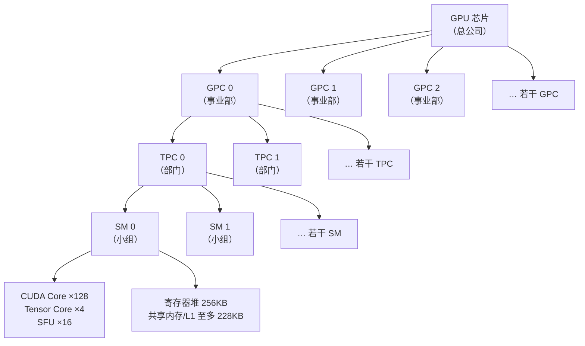
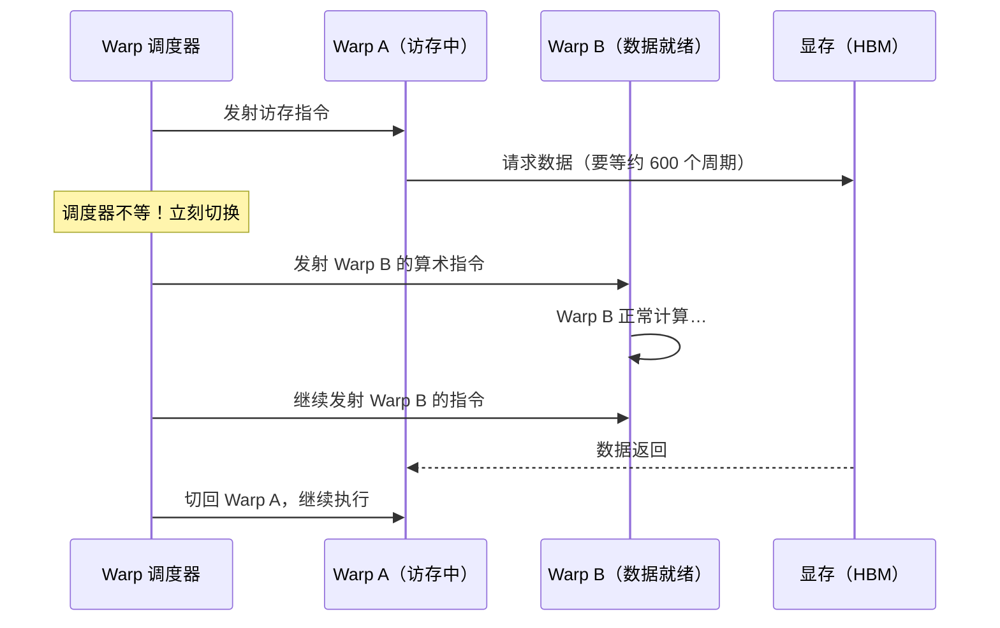

在 H100 的晶体管预算里，“把单核做得更快”这条路已经走到尽头：全卡 132 个 SM，每个 SM 有 4 个 Warp 调度器，每个时钟周期能发射 4 条 Warp 指令（一条 Warp 指令同时驱动 32 个线程）——折算下来，全卡每个时钟周期有 132 × 4 = 528 条 Warp 指令的发射位、约 16,896 个线程在同时推进；按约 1.98 GHz 的加速频率估算，每秒约有 10^12（一万亿）条 Warp 指令发射位。CPU 走的是完全相反的路：把晶体管砸进分支预测和乱序执行，把单条指令的延迟压到纳秒级。深度学习最终站到了 GPU 这一边，不是因为 GPU“单核算得快”，而是因为它的工作负载天然适合“人海战术”。上一篇文章（5.1 架构演进）讲了 GPU 怎么一代代变强，这篇把镜头固定在某一代内部：从设计哲学讲起，逐层拆开 GPC → TPC → SM 的组织、SM 内部组件与 Warp 执行模型，给你一张阅读后续所有硬件文章都需要的 GPU 内部地图。

<!-- more -->

## 📑 目录

- [1. 为什么 GPU 和 CPU 长得完全不一样](#1-为什么-gpu-和-cpu-长得完全不一样)
- [2. 深度学习为什么天然适合 GPU](#2-深度学习为什么天然适合-gpu)
- [3. GPU 内部地图：GPC → TPC → SM](#3-gpu-内部地图gpc--tpc--sm)
- [4. 钻进 SM：小组内部有什么](#4-钻进-sm小组内部有什么)
- [5. Warp：GPU 真正执行指令的最小单位](#5-warpgpu-真正执行指令的最小单位)
- [6. 为什么 CPU 没有"赢回来"：延迟掩盖](#6-为什么-cpu-没有赢回来延迟掩盖)
- [7. 下一站：算力再高，数据喂不上来也白搭](#7-下一站算力再高数据喂不上来也白搭)
- [总结](#-总结)
- [自我检验清单](#-自我检验清单)
- [参考资料](#-参考资料)

---

## 1. 为什么 GPU 和 CPU 长得完全不一样

### 1.1 一个思维实验：批改一万份试卷

假如你有一万份选择题试卷要批改，摆在你面前的有两种方案，你选哪个？

**方案 A**：请一位经验丰富的阅卷老师。他速度快、能处理各种复杂题型（作文、证明题都不在话下），但一次只能改一份——改完一万份要很久。

**方案 B**：请一万个临时工。每人只会“对答案”这一件事，但所有人同时开工——几秒钟就全部改完了。

两个方案都没有错，它们优化的根本不是同一个指标。这里引出两个定义：

- **延迟（Latency）**：完成**一件**任务要等多久。
- **吞吐（Throughput）**：单位时间里能完成**多少件**任务。

方案 A 优化延迟，方案 B 优化吞吐。换成芯片的语言：**CPU 是延迟导向（Latency-oriented）——把单件事做到最快；GPU 是吞吐导向（Throughput-oriented）——把一万件事一起做完。**

这个区别不是“谁比谁强”，而是同一块芯片面积、同一个功耗预算下的两种极端设计选择。记住这句话，后面所有架构细节都是它的投影。

### 1.2 一张对比表，逐行解释“为什么”

| 📊 对比维度 | CPU | GPU |
|---|---|---|
| 设计目标 | 低延迟处理复杂任务 | 高吞吐处理大量简单任务 |
| 核心数量 | 几个到几十个“大核” | 数千到上万个“小核” |
| 单核能力 | 强（复杂分支预测、乱序执行） | 弱（简单 ALU，按序执行） |
| 缓存占比 | 芯片面积的大部分 | 芯片面积的小部分 |
| 控制逻辑 | 复杂（乱序执行、分支预测器） | 简单（大量核心共享控制单元） |
| 内存带宽 | 较低（DDR5 几十到几百 GB/s） | 极高（HBM3 约 3.35 TB/s） |
| 适合任务 | 串行逻辑、操作系统、网络服务 | 矩阵运算、数据并行、图形渲染 |

这张表里每一行都不是孤立的数字，而是**同一个设计决策的六个投影**。逐行解释为什么：

**核心数量**：晶体管预算固定，CPU 把钱花在“每个核的能力”上，GPU 把钱花在“核的数量”上。H100 有 132 个 SM，每个 SM 128 个 FP32 核心，全卡约 16,896 个“小核”（官方规格）；高端服务器 CPU 通常只有几十个核——两个数量级的差距。

**单核能力**：CPU 的单核里塞了分支预测器（猜 if 走哪条路，猜对了就不用等）和乱序执行引擎（指令不按顺序排，硬件自己找并行度）。这些逻辑让单线程更快，但极其吃面积。GPU 的核不做这些——就是一组简单的 ALU（算术逻辑单元），按顺序执行，所以便宜到可以复制一万份。

**缓存占比**：CPU 用大缓存降低访存延迟——数据命中缓存就不用去内存等几百个周期。GPU 的缓存占比小得多，因为它不需要“用缓存等数据”，它用**别的线程填时间**（这就是第 6 节的延迟掩盖，先记下这个伏笔）。

**控制逻辑**：一万个核不可能每个都配一套复杂控制器——GPU 的做法是让一大组核共享一个简单的控制单元，大家一起听同一个指挥。这也是“小核”能做得这么小的原因。

**内存带宽**：一万个核同时要数据，带宽不高的后果是大家一起饿肚子。所以 GPU 配了 HBM（高带宽内存），约 3.35 TB/s；CPU 的 DDR5 通常在几十到几百 GB/s（取决于内存通道数，单通道约 38~45 GB/s 量级）。带宽差了一个数量级以上，而 HBM 为什么能做到这么快，是下一篇文章（5.3 存储层次）的主题。

**适合任务**：这一行是前五行的结论——设计目标决定一切。延迟导向的 CPU 适合串行、分支密集、不可预测的任务；吞吐导向的 GPU 适合大量相互独立、模式规则的计算。

### 1.3 为什么 CPU 不也走“人海战术”

你可能会问：既然人海战术这么猛，CPU 为什么不照做？

因为**操作系统、数据库、浏览器里充满了分支和不可预测的访存**——单线程延迟低才跑得快，人海战术救不了“必须串行”的任务。反过来，GPU 也不是“更好的 CPU”：把 GPU 拿去跑单线程程序，会慢得让你怀疑人生。

结论：**CPU 和 GPU 是同一块硅在不同工作负载下的最优解，谁也取代不了谁。** 现代计算机两者都要——CPU 管“指挥”，GPU 管“批量计算”。

## 2. 深度学习为什么天然适合 GPU

### 2.1 深度学习最底层的计算：三个矩阵乘法

深度学习凭什么选 GPU？拆到最底层看，它反复在算的东西其实只有一类——矩阵乘法。三个最有代表性的公式：

**前向传播**：每一层做的事，把输入变换成输出。

$$
\underbrace{Y = XW + b}_{\text{前向：输入 } X \text{ 与权重 } W \text{ 相乘，加偏置 } b}
$$
> Shape 守恒：$[B,S,K]\times[K,N]\to[B,S,N]$，归约维 $K$ 消失；$X,W,Y$ 各 $BSK\times2$B/$KN\times2$B/$BSN\times2$B 驻 HBM，SRAM 内完成 $K$ 次累加。

逐项看：$X$ 是输入激活，形状 $M \times K$（$M$ 个样本，每个 $K$ 维）；$W$ 是权重，形状 $K \times N$；$Y$ 是输出，形状 $M \times N$。矩阵乘法的规则是：$Y$ 的第 $i$ 行第 $j$ 列 = $X$ 第 $i$ 行与 $W$ 第 $j$ 列的逐元素相乘再求和。

代入小数字感受一下：$X$ 是 $2 \times 3$、$W$ 是 $3 \times 2$，则 $Y$ 是 $2 \times 2$。$Y$ 的四个元素分别是四个独立的点积——**算 $y_{00}$ 的时候完全不需要知道 $y_{01}$ 的结果**。

**反向传播**：求权重的梯度，依然是一次矩阵乘法。

$$
\underbrace{\frac{\partial L}{\partial W} = X^{\top} \cdot \frac{\partial L}{\partial Y}}_{\text{反向：损失对 } W \text{ 的梯度 = 转置输入 } \times \text{ 损失对 } Y \text{ 的梯度}}
$$

形状检查就是最好的算例：$X^\top$ 是 $K \times M$，$\frac{\partial L}{\partial Y}$ 是 $M \times N$，乘出来正好是 $K \times N$——和 $W$ 的形状一致，逐个元素更新权重。

**Attention 计算**：Transformer 的核心，绕来绕去还是一堆矩阵乘法。

$$
\underbrace{\text{Attention}(Q, K, V) = \text{softmax}\left(\frac{QK^{\top}}{\sqrt{d_k}}\right)V}_{\text{每个 token 与所有 token 算相关分，再按相关分加权汇总}}
$$

直觉：$Q$ 是“我提出的问题”，$K$ 是“我拥有的标签”，$QK^\top$ 算出每个 token 和其他所有 token 的相关分；除以 $\sqrt{d_k}$（$d_k$ 是每个头的维度）防止分数过大，softmax 归一化成权重，最后乘 $V$（每个 token 携带的信息）做加权汇总。其中 $QK^\top$ 是矩阵乘，结果乘 $V$ 还是矩阵乘。

代入最小算例：只有 2 个 token、$d_k = 2$，则 $Q$、$K$、$V$ 都是 $2 \times 2$，$QK^\top$ 也是 $2 \times 2$——第 $i$ 行第 $j$ 列就是 token $i$ 对 token $j$ 的相关分。假设第一行分数是 $[0.8, \, 0.2]$，除以 $\sqrt{2}$ 后数值略缩、相对大小不变，softmax 归一化后约变成 $[0.65, \, 0.35]$——token 0 把 65% 的注意力分给自己、35% 分给 token 1；这两份权重再分别乘以 $V$ 的两行并相加，就得到 token 0 的输出。整个流程里，除 softmax 外全是矩阵乘法。

**结论：无论前向、反向还是 Attention，本质都是海量的、互相独立的乘加运算。**

### 2.2 两大特征：为什么“模式简单重复”比“算得快”更根本

上面的公式里藏着两个对 GPU 至关重要的特征：

**特征一：数据并行度极高。** $Y$ 的每个输出元素只依赖 $X$ 的一行和 $W$ 的一列，元素之间没有依赖关系——可以放心地塞给不同的核心同时算，互不干扰。

**特征二：计算模式规则。** 所有位置做的是同一件事（乘加），没有 if-else 分支、没有“算到一半看情况再决定”。

**对 GPU 来说，“运算模式简单重复”比“单核算得快”更根本**——哪怕 CPU 单核比 GPU 单核快 10 倍，面对 $10^{12}$ 次独立乘加也只能一个一个来；GPU 的答案是同时算：一个核心算一个元素，一万个核心一秒钟完成一万个元素。

💡 **提示**：一块 H100 的 FP16 算力约 989 TFLOPS（含 Tensor Core，NVIDIA 官方规格），而高端服务器 CPU（如 Intel Xeon w9-3595X）的 FP16 算力通常在个位数 TFLOPS 级别，不同型号差异很大——差距在两个数量级以上。这就是“人海战术”对“单兵精锐”的碾压。

## 3. GPU 内部地图：GPC → TPC → SM

### 3.1 把 GPU 看成一家公司

了解了“为什么快”，现在看“内部长什么样”。NVIDIA GPU 的计算核心按层级组织，打个比方：**GPU 芯片是一家总公司，GPC 是事业部，TPC 是部门，SM 是最底层干活的小组。**

- **GPC（Graphics Processing Cluster，图形处理簇）**：事业部，管辖一批 TPC，并与 L2 缓存的一部分就近连接（缓存的细节见 5.3）。一张卡有若干个 GPC。
- **TPC（Texture Processing Cluster，纹理处理簇）**：部门，通常由 2 个 SM 组成（不同架构略有差异）。它主要是个组织单位。
- **SM（Streaming Multiprocessor，流多处理器）**：小组，**GPU 的基本调度单元**——所有线程的调度、资源分配、指令发射都以 SM 为边界发生。这是全篇要记住的那一层。

⚠️ **注意**：GPC、TPC 名字里的 “Graphics” 和 “Texture” 是图形渲染时代的历史遗留——现代 AI 场景下可以纯粹把它们当“组织层级”理解，不必纠结名字。

为什么需要中间层级？一句话：层级让芯片可以模块化设计——设计师以 SM 为砖块，一层层砌成整个芯片；调度和时钟管理也能按区域进行，不用全局一刀切。

### 3.2 一张图看懂层级



这张图讲的是 GPU 的“总分公司”结构：从上到下四级，越往下数量越多、职责越具体。真正干活的是最底层的 SM（右边列出的是它内部的组件，下一节拆开看）；上面几层负责把 SM 组织起来、接上缓存和显存。

### 3.3 记住一句话：SM 是基本调度单元

层级这么多，该记住哪一层？

**SM。** 当你写 CUDA kernel 时，一个 Thread Block（线程块，一组协作的线程）会被**整个调度到某一个 SM 上**执行；GPU 里所有的“资源分配、线程调度、指令发射”都以 SM 为边界发生。第 4、5 两节都钻在 SM 里，把它彻底看明白。

## 4. 钻进 SM：小组内部有什么

### 4.1 H100 SM 的组件清单

以 H100（Hopper 架构）的 SM 为例，内部组件如下（数字以 NVIDIA H100 Whitepaper 与 Hopper Tuning Guide 为准；想回顾各代 GPU 的整体规格对比，见 [5.1 NVIDIA GPU 架构演进](/AIInfraGuide/prerequisites/模块一-前置知识/gpu/nvidia-gpu-evolution)）：

| 🔧 组件 | 数量/容量 | 职责 |
|---|---|---|
| CUDA Core（FP32） | 128 | 执行浮点/整数的加减乘等标量运算，GPU 的“普通工人” |
| Tensor Core（第四代） | 4 | 矩阵乘累加专用单元，GPU 的“专家”；细节见 5.4 |
| SFU（Special Function Unit） | 16 | 执行 sin、cos、exp 等超越函数 |
| Load/Store Unit | 32 | 负责读写显存与各级缓存 |
| Warp Scheduler | 4 | 每个时钟周期从就绪的 Warp 中选出 4 个发射指令 |
| Register File | 256 KB（= 65,536 个 32 位寄存器） | 线程私有的寄存器堆，速度最快的存储 |
| Shared Memory / L1 Cache | 合计 256 KB，其中至多 228 KB 可配置为共享内存 | SM 内所有线程共享的高速存储 |

⚠️ **注意**：228 KB 是“可配置上限”而不是默认值——L1 缓存和共享内存在物理上是同一块 256 KB 片上存储，程序员可以通过 CUDA 运行时按 kernel 的需求分配两者的比例（具体默认值随驱动和架构而异，以你所用版本的官方文档为准）。

💡 **提示**：组件不是各干各的，一条 Warp 指令通常要多个组件配合：调度器发出指令 → CUDA Core 或 Tensor Core 执行计算 → Load/Store Unit 搬运数据 → 寄存器/共享内存暂存中间结果。后面模块二讲 kernel 优化时，你会反复看到“这条指令用了哪个组件”。

再补三个“为什么”：

**为什么 Tensor Core 只有 4 个，却比 128 个 CUDA Core 更重要？** 因为一个 Tensor Core 一个时钟周期能完成一次小矩阵的乘累加，顶得上几十个 CUDA Core 干几百个周期。本篇只把它定义为“矩阵专用单元”，它的工作方式、精度格式和触发条件留到 5.4 展开。

**为什么 Register File 这么大（256 KB）？** 线程的私有数据都放这里，它的容量直接决定一个 SM 能同时容纳多少线程——这就是下一节的“宿舍床位”。

**为什么共享内存和 L1 合在一起？** 物理上是同一块存储，只是分工不同：程序员显式管理的那部分叫共享内存，硬件自动缓存的那部分叫 L1。共享内存是 CUDA 性能优化的核心战场，模块二会反复用到。

对照一下上一代：A100 每个 SM 只有 64 个 FP32 CUDA Core（108 个 SM），H100 翻倍到 128 个（132 个 SM）——**SM 本身也在代代“变胖”**，这也是 5.1 讲过的算力增长的一个来源。

### 4.2 为什么 SM 是资源分配的最小粒度：宿舍比喻

“资源分配”到底在分配什么？

打个比方：**一个 SM 是一栋宿舍楼，一个 Thread Block 是一个要入住的班级。** 入住时班级要瓜分两样东西：床位 = 寄存器，公共活动室 = 共享内存。

- 宿舍楼的床位总数固定：65,536 个寄存器；
- 一个班级占多少床位，由 kernel 决定——每个线程用几个寄存器 × 班级里有多少线程；
- 床位没占满前，楼里可以同时住多个班级（多个 Block）；床位被占完了，后来的班级只能在楼外等。

代入数字算一笔账（这就是“资源分配”的量化版）：

- 一个 Block 有 256 个线程、每线程用 64 个寄存器 → 每 Block 占 $256 \times 64 = 16{,}384$ 个寄存器 → $65{,}536 \div 16{,}384 = 4$ 个 Block 可以同时入住；
- 如果每线程用 128 个寄存器 → 每 Block 占 32,768 个 → 只能住 2 个 Block；
- 共享内存同理：若每 Block 申请 64 KB，228 KB 至多容纳 3 个 Block。

📌 **关键点：一个 SM 能同时容纳多少个 Block、多少线程，直接决定 GPU 的利用率。** 这个“住得满不满”的比例就是 **Occupancy（占用率）**——模块二性能优化的核心概念之一。我们在这里只埋下伏笔，完整的资源账本与调优方法见 [模块二 2.3 Occupancy 与资源分配](/AIInfraGuide/cuda/模块二-cuda编程与算子优化/23-occupancy与资源分配)。

## 5. Warp：GPU 真正执行指令的最小单位

### 5.1 32 个线程齐步走

GPU 有上万个线程，那它是一条线程一条线程地执行吗？

**不是。GPU 以 Warp（线程束）为单位执行：32 个线程锁步（lockstep）执行同一条指令。** 打个比方：军队齐步走——32 个士兵听同一声号令、迈出同一只脚。每个士兵（线程）有自己的腿和数据，但动作（指令）完全一致。

一条 Warp 指令长这样：

```
Warp（32 个线程，锁步执行同一条指令）
├── Thread 0:  add r0, r0, r1    ← 用自己的数据
├── Thread 1:  add r2, r2, r3    ← 用自己的数据
├── Thread 2:  add r4, r4, r5    ← 用自己的数据
├── ...
└── Thread 31: add r62, r62, r63 ← 用自己的数据
```

**一条指令 + 32 份数据。** 这种执行模式叫 **SIMT（Single Instruction, Multiple Threads，单指令多线程）**——指令只有一条，数据有 32 份，是 NVIDIA 对 SIMD（Single Instruction, Multiple Data，单指令多数据）的扩展。区别：SIMD 是硬件明确告诉你“这 32 份数据打包算”，SIMT 是“逻辑上 32 个独立线程，硬件保证它们同指令执行”。

### 5.2 为什么偏偏是 32

Warp 为什么是 32，不是 16 或 64？

**硬件层面**：Warp 大小是 NVIDIA 的硬件设计决策，与寄存器堆的组织、调度器每次广播指令的宽度绑定在一起。一个常见的工程解释是：32 个 FP32 数据恰好是 $32 \times 4 = 128$ 字节，与一次内存事务的宽度对齐，访存时可以“一次拉齐一整条 Warp 的数据”（官方文档未给出正式推导，此说法流传较广，仅作直觉参考）。

**软件层面**：一旦定为 32，整个生态——线程索引、寄存器划分、Bank 划分、通信原语（如 Warp Shuffle）——都围绕它设计。改动它等于推翻整个 CUDA 生态，所以 Warp 大小在 NVIDIA GPU 上几十年没变过。

💡 **提示**：32 这个数字你会在后面反复撞见：一个 Block 的线程数最好是 32 的倍数（否则浪费半个 Warp）、共享内存被分成 32 个 Bank（Bank Conflict 的来源）、Warp Shuffle 只能在同 Warp 内通信……先记住“32 是硬件发指令的粒度”。

### 5.3 量级感：132 个 SM × 4 个调度器

把镜头拉回整卡。H100（SXM 版）有 132 个 SM（NVIDIA 官方规格），把前面的数字连起来算总账：

- **每 SM 每周期**：4 个调度器各发射 1 条 Warp 指令 = 4 条，驱动 $4 \times 32 = 128$ 个线程；
- **全卡每周期**：$132 \times 4 = 528$ 条 Warp 指令发射位，驱动 $132 \times 128 = 16{,}896$ 个线程同时推进；
- **每秒**：按加速频率约 1.98 GHz（SXM 版）折算，$528 \times 1.98 \times 10^9 \approx 1.05 \times 10^{12}$ 条 Warp 指令发射位，约等于 $3.3 \times 10^{13}$ 个线程级指令发射位。

怎么确认这套数字不是拍脑袋？用官方的 FP32 峰值算力验算一遍：

$$
\text{FP32 峰值} = \underbrace{132}_{\text{SM 数}} \times \underbrace{128}_{\text{每 SM FP32 核数}} \times \underbrace{2}_{\text{一次 FMA = 乘 + 加 = 2 次浮点运算}} \times \underbrace{1.98 \times 10^9}_{\text{时钟频率 (Hz)}} \approx 6.7 \times 10^{13} \text{ FLOPs/s} \approx 67 \text{ TFLOPS}
$$

结果恰好等于 NVIDIA 官方标称的 FP32 67 TFLOPS——说明“132 个 SM × 每 SM 128 个核 × 每周期一次 FMA”这条数字链是自洽的。

📌 **关键点：GPU 的吞吐来自“并发”，而不是“单核快”。** 每个 GPU 核的频率远低于 CPU 核，但 16,896 个线程同时推进，总量碾压。这就是第 1 节“吞吐导向”在数字上的样子。

💡 **提示**：$10^{12}$ 是“发射位”（issue slot）——理论上每周期都有 528 个位置可以发射指令，但实际利用率取决于代码写得好不好（SM 里有没有足够多的就绪 Warp、访存是否高效）。把利用率从百分之十几拉到百分之七八十，正是模块二所有优化的目标。

### 5.4 锁步执行的代价：本篇只埋雷，不拆雷

锁步执行很高效，但也带来两个著名的坑：

- **Warp Divergence（分支发散）**：32 个线程遇到 if-else 走向不同分支时，硬件只能先执行其中一个分支，另一部分线程被掩码（mask）空转——明明是 32 个线程在跑，实际只有一半在工作。机制与规避方法见 [模块二 2.1 Warp 与执行模型](/AIInfraGuide/cuda/模块二-cuda编程与算子优化/21-warp与执行模型)。
- **Bank Conflict（存储体冲突）**：共享内存被分成 32 个 Bank，32 个线程同时访问共享内存时如果撞到同一个 Bank，访问会被串行化。见 [模块二 2.2 内存访问优化](/AIInfraGuide/cuda/模块二-cuda编程与算子优化/22-内存访问优化)。

本篇只做硬件层的概念引入——知道“Warp 锁步执行”是这两个坑的共同根源即可，拆雷是模块二的事。

## 6. 为什么 CPU 没有“赢回来”：延迟掩盖

### 6.1 问题：CPU 单核那么快，多堆几个核不就行了？

CPU 单核明明更快，为什么堆核堆不赢 GPU？两个原因：

**第一，面积和功耗撑不住。** 每个 CPU 核都要配分支预测器、乱序执行引擎、大缓存——服务器 CPU 堆到几十个核已是极限，而 GPU 是上万线程，差了两个数量级。**第二，更根本的，核数上去后内存带宽会成为共同瓶颈**——内存通道数量有限、所有核争抢同一份内存带宽，核再多，数据喂不上来（这就是第 7 节要讲的 Memory Wall）。

换个角度看清 GPU 的弱项，它其实处处不如 CPU：

- **分支性能差**：遇到 if-else 不会“猜”（没有分支预测器），只会让一部分线程空转（5.4 的 Warp Divergence）；
- **单线程延迟高**：一个线程从发起到结束比 CPU 线程慢得多；
- **时钟频率低**：约 1.5~2 GHz，远低于 CPU 的 4~5 GHz。

那 GPU 凭什么赢？答案是：**它不降低延迟，它掩盖延迟。**

### 6.2 延迟掩盖（Latency Hiding）

“掩盖延迟”是怎么做到的？

打个比方：厨师炒菜。A 菜的食材还在切（等数据），厨师不会干站着等——先把 B 菜下了锅；等 A 的食材备好了，再回来接着炒 A。

GPU 里发生的事一模一样：一个 Warp 发起访存后，要等几百个时钟周期数据才回来；这期间调度器不会闲着，而是立刻切换到另一个“数据已就绪”的 Warp 发射指令。SM 里同时住着多个 Warp（4.2 的宿舍楼），就是为了让调度器总有活干。



这张时序图讲的是延迟掩盖的完整循环：Warp A 等数据的时间被 Warp B 的计算填满，调度器从不空转。图中 S→A 的第 1 箭头对应正文“发起访存”第 1 步，M-->>A 的返回箭头对应正文第 5 步“数据返回”，B 的两条自环箭头对应第 2–3 步“切换执行”。术语落定：这种“用大量并发线程填满等待时间”的方法叫 **线程级并行（Thread-Level Parallelism，TLP）**。GPU 靠 TLP 掩盖延迟；CPU 则相反，靠缓存命中、分支预测、乱序执行去**降低**延迟。两条路殊途同归——都是让执行单元尽量忙起来。

📌 **关键点：GPU 从不试图让单条指令更快，它只保证“任何时候都有事可做”。** 这也回头解释了 1.2 表格里“缓存占比小”：GPU 不需要用大缓存去等数据，它用别的 Warp 去填时间。

💡 **提示**：延迟掩盖有个前提——SM 里必须有足够多的就绪 Warp。Warp 太少，等数据时没人可换，执行单元就真的闲下来了。这就是 4.2 埋的 Occupancy 伏笔为什么重要：**高占用率不是指标洁癖，是让延迟掩盖成立的必要条件。**

### 6.3 两种哲学的取舍

把两条路摆在一起，用“牺牲了什么、换取了什么”总结：

| 📊 路线 | 牺牲了什么 | 换取了什么 | 适合的任务 |
|---|---|---|---|
| CPU（延迟导向） | 吞吐——核数上不去 | 单线程响应极快 | 分支密集、访存随机、必须串行的任务 |
| GPU（吞吐导向） | 延迟——单线程很慢 | 并发总量碾压 | 数据并行、模式规则的任务（矩阵乘、卷积、Attention） |

📌 **关键点**：没有谁取代谁。操作系统、调度器、数据搬运必须由 CPU 承担，GPU 负责把批量计算做到极致——现代 AI 服务器里两者缺一不可。

## 7. 下一站：算力再高，数据喂不上来也白搭

这一章从头到尾都在讲“计算”，但还有一个问题没回答：每个时钟周期 16,896 个线程要发射指令，**数据从哪来？**

一条 FP32 指令要从寄存器里读两个操作数，而数据从内存到寄存器要走完整个存储层级，每一级的等待时间完全不同（量级参考，不同架构和文献略有出入）：

| 📊 存储层级 | 延迟（约） | 容量 |
|---|---|---|
| 寄存器 | ~1 个周期 | 每线程几十到几百个 |
| 共享内存 / L1 | ~30 个周期 | 每 SM 256 KB（合计） |
| L2 缓存 | ~200 个周期 | 整卡 ~50 MB |
| HBM 显存 | ~600 个周期 | 80 GB（H100） |

如果数据在 HBM 里，一个 Warp 要干等约 600 个周期（600/1.98GHz≈303 ns；按 HBM 3.35TB/s 计，搬 128 Byte 理论耗时约 38 ns）——靠延迟掩盖可以填掉一部分，但带宽本身是硬上限。💡 Roofline 一瞥：H100 拐点≈295 FLOP/Byte，$BS=16384,H=4096$ 时前向 $AI\approx682$ 属算力受限，而单 token Decode $AI<$5 属访存受限。**算力再高，数据喂不上来也白搭**——这就是 AI Infra 圈常说的 Memory Wall（内存墙），也是为什么“显存带宽往往比算力更先成为瓶颈”。

下一篇文章（5.3 存储层次与带宽）会展开讲完整的存储金字塔、HBM 为什么快、以及用 Roofline 模型判断一个任务是“算不动”还是“喂不饱”。在那之前，先把本章的“计算侧”地图装进脑子：设计哲学 → 层级组织 → SM 组件 → Warp 执行 → 延迟掩盖，这一条链就是后续所有 GPU 文章的地基。

## 📝 总结

1. **设计哲学**：CPU 延迟导向（把单件事做快），GPU 吞吐导向（把一万件事一起做完）——同一块硅预算下的两种极端，核心数、单核能力、缓存占比、控制逻辑、带宽、适合任务这六个维度都是同一个选择的投影。
2. **深度学习适配**：前向、反向、Attention 三个核心公式本质都是矩阵乘法，具备“数据并行度极高 + 计算模式规则”两大特征——“模式简单重复”比“单核算得快”更根本。
3. **层级组织**：GPC（事业部）→ TPC（部门）→ SM（小组），SM 是资源分配与调度的基本单元；H100 SM 含 128 个 FP32 CUDA Core、4 个 Tensor Core、4 个 Warp 调度器、256 KB 寄存器堆、至多 228 KB 可配置共享内存。
4. **Warp 执行**：32 个线程锁步执行同一条指令（SIMT）；H100 每周期全卡 528 条 Warp 指令、16,896 个线程推进，每秒约 10^12 条 Warp 指令发射位——**吞吐来自并发而非单核速度**。
5. **延迟掩盖**：GPU 不降低延迟，而是用线程级并行（TLP）填满等待时间；代价是分支性能差、单线程慢，且必须靠高 Occupancy 让掩盖成立。

## ⚠️ 常见错误做法

- ❌ **把 CPU/GPU 当成“同一种芯片的两种频率”**：用 CPU 的思路优化 GPU 代码。为什么错：CPU 靠大缓存 + 分支预测 + 单核极速，GPU 靠上万简单核心 + 延迟隐藏；把 GPU 当“很多核的 CPU”写，带宽与利用率都上不去。正确做法：按“数据并行 + 访存模式”设计 Kernel。
- ❌ **只比峰值 TFLOPS 选卡**：A100 与 H100 的纸面算力差 3 倍就以为快 3 倍。为什么错：实际收益取决于算术强度与访存瓶颈（见 5.5 的 Roofline）；Memory-Bound 的算子换卡几乎没提升。正确做法：用 Roofline 判断瓶颈再选卡。
- ❌ **忽略 SM 数量与线程调度细节**：以为 block 数越多越好。为什么错：SM 是执行单位，block 太多只会排队；每个 SM 能驻留的线程受寄存器/共享内存限制。正确做法：按 Occupancy 计算目标 block 数（见 2.3）。
- ❌ **把“锁步执行”当灵异事件**：Warp 内一个线程慢，整个 Warp 等。为什么错：这是 SIMT 的天然属性，不是 bug。正确做法：避免 Warp 内分支发散（见 2.1）。

## 🎯 自我检验清单

- 能用“批改一万份试卷”的两种方案解释 CPU 与 GPU 的设计哲学差异，并准确说出“延迟导向 / 吞吐导向”两个术语
- 能逐行解释 CPU vs GPU 对比表中每个维度（核心数、单核能力、缓存占比、控制逻辑、带宽、适合任务）为什么如此设计
- 能写出前向、反向、Attention 三个矩阵乘法公式，并说出深度学习适合 GPU 的两大特征
- 能画出 GPC → TPC → SM 层级图，并给每一层一句话职责，指出哪一层是基本调度单元
- 能说出 H100 SM 内部主要组件及数量（128 CUDA Core、4 Tensor Core、16 SFU、4 Warp Scheduler、256 KB 寄存器堆、至多 228 KB 共享内存）
- 能用宿舍比喻解释 Block 如何瓜分 SM 的寄存器与共享内存，并说出“资源分配最小粒度”的含义
- 能计算：给定 Block 线程数和每线程寄存器数，判断一个 H100 SM 能同时容纳几个 Block（答案误差不超过 1 个）
- 能解释 Warp 为什么是 32 个线程、锁步执行是什么意思，以及 SIMT 与 SIMD 的区别
- 能计算 H100 每周期全卡的 Warp 指令发射数（528）与线程数（16,896），并用公式验算 FP32 峰值约 67 TFLOPS
- 能画出延迟掩盖的时序图，并说明 GPU 为什么不需要像 CPU 那样的大缓存
- 能说出 Warp Divergence 与 Bank Conflict 各是什么问题，并指出它们在模块二哪两篇文章中展开

## 📚 参考资料

**官方文档与白皮书：**

- [NVIDIA H100 Tensor Core GPU Architecture Whitepaper](https://resources.nvidia.com/en-us-tensor-core/gtc22-whitepaper-hopper) — H100 架构官方白皮书，SM 组件与层级结构的权威来源
- [NVIDIA Hopper Architecture In-Depth（NVIDIA 官方技术博客）](https://developer.nvidia.com/blog/nvidia-hopper-architecture-in-depth/) — 官方解读 H100 SM 结构：128 FP32 Core、256 KB 寄存器堆、共享内存/L1 配置
- [NVIDIA Hopper Tuning Guide](https://docs.nvidia.com/cuda/hopper-tuning-guide/index.html) — 共享内存可配置上限 228 KB、L1+共享内存合计 256 KB 的官方说明
- [NVIDIA A100 Tensor Core GPU Architecture Whitepaper](https://images.nvidia.com/aem-dam/en-zz/Solutions/data-center/nvidia-ampere-architecture-whitepaper.pdf) — A100 SM 结构（64 FP32 Core/SM、108 SM）的对照参考
- [NVIDIA CUDA C++ Programming Guide（SIMT Architecture 章节）](https://docs.nvidia.com/cuda/cuda-c-programming-guide/) — Warp = 32 与 SIMT 执行模型的权威定义
- [NVIDIA H100 产品页](https://www.nvidia.com/en-us/data-center/h100/) — 132 SM、FP32 67 TFLOPS、FP16 989 TFLOPS、3.35 TB/s 带宽等官方规格
