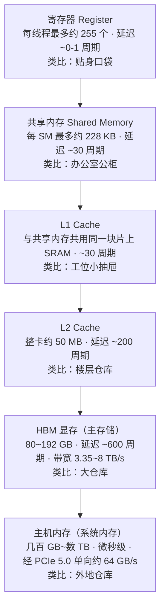
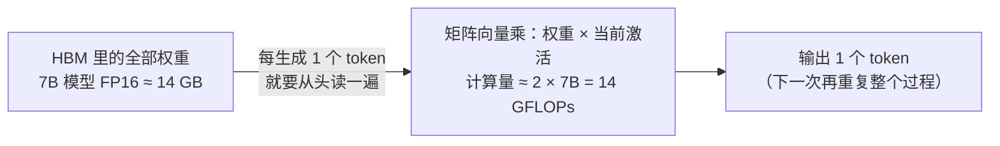

GPU 的算力增长比带宽快得多：以 A100 → H100 这一代为例，FP16 算力从 312 涨到 989 TFLOPS（约 3.2 倍），而 HBM 显存（High Bandwidth Memory，高带宽显存）带宽只从 2039 涨到 3350 GB/s（约 1.6 倍）。把两者相除你会发现一个残酷的数字：H100 上每从显存读 1 字节数据，必须完成约 295 次 FP16 运算才能把算力喂满——而绝大多数 AI 算子根本达不到这个“配额”。这就是 AI Infra 圈那句话 **“Memory is the new compute”** 的由来：大模型时代，卡脖子的不再是算力，而是把数据喂给算力的那条通道。

本文逐层拆解 GPU 的存储金字塔——从寄存器、共享内存、L1/L2 到 HBM，再延伸到主机内存与 PCIe——解释 Memory Wall 为什么存在、用什么数字度量、以及 FlashAttention 这类耳熟能详的优化为什么本质都是在“对抗带宽”。读完后，你将能用“算术强度 vs 带宽”的视角，看懂任何一个算子到底慢在哪。

<!-- more -->

## 📑 目录

- [1. 算力翻倍、带宽只涨一半：GPU 的"喂食难题"](#1-算力翻倍带宽只涨一半gpu-的喂食难题)
- [2. 存储金字塔：越靠近计算核心，越快、越贵、越小](#2-存储金字塔越靠近计算核心越快越贵越小)
- [3. 金字塔之外：主机内存与 PCIe 这条"卡车通道"](#3-金字塔之外主机内存与-pcie-这条卡车通道)
- [4. HBM 技术直觉：单车道公路与千条车道](#4-hbm-技术直觉单车道公路与千条车道)
- [5. Memory Wall：算力与带宽的剪刀差](#5-memory-wall算力与带宽的剪刀差)
- [6. 一个真实的 memory-bound 场景：自回归 decode](#6-一个真实的-memory-bound-场景自回归-decode)
- [7. 对抗 Memory Wall：把数据往金字塔上层搬](#7-对抗-memory-wall把数据往金字塔上层搬)
- [8. 反例：「显存越大越好」错在哪里](#8-反例显存越大越好错在哪里)
- [9. 留一个钩子：如何量化判断任务卡在哪](#9-留一个钩子如何量化判断任务卡在哪)
- [总结](#-总结)
- [自我检验清单](#-自我检验清单)
- [参考资料](#-参考资料)

---

## 1. 算力翻倍、带宽只涨一半：GPU 的“喂食难题”

先做一个思想实验。想象一家超级工厂：车间里有 10000 个世界上最快的厨师（GPU 的计算核心），每个厨师每秒能颠勺 100 次。但他们的食材不是摆在手边的，而是通过一条传送带（显存带宽）从仓库运来——传送带每秒只能送 50 份食材。那么问题来了：**这家工厂的产出上限，到底是厨师决定的，还是传送带决定的？**

答案是传送带。厨师再快，手里没菜也只能空转。把这个比喻翻译回术语：

- **厨师 = GPU 的计算单元**（CUDA Core / Tensor Core），决定“算多快”；
- **传送带 = 显存带宽（Memory Bandwidth）**，即单位时间内 GPU 能从显存读出（或写入）的数据量，单位是 GB/s；
- **食材 = 模型权重、激活值等数据**，存放在显存（HBM）里。

**带宽（Bandwidth）** 的正式定义：单位时间内存储系统能搬运的数据总量。它回答的问题是“每秒能喂进来多少数据”，和“一次要等多久”（那是延迟）完全是两回事——这一点后面第 5.4 节会专门拆开讲。

关键是：过去十年，厨师变快的速度远快于传送带加宽的速度。把三代旗舰卡摆在一起看：

| 📊 GPU | FP16 算力（Dense） | HBM 带宽 | 算力倍率（相对上一代） | 带宽倍率（相对上一代） |
|---|---|---|---|---|
| A100 | 312 TFLOPS | 2039 GB/s | — | — |
| H100 | 989 TFLOPS | 3350 GB/s | 约 3.2× | 约 1.6× |
| B200 | 约 2250 TFLOPS | 8000 GB/s | 约 2.3× | 约 2.4× |

（数据来源：NVIDIA A100 / H100 白皮书与 HGX B200 Datasheet。B200 的 FP16 Dense 算力约 2250 TFLOPS（双 die 整卡口径），若按 2:4 稀疏算力 4500 TFLOPS 计算则另当别论，详见 5.2 节。）

📌 **关键点**：A100 → H100 这一代是典型的“剪刀差”——算力涨 3.2 倍，带宽只涨 1.6 倍，差距越拉越大。而 H100 → B200 这一代，NVIDIA 带宽（2.4 倍）与算力（约 2.3 倍）同步加码，剪刀差基本持平、略微收窄——说明厂商同样在为带宽下注。但与此同时，模型规模的膨胀速度是以 10 倍计的（7B → 70B → 千亿参数），喂食难题并没有被解决，只是被延缓。

为什么算力可以每代翻倍、带宽却只能慢慢挤？答案藏在存储金字塔的物理结构里——这就是下一节的主题。

## 2. 存储金字塔：越靠近计算核心，越快、越贵、越小

### 2.1 一张图看清六层存储

GPU 内部的数据存储不是“一个大仓库”，而是**一层一层的金字塔**：越靠近计算核心，速度越快、容量越小、成本越贵；越往外，容量越大、速度越慢。完整的链条从计算核心一直延伸到 CPU 侧的主机内存：

这张图讲的是 GPU 从内到外的六层存储：箭头方向就是“数据越用越远”的方向。从上往下，每下一层，容量大一个数量级以上，但延迟也大一个数量级以上。**设计的核心思想是：把最常被访问的数据放在离计算核心最近的地方。**

⚠️ **注意**：图中的延迟“周期数”是教学量级的约数，实际值随架构（Ampere / Hopper / Blackwell）和时钟频率变化，比如共享内存的延迟在不同代架构上可能是 20~40 周期。工程上你要记的是“相对快慢”（共享内存比 HBM 快约 20 倍、L2 比 HBM 快约 3 倍），而不是某个精确数字。

### 2.2 逐层拆解：从贴身口袋到外地仓库

**第 1 层：寄存器（Register）——贴身口袋。**

想象你身上最贴身的口袋：掏零钱不用挪动一步，但口袋就那么大，装不下几枚硬币。寄存器就是线程的“贴身口袋”：它位于 SM（Streaming Multiprocessor，GPU 的基本调度单元）内部的寄存器堆里，是每个线程**私有**的存储，延迟接近 0 周期（约 0~1 个时钟周期）。H100 的每个 SM 有 256 KB 寄存器堆（约 6.4 万个 32 位寄存器），摊到每个线程最多约 255 个。编译器负责把局部变量塞进寄存器——塞不下时溢出到显存，性能会急剧恶化（这是模块二 [CUDA 内存模型](/AIInfraGuide/cuda/模块二-cuda编程与算子优化/13-cuda内存模型) 里专门讲的话题）。

**第 2 层：共享内存（Shared Memory）——办公室公柜。**

一个办公室的同事共用一个大文件柜：走过去几步就到，比下楼去仓库快得多，但柜子空间有限，而且一个小组的人得协商着用。共享内存是每个 SM 内**所有线程（准确说是同一线程块 Block 内的线程）共享**的片上存储，由**程序员显式管理**（在 CUDA 里用 `__shared__` 声明）。H100 上每个 SM 最多约 228 KB（与 L1 共用，可配置比例），延迟约 30 周期。它是 GPU 编程里最重要的“手动优化武器”——后面第 7 节会看到，几乎所有高性能算子都在想方设法把数据搬进共享内存。

**第 3 层：L1 Cache——工位小抽屉。**

每个工位旁有个自动整理的小抽屉：系统自动帮你放“最近用过的东西”，不用你操心。L1 与共享内存在物理上是同一块片上 SRAM，只是由**硬件自动管理**，缓存最近访问的全局内存数据。延迟同样约 30 周期。

**第 4 层：L2 Cache——楼层仓库。**

整层楼共用一个仓库：还是在本楼里，比楼下总库近，但全楼的人都来取货，容量和速度都要打个折。L2 是整张 GPU（所有 SM）共享的片上缓存，H100 的 L2 为 50 MB（来源：NVIDIA H100 白皮书 Memory System 章节），延迟约 200 周期。它对程序员基本透明——你访问全局内存时，硬件会先在 L2 里找。

**第 5 层：HBM 显存——大仓库。**

所有“正品”数据都存在这座大仓库里：模型权重、激活值、优化器状态，全都在这里。HBM（High Bandwidth Memory，高带宽显存）是 GPU 的**主存储**，容量 80~192 GB，但延迟高达约 600 周期，是共享内存的 20 倍。你写的 CUDA 代码里的 global memory（全局内存），物理上就落在这一层。仓库够大，但每一次取货都要“坐电梯下楼”，这就是带宽瓶颈的源头。

**第 6 层：主机内存——外地仓库。**

还有更多东西存放在“外地仓库”——CPU 侧的系统内存（DRAM），容量可以到几百 GB 甚至数 TB。但 GPU 想从那里取货，只能走一条窄窄的“卡车通道”（PCIe），速度比 HBM 慢约 50 倍。这一层是第 3 节的主角。

### 2.3 为什么金字塔一定是这个形状

你可能要问：**为什么不能把全部数据都放在最快的寄存器里？** 答案是物理和成本，不是设计者偷懒。

- **速度来自距离和材质**。寄存器、共享内存、L1/L2 都是**片上 SRAM**（Static Random-Access Memory，静态随机存取存储器）——直接做在 GPU 芯片里，每个比特要用 6 个晶体管，信号走线距离短，所以快。而 HBM、主机内存是**片外 DRAM**（Dynamic Random-Access Memory，动态随机存取存储器）——每个比特只要 1 个晶体管加一个电容，所以便宜、容量大，但必须通过封装引脚和更长的走线访问，注定慢。
- **芯片面积是有限预算**。一块 GPU 芯片的面积就那么大，SRAM 又贵又占地方。H100 芯片面积约 814 mm²，其中留给缓存和寄存器堆的部分已经是巨大投入，但和动辄 80 GB 的 HBM 相比依然是九牛一毛。面积预算决定了：**容量和速度不可兼得，只能分层，让每一层各司其职。**

💡 **提示**：理解“容量与速度不可兼得”是理解整篇文章的钥匙。存储金字塔不是 GPU 独有——CPU 有 L1/L2/L3/内存的同样结构，手机也有“缓存 + 内存 + 闪存”。它是所有现代计算机的统一设计，GPU 只是把“带宽”这个维度的重要性放大了十倍。

## 3. 金字塔之外：主机内存与 PCIe 这条“卡车通道”

### 3.1 主机内存：装得下一切，但运不过来

主机内存（系统内存）本身并不慢：现代服务器用 8 通道 DDR5 内存，带宽大约在 300~400 GB/s（量级参考，取决于具体型号与频率；同为 DDR5，桌面双通道配置只有约 100 GB/s——同章 5.2 篇的口径是后者，两者并不矛盾），甚至比部分老 GPU 的显存还宽。**瓶颈不在这里，而在 GPU 与主机内存之间的那条路——PCIe。**

GPU 访问主机内存必须走 PCIe（Peripheral Component Interconnect Express，外设互联总线），它是主板上的通用扩展总线。以 PCIe 5.0 ×16（16 条通道）为例：单向带宽约 64 GB/s（128b/130b 编码后有效值约 63 GB/s，取整为约 64），双向合计约 128 GB/s。做个除法你就知道差距：

$$
\frac{H100 \text{ 的 HBM 带宽}}{PCIe 5.0 单向带宽} = \frac{3350 \text{ GB/s}}{64 \text{ GB/s}} \approx 52
$$

算完这笔账，结论很直接：**GPU 读显存比读主机内存快约 50 倍。** 这就是“外地仓库”的含义——东西确实在，但用卡车一趟一趟运，运不过来。所以工程上的铁律是：训练和推理时，数据要尽量常驻显存，主机内存只是“备货区”和“临时周转区”。

### 3.2 层与层之间靠什么搬运

金字塔各层之间不是魔法，数据移动需要具体的搬运机制，分两段看：

**片上部分（寄存器 ↔ 共享内存 ↔ L1 ↔ L2 ↔ HBM）**：全部由硬件自动搬运。L1/L2 缓存按缓存行（cache line）粒度自动填充、淘汰；你读一个变量，硬件会把整块数据搬进缓存。程序员不需要（也无法）干预，只需要理解“哪些访问能命中缓存”。

**片外部分（HBM ↔ 主机内存）**：必须显式发起拷贝。CUDA 里最常用的是 `cudaMemcpy`——CPU 发起调用，由 GPU 或 CPU 上的 **DMA**（Direct Memory Access，直接内存访问）引擎执行搬运，不占用计算核心。这里有两个重要的工程细节：

- **pinned memory（页锁定内存）**：主机端的内存默认可能被操作系统换页，DMA 无法直接搬运。用 `cudaHostAlloc` 锁页后，DMA 可以直接读写，拷贝速度显著提升；
- **异步拷贝**：拷贝可以放进 CUDA Stream（GPU 上的任务队列：同一队列内按序执行，不同队列之间可以并行，也可以与计算重叠）与计算重叠——边搬数据边算。这正是模块一 [4.6 CUDA 异步执行](/AIInfraGuide/prerequisites/模块一-前置知识/pytorch/46-cuda异步执行) 的内容；显存怎么分配、账怎么算，见 [4.7 显存管理](/AIInfraGuide/prerequisites/模块一-前置知识/pytorch/47-显存管理)。

💡 **提示**：把搬运链条再往外延伸一层——GPU 与 GPU 之间、机器与机器之间还有 NVLink 和 InfiniBand，那是分布式训练的“高速公路”，属于模块一 [第 6 章 集合通信基础](/AIInfraGuide/prerequisites/模块一-前置知识/communication/61-集合通信原语) 的主题。你只需要记住本节的结论：**每跨一层存储，带宽掉一个数量级**——寄存器到共享内存（片上）是几千 GB/s 级，HBM 是 TB/s 级，PCIe 是几十 GB/s 级，跨机器是 50 GB/s 级。分布式训练的一切通信优化，本质都是在和这条“越走越窄”的通道搏斗。

## 4. HBM 技术直觉：单车道公路与千条车道

### 4.1 GDDR 与 HBM：两条造路思路

上一节讲了带宽为什么珍贵，这一节看看 HBM 是怎么把带宽做到 TB/s 级的。先看它的对手。

传统的 GDDR 显存（Graphics Double Data Rate，图形双倍速率显存，如 RTX 4090 用的 GDDR6X）走的是“单车道高速公路”的思路：每条数据通道（lane）很宽很快，但通道总数有限，颗粒（memory chip）平铺在显卡 PCB 上，通过密集的走线连到 GPU 芯片。路只有一条，再快也有上限——GDDR6X 的带宽做到了约 1 TB/s 就到头了。

HBM（High Bandwidth Memory）换了一个思路：**把内存颗粒像盖楼一样垂直堆叠起来，通过硅中介层（Silicon Interposer）直接“贴”在 GPU 芯片旁边**，用上千条细细的通道同时传数据。打个比方：

> 想象一座城市需要运送大量货物。GDDR 的做法是修一条超级宽的单车道高速公路——路况极好，但车流全挤在这条路上；HBM 的做法是修 1024 条普通车道——每条都不宽，但一千条车道同时跑，总流量碾压前者。

对应关系很直接：**单车道公路 = GDDR 的窄数据总线；千条车道 = HBM 通过硅中介层实现的超宽位宽**（HBM 的位宽可达 1024 bit/堆栈，而 GDDR 通常是 32 bit/颗粒）。带宽 = 位宽 × 时钟频率 × 传输倍率，位宽乘以数十倍，带宽自然就上去了。代价是：HBM 制造工艺复杂、成本高，所以容量做得越大越贵——这也是为什么显存容量一直“抠抠搜搜”只有 80~192 GB。

### 4.2 四代高带宽显存对照

| 📊 显存类型 | 代表 GPU | 带宽 | 容量 |
|---|---|---|---|
| GDDR6X | RTX 4090 | 1008 GB/s | 24 GB |
| HBM2e | A100 | 2039 GB/s | 80 GB |
| HBM3 | H100 | 3350 GB/s | 80 GB |
| HBM3e | B200 | 8000 GB/s | 192 GB |

（数据来源：NVIDIA RTX 4090 / A100 / H100 / B200 官方规格页。注意：不同官方文档对 B200 的显存口径略有出入——产品页标 192 GB / 8 TB/s，HGX 指南标 180 GB / 7.7 TB/s，统一以最新 Datasheet 为准。）

📌 **关键点**：从 A100 到 B200，带宽翻了约 4 倍（2039 → 8000 GB/s）。这个趋势对 LLM 推理意义重大——因为推理的 decode 阶段是典型的带宽敏感（memory-bound）任务，带宽每提升 1 倍，理论吞吐量就能接近翻倍。至于“为什么 decode 是 memory-bound”，第 6 节会完整算给你看。

## 5. Memory Wall：算力与带宽的剪刀差

### 5.1 什么是 Memory Wall

现在把第 1 节和第 4 节的事实拼在一起，就得到了本篇文章的主角——**Memory Wall（内存墙）**：

> **Memory Wall**：算力（FLOP/s）每代约翻倍增长，而内存带宽（Byte/s）每代只增长约 1.5 倍，两者之间的差距随时间越拉越大，形成一堵“墙”——当任务的访存需求超过带宽供给时，算力再高也白搭，性能被带宽死死压住。

用第 1 节那张三代数据表画成“剪刀差”更直观：A100 → H100，算力曲线涨了 3.2 倍（312 → 989 TFLOPS），带宽曲线只涨了 1.6 倍（2039 → 3350 GB/s）——两条曲线像张开的剪刀；H100 → B200，算力涨约 2.3 倍（989 → 2250 TFLOPS）、带宽涨约 2.4 倍（3350 → 8000 GB/s），两条曲线近乎平行、剪刀口基本没再扩大，但模型规模十年涨了上千倍，剪刀的绝对开口仍在扩大。

**为什么这堵墙是“新”的？** 因为深度学习早期的算力（V100、A100 时代）也远未跑满，带宽勉强够用；而随着大模型把算术强度低的算子（Attention、LayerNorm）和“每 token 读全部权重”的 decode 推上前台，带宽率先见底。这就是“Memory is the new compute”：**瓶颈从“算不过来”变成了“喂不过来”。**

### 5.2 一把尺子：ops:byte 比

光说“剪刀差”不够，工程上需要一把能量化这堵墙的尺子。这把尺子叫 **ops:byte 比**（也叫“算力带宽比”），定义非常简单：

$$
\text{ops:byte 比} = \underbrace{\frac{\text{峰值算力 (FLOP/s)}}{\text{显存带宽 (Byte/s)}}}_{\text{每搬进 1 字节数据，GPU 理论上能完成多少次运算}}
$$

逐项解释：

- **峰值算力**：GPU 每秒最多能完成的浮点运算次数，单位 FLOP/s（如 H100 FP16 为 $989 \times 10^{12}$）；
- **显存带宽**：GPU 每秒最多能从 HBM 搬进多少字节，单位 Byte/s（如 H100 为 $3350 \times 10^9$）；
- **比值**：两者相除，得到“每搬 1 字节数据，GPU 配得上多少次运算”。**如果某任务每字节只算 1 次，那算力 99% 的时间都在等数据。**

代入三代 GPU 算一遍：

| 📊 GPU | 算力（FP16 Dense） | 带宽 | ops:byte 比 | 计算过程 |
|---|---|---|---|---|
| A100 | 312 TFLOPS | 2039 GB/s | **约 153** | $312 \times 10^{12} \div 2039 \times 10^9 \approx 153$ |
| H100 | 989 TFLOPS | 3350 GB/s | **约 295** | $989 \times 10^{12} \div 3350 \times 10^9 \approx 295$ |
| B200 | 约 2250 TFLOPS | 8000 GB/s | **约 281** | $2250 \times 10^{12} \div 8000 \times 10^9 \approx 281$ |

📌 **关键点**：B200 的 Dense ops:byte 比约 281，与 H100 的 295 基本持平（略降约 5%）——这代带宽（2.4×）与算力（约 2.3×）同步加码，剪刀口既没继续扩大、也没明显收窄。如果按 2:4 稀疏算力（4500 TFLOPS）算，比值约 562——但稀疏模式需要权重经过 2:4 剪枝，现实负载大多用 Dense 算力（本表按 Dense 计，B200 算力数值以 NVIDIA 官方 HGX B200 Datasheet 为准，不同文档口径略有出入）。

💡 **提示**：ops:byte 比随精度变化。H100 的 FP8 算力是 1979 TFLOPS，带宽不变，比值变成约 590——**同样的数据量，精度越低、运算越快，带宽越先卡脖子**。这就是为什么“量化提速”有时反直觉：在 memory-bound 的算子上，量化省的是带宽（数据字节数减半），而不是算力。

### 5.3 “295”意味着什么：任务的算术强度

295 这个数字本身没有意义，要看任务够不够得着它。判断一个任务“每读 1 字节要做几次运算”，用**算术强度（Arithmetic Intensity）**：

$$
\text{算术强度} = \underbrace{\frac{\text{浮点运算量 (FLOPs)}}{\text{内存访问量 (Bytes)}}}_{\text{这个任务每读 1 字节数据，平均要做几次运算}}
$$

两个数摆在一起，规则只有一句话：**任务的算术强度 < GPU 的 ops:byte 比 → 带宽喂不满算力，任务受带宽限制（memory-bound）；反之受算力限制（compute-bound）。**（完整的判断框架——Roofline 模型——放在本系列 5.5 展开，这里先建立直觉。）

代入三个典型算子感受一下量级（FP16，理想访存模型）：

- **大矩阵乘 GEMM**（$4096 \times 4096 \times 4096$）：运算量 $2 \times 4096^3 \approx 137$ GFLOPs，访存量约 $3 \times 4096^2 \times 2$ B ≈ 100 MB，算术强度 ≈ **1365**——远大于 295，**compute-bound**，算力能跑满，这是 GEMM 被称作“算力测试基准”的原因；
- **LayerNorm**（对每行求均值方差再归一化）：每个数据只被读几次、做几次运算，算术强度大约 **2~5**——远小于 295，**memory-bound**；
- **自回归 decode**（第 6 节的主角）：算术强度约 **1**——极度 memory-bound。

**“295 意味着什么”的直觉版**：H100 上，每读 1 字节数据你至少要算 295 次 FP16 才能让 GPU 不闲着。一个算术强度只有 5 的算子，算力利用率理论上限只有 $5/295 \approx 1.7\%$——剩下的 98% 算力都在等数据。这就是为什么 Attention、LayerNorm 这类算子一优化就直奔“减少显存访问”而去，而不是“优化计算指令”。

### 5.4 带宽 vs 延迟：水管粗细与水龙头时间

很多新手会把“带宽不够”和“延迟太高”混为一谈，但它们是两个完全不同的物理量，对策也完全不同。打个比方：

> **带宽是水管粗细**——每秒能流过多少升水；**延迟是水龙头拧开到你接到第一滴水的时间**。水管粗，不代表第一滴水来得快；水龙头出水快，也不代表总流量大。

对应到 GPU：

- **延迟（Latency）**：从发起一次访存到数据返回的时间，单位是时钟周期或纳秒。HBM 约 600 周期（约 300 ns），共享内存约 30 周期，寄存器约 0~1 周期；
- **带宽（Bandwidth）**：单位时间能搬多少数据，单位 GB/s。HBM 是 TB/s 级，PCIe 是几十 GB/s 级。

两者对策完全不同：**延迟可以被“并发”掩盖，带宽不能。** GPU 靠成千上万个线程同时发访存请求——一个请求慢，就换一批线程先算——延迟高一点没关系，只要总有活干。但带宽是物理上限：所有线程共享同一条“水管”，水管总粗细是固定的，并发再高也超不过这个总量。**这就是吞吐架构（Throughput-oriented）的宿命：你可以欺骗延迟，但无法欺骗带宽。** 所以在 GPU 上，memory-bound 是比“慢”更本质的问题——它不是“等得久”，而是“每秒能搬的总量不够分”。

## 6. 一个真实的 memory-bound 场景：自回归 decode

### 6.1 decode 为什么“只读不重用”

理论讲完了，看一个每天都在发生的真实场景：大模型推理。

大模型生成文本是**自回归（Autoregressive）**的：一次只生成一个 token（词元，文本的最小单位），把新 token 接在输入末尾，再生成下一个。这个逐 token 生成的过程叫 **decode（解码阶段）**（生成首个 token 前的整体计算叫 prefill，此处不展开）。

问题来了：生成第 $t$ 个 token 时，模型要把**全部权重**拿出来，和当前这 1 个 token 的激活向量做一次矩阵向量乘。权重有多少？以 7B 模型（70 亿参数）为例，FP16 存储：

$$
7 \times 10^9 \text{ 参数} \times 2 \text{ 字节/参数} = 14 \text{ GB}
$$

14 GB 的权重，**每生成一个 token 就要从头到尾读一遍**——而且每个权重只被用一次（和当前激活乘完就扔），完全没有复用。数据流长这样：

这张图讲的是 decode 阶段每生成一个 token 的完整数据流：读 14 GB 权重 → 算 14 GFLOPs → 输出 1 个 token，然后循环。注意箭头上的“读一遍”——**权重只读不重用**，这是 decode 一切性能问题的根源。

### 6.2 算一笔账：4.2 毫秒搬数据，14 微秒算

在 H100 上（989 TFLOPS FP16 算力、3350 GB/s 带宽）算一笔账：

**搬运时间**（把 14 GB 权重从 HBM 读进计算单元）：

$$
\frac{14 \times 10^9 \text{ B}}{3350 \times 10^9 \text{ B/s}} \approx 4.2 \text{ ms}
$$

**计算时间**（把这 14 GFLOPs 算完）：

$$
\frac{14 \times 10^9 \text{ FLOPs}}{989 \times 10^{12} \text{ FLOP/s}} \approx 14 \text{ μs}
$$

两个数一除，结论触目惊心：

$$
\frac{4.2 \text{ ms}}{14 \text{ μs}} \approx 300 \text{ 倍}
$$

📌 **关键点**：生成 1 个 token，GPU 花在“等数据”上的时间是“算”的 300 倍——**算力利用率不到 1%**，而带宽被 14 GB 的读取量吃满。用 5.3 节的尺子量一下：decode 的算术强度 = $14 \text{ GFLOPs} / 14 \text{ GB} \approx 1$ FLOP/byte，远低于 H100 的 295 配额，是教科书级的 memory-bound 任务。（注：这里算的是理论下限，实际还有 KV Cache 读取、调度开销等，但权重读取主导了带宽。）

这就是为什么“推理比训练更难优化”：训练时大 batch 让每个权重被复用很多次（算术强度高），而 decode 的 batch 通常很小（在线服务不可能攒 1000 个用户同时生成同一个序列），权重只能读一遍就扔。**带宽每提升 1 倍，decode 吞吐量理论上就接近翻倍**——上一节那张四代显存表的价值在这里兑现。

### 6.3 推理优化为什么都围着显存转

把 6.2 的账记住，你就能看穿模块四（推理优化）里几乎每一项技术的动机：

- **KV Cache（键值缓存）**：把历史 token 算过的 K、V 向量存下来，避免每次重复计算——省的是算力，但每次生成仍要读一遍（KV Cache 的显存账本在模块四第 1 章算给你看，这里只预告）；
- **量化（FP16 → INT8/FP4）**：权重字节数减半，14 GB 变 7 GB——直接砍带宽需求；
- **Continuous Batching、PD 解耦**：把多个请求的 decode 拼在一起跑，让权重尽量被“多读几次”，提高算术强度。

它们的共同方向只有一个：**在带宽不变的前提下，减少每 token 的 HBM 读取量，或者让每次读取产生更多计算。** 等你看完模块四再回头看这一节，会发现所有推理优化都是这一句话的展开。

## 7. 对抗 Memory Wall：把数据往金字塔上层搬

### 7.1 三个耳熟能详的优化，本质是同一件事

如果带宽是硬上限，工程师能做什么？答案是：**减少 HBM 访问次数，把数据往金字塔上层搬。** 几个你听过的名字，本质全是这一件事：

- **FlashAttention**：标准 Attention 会把 $N \times N$ 的注意力矩阵（S 矩阵）写回 HBM 再读出来，FlashAttention 用分块（Tiling）+ 在线 Softmax（在线 Softmax：不先等整行算完再归一化，而是边算边合并统计量，从而允许数据分块处理、全程留在片上）让它**全程留在片上**，HBM 访问量从 $O(N^2)$ 降到 $O(N)$——省的不是计算，是搬运；
- **算子融合（Kernel Fusion）**：把“读数据 → 算 → 写回”的多步算子合并成一个，中间结果不落 HBM。比如把 `A + B` 和 `relu(A + B)` 合并，原本要写两遍读两遍，现在一遍搞定；
- **Shared Memory Tiling**：GEMM 优化里把矩阵分块搬进共享内存，一块数据被复用 16~32 次才回 HBM——用“搬一次、用多次”对抗“每次都用就要每次都搬”。

它们的共同公式可以写成：

$$
\text{有效带宽需求} = \frac{\text{数据量} \times \text{访问次数}}{\text{时间}}
$$

**优化手段 = 降低“访问次数”**。所以判断一个优化好不好，先问它“让 HBM 少跑了几趟”。（FlashAttention 的完整推导见模块二 [6.1 FlashAttention V1 详解](/AIInfraGuide/cuda/模块二-cuda编程与算子优化/61-flashattention-v1详解)，Tiling 实战见 [4.1 GEMM 算子性能优化](/AIInfraGuide/cuda/模块二-cuda编程与算子优化/41-cuda-gemm算子性能优化)。）

### 7.2 一次 HBM 访问 ≈ 600 周期，值多少钱

把“少访问 HBM”换算成钱，需要一个直觉标尺。HBM 一次访问延迟约 600 周期（量级参考，随架构变化），而一个 CUDA Core 每个周期可以完成 1 次 FMA（乘加运算，算作一次 FP32 运算）：

$$
\underbrace{600 \text{ 周期}}_{\text{等一次 HBM 数据返回}} \approx \underbrace{600 \text{ 次 FP32 运算}}_{\text{一个核心这段时间本可以算完的工作量}}
$$

换句话说，**如果你的 kernel 每个数据只用一次就从 HBM 读，计算核心的大量时间都在空等**。对比各层存储的“机会成本”：

| 📊 数据在哪 | 延迟（约） | 等它期间一个核心能算多少次 FP32 |
|---|---|---|
| 寄存器 | ~0-1 周期 | ~1 |
| 共享内存 / L1 | ~30 周期 | ~30 |
| L2 | ~200 周期 | ~200 |
| HBM | ~600 周期 | ~600 |
| 主机内存（经 PCIe） | 微秒级（数千周期） | 数千次以上 |

这就是为什么 GEMM 优化宁可花大量精力把分块数据搬进共享内存（30 周期）再反复用，也不愿每次直接读 HBM（600 周期）——**同一份数据，用错层级，代价差 20 倍。**

### 7.3 没有免费午餐：搬上层也有代价

把数据搬进共享内存不是免费的，代价清单要摆清楚：

- **共享内存容量有限**：H100 每个 SM 只有约 228 KB，分块太大装不下，分块太小复用次数不够；
- **同步开销**：线程块内要用 `__syncthreads()`（块内线程同步屏障：等块内所有线程都执行到这一行再继续）保证“数据搬完再算”，同步本身有成本，分块越多同步越频繁；
- **寄存器压力**：Tiling 方案往往要占更多寄存器，寄存器不够就溢出到显存——偷鸡不成蚀把米；
- **代码复杂度**：边界处理、bank conflict（共享内存访问冲突）、occupancy（占用率）调优，每一样都是工作量。

所以优化的正确姿势是：**先判断任务到底卡在带宽还是算力（用 5.3 节的尺子），再决定要不要付出这些代价。** 一个算术强度 2000 的算子，你把共享内存优化到极致，收益也趋近于零——它根本不缺带宽。这也是下一节选型话题的引子。

## 8. 反例：「显存越大越好」错在哪里

### 8.1 容量、带宽、算力是三个独立维度

选 GPU 时最容易犯的错误，是把“显存容量”当成唯一指标——“80 GB 比 40 GB 好，192 GB 比 80 GB 好”。这个直觉**看起来合理但错得离谱**，因为显存有三个互相独立的维度：

- **容量（GB）**：回答“装不装得下”——模型、KV Cache、优化器状态放不放得下；
- **带宽（GB/s）**：回答“喂不喂得饱”——数据搬得快不快，决定 memory-bound 任务的上限；
- **算力（TFLOPS）**：回答“算不算得快”——决定 compute-bound 任务的上限。

**容量大 ≠ 带宽高 ≠ 算力强**。一块 192 GB 的卡，带宽可能只有 1 TB/s；一块 80 GB 的卡，带宽可能 3.35 TB/s。买卡前先回答的问题是：你的任务缺的是哪一个维度？

### 8.2 H200 的启示：带宽 +43% 不是所有场景都受益

H200 是最能说明“维度独立”的例子。它和 H100 是同一架构（Hopper），算力完全一样，只换了更大的 HBM3e：

| 📊 指标 | H100 | H200 | 变化 |
|---|---|---|---|
| 显存容量 | 80 GB | 141 GB | +76% |
| 显存带宽 | 3350 GB/s | 4800 GB/s | **+43%** |
| FP16 算力（Dense） | 989 TFLOPS | 989 TFLOPS | 不变 |

（数据来源：NVIDIA H100 / H200 官方规格页。）

带宽 +43%（4800 ÷ 3350 ≈ 1.43），算力一字未动。这意味着：

- ✅ **适合**：长序列推理——上下文越长，KV Cache 越大（容量需求），每 token 还要读一遍（带宽需求），H200 两个维度同时受益；
- ❌ **不适合**：短序列高并发推理、算力密集的预训练——这类任务不缺容量不缺带宽，缺的是算力，H200 和 H100 的表现几乎一样。

**同样的预算，选 H200 还是 H100，取决于你的瓶颈维度，而不是“显存越大越好”。** 决策原则：**先诊断瓶颈，再掏钱买单**——这是硬件选型的第一原则，也是第 5 章 [5.1 架构演进](/AIInfraGuide/prerequisites/模块一-前置知识/gpu/nvidia-gpu-evolution) 里选型表的底层逻辑。

### 8.3 选型问诊：症状对应哪个指标

| 症状 | 诊断 | 该看的指标 | 动作方向 |
|---|---|---|---|
| 训练/推理直接 OOM（out of memory） | 装不下 | **容量** | 换大显存卡 / 显存优化（ZeRO、重计算等） |
| GPU 利用率很高，但吞吐上不去 | 算力已满 | **算力** | 换更强算力卡 / 降精度 |
| GPU 利用率很低，带宽却接近打满 | 喂不饱 | **带宽** | 换高带宽卡 / 减少 HBM 访问（融合、Tiling、量化） |
| 长上下文推理，KV Cache 爆显存 | 容量 + 带宽双缺 | 容量 + 带宽 | H200 这类大容量高带宽卡 / KV Cache 量化压缩 |

⚠️ **注意**：云上按卡计费，容量买大了用不满是实打实的钱；带宽买大了用不满同理。用 `nvidia-smi` 观察一段时间，看看利用率卡在 98%（算力瓶颈）还是带宽打满（`nvidia-smi --query-gpu=utilization.memory` 接近 100% 而算力利用率低），再决定换什么卡。

## 9. 留一个钩子：如何量化判断任务卡在哪

这一节反复用了“算术强度 vs ops:byte 比”的尺子，但还差最后一步：怎么把判断做成一张图，让任何算子都能一眼看出卡在哪？

答案是 **Roofline 模型（屋顶线模型）**——把算力上限和带宽上限画成两条线，把算子的算术强度画成横坐标，就能直接读出理论性能上限、以及瓶颈是算力还是带宽。它是本系列 5.5 的主题（见 [第 5 章章首页](/AIInfraGuide/prerequisites/模块一-前置知识/第5章-gpu硬件概论)），届时会把这一节的尺子补完：如何画、如何读、如何用 `nsight-compute` 实测算子的算术强度并和 Roofline 对照。学完那篇，你就能回答面试官的问题：“这个算子为什么慢？慢在哪？怎么改？”——先从“它每读 1 字节算了几次”开始。

## 📝 总结

1. **存储金字塔**：GPU 的数据存储是六层金字塔——寄存器（贴身口袋）→ 共享内存（办公室公柜）→ L1（工位抽屉）→ L2（楼层仓库）→ HBM（大仓库）→ 主机内存（外地仓库）；越靠近计算核心越快、越贵、越小，因为片上 SRAM 与片外 DRAM 的物理与成本差异决定了容量和速度不可兼得。
2. **Memory Wall**：算力每代约翻倍、带宽每代只涨约 1.5 倍，剪刀差越拉越大；量化这把剪刀的尺子是 ops:byte 比——A100 约 153、H100 约 295、B200 约 281（Dense），任务算术强度低于它就 memory-bound。
3. **decode 是带宽的奴隶**：7B 模型每生成 1 个 token 要读 14 GB 权重，H100 上搬运约 4.2 ms、计算仅约 14 μs，算力利用率不到 1%，算术强度约 1，远低于 295 的配额。
4. **对抗手段**：FlashAttention、算子融合、Shared Memory Tiling 的本质都是减少 HBM 访问次数；一次 HBM 访问约 600 周期，够一个核心算 600 次 FP32——数据用错层级，代价差 20 倍，且搬运到上层本身也有容量、同步、寄存器代价。
5. **选型反直觉**：容量、带宽、算力是三个独立维度；H200 带宽比 H100 高 43% 但算力相同，适合长序列推理而非所有场景——先诊断瓶颈，再掏钱买单。

## 🎯 自我检验清单

- 能画出 GPU 六层存储金字塔（寄存器 → 共享内存 → L1 → L2 → HBM → 主机内存），标注各层的容量、延迟量级和作用域，误差不超过一个数量级
- 能解释为什么存储金字塔必然“越靠近核心越快、越贵、越小”（SRAM vs DRAM 的物理差异与芯片面积预算）
- 能手动计算 H100 的 ops:byte 比（$989 \times 10^{12} \div 3350 \times 10^9 \approx 295$），并解释“295”的物理含义
- 能计算给定算子的算术强度（运算量 ÷ 访存量），并判断它更可能是 compute-bound 还是 memory-bound
- 能解释带宽与延迟的区别（水管粗细 vs 水龙头时间），说明为什么并发能掩盖延迟但掩盖不了带宽上限
- 能估算 7B 模型（FP16）在 H100 上 decode 单 token 的理论最低耗时（14 GB ÷ 3350 GB/s ≈ 4.2 ms），并解释为什么算力利用率不到 1%
- 能说出 HBM 相比 GDDR 带宽更高的原理（硅中介层堆叠、千条车道 vs 单车道）
- 能解释 FlashAttention、算子融合、Shared Memory Tiling 的共同本质（减少 HBM 访问次数），并说出各付出了什么代价
- 能说明“一次 HBM 访问 ≈ 600 周期 ≈ 600 次 FP32 运算”这个换算的工程含义
- 能根据症状选择该看哪个指标：OOM 看容量、利用率低且带宽打满看带宽、利用率高但慢看算力
- 能解释为什么 H200 带宽比 H100 高 43% 但算力相同，并判断长序列推理与短序列推理哪个更受益
- 能说出 Roofline 模型要回答的问题（算子的理论性能上限与瓶颈判断），知道它将在 5.5 展开

## 📚 参考资料

**官方文档与白皮书**

- [NVIDIA H100 Tensor Core GPU Architecture Whitepaper](https://resources.nvidia.com/en-us-tensor-core/gtc22-whitepaper-hopper)——Memory System 章节：L2 50 MB、HBM3 3.35 TB/s、SM 资源（228 KB 共享内存/寄存器堆 256 KB）
- [NVIDIA A100 Tensor Core GPU Architecture Whitepaper](https://images.nvidia.com/aem-dam/en-zz/Solutions/data-center/nvidia-ampere-architecture-whitepaper.pdf)——A100 规格：312 TFLOPS FP16 Dense、2039 GB/s HBM2e
- [NVIDIA H200 官方产品页](https://www.nvidia.com/en-us/data-center/h200/)——141 GB HBM3e、4.8 TB/s 带宽
- [NVIDIA B200 官方产品页](https://www.nvidia.com/en-us/data-center/b200/)——192 GB HBM3e、8 TB/s 带宽、FP16 Dense 约 2250 TFLOPS（HGX B200 Datasheet 整卡口径）
- [NVIDIA GeForce RTX 4090 官方规格页](https://www.nvidia.com/en-us/geforce/graphics-cards/40-series/rtx-4090/)——GDDR6X 1008 GB/s、24 GB
- [NVIDIA CUDA C++ Programming Guide：Memory Hierarchy](https://docs.nvidia.com/cuda/cuda-c-programming-guide/)——CUDA 内存层次与各存储的编程模型对应

**论文与教程**

- [Roofline: An Insightful Visual Performance Model (Williams et al., 2009)](https://people.eecs.berkeley.edu/~kubitron/cs252/handouts/papers/RooflineVyworientalModel.pdf)——算力-带宽模型的经典论文，5.5 节的依据

**站内关联文章**

- [5.1 NVIDIA GPU 架构演进](/AIInfraGuide/prerequisites/模块一-前置知识/gpu/nvidia-gpu-evolution)——算力与显存带宽的代际数据
- [模块二 1.3 CUDA 内存模型](/AIInfraGuide/cuda/模块二-cuda编程与算子优化/13-cuda内存模型)——CUDA 各存储类型与硬件的对应
- [模块二 6.1 FlashAttention V1 详解](/AIInfraGuide/cuda/模块二-cuda编程与算子优化/61-flashattention-v1详解)——减少 HBM 访问的完整推导
- [模块四 1.1 LLM 推理基础](/AIInfraGuide/inference/模块四-推理优化/第1章-llm推理基础/11-llm推理基础)——decode 带宽账本与 KV Cache 预告
