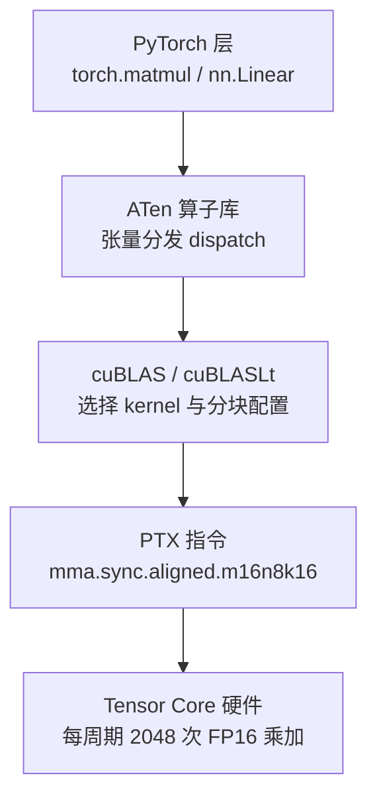
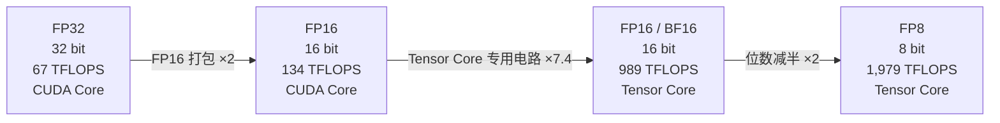

一次 16×8×16 的 MMA 指令，完成 2048 次乘加——同样的工作量，单个 CUDA Core 要连续算约两千个时钟周期。正是这种「一次一小块矩阵」的专用电路，让 H100 的 FP8 算力达到 1,979 TFLOPS，是它 FP32 CUDA Core 算力（67 TFLOPS）的约 30 倍。这 30 倍不是靠堆晶体管，而是两个设计叠加的结果：一是从 Volta 起引入的 Tensor Core 专用矩阵电路，二是从 FP32 到 FP8 一路减半的精度格式。本文拆开这两层：先讲 MMA 是什么、一次到底干多少活；再解剖 FP16/BF16/FP8 的位宽生态，回答「大模型训练为什么选 BF16」「FP8 凭什么翻倍」；最后落到三条工程纪律——维度对齐、看 Dense 不看 Sparse、用实测值预估性能。读完这篇，你就握住了从 5.1 架构演进通往模块二 GEMM kernel 的最后一块硬件底牌。

<!-- more -->

## 📑 目录

- [1. 为什么深度学习的核心是矩阵乘法](#1-为什么深度学习的核心是矩阵乘法)
- [2. Tensor Core 的核心指令：MMA](#2-tensor-core-的核心指令mma)
- [3. 精度格式生态：位宽解剖](#3-精度格式生态位宽解剖)
- [4. Tensor Core 算力与工程注意事项](#4-tensor-core-算力与工程注意事项)
- [5. 衔接：算力再高，也要看算术强度能不能喂饱它](#5-衔接算力再高也要看算术强度能不能喂饱它)
- [总结](#-总结)
- [自我检验清单](#-自我检验清单)
- [参考资料](#-参考资料)

---

## 1. 为什么深度学习的核心是矩阵乘法

### 1.1 前向、反向、Attention：全是矩阵乘

问题：深度学习的计算到底长什么样？为什么所有 AI 芯片都要死磕一个叫矩阵乘法的东西？

把 Transformer 拆到最底层，浮点运算几乎全部落在三类矩阵乘上：

- **前向传播**：每一层线性变换 $Y = XW + b$，本质是矩阵乘 $XW$ 再加偏置 $b$。$X$ 是这一层的输入激活，$W$ 是权重，$Y$ 是输出。
- **反向传播**：计算权重梯度 $\frac{\partial L}{\partial W} = X^\top \cdot \frac{\partial L}{\partial Y}$，是把输入转置后与上游梯度做一次矩阵乘。
- **Attention 计算**：$\text{Attention}(Q,K,V) = \text{softmax}\left(\frac{QK^\top}{\sqrt{d_k}}\right)V$，先做 $QK^\top$ 一次矩阵乘，再乘 $V$ 一次矩阵乘。

矩阵乘有一个专门的数学名字：**GEMM**（General Matrix Multiply，通用矩阵乘法）。它写成一行就是：

$$
D = \alpha \cdot A \times B + \beta \cdot C
$$

逐项解释：$A$ 是 $M \times K$ 的矩阵，$B$ 是 $K \times N$ 的矩阵，$C$ 和 $D$ 是 $M \times N$ 的矩阵；$\alpha$、$\beta$ 是两个标量系数，深度学习里几乎总是取 $\alpha = 1$、$\beta = 1$，于是退化成最常用的 $D = A \times B + C$。一次 GEMM 的乘加次数是固定的：

$$
\underbrace{M}_{\text{输出行数}} \times \underbrace{K}_{\text{累加维度}} \times \underbrace{N}_{\text{输出列数}} \text{ 次乘加}
$$

数值算例：一个 7B 参数的模型，每生成 1 个 token 的前向计算约 $2 \times 7 \times 10^9 \approx 140$ 亿次浮点运算。训练更夸张——按业界常用的估算公式，训练总计算量约等于 $6 \times \text{参数量} \times \text{训练 token 数}$，7B 模型训 1 万亿 token 就是：

$$
6 \times 7 \times 10^9 \times 10^{12} = 4.2 \times 10^{22} \text{ FLOPs}
$$

相当于单张 H100 以 FP8 满速（1,979 TFLOPS）不停机算约 246 天（理论下限）。所以大模型训练必须几千张卡并行，而每张卡上的每一次矩阵乘都得跑得越快越好。

📌 **关键点**：深度学习 = 海量 GEMM。**Tensor Core 就是 NVIDIA 为 GEMM 定制的专用电路**——这是它存在的全部理由。

### 1.2 一条调用链：torch.matmul 如何落到 Tensor Core

问题：你写 PyTorch 时从没见过 Tensor Core，它到底在哪一层被用到？

你每天写的 `torch.matmul` 或 `nn.Linear`，经过三层软件翻译才真正触达硬件。这张图讲的就是这条调用链——从你的一行 Python，到 GPU 里的一条条矩阵指令：

- **PyTorch 层**：`torch.matmul` 或 `nn.Linear` 发出请求，只描述「我要做什么」，不关心怎么做。
- **cuBLAS 层**：NVIDIA 的闭源线性代数库（cuBLASLt 是它的可调优版本），负责选 kernel 形状、分块大小、用不用 Tensor Core。
- **指令层**：翻译成 PTX/机器指令，例如 Hopper 上的 `mma.sync.aligned.m16n8k16`——一条 16×8×16 的乘累加指令。
- **硬件层**：Tensor Core 真正执行。

一句话：写框架代码时你不需要碰这条链，但理解它，你才知道为什么把 FP32 换成 BF16 一行代码性能能差好几倍。在代码里手写 GEMM kernel 的细节是模块二的主题，见 [4.1 CUDA GEMM算子性能优化](/AIInfraGuide/cuda/模块二-cuda编程与算子优化/41-cuda-gemm算子性能优化)。

## 2. Tensor Core 的核心指令：MMA

### 2.1 面包刀 vs 菜刀：一次算一个数 vs 一次算一块矩阵

问题：为什么专门造一种电路来处理矩阵乘？

延续 5.1 的比喻：**CUDA Core 是菜刀，Tensor Core 是面包刀**。菜刀什么都能切，但一刀只能切一片——一个时钟周期只完成一次标量的乘加；面包刀只会切面包，可刀身是一排锯齿，一刀下去一整排面包片同时断开——一个时钟周期完成一小块矩阵的乘加。

术语对位：CUDA Core 每周期执行一条 **FMA**（Fused Multiply-Add，乘加融合指令），算一次 $a \times b + c$；Tensor Core 每周期执行一条 **MMA**（Matrix Multiply-Accumulate，矩阵乘累加指令），算一小块 $D = A \times B + C$。

关键不是「快一点点」，而是**单位指令的活儿差了几个数量级**——这是下面两节要量化的事。

### 2.2 解剖一次 MMA：16×8×16 是多少次乘加

问题：16×8×16 这种写法是什么意思？一次 MMA 到底干了多少活？

以 Hopper 架构（H100）的 FP16 MMA 为例，一条指令的形状是 16×8×16，对应三个矩阵：

- 矩阵 A：16×16 的 FP16 矩阵（M×K，16 行 16 列）；
- 矩阵 B：16×8 的 FP16 矩阵（K×N，16 行 8 列）；
- 矩阵 C/D：16×8 的 **FP32** 矩阵（M×N，累加用 FP32 保持精度）。

公式就是上一节的 GEMM 缩到最小：

$$
D_{16\times8} = A_{16\times16} \times B_{16\times8} + C_{16\times8}
$$

逐步拆解：输出 $D$ 有 16 行 8 列，共 $16 \times 8 = 128$ 个元素；$D$ 的每个元素是 $A$ 的一行（16 个数）与 $B$ 的一列（16 个数）的点积，即 16 次乘加。所以一次 MMA 的乘加次数是：

$$
\underbrace{16}_{\text{输出行数 M}} \times \underbrace{16}_{\text{累加维度 K}} \times \underbrace{8}_{\text{输出列数 N}} = 2048 \text{ 次乘加}
$$

也可以换个算法：128 个输出元素 × 每个 16 次乘加 = 2048。一次乘加含 1 次乘法 + 1 次加法，所以一条 MMA 指令共 4096 次浮点运算（FLOPs）。

💡 **提示**：数学上「一次矩阵乘」就是 $M \times N \times K$ 次乘加，与用什么硬件无关；Tensor Core 的贡献是把这 2048 次乘加压进一条指令，由电路并行完成。

数值算例——用这个数字反推 H100 的官方算力：H100 有 132 个 SM，每个 SM 每周期完成 2048 次乘加（正好一条 16×8×16 MMA 的吞吐），等效主频约 1.83 GHz：

$$
132 \times 2048 \times 2 \times 1.83 \times 10^9 \approx 989 \text{ TFLOPS}
$$

正是官方标称的 FP16 Dense 算力。换句话说，官方数字不是拍脑袋的，它就是「每周期一条 MMA」这个设计直接乘出来的。注意频率口径：1.83 GHz 不是 datasheet 上的主频，而是由官方 989 TFLOPS 反推的**等效 Tensor Core 频率**；datasheet 的 Boost Clock 是 1.98 GHz，它对应的是 CUDA Core 的 FP32 算力（$132 \times 128 \times 2 \times 1.98 \times 10^9 \approx 67$ TFLOPS）。对照官方规格表时，别把这两个频率混用。

### 2.3 2048 次乘加意味着什么

问题：2048 次乘加 vs 1 次乘加，差距到底有多大？

拿 FP32 的 CUDA Core（每周期 1 次乘加）当尺子，完成同样的 2048 次乘加：

| 📊 执行方式 | 完成 2048 次乘加所需周期数 |
|---|---|
| 单个 CUDA Core | 2048 个周期 |
| 一个 Warp（32 个线程并行） | 2048 ÷ 32 = 64 个周期 |
| 一个 SM 的 128 个 FP32 CUDA Core | 2048 ÷ 128 = 16 个周期 |
| H100 的 Tensor Core（SM 级吞吐） | 1 个周期 |

📌 **关键点**：一条 MMA 指令 ≈ 单个 CUDA Core 两千多个周期的工作量。这不是「快了一点点」，而是把「一次乘加」这个基本工作单位本身换掉了。

⚠️ **注意**：上表对比的是 FP32 速率。CUDA Core 跑 FP16 时是 FP32 的两倍（两个 FP16 打包进一个 32 位寄存器），每 SM 每周期也只有 256 次乘加，与 Tensor Core 的 2048 仍有 8 倍差距。

### 2.4 MMA 形状的演进：从 4×4×4 到 16×8×16

问题：为什么后来的 MMA 形状越来越大？

第一代 Tensor Core 诞生于 Volta（V100，2017 年），它的 MMA 是 4×4×4：**每个 Tensor Core 每周期完成 64 次乘加**（4×4×4 = 64）。验证一下：V100 有 640 个 Tensor Core，$640 \times 64 \times 2 \times 1.53 \text{ GHz} \approx 125$ TFLOPS，与官方 FP16 算力一致。

之后的演进主线就是「一条指令干更多的活」：

| 📊 架构 | 代表卡 | 典型 MMA 形状 | 一次乘加次数 | FP16 Dense 算力 |
|---|---|---|---|---|
| Volta（2017） | V100 | 4×4×4 | 64 | 125 TFLOPS |
| Ampere（2020） | A100 | 16×8×8 | 1024 | 312 TFLOPS |
| Hopper（2022） | H100 | 16×8×16 | 2048 | 989 TFLOPS |
| Blackwell（2024） | B200 | tcgen05.mma（更大形状） | 更大 | 2,250 TFLOPS |

说明：B200 的 2,250 TFLOPS 为官方 **FP16/BF16 Dense** 口径（Sparse 为 4,500），与站内 5.5、GPU 基础知识一致；早期流传的 ~1,125 是按单 die 核算的口径，本站不采用。

💡 **提示**：Blackwell 的第五代 Tensor Core 除了形状更大，还把累加器搬进了片上的 Tensor Memory（TMEM），指令从「同步等结果」变成「异步发出」，调度方式也随之改变——精确的指令形状与细节以 CUDA/PTX 文档为准，本文不展开。

## 3. 精度格式生态：位宽解剖

### 3.1 一张表看懂七种格式的位宽

问题：TF32、FP16、BF16、FP8 这些名字都是什么？为什么 FP16 和 BF16 都是 16 位，行为却完全不同？

任何浮点格式都由三部分位组成：**符号位**（1 位，决定正负）、**指数位**（决定数值范围）、**尾数位**（决定精度）。先看全表，再逐项解释：

| 📊 格式 | 符号 | 指数 | 尾数 | 总位宽 | 最大可表示值 | 首次 Tensor Core 支持 | 典型应用 |
|---|---|---|---|---|---|---|---|
| FP32 | 1 | 8 | 23 | 32 | ~3.4×10³⁸ | —（CUDA Core） | 基准精度、参数更新、loss 累加 |
| TF32 | 1 | 8 | 10 | 19（存于 32 位容器） | ~3.4×10³⁸ | Ampere（A100） | FP32 输入自动加速的训练路径 |
| FP16 | 1 | 5 | 10 | 16 | 65,504 | Volta（V100） | 混合精度训练（需 loss scaling） |
| BF16 | 1 | 8 | 7 | 16 | ~3.4×10³⁸ | Ampere（A100） | 大模型训练主力（免 loss scaling） |
| FP8 E4M3 | 1 | 4 | 3 | 8 | 448 | Hopper（H100） | 前向：权重与激活 |
| FP8 E5M2 | 1 | 5 | 2 | 8 | 57,344 | Hopper（H100） | 反向：梯度 |
| FP4（E2M1） | 1 | 2 | 1 | 4 | ±6 | Blackwell（B200） | 推理量化 |

说明：FP16 的 65,504 是精确值；BF16/FP32/TF32 的 ~3.4×10³⁸ 是指数与 FP32 相同带来的范围；FP8 两档与 FP4 的取值来自 NVIDIA 与 Arm、Intel 联合发布的 FP8 规范及 Blackwell 的 FP4 资料。

📌 **关键点**：同一行里藏着两个独立的自由度——**指数位决定「能量到多大」，尾数位决定「能分得多细」**。FP16 和 BF16 都是 16 位，一个把位数给指数、一个给尾数，行为就完全不同了。

### 3.2 指数位决定范围，尾数位决定精度

问题：为什么说指数位决定范围、尾数位决定精度？

打个比方：想象两把尺子，一把量程 20 cm、最小刻度 1 mm；另一把量程 100 m、最小刻度 1 m。第一把量得细但量程小，第二把量得粗但量程大。**浮点格式的指数位 = 量程，尾数位 = 刻度粗细**：FP16 是「20 cm 的精细尺」，BF16 是「100 m 的粗尺」。

正式定义：一个浮点数的值是

$$
v = (-1)^{S} \times 2^{E - \text{bias}} \times \left(1 + \frac{M}{2^m}\right)
$$

逐项解释：

- $S$：符号位，0 为正、1 为负；
- $E$：指数位（无符号整数），减去偏置 bias 后得到真实指数。bias = 2^（指数位数−1） − 1：FP16 的 bias 是 15，FP32/BF16/TF32 是 127，E4M3 是 7，E5M2 是 15；
- $M$：尾数位（无符号整数），除以 $2^m$ 后落在 [0,1) 区间，$m$ 是尾数位数；
- $1 + M/2^m$：相当于科学计数法的「有效数字」部分，永远在 [1,2) 之间。

数值例子：FP16 的二进制 `0 10010 0000000000`，即 $S=0$、$E=18$、$M=0$。bias = 15，真实指数 $18 - 15 = 3$，所以 $v = 1 \times 2^3 = 8$。

再看两个极端：$E$ 能取到的最大值决定量程——FP16 的 $E$ 名义上最多到 31，但 $E=31$（指数位全 1）被保留给 inf/NaN，最大有限数对应 $E=30$：$2^{30-15} \times \left(1 + \frac{1023}{1024}\right) = 65,504$；$M$ 有几位决定相邻两个可表示数的间隔——FP16 的 $m=10$，间隔约 $2^{-10} \approx 0.001$，BF16 的 $m=7$，间隔约 $2^{-7} \approx 0.008$。

💡 **提示**：所谓**动态范围** = 最大可表示值 / 最小可表示值。FP16 的 5 位指数只有 $2^5 = 32$ 种取值，BF16/FP32 的 8 位指数有 256 种——「范围差几个数量级」的根源就在这里。

### 3.3 FP16 vs BF16：为什么大模型训练选 BF16

问题：FP16 和 BF16 都是 16 位，为什么大模型训练几乎都用 BF16？

先看事实：训练中反向传播产生的**梯度**，数值可能极小（如 1e-6），也可能很大（如 7 万）。而 FP16 的能量程是：最小正规数约 $6.1 \times 10^{-5}$，最大 65,504。代入两个场景：

- **下溢**：梯度 1e-6 < 6.1×10⁻⁵，在 FP16 里直接变成 0 → 参数永远不更新 → 训练静默失败；
- **上溢**：梯度 70,000 > 65,504，变成 inf → 之后的乘加全部被污染。

BF16 的指数有 8 位，与 FP32 完全相同的范围（约 ±3.4×10³⁸）：1e-6 和 70,000 都稳稳落在范围内，**不需要任何补救措施**。

那 FP16 怎么办？混合精度训练的标准做法是 **loss scaling**：反向传播前把 loss 乘一个大数（2¹⁰ 到 2¹⁶ 量级，PyTorch GradScaler 默认 2¹⁶ = 65,536），梯度跟着整体放大，躲开下溢区间；更新参数前再把梯度除回去。这套流程由框架自动完成，但要多维护一份 FP32 主权重，且放大后的梯度仍可能撞上 65,504 的上限，需要额外的梯度裁剪。

BF16 牺牲了什么？它把 10 位尾数砍到 7 位，有效数字从约 3 位十进制降到约 2 位——**用精度换范围**。但实践证明，大模型训练对「范围」远比「精度」敏感：梯度在数量级上跨越极广，而 2 位有效数字在绝大多数层足够。NVIDIA 官方混合精度博客的结论也正是：训练优先选 BF16，免 loss scaling，数值更稳。

📌 **关键点**：FP16 死于范围，BF16 死于精度——而在大模型训练里，**「范围不足」比「精度略低」致命得多**，所以 BF16 胜出。

### 3.4 FP8 双格式与 Transformer Engine

问题：FP8 只有 8 位，精度不是更差吗？为什么还敢用在训练上？

因为 FP8 不是一种格式，而是两种，按使用场景分工（这是 FP8 规范的官方标准用法）：

| 📊 格式 | 位宽 | 最大可表示值 | 用于 | 理由 |
|---|---|---|---|---|
| E4M3 | 1+4+3 | 448 | 前向：权重与激活 | 前向数值分布集中，更需要精度（3 位尾数） |
| E5M2 | 1+5+2 | 57,344 | 反向：梯度 | 梯度数量级跨度大，更需要范围（5 位指数） |

直觉：权重和激活是「被精心调整过的数」，范围窄但要求精细；梯度是「一路上累乘出来的数」，可能忽大忽小，先保住范围。所以前向用 E4M3（精度优先），反向用 E5M2（范围优先）。

那谁来保证数值不出问题？Hopper 起引入 **Transformer Engine**：它在每一层计算前动态分析张量数值分布，自动决定这一层用 FP8 还是退回 BF16/FP16——就像自动挡汽车，直路挂高速挡，弯道自动降挡。机制细节（amax 统计、delayed scaling 等）在 [5.1 §6.2 Hopper 架构](/AIInfraGuide/prerequisites/模块一-前置知识/gpu/nvidia-gpu-evolution#6-hopper-架构2022为大模型而生) 已完整展开，这里不重复。

⚠️ **注意**：FP8 训练并没有「免费」——它需要配套的缩放因子（per-tensor 或 per-block scaling），由 Transformer Engine 在幕后处理，对使用框架的用户透明。这也是为什么 FP8 训练要装 `transformer_engine` 库而不是纯 PyTorch 裸跑。

### 3.5 精度与算力的阶梯：位数减半，吞吐翻倍

问题：为什么 FP8 的算力正好是 FP16 的两倍？为什么 TF32 的 495 正好是 FP16 989 的一半？

同一个 Tensor Core 电路，每周期能处理的元素个数由电路的物理宽度决定；元素位数减半，同样的宽度就能塞下两倍的元素。这张图讲的是 H100 的完整算力阶梯——从 FP32 的 67 到 FP8 的 1,979，每一步翻倍都来自两个因素之一：

对号入座验证：FP16（16 位）→ FP8（8 位）位数减半，$1,979 = 989 \times 2$ ✓；FP16 → TF32 方向，TF32 的 MMA 累加维度 K 减半（16×8×8），$495 = 989 \div 2$ ✓。67 → 1,979 合计约 29.5 倍，与开篇说的「约 30 倍」一致。

## 4. Tensor Core 算力与工程注意事项

### 4.1 算力对比：同一张卡，四档算力

问题：官方规格表里 TF32/FP16/FP8 三档 Tensor Core 算力是怎么来的？

以 H100 SXM 为例，全部为官方 Dense（非稀疏）值：

| 📊 精度 | CUDA Core 算力 | Tensor Core 算力 | 加速比 |
|---|---|---|---|
| FP32 | 67 TFLOPS | 495 TFLOPS（TF32） | ~7.4× |
| FP16 | 134 TFLOPS | 989 TFLOPS | ~7.4× |
| FP8 | — | 1,979 TFLOPS | — |

📌 **关键点**：7.4× 不是巧合，它约等于「每周期乘加数 8 倍（2048 vs 256）× 时钟系数 0.92」的乘积（两档标称算力对应的主频口径略有不同，按官方数字反推可得）。**算力阶梯 = 专用电路 × 精度压缩，两个因素相乘**：同精度下 Tensor Core 比 CUDA Core 高约 7.4×，精度每减半一次再翻一倍。这就是「FP8 是 FP32 的约 30 倍」的全部来源——没有魔法，只有设计。

### 4.2 对齐约束：为什么 hidden_size 要取 8 或 16 的倍数

问题：为什么所有大模型的 hidden_size 都是 4096、8192、12288 这种「整」数？

因为 MMA 是固定形状的小块：16×8×16 意味着 M 维按 16 切、N 维按 8 切、K 维按 16 切。矩阵维度不是这些数的倍数时，边缘会剩下「残缺小块」，要么补零（**padding**），要么走非 Tensor Core 的兜底路径，性能打折：

- **合规例子**：LLaMA 类模型的 hidden_size = 4096 = 16 × 256，M/N/K 全部对齐 → 一条条完整的 MMA，满速；
- **不合规例子**：hidden_size = 7 → 每 16 个元素要补 9 个零，或者整层退化为 CUDA Core 路径，算力直接掉回低档位。

所以工程惯例是：设计模型时把 hidden_size 取成 8/16 的倍数（或干脆用标准尺寸），需要对齐时做 padding。cuBLAS 对非对齐维度会在内部兜底，代价是额外的边界逻辑或非最优路径——对用户透明，对性能不透明。

⚠️ **注意**：精确的对齐要求随架构与指令变化，PTX ISA 文档有明文规定——`wmma.mma.sync.aligned.m16n8k16` 要求 M 为 16 的倍数、N 为 8 的倍数、K 为 16 的倍数；Hopper 的 `wgmma`（异步）取 m64 或 m128 形状，N 为 8 的倍数、K 取 8 或 16。本文给的是常见约定，具体到你的架构，以 [PTX ISA 文档](https://docs.nvidia.com/cuda/parallel-thread-execution/) 的 mma / wgmma / tcgen05.mma 章节为准。

### 4.3 标称算力与实测算力：Sparse、MFU 与 30%-60%

问题：为什么实际训练从来看不到标称 TFLOPS？

两个原因，一个在规格表里，一个在真实系统里：

1. **厂商标称常用 Sparse（稀疏）峰值**：Ampere 起支持的 2:4 结构化稀疏（每 4 个元素中最多 2 个非零）能让 Tensor Core 吞吐翻倍，官方规格表里带星号的数字就是它——例如 H100 官方页面 FP16 标 1,979 TFLOPS、FP8 标 3,958 TFLOPS，而 Dense 值分别是 989 和 1,979。但稀疏要求权重先经过专门剪枝，实际训练几乎都用 Dense 值。
2. **就算用 Dense 值，真实训练也到不了**：数据搬运、通信、并行切分、kernel 未充分展开……业界用 **MFU**（Model FLOPs Utilization，模型算力利用率）衡量，大模型训练里 MFU 通常只有 30%-60%。

工程纪律：评估训练吞吐时，不要拿规格表数字直接除。先跑一个真实 step，用 profiler（Nsight Compute / PyTorch Profiler）测出实际算力，再按 30%-60% 的量级做预估。

💡 **提示**：2:4 结构化稀疏的完整机制（剪枝 → 重训练 → 稀疏存储格式）这里只做预告，不展开；它目前主要用于推理侧的模型压缩，训练侧的主流仍是 Dense。

## 5. 衔接：算力再高，也要看算术强度能不能喂饱它

Tensor Core 把算力堆到 989 TFLOPS，但算力不是免费的——它要求每个周期都有数据喂进电路。H100 的 FP16 算力与 HBM3 带宽之比约 295 FLOPs/Byte：你的 kernel 每从显存读 1 字节，至少要算 295 次浮点运算，才不会被「等数据」拖死（这个比值在 [5.5 主流 AI GPU 规格对比与 Roofline](/AIInfraGuide/prerequisites/模块一-前置知识/gpu/55-主流ai-gpu规格对比与roofline) 一节有完整推导）。

GEMM 是典型的高算术强度算子（同一块数据被反复复用），所以能吃满 Tensor Core；而 Attention、LayerNorm 这类算子算术强度低，Tensor Core 算力再高也喂不饱——这就是 FlashAttention、算子融合存在的意义。

下一站：5.5 将专门展开 Roofline 模型与算术强度，教你判断一个算子到底缺算力还是缺带宽；再下一站，[模块二 4.1](/AIInfraGuide/cuda/模块二-cuda编程与算子优化/41-cuda-gemm算子性能优化) 会在代码里真正写出能跑 Tensor Core 的 GEMM kernel——到那时你会发现，本文的 16×8×16、维度对齐、分块这些概念，正是 kernel 里每行代码的注脚。

## 📝 总结

1. **深度学习 = GEMM**：前向、反向、Attention 全是矩阵乘，Tensor Core 是 NVIDIA 为 GEMM 定制的专用电路。
2. **MMA 是基本单位**：一次 16×8×16 的 MMA = 2048 次乘加，H100 每个 SM 每周期恰好一条；从 Volta 的 4×4×4（64 次）到 Hopper 的 16×8×16，一条指令干的活越来越大。
3. **位宽解剖**：指数位决定动态范围，尾数位决定精度；BF16 用尾数换范围，所以大模型训练免 loss scaling，而 FP16 需要。
4. **算力阶梯 = 专用电路 × 精度压缩**：H100 从 FP32 CUDA 的 67 到 FP8 的 1,979 TFLOPS（约 30 倍），拆开就是 7.4×（专用电路）× 2 × 2（两次精度减半）。
5. **三条工程纪律**：维度对齐到 8/16 的倍数、看 Dense 不看 Sparse、用实测 MFU（30%-60%）预估训练吞吐。

## 🎯 自我检验清单

- 能口算一次 16×8×16 MMA 的乘加次数（16×16×8 = 2048），并说出 A/B/C/D 的形状与累加精度（FP32）
- 能由 989 TFLOPS 反推 H100 每 SM 每周期完成 2048 次 FP16 乘加，误差在 10% 以内
- 能解释 Tensor Core 与 CUDA Core 的本质区别，并对比 Volta 4×4×4 与 Hopper 16×8×16 一次指令的乘加次数（64 vs 2048）
- 能默写出 FP32 / TF32 / FP16 / BF16 / FP8（E4M3、E5M2）的符号、指数、尾数位数
- 能用公式 $v = (-1)^S \times 2^{E-\text{bias}} \times (1 + M/2^m)$ 解释为什么指数位决定范围、尾数位决定精度，并代入一个 FP16 二进制实例算出数值
- 能说出 FP16 最大 65,504 与 BF16 最大约 3.4×10³⁸，并用具体梯度值（如 1e-6 与 70,000）演示下溢与上溢
- 能解释 BF16 为什么免 loss scaling、FP16 为什么需要，并说出 BF16 牺牲了什么（尾数 7 位 vs 10 位）
- 能说出 FP8 E4M3 / E5M2 的分工（前向精度优先 / 反向范围优先）及各自最大可表示值（448 / 57,344）
- 能说出 H100 四档 Dense 算力（67 / 495 / 989 / 1,979 TFLOPS），并拆解「约 30 倍」的两个来源
- 能解释为什么 hidden_size 要取 8/16 的倍数，并说明非对齐维度 padding 的代价
- 能区分 Sparse 与 Dense 标称算力，并说明为什么训练吞吐预估要用实测 MFU（30%-60%）
- 能画出 torch.matmul → cuBLAS → MMA 指令 → Tensor Core 的调用链，并指出每一层各做什么

## 📚 参考资料

**官方文档与白皮书**

- [NVIDIA H100 Tensor Core GPU Datasheet](https://www.nvidia.com/en-us/data-center/h100/)——H100 各精度算力的官方规格页（星号值 = with sparsity）
- [NVIDIA Hopper H100 Whitepaper](https://resources.nvidia.com/en-us-tensor-core/gtc22-whitepaper-hopper)——第四代 Tensor Core、16×8×16 MMA 与 989 / 1,979 TFLOPS 的来源
- [NVIDIA Volta Architecture Whitepaper](https://images.nvidia.com/content/volta-architecture/pdf/volta-architecture-whitepaper.pdf)——第一代 4×4×4 Tensor Core 与 64 次乘加/周期
- [NVIDIA Blackwell Architecture Technical Brief](https://www.nvidia.com/en-us/data-center/technologies/blackwell-architecture/)——第五代 Tensor Core 与 FP4
- [NVIDIA HGX B200 官方规格页](https://www.nvidia.com/en-us/data-center/hgx/) 与 [HGX B200 产品指南（Lenovo × NVIDIA）](https://lenovopress.lenovo.com/lp2226.pdf)——B200 FP16/BF16 Tensor Core 2.25 / 4.5 PFLOPS（Dense / Sparse）的官方来源
- [CUDA C++ Programming Guide](https://docs.nvidia.com/cuda/cuda-c-programming-guide/)——wmma / mma 指令与维度对齐要求
- [PTX ISA 文档](https://docs.nvidia.com/cuda/parallel-thread-execution/)——mma.sync / wgmma / tcgen05.mma 指令的精确形状
- [NVIDIA Mixed Precision Training 博客](https://developer.nvidia.com/blog/mixed-precision-training-deep-neural-networks/)——FP16 loss scaling 与 BF16 的官方论述
- [FP8 Formats for Deep Learning（Micikevicius et al., 2022）](https://arxiv.org/abs/2209.05433)——NVIDIA / Arm / Intel 联合 FP8 规范：E4M3 / E5M2 分工与 175B 模型实验
- [NVIDIA Transformer Engine 文档](https://docs.nvidia.com/deeplearning/transformer-engine/user-guide/index.html)——FP8 自动精度调度与 FP4 说明

**站内关联**

- [5.1 NVIDIA GPU架构演进](/AIInfraGuide/prerequisites/模块一-前置知识/gpu/nvidia-gpu-evolution)——Tensor Core 的架构代际与 Transformer Engine 详解
- [4.1 CUDA GEMM算子性能优化](/AIInfraGuide/cuda/模块二-cuda编程与算子优化/41-cuda-gemm算子性能优化)——手写能跑 Tensor Core 的 GEMM kernel
