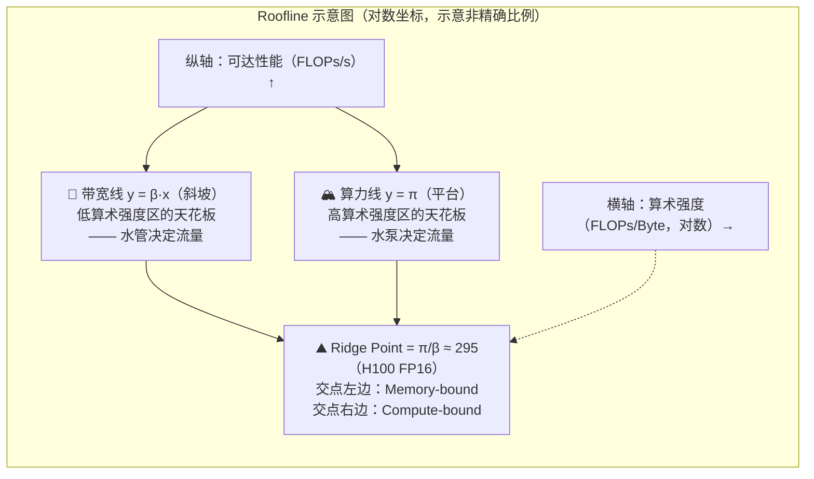
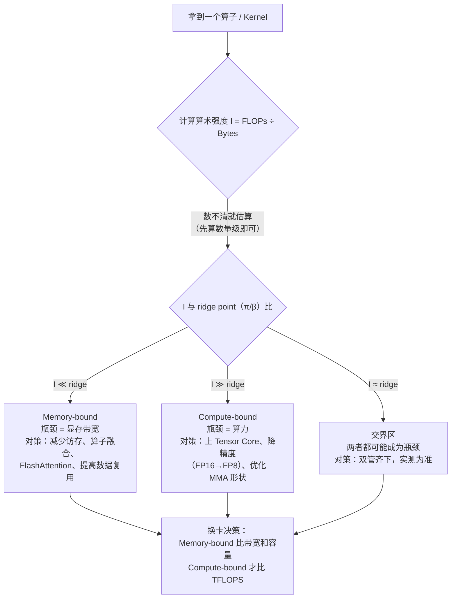

选卡只看 TFLOPS，是新手最容易犯的错误。一块 H100 的 FP16 算力是 A100 的 **3.2 倍**（989 vs 312 TFLOPS），但如果你跑的是一个算术强度 ≈ 1 的算子（比如 LayerNorm），两者实际差距只有 **1.6 倍**——因为两者的性能都被各自的显存带宽卡住了，算力再高也使不上劲。判断“任务到底卡在哪”，靠的不是背参数，而是三件套：一张官方规格表、一个叫算术强度的小公式、一张叫 Roofline 的图。读完这篇，你能对任意一个算子回答三个问题：它吃算力还是吃带宽？换哪块卡能变快？瓶颈换了之后下一步怎么办？

上一篇 [5.1 NVIDIA GPU 架构演进](/AIInfraGuide/prerequisites/模块一-前置知识/gpu/nvidia-gpu-evolution) 讲的是“每一代架构带来了什么”，本篇把镜头对准规格表本身，教你把数字翻译成性能判断；下一节（5.6）会接着回答“确认卡在哪之后，显存放不放得下”。

<!-- more -->

## 📑 目录

- [1. 先认识四块"天花板"：每个指标卡住谁](#1-先认识四块天花板每个指标卡住谁)
- [2. 算力从哪来：手算一块 GPU 的 TFLOPS](#2-算力从哪来手算一块-gpu-的-tflops)
- [3. 六张卡一张表：官方规格里的门道](#3-六张卡一张表官方规格里的门道)
- [4. 算术强度：把任务翻译成两个数字](#4-算术强度把任务翻译成两个数字)
- [5. Roofline：一张图判断任务卡在哪](#5-roofline一张图判断任务卡在哪)
- [6. 两个常见错误：为什么不能只看 TFLOPS](#6-两个常见错误为什么不能只看-tflops)
- [7. 判断三步法：拿到任务先做这三件事](#7-判断三步法拿到任务先做这三件事)
- [总结](#-总结)
- [自我检验清单](#-自我检验清单)
- [参考资料](#-参考资料)

---

## 1. 先认识四块“天花板”：每个指标卡住谁

一块 GPU 的规格表里有十几个数字，但真正决定性能上限的只有四个。为什么是“天花板”？因为任何一个任务，最终耗时都由它最接近的那个上限决定——其他的资源再富裕，也只能闲着等。

### 1.1 四个指标，四种不同的瓶颈

| 📊 指标 | 单位 | 卡住谁 | 典型症状 |
|---|---|---|---|
| **算力** | TFLOPS（每秒万亿次浮点运算） | Compute-bound 任务：大矩阵乘法、大 batch 的 Prefill | GPU 计算单元跑满，但显存带宽利用率很低 |
| **显存带宽** | GB/s（每秒读写多少 GB 数据） | Memory-bound 任务：逐元素运算、归一化、小 batch 的 Decode | 显存带宽打满，SM 却在大量空转等数据 |
| **显存容量** | GB | 模型的“体积”：权重、KV Cache、激活值放不放得下 | 直接 OOM（Out of Memory），程序崩溃 |
| **互联带宽** | GB/s | 多卡并行时的扩展效率 | 加卡不加速，通信占比随卡数上升 |

注意第三行的用词：容量决定的是“能不能跑”，前三行决定的是“跑多快”。这是两组完全不同的问题，别混在一起比。

### 1.2 为什么耗时由瓶颈决定：一个简化模型

**关键结论：一个任务的耗时，约等于“算完需要的时间”和“搬完数据需要的时间”里更大的那个。**

$$
\text{耗时} \approx \max\left(\underbrace{\frac{\text{FLOPs}}{\text{算力}}}_{\text{纯计算时间}}, \quad \underbrace{\frac{\text{Bytes}}{\text{带宽}}}_{\text{纯搬运时间}}\right)
$$

（FLOPs = 浮点运算次数，Bytes = 显存读写字节数，两个词本篇会反复用，先记住含义。）

打个比方：一家只做一种产品的工厂，机器加工速度极快，但原材料要从仓库经一条传送带运到机器旁。传送带每秒只能运 10 公斤原料，机器再快，产出也被传送带钉死——整条产线的瓶颈是搬运，不是加工。GPU 里机器就是计算单元，传送带就是显存带宽，原料就是数据。

- 当“搬运时间 > 计算时间”，任务叫 **Memory-bound（访存受限）**：瓶颈是显存带宽；
- 当“计算时间 > 搬运时间”，任务叫 **Compute-bound（计算受限）**：瓶颈是算力。

这两个词是全文的地基，后面所有分析都在回答同一个问题：**当前这个任务，是哪一种？**

## 2. 算力从哪来：手算一块 GPU 的 TFLOPS

规格表里的 TFLOPS 不是测出来的，是按硬件参数**算**出来的。这一节我们亲自算一遍——算完你会发现，官方数字可以被一个简单公式自洽地还原，这比背数字有用得多。

### 2.1 CUDA Core 的算力：四个乘数

直觉先行：每个 SM（流式多处理器，GPU 的基本计算单元，见 5.1）里有一排 FP32 计算单元，每个单元每个时钟周期能做一次 **FMA（乘加融合运算，Fused Multiply-Add）**——一次 FMA 同时完成“乘”和“加”两件事，所以账面上记 **2 次浮点运算**。整卡的算力就是四个数字相乘：

$$
\text{算力} = \underbrace{\text{SM 数}}_{\text{有多少个小组}} \times \underbrace{\text{每 SM 的 FP32 单元数}}_{\text{每组多少人}} \times \underbrace{2}_{\text{FMA 一算两笔}} \times \underbrace{\text{时钟频率}}_{\text{每秒拍多少次}}
$$

用 H100 代入（SM 数 132、每 SM 128 个 FP32 单元、Boost 频率 1.98 GHz）：

$$
132 \times 128 \times 2 \times 1.98 \times 10^9 \approx 66.9 \times 10^{12} = \text{66.9 TFLOPS}
$$

官方规格表上 H100 的 FP32 算力是多少？**67 TFLOPS**。公式算出来 66.9，几乎一模一样。

💡 **提示**：这就是“公式能自洽验证官方数字”的典型例子——NVIDIA 自己也是这么算的。同理可以验证 H100 的 FP16 CUDA Core 算力：FP16 每个单元每周期能处理 2 个 FP16 运算（打包执行），所以是 66.9 × 2 ≈ 134 TFLOPS，与官方 134 吻合。真正让 H100 比 A100 快 3 倍的，其实是下一节的主角——Tensor Core。

### 2.2 Tensor Core 的算力：按 MMA 规模另算

CUDA Core 每次只算一个数，Tensor Core 每次算一小块矩阵。它执行的基本操作叫 **MMA（矩阵乘累加，Matrix Multiply-Accumulate）**（MMA 的完整机制、维度对齐约束与形状演进详见 [5.4 Tensor Core 与 AI 加速](/AIInfraGuide/prerequisites/模块一-前置知识/gpu/54-tensor-core与ai加速) 第 2 节，本篇只保留算力核算所需的核心推导）：$D = A \times B + C$，其中 $A$、$B$、$C$ 是小矩阵。以 Hopper 架构的 $16 \times 8 \times 16$ MMA 为例，一次操作完成 $16 \times 8 \times 16 = 2048$ 次乘加，也就是 **4096 次浮点运算**（乘和加各算一次）：

$$
\underbrace{2 \times 16 \times 8 \times 16}_{\text{乘加各算一次}} = 4096 \text{ FLOPs / 次 MMA}
$$

所以 Tensor Core 算力 = MMA 次数/秒 × 每次的 FLOPs，而不再用“单元数 × 2 × 频率”那套 CUDA Core 公式。用 H100 反推验证：官方 FP16 Dense 算力 989 TFLOPS，132 个 SM 分摊下来，每个 SM 每秒要贡献 $989 \div 132 \approx 7.5$ TFLOPS；再除以每个时钟周期一个 $16 \times 8 \times 16$ MMA（4096 FLOPs），反推有效频率约 1.83 GHz——与官方标称的 1.98 GHz 同数量级。

📌 **关键点**：同样的 132 个 SM，Tensor Core 的 FP16 算力（989 TFLOPS）是 CUDA Core 的 FP32 算力（67 TFLOPS）的 **~15 倍**。规格表里那些吓人的大数字，几乎全部来自 Tensor Core。

⚠️ **注意**：这里出现了一个读表陷阱——“989 TFLOPS”是 **Dense（稠密）** 数字，Tensor Core 还有一个开启 2:4 结构化稀疏后的翻倍模式。厂商宣传页经常只写稀疏峰值，这个坑第 3.2 节专门拆。

## 3. 六张卡一张表：官方规格里的门道

下面是截至 2025 年主流 NVIDIA 数据中心 GPU 的核心规格对比。所有数字均按官方 Datasheet 的 **Dense（非稀疏）** 口径整理，B200 的冲突点见表格后的 ⚠️ 说明。

| 📊 型号 | 架构 | SM 数 | 显存 | 带宽 | FP16 Dense | FP8 Dense | TDP | 典型用途 |
|---|---|---|---|---|---|---|---|---|
| V100 | Volta | 80 | 32 GB HBM2 | 900 GB/s | 125 TFLOPS | — | 300W | 经典训练卡 |
| A100 SXM | Ampere | 108 | 80 GB HBM2e | 2,039 GB/s | 312 TFLOPS | — | 400W | 训练 + 推理 |
| H100 SXM | Hopper | 132 | 80 GB HBM3 | 3,350 GB/s | 989 TFLOPS | 1,979 TFLOPS | 700W | 大规模训练 |
| H200 | Hopper | 132 | 141 GB HBM3e | 4,800 GB/s | 989 TFLOPS | 1,979 TFLOPS | 700W | 长序列推理 |
| B200 | Blackwell | 双 die（官方未公开，第三方约 160） | 180~192 GB HBM3e | ~8,000 GB/s | 2,250 TFLOPS | 4,500 TFLOPS | 1000W | 下一代旗舰 |
| L40S | Ada | 142 | 48 GB GDDR6 | 864 GB/s | 362 TFLOPS | — | 350W | 推理 / 多媒体 |

📌 **关键点**：读这张表，抓三个反直觉处。第一，**算力涨得比带宽快得多**：V100 到 B200，FP16 算力涨了 18 倍（125 → 2,250），带宽只涨了约 9 倍（900 → 8,000）。这意味着“等数据”的倾向一代比一代严重，Memory-bound 会越来越常见。第二，**H200 和 H100 算力完全相同**（都是 989 TFLOPS），但带宽多 43%、显存多 76%——同一架构只换了显存，这是“带宽独立于算力”的最佳教材，3.1 节展开。第三，**L40S 的 FP16 算力 362 TFLOPS（官方口径 362.05）甚至超过 A100 的 312**，但带宽只有 864 GB/s，很多任务实际跑起来不如 A100——单看算力排名会得出完全错误的结论。

⚠️ **注意（B200 口径说明）**：站内 5.1 / 5.3 曾按单 die 口径记 B200 FP16 ≈ 1,125 / FP8 ≈ 2,250 TFLOPS，已于 2026-08 统一为官方整卡口径（FP16 2,250 / 4,500、FP8 4,500 / 9,000），与本表一致。本表以 NVIDIA 官方 HGX B200 Datasheet 为准（Lenovo HGX B200 产品指南同样列出 “FP16/BF16 Tensor Core: 2.25 / 4.5 PFLOPS（Dense / Sparse）”）。另：B200 官方未公开 SM 总数，“约 160”为第三方估算；显存官方不同文档分别标过 180 GB（HGX 指南）与 192 GB（早期产品页），带宽也有 8 TB/s 与 7.7 TB/s 两种口径——遇到两来源冲突，统一以官方最新 Datasheet 为准。

### 3.1 H200 vs H100：算力相同，差在哪

为什么同样 989 TFLOPS，H200 比 H100 贵那么多？因为规格表里**算力列之外**的差异，恰恰是 LLM 推理最需要的：

| 📊 维度 | H100 SXM | H200 | 差异 |
|---|---|---|---|
| FP16 Dense 算力 | 989 TFLOPS | 989 TFLOPS | **完全相同** |
| 显存带宽 | 3,350 GB/s | 4,800 GB/s | +43% |
| 显存容量 | 80 GB | 141 GB | +76% |
| 架构 / SM 数 | Hopper / 132 | Hopper / 132 | 完全相同 |

这个对比说明一件重要的事：**算力和带宽是两张独立的“卡”，改一张不影响另一张**。H200 就是 H100 换掉显存堆叠（HBM3 → HBM3e）的产物，计算单元一个没动，所以算力不变；但带宽和容量都上了一个台阶。

这对推理有什么实际意义？推理的 Decode 阶段（逐 token 生成）是典型的 Memory-bound：每生成一个 token，都要把模型权重从显存读一遍。带宽 +43%，理论上单用户吞吐就 +43%——算力一分没加，体验却快了一大截。容量 +76% 的意义更直接：7B 模型的 KV Cache（缓存的历史 token 状态）随上下文长度线性增长，141 GB 能支撑的上下文长度和并发请求数都远超 80 GB。

### 3.2 Dense 与 Sparse：厂商数字里的“水分”

规格表里同一块卡经常出现两个数字，比如 H100 FP16 是 989 和 1,979。差的这一倍来自 **2:4 结构化稀疏（2:4 Structured Sparsity）**：把权重矩阵按“每 4 个元素有 2 个为 0”的结构剪枝后，Tensor Core 可以跳过零元素，吞吐翻倍。

| 📊 精度 | H100 Dense / Sparse | B200 Dense / Sparse |
|---|---|---|
| FP16 / BF16 | 989 / 1,979 TFLOPS | 2,250 / 4,500 TFLOPS |
| FP8 | 1,979 / 3,958 TFLOPS | 4,500 / 9,000 TFLOPS |
| FP4 | — | 9,000 / 18,000 TOPS |

⚠️ **注意**：稀疏模式需要模型权重经过专门的剪枝训练才能用，绝大多数生产模型**没有**做这一步，跑的是 Dense 算力。厂商宣传页爱写稀疏峰值，对比时务必先确认两边是不是同一口径——“H100 FP16 1,979” 和 “B200 FP16 2,250” 放在一起比，前者其实是稀疏值，后者是稠密值，直接比会得出荒谬结论。

另一个更隐蔽的“水分”：就算用 Dense 数字，**实际应用中的有效算力通常只有标称的 30%~60%**（即 **MFU**（模型算力利用率）口径，原因分析见 [5.4 第 4.3 节](/AIInfraGuide/prerequisites/模块一-前置知识/gpu/54-tensor-core与ai加速)，本篇不重复推导）。所以正确姿势不是信标称，而是实测：

```bash
# 第一步：nvidia-smi 看功耗与利用率（粗略判断有没有跑起来）
nvidia-smi

# 第二步：Nsight Compute 看单个 Kernel 的 SOL（Speed of Light）面板
# SOL 会直接告诉你：这个 Kernel 的瓶颈是计算（Compute）还是访存（Memory）
ncu --set full ./my_kernel
```

SOL 面板是 Roofline 思想的工程化实现——本章学完，你就能读懂它。

### 3.3 SXM 与 PCIe：同一型号的两个版本

V100、A100、H100 都有 **SXM** 和 **PCIe** 两种封装，名字一样，性能却差一档。以 H100 为例：

| 📊 维度 | H100 SXM | H100 PCIe |
|---|---|---|
| FP16 Dense 算力 | 989 TFLOPS | 756 TFLOPS |
| 显存带宽 | 3,350 GB/s | 2,000 GB/s |
| TDP | 700W | 350W |
| NVLink | 900 GB/s（8 卡全互联） | 600 GB/s（仅 2 卡桥接） |

为什么同一颗芯片差这么多？SXM 版插在专用机箱里，供电和散热预算更大，可以跑更高频率；PCIe 版是标准扩展卡，功耗被压在 350W，只能降频。互联更是天壤之别：SXM 版经 NVSwitch 八卡全互联，PCIe 版最多两卡桥接——想做 8 卡张量并行，PCIe 版直接出局。

📌 **关键点**：**选型必须确认封装**。云厂商实例名里带 “pcie” 字样的，就是 PCIe 版；同一个型号，SXM 和 PCIe 的推理吞吐可能差 30% 以上。另外 TDP 不是纸面参数：H100 SXM 700W × 8 卡 = 单节点 5.6 kW 的供电和散热需求，B200 1000W 通常要上液冷——机柜部署时功耗往往比单价更先卡住你。

## 4. 算术强度：把任务翻译成两个数字

规格表讲完了，接下来把“任务”也变成数字。Roofline 的整个思想就建立在一个比值上：**算术强度（Arithmetic Intensity）**。

### 4.1 定义：每搬 1 字节，要算几笔账

直觉先行。任意一个算子（Kernel），都可以数出两笔账：一共要做多少次浮点运算（FLOPs），一共要从显存读写多少字节（Bytes）。两者一比，就是这个算子的“性格”：

$$
\text{算术强度 } I = \frac{\text{浮点运算量 (FLOPs)}}{\text{内存访问量 (Bytes)}} \quad \text{单位：FLOPs/Byte}
$$

$I$ 大，说明这个任务“数据搬进来之后反复加工”，是计算密集；$I$ 小，说明数据“搬进来只摸一下就运走”，是访存密集。注意：**这是算子本身的属性，和 GPU 无关**——同一个 LayerNorm，在 A100 上和 B200 上算术强度一样。

### 4.2 手算两个例子（贯穿全文的对照组）

**例子一：向量加 $C = A + B$（$N$ 个元素，FP16）**

- FLOPs：每个元素一次加法，共 $N$ 次；
- Bytes：读 $A$（$2N$ 字节）+ 读 $B$（$2N$ 字节）+ 写 $C$（$2N$ 字节）= $6N$ 字节；
- $I = N / 6N \approx 0.17$ FLOPs/Byte。

**例子二：大矩阵乘 $C = A \times B$（$N \times N$，FP16）**

- FLOPs：$2N^3$（$N^3$ 次乘加，乘加各算一次）；
- Bytes：读 $A$（$N^2 \times 2$）+ 读 $B$（$N^2 \times 2$）+ 写 $C$（$N^2 \times 2$）= $6N^2$ 字节；
- $I = 2N^3 / 6N^2 = N/3$。当 $N = 8192$：$I \approx 2,731$ FLOPs/Byte。

**关键结论：矩阵越大，算术强度越高**（$I \propto N$），因为矩阵乘的运算量随 $N^3$ 增长，而访存量只随 $N^2$ 增长——数据复用率天然更高。向量加这种逐元素算子则永远在 0.2 附近徘徊。

### 4.3 GPU 的“自身体检”：ops:byte 比

现在把规格表也变成一个数。GPU 的算力（FLOPs/s）除以带宽（Bytes/s），得到这台机器自己的算术强度“及格线”，业界叫 **ops:byte 比**：

$$
\text{ops:byte} = \frac{\text{算力 (FLOPs/s)}}{\text{带宽 (Bytes/s)}}
$$

以 H100 SXM 为例（FP16 口径）手算一遍：

$$
\frac{989 \times 10^{12}}{3,350 \times 10^9} \approx 295 \text{ FLOPs/Byte}
$$

意思很直白：**H100 每从显存读进 1 字节数据，至少要做 295 次 FP16 运算，计算单元才不会闲着等数据**。三代对比：

| 📊 型号 | FP16 算力 | 带宽 | ops:byte（FP16 口径） |
|---|---|---|---|
| A100 SXM | 312 TFLOPS | 2,039 GB/s | ≈ 153 |
| H100 SXM | 989 TFLOPS | 3,350 GB/s | ≈ 295 |
| B200 | 2,250 TFLOPS | 8,000 GB/s | ≈ 281（按官方 8 TB/s 与 FP16 Dense 口径计算） |

💡 **提示**：从 A100 的 153 到 H100 的 295，及格线翻倍了——因为算力涨得比带宽快（第 3 节那个趋势）。后果是：**同一个算子，在 A100 上可能是 Compute-bound，到 H100 上就变成 Memory-bound 了**。换卡不换算子，瓶颈类型可能悄然改变，这是工程里非常真实的陷阱。

## 5. Roofline：一张图判断任务卡在哪

算术强度是任务的属性，ops:byte 是机器的属性。把它们画到同一张图上，就是 **Roofline 模型**——由 Berkeley 的 Williams 等人 2009 年提出，一张图判断任意任务卡在哪。

### 5.1 两条天花板与 ridge point

先给直觉。想象一套供水系统：水泵决定水的“产量上限”，水管决定水的“输送上限”。当需求很小时（拧开小龙头），水够用，瓶颈在水管粗细之外——实际流量由需求决定；当需求很大时，要么被水管限制（流量 = 水管能送的量），要么被水泵限制（流量 = 水泵能出的量）。**Roofline 就是把这套系统画成图**：

- 横轴：算术强度 $I$（对数刻度）；
- 纵轴：可达性能（FLOPs/s）；
- **带宽线** $y = \beta x$：从原点出发的斜坡，$\beta$ 是显存带宽。它给出“每搬 1 字节最多能配多少运算”——$I$ 越小，被这条线压得越低；
- **算力线** $y = \pi$：水平平台，$\pi$ 是峰值算力。$I$ 足够大时，性能最多到 $\pi$。

两条线的交点叫 **ridge point（脊点）**，它的横坐标是：

$$
\underbrace{I^* = \frac{\pi}{\beta}}_{\text{算力 ÷ 带宽}} = \frac{989 \times 10^{12}}{3,350 \times 10^9} \approx 295 \text{（H100 FP16）}
$$

（推导：带宽线上 $y = \beta x$，算力线上 $y = \pi$，令 $\beta x = \pi$ 得 $x = \pi/\beta$。）注意：**ridge point 就是上一节的 ops:byte 比**，同一件事的两种叫法。



这张图讲的是：任何算子的理论性能上限 = 两条线里较低的那条。落在斜坡上的算子被带宽钉死（Memory-bound），落在平台上的算子被算力钉死（Compute-bound），**分界点就是 ridge point**。回到 4.2 的两个例子：向量加 $I = 0.17 \ll 295$，在斜坡最底部，纯 Memory-bound；$N=8192$ 的大 GEMM $I \approx 2,731 \gg 295$，稳稳站在平台上，Compute-bound。两者的优化方向完全不同——前者要减少访存，后者要提高算力利用率。

### 5.2 真实算子在图上落在哪

把 Transformer 里的常见算子挨个估算一遍（用 4.2 的方法数 FLOPs 和 Bytes，下面给数量级）：

| 📊 算子 | FLOPs 估算 | Bytes 估算 | 算术强度 $I$ | 落点（对 H100，ridge≈295） |
|---|---|---|---|---|
| Embedding（查表取词向量） | ≈ 0（纯拷贝） | $2 \times E_{row} \times 2$B | ≈ 0.1 | 带宽线底部，Memory-bound |
| LayerNorm / Softmax | $\approx 5N$ | $\approx 6N$ 字节（FP16） | ≈ 0.6~1 | 带宽线底部，Memory-bound |
| Attention 中间步骤 $QK^T$（$N=4096, d=128$） | $2N^2d \approx 4.3 \times 10^9$ | $\approx 6.9 \times 10^7$ | ≈ 62 | 带宽线上，Memory-bound |
| 大 GEMM（$N=8192$） | $2N^3 \approx 1.1 \times 10^{12}$ | $6N^2 \approx 4.0 \times 10^8$ | ≈ 2,731 | 算力平台，Compute-bound |

（表中 $E_{row}$ = 一次查询需要读取的嵌入表行数；Embedding 查表是纯拷贝，FLOPs≈0，所以算术强度低到可以忽略，直接落在带宽线底部。）

挑中间那行 $QK^T$ 手算一遍，这是 Attention 里最值得算的账：FLOPs 是 $2 \times 4096 \times 4096 \times 128 \approx 4.3 \times 10^9$；Bytes 要读 $Q$、$K$（各 $4096 \times 128 \times 2$B），还要把 $4096 \times 4096$ 的分数矩阵 $S$ **写进显存再读出来**（各 $4096^2 \times 2$B），合计 $\approx 6.9 \times 10^7$；一除，$I \approx 62$。

📌 **关键点**：Attention 的中间步骤算术强度只有 ~62，远低于 H100 的 ridge 295——**它是 Memory-bound 的**。罪魁祸首就是那个 $N \times N$ 的分数矩阵：它的显存访问量是 $O(N^2)$，把算术强度死死按在低位。大多数深度学习算子（尤其是 Attention、LayerNorm、激活函数）的算术强度都远低于 295——这就是为什么 FlashAttention、Kernel Fusion 这些优化如此重要，它们的核心思路都是同一个：**减少显存访问，把算术强度往 ridge 右边推**。

### 5.3 从 Roofline 看 FlashAttention 的动机

把 5.2 的结论往前推一步，你就能独立推导出 FlashAttention 的动机了。问题是这样立起来的：**$QK^T$ 的分数矩阵 $S$ 为什么要写进显存？**

- 不融合的朴素实现：算出 $S$ → 写回显存 → Softmax 再读出来 → 算 $PV$ 又写一次。$S$ 的访问量是 $O(N^2)$，整个 Attention 的算术强度被拉低到 ~62，Memory-bound；
- FlashAttention 的做法：把 $S$ 留在片上（Shared Memory），分块计算 Softmax，不写回显存。显存访问量从 $O(N^2)$ 降到 $O(N)$，算术强度直接跳到 $10^3$ 量级——**越过 ridge point，从 Memory-bound 变成 Compute-bound**。

算一下数字感受差距：$N = 4096$ 时，$S$ 矩阵单是存下来就要 $4096^2 \times 2 = 33,554,432$ 字节 ≈ 32 MiB（约 33.5 MB），而片上存储只有几十 MB 量级（H100 的 L2 约 50 MB）；每多一次往返显存，就多搬约 32 MiB。FlashAttention 把这约 32 MiB 的往返从“每步都做”降成“只在输入输出时做”，访存总量从 $O(N^2)$ 变成 $O(N)$。这正好是 [模块二 6.1 FlashAttention V1 详解](/AIInfraGuide/cuda/模块二-cuda编程与算子优化/61-flashattention-v1详解) 的核心内容，那里会给出完整的访存账本——你现在已经知道它为什么值得这么做了。

💡 **提示**：Roofline 给的是一个“模型”，不是“预言”。真实 Kernel 还要考虑 L2 缓存命中、内存访问是否合并、调度开销等，实际性能只会低于两条线，不会高于它们。但作为第一层判断，它足够可靠：**先确认 bound 类型，再决定优化方向**。

## 6. 两个常见错误：为什么不能只看 TFLOPS

### 6.1 错误一：“TFLOPS 越高，卡越好”

反例就藏在开篇：一个算术强度 ≈ 1 的算子（LayerNorm 之类），在 A100 和 H100 上的表现。用 Roofline 一算就明白：

- A100：$I=1 \ll$ ridge 153，落在带宽线上，可达性能上限 $\approx \beta \times I = 2039 \text{ GB/s} \times 1 \approx 2.0$ TFLOPS；
- H100：$I=1 \ll$ ridge 295，同样落在带宽线上，上限 $\approx 3350 \times 1 \approx 3.35$ TFLOPS。

两块卡标称算力差 **3.2 倍**，但这个任务的实际差距只有 **1.64 倍**（且都远低于各自的标称算力）。为什么？因为这类算子根本不靠近算力线，**峰值算力在 Memory-bound 区是无效资产**。花的钱买的是用不上的算力。

正确做法是先判断 bound 类型再选指标：Memory-bound 的任务比带宽，Compute-bound 的任务才比 TFLOPS，容量不够的任务先看显存。规格表四列指标对应四种瓶颈，先对号入座再比较。

### 6.2 错误二：“带宽翻倍，推理吞吐就翻倍”

这句话**只在 decode 极限场景成立**，而且这个场景恰恰很重要。为什么成立：Decode 阶段每个 token 都要把模型权重从显存读一遍（以 7B FP16 模型为例，权重 14 GB），读取时间 ≈ 权重大小 ÷ 带宽。于是：

| 📊 场景 | 每 token 权重读取耗时（7B FP16） | 相对 H100 |
|---|---|---|
| H100（3,350 GB/s） | 14 GB ÷ 3,350 GB/s ≈ 4.2 ms | 1.0× |
| H200（4,800 GB/s） | 14 GB ÷ 4,800 GB/s ≈ 2.9 ms | 1.43× |

带宽 +43%，单用户 decode 速度 +43%——算力一分没加。这就是 3.1 节说 H200 是推理神卡的原因。

但换两个条件，这句话立刻不成立：

- **大 batch 的 Prefill**：prefill 阶段是矩阵乘为主的 Compute-bound，带宽翻倍对吞吐几乎没有影响；
- **小模型常驻缓存**：模型小到权重全在 L2 Cache（50 MB 量级）里，根本不读显存，带宽再高也无关；
- **延迟敏感的小请求**：单次计算量太小，吞吐模型失效，延迟由调度和启动开销决定。

📌 **关键点**：“带宽翻倍 → 吞吐翻倍”是 **Memory-bound 区域的线性关系**，成立与否取决于任务有没有真的落在带宽线上。先确认所在区域，再套用结论。

## 7. 判断三步法：拿到任务先做这三件事

收尾把全文串成可操作的流程。拿到任何算子或任务，按下面三步走：



这张图讲的是判断流程：先量化任务，再对照机器，最后选优化方向和换卡依据。决策规则：

- ✅ **I 远小于 ridge（比如 < ridge 的 1/10）** → Memory-bound，优化方向是减少 Bytes（融合、tiling、缓存复用），换卡时比带宽；
- ✅ **I 远大于 ridge** → Compute-bound，优化方向是提高 FLOPs 利用率（Tensor Core、精度下探），换卡时比 TFLOPS；
- ❌ **别在没算算术强度之前就换卡**——换了更贵的卡，瓶颈可能原封不动；
- ❌ **别拿标称 TFLOPS 横向比较**——先确认 Dense/Sparse 口径、SXM/PCIe 封装是否一致。

本篇的路线图就完整了：规格表给你机器的四个上限，算术强度给你任务的性格，Roofline 把两者放在一张图上，判断三步法把结论落成行动。确认了“卡在哪”之后，下一个问题顺理成章：**显存放不放得下？** 下一节（5.6）会教你把模型的权重、KV Cache、优化器状态逐项算账，判断一块卡能不能装下整个任务——那是显存容量这个第四指标的主场。

## 📝 总结

1. **四大指标各管一件事**：算力卡 Compute-bound、带宽卡 Memory-bound、容量卡“装不装得下”、互联卡“多卡扩展”，先对号入座再比较。
2. **算力可以手算验证**：CUDA Core 算力 = SM 数 × 每 SM 单元数 × 2 × 频率，H100 代入得 66.9 TFLOPS ≈ 官方 67；Tensor Core 按 MMA 规模另算（16×8×16 = 4096 FLOPs），989 TFLOPS 与官方一致。
3. **规格表要读出门道**：算力涨得比带宽快（V100→B200 算力 18 倍 vs 带宽 9 倍）；H200 与 H100 算力相同但带宽 +43%，是“带宽独立于算力”的教材；Dense/Sparse、SXM/PCIe 口径必须确认。
4. **Roofline 一句话**：任务的可达性能 = 带宽线（y=βx）与算力线（y=π）中较低者，交点 ridge = π/β（H100 FP16 ≈ 295）；I < ridge 是 Memory-bound，I > ridge 是 Compute-bound。
5. **两个反直觉结论**：TFLOPS 差 3.2 倍的任务可能只差 1.64 倍（都卡在带宽线上）；“带宽翻倍吞吐翻倍”只在 decode 的 Memory-bound 极限成立。

## 🎯 自我检验清单

- 能说出四大指标分别卡住哪类任务，并各举一个典型症状
- 能用手算验证 H100 的 FP32 算力（132 SM × 128 × 2 × 1.98 GHz ≈ 66.9 TFLOPS，误差 <5%）
- 能解释一次 16×8×16 的 MMA 为什么是 4096 FLOPs，以及 Tensor Core 算力为何不能用 CUDA Core 公式
- 能说明 H200 与 H100 算力相同但推理更快的原因（带宽 +43%、容量 +76%）
- 能解释 Dense 与 Sparse 算力的区别，并在看规格表时指出口径不一致的陷阱
- 能说出 H100 SXM 与 PCIe 版在算力、带宽、互联上的差异，以及为什么选型必须确认封装
- 能手算向量加（I≈0.17）和 N×N GEMM（I=N/3）的算术强度，误差不超过 20%
- 能手算 H100 的 ops:byte 比（989÷3.35≈295）并解释 ridge point 的含义
- 给定一个算子描述（如“对 4096 个元素做 Softmax”），能估算其算术强度并判断是 Compute-bound 还是 Memory-bound
- 能解释为什么 FlashAttention 把 $O(N^2)$ 的显存访问降到 $O(N)$ 后，Attention 会从 Memory-bound 变成 Compute-bound
- 能用 nvidia-smi 和 Nsight Compute 的 SOL 面板实测一个 Kernel 的瓶颈类型，并与 Roofline 判断对照

## 📚 参考资料

**论文**

- [Roofline: An Insightful Visual Performance Model for Multicore Architectures（Williams, Waterman & Patterson, 2009, CACM）](https://people.eecs.berkeley.edu/~kubitron/cs252/handouts/papers/RooflineVyvorientalModel.pdf)：Roofline 模型原始论文，两条天花板线与 ridge point 的定义出处

**官方文档**

- [NVIDIA H100 Tensor Core GPU Datasheet](https://www.nvidia.com/en-us/data-center/h100/)：H100 全精度规格（989/1,979 TFLOPS、3.35 TB/s、700W 等）
- [NVIDIA H100 Tensor Core GPU Architecture Whitepaper](https://resources.nvidia.com/en-us-tensor-core/gtc22-whitepaper-hopper)：Hopper 架构细节，含 Tensor Core MMA 与算力核算方式
- [NVIDIA H200 Datasheet](https://www.nvidia.com/en-us/data-center/h200/)：H200 规格（141 GB HBM3e、4.8 TB/s，算力与 H100 相同）
- [NVIDIA A100 Tensor Core GPU Datasheet](https://www.nvidia.com/en-us/data-center/a100/)：A100 规格（312 TFLOPS、2,039 GB/s）
- [NVIDIA B200 Product Page](https://www.nvidia.com/en-us/data-center/b200/) 与 [HGX B200 产品指南（Lenovo × NVIDIA）](https://lenovopress.lenovo.com/lp2226.pdf)：B200 官方口径（FP16 2.25/4.5 PFLOPS、FP8 4.5/9 PFLOPS，Dense/Sparse）
- [NVIDIA L40S Product Page](https://www.nvidia.com/en-us/data-center/l40s/)：L40S 规格（362 TFLOPS FP16、864 GB/s）
- [NVIDIA Nsight Compute 文档](https://developer.nvidia.com/nsight-compute)：SOL 面板实测 Kernel 瓶颈类型的官方工具

**站内关联**

- [5.1 NVIDIA GPU 架构演进：从 Volta 到 Blackwell](/AIInfraGuide/prerequisites/模块一-前置知识/gpu/nvidia-gpu-evolution)：本篇的架构背景，SM/Tensor Core/稀疏性机制详解
- [模块二 6.1 FlashAttention V1 详解](/AIInfraGuide/cuda/模块二-cuda编程与算子优化/61-flashattention-v1详解)：Roofline 判断的落地案例——把 Memory-bound 的 Attention 改造成 Compute-bound
- [模块二 2.2 内存访问优化](/AIInfraGuide/cuda/模块二-cuda编程与算子优化/22-内存访问优化)：Memory-bound 算子的工程优化手段（合并访问、复用、缓存）
