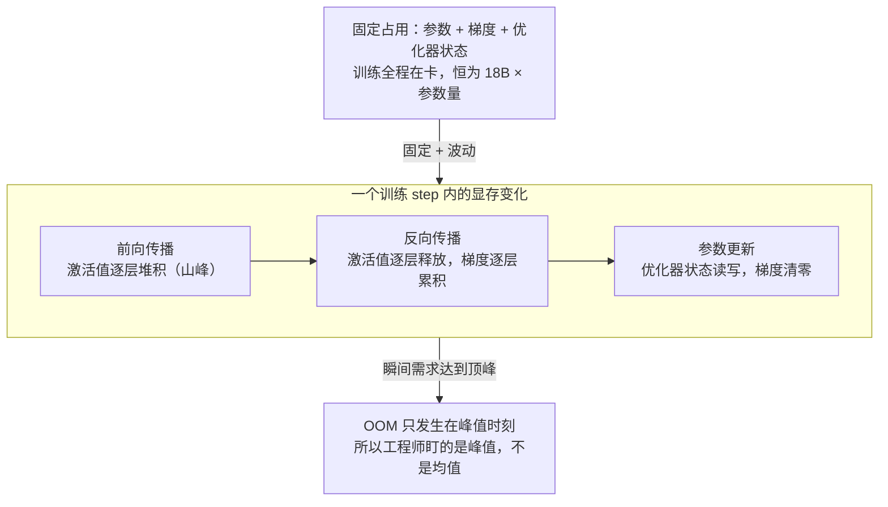
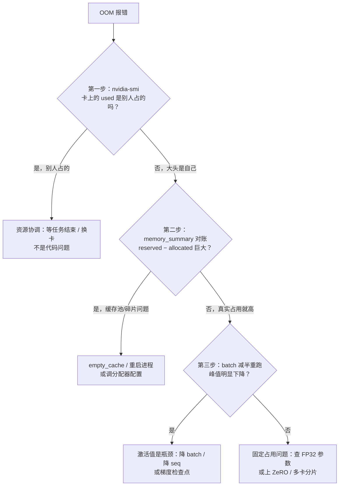

训练一个 7B 参数的模型，光参数、梯度和优化器状态就要吃掉约 **126GB 显存**——一张 80GB 的卡连「固定开销」都装不下。更反直觉的是：`nvidia-smi` 里显示的 `used` 并不是物理使用量，`free` 也不是真空闲；PyTorch 一启动就会预占显存；而你的模型明明没满 80GB，却可能因为「碎片化」直接 OOM。本文做两件事：第一，建立**硬件视角的显存账本**——每参数 18 字节怎么来的、哪些显存训练全程在卡、哪些随 batch 和序列长度波动、为什么工程师只关心峰值；第二，**逐字段读懂 `nvidia-smi`**，并给出 OOM 时的「三步排查法」。ZeRO、梯度检查点、KV Cache 的精确账本属于模块三和模块四，本文只留链接与一句话预告。

<!-- more -->

## 📑 目录

- [1. 显存账本：训练时显存里到底装了什么](#1-显存账本训练时显存里到底装了什么)
- [2. nvidia-smi 逐字段解读：used 不是「物理使用量」](#2-nvidia-smi-逐字段解读used-不是物理使用量)
- [3. 缓存池：为什么 PyTorch 一启动，used 就「虚高」](#3-缓存池为什么-pytorch-一启动used-就虚高)
- [4. 碎片化：为什么显存没满却 OOM](#4-碎片化为什么显存没满却-oom)
- [5. OOM 排查三步走：从硬件账本到逐项对账](#5-oom-排查三步走从硬件账本到逐项对账)
- [6. 为什么显存是稀缺资源：HBM 增长追不上模型膨胀](#6-为什么显存是稀缺资源hbm-增长追不上模型膨胀)
- [7. 两个硬件机制，一句话带过](#7-两个硬件机制一句话带过)
- [总结](#-总结)
- [自我检验清单](#-自我检验清单)
- [参考资料](#-参考资料)

---

## 1. 显存账本：训练时显存里到底装了什么

先问一个最基础的问题：训练一个模型时，显存里到底装了什么？

答案可以分为两大类，它们的「生命周期」完全不同：一类**训练全程都在卡上**，从进程启动到结束，占用量几乎不变；另一类**只在计算的那一瞬间存在**，前向传播时产生、反向传播时消耗，占用量随 batch 大小和序列长度剧烈波动。前者叫**固定占用**，后者叫**峰值占用**。为什么这个区分这么重要？因为**OOM 只发生在峰值时刻**——你的卡不是「平均不够用」挂掉的，而是在某一个 step 的某一瞬间，瞬时需求超过了总量。所以下面先分别给这两类记账。

### 1.1 固定占用：Adam + 混合精度下每参数 18 字节

以最经典的配置——**Adam 优化器 + FP16/BF16 混合精度训练**——为例，我们来数一数：每 1 个模型参数，训练过程中需要同时保存几份数据？

先说直觉。混合精度训练的意思是：**前向和反向计算用 FP16（2 字节）的模型参数做**，因为计算快、省显存；但 Adam 的更新公式对数值精度很敏感，直接用 FP16 更新会累积误差、甚至溢出，所以必须另存一份 **FP32（4 字节）的「主副本」**，所有参数更新都在 FP32 上做，算完再拷回 FP16。再加上反向传播产生的梯度、Adam 自己维护的两个动量（一阶动量 $m$、二阶动量 $v$，都是梯度的统计量），每参数一共有 5 份数据：

$$
\underbrace{2}_{\text{FP16 参数：前向/反向计算用}}
+ \underbrace{4}_{\text{FP32 主副本：参数更新用}}
+ \underbrace{4}_{\text{FP32 梯度：反向产生}}
+ \underbrace{4}_{\text{一阶动量 } m：\text{梯度的指数移动平均}}
+ \underbrace{4}_{\text{二阶动量 } v：\text{梯度平方的指数移动平均}}
= 18 \text{ 字节/参数}
$$

每一项的中文含义：

- **FP16 参数（2 B）**：模型权重的工作副本，矩阵乘法用它算；
- **FP32 主副本（4 B）**：Adam 更新必须在 FP32 上做，所以权重存两份；
- **FP32 梯度（4 B）**：反向传播算出的梯度，先以 FP32 累积（多 micro-batch 梯度累积时精度才够）；
- **一阶动量 $m$（4 B）**：Adam 对梯度的指数移动平均，控制更新方向；
- **二阶动量 $v$（4 B）**：梯度平方的指数移动平均，控制每维的更新步长。

所以固定显存的公式只有一行：

$$
M_{\text{固定}} = \underbrace{N}_{\text{模型参数量}} \times 18 \text{ B}
$$

代入数字算一笔（手算示范）：

- **7B 模型**：$7 \times 10^9 \times 18 = 126$ GB，一张 80GB 卡装不下；
- **13B 模型**：$13 \times 10^9 \times 18 = 234$ GB，需要 3 张 80GB 卡；
- **70B 模型**：$70 \times 10^9 \times 18 = 1.26$ TB，需要 16 张 80GB 卡。

📌 **关键点**：这 126GB 还**不含激活值**——它只是「进程一启动就锁死」的那部分。所以「7B 模型 = 14GB 权重，一张 80GB 卡绰绰有余」的说法只对**纯推理或加载权重**成立；一旦开始训练，账本立刻变 9 倍。

💡 **提示**：账本先声明口径。上面的 18 B/参数假设「梯度以 FP32 累积」（4 B）；ZeRO 论文（Rajbhandari et al., 2019）的经典口径是 16 B/参数（梯度按 FP16 记 2 B）。两种口径都合理，差别在于梯度精度怎么取舍——**任何账本，先说清楚口径再算，否则对不上账**。

### 1.2 峰值占用：激活值随 batch 与序列长度波动

固定开销算完了，为什么还不是全部？

因为前向传播会产生大量中间张量——每一层的输出、Attention 的中间结果——它们统称**激活值（Activation）**。反向传播算梯度时要把这些中间结果「倒着用一遍」，所以**前向算完的激活值不能丢，必须留着等反向来取**。这就是显存里随计算过程波动的部分。

激活值的量级怎么估？一句话：**大致等于「层数 × batch × 序列长度 × 隐藏维度 × 每元素字节数」**：

$$
M_{\text{激活}} \approx \underbrace{L}_{\text{层数}} \times \underbrace{B}_{\text{batch}} \times \underbrace{S}_{\text{序列长度}} \times \underbrace{H}_{\text{隐藏维度}} \times \underbrace{2}_{\text{FP16，每元素 2 字节}}
$$

这是一个**量级估算**（忽略 Attention 分数矩阵等临时张量，也忽略存储格式差异，误差可能 2~3 倍），它的用途不是报精确数字，而是回答「谁在吃掉峰值、动了哪个变量影响最大」。代入一个 7B 模型的典型配置（32 层、隐藏维度 4096、batch 8、序列长度 2048、FP16）：

$$
32 \times 8 \times 2048 \times 4096 \times 2 \text{ B} \approx 4 \text{ GB}
$$

注意两个「翻倍」：batch 从 8 翻到 16，激活值**线性翻倍**到 8GB；序列长度从 2048 翻到 4096，同样线性翻倍到 8GB。这意味着**「降 batch」和「降序列长度」是调节峰值显存最直接的两个旋钮**——这也是后文 OOM 排查「batch 减半实验」的理论依据。

💡 **提示**：这个估算还没算 Attention 的分数矩阵（形状是 $B \times 头数 \times S^2$，与**序列长度的平方**成正比）。序列一长，激活值线性涨、分数矩阵平方涨——这正是 FlashAttention 系列算子要解决的显存问题之一（见[模块二 6.1 FlashAttention](/AIInfraGuide/cuda/模块二-cuda编程与算子优化/61-flashattention-v1详解)）。

### 1.3 为什么工程师关心峰值而不是均值

为什么不盯均值？因为**显存不够用的时刻，只在峰值那一瞬间爆发**。

打个比方：搬家时，家具（固定占用）全程占着屋子，但真正让你租不到小房子的是**纸箱堆到天花板的那几个小时**（峰值占用）——你不可能为了「平均占用不高」就说服房东。训练同理：前向传播时激活值一层层堆积，到反向开始前达到顶峰；反向时逐层释放、梯度逐层累积；参数更新后归零。一个 step 内的显存占用就是这样一座「先涨后落」的山峰：



这张图讲的是：固定占用是一条水平线，激活值是一座山峰，**两者相加的最高点**才是你真正需要的显存。优化显存的所有手段，本质上都是「削峰」或「拆账」——梯度检查点用重计算削掉激活这座峰，ZeRO 把固定账本拆到多张卡上。

📌 **关键点**：峰值 = 固定占用 + 激活峰值。前者只由模型大小决定（换 batch 没用），后者由 batch × 序列长度决定（与模型大小无关）——这个二分法就是后文排查 OOM 的骨架。

推理侧有一个性质类似的显存大户：**KV Cache**，它随请求数和上下文长度线性增长，精确账本见[模块四 1.1 LLM 推理基础](/AIInfraGuide/inference/模块四-推理优化/第1章-llm推理基础/11-llm推理基础)（本文不展开）。

---

## 2. nvidia-smi 逐字段解读：used 不是「物理使用量」

账本建立了，现在看工具。遇到显存问题，你的第一反应一定是敲 `nvidia-smi`——但你真的读懂那四行数字了吗？

下面是一块 H100 80GB 卡上的真实输出（数值取自 NVIDIA 开发者论坛的真实截图，进程列表为简化示意；不同驱动版本字段布局略有差异，以你机器上的版本为准）：

```text
+-----------------------------------------------------------------------------------------+
| NVIDIA-SMI 550.90.07    Driver Version: 550.90.07    CUDA Version: 12.4                |
+-----------------------------------------+------------------------+----------------------+
| GPU  Name                 Persistence-M | Bus-Id          Disp.A | Volatile Uncorr. ECC |
| Fan  Temp   Perf          Pwr:Usage/Cap |         Memory-Usage   | GPU-Util  Compute M. |
|                                         |                        |               MIG M. |
|=========================================+========================+======================|
|   0  NVIDIA H100 80GB HBM3          On  | 00000000:04:00.0   Off |                    0 |
| N/A   43C    P0            283W / 700W  |   66839MiB / 81559MiB  |     99%      Default |
|                                         |                        |              Disabled |
+-----------------------------------------+------------------------+----------------------+
| Processes:                                                                              |
|  GPU   GI   CI        PID   Type   Process name                           GPU Memory   |
|        ID   ID                                                             Usage        |
|=============================================================================+=============|
|    0   N/A  N/A     123456      C   python train.py                         66800MiB    |
+-----------------------------------------------------------------------------------------+
```

先回答一个立刻会冒出来的疑问：**为什么 total 是 81559 MiB，而不是 81920 MiB（80 GiB）？**

### 2.1 四个字段分别回答什么

| 📊 字段 | 示例值 | 回答的问题 | 最常见的误读 |
|---|---|---|---|
| Total | 81559 MiB | 这块卡**当前可用**的显存总量 | 「应该是 81920 MiB 才对」——ECC 开启时可用容量会减少约 0.4%（不到 1%，要留奇偶校验位），驱动还会保留一小块内存自用，这是 `nvidia-smi` 手册明确写的 |
| Reserved | 551 MiB | 驱动为内部用途保留、进程申请不到的部分 | 「被谁占用了？」——不是任何进程，是驱动为自身用途保留的 |
| Used | 66839 MiB | 所有进程**已申请**的显存总量 | 「这些内存此刻都在被读写」——错，见第 3 节缓存池 |
| Free | 14169 MiB | 还没被任何进程申请的部分 | 「真空闲，随便用」——错，碎片化时凑不出大块（见第 4 节） |

用一句话记住这套语义：**`used` 是「申请量」不是「使用量」，`free` 是「没被申请」不是「真空闲」**。`nvidia-smi` 是驱动程序视角的记账本，它只看得见「谁从我这申请了多少」，看不见「申请走的显存里哪些块此刻真正在被计算使用」。

### 2.2 最常见的三个误解

- **误解一：「free 还剩 14GB，说明卡很空」**——`free` 只代表「没人申请」。隔壁进程的缓存池里可能躺着 20GB 的空闲块，只是没还给驱动；而你想申请的 6GB 连续大块，可能正卡在碎片空洞里（第 3、4 节讲）。
- **误解二：「used 67GB，说明 67GB 都在被使用」**——`used` 包含进程缓存池里的**空闲块**。PyTorch 释放张量后，内存块往往留在进程自己的池子里复用，`nvidia-smi` 依然把这部分计入 `used`。
- **误解三：「total 必须是标称容量」**——标称 80GB 是营销数字，驱动实际报出的 `total` 已经扣掉了 ECC 和内部保留（H100 上典型就是 81559 MiB）。这不是故障。

⚠️ **注意**：同一时刻可能有多个进程占卡（多卡训练每个进程占一张，或多人共用一台机器）。`nvidia-smi` 下半部分的 Processes 列表会告诉你 `used` 到底是谁申请的——这是 OOM 排查的第一步，见第 5 节。

---

## 3. 缓存池：为什么 PyTorch 一启动，used 就「虚高」

现在解释上一个坑：为什么 PyTorch 脚本刚启动、你还没分配几个张量，`nvidia-smi` 的 `used` 就涨了一大块？

### 3.1 为什么不每次直接向驱动申请

直觉上，张量要内存就直接调用 `cudaMalloc` 向驱动申请、用完 `cudaFree` 归还——但**每次分配都走系统调用很贵**（要进内核、要同步），而且张量大小千变万化，频繁申请释放会把显存切得越来越碎。打个比方：与其每次炒菜都去菜市场买一两米，不如食堂一次性批发几百斤存进仓库，随用随取。

PyTorch 的 **caching allocator（缓存分配器）** 就是这么干的：第一次需要时，向驱动申请一大块（内部叫 **segment**，如 20MB 或 2GB 的大段），放进自己的缓存池；之后张量的分配和释放都在池子里完成——释放的张量内存块**回收复用，而不是还给驱动**。官方文档的原话是：「PyTorch 默认使用缓存分配器来加速内存分配，这允许快速释放内存而无需设备同步；但分配器管理的未使用内存，在 `nvidia-smi` 中依然显示为已使用。」

这就是「虚高」的根源：**`nvidia-smi` 的 used 记的是「从驱动申请了多少」，缓存池里暂时没人用的空闲块也算**。

### 3.2 empty_cache() 只归还缓存池

那么 `torch.cuda.empty_cache()` 是干什么的？很多人的第一反应是「释放显存，防止 OOM」——**这是错的**。

官方文档写得很清楚：`empty_cache()` 释放缓存分配器中**所有未被占用的缓存内存**，让它们可以被其他 GPU 应用使用、并在 `nvidia-smi` 中可见；但**它不会增加 PyTorch 可用的显存总量**，只是可能帮助减少碎片。换句话说：它把你仓库里「多余的米」退回菜市场，但锅里正在炒的菜一点没少——**正在被张量占用的内存，它动不了**。

```python
import torch

x = torch.randn(10000, 10000, device="cuda")        # 分配一个张量，触发首次向驱动申请大段
print(torch.cuda.memory_allocated() / 2**30, "GiB") # 真正被张量占用的量（约 0.4 GiB）
print(torch.cuda.memory_reserved() / 2**30, "GiB")  # 缓存池从驱动申请的总量（可能 2+ GiB）

del x
torch.cuda.empty_cache()                             # 只归还完全空闲的 segment
print(torch.cuda.memory_reserved() / 2**30, "GiB")  # 归还后变小，但 allocated 本来就是 0
```

### 3.3 两个视角如何对账

| 📊 视角 | 指标 | 回答什么 |
|---|---|---|
| `nvidia-smi` 的 used | 进程从驱动申请的总量 | 这块卡被「预约」了多少，其他进程/调度器看到的是它 |
| `torch.cuda.memory_reserved()` | 缓存池持有的总量 | PyTorch 自己预约了多少，≈ used 中属于你的部分（还有其他库的分配） |
| `torch.cuda.memory_allocated()` | 张量真实占用 | 此刻真正被 Tensor 使用、不可释放的量 |

对账公式：`nvidia-smi` 的 used ≈ 你的 `memory_reserved()` + 其他进程和库的申请。**三者的差，就是「虚高」的量**。缓存分配器的细节（segment 分裂、`max_split_size_mb`、`expandable_segments` 等）在[模块一 4.7 显存管理](/AIInfraGuide/prerequisites/模块一-前置知识/pytorch/47-显存管理)细读，本节只建立直觉。

---

## 4. 碎片化：为什么显存没满却 OOM

接下来是最诡异的场景：`nvidia-smi` 显示 `free` 还有 8GB，你的程序申请一个 6GB 的张量，却报 OOM。显存明明没满，为什么申请不到？

### 4.1 停车场被小车占满，大巴停不进去

打个比方：停车场里有 100 个连续车位。一辆辆小车（小张量）随到随停、随走随开，停满了大半。这时来了一辆大巴（需要连续 40 个车位的大张量）——**虽然全场空位加起来有 50 个，但每一个空位都是零散的一两个车位，大巴停不进去**。停车场不是没位子，而是**没有连续的位子**。

显存分配要求的是**连续地址空间**：大张量必须落在地址连续的一大块上。训练过程中，张量大小随 batch、序列长度、层数千变万化，申请和释放的顺序又和大小无关——于是显存被切成一段段不同大小的空闲块，中间的「洞」单独看都不小，却**没有任何一个洞装得下下一个大请求**。这就是**碎片化（Fragmentation）**。

更糟的是，PyTorch 的缓存池会**放大**碎片：张量释放后块留在池子里等复用，池子里的空闲块越多，`nvidia-smi` 的 `used` 越「虚高」，下一次大申请反而越难找到连续空间。

### 4.2 粗糙解法的原理：重启进程与换 batch

碎片化的常见「土办法」其实都有效，因为它们改变的是**空洞的分布模式**：

- **重启进程**：进程退出时，驱动收回它申请的全部显存，缓存池和所有空洞一起消失，新进程从一整块干净的显存开始——代价是重新加载模型、重跑已完成的 step；
- **换 batch 大小**：张量的大小序列变了，空洞的排列也变了，可能恰好避开「大巴停不进去」的局面——代价是训练效率变；
- **调分配器配置**：如 `PYTORCH_CUDA_ALLOC_CONF=max_split_size_mb=512` 或 `expandable_segments:True`，让分配器少切碎大段（具体语义以你所用 PyTorch 版本的官方文档为准，详见[4.7 显存管理](/AIInfraGuide/prerequisites/模块一-前置知识/pytorch/47-显存管理)）。

### 4.3 如何识别碎片化

判断是不是碎片化的信号：`torch.cuda.memory_summary()` 里 **reserved（缓存池总量）很大，而 allocated（张量真实占用）很小**，且空闲块列表是一长串大小不一的段。换句话说：**reserved − allocated 的巨大差额 + 无进程占卡 = 碎片化或缓存池虚高**。这个工具的具体用法，第 5 节马上用。

---

## 5. OOM 排查三步走：从硬件账本到逐项对账

现在把前面所有内容串成一套可执行的排查流程。

### 5.1 反例：看到 OOM 就换大显存卡

先看最常见的错误做法：**OOM → 立刻申请更大的卡（或租更大的实例）**。

为什么错？因为**换卡只改变「总量」，不改变「账本结构」**。如果你根本没搞清楚 OOM 是固定开销超了、激活峰值超了、还是碎片化，换了卡也只是把问题推迟到下一个更大的 batch——而且大卡更贵、更难调度。正确顺序是：**先做账本估算（固定部分 18B × 参数量 vs 激活峰值），再决定换卡、降 batch、还是上优化策略**。

### 5.2 第一步：nvidia-smi，确认是否真有进程占卡

```bash
nvidia-smi
```

先看两件事：第一，`used` 是不是已经接近 `total`，且 Processes 列表里的大头**不是你自己的进程**——如果是别人占着，这是资源协调问题，不是你代码的问题；第二，如果大头是你自己，记下你的进程占了多少 MiB，与下一步的账本对比。

### 5.3 第二步：对账，用 memory_summary() 区分缓存池与真实占用

```python
import torch
torch.cuda.memory_summary()   # 打印 allocated / reserved / 空闲块列表 / 峰值
```

对照第 1 节的账本：`allocated` 应该大致等于「固定占用 + 当前激活值」；如果 `reserved − allocated` 巨大（比如 20GB），说明问题在**缓存池虚高或碎片化**——走 `empty_cache()`、重启进程或调分配器配置（第 4 节），而不是换卡。

### 5.4 第三步：实验，把 batch 减半验证是否激活值问题

把 batch 减半重跑。这是最便宜的对照实验，因为第 1.2 节已经证明**激活值与 batch 线性相关**：

- **峰值明显下降** → 瓶颈在激活值：降 batch、降序列长度，或开梯度检查点（机制在[模块三 第8章 混合精度与显存优化](/AIInfraGuide/distributed/模块三-分布式训练/第8章-混合精度与显存优化)）；
- **峰值几乎不变** → 瓶颈在固定占用：检查模型参数是不是 FP32 没转半精度（7B 参数 FP32 是 28GB，FP16/BF16 只要 14GB，差出 14GB），或者固定开销本身就超过了单卡——这时换卡/多卡分片才登场。



这张图是完整的排查决策链：**三步都是「是/否」问题，每步只排除一类原因**——占卡、缓存池、激活峰值，最后剩下的就是固定账本问题。

### 5.5 7B 模型 126GB 案例：换卡也不够时该怎么办

把判断链走一遍：你训练一个 7B 模型，80GB 卡 OOM。

1. **手算固定账本**：$7 \times 10^9 \times 18 \approx 126$ GB——**固定开销本身超过了 80GB**，所以这不是激活值的问题，也不是碎片化的问题，**单卡换到 96GB、128GB 依然不够**；
2. **换 192GB 的卡（如 B200）？** 126GB 固定 + 假设激活峰值 8GB ≈ 134GB < 192GB，**可以装下**——这是「换卡有效」的少数情况，前提是激活峰值不能失控；
3. **如果是 70B 模型呢？** 固定账本 1.26TB，192GB 的卡也要 7 张——**换任何单卡都没用**，正确做法是 ZeRO / 张量并行把固定账本切到多张卡上（见[模块三 第5章 ZeRO 系列](/AIInfraGuide/distributed/模块三-分布式训练/第5章-zero系列)），或者 offloading 到 CPU 内存。

落成一句话的规则：

- ✅ **固定账本（N × 18B）超单卡** → 换卡或并行切分，降 batch 无效；
- ✅ **固定账本不超，峰值超** → 降 batch / 降 seq / 梯度检查点，换卡是浪费；
- ✅ **reserved − allocated 巨大** → 缓存池/碎片问题，先 `empty_cache()` 或重启，别急着换卡。

---

## 6. 为什么显存是稀缺资源：HBM 增长追不上模型膨胀

现在你已经会算账了，最后一个问题：为什么 AI Infra 的所有优化——量化、offload、并行切分——都从显存出发？

因为**显存容量的增长，长期追不上模型规模的膨胀**。把两组数字放在一起看（规格数字来自 NVIDIA 官方产品页，模型规模为公开常识）：

| 📊 年份 | 代表 GPU | 显存容量 | 同期代表性模型 | 参数量 |
|---|---|---|---|---|
| 2017 | V100 | 32 GB | GPT-1 时代 | ~0.1B |
| 2019 | V100（同代） | 32 GB | GPT-2 | 1.5B |
| 2020 | A100 | 80 GB | GPT-3 | 175B |
| 2022 | H100 | 80 GB | — | — |
| 2023 | H100 / H200 | 80 / 141 GB | LLaMA-2 | 70B |
| 2024 | B200 | 192 GB | 数百 B~千 B 级开源 MoE（如 DeepSeek-V3 671B） | 100B~1T |

（完整规格表见[5.1 NVIDIA GPU 架构演进](/AIInfraGuide/prerequisites/模块一-前置知识/gpu/nvidia-gpu-evolution)与[5.5 主流 AI GPU 规格对比与 Roofline](/AIInfraGuide/prerequisites/模块一-前置知识/gpu/55-主流ai-gpu规格对比与roofline)；H200 的 141GB / 4.8TB/s 出自 NVIDIA 官方产品页。B200 的显存容量官方口径不一——HGX 指南标 180GB、早期产品页标 192GB，5.5 已注明「待核实」，本文沿用 192GB 以便两篇对照。）

注意两组倍率：**显存**从 V100 的 32GB 到 B200 的 192GB，七年约 6 倍；**模型**从 GPT-2 的 1.5B 到万亿级，翻了数百倍。同一时期的单卡显存，从「装得下当时最好的模型」逐渐变成「连固定开销都装不下」——H100（80GB，2022）甚至比 A100（80GB，2020）容量没变，而同期模型已经翻了几个量级。

把固定账本换算成「需要多少张 80GB 卡」，感受会更直接（只算固定开销，不算激活值）：

| 📊 模型规模 | 固定账本（×18B） | 需要 80GB 卡 | 需要 192GB 卡 |
|---|---|---|---|
| 7B | 126 GB | 2 张 | 1 张 |
| 13B | 234 GB | 3 张 | 2 张 |
| 70B | 1.26 TB | 16 张 | 7 张 |
| 175B（GPT-3） | 3.15 TB | 40 张 | 17 张 |
| 1T | 18 TB | 225 张 | 94 张 |

📌 **关键点**：这张表的含义是——**「显存装不下」不是 bug，是常态**。量化（模块四）、ZeRO/offload（模块三）、并行切分（模块三）本质上都是同一件事的不同做法：**要么把账本变小，要么把账本拆开**。理解了这一点，你就能看懂后续所有显存优化文章的共同出发点。

---

## 7. 两个硬件机制，一句话带过

最后交代两个与显存相关的硬件机制。本文只给存在性直觉，细节分别在模块二和模块三展开——这是本章的边界红线。

- **ECC（Error Correcting Code，纠错码）**：HBM 里的数据在传输和存储中可能发生位翻转，ECC 通过额外的奇偶校验位自动纠正。代价是**可用容量减少约 0.4%（不到 1%）**（对应第 2 节 `total` 少于标称值：81920 − 81559 = 361 MiB）。数据中心 GPU 默认开启 ECC，这是「显存少了一块」的硬件原因，不是故障。
- **Unified Memory（统一内存）与虚拟内存寻址**：CUDA 提供统一虚拟地址空间（UVA），`cudaMallocManaged` 分配的内存可以被 CPU 和 GPU 共享，按需在两者之间迁移——GPU 上的显存地址是虚拟地址，不是物理地址。它存在、且影响显存账本（比如「managed 内存也会出现在 `nvidia-smi` 里」），但 shared/global/constant 的编程模型与寄存器溢出等内容归[模块二 1.3 CUDA 内存模型](/AIInfraGuide/cuda/模块二-cuda编程与算子优化/13-cuda内存模型)，本文不重复。

边界清单：CUDA 内存模型 → 模块二 1.3；ZeRO/Offloading/梯度检查点的机制与收益 → 模块三；KV Cache 与推理侧显存账本 → 模块四。本文只负责**硬件视角的账本**和**工具解读**。

---

## 📝 总结

1. **固定账本**：Adam + FP16/BF16 混合精度下，每参数 18 字节（FP16 参数 2B + FP32 主副本 4B + 梯度 4B + 动量 4B + 二阶动量 4B），7B 模型固定 126GB——这是「训练比推理费显存 9 倍」的数学原因；
2. **生命周期二分法**：固定占用全程在卡（与 batch 无关），激活值是随 batch × 序列长度线性波动的峰值——OOM 只发生在峰值时刻，所以工程师盯峰值不盯均值；
3. **nvidia-smi 语义**：`used` 是「申请量」不是「物理使用量」，`free` 是「没被申请」不是「真空闲」，`reserved` 是驱动为自身用途保留、进程申请不到，`total` 低于标称值属正常（ECC 所致）；
4. **缓存池与碎片**：PyTorch 预占显存是为了少做昂贵的系统调用，`empty_cache()` 只归还缓存池不增加可用显存；碎片化会让「显存没满却 OOM」；
5. **排查顺序**：OOM 三步走——`nvidia-smi` 排除占卡 → `memory_summary()` 排除缓存池/碎片 → batch 减半实验区分激活峰值与固定账本，最后才轮到换卡；
6. **稀缺性**：显存七年约 6 倍（32→192GB），模型规模数百倍——「装不下」是常态，量化、offload、并行切分都是在「把账本变小」或「把账本拆开」。

## 🎯 自我检验清单

- 能手算任意 N B 模型的 Adam + 混合精度固定显存（$N \times 18$ B），误差在 5% 以内，并能说出 18 字节的构成
- 能解释为什么需要 FP32 主副本和两份动量，以及「梯度按 FP32 记（18B）还是 FP16 记（16B）」是什么口径差异
- 能解释为什么工程师关心峰值显存而非均值，并说明激活值与 batch、序列长度分别是什么关系
- 能逐字段解释 `nvidia-smi` 的 Total / Reserved / Used / Free，并解释为什么 `used` 不是物理使用量、`free` 为什么不可信
- 能解释 caching allocator 为什么预占显存，以及为什么 `empty_cache()` 不会增加 PyTorch 可用显存
- 能区分 `torch.cuda.memory_allocated()`、`memory_reserved()` 与 `nvidia-smi` used 三者，并说出对账公式
- 能用停车场比喻向别人讲清碎片化，并说明重启进程、换 batch 大小为什么能缓解它
- 能按「nvidia-smi → memory_summary → batch 减半」三步排查一次 OOM，并给出每一步的判断依据
- 能说出「看到 OOM 就换大显存卡」错在哪，并用 7B（126GB）与 70B（1.26TB）两个案例演示判断链
- 能说出 2017–2024 年单卡显存与模型规模各自的增长量级，并解释「显存稀缺」为什么是量化、offload、并行切分的共同出发点
- 能说出 ECC 和 Unified Memory 各自对显存账本的一个影响，并指出它们的详细内容分别在哪个模块

## 📚 参考资料

**官方文档**

- [nvidia-smi 手册（NVIDIA System Management Interface）](https://docs.nvidia.com/deploy/nvidia-smi/index.html)——Total/Reserved/Used/Free 字段定义，ECC 对可用容量的影响
- [PyTorch CUDA 内存管理笔记（Caching Memory Allocator）](https://pytorch.org/docs/stable/notes/cuda.html)——缓存分配器原理与 `empty_cache()` 边界
- [torch.cuda.memory.empty_cache 官方文档](https://pytorch.org/docs/stable/generated/torch.cuda.memory.empty_cache.html)——「不增加 PyTorch 可用显存」的原文出处
- [torch.cuda.memory_summary 官方文档](https://pytorch.org/docs/stable/generated/torch.cuda.memory_summary.html)——allocated / reserved / 空闲块报告的用法
- [NVIDIA CUDA C++ Programming Guide（Memory Allocation 章节）](https://docs.nvidia.com/cuda/cuda-c-programming-guide/index.html#memory-allocation)——`cudaMalloc` / Unified Memory 的硬件语义
- [NVIDIA H100 Tensor Core GPU 产品页](https://www.nvidia.com/en-us/data-center/h100/) 与 [NVIDIA H200 产品页](https://www.nvidia.com/en-us/data-center/h200/)——H100 80GB HBM3 / H200 141GB HBM3e 4.8TB/s 规格
- [NVIDIA Blackwell Architecture Technical Brief](https://www.nvidia.com/en-us/data-center/technologies/blackwell-architecture/)——B200 192GB HBM3e、8TB/s 规格

**论文**

- [ZeRO: Memory Optimizations Toward Training Trillion Parameter Models（Rajbhandari et al., 2019）](https://arxiv.org/abs/1910.02054)——模型状态显存账本的经典口径（16B/参数）与分片思想
- [Mixed Precision Training（Micikevicius et al., 2017）](https://arxiv.org/abs/1710.03740)——FP32 主副本 + 半精度计算的账本来源
