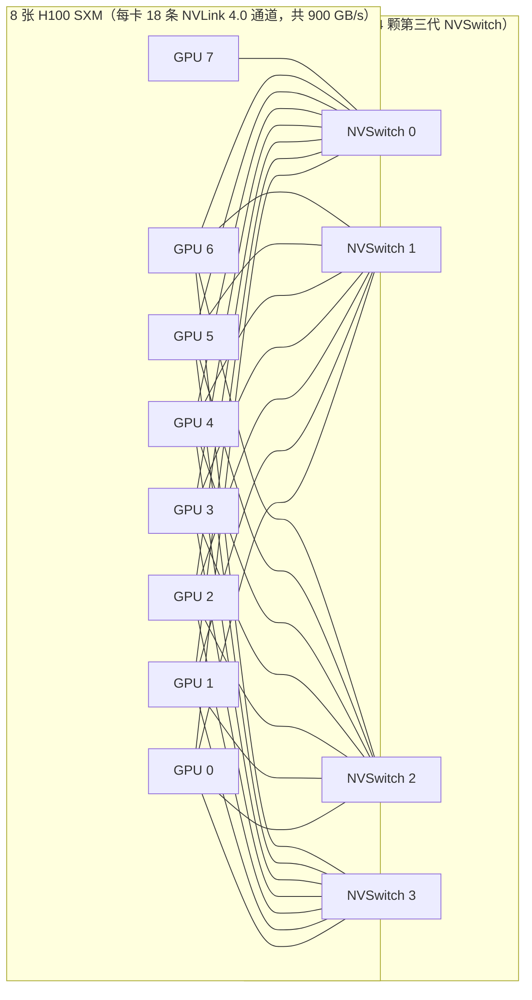
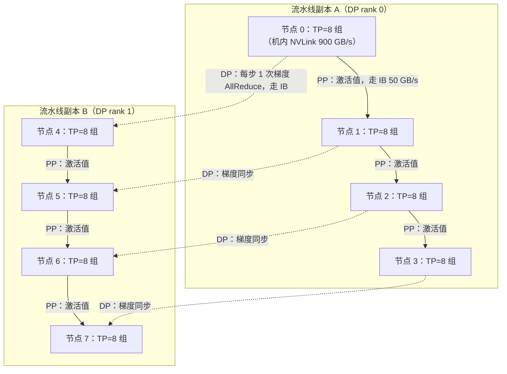

一台 8 卡 DGX H100 里，任意两张 GPU 之间隔着 **900 GB/s 的 NVLink**；而跨到另一台机器，唯一的通道是一根 **50 GB/s 的 InfiniBand**——机内机外差了 **18 倍**。这不是规格表上的装饰数字：它直接决定了张量并行为什么只能活在机箱里，数据并行为什么能撒满整个集群。本文是第 5 章 GPU 硬件概论的收官篇，把前面攒下的单卡知识（架构 → 存储 → 计算单元 → 规格 → 显存）接到集群上：先建立三个带宽量级的肌肉记忆，再钻进 DGX H100 看 NVSwitch 如何织出"全互联"，学会用 `nvidia-smi topo -m` 给机器拍一张道路连接图，最后算一笔账，理解互联带宽如何给张量并行（TP）、流水线并行（PP）、数据并行（DP）画下部署边界。

<!-- more -->

## 📑 目录

- [1. 三个带宽量级：从车间传送带到跨城高速](#1-三个带宽量级从车间传送带到跨城高速)
- [2. 机内互联：8 卡怎么通过 NVSwitch 织成一张网](#2-机内互联8-卡怎么通过-nvswitch-织成一张网)
- [3. 读懂 nvidia-smi topo -m：给机器拍一张道路连接图](#3-读懂-nvidia-smi-topo--m给机器拍一张道路连接图)
- [4. 带宽如何决定并行策略：TP、PP、DP 该走哪条路](#4-带宽如何决定并行策略tpppdp-该走哪条路)
- [5. 算一笔账：2GB 数据在 NVLink 和 PCIe 上要多久](#5-算一笔账2gb-数据在-nvlink-和-pcie-上要多久)
- [6. 跨出机箱：InfiniBand、RoCE 与 50 GB/s 的世界](#6-跨出机箱infinibandroce-与-50-gbs-的世界)
- [7. 综合练习：给 64 卡集群设计一套 TP=8 / PP=4 / DP=2](#7-综合练习给-64-卡集群设计一套-tp8--pp4--dp2)
- [8. 两种常见错误：PCIe 机器跑 TP，以及只认"NV"不认数字](#8-两种常见错误pcie-机器跑-tp以及只认nv不认数字)
- [总结](#-总结)
- [自我检验清单](#-自我检验清单)
- [参考资料](#-参考资料)

---

## 1. 三个带宽量级：从车间传送带到跨城高速

**多卡训练的第一个问题是：数据从一张卡到另一张卡，有哪些路可以走？**

答案可以浓缩成三句话，先记住量级，再记细节：

- **机内 GPU 互联（NVLink）**：900~1800 GB/s，专线专用，快得惊人；
- **机间网络（InfiniBand）**：50 GB/s 左右，慢一个数量级，但能到任何一台机器；
- **PCIe**：64~128 GB/s，谁都能接（CPU、网卡、硬盘、GPU），是兜底的"普通公路"。

打个比方，想象一个大型工厂园区：**NVLink 是车间内部的传送带**——同一台机器里的 GPU 就像同一条产线上的工位，传送带带宽高、距离近、专线专用，零件（张量）秒到；**InfiniBand 是连接厂区和厂区的跨城高速**——带宽低一个数量级，但只有它能把你送到别的城市；**PCIe 则是厂区里的普通公路**——什么车都能开，但车道窄，而且全厂共享。这个比喻要一一记住：传送带 = 机内 NVLink（带宽高、延迟低），跨城高速 = 机间 IB（带宽低、能跨远），普通公路 = PCIe（通用、共享、不快）。

为什么先记量级？因为后面所有并行策略的取舍，都是在这三个量级的对比上做出来的。先把官方数字核对清楚（以下均为官方标称，注意"口径"一列）：

| 📊 互联技术 | 官方带宽标称 | 口径说明 | 出现位置 |
|---|---|---|---|
| PCIe 5.0（x16） | 128 GB/s | **双向**（单向 64 GB/s） | 机内通用总线 |
| NVLink 4.0（H100） | 900 GB/s | **双向总和**（单向 450 GB/s） | 机内 GPU 互联 |
| NVLink 5.0（B200） | 1,800 GB/s | **双向总和**（单向 900 GB/s） | 机内 GPU 互联 |
| NVSwitch | — | 交换平面，本身不产生带宽，负责转发 | 机内全互联 |
| InfiniBand NDR（4x） | 400 Gb/s = 50 GB/s | 端口**单向**速率（全双工） | 机间互联 |

⚠️ **注意（读表要点）**：NVLink 的 900 / 1800 是**双向总和**，严格说单向要减半（450 / 900 GB/s）；PCIe 的 128 同理，单向只有 64 GB/s；而 InfiniBand 的 400 Gb/s 是按单向端口速率标的。比大小之前先对齐口径，否则会算出错误倍数——比如"NVLink 4.0 是 IB 的 900/400 = 2.25 倍"就大错特错，错在拿 GB/s 和 Gb/s 直接除（第 6 节专门讲这个坑）。**同口径下**：900 ÷ 50 = 18 倍，1800 ÷ 50 = 36 倍；就算把 NVLink 砍成单向 450，也还有 9 倍。**数量级结论（机内比机间快约 1 个数量级）不受口径影响。**

📌 **关键点（本节肌肉记忆）**：**机内 900~1800、机间 50、PCIe 兜底 64（单向）/128（双向）**。NVLink 4.0 同口径下约是 PCIe 5.0 的 7 倍，NVLink 5.0 约 14 倍；而"NVLink 是 PCIe 的 14 倍"这个流传说法（900/64）是拿 NVLink 双向除 PCIe 单向算出来的，方向性一错，倍数就虚高——记住 7 倍这个同口径数字即可。

## 2. 机内互联：8 卡怎么通过 NVSwitch 织成一张网

**带宽数字有了，下一个问题是：8 张卡要两两都能高速通信，难道每两张卡之间都拉一条专用线？**

先算算"两两直连"方案有多离谱。8 张卡两两配对共有 $C(8,2) = 28$ 对，每对要跑满 900 GB/s 就得给这对卡分配足够多的 NVLink 通道；而每张 H100 总共只有 18 条 NVLink 通道，要同时服务 7 个邻居，平均每条邻居链路只能分到 2~3 条通道——**带宽直接砍到 1/6 以下**。而且 28 对 × 每对多通道的线缆也塞不进机箱。物理上此路不通。

**答案是用交换机中转**。DGX H100 的做法是：机箱里放 **4 颗 NVSwitch 交换芯片**，8 张 H100 各自把 18 条 NVLink 通道全部接到交换平面上，任意两卡通信的路径是 **GPU i → NVSwitch → GPU j**——不是直连，而是"把货交给中转站，由中转站按目的地转发"。官方数据（NVIDIA DGX H100 规格页）：每张 H100 SXM 有 18 条 NVLink 4.0 通道，全部连向 4 颗 NVSwitch（具体分布为不对称的 4+4+5+5 条，官方博客原文；不同型号的分布以官方资料为准），**没有卡间直连**；任意两卡之间都能跑满 900 GB/s。这就是"全互联（full-mesh）"的真实含义：**逻辑上任意两卡全速互通，物理上每卡只连交换机**。



这张图讲的是 DGX H100 的机内拓扑：**8 张卡都只连交换机，卡与卡之间没有线**；GPU 0 要给 GPU 7 传数据，路径是 GPU 0 → NVSwitch → GPU 7。图中每一条连线代表多条 NVLink 通道（每卡 18 条，摊到 4 颗交换机上是 4+4+5+5），画成"全连"是为了表达"每一颗交换机都认识每一张卡"。**注意：4 颗交换机彼此之间没有 NVLink 连线，是四张相互独立的交换平面**（与 DGX-2/HGX-2 时代交换机之间也有 NVLink 的连法不同）；任意两卡能跑满 900 GB/s，靠的是"每张卡都连到全部 4 颗交换机"，而不是交换机之间接力转发。

为什么交换机中转反而能跑满带宽？因为 NVSwitch 内部是**交叉开关（crossbar）**结构：每个端口都能同时转发，只要交换平面的总带宽足够，任何两卡通信互不阻塞（non-blocking）。这就像快递分拣中心：每个寄件人不需要和每个收件人分别签约，把件交给分拣中心，分拣中心保证"你的件一定走最快的传送带"。

💡 **提示**：H100 有 SXM 和 PCIe 两种版本（5.1 讲过）。**SXM 版才有 NVSwitch 全互联**；PCIe 版只能通过 NVLink 桥接两张卡，其余通信走 PCIe。买卡跑多卡训练时，先确认封装类型。

## 3. 读懂 nvidia-smi topo -m：给机器拍一张道路连接图

**怎么知道一台机器的真实拓扑？** 不看宣传页，直接给机器拍一张"道路连接图"：

```bash
nvidia-smi topo -m
```

这是 NVIDIA 官方文档中 DGX H100 的示例输出（真实输出还有网卡列，这里只看 GPU × GPU 部分；**以你机器实测为准**）：

```
        GPU0  GPU1  GPU2  GPU3  GPU4  GPU5  GPU6  GPU7   CPU Affinity
GPU0     X    NV18  NV18  NV18  NV18  NV18  NV18  NV18   0-55,112-167
GPU1   NV18    X    NV18  NV18  NV18  NV18  NV18  NV18   0-55,112-167
GPU2   NV18  NV18    X    NV18  NV18  NV18  NV18  NV18   0-55,112-167
GPU3   NV18  NV18  NV18    X    NV18  NV18  NV18  NV18   0-55,112-167
GPU4   NV18  NV18  NV18  NV18    X    NV18  NV18  NV18   56-111,168-223
GPU5   NV18  NV18  NV18  NV18  NV18    X    NV18  NV18   56-111,168-223
GPU6   NV18  NV18  NV18  NV18  NV18  NV18    X    NV18   56-111,168-223
GPU7   NV18  NV18  NV18  NV18  NV18  NV18  NV18    X     56-111,168-223
```

逐格读法分三步：

**第一步，认结构**。这是一个对称矩阵：第 $i$ 行第 $j$ 列 = GPU $i$ 到 GPU $j$ 的路径类型。对角线是"自己到自己"（`X`），**上下三角完全对称，所以只看对角线上方就够了**。

**第二步，找 `NV`**。单元格里出现 `NV` 开头的代码，说明这对卡走 NVLink；`NV` 后面的数字是**绑定的 NVLink 通道条数**，数字越大路越宽。上例全部是 `NV18`：每对卡之间都有 18 条 NVLink 通道——这正是 DGX H100 满配全互联的样子（NVLink 4.0 每条通道双向 50 GB/s，18 × 50 = 900 GB/s，和官方规格对上了）。

**第三步，认"非 NV"代码**。看不到 `NV`，说明这对卡走 PCIe 或更绕的路。官方代码按"越来越绕"排序：

| 📊 代码 | 含义 | 直观理解 |
|---|---|---|
| `X` | 自己 | 对角线 |
| `NV#` | 通过 # 条 NVLink 绑定互联 | 传送带，# 是车道数 |
| `PIX` | 经过 1 个 PCIe 交换机 | 出车间，上普通公路 |
| `PXB` | 经过多个 PCIe 交换机 | 多绕几个路口 |
| `PHB` | 经过 PCIe Host Bridge（CPU 根桥） | 穿过门卫室（CPU） |
| `NODE` | 同一 NUMA 节点内跨 PCIe 根桥 | 在厂区里绕 |
| `SYS` | 跨 NUMA 节点，还要走 CPU 间的 UPI/QPI 总线 | 跨厂区，最绕 |
| `CPU Affinity` 列 | 每张卡亲和哪些 CPU 核 | 卡和 CPU 的绑定关系 |

📌 **关键点（速读法）**：**对角线上方看 `NV`——有 NV 就是高速路，数字是车道数；没有 NV，就按 PIX → PXB → PHB → NODE → SYS 的顺序读，越靠后越绕远。** 判断"哪几张卡适合组张量并行组"，就是找"两两都是 NV 的那几张卡"。

💡 **提示**：`NV` 后面的数字和硬件代次有关——DGX A100 典型输出是 `NV12`（12 条 NVLink 3.0），DGX H100 是 `NV18`，PCIe 卡用 NVLink 桥两两互联时通常只有 `NV1`。看到数字先换算：`NV#` × 每条通道带宽（NVLink 3.0/4.0 每条双向 50 GB/s，5.0 为 100 GB/s）= 这对卡的互联带宽。另外可以配合 `nvidia-smi nvlink -s` 查看每条 NVLink 通道的实时状态。

## 4. 带宽如何决定并行策略：TP、PP、DP 该走哪条路

**拓扑看懂了，但为什么 TP 必须机内、DP 可以跨机？**

答案是三个字：**频率**。评估一个并行维度该放哪条路，看两个量——**单次通信量**和**通信频率**，两者相乘就是每步通信总量。三种并行策略的画像完全不同：

| 📊 并行维度 | 通信内容 | 单次通信量 | 频率 | 带宽需求 | 典型落点 |
|---|---|---|---|---|---|
| 张量并行（TP） | 层输出/梯度的 AllReduce | 层张量（几十 MB 级） | **每层 2 次**（前向+反向），7B 模型 32 层 = 每步 64 次 | **极高**（高频 + 关键路径） | 必须机内 NVLink |
| 流水线并行（PP） | stage 边界的激活值 + 梯度 | micro-batch 激活（小） | 每 micro-batch 每边界 1 次 | 低 | 可跨机 |
| 数据并行（DP） | 梯度 AllReduce | **模型大小**（GB 级） | **每步 1 次** | 中（低频可容忍） | 可跨机 |

逐个展开：

**张量并行（TP）**把每一层的矩阵乘法切成几份分给多卡算。切完之后的代价是：**每一层的前向要把切开的输出拼回去（AllReduce），反向要把梯度再拼一次**——每层 2 次，而且下一次 AllReduce 没完成，下一层就算不了。这个通信**卡在关键路径上，无法与计算重叠**，每步累计的通信总量和模型大小同阶（7B 模型每步的 TP 通信量是几 GB 量级）。频率高、又在关键路径上，所以**只有机内 NVLink 这种"传送带"扛得住**。

**流水线并行（PP）**按层把模型切成几段，段与段之间只传**激活值**——数据量小、频率低（每个 micro-batch 传一次），带宽需求是三者里最低的。接力赛跑的结构天然适合放在机器边界：**跨机传的只是"接力棒"**，不是全场数据。

**数据并行（DP）**每张卡算同一份模型的不同数据，每步结束时把梯度 AllReduce 一次。单次通信量是三者里最大的（等于模型大小，7B 模型 BF16 梯度约 14 GB），**但频率最低（每步 1 次）**，而且梯度同步可以和反向传播重叠（边算边传）。所以 50 GB/s 的机间带宽虽然慢，摊到秒级的训练步里开销只有几个百分点——**DP 完全可以在跨机上跑**。

📌 **关键点（一句话结论）**：**把通信最密集、最不可重叠的维度（TP）放在最宽的链路上（机内 NVLink），把通信稀疏的维度（PP、DP）放到机间 InfiniBand。** 这就是"通信量大的并行维度放机内"这句直觉的完整展开——决定权在"通信量 × 频率 × 能否重叠"。

## 5. 算一笔账：2GB 数据在 NVLink 和 PCIe 上要多久

**上面的结论是定性的，现在定量：一次通信到底要多久？**

传输时间只有一个公式，先给直觉：**时间 = 数据量 ÷ 带宽**——传送带运货，货越多越慢，传送带越快越省时。

$$
\underbrace{T}_{\text{传输时间（秒）}} = \frac{\underbrace{D}_{\text{数据量（字节）}}}{\underbrace{B}_{\text{带宽（字节/秒）}}}
$$

代入数值算例。设一次 AllReduce 要传 $D = 2$ GB 数据（为什么用 2GB？它是方便心算的量级——约等于 10 亿参数模型的 BF16 梯度；7B 模型的梯度约 14 GB，把下面的 2 换成 14 即可，比例不变）：

- 走 NVLink 4.0（$B = 900$ GB/s）：$T = 2 / 900 \approx 0.0022$ 秒 = **约 2.2 ms**；
- 走 PCIe 5.0 单向（$B = 64$ GB/s）：$T = 2 / 64 \approx 0.031$ 秒 = **约 31 ms**。

**同一笔通信，NVLink 比 PCIe 快 14 倍。** 把 2GB 换成 7B 模型真实的 14GB 梯度：15.6 ms vs 219 ms，比值不变。这就是"为什么张量并行在 PCIe 上不可行"的第一性原因：TP 每层都要做这种量级的通信（每步几十次），若每次从 2.2 ms 变成 31 ms，纯通信时间就要乘以 14——而 TP 的通信又卡在关键路径上躲不掉。

💡 **提示（估算假设，务必声明口径）**：以上是**理论带宽、每卡视角**的粗算，忽略了三类因素：(1) Ring AllReduce 每卡实际收发量约 $2(N-1)/N$ 倍数据量（8 卡时约 1.75 倍）——系数一句话带过，推导在模块三《[2.1 集合通信原语详解](/AIInfraGuide/distributed/模块三-分布式训练/21-集合通信原语详解)》和模块一第 6 章；(2) 协议开销与带宽利用率（NVLink 实测通常能到标称的 70%~90%，PCIe 更低）；(3) 通信与计算重叠。粗算的目的是**量级判断**，误差在 2 倍以内不影响结论。

反过来看 DP 为什么能容忍 PCIe：同样是 14 GB 梯度 AllReduce，PCIe 上约 219 ms——但每步才一次，且能跟 backward 重叠；若一步训练耗时 2 秒，这笔通信摊下来约 1%，**可接受**。同样的 219 ms 如果乘上 TP 的 64 次/步，就是十几秒的纯通信，直接崩盘。**同一个数字，频率不同，命运不同。**

## 6. 跨出机箱：InfiniBand、RoCE 与 50 GB/s 的世界

**机外只有 50 GB/s，这到底多慢？** 做个对照：PCIe 5.0 单向是 64 GB/s——**一根 InfiniBand NDR 口比一条 PCIe 5.0 x16 链路（单向 64 GB/s）还略窄**；NVLink 5.0 的 1800 GB/s 是它的 **36 倍**。50 GB/s 单独看不慢（一秒钟传 25 部 2GB 电影），但和机内 900/1800 一比就明白：**跨机通信是训练里最贵的动作**。

先踩一个最常见的单位坑。InfiniBand 的速率标称是 **Gb/s（吉比特每秒），不是 GB/s（吉字节每秒）**，换算要除以 8：**400 Gb/s = 50 GB/s**。NDR 是当前 AI 集群的主流代次（单链路 100 Gb/s × 4 通道 = 400 Gb/s）。⚠️ **注意**：把 400 和 NVLink 的 900 直接比，会得出"机间只慢 2 倍多"的错误结论——错在 bit/byte 混用；正确口径下差 18 倍。

DGX H100 的机外出口配置（官方规格）：8 张 ConnectX-7 网卡，每口 400 Gb/s，整机对外 **3.2 Tb/s** 聚合带宽，接 Quantum-2 交换机。也就是说，一台 8 卡机器对外全部网口加起来，才勉强抵得上机内一两条 NVLink 的带宽——训练框架必须"把通信尽量留在机内"，这是设计的第一原则。

那机间用什么呢？两条路线：

- **InfiniBand（IB）**：专用高速网络，原生支持 RDMA（远程直接内存访问，绕过 CPU 内核直达显存），延迟约 1 微秒级，大规模训练稳定，但需要专用交换机和网卡，贵；
- **RoCE（RDMA over Converged Ethernet）**：让普通以太网硬件也能跑 RDMA，延迟略高（2~5 微秒）、拥塞控制要靠软件调优，但能复用现有网络设施，便宜。

一句话对比：**追求极致性能和大规模稳定选 IB，预算受限或复用现有以太网选 RoCE；对上层训练代码两者透明，NCCL（NVIDIA Collective Communications Library，NVIDIA 集合通信库）会自动选路。**

📌 **关键点**：机内机外 18~36 倍的带宽鸿沟，直接塑造了训练框架的形态——为什么 TP 组严格等于一个节点、为什么梯度要压缩、为什么通信要和计算重叠、为什么 NCCL 要按拓扑选算法。这些机制的细节（集合通信原语、Ring/Tree AllReduce、NCCL 调优）正是模块一第 6 章《[集群通信网络与NCCL：分布式训练的通信骨架](/AIInfraGuide/prerequisites/模块一-前置知识/communication/collective-communication-primer)》的主题，本篇只用到"通信量 × 带宽 = 时间"这一层估算，不越界。

## 7. 综合练习：给 64 卡集群设计一套 TP=8 / PP=4 / DP=2

**现在把前面的知识拼起来：8 节点 × 8 卡 = 64 卡集群，节点间走 IB，怎么部署一套 TP=8、PP=4、DP=2 的并行方案？**

先验证数字：$8 \times 4 \times 2 = 64$，正好把 64 张卡用完。三个维度各自落位：

1. **TP=8 严格等于"一个节点"**：每个节点的 8 卡通过 NVSwitch 全互联，正是现成的 TP 组——每层 2 次 AllReduce 全部走机内 900 GB/s；
2. **PP=4 沿节点串**：模型按层切成 4 段，每段放在一个节点上（即一个 TP 组），4 个节点串成一条流水线，段间只传激活值，走 IB；
3. **DP=2 复制整条流水线**：8 个节点分成 2 组，每组 4 节点跑一条完整流水线副本；两个副本对应位置的卡每步结束后同步一次梯度，走 IB。



这张图讲的是 64 卡集群的三维并行落位：**实线箭头 = PP 的激活值接力（跨机，只传小数据）；虚线箭头 = DP 的梯度同步（跨机，每步一次）；每个节点框内部 = TP 的每层 AllReduce（机内 NVLink，图中最粗的路）**。三种通信各走各的路，互不抢带宽。

现在回答两个核心问题：

**为什么 TP 不能跨机？** 如果 TP=8 跨两台机器，每层 2 次 AllReduce 就要走 IB 的 50 GB/s——比机内慢 18 倍，且 TP 通信在关键路径上无法重叠。把第 5 节的账代入：单次层通信若在机内 2.2 ms 量级，跨机就是 ~40 ms，每步 64 次，纯通信几秒——训练直接不可行。**TP 组 = 节点的物理边界，这是硬约束，不是口味问题。**

**为什么 DP 可以跨机？** 梯度 AllReduce 每步才 1 次，还能和反向传播重叠；两个副本之间的同步即使走 50 GB/s，摊进秒级训练步也只有几个百分点。**DP 是三个维度里唯一"带宽要求不高、位置最自由"的维度。**

为什么 PP 正好放跨机？它只传激活值（小数据、低频率），是"接力棒"型通信，机器边界对它来说只是多一根传送带而已。

📌 **关键点**：这套 TP=8 / PP=4 / DP=2 正是 Megatron 式 **3D 并行**的标准落法——**TP 吃满机内、PP 沿节点接力、DP 跨副本复制**。模块三会把这套方案展开到公式级别：《[第6章 张量并行与序列并行](/AIInfraGuide/distributed/模块三-分布式训练/第6章-张量并行与序列并行)》《[第7章 流水线并行](/AIInfraGuide/distributed/模块三-分布式训练/第7章-流水线并行)》《[4.1 数据并行详解](/AIInfraGuide/distributed/模块三-分布式训练/41-数据并行详解)》《[第11章 3D并行与混合并行策略](/AIInfraGuide/distributed/模块三-分布式训练/第11章-3d并行与混合并行策略)》。

## 8. 两种常见错误：PCIe 机器跑 TP，以及只认"NV"不认数字

**错误 1：把 8 卡 PCIe 机器当成 8 卡 NVLink 机器，直接跑 TP=8。**

症状：`nvidia-smi topo -m` 输出里全是 PIX/PHB/SYS，一个 NV 都没有，但训练脚本按 TP=8 配置照跑不误。诊断：这台机器每层 TP AllReduce 都走 PCIe（共享总线，8 卡同时通信还要互相挤占），单次通信从 2.2 ms 变成 31 ms 量级（第 5 节算过），每步 64 次全卡在关键路径上——训练吞吐掉一个数量级，GPU 大部分时间在等数据而不是算数据。

正确做法（决策规则）：

- ✅ **单机 PCIe 8 卡** → 优先 **DP**（梯度 AllReduce 每步 1 次，~31 ms 可接受）或 **PP**（只传激活值）；
- ✅ 一定要用 TP → 只能小规模（如 TP=2 配 NVLink 桥接的卡，其余维度用 DP/PP 补齐）；
- ❌ 别为了"显得高级"在 PCIe 机器上开 TP=8，通信开销直接吃掉全部并行收益。

**错误 2：看 topo -m 只认"有没有 NV"，忽略 NV 后面的数字。**

症状：看到 `NV1` 就说"这对卡走 NVLink，快"，和 `NV18` 一视同仁。诊断：NV 后面的数字是**绑定的通道条数**，NV1 只有 1 条（50 GB/s，常见于 PCIe 卡的两卡桥接），NV18 有 18 条（900 GB/s）——**都是 NV，差 18 倍**。DGX A100 的 NV12 和 DGX H100 的 NV18 也不是一回事。

正确做法：**读 NV 先读数字，再换算带宽（NVLink 4.0 每条 50 GB/s 双向）**；组 TP 组时要求组内两两都是 NV 且数字一致，否则组内就会出现"慢链路卡脖子"。

## 📝 总结

1. **带宽肌肉记忆**：机内 NVLink 900~1800 GB/s（双向，单向减半）、机间 InfiniBand 50 GB/s（400 Gb/s ÷ 8）、PCIe 兜底 64/128 GB/s——机内机外差 18~36 倍，是全部并行策略取舍的物理基础。
2. **全互联 ≠ 物理直连**：DGX H100 的 8 卡全互联靠 4 颗 NVSwitch 转发实现（每卡 18 条 NVLink 通道全部上交换机，4+4+5+5），两两直连在物理上根本不可行。
3. **topo -m 速读法**：对称矩阵看对角线上方，有 NV 就是高速路、数字是车道数，没 NV 按 PIX → PXB → PHB → NODE → SYS 读远近。
4. **并行策略的落点由"通信量 × 频率 × 能否重叠"决定**：TP 高频且卡关键路径 → 必须机内；PP 只传激活值 → 适合跨机；DP 低频可重叠 → 可以跨机。64 卡 TP=8/PP=4/DP=2 的标准 3D 落法由此而来。
5. **单位陷阱**：Gb/s 与 GB/s 差 8 倍，双向与单向差 2 倍——比带宽先对齐口径。

到这里，第 5 章 GPU 硬件概论的认知闭环就完整了：从 [5.1 架构演进](/AIInfraGuide/prerequisites/模块一-前置知识/gpu/nvidia-gpu-evolution) 的芯片视角出发，走过存储层次、计算单元、规格对比、显存管理，再到本篇的互联拓扑——**单卡（架构 → 存储 → 计算单元 → 规格 → 显存）和多卡（互联）终于接上了**。下一步进入模块二，把这些硬件认知变成能写的代码：从《[1.2 CUDA 编程模型](/AIInfraGuide/cuda/模块二-cuda编程与算子优化/12-cuda编程模型)》开始。

## 🎯 自我检验清单

- 能不看资料说出 PCIe 5.0、NVLink 4.0、NVLink 5.0、InfiniBand NDR 的带宽量级（128 / 900 / 1800 GB/s 双向，400 Gb/s = 50 GB/s），并解释"单向减半"的读表规则
- 能手算 2GB 数据在 NVLink 4.0（900 GB/s）和 PCIe 5.0（64 GB/s）上的传输时间（约 2.2 ms vs 31 ms），误差不超过 20%，并说清估算假设
- 能解释为什么 8 卡"两两直连"物理上不可行，以及 NVSwitch 在全互联中的转发角色
- 能画出 DGX H100 的机内拓扑（8 卡 × 18 条 NVLink 通道 → 4 颗 NVSwitch，无卡间直连）
- 能逐格读懂 `nvidia-smi topo -m`：X / NV# / PIX / PXB / PHB / NODE / SYS 各代表什么路径，并说出 NV1、NV12、NV18 的带宽差异
- 能解释为什么 TP 不能跨机（高频 + 关键路径 + 慢 18 倍）而 DP 可以跨机（每步 1 次 + 可重叠）
- 能给 64 卡集群（8 节点 × 8 卡）设计 TP=8 / PP=4 / DP=2，画出拓扑并标注每条通信走 NVLink 还是 IB
- 能说明 400 Gb/s 为什么等于 50 GB/s，并指出"400 与 900 直接比"错在哪里
- 能说出 InfiniBand 与 RoCE 各自的取舍（性能与稳定 vs 成本与通用），以及它们对上层训练代码透明的原因
- 能判断"8 卡 PCIe 机器跑 TP=8"错在哪里，并给出正确方案（优先 DP/PP）
- 能解释机内机外 18~36 倍的带宽鸿沟如何塑造训练框架设计（TP 组=节点、通信重叠、NCCL 拓扑感知）

## 📚 参考资料

**官方文档**

- [NVIDIA DGX H100/H200 User Guide](https://docs.nvidia.com/dgx/dgxh100-user-guide/introduction-to-dgxh100.html)：DGX H100 系统规格，8 卡 NVSwitch 拓扑与 8 × ConnectX-7 400Gb/s 网络配置
- [nvidia-smi 官方文档](https://docs.nvidia.com/deploy/nvidia-smi/)：`topo -m` 输出代码（NV#/PIX/PXB/PHB/NODE/SYS）的官方定义
- [DGX BasePOD 部署指南：NVLink 拓扑验证](https://docs.nvidia.com/dgx-basepod/deployment-guide-dgx-basepod/latest/nvlink.html)：DGX H100 `nvidia-smi topo -m` 参考输出（NV18）
- [NVIDIA Hopper Architecture In-Depth（技术博客）](https://developer.nvidia.com/blog/nvidia-hopper-architecture-in-depth/)：H100 每卡 18 条 NVLink 4.0、4 颗 NVSwitch 及 4+4+5+5 链路分布
- [NVIDIA NVLink and NVSwitch](https://www.nvidia.com/en-us/data-center/nvlink/)：NVLink/NVSwitch 官方产品页
- [NVIDIA ConnectX-7 规格](https://networking-docs.nvidia.com/connectx7hw/specifications)：NDR 400Gb/s 网卡参数
- [InfiniBand Trade Association](https://www.infinibandta.org/)：InfiniBand 速率标准（NDR 100Gb/s/lane × 4 = 400Gb/s）
- [NVIDIA DGX H100 Datasheet](https://www.nvidia.com/content/dam/en-zz/Solutions/Data-Center/nvidia-dgx-h100-datasheet.pdf)：官方规格表

**站内延伸**

- [模块一第 6 章：集群通信网络与NCCL](/AIInfraGuide/prerequisites/模块一-前置知识/communication/collective-communication-primer)：Ring AllReduce、RoCE 细节、NCCL 调优
- [模块三：4.1 数据并行详解](/AIInfraGuide/distributed/模块三-分布式训练/41-数据并行详解)、[第6章 张量并行](/AIInfraGuide/distributed/模块三-分布式训练/第6章-张量并行与序列并行)、[第7章 流水线并行](/AIInfraGuide/distributed/模块三-分布式训练/第7章-流水线并行)、[第11章 3D并行](/AIInfraGuide/distributed/模块三-分布式训练/第11章-3d并行与混合并行策略)
- [5.1 NVIDIA GPU架构演进](/AIInfraGuide/prerequisites/模块一-前置知识/gpu/nvidia-gpu-evolution)：NVLink 代际演进（300 → 600 → 900 → 1800 GB/s）
