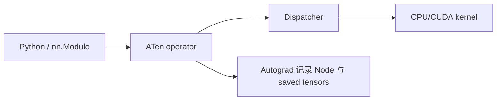
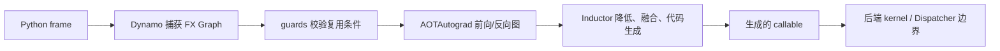

同一个 3 算子 Tensor 程序，eager 会按 Python 顺序逐项提交，而 `torch.compile` 会先尝试把连续区域变成图。本仓库 CPU 探针在 PyTorch 2.11.0、`backend="eager"` 下观测到 **1 张图、0 次 Graph Break、12 条 guard**，并让 eager/compile 的输出与 3 组输入梯度最大绝对误差都为 0；这些只是本地正确性和诊断证据，不是加速结论。关键不是背一串组件名，而是能沿着调用回答：谁捕获、谁检查假设、谁生成前反向图、谁降低到后端，以及失败后在哪里回到 eager。

<!-- more -->

## 📑 目录

- [本节定位](#本节定位)
- [1. eager 执行时谁在工作](#1-eager-执行时谁在工作)
- [2. Dynamo 怎样捕获图并生成 guards](#2-dynamo-怎样捕获图并生成-guards)
- [3. Graph Break、fallback 与 fullgraph 有什么区别](#3-graph-breakfallback-与-fullgraph-有什么区别)
- [4. guard 失效为什么触发重编译](#4-guard-失效为什么触发重编译)
- [5. AOTAutograd 怎样得到前向与反向图](#5-aotautograd-怎样得到前向与反向图)
- [6. Inductor 在后端做什么](#6-inductor-在后端做什么)
- [7. compile 模式与 first-run 成本怎样权衡](#7-compile-模式与-first-run-成本怎样权衡)
- [8. torch.export 和 torch.compile 为什么不能互换](#8-torchexport-和-torchcompile-为什么不能互换)
- [9. 跑通 CPU 执行链路探针](#9-跑通-cpu-执行链路探针)
- [10. 常见错误与 TORCH_LOGS 诊断入口](#10-常见错误与-torch_logs-诊断入口)
- [11. 与 4.9、4.11 和模块二的边界](#11-与-49411-和模块二的边界)
- [总结](#-总结)
- [自我检验清单](#-自我检验清单)
- [参考资料](#-参考资料)

---

## 本节定位

**前置知识**：完成 [4.5 训练循环工程](/AIInfraGuide/prerequisites/模块一-前置知识/pytorch/45-训练循环工程/)、[4.8 Benchmark 与 Profiler](/AIInfraGuide/prerequisites/模块一-前置知识/pytorch/48-benchmark与profiler/)与 [4.9 自定义算子与 Dispatcher](/AIInfraGuide/prerequisites/模块一-前置知识/pytorch/49-自定义算子与dispatcher/)。你应能运行 forward/backward，知道性能结论必须先过正确性门禁，并能区分 operator、schema、kernel 与 Dispatcher。

**学习成果**：读完后，你能画出 eager 与 compile 两条执行路径；能解释 Dynamo 图捕获、guard、Graph Break、fallback、重编译与动态 shape；能说明 AOTAutograd、Inductor 的职责；能根据模式和 first-run 成本做接入判断；能区分 `torch.export` 与 `torch.compile`；能用 `explain`、`fullgraph=True` 和 `TORCH_LOGS` 缩小故障范围。

**够用边界**：本节只建立入口心智模型。示例默认 `backend="eager"`，因此会验证 Dynamo 捕获而**不会**运行 Inductor 代码生成，也不测速度。Graph Break 修复、Inductor IR、decomposition、Triton/CUDA 代码生成和 Kernel 性能进入模块二；DDP/FSDP 的编译组合进入后续分布式课程。

## 1. eager 执行时谁在工作

### 1.1 “立刻执行”到底立刻到哪一层？

打个比方：eager 像餐厅逐张下单——Python 每读到一道菜就把一张单送进后厨，后厨按菜品和灶台选择厨师；编译则先收集一组订单，再决定哪些步骤能合并。**eager 的核心不是“没有图”，而是 Python 控制流逐算子推进，Autograd 同时按实际执行路径记录反向所需信息。**

以 `torch.tanh(x @ w + b)` 为例，心智路径是：



- **Python / Module**：决定这一轮真正走哪个分支、循环多少次；
- **ATen operator**：把 `matmul`、`add`、`tanh` 表达成 PyTorch 的 operator；
- **Dispatcher**：结合设备和 Autograd、Autocast 等 dispatch key 选择实现；
- **kernel**：在 CPU 或 CUDA 后端真正计算；
- **Autograd**：记录本轮动态执行路径，`backward()` 时沿图传播梯度。

这条链路没有错，也是调试与语义基准。它牺牲跨算子全局视野，换取 Python 动态性、逐行可观察性与简单的失败定位。`torch.compile` 不能绕过 4.9 的 Dispatcher 契约；它改变的是“何时看见一组操作、怎样把它们交给后端”。

### 1.2 compile 路径多了哪些关卡？

**编译链路是在 eager 语义外加捕获、假设验证和后端转换，而不是另造一套模型 API。** 主干可以压成：



这是职责地图，不是某个版本的逐函数调用栈。不同 backend 可以在 Dynamo 后接入不同处理；本节的 `backend="eager"` 只让捕获到的 GraphModule 继续 eager 执行，故意隔离 Inductor 编译负担。

## 2. Dynamo 怎样捕获图并生成 guards

### 2.1 为什么不直接把 Python 当静态语言？

问题是：同一个函数下次可能换 shape、dtype、对象属性甚至 Python 分支，旧图还能复用吗？**TorchDynamo 在 Python frame/字节码层观察执行，把可表示的 Tensor 区域捕获为 FX Graph，同时记录这份图成立所依赖的 guard。**

想象图书馆把一次借阅流程做成快捷模板。模板能复用的前提是“仍是同一类读者、同一借阅规则、同一类书”；这些前提就是 guard。具体 guard 随代码和 PyTorch 版本变化，常见对象包括：

- Tensor 的 dtype、device、rank、shape/stride 或符号 shape 约束；
- Python 常量、对象类型、函数身份和读取过的全局状态；
- grad mode、默认设备等会改变执行语义的上下文；
- Module 属性或其他被捕获路径依赖的值。

```python
import torch
import torch._dynamo as dynamo

summary = dynamo.explain(tiny_pipeline)(input_tensor, weight, bias)
print(summary.graph_count)
print(summary.graph_break_count)
print(summary.out_guards)
```

`torch._dynamo` 是官方诊断入口，但名称位于下划线命名空间，结构化字段会随版本演进。生产脚本不应把某个 guard 类的内部字段当稳定业务 API。本仓库示例兼容当前 `explain(fn)(*args)` 与旧式调用，并在两者都不可用时给出明确错误。

### 2.2 捕获成功是否等于已经加速？

**不等于。图捕获只证明 Dynamo 看见了一段计算。** 后端是否融合、生成什么代码、first-run 成本能否摊平，以及目标硬件是否受益，都要另做 4.8 的规范 benchmark。本地示例使用 eager backend，输出中的 graph/guard 数量只能作为链路证据，不能写成“加速了多少”。

## 3. Graph Break、fallback 与 fullgraph 有什么区别

### 3.1 一段代码捕获不了会怎样？

默认 `fullgraph=False` 时，Dynamo 允许把函数切成多个可编译区域。**Graph Break 是连续图在某一点被切断；可捕获区域仍交给 backend，断点附近按 eager 语义执行，然后可能继续捕获后续区域。**

```python
def intentional_graph_break(x):
    prefix = torch.sin(x)
    torch._dynamo.graph_break()  # 教学用显式断点
    return torch.cos(prefix)
```

本地 `dynamo.explain` 对这段函数报告 2 张图和 1 次 break。显式 `graph_break()` 是为了让失败路径跨版本稳定；真实代码更常因不支持的 Python、副作用、数据依赖分支或直接读取 Tensor 数据而中断，具体支持范围以当前官方“Working with Graph Breaks”文档为准。

这种 fallback 用图变小和融合机会减少，换取“先保持程序能运行”。但要区分两件事：

- **Graph Break fallback**：默认策略可以把支持与不支持区域分开执行；
- **backend 编译器崩溃**：不保证自动安全吞掉。不要用全局 `suppress_errors` 把真实正确性或编译缺陷长期隐藏。

### 3.2 `fullgraph=True` 为什么故意不 fallback？

**`fullgraph=True` 把“整个函数必须是一张图”变成断言；遇到 break 就立即失败。** 它适合测试、导出前审计或必须保持整图的子模块，不是“让代码自动更快”的开关。

```python
compiled = torch.compile(
    intentional_graph_break,
    backend="eager",
    fullgraph=True,
)
compiled(torch.randn(3, 4))  # 预期抛出 Unsupported 或对应版本异常
```

本仓库测试不绑定内部异常类，只要求状态为 `rejected_as_expected`、错误类型和消息非空。这样既验证严格路径，又避免把 `torch._dynamo.exc.Unsupported` 当作长期稳定公共接口。

📌 **关键点**：默认模式追求“能捕获多少算多少”，`fullgraph=True` 追求“捕获不完整就失败”。前者适合渐进接入，后者适合作为整图门禁。

## 4. guard 失效为什么触发重编译

### 4.1 shape 从 2 变成 5 时发生什么？

第一次捕获得到的图带着适用条件。下一次调用先检查 guards：**命中就复用缓存；失效就寻找其他已缓存版本或重新捕获/编译；反复失效达到当前版本的重编译限制后，框架可能回退 eager。** 限额和具体策略会演进，不应把某个默认数字写死进业务逻辑。

可以先用日志看证据：

```bash
TORCH_LOGS="recompiles,guards" \
  python3 examples/pytorch/compile_pipeline.py
```

日志量可能很大，先在最小复现上打开。`guards` 回答“这份产物依赖什么”，`recompiles` 回答“哪条 guard 失效导致重新编译”。

### 4.2 `dynamic=True` 解决了什么，又牺牲了什么？

`torch.compile` 的 `dynamic` 入口有三种意图：

| 设置 | 意图 | 换取什么 | 牺牲什么 / 风险 |
|---|---|---|---|
| `dynamic=None` | 让框架按当前策略自动检测动态性 | 少配置，遇到变化可尝试更动态的图 | 首次变化仍可能触发重编译，行为随版本演进 |
| `dynamic=False` | 对输入尺寸做静态特化 | 后端拥有更具体的 shape 信息 | shape 变化更容易 guard miss 与重编译 |
| `dynamic=True` | 尽量从一开始生成可接受多 shape 的图 | 减少部分 shape 变化造成的重复编译 | 不是所有维度/操作都能保持动态，优化空间也可能下降 |

本仓库 `dynamic_shape_probe()` 用 `dynamic=True` 依次运行 batch 2 和 5，并只断言两条路径都与 eager 数值相等。**它不对重编译次数和速度设阈值**，因为后端、版本与图结构都会改变这些观测。

```python
compiled = torch.compile(tiny_pipeline, backend="eager", dynamic=True)
compiled(*make_inputs(batch_size=2))
compiled(*make_inputs(batch_size=5))
```

需要更细粒度控制时，官方还提供动态维度标记和动态 shape 诊断入口；这些 API 的签名与支持范围更敏感，应先用 `TORCH_LOGS=dynamic` 找到过度特化，再按所用版本文档处理，而不是把所有维度一律动态化。

## 5. AOTAutograd 怎样得到前向与反向图

### 5.1 Dynamo 拿到前向图后，训练的 backward 在哪里？

只编译 forward 不能覆盖完整训练 step。**AOTAutograd 在 Autograd 语义之上提前追踪可微程序，把联合计算分割成前向图与反向图，并决定哪些中间值需要从前向保存给反向。**

设前向为：

$$
\underbrace{y=f(x,\theta)}_{\text{前向图}},
\qquad
\underbrace{(\bar{x},\bar{\theta})=
\operatorname{backward}(\bar{y},x,\theta)}_{\text{反向图}}
$$

这里 $\theta$ 是参数，$\bar{y}$ 是上游梯度，$\bar{x}$ 与 $\bar{\theta}$ 是返回梯度。AOTAutograd 要让两个图都能交给后端，同时保留 Autograd 对 saved tensors、mutation/alias 和梯度公式的语义。

打个比方：传统 Autograd 像做题时边算边留草稿；AOTAutograd 先把“正向解题步骤”和“根据上游批注反推”的两份流程整理出来，并列出反推时必须保留的草稿。保留更多中间量会占内存，重算更多中间量会花计算；这仍是 4.5 训练与后续 checkpointing 会遇到的计算—显存权衡。

### 5.2 `backend="eager"` 为什么看不到 AOTAutograd/Inductor？

本节默认 backend 是教学隔离层：Dynamo 捕获 FX Graph 后，eager backend 直接执行它。**它能验证图、guards、break 和 compiled callable 的数值/梯度契约，但不能证明 AOTAutograd 或 Inductor 已经运行。**

需要分层排障时，可先用 `torch._dynamo.list_backends(None)` 检查当前构建提供的调试 backend；若存在 `aot_eager`，可把示例参数改为：

```bash
python3 examples/pytorch/compile_pipeline.py --backend aot_eager
```

`aot_eager` 的价值是暴露 AOTAutograd 路径，不是加速。backend 名称和可用性按安装版本检查，脚本若收到不存在的 backend 会带配置值清晰报错。

## 6. Inductor 在后端做什么

### 6.1 默认 backend 为什么叫 Inductor？

`torch.compile` 未指定 backend 时，当前官方 API 使用 `inductor`。**Inductor 接收图，做 lowering、调度、融合与代码生成；CPU 和 GPU 会走不同生成路径，GPU 常见 Triton 与模板化实现。**

这里要守住三条边界：

1. **图存在不等于必然融合**：数据依赖、布局、alias、自定义算子边界与后端支持都会限制变换；
2. **custom operator 不等于自动内联**：4.9 注册让框架看见稳定 operator，但 opaque 边界内部能否进一步优化取决于 decomposition、fake/meta、后端 kernel 等契约；
3. **代码生成不等于性能证明**：必须用 4.8 的固定输入、预热、同步与重复分布验证，不能从“用了 Inductor”推导“更快”。

Inductor 用编译时间、代码缓存和更复杂的调试路径，换取跨算子观察、融合与目标后端代码生成机会。只运行一次的小程序可能根本摊不平这笔 first-run 成本。

### 6.2 为什么本节不展开 IR 和生成代码？

因为本节要回答“组件如何交接”，而不是“后端如何优化循环”。Inductor IR、decomposition、融合策略、Triton/CUDA 代码与 Graph Break 系统优化进入[模块二 7.2 torch.compile 原理与 Graph Break](/AIInfraGuide/cuda/模块二-cuda编程与算子优化/72-torchcompile原理与graphbreak/)。在这里复制那一章，会把前置课程变成编译器专项，也让内容随实现细节更快过期。

## 7. compile 模式与 first-run 成本怎样权衡

### 7.1 first run 为什么不能直接进正式 benchmark？

首次调用可能包含 Dynamo 捕获、guard 生成、AOTAutograd 追踪、后端 lowering/代码生成、编译与 autotune；后续命中缓存时路径不同。**first-run latency 与 steady-state latency 是两个指标，不能把前者混进后者，也不能只报后者隐藏启动成本。**

本节没有计时，因此不提供任何毫秒、吞吐或加速数字。真正测量时至少分开报告：

- 首次调用总时间与是否包含 autotune；
- 预热后重复调用分布；
- shape 变化时的重编译事件；
- eager correctness、compiled correctness 与环境；
- 编译缓存是否复用及进程生命周期。

### 7.2 mode 是“越来越快”的档位吗？

**不是。mode 是编译时间、运行开销、内存和适用 shape 的交易。** 当前 `torch.compile` 官方 API 列出以下常用模式；具体配置可用所用版本的 `torch._inductor.list_mode_options()` 查看。

| mode | 主要目标 | 代价与边界 |
|---|---|---|
| `default` | 平衡编译开销与后端优化 | 不保证适合所有模型，是首个实测候选 |
| `reduce-overhead` | 在适用 CUDA 图上降低 Python/launch 开销 | 可能缓存 workspace、增加显存；CUDA Graph 有输入 mutation、shape 等适用条件 |
| `max-autotune` | 为支持的矩阵/卷积路径搜索候选配置 | first-run 更长，GPU 上还可能启用 CUDA Graph |
| `max-autotune-no-cudagraphs` | 保留 autotune，但不启用 CUDA Graph | 仍支付 autotune 成本，不获得 CUDA Graph 对应机会 |

这些主要是 Inductor backend 的配置预设，不应和本节 eager backend smoke 混用。选型顺序是：先 default 证明正确并测 first-run/steady-state；只有证据显示启动开销或 kernel 选择是瓶颈，才尝试其他 mode。别为了“模式更高级”直接上 max-autotune。

## 8. torch.export 和 torch.compile 为什么不能互换

### 8.1 两者都生成图，目标有什么不同？

一句话讲清：**`torch.compile` 优化当前 Python callable 的运行，`torch.export` 交付一份带输入约束的 AOT `ExportedProgram`。**

| 维度 | `torch.compile` | `torch.export` |
|---|---|---|
| 首要目标 | 在运行时捕获、缓存并优化 callable | 提前捕获可保存/变换/部署的程序表示 |
| 产物 | 包装后的可调用对象与运行时缓存 | `ExportedProgram`、图签名与 shape constraints |
| Python 动态性 | 通过 guards、缓存、重编译与 Graph Break 渐进处理 | 要把 Python 控制流/数据结构规范化到可导出表示；无法证明假设时失败 |
| shape | `dynamic` 控制编译时动态策略 | `dynamic_shapes`/`Dim` 显式描述导出约束 |
| 失败策略 | 默认可形成多个区域；`fullgraph=True` 才要求整图 | 捕获必须产出满足约束的完整导出程序，不把未导出部分留成普通 Python fallback |
| 是否等于优化后端 | 可接 Inductor 等 backend | 不是性能优化结论；可作为后续编译/部署输入 |

官方 `torch.export.export` 文档说明，导出图使用规范化的函数式 ATen operator（以及允许的 custom operator），消除大部分 Python 控制流/数据结构，并记录 shape 假设。它提供的是可移交边界，不承诺自动加速。

```python
from torch.export import export

program = export(
    ExportableTinyPipeline(),
    (input_tensor, weight, bias),
    strict=True,
)
print(program.graph_signature)
print(program.range_constraints)
```

本仓库探针显式使用 `strict=True`。若当前 PyTorch 没有 `torch.export.export`，报告写 `available: false` 和原因；若 API 存在但最小 Tensor 程序仍捕获失败，则清晰抛错，不把失败伪装成跳过。

## 9. 跑通 CPU 执行链路探针

### 9.1 默认示例验证什么？

完整源码位于 `examples/pytorch/compile_pipeline.py`，测试位于 `examples/pytorch/tests/test_compile_pipeline.py`。在仓库根目录执行：

```bash
python3 examples/pytorch/compile_pipeline.py
python3 -m unittest examples/pytorch/tests/test_compile_pipeline.py -v
python3 -m compileall examples/pytorch/compile_pipeline.py \
  examples/pytorch/tests/test_compile_pipeline.py
```

默认 `backend="eager"`，CPU 测试覆盖：

1. eager 与 compile forward 数值在 `rtol=1e-5, atol=1e-6` 下相等；
2. input、weight、bias 三组梯度按同一容差相等；
3. 正常路径的 explain 至少有 1 张图、1 条 guard 且 0 次 break；
4. 显式 `graph_break()` 路径至少报告 1 次 break；
5. `fullgraph=True` 明确拒绝同一路径；
6. `dynamic=True` 接受 batch 2 与 5，并分别匹配 eager；
7. `torch.export` 可用时捕获图签名，不可用时给出明确降级原因；
8. 非法 batch 与不存在 backend 明确失败。

完成标志是：

```text
all compile-pipeline checks passed; no performance was measured
```

报告故意不含 duration、samples/s 或 speedup 字段，单元测试也没有速度阈值。

### 9.2 为什么梯度等价比只比输出更重要？

训练程序可能 forward 相同而 backward 错误。示例为两条路径创建独立叶子 Tensor，分别执行 `output.sum().backward()`，再比较 3 组 `.grad`。这把 4.5 的更新正确性接到编译链路，也防止只用 inference 样本掩盖 AOTAutograd/Autograd 组合问题。

⚠️ **注意**：eager backend 的梯度等价只证明 Dynamo 包装没有改变这个小程序的 Autograd 结果。要声称 Inductor 或某个设备 backend 正确，必须把 backend、dtype、device、shape 和训练/推理模式加入对应测试矩阵。

## 10. 常见错误与 TORCH_LOGS 诊断入口

### 10.1 先打开哪些日志？

问题是：compile 后变慢、重编译或失败，应该先猜 Inductor 吗？**先用最小复现和分层日志确认问题属于 break、guard/recompile、动态 shape 还是后端。**

```bash
# 定位断图原因
TORCH_LOGS="graph_breaks" python3 your_repro.py

# 定位哪条 guard 失效与重编译
TORCH_LOGS="recompiles,guards" python3 your_repro.py

# 定位动态 shape 过度特化
TORCH_LOGS="dynamic" python3 your_repro.py
```

日志类别和输出格式以所用版本的 `torch._logging` / troubleshooting 文档为准。先单开一个类别；一次打开全部日志会增加噪声，也可能改变你观察程序的方式。

### 10.2 症状应该落到哪一层？

| 症状 | 首个证据 | 最小动作 |
|---|---|---|
| explain 有多张小图 | `graph_breaks` 与 break reason | 把不支持副作用移出热点，或只 compile 可捕获子模块 |
| shape 一变就重复编译 | `recompiles,guards,dynamic` | 判断应 padding、`dynamic=True` 还是保留静态特化 |
| `fullgraph=True` 首次调用报错 | 第一个 break 的用户栈 | 修复该断点，或承认此函数不满足整图契约 |
| eager 正确、compile 输出不一致 | 固定输入的逐层/逐子模块对照 | 先换 eager backend 隔离 Dynamo，再用 AOT/Inductor 调试 backend 缩小范围 |
| forward 相同、梯度不同 | 三组梯度与最小 loss | 检查 mutation、alias、自定义 Autograd/custom op 契约 |
| 第一次很慢、后续正常 | first-run 与 steady-state 分开计时 | 明确 warmup 和生命周期，判断成本能否摊平 |
| 每次进程启动都重新付编译成本 | 缓存与进程生命周期记录 | 检查当前版本缓存策略，不能把单进程缓存假设外推 |
| `reduce-overhead` 没生效 | `TORCH_LOGS=perf_hints` 与 CUDA Graph 条件 | 检查设备、mutation、shape；不适用就回 default |
| custom operator 阻挡后端优化 | 4.9 的 schema/Fake/Autograd 与后端注册 | 保留 opaque 边界，或提供 decomposition/后端 kernel；不要删掉契约 |
| 为“能跑”打开全局 suppress | 被吞掉的原始异常 | 回到最小复现，修根因或显式划分 eager/compile 边界 |

📌 **关键点**：排障顺序是“eager 语义 → Dynamo 图与 break → guards/recompile → AOTAutograd 梯度 → Inductor 后端”。不要看到 `torch.compile` 三个字就直接钻进生成 Kernel。

## 11. 与 4.9、4.11 和模块二的边界

### 11.1 与 4.9 的接口是什么？

[4.9 自定义算子与 Dispatcher](/AIInfraGuide/prerequisites/模块一-前置知识/pytorch/49-自定义算子与dispatcher/) 负责定义 operator、schema、CPU/Fake/Autograd 注册。4.10 只解释这些 operator 进入 Dynamo/AOTAutograd/后端时为何会成为可见或 opaque 边界。**4.9 保证“边界合法”，4.10 观察“边界如何经过编译链路”。** 高性能 CUDA/Triton kernel 不在两节里重复实现。

### 11.2 与 4.11 分布式导论的接口是什么？

4.11 负责 rank、process group、Gloo/DDP 和单机多进程 smoke。这里不展开 DDP/FSDP 的图切分、通信 capture、collective 重排或分布式编译策略。先在单进程上证明数值、梯度、break 与重编译口径，再进入[模块三分布式训练](/AIInfraGuide/distributed/)处理多 rank 一致性和规模化权衡。

### 11.3 模块二接过哪些问题？

[模块二 7.2](/AIInfraGuide/cuda/模块二-cuda编程与算子优化/72-torchcompile原理与graphbreak/) 深入 Graph Break 修复、编译收益与后端机制；模块二其他章节负责 Triton/CUDA kernel、融合、访存和 Nsight 证据。本节停止在以下交接点：

- 能画出 Dynamo → AOTAutograd → Inductor；
- 能用 explain/logs 定位断层；
- 能证明 eager/compile 数值与梯度；
- 能判断是否值得支付 first-run 成本；
- 但不解释 Inductor IR、调度算法和生成 Kernel 的硬件性能。

落成一句话：**4.9 管 operator 契约，4.10 管单进程执行/编译地图，4.11 管多进程入口，模块二才管编译器与 Kernel 怎样做深。**

## 📝 总结

1. **eager 基线**：Python 逐算子推进 ATen/Dispatcher/kernel，Autograd 按真实路径记录动态图；它用跨算子视野换来动态性与可调试性。
2. **Dynamo 捕获**：在 frame/字节码层形成 FX Graph，并用 guards 记录缓存产物成立的条件；捕获成功不等于加速。
3. **Graph Break**：默认可把函数切成编译区与 eager 区，`fullgraph=True` 则把整图捕获变成失败断言。
4. **重编译与动态 shape**：guard miss 会查缓存或重新编译；`dynamic=True` 用更动态的图减少部分 shape 重编译机会，但可能牺牲特化信息。
5. **训练链路**：AOTAutograd 把可微程序整理为前向/反向图和 saved-tensor 接口；Inductor 再做 lowering、融合与代码生成。
6. **模式权衡**：default、reduce-overhead、max-autotune 等是编译时间、内存和运行机会的交易，不是无条件递增档位。
7. **export 边界**：`torch.compile` 优化运行时 callable，`torch.export` 交付带约束的 AOT `ExportedProgram`；生成图不等于性能结论。
8. **验证纪律**：本地 CPU 探针只证明数值、梯度、图、guard、break、dynamic/fullgraph/export 路径，不宣称任何加速。

## 🎯 自我检验清单

- 能在 5 分钟内画出 Python/ATen/Dispatcher/kernel/Autograd 的 eager 路径，以及 Dynamo/AOTAutograd/Inductor 的 compile 路径
- 能运行默认 CPU 示例并指出正常路径的 graph、guard、break 三个摘要字段，判定线为 graph 至少 1、guard 至少 1、break 等于 0
- 能解释 guard 是编译产物的适用条件，并从 `TORCH_LOGS="recompiles,guards"` 找出一条导致重编译的失效条件
- 能构造一个显式 Graph Break，让 `explain` 至少报告 1 次 break，并让 `fullgraph=True` 明确失败
- 能分别说明 `dynamic=None`、`False`、`True` 的意图，并让 batch 2 与 5 在 `dynamic=True` 下都匹配 eager 结果
- 能解释 AOTAutograd 为什么需要前向图、反向图与 saved tensors，并说明 `backend="eager"` 为什么不能证明 AOTAutograd 已运行
- 能区分 Dynamo 捕获成功与 Inductor 性能改善，并拒绝在没有固定输入、预热、重复分布时报告加速比
- 能根据 first-run、shape 稳定性、进程生命周期和显存条件，在 default、reduce-overhead、max-autotune 中提出首个实测候选
- 能用一句话区分 `torch.compile` 与 `torch.export`，并从 ExportedProgram 中找出 graph signature 和 shape constraints 入口
- 能运行 7 个单元测试，验证 eager/compile 输出和 3 组梯度等价、break/fullgraph 失败路径、dynamic shape 与 export 降级路径
- 能说清 4.9、4.10、4.11 与模块二分别负责 operator 契约、编译心智模型、分布式入口和编译器/Kernel 深入

## 📚 参考资料

### PyTorch 官方文档

- [`torch.compile`](https://docs.pytorch.org/docs/stable/generated/torch.compile.html)：`fullgraph`、`dynamic`、backend、mode、guard failure、重编译限制和 Inductor 选项的首要 API 事实源。
- [TorchDynamo Overview](https://docs.pytorch.org/docs/stable/torch.compiler_dynamo_overview.html)：Dynamo frame 捕获、FX Graph、guards 与 backend 交接的官方概览。
- [Torch Compiler 总入口](https://docs.pytorch.org/docs/stable/torch.compiler.html)：Dynamo、AOTAutograd、Inductor 与编译器诊断 API 的统一入口。
- [AOTAutograd](https://docs.pytorch.org/functorch/stable/notebooks/aot_autograd_optimizations.html)：前向/反向图、joint graph、partition 与 saved tensors 的官方机制说明。
- [Working with Graph Breaks](https://docs.pytorch.org/docs/stable/user_guide/torch_compiler/compile/programming_model.graph_breaks_index.html)：Graph Break 的语义、常见原因、定位和整图要求。
- [Recompilation](https://docs.pytorch.org/docs/stable/user_guide/torch_compiler/compile/programming_model.recompilation.html)：guard failure、缓存、重编译与动态 shape 的官方说明。
- [Troubleshooting torch.compile](https://docs.pytorch.org/docs/stable/torch.compiler_troubleshooting.html)：`TORCH_LOGS`、最小复现和分层排障入口。
- [`torch._logging`](https://docs.pytorch.org/docs/stable/logging.html)：`graph_breaks`、`recompiles`、`guards`、`dynamic` 与 `perf_hints` 等日志类别。
- [`torch.export`](https://docs.pytorch.org/docs/stable/export.html)：`ExportedProgram`、规范化 ATen 图、soundness guarantee、`Dim` 与 dynamic shape constraints。

### 站内后续

- [4.9 自定义算子与 Dispatcher](/AIInfraGuide/prerequisites/模块一-前置知识/pytorch/49-自定义算子与dispatcher/)：operator/schema/kernel、FakeTensor 与 Autograd 注册前置。
- [模块二 7.2 torch.compile 原理与 Graph Break](/AIInfraGuide/cuda/模块二-cuda编程与算子优化/72-torchcompile原理与graphbreak/)：从入口心智模型继续下钻 Graph Break、Inductor 与优化证据。
- [第 4 章章首页](/AIInfraGuide/prerequisites/模块一-前置知识/第4章-pytorch框架/)：确认 4.10 在 PyTorch 课程中的前后依赖与后续去向。
