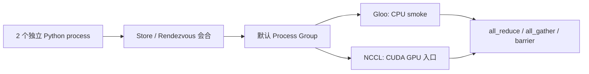

把单进程训练改成 DDP，不是给模型套一个包装器就结束，而是同时建立 **进程、数据、通信和副作用**四份契约。本节示例固定启动 **2 个 CPU/Gloo 进程**，让 8 个样本不重不漏地分成两份，跑 1 次 DDP 更新，并验证跨 rank 参数最大差为 0、`all_reduce` 指标差为 0、只有 rank 0 写出 1 份 checkpoint、两个进程都销毁 process group。这些数字是可复现的正确性断言，不是性能结论。

<!-- more -->

## 📑 目录

- [本节定位](#本节定位)
- [1. 多个进程怎样组成一个 world](#1-多个进程怎样组成一个-world)
- [2. Process Group、backend 与 collective 各管什么](#2-process-groupbackend-与-collective-各管什么)
- [3. DDP 为什么坚持每进程一设备](#3-ddp-为什么坚持每进程一设备)
- [4. 梯度怎样同步，数据为什么不会自动切](#4-梯度怎样同步数据为什么不会自动切)
- [5. 指标、checkpoint 与副作用怎样收口](#5-指标checkpoint-与副作用怎样收口)
- [6. barrier 与 cleanup 应该放在哪里](#6-barrier-与-cleanup-应该放在哪里)
- [7. torchrun 注入了哪些环境变量](#7-torchrun-注入了哪些环境变量)
- [8. 跑通两进程 CPU/Gloo smoke](#8-跑通两进程-cpugloo-smoke)
- [9. 常见错误与诊断](#9-常见错误与诊断)
- [10. DDP、FSDP 与后续课程怎样分工](#10-ddpfsdp-与后续课程怎样分工)
- [总结](#-总结)
- [自我检验清单](#-自我检验清单)
- [参考资料](#-参考资料)

---

## 本节定位

**前置知识**：完成 [4.3 Module 与状态管理](/AIInfraGuide/prerequisites/模块一-前置知识/pytorch/43-module与状态管理/)与 [4.5 训练循环工程](/AIInfraGuide/prerequisites/模块一-前置知识/pytorch/45-训练循环工程/)。你应能区分 Parameter、buffer 与普通属性，写出一次 `zero_grad → forward → backward → step`，并知道模型 `state_dict` 只是完整训练 checkpoint 的一部分。[4.10 执行与编译链路](/AIInfraGuide/prerequisites/模块一-前置知识/pytorch/410-执行与编译链路/)不是本节的硬前置；若计划组合 `torch.compile` 与分布式训练，先用单进程证明数值和梯度正确，再进入模块三。

**学习成果**：读完后，你能解释 process、rank、world size、local rank、process group、backend 和 collective；能用 DDP 跑一个每进程一设备的最小更新；能用 `DistributedSampler + set_epoch` 明确切数据；能用 `all_reduce` 聚合加权指标；能限制 rank 0 写 checkpoint；能判断何时需要 `barrier`，并在 `finally` 中调用 `destroy_process_group()`。

**够用边界**：本节只建立单机入口心智并验证 CPU 正确性。Gloo smoke 不代表 GPU/NCCL 性能，也不提供吞吐、带宽或扩展效率数字。DDP bucket、通信计算重叠、FSDP 分片、ZeRO、分布式 checkpoint、容错和多机拓扑进入模块三；这里只说明它们接在什么位置。

## 1. 多个进程怎样组成一个 world

### 1.1 process、rank、world size 与 local rank 是什么？

想象两栋楼各有两名实验员：公司工号在全公司唯一，座位号只在本楼有效，总人数则决定一次全员点名要等几个人。**process 是独立运行脚本的操作系统进程；rank 是全局工号；local rank 是节点内座位号；world size 是参与当前通信域的进程总数。**

| 概念 | 精确定义 | 2 节点 × 每节点 2 进程的例子 | 主要用途 |
|---|---|---|---|
| process | 一个独立 Python 解释器与运行状态 | 共 4 个 | 隔离模型副本、优化器与设备上下文 |
| `rank` | worker group 内全局编号，范围 `[0, world_size)` | 0、1、2、3 | 通信身份、`rank == 0` 副作用守卫 |
| `world_size` | 当前 worker group 的总进程数 | 4 | collective 参与者数量、有效 batch 计算 |
| `local_rank` | 当前节点 local worker group 内编号 | 每台机器都是 0、1 | 选择本机设备，不能拿全局 rank 代替 |

当每节点进程数固定为 $G$ 时，静态布局常满足：

$$
\underbrace{\text{rank}}_{\text{全局编号}}
=
\underbrace{\text{node rank}\times G}_{\text{前面节点的进程数}}
+
\underbrace{\text{local rank}}_{\text{当前节点内编号}}
$$

例如第二个节点的 `node rank=1`、`G=2`、`local_rank=1`，对应全局 `rank=3`。但官方 `torchrun` 文档明确提醒：**弹性重启后 `RANK` 不保证稳定**，不要把 rank 当作长期数据身份或 checkpoint 分片名称。

### 1.2 为什么 local rank 才能绑定设备？

问题是：单机时 `rank == local_rank`，直接用 rank 不也能跑吗？**单机的偶然相等会掩盖多机错误；设备编号属于本机，所以只能由 local rank 决定。** 第二台机器上的全局 rank 3 可能只有本地设备 0、1，用 `cuda:3` 会越界。

GPU 入口应保持一块设备只被一个进程独占：

```python
local_rank = int(os.environ["LOCAL_RANK"])
torch.cuda.set_device(local_rank)
dist.init_process_group(backend="nccl")
model = DDP(model.to(local_rank), device_ids=[local_rank])
```

本节 CPU smoke 没有设备绑定，两个进程都使用 CPU；它验证的是同一套 rank/process-group/DDP 语义的最低硬件路径。

## 2. Process Group、backend 与 collective 各管什么

### 2.1 Process Group 为什么不只是“初始化一下”？

进程彼此看不见，怎样约定“谁参加这次通信”？**Process Group 是一组进程的通信域；它同时确定成员关系，并通过 backend 提供 collective 实现。** `init_process_group()` 建立默认组，DDP 未显式传 `process_group` 时就使用它。



- **Gloo**：官方建议用于 CPU 分布式训练；本节用它跑无需 GPU 的 correctness smoke。
- **NCCL**：官方建议用于 CUDA GPU 分布式训练；它是后续多 GPU 入口，但本节没有 GPU/NCCL 实测。
- **Store/Rendezvous**：让进程交换建立组所需的信息。`torchrun` 常通过 `MASTER_ADDR`、`MASTER_PORT` 提供会合入口；本节内部 spawn 示例使用临时 `file://` store，避免占用固定端口。

选择 backend 牺牲了“同一实现适配所有设备”的幻想，换取针对设备和互联的正确通信能力。CPU 测语义用 Gloo，CUDA 训练用 NCCL；不要因为 Gloo smoke 通过就推导 NCCL 拓扑、带宽或稳定性已经通过。

### 2.2 collective 为什么可能让所有进程一起卡住？

打个比方：collective 像全班点名。老师在第 3 次点名等 40 人，如果第 17 号学生却以为现在是第 4 次点名，双方都不会继续。**collective 是组内共同操作；参与 rank 必须以兼容的 Tensor 形状、dtype 和相同顺序进入对应调用。**

本节使用三个原语：

| collective | 输入与输出 | 本节用途 |
|---|---|---|
| `all_reduce` | 每个 rank 输入一个 Tensor，规约结果回到每个 rank | 汇总 loss 总和与样本数 |
| `all_gather` | 每个 rank 输入一份，所有 rank 得到完整列表 | 验证样本分片、指标和参数一致 |
| `barrier` | 无业务 Tensor；所有 rank 到齐才返回 | 等 rank 0 完成文件发布后再检查 |

⚠️ **注意**：不要让 `if rank == 0:` 包住一个其他 rank 不会调用的 collective。rank 0 进入 `all_reduce`、其余 rank 跳过时，表现通常是超时或 hang，而不是普通 Python 异常。

## 3. DDP 为什么坚持每进程一设备

### 3.1 DDP 包装后，进程里多了什么？

**DDP 的心智模型是“每个进程持有完整模型副本，各自做前向与反向，在反向阶段同步梯度”。** GPU 训练通常是一进程一 GPU；本节则是一进程一 CPU 模型副本。构造 DDP 时会按 process group 同步初始 module 状态，之后为参数梯度建立同步机制。

```python
torch.manual_seed(1000 + rank)  # 故意让两个进程初始随机状态不同
model = nn.Sequential(nn.Linear(2, 4), nn.Tanh(), nn.Linear(4, 1))
ddp_model = DDP(model)          # CPU DDP: device_ids=None
optimizer = torch.optim.SGD(ddp_model.parameters(), lr=0.05)

optimizer.zero_grad(set_to_none=True)
loss = loss_fn(ddp_model(inputs), targets)
loss.backward()                 # DDP 在反向阶段同步已注册参数的梯度
optimizer.step()
```

4.3 讲过的 Module 注册契约在这里变成前提：未注册 Parameter 不会出现在 `model.parameters()`，DDP 也无法把它当作模型参数同步。DDP 换来各进程对等、没有 Python 主卡汇总路径的结构；代价是每个进程都持有完整模型与优化器状态，并且所有 rank 必须执行兼容的前向/反向顺序。

### 3.2 梯度同步为什么能让参数继续一致？

设 world size 为 $W$，第 $r$ 个 rank 在自己的 local batch 上得到平均梯度 $g_r$。等大 local batch 下，DDP 同步后的逻辑梯度是：

$$
\underbrace{g}_{\text{每个 rank 最终使用的梯度}}
=
\frac{1}{W}
\sum_{r=0}^{W-1}
\underbrace{g_r}_{\text{第 r 个 rank 的本地平均梯度}}
$$

两进程时就是 $g=(g_0+g_1)/2$。如果构造后参数相同、优化器状态相同、每个 rank 都调用一次 `step()`，那么更新后参数仍应相同。本节用 `all_gather` 收集扁平参数并断言跨 rank 最大差为 0。

结合 4.5 的梯度累积，等大 micro-batch 下有效 batch 是：

$$
\underbrace{B_{effective}}_{\text{一次参数更新消费的样本数}}
=
\underbrace{b_{micro}}_{\text{每个 micro-batch}}
\times
\underbrace{K_{accumulation}}_{\text{每 rank 累积次数}}
\times
\underbrace{W}_{\text{world size}}
$$

💡 **提示**：这条等价要求各 rank 对 loss 的归一化口径兼容。尾批样本数不同、按 token 加权或不均匀输入时，不能机械平均各 rank 的平均 loss；指标与梯度都要重新确认权重定义。

## 4. 梯度怎样同步，数据为什么不会自动切

### 4.1 DDP 为什么不负责分数据？

这是最容易犯的概念错误：名字叫 Data Parallel，DDP 是否会自动把输入 batch 一分为二？**不会。PyTorch 官方 DDP API 明确说明，DDP 同步模型副本的梯度，但不 chunk 或 shard 输入；数据怎样分由调用方负责。**

如果两个 rank 都读取整个 DataLoader，它们会重复计算同一批样本。常见 map-style 数据集入口是 `DistributedSampler`：

```python
dataset = TensorDataset(sample_ids, features, targets)
sampler = DistributedSampler(
    dataset,
    num_replicas=world_size,
    rank=rank,
    shuffle=True,
    seed=20260810,
    drop_last=False,
)

for epoch in range(num_epochs):
    sampler.set_epoch(epoch)  # 必须在创建这一轮 DataLoader iterator 前调用
    loader = DataLoader(dataset, batch_size=local_batch_size, sampler=sampler)
    for sample_ids, inputs, targets in loader:
        train_step(inputs, targets)
```

`set_epoch(epoch)` 让所有 rank 共享同一个 epoch 种子变化，同时各自仍取不同分片。忘记它不会让程序立刻报错，却会让每个 epoch 使用相同排序。

### 4.2 “不重不漏”有哪些边界条件？

本节故意选 `dataset_size=8`、`world_size=2`，每个 rank 恰好 4 个样本，因此可以同时断言：

```text
rank 0: [6, 3, 0, 7]
rank 1: [4, 5, 2, 1]
交集为空；排序后并集为 [0, 1, 2, 3, 4, 5, 6, 7]
```

但 `DistributedSampler` 面对不能整除的数据集时必须在“补齐”和“丢弃尾部”之间选：`drop_last=False` 会补额外索引以让各 rank 等长，严格去重可能不成立；`drop_last=True` 会丢尾部，严格覆盖可能不成立。**“不重不漏”不是 Sampler 对任意数据规模的无条件保证，而是数据规模、world size 与尾部策略共同定义的验收口径。**

## 5. 指标、checkpoint 与副作用怎样收口

### 5.1 为什么不能只打印 rank 0 的 local loss？

rank 0 只看到了自己的数据分片。**全局均值应先规约总损失与计数，再相除；不要先算每个 rank 的均值后无权平均。** 后一种写法在各 rank 样本数不同或有效 token 数不同的时候会偏。

```python
# local_loss_sum 是本 rank 样本损失之和，不是本地均值。
metric_parts = torch.tensor(
    [float(local_loss_sum.detach()), float(local_sample_count)],
    dtype=torch.float64,
)
dist.all_reduce(metric_parts, op=dist.ReduceOp.SUM)
global_mean_loss = metric_parts[0] / metric_parts[1]

if rank == 0:
    print(f"global mean loss: {global_mean_loss.item():.6f}")
```

这次 `all_reduce` 让每个 rank 都得到相同的两个总量；只有打印这一副作用需要 `rank == 0`。本节 smoke 再 `all_gather` 一次最终 metric，断言两个 rank 的值完全相同。

### 5.2 checkpoint 为什么通常只由 rank 0 写？

DDP 更新后各 rank 的模型参数应一致。若所有进程同时覆盖同一路径，换来的不是“多一份保险”，而是文件竞争和损坏风险。**普通 DDP 权重 checkpoint 由 rank 0 写一次，其余 rank 不碰这个路径。**

```python
checkpoint_path = output_dir / "rank0_checkpoint.pt"
if rank == 0:
    torch.save(
        {
            "saved_by_rank": rank,
            "model": ddp_model.module.state_dict(),
        },
        checkpoint_path,
    )
```

这里保存 `ddp_model.module.state_dict()`，得到原始 Module 的命名状态。本节只验模型权重和写入所有者；4.5 已经说明精确续训还需要 optimizer、scheduler、step、RNG 和数据位置。[4.12 MiniGPT 综合项目](/AIInfraGuide/prerequisites/模块一-前置知识/pytorch/412-minigpt综合项目/)会把这些状态接入分布式入口。

⚠️ **注意**：FSDP 参数可能处于分片形态，checkpoint 不是“照抄 DDP 的 rank 0 `torch.save`”。FSDP/DCP 状态字典、跨 world-size 恢复和分片保存属于模块三深挖。

## 6. barrier 与 cleanup 应该放在哪里

### 6.1 barrier 是不是“稳妥起见多加几个”？

**不是。`barrier()` 是控制同步点，只在后续动作确实依赖所有 rank 已完成某件事时使用。** 本节 rank 0 发布 checkpoint，随后每个 rank 都要检查文件，因此在检查前放一次 barrier：

```python
if rank == 0:
    torch.save(payload, checkpoint_path)

dist.barrier()  # 后续所有 rank 都会检查 rank 0 发布的文件
assert checkpoint_path.exists()
```

在每个训练 step 前后机械加 barrier，会牺牲异步推进与问题可见性，还可能把真正的不平衡伪装成“大家一起慢”。DDP 的 forward/backward 本身已经包含分布式同步边界；新增 barrier 必须能说出数据依赖。

### 6.2 异常发生时怎样保证 cleanup？

官方 distributed 文档强调退出前调用 `destroy_process_group()`。**把 cleanup 放在 `finally`，让正常路径和异常路径都释放通信资源。**

```python
try:
    dist.init_process_group(...)
    run_training()
finally:
    if dist.is_available() and dist.is_initialized():
        dist.destroy_process_group()
```

本节每个 worker 都在销毁后写报告，并断言 `dist.is_initialized()` 为假。这不是只看“进程退出了”的间接证据，而是明确检查两个 rank 都走过 cleanup。

## 7. torchrun 注入了哪些环境变量

### 7.1 启动器解决的是什么问题？

如果手动启动 8 个进程，你还要分别填写 8 组身份和同一个会合地址。**`torchrun` 负责拉起 worker，并把 rank、world size 与 rendezvous 信息注入环境变量；训练脚本负责读取，不能硬编码。**

| 环境变量 | 官方定义 | 脚本用途 |
|---|---|---|
| `RANK` | worker group 内全局 rank | 日志、通信身份、rank 0 守卫 |
| `LOCAL_RANK` | local worker group 内 rank | 绑定本机 CUDA 设备 |
| `WORLD_SIZE` | 作业总 worker 数 | 采样与全局 batch 口径 |
| `LOCAL_WORLD_SIZE` | 当前节点 worker 数 | 本机进程布局；通常等于 `--nproc-per-node` |
| `MASTER_ADDR` | rank 0 worker 所在主机地址 | 初始化 C10d store |
| `MASTER_PORT` | `MASTER_ADDR` 上 store 使用的端口 | 初始化 C10d store |

单机 CUDA 入口通常是：

```bash
torchrun --standalone --nproc-per-node=2 train.py
```

脚本读取：

```python
rank = int(os.environ["RANK"])
local_rank = int(os.environ["LOCAL_RANK"])
world_size = int(os.environ["WORLD_SIZE"])

torch.cuda.set_device(local_rank)
dist.init_process_group(backend="nccl")  # 默认 env:// 读取会合变量
```

仓库示例还提供 `read_torchrun_environment()`，会拒绝缺失变量、非法 rank/world size 和非法端口。CPU smoke 为了“一条 Python 命令即可验收”使用 `torch.multiprocessing.spawn` 启动两个进程；这与 `torchrun` 是两种 launcher，进入 worker 后的 process group、rank 和 collective 心智相同。

## 8. 跑通两进程 CPU/Gloo smoke

### 8.1 示例到底证明了什么？

完整源码位于 `examples/pytorch/distributed_intro.py`，测试位于 `examples/pytorch/tests/test_distributed_intro.py`。在仓库根目录执行：

```bash
python3 examples/pytorch/distributed_intro.py
python3 -m unittest examples/pytorch/tests/test_distributed_intro.py -v
python3 -m compileall examples/pytorch/distributed_intro.py \
  examples/pytorch/tests/test_distributed_intro.py
```

示例只依赖 Python 标准库和 PyTorch，不下载数据。它依次验证：

1. 当前 PyTorch 构建包含 `torch.distributed` 与 Gloo；否则输出明确 `SKIP` 原因；
2. spawn 启动 2 个进程，并通过临时 file store 建立 Gloo process group；
3. `DistributedSampler.set_epoch(0)` 后，两个 rank 的 8 个样本 ID 交集为空、并集完整；
4. CPU DDP 完成 1 次 forward、backward 和 SGD step；
5. 参数在两个 rank 上逐项一致，最大差等于 0；
6. loss 总和与样本数经 `all_reduce` 后，两个 rank 的全局均值一致；
7. 只有 rank 0 生成 `rank0_checkpoint.pt`，payload 的 `saved_by_rank` 等于 0；
8. barrier 后各 rank 看到同一份 checkpoint；
9. 两个 rank 都执行 `destroy_process_group()`；
10. 报告的 `performance_measured` 固定为 `false`。

完成标志是：

```text
all distributed-intro checks passed; no performance was measured
```

### 8.2 无 Gloo或受限环境怎样降级？

- `torch.distributed` 或 Gloo 未编入当前 PyTorch：示例打印 `SKIP`，unittest 使用 `SkipTest`，并指出需要 Gloo-enabled build；
- 操作系统禁止 spawn、loopback 通信或临时目录写入：测试明确失败，并把这三项环境限制写进错误消息；
- 某 rank 在 collective、训练或文件检查中失败：worker 先在 `finally` 尝试 cleanup、写出 rank 报告，再让父进程失败；
- 无 CUDA/NCCL：不影响 CPU correctness smoke；GPU 通信、显存、吞吐与扩展效率保持**未实测**，不从 CPU 结果外推。

这条降级纪律牺牲“一切环境都显示绿色”，换取测试结果可解释：缺 backend 是能力缺失，可以 skip；backend 存在却无法完成两进程正确性，则必须 fail，不能伪装成通过。

## 9. 常见错误与诊断

### 9.1 看到 hang、重复数据或多份文件时先查什么？

| 症状 | 首个检查 | 最小修复 |
|---|---|---|
| 卡在 `init_process_group` | world size 是否与实际进程数一致；会合路径/地址是否可达 | 用 launcher 统一注入身份，缩到 2 进程 Gloo 最小复现 |
| 卡在 backward/collective | 各 rank 是否按相同顺序进入同类 collective，Tensor shape/dtype 是否兼容 | 打印 rank + 步骤编号；移除 rank 条件中的 collective |
| 多机上设备越界 | 是否用全局 `RANK` 绑定本机 GPU | 改用 `LOCAL_RANK`，每进程独占一个设备 |
| 两个 rank 样本完全相同 | 是否没用 `DistributedSampler` | 显式传 `num_replicas`、`rank`，DataLoader 不再同时 `shuffle=True` |
| 每个 epoch 顺序都一样 | 是否在创建 iterator 前调用 `set_epoch(epoch)` | 把调用放到 epoch 循环开头 |
| “全局 loss”只反映 rank 0 | 是否直接打印本地 `loss.item()` | `all_reduce([loss_sum, count])` 后再相除 |
| 不等长分片的指标有偏 | 是否平均了各 rank 的均值 | 规约总和与有效样本/token 数，不平均平均数 |
| checkpoint 出现竞争或损坏 | 是否所有 rank 写同一路径 | DDP 普通权重只让 rank 0 写；分片状态走 FSDP/DCP 方案 |
| 退出时残留或挂住 | 异常路径是否跳过 cleanup | 在 `finally` 中调用 `destroy_process_group()` |
| 为了“防错”到处 barrier | barrier 是否真的保护一个跨 rank 数据依赖 | 删除无依据 barrier，用 profiler/日志暴露真实等待点 |

📌 **关键点**：分布式错误先按“进程是否齐 → collective 顺序是否齐 → 数据是否分对 → 状态是否一致 → 副作用是否唯一”排查。不要一看到 hang 就先猜网络性能。

## 10. DDP、FSDP 与后续课程怎样分工

### 10.1 本节讲到哪里停止？

**本节的 DDP 目标是入口正确性，不是规模化调优。** 它只回答：进程怎样编号并成组、数据由谁切、梯度何时同步、指标怎样聚合、谁写文件、如何清理。

| 主题 | 本节讲到 | 后续深挖位置 |
|---|---|---|
| DDP | 完整副本、反向梯度同步、CPU 两进程 smoke | [模块三第 4 章：数据并行](/AIInfraGuide/distributed/模块三-分布式训练/第4章-数据并行/)讲 bucket、通信重叠、规模化实战与选型 |
| collective | `all_reduce/all_gather/barrier` 的语义和顺序约束 | [模块三第 2 章：集合通信原语](/AIInfraGuide/distributed/模块三-分布式训练/第2章-集合通信原语/)讲算法、通信量与拓扑 |
| FSDP | 只建立“参数、梯度、优化器状态分片，按需通信”的入口 | 模块三数据并行章深入 FSDP1/FSDP2、包装策略与分片 checkpoint |
| ZeRO | 只知道与 FSDP 共享“消除冗余状态”的问题域 | [模块三第 5 章：ZeRO 系列](/AIInfraGuide/distributed/模块三-分布式训练/第5章-zero系列/)讲 Stage 1/2/3、Offload 与权衡 |
| 综合训练系统 | 4.5 的循环接上单机分布式入口 | [4.12 MiniGPT](/AIInfraGuide/prerequisites/模块一-前置知识/pytorch/412-minigpt综合项目/)组合数据、AMP、checkpoint、Profiler、显存账本和 DDP |
| compile + distributed | 不讨论图捕获 collective、重排或分布式编译 | 先回 [4.10](/AIInfraGuide/prerequisites/模块一-前置知识/pytorch/410-执行与编译链路/)证明单进程，再进入模块二/模块三专项 |

### 10.2 DDP 和 FSDP 一句话怎样区分？

**DDP 让每个 rank 长期持有完整模型状态并同步梯度；FSDP 把状态分片，计算前后增加按需通信以降低每 rank 常驻状态。** 前者换取更简单的状态和调试边界，牺牲单卡模型状态显存；后者换取更大的可训练模型规模，牺牲通信、状态字典和调试复杂度。

本节不复述模块三的通信量公式、分片策略或性能结论。选型先问“完整训练状态能否在单设备满足显存预算”；能装下先用 DDP 建立正确基线，装不下再进入 FSDP/ZeRO 专项，并在目标硬件上测量。

## 📝 总结

1. **进程身份**：rank 是全局身份，local rank 是节点内设备身份，world size 是通信域总进程数；弹性重启后不能假设 rank 稳定。
2. **通信地基**：Process Group 定义参与者，backend 提供通信实现，collective 要求所有参与 rank 以兼容顺序进入。
3. **后端边界**：Gloo 承担 CPU correctness smoke，NCCL 是 CUDA GPU 入口；前者通过不证明后者的性能或拓扑。
4. **DDP 心智**：每进程持有完整副本，构造时同步初始状态，反向时同步已注册参数的梯度，等大 local batch 下逻辑梯度为各 rank 平均。
5. **数据责任**：DDP 不切输入；`DistributedSampler + set_epoch` 负责按 rank 取样和跨 epoch 改变排序，尾部策略决定能否同时不重不漏。
6. **全局指标**：先 `all_reduce` 损失总和与计数再相除，避免只看 rank 0 或平均各 rank 平均数。
7. **副作用边界**：DDP 普通权重由 rank 0 写一份；只有真实跨 rank 依赖才使用 barrier；cleanup 放在 `finally`。
8. **验证证据**：两进程、8 样本、1 次 CPU/Gloo DDP step 验证分片覆盖、参数一致、指标一致、唯一 checkpoint 与两个 rank 清理，不包含性能数字。

## 🎯 自我检验清单

- 能在 3 分钟内画出 2 节点 × 每节点 2 进程的 `rank/local_rank/world_size` 布局，并正确标出每个进程应绑定的本地设备
- 能解释 Process Group、backend、collective 与 rendezvous 的职责差异，并分别给出 Gloo CPU、NCCL CUDA 的使用边界
- 能写出一个 2 进程 DDP 最小骨架，包含初始化、模型包装、一次 backward/step 和 `finally` cleanup
- 能推导 $g=\frac{1}{W}\sum_r g_r$，并在 $b_{micro}=4,K=2,W=2$ 时算出 effective batch 为 16
- 能引用 DDP 官方契约说明“DDP 同步梯度但不切输入”，并用 `DistributedSampler` 让 8 个样本在 2 个 rank 上交集为空、并集完整
- 能在每个 epoch 创建 DataLoader iterator 前调用 `set_epoch(epoch)`，并解释漏调后为什么排序会重复
- 能用一个两元素 Tensor 对 `[loss_sum, sample_count]` 做 `all_reduce`，让两个 rank 得到完全相同的全局均值
- 能让只有 rank 0 写 `model.module.state_dict()` checkpoint，并用测试证明目录中只有 1 个 checkpoint 且 `saved_by_rank == 0`
- 能给出一个必须使用 barrier 的文件依赖场景和一个不应使用 barrier 的训练场景，并说明区别
- 能运行示例与 4 个 unittest，看到参数最大差、指标最大差都为 0，且 `destroyed_ranks == [0, 1]`
- 能从缺 Gloo、禁止 spawn、collective 顺序不一致、错误 local rank、Sampler 遗漏五类故障中选出首个诊断动作
- 能用一句话区分 DDP 与 FSDP，并把 bucket/重叠、FSDP、ZeRO、分片 checkpoint 和多机性能问题准确交接给模块三

## 📚 参考资料

### PyTorch 官方文档（检索日期：2026-08-10）

- [PyTorch Distributed Overview](https://docs.pytorch.org/tutorials/beginner/dist_overview.html)：分布式库的 parallelism、communication、launcher 与调试入口；本文全景事实源。
- [`DistributedDataParallel`](https://docs.pytorch.org/docs/stable/generated/torch.nn.parallel.DistributedDataParallel.html)：定义按 process group 同步模型副本梯度，并明确 DDP 不负责切分输入；本文 DDP 事实源。
- [`DistributedSampler`](https://docs.pytorch.org/docs/stable/data.html#torch.utils.data.distributed.DistributedSampler)：定义按 replica/rank 限制数据子集、尾部策略，以及每个 epoch 在创建 iterator 前调用 `set_epoch()` 的要求。
- [`torchrun` (Elastic Launch)](https://docs.pytorch.org/docs/stable/elastic/run.html)：定义 launcher、`RANK/LOCAL_RANK/WORLD_SIZE/MASTER_ADDR/MASTER_PORT` 环境变量与弹性重启后的 rank 稳定性边界。
- [`torch.distributed`](https://docs.pytorch.org/docs/stable/distributed.html)：process-group 初始化、Gloo/NCCL 后端选择、collective API、shutdown 与 `destroy_process_group()` 的统一事实源。
- [Getting Started with Distributed Data Parallel](https://docs.pytorch.org/tutorials/intermediate/ddp_tutorial.html)：单机/多机 DDP 的官方入门流程与进程组织方式。
- [PyTorch FSDP2 (`fully_shard`)](https://docs.pytorch.org/docs/stable/distributed.fsdp.fully_shard.html)：FSDP2 per-parameter sharding 的当前官方入口；本节只引用其定位，不展开实现。

### 站内后续

- [模块三第 2 章：集合通信原语](/AIInfraGuide/distributed/模块三-分布式训练/第2章-集合通信原语/)：继续学习 AllReduce、ReduceScatter、AllGather 的算法、通信量和拓扑。
- [模块三第 4 章：数据并行](/AIInfraGuide/distributed/模块三-分布式训练/第4章-数据并行/)：继续学习 DDP bucket/重叠、FSDP 与规模化工程实践。
- [模块三第 5 章：ZeRO 系列](/AIInfraGuide/distributed/模块三-分布式训练/第5章-zero系列/)：继续学习训练状态分片、ZeRO Stage 1/2/3 与 Offload。
