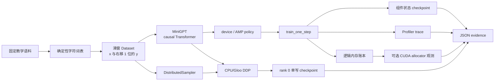

这个项目用 **1 个 16 维、1 层的字符级 causal Transformer** 收束第 4 章：固定语料经过确定性词表和滑窗数据集，CPU 用 2 次更新完成 correctness smoke，再验证组件状态 checkpoint 往返、计划采样 Profiler、五类内存账本和 2 进程 Gloo DDP。所有输出都是当前运行的正确性或资源观测，**没有速度阈值，也不要求 loss 比起点下降多少**。

<!-- more -->

## 📑 目录

- [本节定位](#本节定位)
- [1. 项目交付物与工程拆分](#1-项目交付物与工程拆分)
- [2. 数据怎样变成 causal language modeling 任务](#2-数据怎样变成-causal-language-modeling-任务)
- [3. 模型与训练预算怎样冻结](#3-模型与训练预算怎样冻结)
- [4. 训练、AMP 与更新边界怎样连接](#4-训练amp-与更新边界怎样连接)
- [5. Checkpoint 怎样证明真的能继续](#5-checkpoint-怎样证明真的能继续)
- [6. Profiler 与内存账本各输出什么](#6-profiler-与内存账本各输出什么)
- [7. 两进程 DDP 怎样复用同一项目路径](#7-两进程-ddp-怎样复用同一项目路径)
- [8. 怎样运行并验收全部证据](#8-怎样运行并验收全部证据)
- [9. 常见错误与诊断](#9-常见错误与诊断)
- [10. 权衡、边界与后续去向](#10-权衡边界与后续去向)
- [总结](#-总结)
- [自我检验清单](#-自我检验清单)
- [参考资料](#-参考资料)

---

## 本节定位

**前置知识**：至少完成 [4.4 DataLoader 数据流水线](/AIInfraGuide/prerequisites/模块一-前置知识/pytorch/44-dataloader数据流水线/)、[4.5 训练循环工程](/AIInfraGuide/prerequisites/模块一-前置知识/pytorch/45-训练循环工程/)、[4.7 显存管理](/AIInfraGuide/prerequisites/模块一-前置知识/pytorch/47-显存管理/)、[4.8 Benchmark 与 Profiler](/AIInfraGuide/prerequisites/模块一-前置知识/pytorch/48-benchmark与profiler/)与 [4.11 分布式 PyTorch 导论](/AIInfraGuide/prerequisites/模块一-前置知识/pytorch/411-分布式pytorch导论/)。如果只想先跑单进程 CPU smoke，可以把 4.11 留到 DDP 命令前阅读。

**学习成果**：完成后，你能把固定文本编码成一位 target shift 的训练样本；能实现并测试 causal mask；能让同一训练函数在 CPU FP32 与 CUDA autocast + GradScaler 之间选择；能保存模型、优化器、scaler、配置、step、RNG 与词表并继续更新；能导出带业务标记的 trace；能解释逻辑内存与 CUDA allocator 观测的差异；能运行两进程 CPU/Gloo DDP 并验证分片、参数、单写和清理。

**够用边界**：MiniGPT 是课程验收器，不是可用语言模型。固定语料不代表真实数据分布，小模型不代表大模型性能，Gloo 不代表 NCCL，CPU trace 不代表 GPU 时间线。项目不下载外部模型、不新增依赖、不报告吞吐或加速比。

## 1. 项目交付物与工程拆分

### 1.1 为什么综合项目不能只是一个更长的训练脚本？

想象一次设备交付：能通电只是第一关，还要有装配清单、断电恢复记录、仪表读数和多工位协作验收。**综合项目的价值不在代码行数，而在同一组接口能否留下互相校验的证据。**

本节只新增三个文件：

```text
docs/guides/模块一-前置知识/pytorch/4.12-MiniGPT综合项目.md
examples/pytorch/minigpt_project.py
examples/pytorch/tests/test_minigpt_project.py
```

脚本按下面的工程边界拆分：



### 1.2 哪个接口应回查哪一节？

本节不机械复述前文原理。遇到设计问题时，按决策表回到对应接口：

| 现在要作的决定 | 项目接口 | 验收证据 | 原理回查 |
|---|---|---|---|
| 一个字符样本怎样产生 | `CharacterVocabulary`、`SlidingWindowDataset` | `inputs[1:] == targets[:-1]` | [4.4](/AIInfraGuide/prerequisites/模块一-前置知识/pytorch/44-dataloader数据流水线/) |
| 一次更新何时完成 | `train_one_step` | finite loss、至少一个参数变化 | [4.5](/AIInfraGuide/prerequisites/模块一-前置知识/pytorch/45-训练循环工程/) |
| CPU/CUDA 用什么精度 | `make_amp_policy` | CPU 明确 FP32；CUDA 才启用 autocast/scaler | [4.5](/AIInfraGuide/prerequisites/模块一-前置知识/pytorch/45-训练循环工程/) |
| 中断后需要保存什么 | `save_checkpoint`、`load_checkpoint` | 字段完整、模型精确往返、RNG 重放、继续 1 步 | [4.5](/AIInfraGuide/prerequisites/模块一-前置知识/pytorch/45-训练循环工程/) |
| 资源是谁占的 | `memory_report` | 五类逻辑字节与 CUDA current/peak schema | [4.7](/AIInfraGuide/prerequisites/模块一-前置知识/pytorch/47-显存管理/) |
| 时间线在哪里 | `run_profiler` | schedule、`record_function`、可解析 trace | [4.8](/AIInfraGuide/prerequisites/模块一-前置知识/pytorch/48-benchmark与profiler/) |
| 是否进入编译路径 | 本项目默认不 compile | 没有伪造 compile 收益 | [4.10](/AIInfraGuide/prerequisites/模块一-前置知识/pytorch/410-执行与编译链路/) |
| 数据和副作用怎样按 rank 收口 | `run_ddp_smoke` | `set_epoch`、参数一致、rank 0 单写、cleanup | [4.11](/AIInfraGuide/prerequisites/模块一-前置知识/pytorch/411-分布式pytorch导论/) |

📌 **关键点**：4.12 只负责把接口接起来并交付证据。看不懂接口契约时回到对应 4.x；不要在项目文档里复制另一篇原理文章。

## 2. 数据怎样变成 causal language modeling 任务

### 2.1 为什么词表必须和 checkpoint 一起冻结？

同一个字符若今天编码为 7、明天编码为 11，模型参数即使逐字节恢复，embedding 的语义也已经改变。**词表是模型输入协议，不是可以从“差不多相同”的文本临时猜回来的附属品。**

项目不下载数据。`TEACHING_CORPUS` 是脚本内置的固定英文教学语料；词表使用 `sorted(set(text))` 按 Unicode code point 排序，因此同一文本得到同一字符顺序。checkpoint 保存完整字符列表，恢复时要求与当前项目词表精确相等。

这项选择牺牲真实语言覆盖，换取三个教学收益：

- 没有账号、网络和 tokenizer 依赖；
- 每个 token 都能直接映射回字符；
- 数据错误可以用确定性断言定位，而不是藏在外部预处理器里。

### 2.2 target shift 为什么必须单独测试？

给 token 序列

$$
[t_0,t_1,t_2,t_3,t_4]
$$

若 `block_size=4`，一条样本应为：

$$
\underbrace{x=[t_0,t_1,t_2,t_3]}_{\text{模型输入}}
\quad\rightarrow\quad
\underbrace{y=[t_1,t_2,t_3,t_4]}_{\text{每个位置预测下一个字符}}
$$

也就是 `x[1:] == y[:-1]`。**少移一位会让模型复制当前字符，多移一位则改变预测任务；两种错误都可能产生 finite loss，所以不能只靠“训练没报错”验收。**

`SlidingWindowDataset` 的窗口数量为：

$$
\underbrace{N_{window}}_{\text{可用窗口数}}
=
\underbrace{N_{token}}_{\text{语料 token 数}}
-
\underbrace{T}_{\text{block size}}
$$

索引 `i` 返回 `token[i:i+T]` 和 `token[i+1:i+T+1]`。测试同时核对 dtype、shape、右移关系和解码后的原文片段。

## 3. 模型与训练预算怎样冻结

### 3.1 这个 MiniGPT 为什么足够小？

问题是：综合项目是不是模型越大越像真实 GPT？**不是；这里要验证训练系统，而不是用参数量制造等待。** 默认 `Config` 冻结以下预算：

| 配置 | 默认值 | 验收作用 |
|---|---:|---|
| `block_size` | 8 | 让 causal mask 可人工检查 |
| `batch_size` | 4 | CPU 一次更新保持轻量 |
| `d_model` | 16 | 保留 embedding、attention、FFN 与 LM head |
| `n_heads` | 2 | 验证多头维度整除约束 |
| `n_layers` | 1 | 保留 decoder block，不堆深度 |
| `ff_multiplier` | 2 | FFN hidden dim 为 32 |
| `dropout` | 0 | 降低 smoke 的随机路径复杂度 |
| `smoke_steps` | 2 | 只验证有限 loss 和参数更新 |
| Profiler schedule | wait 1 / warmup 1 / active 1 / repeat 1 | 3 步产生一段短 trace |
| DDP 数据量 | 16 个窗口 | 2 个 rank 各得到 8 个、不需补齐 |

`Config.validate()` 会拒绝非法 head 维度、非正预算、非法 Profiler schedule 和不能被 2 个 rank 整除的 DDP 数据量。配置本身进入 checkpoint 与 JSON evidence，因此“改了模型还是改了训练预算”可以从文件中复盘。

### 3.2 causal mask 守住什么边界？

`MiniGPT` 使用 token embedding、position embedding、1 个 Pre-Norm block 和线性 LM head。注意力 mask 是上三角布尔矩阵：

$$
M_{ij}=
\begin{cases}
\text{False}, & j\le i\\
\text{True}, & j>i
\end{cases}
$$

`True` 位置表示当前 query 不可读取未来 key。对长度 4 的序列：

```text
F T T T
F F T T
F F F T
F F F F
```

测试既比较整张 mask，也要求 logits shape 为 `(batch, sequence, vocab_size)`。输入长度超过 `block_size` 会立即失败，不让 position embedding 越界后才给出难懂错误。

## 4. 训练、AMP 与更新边界怎样连接

### 4.1 device policy 为什么要先于 AMP policy？

**先确定设备，再决定 autocast/scaler；不能用“用户请求 AMP”绕过硬件事实。**

| 设备路径 | autocast | GradScaler | evidence 中的声明 |
|---|---|---|---|
| CPU | 关闭，float32 | disabled scaler，状态字典仍进入 checkpoint | `CPU correctness path explicitly disables autocast` |
| CUDA | `torch.autocast(device_type="cuda", dtype=torch.float16)` | `torch.amp.GradScaler("cuda")` | 当前运行启用 CUDA FP16 AMP |
| `--device cuda` 但 CUDA 不可用 | 不降级 | 不创建训练任务 | 明确失败，避免伪装成 GPU 验收 |
| `--device auto` | 按实际设备选择 | 跟随选择 | evidence 同时记录 requested 与 selected device |

CPU PyTorch 可以支持 BF16 autocast，但本项目为了稳定、广泛的 correctness smoke 明确选择 FP32。**这不是“CPU 没有 AMP”的事实判断，而是项目的降级契约。**

### 4.2 一次 step 的项目断言是什么？

`train_one_step` 只保留 [4.5](/AIInfraGuide/prerequisites/模块一-前置知识/pytorch/45-训练循环工程/) 已证明的更新顺序，并加入业务标记：

```text
optimizer.zero_grad(set_to_none=True)
→ record_function("minigpt.forward")
→ autocast（仅 CUDA）
→ cross_entropy
→ 断言 loss finite
→ scaler.scale(loss).backward()
→ scaler.unscale_(optimizer)
→ clip_grad_norm_(error_if_nonfinite=True)
→ scaler.step(optimizer)
→ scaler.update()
→ 断言至少一个参数发生变化
```

为什么不写“loss 必须下降 20%”？2～3 个小步、固定短语料和当前随机初始化不足以支持收敛结论。**项目只验证本次 loss 是有限数、反向没有非有限梯度、优化器确实改变参数；它不把偶然的 loss 方向变成课程门槛。**

## 5. Checkpoint 怎样证明真的能继续

### 5.1 “文件能 load”为什么还不算恢复？

打个比方：保存棋盘但不保存轮到谁走，棋子位置虽然正确，比赛仍无法从原处继续。**训练恢复必须同时恢复数值状态、进度状态和随机状态。**

项目 checkpoint 至少包含：

| 字段 | 内容 | 恢复时的断言 |
|---|---|---|
| `model` | `MiniGPT.state_dict()` | `strict=True`，全部 Tensor 精确相等 |
| `optimizer` | AdamW state | 下一次更新不丢动量状态 |
| `scaler` | GradScaler state；CPU disabled 路径为合法空状态 | CUDA FP16 的动态 scale 可继续 |
| `config` | 完整 `Config` 字典 | 与当前模型/预算精确相等 |
| `step` | 已完成 optimizer update 数 | 恢复后从该 step 继续计数 |
| `rng.python` | Python RNG state | 下一个 `random.random()` 重放 |
| `rng.torch_cpu` | CPU generator state | 下一个 `torch.rand()` 重放 |
| `rng.torch_cuda` | CUDA 训练时的各设备 RNG；CPU 路径为 `None` | 不伪造未使用设备状态 |
| `vocab` | 有序字符列表 | token ID 协议完全一致 |
| `schema_version` | checkpoint 格式版本 | 未知版本立即拒绝 |

保存先写同目录临时文件，`flush + fsync` 后 `os.replace` 正式路径。这只建立本地同文件系统的发布边界，不外推到对象存储或多节点分片 checkpoint。

### 5.2 resume 测试怎样避免“只检查字段名”？

CPU smoke 依次执行：

1. 训练 2 步并保存；
2. 在保存后的 RNG 状态上生成一组 Python/PyTorch 随机数作为预期；
3. 构造新的模型、优化器和 scaler；
4. 加载 checkpoint，验证 step 为 2、模型 state 完全相等；
5. 再生成随机数，要求与第 2 步完全一致；
6. 用恢复对象继续训练 1 步，要求 finite loss 与参数更新。

📌 **关键点**：字段存在只证明格式像 checkpoint；模型精确往返、RNG 重放和继续更新三项一起通过，才证明这条教学路径能 resume。

## 6. Profiler 与内存账本各输出什么

### 6.1 Profiler 为什么不承担 benchmark？

`run_profiler` 使用：

```python
torch.profiler.schedule(wait=1, warmup=1, active=1, repeat=1)
```

循环每步调用 `profiler.step()`，并用以下 marker 把算子时间线接回训练语义：

- `minigpt.train_step`
- `minigpt.forward`
- `minigpt.backward`
- `minigpt.optimizer`

active 周期结束后导出 Chrome trace。测试解析 JSON，要求 `traceEvents` 非空且包含 `minigpt.train_step`；**不读取某个算子的耗时来设置速度门槛**。CPU 路径只采 CPU activity；只有实际选择 CUDA 时才加入 CUDA activity。

这项选择用 instrumentation 开销换定位证据。需要比较实现快慢时，回到 [4.8](/AIInfraGuide/prerequisites/模块一-前置知识/pytorch/48-benchmark与profiler/) 的 correctness、预热、重复分布和控制变量协议，而不是拿一次 trace 充当 benchmark。

### 6.2 逻辑内存与 allocator 观测怎样并列？

项目报告五类逻辑字节：

$$
M_{logical}
=
M_{parameter}
+M_{gradient}
+M_{optimizer}
+\widehat{M}_{activation}
+\widehat{M}_{temporary}
$$

- 参数、梯度、optimizer state：遍历当前真实 Tensor，用 `numel × element_size` 计数；
- 激活：按固定 batch、sequence、hidden、层数与 logits 给出**教学估算**，字段明确 `is_estimate: true`；
- 临时 buffer：只估算布尔 causal mask，不冒充 backend workspace；
- CUDA：仅实际选择 CUDA 时读取 `allocated/reserved/peak allocated/peak reserved`；
- CPU：即使机器有 GPU，也写 `measured: false` 和 `GPU memory behavior was not measured`。

| 证据 | 回答什么 | 不能回答什么 |
|---|---|---|
| 参数/梯度/optimizer 逻辑字节 | 当前显式状态 Tensor 多大 | allocator 对齐、cache 和外部库 |
| activation estimate | 固定公式下的容量量级 | Autograd 实际保存集合与 backend workspace |
| allocated/reserved | PyTorch CUDA allocator 当前状态 | NCCL、其他进程与全部驱动用量 |
| peak | 当前统计窗口最高水位 | 未运行工作负载的未来峰值 |

📌 **关键点**：估算字段必须叫估算，CPU 未测必须叫未测。资源账本的目标是解释差额，不是把一个公式伪装成 GPU 实测。

## 7. 两进程 DDP 怎样复用同一项目路径

### 7.1 单机入口为什么选择 CPU/Gloo？

本项目要在没有 GPU 的环境仍能证明 rank、sampler、梯度同步和副作用边界，所以 `run_ddp_smoke` 使用 `torch.multiprocessing.spawn` 启动 2 个进程，以临时 `file://` store 建立 Gloo process group。**这条路径验证分布式语义，不验证 NCCL 性能。**

每个 worker 复用同一份：

- `Config` 与确定性词表；
- 16 个窗口组成的 `Subset`；
- `MiniGPT`、AdamW、disabled scaler；
- `train_one_step`；
- 组件状态 `save_checkpoint`。

### 7.2 sampler、同步和单写怎样串起来？

```text
DistributedSampler(world_size=2, rank=rank, shuffle=True)
→ sampler.set_epoch(0)
→ 每个 rank 取得 8 个索引
→ DDP 构造时对齐模型状态
→ 各 rank 用不同数据 forward/backward
→ DDP 同步梯度
→ 两边 optimizer.step()
→ all_gather 参数并要求 max_diff == 0
→ 仅 rank 0 写组件状态 checkpoint
→ barrier 保护“所有 rank 检查同一文件”的真实依赖
→ finally destroy_process_group()
```

父进程最后验收：

- 两个索引集合交集为空；
- 合集恰好为 `0..15`；
- `sampler_epoch == 0`，证明调用过 `set_epoch`；
- 参数最大绝对差为 0；
- 目录只有 `minigpt_ddp_checkpoint.pt` 一份；
- checkpoint 仍包含 model/optimizer/scaler/config/step/RNG/vocab；
- 两个 rank 报告 process group 已销毁。

这里选择 16 个窗口，是为了让 2 个 rank 严格整除，避免 `DistributedSampler(drop_last=False)` 补索引改变“不重不漏”的判定。真实数据不能整除时，必须重新声明补齐或丢弃策略，不能照搬这个断言。

## 8. 怎样运行并验收全部证据

### 8.1 CPU 串行项目怎样运行？

从仓库根目录执行：

```bash
python3 examples/pytorch/minigpt_project.py smoke \
  --device cpu \
  --output-dir /tmp/aiinfraguide-pytorch-4.12
```

产物包括：

```text
/tmp/aiinfraguide-pytorch-4.12/
├── minigpt_checkpoint.pt
├── minigpt_evidence.json
└── minigpt_trace.json
```

完成标志：

```text
all MiniGPT project checks passed; no performance threshold was used
```

重点检查 `minigpt_evidence.json`：

- `training.all_losses_finite == true`；
- `training.all_steps_updated_parameters == true`；
- `checkpoint.restored_step == 2`；
- `checkpoint.resumed_to_step == 3`；
- `checkpoint.rng_restored == true`；
- `profiler.performance_measured == false`；
- `memory.cuda.measured == false`；
- `unmeasured` 明确列出 CUDA AMP、GPU memory/activity/performance。

### 8.2 DDP 与测试怎样运行？

```bash
python3 examples/pytorch/minigpt_project.py ddp \
  --device cpu \
  --output-dir /tmp/aiinfraguide-pytorch-4.12-ddp

python3 -m unittest \
  examples/pytorch/tests/test_minigpt_project.py -v

python3 -m compileall \
  examples/pytorch/minigpt_project.py \
  examples/pytorch/tests/test_minigpt_project.py
```

Gloo evidence 位于：

```text
/tmp/aiinfraguide-pytorch-4.12-ddp/
├── minigpt_ddp_checkpoint.pt
├── minigpt_ddp_evidence.json
├── rank_0_minigpt_report.json
└── rank_1_minigpt_report.json
```

若当前 PyTorch 没有 `torch.distributed` 或 Gloo，脚本输出明确 `SKIP`，集成测试也清晰 skip。若 backend 存在但进程启动、loopback 或临时文件失败，则测试失败而不是假装通过。

### 8.3 七个测试覆盖了什么？

| 测试 | 判定线 |
|---|---|
| 词表与 target shift | 词表排序稳定，`x[1:] == y[:-1]` |
| causal mask/shape | 严格上三角为 True，logits 三维 shape 正确 |
| CPU step | loss finite，至少一个参数更新 |
| checkpoint resume | 8 类字段完整、模型精确相等、RNG 重放、继续更新 |
| Profiler | trace 可解析、事件非空、包含项目 marker |
| 内存报告 | 五类逻辑 schema 完整，激活标估算，CPU 明确 GPU 未测 |
| Gloo 集成 | 分片不重不漏、参数一致、rank 0 单写、两个 rank cleanup |

这些测试不下载模型，不训练大网络，不设置速度和 loss 改善阈值。

## 9. 常见错误与诊断

### 9.1 出错时先沿哪条证据链排查？

| 症状 | 首个检查 | 最小动作 |
|---|---|---|
| loss finite 但任务学成复制当前字符 | `inputs[1:] == targets[:-1]` | 回到 `SlidingWindowDataset` 修正 target shift |
| attention 看到了未来 token | causal mask 的 diagonal 与上三角 | 运行 mask 单测，不靠训练 loss 猜 |
| CPU smoke 出现 autocast/scaler enabled | `make_amp_policy(cpu)` | 恢复明确 FP32 降级，不把 CPU BF16 当默认 |
| CUDA 下裁剪值异常 | 是否先 `scaler.unscale_` | unscale 后再 `clip_grad_norm_` |
| checkpoint 能读但恢复后分叉 | optimizer/scaler/RNG/config/vocab 是否缺失 | 检查完整字段、模型精确往返与 RNG 重放 |
| checkpoint 偶发半文件 | 是否直接覆盖正式路径 | 同目录临时写、fsync、原子替换 |
| trace 文件存在但没有项目阶段 | 是否调用 `profiler.step()`、active 窗口是否覆盖 marker | 解析 `traceEvents` 并检查 `minigpt.train_step` |
| CPU 报告出现 GPU 峰值数字 | selected device 是否真为 CUDA | CPU 模式保留 `None + measured:false` |
| 两个 rank 训练相同窗口 | 是否遗漏 `DistributedSampler` | 显式传 rank/world size，核对索引交并集 |
| 每轮分片顺序不变 | 是否在 iterator 前 `set_epoch(epoch)` | 把调用放到 epoch 边界 |
| DDP 参数不一致 | 是否所有 rank 执行兼容 backward/step | 打印 rank 阶段，缩到一次更新和同一 optimizer |
| checkpoint 有两份或竞争 | 是否每个 rank 都写文件 | 只允许 rank 0 写，必要依赖后再 barrier |
| 进程退出后仍初始化 | cleanup 是否只在正常路径 | 放进 `finally` 并写 rank 报告 |
| Gloo 通过后声称 GPU 扩展效率 | evidence 是否明确 performance false | 把 CUDA/NCCL 与多机保留为未实测 |

📌 **关键点**：先判断错误属于数据、模型因果性、更新状态、观测 schema 还是 rank 协作，再回到对应 4.x。不要用“多跑几步”掩盖契约错误。

## 10. 权衡、边界与后续去向

### 10.1 每项选择牺牲了什么？

| 选择 | 换取什么 | 牺牲什么 / 风险 | 采用边界 |
|---|---|---|---|
| 内置固定字符语料 | 离线、确定、无 tokenizer 依赖 | 语言覆盖和真实数据复杂度 | 只用于系统 correctness smoke |
| 极小 Transformer | 测试快、shape 易审计 | 不代表真实模型数值与性能 | 只验证接口连接 |
| CPU FP32 降级 | 广泛可运行、数值路径简单 | 不验证 CUDA AMP | 有 CUDA 后单独跑 `--device cuda` |
| 组件状态 checkpoint | 模型/优化器/scaler/配置/step/RNG/词表可往返 | 不含 DataLoader 游标，恢复方必须在声明的安全 batch 边界重新定位数据 | 教学 smoke 与组件状态交付；精确数据轨迹恢复回查 4.5 |
| Profiler schedule | 短窗口 trace | instrumentation 开销 | 定位阶段，不作 benchmark |
| 逻辑内存估算 | 无 GPU 也能检查状态分类 | 不是 allocator 实测 | 必须保留 `is_estimate` |
| 2 进程 Gloo | 无 GPU 也能验证 DDP 语义 | 不代表 NCCL/多机性能 | 分布式入口正确性 |
| rank 0 单写 | 避免 DDP 文件竞争 | 只保存 rank 0 组件状态，不代表每 rank RNG/采样游标完整恢复 | 本节单机 DDP 入口；分片 checkpoint 进入模块三 |

### 10.2 编译、DDP 与 FSDP 为什么不继续深入？

- `torch.compile`：本项目没有打开编译器，也不声称编译收益。先回 [4.10](/AIInfraGuide/prerequisites/模块一-前置知识/pytorch/410-执行与编译链路/)验证 eager/compile 数值与梯度；Graph Break、Inductor 和生成代码进入[模块二 7.2](/AIInfraGuide/cuda/模块二-cuda编程与算子优化/72-torchcompile原理与graphbreak/)。
- CUDA Kernel 与 Profiler 下钻：本节只留 PyTorch trace 和 allocator 接口。Triton/CUDA、Nsight Systems/Compute 与算子性能进入[模块二 CUDA 编程与算子优化](/AIInfraGuide/cuda/)。
- DDP：本项目只做一次 CPU/Gloo 同步。bucket、通信计算重叠、NCCL、多机拓扑和规模化实验进入[模块三数据并行](/AIInfraGuide/distributed/模块三-分布式训练/第4章-数据并行/)。
- FSDP/ZeRO：本项目不切参数、梯度和 optimizer state，也不使用分片 checkpoint。FSDP 与 ZeRO 的显存—通信权衡进入[模块三分布式训练](/AIInfraGuide/distributed/)与[ZeRO 系列](/AIInfraGuide/distributed/模块三-分布式训练/第5章-zero系列/)。

分工：**4.12 证明“小训练系统可运行、可恢复、可观测、可进入单机分布式”；模块二负责把计算做深，模块三负责把训练做大。**

## 📝 总结

1. **数据契约**：固定语料生成排序词表，滑窗 target 永远右移 1 位；词表与配置都进入 checkpoint。
2. **模型预算**：16 维、2 头、1 层 causal Transformer 保留完整执行结构，又把 CPU smoke 控制在小工作量。
3. **训练正确性**：CPU 固定 FP32，CUDA 才启用 autocast + GradScaler；每步只断言 finite loss 与参数更新，不伪造收敛阈值。
4. **恢复闭环**：model、optimizer、scaler、config、step、RNG、vocab 和 schema 一起保存，并用精确往返、RNG 重放与继续更新验收。
5. **观测闭环**：计划采样 Profiler 导出带业务 marker 的 trace；五类内存账本区分真实 Tensor 字节、估算和 CUDA allocator 实测。
6. **分布式入口**：2 个 Gloo rank 用 `DistributedSampler + set_epoch` 分 16 个窗口，参数精确一致，只有 rank 0 写组件状态 checkpoint，两个 rank 都 cleanup。
7. **诚实边界**：所有数值只描述当前运行正确性或资源观测；没有速度、扩展效率和 loss 改善承诺，CPU 运行明确列出 GPU 未测项。

## 🎯 自我检验清单

- 能画出固定语料 → 词表 → 滑窗 Dataset → MiniGPT → step → checkpoint/trace/memory/DDP 的完整数据流
- 能验证确定性词表，并构造长度 8 的窗口证明 target 正好右移 1 个字符
- 能写出严格上三角 causal mask、推导 logits shape，并让超长输入明确失败
- 能运行 CPU 更新，验证 loss 与梯度 norm 有限且至少一个 Parameter 改变
- 能根据 CPU/CUDA 选择 FP32 降级或 autocast + GradScaler，并在 JSON 中定位策略证据
- 能列出 checkpoint 的 8 类组件状态，验证模型往返、RNG 重放与继续更新，并说明 DataLoader 游标不在本项目快照内
- 能配置单周期 Profiler schedule，执行 3 次 `profiler.step()` 并在 trace 找到 `minigpt.train_step`
- 能输出参数、梯度、optimizer、activation estimate、temporary estimate 五类账本，并区分估算与 allocator 实测
- 能在 CPU 模式保持 CUDA current/peak 为 `None` 与 `measured=false`，在 CUDA 模式读取当前和峰值计数
- 能运行 2 进程 Gloo smoke，证明两个 rank 的索引交集为空、并集完整且调用过 `set_epoch`
- 能验证 DDP 参数一致、只有 rank 0 写一份组件状态 checkpoint，且两个 rank 都留下 cleanup 证据
- 能解释为何没有速度或 loss 改善阈值，并把 NCCL、多机、Inductor 性能、FSDP 与真实模型规模列为未实测和后续课程边界

## 📚 参考资料

### PyTorch 官方文档

- [Automatic Mixed Precision](https://docs.pytorch.org/docs/stable/amp.html)：`torch.autocast`、`torch.amp.GradScaler`、scale/unscale/step/update 的当前统一入口；项目据此实现 CUDA FP16 路径。
- [Automatic Mixed Precision examples](https://docs.pytorch.org/docs/stable/notes/amp_examples.html)：裁剪前 `unscale_`、梯度累积与多 optimizer 的官方组合方式。
- [Serialization semantics](https://docs.pytorch.org/docs/stable/notes/serialization.html)：`torch.save`/`torch.load`、`state_dict` 与 `weights_only=True` 的当前语义和安全边界。
- [Saving and Loading Models](https://docs.pytorch.org/tutorials/beginner/saving_loading_models.html)：模型、优化器和通用训练 checkpoint 的官方保存/恢复模式。
- [Reproducibility](https://docs.pytorch.org/docs/stable/notes/randomness.html)：seed、RNG 与跨版本/平台不保证完全复现的边界。
- [`torch.profiler`](https://docs.pytorch.org/docs/stable/profiler.html)：activities、schedule、`on_trace_ready`、`record_function` 与 Chrome trace 的事实源。
- [`torch.profiler.schedule`](https://docs.pytorch.org/docs/stable/generated/torch.profiler.schedule.html)：wait、warmup、active、repeat 和 `profiler.step()` 驱动的采集周期。
- [CUDA memory management](https://docs.pytorch.org/docs/stable/notes/cuda.html#cuda-memory-management)：allocated、reserved、peak 与 caching allocator 的边界；项目只在实际 CUDA 运行时采集。
- [`DistributedDataParallel`](https://docs.pytorch.org/docs/stable/generated/torch.nn.parallel.DistributedDataParallel.html)：DDP 同步梯度但不自动切输入、每进程模型副本与设备边界。
- [`DistributedSampler`](https://docs.pytorch.org/docs/stable/data.html#torch.utils.data.distributed.DistributedSampler)：rank 分片、尾部策略和每轮在 iterator 前调用 `set_epoch()` 的要求。
- [`torch.distributed`](https://docs.pytorch.org/docs/stable/distributed.html)：Gloo process group、collective 与 `destroy_process_group()` 的统一入口。
- [Getting Started with Distributed Data Parallel](https://docs.pytorch.org/tutorials/intermediate/ddp_tutorial.html)：单机多进程 DDP 的官方最小流程。

### 站内接口

- [第 4 章：PyTorch 框架](/AIInfraGuide/prerequisites/模块一-前置知识/第4章-pytorch框架/)：确认本项目在全章中的依赖与验收位置。
- [4.5 训练循环工程](/AIInfraGuide/prerequisites/模块一-前置知识/pytorch/45-训练循环工程/)：完整 checkpoint、RNG、AMP 与更新边界。
- [4.8 Benchmark 与 Profiler](/AIInfraGuide/prerequisites/模块一-前置知识/pytorch/48-benchmark与profiler/)：correctness-first 测量与 trace 纪律。
- [4.11 分布式 PyTorch 导论](/AIInfraGuide/prerequisites/模块一-前置知识/pytorch/411-分布式pytorch导论/)：rank、Gloo/DDP、Sampler、单写与 cleanup 心智模型。
