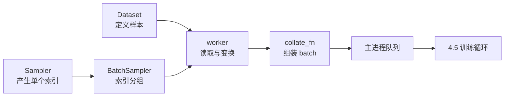

`DataLoader` 不是“给 Dataset 加一个 batch_size”这么简单：若 `num_workers=4`、`prefetch_factor=2`，官方定义的预取上限就是 **每个 worker 预取 2 个 batch，合计 8 个 batch**。这不保证训练更快，却说明一个关键事实：**数据流水线用额外进程、队列与主机内存换取计算和取数重叠，任何提速都必须在数据不重不漏的前提下实测。** 4.3 已经确定模型拥有什么状态，本节则把样本稳定地组装成 batch，交给 4.5 的训练循环。

<!-- more -->

## 📑 目录

- [本节定位](#本节定位)
- [1. DataLoader 到底调度了什么](#1-dataloader-到底调度了什么)
- [2. map-style 与 iterable-style Dataset 怎样选](#2-map-style-与-iterable-style-dataset-怎样选)
- [3. Sampler、BatchSampler 与 collate_fn 怎样分工](#3-samplerbatchsampler-与-collate_fn-怎样分工)
- [4. worker 进程怎样复制数据集并管理随机性](#4-worker-进程怎样复制数据集并管理随机性)
- [5. num_workers、预取和常驻 worker 怎样调](#5-num_workers预取和常驻-worker-怎样调)
- [6. pin_memory 与 non_blocking 何时才可能重叠](#6-pin_memory-与-non_blocking-何时才可能重叠)
- [7. 怎样先证明数据正确再测吞吐](#7-怎样先证明数据正确再测吞吐)
- [8. 跑通完整 CPU 示例](#8-跑通完整-cpu-示例)
- [9. 常见错误与诊断](#9-常见错误与诊断)
- [10. 权衡、边界与后续接口](#10-权衡边界与后续接口)
- [总结](#-总结)
- [自我检验清单](#-自我检验清单)
- [参考资料](#-参考资料)

---

## 本节定位

**前置知识**：完成 [4.0 PyTorch 框架快速入门](/AIInfraGuide/prerequisites/模块一-前置知识/pyroch/pytorch框架入门/) 与 [4.3 Module 与状态管理](/AIInfraGuide/prerequisites/模块一-前置知识/pytorch/43-module与状态管理/)，会创建 CPU Tensor，知道 `Module` 管理模型状态。运行本节代码不需要数据集下载，也不需要 CUDA。

**学习成果**：读完后，你能在 map-style 与 iterable-style Dataset 之间选择；能解释 Sampler、BatchSampler 和 `collate_fn` 的边界；能正确切分 worker 副本、设置随机种子；能调节 worker、预取、常驻进程、页锁定内存和搬运策略；能先用样本 ID、batch 形状与失败断言证明正确，再用固定口径观察吞吐。

**够用边界**：本节把“一个 batch 怎样到达训练循环”讲清，不实现完整 optimizer/checkpoint，不深入 CUDA stream，不设计对象存储、流式 checkpoint、数据湖或集群级数据服务。`DistributedSampler` 只建立单机多进程训练前的入口心智模型，完整 DDP 数据切分留给模块三。

## 1. DataLoader 到底调度了什么

### 1.1 为什么 Dataset 不等于 DataLoader？

打个比方：Dataset 是仓库货架，回答“一件货放在哪里、怎么取”；Sampler 是拣货单，决定取哪些编号；BatchSampler 把拣货单按车次分组；`collate_fn` 则在装车区把大小不同的货物垫齐、贴标签。worker 是并行拣货员，主进程最终接收装好的 batch。

**DataLoader 是这些策略的调度器，不拥有模型，也不替你定义样本语义。** 对 map-style Dataset，自动 batching 的主干可近似写成下面的简化示意：

```python
# 简化示意，不是 DataLoader 逐字源码
for indices in batch_sampler:                 # 主进程决定索引顺序
    samples = [dataset[index] for index in indices]
    yield collate_fn(samples)                  # 自动 batching 时组装 batch
```

开启多进程后，map-style 的索引仍由主进程 sampler 产生，再发给 worker；worker 执行 Dataset 读取、变换与 `collate_fn`，结果经进程间队列返回。这个边界很重要：**换 sampler 可以改变顺序，却不会改变“一个样本是什么”；换 collate 可以改变 batch 结构，却不应偷偷决定采样顺序。**



### 1.2 单进程为什么仍然值得保留？

问题是：既然多 worker 能并行，`num_workers=0` 是否永远落后？**单进程路径换不来预取并行，却有更清楚的报错栈、更少的进程通信和更简单的调试环境。** 小数据、已在内存中的 Tensor、变换很轻或正在定位异常时，它可能更合适。是否更快只能在目标工作负载上测，不能从 worker 数量直接下结论。

## 2. map-style 与 iterable-style Dataset 怎样选

### 2.1 有稳定键时为什么优先 map-style？

**map-style Dataset 实现 `__getitem__` 与 `__len__`，表达“键到样本”的映射。** 图片目录、固定 token 文件、可随机访问的训练样本通常属于这一类；整数索引最常见，但官方定义允许非整数键，此时需要自定义 sampler 提供这些键。

```python
from torch.utils.data import Dataset


class MapSequenceDataset(Dataset):
    def __init__(self, sequences):
        self.sequences = sequences

    def __len__(self):
        return len(self.sequences)

    def __getitem__(self, index):
        return {"id": index, "tokens": self.sequences[index]}
```

它的优势是长度、随机访问、shuffle 和 sampler 组合都清晰；代价是数据源必须能回答“第 `index` 个样本是什么”。

### 2.2 没有稳定随机访问时怎么办？

日志流、远端消息、压缩归档顺序扫描或动态生成数据更像水管：只能从当前水流继续接，无法廉价跳到第 508 条。**iterable-style Dataset 实现 `__iter__`，用顺序产出能力换掉随机索引假设。** 因为没有键的概念，官方文档明确指出它不能配 `sampler` 或 `batch_sampler`。

```python
from torch.utils.data import IterableDataset, get_worker_info


class ShardedRangeDataset(IterableDataset):
    def __iter__(self):
        worker = get_worker_info()
        if worker is None:
            yield from range(12)
        else:
            # 每个 worker 只读自己的步进分片，避免复制后的数据集重复产出。
            yield from range(worker.id, 12, worker.num_workers)
```

多进程时，每个 worker 拿到一份 Dataset 副本。若 `__iter__` 不读取 `get_worker_info()` 做分片，两个 worker 都会从头产出 `0..11`，最终得到 24 条而不是 12 条。

⚠️ **注意**：对多 worker 的 iterable-style Dataset，`drop_last=True` 丢弃的是**每个 worker 副本**末尾的不完整 batch，不一定只丢全局最后一批。`len(dataloader)` 对这种数据源也只是基于 `len(dataset)/batch_size` 的估计，PyTorch 无法从外部识别你的分片是否产生多个残批。正确性检查必须数真实样本 ID，不能只信 `len(loader)`。

| 判断问题 | map-style | iterable-style |
|---|---|---|
| 能否廉价按键随机访问 | 能 | 不能或不自然 |
| 采样顺序由谁控制 | Sampler | Dataset 的迭代逻辑 |
| 多 worker 切分 | 主进程分发索引 | 每个副本必须显式分片 |
| 常见风险 | 错误 sampler、键越界 | 重复、遗漏、无法可靠估长 |

📌 **关键点**：不要因为名字里有“streaming”就自动选 IterableDataset。只要数据源有稳定键并支持随机访问，map-style 往往更容易证明不重不漏。

## 3. Sampler、BatchSampler 与 collate_fn 怎样分工

### 3.1 三个接口为什么不能混成一个？

问题是：顺序、分组和 padding 都能“改变一个 batch”，为什么要拆开？**因为它们改变的是三个不同层次：Sampler 产单个键，BatchSampler 产一组键，`collate_fn` 把已取回的样本组成 Tensor 或自定义 batch。**

```python
from torch.utils.data import BatchSampler, DataLoader, Sampler


class OrderedSampler(Sampler):
    def __iter__(self):
        yield from [4, 2, 0, 3, 1]

    def __len__(self):
        return 5


batch_sampler = BatchSampler(OrderedSampler(), batch_size=2, drop_last=False)
loader = DataLoader(dataset, batch_sampler=batch_sampler, collate_fn=pad_collate)
# 索引组依次为 [4, 2]、[0, 3]、[1]
```

若设置 `drop_last=True`，最后的 `[1]` 被丢弃。对于 BatchNorm、静态 shape 或要求每个 rank 步数一致的训练，这种整齐 batch 可能值得；代价是训练样本被丢弃。评估集通常应保留尾批，否则指标分母会悄悄变化。

DataLoader 的参数还有两组互斥关系：

- 指定 `sampler` 后不能同时指定 `shuffle`；
- 指定 `batch_sampler` 后不能再指定 `batch_size`、`shuffle`、`sampler` 或 `drop_last`。

让配置立即报错比“猜 PyTorch 最后听谁的”更安全，本节测试会固定覆盖第一条失败路径。

### 3.2 `collate_fn` 为什么是数据契约边界？

变长 token 无法直接 `stack`。**`collate_fn` 应把“样本列表”转换成训练循环稳定消费的 batch，并保留恢复原语义所需的信息，例如真实长度、mask 和样本 ID。**

```python
def pad_collate(samples):
    if not samples:
        raise ValueError("pad_collate requires at least one sample")

    lengths = torch.tensor([sample["tokens"].numel() for sample in samples])
    tokens = torch.zeros(len(samples), int(lengths.max()), dtype=torch.long)
    for row, sample in enumerate(samples):
        tokens[row, : lengths[row]] = sample["tokens"]
    return {"tokens": tokens, "lengths": lengths}
```

完整示例返回 `PaddedBatch`，还实现了 `pin_memory()` 和 `.to(...)`，避免训练循环漏搬某个字段。失败路径会拒绝空 batch 和空的一维 token，而不是等模型内部出现难懂的 shape 错误。

**权衡**：在 collate 中 padding 换来规则 Tensor，却增加无效 token 和主机工作量；按长度分桶能减少 padding，但会改变样本顺序并增加 sampler 复杂度。是否值得必须记录 padding 比例和端到端吞吐，不能只看 batch shape 更整齐。

### 3.3 `DistributedSampler` 在哪里接入？

它仍是 Sampler：作用是让每个 rank 只看到 Dataset 的一个索引子集。下面只建立入口，不启动进程组：

```python
from torch.utils.data import DistributedSampler

sampler = DistributedSampler(
    dataset,
    num_replicas=world_size,
    rank=rank,
    shuffle=True,
)
for epoch in range(num_epochs):
    sampler.set_epoch(epoch)       # 必须在创建本 epoch 的 loader iterator 前调用
    for batch in DataLoader(dataset, sampler=sampler, shuffle=False):
        ...
```

官方文档要求 Dataset 大小保持不变、同一元素总按相同顺序返回；开启 shuffle 时，每个 epoch 要先 `set_epoch(epoch)`，否则各轮会使用相同顺序。数据不足以整除 rank 数时，sampler 的 `drop_last` 决定丢尾部还是补额外索引。DDP、进程组和全局 batch 语义在模块三展开，本节不复制。

## 4. worker 进程怎样复制数据集并管理随机性

### 4.1 `num_workers>0` 后谁被复制？

创建 DataLoader 迭代器时，PyTorch 会启动 worker，并把 Dataset、`collate_fn` 与 `worker_init_fn` 交给它们。**worker 拥有的是进程内副本，不是共享一个 Python Dataset 对象。** 这带来三条工程后果：

1. iterable-style Dataset 必须对副本分片；
2. worker 修改的普通 Python 状态不会自动回写主进程；
3. worker 访问父进程中的大量 Python 对象后，总 CPU 内存可能接近 `worker 数 × 父进程相关对象大小`。官方建议大规模元数据考虑 NumPy、Pandas、PyArrow 等非 refcount 表示，但具体方案仍要测 RSS。

Unix 常用 `fork()`，Windows/macOS 常用 `spawn()`。为兼容 spawn：

- 把 Dataset 类、`collate_fn` 和 `worker_init_fn` 定义在模块顶层；
- 用 `if __name__ == "__main__":` 包住创建进程的入口；
- 不把 lambda 或局部函数当作需要序列化的 worker 回调。

### 4.2 worker 的随机种子为什么还会重复？

官方规则是：每个 worker 的 PyTorch seed 为

$$
\underbrace{s_w}_{\text{worker 的 PyTorch seed}}
=
\underbrace{s_{base}}_{\text{主进程生成或 generator 提供}}
+
\underbrace{w}_{\text{worker id}}
$$

因此两个 worker 的 PyTorch seed 不同。但 Python `random`、NumPy 或某个解码库可能复制旧状态，必须在 `worker_init_fn` 中从 `get_worker_info().seed` 派生各自种子。

```python
import random
from torch.utils.data import get_worker_info


def seed_worker(worker_id):
    info = get_worker_info()
    assert info is not None and info.id == worker_id
    random.seed(info.seed)
```

完整示例给 DataLoader 传入固定 `torch.Generator().manual_seed(20260810)`，连续创建两次 loader，断言 8 条 `(index, worker_id, torch_seed, python_random)` 记录完全相同，同时两个 worker 的 seed 不同。

⚠️ **注意**：可复现不等于“所有 worker 用同一个种子”。目标是同一次配置可重放、不同 worker 不复制随机序列。若 Dataset 使用更多随机库，要在同一个入口逐一设置并测试。

## 5. num_workers、预取和常驻 worker 怎样调

### 5.1 为什么把 worker 拉满可能更慢？

**`num_workers` 用进程、内存和序列化成本换取并行读取/变换。** 当磁盘、网络、CPU 核或 IPC 已饱和，继续增加 worker 只会争抢资源；某些底层库自己还会开线程，可能形成“每个 worker 再开 N 个线程”的过度订阅。

推荐从可诊断基线开始：

1. `num_workers=0` 验证正确性与异常栈；
2. 依次试少量候选值，例如 `1/2/4`，每个值使用同一输入与 batch 数；
3. 同时记录 loader 等待、CPU 利用率、RSS、磁盘/网络吞吐和设备空闲；
4. 只有等待下降且资源代价可接受时才保留增加。

这些候选值不是性能承诺，只是实验点。最终值属于机器、数据格式、变换和训练计算共同决定的配置，不能从别人的 benchmark 复制。

### 5.2 `prefetch_factor` 实际计数什么？

它按**每个 worker 的 batch 数**计数，不是样本数。`num_workers>0` 时默认值为 2，因此理论在途预取量为：

$$
\underbrace{Q}_{\text{预取 batch 上限}}
=
\underbrace{W}_{\text{num_workers}}
\times
\underbrace{P}_{\text{prefetch_factor}}
$$

例如 $W=4,P=2$，上限为 8 个 batch。若每个 collated batch 占 64 MiB，仅 payload 粗算就是 $8\times64=512$ MiB；这还没包含 worker 副本、Python 对象、队列和临时解码内存。**预取用主机内存换取消费者暂时不等数据，队列已经够满时继续增加没有免费收益。**

`num_workers=0` 时没有 worker 预取，`prefetch_factor` 默认是 `None`；代码应只在多 worker 时设置它。

### 5.3 `persistent_workers=True` 解决什么？

默认每次 Dataset 消费完都会关闭 worker。常驻 worker 会在一个 epoch 结束后保留进程及其 Dataset 实例，下一轮不再重复启动。**它用持续占用进程和内存换取跨 epoch 复用。**

适合 epoch 很短、worker 启动或数据源初始化昂贵的场景；不适合只迭代一次、内存紧张或需要每轮重建 Dataset 状态的场景。开启后不要假设 `worker_init_fn` 每个 epoch 都会再运行；需要按 epoch 更新的状态应设计显式通信或放进 sampler/迭代协议，而不是藏在一次性初始化中。

## 6. pin_memory 与 non_blocking 何时才可能重叠

### 6.1 页锁定内存为什么不是独立加速开关？

普通 pageable 内存像可以被操作系统临时换走的座位，CUDA 在搬运前可能要先把数据放到稳定的中转区；pinned（page-locked）内存则不会被换页，DMA 可以直接使用。**`pin_memory=True` 让 DataLoader 返回的 Tensor 位于页锁定内存，但它只准备了传输条件，不证明端到端更快。**

默认 pinning 逻辑能识别 Tensor，以及包含 Tensor 的映射和可迭代结构。自定义 batch 类型要实现 `pin_memory()`：

```python
class PaddedBatch:
    def pin_memory(self):
        self.tokens = self.tokens.pin_memory()
        self.lengths = self.lengths.pin_memory()
        return self
```

页锁定内存是有限主机资源，过量使用会挤压系统；在 CPU-only 训练中，它也没有 H2D 目标。本节示例仅在实际请求 CUDA 且 `torch.cuda.is_available()` 为真时开启，否则明确保留 CPU batch 并打印“未测 pin/H2D 性能”。

### 6.2 `non_blocking=True` 到底承诺什么？

调用 `batch.to("cuda", non_blocking=True)` 时，主机可以继续提交后续工作。**它首先表达“主机不必在这次调用处等待”，不等于 H2D 已经和计算重叠，更不构成训练加速证明。**

本节只建立 DataLoader 的交接接口：`pin_memory` 负责准备页锁定 batch，训练循环再决定是否使用 non-blocking 搬运。非默认 stream、Event/wait、`record_stream`、源数据生命周期和正确计时统一留给 [4.6 CUDA 异步执行](/AIInfraGuide/prerequisites/模块一-前置知识/pytorch/46-cuda异步执行/)，避免在数据章节重复一套 CUDA 时间线。

```python
batch = batch.to(device, non_blocking=(device.type == "cuda"))
```

⚠️ **注意**：仅凭 `pin_memory=True` 和 `non_blocking=True` 不能写性能结论。先验证 batch 正确，再到 4.6 用 stream 与 Event 证明依赖，最后按 4.8 的 benchmark 口径测量。

## 7. 怎样先证明数据正确再测吞吐

### 7.1 数据流水线先验收什么？

GPU 很忙也可能是在重复训练错误数据。**先检查身份、数量、顺序、形状、dtype、尾批和随机性，再谈每秒样本数。** 最小正确性账本包括：

- 样本 ID 集合是否与预期一致；
- 是否重复、遗漏或越界；
- 每个 batch 的 token、length、mask、label 是否对应；
- map/iterable 多 worker 下是否仍满足分片契约；
- `drop_last` 实际丢了多少样本；
- 固定 generator 后能否重放，worker 间随机序列是否不同；
- 故意冲突的 sampler 配置、空样本或坏 shape 是否明确失败。

本节测试用 `0..16` 共 17 个 ID 验证两个 iterable worker 的结果排序后仍恰好是 `0..16`，且集合大小也是 17。两个条件同时成立，才能排除“总数相同但某条重复、另一条遗漏”。

### 7.2 吞吐怎样测才可比较？

问题是：运行一遍 `time.time()` 得到一个数字能否用于选型？**不能；数据加载测量必须固定工作量、区分冷启动与稳态，并把同步边界和环境写清。**

一次可复现对照至少记录：

1. PyTorch/Python 版本、CPU 核数、内存、存储/网络、数据位置；
2. Dataset、变换、样本大小分布、batch size、`drop_last`；
3. `num_workers`、`prefetch_factor`、`persistent_workers`、pin 策略；
4. 冷启动是否计入，预热多少 batch，正式测多少 batch；
5. 固定的实际样本数，而不是只信 iterable loader 的估算长度；
6. 若测 H2D 或端到端 CUDA，计时区间前后执行正确同步，并记录 stream；
7. 多次重复后的中位数和离散程度，而不是只报最好一次。

```python
# 简化示意：只观察固定批数的 loader 等待，不是 GPU benchmark。
iterator = iter(loader)
for _ in range(warmup_batches):
    next(iterator)

start = time.perf_counter()
for _ in range(measured_batches):
    batch = next(iterator)
elapsed = time.perf_counter() - start
```

要回答“GPU 是否饿住”，还需把训练计算纳入时间线；要回答“pin/non_blocking 是否重叠”，必须用 CUDA Event 或 Profiler 并同步。4.8 会建立完整 benchmark/Profiler 纪律。本节示例对三组 worker/prefetch/persistent 策略消费相同的 4 个 batch，打印秒数和 samples/s 作为**本机观测**，但不设置“哪个必须更快”的阈值，也不把一次运行写成课程结论。

## 8. 跑通完整 CPU 示例

### 8.1 示例覆盖了哪些可观察事实？

仓库示例不下载数据，默认固定在 CPU；它覆盖 map/iterable Dataset、Sampler/BatchSampler、变长 collate、worker 分片与随机种子、`drop_last`、`DistributedSampler` 入口、错误配置和无 CUDA 降级。它还固定工作量，对照 `workers=0`、`workers=2/prefetch=1`、`workers=2/prefetch=2/persistent=True`；只有实际请求且检测到 CUDA 时才开启 pinning。

在仓库根目录执行：

```bash
python3 examples/pytorch/dataloader_pipeline.py --device cpu
python3 -m unittest examples/pytorch/tests/test_dataloader_pipeline.py -v
python3 -m compileall examples/pytorch/dataloader_pipeline.py \
  examples/pytorch/tests/test_dataloader_pipeline.py
```

关键输出应包含：

```text
sampler batches (keep tail): [[4, 2], [0, 3], [1]]
sampler batches (drop tail): [[4, 2], [0, 3]]
worker seed trace reproducible: True
DistributedSampler rank indices: [0, 2, 4, 6] [1, 3, 5, 7]
transfer status: CPU path selected; H2D and pin-memory performance not measured.
all dataloader-pipeline checks passed
```

若想只验证 CUDA 搬运正确性，可运行：

```bash
python3 examples/pytorch/dataloader_pipeline.py --device auto
```

有 CUDA 时，脚本做一次 `non_blocking=True` 搬运并同步后报告目标设备；没有 CUDA 时明确回落 CPU。**两条路径都不输出 pin 或 H2D 加速倍率，也不把一次运行当 benchmark。**

### 8.2 九个测试为什么不只测 happy path？

测试分别验证：

- map-style 的索引和变长 padding；
- Sampler 顺序、BatchSampler 分组与尾批；
- 两个 iterable worker 不重不漏；
- worker seed 唯一且两次运行可重放；
- `shuffle + sampler` 冲突会报错；
- 空 batch 与空 token 会报错；
- 没有 CUDA 时 batch 留在 CPU，消息明确声明未测性能；
- 三组 worker/prefetch/persistent 策略消费相同的 4 batch/16 samples，只检查统计口径而不设速度阈值；
- 非法 worker 与 prefetch 值会被拒绝；
- 两个 `DistributedSampler` rank 在可整除案例中覆盖全集且互不重叠。

失败断言不是附加装饰。数据错误最危险的形式是“训练还能跑”，所以课程必须证明坏配置会被拒绝，而不是只证明一个 batch 能打印。

## 9. 常见错误与诊断

| 症状 | 先检查什么 | 最小修复 |
|---|---|---|
| iterable 多 worker 后样本成倍增加 | `__iter__` 是否读取 `get_worker_info()` | 按 worker id/数量切分副本，并核对 ID 集合 |
| 每轮增强完全相同或不同 worker 随机结果重复 | generator、`worker_init_fn`、第三方 RNG | 从 `worker_info.seed` 派生各库种子，写可重放测试 |
| `shuffle` 与 sampler 同时配置报错 | 谁负责产生索引顺序 | 二选一；使用 sampler 时设 `shuffle=False` |
| 自定义 batch 开了 pin 仍未 pinned | 类型是否实现 `pin_memory()` | 为每个 Tensor 字段实现 pinning，并在 CUDA 环境检查 `is_pinned()` |
| `num_workers` 增加后 RSS 暴涨 | Dataset 是否持有巨大 Python 对象 | 缩小父进程对象，换紧凑表示，测每个 worker RSS |
| 第二个 epoch 仍保留旧 Dataset 状态 | 是否启用 `persistent_workers` | 显式传递 epoch 状态，不依赖 worker 重启 |
| 评估样本数偏少 | `drop_last` 是否误开 | 评估保留尾批，并按真实样本数算指标 |
| `non_blocking=True` 却看不到重叠 | pinned 源、独立 stream、硬件与依赖 | 到 4.6 用 timeline 逐项验证，不凭参数名下结论 |
| worker 内错误难定位 | 多进程栈和序列化是否掩盖根因 | 先退回 `num_workers=0` 复现，再恢复多进程 |
| Windows/macOS worker 递归启动 | 是否缺少 main guard、回调是否局部定义 | 顶层定义对象，并使用 `if __name__ == "__main__"` |

📌 **关键点**：出现“GPU 利用率低”时，不要第一步就把 worker 翻倍。先用 `num_workers=0` 保住正确性，再区分取数、collate、IPC、H2D 和计算各自的等待。

## 10. 权衡、边界与后续接口

### 10.1 参数应该怎样选？

**先问数据是否正确，再问消费者是否在等，最后问新增资源是否值得。**

| 工程选择 | 换取什么 | 牺牲什么 / 风险 | 适用条件 |
|---|---|---|---|
| map-style Dataset | 随机访问、Sampler 组合、易计数 | 要有稳定键和长度 | 文件/样本可索引 |
| iterable-style Dataset | 自然表达流与顺序扫描 | 自己负责分片、估长和恢复进度 | 数据无法廉价随机访问 |
| 增加 `num_workers` | 并行读取与变换 | 进程、IPC、CPU/RAM | 主进程取数确实是瓶颈 |
| 增加 `prefetch_factor` | 更深的待消费队列 | 额外 batch 内存、可能无收益 | 队列经常空且内存有余量 |
| `persistent_workers=True` | 复用 worker/Dataset 初始化 | 常驻资源、状态更新更复杂 | 多 epoch 且启动成本可见 |
| `drop_last=True` | 固定 batch shape/步数 | 丢样本，iterable 下可能每 worker 丢 | 训练明确要求整批 |
| `pin_memory=True` | 为高效 H2D/重叠准备条件 | 页锁定内存和 pinning 开销 | CUDA 训练且实测受益 |
| `non_blocking=True` | 主机可继续提交 copy | 异步依赖与生命周期责任 | 正确性已验，必要时配独立 stream |

### 10.2 与 4.3、4.5 的边界是什么？

[4.3 Module 与状态管理](/AIInfraGuide/prerequisites/模块一-前置知识/pytorch/43-module与状态管理/) 管 Parameter、buffer 与模型 `state_dict`。Dataset、worker 和当前 batch 不属于模型状态，不应为了“方便保存”塞进 Module。

4.5 训练循环工程接过本节产出的 `PaddedBatch`，负责 forward/loss/backward/step、梯度累积、AMP、完整 checkpoint 和恢复。**本节只证明 batch 不重不漏、结构稳定、随机性可控；4.5 才定义 epoch、global step 与数据进度怎样一起恢复。** 对 iterable stream 的精确断点恢复尤其需要数据源游标和幂等协议，不能靠 `state_dict` 猜出来。

### 10.3 与未来数据系统的边界是什么？

本节不展开对象存储、分片文件格式、缓存层、数据湖、流处理、远端 shuffle、数据血缘、弹性 worker 或集群级容错。这些问题属于未来 AI 系统工程的数据/存储课程。这里留下的接口只有三项：

1. Dataset 定义单进程可测试的读取语义；
2. 多 worker 分片提供不重不漏的本地证据；
3. 训练循环只消费稳定 batch 契约，不依赖数据源内部实现。

### 10.4 与分布式和 CUDA 的边界是什么？

`DistributedSampler` 的 rank 分片、`set_epoch` 和尾部策略只是入口；进程组、DDP、全局 batch 和弹性恢复进入[模块三分布式训练](/AIInfraGuide/distributed/)。Pinned memory 与 `non_blocking` 只说明框架侧条件；stream 依赖和时间线进入 4.6，GPU 访存与 Kernel 优化进入[模块二 CUDA 编程与算子优化](/AIInfraGuide/cuda/)。

落成一句话：4.3 管“模型拥有什么”，4.4 管“batch 怎样来”，4.5 管“batch 怎样驱动可恢复训练”，未来数据系统管“数据怎样在集群中可靠地产生与送达”。

## 📝 总结

1. **四层分工**：Dataset 定义样本，Sampler 定义键顺序，BatchSampler 定义索引组，`collate_fn` 定义 batch 结构。
2. **两类 Dataset**：map-style 用随机访问换来容易采样和计数；iterable-style 用流式表达换掉键假设，但必须手动切分 worker 副本。
3. **多进程语义**：worker 拿到 Dataset 副本；PyTorch seed 是 `base_seed + worker_id`，其他随机库要从该 seed 显式派生。
4. **资源权衡**：worker、预取和常驻进程分别用 CPU/RAM/生命周期复杂度换取并行与复用；`4 × 2 = 8` 个预取 batch 是队列规模，不是加速承诺。
5. **搬运条件**：pin memory 为 H2D 准备页锁定源，`non_blocking` 避免主机逐次等待；实际 copy/compute 重叠还需要独立 stream、硬件能力、正确依赖与时间线证据。
6. **尾批边界**：`drop_last` 用整齐 batch 换掉部分样本；多 worker iterable 数据可能在每个副本丢尾批。
7. **验证纪律**：先核对 ID、数量、batch 契约、随机性和失败路径，再固定环境、预热、样本数、同步点与统计量测吞吐。
8. **课程接口**：本节不管理模型状态、不实现训练恢复、不复制分布式/CUDA/未来数据系统正文，只提供稳定 batch 边界。

## 🎯 自我检验清单

- 能在 5 分钟内画出 Dataset → Sampler → BatchSampler → worker → `collate_fn` → 训练循环的数据流，并标明每层输入输出
- 能为“固定可索引图片集”和“不可回放日志流”分别选择 map-style 与 iterable-style Dataset，并各说出一个代价
- 能运行 `examples/pytorch/dataloader_pipeline.py --device cpu`，看到最后一行 `all dataloader-pipeline checks passed`
- 能实现一个两个 worker 的 IterableDataset 分片，验证 17 个 ID 恰好覆盖 `0..16`，重复数和遗漏数都为 0
- 能写出 Sampler 顺序 `[4,2,0,3,1]`，用 batch size 2 分别验证 `drop_last=False` 得到 3 批、`True` 得到 2 批
- 能实现变长 token 的 `collate_fn`，同时输出 padded tokens、真实 lengths、labels 和 IDs，并让空 token 输入明确抛错
- 能解释 worker 的 `base_seed + worker_id` 规则，固定 generator 后验证两次 8 条随机记录完全一致、两个 worker seed 不同
- 能根据 `num_workers=4`、`prefetch_factor=2` 算出最多 8 个预取 batch，并按实测 batch 字节数估算 payload 主机内存而不声称提速
- 能说明 `persistent_workers=True` 复用了什么、持续占用了什么，并解释为什么不能期待 `worker_init_fn` 每个 epoch 重跑
- 能列出 H2D copy 与计算重叠的至少 4 个条件，并区分“主机 non-blocking”与“设备时间线重叠”
- 能构造 `shuffle=True` 与自定义 sampler 冲突的失败测试，并根据 `drop_last`、RSS、队列空闲和错误栈诊断至少 4 类 DataLoader 问题
- 能写出一份吞吐实验记录，固定输入、环境、worker/prefetch/pin 配置、预热与正式 batch 数、CUDA 同步边界和统计量，且不把单次结果推广为通用性能结论

## 📚 参考资料

### PyTorch 官方文档

- [torch.utils.data](https://docs.pytorch.org/docs/stable/data.html)：Dataset 类型、采样/组批、单/多进程加载、随机性、内存复制、pinning 与 DataLoader 参数的首要事实来源；检索时当前 stable 文档更新于 2026 年。
- [`torch.utils.data.DataLoader`](https://docs.pytorch.org/docs/stable/data.html#torch.utils.data.DataLoader)：`num_workers`、`drop_last`、`prefetch_factor`、`persistent_workers`、互斥参数与长度估计警告。
- [`Dataset` 与 `IterableDataset`](https://docs.pytorch.org/docs/stable/data.html#dataset-types)：定义 map-style/iterable-style 协议，以及多 worker Dataset 副本的切分方式。
- [`Sampler` 与 `BatchSampler`](https://docs.pytorch.org/docs/stable/data.html#data-loading-order-and-sampler)：定义单索引顺序、索引组和自动 batching 的关系。
- [`get_worker_info`](https://docs.pytorch.org/docs/stable/data.html#torch.utils.data.get_worker_info)：提供 worker id、数量、seed 和进程内 Dataset 副本，用于分片与初始化。
- [`DistributedSampler`](https://docs.pytorch.org/docs/stable/data.html#torch.utils.data.distributed.DistributedSampler)：定义 rank 子集、整除策略与每轮 `set_epoch()` 要求。
- [A guide on good usage of `non_blocking` and `pin_memory()`](https://docs.pytorch.org/tutorials/intermediate/pinmem_nonblock.html)：区分主机异步提交与 copy/compute 实际重叠，并给出 pinned 源和非默认 stream 条件。
- [Reproducibility](https://docs.pytorch.org/docs/stable/notes/randomness.html)：说明可复现限制、PyTorch 与其他随机库的种子管理边界。
