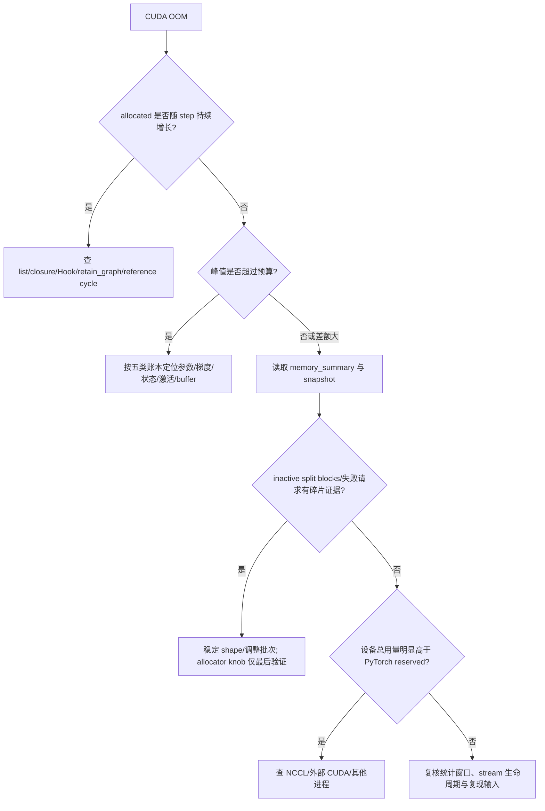

一个训练 step 的显存不只有参数：还要放梯度、优化器状态、反向所需激活和算子临时 buffer。更反直觉的是，Tensor 已删除后，`nvidia-smi` 里的数字仍可能不降——PyTorch 的 caching allocator 会保留空闲块以便复用。**排查 OOM 的起点不是反复调用 `empty_cache()`，而是先列五类账本，再同时观察 allocated、reserved 与 peak，最后用引用、碎片和非 PyTorch 分配三条证据链定位差额。** 本节只做小规模正确性实验，不触发破坏性 OOM，也不提供未经目标硬件复现的性能数字。

<!-- more -->

## 📑 目录

- [本节定位](#本节定位)
- [1. 一次训练到底要为哪五类显存买单](#1-一次训练到底要为哪五类显存买单)
- [2. allocated、reserved 与 peak 分别回答什么](#2-allocatedreserved-与-peak-分别回答什么)
- [3. caching allocator 与 empty_cache 的边界](#3-caching-allocator-与-empty_cache-的边界)
- [4. Python 引用为什么会制造阶梯式泄漏](#4-python-引用为什么会制造阶梯式泄漏)
- [5. 碎片与 OOM 怎样按证据诊断](#5-碎片与-oom-怎样按证据诊断)
- [6. memory_summary 与 snapshot 怎样接力](#6-memory_summary-与-snapshot-怎样接力)
- [7. 跑通 CPU 账本与 CUDA correctness smoke](#7-跑通-cpu-账本与-cuda-correctness-smoke)
- [8. Activation Checkpointing 何时进入账本](#8-activation-checkpointing-何时进入账本)
- [9. PyTorch 看不见的显存怎样识别](#9-pytorch-看不见的显存怎样识别)
- [10. 常见错误与诊断](#10-常见错误与诊断)
- [11. 权衡、边界与后续接口](#11-权衡边界与后续接口)
- [总结](#-总结)
- [自我检验清单](#-自我检验清单)
- [参考资料](#-参考资料)

---

## 本节定位

**前置知识**：完成 [4.0 PyTorch 框架快速入门](/AIInfraGuide/prerequisites/模块一-前置知识/pyroch/pytorch框架入门/)、[4.2 Autograd 自动微分](/AIInfraGuide/prerequisites/模块一-前置知识/pytorch/42-autograd自动微分/)、[4.5 训练循环工程](/AIInfraGuide/prerequisites/模块一-前置知识/pytorch/45-训练循环工程/)与 [4.6 CUDA 异步执行](/AIInfraGuide/prerequisites/模块一-前置知识/pytorch/46-cuda异步执行/)。你应会写 forward/backward/step，知道 saved tensors 会活到反向，并理解 CUDA 工作与跨 stream 生命周期可能晚于 Python 返回。

**学习成果**：读完后，你能列出参数、梯度、优化器状态、激活与临时 buffer 五类账本；能区分当前/峰值的 allocated 与 reserved；能解释 caching allocator 与 `empty_cache()` 的边界；能根据引用增长、inactive split blocks、snapshot 时间线和设备总用量诊断 OOM；能在无 CUDA 时完成 CPU 账本解析，在有 CUDA 时运行小规模峰值正确性 smoke。

**够用边界**：本节从 PyTorch 进程视角解释“显存被谁持有、allocator 如何复用、证据怎样采集”。不修改 allocator 实现，不做大模型 OOM 实验，不给通用节省倍率。FSDP/ZeRO、完整 Activation Checkpointing 策略进入模块三；KV Cache、PagedAttention 与服务并发进入推理模块；规范 benchmark 和 Profiler 时间线进入 4.8。

## 1. 一次训练到底要为哪五类显存买单

### 1.1 为什么只算参数一定会低估？

打个比方：实验室租场地，仪器本体只是**参数**；每台仪器的校准记录是**梯度**，维护档案是**优化器状态**，实验过程铺开的样品是**激活**，临时推车和工作台则是**buffer**。只拿仪器清单去租房，真正开工时自然放不下。

**一个可审计的逻辑账本至少拆成五项：**

$$
\underbrace{M_{logical}}_{\text{显式 Tensor 账本}}
=
\underbrace{M_{param}}_{\text{参数}}
+
\underbrace{M_{grad}}_{\text{梯度}}
+
\underbrace{M_{opt}}_{\text{优化器状态}}
+
\underbrace{M_{act}}_{\text{激活}}
+
\underbrace{M_{temp}}_{\text{临时 buffer}}
$$

其中一个 Tensor 的逻辑字节数为：

$$
\underbrace{M(T)}_{\text{Tensor 逻辑字节}}
=
\underbrace{\operatorname{numel}(T)}_{\text{元素个数}}
\times
\underbrace{\operatorname{element\_size}(T)}_{\text{每元素字节}}
$$

| 类别 | 何时出现 | 主要决定因素 | 容易漏算的边界 |
|---|---|---|---|
| 参数 | 模型迁移到 CUDA 后 | 参数量、dtype、参数共享 | 混合精度可能还有高精度副本，实际以 optimizer/state 为准 |
| 梯度 | 通常在 backward 后 | 可训练参数、梯度 dtype、`zero_grad` 策略 | `set_to_none=True` 后未产生梯度的参数可能没有 grad Tensor |
| 优化器状态 | 常在首次 `step()` 后惰性创建 | 优化器种类、状态 dtype、实现 | Adam 类通常有动量 Tensor，也可能有 step 标量等额外状态 |
| 激活 | forward 到对应 backward 之间 | batch、序列长度、shape、Autograd 保存策略 | Python 引用、`retain_graph` 会延长生命周期 |
| 临时 buffer | 算子、通信或框架执行期间 | 算法、shape、backend、并发 stream | 峰值可能很短；外部库 workspace 不一定被 PyTorch allocator 看见 |

📌 **关键点**：这五项是“你能解释的显式 Tensor 账本”，不是 CUDA 驱动总用量。allocator 对齐、缓存块、CUDA context、库 workspace、通信分配和其他进程会让设备侧数字与它不同。

### 1.2 怎样把公式落到一个可核对的小例子？

假设一份**纯账本**有 2048 个 float32 参数：参数占 $2048\times4=8192$ B，即 8 KiB；同形状梯度再占 8 KiB；若 optimizer 显式维护两份同形状 float32 状态，则这两份共 16 KiB。再列入 2048 个 float32 激活（8 KiB）与 1024 个 float32 临时元素（4 KiB），五项总和是 44 KiB。

这只是代入公式的账本例子，不代表某个真实 optimizer 的固定占用。真实代码应遍历实际 `optimizer.state`，把惰性创建的 step Tensor、不同 dtype 与额外状态逐项记录；本节示例正是这样做，而不是背“每参数固定多少字节”。

### 1.3 为什么逻辑账本不等于 allocator 账本？

问题是：五项明明加到 44 KiB，`memory_allocated()` 为什么可能不是 44 KiB？**逻辑账本按 Tensor 请求字节计数，allocator 还要处理块大小、对齐、复用与 stream 生命周期；两者回答的问题不同。**

因此诊断时保留三层口径：

1. **对象层**：哪些参数、梯度、状态、激活和 buffer 仍有引用；
2. **allocator 层**：PyTorch 当前分配/保留多少，峰值多少，块怎样切分；
3. **设备层**：驱动看到整张卡实际用了多少，其中还可能有 NCCL 或其他进程。

## 2. allocated、reserved 与 peak 分别回答什么

### 2.1 为什么 `nvidia-smi` 高不等于所有显存都被活 Tensor 占着？

PyTorch 官方 CUDA memory management 文档明确说明，它使用 caching allocator 加快分配，并允许释放 Tensor 时不必做设备同步。**allocator 可以继续保留已空闲的 CUDA 段，所以 `nvidia-smi` 仍把它显示为已使用。**

PyTorch 提供两组当前值：

```python
allocated = torch.cuda.memory_allocated()  # 当前被 Tensor 占用
reserved = torch.cuda.memory_reserved()    # 当前由 caching allocator 管理
assert allocated <= reserved
```

- `memory_allocated()`：当前由 Tensor 占用的字节；
- `memory_reserved()`：当前由 caching allocator 管理的总字节，既含活跃块，也可能含可复用的空闲块；
- `reserved - allocated`：allocator 内未计入活 Tensor 的差额，但**不能直接等同于碎片**，其中可能只是健康缓存、等待其他 stream 完成的块或对齐/分块差额。

想象仓库已经向房东租下 10 个货位（reserved），当前货物占 7 个（allocated），空着的 3 个仍是仓库下次可直接用的容量。房东账单不会因为货位暂时空着就立刻下降，这就是 `nvidia-smi` 与活 Tensor 账本看起来不一致的直觉。

### 2.2 peak 为什么比只看 step 结束更可靠？

临时激活或算子 buffer 可能在 forward/backward 中间出现，等你在 step 结束打印时已经释放。**peak 记录统计窗口内的最高水位，用来回答“这一段最挤时用了多少”，current 只能回答“打印这一刻还剩多少”。**

```python
torch.cuda.reset_peak_memory_stats()
start_allocated = torch.cuda.memory_allocated()

# 运行要观察的 forward / backward / optimizer step
run_one_update()

torch.cuda.synchronize()  # 4.6：在观测完成边界取证
print("current allocated:", torch.cuda.memory_allocated())
print("peak allocated:", torch.cuda.max_memory_allocated())
print("peak reserved:", torch.cuda.max_memory_reserved())
```

正确口径至少包含：

- 在目标区间前 `reset_peak_memory_stats()`；
- 记录 reset 时已经存在的模型/上下文基线；
- 固定 batch、shape、dtype、AMP、累积步数和代码路径；
- 在异步 CUDA 工作完成后读取最终边界；
- 同时报告 current 与 peak，不把二者混写成“显存占用”。

⚠️ **注意**：`reset_peak_memory_stats()` 只重置统计峰值，不释放任何 Tensor 或缓存。峰值重置后立即读取，`max_memory_allocated()` 应回到当前 allocated 水位；本节 CUDA 测试明确验证这条关系。

## 3. caching allocator 与 empty_cache 的边界

### 3.1 caching allocator 换来了什么？

为什么 PyTorch 不在每个 Tensor 消失时立即把显存交回驱动？**缓存分配器用保留空闲块换取后续分配复用，并避免频繁释放造成的设备同步。** 代价是设备监控里的“已用”数字不再等于活 Tensor 总和，且动态 shape 可能产生难复用的块。

从对象到复用的主干可以画成：

```text
Tensor 活着
   ↓ 删除最后引用，但 CUDA stream 可能仍在使用
active / awaiting free
   ↓ stream 生命周期闭合
inactive cached block（可供 PyTorch 复用）
   ↓ empty_cache 或 allocator 回收
返回 CUDA driver
```

4.6 的 `record_stream` 正好位于第二条边：它告诉 allocator 某个 Tensor 还在 side stream 上使用，不能只因 Python 引用消失就过早复用。**跨 stream 正确性先于“尽快释放”**，否则省下的不是显存，而是数据正确性。

### 3.2 `empty_cache()` 能做什么，不能做什么？

官方定义很明确：`empty_cache()` 把 allocator 中**未占用的缓存**释放给 CUDA，使其他 GPU 应用可以使用、并让监控数字可能下降；它不会释放仍被 Tensor 占用的显存，也不会凭空增加当前 PyTorch 进程可用于活 Tensor 的容量。

```python
del large_tensor                 # 先解除真实引用
gc.collect()                     # 若涉及 Python cycle，显式回收只用于诊断/边界
torch.cuda.empty_cache()         # 只能交回已经 inactive 的缓存
```

| 场景 | `empty_cache()` 是否对症 | 原因 |
|---|---|---|
| 活 Tensor 仍被 list/closure 持有 | 否 | allocated 不会因清缓存下降 |
| 希望把当前不用的 PyTorch 缓存让给另一个进程 | 是 | inactive cache 可返回 driver |
| 每个 step 都调用，希望“预防 OOM” | 通常否 | 破坏缓存复用，且不修复引用与真实容量问题 |
| 已有碎片证据、在隔离实验中验证回收行为 | 可能有帮助 | 只应基于 summary/snapshot 对照，不作通用保证 |

📌 **关键点**：先看 `allocated` 是否下降。若删对象后 allocated 仍阶梯上升，优先查引用；若 allocated 低而 reserved 高，再看块状态与外部分配。把 `empty_cache()` 放在第一步，会把根因证据一起冲淡。

## 4. Python 引用为什么会制造阶梯式泄漏

### 4.1 Tensor 离开局部变量为什么还没释放？

Python 对象只有在最后一个强引用消失后才可回收；如果对象参与 reference cycle，还要等循环垃圾回收器处理。**显存“泄漏”常常不是 allocator 忘了释放，而是 list、字典、闭包、Hook、异常对象或循环引用仍握着 CUDA Tensor。**

常见错误是把带图的 Tensor 当日志保存：

```python
# 错误：每步都保留 CUDA output；running_loss 还会连成计算图。
outputs_history.append(output)
running_loss = running_loss + loss

# 只需要标量日志时：主机取值会同步，按 4.6 降低频率。
if step % log_every == 0:
    loss_history.append(loss.detach().item())

# 需要离线分析完整输出时：切图并搬到 CPU，接受 D2H 代价。
outputs_history.append(output.detach().cpu())
```

`detach()` 只切断 Autograd 历史，不会把 CUDA storage 迁走；把大量 `output.detach()` 留在 list 中，显存仍会增长。若缓存必须留在 GPU，就要显式设置上限、淘汰策略与峰值预算。

### 4.2 `retain_graph=True` 为什么是危险信号？

普通 backward 完成后，Autograd 会释放不再需要的 saved tensors。**`retain_graph=True` 用延长图资源生命周期换取同图再次反向；若只是为了绕过“second backward”报错而永久开启，往往把图复用 bug 变成显存增长。**

排查顺序：

1. 确认训练循环是否本应重新 forward；
2. 搜索 `retain_graph=True`、输出缓存、Hook 保存值和 closure；
3. 每个稳定 step 在同一完成边界记录 allocated；
4. 删除可疑引用后再记录，不先调用 `empty_cache()`；
5. 若呈周期性锯齿，检查 Python reference cycle 与垃圾回收时机；
6. 用 snapshot 的 Active Memory Timeline 找到持续存活的分配栈。

PyTorch 官方关于 GPU memory reference cycles 的文章展示了典型模式：Tensor 随 cycle 累积，直到 Python 较晚一代的 GC 批量回收，形成阶梯或锯齿，最终可能 OOM。`gc.collect()` 可以作为诊断实验，但长期修复应删除 cycle 或缩短引用，而不是在每个 step 强制全量 GC。

## 5. 碎片与 OOM 怎样按证据诊断

### 5.1 reserved 很高就能宣布“碎片”吗？

不能。健康缓存也会让 reserved 高于 allocated。**只有当 allocator 有不少 inactive 字节，却找不到满足下一次请求的可复用 block，并在设备剩余容量不足时申请新 segment 失败，碎片才成为有力解释。**

想象书架总共有很多空格，但空格被夹在不同高度的书之间：空格总面积足够，却放不下一本指定高度的新书。对应到 allocator，应查看 segment 怎样被切成 active/inactive blocks、失败请求多大、inactive split blocks 是否显著，而不是只做一次减法。

动态 batch、序列长度和临时 shape 频繁变化，会产生不同大小的请求；但“变化会导致碎片”仍只是候选假设，必须用 `memory_summary()` 或 snapshot 验证。

### 5.2 一次 OOM 应按什么顺序排查？

**先区分真实活跃容量、引用延长、allocator 块状态与外部分配，再决定改模型还是调 allocator。** 推荐保留下面的证据顺序：



具体操作：

1. **保存 OOM 原始异常**：请求字节、设备空闲量和当时统计都是证据，不要只截最后一句；
2. **固定复现输入**：batch、序列长度、dtype、AMP、累积与随机路径不变；
3. **画五类账本**：静态状态与输入相关激活分开；
4. **逐边界记数**：model load、forward、backward、step 分别记录 current/peak；
5. **检查引用增长**：相同步之间 allocated 是否单调上升；
6. **读 summary/snapshot**：观察 inactive split blocks、segment/block 时间线和 OOM event；
7. **核对设备层差额**：排除 NCCL、外部 CUDA 库与其他进程；
8. **最后才改 allocator 配置**：官方将 `max_split_size_mb` 定位为 native allocator 下、确有大量 inactive split blocks 的 OOM 最后手段；成本从无到显著都可能发生，不能盲抄。

⚠️ **注意**：不要为了制造“教学证据”主动申请到 OOM。生产 OOM 应在真实失败路径预先开启受限 history；课程测试只用小模型验证统计关系。

## 6. memory_summary 与 snapshot 怎样接力

### 6.1 `memory_summary()` 适合先回答什么？

**summary 是低门槛文本体检：适合在 OOM 时快速查看 allocator 统计、大小池、active/inactive 与 split block 线索。**

```python
print(torch.cuda.memory_summary(abbreviated=False))
```

推荐把 summary 与以下上下文一起保存：PyTorch/CUDA 版本、设备、allocator backend、batch/shape/dtype、AMP、当前 step、allocated/reserved/peak。单独贴一段 summary 而没有复现输入，很难判断差异来自代码还是工作负载。

summary 适合“先看哪里异常”，却无法完整回答“哪一行代码在什么时候分配、为何一直活着”。这时进入 snapshot。

### 6.2 snapshot 怎样看见分配时间线？

PyTorch 的 Understanding CUDA Memory Usage 文档提供 memory history 与 snapshot：先记录分配/释放事件和栈，再把 pickle 拖入 `https://pytorch.org/memory_viz`。官方说明该可视化器在浏览器本地运行，不上传 snapshot 数据。

```python
# 当前官方文档使用的诊断入口；下划线 API 需以安装版本文档为准。
torch.cuda.memory._record_memory_history(max_entries=100_000)
try:
    run_suspected_region()
except torch.OutOfMemoryError:
    torch.cuda.memory._dump_snapshot("oom_snapshot.pickle")
    raise
finally:
    torch.cuda.memory._record_memory_history(enabled=None)
```

两个视图各回答一类问题：

- **Active Memory Timeline**：哪些 Tensor 在何时活着，分配栈在哪里；
- **Allocator State History**：每次事件时 segment 如何切成 blocks，OOM 发生时为何有 reserved 却无法满足请求。

如果只需要当前 allocator 结构，也可以用 `torch.cuda.memory_snapshot()` 获取快照字典；若要带事件历史与调用栈，必须先开启 history。history 会占内存，`max_entries` 应有限；官方文档提醒每条记录可能达到数 KiB，长任务的 snapshot 可能很大。

⚠️ **注意**：snapshot 可能含本地路径和调用栈。不要把生产快照直接提交到仓库或发送给不可信第三方；先按组织的数据处理规则审查。

## 7. 跑通 CPU 账本与 CUDA correctness smoke

### 7.1 无 CUDA 为什么仍能验收账本？

逻辑账本只需要 `numel × element_size` 和严格分类。**CPU 测试会解析 JSON 记录、拒绝未知类别/负数/缺字段，遍历真实模型参数、梯度和已物化 optimizer state，并显式加入激活与临时 buffer。**

在仓库根目录执行：

```bash
python3 examples/pytorch/memory_accounting.py --device cpu
python3 -m unittest examples/pytorch/tests/test_memory_accounting.py -v
python3 -m compileall examples/pytorch/memory_accounting.py \
  examples/pytorch/tests/test_memory_accounting.py
```

CPU 路径必须出现：

```text
CPU logical ledger:
  parameters: ...
  gradients: ...
  optimizer_state: ...
  activations: ...
  temporary_buffers: ...
CPU ledger JSON round-trip passed
all memory-accounting CPU checks passed
```

具体字节可能随 PyTorch optimizer state 实现变化，所以测试不把某版本的状态总量写死；它要求五类均被真实物化、序列化往返不改变记录，并对手工输入的 76 B 账本做精确聚合断言。

### 7.2 有 CUDA 时验证什么，不验证什么？

```bash
python3 examples/pytorch/memory_accounting.py --device auto
```

有 CUDA 时，脚本只创建 `16 → 32 → 4` 的小 MLP 与 `8 × 16` 输入，运行一次 forward/backward/AdamW step，并验证：

- loss 有限且参数确实更新；
- peak reset 后，峰值立即等于当时 current allocated；
- model、forward、backward、step 五个边界都满足 `allocated <= reserved`；
- 最终 `max_memory_allocated` 不小于任一已观察 current allocated；
- 最终 `max_memory_reserved` 不小于任一已观察 current reserved。

脚本不会申请到 OOM，不计算节省率、吞吐或“reserved/allocated 越小越好”的阈值。没有 CUDA 时，它明确打印：

```text
CUDA unavailable: skipped peak reset and allocated/reserved CUDA checks; GPU memory behavior and performance were not measured.
```

**降级不是 GPU 路径通过。** 最终验收应把 peak reset、allocator 关系与 GPU 行为列为未实测，直到在有 CUDA 的环境运行。

## 8. Activation Checkpointing 何时进入账本

### 8.1 激活成为大头时，第一步是什么？

如果账本与 snapshot 证明 forward 保存的激活占主要峰值，可以建立 Activation Checkpointing 入口：**少保存一部分中间激活，在 backward 时重算 forward，用额外计算换显存。**

```python
from torch.utils.checkpoint import checkpoint

# 入口示意：先验证数值，再测目标模型；不代表固定节省比例。
output = checkpoint(block, input_tensor, use_reentrant=False)
```

这项技术不是“免费清缓存”：

- **换取**：减少需要跨越 forward→backward 生命周期的部分激活；
- **牺牲**：额外重算、调试复杂度，以及随机操作/全局状态/副作用的一致性责任；
- **采用条件**：snapshot 证明激活是大头，正确性测试通过，目标硬件上的 step 时间与峰值按 4.8 规范测量；
- **本节边界**：不讨论分段策略、选择性 checkpoint、与 FSDP/PP 的组合，也不声称任何固定倍率。

完整混合精度、重计算、ZeRO/FSDP 与并行组合进入[模块三分布式训练](/AIInfraGuide/distributed/)。本节只教你先证明“激活是大头”，再把 checkpointing 作为候选手段，而不是看到 OOM 就机械开启。

## 9. PyTorch 看不见的显存怎样识别

### 9.1 snapshot 为什么可能解释不了整张卡？

官方 Understanding CUDA Memory Usage 文档明确写明：memory profiler 与 visualizer 只看得到**由 PyTorch allocator 分配和管理**的 CUDA 内存。直接调用 CUDA API 的分配不在其中；NCCL 是官方列出的常见例子。

当前官方文档给出设备层入口：

```python
device_index = torch.cuda.current_device()
raw_device_used = torch.cuda.device_memory_used(device_index)
pytorch_reserved = torch.cuda.memory_reserved(device_index)
print(raw_device_used, pytorch_reserved)
```

但 `raw_device_used - pytorch_reserved` 只能作为**排查线索**，不能直接给某个库定罪，因为原始设备用量还可能包含 CUDA context、其他进程和其他框架。要让对照有意义，应：

1. 在隔离 GPU 或已知进程集合中复现；
2. 同时保存 `nvidia-smi` 的进程视图；
3. 分别在初始化前、NCCL/process group 初始化后、模型 load 后采样；
4. 用控制变量移除通信或外部扩展再比较；
5. 不把 PyTorch snapshot 中“没看见”误写成“没有分配”。

📌 **关键点**：PyTorch allocated/reserved 解释 allocator 内部，raw device usage 解释驱动总量。两者的差额是调查入口，不是精确归因公式。

## 10. 常见错误与诊断

| 症状 | 先检查什么 | 最小修复 |
|---|---|---|
| 每个 step 的 allocated 单调上涨 | list/dict/closure/Hook 是否保存 CUDA Tensor 或带图 loss | 只保留必要数据；日志用标量，离线输出切图后搬 CPU |
| 周期性上涨后突然下降 | Python reference cycle 与 GC 代次 | 用 snapshot/循环引用检测定位并删除 cycle；`gc.collect()` 只作诊断对照 |
| `empty_cache()` 后 allocated 不降 | 活 Tensor 是否仍有引用 | 删除最后引用；不要把清缓存当对象释放 |
| allocated 下降、reserved 仍高 | 是否只是健康 cache | 看后续是否复用、summary 块状态；共享 GPU 时再考虑交回缓存 |
| reserved 远高于 allocated 就宣布碎片 | 是否有 inactive split block 与失败请求证据 | 读取 summary/snapshot；差额本身不是碎片证明 |
| step 结束不高却仍 OOM | 是否漏看 forward/backward 中间 peak | reset peak 后按边界采样，固定同一工作负载 |
| OOM 后直接调 `max_split_size_mb` | allocator backend 与 inactive split 证据 | 先固定 shape/账本/snapshot；该选项只作 native allocator 最后手段 |
| snapshot 找不到 NCCL 占用 | 分配是否绕过 PyTorch allocator | 对照 raw device usage、进程和初始化阶段 |
| `detach()` 后缓存仍涨 | Tensor 是否还在 CUDA | 需要长期保留时 `.detach().cpu()`，或给 GPU cache 设预算/淘汰 |
| 每步强制 `empty_cache()`“更稳定” | 是否破坏复用并掩盖引用根因 | 移除后按相同输入复现；只在明确交回缓存的边界调用 |
| 无 CUDA 却报告显存节省倍率 | 是否只有 CPU 逻辑账本 | 明确标记 GPU 未实测，不从元素字节数外推运行峰值 |

📌 **关键点**：先问“谁还持有对象”，再问“allocator 如何切块”，最后问“设备上还有谁在分配”。顺序反过来，最容易用配置掩盖代码错误。

## 11. 权衡、边界与后续接口

### 11.1 每种手段牺牲了什么？

| 选择 | 换取什么 | 牺牲什么 / 风险 | 采用条件 |
|---|---|---|---|
| 五类逻辑账本 | 可解释的容量预算 | 需要显式登记，无法自动覆盖外部库 | 设计模型、审计 checkpoint/optimizer、复盘峰值 |
| current + peak 统计 | 低成本观察 allocator 水位 | 不能直接给分配栈与外部分配 | 每次实验的基础证据 |
| `memory_summary()` | 快速查看块与统计线索 | 文本快照缺完整时间因果 | OOM 的第一份 allocator 体检 |
| history + snapshot | 分配栈、时间线、OOM event 与块状态 | 额外记录内存、文件体积和敏感路径 | 难复现泄漏/碎片，设置有限 max entries |
| `empty_cache()` | 把 inactive cache 交回 CUDA | 丢失复用机会；不能释放活 Tensor | 进程间让显存或有证据的边界实验 |
| Activation Checkpointing | 降低部分激活生命周期占用 | backward 重算与正确性复杂度 | 激活已被证明为大头 |
| allocator 配置 | 针对特定分配模式改善复用 | 版本/backend 约束与潜在性能代价 | summary/snapshot 已证明默认策略不适配 |

### 11.2 与 4.6、4.8、模块三和推理模块的边界是什么？

- **4.6 CUDA 异步执行**：负责 Event、stream 依赖与 `record_stream`。4.7 接过生命周期结果，观察 allocator 何时能把 block 从 awaiting free 变成可复用；本节不重复多 stream 排序。
- **4.8 Benchmark 与 Profiler**：负责固定输入、预热、重复、同步、统计量和 trace。4.7 只给显存统计点与 snapshot 入口，不把一次 peak 观测写成性能结论。
- **[模块三分布式训练](/AIInfraGuide/distributed/)**：负责 ZeRO/FSDP 如何切分参数、梯度和优化器状态，以及 Activation Checkpointing 如何与并行策略组合。本节只建立单进程五类账本与入口权衡。
- **[模块四推理优化](/AIInfraGuide/inference/)**：负责权重、KV Cache、PagedAttention、并发请求与服务生命周期。训练激活会在 backward 后释放，而 KV Cache 随请求/序列增长，不能把训练账本直接复制成推理容量规划。

分工：4.6 管“block 何时安全复用”，4.7 管“谁占了多少、为何 OOM”，4.8 管“怎样得到可信测量”，模块三管“训练状态怎样切分/重算”，推理模块管“权重与 KV Cache 怎样服务并发请求”。

## 📝 总结

1. **五类账本**：参数、梯度、优化器状态、激活与临时 buffer 构成最小可解释训练账本；逐 Tensor 使用 `numel × element_size`，但不冒充 allocator 总量。
2. **三组指标**：allocated 是活 Tensor 当前占用，reserved 是 allocator 当前管理总量，peak 是统计窗口最高水位；`reserved-allocated` 不是碎片的充分证据。
3. **缓存边界**：caching allocator 用保留空闲块换快速复用；`empty_cache()` 只交回 inactive cache，不能释放仍被引用的 Tensor。
4. **引用泄漏**：list、closure、Hook、`retain_graph` 与 reference cycle 会延长 CUDA Tensor/图生命周期；先修引用，再清缓存。
5. **OOM 证据链**：固定输入后依次检查五类账本、边界 current/peak、引用增长、summary/snapshot 与设备层差额，最后才考虑 allocator knob。
6. **工具接力**：summary 做文本体检；history + snapshot 提供分配栈、Active Memory Timeline、Allocator State History 与 OOM event。
7. **可见性边界**：PyTorch memory profiler 看不到直接 CUDA/NCCL 分配；raw device usage 与 reserved 的差额只能作为受控环境下的线索。
8. **诚实降级**：CPU 可以精确解析逻辑账本；没有 CUDA 时，peak reset、allocated/reserved、snapshot 与 GPU 性能全部标记未实测。

## 🎯 自我检验清单

- 能在 5 分钟内画出参数、梯度、优化器状态、激活和临时 buffer 五类账本，并为每类写出一个生命周期边界
- 能给定 2048 个 float32 参数、同形状梯度、两份同形状状态、2048 个激活和 1024 个临时元素，手算逻辑总量为 44 KiB
- 能运行 `memory_accounting.py --device cpu`，看到五类非零账本与 `CPU ledger JSON round-trip passed`
- 能解释 allocated、reserved、peak 三者差异，并在 CUDA smoke 的五个边界验证 `allocated <= reserved`
- 能在 `reset_peak_memory_stats()` 后验证 peak 回到当前 allocated，再证明最终 peak 不小于任一已观察 current 值
- 能说明 `empty_cache()` 只能释放 inactive cache，构造“活 Tensor 仍被引用时 allocated 不下降”的反例
- 能找出 list、closure、Hook、`retain_graph=True` 与 Python reference cycle 中至少 4 类生命周期延长来源，并给出不保留 CUDA 图的修复
- 能从相同步 allocated 单调增长、周期锯齿、inactive split blocks 和设备层差额四种证据中选择下一项诊断工具
- 能保存一份含固定输入配置、`memory_summary()`、current/peak 与 allocator backend 的 OOM 诊断记录，而不执行破坏性 OOM 测试
- 能按官方入口开启有限条目的 memory history、在异常时 dump snapshot，并解释 Active Memory Timeline 与 Allocator State History 各回答什么
- 能解释 Activation Checkpointing 用额外重算换部分激活显存，并明确不承诺固定节省或速度倍率
- 能区分 PyTorch allocator 可见内存与 NCCL/直接 CUDA/其他进程用量，并说清 4.6、4.8、模块三和推理模块各自边界

## 📚 参考资料

### PyTorch 官方文档

- [CUDA semantics：Memory management](https://docs.pytorch.org/docs/stable/notes/cuda.html#cuda-memory-management)：caching allocator、allocated/reserved/peak、`empty_cache()`、allocator 配置与碎片诊断的首要事实来源。
- [Understanding CUDA Memory Usage](https://docs.pytorch.org/docs/stable/torch_cuda_memory.html)：memory history、snapshot、memory_viz、Active Memory Timeline、Allocator State History、OOM event 与非 PyTorch 分配可见性；本文的主要诊断依据。
- [`torch.cuda.memory_allocated`](https://docs.pytorch.org/docs/stable/generated/torch.cuda.memory.memory_allocated.html) 与 [`memory_reserved`](https://docs.pytorch.org/docs/stable/generated/torch.cuda.memory.memory_reserved.html)：当前 Tensor 占用与 allocator 管理总量的 API 定义。
- [`torch.cuda.max_memory_allocated`](https://docs.pytorch.org/docs/stable/generated/torch.cuda.memory.max_memory_allocated.html)、[`max_memory_reserved`](https://docs.pytorch.org/docs/stable/generated/torch.cuda.memory.max_memory_reserved.html) 与 [`reset_peak_memory_stats`](https://docs.pytorch.org/docs/stable/generated/torch.cuda.memory.reset_peak_memory_stats.html)：峰值窗口与重置接口。
- [`torch.cuda.empty_cache`](https://docs.pytorch.org/docs/stable/generated/torch.cuda.memory.empty_cache.html)：明确说明不会增加 PyTorch 可用的活 Tensor 显存，并可能在特定情形减少碎片。
- [`torch.cuda.memory_summary`](https://docs.pytorch.org/docs/stable/generated/torch.cuda.memory.memory_summary.html) 与 [`memory_snapshot`](https://docs.pytorch.org/docs/stable/generated/torch.cuda.memory.memory_snapshot.html)：文本统计与 allocator 快照入口。
- [`torch.utils.checkpoint`](https://docs.pytorch.org/docs/stable/checkpoint.html)：Activation Checkpointing 的当前 API、重算语义与注意事项；本节只建立入口。

### PyTorch 官方文章

- [Understanding GPU Memory 2: Finding and Removing Reference Cycles](https://pytorch.org/blog/understanding-gpu-memory-2/)：用 memory snapshot 观察 Python reference cycle 导致的 GPU Tensor 累积，并介绍定位与移除思路。
