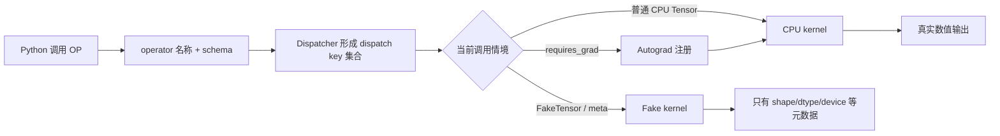

一个可训练、可编译的自定义算子至少要守住 **4 份契约**：schema、真实 CPU kernel、FakeTensor 元数据和 Autograd 公式。Dispatcher 再根据 Tensor 与线程局部状态形成 dispatch key 集合，把同一个 operator 调到合适的 kernel。**注册换来 PyTorch 各子系统都能看见的稳定边界，也牺牲了普通 Python 函数的透明性与低维护成本。** 因此本节先把默认选择钉死：能由 PyTorch API 组合出来时，优先写普通 Python 函数；只有要包装框架看不懂的实现或刻意建立不透明边界时，才注册 custom operator。

<!-- more -->

## 📑 目录

- [本节定位](#本节定位)
- [1. 什么时候才需要自定义算子](#1-什么时候才需要自定义算子)
- [2. operator、schema、kernel 与 Dispatcher 怎样协作](#2-operatorschemakernel-与-dispatcher-怎样协作)
- [3. 怎样注册最小 CPU 算子](#3-怎样注册最小-cpu-算子)
- [4. mutation 与 alias 为什么必须写进契约](#4-mutation-与-alias-为什么必须写进契约)
- [5. FakeTensor 与 meta kernel 解决什么问题](#5-faketensor-与-meta-kernel-解决什么问题)
- [6. Autograd 公式怎样挂到 operator 上](#6-autograd-公式怎样挂到-operator-上)
- [7. opcheck 与 gradcheck 分别证明什么](#7-opcheck-与-gradcheck-分别证明什么)
- [8. 跑通完整 CPU 示例](#8-跑通完整-cpu-示例)
- [9. 常见错误与诊断](#9-常见错误与诊断)
- [10. 权衡、选型与版本边界](#10-权衡选型与版本边界)
- [11. 与前后课程的边界](#11-与前后课程的边界)
- [总结](#-总结)
- [自我检验清单](#-自我检验清单)
- [参考资料](#-参考资料)

---

## 本节定位

**前置知识**：完成 [4.2 Autograd 自动微分](/AIInfraGuide/prerequisites/模块一-前置知识/pytorch/42-autograd自动微分/)与 [4.8 Benchmark 与 Profiler](/AIInfraGuide/prerequisites/模块一-前置知识/pytorch/48-benchmark与profiler/)。你应会写 Tensor 运算，知道反向公式要乘 `grad_output`，并接受“正确性先于性能”的验证顺序。不了解 CUDA 也能完成本节，全部示例固定在 CPU，不编译 C++/CUDA 扩展。

**学习成果**：读完后，你能区分 operator、schema 和 kernel；能画出一次 Dispatcher 选择的基本路径；能用 `torch.library.custom_op` 注册函数式 CPU 算子；能补齐 FakeTensor 与 Autograd 注册；能解释 mutation/alias 契约；能分别用普通断言、`opcheck` 和 `gradcheck` 验证数值、注册与梯度。

**够用边界**：本节只建立 PyTorch 扩展入口，不写高性能 CUDA/Triton kernel，不测性能，也不承诺 custom operator 比普通函数更快。4.10 才把 custom operator 放进 Dynamo、AOTAutograd 与 Inductor 的执行链路；模块二才处理 GPU kernel 实现与优化。

## 1. 什么时候才需要自定义算子

### 1.1 为什么普通 Python 函数应当优先？

问题是：下面这段计算已经能训练，为什么还要注册？

```python
def rowwise_scaled_square(x: torch.Tensor, scale: float) -> torch.Tensor:
    return x.square().sum(dim=1) * scale
```

**如果一项操作能完全由内置 PyTorch API 组合，普通 Python 函数通常就是正确答案。** 官方 Custom Operators 入口明确给出这条建议：内置算子组合已经能被 Autograd 记录，也让 `torch.compile` 有机会看见内部结构；注册 custom operator 反而把实现变成一个不透明边界。

本节仍用这个简单公式做教学示例，因为它有可手算输出、可手推梯度，CPU 与 FakeTensor 路径也无需第三方库。它证明的是注册机制，不是生产选型。真实项目更常见的注册理由是：

- 包装第三方 C/C++/CUDA 库，PyTorch 无法追踪其内部操作；
- 包装已有 Python binding，让 Autograd、`torch.compile`、`torch.export` 等子系统看见一个稳定 operator；
- 明确要求 tracing 不进入某段 Python 实现，把它当作不透明调用；
- 为不同设备或子系统提供同一 operator 的不同 kernel。

⚠️ **注意**：custom operator 不是性能优化本身。它只建立可调度、可组合的框架边界；边界内部快不快，要回到具体 kernel 和 [4.8](/AIInfraGuide/prerequisites/模块一-前置知识/pytorch/48-benchmark与profiler/) 的实验口径证明。

### 1.2 自定义算子和自定义 Kernel 是一回事吗？

**不是。operator 是面向 PyTorch 的行为契约，kernel 是实现这份契约的一段代码。** 一个 operator 可以有 CPU、CUDA、Meta/Fake 等多个 kernel；一个高性能 CUDA kernel 若没有注册成 operator，也无法自动获得完整的 PyTorch 子系统组合性。

| 名称 | 回答的问题 | 本节对应物 |
|---|---|---|
| operator | “这项操作叫什么、接受什么、改变什么、返回什么” | `aiinfraguide_pytorch_49::rowwise_scaled_square` |
| schema | “输入输出类型、mutation 与 alias 契约是什么” | 由类型注解推导的 `(Tensor, float) -> Tensor` 形态 |
| kernel | “某个 dispatch key 下实际执行哪段实现” | CPU 实现、FakeTensor 实现、Autograd 公式 |
| Dispatcher | “本次调用应该选择哪条注册路径” | 根据输入与线程状态选择 Autograd/CPU/Fake 等处理 |

📌 **关键点**：不要把“写了一个 Python 函数”“注册了一个 operator”“写了一个 CUDA kernel”混成同一件事。三者分别是实现、框架契约和设备执行代码。

## 2. operator、schema、kernel 与 Dispatcher 怎样协作

### 2.1 Dispatcher 为什么不只是 `if device == "cuda"`？

打个比方：学校总机接到“查成绩”请求时，不只看学生来自哪个班，还要看请求是否需要复核、是否只查表格结构、是否处于批量处理模式。设备只是其中一个条件。**Dispatcher 同时处理设备后端与 Autograd、Autocast、Fake/Meta、`vmap`、tracing 等横切关注点，dispatch key 因而不只包含 CPU/CUDA。**

官方 Dispatcher 教程给出的基本原则是：每个 kernel 对应某个 dispatch key；调用时，Dispatcher 根据 Tensor 参数和线程局部状态形成候选 key 集合，选择优先级最高的处理，再在需要时 redispatch 到下一层。

本节算子的概念路径是：



这张图是心智模型，不是某个 PyTorch 版本的完整优先级表。具体 key、fallback 和生成包装器属于实现细节；业务代码依赖的稳定事实是：同一 operator 名称可以为不同后端与子系统注册行为。

### 2.2 为什么调用要经过 `torch.ops`？

注册后的名称是稳定标识：

```python
OP = torch.ops.aiinfraguide_pytorch_49.rowwise_scaled_square.default
output = OP(input_tensor, 0.5)
```

`namespace::name` 降低不同库之间的命名冲突；`.default` 表示默认 overload。调用这个 `OpOverload` 才进入 Dispatcher，而不是直接绕回最初的 Python 实现。

本节示例再包一层普通函数，只为提供类型清晰的课程接口：

```python
def rowwise_scaled_square(input_tensor, scale=1.0):
    return OP(input_tensor, float(scale))
```

这层 wrapper 不替代 operator，也不做手写设备分派。

## 3. 怎样注册最小 CPU 算子

### 3.1 `custom_op` 一次注册了什么？

**`torch.library.custom_op` 把一个函数包装成 custom operator，并根据类型注解推导 schema；`mutates_args` 声明哪些输入会被修改，`device_types` 限定实现适用后端。** 本节函数式算子不修改任何输入，只提供 CPU 实现：

```python
from torch import Tensor


@torch.library.custom_op(
    "aiinfraguide_pytorch_49::rowwise_scaled_square",
    mutates_args=(),
    device_types="cpu",
)
def rowwise_scaled_square_cpu(
    input_tensor: Tensor,
    scale: float,
) -> Tensor:
    if input_tensor.dim() != 2:
        raise ValueError("input_tensor must be 2-D with shape (rows, columns)")
    if input_tensor.dtype not in (torch.float32, torch.float64):
        raise TypeError("input_tensor must have dtype float32 or float64")
    return input_tensor.square().sum(dim=1) * scale
```

对输入

$$
X=
\begin{bmatrix}
1 & -2 & 3\\
0.5 & 0 & -1
\end{bmatrix},
\quad s=0.5
$$

算子定义为：

$$
\underbrace{y_i}_{\text{第 i 行输出}}
=
\underbrace{s}_{\text{缩放系数}}
\sum_j
\underbrace{X_{ij}^{2}}_{\text{逐元素平方}}
$$

所以两行分别得到 $0.5\times(1+4+9)=7$ 与 $0.5\times(0.25+0+1)=0.625$。这两个确定值进入 CPU 单元测试，不需要任何性能假设。

### 3.2 `define + impl` 是什么替代路径？

如果你需要显式控制 schema，也可以把“定义 operator”和“注册 kernel”拆开：

```python
# 入口示意：不要与上面的同名 operator 在同一进程重复执行。
torch.library.define(
    "my_project::rowwise_scaled_square",
    "(Tensor input_tensor, float scale) -> Tensor",
)

@torch.library.impl("my_project::rowwise_scaled_square", "cpu")
def cpu_kernel(input_tensor, scale):
    return input_tensor.square().sum(dim=1) * scale
```

这条路径更直接地展示 operator/schema/kernel 三层；`custom_op` 则更适合从带类型注解的 Python callable 建立不透明边界。本节完整示例选择 `custom_op`，避免维护两份可能不一致的 Python 签名与手写 schema。

⚠️ **注意**：一个 qualified name 在同一 Python 进程只能定义一次。Notebook 重跑、测试以两个模块名导入同一文件、`importlib.reload` 都可能触发重复注册。本节 `_register_operator_once()` 先查询 `torch.ops`，已有 operator 就复用；单元测试明确 reload 一次，证明不会重复定义。

## 4. mutation 与 alias 为什么必须写进契约

### 4.1 PyTorch 为什么不能只读函数体猜行为？

4.1 已经说明两个 Tensor 可以共享 storage。对 custom operator，PyTorch 需要在执行函数体之前就知道哪些输入会被修改、输出是否与输入共享存储，才能让 Autograd、functionalization、编译和导出做正确变换。**schema 与注册信息是契约，PyTorch 不从任意 Python/C++ 函数体自动推断 mutation/alias。**

本节算子满足函数式契约：

- `mutates_args=()`：不修改任何输入；
- 输出是新 Tensor，不返回输入本身；
- 输出不是输入的 view；
- 多个输出之间不存在共享 storage；
- 每次调用都保持相同的 alias 行为。

测试用 storage 指针补一份直观证据：输出与输入不共享 storage。但这只是当前样本的运行证据，真正给框架使用的仍是 schema/registration contract。

### 4.2 mutation 与 alias schema 怎样入门？

显式 schema 常用 alias annotation 表达关系：`Tensor(a!)` 中 `a` 是 alias set，`!` 表示会被写入；返回 `Tensor(a)` 表示输出与同一 alias set 共享。**这些标记不是注释，写错会让上层变换在错误前提下运行。**

当前官方 Python custom operator 教程给出两条重要规则：

1. 函数式 custom operator 必须返回 fresh Tensor，不能返回输入、输入 view 或彼此 alias 的多个输出；
2. 可变 custom operator 必须精确列出每个被修改参数，不能“有时原地、有时新分配”。

“有时接受 `out`、有时自己分配”的 maybe-out 接口具有两种 alias 契约，官方建议拆成两个 operator。**宁可把接口拆清楚，也不要用 `mutates_args="unknown"` 长期掩盖设计不确定性。** `unknown` 会采用保守假设，能换来临时兼容，却失去精确变换机会。

⚠️ **版本边界**：当前官方教程标注，从 PyTorch 2.13 起提供带标签的 in-place 与 `out=` Python custom operator 路径。早期版本的能力与限制不同。本节的 CPU 示例刻意保持纯函数式；若要实现 mutation/view/out，请先锁定项目 PyTorch 版本，再按该版本官方 schema 与 custom operator 文档编写测试，不要照搬本文入口示意。

## 5. FakeTensor 与 meta kernel 解决什么问题

### 5.1 没有真实数据时，编译器怎样知道输出 shape？

想象物流系统先做装车计划：它只需要箱子的尺寸、重量类别和目的地，不需要当场打开箱子读内容。**FakeTensor 同样携带 shape、stride、dtype、device 等 Tensor 元数据，却没有可读取的真实 storage；fake/meta kernel 只计算输出元数据。**

本节注册如下：

```python
@torch.library.register_fake(
    "aiinfraguide_pytorch_49::rowwise_scaled_square"
)
def rowwise_scaled_square_fake(input_tensor, scale):
    del scale
    validate_input(input_tensor)  # 只能检查 dim、dtype 等元数据
    return input_tensor.new_empty((input_tensor.shape[0],))
```

真实输入 shape 是 `(rows, columns)`，按行规约后输出 shape 是 `(rows,)`。fake kernel 还要匹配真实输出的 dtype、device、layout、stride 和相关 storage offset；本例一维 fresh Tensor 的元数据较简单。

### 5.2 fake kernel 为什么不能调用 `.item()`？

**FakeTensor 没有真实数据，fake kernel 只能读取元数据，不能用 `.item()`、`data_ptr()` 或按 Tensor 数值决定 Python 分支。** 若输出 shape 依赖数据值，必须使用官方提供的数据依赖 shape 表达机制，或重新设计 operator 契约；不能偷偷跑真实 kernel 来“猜 shape”。

本节直接用 `FakeTensorMode` 做一条诊断 smoke：`(4,3)` 的 fake 输入必须得到 `(4,)` 的 fake 输出，dtype 仍为 float32、逻辑 device 仍为 CPU。`FakeTensorMode` 的直接导入路径位于 `torch._subclasses`，属于版本敏感的诊断入口；生产兼容性更应依赖当前版本文档和 `opcheck` 的 `test_faketensor`。

📌 **关键点**：fake kernel 不是低精度 kernel，也不是 CPU 替身。它只回答“如果执行，输出长什么样”，不回答“输出数值是多少”。

## 6. Autograd 公式怎样挂到 operator 上

### 6.1 4.2 的 `autograd.Function` 为什么还不够？

[4.2](/AIInfraGuide/prerequisites/模块一-前置知识/pytorch/42-autograd自动微分/) 用 `torch.autograd.Function` 定义一次局部前向/反向，是理解 saved tensors 和 `gradcheck` 的正确入口。这里的问题不同：**operator 已经是 Dispatcher 中的稳定实体，需要用 `torch.library.register_autograd` 把反向公式注册到这个实体上。**

对

$$
y_i=s\sum_jX_{ij}^{2}
$$

若上游梯度为 $g_i=\partial L/\partial y_i$，则：

$$
\underbrace{\frac{\partial L}{\partial X_{ij}}}_{\text{返回给 input 的梯度}}
=
\underbrace{g_i}_{\text{grad\_output 第 i 项}}
\cdot
\underbrace{2sX_{ij}}_{\text{局部导数}}
$$

代入本节 loss `output.sum()`，每个 $g_i=1$，又因为 $s=0.5$，最终梯度就是 $X$ 本身。这解释了示例输出：

```text
[[ 1.0, -2.0,  3.0],
 [ 0.5,  0.0, -1.0]]
```

### 6.2 `setup_context` 与 `backward` 各保存什么？

```python
def setup_context(ctx, inputs, output):
    del output
    input_tensor, scale = inputs
    ctx.save_for_backward(input_tensor)
    ctx.scale = scale


def backward(ctx, grad_output):
    (input_tensor,) = ctx.saved_tensors
    grad_input = grad_output.unsqueeze(-1) * (2.0 * ctx.scale * input_tensor)
    return grad_input, None


torch.library.register_autograd(
    "aiinfraguide_pytorch_49::rowwise_scaled_square",
    backward,
    setup_context=setup_context,
)
```

反向返回值与 forward 输入一一对应：Tensor 输入得到 `grad_input`，非 Tensor 的 `scale: float` 返回 `None`。官方文档要求 `setup_context` 与 `backward` 可被追踪：不要访问 `data_ptr()`，不要依赖或修改全局状态；若 backward 必须调用框架看不懂的实现，应把那部分再注册成 custom operator。

**Autograd 注册牺牲了手写并维护导数的成本，换取训练组合性。** 公式一旦写错，forward 仍可能完全正常，因此下一节必须同时运行 `opcheck` 与 `gradcheck`。

## 7. opcheck 与 gradcheck 分别证明什么

### 7.1 两个名字都有 check，为什么不能二选一？

**`opcheck` 检查注册契约，`gradcheck` 检查数值导数；两者互不替代。** 当前 `torch.library.opcheck` 默认测试 schema、Autograd 注册、FakeTensor 和 AOT dispatch/编译行为，但官方明确说明它不是 forward 数值正确性测试。

| 工具 | 主要证明 | 不证明 | 本节输入 |
|---|---|---|---|
| 普通单元测试 / `assert_close` | CPU forward 的 shape、dtype、数值与错误路径 | 注册对编译/Fake 是否完整 | 两行手算输入，输出 `[7, 0.625]` |
| `torch.library.opcheck` | schema、mutation/alias、Autograd 注册、FakeTensor、编译组合性 | 数学公式一定正确 | double、`requires_grad=True` 的 `(3,4)` 输入 |
| `torch.autograd.gradcheck` | 解析 backward 与有限差分数值雅可比匹配 | fake kernel 或 schema 注册完整 | double、平滑、非重叠的小输入 |

`opcheck` 应覆盖代表性设备、dtype、边界 shape、非连续布局和训练输入；一个样本成功不代表全部输入域都已验证。本节只有 CPU、float32/float64 与二维输入，因此测试范围也只承诺这些边界。

### 7.2 为什么 `gradcheck` 使用 double？

有限差分会对输入施加很小扰动；float32 的舍入误差可能淹没差分信号。**先使用 double、远离不可微点、避免重叠输入，再比较解析与数值雅可比。** 本节公式是平滑多项式，适合 `gradcheck`；若把 $2sX$ 写错，`opcheck` 可能只能看出“Autograd 已注册”，而 `gradcheck` 才能发现数学不匹配。

📌 **关键点**：验收顺序是“普通断言证明答案对 → opcheck 证明注册对 → gradcheck 证明导数对”。任何一项失败，都不能用另外两项的成功抵消。

## 8. 跑通完整 CPU 示例

### 8.1 示例验证了哪些路径？

完整源码位于 `examples/pytorch/custom_operator.py`，测试位于 `examples/pytorch/tests/test_custom_operator.py`。在仓库根目录执行：

```bash
python3 examples/pytorch/custom_operator.py
python3 -m unittest examples/pytorch/tests/test_custom_operator.py -v
python3 -m compileall examples/pytorch/custom_operator.py \
  examples/pytorch/tests/test_custom_operator.py
```

示例只依赖当前环境的 PyTorch 与 Python 标准库，不下载数据、不编译扩展、不新增依赖。完成输出应包含：

```text
operator: aiinfraguide_pytorch_49::rowwise_scaled_square
CPU output: [7.0, 0.625]
FakeTensor metadata: {'shape': (4,), 'dtype': 'torch.float32', 'device': 'cpu'}
gradcheck: True
rejected error paths: ['dtype', 'shape']
all custom-operator checks passed; no performance was measured
```

当前环境有 `torch.library.opcheck` 时，还应看到默认测试项均为 `SUCCESS`；API 不存在时，脚本明确打印“registration checks skipped”，单元测试也显式 skip，而不是假装通过。

### 8.2 六个单元测试怎样覆盖失败路径？

测试分别验证：

1. operator 名称已注册，reload 模块不会重复定义；
2. CPU kernel 返回精确数值、正确 shape/dtype/device 与 fresh storage；
3. FakeTensor 输入得到一致的输出元数据；
4. 注册反向得到 $2sX$，并通过 double `gradcheck`；
5. `opcheck` 可用时验证 schema、Autograd 和 FakeTensor 注册；
6. 一维输入与 int64 输入分别抛出明确的 shape/dtype 错误。

没有 CUDA 测试，因为本节没有 CUDA kernel。没有 benchmark，因为“注册路径能运行”不等于“性能改善”。

## 9. 常见错误与诊断

| 症状 | 首个检查项 | 最小修复 |
|---|---|---|
| Notebook 第二次执行就报重复注册 | qualified name 是否已经存在 | 把注册放在单一模块；导入时检查并复用，Notebook 重启或使用唯一开发 namespace |
| forward 正常，`opcheck test_schema` 失败 | 输出是否返回输入/view，`mutates_args` 是否真实 | 让函数式 op 返回 fresh Tensor；准确声明 mutation/alias |
| FakeTensor 路径报 data access | fake kernel 是否调用 `.item()`、`data_ptr()` 或读真实值 | 只使用 shape/dtype/device/stride 等元数据操作 |
| fake 输出 shape 对，opcheck 仍失败 | dtype、device、layout、stride、storage offset 是否一致 | 逐字段对照真实输出，不只比较 shape |
| backward 后梯度为 `None` 或报未实现 | 是否注册 `register_autograd`，输入是否需要梯度 | 注册可追踪公式，并用 `requires_grad=True` 样本跑 opcheck |
| `gradcheck` 失败但 forward 正确 | 是否漏乘 `grad_output`，返回数量/shape 是否匹配 | 用 double 小输入手推局部导数，逐输入返回梯度或 `None` |
| `opcheck` 全成功却业务答案错误 | 是否把它误当数值正确性测试 | 增加 `assert_close`、边界输入与独立参考实现 |
| 普通 PyTorch 组合注册后编译优化反而受限 | 是否无必要地制造 opaque boundary | 退回普通 Python 函数，让编译器看见内置算子组合 |
| 只在 CPU 实现，却对 CUDA Tensor 调用 | 是否注册对应 CUDA kernel | 明确拒绝不支持设备；真正 CUDA 实现进入模块二并单独测试 |
| mutation 有时发生、有时不发生 | operator 是否具有不稳定契约 | 拆成函数式与 mutable 两个 operator，不使用 maybe-out 语义 |

📌 **关键点**：先判断是“数学答案错、注册契约错、元数据错、梯度错，还是设备 kernel 缺失”。不要看到 Dispatcher 报错就立刻去写 CUDA。

## 10. 权衡、选型与版本边界

### 10.1 普通函数、custom operator 与 GPU kernel 怎样选？

**先问 PyTorch 是否看得懂内部实现，再问是否需要稳定不透明边界，最后才问是否值得写设备 kernel。**

| 需求 | 首选 | 换取什么 | 牺牲什么 / 风险 |
|---|---|---|---|
| 完全由内置 PyTorch API 组成 | 普通 Python 函数 | Autograd/编译器直接看见组合，维护最少 | 没有刻意的不透明边界 |
| 包装第三方库或现有 binding | `torch.library.custom_op` | 稳定 schema，可补 Fake/Autograd/vmap | 注册与多子系统测试责任 |
| 需要显式 schema 与分离注册 | `torch.library.define` + `impl` | operator 与后端 kernel 分层清楚 | 手写 schema 更容易与实现漂移 |
| 热点需要 GPU 专用实现 | 注册 operator + CUDA/Triton kernel | 后端可替换与潜在性能收益 | 编译、调试、数值与硬件验证成本 |
| 只是想“显得底层” | 不注册 | 避免无收益复杂度 | 放弃一个没有需求支撑的抽象 |

custom operator 的核心权衡是：**用不透明性与维护成本，换取 PyTorch 可识别的扩展边界。** 如果 PyTorch 本来就能理解内部组合，这笔账通常不划算；如果内部是第三方 kernel，注册反而是让框架重新获得 schema、FakeTensor 与 Autograd 信息的必要手段。

### 10.2 API 版本怎样管理？

本文事实以 2026-08-10 检索到的当前 PyTorch Custom Operators、Custom Python Operators、`torch.library` 和 Dispatcher 官方文档为准。官方教程页面当前由 PyTorch 2.13 文档生成，但项目运行环境可能更早或更新，API 会演进。

本节示例采用三层防线：

1. 导入时检查 `custom_op`、`register_fake`、`register_autograd` 是否存在，缺失就明确失败；
2. `opcheck` 作为可选能力探测，不存在时明确 skip；
3. `FakeTensorMode` 的内部导入只用于教学 smoke，不能当跨版本公共 API 保证。

生产项目还应在依赖文件中锁定最小/最大 PyTorch 版本，并让 CI 对所有支持版本运行同一组 schema、FakeTensor、Autograd 和编译测试。**不要用“我的机器能 import”代替版本契约。**

## 11. 与前后课程的边界

### 11.1 与 4.2 Autograd 的边界是什么？

[4.2 Autograd 自动微分](/AIInfraGuide/prerequisites/模块一-前置知识/pytorch/42-autograd自动微分/) 负责动态图、saved tensors、版本计数、自定义 `autograd.Function` 和 `gradcheck`；本节接过这些工具，把反向公式注册到 Dispatcher operator 上。**4.2 证明局部导数怎样写，4.9 证明这份导数怎样成为 operator 的子系统契约。**

### 11.2 与 4.8 Benchmark 的边界是什么？

[4.8 Benchmark 与 Profiler](/AIInfraGuide/prerequisites/模块一-前置知识/pytorch/48-benchmark与profiler/) 负责 correctness gate、固定输入、预热、同步、重复分布与 trace。4.9 只验证注册/数值/梯度，不测耗时。将来替换成真实 kernel 后，必须先保留本节全部正确性门禁，再按 4.8 测量；不能因为 custom operator 名字更底层就假设更快。

### 11.3 与 4.10 执行及编译链路的边界是什么？

4.9 回答“一个 operator 如何拥有 schema、kernel、Fake 和 Autograd 注册”。[4.10 执行与编译链路](/AIInfraGuide/prerequisites/模块一-前置知识/pytorch/410-执行与编译链路/) 将回答 eager 调用、Dynamo 捕获、AOTAutograd、Inductor 和 custom operator 不透明边界怎样连接。**本节只把入口注册正确，不展开 Graph Break、decomposition 或代码生成。**

### 11.4 与模块二 CUDA/Triton 的边界是什么？

本节 CPU kernel 故意使用内置 PyTorch 操作，不包含 C++、CUDA、Triton、编译扩展、launch 配置、共享内存、合并访存或性能数字。真正的 GPU 后端实现进入[模块二 CUDA 编程与算子优化](/AIInfraGuide/cuda/)；开发效率优先的 block-level 路径见 [7.1 Triton 快速上手](/AIInfraGuide/cuda/模块二-cuda编程与算子优化/71-triton快速上手/)，线程级 CUDA 基础从模块二第 1 章开始。

分工：4.2 管“导数公式”，4.8 管“测量证据”，4.9 管“扩展契约与分派”，4.10 管“执行/编译链路”，模块二才管“高性能 GPU kernel 怎样实现”。

## 📝 总结

1. **默认选择**：内置 PyTorch API 能表达的计算优先普通 Python 函数；custom operator 用于第三方实现或明确的不透明边界。
2. **三层对象**：operator 定义稳定行为，schema 规定输入输出与 mutation/alias，kernel 实现某个 dispatch key 下的行为。
3. **Dispatcher 路径**：候选 key 来自 Tensor 与线程局部状态，不只看 CPU/CUDA；Autograd、Fake/Meta、Autocast 等也是横切层。
4. **CPU 注册**：本节用 `custom_op(..., mutates_args=(), device_types="cpu")` 注册函数式 operator，输入 `(2,3)` 得到两项输出 `[7,0.625]`。
5. **alias 契约**：函数式 op 返回 fresh Tensor；mutation/view/out 行为必须稳定且准确声明，不能靠框架猜函数体。
6. **FakeTensor**：fake kernel 只推导 shape、dtype、device、layout、stride 等元数据，不能读取 Tensor 数据。
7. **Autograd**：`register_autograd` 把可追踪的 setup/backward 绑定到 operator；本例梯度为 $2sX$。
8. **三重验证**：普通断言验证数值，`opcheck` 验证注册与组合性，`gradcheck` 验证解析导数；三者不能互相替代。
9. **诚实边界**：示例不编译扩展、不提供 CUDA kernel、不运行 benchmark，也不编造任何性能收益。

## 🎯 自我检验清单

- 能在 3 分钟内画出 Python 调用 → operator/schema → dispatch key 集合 → Autograd/CPU/Fake kernel 的基本路径
- 能用一句话分别定义 operator、schema、kernel 与 Dispatcher，并为本节算子各指出对应对象
- 能根据“是否完全由 PyTorch API 组成”选择普通 Python 函数或 custom operator，并说出不透明边界的一项代价
- 能运行 `examples/pytorch/custom_operator.py`，得到 CPU 输出 `[7.0, 0.625]` 与最终 `no performance was measured`
- 能注册一个 `mutates_args=()`、仅支持 CPU、返回 fresh Tensor 的函数式 operator，并在模块 reload 后避免重复定义
- 能为 `(rows, columns)` 输入写出 `(rows,)` 的 FakeTensor kernel，验证 shape/dtype/device，同时不调用 `.item()` 或读取 storage
- 能手推 $y_i=s\sum_jX_{ij}^2$ 的输入梯度 $g_i\cdot2sX_{ij}$，并用 `register_autograd` 返回 Tensor 梯度与非 Tensor 参数的 `None`
- 能用 double、平滑、非重叠输入运行 `gradcheck`，并解释它为什么不能证明 fake/schema 注册完整
- 能在 `opcheck` 可用时看到 schema、Autograd、FakeTensor 与 AOT dispatch 测试成功，并解释它为什么不能替代 forward `assert_close`
- 能构造一维 shape 与 int64 dtype 两条失败输入，让它们分别抛出可定位的 `ValueError` 与 `TypeError`
- 能解释 `Tensor(a!)` 中 alias set 与 mutation 标记的入口含义，并说明为什么 maybe-out 行为应拆成两个稳定 operator
- 能说清 4.2、4.8、4.9、4.10 与模块二 CUDA/Triton 的职责边界，不在本节声称任何 GPU 性能收益

## 📚 参考资料

### PyTorch 官方教程

- [PyTorch Custom Operators](https://docs.pytorch.org/tutorials/advanced/custom_ops_landing_page.html)：自定义算子总入口，明确给出“内置 PyTorch 算子可组合时优先普通 Python 函数”的选型规则。
- [Custom Python Operators](https://docs.pytorch.org/tutorials/advanced/python_custom_ops.html)：当前 Python 教程，覆盖 schema、mutation/alias、函数式/可变 operator、FakeTensor、Autograd 与 `opcheck`；本文首要事实来源。
- [Registering a Dispatched Operator in C++](https://docs.pytorch.org/tutorials/advanced/dispatcher.html)：解释 Dispatcher、dispatch key、Autograd redispatch 和后端 kernel 的基本路径；具体扩展写法应优先采用上面的最新 Custom Operators 指南。

### PyTorch 官方 API

- [`torch.library`](https://docs.pytorch.org/docs/stable/library.html)：`custom_op`、`define`、`impl`、`register_fake`、`register_autograd` 与 `opcheck` 的统一 API 入口。
- [`torch.library.custom_op`](https://docs.pytorch.org/docs/stable/library.html#torch.library.custom_op)：从 Python callable 建立 custom operator、类型注解 schema、`mutates_args` 与 `device_types` 的契约。
- [`torch.library.register_fake`](https://docs.pytorch.org/docs/stable/library.html#torch.library.register_fake)：FakeTensor/meta 实现的元数据要求与禁止读取真实 storage 的边界。
- [`torch.library.register_autograd`](https://docs.pytorch.org/docs/stable/library.html#torch.library.register_autograd)：`setup_context`、`backward` 返回约定与可追踪性要求。
- [`torch.library.opcheck`](https://docs.pytorch.org/docs/stable/library.html#torch.library.opcheck)：schema、Autograd、FakeTensor 与 AOT dispatch 注册检查，并明确它不承担数值正确性验证。
- [`torch.autograd.gradcheck`](https://docs.pytorch.org/docs/stable/generated/torch.autograd.gradcheck.html)：解析梯度与数值雅可比的比较方法、double precision 与重叠输入注意事项。
