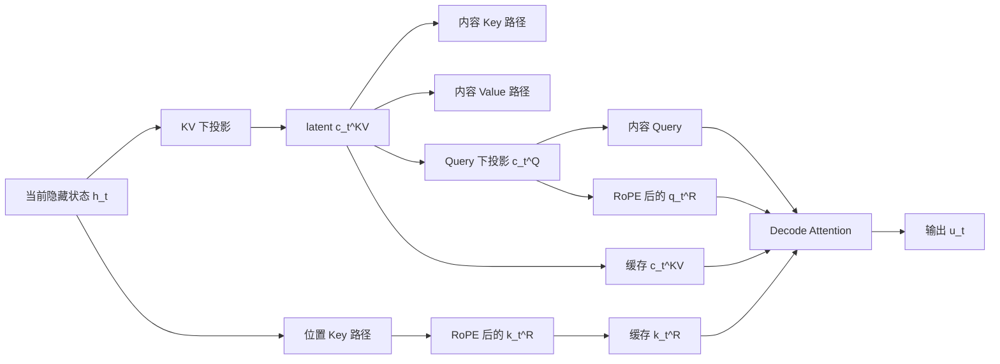

KV Cache 的大头不是模型参数，而是 Decode 时反复从显存读回的历史 Key 和 Value。DeepSeek-V2 的 MLA 把它们联合压进一个 latent，再用一条很窄的 RoPE 位置通道补回相对位置信息；论文报告与 DeepSeek 67B 相比 KV cache 减少 93.3%，在 8 张 H800 上最大生成吞吐达到 5.76 倍，但这两个数字还叠加了实际部署的 6-bit 平均 KV 量化，不能误读成“某个公式必然带来 93.3%”。

<!-- more -->
## 📑 目录
- [🗺️ 原文阅读地图](#-原文阅读地图)
- [0. 读前 3 分钟](#0-读前-3-分钟)
- [1. 为什么需要：KV Cache 是 Decode 的带宽账](#1-为什么需要kv-cache-是-decode-的带宽账)
- [2. 核心思想：不缓存完整 K/V，缓存 latent](#2-核心思想不缓存完整-kv缓存-latent)
- [3. 方法拆解：四个关键机制](#3-方法拆解四个关键机制)
- [4. 效果与对比：把数字口径分开](#4-效果与对比把数字口径分开)
- [5. 权衡与局限：省下的显存从哪里来](#5-权衡与局限省下的显存从哪里来)
- [🕰️ 原文时代 vs 当前工程](#-原文时代-vs-当前工程)
- [📝 总结](#-总结)
- [🎯 自我检验清单](#-自我检验清单)
- [📚 参考资料](#-参考资料)
## 🗺️ 原文阅读地图
这篇文章精读 DeepSeek-V2 的注意力部分，不把整篇 MoE 论文重新讲一遍。

| 原文单元 | 处理深度 | 本文位置与理由 | 来源锚点 |
|---|---|---|---|
| §2.1.1 Standard MHA | 精讲 | 建立符号、Attention 输入输出与 KV cache 基线 | §2.1.1，公式 1–8 |
| Figure 3：MHA、GQA、MQA、MLA | 精讲 | 先看缓存对象如何改变，再看矩阵细节 | Figure 3 |
| §2.1.2 Low-Rank Key-Value Joint Compression | 精讲 | 文章的第一条主线，解释 latent 为什么能替代完整 K/V | 公式 9–11 |
| §2.1.2 Query Compression | 精讲 | 区分训练期激活显存与推理期 KV cache | 公式 12–13 |
| §2.1.3 Decoupled RoPE | 精讲 | 解释普通 RoPE 为什么破坏低秩路径，以及如何拆通道 | 公式 14–19 |
| Figure 2：DeepSeek-V2 整体架构 | 简述 | 只看图中下方 MLA 区域，上方 DeepSeekMoE 不展开 | Figure 2 |
| Table 1 与 §2.1.4 | 精讲 | 完成 MHA、GQA、MQA、MLA 的元素账本 | Table 1，§2.1.4 |
| Appendix D.1、D.2 消融 | 简述 | 只说明质量对照的位置，不复制完整 benchmark | Appendix D.1–D.2 |
| §3.2.3 Inference Efficiency | 简述 | 保留 93.3%、6-bit、5.76 倍的实验条件 | §3.2.3 |
| §2.2 DeepSeekMoE | 不展开 | 它回答训练成本与专家路由问题，不改变本文 MLA 主线 | §2.2 |
| 其余训练、对齐与全部 benchmark | 不展开 | 超出本篇“§2.1 机制精读”的承诺 | §1、§3–§5 |

## 0. 读前 3 分钟

### 0.1 先把问题钉死：你要追踪哪一份状态
**你只需要沿着一条数据流走：当前 token 的隐藏状态 `h_t`，经过压缩，变成可缓存的状态；下一步 Decode 只读取这些状态。**

在标准自回归生成中，当前 token 产生 Query，历史 token 提供 Key 和 Value。

Query 只属于当前时刻，不需要留给未来的每一步复用。

Key 和 Value 属于历史前缀，未来每个 token 都要访问它们，所以才进入 KV Cache。

本文把“缓存什么”作为主线，而不是重新解释 Softmax 或 Causal Mask。
### 0.2 最小符号表

| 符号 | 含义 | 本文用途 |
|---|---|---|
| $d$ | Transformer 隐藏维度 | `h_t` 的维度 |
| $n_h$ | Query 注意力头数 | MHA 的头数 |
| $d_h$ | 每个头的维度 | 一个头中 Q、K、V 的宽度 |
| $l$ | Transformer 层数 | cache 账本要乘的层数 |
| $d_c$ | KV latent 的维度 | MLA 的低秩瓶颈宽度 |
| $d_c^{\prime}$ | Query latent 的维度 | 训练激活压缩宽度 |
| $d_h^R$ | Decoupled RoPE 每头维度 | 位置通道的宽度 |
| $\mathbf{c}_t^{KV}$ | 当前 token 的 KV 联合 latent | MLA 推理时的主要缓存 |
| $\mathbf{c}_t^Q$ | 当前 token 的 Query latent | 训练期激活压缩的中间状态 |

DeepSeek-V2 的论文配置是 $l=60$、$n_h=128$、$d_h=128$、$d_c=512$、$d_c^{\prime}=1536$、$d_h^R=64$。

这些是论文的模型超参数，不是所有 DeepSeek 系列模型或所有 MLA 实现的默认值。
### 0.3 你需要的三个前置
第一，Attention 的内容路径可以写成“Query 和 Key 算相关性，再用权重汇总 Value”。

第二，KV Cache 是把历史 Key、Value 存起来，避免每个 Decode step 重新计算前缀的投影。

第三，RoPE 会把位置编码进 Q、K 的几何关系；完整推导见站内 [3.5 Transformer 位置编码深入理解](/AIInfraGuide/prerequisites/模块一-前置知识/transformer/35-transformer位置编码深入理解)，本文只保留 MLA 需要的那一步。

如果你想先看完整的 Prefill、Decode 和 KV Cache 生命周期，可先读站内 [3.8 从 Transformer 到 LLM 自回归生成深入理解](/AIInfraGuide/prerequisites/模块一-前置知识/transformer/38-从transformer到llm自回归生成深入理解)。

工程侧的分页、量化、前缀复用与长上下文边界，集中在 [12.4 KV Cache 与长上下文](/AIInfraGuide/inference/模块四-推理优化/第12章-tensorrt推理引擎/124-kv-cache与长上下文)。


*图源：DeepSeek-V2 论文 Figure 2，arXiv:2405.04434*

这张图先给你一个边界：左侧是 Transformer Block，右上是 DeepSeekMoE，右下才是本文精读的 MLA。
## 1. 为什么需要：KV Cache 是 Decode 的带宽账

### 1.1 为什么 Decode 越往后越像“读仓库”
**因为每生成一个新 token，当前 Query 都要和更长的历史 Key、Value 交互。**

Prefill 可以把一整个 prompt 组成大矩阵，一次进行大量并行计算。

Decode 则通常一次只生成一个 token。

这一个 token 的 Query 很小，却要访问从第一个 token 到当前末尾的所有历史状态。

因此，Decode 常见的瓶颈不是“乘法算得不够快”，而是“显存来不及把历史数据搬到计算单元”。

KV Cache 的通用显存账可以写成：
$$
M_{\mathrm{KV}}=\underbrace{2}_{\text{K 与 V 各一份}}\times\underbrace{l}_{\text{层数}}\times\underbrace{n_{\mathrm{kv}}}_{\text{KV 头数}}\times\underbrace{d_h}_{\text{每头维度}}\times\underbrace{S}_{\text{序列长度}}\times\underbrace{B}_{\text{批大小}}\times\underbrace{b}_{\text{每元素字节数}}.
$$
直觉上，这个式子只做一件事：把“每个 token 的 KV 单元数”乘上层数、序列长度、批大小和数据类型字节数。

其中的 $2$ 不是平方，而是 K 与 V 两份状态；$S$ 和 $B$ 是最容易把账放大的两个量。

用一个已有路线中常见的算例检查数量级：$l=32$、$n_{\mathrm{kv}}=32$、$d_h=128$、$S=4096$、$B=16$、FP16 的 $b=2$。
$$
M_{\mathrm{KV}}=2\times32\times32\times128\times4096\times16\times2\ \mathrm{bytes}\approx32\ \mathrm{GiB}.
$$
这是推导算例，不是 DeepSeek-V2 的实测部署数字。

它只想说明一件事：当序列和并发同时变大时，KV Cache 会先于算力把显存预算吃光。
### 1.2 MHA、MQA、GQA：先减少“柜子”，再问质量
标准 Multi-Head Attention（MHA）为每个 Query 头保留一组独立的 K、V。

如果有 $n_h$ 个头，那么每个 token 每层要缓存：
$$
C_{\mathrm{MHA}}=\underbrace{2}_{\text{K 与 V}}\times\underbrace{n_h}_{\text{每头一组}}\times\underbrace{d_h}_{\text{每头宽度}}.
$$
**MQA 的做法是让所有 Query 头共享一组 K、V。**

它把头数乘数从 $n_h$ 降到 $1$，所以：
$$
C_{\mathrm{MQA}}=2d_h.
$$
**GQA 的做法是让一组 Query 头共享一组 K、V。**

如果共有 $n_g$ 组 KV，那么：
$$
C_{\mathrm{GQA}}=2n_gd_h,\qquad 1\leq n_g\leq n_h.
$$
当 $n_g=n_h$ 时，GQA 退化为 MHA；当 $n_g=1$ 时，GQA 退化为 MQA。

用 $n_h=8$、$d_h=2$ 的小账本走一遍：

| 结构 | KV 组数 | 每 token 每层元素数 | 相对 MHA |
|---|---:|---:|---:|
| MHA | 8 | $2\times8\times2=32$ | 1 倍 |
| GQA | 2 | $2\times2\times2=8$ | 1/4 |
| MQA | 1 | $2\times1\times2=4$ | 1/8 |

GQA 和 MQA 都在减少缓存的“份数”，但每份 K、V 仍然是完整维度。

DeepSeek-V2 在 §2.1 中明确指出，MQA 和 GQA 虽然需要更小的 KV Cache，但性能没有达到 MHA 的水平；详细消融放在 Appendix D.1。

这句话不是说 MQA 或 GQA 在所有模型上都一定失败，而是论文对其对比设置的结论。
### 1.3 GQA 已经不够了吗
**问题不在于 GQA 没有收益，而在于它仍然按 token 保存完整维度的 K、V。**

只要序列长度 $S$ 继续增长，缓存仍然是线性增长。

只要每个 KV 组仍然保存完整向量，单个历史 token 仍然携带两份完整内容。

所以问题变成了：能不能不保存完整 K、V，却在需要计算 Attention 时仍然保留足够的信息？

这就是 MLA 的切入点。
## 2. 核心思想：不缓存完整 K/V，缓存 latent

### 2.1 一句话先说清
**MLA 不把历史 token 的完整 K、V 放进缓存，而是把 K、V 联合压缩成一个低维 latent；Decode 时沿内容通道按需使用它，再用单独的 RoPE 通道补上位置关系。**

这里有两个动作，不能混成一个动作。

第一个动作是“压缩内容”：一个 $\mathbf{c}_t^{KV}$ 同时服务 K 和 V。

第二个动作是“拆出位置”：额外的 $\mathbf{k}_t^R$ 负责被 RoPE 旋转的位置部分。
### 2.2 这和 GQA 到底差在哪
打个比方：GQA 是把仓库里的完整档案分成更少的柜子，每个柜子仍然放完整档案；MLA 是先把 K、V 的共同信息整理成一张低维索引卡，仓库只保存索引卡，需要计算时再沿固定投影路径使用它。

这个比喻里的“完整档案”对应完整 K、V，“索引卡”对应 $\mathbf{c}_t^{KV}$，“固定投影路径”对应上投影矩阵与吸收后的 Attention 计算。

用技术语言重述就是：GQA 改变 $n_g$，MLA 改变每个历史 token 的表示维度，并且让 K、V 共享同一个压缩状态。


*图源：DeepSeek-V2 论文 Figure 3，arXiv:2405.04434*

这张图讲的是缓存对象的变化：左边三种方法仍在缓存 K、V，只是共享程度不同；MLA 的右侧把完整 K、V 投影到压缩 latent 中。
### 2.3 一次 Decode 的状态流
你可以把一次 Decode 看成下面这条状态流：



这张图的关键不是模块数量，而是缓存出口只有两个：内容 latent $\mathbf{c}_t^{KV}$ 与位置 Key $\mathbf{k}_t^R$。

完整的每头 K、V 不再作为历史 cache 的主要存储对象。
## 3. 方法拆解：四个关键机制

### 3.1 机制一：先用 MHA 建立缓存账本
为什么先讲 MHA？因为 MLA 的收益必须相对于“本来要存什么”来计算。

设第 $t$ 个 token 在一层 Attention 中的隐藏状态为 $\mathbf{h}_t\in\mathbb{R}^{d}$。

标准 MHA 经过三个投影得到：
$$
\mathbf{q}_t=W^Q\mathbf{h}_t,\qquad
\mathbf{k}_t=W^K\mathbf{h}_t,\qquad
\mathbf{v}_t=W^V\mathbf{h}_t.
$$
直觉是三条并行的线性投影，分别产生“我要找什么”“历史有什么”“找到后传什么”。

逐项看，$W^Q$ 产生当前查询，$W^K$ 产生可被未来查询匹配的键，$W^V$ 产生被加权汇总的值。

每个向量再切成 $n_h$ 个头，每个头宽度是 $d_h$。

因此，MHA 每个 token 每层的历史缓存元素数是：
$$
C_{\mathrm{MHA}}=2n_hd_h.
$$
这里的 $2$ 对应 K、V 两份，$n_h$ 对应每个头一份，$d_h$ 对应每份的宽度。

DeepSeek-V2 的配置代入后，每层每 token 的 MHA 对照账是：
$$
C_{\mathrm{MHA}}=2\times128\times128=32768\ \text{elements}.
$$
这个数字是同配置 MHA 对照值，用来理解结构性压缩，不是论文报告的 DeepSeek 67B 部署 cache 数字。
### 3.2 机制二：K/V 低秩联合压缩
能不能把两个完整向量先变成一个小向量？论文的核心公式是三步。

**步骤 1：把隐藏状态压到 KV latent。**
$$
\mathbf{c}_t^{KV}=\underbrace{W^{DKV}\mathbf{h}_t}_{\text{KV 下投影,得到共同 latent}}.
$$
$\mathbf{c}_t^{KV}\in\mathbb{R}^{d_c}$ 是要缓存的低维状态，$W^{DKV}\in\mathbb{R}^{d_c\times d}$ 是下投影矩阵。

如果 $d_c\ll n_hd_h$，那么每个历史 token 的主要缓存宽度就明显变小。

**步骤 2：沿 Key 路径上投影。**
$$
\mathbf{k}_t^C=\underbrace{W^{UK}\mathbf{c}_t^{KV}}_{\text{KV latent 到内容 Key 的上投影}}.
$$
$W^{UK}\in\mathbb{R}^{d_hn_h\times d_c}$ 把 latent 映射回所有头的内容 Key 表示。

**步骤 3：沿 Value 路径上投影。**
$$
\mathbf{v}_t^C=\underbrace{W^{UV}\mathbf{c}_t^{KV}}_{\text{KV latent 到内容 Value 的上投影}}.
$$
$W^{UV}\in\mathbb{R}^{d_hn_h\times d_c}$ 与 $W^{UK}$ 不同，但共享同一个输入 latent。

这三个式子真正表达的是：**缓存的是一个共同的压缩状态，不是分别缓存 $\mathbf{k}_t^C$ 和 $\mathbf{v}_t^C$。**

用 DeepSeek-V2 的论文配置算一遍：$d_c=512$，而同配置完整 MHA 的 K、V 合计是 $32768$ 个元素。

MLA 内容 latent 每层每 token 只需：
$$
512\ \text{elements}\quad\text{相对完整 MHA 的表示级比例为}\quad\frac{512}{32768}=1.5625\%.
$$
这是只看内容 latent 的结构算例，Decoupled RoPE 的位置 Key 还要另外缓存；它不能直接当作完整 MLA 的最终比例。
### 3.3 为什么推理时甚至不必恢复完整 K、V
如果每次 Decode 都把 $\mathbf{c}_t^{KV}$ 上投影成完整 K、V，再做普通 Attention，缓存虽然变小了，但计算路径仍然不够干净。

论文指出，$W^{UK}$ 可以吸收到 Query 投影路径，$W^{UV}$ 可以吸收到输出投影路径。

先看内容 Key 的相关性项：
$$
(\mathbf{q}_t^C)^T\mathbf{k}_j^C
=(\mathbf{q}_t^C)^T W^{UK}\mathbf{c}_j^{KV}.
$$
直觉上，历史 token 只提供 $\mathbf{c}_j^{KV}$；当前 Query 可以先经过与 $W^{UK}$ 合并后的路径，再直接和 latent 做相关性计算。

逐项看，左边是完整内容 Query 与完整内容 Key 的内积；右边把历史端的上投影保留为可合并的线性变换。

这就是论文所说的吸收路径，具体张量布局与多头拼接由实现决定。

Value 路径也有同样的线性结合律：
$$
W^O\left(\sum_j\alpha_j\mathbf{v}_j^C\right)
=W^O\left(\sum_j\alpha_jW^{UV}\mathbf{c}_j^{KV}\right)
=\left(W^OW^{UV}\right)\sum_j\alpha_j\mathbf{c}_j^{KV}.
$$
这个公式做三件事：先按 Attention 权重 $\alpha_j$ 汇总 Value，再应用 $W^{UV}$，最后应用输出投影 $W^O$。

因为这些是线性矩阵乘法，$W^{UV}$ 可以并入输出侧，避免逐历史 token 恢复完整 Value。

数值上，假设有三个历史 token，权重是 $0.2、0.3、0.5$，它们的 latent 是 $c_1、c_2、c_3$。

上式的右侧先算 $0.2c_1+0.3c_2+0.5c_3$，只需对 latent 做加权汇总；不会因为 Value 上投影而改变权重的加法结构。

**低秩压缩省下的是历史状态的存储宽度；吸收路径省下的是 Decode 中恢复完整 K、V 的必要性。**
### 3.4 机制三：训练期 Query 压缩
为什么论文还要压缩 Query？因为训练时激活显存也会变大。

注意，这一步和 KV Cache 不是同一笔账。

当前 Query 不会作为未来所有 step 的历史状态保存，所以压缩 Query 本身不能减少 KV Cache。

论文给出的 Query 路径是：
$$
\mathbf{c}_t^Q=\underbrace{W^{DQ}\mathbf{h}_t}_{\text{Query 下投影,得到训练激活 latent}}.
$$

$$
\mathbf{q}_t^C=\underbrace{W^{UQ}\mathbf{c}_t^Q}_{\text{Query 上投影,恢复内容 Query 表示}}.
$$
$\mathbf{c}_t^Q\in\mathbb{R}^{d_c^{\prime}}$，而 $d_c^{\prime}$ 与 KV 的 $d_c$ 不必相同。

论文配置中 $d_c^{\prime}=1536$，完整多头 Query 宽度是 $n_hd_h=128\times128=16384$。

只比较这个中间向量的元素数：
$$
\frac{1536}{16384}=9.375\%,\qquad 1-\frac{1536}{16384}=90.625\%.
$$
这是文章按配置做的表示级估算，不是论文报告的端到端激活显存下降百分比。

它能帮助你理解“为什么要单独压 Q”：压的是训练时保存的中间激活，换取更低的激活显存；并不是把历史 KV Cache 再减一遍。
### 3.5 机制四：普通 RoPE 为什么会卡住低秩路径

#### 3.5.1 先保留 RoPE 的最小性质
RoPE 把位置 $m$ 的 Query 和位置 $n$ 的 Key 乘上不同的旋转矩阵。

如果 $R_m$ 和 $R_n$ 分别表示这两个位置的旋转，那么内积中的位置关系可以写成：
$$
\tilde{\mathbf{q}}_m^T\tilde{\mathbf{k}}_n
=\mathbf{q}_m^TR_m^TR_n\mathbf{k}_n
=\mathbf{q}_m^TR_{n-m}\mathbf{k}_n.
$$
直觉是两个绝对旋转相乘后，留下相对位置差 $n-m$。

$R_m^T=R_{-m}$，所以 $R_m^TR_n=R_{n-m}$；这正是 RoPE 把相对位置信息放进内积的原因。

举一个最小位置算例：如果当前 Query 在位置 $m=2$，历史 Key 在位置 $n=5$，位置通道最终携带的是差值 $n-m=3$。

这里沿用 [3.5 Transformer 位置编码深入理解](/AIInfraGuide/prerequisites/模块一-前置知识/transformer/35-transformer位置编码深入理解) 的几何背景，不重复它的高维推导。
#### 3.5.2 失败点不是“不能旋转”，而是“不能再吸收”
**如果把普通 RoPE 直接施加到 MLA 的内容 Key 上，位置矩阵会夹在 Query 投影与 Key 上投影之间，破坏原来的吸收顺序。**

论文 §2.1.3 的论证重点是矩阵乘法不满足交换律。

用两个简单的二维矩阵把这个问题算出来。令一个 90 度旋转矩阵为：
$$
R=\begin{bmatrix}0&-1\\1&0\end{bmatrix},\qquad
W=\begin{bmatrix}1&1\\0&1\end{bmatrix}.
$$
先算 $RW$：
$$
RW=\begin{bmatrix}0&-1\\1&1\end{bmatrix}.
$$
再算 $WR$：
$$
WR=\begin{bmatrix}1&-1\\1&0\end{bmatrix}.
$$
两个结果不同，所以 $RW\neq WR$。

这个数值反例只是在解释矩阵顺序，不是 DeepSeek-V2 的模型参数。

在 MLA 中，如果位置相关的 RoPE 矩阵插入 $W^{UK}$ 附近，就不能把 $W^{UK}$ 直接并入当前 Query 的固定投影。

更具体地说，当前生成位置会让旋转矩阵随 $t$ 变化。

你若想保持普通 MHA 的等价路径，就必须重新处理历史前缀的 Key。

论文因此指出，直接这样做会迫使推理时重新计算前缀 token 的 Key，严重削弱 KV Cache 的价值。

这就是第一个失败条件：**不是低秩 latent 不能表示内容，而是位置旋转破坏了“历史 latent 可直接复用”的线性吸收路径。**
#### 3.5.3 Decoupled RoPE：把内容和位置拆成两条通道
打个比方：把 Attention 的通道看成两条车道，一条只运内容，一条只运位置；内容车道允许低秩压缩，位置车道保留 RoPE 的几何规则，最后在进入 Attention 前汇合。

这个比喻里的内容车道对应 $\mathbf{q}^C、\mathbf{k}^C、\mathbf{v}^C$，位置车道对应 $\mathbf{q}^R、\mathbf{k}^R$。

用技术语言重述，论文新增每头 Query 位置向量 $\mathbf{q}_{t,i}^R$，以及所有头共享的 Key 位置向量 $\mathbf{k}_t^R$。

位置 Query 来自 Query latent：
$$
[\mathbf{q}_{t,1}^R;\ldots;\mathbf{q}_{t,n_h}^R]
=\mathbf{q}_t^R
=\operatorname{RoPE}(W^{QR}\mathbf{c}_t^Q).
$$
位置 Key 来自隐藏状态：
$$
\mathbf{k}_t^R=\operatorname{RoPE}(W^{KR}\mathbf{h}_t).
$$
$W^{QR}$ 产生每个头的 RoPE Query，$W^{KR}$ 产生共享的 RoPE Key，$d_h^R$ 是这条位置通道的每头宽度。

然后把内容和位置拼接成真正参与 Attention 的向量：
$$
\mathbf{q}_{t,i}=[\mathbf{q}_{t,i}^C;\mathbf{q}_{t,i}^R],\qquad
\mathbf{k}_{t,i}=[\mathbf{k}_{t,i}^C;\mathbf{k}_t^R].
$$
Value 仍然沿内容路径产生：
$$
\mathbf{o}_{t,i}=\sum_{j=1}^{t}
\operatorname{Softmax}_j\left(
\frac{\mathbf{q}_{t,i}^T\mathbf{k}_{j,i}}
{\sqrt{d_h+d_h^R}}
\right)\mathbf{v}_{j,i}^C.
$$
这个公式的分子同时包含内容通道和位置通道的内积，分母中的 $d_h+d_h^R$ 是拼接后的总宽度。

输出再把各头拼接并经过 $W^O$：
$$
\mathbf{u}_t=W^O[\mathbf{o}_{t,1};\mathbf{o}_{t,2};\ldots;\mathbf{o}_{t,n_h}].
$$

#### 3.5.4 到底缓存哪两样东西
**Decoupled RoPE 后，KV Cache 的状态是 $\mathbf{c}_t^{KV}$ 加上共享位置 Key $\mathbf{k}_t^R$。**

论文明确指出，位置 Key 也必须缓存。

所以每个 token 的总缓存元素数是：
$$
C_{\mathrm{MLA}}=(d_c+d_h^R)l.
$$
代入 DeepSeek-V2 的 $d_c=512$、$d_h^R=64$、$l=60$：
$$
C_{\mathrm{MLA}}=(512+64)\times60=34560\ \text{elements/token}.
$$
这个数字包含内容 latent 与位置 Key，不包含“恢复完整 K、V”的中间张量，因为 MLA 的吸收路径就是为了避免把它们作为历史缓存存下来。

把镜头拉近前面 Figure 2 的右下角：latent $\mathbf{c}_t^{KV}$ 经过内容路径产生 $\mathbf{k}_{t,i}^C$、$\mathbf{v}_{t,i}^C$，另一条路径对 $\mathbf{k}_t^R$ 应用 RoPE；两部分拼接后进入多头 Attention。
### 3.6 把四个机制串成一次推理
下面是面向理解的伪代码，不是 DeepSeek-V2 或某个推理框架的逐字源码。

```text
# Prefill：每个历史 token 都建立一份可复用状态
for token t in prompt:
    h_t = transformer_hidden(t)
    c_kv[t] = W_DKV @ h_t                 # 内容 latent，进入 KV cache
    c_q[t] = W_DQ @ h_t                   # 当前计算需要的 Query latent
    k_r[t] = RoPE(W_KR @ h_t)             # 位置 Key，也进入 KV cache
# Decode：只为新 token 计算 Query，读取历史的两类缓存
h_t = transformer_hidden(new_token)
c_q = W_DQ @ h_t
q_c = W_UQ @ c_q
q_r = RoPE(W_QR @ c_q)

for history j <= t:
    # 内容路径直接使用 c_kv[j]，不要求先恢复完整 K/V
    score_content[j] = absorbed_query(q_c) dot c_kv[j]
    score_position[j] = q_r dot k_r[j]

weights = softmax(score_content + score_position)
output = absorbed_output(weighted_sum(weights, c_kv))
```

这段伪代码的输入是当前隐藏状态和历史 cache。

它改变的状态是两个数组：`c_kv` 与 `k_r`。

它的输出是当前 token 的 Attention 输出。

如果把普通 RoPE 直接塞进内容 Key 的上投影路径，`absorbed_query` 这条固定路径就会失效，历史 Key 可能需要重算。
## 4. 效果与对比：把数字口径分开

### 4.1 先看论文 Table 1 的结构账
论文 Table 1 按“每 token 的元素数”比较缓存，不把 FP16、FP8 或 6-bit 存储精度混进这个表。

| 注意力机制 | 每 token 每层的 KV cache 元素 | 能力描述（论文表中） | 数字口径 |
|---|---:|---|---|
| MHA | $2n_hd_h$ | Strong | 论文结构公式 |
| GQA | $2n_gd_h$ | Moderate | 论文结构公式 |
| MQA | $2d_h$ | Weak | 论文结构公式 |
| MLA | $d_c+d_h^R$（跨 $l$ 层为 $(d_c+d_h^R)l$） | Stronger | 论文 Table 1 |

DeepSeek-V2 取 $d_c=4d_h$、$d_h^R=d_h/2$。

所以 MLA 的每层每 token 账是：
$$
C_{\mathrm{MLA,layer}}=4d_h+\frac{d_h}{2}=\frac{9}{2}d_h.
$$
若用 GQA 的公式 $2n_gd_h$ 对齐：
$$
2n_gd_h=\frac{9}{2}d_h
\quad\Longrightarrow\quad
n_g=\frac{9}{4}=2.25.
$$
**“等价于 GQA 2.25 组”是缓存元素数等价，不是实际存在 2.25 个 KV 组。**

用 $d_h=128$ 代入，MLA 每层每 token 是 $4.5\times128=576$ 个元素。

用同样的 128 个 Query 头做 MHA 对照，每层每 token 是 $2\times128\times128=32768$ 个元素。

结构性比例是：
$$
1-\frac{576}{32768}=98.2421875\%.
$$
这是文章根据论文配置做的估算，回答的是“同一 128 头 MHA 对照下，MLA 的元素账有多小”。

它不是论文摘要中与 DeepSeek 67B 对比的 93.3%。
### 4.2 “93.3%”到底是哪一笔账
**论文报告的 93.3% 是端到端部署对比，不是只把 Table 1 的一行公式代入就能得到的常数。**

论文摘要、Introduction 和 Figure 1 都把比较对象写成 DeepSeek 67B。

§3.2.3 进一步说明了部署条件：

- **参数精度**：先把 DeepSeek-V2 的参数转换为 FP8。
- **KV 精度**：对 KV Cache 做量化，平均每个元素压到 6 bit。
- **负载设置**：用实际部署 DeepSeek 67B 服务中的 prompt 与 generation length 分布评估生成吞吐。
- **硬件设置**：单节点 8 张 H800 GPU。

因此，93.3% 的来源链是“MLA 的结构性 cache 压缩 + 实际模型配置 + KV Cache 量化 + 对照服务配置”。

把它写成审计公式就是：
$$
\mathrm{KV\ reduction}
=1-\frac{\mathrm{DeepSeek\text{-}V2\ deployed\ KV\ bytes}}
{\mathrm{DeepSeek\ 67B\ deployed\ KV\ bytes}}
=93.3\%\quad\text{(论文报告)}.
$$
这个式子没有把分子分母的完整配置展开，所以不应该拿它当作任何 MLA 模型的通用预测公式。
### 4.3 5.76 倍吞吐也有边界
论文在同一个 §3.2.3 中报告，DeepSeek-V2 在单节点 8 张 H800 上的生成吞吐超过 50K tokens/s。

这个吞吐是 DeepSeek 67B 最大生成吞吐的 5.76 倍。

这里的“最大”属于论文自己的服务评估口径，不等于单请求延迟提升 5.76 倍。

它也不等于所有硬件、所有 batch、所有输出长度下都能复现 5.76 倍。

Decode 之所以受益，是因为历史状态更小，显存读写压力与可服务 batch 空间更有利。

但真正能否兑现，还取决于 MLA 专用 Attention kernel、量化是否融合、并行方式和请求分布。


*图源：DeepSeek-V2 论文 Figure 1，arXiv:2405.04434*

图中三个柱状对比要分开读：训练成本、生成 KV cache、最大生成吞吐不是同一个指标；93.3% 与 5.76 倍分别落在后两个子图。
### 4.4 论文对质量的证据放在哪里
§2.1 直接给出的结论是 MLA 的性能优于 MHA，同时需要显著更少的 KV Cache。

MHA、GQA、MQA 的消融在 Appendix D.1，MLA 与 MHA 的比较在 Appendix D.2。

本文不把附录中的完整任务表搬过来，因为主线是解释机制和 cache 账，而不是复刻 DeepSeek-V2 全部 benchmark。

所以本文可以忠实地说“论文报告 MLA 在其对照中更强”，但不能把它改写成“MLA 在任何模型、任何 rank、任何任务上都无损”。
## 5. 权衡与局限：省下的显存从哪里来

### 5.1 每个收益都对应一笔代价

| 设计 | 换来的东西 | 付出的代价 | 适用边界 |
|---|---|---|---|
| KV 联合低秩压缩 | 更小的历史状态与更高的并发空间 | 压缩 rank、投影矩阵与专用 kernel | checkpoint 必须按 MLA 训练，不能只改配置 |
| Query 低秩压缩 | 更小的训练激活表示 | 新增下投影与上投影，且不直接省 KV | 主要解释训练内存，不应当当成 cache 优化 |
| Decoupled RoPE | 保留相对位置结构与吸收路径 | 多一条位置通道，且要缓存 $k^R$ | 需要正确处理位置通道与 cache 布局 |
| KV 量化 | 更少字节与更低带宽压力 | 数值误差、scale 与 kernel 融合要求 | 需要按任务和后端实测精度与吞吐 |
| MLA 专用 kernel | 把 latent cache 的优势兑现成吞吐 | 硬件、后端、page size 与版本耦合 | 不能只看论文公式判断部署性能 |

**MLA 不是“免费压缩”，而是用模型结构、训练复杂度和实现复杂度换推理期的内存带宽。**
### 5.2 三个最容易算错的地方

#### 错误一：把 93.3% 写成 MLA 的必然公式
看起来合理的写法是：“MLA 把 KV cache 压缩 93.3%。”

错误在于它省略了比较对象和部署设置。

论文的 93.3% 是 DeepSeek-V2 与 DeepSeek 67B 的部署对比，且 §3.2.3 明确加入了平均 6-bit KV 量化。

正确写法是：“论文在给定部署对比中报告 KV cache 减少 93.3%；按 Table 1 做同配置元素估算，结构比例要单独计算。”
#### 错误二：把“GQA 2.25 组”当成真实架构
看起来合理的写法是：“MLA 使用 2.25 个 KV 组。”

错误在于把“缓存元素等价”误读成“实际头数”。

MLA 的真实缓存是 $\mathbf{c}^{KV}$ 与 $\mathbf{k}^R$，它不是 GQA 的 fractional group 实现。

正确写法是：“按 Table 1 的元素公式，MLA 的 cache 大小等价于 GQA 2.25 组。”
#### 错误三：认为 Query 压缩也会减少历史 KV
看起来合理的写法是：“Q 也压到 latent，所以 KV cache 再减一遍。”

错误在于当前 Query 不是历史缓存对象。

论文原文明确说明 Query compression 不能减少 KV cache，目标是减少训练期 activation memory。

正确做法是把 $d_c^{\prime}$ 放在激活账本，把 $d_c+d_h^R$ 放在推理 KV 账本。
#### 错误四：直接对压缩后的内容 Key 施加普通 RoPE
看起来合理的写法是：“先存 latent，Decode 时恢复 K，最后照常套 RoPE。”

问题在于位置相关矩阵会打断 $W^{UK}$ 的吸收路径。

矩阵顺序不能随意交换，历史前缀 Key 可能被迫重算。

正确做法是把 RoPE 放进 decoupled position channel，并缓存共享的 $k^R$。
### 5.3 MLA 的第一个失败条件是什么
**第一个失败条件是：你把位置旋转放在内容低秩路径里，导致历史 Key 不能以固定线性路径复用。**

这不是“某个 GPU kernel 没优化好”的小问题。

它会直接改变算法的缓存语义。

一旦每个 Decode step 都要重新处理整个前缀，KV Cache 的主要收益就被抵消。

所以 Decoupled RoPE 是 MLA 的必要组成部分，而不是一个可有可无的装饰模块。
### 5.4 什么时候不该把 MLA 当成万能药
如果你已经有一个训练好的 MHA checkpoint，不能只把 `num_kv_heads` 或 cache shape 改成 MLA。

MLA 需要对应的低秩投影矩阵、Query compression 路径、位置通道和训练结果。

如果你的瓶颈是 Prefill 的矩阵计算，而不是 Decode 的历史 KV 读带宽，MLA 的主要优势也不会按论文的吞吐数字原样出现。

如果后端只能先反量化，再把量化 KV 交给普通 Attention kernel，节省的字节可能换不来吞吐。

如果任务对细节保真很敏感，低秩 rank 和 KV 量化都应该在自己的数据集上做精度回归。

落成一句话的规则是：**模型本来就是 MLA，且服务负载受 Decode KV 带宽限制时，优先使用原生 MLA 后端；不要为了“显得先进”给普通 MHA 临时套一层压缩。**
## 🕰️ 原文时代 vs 当前工程

### 6.1 原文时代：2024 年的论文承诺
DeepSeek-V2 的 arXiv v1 提交日期是 2024-05-07，当前 HTML 页面标注的 v5 修订日期是 2024-06-19。

论文的核心工程证据是在 NVIDIA H800 集群与单节点 8×H800 的服务设置上给出的。

论文时代的关键结论是：MLA 用低秩联合压缩解决 KV Cache 瓶颈，Decoupled RoPE 让 RoPE 不破坏这条缓存路径。

论文没有承诺“任意推理框架、任意 GPU 都有 5.76 倍”。
### 6.2 当前工程：MLA 已从论文公式进入后端选择
截至 2026-08-19，vLLM latest 的 supported models 页面列出 `DeepseekV2ForCausalLM`，API 文档也有独立的 MLA backend 模块。

这说明 MLA 已被推理框架作为模型与 Attention 后端的一等实现对象处理。

但“有实现”不等于“你的配置一定快”。具体吞吐、显存占用和量化精度在本文中属于“待核实”，没有拿当前目标硬件的实测冒充论文数字。

你仍要确认模型架构、GPU 架构、Attention backend、KV dtype、分页大小和是否启用了融合路径。

SGLang 当前官方 Attention Backend 文档把 MHA 与 MLA 分成两个支持矩阵。

其中 MLA 后端包含 FlashInfer MLA、FlashMLA、Cutlass MLA、TRTLLM MLA、CuteDSL MLA、TokenSpeed MLA、FA3、Triton 等不同路径，支持的 page size、FP8 或 FP4 KV cache 并不相同。

SGLang 的 DeepSeek-V3 文档还明确列出 Weight Absorption、多个 MLA backend、FP8 KV Cache、CUDA Graph 与 Torch.compile 等优化。

这些资料说明 2024 年的“低秩 cache + 吸收 + 解耦 RoPE”已经落成了工程模块。

它们同时提醒你，论文中的算法结构与今天的 kernel 选择之间还有一层实现工作。
### 6.3 当前部署的最小核查顺序
第一步，确认 checkpoint 的模型架构确实是 MLA，而不是只在名字里出现 DeepSeek。

第二步，确认后端是否原生支持对应 MLA cache layout。

第三步，确认量化 KV 是否在 Attention kernel 内融合，而不是每一步先单独反量化。

第四步，确认 page size 与后端约束一致。

第五步，分别测 TTFT、TPOT、吞吐、显存占用与任务精度。

SGLang 当前量化 KV 文档明确提醒：如果反量化没有和 Attention kernel 融合，吞吐可能显著下降，抵消节省显存带来的收益。

因此，当前工程应该把“MLA 是否正确落地”拆成两层验证：先验证 cache 数学和输出正确，再验证后端是否把数学路径做成高效 kernel。
## 📝 总结
1. **先算对象**：MHA、MQA、GQA 主要改变 KV 组数；MLA 进一步把 K、V 联合压到一个低维 latent。
2. **再算路径**：$\mathbf{c}^{KV}$ 通过 $W^{UK}$、$W^{UV}$ 服务内容 Key、Value，吸收路径让 Decode 不必逐 token 恢复完整 K、V。
3. **别混两种压缩**：Query compression 主要省训练激活，不能直接写成 KV Cache 节省；Decoupled RoPE 则把位置关系从低秩内容路径里拆出来。
4. **最后对数字**：Table 1 的结构账给出 GQA 2.25 组等价；论文报告的 93.3% 与 5.76 倍来自 DeepSeek 67B 对照、6-bit 平均 KV、8×H800 与特定服务负载。
5. **一句话带走**：MLA 用模型结构和 kernel 复杂度换 Decode 时更小的历史状态，Decoupled RoPE 保证这份小状态仍然携带可复用的位置信息。
## 🎯 自我检验清单
读完这一篇，你能完成下面这些动作吗？

- 能写出 $M_{\mathrm{KV}}$ 的每一项含义，并在 $l=32$、$n_{kv}=32$、$d_h=128$、$S=4096$、$B=16$、FP16 下算出约 32 GiB。
- 能用 $2n_hd_h$、$2n_gd_h$、$2d_h$ 分别解释 MHA、GQA、MQA 的缓存差异。
- 能说明 GQA 减少的是 KV 组数，而 MLA 改变的是历史表示的维度与共享方式。
- 能从 $\mathbf{h}_t$ 推到 $\mathbf{c}_t^{KV}$，再解释它如何同时服务内容 Key 与内容 Value。
- 能解释为什么 $W^{UK}$ 可以吸收到 Query 路径、$W^{UV}$ 可以吸收到输出路径。
- 能区分 Query compression 的训练激活目标与 KV Cache 的推理目标，并说明 $1536$ 与 $16384$ 的表示级比例只是估算。
- 能用 $R_m^TR_n=R_{n-m}$ 说明 RoPE 如何携带相对位置差。
- 能用一个二维矩阵反例证明 $RW\neq WR$，并指出这会怎样破坏 MLA 的 absorption 路径。
- 能画出 Decoupled RoPE 的两条通道，并说清为什么要缓存 $\mathbf{c}_t^{KV}$ 与 $\mathbf{k}_t^R$。
- 能用 $d_c=4d_h$、$d_h^R=d_h/2$ 推出 MLA 的 GQA 2.25 组元素等价。
- 能在 $n_h=128$、$d_h=128$ 的对照中算出 576 与 32768，并标注约 98.24% 是文章估算而不是论文 93.3% 报告。
- 能说出 93.3% 与 5.76 倍的比较对象、量化设置、硬件设置和负载边界，而不把它们宣传成通用常数。
## 📚 参考资料

### 论文原文
- [DeepSeek-V2: A Strong, Economical, and Efficient Mixture-of-Experts Language Model](https://arxiv.org/abs/2405.04434)：DeepSeek-AI，arXiv:2405.04434，v1 提交于 2024-05-07，v5 修订于 2024-06-19；本文主要依据 §2.1、Table 1 与 §3.2.3。
- [DeepSeek-V2 HTML 全文](https://arxiv.org/html/2405.04434)：用于核对公式、Figure 2、Figure 3、Figure 1 与章节锚点。
- [DeepSeek-V2 学生幻灯片](https://cocoxu.github.io/CS8803-LLM-spring2026/presentations/2026-02-09/deepseek-v2-a-strong-economical-and-efficient-mixture.pdf)：只作课程结构与知识点索引，数字与结论以论文原文为准。
### 当前工程资料
- [vLLM Supported Models](https://docs.vllm.ai/en/latest/models/supported_models.html)：截至 2026-08-19 的模型支持页面，列出 `DeepseekV2ForCausalLM`。
- [vLLM MLA backend API](https://docs.vllm.ai/en/latest/api/vllm/v1/attention/backends/mla/)：vLLM 当前 MLA Attention backend 的 API 索引；不等同于特定硬件上的性能承诺。
- [SGLang Attention Backend](https://docs.sglang.ai/advanced_features/attention_backend)：当前 MHA/MLA 后端、page size、FP8/FP4 KV cache 支持矩阵。
- [SGLang DeepSeek-V3 文档的 MLA Optimizations](https://docs.sglang.ai/cookbook/autoregressive/DeepSeek/DeepSeek-V3#4-2-4-mla-optimizations)：当前工程中的 Weight Absorption、MLA 后端、FP8 KV 与编译优化说明。
- [SGLang Quantized KV Cache](https://docs.sglang.ai/advanced_features/quantized_kv_cache)：量化 KV 的格式、融合反量化与后端限制。
### 站内延伸
- [3.3 Self-Attention 机制深入理解](/AIInfraGuide/prerequisites/模块一-前置知识/transformer/33-self-attention机制深入理解)：已有 MHA、MQA、GQA、MLA 概览；本文补完整的 MLA 低秩公式、Q 压缩与 Decoupled RoPE。
- [3.5 Transformer 位置编码深入理解](/AIInfraGuide/prerequisites/模块一-前置知识/transformer/35-transformer位置编码深入理解)：已有 RoPE 的完整几何推导；本文只沿用最小性质并解释低秩路径中的失效点。
- [3.8 从 Transformer 到 LLM 自回归生成深入理解](/AIInfraGuide/prerequisites/模块一-前置知识/transformer/38-从transformer到llm自回归生成深入理解)：已有 Prefill、Decode 与 KV Cache 全景；本文聚焦模型结构级压缩。
- [12.4 KV Cache 与长上下文](/AIInfraGuide/inference/模块四-推理优化/第12章-tensorrt推理引擎/124-kv-cache与长上下文)：已有分页、复用、量化与长序列工程账；本文不重复推理引擎侧实现。
