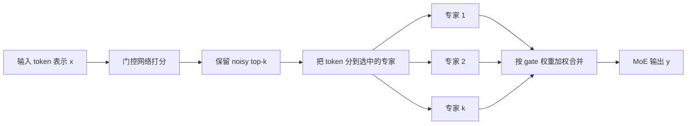
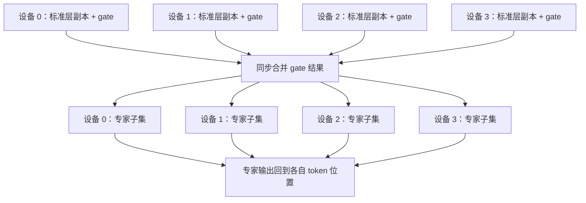
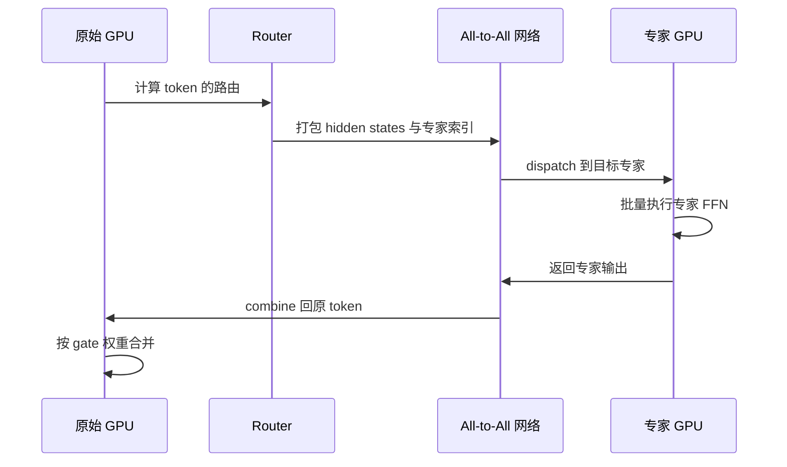

2017 年的这篇论文把一个看似矛盾的目标变成了可运行的系统：混合专家模型（Mixture of Experts，MoE）让模型容量进入 **1000 倍级别**，却让每个 token 仍只计算少数几个专家；在 100B 词语料实验中，65536 个专家对应约 68B 参数、99.994% 的层稀疏度，计算效率仍为 0.72 TFLOPS/GPU。关键不是“把大网络砍掉”，而是把参数容量、条件计算和训练工程一起设计。

<!-- more -->

## 📑 目录

- [🗺️ 原文阅读地图](#-原文阅读地图)
- [0. 读前 3 分钟](#0-读前-3-分钟)
- [1. 为什么需要稀疏条件计算](#1-为什么需要稀疏条件计算)
- [2. 核心思想：把容量和计算拆开](#2-核心思想把容量和计算拆开)
- [3. 方法拆解：门控怎样跑起来](#3-方法拆解门控怎样跑起来)
- [4. 效果与对比：容量真的换来了质量吗](#4-效果与对比容量真的换来了质量吗)
- [5. 权衡与局限：稀疏不是免费午餐](#5-权衡与局限稀疏不是免费午餐)
- [🕰️ 原文时代 vs 当前工程](#-原文时代-vs-当前工程)
- [📝 总结](#-总结)
- [🎯 自我检验清单](#-自我检验清单)
- [📚 参考资料](#-参考资料)

## 🗺️ 原文阅读地图

这篇文章不是把论文 19 页逐段翻译，而是沿着“容量变大以后，为什么还能算得动”这条主线选择性精读。

| 原文单元 | 处理深度 | 本文怎么处理 | 来源锚点 |
|---|---|---|---|
| 条件计算与五类挑战 | 精讲 | 先立稠密扩展的矛盾，再解释后文的工程方案 | 论文 §1.1，PDF pp.1–2 |
| MoE 层与 Figure 1 | 精讲 | 画出输入、门控、专家、加权合并的完整数据流 | 论文 §1.2、§2、Figure 1 |
| Softmax 与 noisy top-k | 精讲 | 用公式和小数字说明“稀疏省计算，噪声防坍缩” | 论文 §2.1，Eqs.2–5 |
| shrinking batch、混合 DP+MP | 精讲 | 解释为什么每个专家拿到的 batch 会变小，以及同步汇聚怎样补回来 | 论文 §3.1 |
| network bandwidth | 精讲 | 解释大 hidden 层怎样把通信开销摊进更多计算 | 论文 §3.2 |
| importance loss 与 load loss | 精讲 | 重点区分 gate 权重均衡和样本数量均衡 | 论文 §4、Appendix A，Eqs.6–11 |
| 1B Word 实验 | 精讲 | 保留固定计算预算、容量、困惑度与 TFLOPS/GPU | 论文 §5.1、Figure 2、Table 1、Table 7 |
| 100B Word 实验 | 精讲 | 解释 65536 专家为何达到峰值，131072 为何回退 | 论文 §5.2、Figure 3、Table 8 |
| 单语种与多语种翻译 | 简述 | 给出 BLEU、困惑度和语言对覆盖，不逐行复述表格 | 论文 §5.3–5.4、Tables 2–5 |
| 层级 MoE 与严格均衡门控 | 不展开 | 它们分别处理超大专家数和特定基础设施的严格均衡，不改变本文主线 | 论文 Appendix B、F |
| Mixtral、DeepSeekMoE、DeepSeek-V3 | 简述 | 单独放入“当前工程”一节，不能倒写成 2017 年实验 | arXiv:2401.04088、2401.06066、2412.19437 |

> **来源边界**：原论文的实验宿主是长短期记忆网络（Long Short-Term Memory，LSTM）语言模型和 Google 神经机器翻译（GNMT）模型。本文把 MoE 映射到 Transformer FFN，是为了连接今天的模型结构；这不是“论文已经实验了 Transformer”的意思。

## 0. 读前 3 分钟

### 0.1 这篇论文到底改了什么？

问题可以压缩成一句话：**普通稠密网络让“模型有多大”和“每个样本要算多少”绑定在一起；MoE 试图把这两件事拆开。**

你先记住三个对象：

- **专家（Expert）**：一个可以独立计算的前馈子网络，论文中通常是结构相同、参数不同的 FFN。
- **门控网络（Gating Network）**：看输入 $x$ 后，给每个专家打分，并决定这次调用哪些专家。
- **稀疏激活（Sparse Activation）**：专家总数可以很大，但一个 token（模型处理的最小文字片段，可以是一个字、一个词或半个词）只让其中 $k$ 个专家工作。

“总参数”回答的是模型能储存多少模式，“激活参数”回答的是这一次输入实际用了多少计算。MoE 的价值就在于：前者可以增加，后者不必同比增加。

### 0.2 你需要的最小前置

本文只假设你知道前馈网络（Feed-Forward Network，FFN）是 Transformer 中对每个 token 独立做变换的子层。已有的 [3.4 Transformer 前馈网络 FFN 深入理解](/AIInfraGuide/prerequisites/模块一-前置知识/transformer/34-transformer前馈网络ffn深入理解) 已经讲过 FFN 的展开、激活和参数量；这里把“一个 FFN”替换成“很多可选 FFN”。

原论文使用 LSTM，但这不改变 MoE 层的局部数学：只要上游给出一个向量，下游接收一个同形状向量，就可以把 MoE 插进去。

### 0.3 读数字时要分清三种口径

- **容量数字**：专家参数总和，例如 68B 参数（B 是 billion 的缩写，十亿；下文还会出现 M，指 million，百万）。
- **计算数字**：每个 token 实际激活的专家和 ops/timestep（operations per timestep 的缩写，指每个训练时间步的乘加运算次数），例如固定约 8M ops/timestep。
- **效率数字**：硬件实际跑出来的 TFLOPS/GPU（每块 GPU 每秒的万亿次浮点运算；GPU 是图形处理器，即显卡的计算芯片），例如 0.72；它受 batch、通信和实现影响。

本文的数字口径分三类：**论文报告**是原文实验或表格直接给出的数字；**文章解释**是明确写出推导过程的纸笔算例；**当前工程引用**来自后续论文，并标明来源和访问日期。本文没有重新跑 K40、H100 或 H200（都是 NVIDIA 不同年代的 GPU 型号）实验，不把估算写成实测。

> 💡 **提示**：不要看到“137B 参数”就直接推断“每个 token 计算 137B 参数”。这正是稀疏模型最容易被读错的地方。

## 1. 为什么需要稀疏条件计算

### 1.1 为什么继续把一个稠密网络做大，会越来越贵？

**因为稠密网络的每个样本都会经过全部参数，容量增长和计算增长同时发生。**

模型变大通常能吸收更多训练数据中的模式。问题是，稠密网络没有“只调用相关部分”的开关：每增加一组参数，每个样本就多一组矩阵乘法。

当训练数据也变大时，训练成本同时受到模型大小和样本数量影响。论文把这种趋势描述为近似二次增长，认为硬件算力和分布式扩展速度已经跟不上需求。

这不是说任何稠密模型都严格按一个固定的二次公式增长，而是说：**在没有条件计算时，扩大容量很难不把每步计算一起抬高。**

### 1.2 条件计算为什么“理论上漂亮，实践中难跑”？

条件计算的想法很简单：为每个输入只打开一部分网络路径。论文在 §1.1 中列出五类现实障碍。

| 障碍 | 发生了什么 | 后果 |
|---|---|---|
| GPU 分支不友好 | GPU 擅长大块规则矩阵乘法，不擅长大量不规则开关 | 算力利用率下降 |
| shrinking batch | 一个总 batch 被分散给许多专家 | 每个专家只拿到很小的矩阵乘法 |
| 网络带宽 | 专家可能分布在不同设备，输入和输出要搬运 | 通信成为瓶颈 |
| 路由失衡 | 门控偏爱少数专家 | 热门专家过载，其他专家学不到东西 |
| 训练信号不足 | 小数据集很难同时训练海量参数 | 容量增加不一定转化为质量 |

📌 **关键点**：MoE 不是只有一个 top-k 公式。top-k 只解决“每次少算一点”，论文真正的贡献是把 batch、通信和负载均衡也纳入同一个训练方案。

### 1.3 论文的承诺是什么，不能夸大成什么？

论文摘要的主张是：MoE 让模型容量取得超过 1000 倍的提升，同时在现代 GPU 集群上只付出较小的计算效率损失，并在语言建模和机器翻译上超过当时的强基线。

这不是“参数越多一定越好”，也不是“通信可以忽略”。后文的 131072 专家实验已经展示了过度稀疏、batch 没有同步放大时的回退。

## 2. 核心思想：把容量和计算拆开

### 2.1 一句话看懂 MoE 层

**先用一个小门控网络决定“这次找谁”，再只运行被选中的几个专家，最后按门控权重合并结果。**

打个比方：一个学校有很多按学科分工的辅导老师，但一道题不会让所有老师都批改。分诊老师先根据题目把它送给少数几位老师，最后把几位老师的意见按权重合成答案。这里的对应关系是：分诊老师是 gate，辅导老师是 experts，题目表示是 token，意见加权是 MoE 输出。

用技术语言重述，门控网络产生一个稀疏向量 $G(x)$，专家网络产生 $E_i(x)$，MoE 输出为：

$$
y=\sum_{i=1}^{n}\underbrace{G(x)_i}_{\text{第 $i$ 个专家的门控权重}}\,\underbrace{E_i(x)}_{\text{第 $i$ 个专家的输出}}
$$

直觉是：每个专家都提供一份候选结果，$G(x)_i$ 决定这份结果占多大比例；如果某个 $G(x)_i=0$，就不用计算 $E_i(x)$。

这里的 $n$ 是专家总数，$x$ 是输入向量，$G(x)_i$ 是第 $i$ 个专家的权重，$E_i(x)$ 是第 $i$ 个专家的向量输出。所有被加权的输出必须能相加，所以论文初始实验要求专家输入输出尺寸一致。

数值走一遍：假设有 3 个专家，门控结果是 $(0.7,0,0.3)$，三个专家输出分别是 $(1,2)$、$(9,9)$、$(5,1)$，那么：

$$y=0.7(1,2)+0(9,9)+0.3(5,1)=(2.2,1.7)$$

第二个专家完全没有被计算的必要。这个例子只演示加权合并，不是论文实验数字。

*图源：Sparsely-Gated MoE 论文 Figure 1，arXiv:1701.06538。*

这张图要特别注意左边的宿主网络：论文把 MoE 放在循环语言模型的 LSTM 层之间，右边放大后才看到 gate、多个专家、乘法调制和加法合并。

### 2.2 为什么不能直接用普通 Softmax？

普通 Softmax 门控可以写成：

$$G_{\sigma}(x)=\operatorname{softmax}(xW_g)$$

直觉是先用可训练矩阵 $W_g$ 把输入映射成 $n$ 个分数，再把分数归一化成概率。$x$ 是输入，$W_g$ 是 gate 的参数，$xW_g$ 的第 $i$ 项是专家 $i$ 的原始分数，Softmax 把它们变成总和为 1 的权重。

例如 4 个专家的原始分数是 $(2,1,0,-1)$，Softmax 算出权重 $(0.644,0.237,0.087,0.032)$——四个数全都大于 0。即使后三个权重很小，严格实现仍要计算它们的专家输出（权重不为 0 就得算一次 $E_i(x)$），稀疏计算没有真正发生。

所以论文需要的不是“概率分布看起来稀疏”，而是**大量权重精确等于 0**。这就引出了 noisy top-k。

## 3. 方法拆解：门控怎样跑起来

### 3.1 方法总览：一个 token 怎样走完一层？

这条数据流是全文的主线：

这张图讲的是：gate 决定路径，专家完成真正的 FFN 计算，最后的合并把多条路径重新变成一个向量。

### 3.2 noisy top-k：为什么要同时保留稀疏和噪声？

**门控给每个 token 选专家、把样本分到所选专家、再按权重回收结果，这套“选谁、送到哪、怎么合并”的流程就叫路由（routing）。** 路由要同时解决两件事：**top-k 负责省计算，噪声负责负载均衡**——让门控不要过早锁死在少数专家。只保留其中一个，方案都会变得脆弱。论文在 §2.1 明确说，噪声的作用就是帮助负载均衡：排名接近的专家会因随机项轮换入选，冷门专家才有机会拿到训练样本（这一点在 §3.8 的 load 估计里还会第二次出现）。

#### 第一步：计算带噪声的专家分数

论文先用 $W_g$ 得到基础分数，再用 $W_{noise}$ 产生每个专家的噪声尺度：

$$
H(x)_i=(xW_g)_i+\epsilon_i\,\operatorname{Softplus}((xW_{noise})_i),\qquad \epsilon_i\sim\mathcal N(0,1)
$$

直觉是：基础分数给出当前偏好，随机项让接近的专家偶尔交换名次。$(xW_g)_i$ 是专家 $i$ 的确定性分数，$(xW_{noise})_i$ 控制噪声大小，$\operatorname{Softplus}(z)=\ln(1+e^z)$ 是一个恒大于 0 的平滑函数，用它保证噪声尺度总为正，$\epsilon_i$ 是标准正态随机数（平均 0、标准差 1）。

小数字例子：假设基础分数是 $(1.2,0.4,1.1,-0.3)$。给第三个专家抽到 $\epsilon_3\approx0.2$、噪声尺度 $\operatorname{Softplus}((xW_{noise})_3)\approx2.5$ 时，噪声项约 $0.2\times2.5=0.5$，它的分数从 $1.1$ 涨到 $1.6$；第一个专家抽到的噪声项更小，$1.2$ 只涨到 $1.3$。整轮修正后变成 $(1.3,0.2,1.6,-0.3)$（这里的 $\epsilon$ 值和噪声尺度是纸笔举例，不是论文观测值）。于是第三个专家因为噪声超过了第一个专家，暂时排到第一名。噪声不是把结果随机打乱，而是让边界附近的专家有机会获得训练样本。

#### 第二步：只保留 top-k

论文定义 KeepTopK：

$$
\operatorname{KeepTopK}(v,k)_i=
\begin{cases}
v_i,&v_i\text{ 属于 }v\text{ 中最大的 }k\text{ 个值}\\
-\infty,&\text{其他情况}
\end{cases}
$$

直觉是把未入选的分数改成 $-\infty$，这样经过 Softmax 后它们的权重就严格为 0。$v$ 是带噪声的 logits（logit 指还未归一化的原始分数），$k$ 是每个 token 激活的专家数。

继续上面的例子，取 $k=2$，保留分数 $1.6$ 和 $1.3$，其余两个位置变成 $-\infty$。再做 Softmax，两个入选权重大约是 $0.574$ 和 $0.426$。

因此最终门控为：

$$G(x)=\operatorname{softmax}(\operatorname{KeepTopK}(H(x),k))$$

这个式子做三件事：对输入打分、删掉大多数专家、把剩下的分数归一化。论文的 $k$ 大于 1 时，选中专家的 gate 参数仍然可以通过反向传播得到梯度。

想对比另一种“top-k 选路”的读者，可以沿 [3.11 从 O(L²) 到 O(Lk)：DeepSeek 稀疏注意力 DSA 详解](/AIInfraGuide/prerequisites/模块一-前置知识/transformer/311-deepseek稀疏注意力dsa详解) 阅读——那篇用轻量索引器给历史 token 打分、只对分数最高的 $k$ 个键做注意力，路由对象是历史位置而不是专家；本文负责专家门控，两篇共享“只选少数、省掉其余”的思想，机制并不相同。

⚠️ **注意**：top-k 的边界有不连续性。一个专家从第 $k+1$ 名跳到第 $k$ 名时，它的权重会从 0 变成非零。作者承认这在理论上“吓人”，但在实验中没有观察到它成为实际障碍；不要把这句话扩展成“所有规模、所有实现都没有路由稳定性问题”。

### 3.3 shrinking batch：为什么专家越多，单个矩阵乘法反而越小？

假设总 batch 有 $b$ 个样本、共有 $n$ 个专家、每个样本选 $k$ 个专家。平均到一个专家，收到的样本约为：

$$
b_{\text{expert}}\approx\frac{kb}{n}
$$

直觉很直接：总共要分发 $kb$ 份 token，平均摊给 $n$ 个专家。$b$ 是原始 batch，$k$ 是每个样本复制到的专家数，$n$ 是专家总数。

数值例子：$b=32$、$k=2$、$n=16$ 时，每个专家平均只有 $2×32÷16=4$ 个样本。原始 batch 看起来不小，但专家真正做的是 4 个样本的小矩阵乘法，GPU 的矩阵单元很难吃饱。

这就是 shrinking batch：**稀疏激活节省了总计算，却把计算切成很多小块，可能把节省的算力换成低利用率。**

#### 设备数能不能帮忙？

可以，但前提是不同设备上的 batch 要在 MoE 层汇聚。假设有 $d$ 个设备，每个设备处理一个大小为 $b$ 的 batch，则论文给出的单专家平均 batch 约为：

$$
b_{\text{expert}}\approx\frac{k b d}{n}
$$

同样的符号多了一个 $d$：所有数据并行副本的相关 token 被合并后，专家看到的是全局 batch，而不是单卡 batch。

取 $b=8$、$k=2$、$n=4$、$d=4$，每个专家期望收到 $2×8×4÷4=16$ 个样本。相比单设备的 4 个样本，专家 batch 放大了 4 倍。

### 3.4 混合数据并行 + 模型并行（DP+MP）：标准层复制，专家只留一份

**论文的关键工程改法是：标准层和 gate 做同步数据并行，专家集合做模型并行。** 这里的数据并行（Data Parallelism，DP）复制标准层来处理不同 batch，模型并行（Model Parallelism，MP）则把专家集合分到不同设备。

普通数据并行会复制整个模型，每个副本独立处理自己的 batch。MoE 不能直接这样做：如果每个副本都复制全部专家，容量随设备数重复，单个专家仍只看到小 batch。

论文改成下面的布局：

这张图讲的是两种并行角色叠在同一组设备上：标准层像 DP 副本一样各算一批数据，专家像 MP 分片一样每个专家只在一个设备上保留一份。

沿着一个训练步（step）走一遍：

1. 每台设备用自己的输入 batch 运行标准层和 gate。
2. gate 为每个 token 选出专家，并记录对应权重。
3. 各设备把属于某个专家的 token 汇聚到该专家所在设备。
4. 每个专家用合并后的大 batch 做一次 FFN。
5. 专家结果发回原 token 的设备，按 gate 权重合并。
6. 标准层继续完成反向传播，所有参数同步更新。

这样做牺牲了跨设备通信和同步调度，换来了两件事：专家参数不重复，专家 batch 随设备数一起变大。论文还指出，设备数量增加时，可以近似线性增加专家数量，同时保持每台设备的内存、带宽和 step time 在同一量级。

⚠️ **边界**：这是论文描述的同步训练方案，不等于今天所有 MoE 框架都使用完全相同的进程编排。当前工程通常把这条 token 搬运路径显式实现为 Expert Parallelism 和 dispatch/combine 通信，后文会单独说明。

### 3.5 大 hidden 层：为什么专家不能做得太“瘦”？

专家输入和输出要跨设备搬运，网络带宽可能远低于 GPU 的算力。论文的思路是让每次搬运对应更多本地矩阵乘法：**把专家的 hidden layer 做宽，增加计算量与通信量的比值。**

如果专家的输入维度为 $d_{in}$、hidden 维度为 $h$、输出维度为 $d_{out}$，一层 FFN 的主要乘加量近似与 $d_{in}h+hd_{out}$ 成正比，而需要搬运的输入输出大小近似与 $d_{in}+d_{out}$ 成正比。因此可以用一个简化的比例表示：

$$
\frac{\text{专家计算量}}{\text{输入输出字节数}}\propto h
$$

直觉是：通信只把输入和输出送过去，hidden 层越宽，本地多做的乘加越多，网络等待在总时间中的占比越小。论文实验使用了包含数千个 ReLU（Rectified Linear Unit，修正线性单元，公式是 $\max(0,x)$）单元的 hidden layer。

数值走查：如果其他维度和数据类型都不变，把 hidden 从 1024 增到 4096，这个简化的计算/通信比例约增大 4 倍。这个 4 倍是结构推算，不是论文报告的速度提升；真实收益还受 GEMM、网络拓扑和 batch 影响。

📌 **关键点**：MoE 的稀疏不是“少算一切”，而是把少量 token 发给专家后，让专家内部的矩阵乘法足够大。否则路由省下的 FLOPs 可能被小 batch 和通信吞掉。

### 3.6 专家坍缩：为什么 gate 会越来越偏？

论文观察到，门控网络可能逐渐只给少数几个专家较大权重。这个过程会自我强化：热门专家收到更多样本，训练得更快，于是 gate 更愿意选择它们，其他专家越来越没有训练机会。

这就是专家坍缩（expert collapse），它不是普通意义上的“模型输出完全相同”，而是路由分布塌到少数专家。

噪声可以让边界附近的专家轮换，但论文没有只靠噪声解决所有均衡问题，还引入了两个不同的软约束。

### 3.7 importance loss：先均衡“权重总量”

对一个 batch $X$，论文把专家 $i$ 的 importance 定义为它收到的 gate 权重总和：

$$
\operatorname{Importance}(X)_i=\sum_{x\in X}G(x)_i
$$

直觉是把每个 token 对专家的“投票分数”加起来。$G(x)_i$ 是 token $x$ 给专家 $i$ 的门控权重，求和后的向量描述一批样本把多少软权重交给了每个专家。

然后用变异系数的平方惩罚不均衡：

$$
L_{\text{importance}}(X)=w_{\text{importance}}\,\operatorname{CV}(\operatorname{Importance}(X))^2
$$

其中 $w_{importance}$ 是手动调的缩放系数，$\operatorname{CV}$ 是变异系数（Coefficient of Variation，标准差除以均值）。均匀时标准差为 0，损失最小。

数值例子：两个专家的 importance 是 $(8,8)$，均值为 8，标准差为 0，所以 CV 为 0；如果是 $(14,2)$，均值仍为 8，按总体标准差计算为 6，CV 为 $6÷8=0.75$，损失就是 $0.5625w_{importance}$。

### 3.8 load loss：再均衡“样本数量”

importance 均衡还不够。一个专家可能收到少量样本，但每个样本的 gate 权重都很大；另一个专家可能收到很多样本，但每个权重都很小。两者的权重总和可以相同，实际计算量却不同。

所以论文定义 load 为专家被选中的样本数量。由于“是否入选 top-k”是离散事件，不能直接对样本计数反向传播。作者利用 noisy gate 的随机性，估计每个样本被选中的概率：

$$
P(x,i)=\Pr\left(G(x)_i\neq0\right),\qquad \operatorname{Load}(X)_i=\sum_{x\in X}P(x,i)
$$

直觉是把“这次是否被选中”的硬计数，换成“在重新抽一次噪声时有多大概率被选中”的软估计。$P(x,i)$ 是 token $x$ 选中专家 $i$ 的概率，Load 是整批概率之和。

论文 Appendix A 进一步把这个概率写成标准正态分布 CDF $\Phi$ 的形式：

$$
P(x,i)=\Phi\left(\frac{(xW_g)_i-\operatorname{kth\_excluding}(H(x),k,i)}{\operatorname{Softplus}((xW_{noise})_i)}\right)
$$

分子表示专家 $i$ 的基础分数距离 top-k 临界线有多远，分母表示噪声尺度，$\Phi$ 把分数差转换为概率。比如分数差为 0.4、噪声尺度为 0.2 时，输入给 CDF 的值为 2，标准正态 CDF 约为 0.977，说明它大概率能进入 top-k。这个数值是按公式的纸笔算例，不是论文单独报告的观测值。

load loss 与 importance loss 形式类似：

$$
L_{\text{load}}(X)=w_{\text{load}}\,\operatorname{CV}(\operatorname{Load}(X))^2
$$

用最小例子区分二者：专家 A 被 2 个 token 选中，权重为 $1、1$；专家 B 被 4 个 token 选中，权重为 $0.5、0.5、0.5、0.5$。两者 importance 都是 2，但 load 分别是 2 和 4。importance loss 看“软权重总量”，load loss 看“实际要处理多少样本”。

| 对比维度 | importance loss | load loss |
|---|---|---|
| 衡量对象 | gate 权重总和 | 被选中的样本数量 |
| 主要防什么 | 某些专家获得过多软权重 | 某些专家收到过多 token，导致内存和计算过载 |
| 直接计数是否可反传 | 可以对 gate 权重反传 | 硬计数不可反传，因此用 noisy 概率估计 |
| 论文观察 | 能让 importance 接近均匀 | 进一步压低最热门专家的样本负载 |

📌 **关键点**：这两个损失不是同一个公式换个名字。importance 解决“谁拿到更多路由权重”，load 解决“谁真的要处理更多样本”。

### 3.9 四件套合起来：怎样把路由变成可训练系统？

把前面的机制合并，论文的训练工程四件套是：

1. **noisy top-k**：用稀疏门控省计算，用噪声给冷门专家机会。
2. **shrinking batch 修复**：用跨设备同步汇聚扩大每个专家的有效 batch。
3. **大 hidden 层**：提高专家计算与网络搬运的比例，让 GPU 尽量保持 compute-bound。
4. **importance + load 两类均衡**：同时控制软权重倾斜和样本数量倾斜。

单独使用 top-k，只能得到一个“会路由的稀疏模块”；四件套一起出现，才接近论文所说的“在 GPU 集群上可训练的稀疏条件计算”。

## 4. 效果与对比：容量真的换来了质量吗

### 4.1 实验一：固定计算，容量增加会发生什么？

论文先用 1 Billion Word 语言建模基准测试一个直接问题：**如果每个 token 的计算预算大致不变，只增加可选专家数量，困惑度会不会继续下降？**

设置如下：数据集约 829M 词，词表 793471；模型是两层 LSTM，中间插入 MoE；低计算实验约 8M ops/timestep；每个输入固定激活 4 个专家。论文比较了普通 MoE 和两级 hierarchical MoE（层级 MoE：外层门控先粗选几组专家，组内再细选具体专家，用来降低“专家数很大时门控要一次分出太多分支”的负担，论文 Appendix B），专家数量从 4 增加到 4096。

*图源：Sparsely-Gated MoE 论文 Figure 2 左图，arXiv:1701.06538。*

图 2 左图的横轴是排除 embedding（词嵌入层，把词映射成向量的一层）和 softmax 输出层后的模型参数量，使用对数刻度；纵轴是测试困惑度。绿色的 flat MoE 和红色的 hierarchical MoE 都显示出一个趋势：在计算预算相近时，增加容量仍然可以带来更低困惑度。

论文报告的关键结果是：计算量相近的最大 4096 专家模型，比计算匹配的 baseline 测试困惑度低 24%。这里的“低 24%”是论文原文的比较结论，不是把图上两个点重新估算出来的百分比。

| 模型或设置 | 激活专家数 | ops/timestep | 参数量（排除 embedding 与 softmax） | 10 epoch 测试困惑度 | TFLOPS/GPU | 来源口径 |
|---|---:|---:|---:|---:|---:|---|
| 4xLSTM-512 baseline | — | 8.4M | 8.4M | 46.0 | 1.07 | 论文 Table 7 |
| MoE-32 | 4 | 8.4M | 37.8M | 39.7 | 0.87 | 论文 Table 7 |
| MoE-256 | 4 | 8.6M | 272.9M | 35.7 | 0.81 | 论文 Table 7 |
| MoE-4096-h | 4 | 8.9M | 4303.4M | 34.1 | 0.74 | 论文 Table 7 |

**先看账本**：从 4xLSTM-512 到 MoE-4096-h，参数量从 8.4M 涨到 4303.4M，放大约 $4303.4\div8.4\approx512$ 倍；而每个 token 的计算预算只从 8.4M 涨到 8.9M ops/timestep，约 $\times1.06$。这就是“容量提到千倍量级、单个 token 的计算几乎不动”在实验里的具体含义——参数轴和计算轴被拆开了（这里 512 倍刚过两个数量级；真正超过 1000 倍要到 4.2 节的 65536 专家）。

📌 **关键点**：容量增加不是免费的。MoE-4096-h 的困惑度更低，但 TFLOPS/GPU 低于稠密 baseline；论文的结论是“质量收益值得这部分效率损失”，不是“稀疏后硬件效率一定更高”。

### 4.2 实验二：更大语料能让更大容量继续有用吗？

在 1B 词数据上，容量增加到一定程度后收益开始变小。论文因此构造了约 100B 词的 Google News 语料，测试训练数据变大后，模型容量是否还能继续吸收知识。

*图源：Sparsely-Gated MoE 论文 Figure 3，arXiv:1701.06538。*

图 3 中，绿色曲线代表在 100B 词上训练，随着容量从几百万参数扩展到数百亿参数，困惑度持续下降到 65536 专家附近；蓝色曲线只使用 10B 词，较早出现收益变小。这支持论文的一个重要限定：**大容量更需要大数据来训练，否则参数没有足够信号可学。**

最关键的数字账本如下：

| 模型 | ops/timestep | 参数量（排除 embedding 与 softmax） | 100B 词后测试困惑度 | 层稀疏度 | TFLOPS/GPU | 来源口径 |
|---|---:|---:|---:|---:|---:|---|
| 4xLSTM-512 baseline | 8.4M | 8.4M | 47.0 | — | 1.23 | 论文 Table 8 |
| MoE-16384-h | 8.8M | 17.201B | 29.7 | — | 0.96 | 论文 Table 8 |
| MoE-65536-h | 9.2M | 68.791B | 28.9 | 99.994% | 0.72 | 论文 Table 8 |
| MoE-131072-h | 9.7M | 137.578B | 29.2 | — | 0.30 | 论文 Table 8 |

论文报告：65536 专家模型相对计算匹配 baseline 的困惑度低 39%，并且效率仍为 0.72 TFLOPS/GPU。“1000 倍容量”到这里真正兑现：参数量从 baseline 的 8.4M 到 65536 专家的 68.791B，放大约 $68.791\times10^9\div8.4\times10^6\approx8190$ 倍，而 ops/timestep 只从 8.4M 涨到 9.2M（约 $\times1.10$）。表格里的 99.994% 层稀疏度也由 $1-\frac{k}{n}=1-\frac{4}{65536}$ 算出来：每 token 只激活 4 个专家，65536 个里只有约万分之六在工作。131072 专家模型参数达到约 137.6B，但困惑度回升到 29.2，效率降到 0.30 TFLOPS/GPU。

这组结果不能被压缩成“专家越多越好”。131072 模型的低效率，论文解释为没有按 GPU 数量同比增大训练 batch；质量回退则可能与过度稀疏有关。

*图源：Sparsely-Gated MoE 论文 Figure 2 右图，arXiv:1701.06538。*

图 2 右图补充了另一条证据：在大容量已经存在时，增加每个 token 的计算预算仍有收益。也就是说，MoE 不是“容量代替计算”，更准确的说法是：**它让你可以分别调节容量轴和计算轴。**

### 4.3 实验三：翻译任务上是否也成立？

论文没有把证据停在语言建模，还把 MoE 插入 GNMT 的编码器和解码器。单语种实验用的是 WMT'14 评测任务（机器翻译领域的年度公开比赛，2014 年版，这里用到英法 En→Fr 和英德 En→De 两个方向）：每个 MoE 层最多 2048 个专家，每个专家约 2M 参数，每个输入激活 4 个专家；整个 MoE 层增加约 8B 参数，计算预算约 85M ops/timestep（每个时间步的操作数）。

*图源：Sparsely-Gated MoE 论文 Figure 4 左图，arXiv:1701.06538。*

主要结果：

| 任务 | MoE 结果 | 对照结果 | 差值 | 来源口径与设置 |
|---|---:|---:|---:|---|
| WMT’14 En→Fr BLEU（Bilingual Evaluation Understudy，双语评估替代指标） | 40.56 | GNMT 39.22 | +1.34 | 2048 experts，论文 Table 2 |
| WMT’14 En→De BLEU | 26.03 | GNMT 24.91 | +1.12 | 2048 experts，论文 Table 3 |
| 多语种开发集困惑度 | 3.35 | GNMT-Multi 4.14 | 低 19% | 12 语言对，论文 Table 5 |
| 多语种 BLEU | 11/12 语言对超过 GNMT-Multi | — | 最多 +5.84 | 论文 §5.4、Table 5 |

📌 **关键点**：这条证据说明 MoE 不只适合一个语言建模基准，但仍不能推出“任何任务都能按同样幅度提升”。论文自己的结论也强调，大容量需要足够大的训练集。

### 4.4 怎样把论文的证据链读完整？

把论文的结果按“主张—验证—限制”整理，结论会比只背一个 1000× 更可靠。

| 主张 | 论文验证 | 同时出现的限制 | 来源锚点 |
|---|---|---|---|
| 容量可以增加而计算近似固定 | 4096、65536 专家与相近 ops/timestep 对照 | TFLOPS/GPU 可能下降 | §5.1–§5.2、Figures 2–3 |
| 大容量能改善质量 | 1B Word 低困惑度、100B Word 进一步下降 | 数据不足时收益变小 | §5.1–§5.2、Tables 7–8 |
| 稀疏路由能在集群上训练 | 同步 DP+MP、K40 集群实验 | 需要跨设备传输入输出 | §3.1–§3.2 |
| 均衡损失有必要 | 无 loss 的 Table 6 困惑度 39.8，加入至少一种后约 35.6–35.7 | loss 权重需要手调 | §4、Appendix A、Table 6 |
| 方法可迁移到翻译 | En→Fr、En→De、多语种 BLEU 改善 | 仍是 2017 年 GNMT 设置 | §5.3–§5.4、Tables 2–5 |

## 5. 权衡与局限：稀疏不是免费午餐

### 5.1 MoE 换来了什么，又牺牲了什么？

| 换取 | 付出的代价 |
|---|---|
| 总参数容量可以大幅增加 | 所有专家参数仍要存储和更新 |
| 每个 token 只计算少数专家 | 路由、打包、拆包和合并增加实现复杂度 |
| 专家可以按设备分片 | token 的输入输出需要跨设备通信 |
| 每个专家可以专门化 | 路由失衡会造成热门专家过载 |
| 固定激活数控制计算预算 | 小专家 batch 可能让 GPU 利用率下降 |
| 通过大 hidden 层提高计算/通信比 | 专家变宽会增加本地计算和显存 |

“参数大但计算少”只描述了 MoE 的第一层账本。完整账本还要加上通信、batch、负载均衡和参数存储。

### 5.2 看起来合理但会出错的做法

#### 错误一：普通 Softmax 已经有小权重，所以不需要 top-k

这会让所有专家的 gate 权重都非零。小权重不等于零，专家仍然需要计算，稀疏计算并没有发生。

**正确做法**：先明确 top-k mask，把未选专家的 logit 置为 $-\infty$，再做 Softmax。

#### 错误二：只写 top-k，不加任何均衡机制

训练早期的偶然偏好可能变成专家坍缩。top-k 保证了“每个 token 少算”，却不保证“所有专家都有机会被训练”。

**正确做法**：论文使用 noisy top-k，并用 importance loss 与 load loss 分别约束权重分布和样本分布。

#### 错误三：每台设备独立跑自己的小 batch

这样会把总 batch 分散给专家，直接触发 shrinking batch；设备越多，专家不一定越高效。

**正确做法**：同步不同设备的 gate 结果，把属于同一专家的样本合并后再计算。

#### 错误四：importance 均匀就代表负载均匀

前面的 2 个样本对 4 个样本例子已经说明，权重总和相同，实际样本数量仍可能不同。

**正确做法**：同时看 gate 权重和被选 token 数，不能用一个指标代替另一个指标。

#### 错误五：只比较总参数，不看激活参数和计算设置

把 137B MoE 和 137B 稠密模型直接比较，会丢掉“每个 token 只激活少数专家”的关键条件。

**正确做法**：至少同时报告总参数、每 token 激活专家数、ops/timestep、训练数据规模和硬件效率。

### 5.3 论文证据的适用边界

- **模型结构边界**：原文实验围绕 LSTM 和 GNMT，不是今天的 Transformer decoder-only LLM。
- **硬件边界**：实验使用 Tesla K40 集群，TFLOPS/GPU 不能直接当成 H100、H200 或其他 GPU 的当前基线。
- **任务边界**：论文验证了语言建模和机器翻译，没有验证现代长上下文推理、服务吞吐或 KV Cache 行为。
- **规模边界**：131072 专家已经显示容量继续增加可能回退；“1000×”是历史实验主张，不是无限扩展定律。
- **优化边界**：importance 和 load 的权重是手动调的；论文没有给出一个对所有模型都通用的默认值。

## 🕰️ 原文时代 vs 当前工程

为什么 2017 年的公式今天仍然常出现，但实现细节已经大不相同？**因为“稀疏门控加权合并”没有变，专家粒度、均衡目标和跨设备通信已经工程化。** 以下资料访问日期均为 2026-08-19。

| 维度 | 2017 年 Sparsely-Gated MoE | Mixtral / DeepSeek 时代 | 变化意味着什么 |
|---|---|---|---|
| 专家粒度 | 同构 FFN，flat 或 hierarchical MoE | Mixtral 8x7B 每层 8 个 SwiGLU（一种带门控的激活函数）专家、top-2（每个 token 激活 2 个专家）；DeepSeekMoE 进一步细粒度切分 | 组合空间更大，专家更容易学到更窄的功能 |
| 容量与激活 | 65536 专家实验约 68B 参数、每输入激活 4 个专家 | Mixtral 约 47B 总参数、约 13B 激活；DeepSeek-V3 671B total、37B activated | “总参数”和“激活参数”成为模型规格的两本账 |
| 均衡目标 | noisy gate + importance loss + load loss | DeepSeek-V2 增加 expert、device、communication 三类均衡；V3 以 expert bias 做 auxiliary-loss-free balance，并保留极小 sequence-wise loss | 均衡不只看专家，还看设备计算和通信 |
| 跨设备执行 | 论文描述标准层 DP、专家 MP 的同步混合方案 | EP 把专家放到不同 GPU，token dispatch/combine 使用 All-to-All 或点对点通信，并做通信计算重叠 | 路由已经成为分布式系统的主路径 |
| 极端负载 | 论文关注训练期均衡 | DeepSeek-V3 部署阶段还会用冗余专家处理线上热专家 | 训练均衡不等于线上均衡 |

### 6.1 细粒度专家：为什么不是简单增加专家数量？

DeepSeekMoE 的思路是把原来的一个大专家切成 $m$ 个更小专家，同时把激活专家数量增加约 $m$ 倍，保持总计算预算大致不变。这样不是单纯把“专家数量”这个旋钮拧大，而是增加可组合的专家片段。

一个小算例：原来 16 个专家每 token 选 2 个，组合数是 $\binom{16}{2}=120$；如果每个专家切成 4 个小专家，总数变成 64、每 token 选 8 个，组合数是 $\binom{64}{8}=4,426,165,368$。这是 DeepSeekMoE 论文给出的组合灵活性示例。

它还把部分专家设成 shared experts，所有 token 都经过这些共享专家，以承载公共知识，减少每个 routed expert 重复学习相同基础知识的现象。

### 6.2 均衡损失：从“防坍缩”到“控制通信”

2017 年的 importance 和 load 已经区分了“权重”和“样本数量”。后续工程继续把问题拆细：DeepSeek-V2 论文分别约束专家级负载、设备级计算和通信接收量；它还用 device-limited routing 限制一个 token 最多跨多少设备。

DeepSeek-V3 进一步提出 auxiliary-loss-free load balancing：给每个专家一个只用于排序的 bias。某专家过载，就在后续 step 降低它的 bias；某专家欠载，就提高 bias。真正乘到专家输出上的 gate value 仍来自原始 affinity score。

这带来一个重要区别：**用于决定“选谁”的分数，可以和用于决定“加多少”的权重分开。** 这样可以调路由分布，却尽量少改变模型输出的加权语义。

DeepSeek-V3 仍保留极小的 sequence-wise balance loss，用来防止单个序列内部出现极端失衡；论文报告其训练和推理都不需要 token dropping。这个结论属于 DeepSeek-V3 的当前工程，不属于 Shazeer 2017。

### 6.3 专家并行（EP）+ All-to-All：为什么今天要把通信写进架构？

当专家分布在不同 GPU 上，token 不能只在本地调用专家。它要经历“按路由发送到专家所在设备”和“把结果送回原位置”两步，这就是 dispatch/combine。

用最小的系统图表示：

DeepSeek-V3 报告了跨节点 EP 的通信与计算重叠：训练中用 DualPipe 重叠 attention、All-to-All dispatch、MLP 和 All-to-All combine；通信内核还结合 InfiniBand（IB）与 NVLink 的拓扑。报告也把同一条 dispatch/combine 路径用于部署，但具体 prefill/decode 配置属于推理侧，本文不展开，留给 6.4。

这也是本文与 [模块三第 10 章 MoE 并行](/AIInfraGuide/distributed/模块三-分布式训练/第10章-moe并行) 的边界：本文先讲为什么需要 MoE、为什么训练会被 batch 和通信卡住；并行章再把 EP、All-to-All 和拓扑细节展开。[模块四 6.4 数据并行与专家并行](/AIInfraGuide/inference/模块四-推理优化/第6章-分布式推理/64-数据并行与专家并行) 负责推理侧的 DeepSeek 部署账本。现有文章的交叉引用补链由编排者统一处理，本文不修改它们。

### 6.4 哪些东西没有变？

无论是 2017 年的 LSTM-MoE、Mixtral，还是 DeepSeek-V3，核心计算仍然可以写成：

$$
\text{输出}=\sum_{\text{被选专家}}\text{门控权重}×\text{专家输出}
$$

变化的是三件事：选中的专家如何细分，均衡约束如何避免损伤模型质量，token 如何在 GPU 和节点之间高效搬运。

所以读现代 MoE 论文时，先问三个问题：总专家有多少？每个 token 激活多少？路由负载和通信怎样控制？这三问仍然能把 2017 年的原始思想和今天的实现接起来。

## 📝 总结

1. **稠密扩展的矛盾**：稠密网络让容量和每 token 计算绑定；MoE 用条件路由把两者拆开。
2. **MoE 层的核心**：gate 产生稀疏权重，只计算 top-k 专家，再按 $\sum_iG_iE_i(x)$ 合并。
3. **noisy top-k 的分工**：top-k 把未选专家变成零计算，噪声让门控不至于早早塌缩。
4. **训练工程四件套**：同步 DP+专家 MP 修复 shrinking batch，大 hidden 层提高计算/通信比，importance 与 load loss 分别控制权重和样本数量。
5. **实验结论有条件**：1B Word 固定计算下 4096 专家困惑度低 24%；100B 词上 65536 专家约 68B 参数、99.994% 稀疏、困惑度低 39%，但 131072 专家已经回退。
6. **历史与今天的连接**：Mixtral 的 top-2、DeepSeekMoE 的细粒度与 shared experts、DeepSeek-V3 的无辅助损失均衡和 EP+All-to-All，都是对原始稀疏门控思想的工程扩展，不是对原论文设置的改写。

## 🎯 自我检验清单

读完本文，你能完成下面这些任务，才算真正抓住了论文主线：

- 能用一句话解释为什么 MoE 可以增加总参数，却不让每个 token 计算全部参数。
- 能写出 $y=\sum_iG(x)_iE_i(x)$，并用 3 个专家、2 个非零权重算出一个二维输出。
- 能解释普通 Softmax 为什么仍会计算所有专家，以及 KeepTopK 如何让非入选专家的权重变成 0。
- 能给定 noisy logits 和 $k=2$，手动找出两个专家并完成一次两项 Softmax 归一化。
- 能推导 $b_{expert}\approx kbd/n$，并在 $b=8、k=2、d=4、n=4$ 时算出每个专家约 16 个样本。
- 能画出标准层 DP、专家 MP 的混合布局，并说明为什么专家 batch 会随设备数 $d$ 增大。
- 能解释大 hidden 层为什么提高“专家计算量/网络搬运量”的比例，并指出这不是固定的实测加速比。
- 能区分 importance loss 和 load loss，并用“2 个大权重样本 vs 4 个小权重样本”的例子说明两者可能给出不同判断。
- 能复述 65536 专家实验的四个关键数字：约 68B 参数、99.994% 层稀疏、0.72 TFLOPS/GPU、相对匹配 baseline 困惑度低 39%。
- 能解释为什么 131072 专家不等于必然更好，并指出论文给出的 batch 未同比增大和过度稀疏两条边界。
- 能说出翻译实验的两个 BLEU 增益：En→Fr +1.34、En→De +1.12，并保留它们来自 2017 年 GNMT 设置的限定。
- 能对比 2017 年 noisy gate、DeepSeekMoE 细粒度专家和 DeepSeek-V3 auxiliary-loss-free balance 的问题目标。
- 能画出 EP 的 dispatch→专家 FFN→combine 数据流，并说明为什么现代系统需要 All-to-All 与计算通信重叠。

## 📚 参考资料

### 论文原文

- [Outrageously Large Neural Networks: The Sparsely-Gated Mixture-of-Experts Layer，Shazeer et al.，arXiv:1701.06538](https://arxiv.org/abs/1701.06538)：本文唯一的主要忠实对象，定义、训练工程和实验数字均以此为准。
- [Mixtral of Experts，Mistral AI，arXiv:2401.04088](https://arxiv.org/abs/2401.04088)：说明现代 Transformer MoE 中的 8 experts、top-2 和激活参数口径。
- [DeepSeekMoE：Towards Ultimate Expert Specialization，Dai et al.，arXiv:2401.06066](https://arxiv.org/abs/2401.06066)：细粒度专家切分、shared experts 与专家/设备均衡。
- [DeepSeek-V2 Technical Report，arXiv:2405.04434](https://arxiv.org/abs/2405.04434)：device-limited routing，以及专家级、设备级、通信级辅助损失。
- [DeepSeek-V3 Technical Report，arXiv:2412.19437](https://arxiv.org/abs/2412.19437)：auxiliary-loss-free load balancing、跨节点 All-to-All、DualPipe 与 EP 部署口径。

### 课程素材

- [CS8803-LLM 学生幻灯片：Sparsely-Gated MoE](https://cocoxu.github.io/CS8803-LLM-spring2026/presentations/2026-02-11/outrageously-large-neural-networks-the-sparsely-gated.pdf)：用于定位“问题→方法→工程挑战→实验”的讲解顺序；数字回查论文原文。

### 站内衔接

- [3.4 Transformer 前馈网络 FFN 深入理解](/AIInfraGuide/prerequisites/模块一-前置知识/transformer/34-transformer前馈网络ffn深入理解)：前置解释单个 FFN、SwiGLU 与 MoE 概览。
- [3.11 从 O(L²) 到 O(Lk)：DeepSeek 稀疏注意力 DSA 详解](/AIInfraGuide/prerequisites/模块一-前置知识/transformer/311-deepseek稀疏注意力dsa详解)：注意力侧的 top-k 路由（索引器给历史 token 打分、选 $k$ 个键），与本文的专家路由对照阅读。
- [模块三第 10 章 MoE 并行](/AIInfraGuide/distributed/模块三-分布式训练/第10章-moe并行)：后续展开 EP、All-to-All、负载均衡与多维并行组合。
- [6.4 数据并行与专家并行](/AIInfraGuide/inference/模块四-推理优化/第6章-分布式推理/64-数据并行与专家并行)：从推理部署角度核算 DeepSeek 的 DP、EP、显存和通信。
