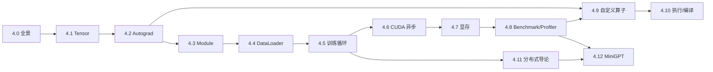

## 📖 本章定位

会调用 `torch.tensor()` 不等于掌握 PyTorch。AI Infra 工程师要继续追问：转置为什么不搬数据、反向传播保存了什么、`state_dict` 为什么漏掉某个 Tensor、GPU 计时为什么偏小、`torch.compile` 捕获的究竟是哪一段、DDP 又在什么时候同步梯度？本章把这些问题串成一条从**张量语义到系统执行**的路径。

本章仍属于前置知识：目标是让你能够独立写、测、查一个小型训练系统，并看懂后续 CUDA、编译器和分布式课程的接口；不会在这里重复 Kernel 优化、Graph Break 深挖或大规模并行策略。

### 前置知识

- 完成第 1 章的 Python、C++、Linux 与构建基础；
- 理解第 2 章的链式法则、矩阵乘法和概率基础；
- 能读懂第 3 章 Transformer Decoder Block 的数据流；
- 没写过 PyTorch 时先读 4.0；已经能独立训练小模型时，可从 4.1 开始。

### 跳过条件

如果你已经能解释 Tensor 的 storage/stride、Autograd 版本计数、Parameter 与 buffer、CUDA 异步计时、caching allocator、Dispatcher，并能从 checkpoint 精确恢复一个 DDP 训练任务，可以直接完成 4.12 的验收项目；项目不过再回到对应小节补课。

---

## 📑 课程结构

| 小节 | 解决的问题 | 可验证产物 |
|---|---|---|
| [4.0 快速入门](/AIInfraGuide/prerequisites/模块一-前置知识/pyroch/pytorch框架入门/) | 一次训练如何跑通 | Tensor → backward → step → checkpoint 全景 |
| [4.1 Tensor 存储与视图语义](/AIInfraGuide/prerequisites/模块一-前置知识/pytorch/41-tensor存储与视图语义/) | shape、stride、storage 如何决定布局 | 共享 storage 与 contiguous 实验 |
| [4.2 Autograd 自动微分](/AIInfraGuide/prerequisites/模块一-前置知识/pytorch/42-autograd自动微分/) | 动态图如何保存并传播梯度 | 自定义 Function + gradcheck |
| [4.3 Module 与状态管理](/AIInfraGuide/prerequisites/模块一-前置知识/pytorch/43-module与状态管理/) | 参数、buffer 和 state_dict 如何组成模型 | 状态往返与共享参数测试 |
| [4.4 DataLoader 数据流水线](/AIInfraGuide/prerequisites/模块一-前置知识/pytorch/44-dataloader数据流水线/) | CPU 如何持续给设备供数 | worker/pin/prefetch 对照 |
| [4.5 训练循环工程](/AIInfraGuide/prerequisites/模块一-前置知识/pytorch/45-训练循环工程/) | 如何正确更新、恢复和复现 | 可恢复训练循环 |
| [4.6 CUDA 异步执行](/AIInfraGuide/prerequisites/模块一-前置知识/pytorch/46-cuda异步执行/) | Python 返回时 GPU 做完了吗 | Event/Stream 正确计时 |
| [4.7 显存管理](/AIInfraGuide/prerequisites/模块一-前置知识/pytorch/47-显存管理/) | allocated/reserved/peak 如何解释 OOM | 显存账本与诊断清单 |
| [4.8 Benchmark 与 Profiler](/AIInfraGuide/prerequisites/模块一-前置知识/pytorch/48-benchmark与profiler/) | 怎样获得可信时间与时间线 | benchmark 报告与 profiler trace |
| [4.9 自定义算子与 Dispatcher](/AIInfraGuide/prerequisites/模块一-前置知识/pytorch/49-自定义算子与dispatcher/) | 高层 API 如何找到后端 Kernel | `torch.library` CPU 算子 |
| [4.10 执行与编译链路](/AIInfraGuide/prerequisites/模块一-前置知识/pytorch/410-执行与编译链路/) | eager 到 Inductor 经过什么 | 执行链路地图与 explain |
| [4.11 分布式 PyTorch 导论](/AIInfraGuide/prerequisites/模块一-前置知识/pytorch/411-分布式pytorch导论/) | rank/process group/DDP 如何协作 | CPU/Gloo 多进程 smoke |
| [4.12 MiniGPT 综合项目](/AIInfraGuide/prerequisites/模块一-前置知识/pytorch/412-minigpt综合项目/) | 如何把本章能力组成训练系统 | 数据、训练、AMP、恢复、Profiler、DDP |

📌 **关键点**：4.0 给全景，4.1～4.5 保证“算得对、训得动”，4.6～4.10 解释“框架如何执行”，4.11～4.12 再把单进程脚本变成可扩展工程。后文不重复 4.0 的 API 清单，而是逐层解释其机制。

---

## 🗺️ 依赖图

---

## 🧪 综合项目

4.12 使用一个小型 Decoder-only Transformer 串联全章。项目使用脚本内置的固定教学文本，因此不需要账号、下载模型或准备外部数据集；CPU 可以跑 correctness smoke，有 CUDA 时再验证 AMP、显存与 Profiler activity。

交付内容包括：

- 固定随机种子的数据与模型配置；
- 不依赖 Trainer 的训练循环；
- AMP 与梯度裁剪；
- 模型、优化器、scaler、配置、step、随机状态与词表 checkpoint；
- CPU/CUDA Profiler trace 和五类内存账本；
- 单机两进程 `torch.multiprocessing.spawn` + Gloo 入口；
- 最小单元测试与 smoke 命令。

---

## 🎯 本章学习目标

完成本章后，你应当：

- 能手算小 Tensor 的 stride，并判断操作是否共享 storage；
- 能解释 leaf、`grad_fn`、版本计数和 in-place 报错；
- 能写出通过 `gradcheck` 的自定义反向；
- 能区分 Parameter、buffer 与普通属性并验证状态往返；
- 能说明 DataLoader worker、pin memory 和异步搬运各解决什么瓶颈；
- 能从 checkpoint 恢复模型、优化器、step 与随机状态；
- 能指出至少 3 个 CUDA 隐式同步点并正确计时；
- 能区分 allocated、reserved 与 peak memory；
- 能使用 `torch.utils.benchmark` 和 `torch.profiler` 产出可复现证据；
- 能注册最小自定义算子并解释 Dispatcher 的作用；
- 能画出 eager、Autograd、ATen、Dispatcher、Dynamo、AOTAutograd 与 Inductor 的关系；
- 能用 CPU/Gloo 跑通单机多进程 DDP smoke；
- 能运行 MiniGPT 综合项目并提交训练、恢复、Profiler 与资源报告。

## 🚧 本章边界与后续去向

- CUDA Kernel、Triton 和算子极致优化进入[模块二](/AIInfraGuide/cuda/)；
- `torch.compile` 的 Graph Break 与 Inductor 深入进入[7.2 torch.compile 原理与 Graph Break](/AIInfraGuide/cuda/模块二-cuda编程与算子优化/72-torchcompile原理与graphbreak/)；
- DDP、FSDP、ZeRO 和 3D 并行进入[模块三](/AIInfraGuide/distributed/)；
- vLLM、KV Cache、量化和 Serving 进入[模块四](/AIInfraGuide/inference/)。

本章只建立这些专项的入口心智模型，不重复后续模块正文。
