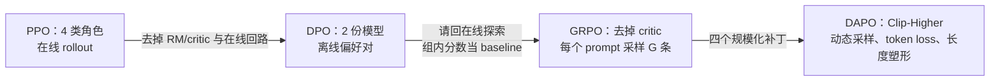

LLM（Large Language Model，大型语言模型）的后训练正在走一条很清楚的删减路线：PPO（Proximal Policy Optimization，近端策略优化）维护 policy（策略模型，负责生成回答）、reference（冻结的参考模型）和 critic（价值模型，估计未来回报）等角色；DPO（Direct Preference Optimization，直接偏好优化）把在线强化学习回路换成离线偏好对；GRPO（Group Relative Policy Optimization，组内相对策略优化）再砍掉 critic；DAPO（Decoupled Clip and Dynamic Sampling Policy Optimization，解耦裁剪与动态采样策略优化）则用四个训练技巧把长思维链强化学习推向规模。账不会消失：以 7B（约 70 亿参数）模型、每个 prompt（提示词）采样组大小 $G=8$、每条生成 1024 个 token（模型处理文本的最小片段）的估算为例，一次 rollout（让 policy 完整生成一条回答并记录轨迹）仍约需 $2\times7\mathrm{B}\times8\times1024\approx1.15\times10^{14}$ FLOPs（Floating-point operations，浮点运算次数）；真正的变化是**用多次在线生成，换掉一份 critic 或奖励模型的模型状态**。这使 GRPO/DAPO 比 DPO 更贵，但通常比背着完整 critic 与奖励模型的 PPO 便宜。

<!-- more -->

## 📑 目录

- [0. 开篇衔接：RL 回来了，但要把账算小](#0-开篇衔接rl-回来了但要把账算小)
- [1. 先把四条算法链摆在同一张账桌上](#1-先把四条算法链摆在同一张账桌上)
- [2. PPO 到 DPO：先砍掉在线回路，再承认探索代价](#2-ppo-到-dpo先砍掉在线回路再承认探索代价)
- [3. GRPO：用组内相对优势砍掉 critic](#3-grpo用组内相对优势砍掉-critic)
- [4. DAPO：四个技巧把 GRPO 推到长思维链规模](#4-dapo四个技巧把-grpo-推到长思维链规模)
- [5. PPO、DPO、GRPO、DAPO 的算力与显存账本](#5-ppodpogropodapo-的算力与显存账本)
- [6. 适用边界：奖励可验证，探索才值得付费](#6-适用边界奖励可验证探索才值得付费)
- [7. ⚠️ 常见错误：看起来省账，实际上把账算错](#7-常见错误看起来省账实际上把账算错)
- [8. 工程落地：训练时该盯哪些信号](#8-工程落地训练时该盯哪些信号)
- [📝 总结](#-总结)
- [🎯 自我检验清单](#-自我检验清单)
- [📚 参考资料](#-参考资料)

## 0. 开篇衔接：RL 回来了，但要把账算小

### 0.1 12.1 的四模型回路为什么太重

> 💡 **回顾：12.1 的 PPO 回路**
>
> **白话定义**：PPO 先从 SFT（Supervised Fine-Tuning，监督微调）得到的 policy（策略模型）生成回答，再由 RM（Reward Model，奖励模型）把回答变成分数，critic（评论家模型）估计每一步“比预期好多少”，reference（冻结参考模型）负责约束 policy 不要漂得太远。
>
> **关键公式**：每个 token 的奖励常写成 $r_t=r_{\mathrm{RM},t}-\beta\log[\pi_\theta(o_t\mid s_t)/\pi_{\mathrm{ref}}(o_t\mid s_t)]$。前一项追求高分，后一项是 KL（Kullback–Leibler divergence，衡量两个概率分布差异的方向性距离）偏离成本；四类模型角色分别承担生成、锚定、打分和估值。
>
> **链条与分工**：12.1 的链条是 `SFT → 当前 policy rollout → RM 打分 → PPO（policy + critic）→ 新 policy 再采样`。站内 [12.1 RLHF 的四模型成本：InstructGPT 三阶段流水线与 PPO 训练回路](https://xiayihann.github.io/AIInfraGuide/distributed/模块三-分布式训练/121-rlhf三阶段流水线与instructgpt) 把这条回路、KL 和四模型显存账完整展开；本文只回顾它作为 GRPO 的问题起点，重点放在“去掉谁、用什么补上”。

这条回路同时付三笔钱：四类角色占模型权重和训练状态；当前 policy 每轮要在线生成新回答；critic 还要从稀疏的终局奖励中猜每个 token 的价值。**PPO 的问题不是目标不对，而是每次更新都要背着一套很重的辅助设备。**

### 0.2 12.2 的 DPO 消掉了 RL，但探索也一起消掉了

> 💡 **回顾：12.2 的 DPO**
>
> **白话定义**：DPO 直接读取固定的偏好对 $(x,y_w,y_l)$，其中 $y_w$ 是被偏好的回答、$y_l$ 是被拒绝的回答；它不在训练循环中让当前 policy 重新探索。
>
> **关键数字**：典型账本从 PPO 的 4 个模型角色压到 policy + reference 两份模型，但在线 rollout 次数从“每轮生成”变成 0；换来的是更便宜、更稳定的离线训练，付出的代价是数据集没有覆盖的行为不会自动出现。
>
> **链条与分工**：站内 [12.2 去掉奖励模型和 PPO 采样回路：DPO 闭式推导与偏好数据工程](https://xiayihann.github.io/AIInfraGuide/distributed/模块三-分布式训练/122-dpo直接偏好优化) 逐步推导 KL 目标如何变成二元交叉熵，并计算偏好数据工程代价；本文只把 DPO 放在算法链上，继续追问“能不能把 RL 请回来，但不要把 PPO 的全部账单带回来”。

于是本篇的问题变成一句话：**DPO 把 RL 砍得太干净，PPO 又太重；能不能让 RL 回来，只保留探索最有价值的部分？**

## 1. 先把四条算法链摆在同一张账桌上

### 1.1 先固定最小词表

你只需要先记住下面这些角色。后面的公式不会再把同一个词换一套叫法。

| 术语 | 白话定义 | 在本文中的账本位置 |
|---|---|---|
| **RL** | Reinforcement Learning，强化学习；模型先做动作，再根据结果得到奖励并更新策略 | PPO、GRPO、DAPO 的在线更新方式 |
| **RLHF** | Reinforcement Learning from Human Feedback，基于人类反馈的强化学习；把人的示范和偏好变成训练信号 | 12.1 的传统后训练路线 |
| **SFT** | Supervised Fine-Tuning，监督微调；用示范答案逐 token 教模型“应该怎样写” | PPO 和 GRPO 常用的初始化模型 |
| **policy** | 当前负责生成回答的模型；给定 prompt 后决定每个 token 的概率 | 需要被更新的主模型 |
| **old policy** | 生成本轮 rollout 时的旧策略；保存概率用来限制本次更新不要跳太远 | PPO、GRPO、DAPO 的比率分母 |
| **reference** | 冻结的参考模型，通常是 SFT 模型；用来测量当前 policy 偏离初始能力多少 | GRPO 的 KL 锚点；DAPO 可选择不用 |
| **reward** | 把一条回答压成一个分数；分数越高代表越符合任务目标 | 计算优势的原始信号 |
| **RM** | Reward Model，奖励模型；用神经网络预测人类或标注者可能给出的质量分数 | PPO 的额外模型角色；可验证任务可以不用 |
| **critic / value model** | 价值模型；预测“从当前状态继续走下去，平均还能拿多少分” | PPO 的 baseline 来源；GRPO 删除它 |
| **baseline** | 基准分数；回答比它高就鼓励，低就压低，主要作用是降低梯度噪声 | PPO 由 critic 估计，GRPO 由组内分数估计 |
| **advantage** | 优势；当前回答相对 baseline 好多少，正数表示鼓励，负数表示抑制 | 乘在 policy 梯度上的系数 |
| **rollout** | 一次完整采样轨迹；让 policy 从 prompt 生成回答，并记录 token、概率和奖励 | 在线 RL 的主要算力开销 |
| **batch** | 一次并行送进模型的一组样本 | 动态采样要保证 batch 中有足够的有效组 |
| **logprob** | log probability 的简称，即某个 token 概率取自然对数 | PPO 比率、DPO 偏好比较和 rollout 缓存 |
| **verifier** | 奖励检查器；用规则、测试或解析器判定回答是否满足要求 | RLVR 的奖励来源 |
| **softmax** | 把一组任意分数归一化成概率分布的函数 | 解释 Clip-Higher 中的概率重新归一化 |
| **on-policy** | 在线策略数据；样本由当前或刚更新的 policy 生成 | PPO、GRPO、DAPO 每轮要重新生成 |
| **off-policy** | 离线策略数据；训练反复读取固定数据，不要求来自当前 policy | DPO 的偏好对训练 |
| **entropy** | 概率分布的不确定性；分布越平均，entropy 越高 | 衡量 policy 是否仍在探索 |
| **entropy collapse** | 熵坍缩；概率过早集中到少数 token，回答变得相似，探索能力丢失 | DAPO 的 Clip-Higher 要缓解的问题 |
| **reward hacking** | 奖励投机；模型找到“骗过评分器”的办法，分数高但任务质量不高 | 开放式文本 RL 的主要风险 |
| **RLVR** | Reinforcement Learning with Verifiable Rewards，可验证奖励强化学习；由答案检查器直接判对错或格式 | 数学、代码、结构化输出的优先场景 |

### 1.2 在线和离线到底差在哪里

问题是：为什么同样使用偏好或奖励，DPO 和 GRPO 的训练成本会差这么多？**差别不在 loss 的名字，而在训练数据是不是由正在变化的 policy 现场生成。**

- **离线**：数据表提前写好。给定 $(x,y_w,y_l)$，policy 只需前向计算两条回答的 log probability（对数概率），然后反向更新。
- **在线**：每轮先从当前 policy 采样回答，再运行 reward 函数，再计算 advantage，最后更新 policy。下一轮 policy 变了，数据分布也跟着变。

可以把四条链压缩成下面这张流程图：

这张图讲的是**删减路径**，不是“后一个算法严格包含前一个算法的全部实现”。例如 DAPO 论文明确去掉了 GRPO 的 KL 项，而工程实现仍可能保留 reference 或保存 old-policy logprob；读账本时必须把算法公式和部署实现分开。

## 2. PPO 到 DPO：先砍掉在线回路，再承认探索代价

### 2.1 PPO 的 baseline 为什么需要 critic

问题是：PPO 为什么不能只拿 reward 当梯度系数？**因为同一个高分在不同 prompt 上含义不同，先减去“这个状态通常能拿多少分”可以显著降低噪声。**

先把 advantage（优势）写成最小形式：

$$
\underbrace{A_t}_{\text{当前动作比基准好多少}}
=
\underbrace{G_t}_{\text{从第 }t\text{ 步往后的实际回报}}
-
\underbrace{V_\psi(s_t)}_{\text{critic 对状态 }s_t\text{ 的平均回报估计}}。
$$

- $G_t$ 是这次 rollout 从第 $t$ 个 token 开始最终拿到的回报；$s_t$ 是“已经生成到第 $t-1$ 个 token”的状态。
- $V_\psi(s_t)$ 不是答案本身，而是 critic 用另一个模型参数 $\psi$ 学出来的平均预期。
- $A_t>0$ 表示这次动作比该状态的常态更好，$A_t<0$ 表示更差。

**数值走查**：若某一步最终回报 $G_t=0.8$，critic 估计 $V_\psi(s_t)=0.5$，则 $A_t=0.8-0.5=0.3$，这一步被鼓励；若 critic 误估为 $0.7$，优势只剩 $0.1$，梯度会被压小。critic 估计偏差大时，baseline 不但没有降噪，反而会把错误带进每一步。

PPO 的代价因此有两层：第一，critic 是一份额外的可训练模型；第二，它要为长回答的许多 token 猜价值，而语言模型常常只在回答结束时才拿到最清楚的结果奖励。GRPO 的切入点正是：**既然同一个 prompt 可以一次采样多条回答，能不能用这组回答的相对分数代替一个跨状态泛化的 critic？**

### 2.2 DPO 砍掉了哪些东西

DPO 的做法是把 $(x,y_w,y_l)$ 作为固定的离线数据。它仍然保留 policy 和 reference，用两者的整条回答 log probability 比较 winner 与 loser；但训练时没有当前 policy 的新 rollout，也没有 PPO 的 critic 更新。

这一步换来了两件事：

1. **省回路**：不需要在每个训练 step 前启动自回归生成和奖励评估。
2. **省探索**：一个偏好表之外的新行为不会凭空进入训练集。你可以复用同一条数据很多轮，但复用不是探索。

落成一句话：**DPO 用“数据已经告诉我哪条更好”换取便宜；GRPO 要把“我还想发现新答案”重新买回来。**

## 3. GRPO：用组内相对优势砍掉 critic

### 3.1 先看一组回答，而不是一条回答

GRPO 的直觉像给同一道题安排一次小组答题：不要求老师先学会预测每个学生平时能考多少分，而是让同一组学生同时作答，再看谁高于小组平均、谁低于小组平均。这里的组成员共享同一个 prompt，组内比较才有意义。

给定一个 prompt $q$，旧 policy 一次采样 $G$ 条回答：

$$
\{o_1,o_2,\ldots,o_G\}\sim\pi_{\theta_{\mathrm{old}}}(\cdot\mid q)。
$$

每条回答经过奖励函数得到一个数 $r_i$。对数学题，$r_i$ 可以是答案检查器的 1/0 或 1/−1；对人类偏好，也可以是 RM 的分数。GRPO 的关键不在奖励绝对值，而在**同一个 prompt 内的相对位置**。

*图源：本文按 DeepSeekMath arXiv v3 §4.1.1 的组采样、组内归一化和 policy 更新流程重绘，非论文原图。*

先定义组均值与组内标准差：

$$
\mu_r=\underbrace{\frac{1}{G}\sum_{j=1}^{G}r_j}_{\text{同一 prompt 的平均奖励}},
\qquad
\sigma_r=\underbrace{\sqrt{\frac{1}{G}\sum_{j=1}^{G}(r_j-\mu_r)^2}}_{\text{同一组奖励的离散程度}}。
$$

然后把第 $i$ 条回答的组内优势写成：

$$
\boxed{
\hat A_i=\frac{r_i-\operatorname{mean}(r_1,\ldots,r_G)}{\operatorname{std}(r_1,\ldots,r_G)}
}
$$

这个式子做三件事：$r_i$ 是当前回答的分数，均值是“这组通常有多好”，标准差把不同 prompt 的奖励尺度拉到相近范围，$\hat A_i$ 是最终送进 policy 更新的正负系数。DeepSeekMath 在 outcome supervision（只在回答结束处给结果奖励）里把同一个 $\hat A_i$ 赋给该回答的所有 token。

### 3.2 $G=4$：把组内相对关系算出来

问题是：这个归一化真的表达了“相对好坏”吗？**用四条回答就能手算出来。**设同一数学题的四个奖励为：

$$
(r_1,r_2,r_3,r_4)=(1,0,1,-1)。
$$

采用总体标准差（分母为 $G$）做纸笔走查：

$$
\mu_r=\frac{1+0+1-1}{4}=0.25，
\qquad
\sigma_r=\sqrt{\frac{0.75^2+(-0.25)^2+0.75^2+(-1.25)^2}{4}}
=\sqrt{0.6875}\approx0.829。
$$

| 回答 | 原始奖励 $r_i$ | 偏离均值 $r_i-0.25$ | 组内优势 $\hat A_i$ | 更新方向 |
|---|---:|---:|---:|---|
| $o_1$ | 1 | 0.75 | $0.75/0.829\approx0.905$ | 提高这条回答的 token 概率 |
| $o_2$ | 0 | −0.25 | $-0.25/0.829\approx-0.302$ | 降低这条回答的 token 概率 |
| $o_3$ | 1 | 0.75 | $0.75/0.829\approx0.905$ | 提高这条回答的 token 概率 |
| $o_4$ | −1 | −1.25 | $-1.25/0.829\approx-1.508$ | 更强地降低这条回答的 token 概率 |

四个优势加起来约等于 0：$0.905-0.302+0.905-1.508\approx0$。这不是说模型“只学会一条正确答案”，而是同一个 prompt 内同时得到正向和负向训练信号：两条得分为 1 的回答被鼓励，得分 −1 的回答被明显抑制。

💡 **标准差口径**：DeepSeekMath 的公式写作 `std`，没有在论文公式中展开分母约定。上面的数字使用总体标准差，便于和“组内归一化”直觉对应；若代码使用分母 $G-1$ 的无偏样本标准差，优势绝对值会变小，但正负关系不变。若整组奖励相同，标准差为 0，工程实现必须过滤、补采样或加数值保护，不能直接除零。

### 3.3 为什么组内统计可以代替 critic

先看 baseline 降噪的核心一行。对固定 prompt $q$，如果 $b(q)$ 只依赖 prompt、不依赖当前抽到的回答 $o$，那么：

$$
\mathbb E_{o\sim\pi_\theta(\cdot\mid q)}
\left[\nabla_\theta\log\pi_\theta(o\mid q)\,b(q)\right]
=b(q)\nabla_\theta\sum_o\pi_\theta(o\mid q)
=b(q)\nabla_\theta 1=0。
$$

这行公式说明：**减去一个不看具体动作的基准不会改变期望梯度，只会减少不同样本之间的波动。** critic 的作用就是学习一个尽量准确的 $b(q)$。

GRPO 用同一个 prompt 的 $G$ 个 reward 均值去估计 $\mathbb E[r\mid q]$。它不再训练一份 critic，而是用组内 Monte Carlo（用有限次随机采样估计平均值）统计完成 baseline。代价也同样明确：每个 prompt 至少要生成 $G$ 条回答，$G$ 越大，组均值通常越稳定，但 rollout 的解码 token 近似也按 $G$ 增长。

这里要保留一个严谨边界：上面“一行无偏”针对独立的 prompt-level baseline；实际 GRPO 的组均值由有限个回答估计，而且第 $i$ 个回答也参与了均值和标准差计算。因此，不能把有限 $G$ 的归一化优势宣传成“完全没有估计噪声”。准确说法是：**GRPO 删除了 critic 模型，用组内相对统计作为低成本控制变量；它省显存，换来更多采样和有限组统计噪声。**

### 3.4 两份模型够不够：要把“算法路线”和“论文实验”分开

在可验证奖励路线中，奖励可以由程序直接检查，最小模型账本是：

- **policy**：正在训练和生成回答的模型。
- **reference**：冻结的 SFT 模型，计算 KL 约束的参照分布。
- **没有 critic**：优势来自同组 reward，不再需要 value model。
- **可以没有 RM**：数学答案、代码测试、JSON（JavaScript Object Notation，一种结构化文本格式） schema（结构化数据格式约束）都可以由检查器直接判断，检查器是代码，不占一份神经网络权重。

DeepSeekMath 论文给了一个重要的事实边界。它在 §4.2 的 DeepSeekMath-RL 7B 设置中写明：训练约 144K 个问题、每题采样 64 个输出、最大长度 1024、训练 batch size 1024、KL 系数 0.04；同一论文还写到先训练了一个基于 DeepSeekMath-Base 7B 的初始 reward model。论文的统一分析又把奖励分成 `Rule`（按答案正确性判断）和 `Model`（训练 reward model 打分）两种。

因此本文后面的“GRPO 两份模型”采用**可验证奖励的最小口径**，不是把 DeepSeekMath 的所有实验都改写成“绝对无 RM”：数学任务让 RM 可以被答案检查器替代，但原论文确实同时研究了 rule reward 和 model reward。这个区分很重要，否则“无 critic”会被错误地读成“任何 GRPO 都无 RM”。

## 4. DAPO：四个技巧把 GRPO 推到长思维链规模

### 4.1 先定义 DAPO 要改的共同骨架

DAPO 论文针对的是长思维链（long Chain-of-Thought，long-CoT）强化学习：模型可能为了探索而生成很长的推理过程，训练目标、采样筛选和长度上限会互相影响。DAPO 的全名是 **Decoupled Clip and Dynamic Sampling Policy Optimization**，名字直接点出两个主动作：把上下裁剪阈值拆开，把无效组过滤后动态补采；token-level loss 与长度奖励塑形是另外两个配套技巧。

对第 $i$ 条回答的第 $t$ 个 token，先定义 importance ratio（重要性采样比率）：

$$
\rho_{i,t}(\theta)=
\frac{\pi_\theta(o_{i,t}\mid q,o_{i,<t})}
{\pi_{\theta_{\mathrm{old}}}(o_{i,t}\mid q,o_{i,<t})}。
$$

它回答的是：“更新后的 policy 给这个旧样本 token 的概率，相对于采样时提高了多少？”若 $\rho=1.4$、$\hat A=1$、对称裁剪 $\epsilon=0.2$，PPO/GRPO 的正向贡献取 $\min(1.4,1.2)=1.2$，防止一次更新过猛。

DAPO 的局部目标可以压缩成下面这个式子。它同时显示了 token 级归一化、非对称 clip 和动态采样条件：

$$
\mathcal J_{\mathrm{DAPO}}
=\mathbb E\left[
\frac{1}{\sum_{i=1}^{G}|o_i|}
\sum_{i=1}^{G}\sum_{t=1}^{|o_i|}
\min\left(
\rho_{i,t}\hat A_{i,t},
\operatorname{clip}(\rho_{i,t},1-\varepsilon_{\mathrm{low}},1+\varepsilon_{\mathrm{high}})\hat A_{i,t}
\right)
\right],
$$

$$
0<\left|\{o_i\mid\texttt{is\_equivalent}(a,o_i)\}\right|<G。
$$

第一式的分母是全组 token 数，第二式要求一组回答不能“全对”也不能“全错”。下面把四个变化拆开，每个都回答“砍掉了什么，换来了什么”。

### 4.2 Clip-Higher：非对称裁剪，给探索留一条缝

**问题是什么？** 普通 PPO/GRPO 用同一个 $\epsilon$ 限制概率比：$[1-\epsilon,1+\epsilon]$。DAPO 论文观察到，低概率但可能有价值的探索 token 更容易被上界卡住，policy 的 entropy 会快速下降，来自同一 prompt 的回答越来越相似，这就是 entropy collapse。

论文的最小数值例子很有说明力。设 $\epsilon=0.2$、$\hat A>0$，表示我们希望提高某个 token 的概率：

| 旧 policy 概率 | 比率上界 $1+\epsilon$ | 上界乘积 | 直觉 |
|---:|---:|---:|---|
| 0.01 | 1.2 | 0.012 | 低概率探索 token 只能从 0.01 推到 0.012，绝对增量 0.002 |
| 0.90 | 1.2 | 1.08 | 高概率利用 token 的上界很宽；论文用这个数对比相对约束 |

第二行的 1.08 不是一个最终归一化后的合法概率，而是“旧概率乘以上界”的局部比率算例；真正的 softmax 分布仍需归一化。关键关系是：**相同的相对上界，对低概率 token 的绝对增量更小，探索空间更容易被锁死。**

Clip-Higher 把上下阈值拆成 $\varepsilon_{\mathrm{low}}$ 和 $\varepsilon_{\mathrm{high}}$：

$$
\operatorname{clip}(\rho,1-\varepsilon,1+\varepsilon)
\quad\longrightarrow\quad
\operatorname{clip}(\rho,1-\varepsilon_{\mathrm{low}},1+\varepsilon_{\mathrm{high}})。
$$

DAPO 论文实验设置为 $\varepsilon_{\mathrm{low}}=0.2$、$\varepsilon_{\mathrm{high}}=0.28$，所以比率区间从对称的 $[0.8,1.2]$ 变成 $[0.8,1.28]$。它只把“向上增加概率”的天花板抬高，保留向下抑制的力度；牺牲一部分保守性，换取更多探索和更不容易坍缩的 entropy。

### 4.3 Dynamic Sampling：丢掉零梯度组，动态补采

**问题是什么？** 如果一个 prompt 的 $G$ 条回答全都正确，所有 reward 相同，组内优势就是 0；如果全都错误，也一样。以 $G=4$ 为例：

| 一组回答的正确性 | reward | 均值/标准差 | 结果 |
|---|---|---|---|
| 全对 | $(1,1,1,1)$ | $\mu=1,\sigma=0$ | 没有相对差异，优势为 0 或发生除零 |
| 全错 | $(0,0,0,0)$ | $\mu=0,\sigma=0$ | 同样没有更新方向 |
| 有对有错 | $(1,1,0,0)$ | $\mu=0.5,\sigma=0.5$ | 优势为 $(1,1,-1,-1)$，有清楚的正负信号 |

因此 DAPO 保留条件是：

$$
0<\left|\{o_i\mid\texttt{is\_equivalent}(a,o_i)\}\right|<G。
$$

`is_equivalent(a,o_i)` 可以白话理解为“回答 $o_i$ 的最终答案是否等价于标准答案 $a$”。当组内全对或全错时，先丢弃这组，再继续采样，直到 batch 里填满有正有负信号的组。

这一步没有白拿收益：**有效训练样本变少了，所以采样次数会增加。** DAPO 论文说明，在同步且生成阶段未流水线化的系统中，单批生成时间常被最长的长尾回答主导；论文实验还观察到动态采样虽然增加 sampling instances，却没有显著增加总体训练时间，并可能更快收敛。这个结论属于论文实验设定，不是所有集群都自动成立。

### 4.4 Token-Level Loss：从“每条回答一票”改成“每个 token 一票”

原始 GRPO 的 sample-level loss 先对每条回答的 token 求平均，再对回答求平均：

$$
\mathcal L_{\mathrm{sample}}
=\frac{1}{G}\sum_{i=1}^{G}
\underbrace{\frac{1}{|o_i|}\sum_{t=1}^{|o_i|}\ell_{i,t}}_{\text{每条回答先归一化}}。
$$

DAPO 的 token-level loss 改成全组 token 一起平均：

$$
\mathcal L_{\mathrm{token}}
=\frac{\sum_{i=1}^{G}\sum_{t=1}^{|o_i|}\ell_{i,t}}
{\sum_{i=1}^{G}|o_i|}。
$$

- $\ell_{i,t}$ 是第 $i$ 条回答第 $t$ 个 token 的 clipped policy loss。
- sample-level 让每条回答权重相同，不论回答长短。
- token-level 让每个 token 贡献相同，所以长回答天然拥有更多总影响力。

**数值走查**：一组有两条回答，短回答 4 个 token，每个 token 的损失都为 2；长回答 16 个 token，每个 token 的损失都为 1。

- sample-level：短回答平均损失 2，长回答平均损失 1，组平均为 $(2+1)/2=1.5$。
- token-level：总损失为 $4\times2+16\times1=24$，总 token 数为 $20$，结果为 $24/20=1.2$。

在 token-level 口径下，长回答贡献了 $16/20=80\%$ 的 token 权重，而不是 sample-level 的 50%。这既让高质量长推理更容易留下模式，也让长回答里的乱码、重复和无效延长真正承担梯度代价。它牺牲了“每条样本等权”的直觉，换取了对长思维链内部 token 更直接的 credit assignment（把结果信号分摊到具体 token）。

### 4.5 Overlong Reward Shaping：把长度惩罚变成软斜坡

**问题是什么？** 如果回答达到生成上限，被硬截断后直接打一个负奖励，模型无法分辨“推理本身错了”和“推理还没结束只是太长”。这种硬惩罚会给 reward 引入噪声。

DAPO 论文先讨论过滤截断样本，再提出 Soft Overlong Punishment。设 $L_{\max}$ 是生成上限，$L_{\mathrm{cache}}$ 是额外的软惩罚区间，长度奖励为：

$$
R_{\mathrm{length}}(y)=
\begin{cases}
0, & |y|\le L_{\max}-L_{\mathrm{cache}}，\\[4pt]
\dfrac{(L_{\max}-L_{\mathrm{cache}})-|y|}{L_{\mathrm{cache}}},
& L_{\max}-L_{\mathrm{cache}}<|y|\le L_{\max}，\\[8pt]
-1, & |y|>L_{\max}。
\end{cases}
$$

这个式子可以按三段读：安全区不扣分；进入软区后，越接近上限，惩罚从 0 线性下降到 −1；超过硬上限后固定为 −1。它会加到原来的规则奖励上，而不是替换“答案是否正确”。

**数值走查**：DAPO 论文训练设置写明期望最大长度为 16,384 token，另留 4,096 token 的 soft punish cache，因此生成上限为 20,480。按公式取 $L_{\max}=20,480$、$L_{\mathrm{cache}}=4,096$：

- $|y|=16,000$：仍在 $20,480-4,096=16,384$ 的安全区，长度奖励为 0。
- $|y|=18,432$：$R_{\mathrm{length}}=(16,384-18,432)/4,096=-0.5$。
- $|y|=20,481$：超过上限，长度奖励为 −1。

这样模型在接近上限时就能提前感受到“继续无意义变长会越来越贵”，不必等到最后一个 token 被截断才突然收到一张满额罚单。

### 4.6 DAPO 消融数字：只写原文明确给出的口径

DAPO 论文 arXiv v2 的 Table 1 报告的是 AIME24 avg@32（AIME 2024，美国数学邀请赛 2024；在评测集上重复 32 次并取平均），逐步加入技巧后的结果如下：

| 设置 | AIME24 avg@32 | 来源口径 |
|---|---:|---|
| DeepSeek-R1-Zero-Qwen-32B | 47 | DAPO 论文 Table 1 |
| Naive GRPO | 30 | DAPO 论文 Table 1 |
| + Overlong Filtering | 36 | DAPO 论文 Table 1 |
| + Clip-Higher | 38 | DAPO 论文 Table 1 |
| + Soft Overlong Punishment | 41 | DAPO 论文 Table 1 |
| + Token-level Loss | 42 | DAPO 论文 Table 1 |
| + Dynamic Sampling（DAPO） | **50** | DAPO 论文 Table 1 |

论文正文还明确写到：在 Qwen2.5-32B base model 上，DAPO 将 AIME 2024 accuracy 从接近 0% 推到 50%，使用的 training steps 是 DeepSeek-R1-Zero-Qwen-32B 的 50%；这些都是论文明确给出的限定。

⚠️ **数字口径门**：当前核验的 DAPO arXiv v2 正文、LaTeX 源码和 Table 1 没有给出“4M steps”这一标签。上表因此不把消融数字写成“4M 步结果”，也不从曲线刻度反推每个技巧对应的步数；如果外部实验报告使用 4M steps，必须回到它自己的日志或版本化报告核对，不能把它冒充成 DAPO 原文数字。

## 5. PPO、DPO、GRPO、DAPO 的算力与显存账本

### 5.1 四行对比：少的到底是什么

下面的“模型副本数”按**权重角色的保守工程口径**统计，不把同一个模型在训练进程和 rollout 引擎之间是否共享权重混成一个结论。`old policy` 的 logprob 可以缓存，因此实际部署可能比表中更省；表中数字用于先看主要矛盾。

| 算法 | 模型副本数（权重角色） | 在线采样？ | 奖励来源 | 适用场景 |
|---|---:|---|---|---|
| **PPO** | 4：policy、reference、RM、critic | 是；每轮由当前 policy rollout | RM/人类偏好分数 + KL 约束 | 通用偏好对齐，需要在线探索且能承担复杂回路 |
| **DPO** | 2：可训练 policy、冻结 reference | 否；读取离线偏好对 | 人类或强模型给出的 chosen/rejected | 偏好数据覆盖充分，优先降低训练和采样成本 |
| **GRPO** | 2：policy、reference；可验证路线可省 RM | 是；每个 prompt 采样 $G$ 条 | 答案检查器或 RM；DeepSeekMath 同时报告 Rule/Model | 数学、代码、格式等能比较或验证的任务 |
| **DAPO** | 2 个保守角色：policy、rollout/old-policy；论文去掉 KL 后 reference 可不保留 | 是；全对/全错组丢弃后动态补采 | 规则检查器 $R$；论文用 $\pm1$ correctness reward | 长思维链 RL，需要控制熵、长度和有效梯度 |

*图源：本文根据 DeepSeekMath §4.1.1 与 DAPO arXiv v2 §2–4 的模型角色、采样和奖励口径重绘，非原文图。*

表中 DAPO 的“2 个角色”需要特别解释：DAPO 论文在 §2.3 明确去掉 KL 项，因此不必为了 KL 永久保留 reference；但 PPO 比率仍要用 old policy 的概率。若 rollout 阶段把 old policy logprob 写入缓存，old policy 不必占第二份完整权重；若训练和生成由两个 worker 分开部署，通常会出现第二份 actor/rollout 权重。**所以 2 是保守的系统账，不是 DAPO 公式规定必须常驻两份完整模型。**

### 5.2 7B × $G=8$：rollout 算力到底多大

先算权重，不要把“采样 8 条”误读成“复制 8 份模型”。设模型参数量为 $P$，每个参数用 $b$ 字节：

$$
M_{\mathrm{weights}}=P\times b。
$$

7B 模型用 FP16（16 位浮点数，每个参数 2 Bytes；Byte 是字节）存储时，按 GB（十进制十亿字节）口径：

$$
7\times10^9\times2\ \mathrm{Bytes}
\approx14\ \mathrm{GB}。
$$

如果 GRPO 的 policy 和 reference 都以 FP16 常驻，权重账约为 $2\times14=28$ GB；这里的 GB 按十进制估算，这还没有算 KV Cache（Key-Value Cache，生成时保存历史 token 中间结果的缓存）、激活、通信缓冲和优化器状态。G 条回答在同一个 batch 中可以共享这两份权重，但每条回答都会增加自己的解码 token 和 KV Cache。

再做一次纯算力估算。对 decoder-only 模型，常用粗略口径是每生成一个 token 约 $2P$ 次浮点运算；这是估算，不是硬件实测。若每个 prompt 生成 $G=8$ 条、每条回答长度 $T=1024$：

$$
F_{\mathrm{rollout}}
\approx2PGT
=2\times7\times10^9\times8\times1024
=1.14688\times10^{14}\ \mathrm{FLOPs}。
$$

这等于约 114.7 TFLOPs（$10^{12}$ 次浮点运算）的总工作量；若回答长度变成 2048，估算量约翻到 229.4 TFLOPs。更直观地看，在每个生成步，模型要为 8 条回答各做一次 token 前向，参数访问规模约为 $7\mathrm{B}\times8=56\mathrm{B}$ 参数访问；batch 能提高硬件利用率，但不能把 8 条回答的总 token 工作量变成 1 条。

这就是 GRPO/DAPO 的核心 trade-off：**省掉 critic 或 RM 的权重，换回 $G$ 倍级别的在线解码工作；省的是模型角色，贵的是探索 token。** 采样参数 `n`、并行回答如何共享前缀 KV，以及 beam search 为什么不是同一类成本，站内 [8.5 采样与解码算法](https://xiayihann.github.io/AIInfraGuide/inference/模块四-推理优化/第8章-生产级服务特性/85-采样与解码算法) 讲清了采样语义、`n` 的并行成本和解码账本；本文只把这些结果折算进后训练的 $G$ 次 rollout，不重复展开推理引擎实现。

### 5.3 按瓶颈选算法，而不是按名字选算法

- **显存首先爆掉**：先看能否使用可验证奖励来去掉 RM/critic，再考虑 GRPO；不要只看到“RL”就默认需要 PPO 四模型。
- **数据覆盖充分但没有探索预算**：选 DPO。它的在线采样账为 0，但不要把它宣传成能发现数据分布之外的行为。
- **任务有可靠 verifier，且可以承担 $G$ 次生成**：选 GRPO；先用小 $G$ 验证 reward 和 advantage，再逐步加大组大小。
- **长思维链出现熵坍缩、全对/全错组变多、回答撞长度上限**：在 GRPO 基线上加入 DAPO 四件套，并同步监控采样量和有效 prompt 数。
- **开放式文本的“好坏”没有可靠检查器**：不要直接照搬 RLVR 的两份模型账；你可能仍需 RM、人工评估或更保守的 KL 约束。

## 6. 适用边界：奖励可验证，探索才值得付费

### 6.1 RLVR 为什么适合数学、代码和格式任务

可验证奖励的核心是：**回答是否正确，可以由一个相对明确的检查器判断，而不是依赖一个容易被讨好的神经网络。** DAPO 论文 §2.4 给出的规则奖励是：

$$
R(\hat y,y)=
\begin{cases}
1,&\texttt{is\_equivalent}(\hat y,y)，\\
-1,&\text{otherwise}。
\end{cases}
$$

$y$ 是标准答案，$\hat y$ 是模型预测答案，`is_equivalent` 表示二者是否等价。把答案变成容易解析的整数、运行代码测试、校验 JSON schema，都属于同一类思路：先把开放文本压到一个可执行的判定接口，再把判定结果作为 reward。

这条路线的收益是少一个 RM，代价是任务必须有可靠 verifier：

- **数学**：最终数值或符号等价性可检查，但“证明过程是否有教育意义”不一定能检查。
- **代码**：单元测试能检查输入输出，但测试没覆盖到的错误仍可能存活。
- **格式**：schema、正则或解析器能检查结构，但结构正确不代表内容正确。

### 6.2 开放式文本为什么仍难

开放式对话、文学创作和主观建议通常没有一个便宜且可靠的 `is_equivalent`。此时若用 RM 作为唯一裁判，模型可能学会让 RM 开心，而不是让用户满意，这就是 reward hacking。若直接把开放式 reward 设成“越长越好”，DAPO 的长度塑形还可能把无效推理推得更长。

因此“RL 回来了但更便宜”不是无条件结论，而是一个带前提的决策句：**只有当 reward 的正确性足够可验证，额外的 $G$ 次探索才值得换掉 critic/RM；否则省下的模型显存可能被错误奖励和人工复核成本吃掉。**

### 6.3 与下一节 12.4 的零数据路线衔接

站内 [第12章：LLM 后训练与 RL 训练](https://xiayihann.github.io/AIInfraGuide/distributed/模块三-分布式训练/第12章-llm后训练与rl训练) 的章节结构把 12.4 预留为“RLVR / Absolute Zero”：它会承接本文“奖励能否验证”的问题，继续讨论不依赖传统人工题库、让模型生成任务并自我验证的零数据路线；本文只负责把 PPO → DPO → GRPO → DAPO 的更新机制、在线采样和模型账本钉牢。

### 6.4 与站内已有内容的分工

- [12.1 RLHF 的四模型成本：InstructGPT 三阶段流水线与 PPO 训练回路](https://xiayihann.github.io/AIInfraGuide/distributed/模块三-分布式训练/121-rlhf三阶段流水线与instructgpt)：它解释 SFT、RM、critic、reference 和 PPO/KL 的完整闭环；本文在第 2 节重新给出 advantage 的最小公式，专门用来说明 GRPO 为什么能砍掉 critic。
- [12.2 去掉奖励模型和 PPO 采样回路：DPO 闭式推导与偏好数据工程](https://xiayihann.github.io/AIInfraGuide/distributed/模块三-分布式训练/122-dpo直接偏好优化)：它推导 DPO 的闭式解和离线偏好数据代价；本文只借它定位“离线便宜但探索受限”，不把 DPO 的推导当作 GRPO 的前置门槛。
- [8.5 采样与解码算法](https://xiayihann.github.io/AIInfraGuide/inference/模块四-推理优化/第8章-生产级服务特性/85-采样与解码算法)：它解释 `temperature`、`top-k`、`top-p`、`n`、logprobs 和 beam search 的采样语义；本文只抽取“$G$ 条回答会带来多少 rollout token”的账，不替代其解码细节。

## 7. ⚠️ 常见错误：看起来省账，实际上把账算错

### 错误一：把 GRPO 当成“没有 RL 的 DPO”

**看起来合理的说法**：“GRPO 也不需要 critic，所以它和 DPO 一样只要读离线数据。”

**哪里错了**：GRPO 的组内均值来自当前 policy 刚生成的 $G$ 条回答。若 $G=8$，每个 prompt 仍要执行 8 条 rollout；DPO 的固定 $(x,y_w,y_l)$ 才是离线数据。

**正确做法**：先问“这批回答是不是本轮 policy 生成的”。是，就按在线 RL 计算 rollout、奖励和 KV cache；不是，才按离线偏好训练算账。

### 错误二：把“全对组”当成最有价值的训练信号

**看起来合理的说法**：“四条回答全对，说明模型很强，应该给这组更大的权重。”

**哪里错了**：组内 reward 全相等，$r_i-\mu_r=0$，标准差也为 0，组内比较没有方向；它说明能力可能已经足够，但不提供“哪种 token 相对更好”的更新信号。

**正确做法**：Dynamic Sampling 过滤全对/全错组，继续采样直到得到有正有负的有效组；同时单独记录全对比例，防止把“训练信号减少”误读成“模型退化”。

### 错误三：把 $G=8$ 当成 8 份权重显存

**看起来合理的说法**：“采 8 条回答，所以 7B 模型要复制 8 份，权重显存从 14GB 变成 112GB。”

**哪里错了**：batch 内 8 条回答可以共享同一份权重；增长的是解码 token、KV cache 和前向工作量。两份 policy/reference 权重的静态账是约 28GB，不是 8×14GB。

**正确做法**：把账分成三列：模型权重、副本/worker 数；每条回答的 token 与 KV；总 rollout FLOPs。混在一起会同时高估权重、低估生成。

### 错误四：看到“soft overlong”就把超长回答全部奖励

**看起来合理的说法**：“DAPO 只惩罚截断，所以长度越长越能探索，长度奖励应该一直为正。”

**哪里错了**：软塑形是从 0 逐渐降到 −1 的长度成本，并且与正确性 reward 相加；它不是鼓励无条件变长，也不是把超长样本变成正奖励。

**正确做法**：同时画 response length、reward、entropy 和验证集准确率；如果长度上涨但验证准确率不涨，优先怀疑无效延长或 reward hacking。

## 8. 工程落地：训练时该盯哪些信号

DAPO 论文 §4.3 把大模型 RL 描述成多个子系统相互放大的系统工程问题。实际运行时，不要只看最终 reward；至少要把下面四条曲线放在同一张 dashboard：

| 监控量 | 白话含义 | 异常时先问什么 |
|---|---|---|
| **response length** | 平均回答用了多少 token | 是复杂推理变多，还是重复/乱码变多？ |
| **reward score** | 训练集检查器给出的平均分 | reward 涨了，验证集是否也涨？是否过拟合检查器？ |
| **generation entropy** | 生成概率分布的探索程度 | 熵快速降到很低，是不是 entropy collapse 或 clip 上界太紧？ |
| **mean probability** | 采样 token 的平均生成概率 | 是否出现少数固定 token 主导回答？ |

这四条指标不能单独解释能力。例如长度上升可能是有效思维链，也可能是循环；训练集 reward 上升可能是学会了题型，也可能是钻了检查器漏洞；entropy 太低是探索不足，太高又可能是乱码和重复。**训练系统必须把 reward 与独立验证准确率、长度和 entropy 一起看。**

## 📝 总结

1. **PPO → DPO**：PPO 用在线 rollout 和四类角色追求奖励；DPO 用离线偏好对消掉 RL 回路，省成本但不提供新探索。
2. **GRPO 的核心删减**：同一 prompt 采样 $G$ 条回答，用组均值和标准差计算 $\hat A_i=(r_i-\mu_r)/\sigma_r$，删除 critic，代价是 $G$ 次生成和组内统计噪声。
3. **DAPO 的四个补丁**：Clip-Higher 抬高正向概率上界；Dynamic Sampling 丢掉全对/全错组并补采；Token-Level Loss 按全组 token 归一；Overlong Reward Shaping 把硬长度罚分变成软斜坡。
4. **工程决策**：7B、$G=8$、1024 token 的单次 rollout 约 $1.15\times10^{14}$ FLOPs；GRPO/DAPO 不是免费 RL，而是用生成算力换模型副本，最适合 reward 能被验证的数学、代码和格式任务。

## 🎯 自我检验清单

- 能解释 PPO 的 critic、baseline 和 advantage 各自负责什么，并用 $G_t=0.8,V_\psi=0.5$ 算出 $A_t=0.3$。
- 能说清 DPO 为什么没有在线 rollout，以及它用什么代价换来了训练便宜。
- 能写出 GRPO 的组内优势公式，并逐项解释 reward、均值和标准差。
- 给定奖励 $(1,0,1,-1)$ 和 $G=4$，能算出均值约 0.25、总体标准差约 0.829，并判断四条回答的更新方向。
- 能用 $\mathbb E[\nabla\log\pi\,b(q)]=b(q)\nabla1=0$ 解释为什么 prompt-level baseline 不改变期望梯度。
- 能说明 GRPO 删除 critic 后仍要为每个 prompt 生成 $G$ 条回答，并估算 $G$ 从 4 增到 8 时 rollout token 至少翻倍。
- 能把对称 clip $[0.8,1.2]$ 改写成 DAPO 的 $[0.8,1.28]$，并解释它为什么给低概率探索 token 留更多向上空间。
- 给定 $G=4$ 的全对、全错和 $(1,1,0,0)$ 三组 reward，能判断哪两组应被 Dynamic Sampling 过滤。
- 给定长度 4/16、token loss 2/1，能分别算出 sample-level 的 1.5 和 token-level 的 1.2。
- 能用 $L_{\max}=20,480,L_{\mathrm{cache}}=4,096$ 算出长度 18,432 的软惩罚为 −0.5。
- 能从 PPO、DPO、GRPO、DAPO 四行表中按“是否需要探索、奖励能否验证、显存还是 rollout 更紧”做出选型。
- 能指出“DAPO Table 1 的 50 不是原文明确标注的 4M steps 消融数字”，并为每个性能数字写出来源口径。

## 📚 参考资料

### 论文

- [Zhihong Shao 等，DeepSeekMath: Pushing the Limits of Mathematical Reasoning in Open Language Models](https://arxiv.org/abs/2402.03300)——arXiv v3，2024-04-27；§4.1.1 Eq. 1–4 定义 PPO/GRPO、组内优势和 KL，§4.2 给出 DeepSeekMath-RL 7B 的采样设置，附录讨论 Rule/Model reward。
- [Qiying Yu 等，DAPO: An Open-Source LLM Reinforcement Learning System at Scale](https://arxiv.org/abs/2503.14476)——arXiv v2，2025-05-20；§2.3–2.4、§3.1–3.4 和 §4.1–4.2 给出去 KL、规则奖励、四个技巧、训练设置与 Table 1 消融。

### 站内扩展

- [12.1 RLHF 的四模型成本：InstructGPT 三阶段流水线与 PPO 训练回路](https://xiayihann.github.io/AIInfraGuide/distributed/模块三-分布式训练/121-rlhf三阶段流水线与instructgpt)——补齐 PPO 四模型回路、KL 和传统 RLHF 的完整训练数据流；本文专门承接 critic 删除和组内 baseline。
- [12.2 去掉奖励模型和 PPO 采样回路：DPO 闭式推导与偏好数据工程](https://xiayihann.github.io/AIInfraGuide/distributed/模块三-分布式训练/122-dpo直接偏好优化)——补齐 DPO 的闭式推导和偏好数据工程；本文专门承接 DPO 之后重新引入在线探索的成本问题。
- [8.5 采样与解码算法](https://xiayihann.github.io/AIInfraGuide/inference/模块四-推理优化/第8章-生产级服务特性/85-采样与解码算法)——补齐 `n`、temperature、top-k/top-p、logprobs 和 beam search 的采样语义；本文只使用其 rollout 成本视角。
