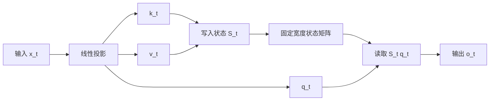
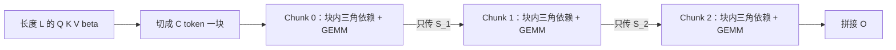

标准 Attention 对长度为 $L$ 的序列要处理 $L\times L$ 对 token（词元，约 0.75 个汉字/词元）关系，FlashAttention 通过重排计算让这张表不落到 HBM（High Bandwidth Memory，GPU 高带宽主显存），但它仍然计算全部配对；DeltaNet 则把问题改写成一个固定大小的状态矩阵，在单头示意下把随 $L$ 增长的 KV 记忆（即 KV Cache，历史 K/V 缓存，大小 $M=2LH_{kv}d_hSBb_e$，见 [§1 KV Cache 与长序列的墙](#1-为什么需要这条路线kv-cache-与长序列的墙)）换成 $d\times d$ 状态，并用 chunk-wise 算法把原本逐 token 的递归训练改成约 $L/C$ 个块级递推。**代价也很明确：状态容量有限，且“免 KV Cache”来自更换序列混合机制，不是对原 Attention 的无损 Kernel 优化。**
<!-- more -->
## 📑 目录
- [🗺️ 原文阅读地图](#-原文阅读地图)
- [0. 读前 3 分钟：QKV、状态与 FlashAttention 的边界](#0-读前-3-分钟qkv状态与-flashattention-的边界)
- [1. 为什么需要这条路线：KV Cache 与长序列的墙](#1-为什么需要这条路线kv-cache-与长序列的墙)
- [2. 核心思想：把注意力改写成一块可读写的黑板](#2-核心思想把注意力改写成一块可读写的黑板)
- [3. 方法拆解：从加法记忆到 DeltaNet 分块并行](#3-方法拆解从加法记忆到-deltanet-分块并行)
- [4. 效果与对比：精度、检索和训练速度](#4-效果与对比精度检索和训练速度)
- [5. 权衡与局限：O(d²) 状态并不等于免费](#5-权衡与局限od-状态并不等于免费)
- [🕰️ 原文时代 vs 当前工程](#-原文时代-vs-当前工程)
- [📝 总结](#-总结)
- [🎯 自我检验清单](#-自我检验清单)
- [📚 参考资料](#-参考资料)

---
## 🗺️ 原文阅读地图

这篇文章的忠实对象是 DeltaNet 主论文，而不是学生幻灯片。幻灯片帮助定位“黑板、delta rule、WY、chunk-wise”这条讲解顺序；关键数字、公式和实验设置以 arXiv 论文 v6 为准。

| 原文单元 | 处理深度 | 本文位置与理由 | 来源锚点 |
|---|---|---|---|
| 引言：二次 Attention、KV cache、线性模型动机 | **精讲** | §1，先把问题钉在长序列与硬件上 | 主论文 §1 |
| 线性注意力的 recurrent、parallel、chunkwise 三种形式 | **精讲** | §3.1、§3.5，是后面所有公式的最小前置 | 主论文 §2.1，Eq.1–2 |
| Delta update 与 key-value retrieval | **精讲** | §3.3，回答“为什么以前线性注意力会覆盖写” | 主论文 §2.2 |
| Fast Weight Programmers 的黑板视角 | **简述** | §2.1–2.2，只吸收隐式权重矩阵和容量直觉 | FWP 论文 §2、§4.1 |
| WY / generalized Householder 重参数化 | **精讲** | §3.4，解释如何不逐步 materialize $S_t$ | 主论文 §3.1，Eq.3 |
| Chunk-wise DeltaNet 与 UT 变换 | **精讲** | §3.5–3.6，这是本文的硬件并行主线 | 主论文 §3.2，Eq.4–11，Fig.1 |
| DeltaNet layer、L2 norm、short convolution、hybrid | **简述** | §3.7，只保留会改变工程判断的设计 | 主论文 §3.3–3.4，Fig.2 |
| MQAR、语言模型、吞吐量实验 | **精讲** | §4，保留设置、PPL、检索和速度结论 | 主论文 §4，Table 1，Fig.4、6 |
| 全部附录推导、全部相关工作 | **不展开** | 不影响“状态—修正—分块”主线；只引用 Eq.10 的结果 | 主论文 Appendix B、C |
📌 **关键点**：本文精讲的不是“线性注意力很快”这一句口号，而是三条因果链：固定状态为什么能省掉 $L$，delta rule 为什么能修正旧关联，chunk-wise 为什么能把递归搬到 GPU 的矩阵乘上。
## 0. 读前 3 分钟：QKV、状态与 FlashAttention 的边界
### 0.1 先把 Q、K、V 对齐

你可以把一个 token 的三种向量理解成三个角色：Query（$Q$）是“我想找什么”，Key（$K$）是“我有哪些可匹配的线索”，Value（$V$）是“匹配后真正要取出的内容”。模块一的 [3.3 Self-Attention 机制深入理解](/AIInfraGuide/prerequisites/模块一-前置知识/transformer/33-self-attention机制深入理解) 已经完整讲过这套符号，这里只保留 DeltaNet 需要的形状。
给定序列长度 $L$、单头维度 $d$，标准因果 Attention 可以写成：

$$
\operatorname{Attention}(Q,K,V)=\operatorname{softmax}\left(\frac{QK^{\mathsf T}}{\sqrt d}\right)V，
\qquad Q,K,V\in\mathbb{R}^{L\times d}。
$$
这个式子做三件事。第一，$QK^{\mathsf T}$ 计算每个 Query 和所有历史 Key 的匹配分数，结果形状是 $L\times L$。第二，Softmax 把每一行分数变成权重。第三，用这些权重对 $V$ 加权求和，得到 $L\times d$ 的输出。
**小数字算例**：如果 $L=4$、$d=2$，$QK^{\mathsf T}$ 就是一个 $4\times4$ 矩阵，共 16 个配对分数。把 $L$ 换成 4096、把 $d$ 换成 128，单个 head 的配对数变成 $4096^2=16,777,216$；如果把它以 FP16 存储，需要约 $32$ MB。这里的计算和显存账本是本文解释用的算例，不是 DeltaNet 论文的实验数字。
### 0.2 FlashAttention 的“重算”与 DeltaNet 的“免 KV Cache”不是一回事

最容易混淆的地方在这里：

| 路线 | 它改变了什么 | 训练时 | 自回归 Decode 时 | 计算语义 |
|---|---|---|---|---|
| 标准 Attention | 直接构造注意力矩阵 | 保存或读写 $L\times L$ 中间量 | 保存历史 K、V，KV Cache 随 $L$ 增长 | 精确 Softmax Attention |
| FlashAttention | 重排同一个 Attention 的 IO | 分块放进 SRAM，反向可重算 $S/P$ | 仍需历史 K、V，KV Cache 仍随 $L$ 增长 | 精确 Softmax Attention |
| DeltaNet | 换成矩阵状态的序列混合 | 递归或 chunk-wise 计算固定宽度状态 | 保留状态 $S$，不按 token 保存完整 KV | 线性注意力的 Delta Rule 变体 |
FlashAttention 解决的是“同一条 Attention 公式怎样少搬数据”。它把中间结果留在片上，必要时用额外计算换掉显存存储，但没有把“当前 Query 要和所有历史 Key 比对”这个语义改掉。DeltaNet 解决的是“能不能换一种状态更新规则，从架构上不再逐个保存历史 K、V”。
所以，**FlashAttention 是“算得一样，搬得更聪明”；DeltaNet 是“保存和读取的对象都换了”。** 后文还会把这两条路线放回同一张复杂度表里。
## 1. 为什么需要这条路线：KV Cache 与长序列的墙
### 1.1 KV Cache 为什么随上下文线性增长

自回归生成第 $t$ 个 token 时，模型需要让新 Query 看到前面所有 token 的 Key 和 Value。为了不重复计算历史 token，推理引擎会把它们缓存起来，这就是 KV Cache。
只算一个 batch、一个模型的 KV 张量，显存字节数可写成：

$$
\underbrace{2}_{K\text{ 和 }V}\times
\underbrace{N_{\text{layer}}}_{\text{层数}}\times
\underbrace{N_{\text{head}}}_{\text{头数}}\times
\underbrace{L}_{\text{历史 token 数}}\times
\underbrace{d_{\text{head}}}_{\text{每头维度}}\times
\underbrace{b}_{\text{每元素字节数}}。
$$
这笔账的核心只有一个：$L$ 在乘法里。上下文每增加一个 token，KV Cache 就再增加一小块，而且是每层、每头都增加。
**算一遍**：假设 32 层、32 头、$d_{\text{head}}=128$、$L=4096$、FP16 每元素 2 字节、batch=1，则：

$$
2\times32\times32\times4096\times128\times2
=2,147,483,648\ \text{B}\approx2\ \text{GiB}。
$$
batch=16 时，这一项粗略变成约 32 GiB，还没有算模型权重、临时激活和其他工作区。这个数字不是说所有模型都恰好这样配置，而是用一个标准配置展示“KV Cache 为什么会成为长上下文的墙”。
### 1.2 线性注意力想省掉什么

线性注意力的想法不是先优化 KV Cache 的分页，而是重新安排矩阵乘法。先暂时忽略 Softmax，标准形式的核心是：

$$
\underbrace{(QK^{\mathsf T})V}_{\text{先生成 }L\times L\text{ 关系矩阵}}
=\underbrace{Q(K^{\mathsf T}V)}_{\text{先汇总成 }d\times d\text{ 状态}}。
$$
为什么可以交换？因为矩阵乘法满足结合律，只要不改变矩阵的相对顺序，括号可以移动。左边先算 $QK^{\mathsf T}$，会得到 $L\times L$；右边先算 $K^{\mathsf T}V$，得到 $d\times d$，整个过程就不必构造 $L\times L$ 矩阵。
对比计算量：

- 左边的两次矩阵乘法主项约为 $O(L^2d)$。
- 右边先算 $K^{\mathsf T}V$，再乘 $Q$，主项约为 $O(Ld^2)$。

**数值感受**：取 $L=10,000$、$d=128$，两者量级比约为 $L/d=78.125$。这不是承诺真实 Kernel 一定快 78 倍，因为访存、并行度和常数项都会改变结果；它只说明当 $L\gg d$ 时，先形成 $d\times d$ 状态在算法上很有吸引力。
### 1.3 以前的线性注意力为什么仍然不够

“线性”解决了长度带来的计算和缓存增长，却留下了两个问题。
第一，状态不是免费的。一个 $d\times d$ 矩阵要保存 $d^2$ 个数，读写一次状态也要做矩阵向量乘，实际成本是 $O(d^2)$，不是神奇的 $O(1)$ 算力。
第二，朴素写入只有加法。每来一个键值对，就把一个外积加到状态上；如果新 token 想复用某个旧 Key，系统没有明确的“先找到旧值，再把它擦掉”的动作。长序列里，这会变成容量和检索问题。
这正是主论文的切入点：**DeltaNet 不仅要保留线性状态，还要让状态能够根据当前预测误差主动修正。**
## 2. 核心思想：把注意力改写成一块可读写的黑板
### 2.1 黑板上存的不是 token，而是一张映射

Fast Weight Programmers（FWP）论文给了一个很有用的前置视角：线性注意力的状态可以看成一组随输入变化的“快速权重”。它不是把每个历史 token 原封不动地放在内存里，而是把很多键值外积叠加成一张隐式映射。
打个比方：你在黑板上记录“法国对应巴黎”“日本对应东京”。黑板上的每一格不是一个 token 的完整副本，而是一个可以被 Query 读取的键值映射。对应关系是明确的：

- **黑板**对应状态矩阵 $S_t$。
- **写一条关联**对应外积 $v_tk_t^{\mathsf T}$。
- **拿关键词查询**对应矩阵向量乘 $S_tq_t$。
- **擦掉旧关联**对应后文的 delta update，而不是普通加法。

用技术语言重述，单头、identity feature map 的线性注意力递归为：

$$
\underbrace{S_t=S_{t-1}+v_tk_t^{\mathsf T}}_{\text{写入一个键值外积}}
\qquad
\underbrace{o_t=S_tq_t}_{\text{用 Query 读取状态}}。
$$
其中 $S_t\in\mathbb{R}^{d\times d}$，$k_t,v_t,q_t\in\mathbb{R}^{d}$。外积 $v_tk_t^{\mathsf T}$ 的形状是 $d\times d$，它把一个 Value 写入由 Key 指定的方向。
**二维算例**：设

$$
 v=\begin{bmatrix}3\\4\end{bmatrix},
 \qquad
 k=\begin{bmatrix}1\\0\end{bmatrix}。
$$
那么：

$$
 vk^{\mathsf T}
 =
 \begin{bmatrix}3\\4\end{bmatrix}
 \begin{bmatrix}1&0\end{bmatrix}
 =
 \begin{bmatrix}3&0\\4&0\end{bmatrix}。
$$
它把状态的第一列写成 $[3,4]^{\mathsf T}$。随后用 $q=[1,0]^{\mathsf T}$ 查询：

$$
S q=\begin{bmatrix}3&0\\4&0\end{bmatrix}
\begin{bmatrix}1\\0\end{bmatrix}
=\begin{bmatrix}3\\4\end{bmatrix}=v。
$$
这个例子把“写 Key—Value 映射，再用 Query 读取”完整走了一遍。

这张图讲的是线性状态的最小数据流：输入先产生 Q、K、V，K 和 V 改变状态，Q 再从状态中读出结果；数据流的长度方向不再要求把全部历史 K、V 逐个摆在读取端。
### 2.2 “固定状态”不等于“每 token 只做一次乘法”

论文和幻灯片常把推理成本说成对序列长度 $L$ 为 $O(1)$。这句话的准确含义是：**当模型宽度 $d$ 固定时，每个新 token 的状态读写成本不随历史长度增加。**
递归形式的更新要计算 $S_{t-1}k_t$，再做若干外积和矩阵更新，单头量级约为 $O(d^2)$。读取输出 $S_tq_t$ 也约为 $O(d^2)$。因此更严谨的表述是：

$$
\text{单 token 成本}=O(d^2)，
\qquad
\text{对历史长度 }L\text{ 为 }O(1)。
$$
把 $O(1)$ 写成“与维度无关”是错误的。$d$ 从 128 增加到 256 时，$d^2$ 会增加约 4 倍；这也是论文速度图会随着 head dimension 变化的原因。
### 2.3 读者卡：线性状态的输入、状态与输出

把这一节压缩成一个可操作的状态机：

1. **输入**：当前 token 经过投影产生 $k_t$、$v_t$、$q_t$。
2. **状态**：$S_{t-1}$ 保存截至上一个 token 的键值映射。
3. **写入**：朴素版本把 $v_tk_t^{\mathsf T}$ 加到状态上。
4. **读取**：用 $S_tq_t$ 产生当前输出。
5. **传递**：只把 $S_t$ 传给下一个 token，不传完整历史表。

如果你能预测“下一个 token 到来时哪块状态会变、Query 从哪里读”，就已经具备读 DeltaNet 公式的最小前置。
## 3. 方法拆解：从加法记忆到 DeltaNet 分块并行
### 3.1 朴素线性注意力：结合律把 L×L 矩阵变成 d×d 状态
#### 为什么要引入 kernel 技巧

标准 Softmax 的相似度是 $\exp(k^{\mathsf T}q)$，它通常不能直接拆成“只先汇总 K 和 V”的形式。线性注意力用一个 feature map $\phi$ 把相似度近似写成：

$$
\kappa(k,q)=\exp(k^{\mathsf T}q)
\quad\longrightarrow\quad
\kappa'(k,q)=\phi(k)^{\mathsf T}\phi(q)。
$$
$\phi$ 的作用不是凭空减少信息，而是把二元相似度改写成两个向量的点积。若使用带正值的 feature map，还可以保留类似归一化权重的解释。
代入后，线性注意力的分子可以重新结合：

$$
\begin{aligned}
\sum_{i=1}^{t}v_i\bigl(\phi(k_i)^{\mathsf T}\phi(q_t)\bigr)
&=\left(\sum_{i=1}^{t}v_i\phi(k_i)^{\mathsf T}\right)\phi(q_t)\\
&=S_t\phi(q_t)。
\end{aligned}
$$
分母如果保留归一化，还要维护一个向量状态：

$$
z_t=\sum_{i=1}^{t}\phi(k_i)，
\qquad
 o_t=\frac{S_t\phi(q_t)}{z_t^{\mathsf T}\phi(q_t)}。
$$
每一项的含义是：$S_t$ 汇总 Value 和 Key 的外积，$z_t$ 汇总 Key 特征，Query 同时访问这两个状态。DeltaNet 主论文为了突出更新规则，主要使用 identity 形式的 $S_t$ 与 $o_t=S_tq_t$；在实际 DeltaNet layer 中，论文又对 Q、K 使用 SiLU 和 L2 归一化，后文单独说明。
**形状算例**：$Q\in\mathbb{R}^{L\times d}$、$K,V\in\mathbb{R}^{L\times d}$ 时：

- $QK^{\mathsf T}$ 是 $L\times L$，不能避免长度平方。
- $K^{\mathsf T}V$ 是 $d\times d$，只与特征维度的平方有关。
- $Q(K^{\mathsf T}V)$ 直接产出 $L\times d$。

这就是“线性”这个名字的来源：对 $L$ 的主项从二次变成一次。但它还没有回答“固定大小的状态能装多久”。
#### 朴素并行形式与递归形式的取舍

主论文 §2.1 把线性注意力分成三种计算形态：

| 形态 | 主要计算量 | 序列方向的顺序步数 | 硬件特点 | 来源口径 |
|---|---:|---:|---|---|
| Recurrent | $O(Ld^2)$ | $O(L)$ | 状态小，但逐 token，难充分使用 Tensor Core | 论文 §2.1 |
| Fully parallel | $O(L^2d+Ld^2)$ | $O(1)$ | 矩阵乘丰富，但临时关系矩阵大 | 论文 §2.1、§3.2 |
| Chunk-wise | $O(LCd+Ld^2)$ | $O(L/C)$ 块级递推 | 块内矩阵乘，块间传状态 | 论文 §3.2 |
📌 **关键点**：chunk-wise 不是凭空创造第四种数学结果，而是在“递归省 FLOPs”和“全并行吃 GPU”之间插入一个可以调节的旋钮 $C$。
### 3.2 为什么只加不减会失忆：容量上限与键碰撞
#### 只加不减的问题在哪里

朴素线性状态把所有外积直接相加：

$$
S_t=\sum_{i=1}^{t}v_i k_i^{\mathsf T}。
$$
当你用第 $j$ 个 Key 查询时：

$$
\begin{aligned}
S_t k_j
&=\sum_{i=1}^{t}v_i(k_i^{\mathsf T}k_j)\\
&=v_j\underbrace{(k_j^{\mathsf T}k_j)}_{\text{自己的响应}}
+\sum_{i\ne j}v_i\underbrace{(k_i^{\mathsf T}k_j)}_{\text{其他 Key 的串扰}}。
\end{aligned}
$$
如果不同 Key 互相正交，串扰项为 0，检索才干净。可是在 $d$ 维空间里，最多只能放下 $d$ 个彼此正交的方向。FWP 论文把这称为有限容量的关联记忆，DeltaNet 主论文则直接指出：当 $L>d$ 时，Key collision 会变得困难。
**二维算例**：取

$$
 k_1=\begin{bmatrix}1\\0\end{bmatrix},\quad
 k_2=\begin{bmatrix}0\\1\end{bmatrix},\quad
 v_1=\begin{bmatrix}10\\0\end{bmatrix},\quad
 v_2=\begin{bmatrix}0\\20\end{bmatrix}。
$$
则

$$
S=v_1k_1^{\mathsf T}+v_2k_2^{\mathsf T}
=\begin{bmatrix}10&0\\0&20\end{bmatrix}。
$$
查询 $k_1$ 得到 $[10,0]^{\mathsf T}$，查询 $k_2$ 得到 $[0,20]^{\mathsf T}$，没有串扰。如果再加入一个与它们都不正交的 Key，就会读出多个 Value 的混合，而不是一个干净的关联。
⚠️ **边界条件**：$L>d$ 不是“每个输入立刻失败”的定理。模型可以利用非正交表示、非线性、卷积或混合注意力缓解问题；论文的结论是容量压力和检索误差会出现，不能把它改写成绝对失败。
#### 黑板为什么需要橡皮擦

回到黑板类比：如果每次写新答案都只在原字上继续加墨水，那么“同一个问题的新答案”不会自动覆盖旧答案。算法上，这对应普通线性注意力的 additive update。Delta Rule 的关键不是把黑板变大，而是先读出“当前这支笔写成了什么”，再按误差把旧笔迹抵消掉，最后写入新答案。
### 3.3 Delta Rule：先检查，再擦除，最后重写
#### 第一步：先检查状态当前的预测

给定当前 Key $k_t$，先从旧状态读出它对应的旧 Value：

$$
\underbrace{v_t^{\text{old}}=S_{t-1}k_t}_{\text{状态对当前 Key 的预测}}。
$$
这里没有先更新状态。顺序很重要，因为只有先读旧值，才能知道接下来要擦掉什么。
**一维算例**：若 $S_{t-1}=1$、$k_t=1$，则 $v_t^{\text{old}}=1$。如果目标值是 2，误差就不是抽象的“有点错”，而是明确的 $2-1=1$。
#### 第二步：用写入强度决定新值

DeltaNet 让模型从当前输入产生一个写入强度：

$$
\underbrace{\beta_t=\sigma(W_\beta x_t)}_{0<\beta_t<1}。
$$
然后把目标 Value 和旧预测做插值：

$$
\underbrace{v_t^{\text{new}}=\beta_t v_t+(1-\beta_t)v_t^{\text{old}}}_{\text{只改一部分，或完全改写}}。
$$
$\beta_t$ 越接近 1，模型越愿意相信当前目标并替换旧值；$\beta_t$ 越接近 0，模型越愿意保留原来的记忆。
代入 $v_t=2$、$v_t^{\text{old}}=1$：

- $\beta_t=1$ 时，$v_t^{\text{new}}=2$，完全改写。
- $\beta_t=0.5$ 时，$v_t^{\text{new}}=1.5$，只走一半。
- $\beta_t=0$ 时，$v_t^{\text{new}}=1$，不修改。
#### 第三步：从状态中移除旧外积，再写入新外积

Delta Rule 的直观写法正是“减旧、加新”：

$$
\begin{aligned}
S_t
&=S_{t-1}
-\underbrace{v_t^{\text{old}}k_t^{\mathsf T}}_{\text{remove：抵消旧关联}}
+\underbrace{v_t^{\text{new}}k_t^{\mathsf T}}_{\text{write：写入新关联}}。
\end{aligned}
$$
把 $v_t^{\text{new}}$ 的定义代进去，两个外积可以合并成主论文的紧凑形式：

$$
\begin{aligned}
S_t
&=S_{t-1}+\beta_t(v_t-v_t^{\text{old}})k_t^{\mathsf T}\\
&=S_{t-1}-\beta_t(S_{t-1}k_t-v_t)k_t^{\mathsf T}。
\end{aligned}
$$
逐项看最后一行：$S_{t-1}k_t-v_t$ 是预测误差，右乘 $k_t^{\mathsf T}$ 把“该修正哪个 Key 方向”写回矩阵，$\beta_t$ 控制修正幅度。
**最小一维走查**：令 $k=1$、初始 $S_0=0$。

| 时刻 | 目标 $v$ | 朴素加法状态 | Delta Rule 的旧预测 | $\beta$ | Delta 状态 | 查询结果 |
|---|---:|---:|---:|---:|---:|---:|
| 1 | 1 | $0+1=1$ | $0$ | 1 | $0-0+1=1$ | 1 |
| 2 | 2 | $1+2=3$ | $1$ | 1 | $1-1+2=2$ | 2 |
| 2（软写） | 2 | — | $1$ | 0.5 | $1-1+1.5=1.5$ | 1.5 |
这个例子回答了“为什么 delta rule 能覆盖写”：第二次写入前，它先知道旧值是 1，所以可以把那一份旧外积减掉。朴素加法没有这一步，结果只能变成 3。
#### Delta Rule 也是一步在线梯度下降

论文还给出一个等价解释。把“状态读出的 Value 应该接近目标 Value”写成平方损失：

$$
\underbrace{\mathcal{L}_t(S)=\frac12\lVert Sk_t-v_t\rVert_2^2}_{\text{当前 Key 的检索误差}}。
$$
对矩阵 $S$ 求梯度：

$$
\underbrace{\nabla_S\mathcal{L}_t=(Sk_t-v_t)k_t^{\mathsf T}}_{\text{误差方向 × Key 方向}}。
$$
用学习率 $\beta_t$ 做一步 SGD：

$$
S_t=S_{t-1}-\beta_t\nabla_S\mathcal{L}_t
=S_{t-1}-\beta_t(S_{t-1}k_t-v_t)k_t^{\mathsf T}。
$$
这不是说 DeltaNet 额外训练了一个优化器，而是说它的**状态更新规则在代数上等价于对当前键值关联做一步在线回归**。预测错得越多，梯度越大，修正也越强；这正是它比固定加法更适合编辑关联的原因。
📌 **一句话讲清**：普通线性注意力像“把新答案继续加到黑板上”，Delta Rule 像“先检查当前答案，按误差擦掉旧笔迹，再写新答案”。
### 3.4 从递归到可并行：Householder 与 WY 表示
#### 为什么不能直接对 Delta Rule 做前缀和

把 Delta Rule 展开：

$$
S_t=S_{t-1}\underbrace{(I-\beta_tk_tk_t^{\mathsf T})}_{M_t}
+\beta_tv_tk_t^{\mathsf T}。
$$
其中

$$
M_t=I-\beta_tk_tk_t^{\mathsf T}。
$$
普通线性注意力只有“加一个外积”，不同时间步的加法可以合并；DeltaNet 每一步还要右乘一个不同的 $M_t$。矩阵乘法一般不可交换，因此不能把所有 $M_t$ 随意排序后一次算完。
**二维反例**：令 $k_1=[1,0]^{\mathsf T}$、$k_2=[1,1]^{\mathsf T}/\sqrt2$、$\beta_1=\beta_2=1$，则

$$
M_1=\begin{bmatrix}0&0\\0&1\end{bmatrix},
\qquad
M_2=\begin{bmatrix}0.5&-0.5\\-0.5&0.5\end{bmatrix}。
$$
直接相乘可得 $M_1M_2\ne M_2M_1$。所以“把每个 token 的转移矩阵都加起来”是错误方向，状态依赖必须被重新参数化。
#### $M_t$ 是一个低秩的外科手术

$M_t$ 不是任意的 $d\times d$ 矩阵，它只是在一个方向上动手：

$$
M_tx=x-\beta_t(k_t^{\mathsf T}x)k_t。
$$
如果 $k_t$ 已做 L2 归一化，$k_t^{\mathsf T}x$ 先取出 $x$ 在 $k_t$ 方向上的投影，后面的乘法只缩小这个投影。

- $k_t$ 方向的特征值是 $1-\beta_t$。
- 与 $k_t$ 正交的 $d-1$ 个方向特征值都是 1。
- $\beta_t=1$ 时，$k_t$ 方向被完全擦除，其他方向保留。

**二维算例**：$k=[1,0]^{\mathsf T}$、$\beta=1$ 时，$M=\operatorname{diag}(0,1)$。对 $x=[7,5]^{\mathsf T}$：

$$
Mx=\begin{bmatrix}0&0\\0&1\end{bmatrix}
\begin{bmatrix}7\\5\end{bmatrix}
=\begin{bmatrix}0\\5\end{bmatrix}。
$$
这就是“定向遗忘”：只擦第一方向，不把整块状态清空。主论文把它称为 generalized Householder transformation 的结构。
#### WY 表示把状态改写成一串秩一项

如果每一步都把完整 $S_t$ 写到显存里，状态形状是 $d\times d$，序列每一步都会产生很重的 I/O。论文观察到，状态可以改写成：

$$
\underbrace{S_t=\sum_{i=1}^{t}u_ik_i^{\mathsf T}}_{\text{只保留秩一项的和}}。
$$
关键是 $u_t$ 不是原始 $v_t$，而是已经考虑旧 Key 之间相互作用的 pseudo value：

$$
\underbrace{u_t=\beta_t\left(v_t-\sum_{i=1}^{t-1}u_i(k_i^{\mathsf T}k_t)\right)}_{\text{用 Key 的点积修正当前写入}}。
$$
每个 $u_t$ 是 $d$ 维向量，计算它时可以不 materialize 过去每一步的 $d\times d$ 隐状态。这里的“省内存”要准确理解为：**避免逐时间步保存完整状态，并把操作组织成向量和矩阵乘；不是说整个序列只需要一个标量。**
但这一步单独仍有前缀依赖：$u_t$ 要看所有此前的 $u_i$。因此论文下一步把它放进固定大小的 chunk，用三角矩阵和 UT 变换一次处理块内依赖。
### 3.5 Chunk-wise：块内矩阵乘，块间状态传递
#### 先把序列切成块

设每个 chunk 有 $C$ 个 token，序列一共约有 $L/C$ 个 chunk。记第 $t$ 个块的输入为：

$$
Q_{[t]},K_{[t]},V_{[t]}\in\mathbb{R}^{C\times d}，
$$
块开始时只有一个外部状态 $S_{[t]}^0$，它等于上一个块处理完的状态。目标是：

1. 块内一次性算出 $C$ 个输出。
2. 块结束时只传一个 $S_{[t+1]}$ 给下一个块。
3. 不把每个 token 的中间 $S_{[t]}^r$ 都写回 HBM。

这张图讲的是 chunk-wise 的边界：块内把 $C$ 个 token 交给矩阵乘，块与块之间仍然按时间顺序传递状态；它减少的是串行步数，不是假装状态依赖不存在。
#### 块内的 $w,u$ 变换

主论文先把块内的状态转移和写入展开成两个秩一项的和：

$$
P_{[t]}^r=I-\sum_{i=1}^{r}w_{[t]}^i k_{[t]}^{i\mathsf T},
\qquad
H_{[t]}^r=\sum_{i=1}^{r}u_{[t]}^i k_{[t]}^{i\mathsf T}。
$$
$P$ 表示此前状态经过多少次“擦除转移”，$H$ 表示当前块新写入的贡献。于是第 $r$ 个位置的状态是：

$$
S_{[t]}^r=S_{[t]}^0P_{[t]}^r+H_{[t]}^r。
$$
对应的递推向量为：

$$
\begin{aligned}
w_{[t]}^r
&=\beta_{[t]}^r\left(k_{[t]}^r-\sum_{i=1}^{r-1}w_{[t]}^i(k_{[t]}^{i\mathsf T}k_{[t]}^r)\right)，\\
u_{[t]}^r
&=\beta_{[t]}^r\left(v_{[t]}^r-\sum_{i=1}^{r-1}u_{[t]}^i(k_{[t]}^{i\mathsf T}k_{[t]}^r)\right)。
\end{aligned}
$$
每一行都在做同一件事：当前 Key 与过去 Key 的点积告诉我们“过去的方向会干扰多少”，然后把这部分从当前向量中扣除。$w$ 管转移矩阵，$u$ 管 Value 写入。
#### UT 变换让递推变成矩阵运算

如果逐行计算上面的 $w,u$，块内仍然像一个小型递归。论文把它写成下三角系统：

$$
\underbrace{T_{[t]}=\left(I+\operatorname{tril}\left(\operatorname{diag}(\beta_{[t]})K_{[t]}K_{[t]}^{\mathsf T},-1\right)\right)^{-1}\operatorname{diag}(\beta_{[t]})}_{\text{一次解块内的因果三角依赖}}。
$$
随后：

$$
\underbrace{W_{[t]}=T_{[t]}K_{[t]}}_{w\text{ 的批量计算}}，
\qquad
\underbrace{U_{[t]}=T_{[t]}V_{[t]}}_{u\text{ 的批量计算}}。
$$
这里的逆不是建议真的用通用矩阵求逆。$T$ 来自单位下三角矩阵，工程上可以用 forward substitution 或对应的三角求解；论文的要点是把大部分工作改造成 GEMM 和三角矩阵操作，让 Tensor Core 有活可做。
#### 块状态和块输出

令 $S_{[t]}=S_{[t]}^0$，论文给出块级状态更新：

$$
\underbrace{S_{[t+1]}=S_{[t]}+\left(U_{[t]}-W_{[t]}S_{[t]}^{\mathsf T}\right)^{\mathsf T}K_{[t]}}_{\text{处理一个块，只在边界递推一次}}。
$$
块内输出为：

$$
\underbrace{O_{[t]}=Q_{[t]}S_{[t]}^{\mathsf T}+
\left(Q_{[t]}K_{[t]}^{\mathsf T}\odot M_C\right)
\left(U_{[t]}-W_{[t]}S_{[t]}^{\mathsf T}\right)}_{\text{初始状态贡献 + 块内因果贡献}}。
$$
$M_C$ 是 $C\times C$ 的因果 mask，只让位置 $r$ 看到本块中不晚于 $r$ 的 token。注意这里确实出现了一个块内的 $C\times C$ 关系矩阵，但它的边长是固定的 chunk size $C$，不是整个序列长度 $L$。
#### 复杂度账本

| 计算形态 | 主要 FLOPs | 顺序步数 | 牺牲 | 换取 | 来源口径 |
|---|---:|---:|---|---|---|
| Recurrent | $O(Ld^2)$ | $O(L)$ | 序列方向并行度 | 小状态、少块内冗余 | 论文 §2.1 |
| Fully parallel | $O(L^2d+Ld^2)$ | $O(1)$ | $L^2$ 的块内工作与临时量 | 最大序列并行度 | 论文 §3.2 |
| Chunk-wise | $O(LCd+Ld^2)$ | $O(L/C)$ | 块内多做一部分配对 | 矩阵乘与较少递归 | 论文 §3.2 |
当 $C=1$ 时，每个块只有一个 token，退化成 recurrent；当 $C=L$ 时，接近 fully parallel。真实工程通常选择一个能放进 SRAM、又能让 Tensor Core 吃饱的中间值，论文正文指出实践中常用 64 或 128 这一量级的 chunk。
**小数字换算**：若 $L=10,000$、$C=64$，块边界数量约为 $10,000/64\approx156$，忽略最后不足一个块的余数；逐 token 递归则需要约 10,000 次状态推进。并行的收益来自把每块的 $C\times C$ 工作摊在矩阵乘上，而不是把 156 个块误认为完全独立。
### 3.6 一个小数字走查：L=6、C=3 的两块计算

为了看清 $w,u$ 到底做了什么，取最小但有代表性的例子：$d=1$，所有 $k=1$，所有 $\beta=1$。此时每次写入都应该让“最新 Value”覆盖旧 Value。
#### 第一个 chunk：$v=[2,5,7]$

对 $w$ 而言：

- $w_1=1$。
- $w_2=1(1-w_1\cdot1)=0$。
- $w_3=1(1-w_1\cdot1-w_2\cdot1)=0$。

对 $u$ 而言：

- $u_1=2$。
- $u_2=5-u_1=3$。
- $u_3=7-u_1-u_2=2$。

| 块内位置 $r$ | 目标 $v_r$ | $w_r$ | $u_r$ | 从块首状态累积后的状态 $S^r$ | 当前输出 $o_r$ |
|---:|---:|---:|---:|---:|---:|
| 1 | 2 | 1 | 2 | 2 | 2 |
| 2 | 5 | 0 | 3 | $2+3=5$ | 5 |
| 3 | 7 | 0 | 2 | $5+2=7$ | 7 |
因此第一个 chunk 结束后只需传递 $S_{[1]}=7$，不需要把 2、5、7 三个中间状态都存到 HBM。
#### 第二个 chunk：$v=[4,1,6]$

第二个块从 $S_{[1]}=7$ 开始。块内的 $u$ 仍然是“当前目标减去此前已编码的贡献”：

- $u_1=4$。
- $u_2=1-4=-3$。
- $u_3=6-(4-3)=5$。

| 块内位置 $r$ | 目标 $v_r$ | $w_r$ | $u_r$ | 块首状态贡献 | 累积后的状态 $S^r$ | 当前输出 |
|---:|---:|---:|---:|---:|---:|---:|
| 1 | 4 | 1 | 4 | 7 | $7+(4-7)=4$ | 4 |
| 2 | 1 | 0 | -3 | 7 | $4-3=1$ | 1 |
| 3 | 6 | 0 | 5 | 7 | $1+5=6$ | 6 |
把最后一列连起来，输出正好是 $[4,1,6]$；把最后一个状态传给下一个块，得到 $S=6$。这个标量例子故意选择了同一个 Key，让覆盖写最明显；高维情况下，$k_i^{\mathsf T}k_j$ 不一定是 1，$w,u$ 就会根据方向相似度进行更细的修正。
**读者卡回收**：输入是块内的 $Q,K,V,\beta$，状态是块首 $S$，输出是块内 $O$ 和块末 $S'$。块内可以并行组织，块间仍要传递状态，这就是“并行化递归”而不是“删除递归”。
### 3.7 DeltaNet 模型层：归一化、短卷积与混合结构
#### 为什么要给 Key 和 Query 做 L2 归一化

主论文构建 DeltaNet layer 时，用 SiLU 后的向量做 L2 归一化：

$$
 k_t=\frac{\operatorname{SiLU}(W_Kx_t)}{\lVert\operatorname{SiLU}(W_Kx_t)\rVert_2}，
\qquad
 q_t=\frac{\operatorname{SiLU}(W_Qx_t)}{\lVert\operatorname{SiLU}(W_Qx_t)\rVert_2}。
$$
这样做有两个作用。第一，$\lVert k_t\rVert_2=1$，转移矩阵 $I-\beta_tk_tk_t^{\mathsf T}$ 的特殊特征值变成 $1-\beta_t$，落在 $[0,1]$ 范围内。第二，当 $\beta_t=1$ 时，矩阵就是沿 $k_t$ 方向擦除、保留正交方向的投影矩阵。
对 $k=[1,0]^{\mathsf T}$、$\beta=1$，刚才的 $M=\operatorname{diag}(0,1)$ 已经展示了这个效果。若不控制 Key 范数，$1-\beta\lVert k\rVert_2^2$ 可能越过稳定范围，状态就更难控制。论文报告 L2 norm 比早期使用的 L1 norm 表现更好，并且解释更直接。
#### DeltaNet 不是只有一个递归矩阵

论文的 DeltaNet layer 大体沿用 LLaMA 风格的 Transformer++ 布局：用 DeltaNet 替换 Self-Attention，保留 RMSNorm 和 SwiGLU FFN；$\beta_t$ 的额外参数量相对主投影很小。论文还在 Q、K、V 投影后加入 short depthwise convolution，为局部位置变化提供补充。

*图源：DeltaNet 论文 Figure 2，arXiv:2406.06484*
主论文还测试了两类 hybrid：

- **Sliding-window hybrid**：每隔一层插入滑动窗口 Attention。
- **Global-attention hybrid**：只保留两层全局 Attention，其余层使用 DeltaNet。

这不是与本文主线无关的装饰。它说明固定状态擅长低成本地传递较长历史，但局部精确比较和全局检索仍可能需要 Softmax Attention 来补洞。
## 4. 效果与对比：精度、检索和训练速度
### 4.1 论文如何设置实验

先把数字的口径钉住。论文不是在一个随手写的 toy benchmark 上宣称“全面更快”，而是分了合成检索、语言建模和吞吐量实验。

| 项目 | 论文设置 | 来源口径 |
|---|---|---|
| 主论文版本 | arXiv:2406.06484v6，2025-01-15 修订 | arXiv 摘要页 |
| 语言模型规模 | 340M / 15B tokens；1.3B / 100B tokens；另报告 3B 对比 | 论文 §4、Appendix A.1 |
| 硬件 | 340M 与 1.3B 实验使用 8 张 H100；吞吐图为单张 H100 | 论文 Appendix A.1、Fig.6 caption |
| 训练配置 | AdamW，peak learning rate $3\times10^{-4}$；DeltaNet head dim 128；short convolution kernel 4 | 论文 Appendix A.1 |
| 数据与评测 | SlimPajama 子集、Mistral tokenizer、`lm-evaluation-harness`；WikiText PPL、zero-shot 与真实检索任务 | 论文 Table 1 caption、§4.2 |
| 速度微基准 | model dimension $d=2048$，调整 batch 和 $L$ 使乘积为 16384；比较 recurrent 与 chunk-wise | 论文 §3.2 |
需要特别注明：Table 1 的一些 Transformer++、RetNet、Mamba、GLA 数字取自 Yang et al. 2023，DeltaNet 和 hybrid 是本文作者训练或重训的结果。表格可以做同框参考，但不能把所有数字误写成同一次完全独立重跑。
### 4.2 语言模型结果：DeltaNet 赢在哪，输在哪

先看论文 1.3B、100B tokens 的主结果。PPL 越低越好，SWDE、SQuAD、FDA 是准确率类指标，越高越好。

| 模型 | WikiText PPL ↓ | LAMBADA PPL ↓ | SWDE ↑ | SQuAD ↑ | FDA ↑ | 来源口径 |
|---|---:|---:|---:|---:|---:|---|
| Transformer++ | 16.85 | 13.44 | 66.6 | 31.5 | 27.4 | 论文 Table 1，1.3B / 100B |
| Mamba（with conv） | 17.06 | 13.89 | 41.4 | 35.2 | 6.2 | 论文 Table 1，1.3B / 100B |
| GLA（with conv） | 17.25 | 14.92 | 52.4 | 37.4 | 22.3 | 论文 Table 1，1.3B / 100B |
| DeltaNet（with conv） | 16.87 | 12.21 | 49.5 | 37.4 | 17.2 | 论文 Table 1，1.3B / 100B |
| DeltaNet + Sliding Attn | 16.56 | 11.74 | 53.3 | 43.3 | 22.3 | 论文 Table 1，1.3B / 100B |
| DeltaNet + Global Attn（2 layers） | 16.55 | 12.40 | 71.0 | 43.0 | 29.8 | 论文 Table 1，1.3B / 100B |
📌 **关键点**：纯 DeltaNet 在这组设置下的 LAMBADA PPL 低于 Transformer++、Mamba 和 GLA，但它在三个检索任务上并没有全面领先。加入少量滑动窗口或全局 Attention 后，PPL 与检索表现都更有竞争力，尤其是两层全局 Attention 的 SWDE 与 FDA 结果。
作者还给出一个重要的反例：在 340M 规模、相同 state size 的比较中，DeltaNet 的检索准确率优于 GLA；但扩展到 1.3B 时，DeltaNet 的 state size scalability 较弱，在部分 recall-intensive 任务上又落后于 GLA。也就是说，**delta rule 改善的是更新方式，不会自动消除状态容量和 head-dim 设计的代价。**
### 4.3 合成检索：为什么改写规则有效

论文用 MQAR、MAD、RegBench 等合成任务测试“模型能不能从上下文中找回之前出现过的关联”。其中 MQAR 的设置是 sequence length 512、key-value pairs 64，图中对比了 DeltaNet、Mamba、GLA、RetNet、RWKV4 和 Hyena。

*图源：DeltaNet 论文 Figure 4，arXiv:2406.06484*
论文正文给出的结论比“看图报一个漂亮百分比”更稳妥：DeltaNet 在最难的 MQAR 设置中表现完美，并且在低维设置下超过使用卷积的 Mamba。MAD 表格也显示，DeltaNet 在 Fuzzy Recall、In-Context Recall、Noisy Recall、Selective Copy 等检索相关列上具有优势，但在 Memorize 列并非所有模型中最好。
这与前面的机制是一致的：

1. 普通加法更新遇到同 Key 时只会叠加。
2. Delta Rule 先读取旧预测，再按误差修改。
3. 需要“记住最新关联”的任务，正好会惩罚只加不减的更新。
4. 但如果任务要求很大的状态容量，修正规则本身不能替代更大的 state 或混合全局 Attention。
### 4.4 速度结果：并行不是免费，GPU 喜欢矩阵乘
#### 序列维度上的微基准

论文 Figure 1 比较 chunk-wise 与 recurrent form 的加速比。横轴是 sequence length，分别画出 head dim 为 64、128、256 的曲线；实验固定 model dimension $d=2048$，并调整 batch 和 sequence length，使它们的乘积为 16384。

*图源：DeltaNet 论文 Figure 1，arXiv:2406.06484*
图中趋势比某一个孤立倍率更重要：$L$ 越长、head dimension 越大，chunk-wise 越能利用序列级并行和 Tensor Core，因而相对 recurrent 的收益越明显。论文还说明，作者实现的 recurrent kernel 已经比 Schlag et al. 2021 的原始 CUDA kernel 快约 2 倍；所以图中的 baseline 不是一个完全没有优化的玩具实现。
#### 1.3B 单张 H100 的吞吐趋势

论文 Figure 6 比较 1.3B 模型在单张 H100 上的训练吞吐，横轴组合了四种训练长度和 batch：2K×8、4K×4、8K×2、16K×1。

*图源：DeltaNet 论文 Figure 6，arXiv:2406.06484*
论文正文的结论是：DeltaNet 的训练速度接近 GLA，明显快于 Mamba；当训练序列更长时，所有线性时间模型都超过 Transformer++。这里不能把“线性时间”直接翻译成“任何长度、任何 batch 都更快”，因为 chunk size、head dimension、状态布局和 kernel 实现都会改变常数项。
落成一句硬件规则：**如果你的训练瓶颈是序列方向并行度，chunk-wise 值得尝试；如果状态依赖让块内三角计算和 head-dim 归约成为瓶颈，线性复杂度也可能输给更规则的 GLA。**
## 5. 权衡与局限：O(d²) 状态并不等于免费
### 5.1 什么时候状态矩阵反超 KV Cache

先做一个只比较单头、同精度的粗略账本。标准 Attention 每个 head 的 KV 元素数约为：

$$
\underbrace{2Ld}_{K/V\text{ 两份历史向量}}。
$$
DeltaNet 单头状态元素数约为：

$$
\underbrace{d^2}_{d\times d\text{ 状态矩阵}}。
$$
令两者相等：

$$
2Ld\approx d^2
\quad\Longrightarrow\quad
L\approx\frac d2。
$$
这只是比较状态张量的思想实验，不是完整模型显存公式。取 $d=128$ 时，粗略交叉点约为 64 个 token；$L=4096$ 时，单头 KV 约有 $2\times4096\times128=1,048,576$ 个元素，而单头状态只有 $128^2=16,384$ 个元素，前者约为后者的 64 倍。
但有三个条件不能省略：

- **模型宽度会反过来惩罚状态**：$d$ 增大一倍，状态矩阵增大四倍。
- **真实布局不是单头孤立账本**：多头、多层、状态分块、临时 workspace 都要乘回去。
- **短上下文不一定划算**：当 $L$ 很短时，保存 KV 可能比更新一个 $d\times d$ 状态更简单。

因此正确的决策问题不是“$O(d^2)$ 一定比 $O(L)$ 小吗”，而是：**在你的 $L$、head dim、层数和 batch 下，状态张量、状态读写和 Kernel 常数谁占主导？**
### 5.2 DeltaNet 与 FlashAttention：两条不同的优化路线

把模块二前面的姊妹篇放回地图：

| 维度 | FlashAttention V1/V2/V3 | DeltaNet |
|---|---|---|
| 目标 | 保持精确 Softmax Attention，减少 HBM 访问并提高 GPU 利用率 | 更换序列混合机制，固定宽度状态并改善关联写入 |
| $L\times L$ 矩阵 | 不落 HBM，但逻辑上的配对计算仍在 | 不构造全序列配对矩阵，块内只处理 $C\times C$ 因果关系 |
| 训练主复杂度 | 仍为 $O(L^2d)$ | recurrent 为 $O(Ld^2)$，chunk-wise 为 $O(LCd+Ld^2)$ |
| 反向传播 | 典型做法是重算 $S/P$，以计算换存储 | 论文实现会在 backward 重算 hidden state，省 GPU memory |
| Decode 记忆 | KV Cache 随 $L$ 增长 | 保留 $S$，不保存完整历史 KV |
| 精度语义 | 精确 Softmax，只有浮点舍入差异 | 线性注意力 Delta Rule，不等价于 Softmax Attention |
| 主要代价 | Kernel 复杂度、SRAM 约束、重计算 | 固定容量、状态依赖、长度外推和 head-dim 扩展限制 |
| 站内对照 | [6.1 FlashAttention V1](/AIInfraGuide/cuda/模块二-cuda编程与算子优化/61-flashattention-v1详解)、[6.2 FlashAttention V2](/AIInfraGuide/cuda/模块二-cuda编程与算子优化/62-flashattention-v2详解)、[6.3 FlashAttention-3](/AIInfraGuide/cuda/模块二-cuda编程与算子优化/63-flashattention-3详解) | 本文 |
两条路线可以组合，而不是互相淘汰。FlashAttention 适合你必须保留 Softmax Attention 语义、但 HBM/Kernel 是瓶颈的场景；DeltaNet 适合你愿意换掉序列混合方式，优先争取长序列状态和训练并行度的场景。论文自己的 sliding-window/global hybrid 正是这个折中。
### 5.3 论文承认的限制
#### 速度限制：状态依赖还在

论文 §5.3 明确说，DeltaNet 的训练速度仍然落后于 GLA。原因不是渐进复杂度写错，而是状态到状态的依赖需要在 Kernel 内沿 head dimension 做 marginalization；GLA 的 elementwise recurrence 更容易用 tiling 支持任意 head dimension。
这条限制会反过来影响状态大小：如果为了更强检索把 state 做大，状态依赖的 Kernel 代价也会变大，论文观察到 1.3B 规模下 DeltaNet 的 state size scalability 较弱。
#### 长度外推限制：没有显式 decay

论文还报告 DeltaNet 的 length generalization 有限，而 GLA、RetNet，以及一定程度上的 Mamba 能外推到超过训练长度的上下文。作者推测原因是 DeltaNet 的 recurrence 没有显式 decay factor，并把带 gating 的改进留作后续方向。
这里要区分事实和解释：

- **论文事实**：长度外推有限。
- **作者推测**：可能与没有显式衰减有关。
- **不能写成**：只要加入一个 decay，就必然解决长度外推。
#### 表达能力与并行度的张力

论文相关工作还指出，Delta Rule 本身存在表达能力限制；更强的 recurrent enhancement 可能提升能力，却又无法沿序列维度并行。这个张力很普遍：状态更新越灵活，越可能依赖上一步的具体状态；依赖越强，越难把它改写成 GPU 喜欢的矩阵乘。
#### 论文没有证明什么

论文的主要速度证据是训练微基准和语言模型训练吞吐，不是一个完整生产 serving benchmark。它没有因此证明 DeltaNet 在所有在线 Decode 场景都比 FlashAttention、FlashInfer 或某个具体推理引擎更快。尤其不要从“没有 KV Cache”直接推导出端到端延迟、并发或质量一定更好。
### 5.4 ⚠️ 常见误读与错误做法
- ❌ **把线性注意力当成精确 Softmax Attention**：看到 $O(Ld^2)$ 就说“只是把 Attention 算快了”。为什么错：结合律需要替换 kernel 或移除 Softmax，输出语义已经变化。正确做法：把它称为线性注意力序列混合，并单独说明 Delta Rule。
- ❌ **把 $O(1)$ 状态理解成零成本**：说“每 token 只要一次乘法”。为什么错：对 $L$ 为常数不代表对 $d$ 为常数，状态读写仍有 $O(d^2)$ 量级。正确做法：写成“对历史长度为 $O(1)$，对宽度为 $O(d^2)$”。
- ❌ **把 chunk-wise 说成块之间完全独立**：先并行算完所有块，再随便拼接状态。为什么错：第 $t+1$ 块需要第 $t$ 块的 $S$。正确做法：块内并行，块间按顺序传递 $S_{[t]}$。
- ❌ **只做 `S += v @ k.T` 就声称实现 Delta Rule**：为什么错：缺少 `S @ k` 的旧值读取、误差项和 remove 操作。正确做法：至少实现 `v_old`、`beta`、`S -= v_old @ k.T`、`S += v_new @ k.T` 这条因果链。
- ❌ **把 FlashAttention 的重计算写成免 KV Cache**：为什么错：FlashAttention 反向重算的是训练中间量，Decode 仍需历史 K、V。正确做法：区分“训练中间矩阵不存”和“推理状态不存历史 KV”。
- ❌ **把论文 Figure 1 的曲线读数当成所有 GPU 的固定倍率**：为什么错：论文设置固定了 H100、model dimension、batch×sequence 和 head dim。正确做法：保留设置，换硬件或 chunk size 后重新 benchmark。
## 🕰️ 原文时代 vs 当前工程
### 论文时代：2024–2025 的主张边界

DeltaNet 主论文 v1 于 2024-06-10 提交，v6 于 2025-01-15 修订。论文给出的工程落点是：用 Triton 实现 recurrent 与 chunk-wise kernel，并把并行 DeltaNet layer 放入 FlashLinearAttention library。论文实验重点是训练吞吐、语言模型 PPL、合成检索和 hybrid 结构。
因此本文把“1.3B 模型训练 100B tokens”“单张 H100 吞吐图”“chunk-wise 相对 recurrent 的 Figure 1”都标成论文设置，不把它们外推成 2026 年任意模型、任意推理引擎的承诺。
### 2026 的工程边界：当前状态未核实

截至本文写作，本仓库可以核对到的当前 Attention 工程生态包括 FlashAttention、FlashInfer 等后端；可参考站内 [Attention 后端与图优化](/AIInfraGuide/inference/模块四-推理优化/第2章-推理引擎核心技术/25-attention-后端与图优化)。DeltaNet 论文明确给出的开源实现入口是 [FlashLinearAttention](https://github.com/fla-org/flash-linear-attention)，它与 FlashInfer 不是同一个项目，也不能因为名字都包含 Attention 就假设两者 Kernel 可直接互换。
Jamba、MiniMax-01、Qwen3-Next 等名称可以作为 2026 年阅读 hybrid 或线性时间模型时的检索入口，但**本次没有逐项核对这些模型的官方配置、是否使用本文同一套 Delta Rule、WY 表示和 chunk-wise kernel，因此这里的当前状态未核实**。尤其不要把“某模型是 hybrid”自动翻译成“它就是 DeltaNet”。真正落地前，应按模型官方配置、后端实现和目标硬件重新核对：

1. 序列混合层到底是 Delta Rule、gated linear attention、SSM 还是其他形式。
2. 状态的实际形状、精度、层间布局和是否需要额外 KV。
3. 训练 Kernel 是否使用本文的 UT/WY 变换，推理 Kernel 是否另有实现。
4. 端到端 PPL、检索质量、TTFT、TPOT 和吞吐是否在同一设置下比较。
## 📝 总结
1. **两条路线的差别**：FlashAttention 保留精确 Softmax，只把 $L\times L$ 中间结果留在片上并减少 HBM；DeltaNet 更换序列混合机制，用固定宽度状态替代随 $L$ 增长的完整 KV。
2. **线性注意力的黑板**：$S_t=\sum v_ik_i^{\mathsf T}$ 把键值关联写进隐式矩阵，$o_t=S_tq_t$ 负责读取；状态对 $L$ 固定，但容量有限。
3. **Delta Rule 的修正**：先算 $v_t^{\text{old}}=S_{t-1}k_t$，再按误差用 `remove + write` 更新；它等价于对当前键值回归做一步在线 SGD。
4. **Chunk-wise 的并行**：WY/Householder 结构把块内递归变成 $w,u$ 与 UT 矩阵运算，块内交给 GEMM，块间只递推 $S$，顺序步从 $O(L)$ 降到 $O(L/C)$。
5. **没有免费午餐**：固定状态省掉了 KV 的长度增长，却付出 $O(d^2)$ 状态、容量压力、状态依赖和长度外推限制；论文结果支持 hybrid，但没有证明任何场景都应替换 FlashAttention。
## 🎯 自我检验清单

读完这一篇，你能完成下面这些任务吗？

- 能用 $Q\in\mathbb{R}^{L\times d}$、$K\in\mathbb{R}^{L\times d}$、$V\in\mathbb{R}^{L\times d}$ 解释标准 Attention 的 $L\times L$ 中间矩阵从哪里来。
- 能给定 32 层、32 头、$L=4096$、$d_{\text{head}}=128$、FP16，手算 batch=1 的 KV Cache 约为 2 GiB，并说明它随 $L$ 线性增长。
- 能用结合律把 $(QK^{\mathsf T})V$ 改写成 $Q(K^{\mathsf T}V)$，并说清 $O(L^2d)$ 与 $O(Ld^2)$ 的适用前提。
- 能写出 $S_t=S_{t-1}+v_tk_t^{\mathsf T}$ 和 $o_t=S_tq_t$，并解释状态矩阵分别承担什么角色。
- 能用“正交 Key 与串扰项”说明为什么 $L>d$ 会带来线性状态的容量压力，而不是把它说成必然立刻失败。
- 能给定一维黑板初始值 0、依次写入 1 和 2，算出朴素加法得到 3、$\beta=1$ 的 Delta Rule 得到 2。
- 能从 $\mathcal{L}_t(S)=\frac12\lVert Sk_t-v_t\rVert_2^2$ 推出 Delta Rule 的误差修正项。
- 能解释 $M_t=I-\beta_tk_tk_t^{\mathsf T}$ 为什么只影响 Key 方向，并在 $\beta=1$、$k=[1,0]^{\mathsf T}$ 时写出它的二维矩阵。
- 能给定 $L=6$、$C=3$、$d=1$、$k=1$、$\beta=1$ 的例子，照表算出两个 chunk 的状态序列 $[2,5,7]$ 与 $[4,1,6]$。
- 能写出 chunk-wise 的主要复杂度 $O(LCd+Ld^2)$，并解释 $C=1$ 与 $C=L$ 分别接近哪两个边界。
- 能说清 FlashAttention 的“反向重算中间量”为什么不等于“Decode 免 KV Cache”，并给出两者各自保存的状态。
- 能根据目标是精确 Softmax、长序列固定状态、训练吞吐还是在线检索质量，列出至少一个应继续 benchmark 的指标，而不是只看一个加速倍率。
## 📚 参考资料
### 论文
- [Parallelizing Linear Transformers with the Delta Rule over Sequence Length（Yang et al.，arXiv:2406.06484v6）](https://arxiv.org/abs/2406.06484)（本文主论文：Delta Rule 的 WY 重参数化、chunk-wise 算法和实验）。
- [Linear Transformers Are Secretly Fast Weight Programmers（Schlag et al.，arXiv:2102.11174v3）](https://arxiv.org/abs/2102.11174)（前置视角：线性注意力与 fast-weight 记忆、容量和更新规则）。
- [FlashAttention: Fast and Memory-Efficient Exact Attention with IO-Awareness](https://arxiv.org/abs/2205.14135)（对照路线：精确 Attention 如何通过 tiling 与在线 Softmax 减少 IO）。
- [FlashAttention-2](https://arxiv.org/abs/2307.08691)（对照路线：更好的序列并行和工作分配）。
- [FlashAttention-3](https://arxiv.org/abs/2407.08608)（对照路线：Hopper 上的异步流水线、WGMMA、TMA 与低精度）。
### 实现与工程入口
- [FlashLinearAttention](https://github.com/fla-org/flash-linear-attention)（主论文摘要声明的并行 DeltaNet layer 开源入口）。
- [FlashInfer](https://arxiv.org/abs/2501.01005)（面向推理 serving 的 Attention 引擎，本文只作为当前后端生态对照，不把它当成 DeltaNet 实现）。
### 站内衔接
- [3.3 Self-Attention 机制深入理解](/AIInfraGuide/prerequisites/模块一-前置知识/transformer/33-self-attention机制深入理解)（QKV、标准 Attention 和 KV Cache 的前置符号）。
- [5.3 存储层次与 Memory Wall](/AIInfraGuide/prerequisites/模块一-前置知识/gpu/53-存储层次与memory-wall)（HBM、SRAM、带宽和状态驻留的硬件直觉）。
- [6.1 FlashAttention V1 详解](/AIInfraGuide/cuda/模块二-cuda编程与算子优化/61-flashattention-v1详解)（“不落 $L\times L$ 中间矩阵”但仍保持精确 Attention 的路线）。
- [6.2 FlashAttention V2 详解](/AIInfraGuide/cuda/模块二-cuda编程与算子优化/62-flashattention-v2详解)（Q 维度并行与工作分配）。
- [6.3 FlashAttention-3 详解](/AIInfraGuide/cuda/模块二-cuda编程与算子优化/63-flashattention-3详解)（Hopper 异步硬件上的 Attention Kernel）。
