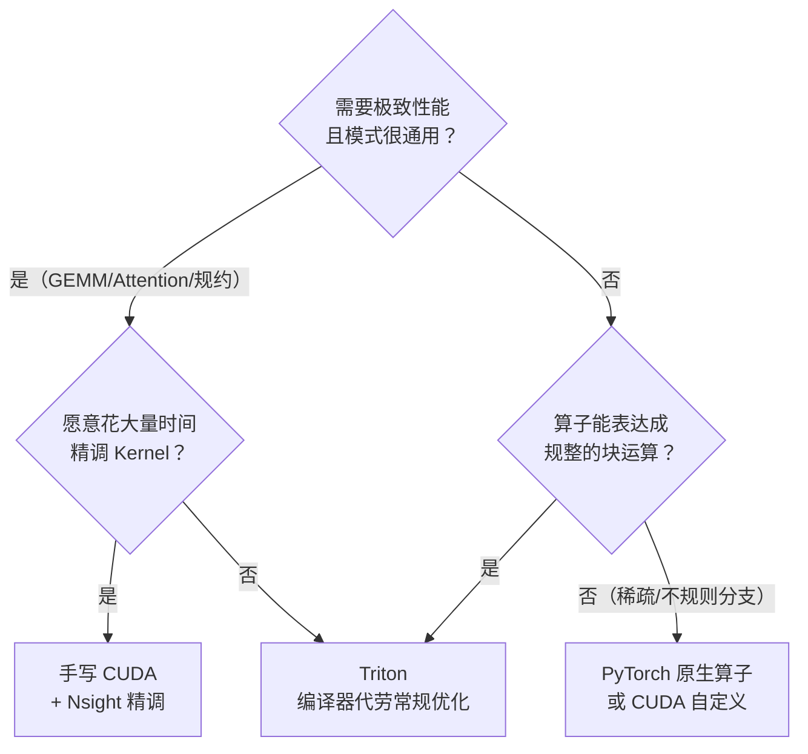

上一篇 5.2 手写 CUDA 版 Online Softmax，一个像样的并行 Kernel 要 50 行起，还要自己处理 Warp Shuffle、Shared Memory、向量化加载。而这一篇用 Triton 重写同样的事：**约 25 行代码，且编译器自动帮你完成向量化、共享内存分配与同步**——在 fused Softmax 场景下，全局内存天然只读一遍，等于免费拿到了 5.2 里 V3 的 One-Pass 效果。这是理解 FlashAttention 等一切"用编译器换开发效率"方案的前置知识，也是学习路线第一层检验标准点名的必做实验。

<!-- more -->

## 📑 目录

- [1. 为什么需要 Triton](#1-为什么需要-triton)
- [2. Block-level 编程模型：把线程交给编译器](#2-block-level-编程模型把线程交给编译器)
- [3. Triton 核心语法速览](#3-triton-核心语法速览)
- [4. 版本 V0：朴素 Fused Softmax](#4-版本-v0朴素-fused-softmax)
- [5. 版本 V1：任意 N 与性能对比](#5-版本-v1任意-n-与性能对比)
- [6. 权衡：Triton 牺牲了什么，换取了什么](#6-权衡triton-牺牲了什么换取了什么)
- [总结](#-总结)
- [自我检验清单](#-自我检验清单)
- [参考资料](#-参考资料)

---

## 1. 为什么需要 Triton

### 1.1 手写 CUDA 的开发成本

回顾 5.2 的优化历程：从 V0 到 V4，你手动处理了线程与数据的映射、Warp Shuffle 合并规约、float4 向量化、Shared Memory 同步、Grid Stride。这些技巧每一条都成立，但每一条都要自己写、自己调、自己用 Nsight Compute 验证。

问题是：**这些优化里有多少是"这个算子的业务逻辑"，有多少是"GPU 通用工程"？** 答案是后者占大头——规约、向量化、双缓冲、同步，在 Reduce、Softmax、GEMM 里反复出现，代码却无法复用。

打个比方：手写 CUDA 像是给工厂里每个工人单独写一份个人操作手册（thread-level：你管到每个线程），而 Triton 像是只写一份班组任务单（block-level：你只管"这一组数据要算什么"），组长（编译器）自己去安排每个工人干什么、怎么配合。

### 1.2 核心洞察

凭什么编译器敢接这个活？Triton 的核心洞察是：**把"线程管理"从程序员手里收走，交给编译器；程序员只描述"对一块数据做什么"**。代价是你放弃了寄存器级、Warp 级的细粒度控制——这正是第 6 节要算的账。

对比一眼可见（以 5.2 的 V1 Kernel 为基准）：

| 📊 维度 | 手写 CUDA（5.2 V1） | Triton |
|---------|--------------------|--------|
| 关注层级 | 线程（Thread-level） | 数据块（Block-level） |
| 向量化/Shared Memory/同步 | 手动写 | 编译器自动生成 |
| 完成 Softmax 的核心代码量 | 50+ 行 | ~20 行 |
| 调试方式 | Nsight Compute 下钻 + 单步 | 看编译器生成的 IR/PTX |

📌 **关键点**：Triton 不是"性能更差的 CUDA"，而是"把性能优化的重活从你手上移到编译器手上"——前提是你选的算子模式恰好是编译器擅长的。

---

## 2. Block-level 编程模型：把线程交给编译器

### 2.1 从 thread-level 到 block-level

CUDA 里你写 `__global__ void kernel(...)`，用 `threadIdx.x` 计算每个线程该处理哪个元素；Triton 里你写 `@triton.jit` 装饰的 Python 函数，用 `tl.program_id(0)` 拿到"当前处理第几个数据块"，块内的元素用 `tl.arange` 一次性声明。

为什么这样能行？因为 GPU 的硬件真相是：**Warp 内的 32 个线程本来就是锁步执行同一段代码的**——你手动写的"每个线程干一件事"，本质上只是同一段指令的不同数据。Triton 把这个事实直接摆上台面：你写"对这块数据做运算"，编译器负责把它切到 Warp 上。

### 2.2 一张表看懂对应关系

| 📊 CUDA 概念 | Triton 对应物 | 说明 |
|-------------|--------------|------|
| `grid` / `blockIdx` | `grid` / `tl.program_id(axis)` | 一组 program，每个处理一个块 |
| `blockDim` / `threadIdx` | 不需要写 | 编译器自动切分块内数据 |
| 指针 + 手动偏移 | 指针 + `tl.arange` 生成的偏移张量 | 偏移是"一整段"，不是单个标量 |
| `__syncthreads()` | 不需要写 | 编译器自动插入同步 |
| float4 向量化加载 | 不需要写 | 编译器自动向量化 |
| Shared Memory 手动管理 | `tl.load` 的块数据自动进片上 | 编译器决定放寄存器还是共享内存 |

### 2.3 编译器替你做了什么

Triton 基于 MLIR 的编译器在编译期做三件大事：

1. **自动向量化**：把块内连续数据加载合并成 `ld.global.v4` 这类宽加载，等价于 5.2 的 V2
2. **自动共享内存分配与同步**：块内归约、块间数据复用需要 Shared Memory 时，编译器自动分配并在合适位置插入 `bar.sync`
3. **自动寄存器分配**：块内张量尽量驻留寄存器，等价于 5.2 的 V3 缓存策略

💡 **提示**：这不是"魔法"——编译器能做的优化范围是有限的。你写的块模式越规整（连续地址、2 的幂大小、无数据依赖分支），编译器生成的内核就越接近手写水平。

---

## 3. Triton 核心语法速览

### 3.1 指针与 tl.arange

Triton Kernel 的参数是"裸指针 + 步长"，与 CUDA 的 host 端传 `d_input` 一致；区别在于偏移量用 `tl.arange` 一次性生成：

```python
@triton.jit
def demo_kernel(ptr, ...):
    offsets = tl.arange(0, BLOCK_SIZE)   # 生成 [0, 1, ..., BLOCK_SIZE-1] 的张量
    data_ptrs = ptr + offsets            # 指针 + 偏移张量 = 一整段地址
```

⚠️ **注意**：`tl.arange(0, N)` 的 `N` 必须是**编译期常量**，且长度须为 2 的幂（编译器要求，以你所用版本为准）。运行时才知道的 `N` 不能直接写进 `tl.arange`——这是新手最常见的报错来源。

### 3.2 tl.load / tl.store：mask 处理边界

数据边界（行尾不足一块）用 mask 显式声明，加载时给 `other` 填充值：

```python
x = tl.load(ptrs, mask=offsets < n_cols, other=-float('inf'))  # mask 外的位置填 -inf
tl.store(out_ptrs, y, mask=offsets < n_cols)                   # 写出时同样挡住
```

### 3.3 块内归约：tl.max / tl.sum

块内沿某个轴归约，一行代码完成 5.2 里一整套 Warp Shuffle 规约：

```python
m = tl.max(x, axis=0)        # 整块最大值（对一行来说，这就是该行的 max）
d = tl.sum(x, axis=0)        # 整块求和
```

### 3.4 tl.dot：矩阵乘

GEMM 用 `tl.dot(a, b)` 直接调 Tensor Core，维度需满足编译器约束（fp16 输入各维至少 16，以你所用版本为准）：

```python
c = tl.dot(a, b)             # a: (M, K)，b: (K, N) → c: (M, N)，走 Tensor Core
```

📌 **关键点**：语法面就这么点东西——`tl.arange` 造偏移、`tl.load/store` 带 mask 读写、归约和 `tl.dot` 做计算。官方教程约 30 行的 GEMM 就达到与 cuBLAS 同级的性能（具体数字见第 6 节）。

---

## 4. 版本 V0：朴素 Fused Softmax

### 4.1 算法思路

5.2 里我们为了省一遍读取，手工推导了 Online 递推——难道在 Triton 里也得这么绕？**恰恰相反，这里的写法反而更简单：把一整行一次性 load 进片上，max、exp、sum 全在片上算完，全局内存只读一遍**。

打个比方：5.2 的 Online Softmax 是"为了少去仓库，边读边心算修正"；Triton 是"直接把整筐食材端上灶台，厨师在台面上随便折腾，不用一趟趟跑仓库"。灶台（寄存器/共享内存）放得下，就没必要心算。

### 4.2 实现

```python
import torch
import triton
import triton.language as tl

@triton.jit
def softmax_kernel(output_ptr, input_ptr, input_row_stride, output_row_stride,
                   n_cols, BLOCK_SIZE: tl.constexpr):
    # 每个 program 处理一行
    row_idx = tl.program_id(0)
    col_offsets = tl.arange(0, BLOCK_SIZE)
    # 本行第 col 个元素的地址（步长单位是元素，不是字节）
    input_ptrs = input_ptr + row_idx * input_row_stride + col_offsets
    mask = col_offsets < n_cols

    # 只读一遍：整行进片上，之后 max/exp/sum 都不再碰全局内存
    row = tl.load(input_ptrs, mask=mask, other=-float('inf'))
    row_minus_max = row - tl.max(row, axis=0)      # 减最大值，保证数值稳定
    numerator = tl.exp(row_minus_max)
    denominator = tl.sum(numerator, axis=0)
    softmax_output = numerator / denominator

    output_ptrs = output_ptr + row_idx * output_row_stride + col_offsets
    tl.store(output_ptrs, softmax_output, mask=mask)

def fused_softmax(x):
    M, N = x.shape
    # BLOCK_SIZE 取 ≥ N 的最小的 2 的幂
    BLOCK_SIZE = triton.next_power_of_2(N)
    y = torch.empty_like(x)
    softmax_kernel[(M,)](
        y, x, x.stride(0), y.stride(0), N,
        BLOCK_SIZE=BLOCK_SIZE,
    )
    return y
```

💡 **提示**：`other=-float('inf')` 不是随便填的——mask 外的填充元素必须**不参与 max**（所以填 $-∞$），这样 `exp(-∞ - max) = 0`，也不污染 sum。填 0 会直接算错最大值。

⚠️ **注意**：`BLOCK_SIZE: tl.constexpr` 是编译期常量，不是运行时参数。换一个 `BLOCK_SIZE` 就触发一次重新编译；你可以在 `@triton.jit` 上加 `@triton.autotune` 让它在多个配置里自动挑最快（见 5.3）。

### 4.3 正确性验证

```python
torch.manual_seed(0)
x = torch.randn(4096, 4096, device='cuda')
y = fused_softmax(x)
torch_ref = torch.softmax(x, dim=-1)
print(torch.allclose(y, torch_ref, rtol=1e-5, atol=1e-5))  # True
```

跑通这一行，你就完成了学习路线里"Triton 上手：实现 fused Softmax kernel，与 PyTorch 对比正确性"的第一半。**动手是检验这一层的唯一标准**——别停在读代码。

---

## 5. 版本 V1：任意 N 与性能对比

### 5.1 问题：N 不是 2 的幂，或者 N 大到放不进一片灶台怎么办？

V0 的隐藏前提是"一整行能装进一个 program 的片上资源"。当 N 很大（比如序列长度 131072）或 BLOCK_SIZE 强行取 2 的幂导致大量 mask 浪费时，V0 就不够用了。

答案是：**行内分块循环 + 跨块合并状态 (m, d)**——这正是 5.2 推导过的 Online 递推，在 Triton 里原样重现：

$$
\underbrace{m_{\text{new}} = \max(m, \text{block\_max})}_{\text{更新最大值}} \quad \rightarrow \quad \underbrace{d = d \cdot e^{m - m_{\text{new}}} + \sum e^{x - m_{\text{new}}}}_{\text{修正旧和 + 加入新块}}
$$

💡 **提示**：循环边界 `range(0, n_cols, BLOCK_SIZE)` 保证每个执行的块里**至少有一个有效元素**，所以 `block_max` 不会是 $-∞$——避免出现 `exp(-∞ - (-∞)) = exp(NaN)` 的经典坑。若你真的构造出全 mask 的块，`tl.max` 会返回 `-inf`，后续 `exp` 直接产出 NaN。

### 5.2 实现

```python
@triton.jit
def softmax_kernel_v1(output_ptr, input_ptr, input_row_stride, output_row_stride,
                      n_cols, BLOCK_SIZE: tl.constexpr):
    row_idx = tl.program_id(0)
    col_offsets = tl.arange(0, BLOCK_SIZE)
    row_start_ptr = input_ptr + row_idx * input_row_stride

    # 第 1 遍：分块 Online 递推，维护 (m, d)（对照 5.2 的合并公式）
    m = -float('inf')
    d = 0.0
    for start in range(0, n_cols, BLOCK_SIZE):
        ptrs = row_start_ptr + start + col_offsets
        mask = start + col_offsets < n_cols
        x = tl.load(ptrs, mask=mask, other=-float('inf'))
        block_max = tl.max(x, axis=0)              # 本块局部最大值
        m_new = tl.maximum(m, block_max)           # 合并：取更大的 max
        d = d * tl.exp(m - m_new) + tl.sum(tl.exp(x - m_new), axis=0)
        m = m_new

    # 第 2 遍：归一化输出（需要再读一次全局内存）
    for start in range(0, n_cols, BLOCK_SIZE):
        ptrs = row_start_ptr + start + col_offsets
        mask = start + col_offsets < n_cols
        x = tl.load(ptrs, mask=mask, other=0.0)
        y = tl.exp(x - m) / d
        out_ptrs = output_ptr + row_idx * output_row_stride + start + col_offsets
        tl.store(out_ptrs, y, mask=mask)
```

⚠️ **注意**：V1 是**两遍读**，和 5.2 的 V2 同档；而 V0 反而是一遍读——**在 Triton 里，One-Pass 的简单版本（V0）竟然是最优的**，和手写 CUDA 里"One-Pass 要寄存器缓存（5.2 V3）最难"正好相反。原因：Triton 里循环块数据无法带出循环，跨块保留数据只能靠 (m, d) 标量状态，所以通用分块版本天然是两遍。这就是"编译器帮你优化"的边界。

### 5.3 性能对比与调参

| 版本 | 全局读次数 | 适用 N | 核心代码量 | 备注 |
|------|-----------|--------|-----------|------|
| V0 整行进块 | 1 遍 | $N \leq$ 片上容量（如 ≤ 1 万量级） | ~20 行 | 最简，通常也最快 |
| V1 分块 Online | 2 遍 | 任意 N | ~25 行 | 通用，但多读一遍 |
| PyTorch `torch.softmax` | 1 遍（内部已优化） | 任意 | 1 行 | 单独跑差距不大，赢在融合 |

📌 **关键点**：单独一个 Softmax，Triton 相对 PyTorch 的收益有限——官方教程的基准（M=4096，N 从 256 扫到 12k+，以 GB/s 计）显示：**N 较大时 Triton 与 `torch.softmax` 相当甚至略快，N 较小时 PyTorch 更快**。还要注意，教程原文只承诺“行能装进 SRAM”时“significantly faster than PyTorch's native op”，而且对比对象是朴素的多次遍历实现。**Triton 的真正价值是“融合”**：把 softmax 前后的 elementwise 算子合并进同一个 Kernel，省掉中间张量的写 + 读。以 $(M, N) = (4096, 4096)$ FP16 为例，一个中间张量就是 32 MB，省一次写 + 一次读 = **64 MB HBM 流量**，这对 Memory-Bound 场景是实打实的收益。

有两个编译期参数可以调（以你所用版本的 `--help` / 文档为准）：

```python
# num_warps：每个 program 用几个 warp；num_stages：软件流水线级数（对含 tl.dot 的 Kernel 更敏感）
softmax_kernel[(M,)](..., num_warps=4, num_stages=3)
```

- `num_warps=4`（默认）：块内计算并行度，块太大时提高它
- `num_stages`：流水线深度，GEMM 类 Kernel 收益明显，elementwise 类基本无感

性能对比用 `triton.testing.do_bench` 计时（它做了 warmup 并规避 L2 缓存效应）：

```python
from triton.testing import do_bench
t_triton = do_bench(lambda: fused_softmax(x))
t_torch = do_bench(lambda: torch.softmax(x, dim=-1))
print(f"Triton: {t_triton:.3f} ms | PyTorch: {t_torch:.3f} ms")
```

---

## 6. 权衡：Triton 牺牲了什么，换取了什么

### 6.1 换取了什么

- **开发效率**：核心代码量约为手写 CUDA 的 1/2 到 1/3（Softmax 场景 50+ 行 → ~20 行），且不需要 Nsight Compute 反复调规约
- **自动获得 5.2 的全部"常规优化"**：向量化、共享内存、同步、寄存器缓存，编译器默认给你
- **性能接近手写**：官方教程（03-matrix-multiplication）称约 30 行的 GEMM 与 cuBLAS “on par”——FP16 方形矩阵基准中，4096³ 时 Triton 约 212 TFLOPS vs cuBLAS 约 218 TFLOPS（≈97%，数字随硬件与 Triton 版本浮动）；分组内存排序（grouped ordering）还能再带来 10%+ 的收益（教程在 A100 上从 220 提到 245 TFLOPS 量级）。FlashAttention 的官方 Triton 实现（tutorial 06）也是社区广泛使用的高性能参考

### 6.2 牺牲了什么

- **细粒度控制**：寄存器级布局、Warp 内 shuffle 的显式编排、自定义同步——你碰不到了。需要这些的场景（如极致 GEMM、特定 Tensor Core 流水）仍要回 CUDA
- **调试难度**：你写的 Python 是一层"声明"，真正的代码是编译器生成的 IR/PTX（底层中间表示）——报错信息经常指向你看不懂的 MLIR 片段
- **新硬件特性滞后**：新架构特性（如 Hopper 的 TMA/WGMMA 的某些用法、Blackwell 新指令）往往先在 CUDA 落地，Triton 支持有延迟
- **版本变动快**：Triton 的 API 和默认行为随版本演进，旧教程代码可能跑不通——**以你所用版本为准**

### 6.3 选型：什么时候用 Triton

什么时候该用 Triton，什么时候回 CUDA？判断标准只有一个：**你的瓶颈到底是"开发效率"还是"最后 10% 性能"**。先看决策树：



落成一句话的规则：

- ✅ **规整的块运算、性能够用** → 用 Triton。开发成本低，性能通常不差
- ✅ **追求极限性能、愿意精调** → 手写 CUDA。Triton 的抽象层会挡住你
- ✅ **快速原型、验证想法** → 先用 PyTorch 原生算子跑通，再考虑要不要用 Triton 重写
- ❌ **别为了"显得高级"而用 Triton**：单个 elementwise 算子、已有原生实现且不是瓶颈的地方，重写是白付时间

---

## 📝 总结

1. **编程模型**：Triton 把 thread-level 的线程管理收走，程序员只描述"对一块数据做什么"，编译器自动完成向量化、共享内存与同步
2. **语法最小集**：`tl.arange` 造偏移、`tl.load/tl.store` 带 mask 处理边界、`tl.max/tl.sum` 块内归约、`tl.dot` 走 Tensor Core
3. **One-Pass 反转**：在 Triton 里，整行进块的 V0 天然只读一遍全局内存，免费拿到 5.2 中 V3 的效果；通用分块的 V1 反而是两遍——编译器帮你优化的边界就在这
4. **真正价值是融合**：单独 Softmax 与 PyTorch 差距有限，把前后算子并进一个 Kernel 省掉的中间张量读写（如 64 MB/次）才是 Memory-Bound 场景的实打实收益
5. **权衡**：用细粒度控制、调试直观性、新特性时效换开发效率和自动优化；规整块运算选 Triton，极限性能回 CUDA

---

## 🎯 自我检验清单

- 能解释 Triton 的 block-level 与 CUDA thread-level 编程模型的本质区别，以及编译器自动完成的三类优化
- 能写出 `tl.arange` + `tl.load`/`tl.store` 带 mask 的边界处理，并解释为什么填充值必须选 $-∞$ 而不是 0
- 能解释为什么 V0 只读一遍全局内存，而 V1 分块版本需要读两遍
- 能手动写出 V1 中 (m, d) 跨块合并的递推公式，并与 5.2 的 Online Softmax 递推对应起来
- 能实现一个 fused Softmax kernel，与 `torch.softmax` 对比，`allclose(rtol=1e-5, atol=1e-5)` 通过
- 能使用 `triton.testing.do_bench` 对比 Triton 与 PyTorch 的性能，并解释"融合省掉中间张量读写"的账（4096×4096 FP16 中间张量 = 32 MB）
- 能解释 `tl.constexpr` 的作用，以及为什么 `BLOCK_SIZE` 变化会触发重新编译
- 能说出 Triton 相比手写 CUDA 牺牲的三样东西，并各举一个场景说明何时不值得用 Triton
- 能根据"极致性能 vs 开发效率 vs 快速原型"三种诉求选择 CUDA / Triton / PyTorch 原生

---

## 📚 参考资料

- [Triton: An Intermediate Language and Compiler for Tiled Neural Network Computations - Tillet et al., 2019](https://www.eecs.harvard.edu/~htk/publication/2019-mapl-tillet-kung-cox.pdf)（Triton 的原始论文，块级编程与编译器的设计动机）
- [Triton 官方教程（含 02-fused-softmax 与 06-fused-attention）](https://triton-lang.org/main/getting-started/tutorials/)（本文代码的官方出处，教程结论以你所用版本为准）
- [Triton Language 官方 API 文档](https://triton-lang.org/main/python-api/language.html)（`tl.load`/`tl.store`/`tl.dot` 的参数与约束）
- [Triton GitHub 仓库](https://github.com/triton-lang/triton)（版本演进与 issue 讨论）
- [5.2 CUDA Online Softmax 实现优化（站内）](/AIInfraGuide/cuda/模块二-cuda编程与算子优化/52-cuda-online-softmax实现)（本文对照的手写 CUDA 版本，含 V0-V4 递进与性能数据）
- [AI Infra 学习路线（站内）](/AIInfraGuide/guides/ai-infra学习路线)（第一层“AI 编译器”知识点与“Triton 上手”检验标准）
