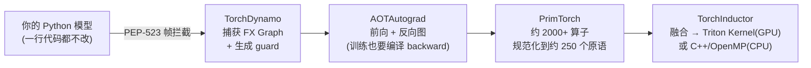
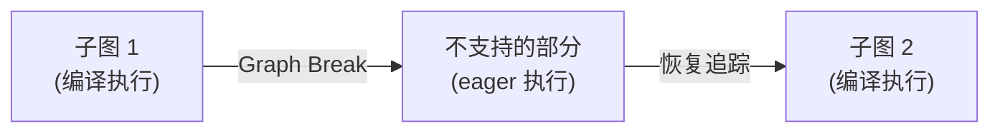
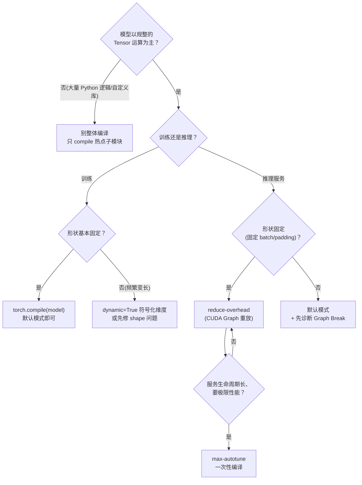

PyTorch 默认的 eager 模式跑一个 Transformer，一个 forward 要启动几百次 Kernel，每次启动都有微秒级的 CPU 开销，算子之间还要把中间结果写进显存再读出来——在小算子上，这笔开销往往比计算本身还贵。torch.compile 的答案是两步：**TorchDynamo 在 Python 字节码层自动捕获整张计算图（不改你一行代码），TorchInductor 再把图编译成融合的 Triton Kernel**。官方基准里，163 个开源模型 93% 能直接编译，在 A100 上训练平均快 43%（AMP 精度下 51%，FP32 下 21%），热门 Transformer 训练有 1.5x~2x 的报道——但注意，这是典型值而不是"up to"的峰值承诺，而让你拿不到这些数字的头号原因，就是本文的主角：**Graph Break**。上一节 7.1 讲了 Triton 这门"写给编译器的语言"，这一节讲 PyTorch 自带的编译器怎么接管你的模型；推理侧 2.5 节里 vLLM 对 torch.compile 的用法，也会在这里补上底层原理。

<!-- more -->

## 📑 目录

- [1. 为什么需要编译模式：eager 的痛点与 TorchScript 的教训](#1-为什么需要编译模式eager-的痛点与-torchscript-的教训)
- [2. 核心思想：TorchDynamo 字节码级图捕获](#2-核心思想torchdynamo-字节码级图捕获)
- [3. TorchInductor：把 FX Graph 变成 Triton Kernel](#3-torchinductor把-fx-graph-变成-triton-kernel)
- [4. Graph Break：编译器看不懂的地方](#4-graph-break编译器看不懂的地方)
- [5. 诊断与避免 Graph Break](#5-诊断与避免-graph-break)
- [6. 三种模式与 CUDA Graph](#6-三种模式与-cuda-graph)
- [7. 性能预期与权衡](#7-性能预期与权衡)
- [8. 一页纸决策：什么代码适合 torch.compile](#8-一页纸决策什么代码适合-torchcompile)
- [总结](#-总结)
- [自我检验清单](#-自我检验清单)
- [参考资料](#-参考资料)

---

## 1. 为什么需要编译模式：eager 的痛点与 TorchScript 的教训

### 1.1 eager 模式的三笔隐性开销

eager 模式的成本到底藏在哪里？先算一笔账。eager 模式下一个算子的完整执行路径是：Python 层调用 → C++ 分派 → 驱动提交 Kernel → GPU 执行。前两步是 CPU 上的"解释执行"，每次 forward 都要重复走一遍；最后一步的 Kernel 启动本身也有固定开销（构造参数、提交队列），量级在微秒级——第 2.5 节讲过，Decode 阶段小 Kernel 密集时，GPU 会大量时间在"等指令"。

把一次 forward 的总时间拆开看：

$$
\underbrace{T_{\text{total}} = N \cdot t_{\text{launch}}}_{\text{N 次 Kernel 启动的 CPU 开销}} + \underbrace{\sum_{i} t_i}_{\text{Kernel 实际执行}} + \underbrace{\sum_{j} (w_j + r_j)}_{\text{中间张量写 HBM + 读回}}
$$

（$N$ 为算子个数，$t_{\text{launch}}$ 为单次启动开销，$t_i$ 为第 $i$ 个 Kernel 的执行时间，$w_j/r_j$ 为第 $j$ 个中间张量的写/读流量。）

代入一个典型数字感受一下：一个 Transformer Decoder Layer 约 30 个算子，假设单次 launch 约 5μs、小算子 Kernel 平均执行约 20μs（数量级估算，**「待核实」**，以你的硬件实测为准）——单层就有约 150μs 的纯启动开销，占整层耗时的 20% 上下；而相邻算子之间每个中间张量的"写一次 + 读一次"，在 Memory-Bound 场景下都是实打实的 HBM 流量（7.1 算过：一个 4096×4096 的 FP16 中间张量就是 32 MB，写读一轮 64 MB）。

📌 **关键点**：eager 的痛点不是"算子跑得慢"，而是**算子之间没有协作**——不共享信息、不合并启动、中间结果全部落显存。编译器干的正是这三件事：提前把图拿到手、把多个算子融合成一个 Kernel、把中间张量留在片上。

### 1.2 TorchScript 的失败教训：没人愿意改代码

问题来了：拿到计算图这件事，PyTorch 1.x 时代就做过——TorchScript，为什么没成？

**答案是：它要求你改代码，而用户不愿意改。** 官方在 PyTorch 2.0 的发布说明里原话是：TorchScript"需要实质性地修改你的代码，以及你的代码所依赖的代码（needed substantial changes to your code and the code that your code depended on）"，这让它"对大量 PyTorch 用户来说一开始就出局了（a non-starter）"。你要把模型改写成 scriptable 的子集、补类型标注、处理第三方库的兼容——为了加速而大动干戈，ROI 直接为负。

打个比方：TorchScript 像是要求你把家里所有电器都换成同一品牌的智能插座才能接入智能家居——省电是省电，但先要把全屋电器换一遍；而 torch.compile 是装一个万能协议转换器，**电器一个都不用换**，插上就能用。

官方用 7000+ 个 GitHub 上的真实 PyTorch 项目验证过这个差距：TorchScript 等旧方案"连图都捕获不到一半（50% 成功率都不到），还常有巨大开销"，而 TorchDynamo **99% 的项目都能正确、安全地捕获到图，且几乎零开销、不需要改动任何原始代码**。

这就是 torch.compile 的第一设计原则，也是本文反复强调的准绳：

**编译模式必须零改造接入，否则再快也没人用。** 后面所有的技术细节（字节码拦截、guard、Graph Break 的"先跑起来再优化"哲学），都是这条原则的展开。

---

## 2. 核心思想：TorchDynamo 字节码级图捕获

### 2.1 为什么是"字节码级"？

捕获计算图的老办法有三条路，各有硬伤：`torch.jit.trace` 靠喂样例输入，遇到数据依赖的控制流会静默算错；`torch.jit.script` 靠源码翻译，所以要改代码；FX trace 只能跟踪显式的 `torch` 调用，Python 对象方法、第三方库调用统统看不见。

能不能有一种方法：**用户在 Python 解释器里照常写代码、照常执行，而解释器在背后悄悄把每一步 tensor 操作记录下来？**

TorchDynamo 的答案是**利用 CPython 的 Frame Evaluation API（PEP-523）**：在解释器执行每个 Python 函数帧（frame）之前把它拦截下来，边执行边记录，把连续的 tensor 操作攒成一张 FX Graph。你不需要 trace 样例、不需要改源码、不需要标注——你的 forward 还是那个 forward，只是跑的时候被"录了像"。

打个比方：TorchDynamo 像一位坐在教室后门旁听的老师，不打断上课，把黑板上的每个操作抄进本子；哪天课上出现他抄不了的内容（比如学生突然改画风），他就在本子上记一笔"这一段照原样执行"，然后继续抄。

整条编译流水线有四段（都是 Python 写的，这也是 PyTorch 2.0 的一个标志性转向）：



- **TorchDynamo**：图捕获层，产出 FX Graph 和一组 guard（下一节讲）。
- **AOTAutograd**：复用 PyTorch 的 autograd 引擎把反向图也提前 trace 出来——训练加速靠的就是它，否则只有 forward 被编译。
- **PrimTorch**：把 2000 多个算子规范化到约 250 个原语，降低后端实现成本（这也是第三方编译器接入 PyTorch 的接口）。
- **TorchInductor**：默认后端，把图 lower 成可执行代码，见第 3 节。

### 2.2 Guard：编译产物的"校验合同"

编译是"一次编译、多次执行"，但 Python 是动态语言——同一个函数，下次调用时输入的 shape 可能变了、dtype 可能变了、模型权重可能被换掉了。**编译产物是建立在假设之上的，假设谁来验证？**

答案是 **guard（守卫）**。TorchDynamo 在捕获图时，会记录下它依赖的所有假设：输入 tensor 的 **shape、dtype、device、stride、requires_grad**，以及模型属性的取值。每次调用编译后的函数，先花极短时间检查这些 guard——全部命中，直接跑编译产物；任何一个不满足（比如 batch size 从 32 变成 64），就**放弃本次编译产物，回到 eager 执行，并触发重新编译**。

🔑 **核心概念**：**guard 是"编译产物可用性的校验合同"——它让"动态 Python + 预编译"同时成立**。代价是：shape 频繁变化的场景（如变长 batch 的训练、变长序列的推理），guard 频繁 miss，编译成本被反复摊销，收益被吃掉——这是"什么时候不值得用"（第 7 节）的重要判据之一。

💡 **提示**：新版 PyTorch 支持 `dynamic=True`（以及 `torch.compile` 里更细粒度的 dynamic shapes 配置），让部分维度在编译时保持"符号化"而不是固化成具体数字，从而减少 guard miss；但符号维度的代价是编译器无法针对具体形状做最强的优化。具体默认行为随版本演进，以你所用版本的文档为准。

---

## 3. TorchInductor：把 FX Graph 变成 Triton Kernel

### 3.1 图拿到手了，怎么变成快的代码？

图只是"计划书"，真正决定快慢的是代码生成。TorchInductor 的策略官方 FAQ 一句话说得很清楚：**先把能融合的都融合掉，再生成 Triton Kernel**。

具体做三件事：

1. **算子融合（fusion）**：把相邻的 pointwise / reduction 类算子合并成更大的计算块。比如 Linear 后的激活、残差、LayerNorm 的若干子步骤，eager 下是 5~6 个 Kernel，融合后是 1~2 个——中间张量不再落 HBM，启动次数大幅下降。这正是第 1.1 节那笔账的两条开销线同时被砍。
2. **代码生成**：GPU 上用 **Triton**（OpenAI 的块级编程语言，上一节 7.1 的主角）生成 Kernel，CPU 上生成 C++/OpenMP 代码。官方原话是"OpenAI Triton 生成的 Kernel 性能与手写 Kernel 以及 cuBLAS 这类专门库同级（on par）"——编译器帮你把 7.1 里那些向量化、共享内存、同步的脏活干了。
3. **循环级优化**：在生成代码时做缓存友好排布、向量化、并行度选择。

💡 **提示**：7.1 里你手写的 fused Softmax，正是 TorchInductor 对规整子图自动做的事的一个缩影——但注意边界：编译器只对"规整模式"（连续地址、无数据依赖分支）发挥得好，遇到它不认识的模式就生成平庸的代码，或者直接 Graph Break（第 4 节）。

### 3.2 与 CUDA Graph 的关系

启动开销还能不能再压？能——靠 CUDA Graph。第 2.5 节讲过，CUDA Graph 把一串 Kernel 启动"录制成一张图"，重放时一次提交全部执行，把 CPU 启动开销压到最低。torch.compile 的两处集成：

- `mode="reduce-overhead"`（第 6 节）：对编译后的子图做 **CUDA Graph 捕获**，用重放代替逐 Kernel 启动，进一步榨干 launch 开销——代价是需要固定 shape、占用额外显存。
- `backend="cudagraphs"`：也可以显式指定 CUDA Graph 作为编译后端。

📌 **关键点**：把第 2.5 节的 Piecewise CUDA Graph 和这里的原理放一起看就通了——vLLM 在 Attention 算子处"切开"、对规整部分做 CUDA Graph、对 Attention 保留 eager，本质上就是**手动设计 Graph Break 的边界**：编译器能力覆盖不到的（变长 KV 的 Attention），主动留成 eager；覆盖得到的（LayerNorm、GEMM、激活），全部图优化。你写自己的推理服务时，可以完全照搬这个思路（第 5.2 节）。

---

## 4. Graph Break：编译器看不懂的地方

### 4.1 什么是 Graph Break？

TorchDynamo 承诺"99% 的代码能捕获"，但总有些代码它追踪不了。官方文档的定义很直接：**Dynamo 遇到无法追踪的代码时，会把已经捕获到的部分编译执行，无法支持的部分回退到 eager 模式原样执行，然后从断点继续追踪**——这个"断点"就是 Graph Break。



听起来很优雅：编译不了的部分照常跑，正确性不受影响。**但收益被打了折**——这就是它的代价所在：

- **图变小，融合机会变少**：官方 FAQ 明确指出，graph break 会让图变小，抢走编译器的融合机会；融合恰恰是 torch.compile 最主要的收益来源。
- **断点边界有额外开销**：每次 break 都要做 guard 检查、把中间张量物化到显存（eager 语义）、跨 eager/编译边界传递数据。
- **官方 FAQ 原话**："你看不到期望加速比的头号原因，就是过多的 graph break（The main reason you won't see the speedups you'd like to by using dynamo is excessive graph breaks）。"

打个比方：流水线上本来能全自动跑完一整段工序，结果中间有一环必须人工处理——机器干一段、停下来等人工、再接着干一段。人工那环（eager）不但自己不快，还让整条线没法连续。

### 4.2 什么操作会打断？

官方"Common Graph Breaks"文档把常见原因归为三类，加上实践中高频遇到的，汇总如下（代码均以你所用 PyTorch 版本为准）：

| 打断原因 | 例子 | 为什么打断 |
|---|---|---|
| **数据依赖的控制流** | `if x.sum() > 0:` / `for i in range(n.item()):` | 分支条件依赖 tensor 的运行时数值，编译器无法静态展开 |
| **直接读 tensor 数据** | `x.item()`、`x.data_ptr()` | 把 GPU 数据拉回 Python 标量，图捕获无法表示 |
| **打印与日志** | forward 里的 `print(x.shape)`、logger 调用 | 官方 FAQ 点名：连一句 print 都会触发 break |
| **第三方 C 扩展 / Python 对象方法** | 调用自定义 C++ 扩展、`dict`/自定义类的任意方法 | 对 Dynamo 不可见，无法保证安全复用编译产物 |
| **数据依赖的算子** | `nonzero`、`unique` 等返回形状依赖数据的算子 | 输出形状运行时才知道（官方 2.0 博客明确：这类算子仍需要 break） |
| **未注册的自定义算子** | 直接用 `torch.ops` 但没给 Dynamo 提供 schema | 编译器不知道它的语义，无法插入 guard |

两个"反直觉"的点值得单独说：

⚠️ **注意**：**不是所有 `if` 都打断**。`if` 的条件只要不依赖 tensor 数值（比如依赖 Python 常量、编译期已知的 flag），Dynamo 能正常处理；**只有"数据依赖"的分支才会 break**。同理，循环只依赖常量边界也不会 break。

⚠️ **注意**：**print 打断比你想象的隐蔽**。很多人模型里残留调试用的 print，跑 eager 没感觉，一 compile 就静默多出好几处 break，收益莫名消失——排查时先全局搜一遍 forward 里的 print。

### 4.3 打断的代价有多大？算给你看

设一段代码里，可被编译的部分按执行时间占比为 $p$，编译段相对 eager 的加速比为 $s$，那么整体加速比有个理论上界：

$$
S_{\text{max}} = \underbrace{\frac{1}{1 - p + \frac{p}{s}}}_{\text{可编译部分占 p、加速 s，eager 残留 (1-p) 按 1x 计}}
$$

代入算例：假设编译段能加速 $s = 2$ 倍：

- 没有 break（$p = 1$）：$S_{\text{max}} = 2.0$ 倍
- 打断 20% 的时间（$p = 0.8$）：$S_{\text{max}} = \frac{1}{0.2 + 0.4} \approx 1.67$ 倍——**收益直接少了 1/3**
- 打断 50%（$p = 0.5$）：$S_{\text{max}} = \frac{1}{0.5 + 0.25} \approx 1.33$ 倍——只剩零头

📌 **关键点**：Graph Break 的伤害不是"那段 eager 代码慢"，而是**它按 1x 的速度拖住整个图**——哪怕编译段本身飞快，残留的 eager 段也把整体收益封死在上界公式里。所以"把 break 点移出热点"往往是性价比最高的优化，比追求编译段多 10% 的加速更值得（第 5 节）。

---

## 5. 诊断与避免 Graph Break

### 5.1 诊断三件套 + 一个开关

问题是怎么知道自己的代码 break 在哪？官方提供了三个工具，配合一个开关（以你所用版本为准）：

```bash
# ① 环境变量日志：每次 Dynamo 决定 graph break 时打印原因
TORCH_LOGS=graph_breaks python train.py
```

```python
# ② explain：一次性汇总整段代码的 break 情况（官方文档示例的简化输出）
import torch
import torch._dynamo as dynamo

def toy_example(x, b):
    for i in range(3):          # 常量边界的循环，不打断
        x = x * b
    print(x.shape)              # ← 这行触发 break
    return x * b

explanation = dynamo.explain(toy_example)(torch.randn(10), torch.randn(10))
print(explanation)
"""
Graph Count: 2          # 被切成 2 个子图
Graph Break Count: 1    # 1 处 break
Op Count: 4
Break Reasons:
  Break Reason 1:
    Reason: builtin: print ...
    User Stack: <文件 foo.py 第 5 行 in toy_example>
"""
```

- `explanation.graph_breaks` 是结构化的 break 列表，每条带原因和用户代码堆栈，能直接定位到源码行。
- ③ `TORCH_COMPILE_DEBUG=1 python repro.py`：输出 Inductor 每个编译阶段的耗时、生成的代码、图可视化与 IR dump，适合下钻"编译出来的东西长什么样"。
- 开关：`torch.compiler.set_stance("force_eager")` 可以不改代码地临时关掉编译，用来区分"是我代码的问题还是编译器的问题"。
- `fullgraph=True`：遇到第一个 break 直接抛异常，用于"我就是要整段编译"的严格模式（和 `torch.export` 的诉求一致）。

### 5.2 避免策略：四条实用招

| 策略 | 做法 | 适用场景 |
|---|---|---|
| **把 break 移出热点** | 数据依赖的 `if/for` 外提到函数边界，或改成 `torch.where` / `torch.clamp` 等向量化等价写法 | 分支发生在热循环内部时 |
| **只编译子模块** | `torch.compile(model.layers[2])` 而不是整个 model；break 多的模块保持 eager | 模型里只有部分层值得编译 |
| **固定形状** | 固定 batch / padding 到对齐长度，或显式 `dynamic=True` 让关键维度符号化 | 变长输入的训练 / 推理 |
| **跳过副作用** | 用 `torch.compiler.is_compiling()` 包住 print / 日志 / 断言 | forward 里残留调试代码 |

第 2.5 节 vLLM 的做法就是策略二的极端形态：整模型编译、但在 Attention 处主动切开——**把"编译器不擅长什么"变成显式的设计决策，而不是被动等它 break**。

落成一句话的规则：**先跑 `TORCH_LOGS=graph_breaks` 或 `dynamo.explain` 拿到 break 清单，再按"热点优先、子模块次之、形状兜底"的顺序处理；目标不是"零 break"，而是"热点路径上零 break"。**

---

## 6. 三种模式与 CUDA Graph

编译一次的付出到底怎么和运行收益换？`torch.compile` 的 `mode` 参数提供了三档预设，本质是**在编译时间、额外显存、运行速度之间选平衡点**：

```python
# 默认：编译快、不加显存，为大模型和常规训练设计
model = torch.compile(model)

# reduce-overhead：进一步压框架开销（含 CUDA Graph 捕获），代价是少量额外显存
model = torch.compile(model, mode="reduce-overhead")

# max-autotune：长时间自动调优，追求生成最快的代码
model = torch.compile(model, mode="max-autotune")
```

| 📊 维度 | default | reduce-overhead | max-autotune |
|---|---|---|---|
| 目标 | 编译快 + 不占额外显存 | 压榨框架开销（小模型收益明显） | 生成最快的 Kernel |
| 编译时间 | 短 | 中 | 很长（autotune 多个配置） |
| 额外显存 | 无 | 少量（CUDA Graph 捕获） | 较多（多个候选 Kernel 缓存） |
| 关键机制 | 融合 + 代码生成 | 融合 + 代码生成 + **CUDA Graph 重放** | 融合 + 自动调优（含 Triton autotune） |
| 典型场景 | 训练、形状多变 | 推理、固定 shape 的小模型 | 一次性编译、长期服务的场景 |

📌 **关键点**：三档不是"越来越快"的递进关系，而是**交易关系**——max-autotune 在每次 shape 变化时都可能重新调优，训练这种 shape 会变的场景反而可能比 default 更慢；reduce-overhead 的 CUDA Graph 要求固定 shape，变长输入会频繁重新捕获，得不偿失。选档前先问：**我的形状稳定吗？我的服务生命周期够长吗？**

⚠️ **注意**：官方 2.0 时代的文档明确说"动态 shape 与非标准模式（reduce-overhead / max-autotune）不兼容"；此后版本对动态 shape 和 CUDA Graph 的支持持续演进（如 cudagraph trees），具体行为以你所用版本为准。经验法则是：形状越动态，越该留在 default。

---

## 7. 性能预期与权衡

### 7.1 官方账本：典型值 vs "up to"

预期该按多少来设？先把官方数字摆齐（来源：PyTorch 2.0 发布博客与 get-started 基准页，均为官方在 2022 年底~2023 年初、基于 2.0 nightly 的测量，数字随版本演进，**以你所用版本实测为准**）：

| 📊 指标 | 官方数字 | 口径说明 |
|---|---|---|
| 图捕获成功率 | 93%（163 个开源模型）/ 99%（7000+ GitHub 项目） | 前者是 benchmark 集合，后者是图捕获验证 |
| A100 训练平均加速 | **43%**（加权平均 0.75×AMP + 0.25×FP32） | 163 个模型的平均，不是单个模型 |
| AMP 精度平均 | 51% | 同上 |
| FP32 精度平均 | 21% | 同上 |
| 峰值案例 | "up to 2x"（30%~2x 训练加速区间） | 官方博客对热门模型的表述 |
| 生态反馈 | HuggingFace 维护者：Transformer 训练 1.5x~2x | 官方博客引用的第三方评价 |
| 分布式 | DDP/FSDP 编译模式：FP32 最高 15%、AMP 最高 80% | 官方 FAQ |
| 硬件依赖 | 桌面卡（3090）加速比明显低于服务器卡（A100）；Inductor 支持 NVIDIA Volta（V100）/Ampere 与 CPU | 官方 caveat |

📌 **关键点**：读这张表要区分两个词——**"up to"是峰值，典型值是 20%~50%**。任何宣称"torch.compile 2 倍加速"的文章，你都要追问一句：什么模型、什么精度、什么硬件、是不是恰好没踩 Graph Break？官方自己的表述是"30% 到 2x 的区间"，均值落在 43% 附近，这才是正常预期。

### 7.2 什么时候不值得用

torch.compile 不是免费午餐，以下几类场景收益为负或趋近于零（每条都对应一个明确的机制）：

- **小模型 / 单算子**：一个 `nn.Linear` 已经是 cuBLAS 最优路径，没有可融合的邻居，编译只是白付一次编译时间。
- **单次调用**：编译成本在第一次调用时一次性付出（预热那步可能慢几秒到几十秒），只跑一次就退出，成本摊不平。**服务端一定要做 warmup**。
- **动态 shape 频繁**：guard 频繁 miss → 反复重编译，收益被摊销（第 2.2 节的机制）。变长序列推理如果没做 padding/固定 shape，先别急着怪编译器。
- **已是手写 Kernel 的热点**：FlashAttention 这类算子本身就是手写最优（第 6 章），编译器没有融合空间，甚至可能生成更平庸的代码。
- **调试期**：编译产物是黑盒，数值异常难定位。先用 `set_stance("force_eager")` 关掉编译排查，再打开。

### 7.3 编译器 vs 手写 Kernel：自动的 70 分 vs 手动的 95 分

编译器能替代手写 Kernel 吗？一句话定位（定性比喻，非实测数字）：**torch.compile 是"自动的 70 分"，手写 Triton/CUDA 是"手动的 95 分"**——编译器覆盖面广、零改造、大多数模型白拿 20%~50%；手写 Kernel 上限更高，但只对少数热点算子值得。

- 编译器赢在**覆盖面与零成本**：163 个模型 93% 直接编译，你不需要知道每个算子怎么优化。
- 手写赢在**上限**：7.1 里 Triton GEMM 可以做到 cuBLAS 的 ~97%，但那是你花时间精调出来的；编译器对规整模式接近这个水平，对不规整模式可能只有 70 分甚至更低。

落成一句话的规则：**先 `torch.compile` 白拿 70 分，再用 Nsight 工具链（第 8 章）定位真正吃时间的热点，确认值得才手写那一个算子**——不要一开始就手写，也不要在热点上迷信编译器。

---

## 8. 一页纸决策：什么代码适合 torch.compile

把所有权衡收敛成一张决策树，判断条件都是"能用是/否回答"的工程问题：



落成一句话的规则：

- ✅ **常规训练** → `torch.compile(model)` 默认模式，先跑 `TORCH_LOGS=graph_breaks` 确认热点路径没 break
- ✅ **固定 shape 的推理服务** → `mode="reduce-overhead"`（CUDA Graph 重放），务必 warmup
- ✅ **一次性编译、长期服务的极限场景** → `mode="max-autotune"`
- ✅ **变长输入** → 先做 padding 或 `dynamic=True`，别直接上 reduce-overhead
- ✅ **只有个别模块是热点** → 只 `torch.compile` 那一个子模块
- ❌ **小模型、单次调用、调试期** → 别用。没有融合空间时，编译时间就是纯亏损

上手路径照三步走（每步"改了什么 / 为什么 / 预期收益"）：

| 步骤 | 改了什么 | 为什么 | 预期收益（官方口径，待核实） |
|---|---|---|---|
| V0 一行接入 | `model = torch.compile(model)` | 白拿图捕获 + 融合 + 代码生成 | 训练平均 +43%（A100，AMP）；典型 20%~50% |
| V1 消灭热点 break | 按第 5 节诊断并移出 break | 每消除 20% 的 eager 残留，收益上界提升约 1/3（第 4.3 节公式） | 从"没感觉"到"明显"，具体以实测为准 |
| V2 模式调优 | 按形状稳定性选 reduce-overhead / max-autotune | 压掉 launch 开销或榨出最优 Kernel | 小模型推理场景额外收益，待核实 |

---

## 📝 总结

1. **eager 的痛点**：逐算子解释执行 + 逐 Kernel 启动 + 中间张量落显存，三笔开销在小算子上往往超过计算本身；编译模式一次把三条线全砍掉。
2. **TorchScript 的教训**：需要改代码的方案用户不接受；TorchDynamo 用 PEP-523 字节码拦截实现零改造图捕获（官方验证 99% 成功率 vs 旧方案不足 50%）。
3. **四段流水线**：TorchDynamo（捕获 + guard）→ AOTAutograd（反向图）→ PrimTorch（约 250 原语）→ TorchInductor（GPU 生成 Triton Kernel / CPU 生成 C++），guard 保证"动态 Python + 预编译"同时成立。
4. **Graph Break 是收益头号杀手**：数据依赖控制流、`.item()`、print、第三方扩展都会打断；打断 20% 的时间就少 1/3 的收益（$S_{\text{max}} = 1/(1-p+p/s)$），诊断用 `TORCH_LOGS=graph_breaks` / `dynamo.explain`，目标是"热点路径零 break"。
5. **三种模式是交易不是递进**：default 平衡、reduce-overhead 用显存换 launch 开销（CUDA Graph）、max-autotune 用编译时间换极限性能；形状越动态越该留在 default。
6. **预期管理**：官方基准是 93% 可编译、A100 训练平均 43%（AMP 51%/FP32 21%）——典型值 20%~50%，"up to 2x"是峰值；小模型、单次调用、动态 shape、已融合热点都不值得用。先 compile 白拿"自动的 70 分"，热点再手写"手动的 95 分"。

## 🎯 自我检验清单

- 能解释 eager 模式下"启动开销 + 中间张量读写"两条成本线，并估算一个约 30 算子的 layer 中 launch 开销的占比（误差不超过 30%）
- 能说出 TorchScript 失败的核心理由（需改代码）与 TorchDynamo 的解法（PEP-523 帧拦截），并复述官方图捕获成功率对比（99% vs 不足 50%）
- 能画出 torch.compile 四段流水线（Dynamo → AOTAutograd → PrimTorch → Inductor）并说明每段职责
- 能解释 guard 机制：检查哪些假设、假设失效时发生什么，并举例说明 batch size 变化会触发重编译
- 能写出三类触发 Graph Break 的代码（数据依赖 if、`.item()`、print）并解释各自原因
- 能使用 `TORCH_LOGS=graph_breaks` 和 `torch._dynamo.explain` 定位一处 Graph Break，并在 30 分钟内把它移出热点路径
- 能推导并代入算例：给定 $p=0.8$、$s=2$，算出加速比上界约 1.67x，并解释为什么"打断 20% 少 1/3 收益"
- 能对比三种模式的取舍，并说出 reduce-overhead 依赖 CUDA Graph、要求固定 shape
- 能复述官方基准关键数字（93% 可编译、A100 训练平均 43%、AMP 51%），并区分"up to 2x"峰值与 20%~50% 典型值
- 能列出至少三种不值得用 torch.compile 的场景并说明对应机制（小模型、单次调用、动态 shape、已融合热点）
- 能走完第 8 节决策树，根据"训练/推理、形状是否固定、服务生命周期"给出具体模式建议
- 能说明编译器生成 Kernel 与手写 Kernel 的定位差异（自动 70 分 vs 手动 95 分），并给出"先编译、后手写"的取舍依据

## 📚 参考资料

**官方文档**
- [PyTorch 2.0 Release Blog（2023，PyTorch 团队）](https://pytorch.org/blog/pytorch-2.0-release/)（torch.compile 四段流水线、Triton 与 cuBLAS on par、93%/20%/36% 等首发数字）
- [PyTorch 2.0 Get Started（官方 benchmark 页）](https://pytorch.org/get-started/pytorch-2.0/)（163 模型 93%、A100 训练 43%、AMP 51%/FP32 21%、3090 caveat、三种模式定义、guard 说明、TorchScript 教训原文）
- [torch.compiler 官方文档](https://pytorch.org/docs/stable/torch.compiler.html)（TorchDynamo/Inductor/AOTAutograd 职责与 backend 列表）
- [torch.compile FAQ（官方）](https://pytorch.org/docs/stable/torch.compiler_faq.html)（"graph break 是看不到加速比的头号原因"、`torch._dynamo.explain` 用法与输出、`TORCH_COMPILE_DEBUG=1`）
- [torch._logging 文档（TORCH_LOGS=graph_breaks 语义）](https://pytorch.org/docs/stable/logging.html)
- [Working with Graph Breaks（官方用户指南）](https://docs.pytorch.org/docs/stable/user_guide/torch_compiler/compile/programming_model.graph_breaks_index.html)
- [Common Graph Breaks（官方）](https://docs.pytorch.org/docs/stable/user_guide/torch_compiler/compile/programming_model.common_graph_breaks.html)（数据依赖操作、打印日志、工作区）
- [CUDA Graph Best Practices for PyTorch（NVIDIA 官方指南）](https://docs.nvidia.com/dl-cuda-graph/latest/)

**教程与解读**
- [torch.compile: the missing manual - Horace He（Chillee）](https://github.com/Chillee/torchcompile)（社区公认的 torch.compile 深入教程）
- [TorchDynamo: An Experiment in Dynamic Python Bytecode Transformation（dev-discuss，Animesh Jain 等）](https://dev-discuss.pytorch.org/t/torchdynamo-an-experiment-in-dynamic-python-bytecode-transformation/361)（Dynamo 设计动机与字节码变换机制）
- [TorchInductor: A PyTorch Native Compiler with Define-by-Run IR and Symbolic Shapes（dev-discuss，Bin Bao）](https://dev-discuss.pytorch.org/t/torchinductor-a-pytorch-native-compiler-with-define-by-run-ir-and-symbolic-shapes/747)（Inductor 设计详解）
- [Torch compile 原理解析 - qccz123456（博客园）](https://www.cnblogs.com/qccz123456/p/19307391)（中文解读：eager 痛点、TorchScript 局限、Dynamo 解法）
- [torch.compile 加速原理：kernel 融合与缓冲区复用 - deephub（思否）](https://segmentfault.com/a/1190000047591254)（中文解读：融合与显存带宽视角）

**开源项目**
- [PyTorch 源码 torch/_dynamo](https://github.com/pytorch/pytorch/tree/main/torch/_dynamo)（图捕获、guard、explain 的实现）
- [PyTorch 源码 torch/_inductor](https://github.com/pytorch/pytorch/tree/main/torch/_inductor)（融合与 Triton 代码生成）

**站内**
- [7.1 Triton 快速上手（站内）](/AIInfraGuide/cuda/模块二-cuda编程与算子优化/71-triton快速上手)（本文对照的编译器语言基础：Triton block-level 模型与 fused Softmax）
- [第7章 AI 编译器（站内）](/AIInfraGuide/cuda/模块二-cuda编程与算子优化/第7章-ai编译器)（本章索引：Triton / torch.compile / TVM-XLA 全景）
- [2.5 Attention 后端与图优化（站内）](/AIInfraGuide/inference/模块四-推理优化/第2章-推理引擎核心技术/25-attention-后端与图优化)（vLLM 对 torch.compile + Piecewise CUDA Graph 的生产用法）
- [AI Infra 学习路线（站内）](/AIInfraGuide/guides/ai-infra学习路线)（第一层"AI 编译器"知识点与检验标准）
