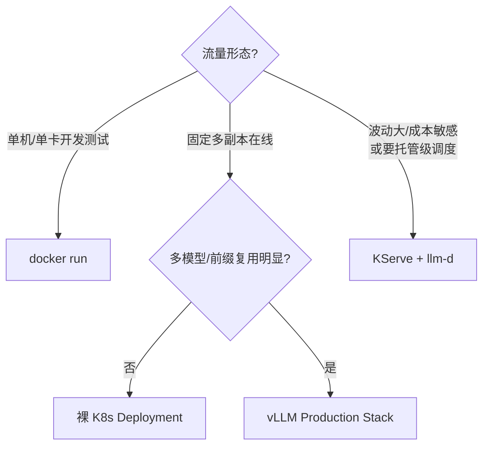

把推理服务从"本机能跑"推到"生产能扛",第一道坎不是模型,是打包和编排:一个 70B 模型冷启动要 **15~30 分钟**(下载权重 → 加载进显存 → CUDA Graph 捕获),而探针配置错误会让 K8s 在模型即将加载完成时把 Pod 杀掉重启,陷入 CrashLoopBackOff——一晚上过去服务还在转圈。本文给你一套能直接抄的 vLLM 容器化与 K8s 部署清单:镜像与权重怎么管理、GPU 为什么不能超卖、探针和优雅停机怎么配,再把裸 K8s、vLLM Production Stack、KServe+llm-d 三条路线摆开对比,讲清各自**牺牲什么、换取了什么**。上一节 9.5 教会你"上线前守住性能",这一节开始"上线后稳住服务"。

<!-- more -->

## 📑 目录

- [1. 为什么需要容器化](#1-为什么需要容器化)
- [2. Kubernetes 基础速览](#2-kubernetes-基础速览)
- [3. 部署清单(核心)](#3-部署清单核心)
- [4. vLLM Production Stack:开箱即用的参考系统](#4-vllm-production-stack开箱即用的参考系统)
- [5. KServe + llm-d:Serverless 与智能调度](#5-kserve--llm-dserverless-与智能调度)
- [6. 权衡与选型:三种形态怎么选](#6-权衡与选型三种形态怎么选)
- [总结](#-总结)
- [自我检验清单](#-自我检验清单)
- [参考资料](#-参考资料)

---

## 1. 为什么需要容器化

### 1.1 环境一致性:驱动、CUDA 与依赖

先回答一个最朴素的问题:模型在开发机跑得好好的,为什么到了生产就"水土不服"?因为推理服务对环境极其挑剔:驱动与 CUDA 版本耦合(好在**驱动向后兼容**——新驱动能跑旧 CUDA 编译的镜像,反过来不行)、torch/transformers 等几十个 Python 包、libnccl/libcublas 等系统二进制库——任何一层对不上,轻则起不来,重则静默算错。

容器把这三层全部冻结进镜像:镜像里是什么 CUDA、什么依赖,在任何机器上跑起来就是什么——**环境一致性是容器化的第一价值,不是"省事"而是"可复现"**。

好消息是,你不必自己从零搭环境:vLLM 官方发布现成的 `vllm/vllm-openai` 镜像(Docker Hub),CPU、NVIDIA GPU、ROCm 都有对应变体。自己写 Dockerfile 时,最省心的做法是**基于官方镜像做增量,而不是重新编译**——自己编译 CUDA/PyTorch 链不仅慢,还容易踩坑。

### 1.2 镜像策略:官方镜像、权重与密钥

用官方镜像时,三个决策点要提前想清楚(以你所用版本与 Docker Hub 标签为准):

**决策点一:权重放哪?** 两条路:

- **运行时挂载**:宿主机或 PVC 上放好 Hugging Face 缓存目录,启动时挂进容器(`-v $HOME/.cache/huggingface:/root/.cache/huggingface`)。vLLM 官方部署文档的主推模式;
- **打进镜像**:构建时把权重 COPY 进镜像,适合"镜像即模型"的交付形态。

各自的代价:挂载方式**换取了**"换模型不用重新构建镜像",但**牺牲了**"镜像到哪都能跑"(依赖宿主机文件);打进镜像**换取了**部署确定性,但**牺牲了**灵活性——而且 7B 模型 FP16 权重约 14GB,镜像动辄几十 GB,推送和拉取都慢。**落成一句话:多模型、常换模型 → 挂载;版本强管控、离线交付 → 打进镜像。**

⚠️ **注意**:权重走 Hugging Face 下载时,私有模型需要 token。运行时用 `HF_TOKEN` 环境变量(或 `HUGGING_FACE_HUB_TOKEN`);构建期要打进镜像时,用 Docker BuildKit 的 `--secret` 机制注入,**千万别写进 `ENV` 或 `ARG`**——那会把密钥永久烙进镜像层,`docker history` 一眼可见。

**决策点二:缓存放哪?** 生产环境必须给 Hugging Face 缓存挂 PVC。社区踩过的坑:Pod 每次重启都重新下载权重,**140GB 的模型每次重启重下,就是一次生产事故**。

**决策点三:标签用哪个?** 别用 `latest`——它随发布漂移,今天部署的和下个月部署的可能不是同一个行为。官方镜像按 CUDA 版本出标签(如 `vllm/vllm-openai:v0.26.0-cu129-ubuntu2404` 之类),**锁定明确版本**,升级时显式改 tag 并回归。

### 1.3 先在本机跑对:端口与共享内存

容器里跑 vLLM,两条经验先记住(细节见[第 3 章 vLLM 快速入门](/AIInfraGuide/inference/模块四-推理优化/第3章-深入vllm/vllm快速入门)):

- **端口约定**:vLLM 的 OpenAI 兼容服务默认监听 **8000** 端口,生产上把容器端口、Service 端口、探针端口统一约定为 8000,省掉一整套端口映射的排查成本;
- **共享内存**:vLLM 多卡(张量并行)时要用共享内存做进程间通信缓冲。`docker run` 加 `--ipc=host`,K8s 里给容器挂 `emptyDir` 的 `/dev/shm`(`medium: Memory`),否则 TP 多卡可能启动失败或性能异常——新手最常踩的"镜像没错、K8s 也没错、就是跑不起来"的坑。

---

## 2. Kubernetes 基础速览

如果你是 K8s 老手,这一节 30 秒扫过即可;如果只写过 `docker run`,这里用三个对象把 K8s 讲清。

### 2.1 三个对象讲清 K8s

- **Pod**:K8s 的最小调度单元,一个 Pod 里可以有一个或多个容器。vLLM 一个 Pod 通常就一个容器;
- **Deployment**:声明"我要 N 个一模一样的 Pod",负责滚动更新、故障自愈——Pod 死了它按声明数量重建;
- **Service**:稳定的访问入口。Pod 的 IP 会变(重建就换),Service 给一组 Pod 一个固定名字和负载均衡,客户端只认 Service。

说白了:Deployment 管"数量和死活",Service 管"怎么找到它们"。vLLM 多副本部署就是 1 个 Deployment(replicas=N)+ 1 个 Service,完事。

### 2.2 GPU 是"不可压缩资源":nvidia.com/gpu 与 device plugin

K8s 怎么知道节点上有几张 GPU?靠 **NVIDIA device plugin**:它以 DaemonSet 形式跑在每个节点上,把 GPU 数量上报给 Kubelet,注册成扩展资源 `nvidia.com/gpu`。你的 Pod 申请 `nvidia.com/gpu: 1`,调度器就在有这个资源的节点上找位置。

打个比方:device plugin 是**机房门卫,手里攥着一沓门禁卡,每张卡对应一块物理 GPU**。Pod 要进机房干活,必须向门卫领卡;门卫只按物理卡数发卡,发完就没了。想发第 N+1 张卡?要么有人还卡(Pod 结束),要么加机器。

这里有一条硬规则必须刻进脑子:**GPU 是"不可压缩资源",不能超卖**。CPU 是可压缩资源——多个 Pod 可以共享一个核,忙时大家排队,慢一点而已;GPU 不行,一个 Pod 占住显存和算力,另一个 Pod 挤进来只会双双 OOM。所以 K8s 规定:

- `nvidia.com/gpu` 这类扩展资源的 **request 必须等于 limit**;
- 只写 limit 也行,系统自动把 request 补成 limit 的值;
- 调度器按"已分配 GPU 之和 ≤ 节点 GPU 总数"做准入,永远不会出现超卖。

💡 **提示**:MIG(多实例 GPU)可以把一块物理 GPU 切成多份,切出来的 MIG 设备同样以扩展资源(如 `nvidia.com/mig-*`)形式声明——这是**显式分区**,不是超卖,本质仍是"发多少卡、有多少算力"。

---

## 3. 部署清单(核心)

这是全章最值得抄的部分:一套经过验证的 vLLM Deployment 长什么样,以及每个字段为什么这么写。

### 3.1 探针:让"启动慢"不变成"被杀掉"

先看 vLLM 暴露的端点(以你所用版本的官方文档为准):

| 📊 端点 | 用途 | 谁来调用 |
|---|---|---|
| `/health` | 健康检查,就绪前返回 503 | K8s 探针、负载均衡器 |
| `/metrics` | Prometheus 指标 | 监控采集(10.2 详述) |
| `/ping` | SageMaker 生态的健康检查 | 云平台基础设施 |
| `/load` | 服务端负载信息 | 自定义监控 |

**模型加载有多慢?** vLLM 启动要做四件事:下载/读取权重 → 加载进显存 → 为不同 batch size 捕获 CUDA Graph → 跑一遍 profiling 确定 KV Cache 分配。社区实测:**7B 模型暖缓存(权重已在本机)要 60~120 秒;70B 模型从 Hugging Face 下载要 15~30 分钟**。

问题来了:K8s 探针默认的存活失败窗口只有 `failureThreshold(3) × periodSeconds(10) = 30 秒`。模型加载 10 分钟,探针 30 秒就判死刑——**K8s 会在模型即将加载完成的那一刻杀掉 Pod,重启后再等一轮,无限循环 CrashLoopBackOff**。日志里的典型症状是 `KeyboardInterrupt: terminated`。

**解法是三层探针分工**,把"启动慢"和"真的挂了"分开判定:

```yaml
# 简化示意:三层探针的职责与窗口计算(数值以你所用版本与模型为准)
startupProbe:      # 只负责"给启动时间":60 + 10×120 = 1260s ≈ 21 分钟窗口
  httpGet: { path: /health, port: 8000 }
  initialDelaySeconds: 60
  periodSeconds: 10
  failureThreshold: 120      # 启动窗口 = initialDelay + period × failureThreshold
readinessProbe:    # 就绪后立刻收紧:5 秒探一次,3 次失败摘流量
  httpGet: { path: /health, port: 8000 }
  periodSeconds: 5
  failureThreshold: 3
livenessProbe:     # 存活:10 秒探一次,6 次失败(60 秒)才重启
  httpGet: { path: /health, port: 8000 }
  periodSeconds: 10
  failureThreshold: 6
```

机制：**startupProbe 成功之前，liveness/readiness 不生效**。它像机场安检的**放行授权**——安检口（探针）只管“过一个人查一次”，放行授权没下来之前，查了也不算数。startup 成功后，readiness 接管“能不能接流量”，liveness 接管“要不要重启”，各自用紧凑阈值。

💡 **提示**：窗口怎么定？**先去掉探针裸跑一次，量出“从容器启动到 /health 返回 200”的真实耗时**，再把它乘上 1.5~2 作为 startup 窗口。KServe 官方在 vLLM 模板里的做法是 `failureThreshold: 60, periodSeconds: 10`（10 分钟窗口，以你所用版本的模板为准），大模型再放宽。

⚠️ **注意**:liveness 探针也会误杀。vLLM 的 `/health` 检查引擎状态,**正常情况下不会被单个长请求卡死**;但容器 CPU 被打满、引擎死锁时,/health 会超时——此时重启是对的。真正要防的是阈值设太紧(如默认 3 次 × 10 秒),让启动期或 GC 尖峰误触发重启。

### 3.2 资源申请:显存账本与 OOM 行为

GPU 显存是推理服务的生命线,申请之前先把账算清。以 7B 模型 FP16、单张 A100 80GB 为例:

$$
\underbrace{80 \times 0.90 = 72}_{\text{--gpu-memory-utilization 默认 0.90,给 vLLM 的可支配显存}} \quad \underbrace{-14}_{\text{FP16 权重约 14GB}} \quad = \underbrace{58}_{\text{留给 KV Cache 等}}
$$

58GB 的 KV Cache 能支撑多少并发?[1.1 的账本](/AIInfraGuide/inference/模块四-推理优化/第1章-llm推理基础/11-llm推理基础)教过:7B 模型、上下文 4096、batch 16、FP16,KV Cache 约 32GB(每请求约 2GB)——所以这 58GB 大约能撑 **29 个并发长上下文请求**,这就是 `--max-num-seqs` 的合理上限参考。想提高并发:量化权重(第 4 章)、KV Cache 量化、或上多副本。

**显存不足时会发生什么,要分清两种:**

- **权重都放不下**:CUDA OOM,进程直接崩,K8s 重启——配置错误,启动期就该暴露;
- **KV Cache 不够**:不崩,表现为排队变长、抢占(preemption,指标见 10.2)、新请求被拒——容量问题,该扩缩容或限流。

所以 YAML 里 CPU/内存也要给够,别只声明 GPU:

```yaml
resources:
  requests:            # 调度依据:不够就不调度
    nvidia.com/gpu: "1"
    cpu: "4"
    memory: 16Gi
  limits:              # 上限:防止 OOM 杀邻居
    nvidia.com/gpu: "1"    # 扩展资源:request 必须 = limit
    cpu: "8"
    memory: 32Gi
```

⚠️ **注意**:CPU request 别写成 0 或 1m——调度器按它选节点,写太小会把 Pod 排到拥挤节点,启动和 tokenize 都慢;显存申请则宁多勿少,`requests.memory` 覆盖权重加载峰值(通常比稳态高几 GB)。

### 3.3 多副本、模型名与端口约定

多副本部署时,`--served-model-name` 是容易被忽略的关键参数:它决定 OpenAI API 里 `model` 字段接受什么名字,和实际模型路径(`--model`)解耦。

- 客户端请求体里的 `model` 必须匹配它(可配多个);
- **多副本时,所有副本必须配相同的 served-model-name**,否则负载均衡把请求打到不认识这个名字的副本会直接 400;
- 它还用作 Prometheus 指标的 `model_name` 标签(10.2 会用到),多副本按模型名聚合指标就靠它。

端口约定:统一 8000 端口 + 一个 Service(selector 选 `app: vllm-<model>`),客户端只打 Service 名。⚠️ **安全提示**:vLLM 的 OpenAI 兼容服务**默认不做任何认证**,Service 直接暴露到公网等于开放算力与数据。生产必须至少做到:Service 不绑公网、前面挂网关做 API Key 校验与 TLS——认证与网关细节在 [10.3](/AIInfraGuide/inference/模块四-推理优化/第10章-生产部署与运维/103-自动扩缩容与负载均衡) 展开,这里先记住"**别裸奔上线**"。

### 3.4 滚动更新与优雅停机

更新模型版本或引擎版本时,默认滚动更新策略是"先杀旧的再起新的"——对 vLLM 这种**启动要几分钟、停机杀请求**的服务,这就是事故。两个字段必须改:

```yaml
strategy:
  type: RollingUpdate
  rollingUpdate:
    maxUnavailable: 0    # 任何时刻都不允许减少可用副本:先起新的,健康后再杀旧的
    maxSurge: 1          # 允许临时多起 1 个副本,凑够 GPU 就绪
```

打个比方:这像**消防演习**——先让一小队人按新路线撤离,确认通道畅通、没有着火(新副本通过 readiness),再让所有人跟上;而不是先把整栋楼的人撤出来,发现新路线不通再退回去。

但"起新的"只是前半场,后半场是**旧副本怎么退**。vLLM 从 v0.18.0 起支持 `--shutdown-timeout <秒>`:收到 SIGTERM 后先停止接收新请求,给在飞请求一段**有界排水期**,超时才强杀。⚠️ **注意**:默认值是 **0,收到信号立即中止在飞请求**——不显式设置,滚动更新期间每次替换都会掐断一批用户请求。配套地,K8s 的 `terminationGracePeriodSeconds` 必须大于 `--shutdown-timeout` 加一点缓冲(如 timeout=240 秒则 grace 设 300),否则 K8s 会在排水期结束前发 SIGKILL,优雅停机白配:

```yaml
terminationGracePeriodSeconds: 300   # > --shutdown-timeout(240s)+ 缓冲
```

### 3.5 一份可直接抄的 Deployment

把 3.1~3.4 拼起来(简化示意,参数以你所用版本的 `vllm serve --help` 为准):

```yaml
apiVersion: apps/v1
kind: Deployment
metadata:
  name: vllm-llama3-8b
  namespace: inference
spec:
  replicas: 2
  strategy:
    type: RollingUpdate
    rollingUpdate:
      maxUnavailable: 0
      maxSurge: 1
  selector:
    matchLabels:
      app: vllm-llama3-8b
  template:
    metadata:
      labels:
        app: vllm-llama3-8b
    spec:
      terminationGracePeriodSeconds: 300   # > --shutdown-timeout + 缓冲
      containers:
      - name: vllm
        image: vllm/vllm-openai:v0.18.0     # 锁版本，不用 latest（具体版本按你的依赖兼容性选择，示例）
        args:
        - --model
        - meta-llama/Llama-3.1-8B-Instruct
        - --served-model-name
        - llama3-8b                          # API 层模型名,与 --model 解耦
        - --gpu-memory-utilization
        - "0.90"
        - --max-model-len
        - "8192"
        - --shutdown-timeout
        - "240"
        ports:
        - containerPort: 8000
        env:
        - name: HF_TOKEN                     # 私有权重认证,值放 Secret
          valueFrom:
            secretKeyRef:
              name: hf-token
              key: token
        resources:
          requests: { nvidia.com/gpu: "1", cpu: "4", memory: 16Gi }
          limits:   { nvidia.com/gpu: "1", cpu: "8", memory: 32Gi }
        volumeMounts:
        - name: model-cache                  # 权重缓存:PVC,防重启重下
          mountPath: /root/.cache/huggingface
        - name: shm                          # 共享内存:TP 多卡必需
          mountPath: /dev/shm
        startupProbe:
          httpGet: { path: /health, port: 8000 }
          initialDelaySeconds: 60
          periodSeconds: 10
          failureThreshold: 120              # ~21 分钟启动窗口
        readinessProbe:
          httpGet: { path: /health, port: 8000 }
          periodSeconds: 5
          failureThreshold: 3
        livenessProbe:
          httpGet: { path: /health, port: 8000 }
          periodSeconds: 10
          failureThreshold: 6
      volumes:
      - name: model-cache
        persistentVolumeClaim:
          claimName: vllm-model-cache
      - name: shm
        emptyDir: { medium: Memory }
```

📌 **关键点**:这份 YAML 的每个字段都对应一个"为什么"——探针管启动与存活、资源管调度与隔离、`maxUnavailable: 0` 管更新不中断、`--shutdown-timeout` 管退出不掐请求、PVC 管重启不重下权重。面试官让你"写一个 vLLM 的 Deployment",能讲出这五条,基本就过关了。

---

## 4. vLLM Production Stack:开箱即用的参考系统

### 4.1 定位与组件

裸 K8s Deployment 解决了"一个模型跑稳",但生产往往要面对"多个模型、动态流量、路由复用"——vLLM 官方(与 LMCache 团队合作)2025 年 1 月发布的 **vLLM Production Stack** 就是回答这个问题的**参考实现**:它不是一个新引擎,而是**围绕 vLLM 的完整推理栈**,Helm 一条命令装进你的 K8s:

```bash
helm repo add vllm https://vllm-project.github.io/production-stack
helm install vllm vllm/vllm-stack -f values.yaml
```

核心组件四件套:

| 📊 组件 | 职责 |
|---|---|
| **Serving Engine** | 一个或多个 vLLM 实例,多模型并存 |
| **Request Router** | 把请求路由到正确的后端:按模型、按会话 ID、按前缀 |
| **Observability** | Prometheus + Grafana,自带看板(实例数、TTFT 分布、running/pending 请求、KV 利用率、KV 命中率) |
| **LMCache + Autoscaling** | KV Cache 卸载/共享,配合 KEDA 按指标扩缩容 |

一句话定位:**裸 K8s 把"部署"交给你,Production Stack 把"多模型推理系统"打包交给你**——Router 管分发、LMCache 管 KV 复用、Grafana 管观测、KEDA 管伸缩。

### 4.2 前缀感知路由:把相同前缀送到同一个副本

Production Stack 最有价值的部分是 Router 的**前缀感知路由(prefix-aware routing)**,它直接复用前面章节的 Prefix Cache(2.3)知识:KV Cache 的命中条件是"同一个实例里存着相同前缀的块"。多副本时,**请求被轮询散到不同副本,每个副本的缓存都被浪费**——命中率被路由策略稀释。

打个比方:这像**仓库库存管理**。相同前缀的请求(同一个 System Prompt、同一段 few-shot)是同一 SKU 的货,仓库里每个仓位(KV 块)只放一种货。轮询路由等于"每单随机分仓",同款货散落各仓,每次都要重新备货(prefill);前缀感知路由等于**把同 SKU 的货固定放一起,拣货员(请求)按单号查仓位,命中直接提货**。

Router 的实现思路(官方源码语义,细节随版本演进):把 prompt 切成 **128 字符的块、每块算 xxHash64**,用内存里的 HashTrie 记住"这个前缀上次由哪个后端服务过";新请求按哈希块走 Trie,**最长前缀匹配**到后端,让 vLLM 的 Prefix Cache 直接复用;冷启动没命中就发给当前 QPS 最低的实例,并记录前缀,让后续相似请求"粘"上来。更精确的 `kvaware` 变体则查 LMCache 的缓存布局再路由(官方路线图标注 prefix-aware 仍在演进,以你所用版本的文档为准)。

官方博客的多轮问答基准口径:**3~10 倍更低响应延迟、2~5 倍更高吞吐**(前缀复用场景,厂商自测,生产收益以你实际压测为准)。

### 4.3 与裸 K8s 部署的对比

| 📊 维度 | 裸 K8s Deployment | vLLM Production Stack |
|---|---|---|
| 多模型 | 每模型一套 Deployment,自己管 | 一个 Helm 栈,Router 按模型名分发(支持别名) |
| 路由策略 | Service 轮询 | 轮询 / 会话 ID / 前缀感知(哈希 Trie) |
| KV 复用 | 各副本独立,命中率随副本数稀释 | 前缀路由保命中 + LMCache 共享/卸载 |
| 观测 | 自己接 Prometheus/Grafana | 自带看板与 Router 指标(QPS、TTFT、pending/running/finished、uptime) |
| 扩缩容 | 自己写 HPA | 内置 KEDA ScaledObject |
| 上手成本 | 低,一张 Deployment 表 | 高,Helm values 有学习曲线 |
| 适用规模 | 单/少模型、固定流量 | 多模型、会话型负载、前缀复用明显的场景 |

📌 **关键点**:Production Stack 的收益集中在前缀复用和会话型负载(多轮对话、Agent)——**负载几乎全是短 prompt 随机问答时,前缀命中率上不去,它的核心优势发挥不出来**,裸 K8s + 轮询就够。

---

## 5. KServe + llm-d:Serverless 与智能调度

### 5.1 KServe:模型的控制面

KServe 是 K8s 生态里最成熟的模型服务框架,定位是**模型的控制面**:用 CRD 声明"这个模型怎么跑、几个副本、从哪拉权重",生命周期(部署、伸缩、更新)交给控制器。核心抽象:

- **InferenceService**(`serving.kserve.io/v1beta1`):经典 CRD,面向传统预测模型(sklearn/TensorFlow/PyTorch),也能跑 vLLM;
- **LLMInferenceService**(`v1alpha1`,KServe v0.16 引入、v0.17 生产就绪):专为 LLM 设计,基于 llm-d 框架,内置 KV 感知调度、prefill/decode 分离、TP/DP/EP 并行声明。

用起来很"声明式":`spec.model.uri: hf://meta-llama/Llama-3.1-8B-Instruct` 指定模型,KServe 的 **storage initializer** 自动拉权重(也支持 S3/PVC),vLLM 容器由 KServe 生成——`kubectl apply` 一个 YAML,Deployment、Service、Gateway、HTTPRoute 全给你建好。

### 5.2 Serverless:按需扩缩到零

KServe 的招牌能力是 **Serverless 形态**:底层接 Knative,用 Knative Pod Autoscaler(KPA)做**请求驱动的伸缩**,支持 **scale-to-zero**——空闲时副本缩到 0,来请求时从 0 拉起。开启方式就是 `spec.predictor.minReplicas: 0`(默认是 1):

```yaml
# 简化示意:Serverless 模式的核心字段
spec:
  predictor:
    minReplicas: 0        # 允许缩到零
    maxReplicas: 8
    annotations:
      autoscaling.knative.dev/target: "4"   # KPA 软目标:每副本 4 个并发请求
```

**牺牲什么、换取什么,这里讲得最直白**:换取的是**空闲零成本**(深夜没流量时 GPU 全部释放),牺牲的是**冷启动延迟**——从 0 拉起的 Pod 要经历调度 + 拉镜像 + 加载权重,大模型动辄几分钟,第一波请求会撞上漫长的等待。所以:

- 延迟敏感、流量平稳 → `minReplicas: 1`,别为"能缩零"而缩零;
- 波动大、成本敏感、能容忍冷启动 → `minReplicas: 0`;折中:缩到 1,既省 GPU 又保住首请求体验。

⚠️ **注意**:Knative 集群级开关 `enable-scale-to-zero` 默认开启,但它只对 KPA 生效——你如果给 InferenceService 配了 HPA 伸缩,scale-to-zero 就不适用,别配了 HPA 还期待它缩零。

### 5.3 llm-d:分布式智能调度层

llm-d 是 KServe v0.17 背后的**分布式推理框架**:如果说 KServe 是"控制面",llm-d 就是"调度大脑"。它解决的是裸 vLLM + 轮询路由的经典问题——**缓存感知缺失**:请求被随机路由,KV Cache 命中率低、GPU 利用率不均。核心组件是一个 **EPP(Endpoint Picker Pod)调度器**:实时感知各实例的 KV Cache 状态和负载,把请求路由到"缓存最可能命中"的实例,而不是轮询。

llm-d 的能力清单(以 llm-d 官方文档为准):

- **KV Cache 感知路由**:同前缀请求送同实例,跨实例缓存复用;
- **Prefill/Decode 分离**:计算密集的 prefill 和访存密集的 decode 分到不同 GPU 池(第 7 章 PD 解耦的托管形态);
- **Gateway 集成**:Gateway API Inference Extension(GIE v1.3.0)+ Envoy AI Gateway 做 **token 级限流**(按输入/输出 token 计费,而非按请求数);
- **专用伸缩器**:WVA(Workload Variant Autoscaler)+ KEDA,按 token 吞吐、KV 利用率、队列深度伸缩,而非按 CPU。

KServe/llm-d 官方博客给出的生产实测:同一 Llama 3.1 70B(4×MI300X、TP=4、`gpu-memory-utilization=0.90`、`--max-model-len=65536`),开启 KV 感知路由后 **output token 吞吐提升约 3 倍、TTFT 降低约 2 倍**;llm-d 自己的基准里 P90 TTFT 最高提升约 57 倍、token 吞吐从约 4,400 提到约 8,730 tok/s(约 2 倍)——都是厂商在特定负载下的口径,你的收益要用自己的压测验证(方法见 9.2)。

---

## 6. 权衡与选型:三种形态怎么选

把三条路线放在一起,决策树长这样:



落成一句话的规则:

- ✅ **单机开发/单模型试验** → `docker run` + 官方镜像,别上 K8s——省掉整套编排的学习与运维成本;
- ✅ **固定多副本、单模型、流量平稳** → 裸 K8s Deployment,用第 3 节清单;副本数看 [10.4 容量规划](/AIInfraGuide/inference/模块四-推理优化/第10章-生产部署与运维/104-容量规划)(峰值 QPS ÷ 单副本实测吞吐上限 × 冗余系数);
- ✅ **多模型共存、多轮对话/Agent 负载(前缀复用明显)** → Production Stack,收益来自路由保命中 + KV 复用;
- ✅ **Serverless 诉求(缩到零)、或要 PD 解耦/多租户智能调度** → KServe(LLMInferenceService + llm-d);
- ❌ **别为了"高级"上 Production Stack/KServe**:单模型固定负载用裸 K8s,前缀命中率上不去的场景,路由栈的核心收益为零,只添复杂度。

牺牲与换取的总账:**裸 K8s 牺牲"多模型路由与缓存复用"换"最低复杂度";Production Stack 牺牲"运维简单性"换"前缀复用收益 + 开箱观测";KServe+llm-d 牺牲"对底层控制的直接性"换"Serverless 弹性与托管级调度"**。没有免费午餐,选型取决于负载形态与团队运维能力。

---

## 📝 总结

1. **容器化**:"环境一致性"是核心价值;基于官方 `vllm/vllm-openai` 镜像做增量,权重优先挂载/PVC 缓存,密钥用 Secret 或 BuildKit secret,镜像标签锁版本。
2. **GPU 调度**:`nvidia.com/gpu` 由 device plugin 上报,扩展资源 **request 必须等于 limit、不能超卖**——GPU 是不可压缩资源,这是 K8s 的硬规则。
3. **探针三层分工**:startupProbe 给足启动窗口(7B 暖缓存 60~120 秒、70B 冷启动 15~30 分钟,窗口 ≈ 1.5~2 倍实测启动时间),就绪后 readiness/liveness 用紧凑阈值;配错的表现是 CrashLoopBackOff + `KeyboardInterrupt: terminated`。
4. **资源与账本**:`--gpu-memory-utilization` 默认 0.90;80GB 卡跑 7B FP16 ≈ 72GB 可支配 − 14GB 权重 = 58GB KV,约 29 个并发长请求;权重放不下会崩,KV 不够只排队不崩。
5. **更新与停机**:`maxUnavailable: 0` + `--shutdown-timeout`(v0.18.0+,默认 0 会掐请求)+ `terminationGracePeriodSeconds` 三者缺一不可。
6. **三条部署路线**:裸 K8s(简单单模型)→ Production Stack(多模型 + 前缀路由 + LMCache,2025-01 发布,官方称多轮问答 3~10x 延迟、2~5x 吞吐)→ KServe+llm-d(Serverless 缩零 + EPP 智能调度,官方实测吞吐 ~2~3x、TTFT 降 ~2x),逐级用复杂度换能力。

## 🎯 自我检验清单

- 能解释容器化解决的三个环境问题(驱动/CUDA、Python 依赖、系统库),并说出"新驱动向后兼容旧 CUDA 镜像"的含义
- 能说出权重"挂载 vs 打进镜像"的取舍,以及密钥绝对不能写进 `ENV`/`ARG` 的原因
- 能默写 `nvidia.com/gpu` 的完整语义:device plugin 上报、扩展资源 request 必须等于 limit、为什么 GPU 不能超卖而 CPU 可以
- 能给 7B 模型(FP16、A100 80GB、`--gpu-memory-utilization 0.9`)口算 KV 余量与并发上限:72 − 14 = 58GB,约 29 个并发长请求
- 能写出三层探针配置及窗口计算式(启动窗口 = initialDelay + period × failureThreshold),并解释 `KeyboardInterrupt: terminated` 的成因
- 能说出区分"权重 OOM(进程崩)与 KV 不足(排队/抢占)"的行为差异,及各自的对策
- 能解释 `--served-model-name` 的三个作用(API model 字段、多副本一致、Prometheus 标签)
- 能说明 `maxUnavailable: 0`、`--shutdown-timeout`、`terminationGracePeriodSeconds` 三者如何配合实现不中断、不掐请求的滚动更新
- 能画出 Production Stack 的组件图(Router/Observability/LMCache/KEDA)并解释前缀感知路由的哈希 Trie 思路(128 字符块 → xxHash64 → 最长前缀匹配)
- 能说出 scale-to-zero 的代价(冷启动延迟)与适用边界,并解释为什么配了 HPA 就没有 scale-to-zero
- 能根据负载形态(单模型固定流量 / 多模型前缀复用 / 波动大要缩零)选择裸 K8s、Production Stack、KServe+llm-d,并各给一条明确的反例
- 能在 30 分钟内按第 3.5 节的清单写出一份带探针、GPU 资源、滚动更新、优雅停机的 vLLM Deployment,并部署到测试集群跑通 `/health`

## 📚 参考资料

**官方文档**

- [vLLM - Using Kubernetes(K8s 部署示例:探针、HF_TOKEN、PVC、gRPC 探针)](https://docs.vllm.ai/en/stable/deployment/k8s/)
- [vLLM - Using Docker(官方镜像、`--ipc=host`、VLLM_ENABLE_CUDA_COMPATIBILITY)](https://docs.vllm.ai/en/stable/deployment/docker/)
- [vLLM - vllm serve CLI(`--served-model-name`、`--gpu-memory-utilization`、`--shutdown-timeout`,以你所用版本的 `--help` 为准)](https://docs.vllm.ai/en/latest/cli/serve/)
- [vLLM Production Stack(GitHub:Helm 安装、Router、Grafana 看板、KEDA)](https://github.com/vllm-project/production-stack)
- [KServe - Understanding LLMInferenceService(InferenceService vs LLMInferenceService 双轨、TP/DP/EP、WVA+KEDA)](https://kserve.github.io/website/docs/model-serving/generative-inference/llmisvc/llmisvc-overview)
- [KServe - Knative Pod Autoscaler 文档(`minReplicas: 0`、`autoscaling.knative.dev/target`;scale-to-zero 的 `enable-scale-to-zero` 默认开启)](https://kserve.github.io/website/docs/model-serving/predictive-inference/autoscaling/kpa-autoscaler)
- [NVIDIA - k8s-device-plugin(device plugin 与 nvidia.com/gpu)](https://github.com/NVIDIA/k8s-device-plugin)
- [Kubernetes - Extended Resources(request 与 limit 必须相等、不能超卖)](https://kubernetes.io/docs/concepts/configuration/manage-resources-containers/#extended-resources)

**博客与社区**

- [vLLM Blog - High Performance and Easy Deployment of vLLM in K8S with vLLM production-stack(2025-01-21,3~10x 延迟 / 2~5x 吞吐的官方口径)](https://blog.vllm.ai/2025/01/21/stack-release.html)
- [KServe Blog - Production-Grade LLM Inference at Scale with KServe, llm-d, and vLLM(Llama 3.1 70B 4×MI300X 实测:吞吐 3x、TTFT 降 2x)](https://kserve.github.io/website/blog/production-grade-llm-inference-kserve-llm-d-vllm)
- [KServe Blog - Cloud-Native AI Inference at Scale using KServe and llm-d(llm-d 基准:P90 TTFT 最高 57x、吞吐 ~4,400→~8,730 tok/s)](https://kserve.github.io/website/blog/cloud-native-ai-inference-kserve-llm-d)
- [Kubenatives - How vLLM Serves Models on Kubernetes(启动耗时实测:7B 60~120s、70B 15~30min;startupProbe 窗口计算与 PVC 教训)](https://www.kubenatives.com/p/how-vllm-serves-models-kubernetes)

**站内**

- [第 3 章 vLLM 快速入门(`--port`、OpenAI 兼容端点基础)](/AIInfraGuide/inference/模块四-推理优化/第3章-深入vllm/vllm快速入门)
- [2.3 Prefix Cache 与 RadixAttention(前缀复用原理,前缀感知路由的引擎侧基础)](/AIInfraGuide/inference/模块四-推理优化/第2章-推理引擎核心技术/23-prefix-cache-与-radixattention)
- [6.5 多节点部署:Ray(分布式推理编排,与 K8s 方案的对比)](/AIInfraGuide/inference/模块四-推理优化/第6章-分布式推理/65-多节点部署-ray)
- [6.6 vLLM 分布式部署实战(TP/DP 参数语义与排错顺序)](/AIInfraGuide/inference/模块四-推理优化/第6章-分布式推理/66-vllm分布式部署实战)
- [7.6 vLLM 解耦实战(PD 解耦的托管形态对应 KServe/llm-d 的 prefill/decode 分离)](/AIInfraGuide/inference/模块四-推理优化/第7章-pd解耦架构/76-vllm解耦实战)
- [9.2 压测工具(单副本吞吐上限的实测方法,容量规划输入)](/AIInfraGuide/inference/模块四-推理优化/第9章-性能分析与benchmark/92-压测工具)
- [1.1 LLM 推理基础(KV Cache 账本:7B/4096 ctx/batch 16 ≈ 32GB)](/AIInfraGuide/inference/模块四-推理优化/第1章-llm推理基础/11-llm推理基础)
- [10.3 自动扩缩容与负载均衡(HPA、前缀感知路由、认证与安全)](/AIInfraGuide/inference/模块四-推理优化/第10章-生产部署与运维/103-自动扩缩容与负载均衡)
- [10.4 容量规划(从 SLO 与峰值 QPS 反推 GPU 数量与成本)](/AIInfraGuide/inference/模块四-推理优化/第10章-生产部署与运维/104-容量规划)
- [第 10 章 生产部署与运维（章索引与安全提示）](/AIInfraGuide/inference/模块四-推理优化/第10章-生产部署与运维/第10章-生产部署与运维)
