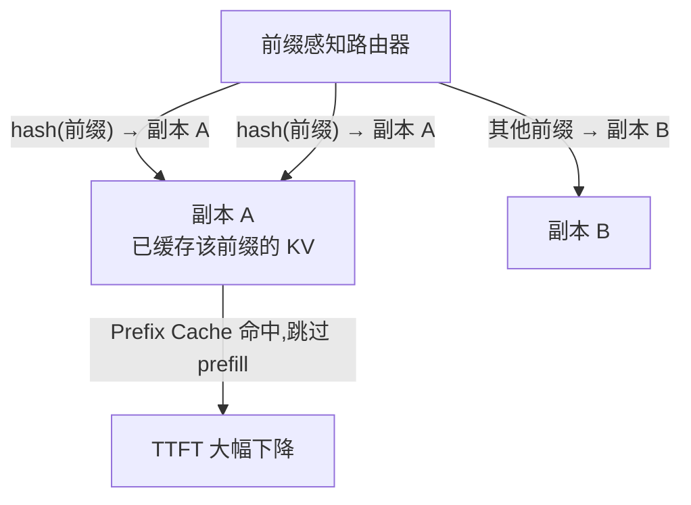

一个 vLLM 副本的冷启动是**分钟级**的（镜像拉取 + 权重加载 + CUDA Graph 预热），而流量尖峰是**秒级**到来的——等“QPS 涨了”再扩容，扩出来的 Pod 还没 Ready，用户已经排了五分钟队。这一节把扩缩容这件事拆成三块。**第一块：用什么指标决策**——QPS 会骗人，队列长度和 KV 利用率更诚实。**第二块：怎么把请求分发到副本**——round-robin（轮流平均分发）会把你的 Prefix Cache 全部打碎，前缀感知路由才能让相同 system prompt 命中同一副本；vLLM 官方 Production Stack 宣称可带来 3-10x 延迟下降、2-5x 吞吐提升，社区 llm-d 实测 P90 TTFT 最高快约 57 倍。**第三块：裸奔的 vLLM 怎么安全地见客**——默认无认证，必须网关层补 API Key、TLS、网络隔离与限速。上一节 10.2 给了你“看”的能力，这一节给你“动”的能力——扩缩容与负载均衡就是容量规划（10.4）的执行层。

<!-- more -->

## 📑 目录

- [1. 为什么扩缩容难：冷启动分钟级，尖峰秒级](#1-为什么扩缩容难冷启动分钟级尖峰秒级)
- [2. 扩缩容指标选什么：QPS、队列长度还是 KV 利用率](#2-扩缩容指标选什么qps队列长度还是-kv-利用率)
- [3. 负载均衡：从 round-robin 到前缀感知路由](#3-负载均衡从-round-robin-到前缀感知路由)
- [4. 安全：裸奔的 OpenAI 兼容服务怎么见客](#4-安全裸奔的-openai-兼容服务怎么见客)
- [5. 优雅扩缩：缩容不杀在飞请求，扩容不抢跑](#5-优雅扩缩缩容不杀在飞请求扩容不抢跑)
- [6. 权衡与落成一句话](#6-权衡与落成一句话)
- [总结](#-总结)
- [自我检验清单](#-自我检验清单)
- [参考资料](#-参考资料)

---

## 1. 为什么扩缩容难：冷启动分钟级，尖峰秒级

### 1.1 先算一笔时间账

先把“扩缩容为什么难”钉成数字。一次扩容的完整链路是：

$$
\underbrace{t_{\text{检测}}}_{\text{指标采集+判定,秒级}} + \underbrace{t_{\text{调度}}}_{\text{Pod 调度到 GPU 节点,秒级}} + \underbrace{t_{\text{拉镜像}}}_{\text{镜像拉取,分钟级}} + \underbrace{t_{\text{加载模型}}}_{\text{权重加载+预热,分钟级}}
$$

vLLM 官方 K8s 文档的示例里，探针的 `initialDelaySeconds` 直接给到 60 秒、`failureThreshold` 要给足——因为模型下载和加载就是“couple of minutes”量级。官方排错章节专门有一条：**启动探针失败导致容器被杀，日志里出现 `KeyboardInterrupt: terminated`**——就是 `failureThreshold` 太小、K8s 等不及模型加载完就把容器杀了。冷启动 5-15 分钟是常态，而线上流量 1 分钟内翻倍很常见。结论先放在这：**反应式扩容天生滞后，扩缩容的本质是“预测 + 缓冲”，不是“反应”**。

打个比方：扩缩容像仓库备货。**从下单到到货（冷启动）要两周，而订单高峰说来就来**。只看“今天订单量”决定备货，货永远在路上；聪明的仓管看的是“库存水位”（排队长度）和“仓库容量上限”（KV 利用率），并且提前按历史规律备货。GPU 服务也一样：指标要选“水位”而不是“流速”，决策要留出“到货周期”的提前量。

### 1.2 HPA 的基础：它会算什么

Kubernetes 的 HorizontalPodAutoscaler（HPA）就是那个“仓管”。核心配置只有四样：

| 📊 字段 | 含义 | 你的取值 |
|---|---|---|
| `scaleTargetRef` | 扩谁 | Deployment / StatefulSet，如 `vllm-serve` |
| `minReplicas` / `maxReplicas` | 扩缩容边界 | 至少 1-2，上限按容量规划（10.4）的预算定 |
| `metrics[]` | 用什么指标决策 | 第 2 节重点 |
| `behavior` | 扩/缩容的速率与稳定窗口 | 缩容必须加 `stabilizationWindowSeconds`（第 5 节） |

HPA 的决策公式（autoscaling/v2 的算法，K8s 官方口径）：

$$
N_{\text{desired}} = \left\lceil N_{\text{current}} \times \frac{V_{\text{current}}}{V_{\text{target}}} \right\rceil
$$

$$
\underbrace{N_{\text{desired}}}_{\text{目标副本数}} = \lceil \underbrace{N_{\text{current}}}_{\text{当前副本数}} \times \underbrace{\frac{V_{\text{current}}}{V_{\text{target}}}}_{\text{当前值÷目标值,即“超了多少倍”}} \rceil
$$

比如当前 4 个副本、每个副本排队 16 个请求、目标 8 个，那 $4 \times 16/8 = 8$，直接翻倍到 8 个副本。公式本身很简单，**难点全在 $V_{\text{target}}$ 选什么指标、定多少值**——这就是下一节。

⚠️ **注意**：GPU 服务别用 CPU/内存做扩缩容主指标。vLLM 的 CPU 利用率在请求排队时可能只有 20%（瓶颈在 GPU），用 CPU 扩缩容等于**拿温度计当体重秤**——工具本身没问题，量错了对象。要用 GPU 侧的真实压力信号。

---

## 2. 扩缩容指标选什么：QPS、队列长度还是 KV 利用率

### 2.1 基于 QPS：简单，但会骗人

先问一句：请求速率 QPS 真的代表“GPU 忙不忙”吗？它是最直观的指标——Prometheus 里对 `vllm:request_success`（已成功处理的请求数，Counter）做速率计算即可：

```promql
# 单副本 QPS（2 分钟窗口的速率）
sum(rate(vllm:request_success[2m])) by (pod)
```

问题在于：**LLM 请求的“单价”差异巨大**。一个 32K 长文档的总结请求和一个 20 token 的闲聊请求，算力消耗差几百倍。QPS=10 的时候，可能是 10 个闲聊（GPU 闲得冒泡），也可能是 10 个长文档（GPU 已经排队爆表）——只看 QPS 你分不清，它只数请求个数，不看每个请求干了多少活。所以 QPS 只适合“负载形态稳定”的服务（比如固定模板的短问答），一旦请求长度方差大，QPS 就不可信。

### 2.2 基于队列长度：最诚实的压力信号

排队 = 忙不过来，这是调度器直接告诉你的事实。vLLM 暴露两个直接指标（10.2 有完整清单）：

- `vllm:num_requests_waiting`：**等待调度的请求数**（Gauge）——排队的人；
- `vllm:num_requests_waiting_by_reason`：等待原因拆解，`reason="capacity"` 是等调度容量（真排队），`reason="deferred"` 是等 LoRA 预算/KV 传输等（假排队）——扩容只看 `capacity` 标签，别被 `deferred` 误导。

队列长度作为扩缩容指标的直觉是：**队列是“需求 - 供给”随时间累积的结果**。QPS 是流量（可能被缓存吃掉），排队长度才是“没被满足的那部分需求”。这是 LLM 推理服务扩缩容的主流实践：**等待队列超过阈值就加副本，队列清空就减副本**。

📌 **关键点**：QPS 回答“来了多少活”，队列长度回答“还有多少活没干完”——扩缩容决策要盯后者，前者只配当诊断信息。

目标值怎么定？从 SLO 反推。设平均每个请求服务时长 $\bar{t}_{\text{req}}$，每深 1 个排队 ≈ 多等一个 $\bar{t}_{\text{req}}$，那么“可容忍排队时间 $T_{\text{queue}}$”对应的目标深度：

$$
V_{\text{target}} = \frac{T_{\text{queue}}}{\bar{t}_{\text{req}}}
$$

数值算例：你的负载平均每请求耗时约 4 秒（1s 首 token + 500 token 生成），SLO 允许排队 30 秒（再久用户就流失了），那目标深度 $= 30/4 \approx 8$。**HPA 配置里写 `averageValue: "8"`，含义是“每个副本平均排队超过 8 个请求就扩容”**。8 这个数字不是拍脑袋，是 SLO 除出来的。

### 2.3 基于 KV 缓存利用率：显存视角的保险丝

`vllm:kv_cache_usage_perc`（Gauge，**1 = 100% 用满**）告诉你 KV Cache 还剩多少。为什么它值得当辅助指标？因为 KV 用满是**灾难的前兆**：调度器开始抢占（`vllm:num_preemptions` 涨）、长请求被反复打断重算、TTFT 雪崩（10.2 讲过抢占机制）。**KV 利用率逼近 1 意味着“再进一个长请求就 OOM 或抢占”**，这时候哪怕队列还不长（都是短请求），也必须扩容或限流。

典型配置：主指标用队列长度（管“忙不忙”），辅助指标用 KV 利用率（管“会不会炸”），目标值定在 0.7 左右——留 30% 余量给突发的长上下文请求。0.7 的“为什么”和 9.5 讲阈值定法一个逻辑：**阈值要大于正常波动、小于灾难线**。KV 利用率在日常负载下通常 0.3-0.6 波动，0.7 在波动带之外；而灾难线是 0.9+（开始抢占），0.7 离它还有反应时间。

### 2.4 组合策略：多指标 HPA 配置示例

HPA 支持多指标，多个指标**取各自算出的副本数里的最大值**（谁更急听谁的）。完整的配置骨架（基于 `autoscaling/v2`，以你的 K8s 版本为准）：

```yaml
apiVersion: autoscaling/v2
kind: HorizontalPodAutoscaler
metadata:
  name: vllm-hpa
spec:
  scaleTargetRef:
    apiVersion: apps/v1
    kind: Deployment
    name: vllm-serve
  minReplicas: 2          # 保底副本：留热启动余量
  maxReplicas: 32         # 上限：示例值，按 10.4 容量表填写
  behavior:
    scaleDown:
      stabilizationWindowSeconds: 600   # 缩容冷静期 10 分钟，防抖动（第 5 节）
  metrics:
    # 主指标：每副本平均排队请求数 > 8 就扩
  - type: Pods
    pods:
      metric:
        name: vllm:num_requests_waiting
      target:
        type: AverageValue
        averageValue: "8"
    # 辅助指标：每副本 KV 利用率 > 0.7 就扩（KV 快满比排队更危险）
  - type: Pods
    pods:
      metric:
        name: vllm:kv_cache_usage_perc
      target:
        type: AverageValue
        averageValue: "0.7"
```

要让 HPA 认识 `vllm:*` 这些指标，需要在集群里装 **Prometheus Adapter**（把 Prometheus 指标翻译成 K8s 的 `custom.metrics.k8s.io` API）。adapter 的规则配置（简化示意，非逐字配置，以你所用 adapter 版本为准）：

```yaml
# prometheus-adapter 规则：把 vLLM 的 pod 级指标暴露给 HPA
rules:
- seriesQuery: 'vllm:num_requests_waiting{namespace!="",pod!=""}'
  resources:
    overrides:
      namespace: {resource: "namespace"}
      pod:       {resource: "pod"}
  name:
    matches: "^(.*)$"
    as: "vllm:num_requests_waiting"   # 指标名原样透传
  metricsQuery: 'sum(<<.Series>>) by (namespace, pod)'
```

💡 **提示**：vLLM 指标带 `model_name` 标签（`--served-model-name` 决定，见 10.1 与 vLLM 文档），一个 Deployment 里多副本共享同一模型名，adapter 的 `by (namespace, pod)` 聚合是安全的；如果同一 Deployment 混服务多模型（10.1 的多模型场景），记得把 `model_name` 也加进 group-by。

---

## 3. 负载均衡：从 round-robin 到前缀感知路由

### 3.1 round-robin 的问题：prefix cache 全浪费

副本有了（HPA 扩出来的），请求怎么分？K8s Service 默认的策略是随机的（`sessionAffinity: None`，官方 K8s 部署示例原样）。问题来了：**vLLM 的 Prefix Cache（2.3 讲过）是单实例内的**——副本 A 算过的 system prompt，副本 B 一概不认。

假设你 90% 的请求共享同一个超长 system prompt（Agent 场景常见，8.2 讲过），round-robin 把请求均匀撒到 8 个副本上：每个副本都只见过 1/8 的相同前缀，**前缀命中率趋近于零**，每个请求都在重复做 prefill 的脏活。llm-d 的博客做过直接对比：naive 负载均衡下 KV Cache 频繁 miss，而 cache-aware 路由在它的基准里 P90 TTFT 最高快约 57 倍、吞吐从约 4,400 tok/s 提到约 8,700 tok/s（约 2 倍）——**同样的卡，只换路由策略**。

### 3.2 前缀感知路由：把同前缀请求钉在同一副本

解决问题的思路一句话：**路由时按 prompt 前缀的 hash 把请求分桶，相同前缀 = 相同桶 = 同一副本**。这样副本 A 第一次算完 system prompt 后，后续所有同前缀请求直接命中它的 Prefix Cache：



实现上主要有三条路（都以官方/项目文档为准）：

| 📊 方案 | 路由依据 | 出处 |
|---|---|---|
| **vLLM Production Stack**（LMCache 团队 + vLLM 团队） | 前缀感知路由 + 跨实例 KV 共享，官方宣称 3-10x 延迟下降、2-5x 吞吐提升（多轮 Q&A 基准） | vllm.ai 官方博客与仓库 `vllm-project/production-stack` |
| **Ray Serve** | `prefix-aware-routing` 用户指南：按前缀自动路由到已缓存副本 | docs.ray.io LLM Serving 章节 |
| **llm-d** | KV-Cache Aware 调度：路由到“命中率最高”的实例，还叠加 P/D 解耦与 SLA 调度 | llm-d.ai 博客/文档 |

vLLM 自身的多副本负载均衡也在演进：V1 引擎的 DP（数据并行）模式内置了混合负载均衡（`--data-parallel-hybrid-lb`，本地 DP rank 之间前缀感知、节点间由外部 LB 均衡，vLLM 引擎参数文档）。**趋势很清楚：负载均衡正在从“无状态”变成“带缓存状态”**——因为 LLM 服务的状态（KV）比传统 Web 服务的状态值钱得多。

### 3.3 与 2.3 的联动：单实例命中率 → 集群命中率

把两件事串起来：2.3 的 Prefix Cache 解决“**一个实例内**的复用”，这一节的前缀路由解决“**跨实例的复用**”。你可以在 Prometheus 里量化路由策略的好坏——vLLM 暴露 `vllm:prefix_cache_hits` / `vllm:prefix_cache_queries`（Counter），命中率 = hits / queries：

```promql
# 集群级前缀命中率（15 分钟窗口）
sum(rate(vllm:prefix_cache_hits[15m])) /
sum(rate(vllm:prefix_cache_queries[15m]))
```

**前缀路由开没开对，这个数字一眼便知**：共享前缀明显的负载（Agent 系统提示词、RAG 固定检索前缀），命中率应该在 50% 以上；如果命中率长期 <10% 而你的负载明明有共享前缀，先查路由，再查负载本身（llm-d 的博客也提醒：命中率低先检查 prompt 结构，前缀可能根本没对齐——比如每次请求都带不同的时间戳）。

⚠️ **注意**：前缀路由有代价，不是白拿的——路由器要算 prompt 前缀 hash（多一次 tokenize + hash，首 token 延迟加几毫秒到几十毫秒）；一致性哈希在扩缩容时要保持稳定（不然扩一个副本，所有桶重排，缓存全废）；**热点问题**：某个 system prompt 特别火，它的副本被钉死在一个实例上，别的副本闲着——这时候要么拆分热点前缀（让“前缀”定义更细），要么给热点副本单独扩容策略（解耦架构里 P/D 池各扩各的，7.6 讲过）。**收益条件是“前缀复用足够多”**：复用比例低于 10-20%，为路由付出的复杂度和延迟就不值了。

---

## 4. 安全：裸奔的 OpenAI 兼容服务怎么见客

### 4.1 默认无认证：这不是 bug，是设计

先把话说死：**vLLM 的 OpenAI 兼容服务默认没有任何认证**——任何能访问到 8000 端口的人都能调你的模型。`--api-key` 参数在 vLLM 里是可选的（“If provided, the server will require one of these keys”），不传就等于把算力和数据裸奔在网络上。章索引的 ⚠️ 提示说得很直白：**直接暴露到公网等于开放算力与数据**——你的 GPU 变成别人的免费算力，你的 prompt 变成别人的免费数据。

打个比方：服务端口就像大楼门口，**门卫（网关）不是 vLLM 自带的功能，得你自己雇**。门禁卡（API Key）、监控（审计日志）、访客登记（限速）都要在门口做，而不是等客人进了大楼（引擎内部）再做。

### 4.2 安全四件套：网关层补齐

| 📊 措施 | 做什么 | 谁来做 |
|---|---|---|
| **API Key 校验** | 校验 `Authorization: Bearer <key>`，非法直接 401 | 网关（或 vLLM 自带 `--api-key`） |
| **TLS 终止** | HTTPS 终止在入口，内部走明文不跨公网 | Ingress/Gateway API，或 vLLM 自带 `--ssl-keyfile/--ssl-certfile` |
| **网络隔离** | K8s Service 用 ClusterIP，不设 NodePort/LoadBalancer 直通；入口只留网关 | K8s NetworkPolicy + Ingress 设计 |
| **速率限制** | 按 API Key 限 QPS/token 数，防滥用与防刷 | 网关限速（nginx `limit_req` / 网关产品） |

最小可用的网关配置（nginx 简化示意，生产建议用网关产品如 Higress/Kong/自建 auth_service，不要照抄）：

```nginx
# nginx 网关最小示例（简化示意，生产环境建议用 auth_request 方案）
server {
    listen 443 ssl;
    ssl_certificate     /etc/nginx/tls/tls.crt;      # TLS 终止
    ssl_certificate_key /etc/nginx/tls/tls.key;

    location /v1/ {
        # 门禁卡检查：Header 里的 key 不对就 401（简化示意）
        if ($http_authorization != "Bearer sk-your-key-here") {
            return 401;
        }
        # 速率限制：每个 IP 每秒最多 10 个请求
        limit_req zone=llm_per_ip burst=20 nodelay;
        proxy_pass http://vllm-svc:8000;              # 内网 Service，不暴露公网
        proxy_set_header Authorization $http_authorization;
    }
}
```

⚠️ **注意**：vLLM 的 `/metrics`、`/docs`（FastAPI 的 OpenAPI 页面）也是敏感面——`/metrics` 泄露模型名、副本数、负载分布，`/docs` 暴露全部接口形状。网关层把这些路径拦掉（或 vLLM 的 `--disable-fastapi-docs`），**只留 `/v1/*` 与 `/health` 见客**。

---

## 5. 优雅扩缩：缩容不杀在飞请求，扩容不抢跑

### 5.1 缩容：在飞请求怎么办

LLM 请求是长连接流式响应（一个请求可能持续几十秒到几分钟），缩容砍 Pod 时，**正在生成的请求要么等它写完，要么被硬杀**。三个旋钮：

1. **HPA 缩容冷静期**：`behavior.scaleDown.stabilizationWindowSeconds: 600`——指标连续 10 分钟低于阈值才缩，防止“抖一下又缩回去”（9.5 讲过的噪声问题在缩容上同样致命，扩缩容抖动会让前缀缓存反复失效）。
2. **K8s 终止优雅期 + vLLM 的 `--shutdown-timeout`**：Pod 收到 SIGTERM 后，K8s 等 `terminationGracePeriodSeconds`（默认 30s）再 SIGKILL；vLLM 引擎参数 `--shutdown-timeout`（秒）控制关闭时等不等在飞请求——**0 = 直接中断（默认），>0 = 等待在飞请求完成**。生产配置：设成超过你最慢请求的时长（如 120-300s），并把 `terminationGracePeriodSeconds` 调成比它更大，否则 K8s 先动手。
3. **PodDisruptionBudget（PDB）**：防止节点维护/驱逐时一次性杀掉多个副本（`minAvailable: 2` 之类），配合滚动更新保证“先就绪后下线”。

### 5.2 扩容预热：先 readiness，再进流量

扩容侧的核心就一句话：**新 Pod 模型加载完之前，一个请求都不能进**。K8s 的 readiness 探针天然承担这个职责——vLLM 官方示例打 `/health`，模型加载完成、服务真正 Ready 才返回 200；探针 `initialDelaySeconds` 给足（官方示例 60s，模型大就再加），`failureThreshold` 给足（官方排错章节专门警告：阈值太小 = 容器被 K8s 误杀，日志里 `KeyboardInterrupt: terminated`）。**readiness 通过之前，Service 不会把流量导给新副本**——这就是“先预热再放行”的机制，不需要你写任何代码。

把扩缩容全流程练过一遍、按剧本验证过（扩容 10 分钟内新副本接管流量、缩容不丢在飞请求），这就像**汛期前的堤坝演练**——平时演练过，洪水（流量尖峰）来了才不会乱。容量规划（10.4）给的是“该有多少副本”，扩缩容给的是“副本跟着流量怎么动”，两者的接口就是 min/maxReplicas。

---

## 6. 权衡与落成一句话

| 📊 决策 | 牺牲了什么 | 换取了什么 |
|---|---|---|
| 队列长度做主指标 | 需要 Prometheus Adapter 等额外组件，阈值要随负载形态维护 | 真实的“供需差”信号，短请求/长请求混合时不会被 QPS 骗 |
| KV 利用率做辅助指标 | 多一个指标多一份告警面 | 在抢占/雪崩之前提前扩容，保住长上下文请求 |
| 前缀感知路由 | 路由层复杂度 + hash 延迟 + 热点管理 | 共享前缀场景下 TTFT 数量级下降、GPU 不做重复 prefill |
| 网关层安全四件套 | 一层额外的网络组件和 key 管理 | 算力与数据不被白嫖，这是生产底线，没有可选项 |

落成一句话的规则：

- ✅ **主指标用队列长度**（`vllm:num_requests_waiting` 按 `reason=capacity` 过滤），目标值 = SLO 可容忍排队时间 ÷ 平均请求时长（算例：30s ÷ 4s ≈ 8）；**辅助指标用 KV 利用率**，目标 0.7 左右。
- ✅ **共享前缀明显的负载**（Agent 系统提示词、RAG 固定前缀）→ 上前缀感知路由（Production Stack / Ray Serve / llm-d），并用 `prefix_cache_hits/queries` 验证命中率 ≥50%；**前缀复用 <10-20%** → 别上，路由复杂度不值。
- ✅ **上线前把安全四件套做完**：API Key + TLS + 网络隔离 + 限速；vLLM 自带 `--api-key` 与 `--ssl-*` 是兜底，网关层校验才是正餐。
- ✅ **缩容比扩容更谨慎**：`stabilizationWindowSeconds` ≥ 5-10 分钟，`--shutdown-timeout` + `terminationGracePeriodSeconds` 配套调，PDB 兜底。
- ❌ **别用 CPU/内存做 GPU 服务的扩缩容主指标**；❌ **别把 `--shutdown-timeout` 留默认 0**——缩容即杀在飞请求；❌ **别让 `/metrics`、`/docs` 直接暴露公网**。

---

## 📝 总结

1. **扩缩容的本质**：冷启动分钟级 vs 尖峰秒级，反应式扩容天生滞后——指标要选“水位”（队列、KV），决策要留“到货周期”（预测 + 缓冲），HPA 公式只是 $\lceil N \times V_{\text{current}}/V_{\text{target}} \rceil$ 的除法，难点全在选指标。
2. **指标三选**：QPS 会骗人（长请求/短请求单价差几百倍）；队列长度最诚实（排队 = 没被满足的需求，目标值 = SLO 排队时间 ÷ 平均请求时长）；KV 利用率是保险丝（0.7 目标值 = 正常波动之外、抢占灾难线之前）。
3. **负载均衡**：round-robin 把共享前缀撒到所有副本，Prefix Cache 命中率趋近于零；前缀感知路由按前缀 hash 钉副本，Production Stack 宣称 3-10x 延迟下降，llm-d 实测 P90 TTFT 最高约 57 倍、吞吐约 2 倍——用 `prefix_cache_hits/queries` 量化收益。
4. **安全**：vLLM 默认无认证；四件套（API Key、TLS、网络隔离、限速）在网关层补齐，`/metrics`、`/docs` 拦在门口。
5. **优雅扩缩**：缩容靠冷静期 + `--shutdown-timeout` + PDB 三件套，扩容靠 readiness 探针“先就绪后进流量”；演练过流程才敢说“能扩能缩”。

## 🎯 自我检验清单

- 能口算一次扩容的完整耗时构成（检测 + 调度 + 拉镜像 + 加载模型，分钟级），并解释为什么“等 QPS 涨了再扩”必然滞后
- 能写出 HPA 的决策公式 $N_{\text{desired}} = \lceil N_{\text{current}} \times V_{\text{current}}/V_{\text{target}} \rceil$，并手算“4 副本、每副本排队 16、目标 8 → 8 副本”
- 能说出 QPS 指标失效的场景（长短请求混合时单价差几百倍），并给出替代指标及 vLLM 的指标名（`vllm:num_requests_waiting`、`vllm:kv_cache_usage_perc`）
- 能解释 `num_requests_waiting_by_reason` 的 `capacity` 与 `deferred` 标签差异，以及为什么扩容只看 `capacity`
- 能从 SLO 反推队列长度目标值（可容忍排队 30s ÷ 平均请求 4s ≈ 8），并说出 KV 利用率目标 0.7 的“波动带之外、灾难线之前”依据
- 能写出一个双指标 HPA 配置骨架（Pods 类型 + AverageValue），并说出多指标取最大值的语义
- 能解释 round-robin 为什么打碎跨副本 Prefix Cache（命中率趋近于零），并说出前缀感知路由的收益条件（前缀复用 ≥10-20%）
- 能用 `vllm:prefix_cache_hits / vllm:prefix_cache_queries` 写出集群前缀命中率查询，并给出“该开路由”的判定线（≥50%）
- 能说出前缀路由的三个代价（hash 延迟、一致性哈希重排、热点副本）及各自的缓解方向
- 能列出安全四件套（API Key、TLS、网络隔离、限速），并说出 vLLM 侧对应的三个兜底参数（`--api-key`、`--ssl-keyfile/--ssl-certfile`、`--disable-fastapi-docs`）
- 能说出缩容三件套（`stabilizationWindowSeconds`、`--shutdown-timeout` + `terminationGracePeriodSeconds`、PDB）各自的防什么
- 能解释 readiness 探针如何实现“先预热再进流量”，以及探针阈值太小会导致的典型故障（`KeyboardInterrupt: terminated`）

## 📚 参考资料

**官方文档**

- [Kubernetes - HorizontalPodAutoscaler（autoscaling/v2 多指标与 behavior）](https://kubernetes.io/docs/tasks/run-application/horizontal-pod-autoscale/)
- [Kubernetes - HPA 算法细节（desiredReplicas 公式与稳定窗口）](https://kubernetes.io/docs/tasks/run-application/horizontal-pod-autoscale/#algorithm-details)
- [kubernetes-sigs/prometheus-adapter（custom.metrics.k8s.io 规则配置）](https://github.com/kubernetes-sigs/prometheus-adapter)
- [vLLM - Production Metrics（/metrics 指标清单：num_requests_waiting、kv_cache_usage_perc、prefix_cache_hits 等）](https://docs.vllm.ai/en/stable/usage/metrics/)
- [vLLM - Using Kubernetes（GPU 资源、探针与 failureThreshold 排错）](https://docs.vllm.ai/en/stable/deployment/k8s/)
- [vLLM - vllm serve 参数（--api-key、--ssl-keyfile、--shutdown-timeout、--served-model-name、--otlp-traces-endpoint）](https://docs.vllm.ai/en/stable/cli/serve/)

**项目与博客**

- [vLLM Production Stack 发布博客（前缀感知路由 + KV 共享，3-10x 延迟 / 2-5x 吞吐口径）](https://vllm.ai/blog/2025-01-21-stack-release)
- [vllm-project/production-stack（前缀感知路由文档与 Helm 部署）](https://github.com/vllm-project/production-stack)
- [Ray Serve - Prefix-aware routing（LLM Serving 用户指南）](https://docs.ray.io/en/latest/serve/llm/user-guides/prefix-aware-routing.html)
- [llm-d - KV-Cache Wins You Can See（naive 路由 vs cache-aware 路由：P90 TTFT 最高约 57x、吞吐约 2x 实测）](https://llm-d.ai/blog/kvcache-wins-you-can-see)
- [KServe - Cloud-Native AI Inference at Scale（KServe 自动扩缩容 + llm-d 缓存感知路由的分层架构）](https://kserve.github.io/website/blog/cloud-native-ai-inference-kserve-llm-d)
- [TrueFoundry - KV Cache Routing（为什么标准负载均衡会打破前缀缓存）](https://www.truefoundry.com/blog/kv-cache-routing-why-standard-load-balancers-break-prefix-caching-and-how-to-fix-it)

**站内**

- [AI Infra 学习路线（3.6 性能体系与线上监控口径）](/AIInfraGuide/guides/ai-infra学习路线)
- [2.3 Prefix Cache 与 RadixAttention（单实例内的前缀复用，本节路由的前置知识）](/AIInfraGuide/inference/模块四-推理优化/第2章-推理引擎核心技术/23-prefix-cache-与-radixattention)
- [9.5 性能回归门禁（阈值 ≥3σ 噪声的定法，扩缩容阈值同款逻辑）](/AIInfraGuide/inference/模块四-推理优化/第9章-性能分析与benchmark/95-性能回归门禁)
- [6.5 多节点部署 Ray（Ray 部署形态与 Serve 的自动扩缩容配置）](/AIInfraGuide/inference/模块四-推理优化/第6章-分布式推理/65-多节点部署-ray)
- [7.6 vLLM 解耦实战（P/D 分池各自接 HPA 的扩缩容形态）](/AIInfraGuide/inference/模块四-推理优化/第7章-pd解耦架构/76-vllm解耦实战)
- [第 10 章 生产部署与运维（10.1 容器化部署 / 10.2 可观测性 / 10.4 容量规划）](/AIInfraGuide/inference/模块四-推理优化/第10章-生产部署与运维/第10章-生产部署与运维)
