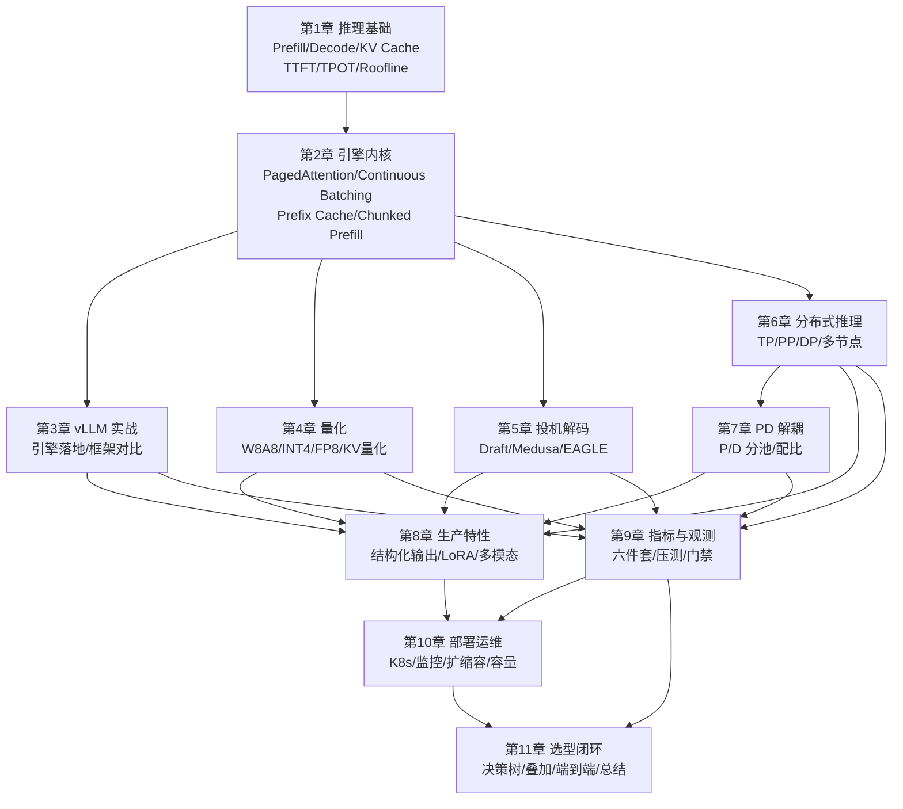

全模块 11 章、48 篇子文章，这一节把它们收进三样东西：**一张知识关联图（1. 的 mermaid）、一张 14 行的 trade-off 收官大表（2.）、一条从"买卡"到"极致优化"的六级路径（3.）**。先给贯穿全文的一句话：**推理优化的本质，是在显存、带宽、算力三个瓶颈之间搬资源。而第 9 章的指标与观测是唯一的地图——没有六件套和压测，前面十章的所有优化都是自说自话**（9.1 的教训：同一套指标，测量口径不同能差出 30%+，数字不对齐，优化白做）。这一节不展开任何新知识点，只做三件事：串起来、背下来、定计划。

<!-- more -->

## 📑 目录

- [1. 全模块知识关联图：一条主线，三条支线](#1-全模块知识关联图一条主线三条支线)
- [2. 核心 trade-off 汇总表：收官大表](#2-核心-trade-off-汇总表收官大表)
- [3. 优化组合全景图：从买卡到极致优化](#3-优化组合全景图从买卡到极致优化)
- [4. 学习建议与持续学习](#4-学习建议与持续学习)
- [5. 权衡与落成一句话](#5-权衡与落成一句话)
- [总结](#-总结)
- [自我检验清单](#-自我检验清单)
- [参考资料](#-参考资料)

---

## 1. 全模块知识关联图：一条主线，三条支线

### 1.1 主线：为什么 9.x 贯穿所有优化

问题：11 章之间到底是什么关系？**第 1 章给瓶颈（两阶段、KV Cache、指标定义），第 2~7 章给手段，第 8 章给产品形态，第 9 章给验证，第 10 章给运维，第 11 章给选型闭环**。而第 9 章是那条贯穿线——因为每一个优化手段的决策依据（9.2 压测）、效果验证（9.1 六件套）、长期守护（9.5 门禁）都长在它身上：

- **决策前**：9.2 压测出基线，才知道病在哪（11.1 决策树的输入）；
- **决策后**：9.1 六件套对照 SLO，才知道优化有没有效（11.3 的验收单）；
- **长期**：9.5 门禁守住"退化 >5% 不合并"，10.4 容量表每月对账——**指标是唯一能跨章节对话的语言**。

### 1.2 知识关联图



读图先看箭头方向：**一切手段从第 2 章的引擎内核长出来**（量化、投机、并行、解耦都是引擎之上的叠加层），**一切叠加都要回到第 9 章验证，再进入第 10 章的生产闭环**，最后在第 11 章汇合成决策树与端到端流程。

再读三个要点：

1. **第 2 章是唯一的"手段发源地"**——量化、投机、并行、解耦全部从引擎内核长出来，跳过引擎直接学优化，等于不知道药为什么有效；
2. **第 9 章是唯一的"验证站"**——所有叠加层的箭头都经过它才进第 10/11 章，意味着每个手段上线前必须过压测（9.5 的门禁就是这条边上的哨兵）；
3. **第 11 章是"闭环"**——决策树（11.1）告诉你选什么，叠加（11.2）告诉你别乱叠，实战（11.3）告诉你怎么做，总结（11.4）告诉你怎么记。

### 1.3 三条支线：按"瓶颈"分组记忆

把 48 篇子文章按"治什么瓶颈"分成三条支线，比按章背更不容易忘：

| 支线 | 治什么 | 链路（站内章节） |
|---|---|---|
| **显存线** | 装得下吗 | [1.1 的 KV 账本](/AIInfraGuide/inference/模块四-推理优化/第1章-llm推理基础/11-llm推理基础) → [2.1 PagedAttention](/AIInfraGuide/inference/模块四-推理优化/第2章-推理引擎核心技术/21-pagedattention)（碎片）→ [4.3 INT4](/AIInfraGuide/inference/模块四-推理优化/第4章-量化/43-weight-only-int4-gptq与awq)（权重 140→35GB）/ [4.4 KV 量化](/AIInfraGuide/inference/模块四-推理优化/第4章-量化/44-kv-cache量化-kivi) → [6.2 张量并行](/AIInfraGuide/inference/模块四-推理优化/第6章-分布式推理/62-张量并行推理)（分摊）→ [7.3 KV 迁移](/AIInfraGuide/inference/模块四-推理优化/第7章-pd解耦架构/73-kv传输与connector) |
| **延迟线** | 快不快 | [1.1 两阶段](/AIInfraGuide/inference/模块四-推理优化/第1章-llm推理基础/11-llm推理基础)（compute vs memory bound）→ [2.2](/AIInfraGuide/inference/模块四-推理优化/第2章-推理引擎核心技术/22-continuous-batching) / [2.4](/AIInfraGuide/inference/模块四-推理优化/第2章-推理引擎核心技术/24-chunked-prefill-与统一调度)（30%→80%+、长 prefill 分块）→ [5.x 投机](/AIInfraGuide/inference/模块四-推理优化/第5章-speculative-decoding/51-核心原理与rejection-sampling)（decode 串行瓶颈）→ [7.2 解耦](/AIInfraGuide/inference/模块四-推理优化/第7章-pd解耦架构/72-解耦架构设计)（互扰与尾延迟） |
| **生产线** | 稳不稳、贵不贵 | [8.x 特性](/AIInfraGuide/inference/模块四-推理优化/第8章-生产级服务特性/第8章-生产级服务特性)（能不能接业务）→ [9.x 验证](/AIInfraGuide/inference/模块四-推理优化/第9章-性能分析与benchmark/95-性能回归门禁)（算不算数）→ [10.x 运维](/AIInfraGuide/inference/模块四-推理优化/第10章-生产部署与运维/104-容量规划)（稳不稳、多少钱）→ 11.x 闭环 |

📌 **关键点**：面试或复盘时被人问"你做过哪些优化"，按支线回答比按章回答有条理得多——**"显存线上我做了量化和 KV 量化，延迟线上试过投机但被 5.4 的边界拦住了，生产线建了门禁和容量表"**——三句话覆盖 48 篇。

**显存线走一遍**：起点是 [1.1 的账本公式](/AIInfraGuide/inference/模块四-推理优化/第1章-llm推理基础/11-llm推理基础)（$\text{KV}_{\text{每token}} = 2 \times L \times H_{KV} \times d \times b$，70B 约 0.31MB/token），并发一起来 KV 就吃掉几十上百 GB，而且连续分配让 KV 利用率只有两三成（[2.1](/AIInfraGuide/inference/模块四-推理优化/第2章-推理引擎核心技术/21-pagedattention) 的口径）——先 [2.1 PagedAttention](/AIInfraGuide/inference/模块四-推理优化/第2章-推理引擎核心技术/21-pagedattention) 把碎片收回来，再按“谁占大头”分叉：**权重占大头走 [4.3 INT4](/AIInfraGuide/inference/模块四-推理优化/第4章-量化/43-weight-only-int4-gptq与awq)（140→35GB），KV 占大头走 [4.4](/AIInfraGuide/inference/模块四-推理优化/第4章-量化/44-kv-cache量化-kivi)（FP8 减半 / KIVI 2-bit 减到 1/4）**；还不够就 [6.2 张量并行](/AIInfraGuide/inference/模块四-推理优化/第6章-分布式推理/62-张量并行推理) 摊到多卡；解耦之后 KV 还要跨节点搬家（[7.3](/AIInfraGuide/inference/模块四-推理优化/第7章-pd解耦架构/73-kv传输与connector)：7B/2048ctx 约 4GB，IB 200Gb/s 也要 ~160ms）。**这条线每一环都在回答同一个问题：显存从哪省、往哪搬**。

**延迟线走一遍**：起点是 [1.1 的两阶段](/AIInfraGuide/inference/模块四-推理优化/第1章-llm推理基础/11-llm推理基础)（Prefill compute bound、Decode memory bound）；[2.2](/AIInfraGuide/inference/模块四-推理优化/第2章-推理引擎核心技术/22-continuous-batching) 把 batch 喂饱（30%→80%+），[2.4](/AIInfraGuide/inference/模块四-推理优化/第2章-推理引擎核心技术/24-chunked-prefill-与统一调度) 把长 prefill 切成块；TTFT 还高就查 prefill（[2.3 前缀复用](/AIInfraGuide/inference/模块四-推理优化/第2章-推理引擎核心技术/23-prefix-cache-与-radixattention)、GEMM 效率），TPOT 还高先换 [2.5 attention 后端](/AIInfraGuide/inference/模块四-推理优化/第2章-推理引擎核心技术/25-attention-后端与图优化)，再考虑 [5.x 投机](/AIInfraGuide/inference/模块四-推理优化/第5章-speculative-decoding/51-核心原理与rejection-sampling)；尾延迟有尖刺才轮到 [7.x 解耦](/AIInfraGuide/inference/模块四-推理优化/第7章-pd解耦架构/72-解耦架构设计)。**这条线回答：慢在哪一段，就在哪一段开药**。

**生产线走一遍**：[8.x](/AIInfraGuide/inference/模块四-推理优化/第8章-生产级服务特性/第8章-生产级服务特性) 决定模型能不能接业务（结构化输出、Tool Calling、LoRA、多模态），[9.x](/AIInfraGuide/inference/模块四-推理优化/第9章-性能分析与benchmark/第9章-性能分析与benchmark) 决定优化算不算数（六件套、压测、门禁），[10.x](/AIInfraGuide/inference/模块四-推理优化/第10章-生产部署与运维/第10章-生产部署与运维) 决定稳不稳、贵不贵（探针、告警、HPA、容量表），11.x 把前面所有判断收进决策树与端到端流程。

---

## 2. 核心 trade-off 汇总表：收官大表

### 2.1 十四行大表

问题：全模块最该背下来的一张表是什么？就是下面这张。**每一行都是"牺牲了什么 / 换取了什么 / 什么时候值得"的三段式**（学习路线 3.7 的核心思维模型表 + 各章结论的汇总）：

打个比方：收官就像拼完一盒**巨型拼图**——**前 10 章是散装拼图块（每章一包），11.3 是成品图，下面这张表是图例**。图例不告诉你哪块拼图好看，它告诉你每块拼图是干什么用的、什么时候该用、什么时候该扔——对应到技术，就是“治什么瓶颈、什么时候值得”。

| 技术 | 牺牲了什么 | 换取了什么 | 什么时候值得 | 章节 |
|---|---|---|---|---|
| PagedAttention | 页表与地址转换的复杂度 | KV 碎片消除，碎片浪费从 60~70% 降到近零（利用率两三成 → 90%+） | 高并发、长上下文（KV 是大头） | [2.1](/AIInfraGuide/inference/模块四-推理优化/第2章-推理引擎核心技术/21-pagedattention) |
| Continuous Batching | 调度复杂度（每步动态组批） | GPU 利用率 30% → 80%+ | 在线高并发，请求长短不一 | [2.2](/AIInfraGuide/inference/模块四-推理优化/第2章-推理引擎核心技术/22-continuous-batching) |
| Prefix Cache | 哈希与缓存维护开销 | 共享前缀请求跳过 prefill，TTFT 大降 | 系统 prompt / 多轮 / RAG 检索 | [2.3](/AIInfraGuide/inference/模块四-推理优化/第2章-推理引擎核心技术/23-prefix-cache-与-radixattention) |
| Chunked Prefill | prefill 分块的调度开销 | 长 prompt 不再独占 GPU，TTFT 稳定 | 长输入混入短对话的混合负载 | [2.4](/AIInfraGuide/inference/模块四-推理优化/第2章-推理引擎核心技术/24-chunked-prefill-与统一调度) |
| 量化（W8A8/INT4） | 精度（需评测兜底） | 权重 140 → 70/35GB，decode 带宽需求同比例降 | 显存紧张或 decode 带宽受限 | [4.2](/AIInfraGuide/inference/模块四-推理优化/第4章-量化/42-w8a8-smoothquant) / [4.3](/AIInfraGuide/inference/模块四-推理优化/第4章-量化/43-weight-only-int4-gptq与awq) |
| KV Cache 量化 | KV 精度（长上下文质量） | KV 显存减半（0.31 → ~0.16MB/token） | 长上下文 + 高并发 | [4.4](/AIInfraGuide/inference/模块四-推理优化/第4章-量化/44-kv-cache量化-kivi) |
| FP8 | 动态范围（需 Hopper 支持） | 原生加速 + 权重/激活同时降带宽 | Hopper 及以后硬件 | [4.5](/AIInfraGuide/inference/模块四-推理优化/第4章-量化/45-fp8与nvfp4) |
| 投机解码 | prefill 开销 + draft 显存 + 调度复杂度 | decode 速度 ×1.5~2.8（接受率决定，5.4 口径） | 短输入、长输出、低并发、代码类 | [5.x](/AIInfraGuide/inference/模块四-推理优化/第5章-speculative-decoding/54-收益边界与限制) |
| 张量并行 | 每层 AllReduce 通信 | 权重显存分摊 + 单请求延迟下降 | 权重超单卡、延迟敏感 | [6.2](/AIInfraGuide/inference/模块四-推理优化/第6章-分布式推理/62-张量并行推理) |
| 流水线并行 | 流水线气泡 + 调度复杂度 | 跨机装下超单机模型 | 模型超单机（TP 锁机内） | [6.3](/AIInfraGuide/inference/模块四-推理优化/第6章-分布式推理/63-流水线并行推理) |
| PD 解耦 | 系统复杂度 + KV 迁移 + 双份权重 | 尾延迟可控 + goodput（P95 不互扰） | 严格 SLO + 压测确认互扰 ≥2 倍 | [7.x](/AIInfraGuide/inference/模块四-推理优化/第7章-pd解耦架构/74-goodput与slo调度) |
| P/D 池配比 | 静态配比的空转风险 | 两池独立扩缩容、按负载结构配资源 | 负载结构稳定，或配动态扩缩容 | [7.5](/AIInfraGuide/inference/模块四-推理优化/第7章-pd解耦架构/75-挑战与配比) / [10.3](/AIInfraGuide/inference/模块四-推理优化/第10章-生产部署与运维/103-自动扩缩容与负载均衡) |
| 容量冗余 ×1.45 | 15~30% 的采购浪费 | 峰值不违约 + 故障/扩容滞后缓冲 | 峰值/均值比 > 2 的在线服务 | [10.4](/AIInfraGuide/inference/模块四-推理优化/第10章-生产部署与运维/104-容量规划) |
| 性能门禁 | 每次改动都要跑压测的开发速度 | 回归可追踪，退化 >5% 阻止合并 | 多人协作、长期演进的线上服务 | [9.5](/AIInfraGuide/inference/模块四-推理优化/第9章-性能分析与benchmark/95-性能回归门禁) |

📌 **关键点**：这张表有两条反直觉规律——**一，越往下的技术"值得"的条件越苛刻**（PagedAttention 无条件值得，解耦/门禁必须验证过才值得）；**二，"什么时候值得"这一列永远比"换取了什么"重要**——5.4 的投机、7.6 的解耦、10.4 的冗余，三章都在讲同一件事：**技术在特定边界内才是优化，出了边界就是负担**。

### 2.2 大表的三个用法

- **面试默写**：随手抽一行，能说出"牺牲/换取/边界"三段式，比背概念强十倍（学习路线的检验标准同款）；
- **选型查表**：拿到一个症状，先定位是显存线、延迟线还是生产线，再在表里找对应行，最后去对应章节看决策树；
- **复盘对照**：每次优化上线后回到表里确认"牺牲兑现了没"——**量化省下的显存真的变成了并发吗？解耦的复杂度真的买到了 goodput 吗？** 没有兑现，说明边界判断错了。

**查表走一遍**：拿一个具体场景试——产品加了"长文续写"（短输入 100 token、长输出 2000 token、低并发）。症状是 TPOT 体感卡。查表：延迟线 → 投机解码行 → "什么时候值得"写的是"短输入、长输出、低并发、代码类"——前三个全中，再看负载是不是代码类（接受率高），是就翻 [5.5](/AIInfraGuide/inference/模块四-推理优化/第5章-speculative-decoding/55-vllm投机解码实战) 配置并跑 A/B，不是就回到 5.4 重新评估。**查表定位 + 章节边界双重确认，再动手**——这就是大表的正确用法：它不替你做决定，它告诉你去哪一章找决定。

---

## 3. 优化组合全景图：从买卡到极致优化

### 3.1 六级路径：每级什么时候该停

问题：从零开始做一个推理服务，优化该按什么顺序做？学习路线 3.7 的操作顺序（先 OOM → 再 TTFT → 然后 TPOT/吞吐 → 最后尾延迟）展开成六级的"阶梯"，**每一级都配一个"该停"的条件**：

```
第 0 级  买卡/换卡           换的是显存与带宽的物理上限
  ↓ 停：单卡或 TP 内已能满足 SLO → 换卡是最贵的优化，别用钱解决问题
第 1 级  量化（4.x）         显存/带宽杠杆：140→70→35GB
  ↓ 停：精度评测不过（4.6 流程）→ 回退一档或换方案，别硬上
第 2 级  并行（6.x）         显存分摊 + 延迟：TP 减延迟、DP 加吞吐
  ↓ 停：跨机无 IB/RoCE → TP 别扩张（6.5 的通信账），改加副本
第 3 级  投机解码（5.x）     打破 decode 串行：短输入长输出低并发才赚
  ↓ 停：高并发 / 开放对话 / prefill 占比高 → 5.4 的负收益清单
第 4 级  PD 解耦（7.x）      尾延迟：互扰 ≥2 倍 + 多机 + 严格 SLO 才上
  ↓ 停：吞吐优先 / 小规模 / 无高速网络 → 7.6 的三条反例
第 5 级  容量弹性（10.x）    成本与可用性：HPA + 容量表 + 月度对账
  ↓ 停：峰值/均值比接近 1 → 冗余配置足够，别再花钱
```

💡 **提示**：阶梯的每一级都是"上一级的账本算不动了"才往下走——**先算显存账（量化），再算吞吐账（投机/批处理），最后才动架构（解耦）**（10.4 的优化顺序原话）。跳级 = 把复杂度提前付掉，而复杂度是要按月付利息的。

**用 11.3 的案例把阶梯走一遍**（数字全部来自 11.3 的账本，你可以对着验算）：

| 阶梯 | 11.3 案例里的账 | 这级停在哪 |
|---|---|---|
| 第 0 级 买卡 | 4×A100 共 320GB，FP16 权重 140GB 装得下 | 不停：单副本膝盖点只够 ~1 QPS，远低于峰值 50 |
| 第 1 级 量化 | INT4 权重 35GB，decode 地板 17.5 → 4.4ms | 停：精度评测不过就回退一档（4.6 流程） |
| 第 2 级 并行 | TP4 权重读取 ÷4；副本需求 48 → 16~24 | 停：跨机无 IB 别扩 TP，改加副本 |
| 第 3 级 投机 | RAG 开放对话接受率低 + 膝盖点并发高 | 停：本案例直接跳过（5.4 负收益清单） |
| 第 4 级 解耦 | 压测未见互扰 ≥2 倍数据 | 停：没有数据不动架构（7.6 决策规则） |
| 第 5 级 容量弹性 | HPA min 20 / max 48 副本，采购 70 副本 | 停：峰值/均值比回落接近 1 就收手 |

📌 **关键点**：这张表就是"决策树 + 容量账 + 边界清单"三合一的产物——**每一级停下来不是因为"不会"，而是因为"账算过了"**。

### 3.2 叠加原则：收益不叠加，成本叠加

问题：把六级全上会怎样？[11.2 优化组合与叠加顺序](/AIInfraGuide/inference/模块四-推理优化/第11章-推理优化选型与端到端实战/112-优化组合与叠加顺序) 的核心结论，这里只收一句：**技术叠加不等于效果叠加，冲突的实例全模块都有——投机 + 量化（5.4：draft 分布错位、接受率掉，加速比 2x → 1.1x）、投机 + Continuous Batching（5.4：batch 128+ 反而更慢）、量化 + 长上下文（KV 精度与质量耦合）**。操作纪律三条：**一次只加一个优化；每加一个重跑六件套；每个叠加组合用 A/B 验证**（11.3 的压测协议就是现成的实验台）。

操作顺序也收一句（学习路线 3.7 原话）：

```
先解决 OOM（显存）   → 服务起不来，一切免谈
再优化 TTFT          → 首 token 延迟直接决定用户体感
然后 TPOT 与吞吐     → 延迟与吞吐之间的 trade-off
最后尾延迟（P95/P99）→ 系统架构级改动，投入最大
```

**每做完一步，回头重跑一遍六件套和容量表**——11.3 的验收单和 10.4 的活表就是为这个闭环准备的。

---

## 4. 学习建议与持续学习

### 4.1 跟踪前沿的四个渠道

问题：推理优化半年一变，怎么跟？四个渠道按性价比排序：

1. **论文（每月 2~4 篇）**：按"里程碑 + 新词"两个标准筛——本模块的里程碑论文（vLLM/PagedAttention、SmoothQuant、AWQ、Speculative Sampling、FlashAttention、DistServe、Splitwise）要吃透；新词（TaiChi、动态投机、Mooncake 等）先看摘要和 trade-off 表，能说出"牺牲/换取"就算入门；
2. **系统会议（MLSys / OSDI / SOSP）**：推理服务的论文主阵地，一年跟两次（开会季扫一遍 accepted papers 列表），重点看 **goodput、SLO、配比** 这类"工程味"贡献——它们最容易落进生产；
3. **开源 release notes（月度）**：vLLM、SGLang、TensorRT-LLM、FlashInfer、llm-compressor 的 release note 是"技术落地的最快路径"——**看到新参数先查文档再上生产，别信二手博客**（7.6 的 PyNcclConnector 教训：旧教程会过时，认准官方文档）；
4. **社区复盘博客**：Hao AI Lab 的解耦复盘这类"18 个月后回头看"的文章，比新论文更值钱——它们告诉你哪些技术死于生产。

四个渠道排成一张跟踪表，每周照着做就行：

| 渠道 | 具体动作 | 频率 | 产出 |
|---|---|---|---|
| 论文 | arXiv 推理/系统方向扫新 + 里程碑论文精读 | 每周 1~2 篇 | 一页笔记：瓶颈 / 牺牲 / 换取 / 边界 |
| 会议 | MLSys / OSDI / SOSP accepted papers 列表扫描 | 每年 2 次 | 值得跟进的工作清单 |
| Release notes | vLLM / SGLang / FlashInfer / llm-compressor 新版本 | 每月 | 新参数与行为变化登记 |
| 复盘博客 | 社区"X months later"类文章 | 每月 1~2 篇 | 反直觉教训收集（谁死于生产、为什么） |

📌 **关键点**：四个渠道的产出都是"一页笔记"而不是"收藏夹"——**没写出一页笔记的跟踪等于没看**，因为只有写下来才会逼你回答"它动了三个瓶颈里的哪个"。

### 4.2 动手路径：把 11.3 的案例当实验台

问题：学了这么多，怎么变成自己的？**把 11.3 的 4×A100 案例当成永久实验台，按学习路线 3.7 的顺序逐个叠加优化，每次记录六件套**：

1. **基线**：FP16 TP4 跑通压测协议，六件套存档（11.3 §4 的验收单）；
2. **叠加量化**：INT4/W8A8 各跑一遍，对比膝盖点与精度评测（4.6 流程），确认 10.4 的杠杆表（×2~3）在自己硬件上成不成立；
3. **换负载场景试投机**：把 11.3 的 RAG 负载换成"代码补全"负载（短输入长输出），对比投机解码开关的接受率与总加速（5.5 的 A/B 流程）；
4. **多机后试解耦**：攒够两台 8 卡机再碰 7.6 的实验一/二——**没数据不上架构**；
5. **守护成果**：把 9.5 的门禁和 10.4 的容量表挂上，让优化成果可追踪。

**4 周计划模板**（把上面的步骤排进一个月，每周末用六件套验收）：

| 周 | 任务 | 交付 / 判定线 |
|---|---|---|
| 第 1 周 | 跑通 11.3 基线：FP16 TP4 + 压测协议，并发 1→32 逐档压 | 六件套报告存档，膝盖点标出（11.3 §4 的验收单） |
| 第 2 周 | 叠加量化：INT4 与 W8A8 各跑一遍，含精度评测 | 量化前后六件套对比表 + 精度结论（4.6 流程） |
| 第 3 周 | 换代码补全负载，跑投机解码 A/B | 接受率与总加速数字（5.5 流程），对照 5.4 边界 |
| 第 4 周 | 挂 9.5 门禁 + 10.4 容量表，写月度对账模板 | 门禁脚本跑通一次、容量表有第一版数字 |

💡 **提示**：每周的任务都对应一份"压测 → 对比 → 结论"的产出，而不是"读完几篇文章"——**动手是检验的唯一标准**（学习路线的原话），阅读只是动手的前置。

### 4.3 面试向：一条线讲清推理优化（2 分钟话术）

问题：面试官说“用两分钟讲讲推理优化”，你怎么答？背下面这条线（约 400 字，说完正好两分钟）：

> **"推理优化的本质，是在显存、带宽、算力三个瓶颈之间搬资源。自回归生成分两个阶段：Prefill 是 compute bound，Decode 是 memory bound——decode 每出一个 token 都要把权重和 KV Cache 从 HBM 读一遍。所以我按症状选技术：显存不够，先看谁占大头——权重占大头就量化（70B 从 140GB 压到 INT4 的 35GB），KV 占大头就 KV 量化或 PagedAttention；TTFT 高，查 prefill——长输入用 Chunked Prefill，共享前缀用 Prefix Cache 直接跳过；TPOT 高，抓 decode 带宽——换 FlashAttention 后端，或者投机解码先猜后验，rejection sampling 保证无偏，但只在短输入长输出低并发时赚；尾延迟失控，做 PD 解耦，把 prefill 和 decode 分池，牺牲系统复杂度换 goodput。所有手段都用六件套指标验证，一次动一个变量，最后用容量规划把吞吐需求换算成 GPU 数量。"**

📌 **关键点**：这条话术的骨架是"瓶颈 → 症状 → 方案 → 验证"四段式——**它不依赖任何具体数字，换任何模型、任何框架都能复用**；面试官追问任何一段，你都能往对应的章节里钻（比如追问投机，就是 5.4 的边界）。

**追问三连怎么接**（话术里每段都留了钩子）：

- 追问"投机解码什么时候不赚" → [5.4 的负收益清单](/AIInfraGuide/inference/模块四-推理优化/第5章-speculative-decoding/54-收益边界与限制)：高温采样命中率骤降、大 batch 下 draft 抢算力、Draft/Target 差距过大、与量化叠加后接受率掉；
- 追问"INT4 为什么可能比 INT8 慢" → [4.6 的反直觉点](/AIInfraGuide/inference/模块四-推理优化/第4章-量化/46-量化选型与vllm实战)：unpack/dequant 开销、Tensor Core 利用率、精度回退重试；
- 追问"容量规划的数字从哪来" → [10.4 的推导链](/AIInfraGuide/inference/模块四-推理优化/第10章-生产部署与运维/104-容量规划)：需求 ÷ 膝盖点 × 冗余 1.45，膝盖点来自 9.2 的压测而不是博客。

---

## 5. 权衡与落成一句话

| 📊 决策 | 牺牲了什么 | 换取了什么 |
|---|---|---|
| 系统学完 11 章再动手 | 时间（数周~数月） | 每个决策都有坐标系，不被新名词带偏 |
| 按需求驱动只学相关支线 | 知识广度 | 最快出活（学习路线的破局路径） |
| 跟踪前沿（论文/会议/release） | 每周数小时的固定投入 | 技术选型不被 2 年前的博客绑架 |
| 每个优化都压测验证 | 迭代速度（压测很贵） | 优化不白做、叠加不翻车（11.2） |

落成一句话的规则：

- ✅ **学习顺序**：第 1~2 章地基 → 第 3 章引擎主线 → 第 4~7 章按瓶颈选学 → 第 8~10 章生产闭环 → 第 11 章收口；**每学一个技术，回答三句：治什么瓶颈、牺牲什么、什么时候不值**。
- ✅ **记忆锚点**：一张知识关联图（三条支线）、一张 14 行 trade-off 表、一条六级路径、一段 2 分钟话术——四样东西背下来，48 篇就活了。
- ✅ **动手**：11.3 的案例当实验台，按"基线 → 量化 → 投机（换负载）→ 解耦（多机）"逐个叠加，六件套 + 门禁全程守护。
- ❌ **别按章顺序背文章**（那是目录不是知识）；❌ **别把 trade-off 表当教条**（“×1.5~2.8”是别人的压测，你的硬件要自己压）；❌ **别追每一个新词**（先判断它动了三个瓶颈里的哪个，再决定要不要学）。

---

## 📝 总结

1. **一张图**：11 章串成"第 1 章定瓶颈 → 第 2 章长手段 → 第 3~8 章叠加层 → 第 9 章验证 → 第 10 章生产 → 第 11 章闭环"，9.x 是贯穿的验证层；三条支线（显存/延迟/生产）是记忆和汇报的分组方式。
2. **一张表**：14 行 trade-off 收官大表，每行"牺牲/换取/什么时候值得"三段式；越往下值得的条件越苛刻，边界判断比技术本身更重要。
3. **一条路径**：买卡 → 量化 → 并行 → 投机 → 解耦 → 容量弹性六级阶梯，每级配"该停"条件；顺序遵循"先显存账、再吞吐账、最后动架构"。
4. **一套方法**：跟踪前沿（论文/MLSys/OSDI/release notes/复盘博客）、动手叠加（11.3 实验台 + 六件套）、面试两分钟话术（瓶颈 → 症状 → 方案 → 验证）。
5. **收口**：全模块只有一个世界观——**计算、通信、显存的不可能三角里搬资源，指标说话，边界先行**。

## 🎯 自我检验清单

- 能画出全模块知识关联图（11 章节点 + 箭头方向），并说出为什么 9.x 是贯穿所有优化的验证层
- 能按"显存线 / 延迟线 / 生产线"三条支线，各说出至少 4 个关键章节及其瓶颈对应关系
- 能默写 14 行 trade-off 表中的任意 8 行（技术/牺牲/换取/什么时候值得），每行不超过 30 秒
- 能解释"越往下的技术值得的条件越苛刻"这条反直觉规律，并各举一例（如投机、解耦、门禁）
- 能画出从买卡到极致优化的六级路径，并说出每一级"该停"的条件
- 能复述学习路线 3.7 的优化操作顺序（OOM → TTFT → TPOT/吞吐 → 尾延迟），并解释为什么跳级是提前付复杂度
- 能说出至少 3 个技术叠加冲突实例（投机+量化、投机+Continuous Batching、量化+KV 缓存）及各自的结果
- 能列出跟踪前沿的四个渠道，并为每个渠道给出一个具体动作（如"每月扫 MLSys accepted papers"）
- 能在 2 分钟内讲完"一条线讲清推理优化"话术，且任意一段被追问时能指向对应章节
- 能给自己制定一份 4 周学习计划（含每周的论文/实验/记录任务），并说明如何用六件套验证进度

## 📚 参考资料

**论文**

- [Attention Is All You Need - Vaswani et al., 2017](https://arxiv.org/abs/1706.03762)（Transformer 原点，1.1 的地基）
- [Efficient Memory Management for Large Language Model Serving with PagedAttention - Kwon et al., 2023（vLLM）](https://arxiv.org/abs/2309.06180)（2.1 的源头）
- [SmoothQuant - Xiao et al., 2022](https://arxiv.org/abs/2211.10438) / [AWQ - Lin et al., 2023](https://arxiv.org/abs/2306.00978) / [GPTQ - Frantar et al., 2022](https://arxiv.org/abs/2210.17323)（4.2/4.3 的源头）
- [KIVI: A Tuning-Free Asymmetric 2bit Quantization for KV Cache - Liu et al., 2024](https://arxiv.org/abs/2402.02750)（4.4 的源头）
- [Fast Inference from Transformers via Speculative Decoding - Leviathan et al., 2022](https://arxiv.org/abs/2211.17192)（5.1 的源头）
- [FlashAttention - Dao et al., 2022](https://arxiv.org/abs/2205.14135)（2.5 的源头）
- [DistServe - Zhong et al., OSDI 2024](https://arxiv.org/abs/2401.09670) / [Splitwise - Patel et al., ISCA 2024](https://arxiv.org/abs/2311.18677)（7.2/7.4 的源头）

**教程与博客**

- [AI Infra 学习路线（3.7 决策树与核心思维模型表，本章骨架）](/AIInfraGuide/guides/ai-infra学习路线)
- [Disaggregated Inference: 18 Months Later - Hao AI Lab, 2025](https://haoailab.com/blogs/distserve-retro/)（"18 个月后回头看"式复盘博客的代表）
- [Towards Efficient Generative LLM Serving: A Survey - CMU](https://arxiv.org/abs/2312.15234)（推理服务全景综述，跟踪新词的索引）

**开源项目**

- [vLLM](https://github.com/vllm-project/vllm)（引擎主线，release notes 月度跟踪）
- [SGLang](https://github.com/sgl-project/sglang)（RadixAttention 与结构化输出路线）
- [TensorRT-LLM](https://github.com/NVIDIA/TensorRT-LLM)（极限性能路线）
- [FlashInfer](https://github.com/flashinfer-ai/flashinfer)（Attention 后端）
- [llm-compressor](https://github.com/vllm-project/llm-compressor)（量化工具链）

**站内**

- [第 1 章 LLM 推理基础（章索引）](/AIInfraGuide/inference/模块四-推理优化/第1章-llm推理基础/第1章-llm推理基础)
- [第 2 章 推理引擎核心技术（章索引）](/AIInfraGuide/inference/模块四-推理优化/第2章-推理引擎核心技术/第2章-推理引擎核心技术)
- [第 3 章 深入 vLLM（章索引）](/AIInfraGuide/inference/模块四-推理优化/第3章-深入vllm/第3章-深入vllm)
- [第 4 章 量化（章索引）](/AIInfraGuide/inference/模块四-推理优化/第4章-量化/第4章-量化)
- [第 5 章 Speculative Decoding（章索引）](/AIInfraGuide/inference/模块四-推理优化/第5章-speculative-decoding/第5章-speculative-decoding)
- [第 6 章 分布式推理（章索引）](/AIInfraGuide/inference/模块四-推理优化/第6章-分布式推理/第6章-分布式推理)
- [第 7 章 PD 解耦架构（章索引）](/AIInfraGuide/inference/模块四-推理优化/第7章-pd解耦架构/第7章-pd解耦架构)
- [第 8 章 生产级服务特性（章索引）](/AIInfraGuide/inference/模块四-推理优化/第8章-生产级服务特性/第8章-生产级服务特性)
- [第 9 章 性能分析与 Benchmark（章索引）](/AIInfraGuide/inference/模块四-推理优化/第9章-性能分析与benchmark/第9章-性能分析与benchmark)
- [第 10 章 生产部署与运维（章索引）](/AIInfraGuide/inference/模块四-推理优化/第10章-生产部署与运维/第10章-生产部署与运维)
- [11.1 优化选型决策树（症状 → 诊断 → 方案）](/AIInfraGuide/inference/模块四-推理优化/第11章-推理优化选型与端到端实战/111-优化选型决策树)
- [11.2 优化组合与叠加顺序（叠加冲突与操作顺序）](/AIInfraGuide/inference/模块四-推理优化/第11章-推理优化选型与端到端实战/112-优化组合与叠加顺序)
- [11.3 端到端部署实战（实验台与压测协议）](/AIInfraGuide/inference/模块四-推理优化/第11章-推理优化选型与端到端实战/113-端到端部署实战)
