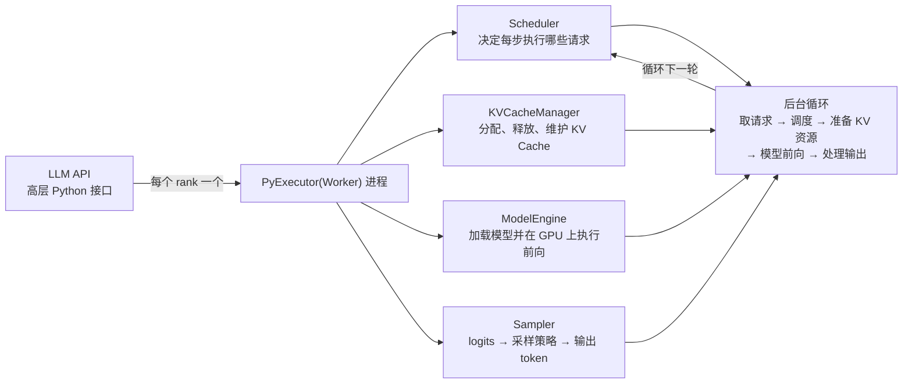
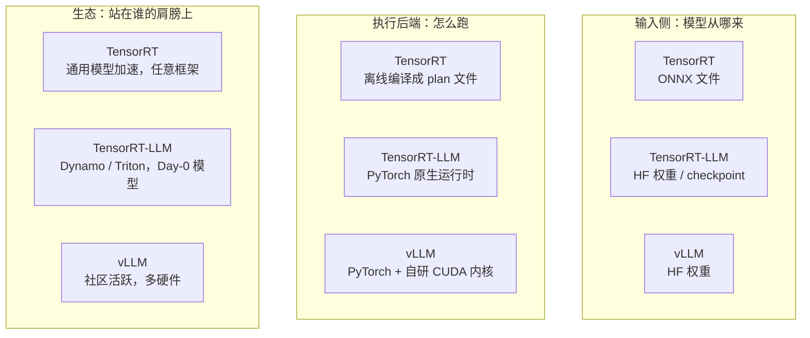

TensorRT-LLM 是 NVIDIA 官方出品的 LLM 推理引擎，官方定位是『在 NVIDIA GPU 上加速最新大语言模型（以及视觉生成模型）推理性能』的开源库。它和站内第 3 章讲过的 vLLM 是同一类产品——都是『拿权重、接请求、吐 token』的推理引擎；但和名字只有一字之差的 TensorRT 却是两个完全不同的项目：TensorRT 是通用模型编译器（ONNX 文件进、plan 文件出），而 TensorRT-LLM 直接加载 Hugging Face 权重、跑在 PyTorch 原生运行时上，**1.2 版本起 TensorRT 后端被正式移除，PyTorch 成为唯一执行后端**——两个项目的版本号和 API 绝不能混用。这一节把『它是什么、仓库长什么样、运行时内部怎么转、和 TensorRT 与 vLLM 怎么划界』一次讲清，是[第 12 章](/AIInfraGuide/inference/模块四-推理优化/第12章-tensorrt推理引擎/第12章-tensorrt推理引擎)后续所有内容（并行、量化、serving 实战）的地基。

<!-- more -->

## 📑 目录

- [1. 为什么需要第二个 LLM 推理引擎](#1-为什么需要第二个-llm-推理引擎)
- [2. 仓库面貌：开源时间线与版本节奏](#2-仓库面貌开源时间线与版本节奏)
- [3. 运行时架构：PyTorch 原生与 PyExecutor](#3-运行时架构pytorch-原生与-pyexecutor)
- [4. 与 TensorRT 的分野：两个项目别混用](#4-与-tensorrt-的分野两个项目别混用)
- [5. 与 vLLM 的定位差异：Day-0 与生态绑定](#5-与-vllm-的定位差异day-0-与生态绑定)
- [6. 性能宣称与模型覆盖](#6-性能宣称与模型覆盖)
- [7. 快速上手：NGC 容器与 trtllm-serve 一行起服务](#7-快速上手ngc-容器与-trtllm-serve-一行起服务)
- [8. 遥测与版本政策：默认开、可关、有纪律](#8-遥测与版本政策默认开可关有纪律)
- [总结](#-总结)
- [自我检验清单](#-自我检验清单)
- [参考资料](#-参考资料)

---

## 1. 为什么需要第二个 LLM 推理引擎

### 1.1 问题：vLLM 已经很好用了，为什么还要有它？

站内[第 3 章](/AIInfraGuide/inference/模块四-推理优化/第3章-深入vllm/32-nano-vllm源码导读)你已经见过 vLLM：paged KV cache、continuous batching、OpenAI 兼容 API，社区活跃、迭代飞快。那 NVIDIA 为什么还要自己造一个轮子？

**答案是：硬件厂商亲自下场，能吃到别人吃不到的三块红利。**

- **Day-0 模型支持**：新模型发布当天，NVIDIA 就发布配套的推理优化。官方原话是“strives to support the most popular models on Day 0”——OpenAI 的 GPT-OSS 系列、EXAONE 4.0、DeepSeek-V4、Llama 4 都是发布即支持（README 的 Day-0 实例）。对第三方框架来说，新架构落地要等社区贡献者解读权重格式、写内核、调优，往往落后数周到数月。
- **硬件特性深度绑定**：它是 NVIDIA 自家软件栈，可以针对最新架构（Blackwell 的 FP4、Hopper 的 FP8）第一时间写专用 kernel，还能和自家生态无缝拼接——官方文档明确说 LLM API 与 NVIDIA Dynamo、Triton Inference Server 无缝集成。
- **性能上限**：官方宣称的标杆数字（DeepSeek R1 在 Blackwell 上的『世界纪录』、Llama 4 突破 1000 TPS/User）都是拿 TensorRT-LLM 测出来的。推理性能是卖卡的核心卖点，NVIDIA 没有理由不把自家引擎做到最快。

打个比方：TensorRT 像通用货车——什么货物都能运，但每批货都要先『装箱』（ONNX 编译成 plan）；TensorRT-LLM 像一条专线冷链车——只运 LLM 这一种货，直接对接产地（HF 权重），连箱子都不用装，而且车是自家工厂造的，哪里该加固哪里该减重全按最新车型调过。

### 1.2 官方定位：一句话定义

官方文档（Overview 首段）的原文是：

> TensorRT LLM is NVIDIA's comprehensive open-source library for accelerating and optimizing inference performance of the latest large language models (LLMs) on NVIDIA GPUs.

拆开看有三个关键词：

- **open-source library（开源库）**：2025-03-22 起完全开源，开发迁移到 GitHub 公开进行，Apache-2.0 协议；
- **LLMs（大语言模型）**：主角是 LLM，但不止于文本——官方把扩散模型（FLUX、Wan 系列文生图/文生视频）也纳入进来，称为 Visual Generation（视觉生成）；
- **on NVIDIA GPUs（在 NVIDIA GPU 上）**：这句话把它的边界画死了——**它只为 NVIDIA GPU 优化**，这是它与 vLLM 最根本的定位差异之一（详见第 5 节）。

## 2. 仓库面貌：开源时间线与版本节奏

### 2.1 完全开源：2025 年 3 月 22 日

TensorRT-LLM 的开源是分两步的：**2023 年 10 月公开面世时即开源**（Apache-2.0，GitHub 仓库公开），但此后的开发大多在 NVIDIA 内部分支进行、定期向 GitHub 推送发布快照；**2025-03-22 起才完全开源**——开发流程整体迁移到 GitHub 公开进行。今天你在 GitHub 上看到的仓库（NVIDIA/TensorRT-LLM）就是主线，issue、PR、roadmap 全部公开。

### 2.2 版本徽章：一图看全家底

README 顶部的徽章（抓取于 main 分支）就是项目的『身份证』：

| 徽章 | 值 | 说明 |
| --- | --- | --- |
| release | **1.3.0rc24** | main 分支当前开发版本（1.3.0 的第 24 个候选版） |
| cuda | **13.2.1** | 配套 CUDA 版本 |
| torch | **2.11.0** | 配套 PyTorch 版本 |
| python | **3.12 / 3.10** | 官方支持的 Python 版本 |
| license | **Apache-2.0** | 开源协议 |

正式发布序列则是 0.7.1 → … → 0.21 → **1.0 → 1.1 → 1.2**（release-notes 口径，1.2 是当前最新正式版，最新补丁为 1.2.1）。注意一个容易踩的坑：**main 分支的徽章版本（1.3.0rc24）不是正式发布版**，装包请认准 PyPI 上带正式版本号的 release。

### 2.3 三个关键里程碑

| 版本 | 关键变化 |
| --- | --- |
| 1.0 | **PyTorch 架构转正并成为默认体验，LLM API 转正稳定**；从 1.0 起实行弃用政策（详见第 8 节） |
| 1.1 | 新增 KV Cache Connector API，用于 PD 解耦场景的 KV 状态迁移（呼应[第 7 章](/AIInfraGuide/inference/模块四-推理优化/第7章-pd解耦架构/72-解耦架构设计)） |
| 1.2 | **BREAKING CHANGE：TensorRT backend removed**，PyTorch 成为唯一执行后端 |

1.0 是这条时间线上最重要的分水岭：它宣告了这条技术路线的彻底转向——从『用 TensorRT 编译引擎跑 LLM』转向『用 PyTorch 原生运行时跑 LLM』（为什么，见第 3、4 节）。

## 3. 运行时架构：PyTorch 原生与 PyExecutor

### 3.1 Architected on PyTorch：不再『编译』，而是『直接跑』

官方给自己的架构标签是 **Architected on PyTorch**：你拿到的是高层 Python LLM API（`LLM(model=...).generate(...)`），底下是一个 **PyTorch 原生、模块化的运行时**。

这和『编译器』路线（TensorRT）的本质区别是：**你看到的模型代码就是真正执行的代码**。官方明确说开发者可以直接修改模型定义源码（例如 `tensorrt_llm/_torch/models/modeling_deepseekv3.py`）来定制扩展——这在『ONNX 进、plan 出』的编译型路线里是不可能的事情，因为编译产物是黑盒。代价是：牺牲了编译期全局优化的机会（换来的是一等公民的开发体验与灵活性）。

### 3.2 内部结构：每个 rank 一个 PyExecutor

官方架构文档把运行时拆得很清楚：`LLM` 类在每个 rank（一张卡或一个进程）上创建一个 **PyExecutor(Worker) 进程**，这个进程跑一个**连续的后台循环**，异步处理推理请求。循环的四个核心组件与五步操作如下：



这四块的职责明细（Scheduler、KVCacheManager、ModelEngine、Sampler 各自负责什么）与 [12.3 运行时与 LLM API](/AIInfraGuide/inference/模块四-推理优化/第12章-tensorrt推理引擎/123-运行时与llm-api) 的组件表格一一对应，此处不展开。**换句话说：推理引擎该有的部件它一个不少，只是全部用 PyTorch 重写了一遍，并且把『每轮循环』设计成了常驻后台的异步流水线。**

### 3.3 运行时优化：CUDA Graph 与 Overlap Scheduler

运行时还有两个官方反复强调的优化：**CUDA Graph**（把一串 kernel 启动录成一张图、一次调用发出，压低主机调度开销）与 **Overlap Scheduler**（让 CPU 处理上一步结果与 GPU 执行下一步重叠）。两者的机制细节、代价（padding 冗余计算、多一个解码步）与收益数字（最高 22% 端到端吞吐）见 [12.3 第 2 节](/AIInfraGuide/inference/模块四-推理优化/第12章-tensorrt推理引擎/123-运行时与llm-api)。

## 4. 与 TensorRT 的分野：两个项目别混用

### 4.1 为什么名字这么像，却是两个项目？

TensorRT（TRT）是 NVIDIA 的**通用模型推理编译器**，诞生于 2016 年，服务于 CNN、检测、分割等一切可表达为计算图的模型；TensorRT-LLM（TRT-LLM）是 2023 年才立项的 **LLM 专用推理库**。两者不是『TRT 的 LLM 版本』这么简单的关系——历史上 TRT-LLM 确实用 TRT 做执行后端，但这条路线已经被官方亲手终结。

### 4.2 1.2 的 BREAKING CHANGE：TensorRT 后端被移除

release-notes 1.2 的原文（加粗处即官方原文）：

> **[BREAKING CHANGE] TensorRT backend removed.** PyTorch is now the sole execution backend.

中文解读（加粗处即官方原文强调）：`LLM(backend="tensorrt")` 调用会抛 `ValueError`；`trtllm-build` / `trtllm-refit` / `trtllm-prune` 三个 CLI、`--backend tensorrt` 选项与各模型的 `convert_checkpoint.py` 脚本被**全部移除**；`tensorrt` pip 依赖**不再安装**。

翻译成一句话：**从 1.2 开始，TensorRT-LLM 里没有任何 TensorRT 组件了**。网上大量旧教程还在教 `trtllm-build` 编译 engine、装 tensorrt 包——那些在 1.2 里会直接报错，请以你所用版本的 release-notes 为准。

### 4.3 一张表划清边界

| 📊 维度 | TensorRT（TRT） | TensorRT-LLM（TRT-LLM） |
| --- | --- | --- |
| 定位 | 通用模型推理编译器 | LLM（及视觉生成）专用推理库 |
| 输入 | ONNX 等标准格式 | HF 权重 / checkpoint |
| 产物 | 序列化 plan 文件 | 无编译产物，运行时直接执行 |
| 执行后端 | 自研 engine | **PyTorch 原生运行时（唯一后端）** |
| 版本号 | 11.x（10.x 之后大版本跳升） | 1.x（0.x 之后转正） |
| 适用模型 | 任意计算图（CNN/检测等） | LLM、多模态、扩散模型 |

📌 **关键点**：判断用哪个，先看模型类型——**跑 LLM 生成场景，直接用 TensorRT-LLM，别把 TRT 的 build 流程搬过来；跑非 LLM 的通用网络，才轮得到 TRT**。两个项目的文档、版本号、API 完全不互通，在 README 和论坛里看到名字先确认是哪个项目。

## 5. 与 vLLM 的定位差异：Day-0 与生态绑定

### 5.1 同为 LLM 推理引擎，差异在哪？

vLLM（[第 3 章](/AIInfraGuide/inference/模块四-推理优化/第3章-深入vllm/32-nano-vllm源码导读)）和 TensorRT-LLM 功能面高度重合：都有 continuous batching、paged KV cache、量化、投机解码、多卡并行、OpenAI 兼容 API。差异在**立场**：

- **硬件绑定**：TensorRT-LLM 只认 NVIDIA GPU，而且紧跟自家最新架构（FP4 目前仅官方文档点名的 B200 支持）；vLLM 的 CUDA 内核之外还有 ROCm（AMD）、TPU 等后端，社区贡献者遍布各家硬件。
- **Day-0 支持**：新模型发布当天，NVIDIA 跟进优化（前文 GPT-OSS、EXAONE 4.0、DeepSeek-V4、Llama 4 都是实例）；vLLM 靠社区贡献，主流模型通常数周内跟上，但『当天可用』不是它的承诺。
- **生态位**：TensorRT-LLM 官方明写与 NVIDIA Dynamo（数据中心级推理框架）、Triton Inference Server（生产级 serving）无缝集成——它是 NVIDIA 全栈方案的执行内核；vLLM 则自成生态，被云厂商和各类平台广泛内置。

### 5.2 三项目定位对照图

把第 4、5 节的内容放进一张图：



### 5.3 选型规则

- ✅ **吞吐型在线服务、要社区活跃与生态通用性** → vLLM（[第 11 章](/AIInfraGuide/inference/模块四-推理优化/第11章-推理优化选型与端到端实战/第11章-推理优化选型与端到端实战)的结论：生产选型默认 vLLM）；
- ✅ **要 NVIDIA 全栈（Dynamo/Triton）、追求极限性能、跑最新模型首发** → TensorRT-LLM；
- ❌ 不要因为『听起来更底层』就无脑选 TensorRT-LLM——它绑定 NVIDIA 硬件与自家容器栈，迁移成本更高，收益只在性能敏感场景才明显。

## 6. 性能宣称与模型覆盖

### 6.1 官方宣称的数字（厂商口径，仅供参考）

README 与官方博客给出的标杆数字（注意：这些是 NVIDIA 自己测的、特定硬件与配置下的结果，**不能当作通用结论**）：

- **DeepSeek R1**：在 Blackwell GPU 上取得『世界纪录推理性能』（NVIDIA 官方博客标题口径）；
- **Llama 4 Maverick**：在 B200 上突破 **1000 TPS/User**（每用户每秒 1000 token，博客标题口径）；
- **Llama 4**：在 B200 上超过 **40,000 tokens/s**（README Latest News 口径）。

📌 **关键点**：厂商 benchmark 的配置（batch 大小、并发数、精度、CUDA Graph 开关）决定数字可不可比。你要做的是拿它当『上限参考』，再用站内第 9 章的方法自己压测——[第 11 章 11.3 端到端部署实战](/AIInfraGuide/inference/模块四-推理优化/第11章-推理优化选型与端到端实战/113-端到端部署实战)就是干这个的。

### 6.2 模型覆盖：三类都收

官方支持的模型清单（overview.md 口径）分三类：

- **语言模型**：GPT-OSS、DeepSeek-R1/V3、Llama 3/4、Qwen2/3、Gemma 3、Phi 4 等；
- **多模态模型**：LLaVA-NeXT、Qwen2-VL、VILA、Llama 3.2 Vision 等；
- **视觉生成（VisualGen）**：FLUX、Wan2.1/2.2 等文生图/文生视频模型。

另外两个与本章后续直接相关的点：**FP4 量化**在 B200 上原生支持（自动调用优化过的 FP4 kernel）；**FP8 量化**在 H100 及以后支持，官方称相比 16 位浮点吞吐翻倍、显存减半、精度影响很小——量化基础概念见[第 4 章](/AIInfraGuide/inference/模块四-推理优化/第4章-量化/41-量化基础)，TRT-LLM 的细节留给本章量化小节。

## 7. 快速上手：NGC 容器与 trtllm-serve 一行起服务

官方 quick-start-guide 明确说：**最快路径是拉取 NGC 预构建的 release 容器**，不用自己编译。

```bash
# 拉取 NGC 预构建容器（官方推荐的最快安装路径；容器名为 release，具体 tag 以 NGC 页面为准）
docker pull nvcr.io/nvidia/tensorrt-llm/release:<tag>

# 运行容器（官方 quick-start-guide 命令格式，tag 形如 x.y.z）
docker run --rm -it --ipc host --gpus all \
  --ulimit memlock=-1 --ulimit stack=67108864 -p 8000:8000 \
  nvcr.io/nvidia/tensorrt-llm/release:<tag>
```

容器里直接一行命令起一个 OpenAI 兼容服务（以官方文档的 TinyLlama 为例，首次运行会自动下载权重）：

```bash
trtllm-serve "TinyLlama/TinyLlama-1.1B-Chat-v1.0"
```

然后从另一个终端用标准 OpenAI 接口测——完整的 curl 请求示例（`/v1/chat/completions` 的 JSON 体写法）见 [12.3 §3.1](/AIInfraGuide/inference/模块四-推理优化/第12章-tensorrt推理引擎/123-运行时与llm-api)。

不想起服务、只想在 Python 里跑离线推理，就用高层 LLM API：

```python
from tensorrt_llm import LLM

llm = LLM(model="TinyLlama/TinyLlama-1.1B-Chat-v1.0")
output = llm.generate("Hello, my name is")
```

⚠️ **注意**：`trtllm-serve` 的 CLI 参数、容器 tag 都随版本演进，上面只是『能跑通的最小示例』；动手前以你所用版本的官方 quick-start-guide 为准。

## 8. 遥测与版本政策：默认开、可关、有纪律

### 8.1 匿名遥测：收集什么、怎么关

TensorRT-LLM **默认收集匿名遥测**，官方说明（README Telemetry 一节）：

- **收集**：入口类型（LLM API / CLI / serve）、GPU 型号与数量、CUDA 版本、模型架构类名（如 `LlamaForCausalLM`）、并行配置（TP/PP/CP/MoE-EP 等）、量化算法、dtype、TRT-LLM 版本等；
- **不收集**：prompt、输出、模型权重、模型路径、tokenizer 路径、任何可识别用户的信息；部署标识符是每次随机生成的临时值。

关闭方式（任选其一即可）：环境变量 `TRTLLM_NO_USAGE_STATS=1`、`DO_NOT_TRACK=1` 或 `TELEMETRY_DISABLED=true`；或创建文件 `~/.config/trtllm/do_not_track`；或代码里传 `TelemetryConfig(disabled=True)`；CLI 加 `--no-telemetry`。收集代码本身完全开源（`tensorrt_llm/usage/` 目录），可审计。

打个比方：这像食堂门口的刷卡机只统计『几点来了多少人』，不记你点了什么菜、更不知道你是谁。介意的话门口有牌子写着怎么关。

### 8.2 弃用政策：提前通知 + 3 个月迁移期

从 1.0 起官方实行明确的弃用政策：**弃用通知写进 release-notes，源码里标注弃用时间，使用时发出运行时警告；弃用后提供 3 个月迁移期，期满才在后续版本移除**。所以 1.2 移除 TensorRT 后端才会显得那么『突然』——它并没有走过『通知 + 3 个月迁移期』的完整流程：1.0 只是把 PyTorch 设为默认后端、移除 TRT 相关文档并取消 Triton 的 llmapi+TRT 支持，1.1 继续过渡，1.2 才以 BREAKING CHANGE 正式移除。**对工程实践的含义**：升级 TensorRT-LLM 前先扫一遍 release-notes 的 BREAKING CHANGE 与 Deprecated 列表，你的代码里用的每个 API 都该知道它处于什么生命周期。

---

## 📝 总结

1. **定位**：TensorRT-LLM 是 NVIDIA 官方、Apache-2.0 开源的 LLM（及视觉生成模型）推理引擎，2025-03-22 完全开源，只服务 NVIDIA GPU，主打 Day-0 模型支持与性能上限。
2. **版本节奏**：正式版序列到 1.2（main 分支开发版 1.3.0rc24）；1.0 让 PyTorch 架构转正，1.2 移除 TensorRT 后端——PyTorch 是唯一执行后端。
3. **架构**：Architected on PyTorch——每个 rank 一个 PyExecutor(Worker) 进程，跑『取请求→调度→准备 KV→前向→处理输出』的后台循环，Scheduler / KVCacheManager / ModelEngine / Sampler 四组件各司其职，配 CUDA Graph 与 Overlap Scheduler（默认开，代价是多一个解码步）。
4. **与 TensorRT 划界**：TRT 是通用编译器（ONNX→plan），TRT-LLM 是 LLM 专用库（直接加载 HF 权重），版本号、API、CLI 全部独立，1.2 起连执行后端都换成 PyTorch——跑 LLM 用 TRT-LLM，跑通用网络才用 TRT。
5. **与 vLLM 划界**：功能同质（batching、paged KV cache、量化、投机解码），差异在立场——TRT-LLM 绑定 NVIDIA 硬件与 Dynamo/Triton 生态，vLLM 社区活跃、多硬件；选型看你的场景是『NVIDIA 全栈极限性能』还是『通用生态』。
6. **工程纪律**：默认匿名遥测可关（`TRTLLM_NO_USAGE_STATS=1` 等）；1.0 起弃用政策 = release-notes 通知 + 3 个月迁移期，升级前先读 BREAKING CHANGE。

## ⚠️ 常见错误做法

- ❌ **把 TensorRT 和 TensorRT-LLM 当成“同一个东西”**：按 TRT 的教程去用 TRT-LLM。为什么错：TRT 是通用推理编译器（ONNX 输入），TRT-LLM 是 LLM 专用库（HF 权重输入），两者工具链完全不同。正确做法：先分清对象（本文 4.3 的对比表），再选教程。
- ❌ **按 1.2 之前的旧教程跑 `trtllm-build`**：教“编译 engine”的教程满天飞。为什么错：1.2 起 TensorRT 后端被移除，`trtllm-build` 等 CLI 全部删除，照旧教程直接报错。正确做法：以所用版本的 release-notes 为准，1.2+ 走 PyTorch 后端路径。
- ❌ **以为 TRT-LLM 只适合“极限性能的特定模型”**：什么模型都往 TRT-LLM 搬。为什么错：TRT-LLM 的优化需要针对模型与硬件做配置，生态与社区不如 vLLM 活跃，冷门模型支持慢。正确做法：按选型表评估——吞吐/生态选 vLLM，极限性能与深度定制再上 TRT-LLM。
- ❌ **忽略 license 与许可**：Meta 系等模型需要先在 HF 同意协议。为什么错：没有 token/许可，下载直接 403，且公司合规风险。正确做法：提前在 HF 配置 token 与许可（12.2 有操作说明）。

## 🎯 自我检验清单

- 能讲清 TensorRT-LLM 的官方定位，并指出它只服务 NVIDIA GPU 这一边界。
- 能说出正式发布序列的最新版本号与 main 分支开发版（1.2 vs 1.3.0rc24），并解释为什么徽章版本不能当正式版装。
- 能画出 PyExecutor 的后台循环五步，并说出 Scheduler、KVCacheManager、ModelEngine、Sampler 各自负责什么。
- 能解释 1.2 的 BREAKING CHANGE 具体移除了什么（TensorRT 后端、trtllm-build 等 CLI、tensorrt pip 依赖），以及旧教程为何会失效。
- 能用一张表格对比 TensorRT 与 TensorRT-LLM 的输入、产物、执行后端，并说出『跑 LLM 用哪个』。
- 能向别人讲清 TensorRT-LLM 与 vLLM 的三点定位差异（硬件绑定、Day-0、生态），并给出各自的适用场景。
- 能复述官方三个性能宣称（DeepSeek R1 世界纪录、1000 TPS/User、40,000+ tokens/s）并说明为什么不能当通用结论直接引用。
- 能说出官方模型覆盖的三类清单（语言 / 多模态 / 视觉生成）各举两个例子。
- 能写出 `trtllm-serve` 一行启动 OpenAI 兼容服务的最小命令（curl 请求示例见 12.3 §3.1）。
- 能列举至少三种关闭匿名遥测的方式，并说明遥测收集与不收集的边界。
- 能解释弃用政策的三要素（通知、警告、3 个月迁移期），以及升级前应该检查什么。

## 📚 参考资料

**官方文档**

- [TensorRT-LLM GitHub 仓库](https://github.com/NVIDIA/TensorRT-LLM)：README（徽章、Latest News、Telemetry）与全部文档源码，本文事实的主来源。
- [TensorRT-LLM 在线文档：Overview](https://nvidia.github.io/TensorRT-LLM/developer-guide/overview.html)：官方定位、Architected on PyTorch、模型支持清单。
- [TensorRT-LLM 在线文档：Architecture Overview](https://nvidia.github.io/TensorRT-LLM/developer-guide/overview.html#architecture-overview)：PyExecutor / Worker、四组件与后台循环、CUDA Graph 与 Overlap Scheduler。
- [TensorRT-LLM 在线文档：Quick Start Guide](https://nvidia.github.io/TensorRT-LLM/quick-start-guide.html)：NGC 容器安装与 trtllm-serve 一行起服务。
- [TensorRT-LLM Release Notes](https://nvidia.github.io/TensorRT-LLM/release-notes.html)：1.0/1.1/1.2 里程碑与 1.2 BREAKING CHANGE 原文。
- [Supported Models](https://nvidia.github.io/TensorRT-LLM/models/supported-models.html)：完整模型支持列表。

**官方博客**

- [NVIDIA Blackwell Delivers World-Record DeepSeek-R1 Inference Performance](https://developer.nvidia.com/blog/nvidia-blackwell-delivers-world-record-deepseek-r1-inference-performance/)：性能宣称出处之一。
- [Blackwell Breaks the 1,000 TPS/User Barrier With Meta's Llama 4 Maverick](https://developer.nvidia.com/blog/blackwell-breaks-the-1000-tps-user-barrier-with-metas-llama-4-maverick/)：1000 TPS/User 出处。
