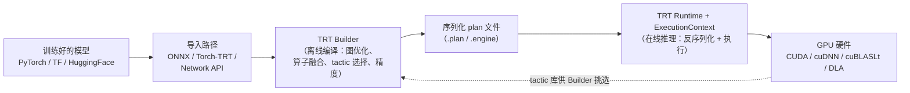
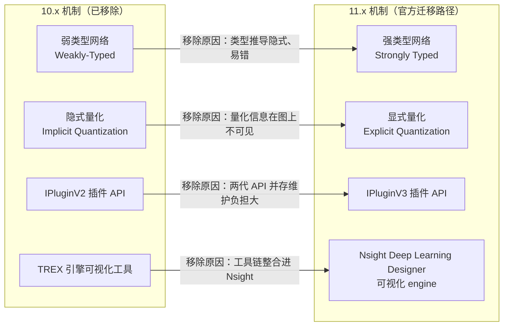

训练好的神经网络模型，离"在 GPU 上以最低延迟跑起来"还差一步——这一步就是推理编译器。TensorRT（下称 TRT）干的就是这件事，它的官网仓库当前版本号是 **11.2.1.2**，而就在 2026 年内，它已经连发了 **10.16、11.0、11.1、11.2 四个 GA 版本**（CHANGELOG 口径），其中 11.x 是一次主动的"大版本跳升"：官方公告原文说 API 被精简、一批 10.X 遗留特性被移除。理解 TRT 的关键一句话是：**它是"模型编译器 + 推理运行时"的两段式设计，不是模型动物园**——一个 ONNX 文件必须先在离线阶段被编译成序列化的 plan（.plan/.engine）文件，运行时只负责反序列化 plan 并执行，它根本不直接解析 ONNX。这一节把"TRT 是什么、为什么需要编译器、11.x 改了什么、和 cuDNN/CUDA 怎么分工"一次讲清，是 [第 12 章](/AIInfraGuide/inference/模块四-推理优化/第12章-tensorrt推理引擎/第12章-tensorrt推理引擎) 的地基；后面的文章再讲具体怎么构建 engine、怎么量化、怎么写插件。

<!-- more -->

## 📑 目录

- [1. 为什么需要推理编译器](#1-为什么需要推理编译器)
- [2. TensorRT 是什么：仓库、定位与分工](#2-tensorrt-是什么仓库定位与分工)
- [3. 两段式设计：离线构建 + 轻量运行时](#3-两段式设计离线构建--轻量运行时)
- [4. 11.x 大版本跳升：API 精简了什么](#4-11x-大版本跳升api-精简了什么)
- [5. 安装与配套环境](#5-安装与配套环境)
- [6. 与 TensorRT-LLM 的关系](#6-与-tensorrt-llm-的关系)
- [总结](#-总结)
- [自我检验清单](#-自我检验清单)
- [参考资料](#-参考资料)

---

## 1. 为什么需要推理编译器

### 1.1 现状的代价：框架里的模型不等于能跑的代码

先问一个问题：**训练好的模型在 PyTorch 里跑一次前向，GPU 到底在忙什么？**

你调 `model(input)` 时，PyTorch 走的是 eager 模式：逐个算子分派、逐个 kernel 启动，每个 kernel 之间还要做形状检查、设备检查、Autograd 记账（推理时用 `torch.no_grad()` 才能省掉最后一项）。打个比方：这像照着菜谱做菜——**每个步骤都对着菜谱念一遍再动手**，菜谱写得再详细，厨师的精力也花在了"念"而不是"做"上。层数一多（一个 70B 模型几百层算子），这种"解释执行"的调度开销就相当可观：kernel 启动间隙里 GPU 在空转，很多算子的实现也没有针对你的目标 GPU 精挑细选。

推理编译器要回答的问题就是：**能不能把"照着菜谱念"变成"背下菜谱、按你的灶台重新排一遍流程"？**

### 1.2 核心洞察：编译一次，执行无数次

**能。做法是把"读模型"和"跑模型"拆成两段，中间用一份编译产物衔接。**

- **第一段（离线、慢、只做一次）**：读入模型的计算图，做图优化（算子融合、常量折叠、精度选择），针对目标 GPU 的硬件特性，为每一层从候选 kernel 库中挑出最快的实现，最后把所有选择固化进一份**序列化 plan 文件**。这一段的耗时通常是分钟级（大模型或复杂网络可能更久），但不用发生在用户请求路径上。
- **第二段（在线、快、反复执行）**：服务启动时反序列化 plan，之后每次推理只是按 plan 里的既定顺序启动 kernel。运行时不再做任何"理解模型"的工作。

**编译器**（compiler）这个词就是这么来的：它把"程序"（神经网络计算图）翻译成"机器码"（针对特定 GPU 的 kernel 序列），并做传统编译器同款的优化——死代码消除、常量折叠、指令调度。区别只在于它编译的输入输出是模型文件而不是源代码。**它牺牲的是构建阶段的一次性时间成本和"换了 GPU 就得重新编译"的灵活性，换取的是运行时调度开销趋近于零。**

---

## 2. TensorRT 是什么：仓库、定位与分工

### 2.1 官方仓库的真实面貌

去 github.com/NVIDIA/TensorRT 看一眼，先别被"TensorRT"这个名字误导——**这个开源仓库并不是 TensorRT 的全部**。README 第一屏就写明：本仓库包含的是 TensorRT 的 **OSS（Open Source Software）组件：插件（plugins）、ONNX parser 和示例应用**，它们是 TensorRT GA（General Availability，正式发行版）的一个子集，附带一些扩展与 bug 修复。徽章显示这些 OSS 组件采用 **Apache 2.0 许可证**。

换句话说：真正的 TRT 运行时核心（Builder、Runtime、核心 kernel 库）是闭源随 GA 分发的，开源仓库给你的是"周边的轮子"——解析 ONNX 的 parser、官方插件（比如 11.2 新增的 cuFFT 后端的 FFTPlugin）、以及演示各种用法的 sample。这对你的实际意义是：**查问题、抄示例、找插件源码时来这个仓库；装运行时走官方包，而不是从这里编译**（除非你要改插件）。

### 2.2 定位澄清：通用图执行引擎，不是模型动物园

TRT 能跑哪些模型？官方 `supported_models.md` 的 Scope 一节开篇就把定位钉死了：**"TensorRT is a general-purpose neural-network graph execution engine, not a model zoo"**——它是通用的神经网络图执行引擎，不是模型动物园。它列出的模型清单（LLM、BERT、ViT、Whisper、SDXL、FLUX 等）只是**官方验证并 benchmark 过的子集**，不是支持上限。原则上任何能用导入路径表达的神经网络架构都能跑；你不在清单里的模型跑不通，官方甚至鼓励你提 issue。

所以别问"TRT 支持我的模型吗"，要问"我的模型能不能表达成它支持的导入路径之一"——这正是 README 把 [Import Workflows Guide](https://github.com/NVIDIA/TensorRT/blob/main/documents/import_workflows.md)（导入路径指南）和 Supported Models（支持矩阵）并列为两份核心文档的原因。

### 2.3 与 CUDA / cuDNN 的分工：总导演与特技演员库

CUDA 和 cuDNN 都已经讲过了（模块一、模块二），TRT 和它们是什么关系？**TRT 是"总导演"，cuDNN/cuBLAS/cuBLASLt 是"特技演员库"。** TRT 不重复造底层轮子——它自己有一批手写 kernel（插件和部分核心算子），但大量计算仍然落在 cuDNN（卷积、RNN 等）和 cuBLASLt（GEMM）这些库上。构建 engine 时，TRT 会对每个算子尝试多种候选实现（官方叫 **tactic**，其中就包含 CUBLAS_LT 这类外部库路径），用 profiling 打分选出最快的那个，把这个选择固化进 plan。它和 cuDNN 的关系是**编排与调度**，不是竞争：cuDNN 提供"单个动作"的最优实现，TRT 负责"整场戏"的走位与衔接（算子融合、内存复用、精度调度）。



📌 **关键点**：cuDNN 的职责到"单个算子最快"为止；"整张图怎么排、每层用哪个实现、中间结果放哪"是 TRT 编译器的活。这也是为什么同样的模型，手写 CUDA 加调 cuDNN 往往打不过 TRT——差的不是单个 kernel，是整图的编排。

---

## 3. 两段式设计：离线构建 + 轻量运行时

### 3.1 导入路径：模型怎么进编译器

官方导入路径指南列了四条路，选哪条取决于你手里有什么：

| 📊 你手上有 | 推荐路径 | 一句话说明 |
|---|---|---|
| 任意框架导出的 ONNX 文件 | ONNX → TRT | 最通用，`trtexec` / Python API / Polygraphy 三条前端 |
| 训练好的 PyTorch 模型 | Torch-TensorRT | 留在 PyTorch 生态内，Dynamo 前端是 11.x 的活跃推荐路径 |
| HuggingFace Hub 上的模型 | 导出 ONNX 再走路径 1 | 非 LLM 用 `optimum` 导出；**LLM 生成直接上 TensorRT-LLM**（见第 6 节） |
| 自研结构、C++ 栈 | Network Definition API | 用代码逐层搭网络，控制力最大、工作量也最大 |

四条路径的适用边界和完整实战（含最小可运行代码）在 [12.3 导入路径与最小实战](/AIInfraGuide/inference/模块四-推理优化/第12章-tensorrt推理引擎/123-导入路径与最小实战) 展开。

### 3.2 Builder 构建：ONNX 到 plan 的必经之路

官方指南有一句必须记住的原话（英文原文）：**"An ONNX file must be converted to a serialized TensorRT plan (.plan / .engine) before the runtime can execute it — the TensorRT runtime deserializes plans, it does not parse ONNX."** 意思是：一个 ONNX 文件必须先被转换成序列化的 TensorRT plan 之后，运行时才能执行它——TRT 运行时只反序列化 plan，并不解析 ONNX。也就是说"TRT 直接吃 ONNX"是错觉；你看到的 `trtexec --onnx=xxx` 其实是 Builder 在内部帮你完成了"解析 ONNX → 构建 → 序列化"三步。

最快的上手路径是命令行工具 `trtexec`（随 TRT 分发）：

```bash
# 构建：ONNX → plan（--fp16 是精度标志，还有 --bf16/--int8/--fp8，平台相关）
trtexec --onnx=model.clean.onnx --saveEngine=model.plan \
  --memPoolSize=workspace:4096 --fp16

# 动态形状：给出 min/opt/max 三档，Builder 在其中做优化
trtexec --onnx=model.onnx --saveEngine=model.plan \
  --minShapes=input:1x3x224x224 \
  --optShapes=input:8x3x224x224 \
  --maxShapes=input:16x3x224x224
```

Python 里等价流程只有四步：建 `Builder` → 用 `OnnxParser` 把 ONNX 读进网络（11.x 创建网络要显式带 `STRONGLY_TYPED` 标志，见第 4 节）→ 配置 workspace 内存池 → `build_serialized_network` 得到字节流写盘。三段式 frontend（trtexec / Python / Polygraphy）底层调用的是同一套 `IBuilder` + `nvonnxparser`。

⚠️ **注意**：plan 是**绑定计算能力的**——在 A100 上构建的 plan 不能直接拿去 H100 上跑，官方 troubleshooting 第一条就是"Engine plan file is generated on an incompatible device"，需要在部署目标卡上重建，或用多 SM 目标构建。

📎 **前向指针**：trtexec 的完整命令矩阵与六大核心对象的工厂流水线见 [12.2 核心对象与构建流程](/AIInfraGuide/inference/模块四-推理优化/第12章-tensorrt推理引擎/122-trt核心对象与构建流程)（`STRONGLY_TYPED` 强类型网络的机制详解也在其中）。

### 3.3 Runtime 执行：反序列化 + ExecutionContext

运行时的职责被刻意做得很薄：反序列化 plan → 创建 ExecutionContext（执行上下文，持有每层的输入输出绑定）→ 把输入数据拷进 GPU 显存 → enqueue 执行。因为所有决策都在 plan 里定死了，运行路径上没有任何"再想想"的空间。

这带来一个常见现象：**第一次推理总是特别慢**。原因是 plan 反序列化和部分 CUDA kernel 的 JIT 编译是一次性开销，官方建议正式计时前 warm up ≥ 3 次迭代。这也是"离线编译器 + 轻量运行时"设计的必然代价：**把一次性的贵，换成了每次的便宜。**

---

## 4. 11.x 大版本跳升：API 精简了什么

### 4.1 为什么要动大手术

10.x 时代 TRT 保持着约每月一个 GA 的节奏：从 2024 年 7 月的 10.2.0 到 2026 年 3 月的 10.16，不到两年发了 15 个版本号（10.13 甚至在 2025 年 7 到 9 月连发 .0/.2/.3 三个小版本）。高频迭代的代价是 API 面不断膨胀、新旧机制并存。11.0 GA（2026-6-2）的公告定调：**这是一次主动的大版本跳升，API 被精简（streamlined），一批 10.X 遗留特性被移除**。对使用者来说，11.x 意味着"升级不是改版本号，是要改代码"。

### 4.2 四大迁移：旧机制去哪了



四项迁移背后的逻辑是同一个：**让"模型到底是什么"在图上显式可见**。

- **弱类型 → 强类型**：10.x 里张量的数据类型常常靠 Builder 推导，推理链路上"这层到底是 FP32 还是 FP16"说不清；11.x 要求网络定义里每个张量类型显式声明（Python 建网络要传 `STRONGLY_TYPED` 标志，官方示例如 `strongly_type_autocast` 展示了 FP32 ONNX 如何转 FP32-FP16 混合精度构建）。
- **隐式量化 → 显式量化**：隐式量化时代，量化信息（scale、zero point）藏在构建配置里，图和运行时都看不见；显式量化把量化信息变成图上可见的算子与张量属性，配合 TensorRT ModelOptimizer 产出的量化模型直接可构建。
- **IPluginV2 → IPluginV3**：写自定义算子（官方叫 plugin）是绕过"算子不支持"的唯一逃生门。V2 是 10.x 之前的接口，V3 从 10.x 起就是新写法（11.2 还专门加了一个 `sample_plugin_v2_to_v3_migration` 示例教迁移），11.x 直接删掉了 V2。
- **TREX → Nsight Deep Learning Designer**：TREX 是 10.x 用来可视化 engine 结构的工具，已被移除，改由 Nsight Deep Learning Designer 承担"可视化 TensorRT engine"的职责。

配合这些删除，11.0 还顺手清理了 12 个 deprecated 插件（batchTile、clip、gelu、leakyRelu、nms、proposal 等），解析器则新增了 `TRT_Attention`、`TRT_MoE`、`TRT_KVCacheUpdate` 等面向 LLM 的自定义算子支持——方向很明确：**图要显式、接口要收敛、LLM 要补位**。

### 4.3 语言与平台门槛同步收紧

- **Python**：3.9 及更早版本的绑定已被移除；RHEL/Rocky Linux 8/9 的 RPM 包改为依赖 Python 3.12；从源码构建 OSS 要求 **Python ≥ 3.10 且 ≤ 3.14.x**（11.1 起加入 Python 3.14 支持）。
- **C++**：走 C++ API 需要 **C++17 编译器**。
- **CUDA**：11.1 起构建默认 CUDA 版本更新为 **13.3**（README 构建示例同时给出 13.3.0 与 12.9.0 两档，cuDNN 8.9 可选）。官方导入指南的口径更直接：**TRT 11.x 应对应 CUDA 13.x**。

| 📊 门槛 | 10.x 时代 | 11.x |
|---|---|---|
| Python 绑定 | 支持 3.9 | 3.9 移除，构建需 3.10–3.14 |
| 网络定义 | 可弱类型 | 必须强类型 |
| 量化 | 隐式/显式并存 | 只留显式 |
| 插件 API | V2/V3 并存 | 只留 V3 |
| 默认 CUDA | 10.16 为 13.2 | 11.1 起 13.3 |
| 引擎可视化 | TREX | Nsight Deep Learning Designer |

📌 **关键点**：如果你在网上搜到 2025 年之前的 TRT 教程，八成用的是 10.x 写法——弱类型建网络、IPluginV2、隐式量化，这些代码在 11.x 下直接编译不过。**看教程先看版本，写代码先查 `tensorrt.__version__`。**

---

## 5. 安装与配套环境

### 5.1 三条安装路

**路线一：pip 预编译包（最快）。** 官方 README 直接说：`pip install tensorrt` 即可跳过整个 Build 章节用上 Python 版 TRT。但注意 11.x 的 wheel 命名带 CUDA 后缀：

```bash
# TRT 11.x：用 pypi.nvidia.com 源的 -cu13 wheel
pip install --extra-index-url https://pypi.nvidia.com tensorrt-cu13
```

⚠️ **注意**：官方原话是 "Always use `-cu13` packages with TRT 11.x. Do not mix `-cu12` wheels"——**11.x 必须配 CUDA 13 系 wheel，不要混用 -cu12**。同一台机器上装混了 cu12/cu13 两个版本的 tensorrt，import 到哪个全看解析顺序，这种"玄学报错"九成是 wheel 混装。

**路线二：NGC 容器（最稳）。** 官方推荐 `nvcr.io/nvidia/tensorrt:<tag>` 容器是**最快的"已知良好"（known-good）环境**——驱动、CUDA、cuDNN、TRT 的搭配全被 NVIDIA 验证过，一条 `docker pull` 搞定，省去所有版本对账。

**路线三：tar/.deb 系统包。** 从 NVIDIA Developer Zone 下载对应 CUDA 版本（11.2.1.2 提供 CUDA 13.3 / 12.9 两档）的发行包，解压后配 `LD_LIBRARY_PATH` 使用。

装完验证两件事，30 秒：

```bash
python3 -c "import tensorrt; print(tensorrt.__version__)"   # 期望 11.x
trtexec --help | head -5                                     # trtexec 可用
```

### 5.2 版本节奏：2026 年的 GA 时间线

| 📊 版本 | GA 日期 | 值得记住的变化 |
|---|---|---|
| 10.16 | 2026-3-24 | 默认 CUDA 升 13.2 |
| 11.0 | 2026-6-2 | 大版本跳升：弱类型/隐式量化/IPluginV2/TREX 移除 |
| 11.1 | 2026-6-24 | 默认 CUDA 13.3；支持 Python 3.14 |
| 11.2 | 2026-8-4 | 新增 FFT 插件、DFT/5D GridSample 算子；V2→V3 迁移示例 |

从 2020 年 10 月的 7.2.1 算起，这份 CHANGELOG 已经持续维护了近六年。**看 CHANGELOG 头几条，是判断"你该用哪个 TRT 版本"最快的方法。**

---

## 6. 与 TensorRT-LLM 的关系

最后必须划清一条边界，否则你会在 README 和论坛里被两个名字绕晕：**TensorRT（TRT）是通用的图执行引擎；TensorRT-LLM（TRT-LLM）是专门为 LLM 生成场景打造的独立项目**。官方支持矩阵的原话是：**LLM 生成的首选路径是直接使用 TensorRT-LLM**——它内部同样产出 TRT engine，但你在它上层写的是"生成循环"，而不是"导入一个 ONNX 做图像分类"。分流的规则一句话：**跑 LLM 生成 → TensorRT-LLM；跑 BERT/ViT/扩散模型组件等通用网络 → 原生 TRT**。KV Cache 管理、paged attention、FP8/INT4 量化、投机解码、多卡并行等机制细节，以及它与 Triton、ONNX Runtime 的生态分工，都在 [12.6 生态与选型](/AIInfraGuide/inference/模块四-推理优化/第12章-tensorrt推理引擎/126-生态与选型) 完整展开；本模块第 11 章把 vLLM/SGLang 作为在线服务主线（[11.3](/AIInfraGuide/inference/模块四-推理优化/第11章-推理优化选型与端到端实战/113-端到端部署实战) 的选型结论：吞吐型在线服务选 vLLM、极限延迟场景留 TensorRT-LLM），本章则补齐 NVIDIA 自家引擎这条线。

---

## 📝 总结

1. **为什么需要编译器**：PyTorch eager 逐算子分派有调度开销，推理编译器把"读模型"和"跑模型"拆成两段，用一次性的离线构建换取运行时开销趋近于零。
2. **TRT 是什么**：官方仓库是 OSS 组件（插件 + ONNX parser + 示例，Apache 2.0，当前 11.2.1.2），是 GA 的子集；TRT 本体是通用神经网络图执行引擎，不是模型动物园。
3. **两段式设计**：ONNX 必须先编译成序列化 plan（.plan/.engine），Runtime 只反序列化执行、不解析 ONNX；plan 绑定计算能力，第一次推理需 warm up。
4. **11.x 大跳升**：弱类型→强类型、隐式量化→显式量化、IPluginV2→IPluginV3、TREX→Nsight DL Designer 四项迁移；Python 3.9 绑定移除、构建需 3.10–3.14、C++17、配套 CUDA 13.x。
5. **安装**：`pip install tensorrt-cu13`（pypi.nvidia.com，勿混 -cu12）或 NGC 容器 `nvcr.io/nvidia/tensorrt`；2026 年内四个 GA 的节奏还在继续。
6. **分工**：TRT 是总导演，cuDNN/cuBLASLt 是 tactic 库；LLM 生成走 TensorRT-LLM，通用网络走原生 TRT。

## 🎯 自我检验清单

- 能向非技术同事解释"为什么 ONNX 文件不能直接喂给 TRT 运行时"，并说出 plan 文件与 ONNX 的关系。
- 能画出推理栈流程图：模型 → 导入路径 → Builder → plan → Runtime/ExecutionContext → GPU，并标出离线/在线的分界线。
- 能说出 TRT 官方开源仓库里有什么（插件/ONNX parser/示例）、许可证、以及它和 GA 发行版的关系。
- 能解释"TRT 不是模型动物园"：支持矩阵只是已验证子集，判断标准是能否用导入路径表达。
- 能一句话讲清 TRT 与 cuDNN 的分工（编排 vs 单算子实现），并说出 tactic 的含义。
- 能背出 11.x 四大迁移（强类型/显式量化/IPluginV3/Nsight DL Designer），并解释统一动机"让图上信息显式可见"。
- 能根据环境给出 11.x 的安装命令（-cu13 wheel、不要混 -cu12），并说出 NGC 容器为什么是 known-good。
- 能用 `trtexec` 把 ONNX 构建成 FP16 plan，并正确给出动态形状的 min/opt/max 三档。
- 能解释"plan 不能跨计算能力迁移"和"第一次推理慢"的成因，并说出 warm up 的合理次数（≥3 次）。
- 能根据模型类型选择 TRT 还是 TensorRT-LLM（LLM 生成 → TRT-LLM；通用网络 → TRT）。

## 📚 参考资料

**官方文档**
- [TensorRT GitHub 仓库 README](https://github.com/NVIDIA/TensorRT)：OSS 组件定位、11.X 公告与四大迁移说明、构建前置条件（本文 2.1、4.x 节事实出处）
- [Import Workflows Guide（导入路径指南）](https://github.com/NVIDIA/TensorRT/blob/main/documents/import_workflows.md)：四种导入路径、ONNX→plan 流程、"Runtime 不解析 ONNX"、安装与 -cu13 说明
- [Supported Models（支持矩阵）](https://github.com/NVIDIA/TensorRT/blob/main/documents/supported_models.md)："通用图执行引擎而非模型动物园"定位的原文出处
- [TensorRT CHANGELOG](https://github.com/NVIDIA/TensorRT/blob/main/CHANGELOG.md)：10.2（2024-07）至 11.2（2026-08）全部 GA 条目与日期
- [TensorRT 官方文档主页](https://docs.nvidia.com/deeplearning/tensorrt/)：Developer Guide、Release Notes、支持矩阵
- [Nsight Deep Learning Designer](https://docs.nvidia.com/nsight-dl-designer/UserGuide/index.html)：TREX 的替代工具

**开源项目**
- [TensorRT-LLM](https://github.com/NVIDIA/TensorRT-LLM)：LLM 生成专用路径，KV Cache/量化/投机解码/多卡并行的完整方案

**站内关联**
- [第 12 章首页](/AIInfraGuide/inference/模块四-推理优化/第12章-tensorrt推理引擎/第12章-tensorrt推理引擎)：本章结构与学习目标
- [11.3 端到端部署实战](/AIInfraGuide/inference/模块四-推理优化/第11章-推理优化选型与端到端实战/113-端到端部署实战)：vLLM/SGLang/TensorRT-LLM 的框架选型结论
- [AI Infra 学习路线](/AIInfraGuide/guides/ai-infra学习路线)：第三层"推理与部署"的检验标准
