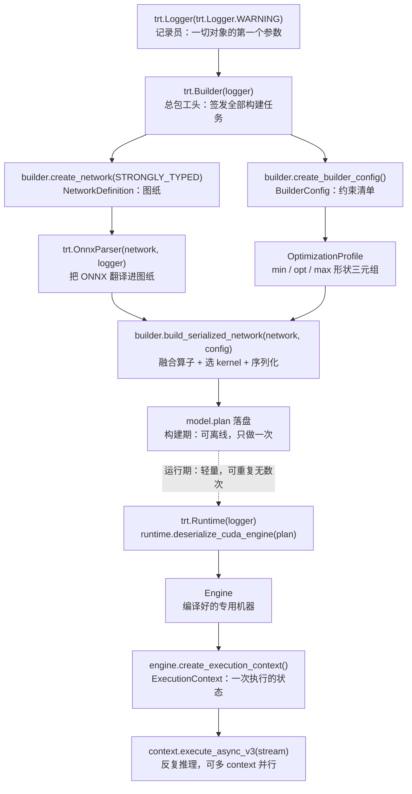
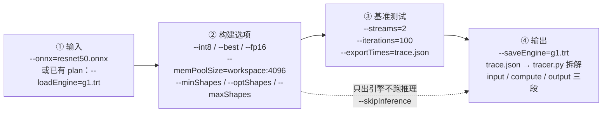

把"模型"变成 TensorRT"引擎"，全程可以压成 11 行代码：构建期 8 行（Logger → Builder → Network → OnnxParser → BuilderConfig → build_serialized_network → 落盘 plan），运行期 4 行（Runtime → Engine → ExecutionContext → 执行）。**构建期像工厂：拿到 ONNX 设计图，花几分钟到几十分钟离线加工出一台"专用机器"；运行期像开车：每次推理毫秒级，只做轻量启动**。这一篇把这条流水线上的每个对象拆开——它是什么、为什么存在、参数怎么传——再讲透 trtexec 这个"不写代码版"工具如何覆盖同一套流程。上一篇 [12.1](/AIInfraGuide/inference/模块四-推理优化/第12章-tensorrt推理引擎/121-tensorrt是什么) 回答了"TensorRT 是什么"，这一篇回答"怎么把它用起来"。

<!-- more -->

## 📑 目录

- [1. 为什么需要工厂流水线：构建期与运行期](#1-为什么需要工厂流水线构建期与运行期)
- [2. 构建期对象链：五个对象与一个形状配置](#2-构建期对象链五个对象与一个形状配置)
- [3. 完整 Python 构建代码](#3-完整-python-构建代码)
- [4. 运行期对象链：轻量三件套](#4-运行期对象链轻量三件套)
- [5. plan 不是通用的：换 GPU 就要重建](#5-plan-不是通用的换-gpu-就要重建)
- [6. trtexec：不写代码的构建与基准工具](#6-trtexec不写代码的构建与基准工具)
- [7. 权衡与落成一句话](#7-权衡与落成一句话)
- [总结](#-总结)
- [自我检验清单](#-自我检验清单)
- [参考资料](#-参考资料)

---

## 1. 为什么需要工厂流水线：构建期与运行期

### 1.1 TensorRT 为什么不直接读 ONNX 跑推理？

问题：PyTorch 能直接加载权重跑前向，为什么 TensorRT 非要先"构建"一步？**因为 ONNX 只是"设计图"，而 GPU 上真正执行的是"编译后的专用机器"**。ONNX 描述的是算子怎么连接、权重是什么；TensorRT 的构建器在构建期替你做三件事：把相邻算子融合成一个 kernel、为每个算子挑选当前 GPU 上最快的实现（tactic）、把权重与 kernel 一起打包进 plan。官方文档对引擎文件的定性是：**可执行制品，里面是已编译的 CUDA tactic**——它不是权重文件，更不是 ONNX 的另一种格式。

打个比方：ONNX 是汽车设计图，构建器是工厂流水线，plan 是出厂的车。工厂可以慢慢调工艺——构建期通常离线完成，耗时从几十秒到几十分钟甚至更久，取决于模型规模与 GPU；但车一旦出厂，每次启动都必须快——推理一次在毫秒级，启动开销必须压到最低。这就是"构建期 vs 运行期"两阶段设计的全部理由：**把重活全押在构建期，运行期只剩轻量动作**。

### 1.2 两阶段全景图

先看整条对象链长什么样，再逐个拆：



读图要点：**上面半条链（Logger 到 plan）是构建期，离线做、做一次；下面半条链（Runtime 到 ExecutionContext）是运行期，每次部署做一次，然后反复推理成千上万次**。接下来的两节分别把这两半拆开。

## 2. 构建期对象链：五个对象与一个形状配置

### 2.1 Logger：全流程的施工日志本

为什么所有对象都要先建 Logger？因为构建期会输出海量诊断信息——精度警告、不支持的算子、性能提示——Logger 就是统一的"记录员"，按严重级别过滤：ERROR / WARNING / INFO / VERBOSE，级别越低输出越多。官方示例几乎一律用 `trt.Logger(trt.Logger.WARNING)`：平时看 WARNING 级就够，排查问题再降到 VERBOSE。

Logger 是工厂里的施工日志本，Builder、OnnxParser、Runtime 创建时都要把它作为参数传进去——**这就是为什么 Logger 永远是对象链的第一环**。

### 2.2 Builder：总包工头

Builder 是构建期的唯一入口：建图纸（`create_network`）、建约束清单（`create_builder_config`）、发编译指令（`build_serialized_network`）全由它签发。你永远不会直接 new 一个 Network 或 Config——它们都是 Builder"发"出来的。原因：Builder 持有日志与设备上下文，所有子对象都要共享这份上下文。

### 2.3 NetworkDefinition：图纸；OnnxParser：翻译官

NetworkDefinition 是网络结构的内存表示：里面是 tensor 和 layer 组成的图。填图纸有两条路：

- **OnnxParser 导入**：`trt.OnnxParser(network, logger)` 把 ONNX 文件解析进 Network，最常用；
- **INetwork API 手搭**：逐层 `add_convolution_nd`、`add_activation` 之类，适合 ONNX 表达不了的网络——官方 Hello World [network_api_pytorch_mnist](https://github.com/NVIDIA/TensorRT/tree/main/samples/python/network_api_pytorch_mnist) 就是纯 API 手搭 MNIST；C++ 侧对应 [sampleOnnxMNIST](https://github.com/NVIDIA/TensorRT/tree/main/samples/sampleOnnxMNIST) 走 ONNX 导入，两个都是入门 TRT API 的官方起点。

`builder.create_network(flags)` 的 flags 是位标志。官方 import_workflows 用 `1 << int(trt.NetworkDefinitionCreationFlag.STRONGLY_TYPED)` 显式开启强类型（strongly typed）：**每个 tensor 的数据类型由输入类型和算子类型规范推断**，而不是构建器自行猜测。

⚠️ **注意**：TRT 11 起强类型网络已是默认行为，trtexec 的 `--stronglyTyped` 旗标变成向后兼容的 no-op（官方文档原文）；而且该旗标不能与 `--int8`/`--best` 同用（trtexec README 原文）。Python 侧 `create_network` 照传标志即可，具体以你所用版本的 `trtexec --help` 为准。

### 2.4 BuilderConfig：约束清单；OptimizationProfile：形状范围

BuilderConfig 装构建选项：精度（FP16/INT8/FP8 等）、workspace 内存池上限、优化 profile 列表。它和 Network 分离的原因：同一张图纸可以用不同约束分别构建——比如同一模型出一版 FP16、一版 INT8，图纸不用重画。

OptimizationProfile 解决动态形状：输入 batch 或序列长度可变时，给出 min/opt/max 三元组：

```python
profile = builder.create_optimization_profile()
profile.set_shape("x", (1, 3, 224, 224), (8, 3, 224, 224), (16, 3, 224, 224))
config.add_optimization_profile(profile)
```

- **min / max**：合法输入形状的上下界，运行期只能在这个区间内取形状；
- **opt**：构建器按这个形状挑选最快的 kernel 组合。

打个比方：定制校服按"最常见的 M 码"裁剪——opt 决定剪裁方案（kernel 选择），但 S~L 码都能穿——min/max 决定可穿的区间。运行期传进来的形状越接近 opt，性能越好；超出 [min, max] 会直接报错。

💡 **提示**：静态形状模型不需要 profile；一个 config 可以加多个 profile（每个有自己的 min/opt/max），运行期用 `context.set_optimization_profile_async(index, stream)` 切换（TRT 8.5+ 引入的 API，以你所用版本为准）——"短序列档/长序列档"多 profile 场景在 LLM 服务里很常见。

### 2.5 build_serialized_network：编译出厂，得到序列化 plan

config 配好后，`builder.build_serialized_network(network, config)` 开始真正的编译：融合、选 kernel、规划显存，返回序列化引擎（一段字节），写盘就是 .plan 文件。为什么返回"序列化"而不是对象？**因为引擎要跨进程、跨机器部署——字节流才能存文件、进镜像、随包分发**。

⚠️ **注意**：官方文档的警告原话——引擎文件是包含已编译 CUDA tactic 的可执行制品，**只反序列化你自己构建或来自可信渠道的引擎，绝不加载不可信来源的 plan**。

## 3. 完整 Python 构建代码

官方 [import_workflows](https://github.com/NVIDIA/TensorRT/blob/main/documents/import_workflows.md) 给出的 Python 构建流程是完整可运行的，直接看代码（行内注释为本文添加）：

```python
import tensorrt as trt

logger = trt.Logger(trt.Logger.WARNING)                    # ① 记录员:先于一切对象
builder = trt.Builder(logger)                              # ② 总包工头:构建期唯一入口
flags = 1 << int(trt.NetworkDefinitionCreationFlag.STRONGLY_TYPED)
network = builder.create_network(flags)                    # ③ 图纸:强类型网络定义

parser = trt.OnnxParser(network, logger)                   # ④ 翻译官:ONNX → 图纸
with open("model.clean.onnx", "rb") as f:
    assert parser.parse(f.read()), \
        [parser.get_error(i) for i in range(parser.num_errors)]

config = builder.create_builder_config()                   # ⑤ 约束清单
config.set_memory_pool_limit(trt.MemoryPoolType.WORKSPACE, 4 << 30)

serialized = builder.build_serialized_network(network, config)  # ⑥ 编译出厂
open("model.plan", "wb").write(serialized)                 # ⑦ 序列化字节落盘
```

代码要点回顾：

1. **第 ④ 步的 assert 不是装饰**：`parser.parse` 失败时通过 `parser.get_error(i)` 拿到全部错误，ONNX 算子不支持、opset 太新都会在这里暴露；
2. **第 ⑤ 步的 `4 << 30` 是 4 GiB**：`set_memory_pool_limit(trt.MemoryPoolType.WORKSPACE, ...)` 限制构建期 workspace 内存池——tactic 试错能用的显存上限，构建 OOM 时第一个调的就是它（第 7 节展开）；
3. **第 ⑥ 步最耗时**：融合、选 kernel、序列化全在这一行，慢是正常的。

⚠️ **注意**：跑官方 Python samples 前先看环境要求——官方 samples 要求 Python ≥ 3.10（2025 年 8 月起移除对更低版本的支持）；样例数据通过 `downloader.py` + `download.yml` 下载，统一存放在 `$TRT_DATA_DIR` 指向的目录，脚本找不到数据会直接报错。

📌 **交叉引用**：上面的代码是 OnnxParser 导入这条路径的最小实现；构建路径三选一（OnnxParser 导入 / Torch-TensorRT / Network API）的完整对比见 [12.3 §3.4](/AIInfraGuide/inference/模块四-推理优化/第12章-tensorrt推理引擎/123-导入路径与最小实战#34-构建三选一给你最小可运行代码)。

## 4. 运行期对象链：轻量三件套

### 4.1 Runtime → Engine → ExecutionContext，各管什么？

运行期只有三个对象，问一句：它们为什么是三个而不是一个？因为职责分离：

- **Runtime**：运行期入口，唯一职责是反序列化 plan——`runtime.deserialize_cuda_engine(plan)` 把字节流变成 Engine；
- **Engine**：编译好的"专用机器"——计算图、权重、kernel 选择全在里面；它不可变，可被多个 ExecutionContext 共享；
- **ExecutionContext**：一次推理执行所需的状态——中间激活的显存、选中的 profile 等。**一个 Engine 可以创建多个 Context，分别绑定不同输入形状并发执行**——trtexec 文档提到的 [TensorRT Laboratory](https://github.com/NVIDIA/tensorrt-laboratory) 正是用"多线程 + 多 execution context + 全流水线异步"的方式测并行推理性能。

### 4.2 运行期 Python 代码

下面代码改编自官方 [Runtime API 教程](https://docs.nvidia.com/deeplearning/tensorrt/latest/getting-started/quick-start-runtime-tutorial.html)（简化示意，省略了错误检查）：

```python
import numpy as np
import tensorrt as trt

logger = trt.Logger(trt.Logger.WARNING)
runtime = trt.Runtime(logger)                              # 运行期入口
with open("model.plan", "rb") as f:
    engine = runtime.deserialize_cuda_engine(f.read())     # 反序列化 → Engine
context = engine.create_execution_context()                # 一次执行的状态

context.set_input_shape("input", (1, 3, 224, 224))         # 动态形状:必须落在 profile 的 [min, max] 内
# ... 分配输入/输出显存,host → device 拷贝 ...
context.set_tensor_address("input", d_input)               # 新版 API:按 tensor 名字绑地址
context.set_tensor_address("output", d_output)
context.execute_async_v3(stream)                           # 异步执行,与现代 CUDA 流式写法一致
# ... device → host 拷贝,拿结果 ...
```

两个细节值得记住：

- **动态形状必须显式 set_input_shape**：构建期 profile 只划了范围，运行期每个形状都要声明一次；输出形状可以用 `context.get_tensor_shape("output")` 查询后再分配显存；
- **旧 API 是 execute_v2（bindings）**：按 binding 索引传地址数组；新版（TRT 10 起推荐）`set_tensor_address` + `execute_async_v3(stream)` 按名字绑地址。老教程代码混用两者时，以你所用版本文档为准。

### 4.3 一个 Context 反复用

推理循环里 Context 是复用的：同一 Engine 反复 execute 成千上万次，毫秒级一跳。这就是"运行期轻量"的体现——**重活（编译）早在构建期做完，运行期没有图优化、没有 kernel 编译，只有反序列化和执行**。

## 5. plan 不是通用的：换 GPU 就要重建

问题：能在一台机器构建，拷到另一台机器跑吗？**答案是不能跨 compute capability 通用**。官方 import_workflows 的 Troubleshooting 第一条就是它："Engine plan file is generated on an incompatible device"——plan 在不相容设备上生成。原因：kernel 是按构建时 GPU 的 SM 架构、指令集（如 Tensor Core 代际）编译的；A100 上构建的 plan 拿到 H100 或消费级 GPU 上，轻则报错，重则行为未定义。类比一下：为 x86 编译的二进制不能在 ARM 上直接执行，plan 对 GPU 架构的绑定是同一种性质。

官方给出的两条出路：

- **在部署 GPU 上重建 plan**；
- 构建时**针对多个 SM 编译**，一份 plan 覆盖几个目标架构。

📌 **关键点**：这是"定制"的代价——plan 把性能压到极致的同时，也把自己焊死在了目标硬件上。工程结论：**构建机与部署机同型号；CI 里构建阶段跑在目标 GPU 的机器上；不同 GPU 型号各产出一份 plan，按型号分发**。这也是为什么第 3 节的构建代码值得放进构建流水线而不是手工执行。

## 6. trtexec：不写代码的构建与基准工具

### 6.1 两大用途

官方 trtexec README 的原话，trtexec 有两个主要用途：

1. **基准测试网络**：用随机或用户提供的输入数据测试推理性能；
2. **生成序列化引擎**：从模型产出 plan，供其他应用加载。

也就是说，第 3 节的 Python 流程，trtexec 一行命令就能跑完——它是官方随包分发的命令行包装器，构建、跑推理、报耗时一体。

### 6.2 工作流全景



图中每个节点的旗标都来自官方 README 的示例命令。官方 Example 5（resnet50）把"构建"和"基准"拆成两步跑，这是最常见的套路：

```bash
trtexec --onnx=resnet50.onnx --saveEngine=g1.trt --int8 --skipInference
trtexec --onnx=resnet50.onnx --saveEngine=g2.trt --best --skipInference
trtexec --loadEngine=g1.trt --streams=2
```

解读：前两条只构建不推理（`--skipInference`），产出两种精度的引擎；第三条加载引擎，用 2 条流跑基准。README 的场景是：延迟阈值 2ms 内，换精度、换流数，挑吞吐最大的组合——先构建、后基准，两阶段分离，换参数不用重新构建。

### 6.3 高频旗标速查

完整列表以你所用版本的 `trtexec --help` 为准，下面是高频旗标：

| 📊 旗标 | 干什么 | 官方出处 |
|---|---|---|
| `--onnx=model.onnx` | 从 ONNX 构建引擎 | trtexec README |
| `--saveEngine=g1.trt` / `--loadEngine=g1.trt` | 写出 / 读入序列化引擎 | trtexec README |
| `--fp16` / `--bf16` / `--int8` / `--fp8` | 指定构建精度（fp8 平台相关） | import_workflows |
| `--best` | 逐层自动选择最优精度（层精度自动调优） | trtexec README |
| `--streams=N` | 用 N 条流并发跑基准 | trtexec README |
| `--iterations=N` / `--duration=60` | 计时迭代次数 / 时长 | 官方 benchmarking 文档 |
| `--skipInference` | 只构建不推理（只想要引擎时） | trtexec README |
| `--shapes=input:32x3x244x244` | 指定本次基准的实际形状 | trtexec README |
| `--minShapes` / `--optShapes` / `--maxShapes` | 动态形状三件套（命令行版 profile） | trtexec README |
| `--memPoolSize=workspace:4096` | 限制 workspace 内存池（单位 MB） | import_workflows |
| `--tacticSources=-CUBLAS_LT` | 裁剪 tactic 来源，构建 OOM 时用 | import_workflows |
| `--exportTimes=trace.json` | 导出逐次推理时序 | trtexec README |
| `--stronglyTyped` | TRT 11+ 为默认行为，仅向后兼容，勿与 `--int8`/`--best` 同用 | 官方文档 |
| `--useDLACore=1`（+ `--allowGPUFallback`） | 把网络跑在 DLA 设备上（TRT 11.0–11.2 不支持 DLA，10.7 为最后支持版本，此旗标仅适用于更早版本） | trtexec README |
| `--dynamicPlugins=lib.so` | 加载自定义插件共享库 | trtexec README |
| `--safe` | 安全模式开关，加载/保存 safe engine 时必需 | trtexec README |
| `--loadInputs=data:data.bin` | 用自定义二进制输入跑推理 | trtexec README |

📌 **关键点**：这个表里最容易踩的坑是 `--stronglyTyped`——很多旧教程让你加它，但 TRT 11 起它是 no-op 且不能和 `--int8`/`--best` 同用（官方文档与 README 原文）；看到"flag 被忽略"的警告，直接删掉即可。

### 6.4 动态形状三件套的命令行形态

第 2.4 节 Python 里的 profile，在 trtexec 里就是三个旗标（官方 README Example 3 原样）：

```bash
./trtexec --onnx=model.onnx --minShapes=input:1x3x244x244 \
  --optShapes=input:16x3x244x244 --maxShapes=input:32x3x244x244 \
  --shapes=input:5x3x244x244
```

`--minShapes`/`--optShapes`/`--maxShapes` 定义合法区间与 kernel 选择基准，`--shapes` 单独给出本次基准跑的实际形状——对应 Python 侧"profile 归 profile，执行时 set_input_shape 归 set_input_shape"。

### 6.5 性能数据导出：把时序拉出来看

trtexec 默认打印均值/中位数延迟，但**只看均值会漏掉"时间花在拷贝还是计算上"**。官方 Example 4 的做法是导出时序：

```bash
./trtexec --onnx=data/mnist/mnist.onnx --exportTimes=trace.json
./tracer.py trace.json    # 打印 input / compute / output 各段的时间戳与时长
```

配套的 `profiler.py` 读取 profile json。导出后你就能回答：瓶颈在 H2D 拷贝（input）、kernel 执行（compute）还是 D2H 拷贝（output）——这是和 [9.2 压测工具](/AIInfraGuide/inference/模块四-推理优化/第9章-性能分析与benchmark/92-压测工具) 衔接的入口，trtexec 是"单请求链路"视角，压测工具是"系统吞吐"视角。

### 6.6 自定义输入：不喂随机数，喂真实数据

默认情况下 trtexec 用随机输入跑推理；要喂真实数据，官方 README 推荐用 numpy 写二进制文件，再用 `--loadInputs` 加载：

```python
import numpy as np
data = np.ones((1, 3, 244, 244), dtype=np.float32)
data.tofile("data.bin")
```

```bash
./trtexec --onnx=model.onnx --loadInputs=data:data.bin
```

`--loadInputs` 的格式是 **输入名：文件路径**（如 `data:data.bin`），输入名要和模型里的 tensor 名一致；Windows 下可用单引号包住输入名以支持绝对路径。多输入模型就写多个 `--loadInputs` 对。

## 7. 权衡与落成一句话

每一处设计都有代价，把本文讲过的权衡收拢成一张表：

| 📊 设计 | 换取了什么 | 牺牲了什么 |
|---|---|---|
| 构建期 / 运行期分离 | 运行期毫秒级、开销极低 | 改模型 = 重新构建，迭代慢 |
| plan 针对 GPU 定制 | 极致性能（融合 + 选 kernel） | 跨 compute capability 不可移植 |
| workspace 给大 | 更多 tactic 可选，性能上限更高 | 构建期显存占用大，更容易 OOM |
| trtexec | 零代码、开箱即用，适合验证与基准 | 无法嵌入自定义前后处理与产品流程 |
| Python / C++ API | 灵活：自定义预处理、多 context 管理 | 自己写显存分配与生命周期管理 |

两个反直觉点：第一，workspace 不是"越大越好"——它是构建期 tactic 试错的预算，官方 OOM 处置手段就是**调低 `--memPoolSize=workspace:N`，或 `--tacticSources=-CUBLAS_LT` 裁掉用不到的 tactic 来源**（import_workflows Troubleshooting 原文），代价是可能损失一点性能；第二，构建 OOM 不代表运行期有问题——两者是不同阶段，别混为一谈。

落成一句话的规则：

- ✅ **只想快速验证模型能跑、能基准** → trtexec，一条命令；
- ✅ **要部署进产品** → Python / C++ API，自己掌控内存与前后处理；
- ✅ **多 GPU 型号** → 每个型号各构建一份 plan，按型号分发；
- ❌ **别把 plan 当通用文件到处拷**，更别从不可信来源加载 plan。

## 📝 总结

1. **两阶段心智模型**：构建期（Logger → Builder → Network → Config → plan）是离线重活，做一次；运行期（Runtime → Engine → Context）是轻量执行，重复无数次。
2. **对象分工**：Builder 是总包工头，Network 是图纸，OnnxParser 是翻译官，Config + OptimizationProfile 是约束清单，plan 是编译产物而非权重文件。
3. **动态形状**：min/opt/max 三元组决定合法区间与 kernel 选择，运行期形状必须落在 [min, max] 内。
4. **plan 不可移植**：跨 compute capability 需在部署 GPU 上重建，或多 SM 编译；只加载可信来源的引擎。
5. **trtexec**：一条命令覆盖"构建 + 基准"，`--skipInference` 分离两阶段，`--exportTimes` + tracer.py 把时序拆成 input/compute/output 三段。

## 🎯 自我检验清单

- 能画出从 Logger 到 ExecutionContext 的完整对象链，并指出每个对象属于构建期还是运行期；
- 能解释为什么 ONNX 不能直接执行，以及 plan 与 ONNX 的本质区别（设计图 vs 编译产物）；
- 能默写第 3 节 8 行构建代码（含 STRONGLY_TYPED 标志与 workspace 限制），跑通一个 ONNX 模型产出 .plan；
- 能写出运行期核心流程（Runtime → deserialize → context → execute），并正确处理动态形状的 `set_input_shape`；
- 能解释 min/opt/max 各自的作用，并说出运行期形状超出 [min, max] 会发生什么；
- 能用 trtexec 从 ONNX 构建引擎并只构建不推理（`--saveEngine` + `--skipInference`）；
- 能用 `--minShapes`/`--optShapes`/`--maxShapes`/`--shapes` 给动态形状模型建 profile 并跑基准；
- 能用 `--exportTimes=trace.json` + `tracer.py` 拆解 input/compute/output 三段时长，指出瓶颈段；
- 能用 numpy `tofile` + `--loadInputs=输入名:文件路径` 给 trtexec 喂自定义输入；
- 能说明 plan 为什么跨 compute capability 不可移植，并给出多型号 GPU 的构建分发策略；
- 能在构建 OOM 时给出两个官方处置手段（调小 workspace / 裁剪 tactic sources）并说明各自代价；
- 能根据场景在 trtexec 与 Python API 之间做出选择，说出每方的牺牲与换取。

## 📚 参考资料

**官方文档**

- [TensorRT Import Workflows（documents/import_workflows.md）](https://github.com/NVIDIA/TensorRT/blob/main/documents/import_workflows.md)：构建/运行全流程官方代码、`--memPoolSize` 与 `--tacticSources` 用法、plan 移植性与 OOM 处置等 Troubleshooting——本文主来源
- [trtexec README（samples/trtexec）](https://github.com/NVIDIA/TensorRT/tree/main/samples/trtexec)：两大用途、Example 1-7（动态形状/时序导出/多流/DLA/stronglyTyped）、全部旗标说明
- [TensorRT Runtime API 教程（Quick Start）](https://docs.nvidia.com/deeplearning/tensorrt/latest/getting-started/quick-start-runtime-tutorial.html)：运行期 Python/C++ 完整代码与"只反序列化可信引擎"的安全警告
- [Python Samples README（samples/python）](https://github.com/NVIDIA/TensorRT/tree/main/samples/python)：Python ≥ 3.10 要求、downloader.py + `$TRT_DATA_DIR` 数据下载
- [trtexec 官方文档页（Benchmarking）](https://docs.nvidia.com/deeplearning/tensorrt/latest/performance/benchmarking.html)：旗标速查与基准测试指南

**开源项目**

- [NVIDIA/TensorRT](https://github.com/NVIDIA/TensorRT)：官方开源仓库（samples、plugin、documents）
- [TensorRT Laboratory](https://github.com/NVIDIA/tensorrt-laboratory)：多线程 + 多 execution context 全流水线异步推理性能测试
- [onnx-tensorrt](https://github.com/onnx/onnx-tensorrt)：ONNX 解析器，OnnxParser 的实现

**入门教程**

- [network_api_pytorch_mnist](https://github.com/NVIDIA/TensorRT/tree/main/samples/python/network_api_pytorch_mnist)：Python INetwork API 手搭网络的官方 Hello World
- [sampleOnnxMNIST](https://github.com/NVIDIA/TensorRT/tree/main/samples/sampleOnnxMNIST)：C++ ONNX 导入的官方 Hello World
