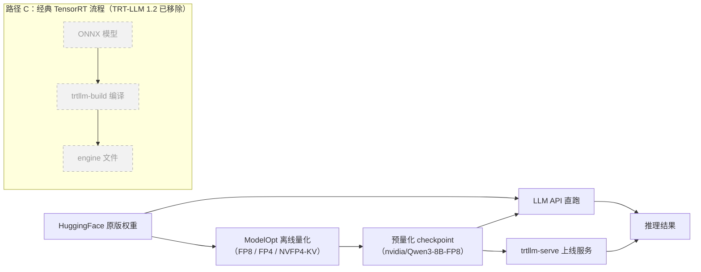
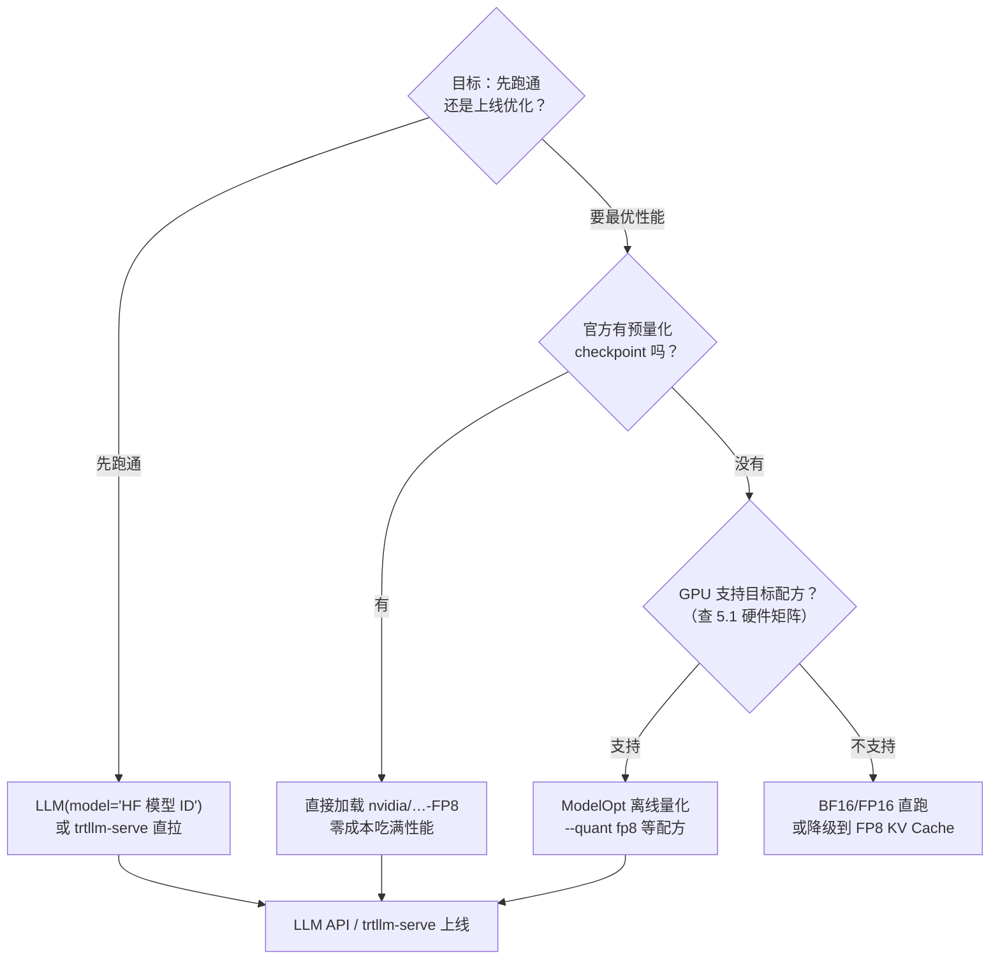

TensorRT-LLM 1.2 的发布说明里有一条加粗的 BREAKING CHANGE：`trtllm-build`、`trtllm-refit`、`trtllm-prune` 三个命令行工具与 `convert_checkpoint.py` 脚本被全部移除，`LLM(backend="tensorrt")` 直接抛 `ValueError`。这意味着**『构建』这个词在 TRT-LLM 里换了含义**——不再是“把 ONNX 设计图离线编译成 engine 文件”，而是“PyTorch 权重直接加载、首次运行时自动优化”。配合 NVIDIA ModelOpt 离线量化（FP8 在 H100 及以上官方宣称性能翻倍、显存减半），一条“从 HuggingFace 权重到可上线推理”的新路径就此成型：7B 模型的权重从 BF16 的 14GB 压到 FP8 的 7GB、FP4 的 3.5GB，而 KV Cache 也能从 32GB 一路降到 8GB。这一篇把这条路径拆开：权重怎么进去、量化发生在哪一步、硬件边界在哪、三条路怎么选。

<!-- more -->

## 📑 目录

- [1. 『构建』这个词，在 TRT-LLM 里换了含义](#1-构建这个词在-trt-llm-里换了含义)
- [2. 加载方式一与二：模型 ID 直拉与本地目录](#2-加载方式一与二模型-id-直拉与本地目录)
- [3. 加载方式三：预量化 checkpoint——官方推荐的性能路径](#3-加载方式三预量化-checkpoint官方推荐的性能路径)
- [4. 量化：从『构建旗标』到『离线量化产物』](#4-量化从构建旗标到离线量化产物)
- [5. 硬件边界：一张卡决定你能上什么配方](#5-硬件边界一张卡决定你能上什么配方)
- [6. 环境与依赖：装对版本再出发](#6-环境与依赖装对版本再出发)
- [7. 三条路怎么选：决策树](#7-三条路怎么选决策树)
- [总结](#-总结)
- [自我检验清单](#-自我检验清单)
- [参考资料](#-参考资料)

---

## 1. 『构建』这个词，在 TRT-LLM 里换了含义

### 1.1 旧世界：ONNX 设计图 → 离线编译 → engine 文件

上一节讲过，经典 TensorRT 是**两段式设计**：构建期把 ONNX 模型离线编译成序列化的 engine（plan）文件，运行期只做反序列化与执行（见[第12章总览](/AIInfraGuide/inference/模块四-推理优化/第12章-tensorrt推理引擎/第12章-tensorrt推理引擎)）。打个比方：ONNX 是汽车设计图，构建器是工厂流水线，engine 是出厂的车——工厂花几十分钟到几小时造一台专用机器，之后每次开车（推理）都毫秒级。

问题随之而来：**这条流水线只为“编译”服务，模型每换一个精度、换一块 GPU，就得重新进厂**。你手里握着的是 PyTorch 权重，却要先导出 ONNX、再编译成 engine——中间任何一步报错，都要回到转换环节排查。

### 1.2 新世界：1.2 版本把构建工具链删了

TensorRT-LLM 的 1.0 版本把 PyTorch 后端设为默认，1.2 版本干脆删掉了整个 TensorRT 后端。官方发布说明把这条 BREAKING CHANGE 写成（译，英文原文见文末[参考资料](#-参考资料)的 Release Notes 链接）：

> **[BREAKING CHANGE] TensorRT backend removed.** PyTorch is now the sole execution backend. `LLM(backend="tensorrt")` now raises a `ValueError`; `TrtLlmArgs`、`tensorrt_llm._tensorrt_engine.LLM`、`trtllm-build` / `trtllm-refit` / `trtllm-prune` CLIs、`--backend tensorrt` CLI choice，以及 per-model 的 `convert_checkpoint.py` 脚本全部移除，`tensorrt` pip 依赖不再安装。

翻译成白话：**TRT-LLM 不再有“构建”这一步了**。加载什么格式、做什么精度、怎么优化，全部由 PyTorch 权重本身和运行时接管。你不再需要先造一台“专用机器”，而是开着现成的车出发——车载系统（PyTorch 运行时）在第一次上路时自动学习你的驾驶习惯（kernel 自动调优、CUDA Graph 固化），把最常用的路径优化掉。映射关系：权重 = 标准车型，首次运行优化 = 自动学习驾驶习惯，之后每次推理 = 直接开车。

💡 **提示**：这不代表 TensorRT 本身被淘汰。经典 TRT 依然是 NVIDIA 非 LLM 推理（CV、BERT 类、多模态编码器）的主力，删掉的只是 TRT-LLM 内部的 TRT 后端。两者分工见本章后续小节。

### 1.3 三条通往推理的路径

把视角拉高，今天“从权重到推理”有三条路径，其中一条已经作废：



- **路径 A**（最省事）：原版权重交给 `LLM` API 直跑；
- **路径 B**（官方推荐性能路径）：先用 ModelOpt 离线量化成预量化 checkpoint，再交给 `LLM` API 或 `trtllm-serve`；
- **路径 C**（灰线）：ONNX → `trtllm-build` → engine，1.2 已删除，只在旧教程里存在。

路径 B 的关键在于：**量化产物依然是 PyTorch checkpoint**，不是 engine——它只是“精度更低的权重”，仍然走路径 A 的加载方式。下面三节分别讲三条路。

---

## 2. 加载方式一与二：模型 ID 直拉与本地目录

### 2.1 方式一：HuggingFace 模型 ID，自动下载

`LLM()` 构造函数接受一个 HuggingFace 模型 ID（仓库名），首次运行自动下载权重：

```python
from tensorrt_llm import LLM

# 传模型 ID，首次运行自动从 HF Hub 拉取权重
llm = LLM(model="TinyLlama/TinyLlama-1.1B-Chat-v1.0")
llm.generate("给我讲一个关于 GPU 的笑话")
```

整个过程和 vLLM 加载模型如出一辙——先看本地缓存，没有就去 Hub 下载。区别在于：**下载完不是直接跑，而是先进运行时做一轮自动优化**（kernel autotune、CUDA Graph 捕获等，以你所用版本为准），第一次生成会明显慢于后续请求。

### 2.2 方式二：本地 HF 目录（离线环境）

生产环境常常没有外网。这时先在有网的机器上手动拉权重，再拷进内网：

```bash
git lfs install
git clone https://huggingface.co/meta-llama/Meta-Llama-3.1-8B
```

然后传给 `LLM()` 一个本地目录路径：

```python
llm = LLM(model="/data/models/Meta-Llama-3.1-8B")
```

⚠️ **注意**：Meta 系模型需要先在 HuggingFace 上同意许可协议并配置 token（`huggingface-cli login`），否则 clone 会 403。这不是 TRT-LLM 的问题，是 HF Hub 的授权机制。

### 2.3 方式一和方式二，本质上是一条路

两种方式对运行时来说没有区别：**输入都是一个标准 HuggingFace 目录**（config.json + safetensors 权重 + tokenizer），一个走下载、一个走本地路径。换句话说，TRT-LLM 1.2 的加载接口只有一种格式，就是“HF checkpoint”本身。这正是和旧世界最大的分水岭——旧流程的输入是 ONNX，新流程的输入是权重目录。

---

## 3. 加载方式三：预量化 checkpoint——官方推荐的性能路径

### 3.1 一条命令起服务：trtllm-serve

如果你要的是上线服务而不是 Python 内推理，`trtllm-serve` 一条命令起一个 OpenAI 兼容服务器：

```bash
# 原版权重：先跑通再说
trtllm-serve "TinyLlama/TinyLlama-1.1B-Chat-v1.0"

# 预量化权重：性能路径（前提是 GPU 支持 FP8）
trtllm-serve "nvidia/Qwen3-8B-FP8"
```

起服务后访问熟悉的 `v1/chat/completions` 端点即可。`nvidia/Qwen3-8B-FP8` 这类模型 ID 是 NVIDIA 官方用 ModelOpt 量化好的权重——**你不用自己动手量化，下载即用**。

### 3.2 这些预量化权重从哪来

NVIDIA 在 HuggingFace 上维护了一个官方收藏集，名字就叫 **“inference-optimized checkpoints with model optimizer”**（https://huggingface.co/collections/nvidia/inference-optimized-checkpoints-with-model-optimizer），里面是各家主流模型（Llama、Qwen、DeepSeek 等）的 FP8、FP4、NVFP4 版本。量化文档里另一个收藏集（“Pre-quantized Models by ModelOpt”）也指向同一批产物。

📌 **关键点**：这些 checkpoint 的格式依然是 HuggingFace 目录，只是权重张量换成了 FP8/FP4 存储 + 配套的缩放因子。加载方式与第 2 节完全一致——`LLM(model="nvidia/Qwen3-8B-FP8")` 即可。**量化发生在加载之前，而不是构建之中**——这句话是本章最重要的认知转换。

---

## 4. 量化：从『构建旗标』到『离线量化产物』

### 4.1 思路转变：量化前移了

旧 TensorRT 流程里，量化是构建期的事：构建旗标（如 `--int8`）加校准数据，在编译阶段把权重和激活压成低精度。TRT-LLM 1.2 没有构建期了，量化随之**前移成独立的离线步骤**——产物是“量化好的 checkpoint”，而不是“量化好的 engine”。

为什么这样做？因为量化本质上是**用精度换显存和带宽**（详见[4.1 量化基础](/AIInfraGuide/inference/模块四-推理优化/第4章-量化/41-量化基础)）：把权重从 16 位降到 8 位或 4 位，模型加载变小、推理时从显存读权重的带宽减半再减半。而“读权重”恰恰是 Decode 阶段的瓶颈（decoder 每生成一个 token 都要把所有权重读一遍），所以量化在推理侧的收益比训练侧更直接。

### 4.2 ModelOpt 实操：两个命令

离线量化工具是 **NVIDIA Model Optimizer（ModelOpt）**，独立于 TRT-LLM 的开源仓库：

```bash
git clone https://github.com/NVIDIA/Model-Optimizer.git
cd Model-Optimizer/examples/llm_ptq

# FP8 量化（PTQ，跑一小段校准数据即可）
scripts/huggingface_example.sh --model <huggingface_model_card> --quant fp8

# FP8 权重/激活 + NVFP4 KV Cache 组合（约束见 5.2 节）
scripts/huggingface_example.sh --model <huggingface_model_card> --quant fp8 --kv_cache_quant nvfp4
```

产出就是带量化参数（scale 因子）的 HF checkpoint，直接能被 `LLM` API 消费。官方支持 FP4 和 FP8 在最新 Blackwell 与 Hopper 上的默认 PyTorch 后端。

### 4.3 官方配方清单：十种量化，三类对象

`features/quantization.md` 列出的全部配方如下，可以按“动谁”分成三类：

| 📊 类别 | 配方 | 一句话直觉 |
|---|---|---|
| 权重 + 激活 | FP4、FP8 Per Tensor、FP8 Block Scaling、FP8 Rowwise | GEMM 两侧都降精度，既省显存又加速计算 |
| 权重 only（INT4） | W4A16 GPTQ、W4A8 GPTQ、W4A16 AWQ、W4A8 AWQ | 只压权重，激活保持 16/8 位（GPTQ/AWQ 见[4.3 节](/AIInfraGuide/inference/模块四-推理优化/第4章-量化/43-weight-only-int4-gptq与awq)） |
| KV Cache | FP8 KV Cache、NVFP4 KV Cache | 只压自回归的 KV 缓存，权重不动 |

命名规则先讲清：**W4A16 = 权重 4 位、激活 16 位**；W4A8 同理。W4A16 这类方案只省权重的显存与读取带宽，激活路径仍是 16 位，所以它对“显存装不下”最有效，对“Decode 慢”的帮助次之——因为 Decode 的带宽消耗大头在权重读取，这正好被 weight-only 压住。

### 4.4 数字账本：量化到底省了多少

先算权重账。7B 模型：

- BF16（16 位）：$7 \times 10^9 \times 2\text{B} \approx 14\text{GB}$
- FP8（8 位）：**7GB**，显存减半
- FP4（4 位）：**3.5GB**，再减半

再算 KV Cache 账。LLaMA-2-7B 配置（32 层、32 头、head_dim=128）、上下文 4096、batch 16、FP16 存储：

$$2 \times 32 \times 32 \times 128 \times 4096 \times 16 \times 2\text{B} \approx 32\text{GB}$$

（2 表示 K 和 V 两份，推导过程见[12.4 §1 为什么 KV Cache 是显存刺客](/AIInfraGuide/inference/模块四-推理优化/第12章-tensorrt推理引擎/124-kv-cache与长上下文#1-为什么-kv-cache-是显存刺客)）换成 FP8 KV Cache 是 16GB，换成 NVFP4 KV Cache 是 8GB。长上下文 + 高并发的场景下，KV Cache 常常比权重还占显存，这就是 KV 量化存在的理由（详见[4.4 KV Cache 量化](/AIInfraGuide/inference/模块四-推理优化/第4章-量化/44-kv-cache量化-kivi)；两个量化入口的完整展开在[12.4 §4 缓存量化](/AIInfraGuide/inference/模块四-推理优化/第12章-tensorrt推理引擎/124-kv-cache与长上下文#4-缓存量化fp8-与-nvfp4)）。

官方 Overview 页面对 FP8 的定性是：**在 H100 及更新 GPU 上，相比 16 位浮点，性能翻倍、显存减半，且对精度影响很小**。注意这是官方宣称，实际收益取决于模型与负载——但“翻倍/减半”这个量级在多数 LLM 上确实成立。FP4 在 Blackwell（B200 等）上有原生支持，配合 NVFP4 格式进一步压缩（格式细节见[4.5 FP8 与 NVFP4](/AIInfraGuide/inference/模块四-推理优化/第4章-量化/45-fp8与nvfp4)）。

---

## 5. 硬件边界：一张卡决定你能上什么配方

### 5.1 硬件支持矩阵

量化配方不是任何卡都能跑——**GPU 架构决定你能用哪套配方**，这有点像手机系统版本：某个 App 要 iOS 18 才能装，你的 iPhone 14 就是装不了。完整矩阵（含 MXFP4 行、逐配方逐架构）见[12.5 §5 量化配方与硬件矩阵](/AIInfraGuide/inference/模块四-推理优化/第12章-tensorrt推理引擎/125-并行量化与高级特性#5-量化配方与硬件矩阵fp8-与-fp4-能上什么卡)，这里只留最常用的三行结论（Y = 支持）：

| 📊 架构 | FP4 | NVFP4 | FP8 权重/激活 | FP8 KV Cache | NVFP4 KV Cache | W4A8/W4A16 |
|---|---|---|---|---|---|---|
| Blackwell sm100/103 | Y | Y | Y | Y | Y | Y |
| Blackwell sm120 | Y | Y | Y（Per Tensor） | Y | — | — |
| Hopper / Ada / Ampere | — | — | Hopper 全配，Ada 仅 Per Tensor，Ampere 无 | Y | — | Hopper/Ada 有，Ampere 仅 W4A16 |

读出三层结论：

1. **FP4 与 NVFP4 是 Blackwell 专属，均覆盖 sm100/103/120**——只有 NVFP4 **KV Cache** 配方限 sm100/103（见 5.2）；
2. **FP8 权重/激活量化需要 Hopper 及以上**——Ada 只有 Per Tensor 一种 FP8 权重方案，Ampere 连 FP8 权重都不行；
3. **FP8 KV Cache 是门槛最低的量化**——Ampere 就能用，这也是老卡上最划算的一招。

⚠️ **注意**：别只看“支持”就上。FP8 Block Scaling 在 sm100/103 上用的是 MXFP8 配方（E4M3 + UE8M0 缩放），与 Hopper 上的 FP8（FP32 缩放）细节不同——同是“FP8”，不同架构的位布局有差异（12.5 §5 有同款提醒）。

### 5.2 KV Cache 量化：两个入口，一条硬约束

KV Cache 量化只有两个入口，规则一句话能说清（完整展开见[12.4 §4 缓存量化：FP8 与 NVFP4](/AIInfraGuide/inference/模块四-推理优化/第12章-tensorrt推理引擎/124-kv-cache与长上下文#4-缓存量化fp8-与-nvfp4)）：

- **FP8 KV Cache 是无需离线重量化即可开启的运行时开关**——即使 checkpoint 本身没量化，`KvCacheConfig(dtype="fp8")` 一行配置就能开，KV Cache 显存减半，代价是 KV 精度从 16 位降到 8 位（对多数模型影响很小，但敏感任务要实测）；
- **NVFP4 KV Cache 必须用 ModelOpt 离线量化，且 `--quant fp8` 是必选项**——NVFP4 格式需要把 scale 信息提前算好写进 checkpoint，没有运行时开关，目前只支持“FP8 权重/激活 + NVFP4 KV Cache”这一种组合（想上 NVFP4，权重也得是 FP8），配方本身限 Blackwell sm100/103。这是官方文档明确写的限制，不是配置技巧。

两者的分工：**FP8 走运行时开关，NVFP4 只能走离线产物**。

---

## 6. 环境与依赖：装对版本再出发

### 6.1 最快安装路径：NGC 容器

官方 Quick Start 给出的最快路径是**直接拉预构建的发布容器（NGC 容器）**（英文原文为 “The quickest option is to pull and run the pre-built release container from NGC”，此处为转述）。TRT-LLM 的依赖链条很长（CUDA、cuBLAS、NCCL、ModelOpt、xgrammar、NIXL……），从源码编译容易踩坑，容器一步到位。安装细节留给 12.1 或后续小节，这里只记结论。

### 6.2 依赖版本清单

1.1 版发布说明的 Infrastructure Changes 列出的关键依赖版本：

| 📊 依赖 | 版本 | 作用 |
|---|---|---|
| PyTorch | 2.9.0+ | 执行后端的本体 |
| NVIDIA ModelOpt | 0.37 | 离线量化工具链 |
| transformers | 4.56.0 | HuggingFace 模型与 tokenizer 解析 |
| xgrammar | 0.1.25 | 结构化输出（JSON Schema 约束解码） |
| NIXL | 0.5.0 | NVIDIA 传输库（跨节点/异构内存数据传输） |

💡 **提示**：依赖版本会随发布节奏更新，以上是 1.1 的基线。动手前先看当前版本发布说明，别拿旧版本号去核对新文档。

---

## 7. 三条路怎么选：决策树

把前面所有内容收拢成一张决策树：



决策规则：

- ✅ **第一次接触 TRT-LLM** → 直接 `LLM(model="TinyLlama/...")` 跑通，别一上来就量化；
- ✅ **要上线且官方有预量化版本** → 直接用 `nvidia/` 开头的 checkpoint，别自己重复造轮子；
- ✅ **官方没有现成量化版、GPU 够新** → ModelOpt 离线量化，配方按硬件矩阵挑；
- ❌ **A100 上别幻想 FP8 权重/激活** → 它只支持 FP8 KV Cache 和 W4A16，硬上会报错或回退；
- ❌ **别为了“显得高级”上 NVFP4 KV Cache** → 它要求权重同步 FP8，且仅 Blackwell sm100/103，约束最重，收益不见得最大。

最后补一句与全站的衔接：三条路径跑起来之后，服务层的组批、KV 管理与解耦，用的还是你在[3.2 nano-vLLM](/AIInfraGuide/inference/模块四-推理优化/第3章-深入vllm/32-nano-vllm源码导读)和[7.2 解耦架构设计](/AIInfraGuide/inference/模块四-推理优化/第7章-pd解耦架构/72-解耦架构设计)里学过的那些机制——TRT-LLM 换的是“权重怎么进来”，而不是“进来之后怎么调度”。

---

## 📝 总结

1. **范式巨变**：TRT-LLM 1.2 删除了 `trtllm-build` / `trtllm-refit` / `trtllm-prune` CLI 与 `convert_checkpoint.py`，`LLM(backend="tensorrt")` 抛 ValueError——PyTorch 是唯一执行后端，经典 TensorRT 的 ONNX→engine 流程在 TRT-LLM 语境下不再适用。
2. **加载接口只有一种**：`LLM()` 构造函数吃 HuggingFace 模型 ID（自动下载）或本地 HF 目录，量化后的 checkpoint 仍是 HF 格式，加载方式不变。
3. **性能路径**：`trtllm-serve "nvidia/Qwen3-8B-FP8"` 一条命令上线官方 ModelOpt 预量化模型，收藏集名为 “inference-optimized checkpoints with model optimizer”。
4. **量化前移**：量化从“构建期旗标”变成“ModelOpt 离线产物”，`--quant fp8` 一条脚本产出可被 LLM API 直接消费的 checkpoint；FP8 在 H100+ 官方宣称性能翻倍、显存减半（7B：14GB→7GB→3.5GB；KV Cache：32GB→16GB→8GB）。
5. **硬件约束**：FP4 与 NVFP4 均为 Blackwell 专属（覆盖 sm100/103/120），只有 NVFP4 KV Cache 配方限 sm100/103；FP8 权重/激活要 Hopper+，FP8 KV Cache 是 Ampere 都能用的最低门槛；NVFP4 KV Cache 必须离线量化且只能配 FP8 权重/激活。

## ⚠️ 常见错误做法

- ❌ **以为 1.2+ 还要“编译 engine”**：把权重转 ONNX → 编 engine 的旧流程照搬。为什么错：1.2 删除了整个构建工具链，HF 权重直接由 PyTorch 后端加载，中间转换步骤不存在了。正确做法：走“HF 权重 →（可选量化）→ PyTorch 后端加载”的新流程（12.2 的路径 A/B）。
- ❌ **量化产物当 engine**：把 AWQ/GPTQ 的 checkpoint 叫“engine”。为什么错：量化产物依然是 PyTorch checkpoint，只是精度更低的权重，不是编译产物；术语混乱会导致部署步骤错误。正确做法：区分 checkpoint（权重）与 engine（旧版编译产物），1.2+ 只有 checkpoint。
- ❌ **模型下载不做缓存管理**：每次启动都从 HF 拉权重。为什么错：70B 权重上百 GB，冷下载 15-30 分钟（社区经验值），K8s 重启就是灾难。正确做法：权重落内部对象存储/PVC，K8s 从内网挂载（10.1 的挂载方案）。
- ❌ **跳过许可协议配置**：Meta 系模型不配 token 直接拉。为什么错：403 报错 + 合规风险。正确做法：先同意协议、配置 `HF_TOKEN`/`huggingface-cli login`（12.2 有具体步骤）。

## 🎯 自我检验清单

- 能解释 TRT-LLM 1.2 移除了哪些构建工具，以及为什么 `LLM(backend="tensorrt")` 会抛 ValueError；
- 能写出 `LLM()` 加载 HuggingFace 模型 ID 与本地目录两种方式的代码，并说明两种方式输入格式相同；
- 能写出 `trtllm-serve` 启动原版权重与预量化权重（`nvidia/Qwen3-8B-FP8`）的命令；
- 能默写 ModelOpt 的 FP8 量化命令（`git clone` → `scripts/huggingface_example.sh --model <card> --quant fp8`）；
- 能背出全部 10 种官方量化配方，并把它们归入“权重+激活 / 权重 only / KV Cache”三类；
- 能解释 W4A16 与 W4A8 命名的含义，并说明 weight-only 方案主要省什么；
- 能给 7B 模型口算权重账本（BF16 14GB、FP8 7GB、FP4 3.5GB），误差不超过 20%；
- 能复算 LLaMA-2-7B 在 ctx 4096、batch 16 下的 KV Cache 账本（FP16 约 32GB）及 FP8/NVFP4 量化后的值；
- 能根据硬件矩阵判断：H100 能跑哪些配方、A100 能跑哪些配方、NVFP4 KV Cache 需要什么硬件；
- 能说出 NVFP4 KV Cache 的两个硬约束（必须 ModelOpt 离线量化、必须搭配 FP8 权重/激活）；
- 能解释 FP8 KV Cache 为什么是运行时开关而 NVFP4 不是；
- 能根据场景（先跑通 / 上线最优 / 离线环境）从三条路径中选出正确的一条。

## 📚 参考资料

**官方文档**
- [TensorRT-LLM Release Notes](https://nvidia.github.io/TensorRT-LLM/release-notes.html)：1.2 的 BREAKING CHANGE 与 1.1 的依赖版本（PyTorch 2.9.0、ModelOpt 0.37 等）
- [TensorRT-LLM LLM API 介绍](https://nvidia.github.io/TensorRT-LLM/llm-api/index.html)：`LLM()` 构造函数的模型 ID 与本地路径两种加载方式
- [TensorRT-LLM Quick Start Guide](https://nvidia.github.io/TensorRT-LLM/quick-start-guide.html)：`trtllm-serve` 一键服务与 NGC 容器安装路径
- [TensorRT-LLM Quantization 文档](https://nvidia.github.io/TensorRT-LLM/features/quantization.html)：十种量化配方、ModelOpt 离线量化命令、硬件支持矩阵
- [TensorRT-LLM Overview](https://nvidia.github.io/TensorRT-LLM/overview.html)：FP8 在 H100+ “性能翻倍、显存减半”的官方表述

**开源项目**
- [NVIDIA/Model-Optimizer](https://github.com/NVIDIA/Model-Optimizer)：离线量化工具，`examples/llm_ptq` 下跑 `huggingface_example.sh`
- [NVIDIA/TensorRT-LLM](https://github.com/NVIDIA/TensorRT-LLM)：TRT-LLM 本体仓库，`docs/source/` 即文档源码

**模型资源**
- [inference-optimized checkpoints with model optimizer（HF 收藏集）](https://huggingface.co/collections/nvidia/inference-optimized-checkpoints-with-model-optimizer)：NVIDIA 官方预量化模型合集（FP8/FP4/NVFP4）
- [Pre-quantized Models by ModelOpt（HF 收藏集）](https://huggingface.co/collections/nvidia/model-optimizer-66aa84f7966b3150262481a4)：量化文档中指向的预量化模型入口
