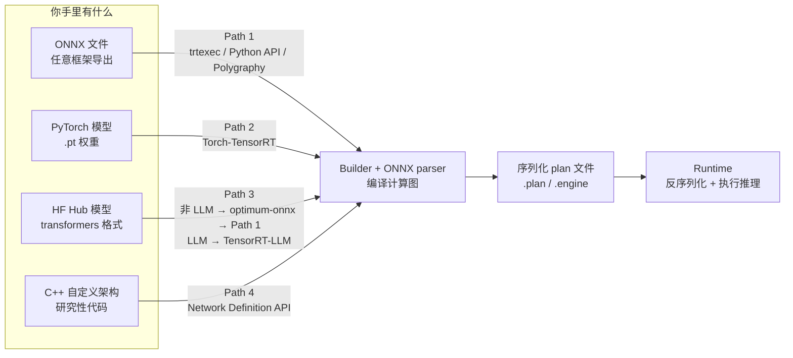
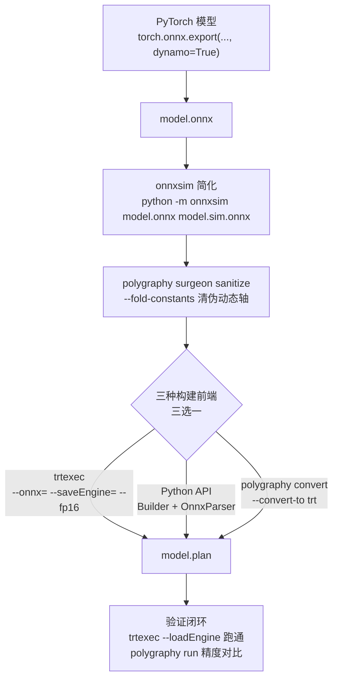

[12.1](/AIInfraGuide/inference/模块四-推理优化/第12章-tensorrt推理引擎/121-tensorrt是什么) 讲过：TensorRT（下称 TRT）是"编译器 + 运行时"的两段式设计，ONNX 文件必须先在离线阶段编译成序列化的 plan 文件，运行时根本不解析 ONNX。那"编译"这一步到底怎么走？官方把答案整理成了一份 Import Workflows 指南（挂在 NVIDIA/TensorRT 仓库的 `documents/import_workflows.md`），核心就一句：**模型进 TRT 有四条官方导入路径——ONNX、Torch-TensorRT、Hugging Face Hub、Network Definition API，终点都是同一个 Builder 产出的 plan 文件**。本文四条路各走一遍，每条讲清"适合谁、官方命令、最常见的坑"，最后给一条 ONNX 到 engine 的最小可运行链路——小模型从 `.pt` 到能跑的 `.plan` 约 5 条命令，构建耗时分钟级（resnet50 官方口径 30-90 秒）。这是 [第 12 章](/AIInfraGuide/inference/模块四-推理优化/第12章-tensorrt推理引擎/第12章-tensorrt推理引擎) 的第三篇：12.1 讲 TRT 是什么，12.2 讲了核心对象与构建流程（运行期 Runtime/Engine/ExecutionContext 三件套也在其中），这一篇解决"模型怎么进去"，下一篇讲精度与量化，12.5 再讲优化原理与插件。

<!-- more -->

## 📑 目录

- [1. 为什么需要导入路径：四个入口，一个终点](#1-为什么需要导入路径四个入口一个终点)
- [2. 选型表：你手里有什么，就走哪条路](#2-选型表你手里有什么就走哪条路)
- [3. Path 1：ONNX 到 TensorRT，最可移植](#3-path-1onnx-到-tensorrt最可移植)
- [4. Path 2：Torch-TensorRT，PyTorch 原生](#4-path-2torch-tensorrtpytorch-原生)
- [5. Path 3：Hugging Face Hub 模型](#5-path-3hugging-face-hub-模型)
- [6. Path 4：Network Definition API，最大控制](#6-path-4network-definition-api最大控制)
- [7. AI 辅助改写导出：Qwen-Image 的五步套路](#7-ai-辅助改写导出qwen-image-的五步套路)
- [8. 验证闭环：跑通、精度、逐 token 对比](#8-验证闭环跑通精度逐-token-对比)
- [9. 权衡与落成一句话](#9-权衡与落成一句话)
- [总结](#-总结)
- [自我检验清单](#-自我检验清单)
- [参考资料](#-参考资料)

---

## 1. 为什么需要导入路径：四个入口，一个终点

先问一个问题：**为什么"导入"需要专门讲，模型文件直接丢给 TRT 不就行了？** 因为 TRT 的输入格式只有一种：它自己的网络定义（或者 ONNX 这种它能解析的中间格式），而你的模型活在 PyTorch、TensorFlow、Hugging Face、甚至 C++ 手写的自定义架构里。**导入路径（import path）就是"把你手里的模型形态，翻译成 TRT 能编译的形态"的那条通道。** 选错路径不会报错，但会让你多写几百行胶水代码——所以官方文档用一整份指南来讲选型。

打个比方：把模型想象成一件货物，TRT 是一座编译器工厂，四条导入路径就是四条进厂传送带——**ONNX 是标准集装箱**（任何框架都能打包，工厂认箱不认货）；**Torch-TensorRT 是厂内直通车**（模型本来就在 PyTorch 里，不用打包）；**Hugging Face Hub 是现成货架**（取下来即可）；**Network Definition API 是手工拧零件**（逐层手搓）。四条传送带终点相同：**Builder 把计算图编译成序列化 plan 文件（`.plan` / `.engine`），运行时反序列化执行**。



plan 文件是什么？**它是编译的最终产物，像一份精确到 kernel 的施工图**：每层用哪个 kernel、按什么顺序启动、显存怎么分配，全部固化在文件里。代价是**plan 不跨设备移植**——它绑定编译时的 GPU 计算能力（compute capability），换架构就得重编译，[官方指南](https://github.com/NVIDIA/TensorRT/blob/main/documents/import_workflows.md) 把它列为第一号坑。

## 2. 选型表：你手里有什么，就走哪条路

选型逻辑很简单：**你的模型现在是什么形态，就决定了第一条可走的路**。官方指南开头就给了这张决策表，这里压缩成维度对比：

| 📊 维度 | Path 1：ONNX | Path 2：Torch-TensorRT | Path 3：HF Hub | Path 4：Network API |
|---|---|---|---|---|
| 入口 | 任意框架导出的 `.onnx` | PyTorch 模型对象 | HF Hub 上的现成权重 | C++/自定义架构 |
| 上手成本 | 中（多一步导出） | **最低**（留在 PyTorch 里） | 低（非 LLM） | **最高**（逐层搭图） |
| 控制力 | 中 | 中 | 低 | **最大**（层选择、精度、形状全手控） |
| 官方定位 | **最可移植** | 上手最快、迭代开发友好 | 非 LLM 走导出；LLM 走 TensorRT-LLM | 最后手段 |
| 典型产物 | `.plan` | `.ep`（AOT）或内存对象（JIT） | `.plan` / TensorRT-LLM engine | `.plan` |

📌 **关键点**：这张表里最反直觉的是 Path 3——**它不是一条独立路径，而是"取货 + 借道"**：HF 模型要么导成 ONNX 借 Path 1 的道，要么直接上 TensorRT-LLM，只有这两种正规走法，官方对它的定位是"模型来源"而非"独立构建方式"。另一个易误会点：Path 1 里的 `trtexec`、Python API（`tensorrt.Builder` + `OnnxParser`）、`polygraphy convert` 三种构建方式**不是三条路径，而是同一个 `IBuilder` + `nvonnxparser::IParser` 的三个前端**，差别只在包装层——trtexec 适合快速试跑，Python API 适合嵌进构建脚本，Polygraphy 适合自动化流水线（还能顺便做精度对比，见第 8 节）。选哪个取决于工作流，不取决于模型。

## 3. Path 1：ONNX 到 TensorRT，最可移植

### 3.1 先认清红线：ONNX 兼容性

为什么先讲红线？因为 **Path 1 最大的坑不在构建，而在"你的 ONNX 文件 TRT 认不认"**。

**TensorRT 不支持全部 ONNX 算子，也不支持全部 opset 版本，覆盖范围随 TRT 版本变化。** 官方 Opset 指南（[ONNX Opset Guide](https://docs.nvidia.com/deeplearning/tensorrt/latest/reference/onnx-opset-guide.html)）给的 11.x 口径：ONNX 解析包 1.20.0，**最大支持 opset 25，官方向后兼容的最低 opset 是 9**，算子级覆盖查官方清单（`ONNX-TensorRT operators.md`）。所以**不能假设"能导出 = 能进 TRT"**，验证手段只有一个：用 `trtexec` 或 Polygraphy 实际解析一遍。

那导出的 ONNX 解析失败时怎么办？官方给了三选一的处理顺序：

1. **升级 exporter 或 opset**：多数是导出工具太老，新版 `torch.onnx.export` 或更高 `--opset` 就解决了；
2. **改写不支持的子图**：用 ONNX-GraphSurgeon 等工具换成等价的支持形式；
3. **写自定义插件**：仍不行就给这个算子写 TRT 插件（详见第 6.1 节）。

⚠️ **注意**：如果你看到网上说"TensorRT 能直接执行 ONNX"，那说的是 **ONNX Runtime 的 `TensorrtExecutionProvider`**——它在首次调用时于内部惰性构建 TRT engine，是 ORT 在集成 TRT，不是 TRT 运行时在解析 ONNX；TRT 运行时本身永远只吃 plan 文件。

### 3.2 导出：PyTorch 用 dynamo，TF 用 tf2onnx

官方对导出的建议就一句：**导出到你 exporter 支持的最新 opset，然后用 trtexec 验证导入**。具体到框架：

```python
# PyTorch:TRT 11+ 官方优先推荐 dynamo exporter
torch.onnx.export(
    MyModel().eval().cuda(),
    (torch.randn(1, 3, 224, 224, device="cuda"),),
    "model.onnx",
    dynamo=True,           # 关键:启用 dynamo exporter(TRT 11+ 推荐)
    dynamic_shapes=None,   # 动态形状时传 torch.export.Dim 的字典
)
```

```bash
# TensorFlow / Keras:用 tf2onnx,显式指定 opset
python -m tf2onnx.convert --saved-model ./saved_model --output model.onnx --opset 20
```

💡 **提示**：`dynamo=True` 是 PyTorch 2.x 新导出器（走 `torch.export` 图捕获，比老 tracing 更能保留动态形状语义）；官方建议导出到 exporter 支持的最新 opset，parser 处理新算子语义更不容易出边界问题。

### 3.3 简化与清理：两行命令去掉一半坑

导出完别急着构建，先做两步清理——这一步能消掉一大半"形状推断失败"类报错，原理是：导出器为了保真常留下大量常量子图和多余 reshape/transpose，`--fold-constants` 把编译期能算完的常量直接算掉。**官方明确指出：导出时产生的伪动态轴（spurious dynamic axes）经常靠这一步就被清掉**——不清理的话，TRT 会把静态维度当动态处理，构建变慢甚至失败。

```bash
pip install onnx onnxsim polygraphy

# 第 1 步:onnxsim 图简化(常量折叠、删冗余节点);第 2 步:polygraphy surgeon 清理
python -m onnxsim model.onnx model.sim.onnx
polygraphy surgeon sanitize model.sim.onnx -o model.clean.onnx --fold-constants
```

### 3.4 构建：三选一，给你最小可运行代码

三选一，先看最简单的 `trtexec`（官方 Build Your First Engine 用的就是它，resnet50 构建 30-90 秒）：

```bash
# 方案 A:trtexec(CLI,最快试跑)
trtexec --onnx=model.clean.onnx --saveEngine=model.plan \
  --memPoolSize=workspace:4096 --fp16   # FP16;另有 --bf16/--int8/--fp8(依赖硬件)
```

动态形状（batch 或序列长度不固定）加官方要求的 min/opt/max 三件套：

```bash
  --minShapes=input:1x3x224x224 --optShapes=input:8x3x224x224 \
  --maxShapes=input:16x3x224x224
```

```python
# 方案 B:Python API(骨架;逐行带注释的完整版见 12.2 第 3 节,同一套代码,本节只多了 FP16 旗标)
import tensorrt as trt
logger = trt.Logger(trt.Logger.WARNING)          # ① 先建 Logger
builder = trt.Builder(logger)                    # ② Builder = 编译总指挥
network = builder.create_network(1 << int(trt.NetworkDefinitionCreationFlag.STRONGLY_TYPED))  # ③ 强类型网络
parser = trt.OnnxParser(network, logger)         # ④ OnnxParser 解析 .onnx
with open("model.clean.onnx", "rb") as f:
    assert parser.parse(f.read()), \
        [parser.get_error(i) for i in range(parser.num_errors)]  # 失败时打印错误列表
config = builder.create_builder_config()         # ⑤ 构建配置:workspace 4GB + FP16
config.set_memory_pool_limit(trt.MemoryPoolType.WORKSPACE, 4 << 30)
config.set_flag(trt.BuilderFlag.FP16)
serialized = builder.build_serialized_network(network, config)  # ⑥ 编译 + 序列化一步出 .plan
with open("model.plan", "wb") as f:
    f.write(serialized)
```

> 📎 逐行注释的完整版（含 STRONGLY_TYPED 的准确含义：每个 tensor 的数据类型由输入类型和算子类型规范推断，而非构建器猜测）见 [12.2 第 3 节](/AIInfraGuide/inference/模块四-推理优化/第12章-tensorrt推理引擎/122-trt核心对象与构建流程)，本节不再重复。

```bash
# 方案 C:Polygraphy convert(适合自动化流水线,参数与 trtexec 一一对应)
polygraphy convert model.clean.onnx --convert-to trt --fp16 --workspace 4G \
  --trt-min-shapes input:[1,3,224,224] --trt-opt-shapes input:[8,3,224,224] \
  --trt-max-shapes input:[16,3,224,224] -o model.plan
```

代码要点：**①** `Builder` 建空白网络；**②** `OnnxParser` 解析，`parse()` 返回 `False` 时用 `get_error()` 看错误列表；**③** `build_serialized_network` 一步"编译 + 序列化"出 `.plan`。C++ 用户看仓库 `samples/sampleOnnxMNIST/`。

### 3.5 常见坑清单：症状、诊断、处理

官方把高频坑整理成了固定套路，这里转成"症状-诊断-方案"表：

| 症状 | 诊断方法 | 处理方案 |
|---|---|---|
| 构建报"不支持的算子" | `trtexec` 报错会**点名**具体算子 | 升级 exporter/opset → 改写子图 → 写插件（三选一） |
| shape 推断失败 | `polygraphy inspect model model.onnx --show attrs` 检查每个 tensor 是否有已知 rank | 回到 3.3 做 sanitize + 常量折叠，多数伪动态轴在此消失 |
| INT64 张量警告 | TRT 不支持 INT64，会警告并**强转 INT32** | 值超出 INT32 范围时，必须在导出/清理阶段先处理，别等运行时 |
| 构建期 OOM | 构建比推理更吃显存/内存 | 调低 `--memPoolSize=workspace:N`，或 `--tacticSources=-CUBLAS_LT` 禁用多余 kernel 搜索源 |
| 首次推理特别慢 | CUDA kernel 的 JIT 编译 + plan 反序列化是一次性成本 | 计时前先 warm up ≥3 次迭代（官方建议） |

### 3.6 最小全流程：一条命令链走完

把上面各环节串起来，就是 Path 1 的完整最小流程（每个阶段标注官方命令）：



## 4. Path 2：Torch-TensorRT，PyTorch 原生

如果模型是 PyTorch 训练的、迭代频繁、不想维护 ONNX 导出链路——走 Path 2。Torch-TensorRT 是 NVIDIA 的 PyTorch 编译后端，**官方明确标注 Dynamo 前端（`torch.compile`）是活跃且优先推荐的路**，老的 JIT/tracing 式 `torch_tensorrt.compile` 仍能用但已不再有新投入。

### 4.1 JIT：一行 `torch.compile`，首次调用触发编译

```python
import torch
import torch_tensorrt  # 导入即注册 TRT 后端

compiled = torch.compile(model, backend="tensorrt",
                         options={"enabled_precisions": {torch.float16}})
out = compiled(example)   # 首次调用触发 TRT 编译,结果自动缓存
```

这就是 JIT：**首次调用才编译，结果被缓存，之后直接跑**，上手成本四条路最低。注意 `backend` 名：官方源码同时注册了 `"tensorrt"` 和 `"torch_tensorrt"` 两个别名（[backends.py](https://github.com/pytorch/TensorRT/blob/main/py/torch_tensorrt/dynamo/backend/backends.py)），以你所用版本为准。

### 4.2 AOT：`torch.export` + `.ep` 文件

生产环境通常要"编译一次、部署多处"，那就用 AOT（Ahead-Of-Time，提前编译）模式：

```python
import torch
import torch_tensorrt as torch_trt
model = MyModel().eval().cuda().to(torch.float16)
example = torch.randn(1, 3, 224, 224, device="cuda", dtype=torch.float16)

trt_gm = torch_trt.dynamo.compile(
    torch.export.export(model, (example,)),   # 先 torch.export 得到 ExportedProgram
    inputs=[example], enabled_precisions={torch.float16}, workspace_size=4 << 30,
)
torch_trt.save(trt_gm, "model.ep", inputs=[example])  # 保存产物
loaded = torch.export.load("model.ep").module()       # 部署侧加载
```

**AOT 与 JIT 的核心区别在产物**：JIT 的编译结果留在进程内存，AOT 序列化成 `.ep` 文件（ExportedProgram 格式），可保存、分发、离线加载——与 Path 1 的 `.plan` 同一角色。

### 4.3 两个绕不开的坑：图打断和动态形状

- **图打断（graph break）**：`torch.compile` 遇到编译不了的代码段（Python 条件分支、`.item()`、数据依赖控制流），会**打断图退回 eager 模式**——不报错但那段代码没加速。排查用 `TORCH_LOGS="graph_breaks"`；修法三件套：条件判断提升到图外、避免 `.item()`、能用 `torch.cond` 就用。
- **AOT 动态形状要显式标注**：JIT 模式会自动按遇到的形状重编译；AOT 想支持动态形状，必须在 `torch.export` 时用 `torch.export.Dim(...)` 显式声明哪些维度可变，否则导出的就是静态形状。

💡 **提示**：如果你要写自定义算子转换器，Torch-TensorRT 的转换器源码在官方仓库的 `core/conversion/converters/` 目录，贡献指南在 [Writing Converters](https://docs.pytorch.org/TensorRT/contributors/writing_converters.html)。

## 5. Path 3：Hugging Face Hub 模型

从 HF Hub 拿模型，**先分两叉：生成式 LLM，还是非 LLM**。

- **非 LLM（encoder、视觉、扩散组件、语音）→ 导出成 ONNX，借道 Path 1**。这是官方推荐默认走法，工具是 `optimum` 的 ONNX 导出器（注意新版 ONNX 集成已独立成 `optimum-onnx` 包）：

```bash
pip install optimum-onnx

optimum-cli export onnx \
  --model google-bert/bert-base-uncased \
  --task feature-extraction \
  bert_onnx/
trtexec --onnx=bert_onnx/model.onnx --saveEngine=bert.plan --fp16
```

  这条路官方原话是"最 durable"：依赖的 `optimum-onnx` 和 `trtexec` 都是活跃维护组件。

- **LLM 生成 → 直接上 TensorRT-LLM**。它是 NVIDIA 面向 HF 系 LLM 的生产级路径，KV Cache、batching、paged attention、FP8/INT4 量化、投机解码、多卡张量/流水并行全部内置，官方原文强调 "use TensorRT-LLM directly"。

⚠️ **注意**：`optimum-nvidia` 包装器（`AutoModelForCausalLM.from_pretrained` 一行加载 TRT）最后一个版本停在 **v0.1.0b9（2025-01-21）**，此后无新 release，官方明确不推荐新项目。

另外两个 HF 生态特有的坑：**① tokenizer 填充方向**——HF 默认右填充，部分 decoder 模型生成需要左填充，填反了 logits 会"静默地错"；**② 扩散模型按组件拆**——text encoder、UNet/DiT、VAE 分开导入，TRT 吞不下整条 pipeline。

## 6. Path 4：Network Definition API，最大控制

什么时候才轮到它？**当 ONNX 和 PyTorch 都表达不了你的需求**——自定义研究架构、需要对手搭层做极限控制。这是最大控制、最大工作量的路：没有导出器、没有 parser，直接在 `network` 上逐层手搭（下面这段代码完整可跑，动态形状也在里面）：

```python
# 最小示例:手搭一个卷积层(官方示例的简化版)
import numpy as np
import tensorrt as trt

logger = trt.Logger(trt.Logger.WARNING)
builder = trt.Builder(logger)
network = builder.create_network(1 << int(trt.NetworkDefinitionCreationFlag.STRONGLY_TYPED))

x = network.add_input("x", trt.float16, (-1, 3, 224, 224))   # -1 = 动态维度
w = trt.Weights(np.random.randn(64, 3, 7, 7).astype(np.float16))
conv = network.add_convolution_nd(x, 64, (7, 7), w, trt.Weights())
conv.stride_nd = (2, 2)
network.mark_output(conv.get_output(0))

config = builder.create_builder_config()
profile = builder.create_optimization_profile()   # 动态形状三件套
profile.set_shape("x", (1, 3, 224, 224), (8, 3, 224, 224), (16, 3, 224, 224))
config.add_optimization_profile(profile)

plan = builder.build_serialized_network(network, config)
open("model.plan", "wb").write(plan)
```

注意最后一步：动态形状必须配 `optimization_profile` 的 min/opt/max 三件套——和 Path 1 的 `--minShapes/--optShapes/--maxShapes` 是同一件事，这里由你手写。C++ 版本结构相同，参考 `samples/sampleINT8API` 与 `samples/python/refactored/2_construct_network_with_layer_apis/`。

### 6.1 自定义算子：三选一的最后手段

第 3.1 节说的"三选一"最后一项是写插件（plugin）：先查 `tensorrt.IPluginRegistry` 有没有现成插件，没有就用 TRT 10+ 的 **`IPluginV3`** 接口写一个（旧 V2 已废弃），注册后把 ONNX 算子命名为 `mydomain::MyPlugin` 与插件名对应，parser 就能找到它。注册机制、V3 能力面、接线细节与可跑样例 `samples/python/aliased_io_plugin/` 的完整展开见 [12.5 第 4 节](/AIInfraGuide/inference/模块四-推理优化/第12章-tensorrt推理引擎/125-优化原理与自定义算子)。

## 7. AI 辅助改写导出：Qwen-Image 的五步套路

前面说过"改写不支持的子图"——现代模型代码里的复数运算、数据依赖控制流、非张量参数、变长输出，`torch.export` 和 ONNX 导出器都 trace 不了。**官方文档给了个非常 2026 年的答案：这种活正好交给 AI 编程 agent 干**，实战案例是 Qwen-Image（diffusers）→ Torch-TensorRT AOT，五个典型阻塞点各代表一类问题：

| # | 阻塞模式 | 修法套路 |
|---|---|---|
| 1 | 复数 RoPE：`torch.complex64` buffer + `view_as_real`，TRT 的复数图检测直接崩 | **预先算好实数 cos/sin buffer，但保留原始 buffer**——exporter 探测时会读它，不能覆盖 |
| 2 | 非张量 forward 参数（如 `img_shapes` 这种 list 结构） | 包一层 wrapper，把非张量参数收进构造参数，forward 签名只剩纯张量 |
| 3 | HF 风格输出 dataclass（`Transformer2DModelOutput(sample=...)`） | **导出时解包成裸张量（`*AOTWrapper`），回插时用 `Compiled*Proxy` 重新包好**，pipeline 其余代码无感知 |
| 4 | 变长 tokenization：按 attention mask 逐样本切片，长度不定 | monkey-patch 管线方法，固定成编译时的静态 `[B, S]` 形状 |
| 5 | 整条 pipeline 编译超单卡工作集 | `enable_resource_partitioning=True` + `cpu_memory_budget` 提示资源划分器 |

这套案例沉淀成五条可复用的套路，官方原文叫 pattern takeaways：

1. **先裸跑一次导出**，让 tracer 报错，错误里点名的不支持模式就是你要 patch 的目标；
2. **在运行时 monkey-patch，不 fork 上游库**——导出脚本里临时替换模块方法，磁盘上的 diffusers/transformers 一行不动；
3. **"Wrap for the exporter; proxy for the pipeline"**——给导出器看的 wrapper 返回裸张量，给管线看的 proxy 把输出重新包回 dataclass 并保留下游要读的一切属性（`config`、`dtype`、`device` 等）；
4. **保留未被观测的约束**：exporter 会探测的 buffer 不要覆盖，另存实数副本并行存在；每个阻塞点一两轮"读源码 → 定位 → patch"就能解决，让 agent 在循环里迭代，你只审查 diff。

最终结果：三个重组件（text encoder、MMDiT transformer、VAE decoder）全部跑在 Torch-TensorRT 上，**安装的 diffusers/transformers/torch_tensorrt 零改动**，固定种子下输出与 eager pipeline 一致——这就是第 3.1 节"改写子图"在现代模型上的标准作业程序。

## 8. 验证闭环：跑通、精度、逐 token 对比

engine 构建完，离"能用"还差一个验证闭环，官方给了三级递进：

**第一级：跑通 + 性能冒烟。** 加载 plan 并指定输入形状跑一次，`trtexec` 同时输出吞吐、延迟与每层 kernel 耗时：

```bash
trtexec --loadEngine=model.plan --shapes=input:1x3x224x224 --verbose
```

**第二级：精度对比。** 拿 ONNX 原始模型当基准，TRT engine 与 ONNX Runtime 同输入对比输出：

```bash
polygraphy run model.onnx --trt --onnxrt \
  --atol 1e-3 --rtol 1e-3 --input-shapes input:[1,3,224,224]
```

`--atol/--rtol` 是绝对/相对误差阈值，超标逐个输出点报出来——**这是定位精度问题的第一现场**。FP16 发散时，官方建议 `--stronglyTyped` + 对问题子图显式 FP32 逐步缩小范围（Polygraphy 侧旗标；trtexec 同名旗标在 11.x 已是向后兼容的 no-op，见 12.2 第 2.3 节）。

**第三级：LLM 场景。** 生成任务没法用逐点误差，官方建议**固定随机种子，逐 token 对比参考实现**——同 prompt 同 seed 下生成序列应与参考完全一致（或仅在可接受容差内），trust 新 engine 之前不能省。

## 9. 权衡与落成一句话

- **Path 1（ONNX）**：牺牲导出环节的一次性适配，换取**框架无关的最大可移植性**——今天 PyTorch 导出，明天 JAX 训练完照样走这条道；
- **Path 2（Torch-TensorRT）**：牺牲"与 PyTorch 生态绑定、图内是黑盒"，换取**最低上手成本与最快迭代**——改模型后重新编译的摩擦最小；
- **Path 3（HF Hub）**：牺牲"对模型来源的依赖"，换取**现成模型即取即用**——但它永远只是"取货通道"，构建还得借道 Path 1 或 TensorRT-LLM；
- **Path 4（Network API）**：牺牲**最大工作量**（逐层手搭），换取**最大控制**——只有 ONNX/PyTorch 表达不了时才值得。

落成一句话的规则：

- ✅ **手里有 ONNX 文件** → 走 Path 1，`trtexec` 三行命令出 plan；
- ✅ **PyTorch 模型、迭代快、想留在 PyTorch** → 走 Path 2，先 `torch.compile` JIT，要分发再上 AOT；
- ✅ **HF 非 LLM** → `optimum-cli export onnx` 后并入 Path 1；**HF LLM** → 直接 TensorRT-LLM，别碰停更的 optimum-nvidia；
- ✅ **自定义架构/C++** → 走 Path 4，动态形状记得配 min/opt/max profile；
- ❌ **任何路径构建完不做验证就上线**——`trtexec --loadEngine` 跑通 + `polygraphy run` 精度对比是底线，LLM 再加固定种子逐 token 对比。

## 📝 总结

1. **四条路径**：ONNX（最可移植）/ Torch-TensorRT（PyTorch 原生、上手最快）/ HF Hub（取货通道，非 LLM 借道 Path 1、LLM 直接 TensorRT-LLM）/ Network Definition API（最大控制、最大工作量），终点都是 Builder 产出的 plan 文件；
2. **ONNX 红线**：TRT 不支持全部算子与 opset（11.x 口径：最大 opset 25、最低官方支持 9），必须用 trtexec/Polygraphy 验证，失败三选一——升级 exporter/opset、改写子图、写插件；
3. **最小链路**：`torch.onnx.export(dynamo=True)` → `onnxsim` + `polygraphy surgeon sanitize --fold-constants` → 三种构建前端三选一 → `.plan` → 验证闭环，全程约 5 条命令、构建分钟级（resnet50 官方口径 30-90 秒）；
4. **验证闭环**：`trtexec --loadEngine` 跑通 → `polygraphy run --trt --onnxrt --atol 1e-3` 精度对比 → LLM 固定种子逐 token 对比，三级缺一不可。

## 🎯 自我检验清单

- 能解释四条官方导入路径各自的入口、产物与官方定位，并说出"为什么 Path 3 不是独立构建方式"；
- 能说出 TRT 11.x 的 ONNX opset 支持口径（最大 25、官方最低 9）和"算子覆盖随版本变化"的含义；
- 能写出 Path 1 最小链路：`torch.onnx.export(..., dynamo=True)`、`onnxsim`、`polygraphy surgeon sanitize --fold-constants`、三种构建前端各一条命令，并解释三者为何是"同一个 Builder 的三个前端"；
- 能根据报错症状给出诊断：不支持的算子、shape 推断失败、INT64 强转、伪动态轴分别怎么查、怎么处理；
- 能写出 Python API 构建的最小代码（Builder → create_network → OnnxParser → build_serialized_network），并解释 `STRONGLY_TYPED` 的作用；
- 能区分 Torch-TensorRT 的 JIT 与 AOT：各自产物是什么（内存缓存 vs `.ep` 文件）、各自的首选 API；
- 能使用 `TORCH_LOGS="graph_breaks"` 排查图打断，并说出 AOT 动态形状需要 `torch.export.Dim` 显式标注；
- 能说出 HF 模型的正确走法（非 LLM → optimum-onnx → Path 1；LLM → TensorRT-LLM），并解释为什么不推荐 optimum-nvidia（v0.1.0b9 后停更）；
- 能写出三级验证闭环的三条命令/方法，并解释 `--atol/--rtol` 的意义；
- 能回答"plan 文件为什么不能跨设备移植"（与 12.1 的两段式设计呼应）。

## 📚 参考资料

**官方文档**
- [TensorRT Import Workflows Guide](https://github.com/NVIDIA/TensorRT/blob/main/documents/import_workflows.md)：本文核心依据，四条导入路径的官方逐步指南（NVIDIA/TensorRT 仓库 README 直接推荐）
- [ONNX Opset Guide](https://docs.nvidia.com/deeplearning/tensorrt/latest/reference/onnx-opset-guide.html)：TRT 11.x 的 ONNX opset 支持口径（最大 25、最低 9）与导出建议
- [Build Your First Engine](https://docs.nvidia.com/deeplearning/tensorrt/latest/getting-started/build-your-first-engine.html)：`trtexec --onnx= --saveEngine=` 官方入门，含 30-90 秒构建耗时口径
- [TensorRT Backend for torch.compile](https://pytorch.org/TensorRT/user_guide/compilation/torch_compile.html)：Torch-TensorRT Dynamo 前端的官方指南（JIT/AOT/动态形状）

**开源项目**
- [NVIDIA/TensorRT 仓库](https://github.com/NVIDIA/TensorRT)：OSS 组件（ONNX parser、插件、samples），`documents/` 下有 import_workflows 与 supported_models，`tools/Polygraphy` 下有 Polygraphy
- [pytorch/TensorRT 仓库](https://github.com/pytorch/TensorRT)：Torch-TensorRT 源码，转换器在 `core/conversion/converters/`，torch.compile 后端注册名见 `py/torch_tensorrt/dynamo/backend/backends.py`
- [NVIDIA/TensorRT-LLM](https://github.com/NVIDIA/TensorRT-LLM)：HF 系 LLM 生成的生产级路径（KV Cache、paged attention、量化、多卡并行）

**教程**
- [onnxsim](https://github.com/daquexian/onnx-simplifier)：ONNX 图简化工具（`python -m onnxsim`）
- [optimum-onnx](https://github.com/huggingface/optimum-onnx)：HF 模型的 ONNX 导出器（`optimum-cli export onnx`）
