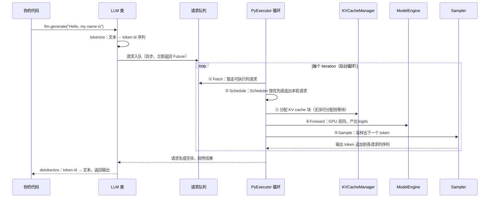
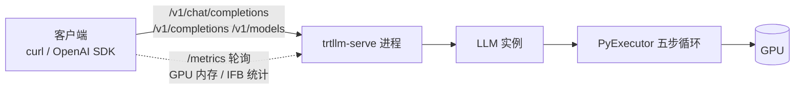

上一篇 [12.2](/AIInfraGuide/inference/模块四-推理优化/第12章-tensorrt推理引擎/122-从权重到引擎模型加载量化与构建) 讲的是「构建期」：把模型编译成 engine。本篇切换视角到**运行期**——engine 造出来之后，怎么在 GPU 上持续运转、怎么对外提供服务、怎么把一批请求调度得又快又满。核心就三件事：**LLM 类一行代码封装整个推理流程，背后是每个 rank 一个的 PyExecutor 后台循环；trtllm-serve 一条命令把引擎变成 OpenAI 兼容服务；In-flight Batching（IFB）让 context 与 generation 请求混批执行，配 CUDA Graph 与 Overlap Scheduler 两个运行时优化，官方宣称部分模型上端到端吞吐最高提升 22%**。看懂这一篇，你就掌握了 TensorRT-LLM 从“能跑”到“能服务”的全部关节。

<!-- more -->

## 📑 目录

- [1. 从 generate() 到 PyExecutor：一条请求的内部旅程](#1-从-generate-到-pyexecutor一条请求的内部旅程)
- [2. 运行时优化：CUDA Graph 与 Overlap Scheduler](#2-运行时优化cuda-graph-与-overlap-scheduler)
- [3. trtllm-serve：把引擎变成 OpenAI 兼容服务](#3-trtllm-serve把引擎变成-openai-兼容服务)
- [4. In-flight Batching 调度器：三个参数与一个优先级](#4-in-flight-batching-调度器三个参数与一个优先级)
- [5. 权衡与选型：混批、分块与解耦](#5-权衡与选型混批分块与解耦)
- [总结](#-总结)
- [自我检验清单](#-自我检验清单)
- [参考资料](#-参考资料)

---

## 1. 从 generate() 到 PyExecutor：一条请求的内部旅程

### 1.1 为什么需要运行时抽象

假设你已经按 12.2 的流程拿到了一个构建好的 engine，接下来要处理一条用户请求。裸用 engine 意味着你要自己管多少事？**文本要切成 token（tokenize）、token 要排队组 batch、每个请求的 KV cache 要分配与回收、模型要反复前向、logits 要采样成下一个 token、输出还要拼回文本（detokenize）**。这些环节你写第一版服务时全都要自己实现——而 TensorRT-LLM 的答案是：**别自己造，用 `LLM` 类**。

`LLM` 类是 TensorRT-LLM 的核心入口（core entry point），它对外只暴露一个简化的 `generate()` 接口，官方文档用 TinyLlama 演示了最简用法：

```python
from tensorrt_llm import LLM

# 初始化：模型名（HF 仓库名或本地目录）即可，不用手写任何 engine 加载代码
llm = LLM(model="TinyLlama/TinyLlama-1.1B-Chat-v1.0")

# 生成：传字符串，拿回字符串
output = llm.generate("Hello, my name is")
```

`LLM` 类自动管理所有前后处理：**tokenize（把输入 prompt 编码成数值 id）和 detokenize（把模型输出解码回人类可读文本）都不需要你插手**。打个比方：你只负责按下快门，自动对焦、曝光、成像全是相机的事——你拿到的一定是照片（文本），而不是中间胶卷（token 序列）。

🔑 **核心概念**：`LLM` 构造器内部会在**每个 rank 上创建一个独立的 `PyExecutor(Worker)` 进程**。rank 就是分布式部署里的一张卡对应一个进程（比如 `--tp_size 4` 就有 4 个 worker 进程协同工作），每个 worker 都在自己的进程里跑一个永不停止的后台循环。

### 1.2 PyExecutor 后台循环：五个工位转不停

为什么需要“后台循环”而不是“来一个请求处理一个”？因为推理服务是**高并发、持续到达**的：请求随时进来，处理需要几百毫秒到几秒，一次只处理一个会让 GPU 大部分时间空转。PyExecutor 的做法是让一个循环永远在转，每转一圈就**尽可能多地处理一批请求**。

想象一个快递中转站：收件、分拣、装车、运输、派送五个工位连成一条流水线，包裹（请求）源源不断进来，流水线每转一圈就有一批包裹前进一格。PyExecutor 的每个 iteration 也是固定的五个动作：

```python
# 伪代码：PyExecutor 后台循环主干（非逐字源码，理解原理的示意）
while True:
    requests = self._fetch_requests()        # ① 取请求：从内部请求队列取出新到的请求
    scheduled = self._schedule(requests)     # ② 调度：Scheduler 决定本轮执行哪些请求
    self._allocate_kv_cache(scheduled)       # ③ 分配资源：KVCacheManager 为选中请求分配 KV cache 块
    outputs = self._forward(scheduled)       # ④ 模型执行：ModelEngine 在 GPU 上前向，预测下一个 token
    self._sample_and_finish(outputs)         # ⑤ 输出处理：Sampler 采样；更新进行中请求，终结完成的请求
```

五个动作对应的四个核心组件（官方文档明确列出的 PyExecutor 组成）：

| 组件 | 职责 | 对应动作 |
|------|------|----------|
| **Scheduler** | 决定每个 iteration 哪些请求可以执行、优先级如何 | ② 调度 |
| **KVCacheManager** | KV cache 块的分配、释放与维护（Paged KV Cache 的“内存管家”） | ③ 分配资源 |
| **ModelEngine** | 模型的加载与在 GPU 上的高效执行 | ④ 模型执行 |
| **Sampler** | 把 logits 按策略（greedy、top-k、top-p、beam search）变成最终输出 token | ⑤ 输出处理 |

把“一条请求从你敲下代码到拿到结果”的完整旅程画成时序图，就是下面这张：



💡 **提示**：`generate()` 返回后循环并没有停——它永远在转，只是把完成的结果递给你。这也是“异步处理”的含义：你提交请求后可以同时提交更多请求，PyExecutor 会自己排队、组批、交错处理。

📌 **关键点**：PyExecutor 的循环模型与 vLLM 的调度循环（[3.2 nano-vLLM 源码导读](/AIInfraGuide/inference/模块四-推理优化/第3章-深入vllm/32-nano-vllm源码导读) 里拆解的那个不停转的循环）在思想上同源——都是“取请求 → 调度 → 执行 → 处理产出”的迭代式引擎。区别在于实现深度：TRT-LLM 的每一步最终都落到 C++ 运行时与 PyTorch 执行后端上（1.2 起 TensorRT 后端已被移除，见 12.1 §4.2），并且把 CUDA Graph、Overlap 等 GPU 级优化缝进了循环本身。

---

## 2. 运行时优化：CUDA Graph 与 Overlap Scheduler

### 2.1 CUDA Graph：把一百次启动变成一次播放

一次模型前向由几十上百个 GPU kernel 组成，每个 kernel 从 CPU 侧启动都有固定开销（参数校验、入队、同步）。**在 PyTorch 这类 Python 推理链路里，CPU 侧的启动开销（launch overhead）往往是吞吐瓶颈之一**——GPU 算得飞快，但 CPU 发布命令的速度跟不上。

能不能把这一串 kernel 启动“打包”？能——这就是 CUDA Graph。**CUDA Graph 把一串 CUDA 操作捕获成一张图，整张图用一次 API 调用启动**，把 CPU-GPU 之间的逐次同步和驱动开销全部省掉。打个比方：游戏里你有一套连招要按十下键，高手把它录成一个“一键宏”，按一次键整套动作播放完毕——CUDA Graph 就是 GPU kernel 的“一键宏”。

但图有一个脾气：**图一旦捕获，batch 大小就固定了**。请求的 batch 是动态的，来 7 个请求怎么办？TRT-LLM 用 **CUDA Graph padding** 解决：预先捕获一批不同 batch 大小的图（比如 4、8、16、32），来 7 个就塞进 8 的图里，多算 1 个“无效”token 的位置。官方文档明确说：**padding 的代价（浪费一点计算）通常好过回退到慢速的 eager 模式**。这个优化的量化收益是：**官方宣称在部分模型和硬件上，端到端吞吐最高提升 22%**。

⚠️ **注意**：这 22% 是官方文档口径（“up to 22%”，即上限、且挑模型挑硬件），不是所有场景的平均值。你自己压测时，收益大小取决于原本 CPU 启动开销占多大比例——Python 链路越重、单步计算越轻，收益越明显。

### 2.2 Overlap Scheduler：把 CPU 的活藏到 GPU 身后

再看循环的代价：每轮 iteration 结束，CPU 要做一些“收尾活”——检查 stop 条件、更新返回给用户的响应、把完成的请求清理掉。**如果 CPU 干这些活时 GPU 在等，GPU 就空转了**。问题是：这些活能跟 GPU 的执行错开吗？

Overlap Scheduler 的思路是**流水线重叠**：**立即启动第 n+1 步的 GPU 工作，不等 CPU 处理完第 n 步的结果**——CPU 处理上一步（检查停止、更新输出）的同时，GPU 已经在执行下一步的前向。官方文档给出了一段简化逻辑：

```python
# 伪代码：Overlap Scheduler 的重叠逻辑（非逐字源码，理解原理的示意）
scheduled_batch, _, _ = self._schedule()                      # 调度第 n 步
batch_outputs = self._forward_step(scheduled_batch)           # GPU 立刻启动第 n 步前向
sample_state = self._sample_async(scheduled_batch, batch_outputs)

if self.previous_batch is not None:                           # GPU 忙的时候，
    self._process_previous_batch()                            # CPU 才处理第 n-1 步的结果
```

代价是什么？**流水线会引入一步额外的 decode 延迟**（pipeline 被填满需要时间，相当于多等一步）。官方明确权衡了这一点：用一步延迟换 GPU 利用率，值得，所以 **Overlap Scheduler 默认开启**（enable_overlap_scheduler 默认 true）。

📊 **权衡账本**：两个运行时优化的“牺牲/换取”一目了然——

| 优化 | 牺牲了什么 | 换取了什么 | 适用场景 |
|------|-----------|-----------|----------|
| CUDA Graph + padding | 显存（多张捕获图）+ 少量无效 token 计算 | CPU 启动开销大幅下降，吞吐最高 +22% | Python 链路重、单步 kernel 多而短 |
| Overlap Scheduler | 一步额外的 decode 延迟 | CPU/GPU 并行，GPU 空闲时间减少 | 默认开启，几乎总是划算 |

---

## 3. trtllm-serve：把引擎变成 OpenAI 兼容服务

### 3.1 服务形态：一条命令，六个端点

`LLM` 类适合在 Python 进程里直接调用。但生产环境要的是**独立部署的服务进程**：客户端用 HTTP 请求就能访问，跟模型进程解耦。trtllm-serve 就是干这个的——**它启动一个 OpenAI 兼容服务器**，支持以下推理端点：

- `/v1/models`：列出可用模型
- `/v1/completions`：补全 API（裸文本进、文本出）
- `/v1/chat/completions`：聊天 API（messages 格式进、回复出）

外加三个运维端点：**`/health`（健康检查）、`/metrics`（运行时统计）、`/version`（版本信息）**。其中 `/metrics` 暴露的是逐 iteration 的运行时统计，比如 GPU 内存使用和 in-flight batching 细节（KV cache 命中率 cacheHitRate、每块 token 数 tokensPerBlock、活动请求数等）。

```bash
# 起服务：默认监听 8000 端口
trtllm-serve TinyLlama/TinyLlama-1.1B-Chat-v1.0

# 另一个终端：用 curl 调 Chat API
curl http://localhost:8000/v1/chat/completions \
  -H "Content-Type: application/json" \
  -d '{"model": "TinyLlama/TinyLlama-1.1B-Chat-v1.0",
       "messages": [{"role": "user", "content": "Hello!"}]}'
```

服务形态的全景图：



📌 **关键点**：OpenAI 兼容意味着你**现有的一切 OpenAI SDK 客户端代码零改动**就能指向 TRT-LLM——只要把 base_url 换成 `http://localhost:8000/v1`。这与 [vLLM 快速入门](/AIInfraGuide/inference/模块四-推理优化/第3章-深入vllm/vllm快速入门) 里的服务形态一致，是当今推理引擎的事实标准接口。

### 3.2 并行规模与配置优先级

服务要撑起大模型，单卡往往不够。trtllm-serve 最常用的并行参数：

```bash
trtllm-serve <model> [--tp_size <tp> --pp_size <pp> --ep_size <ep> --host <host> --port <port>]
```

- **`--tp_size`**：张量并行度（一层切到几张卡，通信密集，限机内）
- **`--pp_size`**：流水线并行度（按层切，跨机）
- **`--ep_size`**：专家并行度（MoE 模型把专家切到多卡，DeepSeek-V3 这类 MoE 模型的关键参数）
- **`--host` / `--port`**：监听地址与端口（默认 8000）

参数多了就要配置文件。**trtllm-serve 支持用 `--config` 指定 YAML 配置文件，且显式 CLI 参数优先于 YAML 中的值**——换句话说，YAML 是“默认值仓库”，命令行是“临时覆盖层”。官方文档原话：explicit CLI flags take precedence over values in the YAML；un-set CLI flags fall back to the YAML。

另外，**encoder-only 模型（BERT 式分类器、reward 模型、文本 embedding 模型）用 `trtllm-serve embeddings` 子命令**，它启动一个暴露 OpenAI 兼容 `/v1/embeddings` 端点的服务，自带原生动态组批。

### 3.3 多模态与 VisualGen：两条边界

trtllm-serve 支持多模态模型（Qwen2-VL 等），但有三条硬限制（官方文档列出）：

- **与 KV cache 复用不兼容**：必须显式设 `kv_cache_config.enable_block_reuse: false`
- **必须提供 `chat_template`**（多模态输入只能走 messages 结构）
- **只支持 Chat API**：图片、视频、音频都作为 message content 传入

```bash
# 多模态模型的标准配置
cat > ./config.yml <<EOF
kv_cache_config:
    enable_block_reuse: false
EOF

trtllm-serve Qwen/Qwen2-VL-7B-Instruct --config ./config.yml
```

另一条边界是**扩散模型**（FLUX.1、FLUX.2、Wan2.1、Wan2.2 等图像/视频生成模型）。trtllm-serve 检测到模型目录里有 `model_index.json`（diffusers 仓库的标志文件）时，**自动切换到 VisualGen（视觉生成）模式**，暴露 `/v1/images/generations`、`/v1/videos` 等专用端点。⚠️ **注意**：VisualGen 目前标注为 **Beta 阶段**，API 与支持模型仍在演进，生产使用前先确认版本说明。

### 3.4 多节点示例：两节点 16 卡跑 DeepSeek-V3

官方文档给出了 Slurm 集群上的多节点部署模板，值得完整看一遍：

```bash
# 两节点、每节点 8 卡，共 16 张 GPU，跑 DeepSeek-V3
# 为控制篇幅，已省略官方模板中的 --output=benchmark_2node.log、--container-mounts=/workspace:/workspace、--container-workdir /workspace 等日志与容器挂载参数
srun -N 2 -w [NODES] \
    --ntasks 16 --ntasks-per-node=8 \
    --mpi=pmix --gres=gpu:8 \
    --container-image=<CONTAINER_IMG> \
    bash -c "trtllm-llmapi-launch trtllm-serve deepseek-ai/DeepSeek-V3 \
        --max_batch_size 161 --max_num_tokens 1160 \
        --tp_size 16 --ep_size 4 \
        --kv_cache_free_gpu_memory_fraction 0.95 --config ./config.yml"
```

这里 `trtllm-llmapi-launch` 负责在 16 个 task 上拉起分布式运行时，`--tp_size 16`（张量并行跨满两节点 16 卡）、`--ep_size 4`（专家并行 4 路）、`--max_batch_size 161` 与 `--max_num_tokens 1160` 是调好的吞吐配置——这两个参数正是下一节的主角。示例引用的 `./config.yml` 由官方模板生成，内容如下（注意与 3.3 多模态示例的 kv_cache_config 无关）：

```yaml
enable_attention_dp: true
pytorch_backend_config:
    enable_overlap_scheduler: true
```

---

## 4. In-flight Batching 调度器：三个参数与一个优先级

### 4.1 为什么需要 IFB：别让 GPU 等“整批人齐”

[2.2 Continuous Batching](/AIInfraGuide/inference/模块四-推理优化/第2章-推理引擎核心技术/22-continuous-batching) 讲过动态组批的直觉：静态批像旅游大巴，人齐了才发车；动态批像随到随走。TRT-LLM 里这套机制的官方名字叫 **In-flight Batching（IFB，飞行中的批处理），也叫 continuous batching 或 iteration-level batching**——名字都在强调同一件事：**批不是“一批批”地进，而是每轮 iteration 都重新组一次**。

IFB 的定义（官方文档）：**处于 context 阶段（正在读长 prompt）的序列，可以与处于 generation 阶段（正在逐 token 吐字）的序列，在同一轮 iteration 里混合执行**。目的是更好地交错请求——降低等待延迟、提高 GPU 利用率。

打个比方，想象一家餐厅：**正在用餐的客人（generation 阶段）需要持续上菜——每步一个 token，断粮就是灾难；门口新到的客人（context 阶段）可以等位，但落座后也要尽快开始上菜**。好的排菜逻辑是：先保证每桌正在吃的都有菜（generation 优先），厨房有余力了再放新客入席（context 入批）。IFB 干的就是这个排菜逻辑。

实现上有两个硬约束（官方文档明确）：

1. **输入必须打包（packed），去 padding**——不同长度的序列把 token 首尾相接拼成一个扁张量，而不是按最长序列补齐。原因是：generation 阶段每个序列每步只产出 1 个 token，按最大输入长度去 padding 是资源上的巨大浪费（官方原话：inefficient use of resources）。
2. **当前实现要求 context 序列在输入张量中排在 generation 序列之前**。比如 S0、S2 在 context 阶段、S1 在 generation 阶段，S0 和 S2 的 token 必须出现在 S1 之前。官方注明这条约束未来可能放宽——所以它只是实现细节，不是原理要求。

### 4.2 三个参数：并发上限、序列上限、token 预算

调度器有三个核心旋钮，官方文档用一张图 + 一个例子讲透：

| 参数 | 含义 | 默认值 | 调优方向 |
|------|------|--------|----------|
| `max_batch_size` | 引擎能同时调度的最大请求数 | —（构建期设定；运行期可用 LlmArgs 重调，无需重建引擎） | 构建期设足够高别让它成瓶颈；运行期用它调吞吐/延迟 |
| `max_seq_len` | 单个请求的最长序列（prompt + 输出） | 默认 `max_position_embeddings` | v0.11 起，在启用去 padding（`--remove_input_padding`）与 context FMHA（`--context_fmha`）时，可替代 max_input_len/max_output_len；显存紧张时调小 |
| `max_num_tokens` | 每轮 iteration 去 padding 后最多处理的 token 数 | 8192（v0.11 起） | 调大利于吞吐；过大伤 TTFT/TPOT（首 token 延迟/每 token 延迟） |

为什么 `max_num_tokens` 这么重要？因为它同时决定**工作区（workspace）缓冲大小和一个矩阵乘法维度**。官方文档指出：设一个更贴近实际的值，TRT-LLM 就能把省下的显存分给 KV cache、容纳更多请求并发执行；而 GPU 在大矩阵乘法上利用率更高，所以 `max_num_tokens` 调大通常利好吞吐——但**超过饱和点后，继续调大反而同时伤害首 token 延迟（TTFT）和端到端延迟**。

💡 **提示**：三个参数不是独立旋钮。官方文档用 `max_batch_size = 4`、`max_num_tokens = 12` 的玩具例子演示：两个各 5 token 的 prompt 入批后 token 预算只剩 2，第三个请求即使没超 batch 上限也进不来——直到前两个请求进入 generation 阶段（每步只占 2 个 token）才有余量放新请求。**token 预算才是真正卡进度的约束**。

### 4.3 调度优先级：generation 优先，context 补位

调度器每轮 iteration 按什么顺序放行请求？官方文档明确：**优先调度 generation 阶段的请求（它们的 token 数少、必须持续产出），再按 token 预算把富余的额度给 context 阶段的请求**。完整规则可以还原成四步：

```python
# 伪代码：调度器每轮决策逻辑（非逐字源码，理解原理的示意）
# 优先级 1：所有处于 generation 阶段的请求先放行（每步必须出 token，不能断粮）
# 优先级 2：用剩余的 max_num_tokens 预算，按到达顺序补 context 请求
# 优先级 3：即使 token 预算有富余，并发请求数仍受 max_batch_size 硬上限约束
# 完成检查：产出 stop token 的请求在下一轮执行前被逐出，空出的名额立刻可被新请求占用
```

官方文档用 4 张调度可视化示意图演示了完整过程，用文字复述一遍：初始引擎空转、5 个请求排队；调度器放行前两个请求做 context 处理（各自 5 个 prompt token，耗尽 12 的 token 预算）；一轮执行后两个请求进入 generation 阶段（每步各 1 个 token），预算富余，于是第 3、4 个请求入批；随后请求 1 产出 stop token 被逐出、名额让给请求 5；整个过程中请求 2 的 KV cache 随生成逐步增长。

📌 **关键点**：这个优先级设计是 TRT-LLM 调度器的灵魂——**先喂饱“在跑的”，再拉“新来的”**。它保证了 GPU 每轮都有活干（generation 请求永远有 token 要算），同时用 token 预算限制 prefill 的突发量，避免长 prompt 一次性挤爆整轮 iteration。

### 4.4 Chunked Context：把长 prompt 切成块再混批

还剩一个问题：context 阶段一次处理整个 prompt 依然很“重”——一个 8K token 的 prompt 单独进一轮，会占掉大量 token 预算，别的请求全被挤到下一轮。能不能把长 prompt 拆开？这就是 **Chunked Context（分块 Prefill，官方别名 Chunked Prefill）**：**把 context 切成若干 chunk，让每个 chunk 与 generation 阶段的 token 混在一起批处理**。

三条机制细节（官方文档）：

- 需要启用 FMHA paged KV cache（分块依赖分页 KV cache 架构）
- 除最后一块外，每块大小必须是 KV cache block size 的整数倍
- 官方对它的态度是最高级别的推荐：**“NVIDIA recommends that you always enable it”（NVIDIA 强烈建议始终启用）**

收益有三个：一是**消除大 prompt 因 token 预算不足而无法入批的可能**，缓解生产负载下的排队效应和最坏情况 TTFT（尾延迟）；二是**可以把 `max_num_tokens` 调小**——不再需要它大于最长 prompt，长上下文场景下这是决定性的：过大的 max_num_tokens 会从 KV cache 里抢显存；三是在平均意义上**降低所有请求的 TTFT**。

代价呢？官方诚实地点了一句：**分块会让少数“幸运”请求的 TTFT 变长**——那些本来可以在单轮里一次 prefill 完的请求，现在被切块、可能要等更多轮。所以这是一次“削峰填谷”：牺牲个别请求的幸运，换取整体尾部延迟的稳定。

---

## 5. 权衡与选型：混批、分块与解耦

把本篇的技术放到一张权衡账本上：

| 技术 | 牺牲了什么 | 换取了什么 |
|------|-----------|-----------|
| In-flight Batching | 调度复杂度（packed 输入、顺序约束） | GPU 利用率与吞吐（context/generation 混批） |
| Chunked Context | 个别请求 TTFT 变长 | 稳定的 TTFT 尾部延迟、可调小 max_num_tokens |
| CUDA Graph | 显存 + padding 冗余计算 | CPU 启动开销，吞吐最高 +22% |
| Overlap Scheduler | 一步 decode 延迟 | CPU/GPU 重叠，默认开启 |

IFB 与第 7 章的 PD 解耦（[7.2 解耦架构设计](/AIInfraGuide/inference/模块四-推理优化/第7章-pd解耦架构/72-解耦架构设计)）是什么关系？一句话讲清：**IFB 是“混在一起但精打细算”，Chunked Context 是“把大头切碎再混”，PD 解耦是“干脆分两个池子各跑各的”**——三者在同一个问题上（prefill 拖累 decode）给出了不同强度的方案：混批适合延迟要求不极端的场景，解耦适合 decode 尾延迟有硬性 SLO 的场景。

落成一句话的配置规则：

- ✅ **默认配置直接用**：Overlap Scheduler 默认开启；Chunked Context 按官方建议始终启用。
- ✅ **吞吐上不去** → 先调大 `max_num_tokens` 与 `max_batch_size`（构建期把 max_batch_size 设高），再考虑 CUDA Graph 是否生效。
- ✅ **长上下文场景** → 开 Chunked Context 后可以放心调小 `max_num_tokens`，把显存让给 KV cache。
- ❌ **不要**为了“显得高级”在延迟不敏感场景直接上 PD 解耦——IFB + Chunked Context 可能已经够用，解耦的 KV 迁移与队列复杂度是额外成本。
- ❌ **不要**无脑把 `max_num_tokens` 拉到最大——超过饱和点后 TTFT/TPOT 双双变差。

---

## 📝 总结

1. **运行时入口**：`LLM` 类一行 `generate()` 封装 tokenize、推理、采样、detokenize 全流程，构造器在每个 rank 上创建独立 PyExecutor worker 进程。
2. **PyExecutor 循环**：取请求 → 调度 → KV 分配 → 前向 → 采样输出，五步一轮、永不停止，四个组件是 Scheduler、KVCacheManager、ModelEngine、Sampler。
3. **运行时优化**：CUDA Graph 用一次 API 调用播放整串 kernel（官方宣称最高 22% 端到端吞吐提升）；Overlap Scheduler 让 CPU 处理上一步结果与 GPU 执行下一步重叠，默认开启，代价是一步 decode 延迟。
4. **服务层**：trtllm-serve 一条命令起 OpenAI 兼容服务（/v1/models、/v1/completions、/v1/chat/completions + /health、/metrics、/version），CLI 参数优先于 YAML；多模态有 enable_block_reuse=false、chat_template、仅 Chat API 三条限制；扩散模型走自动检测的 VisualGen（Beta）。
5. **调度器**：IFB 让 context 与 generation 混批，要求 packed 输入且 context 在前；max_batch_size / max_seq_len / max_num_tokens 三个旋钮，generation 优先、token 预算补位；Chunked Context 官方强烈建议始终启用，用个别请求的 TTFT 换整体尾延迟稳定。

## ⚠️ 常见错误做法

- ❌ **把 LLM API 当同步阻塞调用**：等 `generate()` 返回才提交下一个请求。为什么错：PyExecutor 是异步循环（取请求→调度→执行→产出），同步等待会让并发能力闲置。正确做法：提交后立即继续提交，用回调/队列取结果（12.3 的 async 模式）。
- ❌ **用默认 CUDA Graph 配置跑所有 batch**：不为常用 batch size 捕获图。为什么错：CUDA Graph 一次捕获、多次回放，没有图为变长 batch 反复启动 kernel，启动开销吃掉收益。正确做法：为生产 batch size 预捕获图（12.3 的 `cuda_graphs` 配置）。
- ❌ **忽略官方数字的限定条件**：把“up to 22%”当平均值。为什么错：官方文档写的是上限、挑模型挑硬件，实际场景可能远低。正确做法：把官方口径当上限参考，用自己负载实测（本文标注了这一点）。
- ❌ **把 1.2 的 PyTorch 后端当成“vLLM 平替”直接套 vLLM 参数**：配置项照搬。为什么错：两个引擎的调度与参数面不同，照搬配置可能无效或报错。正确做法：以 `trtllm-serve --help` 与官方文档为准。

## 🎯 自我检验清单

- 能解释 `LLM` 类为什么能“一行代码跑推理”——它替你做了哪五类事（tokenize、排队、KV 分配、前向、采样、detokenize）。
- 能说出 PyExecutor 每个 iteration 的五个动作与四个组件的一一对应关系。
- 能向同事解释 CUDA Graph 的原理（捕获→一次启动）和 padding 的必要性，以及为什么官方宣称的 22% 是“上限而非平均值”。
- 能说清 Overlap Scheduler 牺牲了什么（一步 decode 延迟）、换取了什么（GPU 利用率），并指出它的默认开关状态。
- 能不看文档默写出 trtllm-serve 的六个端点和各自用途。
- 能说明 trtllm-serve 中 CLI 参数与 YAML 配置的优先级关系，并写出一个多模态模型的标准配置（enable_block_reuse: false）。
- 能解释 IFB 的两个硬约束（packed 输入、context 在 generation 之前）以及背后的效率原因。
- 给定 max_batch_size=4、max_num_tokens=12，能推演两个 5-token prompt 入批后第三个请求为何进不来、何时能进来（误差不超过一个 iteration）。
- 能说明 Chunked Context 的三个收益和一个代价，并引用官方对它的推荐强度原话。
- 能根据“吞吐上不去 / 长上下文 / decode 尾延迟失控”三种症状，分别给出对应的调度器调优动作。

## 📚 参考资料

**官方文档**

- [Architecture Overview（LLM 类、PyExecutor 循环、CUDA Graph、Overlap Scheduler）](https://nvidia.github.io/TensorRT-LLM/developer-guide/overview.html)：本篇第 1、2 节的事实来源，含 PyExecutor 五步循环与组件清单
- [Paged Attention, IFB and Request Scheduling（IFB、三大参数、调度可视化、Chunked Context）](https://nvidia.github.io/TensorRT-LLM/features/paged-attention-ifb-scheduler.html)：本篇第 4 节的事实来源，含 4 张调度示意图与官方“始终启用”建议
- [trtllm-serve 命令参考](https://nvidia.github.io/TensorRT-LLM/commands/trtllm-serve/trtllm-serve.html)：本篇第 3 节的事实来源，含端点列表、embeddings 子命令、多模态限制、VisualGen 与 Slurm 多节点示例
- [LLM API Reference（LlmArgs 全参数）](https://nvidia.github.io/TensorRT-LLM/llm-api/reference.html)：YAML 配置项层级与参数默认值的权威出处

**开源项目**

- [NVIDIA/TensorRT-LLM 源码仓库](https://github.com/NVIDIA/TensorRT-LLM)：llmapi、batch_manager、kv_cache_manager 等运行时组件的实现所在地
