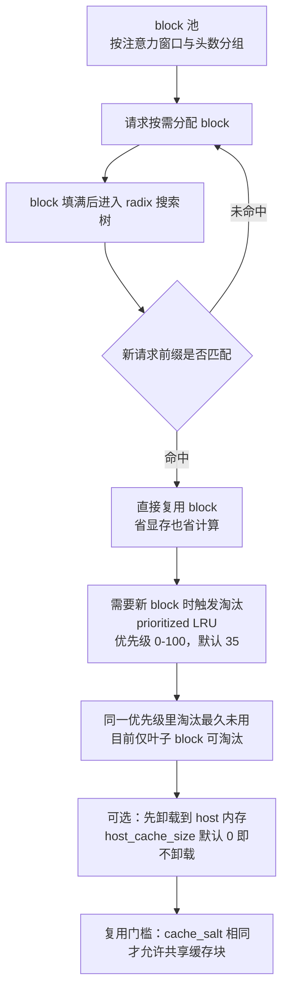
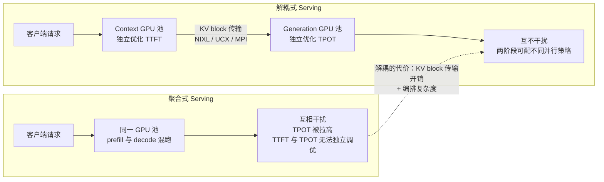

自回归推理里，**KV Cache 是显存的头号消费者**：LLaMA-2-7B（32 层、32 头、head_dim=128）在上下文 4096、batch 16、FP16 存储下，KV 总量高达 **32 GB**，一张 80 GB 的卡光它就要吃掉 40%。TensorRT-LLM 对这笔账的答案分四层：**分页 block 池 + radix tree 前缀复用**（默认把 90% 空闲显存划给 KV cache，填满的块自动进搜索树供后续请求命中）；**缓存量化**（FP8 把 32 GB 减半到 16 GB，NVFP4 再减半到 8 GB）；**长序列三件套**（Chunked Context、Chunked Attention、Sliding Window Attention）；以及 **PD 解耦**（把 prefill 和 decode 放到不同 GPU 池，用 KV block 传输换掉互相干扰）。第 2 章从 vLLM 视角讲过的 PagedAttention 与 Chunked Prefill，这一节看 TRT-LLM 自己的实现——它独有的 cache_salt 安全隔离、NVFP4 缓存量化、NIXL/UCX 传输后端，都在下面。

<!-- more -->

## 📑 目录

- [1. 为什么 KV Cache 是显存刺客](#1-为什么-kv-cache-是显存刺客)
- [2. 两种缓存形态：contiguous 与 paged](#2-两种缓存形态contiguous-与-paged)
- [3. 跨请求复用：radix tree 与 prioritized LRU](#3-跨请求复用radix-tree-与-prioritized-lru)
- [4. 缓存量化：FP8 与 NVFP4](#4-缓存量化fp8-与-nvfp4)
- [5. 安全隔离：cache_salt 防 prompt theft](#5-安全隔离cache_salt-防-prompt-theft)
- [6. 长序列三件套：分块、窗口与环形缓冲](#6-长序列三件套分块窗口与环形缓冲)
- [7. PD 解耦：prefill 与 decode 各占一个 GPU 池](#7-pd-解耦prefill-与-decode-各占一个-gpu-池)
- [8. 权衡与选型：这笔账什么时候值得算](#8-权衡与选型这笔账什么时候值得算)
- [总结](#-总结)
- [自我检验清单](#-自我检验清单)
- [参考资料](#-参考资料)

---

## 1. 为什么 KV Cache 是显存刺客

先问一个问题：**为什么自回归生成越到后面越“贵”？**

生成第 $S+1$ 个 token 时，Attention 要拿新的 Query 去和**全部历史 token 的 Key、Value** 做运算。如果不缓存，就得把前 $S$ 个 token 的前向全部重算一遍——每出一个字重算一次全文，复杂度从 $O(S)$ 变成 $O(S^2)$，谁都扛不住。解决方式就是 1.1 节讲过的那个“用空间换时间”：**把算过的 K 和 V 存起来，下次直接用**，这就是 KV Cache（Key-Value 缓存，缓存的是历史 token 的键值对，Query 每步只用当前 token 的，不需要缓存）。

问题是这笔显存账怎么算。每个 Transformer 层都有一份独立的 KV cache（TRT-LLM 的文档原话：有多少层就有多少份 KV cache），总账是：

$$M_{\text{KV}} = \underbrace{2}_{\text{K 与 V 各存一份}} \times \underbrace{L}_{\text{层数}} \times \underbrace{H_{\text{kv}}}_{\text{每层 KV 头数}} \times \underbrace{d}_{\text{每头维度}} \times \underbrace{S}_{\text{序列长度}} \times \underbrace{B}_{\text{批大小}} \times \underbrace{b}_{\text{每元素字节数}}$$

代入 LLaMA-2-7B 的配置（$L=32$、$H=32$、$d=128$、$S=4096$、$B=16$、FP16 即 $b=2$）：

$$M_{\text{KV}} = 2 \times 32 \times 32 \times 128 \times 4096 \times 16 \times 2 = 32\ \text{GiB}$$

**结论：一个中等规模的请求批次就把 80 GB 卡的显存吃掉四成**，而且这个数字随 $S$ 和 $B$ 线性增长——长上下文、高并发一上来，KV 就成了第一个爆掉的预算项。这也解释了为什么模型架构层面要上 GQA（分组查询注意力，多个 Query 头共享一组 KV 头）：把 $H$ 从 32 压到 8，上面的 32 GB 直接变 8 GB。而推理引擎层面，能动的只有三颗螺丝：**存储形态（分页）、存储精度（量化）、以及让缓存活得更久（复用）**。

## 2. 两种缓存形态：contiguous 与 paged

问题来了：**给这个 32 GB 的大家伙分配显存，怎么分才不浪费？**

TRT-LLM 支持两种形态。**contiguous（连续）KV cache** 是一整块大张量，形状是 $[\text{max\_batch\_size} \times \text{max\_beam\_width},\ 2,\ \text{num\_heads},\ \text{max\_seqlen},\ \text{hidden\_dim\_per\_head}]$——注意到没有？它按**最大序列长度**预留。打个比方：这像餐厅给每桌都按“最多可能来 10 个人”留一张十人桌，结果大部分桌子只坐了两三个人，座位全空着。官方文档的结论很直接：序列短于上限时，contiguous 形态**用掉的显存远超实际需要**。

**paged（分页）KV cache** 则把缓存切成固定大小的 **block（块）**：每块能装固定数量的 token（`tokens_per_block`，必须大于 1 且是 2 的幂，默认 64——官方文档与新版 API 代码存在漂移，新版默认已改为 32，以所用版本为准），由**缓存管理器**（cache manager）从 block 池里按需分配、用完回收。请求只占它真正用到的块数，短序列不再按最大长度缴费。

paged 还多出两个隐藏收益：

- **块是跨请求复用的基本单位**：块一旦被请求填满，就放进一个搜索结构（下节的主角），后来的请求命中同一前缀就能直接借用；
- **块可以按“注意力窗口大小 × KV 头数”分组**：GQA 模型只给每个 query head group 建足够大的块，MQA 甚至全模型只存一组 KV，省到极致。



对比一下两种形态的账：

| 📊 维度 | contiguous | paged |
| --- | --- | --- |
| 组织方式 | 一整块大张量 | 固定大小 block 池 |
| 分配依据 | 按最大序列长度预留 | 按实际 token 数分配 |
| 短序列场景 | 浪费严重 | 按需取用，无浪费 |
| 分配回收 | 简单粗暴 | 缓存管理器分配/回收 |
| 跨请求复用 | 无 | radix tree 前缀命中 |
| 适用定位 | 教学与最小验证（官方明确：序列短于上限时显存远超实际需要） | 生产默认形态 |

📌 **关键点**：paged 不是“多一个选项”，而是后面所有功能（复用、量化、卸载、PD 解耦的块传输）的地基——**没有块，就没有复用，也没有跨 GPU 搬运的最小单位**。这正是第 2 章 PagedAttention（[2.1](/AIInfraGuide/inference/模块四-推理优化/第2章-推理引擎核心技术/21-pagedattention)）讲过的“虚拟内存分页”思想，TRT-LLM 用 `KVCacheManager` 把它落成了引擎内的运行时组件。

**牺牲/换取**：paged 用**实现复杂度**（块映射、管理器状态机、注意力 kernel 的块寻址）换取了**显存利用率与复用能力**——这个交易在长上下文场景稳赚，但代价是 `tokens_per_block`、`max_num_tokens` 这类参数你得多调几轮。

## 3. 跨请求复用：radix tree 与 prioritized LRU

先想一个问题：**多轮对话里，第二轮请求的 prompt 通常只是第一轮加了一句话——那前一轮算过的 KV 能不能不重算？**

**能。**TRT-LLM 的做法是：请求填满一个 block 后，这个块立刻被放进一棵 **radix search tree（基数搜索树）**，以 token 前缀为键组织；新请求进来时先在树里做一次前缀搜索，命中的块直接复用而不是重新计算。复用块可以在多个请求间共享——**既省显存又省计算**，一石二鸟。

但树不会无限长大，显存是有限的。于是有了淘汰机制——**prioritized LRU（带优先级的最近最少使用）**：

- 每个块有一个 0 到 100 的优先级（100 最珍贵），由请求的 retention policy（保留策略）决定，可以按 token 区间指定（比如“给第 10 到 61 个 token 的块设优先级 X”），到期后回落到默认值 **35**；
- 淘汰时**必须先清光最低优先级的块，才能碰更高优先级的块**；同一优先级内部按 LRU 淘汰最久未用的；
- 当前实现的一个限制：**只有叶子 block（radix 树中没有后代的块）可以被淘汰**。这个设计对全注意力模型没问题，但对窗口注意力模型不友好，官方标注为待修。

淘汰之前还有一道“缓刑”：块可以先**卸载到 host（CPU）内存**而不是直接销毁。卸载后的块仍然留在搜索树里，之后被命中就再拷回 GPU。两个开关管这事：

| 配置项（KvCacheConfig） | 默认值 | 作用 |
| --- | --- | --- |
| `free_gpu_memory_fraction` | 0.9 | 把 90% 的空闲显存划给 KV cache 池 |
| `enable_block_reuse` | True | 跨请求块复用总开关 |
| `enable_partial_reuse` | True | 只匹配到部分 token 的块也尝试复用 |
| `host_cache_size` | 0 | host 内存卸载容量，0 表示不卸载 |
| `secondary_offload_min_priority` | 35 | 优先级低于 35 的块不卸载、直接淘汰 |
| `dtype` | `'auto'` | KV 缓存数据类型，默认从模型配置推断 |

表格里有三个值得停一下的点：

💡 **提示**：`free_gpu_memory_fraction = 0.9` 意味着权重、激活、工作区之外的**绝大部分空闲显存都会变成 KV 池**——这也是 TRT-LLM 吞吐高的底气之一；如果同时设了 `max_tokens`，则取两者算出的较小值。

⚠️ **注意**：`secondary_offload_min_priority = 35` 的设计动机是——**卸载也是要花 GPU↔CPU 带宽的**，低优先级块大概率很快又要被淘汰，卸载反而白付一趟搬运费，不如直接从 GPU 里删掉。

**牺牲/换取**：复用用**索引与淘汰策略的复杂度**（外加一个“只淘汰叶子”的实现限制）换取了**省显存 + 省计算**。它在多轮对话、Agent 工具调用这类共享前缀密集的负载上收益最大；前缀完全没有交集的随机查询负载，收益趋近于零。

## 4. 缓存量化：FP8 与 NVFP4

上一节的公式里藏着一个最省事的乘数：**$b$（每元素字节数）**。把 KV 从 FP16（2 字节）降到 FP8（1 字节），32 GB 变 16 GB；降到 NVFP4（半字节），再变 8 GB。**量化基础知识**见 [4.1](/AIInfraGuide/inference/模块四-推理优化/第4章-量化/41-量化基础)，这里只看 TRT-LLM 怎么落地。

**FP8 KV cache：手动开启，任意 checkpoint 可用。**官方文档特别强调：即使模型本身没有开 FP8，你也可以在运行时用 `KvCacheConfig(dtype='fp8')` 手动打开——不需要离线量化：

```python
from tensorrt_llm import LLM
from tensorrt_llm.llmapi import KvCacheConfig

# 任意 checkpoint 都能手动开 FP8 KV cache（官方示例写法）
llm = LLM(model="/path/to/model",
          kv_cache_config=KvCacheConfig(dtype="fp8"))
```

**NVFP4 KV cache：必须离线量化，且只配合 FP8 权重/激活。**NVFP4 的精度更低，不能运行时随便切，必须先拿 NVIDIA Model Optimizer 做离线量化生成新 checkpoint：

```bash
# 在 ModelOpt 仓库的 examples/llm_ptq 下执行（示意）
scripts/huggingface_example.sh --model <model_card> \
    --quant fp8 --kv_cache_quant nvfp4
```

然后同样用 `KvCacheConfig(dtype="nvfp4")` 加载。注意官方支持矩阵里的硬约束：**NVFP4 KV cache 目前只支持 FP8 权重/激活组合**（所以上面 `--quant fp8` 是必须的），且硬件上仅 Blackwell 数据中心 GPU（sm100/103，如 B200/B300）支持，Hopper 与 RTX 系只到 FP8。

`dtype` 的默认值是 `'auto'`：**从模型配置自动推断**。也就是说，你不设它，引擎就用 checkpoint 自己声明的 KV 精度；你设了 `'fp8'`，就相当于无视 checkpoint 声明强行降一档。

**牺牲/换取**：量化用**精度**换**显存 + 带宽 + 吞吐**三样东西——KV 是 decode 阶段每次都要全量读的东西，KV 字节数减半意味着 decode 的显存带宽压力几乎减半，这是 TPOT 的直接收益。代价是精度损失需要实测：和第 4 章 [KIVI（4.4）](/AIInfraGuide/inference/模块四-推理优化/第4章-量化/44-kv-cache量化-kivi) 的结论一致，KV 量化对大部分任务损失很小，但对长文档、检索这类“高度依赖细节”的任务，务必用你自己的数据集跑一遍评测再上线。

## 5. 安全隔离：cache_salt 防 prompt theft

复用好用，但想一个问题：**多租户场景下，A 用户的缓存块凭什么能被 B 用户命中？**

如果复用不设门槛，攻击者可以构造与受害者相同前缀的 prompt，命中受害者的缓存块，再通过对比响应时间/内容差异**推断受害者 prompt 的内容**——这就是 **prompt theft（提示词窃取）攻击**。TRT-LLM 的解法是 **KV cache salting（加盐）**：请求带上一个 `cache_salt` 字符串（可以是用户 ID、租户 ID 或哈希串），系统**只允许相同 salt 的请求之间复用缓存块**：

```python
# 伪代码示意（非逐字源码）：请求级加盐
llm.generate(TextPrompt(prompt="……", cache_salt="tenant-42"))
```

隔离的强度完全押在 **block-key 哈希**上：salt 混入哈希输入，前缀匹配只靠摘要相等判断，**不会逐 token 比对内容**。所以官方文档把要求钉死了：block-key 哈希**必须是 256 位摘要的密码学哈希**（SHA-256 提供约 128 位碰撞抗性，够用），换用非密码学哈希会让构造碰撞绕过盐隔离——这是明令禁止的。

**牺牲/换取**：salting 用**缓存复用率**换**安全隔离**——salt 分得越细（每个租户一个），能复用的块越少。正确姿势是“粒度跟着信任边界走”：同一个租户内部共享 salt 吃复用红利，跨租户严格隔离。

## 6. 长序列三件套：分块、窗口与环形缓冲

长上下文（几十万 token 的文档、超长多轮对话）直接撞上两个墙：**显存墙**（KV 随 $S$ 线性涨）和**调度墙**（一个超长 prefill 把整个 batch 卡住）。TRT-LLM 给了三件套，分别打不同的墙。

### 6.1 Chunked Context：内存与输入长度解耦

**为什么必须分块？**一次性 prefill 一个 100k token 的请求，这一轮迭代的中间显存直接按 100k 算，其他请求全被挤到队尾。

Chunked Context 把输入 token 切成小块，**把 context 块和 decode 请求混在同一轮迭代里**执行（对应 `enable_chunked_prefill=True`）。收益官方说了两条：context 阶段不再成为瓶颈、GPU 利用率更高；更重要的是**内存消耗从“取决于输入长度”变成“取决于每轮 chunk 大小”**——输入再长，每轮只处理一个 chunk 的量，并发能力不再被长 prompt 掐死。这和 [2.4](/AIInfraGuide/inference/模块四-推理优化/第2章-推理引擎核心技术/24-chunked-prefill-与统一调度) 讲过的 vLLM Chunked Prefill 是同一思想。

⚠️ **注意**：开 Chunked Context 后，`max_num_tokens` 必须是 KV block 大小（`tokens_per_block`，默认 64，以所用版本为准）的**整数倍**，否则分块和块边界对不齐。

### 6.2 Chunked Attention：注意力也按块算

Chunked Context 解决显存，Chunked Attention 解决**计算**：把 context 请求的 token 切成 chunk，**每个 token 只能 attend 到同 chunk 内的 token**（chunk size 3 时，每个 token 至多看过去 3 个），KV cache 大小和注意力计算量一起缩水。当前支持范围很窄，官方写得很清楚：**仅 Llama 4 模型 + TRTLLM attention 后端**，`attention_chunk_size` 从模型配置里读，且只作用于 context 请求。想给别的模型开，需要自己在 attention API 里设一个合法值。

### 6.3 Sliding Window Attention：环形缓冲

Sliding Window Attention（滑动窗口注意力）限死每个 token 的注意力范围：**只看过去 $N$ 个 token**，超出窗口的 KV 直接丢弃。TRT-LLM 的实现细节是：**KV cache 变成环形缓冲（circular buffer），只存最近 $N$ 个 token 的状态**，官方叫 **Cyclic KV Cache**。窗口大小按层可配——`KvCacheConfig(max_attention_window=[4096, 256])` 表示第 0 层全注意力、第 1 层窗口 256、第 2 层又回到 4096，列表不够层数就按层循环复用（第 3 层又会是 256）。

💡 **提示**：不同窗口大小的层会落入不同的 block 池（块按“注意力窗口 × 头数”分组），所以混合窗口配置时，显存要在池子之间静态切分，池间比例在初始化时定死——官方承认这不是最优，正在改进。

⚠️ **注意**：Sliding Window **目前和 beam search 不兼容**——beam 之间共享 context KV，窗口一滑，各 beam 的缓存就串了。

三件套对比，方便你记：

| 📊 手段 | 打的墙 | 关键限制 |
| --- | --- | --- |
| Chunked Context | 显存墙 + 调度墙 | `max_num_tokens` 须为 `tokens_per_block` 整数倍 |
| Chunked Attention | 计算墙 | 仅 Llama 4 + TRTLLM backend，仅 context 请求 |
| Sliding Window | 显存墙 + 计算墙 | 与 beam search 不兼容 |

📌 **关键点**：三件套可以叠着用，但每一件都在**牺牲信息或灵活性**——窗口外信息永远丢了、分块可能让个别请求的 TTFT 变长（平均 TTFT 反而下降）。长上下文没有免费午餐，先算清你缺的是显存还是计算，再选药。

💡 **提示**：TRT-LLM 的环形缓冲是工程形态；“驱逐 KV 后模型为什么不稳”的机制解释与稳定方案（attention sink）见 [2.6 StreamingLLM 与 Attention Sink](/AIInfraGuide/inference/模块四-推理优化/第2章-推理引擎核心技术/26-streamingllm与attention-sink)。

## 7. PD 解耦：prefill 与 decode 各占一个 GPU 池

最后一个问题：**为什么长 prompt + 中等输出的负载，服务越跑越“卡顿”？**

因为**聚合式（aggregated）serving** 把 prefill 和 decode 放在同一批 GPU 上：prefill 是矩阵密集的“重计算”，decode 是带宽密集的“轻计算”，混跑时 prefill 会抢占 decode 的算力，**把 TPOT 拉高**（用户体感就是 token 一卡一卡），而且两阶段被迫共享同一套并行策略——你想给 prefill 配 8 卡 TP 给 decode 配 2 卡，做不到。**解耦式（disaggregated）serving** 的思路在第 7 章 [7.2](/AIInfraGuide/inference/模块四-推理优化/第7章-pd解耦架构/72-解耦架构设计) 已经完整讲过（DistServe/Splitwise/TaiChi），这里看 TRT-LLM 的工程实现：



### 7.1 KV block 怎么搬：三个传输后端

解耦后的第一个工程问题是**传输**：prefill 算完的 KV block 必须搬到 generation GPU。TRT-LLM 的 KV cache exchange 模块把传输与缓存管理、通信库解耦，底层走 **RDMA / NVLink**，支持三种后端：**MPI、UCX、NIXL**。官方当前**推荐 UCX 和 NIXL**，因为正在它们之上加动态扩缩容（节点动态加入/离开）；NIXL 本身又包了一层可换底座的配置——`TRTLLM_NIXL_KVCACHE_BACKEND` 环境变量可选 **UCX（默认）或 LIBFABRIC（v0.16.0 起）**，指定不支持的底座会自动回退 UCX。

传输缓冲由 `cache_transceiver_config` 配置，两个关键项：

```yaml
cache_transceiver_config:
  backend: NIXL            # DEFAULT / UCX / NIXL / MPI，默认 NIXL
  max_tokens_in_buffer: 2048   # 建议 ≥ 所有请求的最大 ISL（输入长度）
```

传输本身还有三招优化：**重叠**（一个请求在传 KV 时，其他请求照常计算，`TRTLLM_DISABLE_KV_CACHE_TRANSFER_OVERLAP=0` 默认开启重叠）、**布局转换**（context 与 generation 可以配不同并行策略——官方示例就是 context 端 TP2、generation 端 PP2，传输时按目标布局重排块）、以及**直接设备内存传输**（不做 host 中转）。

### 7.2 怎么编排：trtllm-serve 与 Dynamo 两条路

TRT-LLM 给出两种解耦编排方式：

- **trtllm-serve 路线**：先用 `trtllm-serve` 分别拉起 context 服务器和 generation 服务器（各自带 `cache_transceiver_config`），再用 `trtllm-serve disaggregated -c disagg_config.yaml` 启动一个**编排器**（orchestrator）作为 OpenAI 兼容入口，负责把请求路由到 context 实例（标记为 context-only）、等 KV 就绪后再路由到 generation 实例（标记为 generation-only）。编排器是单线程的，高并发下可能成为瓶颈——所以支持 `num_workers` 起多进程 fleet，多个 worker 进程用 `SO_REUSEPORT` 共享同一个公网端口，内核按四元组哈希负载均衡；
- **NVIDIA Dynamo 路线**：接入 Dynamo（数据中心级推理调度框架），由它管理 pre/post-processing worker、智能路由与 KV 块可用性判断，带 Kubernetes 部署与监控。

跨实例的请求 ID 用 **snowflake** 生成：64 位正整数 = 1 位符号 + 39 位毫秒时间戳 + 8 位节点 ID + 6 位进程 ID + 10 位计数器，**无协调即可保证全局唯一**（全局 ID 落在 $[2^{40}, 2^{63})$，与 worker 本地 ID 的 $[0, 2^{40})$ 区间不相交）。此外还有专门的 **KV Cache Connector API**（自 v1.1 引入，以你所用版本为准），用 scheduler/worker 两个接口把“缓存去哪、谁搬”开放给自定义实现——第 7 章 [7.3](/AIInfraGuide/inference/模块四-推理优化/第7章-pd解耦架构/73-kv传输与connector) 讲的 vLLM KV Connector 抽象，在 TRT-LLM 这边有对位的实现，两章对着读正好互相印证。

⚠️ **注意**（当前限制）：解耦模式只支持 decoder-only 模型、beam width 为 1，且每层 KV 的数据类型与头数必须同构；context 与 generation 的 engine 可以不同、并行策略可以异构，但调度上建议两者各用各的服务器集合，不要混跑。

## 8. 权衡与选型：这笔账什么时候值得算

把全文的“牺牲/换取”收进一张决策表。判断条件都是能回答是/否的问题：

| 症状 | 判断问题 | 方案 |
| --- | --- | --- |
| 长 prompt 压爆显存、并发上不去 | 显存是不是按输入长度线性涨？ | Chunked Context（+ `max_num_tokens` 调优） |
| decode 慢、TPOT 高，KV 带宽是瓶颈 | 能接受精度损失吗？ | FP8 KV cache，必要时 NVFP4（需离线量化） |
| 多轮对话/Agent 重复算同一前缀 | 请求间共享前缀多吗？ | `enable_block_reuse`（默认开）+ 调 retention policy |
| 多租户部署，担心缓存泄露 | 有跨租户安全要求吗？ | `cache_salt` 按信任边界分盐 |
| decode 尾延迟被 prefill 拖垮 | 长输入 + 中等输出、SLO 严格？ | PD 解耦（先看 [7.2](/AIInfraGuide/inference/模块四-推理优化/第7章-pd解耦架构/72-解耦架构设计) 的互扰诊断） |

决策规则：

- ✅ **显存不够** → 先量化（FP8 免费午餐级别），再分块，最后才考虑卸载；
- ✅ **尾延迟失控** → 才拆池做 PD 解耦——它要付 KV 传输和编排两份学费；
- ❌ 别为“显得高级”开解耦：随机短查询负载没有互扰可解，拆了只会白付传输开销。

**操作顺序**（与 [11.1](/AIInfraGuide/inference/模块四-推理优化/第11章-推理优化选型与端到端实战/111-优化选型决策树) 的决策树一致）：先解 OOM（分页 + 量化）→ 再压 TTFT（chunked）→ 然后提 TPOT/吞吐（复用 + 量化带宽收益）→ 最后才动尾延迟（PD 解耦）。

## 📝 总结

1. **KV 账本**：每层一份 KV cache，$2 \times L \times H_{\text{kv}} \times d \times S \times B \times b$ 字节——7B/4096/batch16/FP16 就是 32 GB，占 80 GB 卡的四成；
2. **存储形态**：contiguous 按最大序列预留、短序列浪费；paged 按 block 池分配回收（`tokens_per_block` 默认 64，以所用版本为准），是复用与传输的地基；
3. **跨请求复用**：填满的 block 进 radix 搜索树，prioritized LRU（0-100、默认 35）淘汰，目前只淘汰叶子块；`free_gpu_memory_fraction=0.9` 是 KV 池的默认预算；
4. **量化**：`dtype='fp8'` 任意 checkpoint 手动可开（32 GB→16 GB）；NVFP4 需 ModelOpt 离线量化且只配 FP8 权重/激活（→8 GB）；
5. **安全与长序列**：cache_salt 靠 256 位密码学 block-key 哈希做租户隔离；Chunked Context / Chunked Attention / Sliding Window 三件套分别打显存墙、计算墙，各有版本与模型限制；
6. **PD 解耦**：聚合式混跑拉高 TPOT，解耦式用 KV block 传输（NIXL/UCX/MPI，推荐前两者）换独立调优；trtllm-serve 编排器或 Dynamo 两种编排，snowflake ID 无协调保证全局唯一。

## ⚠️ 常见错误做法

- ❌ **把 max-model-len 调大而不算 KV 账**：想支持长上下文就把长度拉满。为什么错：KV Cache 随长度线性增长，长度翻倍并发减半，吞吐与延迟同时恶化（本文 32GB 账本）。正确做法：用 KV 账本公式（2 × 层数 × 头数 × head_dim × 长度 × batch × 字节）先算，再定 max-model-len。
- ❌ **忽略 TRT-LLM 的 KV 配置与 vLLM 的差异**：参数照搬。为什么错：两个引擎的 KV 管理（分页、预分配）与参数面不同。正确做法：以 TRT-LLM 文档为准，按本文的配置表设置。
- ❌ **长上下文不做量化/稀疏**：FP16 KV 硬扛。为什么错：长上下文下 KV 是显存大头，FP8/INT8 KV 量化能省一半（4.4 的 KIVI 思路）。正确做法：按精度预算选择 KV 量化，并验证长序列精度。
- ❌ **不测长序列的实际精度**：长度外推后直接上线。为什么错：RoPE 外推、位置插值在超长序列上可能精度退化。正确做法：用长文档任务验证（9.5 的回归 + 任务指标）。

## 🎯 自我检验清单

- 能写出 KV Cache 总量公式，并手算 7B/4096/batch16/FP16 场景下 ≈32 GB、误差不超过 20%；
- 能解释 contiguous 与 paged 两种形态的分配差异，以及为什么 paged 是复用与 PD 传输的地基；
- 能说清 radix tree 复用、prioritized LRU（优先级 0-100、默认 35）与“只淘汰叶子块”三个机制各自的取舍；
- 能解释为什么 `secondary_offload_min_priority` 默认 35——卸载也要带宽，低优先级块不值得搬；
- 能说出 FP8 与 NVFP4 KV cache 的开启条件差异（运行时手动开 vs ModelOpt 离线量化），以及 NVFP4 对权重/激活组合的硬约束；
- 能解释 cache_salt 如何防 prompt theft，以及为什么 block-key 哈希必须是 256 位密码学哈希；
- 能区分长序列三件套各打哪堵墙，并背出各自的限制条件（整数倍约束、Llama 4 限定、beam search 不兼容）；
- 能画出聚合式与解耦式的执行时间线对比图，标注 TPOT 干扰源与 KV 传输开销的位置；
- 能说出 KV 传输三个后端（MPI/UCX/NIXL）与 NIXL 底座的切换方式，以及 `max_tokens_in_buffer` 的建议取值依据；
- 能根据“显存不够/尾延迟失控/多租户安全”三类症状选择对应方案，并说清每笔交易的代价。

## 📚 参考资料

**官方文档（NVIDIA TensorRT-LLM）**
- [KV Cache System（features/kvcache.md）](https://nvidia.github.io/TensorRT-LLM/features/kvcache.html)：block 池、radix tree 复用、prioritized LRU、卸载与 KvCacheConfig 全部参数、cache_salt；
- [Paged Attention, IFB, and Request Scheduling](https://nvidia.github.io/TensorRT-LLM/features/paged-attention-ifb-scheduler.html)：contiguous/paged 两种 KV cache 形态与调度器可视化；
- [Long Sequences（features/long-sequence.md）](https://nvidia.github.io/TensorRT-LLM/features/long-sequence.html)：Chunked Context、Chunked Attention、Sliding Window Attention 三件套；
- [Disaggregated Serving（features/disagg-serving.md）](https://nvidia.github.io/TensorRT-LLM/features/disagg-serving.html)：动机、传输后端（MPI/UCX/NIXL）、重叠优化、布局转换、trtllm-serve/Dynamo 编排、snowflake 请求 ID；
- [Quantization（features/quantization.md）](https://nvidia.github.io/TensorRT-LLM/features/quantization.html)：FP8/NVFP4 KV cache 开启方式与模型/硬件支持矩阵；
- [KV Cache Connector（features/kv-cache-connector.md）](https://nvidia.github.io/TensorRT-LLM/features/kv-cache-connector.html)：Connector API 的 scheduler/worker 接口与自定义卸载/传输场景；
- [LLM API Reference（KvCacheConfig）](https://nvidia.github.io/TensorRT-LLM/llm-api/reference.html)：`KvCacheConfig`、`KvCacheRetentionConfig` 的字段与默认值权威出处。

**论文与博客**
- [Disaggregated Serving 技术博客（tech blog 5）](https://arxiv.org/pdf/2506.05508)：解耦式 serving 的动机与设计考量论文版；
- [DistServe：Disaggregating Prefill and Decoding for Goodput-optimized LLM Serving（OSDI'24）](https://arxiv.org/abs/2401.09670)：PD 解耦的学术起点，第 7 章主角。

**本站衔接**
- [第 2 章：PagedAttention 与 Chunked Prefill](/AIInfraGuide/inference/模块四-推理优化/第2章-推理引擎核心技术/21-pagedattention)：vLLM 视角的同一套思想，可与本节对照；
- [第 7 章：PD 解耦架构](/AIInfraGuide/inference/模块四-推理优化/第7章-pd解耦架构/72-解耦架构设计)：互扰诊断、池配比与 KV Connector 的 vLLM 实现；
- [第 4 章：量化基础与 KIVI](/AIInfraGuide/inference/模块四-推理优化/第4章-量化/41-量化基础)：KV 量化精度损失的评测口径；
- [第 12 章：TensorRT 推理引擎](/AIInfraGuide/inference/模块四-推理优化/第12章-tensorrt推理引擎/第12章-tensorrt推理引擎)：本章首页，TRT-LLM 在 NVIDIA 推理生态中的位置。
