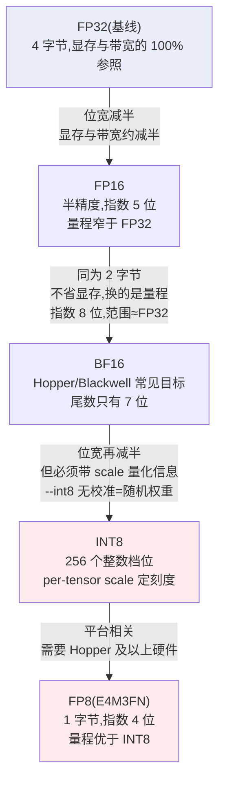
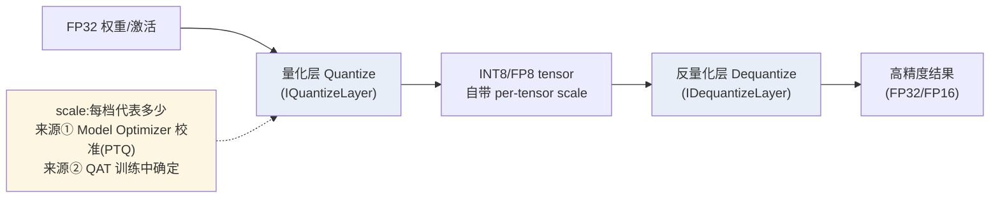

TensorRT 11.x 把量化路线砍到只剩一条：隐式量化（Implicit Quantization）连同它的 API 已被整体移除，显式量化（Explicit Quantization）是唯一官方路线。这句话的工程后果很直接：你在网上搜到的"加个 INT8 标志、引擎自己搞定"的旧教程全部失效，任何 INT8/FP8 精度都必须由模型图本身携带量化信息。先摆数字：一个 7B 模型，FP32 权重 28GB，FP16 只要 14GB，INT8 只要 7GB；而 Decode 阶段每生成一个 Token 都要把全部权重从显存搬一遍（这本账在 [4.1](/AIInfraGuide/inference/模块四-推理优化/第4章-量化/41-量化基础) 算过），权重字节数减半，单流吞吐理论上就翻倍。但 TensorRT 的 `--int8` 有个著名陷阱：trtexec 文档白纸黑字写着 **"in INT8 mode, random weights are used"**——不带量化信息直接 `--int8` 构建，引擎里装的是随机权重，精度毫无保证。这一节把精度阶梯、构建旗标、显式量化数据流、强类型混合精度和排查工具串成一条完整的选型路线，承接同章前几篇的构建流程，是第 12 章的"精度与量化"篇。

<!-- more -->

## 📑 目录

- [1. 精度阶梯：为什么从 FP32 往下走](#1-精度阶梯为什么从-fp32-往下走)
- [2. 构建期精度旗标：--fp16、--bf16、--int8、--fp8](#2-构建期精度旗标--fp16--bf16--int8--fp8)
- [3. 11.x 路线剧变：隐式量化已移除](#3-11x-路线剧变隐式量化已移除)
- [4. INT8 的真实门槛：没有量化信息就是随机权重](#4-int8-的真实门槛没有量化信息就是随机权重)
- [5. 强类型与混合精度：--stronglyTyped 与 AutoCast](#5-强类型与混合精度--stronglytyped-与-autocast)
- [6. 精度问题排查：polygraphy 对比定位偏差](#6-精度问题排查polygraphy-对比定位偏差)
- [7. 精度选型：硬件、模型与精度](#7-精度选型硬件模型与精度)
- [总结](#-总结)
- [自我检验清单](#-自我检验清单)
- [参考资料](#-参考资料)

---

## 1. 精度阶梯：为什么从 FP32 往下走

### 1.1 低精度为什么更快

推理场景里"低精度更快"的根本原因是显存带宽，而不是算力。Decode 阶段每个 Token 只触发一次矩阵-向量乘，GPU 大部分时间在等权重从显存搬出来（内存瓶颈，memory bound）。权重字节数从 4 字节降到 2 字节、再降到 1 字节，每步搬运时间同比例缩短，单流吞吐理论值就翻倍、再翻倍。

那为什么不干脆全部用最低精度？因为每一档都付出代价：**精度损失**和**硬件门槛**。量化是把连续数值"四舍五入"到有限档位上(概念细节见 [4.1](/AIInfraGuide/inference/模块四-推理优化/第4章-量化/41-量化基础)),档位越少，表示一个数就越粗糙；而某些精度(FP8、BF16 的硬件加速)只有特定 GPU 代际才支持。精度选择本质上是在"显存/带宽省多少"和"精度掉多少"之间找平衡点。

### 1.2 精度阶梯：五档全景

先看全貌，再逐档解释：



📌 **关键点**：这张阶梯图上，FP16 和 BF16 是**同一位宽的两条分支**——都是 2 字节，省显存的效果一样，区别在数值表示：FP16 指数 5 位、尾数 10 位，范围窄（最大有限值约 65504）；BF16 指数 8 位、尾数 7 位，量程和 FP32 一样（约 3.4e38）但有效数字更粗。大模型训练和推理偏爱 BF16，正是因为它的动态范围接近 FP32，数值不容易溢出。INT8 和 FP8 则是另一类：它们不是"更短的小数"，而是"整数档位"或"更短的浮点"，**必须显式给出刻度（scale）才能用**。

💡 **提示**：图中"显存减半"是定性方向，真实收益还要看算子实现、反量化开销和 Tensor Core 利用率——具体数字因模型和 GPU 而异，定量数据待核实。反直觉案例见 [4.6](/AIInfraGuide/inference/模块四-推理优化/第4章-量化/46-量化选型与vllm实战)：某些场景 INT4 反而比 INT8 慢，因为解包和反量化开销吃掉了省下的带宽。

## 2. 构建期精度旗标：--fp16、--bf16、--int8、--fp8

### 2.1 四个旗标，一条命令

TensorRT 构建引擎时，最省事的精度入口就是构建旗标。官方 Import Workflows 指南给出的命令模板：

```bash
trtexec \
  --onnx=model.clean.onnx \
  --saveEngine=model.plan \
  --memPoolSize=workspace:4096 \
  --fp16                        # 或 --bf16、--int8、--fp8(platform-dependent)
```

**四个旗标分别声明"允许构建器使用哪种精度"**：`--fp16` 允许半精度、`--bf16` 允许 BF16、`--int8` 允许 INT8、`--fp8` 允许 FP8。注意三个细节：

- **"允许"不是"强制"**：构建器逐层挑选最快的可用实现，旗标只是扩大可选的精度集合，某个层最终用什么精度由构建器决定（想完全钉死每层精度，要用第 5 节的强类型路线）。
- **`--fp8` 标注为平台相关（platform-dependent）**：FP8 需要支持它的 GPU 代际（Hopper 架构及以上才有原生 FP8 Tensor Core），在旧卡上构建会失败或忽略，详见 [4.5](/AIInfraGuide/inference/模块四-推理优化/第4章-量化/45-fp8与nvfp4) 的硬件背景。
- **引擎与硬件绑定**：plan 与计算能力绑定、换 GPU 就要重建的机制见 [12.2 §5](/AIInfraGuide/inference/模块四-推理优化/第12章-tensorrt推理引擎/122-trt核心对象与构建流程#5-plan-不是通用的换-gpu-就要重建)；对精度选型，这一层意味着旗标必须和目标 GPU 一起考虑（FP8 只在 Hopper 及以上可用），构建与部署建议放在同一型号 GPU 上进行。

### 2.2 旗标不是精度方案

⚠️ **注意**：构建旗标只解决"允许什么精度"，不解决"量化信息从哪来"。FP16/BF16 是浮点格式，模型本身可以无损转换；INT8/FP8 是低精度格式，**每个 tensor 需要知道自己的数值范围才能正确量化**——这正是第 3 节显式量化要讲的机制，也是 `--int8` 容易踩坑的地方。

## 3. 11.x 路线剧变：隐式量化已移除

### 3.1 从"自动档"到"手动档"

打个比方：旧版 TensorRT 的隐式量化像**自动档汽车**——你只告诉它"我要开 INT8"，它自己决定哪里换挡、怎么换；而显式量化像**手动档**——换挡点必须由你（或导出工具）在模型图上明确标出来，引擎只按标注执行。

TensorRT 11.x 的官方公告写得很清楚：**"Implicit quantization and related APIs have been removed, replaced by Explicit Quantization"**（隐式量化及相关 API 已移除，由显式量化取代）。同一批被移除的还有弱类型网络（Weakly-typed Networks），由强类型网络（Strongly Typed Networks）接管——这两件事是 11.x API 大清理的一部分。工程上的直接后果：

- 旧教程里"构建时传 INT8 标志 + 内部校准器自动出 scale"的流程**不再存在**；
- 任何量化模型进入 TensorRT 的路径只有一条：模型图里**自带量化节点和 scale 信息**（即显式量化）。

### 3.2 显式量化：Q/DQ 层与 per-tensor scale

"显式"到底显式在哪？官方文档的定义:**当网络包含 Quantize 和 Dequantize 层(简称 Q/DQ)时，它就是显式量化的——Q/DQ 精确标注了发生量化和反量化的位置，优化器只执行模型语义规定的转换**。每个量化 tensor 自带一个 scale(缩放因子),它回答一个问题:"整数档位 1 代表原始数值的多少？"



**量化过程**：FP32 权重除以 scale 再取整，得到整数档位；用的时候再乘回 scale 近似还原。scale 越小，档位间距越小，表示越精细，但能覆盖的范围越窄——这就是第 4 节校准要解决的矛盾。

两个机制细节（官方 Explicit Quantization 文档）：

- **权重可以两种形态进引擎**：高精度形态（FP32/FP16/BF16）或已量化形态（INT8/FP8/INT4/FP4）。高精度权重会在构建时用量化层的 scale 现场量化，量化后的低精度权重存入 plan 文件。
- **ONNX 的导入映射**：PyTorch/TensorFlow 里做 QAT 时，fake-quant 操作导出为 ONNX 的 `QuantizeLinear`/`DequantizeLinear` 算子（ONNX opset 10 起支持，opset 13 加了量化轴属性以支持 per-channel），TensorRT 分别导入为 `IQuantizeLayer` 和 `IDequantizeLayer`。scale 既可以是 per-tensor（整张一个刻度），也可以是 per-channel、甚至 block-wise。

💡 **提示**：显式量化文档还强调——**显式量化应与强类型（Strong Typing）搭配使用，构建期精度旗标"不需要也不应该指定"**。这条指引把第 2 节的旗标路线和第 5 节的强类型路线在量化场景下统一了：带 Q/DQ 的模型，精度已经写死在图里，构建时不用(也不该)再用 `--int8` 之类去"授权"。

## 4. INT8 的真实门槛：没有量化信息就是随机权重

### 4.1 trtexec 的著名警告

trtexec 文档在"生成序列化引擎"一节里有一句必须逐字读的话：**"Also, in INT8 mode, random weights are used."（在 INT8 模式下，使用的是随机权重。）**

这句话的背景：trtexec 本质是**性能测试工具**，默认用随机输入、随机权重测速度。当你不带任何量化信息、直接 `trtexec --onnx=model.onnx --int8` 构建时，它不会报错——它只是默默把权重当作随机值量化进去，引擎能跑、速度还很快，**但输出和你的模型毫无关系**。所以：

- 用 `--int8` 裸构建出来的 engine 只能用来测性能，**不能用来验证精度，更不能上线**；
- 真实 INT8 必须满足二选一：模型图自带 Q/DQ 量化信息（显式量化，第 3 节），或者用 Network Definition API 手动指定量化权重与 scale（参考实现是 `sampleINT8API` 示例，样例数据包里对应 `int8_api/` 目录）。

### 4.2 校准：scale 从哪来

scale 不会从天上掉下来，官方 Quantization Workflows 文档给出两条生产线：

- **PTQ（训练后量化）**：对训练好的模型做量化，**需要一份有代表性的"校准数据集"**来统计权重/激活的实际数值分布，再据此算出 scale。代价低、不需要重训，但复杂模型或敏感层可能掉精度。
- **QAT（量化感知训练）**：在训练过程中模拟量化，让模型主动补偿量化误差，精度恢复更好，但更费时、需要完整训练数据。

工具链方面，官方已经收拢到 **TensorRT Model Optimizer**：CHANGELOG 明确记录 `pytorch_quantization` 已弃用、旧版 `quantization_tutorial` 已移除，并指向 Model Optimizer——它同时提供 QAT 建模能力和 PTQ 配方（PyTorch 和 ONNX 都支持）。官方 quickstart 收录了配套教程：**"Quantization with TensorRT Model Optimizer"——Stable Diffusion XL（Base/Turbo）和 Stable Diffusion 1.5 的量化**。这是目前最完整的上手路径：拿校准数据跑 Model Optimizer 出带 Q/DQ 的 ONNX，再交给 TensorRT 构建。

⚠️ **注意**：校准数据集必须是**代表性数据**（和线上推理的数据分布一致）。用 ImageNet 校准的模型拿去跑医疗影像，scale 会按错误分布取值，精度损失可能远超预期——"有校准"不等于"校准对了"。

## 5. 强类型与混合精度：--stronglyTyped 与 AutoCast

### 5.1 强类型网络：把精度写死在图里

11.x 移除弱类型网络后，强类型（Strong Typing）成为唯一网络模式。trtexec 文档的定义：**`--stronglyTyped` 模式下，tensor 的数据类型由网络输入类型和算子类型规格推断**——也就是说，图的每个 tensor 在构建时就确定了类型，构建器不能再自由改写精度。代价是约束，收益是确定性和精度可控。

两个硬性规则（trtexec 文档原文）：

- **`--stronglyTyped` 不允许与 `--int8` 或 `--best` 等构建精度旗标同用**——精度已经由图决定，再用旗标授权就自相矛盾；
- 强类型模式正是显式量化模型的推荐构建方式（第 3 节已提）。

### 5.2 官方混合精度样例：strongly_type_autocast

想从 FP32 模型出发做 FP32-FP16 混合精度，官方在 10.15 GA（2026-02-02）新增了 `python/strongly_type_autocast` 示例，流程三步：

1. **Model Optimizer 的 AutoCast 工具**把 FP32 ONNX 模型转换为 FP32-FP16 混合精度（哪些层保持 FP32、哪些降 FP16，由 AutoCast 分析决定）；
2. 转换后的模型用 **Strong Typing 模式**构建 engine（精度写在图里，不再需要 `--fp16` 旗标）；
3. 跑精度对比，确认混合精度没有掉点。

这条路线回答了一个常见问题："FP16 全图统一降精度，某些层(比如归一化、Softmax)容易掉点，怎么办?"答案是**分层混合**：敏感层留在 FP32，其余层降 FP16，再交给强类型模式精确执行。

Torch-TensorRT 路径的官方经验类似（Import Workflows 指南）：混合精度**优先 `enabled_precisions={torch.float16}` 而不是 `{torch.float32}`**，除非某个具体层掉精度；**BF16 目标（Blackwell、Hopper 硬件）用 `{torch.bfloat16}`，并且输入要相应 cast 成 bfloat16**——输入类型不匹配是 BF16 路线最常见的翻车点。

## 6. 精度问题排查：polygraphy 对比定位偏差

### 6.1 先定位，再修

引擎精度和原始模型对不上，第一步不是改代码，而是**定位偏差出现在哪一层**。官方推荐的工具是 Polygraphy（随 TensorRT 仓库发布的模型调试工具链），一条命令同时跑两个后端做对比：

```bash
polygraphy run model.onnx --trt --onnxrt \
  --atol 1e-3 --rtol 1e-3 --input-shapes input:[1,3,224,224]
```

`--onnxrt` 用 ONNX Runtime 跑出参考输出，`--trt` 跑 TensorRT engine，`--atol`/`--rtol` 是允许的绝对/相对误差阈值。同输入、双后端、阈值判定，偏差一目了然。

### 6.2 症状-诊断-方案

Import Workflows 的故障排查章节给了两条直接可用的经验：

| 症状 | 诊断 | 方案 |
|---|---|---|
| 与框架输出偏差大 | 先用 `polygraphy run --trt --onnxrt --atol --rtol` 定位到层/子图 | 逐层收窄范围，确认是哪些子图在掉精度 |
| FP16 engine 偏差 | 精度在混合/强类型层面失控 | 改用 `--stronglyTyped`，对问题子图**显式 FP32 cast**，只让敏感层留在高精度 |
| INT8 结果完全离谱 | 很可能压根没有量化信息 | 检查是否 `--int8` 裸构建（随机权重），改用带 Q/DQ 的模型或 Model Optimizer 校准 |
| BF16 输出异常 | 输入类型没对上 | 确认输入已 cast 成 bfloat16（对应第 5.2 节） |

📌 **关键点**：排查顺序永远是"先对比定位，再动手修"。`--stronglyTyped + 局部 FP32 cast` 是官方点名推荐的 FP16 掉点修复手段，但它要求你**知道**问题子图在哪——这正是 polygraphy 的活。

## 7. 精度选型：硬件、模型与精度

### 7.1 决策表

把前面的路线收拢成一张决策表：

| 场景 | 推荐精度路线 | 依据 |
|---|---|---|
| 快速验证/性能摸底 | `--fp16` 旗标直接构建 | 无需量化信息，一条命令 |
| BERT/CNN 等中小模型上线 | FP16 起步，敏感层混合精度 | AutoCast + Strong Typing 样例 |
| 大模型 LLM 生成 | 直接上 TensorRT-LLM（FP8/INT4 原生支持） | 官方支持矩阵：LLM 行验证基线即 bfloat16；生产级 LLM 请用 TensorRT-LLM |
| 扩散模型（Stable Diffusion 等） | Model Optimizer 量化教程（SDXL Base/Turbo、SD 1.5） | 官方 quickstart 收录的完整路径 |
| Hopper/Blackwell 追求极限吞吐 | FP8（E4M3FN）或 BF16 | FP8 平台相关，需新架构；BF16 需配套 cast 输入 |
| 精度掉点修复 | polygraphy 定位 → 强类型 + 局部 FP32 | Import Workflows 官方排查经验 |

### 7.2 落成一句话

- ✅ **先问硬件**：FP8 只有 Hopper 及以上支持，BF16 目标是 Blackwell/Hopper，别在旧卡上规划新精度；
- ✅ **再问模型**：LLM 走 TensorRT-LLM（量化生态完整），其余模型 ONNX + 旗标起步；
- ✅ **要 INT8/FP8 就必须有量化信息**：Q/DQ 模型 + Model Optimizer 校准，`--int8` 裸构建只配测速度；
- ❌ 别为了"显得高级"直接上 INT8：FP16 能满足精度就留在 FP16，量化省下的每一字节都要用校准成本换。

---

## 📝 总结

1. **精度阶梯**：FP32 → FP16/BF16（同为 2 字节，BF16 指数 8 位量程≈FP32，面向 Hopper/Blackwell）→ INT8/FP8（1 字节，必须带 scale）；每降一档显存与带宽约减半，定量收益待核实。
2. **构建旗标**：`--fp16`/`--bf16`/`--int8`/`--fp8` 是"允许"而非"强制"，FP8 平台相关；plan 与计算能力绑定，不可跨 GPU 移植。
3. **11.x 唯一路线**：隐式量化与弱类型网络已移除，显式量化（Q/DQ 层 + per-tensor scale）与强类型网络接管；量化信息必须写在图里。
4. **INT8 陷阱**：trtexec 裸 `--int8` 使用随机权重，只可测性能不可测精度；真实 INT8 需要 Q/DQ 模型或 sampleINT8API 手动指定，scale 来自 Model Optimizer 的 PTQ 校准（代表性数据集）或 QAT。
5. **混合精度与排查**：AutoCast + Strong Typing 是官方混合精度路线（`--stronglyTyped` 禁与 `--int8`/`--best` 同用）；掉点先用 `polygraphy run --trt --onnxrt` 定位，再对问题子图显式 FP32。

## 🎯 自我检验清单

- 能解释 FP16 和 BF16 同为 16 位，为什么大模型路线偏爱 BF16（指数 8 位 vs 5 位，量程≈FP32）；
- 能说出 TensorRT 11.x 移除的两条旧路线（隐式量化、弱类型网络）及各自的替代品；
- 能解释"显式"的含义：Q/DQ 层在图中精确标注量化位置，每个量化 tensor 自带 scale；
- 能画出显式量化的数据流：FP32 张量 → Quantize（scale）→ INT8/FP8 → Dequantize → 高精度结果；
- 能复述 trtexec 文档原话 "in INT8 mode, random weights are used"，并说明裸 `--int8` 构建的 engine 为什么只能测性能；
- 能说明 scale 的两种来源（PTQ 校准数据集、QAT）和"代表性校准数据"为什么重要；
- 能解释 `--stronglyTyped` 的语义（类型由图推断）及其与 `--int8`/`--best` 互斥的原因；
- 能说清 AutoCast 官方样例的三步流程（FP32 ONNX → FP32-FP16 混合精度 → Strong Typing 构建）；
- 能用 `polygraphy run model.onnx --trt --onnxrt --atol --rtol` 对比双后端输出，并给出 FP16 掉点的修复路径（强类型 + 局部 FP32 cast）；
- 能根据硬件代际（Hopper/Blackwell/旧卡）和模型类型（LLM/扩散/CNN）选出精度路线，判定线：说出每个选择对应的官方出处。

## 📚 参考资料

**官方文档**
- [TensorRT GitHub 仓库 README（11.x 迁移公告）](https://github.com/NVIDIA/TensorRT)：隐式量化与弱类型网络移除、显式量化与强类型网络取代的原始出处
- [TensorRT Import Workflows 指南](https://github.com/NVIDIA/TensorRT/blob/main/documents/import_workflows.md)：构建旗标（--fp16/--bf16/--int8/--fp8 平台相关）、polygraphy 排查流程、BF16 与 Torch-TRT 混合精度经验
- [TensorRT Explicit Quantization 文档](https://docs.nvidia.com/deeplearning/tensorrt/latest/inference-library/quantized-types-explicit-quantization.html)：Q/DQ 层、IQuantizeLayer scale、ONNX QuantizeLinear/DequantizeLinear 导入映射、FP8 E4M3FN
- [TensorRT Quantization Workflows 文档](https://docs.nvidia.com/deeplearning/tensorrt/latest/inference-library/quantized-types-workflows.html)：PTQ（校准数据集）与 QAT 两条生产线的官方定义
- [TensorRT 官方文档（校准器 API 章节）](https://docs.nvidia.com/deeplearning/tensorrt/latest/inference-library/work-with-quantized-types.html)：校准器类名与校准流程细节本文未核实，写作时以此页为准
- [trtexec 示例 README](https://github.com/NVIDIA/TensorRT/tree/main/samples/trtexec)："in INT8 mode, random weights are used" 与 --stronglyTyped 规则的原文出处
- [TensorRT Supported Models 支持矩阵](https://github.com/NVIDIA/TensorRT/blob/main/documents/supported_models.md)：LLM 行 bfloat16 验证基线
- [TensorRT CHANGELOG](https://github.com/NVIDIA/TensorRT/blob/main/CHANGELOG.md)：strongly_type_autocast 样例（10.15 GA）、pytorch_quantization 弃用记录
- [TensorRT quickstart 教程目录](https://github.com/NVIDIA/TensorRT/blob/main/quickstart/README.md)："Quantization with TensorRT Model Optimizer" 教程入口

**开源项目**
- [TensorRT Model Optimizer](https://github.com/NVIDIA/TensorRT-Model-Optimizer)：QAT 建模与 PTQ 配方的官方量化工具链
- [SDXL（Base/Turbo）与 SD 1.5 量化教程](https://github.com/NVIDIA/TensorRT-Model-Optimizer/tree/main/diffusers/quantization)：官方 quickstart 收录的端到端量化示例
- [Polygraphy](https://github.com/NVIDIA/TensorRT/tree/main/tools/Polygraphy)：精度对比与模型调试工具

**站内关联**
- [4.1 量化基础](/AIInfraGuide/inference/模块四-推理优化/第4章-量化/41-量化基础)：量化动机、PTQ/QAT 概念与显存带宽两本账
- [4.5 FP8 与 NVFP4](/AIInfraGuide/inference/模块四-推理优化/第4章-量化/45-fp8与nvfp4)：FP8 硬件背景与格式细节
- [4.6 量化选型与 vLLM 实战](/AIInfraGuide/inference/模块四-推理优化/第4章-量化/46-量化选型与vllm实战)：INT4 反直觉案例与量化选型经验
