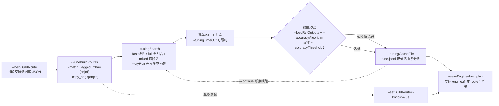
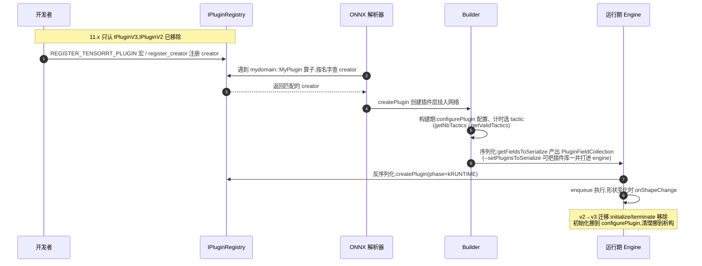

同一个 ONNX 模型交给 TensorRT,engine 的性能上限不是碰运气决定的：构建器内部有一批"旋钮"——启发式、层选择、代码生成开关，一组取值组合就叫一条 **build route(构建路由)**，不同 route 产出的 engine 性能不同、偶尔数值精度也不同。11.1 起 trtexec 内置的**全局性能调优器**把这条搜索变成自动化闭环:3 个二值旋钮全组合是 8 条路由，`fast` 策略只构建 4 次就能给结论，还能用参考输出自动丢弃精度漂移超阈值的 engine。构建期的另一半决策是 tactic(每层实现的选择)与 workspace 预算，运行期的"扩展口"则是插件——11.x 中 **IPluginV2 已被移除，新插件必须实现 IPluginV3**。本章前几篇讲清了 TensorRT 是什么、怎么把模型变成 engine(见 [12.1 TensorRT 是什么](/AIInfraGuide/inference/模块四-推理优化/第12章-tensorrt推理引擎/121-tensorrt是什么))，这一篇钻进构建器内部，回答三个问题:engine 为什么快、能不能更快、装不下的算子怎么自己造。

<!-- more -->

## 📑 目录

- [1. 构建路由：把"玄学优化"变成可搜索的空间](#1-构建路由把玄学优化变成可搜索的空间)
- [2. 全局性能调优器：让机器替你扫路由](#2-全局性能调优器让机器替你扫路由)
- [3. tactic 与内存规划：构建器内部的选路与预算](#3-tactic-与内存规划构建器内部的选路与预算)
- [4. 自定义算子：插件与 IPluginV3 新范式](#4-自定义算子插件与-ipluginv3-新范式)
- [5. 插件生态与进阶线索](#5-插件生态与进阶线索)
- [总结](#-总结)
- [自我检验清单](#-自我检验清单)
- [参考资料](#-参考资料)

---

## 1. 构建路由：把"玄学优化"变成可搜索的空间

### 1.1 为什么同一个模型，engine 却可以不一样

同一个 ONNX 文件、同一张 GPU，构建出的 engine 一定一样吗？**不一样，而且这是设计使然。** TensorRT 的构建器(builder)内部有大量决策点，官方把它们统称为三类旋钮:

- **启发式(heuristics)**:决定图变换、融合策略的经验规则；
- **层选择(layer selections)**:同一层用哪种实现路径；
- **代码生成开关(codegen toggles)**:是否启用某些 kernel 生成器。

打个比方：同一个窗口的同一道菜，后厨可以调辣度、调油量、调火候——配方不同，端出来的菜口味不同，偶尔分量也不同。**一组旋钮取值的完整组合，就是一条 build route(构建路由)；不同 route 产出的 engine 性能不同，偶尔数值精度也不同**——这是 TensorRT 官方对 build route 的定义(出处:samples/trtexec/README.md 第 7 节)。

### 1.2 旋钮数据库:helpBuildRoute

问题来了：旋钮有多少个、每个能取哪些值、默认是什么？**答案是 `--helpBuildRoute`:它把旋钮数据库以 JSON 形式打印出来，每条记录包含旋钮名、允许值、默认值——这是你能调什么的事实来源。**

```bash
# 打印全部旋钮
./trtexec --helpBuildRoute

# 只看某一个旋钮(开头的短横线可省略)
./trtexec --helpBuildRoute=match_ragged_mha
./trtexec --helpBuildRoute=-match_ragged_mha
```

文档里反复出现的两个示例旋钮是 `match_ragged_mha` 和 `copy_ppg`。如果旋钮名不存在，trtexec 以非零状态退出并提示去查全量列表。💡 **提示**:旋钮集合随 TensorRT 版本变化——一个版本里的旋钮，另一个版本可能不存在，默认值也可能变，所以**先 `--helpBuildRoute` 再动手，永远不要凭记忆**。

### 1.3 一条路由长什么样:setBuildRoute

单条路由用 `--setBuildRoute` 表达：空格分隔的一组 `-knob=value` token，每个 token 前带短横线:

```bash
./trtexec --onnx=model.onnx \
          --setBuildRoute="-match_ragged_mha=on -copy_ppg=off" \
          --saveEngine=model.plan
```

它的用途很专一:**精确复现调优扫描中的某一次迭代**——把扫描日志里某轮的路由抄进 `--setBuildRoute` 重跑一遍，用于调试或复现。

### 1.4 诚实警告:engine 构建不是比特确定的

这里有一条反直觉的官方告诫，值得先钉死:**用同一条 route 重跑，engine 的字节可能不一样。** 原因：构建器按 kernel 计时做决策，而计时有抖动，平局时选谁就不同，序列化结果跟着变；另外，你显式钉住的旋钮值也可能被编译器在内部覆盖(如果网络要求)。官方结论是：引擎构建不是比特确定的，**需要精确行为时，发运 `--saveEngine` 保存的 engine 文件，而不是 route 字符串**——engine 才是真相。

如果确实需要可复现构建，官方给出的路线是 timing cache:样例 `sampleEditableTimingCache` 演示了如何用**可编辑的 timing cache** 钦定 tactic，从而做出确定性构建(详见 3.5)。

## 2. 全局性能调优器：让机器替你扫路由

旋钮这么多，难道手动一个个试？**11.1 起 trtexec 内置了全局性能调优器(global performance tuner):扫描一组 build route、逐个构建并基准、可选做精度校验、记录最优配置，全程一条命令。** 注意一个边界:tuning 功能**不支持 Windows**。

### 2.1 扫描表达式:tuneBuildRoutes

`--tuneBuildRoutes` 接收一个表达式，描述要扫的路由集合，支持两种 token 形式:

- `-knob=[a|b|c]`:**可变旋钮**，扫描循环遍历每个取值；
- `-knob=fixed`:**钉死旋钮**，每一轮迭代都用这个值。

```bash
./trtexec --onnx=model.onnx \
          --tuneBuildRoutes="-match_ragged_mha=[on|off] -copy_ppg=[on|off]" \
          --saveEngine=best.plan
```

表达式很长时，可以每行一个 token 写进文件，用 `--tuneBuildRouteFile=routes.txt` 传入(与 `--tuneBuildRoutes` 互斥)。`--saveEngine` 不传也能扫描基准，但一旦启用精度校验(`--loadRefOutputs`),`--saveEngine` 就变成必填。

### 2.2 搜索策略:tuningSearch

表达式展开成哪些路由，由 `--tuningSearch` 控制，三种策略:

| 策略 | 行为 | 复杂度 |
|------|------|--------|
| `fast`(默认) | 基线(全部取默认值)+ 每次只翻转一个旋钮的一次性变体 | 线性：旋钮数 + 1 |
| `full` | 所有可变旋钮的笛卡尔积 | 指数，只适合小表达式 |
| `mixed` | 先跑 fast 找出"有效旋钮"，再只对这些旋钮做全组合 | 折中，适合较大空间 |

代入算例:3 个二值旋钮 `-A=[on|off] -B=[on|off] -C=[on|off]`，默认全 on——**`full` 生成 8 条路由(2³);`fast` 只生成 4 条**:基线 `A=on B=on C=on`，加上三条逐一翻转的变体。`mixed` 先跑这 4 条，假设 A、C 相对基线有提升，第二阶段就扫 A×C 的 4 条组合，B 钉死在默认值。

`--dryRun` 只枚举路由列表、不构建任何 engine，适合在付构建费之前检查大表达式——但**它不能与 `--tuningSearch=mixed` 组合**。

### 2.3 精度感知调优：别让最快的 engine 偷偷变差

build route 偶尔会改变数值精度，所以调优器支持**精度感知**:把每次迭代的输出和参考输出(通常是 CPU/FP32 或其他框架抓取的)对比，漂移超阈值的 engine 直接丢弃。三个 flag 配合使用，`--loadRefOutputs` 出现时 `--accuracyThreshold` 必填:

```bash
./trtexec --onnx=model.onnx \
          --tuneBuildRoutes="-match_ragged_mha=[on|off]" \
          --loadInputs=input:input.bin \
          --loadRefOutputs=output:ref_output.bin \
          --accuracyThreshold=0.5 \
          --saveEngine=best.plan
```

损失度量由 `--accuracyAlgorithm` 选择，五种全部非负、越小越好(0.0 为完美匹配):

| 取值 | 度量 | 含义 |
|------|------|------|
| `l0`(默认) | 容差外元素占比 | 落在 `atol + rtol·abs(ref)` 之外的元素比例(可调 `--atol`/`--rtol`) |
| `l1` | 平均绝对误差 | 所有元素误差的均值 |
| `l2` | 均方误差 | 误差平方的均值 |
| `lInf` | 最大绝对误差 | 最差的那个元素 |
| `cos` | 余弦相似度补 | `1 − cosine_similarity(实际, 参考)` |

需要多组输入验证时，用 `--refPair=N` 分组，每组一对 `(输入, 参考输出)`，每组输入可以是不同的 batch 或代表性样本——**每一轮迭代要同时通过所有组的校验**。未通过校验的迭代会记入缓存，但被排除出 best engine 的候选。

### 2.4 缓存与断点续跑:tuningCacheFile 与 continue

`--tuningCacheFile=tune.jsonl` 把整场扫描写成一个 JSONL 文件：第一行是本次运行的描述，之后每完成一轮迭代写一行，包含 build route、GPU 时间和每个输出的精度 loss。这个文件既是人可读的扫描记录，也是断点续跑的输入:

```bash
# 扫到一半 Ctrl-C / OOM / 超时,之后:
./trtexec --continue --tuningCacheFile=tune.jsonl
```

`--continue` **只接受 `--tuningCacheFile` 一个 flag**，传 `--onnx`、`--tuneBuildRoutes`、`--accuracyThreshold` 等都会被拒绝——缓存文件里已经携带了恢复所需的全部信息，已完成的迭代结果保留，从最后一条之后继续。另有 `--tuningTimeOut=<秒>` 限时(`-1` 为不限),`--saveAllEngines` 除 best 外还把每轮 engine 存成 `<路径>.iter<N>`(磁盘占用大，专门用来排查某轮精度回归)。

### 2.5 调优的边界：什么时候该信，什么时候别信

调优器不是印钞机，官方列出的一组告诫值得原样记住:

- **收益是机会主义的**:默认 route 可能已经是最优的，任何加速都是红利，不是预期；
- **结果是模型特定的**:换模型、甚至同一模型换形状或精度重构建，旧结论作废；
- **结果是硬件特定的**:不同 GPU SKU 选出的 best route 不同，换目标卡要重调；
- **结果随版本漂移**:升级 TensorRT 或调优器后，非默认 route 的优势不保证保留，甚至可能跑输新默认值——**只有默认 route 的性能回归被官方当作 bug 追踪，非默认 route 是尽力而为**;
- **阈值别拍脑袋**:`--accuracyThreshold` 太紧会一轮都过不了，没有先验校准就先放宽再逐步收紧。



## 3. tactic 与内存规划：构建器内部的选路与预算

### 3.1 tactic 是什么：一层的多种实现

**tactic = 构建期为某个层选定的实现(某个 kernel 变体)。** 一个算子层，TRT 手里往往有好几种实现：不同的库(CUBLAS、cuBLASLt、cuDNN)、不同的 kernel 生成路径。谁来做选择？**builder 构建期逐个计时，选最快的那个**——这就是"优化"二字的主体工作。插件同样可以声明自定义 tactic:实现 `getNbTactics`/`getValidTactics` 把多个 kernel 变体交给 builder 计时挑选，运行期再用 `setTactic` 被告知选中了哪个。

### 3.2 裁剪 tactic 源:tacticSources

`--tacticSources` 控制构建时允许使用哪些实现来源。最经典的用法是**关掉某个内存胃口过大的来源**:

```bash
./trtexec --onnx=model.onnx --saveEngine=model.plan \
          --memPoolSize=workspace:4096 \
          --tacticSources=-CUBLAS_LT
```

官方故障排查清单里，"构建期 OOM"的标准处方就是两条：调低 `--memPoolSize=workspace:N`，或关掉不需要的 tactic 源(出处:documents/import_workflows.md)。代价很清楚:**牺牲一部分实现搜索空间，换取构建能跑完**——如果被关掉的源恰好握着最优 kernel，最终性能会略降。⚠️ **注意**:`--tacticSources` 改的是构建期搜索范围，不是运行期开关。

### 3.3 workspace 内存池:memPoolSize

构建期的算法搜索需要 scratch 内存，`--memPoolSize=workspace:N` 给它设一个上限(单位 MiB，如 `4096`)。不设限时，构建器可能为了找最优解申请巨额工作区，在多路并行构建的场景直接撑爆显存。权衡: **workspace 上限越小，能进候选的算法越少，最终性能越可能打折；换来的是一张卡上能同时跑更多构建任务。** 💡 **提示**:构建期峰值与运行期峰值是两回事——`--memPoolSize` 管的是构建期，运行期显存由 engine 本身决定。

### 3.4 慢首次推理：一次性的 JIT 与反序列化

现象:engine 第一次 `enqueue` 明显慢，之后恢复正常。原因官方给得很直接:**CUDA kernel JIT 编译 + plan 反序列化，都是一次性开销**。所以基准测试的标准姿势是**热身至少 3 次再计时**("Warm up with ≥3 iterations before timing"，出处同上)——这也是第 9 章讲测量口径时反复强调的问题(见 [9.1 推理指标体系](/AIInfraGuide/inference/模块四-推理优化/第9章-性能分析与benchmark/91-推理指标体系)):口径不对齐，优化白做。

### 3.5 确定性构建的线索：可编辑 timing cache

timing cache 是构建期计时结果的缓存，复用它可以显著加快反复构建。而**可编辑**版本更进一步：你可以手动改写缓存里的计时，钦定某层用哪个 tactic，从而让构建结果可复现。官方样例 `sampleEditableTimingCache`(samples/README.md 收录)演示了完整做法——这是 1.4 节"engine 非比特确定"的官方补救路线。

## 4. 自定义算子：插件与 IPluginV3 新范式

### 4.1 什么时候需要插件，注册机制是什么

解析器报 "unsupported op" 时，官方给三条路:**改 exporter/opset、重写子图、写自定义插件**(出处:documents/import_workflows.md)。插件就是用 TRT 插件 API 实现的自定义层，塞进网络图参与构建期优化、运行期执行。

注册是关键机制:**插件必须先注册进 `IPluginRegistry`，才会对 TRT 可见。** TRT 自带插件在 `libnvinfer_plugin.so` 中预注册，加载即用，无需任何操作；自定义插件库则要显式提供。trtexec 里两种方式:

```bash
# 方式一:运行时动态加载插件库
./trtexec --onnx=model.onnx --dynamicPlugins=./libmyplugin.so --saveEngine=model.plan

# 方式二:把插件库序列化进 engine 本身,之后运行不再需要 --dynamicPlugins
./trtexec --onnx=model.onnx --setPluginsToSerialize=./libmyplugin.so --saveEngine=model.plan
```

方式二适合"构建完发运 engine"的流程——插件随 engine 走，目标机器不用再管理插件库(trtexec README Example 1)。

### 4.2 IPluginV3:11.x 的唯一新范式

**11.x 的重大变化:IPluginV2 及相关 API 已被移除，新插件必须实现 IPluginV3**(出处:TensorRT 主仓库 README 的 11.x 迁移公告)。新插件由两个类组成:

- **IPluginV3**:插件本体，通过 `getCapabilityInterface` 分发三个能力面——**core(身份)/ build(构建期)/ runtime(运行期)**；构建期挂入网络的插件三个能力都必须齐全；
- **IPluginCreatorV3One**:工厂类，负责按名字创建插件、在反序列化时重建插件。

相比 v2，几个关键变化决定了迁移的工作量:

- **没有 `initialize`/`terminate`/`destroy` 了**:插件必须构造即就绪，懒初始化挪到 `configurePlugin`/`onShapeChange`，资源清理挪到析构函数；
- **`attachToContext` 语义大变**:变成"克隆并挂接"，返回新对象，资源通过 `IPluginResourceContext` 申请，而且**不再白送 cuDNN/cuBLAS handles**，要用就自己初始化；
- **序列化从裸字节流变成结构化字段**:`getFieldsToSerialize` 产出 `PluginFieldCollection`，反序列化走 `createPlugin(phase=kRUNTIME)`;⚠️ **注意**:传入的 `PluginField` 数据缓冲归 TRT 所有、只在调用期间有效，插件必须**拷贝**自己需要保留的数据，存指针就是 use-after-free(官方迁移文档明确点名)。

注册与接线:

```cpp
// C++:静态注册宏(全局作用域)
REGISTER_TENSORRT_PLUGIN(MyPluginCreator);
```

```python
# Python:动态注册
trt.get_plugin_registry().register_creator(MyPluginCreator(), "")
```

ONNX 接线方式：导出时把算子命名为 `mydomain::MyPlugin`，让插件名与 creator 名匹配，解析器按 domain 和名字查找插件。可运行的完整参考是官方样例 `samples/python/aliased_io_plugin`——它还演示了 I/O 别名(`getAliasedInput` + `PreviewFeature::kALIASED_PLUGIN_IO_10_03`)，即插件的输出与输入共享同一块缓冲、原地更新。

### 4.3 插件的一生：从注册到反序列化



整条链路的关键点：构建期序列化进 engine 的只是**字段数据**(PluginFieldCollection)，真正执行用的 kernel 代码在插件库里——所以要么运行环境能加载插件库(方式一)，要么把库本身也序列化进 engine(方式二)，缺一不可。

### 4.4 插件库的动态加载协议

想让 TRT 在加载共享库时自动发现插件，库必须暴露两个 C 入口符号(trtexec README 原文):

```cpp
extern "C" void setLoggerFinder(ILoggerFinder* finder);
extern "C" IPluginCreatorInterface* const* getCreators(int32_t& nbCreators);
```

`setLoggerFinder` 接收 TRT 传来的 logger finder，供插件库内部打日志；`getCreators` 返回库内全部 plugin creator 的数组及数量。旧符号 `getPluginCreators` 仍可用但已废弃。官方可抄的实现范例在 `plugin/vc/vfcCommon.cpp`。这解释了 4.1 的两种加载方式为什么能工作:`--dynamicPlugins` 就是让 trtexec 加载这样的库，而 `--setPluginsToSerialize` 则把库的字节流打包进 plan，反序列化时自动重建。

### 4.5 从 v2 迁移到 v3:改什么

官方有完整迁移指南(Developer Guide "Migrating V2 Plugins to IPluginV3"),11.2 还新增了逐行对照的样例 `sample_plugin_v2_to_v3_migration`。核心改动清单:

- **creator 换代**:`IPluginCreator` → `IPluginCreatorV3One`;`deserializePlugin`(裸缓冲)并入 `createPlugin`(字段集合 + phase 参数);
- **输出形状**:按索引查询的 `getOutputDimensions` → 一次性返回的 `getOutputShapes`(参数里多了形状输入，支持数据相关形状);
- **返回值**:一堆 `void` 方法变成返回 `int32_t` 状态码(如 `configurePlugin`);
- **描述符**:`supportsFormatCombination`/`getWorkspaceSize` 收到的是动态描述符 `DynamicPluginTensorDesc`(含 min/opt/max 三个 profile 值);
- **序列化**:`getSerializationSize`+`serialize` 裸字节流 → `getFieldsToSerialize` 字段集合；
- 迁移顺序建议：先迁到 `IPluginV2DynamicExt` 再迁 V3，每步有对照表可查。

## 5. 插件生态与进阶线索

### 5.1 官方插件三年演化：从 11.0 到 11.2

CHANGELOG 里官方插件的增减，是 TensorRT 支持模型谱系的晴雨表:

| 版本 | 新增 | 移除 / 迁移 / 其他变化 |
|------|------|-------------|
| 11.0 | Faster Air Top-K | 移除 12 个废弃插件:`batchTile`、`clip`、`coordConvAC`、`cropAndResize`、`gelu`、`leakyRelu`、`normalize`、`singleStepLSTM`、`specialSlice`、`split`、`nms`、`proposal`;`python_plugin` 与 `onnx_custom_plugin` 迁移到 V3 |
| 11.1 | `topkLastDimPlugin`;`cute_dsl_plugin`(RMSNorm + CuteDSL kernel 的 Python 插件) | trtexec 新增全局性能调优器 |
| 11.2 | `FFTPlugin`(cuFFT 后端，支持 ONNX DFT 算子) | 新增 `sample_plugin_v2_to_v3_migration` 迁移示例 |

📌 **关键点**:被移除的几乎全是 CV 时代的算子(`gelu`/`leakyRelu` 早已被原生层覆盖，`nms`/`proposal` 属于检测流水线)，新增的则指向 LLM(TOP-K、RMSNorm)与科学计算(FFT)——插件生态的演进方向，就是推理负载的演进方向。另外注意 creator 有"名字 + 版本 + namespace"三段标识，升级插件时 bump 版本号，避免新旧版本混淆。

### 5.2 进阶线索：数据相关形状、多设备、DLA 与安全

- **数据相关输出形状**:输出形状由输入值决定(如 NonZero)——`sampleNonZeroPlugin`(C++)与 `non_zero_plugin`(Python)，以及用 `IOutputAllocator` 的 `dds_faster_rcnn`;
- **多设备执行**:一个 engine 跨多 GPU 执行——`sampleDistCollective`、`DistCollective` 算子(10.16 加入，构建需 `TRT_BUILD_ENABLE_MULTIDEVICE` + NCCL)，以及 MPI/NCCL 多设备 attention 样例 `attention_mdtrt`;
- **DLA 硬件**:Jetson/DRIVE 平台的专用深度学习加速器——`--useDLACore`、`sampleCudla`、解析器 `kADJUST_FOR_DLA` 旗标；
- **安全流程**:汽车安全场景——`--safe` 旗标、`sampleSafeMNIST`、`trtSafeExec`；安全插件必须用 `REGISTER_SAFE_TENSORRT_PLUGIN` 宏注册。

## 📝 总结

1. **构建路由**:build route 是"启发式 + 层选择 + 代码生成开关"三类旋钮的一组取值组合；`--helpBuildRoute` 是旋钮数据库，`--setBuildRoute` 单条复现，`--tuneBuildRoutes` 自动扫描。engine 构建非比特确定，**发运保存的 engine，而不是 route 字符串**。
2. **调优闭环**:扫描(`--tuningSearch` fast/full/mixed)→ 基准 → 精度校验(`--accuracyAlgorithm` 五种度量)→ JSONL 缓存(`--tuningCacheFile`)→ 选出 `best.plan`；收益机会主义，结论模型特定、硬件特定、版本特定。
3. **tactic 与 workspace**:tactic 是层的实现选择，构建期计时拍板；`--tacticSources` 裁剪实现来源、`--memPoolSize` 限制工作区——拿少量性能换构建可行；慢首次推理来自 kernel JIT + 反序列化，热身 ≥3 次再计时。
4. **IPluginV3 范式**:11.x 移除 IPluginV2，新插件 = `IPluginV3` + `IPluginCreatorV3One`；注册(宏 / `register_creator`)→ 解析器按 `mydomain::MyPlugin` 匹配 → 构建期序列化(`getFieldsToSerialize`)→ 运行期 `createPlugin(kRUNTIME)` 重建；`initialize`/`terminate` 与裸缓冲序列化全部退场。
5. **生态演化**:11.0 移除 12 个 CV 时代插件、11.1 加 TOP-K/RMSNorm、11.2 加 FFT——插件库增减就是推理负载演进的晴雨表；数据相关形状、多设备、DLA、安全是四条延伸路线。

## 🎯 自我检验清单

- 能解释 build route 的定义，并说出它由哪三类旋钮组成；
- 能用 `--helpBuildRoute` 查出某个旋钮的允许值与默认值，并说明为什么不能凭记忆写旋钮；
- 能写出 `--setBuildRoute` 表达式，并说清它与 `--tuneBuildRoutes` 的分工(复现 vs 扫描);
- 能计算 3 个二值旋钮在 `fast` 和 `full` 策略下各构建几次(4 vs 8)，并解释 `mixed` 的两阶段逻辑；
- 能说明为什么"发运 route 字符串"不可靠，正确的做法是发运保存的 engine;
- 能配置一次精度感知调优:`--loadInputs` + `--loadRefOutputs` + `--accuracyThreshold` + `--refPair` 多组验证；
- 能解释 `--continue` 为什么只需要 `--tuningCacheFile` 一个参数就能恢复扫描；
- 能诊断构建期 OOM，并给出两个处方(`--memPoolSize=workspace:N`、`--tacticSources=-CUBLAS_LT`)及各自牺牲了什么；
- 能解释首次推理慢的原因，并说出官方建议的热身次数(≥3 次);
- 能说出 11.x 中自定义插件必须实现哪两个类，以及注册的两种方式(C++ 宏 / Python `register_creator`);
- 能画出插件从注册、解析器匹配、构建期序列化到运行期反序列化的生命周期；
- 能说出 v2→v3 迁移中 `initialize`/`terminate` 的归宿，以及序列化方式从裸缓冲变成了什么。

## 📚 参考资料

**官方文档**

- [TensorRT 仓库:samples/trtexec/README.md](https://github.com/NVIDIA/TensorRT/tree/main/samples/trtexec/README.md):build route、全局性能调优器全部 flag(第 7 节)与插件加载方式(Example 1)的第一手说明
- [TensorRT 仓库:README.md](https://github.com/NVIDIA/TensorRT/blob/main/README.md):11.x 移除 IPluginV2 与弱类型网络等旧 API 的官方公告
- [TensorRT 仓库:CHANGELOG.md](https://github.com/NVIDIA/TensorRT/blob/main/CHANGELOG.md):11.0/11.1/11.2 插件增减、调优器与样例的逐版本记录
- [TensorRT 仓库:documents/import_workflows.md](https://github.com/NVIDIA/TensorRT/blob/main/documents/import_workflows.md):导入工作流、OOM 与首次推理慢的标准处方、插件注册与 ONNX 接线步骤
- [TensorRT 仓库:samples/README.md](https://github.com/NVIDIA/TensorRT/tree/main/samples/README.md):sampleEditableTimingCache、sampleNonZeroPlugin、sampleDistCollective、安全样例等索引
- [TensorRT Developer Guide:Extending Custom Layers / Plugin API Migration](https://docs.nvidia.com/deeplearning/tensorrt/latest/inference-library/plugins-api-migration.html):IPluginV3 API 全解、v2→v3 逐方法对照表与性能回归排查清单

**样例(仓库内路径)**

- `samples/python/aliased_io_plugin`:可运行的 V3 插件参考，含 I/O 别名用法
- `samples/python/sample_plugin_v2_to_v3_migration`:V2→V3 逐行迁移示例(11.2 新增)
- `samples/sampleEditableTimingCache`:用可编辑 timing cache 做确定性构建
