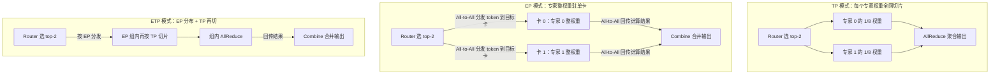
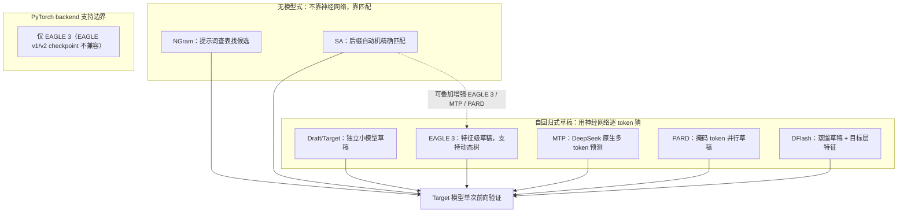

一张 80GB 的 H100 装不下 70B 模型的 FP16 权重——光参数就要约 140GB；就算用 8 张卡勉强塞进去，单卡也扛不住高并发请求。TensorRT-LLM 对付这两件事的武器库分三层：**多卡并行**负责"放得下、跑得快"（官方提供六种策略：TP/PP/DP/EP/CP/Wide-EP），**量化**把位宽从 16bit 砍到 8bit/4bit（官方称 FP8 相比 16bit 性能翻倍、显存减半），**投机解码**用"先猜后验"把串行解码步数砍掉一大截——但官方明说：投机解码只有小 batch 才看得到加速。本篇把镜头从上一章的核心 TensorRT 引擎转向它的 LLM 兄弟 TensorRT-LLM，一次讲清这三层武器库，再收尾介绍 guided decoding 与稀疏注意力等高级特性。并行与量化的通用原理在前面章节已铺垫过（[第6章-分布式推理](/AIInfraGuide/inference/模块四-推理优化/第6章-分布式推理/61-推理并行策略总览)、[第4章-量化](/AIInfraGuide/inference/模块四-推理优化/第4章-量化/41-量化基础)），这里重点讲 TensorRT-LLM 的工程实现与选型约束。

<!-- more -->

## 📑 目录

- [1. 一张卡装不下，一张卡跑不快：六种并行策略](#1-一张卡装不下一张卡跑不快六种并行策略)
- [2. 模块级并行：Attention 的 TP 与 DP 二选一](#2-模块级并行attention-的-tp-与-dp-二选一)
- [3. MoE 的三种执行模式：TP、EP 与混合 ETP](#3-moe-的三种执行模式tpep-与混合-etp)
- [4. Wide-EP：专家与槽位解耦](#4-wide-ep专家与槽位解耦)
- [5. 量化配方与硬件矩阵：FP8 与 FP4 能上什么卡](#5-量化配方与硬件矩阵fp8-与-fp4-能上什么卡)
- [6. 投机解码全家桶：从 EAGLE 3 到 Suffix Automaton](#6-投机解码全家桶从-eagle-3-到-suffix-automaton)
- [7. Guided Decoding：让输出长成你想要的样子](#7-guided-decoding让输出长成你想要的样子)
- [8. 稀疏注意力：长上下文的三条省力路线](#8-稀疏注意力长上下文的三条省力路线)
- [9. 其他高级特性清单](#9-其他高级特性清单)
- [总结](#-总结)
- [自我检验清单](#-自我检验清单)
- [参考资料](#-参考资料)

---

## 1. 一张卡装不下，一张卡跑不快：六种并行策略

为什么需要多卡？官方文档给的理由只有两条：**模型单卡放不下，或单卡达不到你要的性能**。围绕这两个动机，TensorRT-LLM 支持六种并行策略，每种切的东西不一样，通信开销和适用场景也完全不同。

打个比方：把模型推理比作一家厨房。**张量并行（TP）**是把一块大蛋糕按食材切——每张卡负责一部分食材的加工，同一道菜所有厨师协作完成，所以每层前向都要跨卡同步一次；**流水线并行（PP）**是流水线分工——卡 0 切菜、卡 1 炒菜、卡 2 装盘，每卡只干一道工序，卡间只传半成品；**数据并行（DP）**是开 N 个灶台做完全一样的菜，各接各的客人，互不通信但菜谱（模型权重）每灶都要备一份。

| 📊 策略 | 切/复制什么 | 卡间通信 | 官方定位"最适合" |
| --- | --- | --- | --- |
| TP（张量并行） | 切权重矩阵，每卡持一部分 | 每层 AllReduce，最密集 | 小 batch、显存受限 |
| PP（流水线并行） | 切层，每卡持若干层 | 层间传激活，低频 | 大模型单卡放不下 |
| DP（数据并行） | 复制整模型，各处理不同请求 | 基本无 | 大 batch、高吞吐 |
| EP（专家并行） | 切 MoE 专家，每卡持部分专家 | 路由 token 的 all-to-all | 专家数多的 MoE 模型 |
| CP（上下文并行） | 切序列，每卡处理一段 context | 注意力跨卡同步 | 长上下文场景 |
| Wide-EP（进阶 EP） | 专家复制 + 动态放置 | 定制 all-to-all kernel | DeepSeek-V3/R1、LLaMA4、Qwen3 等大规模 MoE |

📌 **关键点**：这张表的反直觉处是"最适合场景"和"为什么出发"并不一一对应——PP 能解决"放不下"，但 TP 也能（且常被优先选用），因为 TP 的通信在机内 NVLink 上很快；PP 真正的价值是让模型规模突破单机 8 卡的显存上限。通用原理与通信量公式见[第6章-分布式推理](/AIInfraGuide/inference/模块四-推理优化/第6章-分布式推理/61-推理并行策略总览)，这里记住一条工程规则：**TP 优先、装不下再加 PP、要吞吐再叠 DP**，三者可在 `parallel_config.yaml` 里组合。

## 2. 模块级并行：Attention 的 TP 与 DP 二选一

六种策略是"模型级"的视角。TensorRT-LLM 还允许你在**模块级**做更细的选择——注意力模块上，官方只提供 TP 和 DP 两种方案，且要求你**二选一**。为什么不能两个都要？因为 Attention 的并行方式决定了 KV cache 的摆放：TP 切头（KV cache 随之切分，但要多头跨卡同步），DP 复制权重（但不同请求路由到不同卡，KV cache 按请求切分、天然不冲突）。两个都开，KV cache 的归属就矛盾了。

| 维度 | Attention 上 TP | Attention 上 DP |
| --- | --- | --- |
| GEMM 权重 | 均匀切分到各卡 | 每卡复制一份 |
| KV cache | 按头切分（有例外，见下） | 按请求切分到各卡 |
| 代价 | 每步跨卡同步，通信随 batch 增长 | 显存 ×N，权重重复存放 |
| 官方建议 | 小 batch | 大 batch |

两个例外值得背下来：

- **DeepSeek-R1**：其 MLA（Multi-Latent Attention，多潜变量注意力）注意力里的 `fused_A` GEMM（融合的 Q/KV 投影）**不参与切分**，保持整权重；
- **GQA / MQA / MLA**（Grouped / Multi-Query / Multi-Latent Attention）：当注意力头数小于 TP 规模时（`num_heads < tensor_parallel_size`），KV cache 会在**每张卡上各复制一份**——头都不够分了，只能靠复制保证每卡有完整的 KV 供其处理的头使用。

切换开关很简单，`trtllm-serve` 或 `trtllm-bench` 通过 `--config parallel_config.yaml` 传入（字段名以你所用版本为准）：

```yaml
# TP-8：attention 走张量并行（默认）
tensor_parallel_size: 8
enable_attention_dp: false

# DP-8：attention 走数据并行
tensor_parallel_size: 8
enable_attention_dp: true
```

⚠️ **注意**：`enable_attention_dp` 只切换 Attention 模块；模型其余部分（如 FFN）仍按 `tensor_parallel_size` 切分。换句话说，这是"Attention 内部并行方式"的细粒度旋钮，不是全局 DP 开关。落成一句话：**小 batch 缺算力 → Attention 上 TP；大 batch 缺显存带宽 → 上 DP**。

## 3. MoE 的三种执行模式：TP、EP 与混合 ETP

MoE（混合专家）模型把一个大 FFN 换成几十上百个专家，每个 token 由 router 选出 top-k 个专家计算。专家怎么摆到卡上？TensorRT-LLM 支持三种执行模式，先看图再解释：



- **TP 模式**：每个专家的权重矩阵被切成 8 份摊到所有卡上，**每张卡都能看到全部 token**。好处是 kernel 利用率均匀，坏处是每个 token 都要触发跨卡通信——token 越多，通信越重。
- **EP 模式**：每个专家的**整份权重驻留在一张卡**上，每张卡**只见到被路由到自己专家上的 token**。通信量与 top-k 挂钩（token 只发给被选中的卡），但负载天然不均——热门专家接的 token 多，冷门专家闲着。
- **混合 ETP**：先按 EP 把专家分布到各卡，每个专家再按 TP 切一刀，兼顾负载均衡与 kernel 效率。

怎么配置？约束只有一条：**两个 MoE 并行度之积必须等于总 TP 规模**，即 `moe_tensor_parallel_size × moe_expert_parallel_size = tensor_parallel_size`。

```yaml
# TP only：专家切 8 份
tensor_parallel_size: 8
moe_tensor_parallel_size: 8

# EP only：8 张卡各放若干整专家
tensor_parallel_size: 8
moe_expert_parallel_size: 8

# Hybrid：TP-4 × EP-2
tensor_parallel_size: 8
moe_tensor_parallel_size: 4
moe_expert_parallel_size: 2
```

📌 **关键点**：TP 用"所有卡干所有专家"换 kernel 效率，代价是通信随 token 数线性涨；EP 用"每卡只干被点名的专家"换通信量，代价是负载不均和 all-to-all 的两次跨卡往返。EP 的负载不均问题正是下一节 Wide-EP 要解决的。

## 4. Wide-EP：专家与槽位解耦

DeepSeek-V3/R1、LLaMA4、Qwen3 这类大规模 MoE 用了细粒度专家设计，专家数量多、单个专家小，传统 EP 暴露三个痛点：**专家权重占显存大、专家间负载天然不均（热门专家问题）、分布式 EP 的通信开销高**。Wide-EP 是 TensorRT-LLM 对这三个痛点的系统性回答。

核心思想是**把"专家"和"槽位"两个概念解耦**：

- **Expert（专家）**：模型视角的概念，比如"专家 0、专家 1"是模型定义好的；
- **Slot（槽位）**：引擎视角的概念，是卡上实际存放专家权重的物理位置。

系统维护一张**路由表**，把 Expert ID 映射到 Slot ID。这张表可以**动态更新**——热门专家可以在多张卡上放多个副本（复制），负载变化时还能把专家从一个槽位挪到另一个槽位，由负载均衡策略驱动。

负载均衡策略（EPLB，Expert Parallelism Load Balancer）有两种：

| 策略 | 怎么工作 | 适用场景 |
| --- | --- | --- |
| Offline EPLB | 按历史负载统计**预计算**专家放置，逐层重分配权重 | 负载模式已知的生产部署 |
| Online EPLB | 根据**实时流量**动态调整专家放置 | 流量模式变化频繁的动态负载 |

配套的还有定制通信 kernel：针对 **GB200 多节点 NVLink（MNNVL）** 优化的 all-to-all 实现，专门服务专家分发（dispatch）与结果回传（combine），比传统 EP 的通信开销更低。

💡 **提示**：官方最佳实践是——生产环境负载已知，**先用 offline EPLB**；流量变化快，再换 online EPLB；同时监控专家统计、按显存约束调 `max_num_tokens`。注意 Wide-EP 不是免费的：专家复制用显存换负载均衡，动态路由用实现复杂度换吞吐，适合的是 DeepSeek-V3/R1 级别的大规模 MoE，小 MoE 模型用普通 EP 就够。

## 5. 量化配方与硬件矩阵：FP8 与 FP4 能上什么卡

量化是把权重/激活从高精度（如 BF16）转成低精度（INT8/FP8/FP4），换显存和带宽的节省（原理见[4.1-量化基础](/AIInfraGuide/inference/模块四-推理优化/第4章-量化/41-量化基础)）。TensorRT-LLM 的配方比想象中多：FP4、FP8 Per-Tensor、FP8 Block Scaling、FP8 Rowwise、FP8 KV Cache、NVFP4 KV Cache、W4A16/W4A8 GPTQ、W4A16/W4A8 AWQ。但**不是每个配方都能上每一块卡**——官方硬件支持矩阵是选型的第一道门槛：

| 📊 配方 | Blackwell sm120 | Blackwell sm100/103 | Hopper | Ada | Ampere |
| --- | --- | --- | --- | --- | --- |
| NVFP4 | ✅ | ✅ | ❌ | ❌ | ❌ |
| MXFP4 | ✅ | ✅ | ❌ | ❌ | ❌ |
| FP8 Per-Tensor | ✅ | ✅ | ✅ | ✅ | ❌ |
| FP8 Block Scaling | ❌ | ✅ | ✅ | ❌ | ❌ |
| FP8 Rowwise | ❌ | ❌ | ✅ | ❌ | ❌ |
| FP8 KV Cache | ✅ | ✅ | ✅ | ✅ | ✅ |
| NVFP4 KV Cache | ❌ | ✅ | ❌ | ❌ | ❌ |
| W4A8 / W4A16 AWQ、GPTQ | ❌ | ✅ | ✅ | ✅ | 仅 W4A16 |

（按官方 quantization.md 硬件矩阵整理；"✅/❌"随版本演进，以你所用版本的官方文档为准。）

三个反直觉点值得展开：

- **sm120（消费级 Blackwell）反而比 sm100/103（B200 等数据中心卡）支持的配方少**：只有 NVFP4、MXFP4、FP8 per-tensor 和 FP8 KV cache，block scaling 都不可用；
- **同为 FP8 block scaling，配方内核不一样**：sm100/103 上用的是 **MXFP8 配方（E4M3 激活/权重 + UE8M0 缩放因子）**，而 Hopper（SM90）上是 **E4M3 + FP32 缩放因子**——同一个名字，两代硬件两套实现；
- **DeepSeek-R1 的推荐组合是 NVFP4 或 FP8 block scaling**：NVFP4 仅 Blackwell 可用；FP8 block scaling 在 sm100/103 与 Hopper 上均可用（见上方矩阵）。

KV cache 量化有两个易混淆的入口：FP8 KV cache **可以手动开启**，即使 checkpoint 本身没量化（`KvCacheConfig(dtype='fp8')`）；而 NVFP4 KV cache **必须先用 ModelOpt 离线量化**生成 checkpoint，且目前只支持搭配 FP8 权重/激活量化（官方命令里 `--quant fp8` 是必选项）。NVFP4 的完整讨论见[4.5-FP8与NVFP4](/AIInfraGuide/inference/模块四-推理优化/第4章-量化/45-fp8与nvfp4)与本章[12.4-KV Cache 与长上下文](/AIInfraGuide/inference/模块四-推理优化/第12章-tensorrt推理引擎/124-kv-cache与长上下文)。

⚠️ **注意**：官方宣称 FP8 "性能翻倍、显存减半"（相对 16bit）是针对 H100 及更新的硬件；FP4（NVFP4/MXFP4）仅在 Blackwell（sm100/103 与 sm120）上受支持。老卡别硬上新配方——先查矩阵，再谈收益。

## 6. 投机解码全家桶：从 EAGLE 3 到 Suffix Automaton

投机解码的通用原理（小模型猜、大模型验、rejection sampling 保证分布无偏）见[5.1-核心原理与Rejection-Sampling](/AIInfraGuide/inference/模块四-推理优化/第5章-speculative-decoding/51-核心原理与rejection-sampling)。TensorRT-LLM 是少见的"全家桶"实现——官方支持七种算法（对应 `decoding_type` 的七个取值；另有 User-provided drafting 自定义草稿接口，路数不止这七条），分两大流派：



各算法的定位一句话讲清：

- **Draft/Target**：最朴素的形式，任意草稿模型逐 token 猜，注意**草稿与目标模型必须用同一个 tokenizer**，否则接受率骤降；
- **EAGLE 3**：在特征层（而非 token 层）做草稿，官方主力算法，可选动态树（见下）；
- **MTP**：DeepSeek 等模型**原生带 MTP 模块**，直接复用，配置时 `num_nextn_predict_layers` 必须等于 `max_draft_len`；
- **PARD**：目标无关（target-independent），用掩码 token 在**一次前向里并行猜出 K 个草稿 token**；
- **DFlash**：目标相关（target-dependent），草稿模型拿目标模型特定层的 hidden state 做 cross-attention 上下文；
- **NGram**：实现 Prompt Lookup 算法，从提示词和已生成内容里查表找重复片段做草稿；
- **SA（Suffix Automaton）**：无模型的 GPU 端精确匹配器，重复性内容（代码、枚举）上极准，可**单独使用**，也可叠加在 MTP/EAGLE 3/PARD 上做增强（`use_sa_spec=True`，`sa_spec_threshold` 默认 4）。

四个工程边界必须记住（官方文档原话级事实）：

1. **只有小 batch 才有加速**：启用投机后，每个请求都会生成一条固定长度 `max_draft_len` 的草稿序列，**目前无法动态关闭**，大 batch 下草稿抢占算力反而变慢；
2. **PyTorch backend 只支持 EAGLE 3**：`decoding_type: Eagle` 只是向后兼容别名，**EAGLE v1/v2 的 checkpoint 不兼容**；
3. **EAGLE 3 动态树**：`use_dynamic_tree=True` 让每个草稿层展开多个候选（与静态树 `eagle_choices` 互斥），提升接受率但增加每步计算；**滑动窗口注意力或 MLA 模型（DeepSeek、gpt-oss）不支持动态树**；
4. 投机解码收益边界（接受率、高温采样、大 batch）的系统讨论见[5.4-收益边界与限制](/AIInfraGuide/inference/模块四-推理优化/第5章-speculative-decoding/54-收益边界与限制)，EAGLE 系与 Medusa 的对比见[5.3](/AIInfraGuide/inference/模块四-推理优化/第5章-speculative-decoding/53-self-draft方案-medusa与eagle)。

## 7. Guided Decoding：让输出长成你想要的样子

Guided Decoding（引导解码，也叫受约束解码）保证模型输出**严格符合你给定的语法**——比如 JSON schema 或正则。它和采样不是一回事：采样控制"随机性"，引导控制"合法形状"。通用概念见[8.1-结构化输出](/AIInfraGuide/inference/模块四-推理优化/第8章-生产级服务特性/81-结构化输出)，这里看 TensorRT-LLM 的实现：两个 grammar 后端二选一。

| 📊 能力 | XGrammar | LLGuidance |
| --- | --- | --- |
| JSON schema | ✅ | ✅ |
| 正则表达式（regex） | ✅ | ✅ |
| EBNF 文法 | ✅ | ✅ |
| Structural Tag（结构标签） | ✅ | ❌ |

上线方式：`trtllm-serve` 在 YAML 里配 `guided_decoding_backend: xgrammar`（或 `llguidance`），请求侧走 OpenAI 兼容接口的 `response_format`，支持 `json` / `regex` / `ebnf` / `structural_tag` 四种 type；离线用 LLM API 则传 `GuidedDecodingParams(json=...)` 等。structural tag 是 XGrammar 独有能力，适合函数调用场景——比如只允许输出 `<function=xxx>{json}</function>` 这种固定格式。官方技术博客提及 guided decoding 可与投机解码联用（blog12：Combining Guided Decoding and Speculative Decoding），具体版本门槛以你所用版本的文档为准。

## 8. 稀疏注意力：长上下文的三条省力路线

长上下文推理时，attention 要对每个 token 看一遍全部 KV 条目，序列越长越贵。稀疏注意力的思路是：**跳过对输出贡献小的 KV 条目**。TensorRT-LLM 支持三种算法，路线完全不同：

| 📊 维度 | RocketKV | DSA（DeepSeek Sparse Attention） | Skip Softmax Attention（BLASST） |
| --- | --- | --- | --- |
| Prefill 加速 | ❌ | ✅ | ✅ |
| Decode 加速 | ✅ | ✅ | ✅ |
| 减少 KV 缓存 | ✅ | ❌ | ❌ |
| 需要框架级支持 | ✅ | ✅ | ❌ |
| 模型原生 | ❌ | ✅ | ❌ |

- **RocketKV**：免训练两阶段算法——context 阶段做**永久性 KV 淘汰**，decode 阶段做**动态 Top-K 选择**。框架级算法，目前要求**关闭 KV cache block reuse**（`enable_block_reuse=False`）；
- **DSA**：DeepSeek V3.2 引入的**模型原生**稀疏注意力——一个轻量 learned indexer 给所有 KV 条目打分，只保留 `index_topk` 个参与注意力。换模型就没得用；
- **Skip Softmax Attention / BLASST**：kernel 级方法，在 FlashAttention 式 kernel 里**动态跳过低贡献计算**，**不改模型架构**、不需要框架专门支持，普通全注意力模型直接加速。kernel 实际消费的是 `threshold_scale_factor`（阈值因子），可直接手设，也可用 ModelOpt 校准出 `target_sparsity` 到阈值的映射公式后按稀疏度目标配置。

📌 **关键点**：三条路线的取舍本质是"通用性 vs 收益"——RocketKV 减 KV 缓存但要多一步淘汰管理；DSA 效果最好但绑定 DeepSeek 系模型；BLASST 最通用（不动架构、不动模型）但只省计算不省缓存。先看你的瓶颈是缓存容量还是计算时间，再选路线。

## 9. 其他高级特性清单

最后把官方 features 目录里其余值得知道的特性过一遍（细节均以官方文档为准）：

| 特性 | 一句话说明 |
| --- | --- |
| LoRA 多适配器 | 一个基座模型挂多个 LoRA 适配器，支持 HF 与 NeMo 两种格式，动态切换 |
| Checkpoint Loading | 从 HuggingFace、NeMo 或自定义格式加载模型权重 |
| Embeddings 服务 | 把模型当 embedding 模型用，输出句向量 |
| torch.compile + Piecewise CUDA Graph | 注意力等难以捕获的算子走 eager，其余部分用 CUDA Graph 捕获回放，主要砍 context 阶段的 launch 开销；已知问题：不能与双模型配置（two-model 投机解码、多模态）共存 |
| Dynamo 集成 | 与 NVIDIA Dynamo 推理服务框架对接，做多模型调度 |
| Disaggregated Serving（Beta） | 把 prefill 与 decode 拆到不同 GPU，对应[7.2-解耦架构设计](/AIInfraGuide/inference/模块四-推理优化/第7章-pd解耦架构/72-解耦架构设计)的通用原理 |
| Mamba 快照边界 | 按 `periodic_snapshot_interval` 周期把 Mamba 隐状态快照进 KV cache 管理器（`kv_cache_config.mamba_state_config`），支撑 PD 解耦等跨卡状态迁移场景 |
| Auto Deploy（Beta） | 自动构建与部署引擎的实验性后端（细节待核实） |
| Helix | 官方文档存在的特性页，具体能力待核实 |

💡 **提示**：官方还维护一张 **feature-combination-matrix**（特性组合矩阵），专门回答"哪些特性可以同时开"——比如上文的 torch.compile 不能配双模型投机解码。组合特性前先查这张表，能省掉大量排查时间。

---

## 📝 总结

1. **并行**：六种策略各切各的——TP 切权重（小 batch 优）、PP 切层（装不下时用）、DP 复制模型（大 batch 优）、EP 切专家、CP 切序列、Wide-EP 是带负载均衡与专家复制的大规模 MoE 进阶方案；Attention 模块上 TP/DP 二选一，用 `enable_attention_dp` 切换，注意 GQA/MQA/MLA 在头数不足时会复制 KV cache；
2. **MoE 执行模式**：TP（专家全网切片、每卡见所有 token）、EP（专家整权重驻单卡、只见路由来的 token）、ETP（EP 分布 + TP 再切），三者满足 `moe_tensor_parallel_size × moe_expert_parallel_size = tensor_parallel_size`；Wide-EP 用 expert/slot 解耦 + 动态路由表解决热门专家与负载不均；
3. **量化**：配方先过硬件矩阵——sm120 只有 NVFP4/MXFP4/FP8 per-tensor，sm100/103 全配方且 block scaling 用 MXFP8 配方（E4M3+UE8M0），Hopper 的 FP8 是 FP32 缩放；DeepSeek-R1 走 NVFP4 或 FP8 block scaling；
4. **投机解码**：七种算法两大流派，PyTorch backend 仅 EAGLE 3，EAGLE v1/v2 checkpoint 不兼容，只有小 batch 有加速，动态树不支持 MLA/滑动窗口模型；
5. **高阶特性**：guided decoding 两个后端（XGrammar 功能最全）、稀疏注意力三条路线（RocketKV 减缓存 / DSA 模型原生 / BLASST 最通用），组合特性前先查官方组合矩阵。

## 🎯 自我检验清单

- 能说出 TensorRT-LLM 六种并行策略各自"切什么、为什么出发、官方定位的最适合场景"，误差不超过一个策略；
- 能解释 Attention 模块为什么 TP/DP 二选一，以及 GQA/MQA/MLA 在 `num_heads < tensor_parallel_size` 时 KV cache 为什么每卡复制；
- 能写出 `parallel_config.yaml` 实现 TP-8、EP-8、TP-4×EP-2 三种配置，并验证乘积约束；
- 能画出 MoE 三种执行模式的 router 分发路径，标出 TP 的 AllReduce 与 EP 的 all-to-all 通信点；
- 能一句话讲清 Wide-EP 的 expert 与 slot 解耦，并区分 offline 与 online EPLB 的适用场景；
- 能根据硬件型号回答"这块卡能不能跑 NVFP4 / FP8 block scaling"，判定线为官方硬件矩阵的 ✅/❌；
- 能解释同为 FP8 block scaling，sm100/103（MXFP8，UE8M0 缩放）与 Hopper（FP32 缩放）的配方差异；
- 能说明投机解码为什么只有小 batch 有加速（`max_draft_len` 固定、无法动态关闭），并指出 PyTorch backend 只支持 EAGLE 3；
- 能说出 EAGLE 3 动态树的开启条件与互斥项（`use_dynamic_tree` vs `eagle_choices`），以及不支持动态树的模型类型；
- 能根据"瓶颈是缓存容量还是计算时间"在 RocketKV / DSA / BLASST 中做出选择，并说明各方案牺牲了什么。

## 📚 参考资料

**官方文档（TensorRT-LLM）**
- [Parallelism in TensorRT-LLM](https://nvidia.github.io/TensorRT-LLM/features/parallel-strategy.html)：六种并行策略、Attention 模块级并行与 MoE 三种执行模式、Wide-EP 与 EPLB
- [Quantization](https://nvidia.github.io/TensorRT-LLM/features/quantization.html)：全部量化配方、模型与硬件支持矩阵、FP8/NVFP4 KV cache 用法
- [Speculative Decoding](https://nvidia.github.io/TensorRT-LLM/features/speculative-decoding.html)：Draft/Target、EAGLE 3、MTP、NGram、PARD、DFlash、SA 与动态树
- [Guided Decoding](https://nvidia.github.io/TensorRT-LLM/features/guided-decoding.html)：XGrammar 与 LLGuidance 两个后端及 OpenAI 接口用法
- [Sparse Attention](https://nvidia.github.io/TensorRT-LLM/features/sparse-attention.html)：RocketKV、DSA、Skip Softmax Attention 的 API 与对比
- [Torch Compile & Piecewise CUDA Graph](https://nvidia.github.io/TensorRT-LLM/features/torch_compile_and_piecewise_cuda_graph.html)：CUDA Graph 捕获与 eager 混合执行
- [TensorRT-LLM Overview](https://nvidia.github.io/TensorRT-LLM/overview.html)：LoRA、checkpoint loading、Dynamo 集成等能力总览
- [TensorRT-LLM GitHub 仓库](https://github.com/NVIDIA/TensorRT-LLM)：源码与 docs/source/features 全目录

**技术博客与论文**
- [Scaling Expert Parallelism in TensorRT-LLM（官方技术博客）](https://github.com/NVIDIA/TensorRT-LLM/blob/main/docs/source/blogs/tech_blog/blog04_Scaling_Expert_Parallelism_in_TensorRT-LLM.md)：Wide-EP 的设计动机与负载均衡细节
- [EAGLE-3 论文（arXiv:2503.01840）](https://arxiv.org/pdf/2503.01840)：特征级草稿与训练时测试
- [RocketKV 论文（arXiv:2502.14051）](https://arxiv.org/pdf/2502.14051)：两阶段免训练 KV 淘汰
- [BLASST 论文（arXiv:2512.12087）](https://arxiv.org/pdf/2512.12087)：Skip Softmax Attention kernel 级动态跳过
- [Combining Guided Decoding and Speculative Decoding（官方技术博客）](https://github.com/NVIDIA/TensorRT-LLM/blob/main/docs/source/blogs/tech_blog/blog12_Combining_Guided_Decoding_and_Speculative_Decoding.md)：guided decoding 与投机解码的组合用法
- [PARD 论文（arXiv:2504.18583）](https://arxiv.org/pdf/2504.18583)：掩码 token 并行草稿
- [DeepSeek-V3 论文（arXiv:2412.19437）](https://arxiv.org/abs/2412.19437)：MoE 架构与 MTP 模块来源
