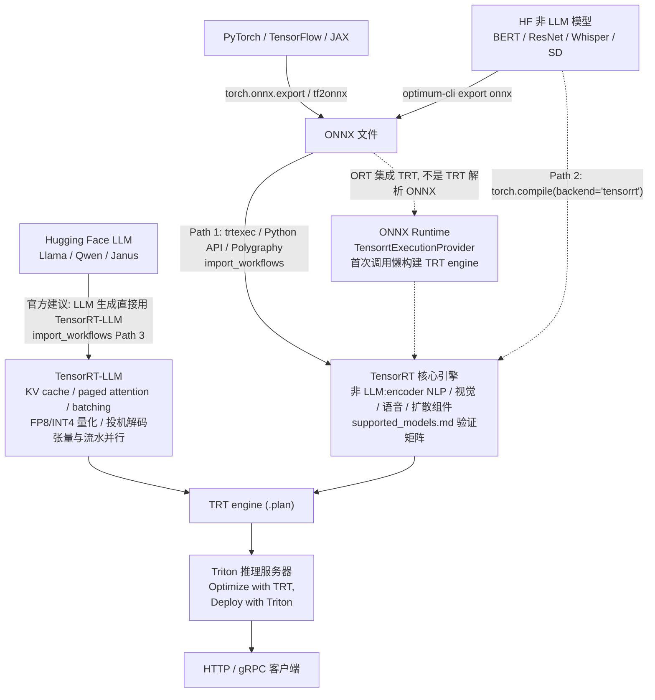
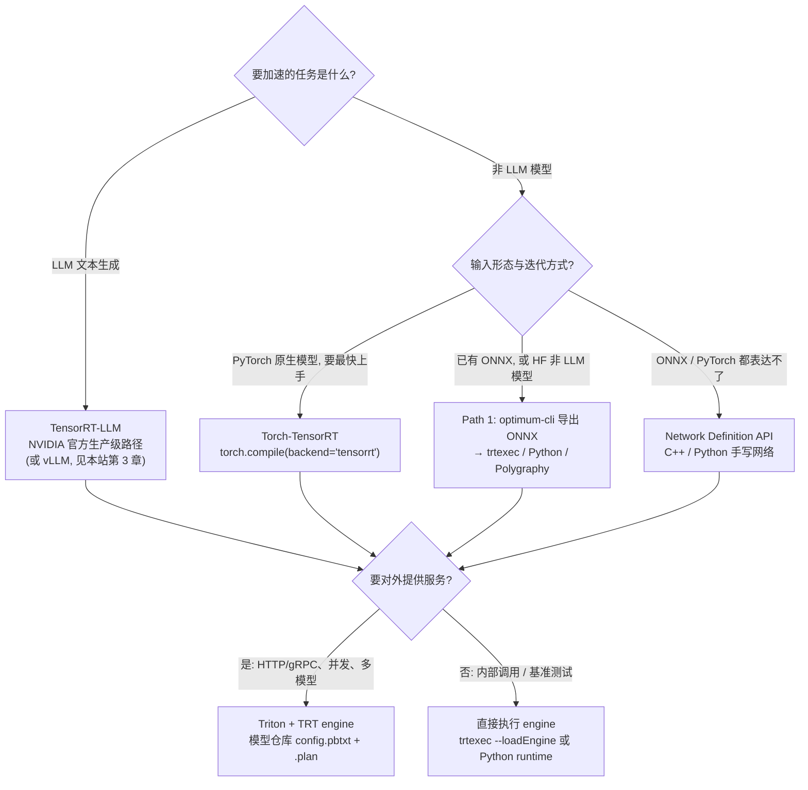

TensorRT 不是"又一个推理框架",而是一个生态的枢纽。官方导入指南对 LLM 生成的建议原话是 **"For LLM generation, use TensorRT-LLM directly"**——核心 TensorRT 的验证矩阵里,LLM 只有 4 行(Llama-3.1-8B、Llama-3.2-1B、Qwen3-0.6B、Janus-Pro-7B),且 LLM 小节顶部统一标注"首选 TensorRT-LLM";而 encoder NLP、视觉、语音、扩散、多模态五个非 LLM 家族，却有 50 余行验证基线由核心 TRT 直接编译执行。落成一句话分工:**LLM 生成交给 TensorRT-LLM,非 LLM 交给核心 TRT,框架内快速迭代用 Torch-TensorRT,构建优化用 TRT、部署服务用 Triton**。这是第 12 章的收尾篇：前五篇([12.1](/AIInfraGuide/inference/模块四-推理优化/第12章-tensorrt推理引擎/121-tensorrt是什么)起)讲的是 TRT 内部的构建与执行，这一篇把它放回整个推理生态看站位，顺带为模块四收一个"什么场景选什么"的尾。

<!-- more -->

## 📑 目录

- [1. 一张图看懂分工:TRT 生态全家桶](#1-一张图看懂分工trt-生态全家桶)
- [2. LLM 生成:TensorRT-LLM 才是正主](#2-llm-生成tensorrt-llm-才是正主)
- [3. 非 LLM:核心 TensorRT 的验证矩阵](#3-非-llm核心-tensorrt-的验证矩阵)
- [4. 与 ONNX Runtime:谁在执行，谁在集成](#4-与-onnx-runtime谁在执行谁在集成)
- [5. 部署交给谁:Triton 与 TRT 的分工](#5-部署交给谁triton-与-trt-的分工)
- [6. 工具链全家桶：一次导入过几道关](#6-工具链全家桶一次导入过几道关)
- [7. 选型决策树：模块四收官之问](#7-选型决策树模块四收官之问)
- [8. 权衡：编译期范式付了什么代价](#8-权衡编译期范式付了什么代价)
- [总结](#-总结)
- [自我检验清单](#-自我检验清单)
- [参考资料](#-参考资料)

---

## 1. 一张图看懂分工:TRT 生态全家桶

问题：为什么一个"推理引擎"要牵扯出 TensorRT-LLM、Triton、ONNX Runtime、Torch-TensorRT 这么多兄弟项目?

**因为推理链路的每个工位都需要一个专家**。打个比方：把一条推理生产线拆成三个工位——原料进来(模型来源)、精加工(构建优化)、出餐服务(对外部署)。TensorRT 是精加工车间的核心机床，但原料怎么进来、成品怎么端出去，各有各的专用设备，谁也不能越俎代庖:

- **模型来源** → ONNX 是"标准化半成品":任何框架(PyTorch、TensorFlow、JAX)都能导出,TRT 只认这一种"通用接口",外加 PyTorch 原生路径 Torch-TensorRT;
- **精加工** → 核心 TRT 负责非 LLM 网络;LLM 生成则整条产线搬到 TensorRT-LLM(它是建在 TRT 之上的 LLM 专用框架);
- **出餐服务** → Triton 推理服务器接住构建好的 engine,管并发、管 HTTP/gRPC、管多模型;
- **侧路** → ONNX Runtime 也能"借用"TRT 这台机床(懒构建),但那是 ORT 集成 TRT,不是 TRT 在跑 ONNX。



📌 **关键点**:这张图里每一条边都有官方出处——"Choosing a Path" 选型表(import_workflows)、"For LLM generation, use TensorRT-LLM directly"(Path 3)、"Optimize with TensorRT, Deploy with Triton"(quickstart)。后面四节逐条展开。

## 2. LLM 生成:TensorRT-LLM 才是正主

问题：核心 TRT 号称能编译任意网络，为什么 LLM 生成偏偏不让它直接干?

**因为自回归生成不是"一次前向",而是一个带状态的动态循环**。每一步解码都要读上一步的输出、KV cache 在变长、请求在并发进出——这本质是**运行时调度问题**,不是编译期能定死的。TensorRT 核心的官方定位是"通用神经网络图执行引擎"(general-purpose graph execution engine),擅长静态图的一次编译；而 LLM 服务需要 KV cache 管理、动态组批、分页 attention 这一整套运行时机制。官方导入指南原话(import_workflows Path 3):

> **For LLM generation, use TensorRT-LLM directly.** It is NVIDIA's active, production-grade path for Hugging Face LLMs — handles KV-cache, batching, paged attention, FP8/INT4 quantization, speculative decoding, and multi-GPU tensor/pipeline parallelism.

翻译成人话:**它是 NVIDIA 对 HF LLM 的生产级官方路径，负责 KV cache、批处理、paged attention、FP8/INT4 量化、投机解码、多卡张量与流水并行**——这些词你在本模块第 2、4、5、6 章都见过，它们不是 TRT 核心的活，是 TensorRT-LLM 的活。支持矩阵(supported_models.md)的 LLM 小节顶部统一标注"Preferred path for LLM generation: TensorRT-LLM",4 行验证基线 dtype 均为 bfloat16。

那和 vLLM 怎么摆？本站第 2、3 章已经覆盖了 vLLM 的事实：它是运行时调度范式的代表(PagedAttention 分页管理 KV cache、Continuous Batching 动态组批)。TensorRT-LLM 与 vLLM 定位重叠但出身不同——前者是 NVIDIA 官方路径、与 TRT 编译产物直接衔接。⚠️ **注意**:NVIDIA 官方文档没有给出"vLLM vs TensorRT-LLM"的对比结论(待核实),本文不虚构，只陈述本站第 3 章已覆盖的 vLLM 事实。

再泼一盆冷水：官方还点名了一个"坑"——`optimum-nvidia`(想用一行代码把 HF LLM 搬进 TRT 的封装)最后一次 release 是 2025-01-21 的 v0.1.0b9,此后一年多没有更新，且内部 pin 着旧版 TensorRT-LLM。**官方明确建议：新项目、生产项目直接用 TensorRT-LLM,别从 optimum-nvidia 入门**。

## 3. 非 LLM:核心 TensorRT 的验证矩阵

问题：那核心 TRT 到底"官方验证过"什么?

**支持矩阵是一份"已验证 + 已基准测试"清单，不是穷尽支持列表**。官方原话:"The table below is **not** an exhaustive support list. It is the subset of models NVIDIA has verified and benchmarked"(supported_models.md)。五个家族共 50 余行验证基线:

| 📊 模型族 | 代表模型(验证 dtype) | 用途 |
|---|---|---|
| Encoder NLP | bert-base-uncased(fp32)、roberta-base/large(fp32)、distilbert(fp32)、all-MiniLM-L6-v2(fp32)、bge-base-en-v1.5(fp32) | 分类、检索、embedding |
| 视觉 | resnet50(fp32)、mobilenetv3(fp32)、clip-vit-base/large(fp32)、dinov2-base(fp32) | 分类、视觉 embedding |
| 语音 | whisper-large-v3 / -turbo(encoder、decoder 各一行,fp32)、clap(fp32)、csm-1b backbone(fp32) | ASR、音频理解、语音生成 |
| 扩散 | SD 1.4/1.5/2.1/SDXL(fp16)、sdxl-turbo(UNet fp16、VAE/TextEnc mixed)、FLUX.1-schnell(mixed)、FLUX.2-dev(TE/DiT bf16、VAE fp16)、Wan2.2(fp16)、Qwen-Image(bf16)、SD3-medium(bf16)、SD3.5(mixed) | 文生图/视频，按组件逐行 |
| 多模态 | clip(fp32)、Janus-Pro-7B(bf16) | 图文理解、统一生成 |

> 注:dtype 为组件级验证基线，以官方 supported_models.md 逐行为准(如 FLUX.2-dev 的 VAE 为 fp16、sdxl-turbo 的 VAE/Text Encoders 为 mixed)。

读这张表有两个纪律。第一,**dtype 列只是验证基线，不代表其他精度不行**("Other precisions may also work");第二,**你的模型不在表里 ≠ 不支持**——官方明确说"期望它仍然能工作，如果不行请提 issue"。申请新覆盖的标准姿势是提 GitHub issue,附三样东西:① Hugging Face ID 或模型来源 URL;② 目标 dtype(fp32 / fp16 / bf16 / fp8 / int8 / int4);③ 框架级可运行示例。

扩散模型的"按组件逐行"值得单独说。打个比方：预制菜工厂不能把整本菜谱一次投料，得按"酱汁、主菜、装盘"分三条线加工，最后再组装。**diffusers 的 pipeline 同理——TRT 无法整体吃进 pipeline 对象，必须按组件分别导入构建**:文本编码器(text encoder)、UNet 或 DiT(去噪主干)、VAE(解码回像素),每个组件一个 ONNX、一个 engine。这就是为什么矩阵里 FLUX.2-dev 拆成三行(Text Encoder / DiT / VAE 各自标 dtype)。构建完再用代理对象把编译好的组件换回 pipeline,整条链路照常跑(官方 import_workflows 里 Qwen-Image 的完整工作示例就是这么做的)。

## 4. 与 ONNX Runtime:谁在执行，谁在集成

问题：网上说"TensorRT 直接执行 ONNX",这是真的吗?

**假的，准确说法是:ONNX Runtime 集成 TRT,而不是 TRT 解析 ONNX**。官方原话(import_workflows Path 1):

> An ONNX file must be converted to a serialized TensorRT plan (`.plan` / `.engine`) before the runtime can execute it — the TensorRT runtime deserializes plans, it does **not** parse ONNX.

也就是说 TRT runtime 只认反序列化后的 plan 文件，它根本不读 ONNX。那"TRT 执行 ONNX"的印象哪来的？来自 ONNX Runtime 的 **TensorrtExecutionProvider**:你在 ORT 里选了这个执行提供者，第一次调用时 ORT 会在内部**懒构建**(lazy-build)一个 TRT engine,之后每次推理复用同一个引擎。打个比方：你向一家餐厅点菜，餐厅第一次临时把菜外包给特级厨师做，之后每次直接取这位厨师做好的成品——**集成方是餐厅(ORT),厨师是 TRT**。

💡 **提示**:懒构建的代价是**首次调用慢**(要现场构建引擎),之后快。所以凡是走 ORT + TensorrtExecutionProvider 的路径，首调延迟别当 bug 报，先 warm-up 再计时。

那什么时候用 ORT、什么时候直接用 TRT?官方选型表(import_workflows "Choosing a Path")给的是**按"你手上有什么"分**:

| 你手上有什么 | 推荐路径 | 一句话理由 |
|---|---|---|
| 任何框架导出的 ONNX 文件 | Path 1:ONNX → TRT(trtexec / Python API / Polygraphy) | 最通用、最便携 |
| 训练好的 PyTorch 模型，想最快上手 | Path 2:Torch-TensorRT(`torch.compile(backend="tensorrt")`) | 留在 PyTorch 里迭代 |
| HF 模型(LLM / 扩散等) | LLM → TensorRT-LLM;非 LLM → 导出 ONNX 走 Path 1 | 见第 2、3 节 |
| C++ 自研架构、要极端控制 | Path 4:Network Definition API | 控制力最大，工作量最大 |

📌 **关键点**:四选一的判断依据是"输入形态 + 迭代方式",不是"谁更快"。ORT 和 TRT 不是平级对手——ORT 是集成层(可以挂 CPU/CUDA/TRT 多种执行后端),TRT 是执行后端之一。

## 5. 部署交给谁:Triton 与 TRT 的分工

问题:engine 都构建好了，自己写个程序加载跑不就行了，为什么还要 Triton?

**因为"网络级优化"和"服务化"是两套完全不同的工程问题**。官方 quickstart 里有一个教程，标题就是 **"Optimize with TensorRT, Deploy with Triton"**(deploy_to_triton 目录)——这八个字就是分工宣言:TRT 负责把模型优化到极致，但"支持并发模型执行、给客户端提供 HTTP/gRPC 接口、管理多模型"这些服务层能力，是 Triton Inference Server 的活。

官方教程的标准三步走:

```bash
# 1. TRT 构建(优化发生在这一层)
trtexec --onnx=resnet50.onnx --saveEngine=model.plan --useCudaGraph
# 2. 用 polygraphy 查 engine 的输入输出名和形状(后面配 config 要用)
polygraphy inspect model model.plan
# 3. 搭 Triton 模型仓库:config.pbtxt(描述输入输出/批处理)+ 1/model.plan
#    docker run ... nvcr.io/nvidia/tritonserver:<tag> tritonserver --model-repository=/models
```

⚠️ **注意**:官方教程特别强调——**构建 engine 的环境和 Triton 容器里的 TensorRT 版本必须一致**,否则 plan 文件可能加载失败。这也是"构建与部署分离"的第一个现实约束:TRT 版本成了部署清单里必须锁定的依赖。

Triton 接住 plan 之后，服务化的余下问题(容器化、K8s、扩缩容、容量规划)就回到[第 10 章](/AIInfraGuide/inference/模块四-推理优化/第10章-生产部署与运维/第10章-生产部署与运维)的地盘了。换句话说：本章前面讲的 TRT 是"把模型做快",第 10 章讲的是"把服务做稳",Triton 是连接两者的插座。

## 6. 工具链全家桶：一次导入过几道关

问题：一条 ONNX 从到手到上线，中间要过几道关?

**官方工具链的设计是"每一道关都有专用工具"**。先看全家桶(import_workflows "Tools Reference" + samples/trtexec README):

| 工具 | 干什么 | 怎么装 |
|---|---|---|
| `trtexec` | 从 ONNX 构建 engine、跑基准、导时间线 | 随 TRT 捆绑 |
| `polygraphy` | 检查、清洗、比对、调试模型每一环 | `pip install polygraphy` |
| `onnxsim` | 常量折叠、简化 ONNX 图 | `pip install onnxsim` |
| `onnx-graphsurgeon` | 程序化编辑 ONNX 图 | `pip install onnx-graphsurgeon` |
| `nsys` / `ncu` | 运行时剖析与 kernel 级分析 | NVIDIA CUDA Toolkit |
| `tracer.py` | 打印 `trtexec --exportTimes=trace.json` 导出的时间线 | 仓库 `samples/trtexec/` 下 |

典型的一条龙组合拳(其中 ①②③ 简化 → 清洗 → 构建的完整推导见 [12.3 §3.3/3.4](/AIInfraGuide/inference/模块四-推理优化/第12章-tensorrt推理引擎/123-导入路径与最小实战#33-简化与清理两行命令去掉一半坑),这里只列结论，重点看 12.6 新增的 ④⑤):

```bash
python -m onnxsim model.onnx model.sim.onnx                        # ① 简化图
polygraphy surgeon sanitize model.sim.onnx -o model.clean.onnx \
    --fold-constants                                              # ② 清洗:常量折叠
trtexec --onnx=model.clean.onnx --saveEngine=model.plan --fp16    # ③ 构建 engine
polygraphy run model.onnx --trt --onnxrt --atol 1e-3 --rtol 1e-3  # ④ 与 ONNX 逐层比对精度
nsys profile ...                                                  # ⑤ 运行时剖析
```

📌 **关键点**:官方反复强调 TRT 不覆盖全部 ONNX 算子(opset 覆盖随版本变化),所以 ④ 的"构建后比对"不是可选项——遇到不支持的算子,`trtexec` 会点名报错，处置顺序是：换导出器/opset → 改写子图 → 写自定义插件(plugin)。官方对调试器的评价是：精度对不上，先 `polygraphy run --trt --onnxrt` 定位到层，再考虑 FP16 引擎里对问题子图显式保留 FP32。

## 7. 选型决策树：模块四收官之问

问题：回到最初的起点——你手上有一个模型，到底该走哪条路?

把第 1-6 节的结论压成一张决策树(判据来自 import_workflows "Choosing a Path" 选型表):



落成一句话的规则:

- ✅ **LLM 生成** → TensorRT-LLM(或 vLLM,本站第 3 章)。别拿核心 TRT 硬啃自回归——KV cache 和动态形状是运行时问题;
- ✅ **非 LLM + PyTorch 原生 + 想快速迭代** → Torch-TensorRT,别先折腾 ONNX;
- ✅ **非 LLM + 已有 ONNX(或 HF 模型)** → Path 1:导出 → 简化 → 构建 → 比对;
- ✅ **要极端控制**(自定义架构、逐层指定)→ Network Definition API——**最后一个选项**,工作量最大;
- ✅ **要对外服务** → Triton 接住 .plan,HTTP/gRPC、并发、多模型都归它;
- ❌ 别把 .plan 文件当"便携产物"跨 GPU 架构搬运(见第 8 节);别为"显得高级"上 Network Definition API,ONNX 路径 90% 场景够用。

决策树之外，给模块四收个尾。整个模块 12 章其实在讲**两条互补的优化范式**:第 1-11 章的主线是"运行时调度"范式——vLLM 的动态组批、PagedAttention、Prefix Cache、投机解码、PD 解耦，都在回答"请求进来之后怎么调度";第 12 章补上"编译期优化"范式——构建期全局图优化、kernel 融合、tactic 搜索，回答"网络本身怎么编译到最狠"。两套范式的知识全景与 trade-off 大表,[11.4](/AIInfraGuide/inference/模块四-推理优化/第11章-推理优化选型与端到端实战/114-模块总结与持续学习) 已经收拢过，这里只补一句:**生产环境里两者不是二选一，而是按"模型形态 + 延迟要求"分层的——LLM 在线服务走运行时调度(或 TensorRT-LLM),极致低延迟的固定形态模型走编译期 TRT**。

## 8. 权衡：编译期范式付了什么代价

问题：编译期优化听着这么好，为什么不是所有推理都走 TRT?

**因为"编译期"三个字本身就写着代价**。没有免费午餐,TRT 用"构建期的重活"换"运行期的轻活":

| 换取了什么 | 牺牲了什么 |
|---|---|
| 构建期全局图优化:kernel 融合、精度选择、tactic 搜索 | 构建时间长：每次改 shape / dtype / 架构都要重新构建(分钟级) |
| 运行时零解析、零调度开销，延迟低而稳定 | plan 与 GPU 架构绑定：官方明确"plans are not portable across compute capabilities",换卡必须重建 |
| 静态形状下确定性最强 | 动态形状要预先声明 profile(min / opt / max 三档),超出范围报错 |
| — | 算子覆盖有限：不支持的 op 要改写子图或写插件 |

打个比方:TRT engine 像**按车型定制的发动机**——装车前做了大量台架调校(构建期),装车后点火就走、怠速稳定；但你把它拆下来装到另一款车上(换 GPU 架构),大概率打不着火，得重新调校。vLLM 那套运行时调度范式则相反：不用构建、形状随便变，代价是每个请求都要过调度器、算子逐个执行——牺牲编译期全局优化，换取灵活性与迭代速度(本站第 3 章的事实；官方没有做过两者对比，待核实)。

什么时候这个代价值得付?**模型形态固定(输入输出 shape 区间明确)、延迟敏感、流量可预期**的场景——比如把某个 encoder 或扩散组件固化成服务。反过来，形状千变万化、模型每周在改的探索期，先别上 TRT,让构建时间吃掉你的迭代节奏不划算。

---

## 📝 总结

1. **分工**:LLM 生成 → TensorRT-LLM(KV cache、paged attention、FP8/INT4、投机解码、多卡并行，官方原话 "use TensorRT-LLM directly");非 LLM → 核心 TRT;快速迭代 → Torch-TensorRT;服务化 → Triton。
2. **矩阵边界**:支持矩阵是 NVIDIA 已验证 + 已基准测试的子集，不是穷尽清单——50 余行覆盖五大非 LLM 家族，未列出的模型预期仍能工作，不行就提 issue(附 HF ID + 目标 dtype + 框架示例)。
3. **误解澄清**:TRT runtime 不解析 ONNX,只反序列化 .plan;"TRT 执行 ONNX"的真相是 ORT 的 TensorrtExecutionProvider 首次调用懒构建引擎——集成方是 ORT,不是 TRT。
4. **工具链**:onnxsim(简化)→ polygraphy(清洗/比对/调试)→ trtexec(构建/基准)→ nsys/ncu(剖析)→ tracer.py(时间线),一道关一个工具。
5. **范式**:TRT 用构建期的重活换运行期的轻活(plan 不可移植、构建分钟级、动态形状要 profile);与 vLLM 的运行时调度范式互补，按"模型形态 + 延迟要求"分层选型。

## 🎯 自我检验清单

- 能用一句话说出 TensorRT、TensorRT-LLM、Torch-TensorRT、ONNX Runtime、Triton 五者的分工边界;
- 能复述官方对 LLM 生成的原始建议("For LLM generation, use TensorRT-LLM directly")并说明 KV cache、paged attention、FP8/INT4、投机解码、多卡并行各由 TensorRT-LLM 的哪部分机制承接;
- 能解释为什么核心 TRT 不适合直接跑 LLM 生成(自回归是带状态的动态循环，属运行时问题，而 TRT 是静态图执行引擎);
- 能指出 `optimum-nvidia` 的维护状态(2025-01-21 后无 release,官方不推荐新项目)及原因;
- 能说明支持矩阵的承诺边界：已验证子集 ≠ 穷尽清单，未列出 ≠ 不支持，并说出申请新覆盖要附的三样东西;
- 能为一个扩散模型(如 SDXL 或 FLUX.2)列出必须拆分的组件清单(文本编码器 / UNet 或 DiT / VAE)并解释原因;
- 能纠正"TRT 直接执行 ONNX"的说法:TRT runtime 只反序列化 plan;ORT 的 TensorrtExecutionProvider 是懒构建集成方，并解释首次调用慢的原因;
- 能根据"手上有什么"四选一:ONNX 文件 → Path 1、PyTorch 想快 → Torch-TensorRT、极端控制 → Network Definition API、LLM → TensorRT-LLM;
- 能说出工具链各成员的职责并排出从 ONNX 到上线的一条龙命令顺序;
- 能解释 TRT 的"牺牲/换取":构建期全局优化换运行期零解析开销，代价是 plan 不可跨 GPU 架构移植、构建分钟级、动态形状需 profile;
- 能画出生态分工全景图与选型决策树，并指出图中每条边的官方出处;
- 能说明编译期范式(第 12 章)与运行时调度范式(第 1-11 章的主线)的互补关系，不把两者说成二选一。

## 📚 参考资料

**官方文档**
- [NVIDIA/TensorRT GitHub 仓库](https://github.com/NVIDIA/TensorRT):TRT OSS 主仓库，含 plugins、ONNX parser、samples 与本文引用的三份核心文档;
- [Import Workflows Guide(documents/import_workflows.md)](https://github.com/NVIDIA/TensorRT/blob/main/documents/import_workflows.md):四条导入路径、ONNX/ORT 澄清、工具链参考表、LLM 走 TensorRT-LLM 的官方建议;
- [Supported Models(documents/supported_models.md)](https://github.com/NVIDIA/TensorRT/blob/main/documents/supported_models.md):五大家族验证矩阵、dtype 基线、承诺边界与新模型申请规范;
- [TensorRT Developer Guide](https://docs.nvidia.com/deeplearning/tensorrt/latest/):构建、动态形状、插件与性能调优的完整手册;
- [QuickStartGuide(quickstart/README.md)](https://github.com/NVIDIA/TensorRT/blob/main/quickstart/README.md):含 "Optimize with TensorRT, Deploy with Triton" 教程入口;
- [deploy_to_triton 教程](https://github.com/NVIDIA/TensorRT/tree/main/quickstart/deploy_to_triton):trtexec 构建 → 模型仓库 → Triton 部署 → 客户端查询的完整三步走;
- [trtexec 工具文档(samples/trtexec/README.md)](https://github.com/NVIDIA/TensorRT/blob/main/samples/trtexec/README.md):构建/基准/时间线(tracer.py)用法;
- [CHANGELOG.md](https://github.com/NVIDIA/TensorRT/blob/main/CHANGELOG.md):sampleDistCollective 与 DistCollective 多设备执行支持记录;
- [samples/README.md](https://github.com/NVIDIA/TensorRT/blob/main/samples/README.md):attention_mdtrt(MPI+NCCL 多设备 attention)等样例索引，可与第 6 章分布式推理对照;

**开源项目**
- [TensorRT-LLM](https://github.com/NVIDIA/TensorRT-LLM):LLM 生成的生产级官方路径，附模型支持矩阵;
- [Triton Inference Server](https://github.com/triton-inference-server/server):TRT engine 的部署服务层;
- [Polygraphy](https://github.com/NVIDIA/TensorRT/tree/main/tools/Polygraphy):检查/清洗/比对/调试工具;
- [onnxsim](https://github.com/daquexian/onnx-simplifier) 与 [onnx-graphsurgeon](https://github.com/NVIDIA/TensorRT/tree/main/tools/onnx-graphsurgeon):ONNX 图简化与编辑;

**本站衔接**
- [第 3 章：深入 vLLM](/AIInfraGuide/inference/模块四-推理优化/第3章-深入vllm/第3章-深入vllm):运行时调度范式的框架内实践;
- [11.4 模块总结与持续学习](/AIInfraGuide/inference/模块四-推理优化/第11章-推理优化选型与端到端实战/114-模块总结与持续学习):全模块知识全景与 trade-off 大表;
- [第 10 章：生产部署与运维](/AIInfraGuide/inference/模块四-推理优化/第10章-生产部署与运维/第10章-生产部署与运维):Triton 之上的容器化、扩缩容与容量规划。
