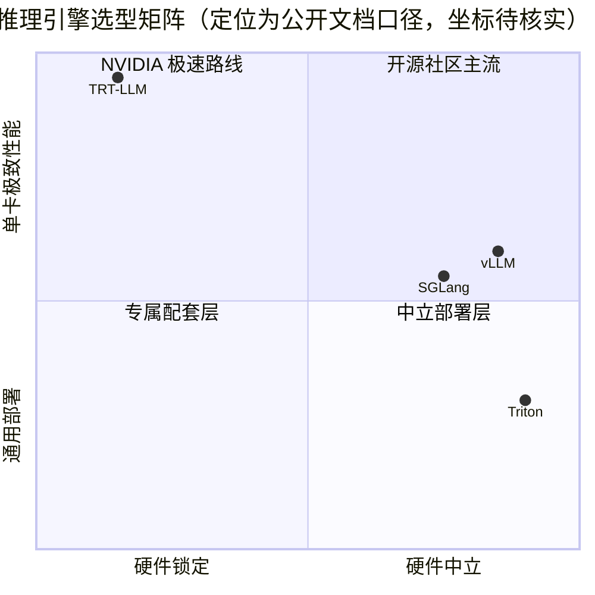

模块四前十一章把推理优化的原理都讲透了，这一篇回答两个落地问题：这些原理在 NVIDIA 官方产品里长什么样，以及它和 vLLM 到底怎么选。**官方今天为 11 个主流模型提供了保姆级部署指南（DeepSeek R1、Qwen3、Llama 4 Scout、Kimi K3 等），一条 `trtllm-serve` 命令就能起一个 OpenAI 兼容服务**；而 TRT-LLM 与 vLLM 的差异不在功能清单——IFB、分页 KV Cache、前缀复用、投机解码、PD 解耦两边都有——**在“优化深度”与“生态半径”这两个维度上**。这是第 12 章的收尾篇，也是模块四的收官拼图：以 vLLM 学通用机制（第 3 章），以 TRT-LLM 学 NVIDIA 的极致实现（本章），两条腿走路。

<!-- more -->

## 📑 目录

- [1. 官方部署指南：今天哪些模型被保姆级服务](#1-官方部署指南今天哪些模型被保姆级服务)
- [2. 快速部署路径：一条命令起一个 OpenAI 兼容服务](#2-快速部署路径一条命令起一个-openai-兼容服务)
- [3. 与 vLLM 对比：功能同构，优化深度与生态半径不同](#3-与-vllm-对比功能同构优化深度与生态半径不同)
- [4. 生产集成：Triton 与 Dynamo](#4-生产集成triton-与-dynamo)
- [5. 多节点实战：Slurm 两节点部署 DeepSeek-V3](#5-多节点实战slurm-两节点部署-deepseek-v3)
- [6. 压测与监控：三大 CLI 与 /metrics](#6-压测与监控三大-cli-与-metrics)
- [7. 版本演进提醒：别被旧教程带偏](#7-版本演进提醒别被旧教程带偏)
- [8. 模块四收官：一条主线，两套实现](#8-模块四收官一条主线两套实现)
- [总结](#-总结)
- [自我检验清单](#-自我检验清单)
- [参考资料](#-参考资料)

---

## 1. 官方部署指南：今天哪些模型被保姆级服务

问题：官方文档几百页，哪些模型有“照着抄就能跑”的完整教程？

**打开 `docs/source/deployment-guide/` 目录（写作时点），有 11 份模型专属指南外加 1 份 CPU 亲和性配置指南**。这些不是“支持列表”，而是从拿权重、配环境、设参数、起服务到验证输出的完整步骤——NVIDIA 把最常用的模型配成了“预制菜”，你只需要按说明书加热：

| 📊 模型 | 官方指南主题 |
|---|---|
| DeepSeek R1 | Blackwell/Hopper 双架构，FP8 与 NVFP4 两条量化路线，MoE 后端选型矩阵 |
| GPT-OSS | OpenAI 开源权重模型（MXFP4 预量化，Blackwell） |
| GLM-5 | 智谱开源模型 |
| Kimi K2 Thinking / Kimi K3 | 月之暗面推理模型与新一代架构 |
| Llama 3.3 70B / Llama 4 Scout | 大稠密模型与 Meta 新架构 |
| MiniMax M3 | MiniMax 开源模型 |
| Nemotron 3 | NVIDIA Nemotron 系列 |
| Qwen3 / Qwen3.5 | 稠密 + MoE 多规格覆盖 |

再补两个配套文档：`configuring-cpu-affinity.md` 讲 NUMA 场景下如何自动绑定 CPU 亲和性（`TLLM_NUMA_AWARE_WORKER_AFFINITY` 环境变量控制，避免 CPU↔GPU、CPU↔DRAM 通信跨 NUMA 节点），`index.rst` 还内置了一个“菜谱选择器”，按流量特征挑预配置 YAML。

💡 **提示**：这些配置默认是“聚合式服务”（Prefill 和 Decode 在同一批 GPU 上、IFB（In-Flight Batching，飞行中批处理）调度，IFB 的完整讲解见 [12.3 §4](/AIInfraGuide/inference/模块四-推理优化/第12章-tensorrt推理引擎/123-运行时与llm-api)）；要拆开跑 PD 解耦，按各模型指南里的分离式配置走——这正是[第 7 章](/AIInfraGuide/inference/模块四-推理优化/第7章-pd解耦架构/72-解耦架构设计)讲过的架构。

**拿到一份指南你该看什么？四步闭环**：① 模型权重从哪个 HF id 拿（FP8/NVFP4 预量化版 vs 原始权重）；② 推荐 YAML 配置在哪（容器内 `/app/tensorrt_llm/examples/configs`，如 `curated/deepseek-r1-throughput.yaml`）；③ 启动命令是什么；④ 怎么验证输出正确。这四步和第 11 章[端到端部署实战](/AIInfraGuide/inference/模块四-推理优化/第11章-推理优化选型与端到端实战/113-端到端部署实战)的验收逻辑完全一致，只是配方由 NVIDIA 替你踩好了。

## 2. 快速部署路径：一条命令起一个 OpenAI 兼容服务

问题：从零到能 `curl` 出一个回答，最短要几步？

**三步：拉 NGC release 容器 → `trtllm-serve <模型>` → 调 OpenAI 端点**。官方 quick-start-guide 把“预构建 release 容器”列为最快安装路径；`trtllm-serve` 支持三种模型来源：

```bash
# 方式一：HF 模型 id，一行起服务（自动下载权重并优化）
trtllm-serve "TinyLlama/TinyLlama-1.1B-Chat-v1.0"

# 方式二：ModelOpt 预量化 checkpoint（性能更好，需要对应 GPU 支持）
trtllm-serve "nvidia/Qwen3-8B-FP8"

# 方式三：本地 checkpoint 路径（LLM API 同样支持）
trtllm-serve /path/to/local/checkpoint
```

方式二里的 `nvidia/Qwen3-8B-FP8` 出自 NVIDIA 在 Hugging Face 的官方收藏（“inference-optimized checkpoints with Model Optimizer”）——**用 Model Optimizer 预量化好的模型，跳过你自己量化这步**，[第 4 章](/AIInfraGuide/inference/模块四-推理优化/第4章-量化/41-量化基础)的量化理论在这里变成现成商品。

服务起来后暴露 OpenAI 兼容端点（`/v1/models`、`/v1/completions`、`/v1/chat/completions` + `/health`、`/metrics`、`/version` 六个端点，完整 curl 示例见 [12.3 §3.1](/AIInfraGuide/inference/模块四-推理优化/第12章-tensorrt推理引擎/123-运行时与llm-api)）——现有 OpenAI SDK 客户端零改动，换 `base_url` 即可。

💡 **提示**：`trtllm-serve` 还有个 `embeddings` 子命令，专跑 BERT 类编码器模型（分类/检索/embedding），同样 OpenAI 兼容。离线批量推理则走 Python 的 LLM API——一个 `LLM` 实例管加载、优化与推理，不需要 HTTP。

📌 **关键点**：模型来源三选一、服务形态三选一，**自由度全在这两条分叉上**——换模型只动输入，换场景只动输出形态。

## 3. 与 vLLM 对比：功能同构，优化深度与生态半径不同

问题：vLLM 什么都有，为什么还要 TRT-LLM？

打个比方：**同一套菜谱，两家后厨**。vLLM 是社区大食堂——什么锅都能炒（多硬件），新食材（新模型）到得最快；TRT-LLM 是 NVIDIA 私厨——只在自己家的灶上做，但每道菜的火候都调到极致，还配了专属传菜系统（Triton/Dynamo）。菜谱是同一本，后厨风格完全不同。

### 3.1 功能同构：别用“有没有”来选型

把第 2 章到第 7 章的功能清单逐项对一遍，两家几乎一一对应：

| 📊 功能 | vLLM | TRT-LLM |
|---|---|---|
| KV Cache 分页管理 | PagedAttention | Paged KV Cache（分块 + 智能复用） |
| 动态组批 | Continuous Batching | In-Flight Batching |
| 前缀复用 | Prefix Cache | KV Cache 复用（含 MLA 复用） |
| 长请求拆分 | Chunked Prefill | Chunked Prefill |
| 投机解码 | 多算法支持 | EAGLE / MTP / NGram |
| PD 解耦 | 成熟支持 | Disaggregated Serving（Beta） |
| 量化 | GPTQ/AWQ/FP8 等 | FP8 / NVFP4 原生 + ModelOpt 链路 |

所以“vLLM 有的 TRT-LLM 没有”这类说法基本不成立——**选型的抓手是两个维度：优化深度与生态半径**。

### 3.2 优化深度：NVIDIA 闭门造车式的极致

TRT-LLM 的深度优化建立在对自家硬件的完全控制上：FP4 原生支持（B200 上直接加载 NVFP4 权重，用专用 FP4 kernel）；为 DeepSeek R1 在 Blackwell 上刷出官方博客宣称的世界纪录吞吐；kernel 级定制（FlashInfer、DeepEP、CuteDSL 集成）；甚至把 PyTorch 原生架构与 `torch.compile`、Triton kernel 打通。**这些优化的前提是硬件锁定——只支持 NVIDIA GPU**，官方文档白纸黑字写着“strives to support the most popular models on Day 0”（新模型发布当天跟进），这是 NVIDIA 全家桶的承诺。

### 3.3 生态半径：开放 vs 封闭

vLLM 的半径是开放的：AMD/Intel/昇腾等多硬件后端、社区贡献的长尾模型、`vllm serve` 一把梭的简单心智。TRT-LLM 的半径是 NVIDIA 的：NGC 容器、Triton 推理服务器、Dynamo 分布式框架、ModelOpt 量化工具链——**用它的代价是进入 NVIDIA 生态圈，离开圈子的每一步都别扭**。站内[第 3 章](/AIInfraGuide/inference/模块四-推理优化/第3章-深入vllm/vllm快速入门)讲过 vLLM 的机制与上手，这一章讲 TRT-LLM，恰好互补。

把两个维度画成选型矩阵：



📌 **关键点**：这张图的**坐标是示意而非实测**——x 轴「硬件锁定 → 硬件中立」讲生态绑定程度，y 轴「通用部署 → 单卡极致性能」讲优化取向，各引擎的落点按公开文档口径做定性判断，不是 benchmark 数据；Triton（推理服务器）不在对角线上，是因为它按「部署层」而非「引擎层」落点——它是承接引擎的服务层，本身不做模型推理，故放在「中立 + 通用部署」一侧；另外别把它和[第 2 章](/AIInfraGuide/inference/模块四-推理优化/第2章-推理引擎核心技术/25-attention-后端与图优化)提到的 Triton 编程语言混为一谈，同名不同物。

### 3.4 SGLang 怎么摆？

**官方文档没有给出 TRT-LLM 与 SGLang 的直接对比数据（待核实）**，这里只基于公开认知谨慎陈述：SGLang 侧重 RadixAttention 前缀复用与 DeepSeek 系模型的优化（这是 SGLang 公开文档的自我定位，具体对比数字请以两家的官方 benchmark 为准）。选型时把它放在 vLLM 一侧——同属开放生态，特色在结构化输出与多轮对话场景的调度。本模块对 SGLang 不做展开，想深入请读其官方文档。

### 3.5 权衡：牺牲了什么，换取了什么

- **TRT-LLM**：牺牲硬件中立性与社区广度，换取 NVIDIA GPU 上的极致性能、Day-0 模型支持与全家桶无缝集成。
- **vLLM**：牺牲单卡极限榨取与 NVIDIA 深度定制，换取开放生态、多硬件可移植性与社区迭代速度。

**没有免费午餐**：两个引擎的取舍不是“谁更强”，而是“你的约束在哪边”——锁 NVIDIA 就上 TRT-LLM，要中立就 vLLM，别两头摇摆。

## 4. 生产集成：Triton 与 Dynamo

问题：单机 `trtllm-serve` 玩明白了，生产环境怎么编排？

**官方 Overview 明确写：LLM API 与 NVIDIA Dynamo 和 Triton Inference Server 无缝集成**。两条生产路径分工不同：

- **Triton Inference Server**：模型服务层。承接已构建好的模型，管并发、HTTP/gRPC、多模型复用、动态批处理，是 NVIDIA 部署栈的“前台”。
- **NVIDIA Dynamo**：数据中心级分布式推理框架。负责多节点编排、PD 解耦的 Prefill/Decode 池调度、K8s 部署——**它是第 7 章解耦架构在生产规模的落地载体**，把“分池 + 配比 + KV 迁移”从单机实验变成集群服务。

社区里有现成的完整案例：**AWS 官方博客（2025-02）发布了在 Amazon EKS 上多节点部署 TRT-LLM + Triton 并实现自动扩缩容的指南**（README News 里有链接），这正是[第 10 章](/AIInfraGuide/inference/模块四-推理优化/第10章-生产部署与运维/101-容器化与kubernetes部署)讲的 K8s 与扩缩容在 NVIDIA 栈上的官方示范。

⚠️ **注意**：Dynamo 与 Triton 是“生产可选件”不是“必选件”——单机、小流量、快速验证用 `trtllm-serve` 就够；上集群、要 SLA、要解耦编排才值得引入这两层。生产路径的复杂度是你用“全家桶深度集成”换来的，[第 10 章](/AIInfraGuide/inference/模块四-推理优化/第10章-生产部署与运维/101-容器化与kubernetes部署)的容量与可观测性纪律一条都省不掉。

## 5. 多节点实战：Slurm 两节点部署 DeepSeek-V3

问题：671B 参数的 MoE 模型，单机放不下，多节点怎么部署？

**官方 `trtllm-serve` 文档给了完整的 Slurm 两节点示例：16 卡（每节点 8 卡），TP16 × EP4**。完整命令（`srun --ntasks 16 --mpi=pmix --container-*` + `trtllm-llmapi-launch trtllm-serve`）与 `config.yml` 写法已在 [12.3 §3.4](/AIInfraGuide/inference/模块四-推理优化/第12章-tensorrt推理引擎/123-运行时与llm-api) 完整贴过，`--max_batch_size 161 --max_num_tokens 1160` 的调度器语义详见 [12.3 §4](/AIInfraGuide/inference/模块四-推理优化/第12章-tensorrt推理引擎/123-运行时与llm-api)——这里不重复代码，只讲三个本篇独有视角：

**① 菜谱 YAML 先行，别手写参数**。官方把多节点模板也做成了预制菜：容器内 `/app/tensorrt_llm/examples/configs/curated/deepseek-r1-throughput.yaml` 就是为 DeepSeek-R1 吞吐场景调好的配置，`index.rst` 的菜谱选择器按流量特征挑。`trtllm-serve --config` 加载后**显式 CLI 参数优先于 YAML**——集群差异（卡数、显存）用命令行覆盖，场景默认值留在 YAML。

**② 翻车点：`srun --ntasks` 必须与 `--tp_size` 对齐**。`trtllm-llmapi-launch` 按 task 数初始化 rank，`--ntasks 16` 与 `--tp_size 16` 对不上会直接起不来；而 `--ep_size 4` 是专家并行，在 TP 组内切专家、**不增加 rank 数**——TP16 × EP4 仍是 16 个 rank，不是 64 个。这是多节点部署最常见的翻车点。

**③ 这份模板是实战小节的现成素材**。第 11 章端到端部署实战的「权重 → 配置 → 启动 → 验证」闭环可以直接套：换模型 id、按卡数改 `--tp_size`/`--ntasks`、从菜谱选择器挑 YAML，三步就把官方示例变成你自己的部署。

💡 **提示**：多节点吞吐场景记得在 `config.yml` 里开两个开关——`enable_attention_dp: true`（attention 数据并行，把注意力计算摊到 16 卡）与 `pytorch_backend_config.enable_overlap_scheduler: true`（CPU/GPU 重叠调度，见 12.3 运行时优化）。

## 6. 压测与监控：三大 CLI 与 /metrics

问题：服务起来了，怎么证明它又快又准？

**官方命令目录（`docs/source/commands/`）实测只有三个命令：`trtllm-serve`（服务）、`trtllm-bench`（性能基准）、`trtllm-eval`（精度评估）**——三者的分工恰好对应第 9 章的“六件套”与压测/评估两条线（[9.1](/AIInfraGuide/inference/模块四-推理优化/第9章-性能分析与benchmark/91-推理指标体系)、[9.2](/AIInfraGuide/inference/模块四-推理优化/第9章-性能分析与benchmark/92-压测工具)）。

线上监控则看 `/metrics` 端点——**返回迭代级（per-iteration）统计**，官方示例输出：

```json
[
  {
    "gpuMemUsage": 76665782272,
    "iter": 154,
    "iterLatencyMS": 7.00688362121582,
    "kvCacheStats": {
      "cacheHitRate": 0.00128,
      "reusedBlocks": 4,
      "tokensPerBlock": 32,
      "maxNumBlocks": 101256,
      "usedNumBlocks": 3
    },
    "numActiveRequests": 1
  }
]
```

- `gpuMemUsage`：GPU 显存占用（字节）；
- `iterLatencyMS`：单次迭代延迟（毫秒）——TPOT（Time Per Output Token，每输出 token 延迟）的服务端视角；
- `kvCacheStats`：**KV Cache 的命中率（`cacheHitRate`）与复用块数（`reusedBlocks`）**——前缀复用的效果直接可见（[2.3](/AIInfraGuide/inference/模块四-推理优化/第2章-推理引擎核心技术/23-prefix-cache-与-radixattention)）。

⚠️ **注意**：默认 PyTorch backend 的 metrics 标注为 **Beta，字段不如旧 TensorRT backend 全面**（如 CPU 内存暂缺），且需在 YAML 里开 `enable_iter_perf_stats: true`；开启后对性能有轻微影响，生产环境按需取舍。另外统计存于内部队列、取走即删，**建议每次请求后立即轮询**，别隔很久才来拉。

## 7. 版本演进提醒：别被旧教程带偏

问题：网上教程还在教 `trtllm-build` 三步构建 engine，照着做却报错，为什么？

**因为 TRT-LLM 在 1.x 系列里完成了一次“换地基”式的重构**。打个比方：房子在住人时翻新了地基——门牌号没变，但千万别照着老图纸装修。三个里程碑（官方 release notes）：

| 📊 版本 | 关键变化 |
|---|---|
| 1.0 | **PyTorch 架构转正**，成为稳定且默认的体验；LLM API 转稳定；建立 3 个月弃用期政策 |
| 1.1 | 新增 **KV Cache Connector API**（PD 解耦的状态迁移）；支持 B300/GB300；加入 GPT-OSS |
| 1.2 | **移除 TensorRT backend**：PyTorch 成为唯一执行后端；`trtllm-build`/`trtllm-refit`/`trtllm-prune` 等 CLI 全部删除；`LLM(backend="tensorrt")` 直接抛 ValueError |

写作时点 main 分支徽章已是 **1.3.0rc24**。这意味着：

- 网上大量“trtllm-build 生成 engine”的旧教程**已过时**（命令不存在了）；
- 名字还叫 TensorRT-LLM，但 1.2 起它**不再依赖 TensorRT engine 执行**——PyTorch 原生跑（用 `torch.compile`、Triton kernel 加速）；
- 看任何资料先对 release notes，版本对不上就按本文 1.2 之后的形态理解。

📌 **关键点**：TRT-LLM 的演进速度就是 NVIDIA 押注推理市场的速度——读文档认准“最新 release notes”与 main 分支徽章，别拿 0.x/1.0 时代的心智模型套今天。

## 8. 模块四收官：一条主线，两套实现

问题：学了 11 章 + 这一章，怎么串成一条线？

**模块四的主线始终是一条：显存、带宽、算力三个瓶颈之间搬资源**（[11.4](/AIInfraGuide/inference/模块四-推理优化/第11章-推理优化选型与端到端实战/114-模块总结与持续学习)的收官大表）。TRT-LLM 是这条主线的“NVIDIA 极速实现版”：Paged KV Cache 是 PagedAttention 的实现（[2.1](/AIInfraGuide/inference/模块四-推理优化/第2章-推理引擎核心技术/21-pagedattention)），IFB 是 Continuous Batching 的实现（[2.2](/AIInfraGuide/inference/模块四-推理优化/第2章-推理引擎核心技术/22-continuous-batching)），FP8/NVFP4 是量化章的官方落点（[4.5](/AIInfraGuide/inference/模块四-推理优化/第4章-量化/45-fp8与nvfp4)），EAGLE/MTP 是投机解码章的实现（[5.1](/AIInfraGuide/inference/模块四-推理优化/第5章-speculative-decoding/51-核心原理与rejection-sampling)），TP/EP 是分布式章的官方参数（[6.1](/AIInfraGuide/inference/模块四-推理优化/第6章-分布式推理/61-推理并行策略总览)），Disaggregated Serving 是 PD 解耦章的 Beta 形态（[7.2](/AIInfraGuide/inference/模块四-推理优化/第7章-pd解耦架构/72-解耦架构设计)）。

**学习闭环：通用机制（vLLM 学原理）→ NVIDIA 极速实现（TRT-LLM 学深度优化）**。vLLM 的源码可读性更好（[3.2](/AIInfraGuide/inference/模块四-推理优化/第3章-深入vllm/32-nano-vllm源码导读)），适合建立机制心智；TRT-LLM 的官方部署指南与配置参数，适合学习“同一个机制在极致工程下长什么样”。两者叠加，你对任何推理引擎的文档都能快速定位它解决的是哪一章的问题。

### 8.1 工程师选型清单

| 📊 场景 | 推荐引擎 | 一句话理由 |
|---|---|---|
| NVIDIA 集群、追求单卡极限吞吐/延迟 | TRT-LLM | 硬件锁定换极致优化，Day-0 模型支持 |
| 混合硬件、需要可移植性 | vLLM | 开放生态，社区长尾模型覆盖广 |
| 已用 Triton/K8s 的 NVIDIA 生产栈 | TRT-LLM + Triton/Dynamo | 全家桶无缝集成（AWS EKS 案例） |
| 快速跟进新模型、小团队 | vLLM（SGLang 备选） | 上手快、心智简单、社区响应快 |
| 学原理 | vLLM 源码 | 机制透明，[3.2](/AIInfraGuide/inference/模块四-推理优化/第3章-深入vllm/32-nano-vllm源码导读) 可跟读 |
| 学深度优化 | TRT-LLM 部署指南 | 官方保姆级配置即最佳实践教材 |

落成一句话的规则：**GPU 锁死 NVIDIA 且要榨干性能 → TRT-LLM；要中立、要社区、要快 → vLLM；要结构化输出与 Agent 场景 → SGLang 值得一试（对比数字以官方 benchmark 为准）**。别为了“显得高级”在两个引擎间反复横跳——先跑通一个，用第 9 章六件套说话。

## 📝 总结

1. **官方部署指南**：11 份模型专属指南 + CPU 亲和性配置，每份覆盖“权重→环境→参数→启动→验证”全链路，是现成的部署教材。
2. **快速路径**：NGC 容器 + `trtllm-serve`（HF id / 本地路径 / ModelOpt 预量化三选一）+ OpenAI 兼容端点，三步起服务。
3. **选型本质**：TRT-LLM 与 vLLM 功能同构（IFB、分页 KV Cache、前缀复用、投机解码、PD 解耦全都有），差异在“优化深度 vs 生态半径”——牺牲硬件中立换 NVIDIA 极致。
4. **生产与观测**：Triton/Dynamo 承接生产编排，三大 CLI（serve/bench/eval）分工清晰，`/metrics` 给出迭代级显存、延迟与 KV 命中率。
5. **版本纪律**：1.0 PyTorch 转正、1.1 KV Cache Connector、1.2 移除 TensorRT backend——旧教程已过时，以 release notes 为准。
6. **模块四闭环**：通用机制（vLLM）→ 极致实现（TRT-LLM）→ 用第 9 章指标验证，一条主线贯穿 12 章。

## 🎯 自我检验清单

- 能说出官方部署指南覆盖的 5 个以上模型，以及一份指南包含哪四个环节
- 能写出 `trtllm-serve` 三种模型来源的启动命令，并说明预量化 checkpoint 的获取渠道
- 能对比 vLLM 与 TRT-LLM 的功能同构点与差异点，各列出 3 条以上
- 能根据“GPU 锁定 vs 硬件中立、Day-0 vs 社区长尾”两个维度判断一个部署场景该选哪个引擎
- 能解释 Slurm 示例中 `--tp_size 16` 与 `--ep_size 4` 分别切什么，以及 `srun --ntasks` 为什么必须对齐
- 能说出 `/metrics` 端点三个迭代级字段（`gpuMemUsage`、`iterLatencyMS`、`kvCacheStats`）的含义，并解释 KV 命中率的工程意义
- 能说明 Triton 与 Dynamo 在 TRT-LLM 生产栈中各自的角色，并指出 AWS EKS 案例的出处
- 能复述 1.0 / 1.1 / 1.2 三个版本的关键变化，并解释为什么 `trtllm-build` 教程已过时
- 能画出“通用机制 → NVIDIA 极速实现”学习闭环，并为每个机制指出 TRT-LLM 的对应实现
- 能向同事一句话讲清 TRT-LLM 与 vLLM 的本质差异，并说明 SGLang 对比数据为何要标待核实

## 📚 参考资料

**官方文档**
- [TensorRT-LLM Quick Start Guide](https://nvidia.github.io/TensorRT-LLM/quick-start-guide.html)：NGC 容器安装、`trtllm-serve` 起服务、LLM API 离线推理与三大 CLI 入口
- [Model-Specific Deployment Guides](https://nvidia.github.io/TensorRT-LLM/deployment-guide/index.html)：11 份模型专属部署指南与菜谱选择器
- [trtllm-serve 命令文档](https://nvidia.github.io/TensorRT-LLM/commands/trtllm-serve/trtllm-serve.html)：OpenAI 端点、Slurm 多节点示例、`/metrics` 输出
- [TensorRT-LLM Overview](https://nvidia.github.io/TensorRT-LLM/overview.html)：PyTorch 架构、Dynamo/Triton 集成、功能清单
- [TensorRT-LLM Release Notes](https://nvidia.github.io/TensorRT-LLM/release-notes.html)：1.0/1.1/1.2 版本变化与弃用政策
- [TensorRT-LLM GitHub 仓库](https://github.com/NVIDIA/TensorRT-LLM)：README 徽章版本号与 News 列表
- [NGC TensorRT-LLM 容器目录](https://catalog.ngc.nvidia.com/orgs/nvidia/teams/tensorrt-llm/containers/release)：release 容器镜像 tag
- [Hugging Face nvidia 官方收藏（ModelOpt 预量化）](https://huggingface.co/collections/nvidia/inference-optimized-checkpoints-with-model-optimizer)：即拿即用的预量化 checkpoint

**教程与博客**
- [AWS: Scaling Your LLM Inference Workloads — Multi-node Deployment with TensorRT-LLM and Triton on Amazon EKS（2025-02）](https://aws.amazon.com/blogs/hpc/scaling-your-llm-inference-workloads-multi-node-deployment-with-tensorrt-llm-and-triton-on-amazon-eks/)：EKS 多节点 + Triton 自动扩缩容官方案例
- [NVIDIA Blog: Blackwell Delivers World-Record DeepSeek-R1 Inference Performance](https://developer.nvidia.com/blog/nvidia-blackwell-delivers-world-record-deepseek-r1-inference-performance/)：FP4 + Blackwell 的官方性能叙事
- [NVIDIA Dynamo](https://github.com/ai-dynamo/dynamo)：数据中心级分布式推理框架（PD 解耦编排、K8s）
- [Triton Inference Server](https://github.com/triton-inference-server/server)：模型服务层
