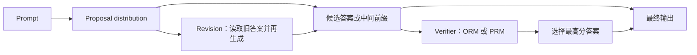

上一节用 Roofline 解释了 Decode 为什么被显存带宽卡住：每生成一个 Token，都可能要把模型权重重新搬过一遍。现在再往前问一步：**如果预算固定，新增 FLOPs 应该用来把模型做大，还是用来让模型在推理时多搜索几次？** Snell 等人用 MATH 实验给出一个有条件的答案：按题目难度选择推理策略时，达到相近效果最多可以少用约 **4 倍**测试时计算；在 FLOPs 对齐的特定设置下，小模型的推理计算甚至能超过约 **14 倍参数量**的大模型，但最难题仍然存在知识和能力上限。本文不把“想得更久”当成万能按钮。真正要学会的是一笔账：预训练 FLOPs 主要买参数与知识，推理 FLOPs 主要买候选、验证、搜索和修订；两笔账的汇率由模型参数量、预训练 Token 数、推理 Token 数和题目难度共同决定。

<!-- more -->

## 📑 目录

- [🗺️ 原文阅读地图](#-原文阅读地图)
- [0. 读前 3 分钟：先把 FLOPs 账本对齐](#0-读前-3-分钟先把-flops-账本对齐)
- [1. 为什么需要：预训练 scaling 之后，算力该花在哪](#1-为什么需要预训练-scaling-之后算力该花在哪)
- [2. 核心思想：把推理预算当成可调度资源](#2-核心思想把推理预算当成可调度资源)
- [3. 方法拆解：先把每一笔 FLOPs 算清](#3-方法拆解先把每一笔-flops-算清)
- [4. 效果与对比：4 倍效率来自按题分配](#4-效果与对比4-倍效率来自按题分配)
- [5. 权衡与局限：多算力不等于多能力](#5-权衡与局限多算力不等于多能力)
- [🕰️ 原文时代 vs 当前工程](#-原文时代-vs-当前工程)
- [📝 总结](#-总结)
- [🎯 自我检验清单](#-自我检验清单)
- [📚 参考资料](#-参考资料)

## 🗺️ 原文阅读地图

这篇论文的原文不长，但它同时跨过了推理算法、验证器和训练成本。下面先把“讲到哪里”和“为什么不展开”钉死，避免把摘要误写成精读。

| 原文单元 | 处理深度 | 本文位置与理由 | 来源锚点 |
|---|---|---|---|
| §2：proposal distribution 与 verifier | 精讲 | 先统一两类测试时计算，建立后面搜索和修订的共同语言 | 原文 §2 |
| §3：compute-optimal 定义与难度分桶 | 精讲 | 本文主线是“同一预算按题分配”，必须解释定义和估计方法 | 原文 §3，Eq. (1) |
| §4：数据集与模型 | 简述 | 保留实验可复现边界，不把结果外推到 GSM8K 或开放式任务 | 原文 §4 |
| §5：PRM、Best-of-N、Beam、Lookahead | 精讲 | 搜索策略决定推理 FLOPs 怎样消耗，也是验证器过优化的证据 | 原文 §5，Fig. 2–4 |
| §6：Revision 与顺序/并行比例 | 精讲 | 解释“局部修订”和“全局探索”如何共享预算 | 原文 §6，Fig. 5–8 |
| §7：预训练与推理的 FLOPs exchange | 精讲 | 直接回答“参数扩展还是推理扩展” | 原文 §7，Fig. 9 |
| §8：讨论与未来工作 | 简述 | 只保留难题上限、难度估计成本和未研究组合 | 原文 §8 |
| 附录中的聚合消融和搜索失败样例 | 不展开 | 不改变主张；只在局限中提醒验证器漏洞 | 原文 Appendices |

⚠️ **先处理一个数字冲突**：学生幻灯片把推理成本写成 `4ND_inference`，并注明包含验证器开销；论文正文 §7 的 FLOPs 对齐公式写的是 **`Y = 2ND_inference`**，对应 greedy decoding 的常用近似。本文以论文原文为准。PRM、revision model 和额外选择器的成本，应该作为单独的账本项加回去，而不是悄悄改写论文公式。

## 0. 读前 3 分钟：先把 FLOPs 账本对齐

### 0.1 这篇论文到底想回答什么

**问题不是“推理时计算有没有用”，而是“固定推理预算下，怎样用才不浪费”。**

你可以先记住四句话：

1. **Best-of-N**：独立生成多个候选，再用验证器或多数投票选一个。
2. **Beam / Lookahead**：把验证器分数用于中间步骤，主动搜索候选树。
3. **Revision**：让模型读自己的旧答案，连续修改，而不是每次从零开始。
4. **Compute-optimal**：题目不同，最佳策略不同；先估计题目难度，再选预算分配方式。

论文把“测试时计算”理解成对模型输出分布的修改。它不是凭空增加参数，也不是把预训练知识塞进模型，而是用更多候选和更多判断，把原本较分散的输出概率重新组织起来。

### 0.2 先分清三个单位：参数、Token 与 FLOP

这篇文章最容易读乱的地方，是论文同时用 `N` 表示模型参数、采样数量或计算预算。为避免混淆，正文在 FLOPs 账本中改用 $P$ 表示**模型参数量**，用 $B$ 表示**一次请求或一个问题的推理预算**；引用论文公式时会明确说明原符号。

| 符号 | 本文含义 | 在账本中的作用 |
|---|---|---|
| $P$ | 模型参数量 | 每个 Token 要经过多少权重计算 |
| $D_{pre}$ | 预训练 Token 数 | 预训练总计算量的乘数 |
| $D_{inf}$ | 推理阶段生成的 Token 数 | 推理总计算量的乘数 |
| $B$ | 某个问题可用的推理预算 | 在候选、搜索、修订之间分配 |
| FLOP | 一次浮点运算 | 把不同阶段放到同一成本尺度 |

**一个重要边界**：FLOPs 相同，不代表延迟、显存和吞吐相同。并行 Best-of-N 可能更容易批处理，顺序 revision 却有串行依赖；PRM 还会额外占用模型前向和 KV Cache。论文先做理论上的 FLOPs 对齐，系统工程师还要继续算 Token、批大小、显存和尾延迟。

### 0.3 三个名称先纠偏：MATH、MLE/MRC 与 GSM8K

学生幻灯片和选题描述提供了很有用的结构索引，但**论文原文的实验对象是 MATH，不是 GSM8K，也没有把任务分成 MLE 与 MRC 两类来报告结果**。

原文实际使用的是 MATH，12k train、500 test；GSM8K 没有出现在论文实验中，MLE/MRC 也不是论文的方法分类。把 MATH 百分比改写成 GSM8K 结果，会改变数据分布、题目难度和结论适用范围。

## 1. 为什么需要：预训练 scaling 之后，算力该花在哪

### 1.1 预训练和推理买的是两种不同的东西

**预训练主要买“模型能知道什么”，推理主要买“模型愿意尝试多少种解法以及能检查多少次”。**

可以把两笔钱想成两本账：一本用于扩建图书馆，一本用于考试时多做草稿和多次核对。图书馆变大，能放进去的知识更多；草稿变多，只能帮助你把已经会的内容组合得更好。这个对应关系很具体：参数量和训练 Token 决定模型的基础能力，推理预算决定候选数量、搜索深度和验证次数。

用技术语言重述：预训练改变参数 $\theta_{model}$，推理时计算通常不改变它，而是改变给定 prompt 后的目标输出分布。于是二者的收益曲线并不相同。

| 预算投向 | 直接改变 | 更可能解决 | 不能保证解决 |
|---|---|---|---|
| 扩大预训练参数或 Token | 模型权重与表示能力 | 缺知识、缺基本技能、能力天花板 | 每道题都能选到最好的推理路径 |
| 增加测试时计算 | 候选分布、搜索轨迹、验证次数 | 已有知识上的组合、检查和局部修订 | 模型根本不知道的事实或方法 |

上一节的 Decode 账本还告诉你另一件事：推理 FLOPs 不是抽象数字。每个额外候选都可能带来更多 Token、更多 KV Cache 读写和更长的请求占用。**如果把“思考时间”放大，却没有把它纳入 serving 预算，系统会在准确率上赢一点，在容量和成本上输很多。**

### 1.2 预训练遇到“收益变慢”时，不能直接跳到“推理一定更划算”

这里要先区分文章切入角度和论文结论。

- **本站切入角度**：当继续扩大模型的边际收益变慢，工程师自然会问，是否把一部分预算转移给推理搜索。
- **论文明确做的事**：固定预训练数据量，只研究把模型参数放大约 14 倍，再与小模型增加推理计算比较。
- **论文没有做的事**：没有做 Chinchilla 式的“参数与训练数据同时最优分配”，也没有证明所有任务都应减少预训练。

因此，“预训练 scaling 遇到墙”是提出工程问题的背景，不是 Snell 论文用实验证明的定律。论文真正证明的是更窄、也更有用的一点：**在模型已经有一定成功率的任务上，增加推理计算可能比增加参数更划算；在模型能力之外的任务上，这个交换会失效。**

### 1.3 系统工程师为什么必须关心这笔账

假设每个请求从 200 Token 变成 4000 Token 的长思考，参数量不变，GPU 时间、KV Cache、调度并发、验证器调用和 P95/P99 尾延迟都会一起上升。推理工程因此不能只看 `tokens/s`，还要问：额外 Token 是否换来准确率，验证是否可靠，以及这笔预算是否值得挤掉其他请求。

## 2. 核心思想：把推理预算当成可调度资源

### 2.1 两条轴：修改候选分布，还是优化验证器

**论文把测试时计算统一成两条相互独立的轴。**

第一条轴修改 **proposal distribution**，也就是模型提出候选答案的方式。最简单的做法是给同一个问题采多个候选；更进一步，可以让模型读取上一次答案并继续 revision。

第二条轴优化 **verifier**，也就是对候选答案打分和筛选的方式。Outcome Reward Model（ORM）只看最终答案，Process Reward Model（PRM）还给中间步骤打分，因此可以把分数用于 beam search 或 lookahead search。



这张图讲的是：**推理计算要么增加“提出什么”的变化，要么增加“怎样检查”的力度，也可以同时做两者。** 论文的实验分别研究 PRM 搜索和 revision，再用难度分桶决定哪一轴更值得花预算。

### 2.2 为什么题目难度会改变最优策略

问题是：同一个搜索算法，为什么在简单题上可能伤害准确率，在难题上却有帮助？

**因为简单题和难题缺的是不同东西。**

- 对简单题，基础模型往往已经能提出正确答案。此时更强的搜索器主要是在放大验证器的细小偏差，可能偏爱重复、短小但不完整的答案。
- 对中等题，模型偶尔能走到正确路径，但一次采样容易走错。更多候选和中间步骤评分可以把正确路径捞出来。
- 对最难题，基础模型可能连关键知识或解题策略都没有。多抽几次只是重复不会的部分，推理时间不能替代预训练。

这也是“按题目难度分配”比“所有请求统一开大推理预算”更合理的原因。难度不是题库上的固定标签，而是**相对于当前基础模型的成功概率**。

## 3. 方法拆解：先把每一笔 FLOPs 算清

### 3.1 问题设定：固定预算下选超参数

先把“最优”说准确。给定问题 $q$ 和推理预算 $B$，一个测试时策略有自己的超参数 $\theta$，例如：

- Best-of-N 的候选数 $N$；
- Beam search 的 beam width $M$；
- Lookahead 的前视步数 $k$；
- Revision 的并行链数和每条链的长度。

论文定义 `Target(θ, N, q)` 为使用策略超参数 $\theta$、预算 $N$ 和问题 $q$ 后产生的输出分布。最优策略就是让正确答案的期望命中率最大：

$$
\theta^{*}_{q,y^{*}(q)}(N)
= \operatorname{argmax}_{\theta}
\left(
\mathbb{E}_{y\sim \operatorname{Target}(\theta,N,q)}
\left[\mathbbm{1}_{y=y^{*}(q)}\right]
\right)
$$

这条公式做三件事：

- $q$ 是当前 prompt；
- $N$ 是固定计算预算；
- $\theta$ 是要选择的策略参数，$y^{*}(q)$ 是正确答案；
- `argmax` 表示在所有可行配置里选期望准确率最高的那个。

**数值例子**：假设同一道题预算固定为 16，候选配置有“16 条独立答案”“4 条 revision 链、每条 4 步”“beam width 为 4 的搜索”。如果验证集测得三者准确率分别为 32%、38%、35%，那么该题所在难度桶的最优配置就是 revision，而不是固定选择 Best-of-N。

⚠️ **这里的“最优”是条件最优**：它依赖题目、基础模型、验证器和预算。论文不是在声称“beam 永远优于 Best-of-N”。

### 3.2 难度估计：从 oracle 到 model-predicted

论文需要一个部署时可用的近似：不能真的知道每个新问题的正确答案，却要先判断它属于哪种难度。

先定义题目 $q$ 的基础模型 pass@1 估计：

$$
\widehat{p}_{\mathrm{pass}}(q)
= \frac{1}{2048}
\sum_{i=1}^{2048}
\mathbbm{1}\left[y_i(q)=y^{*}(q)\right]
$$

公式中的 $2048$ 是论文实验设置；$y_i(q)$ 是第 $i$ 次采样答案。比如 2048 次里有 1536 次正确，则估计成功率是 $1536/2048=75\%$。论文把所有题按这个成功率分成 5 个分位，成功率高的属于相对容易，成功率低的属于相对困难。

这里有两种难度来源：

| 难度来源 | 怎样得到 | 能否部署 | 代价与风险 |
|---|---|---|---|
| Oracle difficulty | 直接用真实答案判断 2048 次采样对不对 | 不能直接部署 | 适合分析“理想上限” |
| Model-predicted difficulty | 用 verifier 对 2048 个答案的平均分分桶 | 可以近似部署 | 预测本身也要花推理计算，论文没有计入全部成本 |

论文使用两折交叉验证：用一折选择每个难度桶的策略，再在另一折测量，反过来再做一次。这样可以减少“用同一批测试答案挑策略又评策略”的乐观偏差。

### 3.3 FLOPs 参数化：论文中的 6ND 与 2ND

现在进入本文的核心账本。论文用 $N$ 表示参数量；为避免和采样数量混淆，下面用 $P$ 重写，但数值常数保持论文原文。

预训练 FLOPs 的常用近似是：

$$
\underbrace{X}_{\text{预训练总 FLOPs}}
\approx
\underbrace{6}_{\text{前向与反向的近似常数}}
\times
\underbrace{P}_{\text{参数量}}
\times
\underbrace{D_{pre}}_{\text{预训练 Token 数}}
$$

它的直觉是：参数越多，每个 Token 经过的矩阵运算越多；Token 越多，权重被训练的次数越多。这里的 6 是工程估算常数，不是对所有模型、并行策略和算子都逐项精确计数。

**代入一个小数字例子**：若 $P=10^9$、$D_{pre}=10^6$，则

$$
X\approx6\times10^9\times10^6
=6\times10^{15}\ \text{FLOPs}
$$

推理端在论文 §7 中使用：

$$
\underbrace{Y}_{\text{推理总 FLOPs}}
\approx
\underbrace{2}_{\text{单次前向的近似常数}}
\times
\underbrace{P}_{\text{参数量}}
\times
\underbrace{D_{inf}}_{\text{推理生成 Token 数}}
$$

同样取 $P=10^9$，若一次工作负载生成 $D_{inf}=10^3$ 个 Token，则

$$
Y\approx2\times10^9\times10^3
=2\times10^{12}\ \text{FLOPs}
$$

这个例子体现出预训练和一次推理工作负载的数量级差异，但不能据此说生产系统的推理永远便宜。生产服务会同时处理很多请求，还可能重复运行 verifier、revision model 和选择器。

📌 **口径必须分层**：论文的 `2P D_inf` 是用来做“预训练参数扩展 vs greedy 推理”的交换率；PRM 搜索的额外模型前向、候选之间的共享前缀、KV Cache 读写和 GPU 利用率，都不应被这个简式假装覆盖。

### 3.4 参数扩展与推理扩展的交换率

假设把参数量放大 $M$ 倍，训练数据量不变。大模型的预训练和基础 greedy 推理都随参数量线性放大，因此总 FLOPs 约为：

$$
C_{large}=M(X+Y)
$$

如果不把模型做大，而是保留小模型预训练成本 $X$，用推理计算 $Z$ 对齐同一总预算，则需要：

**步骤 1：写出小模型的新总账。**

$$
C_{small}=X+Z
$$

这里 $Z$ 是小模型在 FLOPs 对齐点上允许使用的总推理计算。

**步骤 2：让两本账相等。**

$$
X+Z=M(X+Y)
$$

**步骤 3：解出小模型可用的推理预算。**

$$
Z=M(X+Y)-X
=(M-1)X+MY
$$

**步骤 4：除以原来的推理预算 $Y$。**

因为

$$
\frac{X}{Y}
=\frac{6PD_{pre}}{2PD_{inf}}
=3\frac{D_{pre}}{D_{inf}}
$$

所以：

$$
\frac{Z}{Y}
=M+3\left(\frac{D_{pre}}{D_{inf}}\right)(M-1)
=M+\frac{3(M-1)}{R}
$$

其中

$$
R=\frac{D_{inf}}{D_{pre}}
$$

是推理 Token 与预训练 Token 的比值。这个比值越小，说明预训练账本更大，拿同样总预算换成推理时可以获得更多推理 Token；这个比值越大，生产推理本身已经很重，再继续堆推理就不一定划算。

### 3.5 用 $M=14$ 和三个 $R$ 走一遍账

论文用约 14 倍参数量的大模型作为比较对象，并展示三种推理负载：$R=0.16$、$0.79$ 和 $22$。将 $M=14$ 代入：

$$
\frac{Z}{Y}=14+\frac{39}{R}
$$

| $R=D_{inf}/D_{pre}$ | FLOPs 对齐所需 $Z/Y$ | 账本含义 | 论文趋势 |
|---:|---:|---|---|
| $0.16$ | $14+39/0.16\approx257.8$ | 预训练远重于推理，理论上能换出很多 TTC | 易题和中等题更可能偏向 TTC |
| $0.79$ | $14+39/0.79\approx63.4$ | 两边接近同一数量级 | 结论依赖难度 |
| $22$ | $14+39/22\approx15.8$ | 生产推理 Token 很多，额外 TTC 很快变贵 | 预训练更可能占优 |

📌 **关键点**：这里的 257.8、63.4 和 15.8 是根据论文交换公式做的账本代入，不是论文新增的准确率实测。论文的准确率比较要看 Figure 9 中的曲线和星标，而不是只看这个倍数。

### 3.6 为什么实验预算看起来是“对数均匀”

学生幻灯片和图中常出现 $4$、$16$、$64$、$256$ 这类倍增预算。它们是为了在有限实验点上覆盖多个数量级，属于**对数间隔的实验扫描**。

但要把话说严谨：**论文没有证明“对数均匀分配”是普遍最优策略。** 论文真正定义的最优，是在给定预算和题目难度下选择 $\theta$ 的 `argmax`。4 倍一档的预算只是一种合理的测量网格，因为推理收益通常会递减，等差增加 1、2、3、4 很难看出高预算区域的变化。

工程上可以先用 $B\in\{4,16,64,256\}$ 做离线 sweep，同时记录每个难度桶的准确率、生成/验证 Token 和 GPU 时间，再把线上预算限制在收益拐点附近，而不是默认使用图上最右边的点。

### 3.7 并行 × 顺序：为什么会出现 $\sqrt{B}$ 启发

论文在 revision 实验中把两种能力分开：

- **并行采样**更像全局搜索：同时尝试多个完全不同的解题方向。
- **顺序 revision**更像局部修订：沿着已有答案继续检查和改写。

如果用 $p$ 表示并行链数，用 $s$ 表示每条链的修订长度，一个很粗的预算关系是：

$$
B\approx p\times s
$$

当你不知道哪一维更重要，想让两种能力都不至于太窄，可以令 $p=s$。于是：

$$
 p=s=\sqrt{B}
$$

**最小例子**：$B=16$ 时，$p=s=4$，就是 4 条链、每条链走 4 步。这样既不只探索 1 条路径，也不让每条链只生成 1 个独立答案。

⚠️ **这不是闭式定理**。论文的 Figure 7 显示，易题更偏向纯顺序 revision，难题则需要并行和顺序的某个折中比例；最佳比例还会随总预算变化。$\sqrt{B}$ 是起始点，不是上线后永远不改的参数。

### 3.8 搜索策略：Best-of-N、Beam 与 Lookahead

现在把验证器轴拉近。三种策略的差异不在“有没有验证器”，而在“验证器何时介入”。


*图源：Snell et al. 2024 论文 Figure 2，arXiv:2408.03314*

**Best-of-N weighted** 先独立采样 $N$ 条完整答案，再用 PRM 的最终判断分数选择答案。论文使用 weighted 版本：如果不同推理过程最终给出相同答案，就把这些答案的验证分数汇总，而不是只保留单条最高分。

**Beam search** 在每一步都让 PRM 参与筛选。论文的主干流程是：

```text
// 非逐字源码：论文 §5.2 的 beam search 简化示意
输入：问题 q，生成预算 N，beam width M

1. 采样 N 个第一步候选前缀
2. 用 PRM 估计每个前缀的 reward-to-go
3. 保留分数最高的 N / M 个前缀
4. 每个保留前缀再采样 M 个下一步候选
5. 回到第 2 步，直到答案结束或达到最多 40 轮
6. 对最终 N 个答案做 Best-of-N weighted
```

这里的预算守恒很容易读错。假设 $N=16$、$M=4$：第一轮有 16 个前缀，筛掉后保留 $16/4=4$ 个；下一轮每个扩展 4 个，候选数又回到 $4\times4=16$。Beam 不是“一次采样 16 条完整答案”，而是在中间步骤反复把宽度压回预算。

**Lookahead search** 在筛选当前步骤时，先向前模拟 $k$ 步，再用模拟结束位置的 PRM 分数评估当前前缀。论文把 beam 看成 $k=0$ 的特例，并把 lookahead 的采样成本近似写成：

$$
C_{lookahead}\approx N(k+1)
$$

例如 $N=16$、$k=3$ 时，成本约为 $16\times4=64$ 个 sample。它的估值可能更准确，但如果把预算固定在 16 个 sample，就必须把这 64 个 sample 的额外开销算进去。

### 3.9 Revision：并行探索还是顺序修订

Revision 不是简单地在 prompt 后面加一句“请检查一下”。论文发现，直接提示现成模型自我纠错在复杂数学推理上并不稳定，因此先做能力特化微调。

论文的训练数据构造是：先并行采样 64 个回答，再从中挑选错误答案和相关的正确答案，构造最多包含 4 个错误答案上下文的 SFT 样本。推理时，revision model 读取最近的修订结果，生成下一版答案；如果链太长，只保留最近 4 个答案作为上下文。

这里的两种计算有清楚的分工：

| 方向 | 每一步看到什么 | 主要收益 | 主要风险 |
|---|---|---|---|
| 并行采样 | 同一个问题的多个独立起点 | 覆盖完全不同的解法 | 可能重复采样，验证器负担变大 |
| 顺序 revision | 同一条链的历史答案 | 修复局部错误、补全推理 | 可能把正确答案改错，陷入局部路径 |

论文报告，revision 的 pass@1 会随修订步数提高，但朴素链存在分布偏移：训练上下文主要是错误答案，推理时上下文可能已经包含正确答案，模型约有 **38% 的正确答案会被下一步改回错误**。因此，最终答案仍需要 verifier 或 majority selection，而不是无条件使用最后一版。

### 3.10 一个按难度调度的最小伪代码

下面把论文的思想压缩成一个调度器。它是**非逐字源码的工程示意**，不声称论文提供了可直接部署的在线分类器。

```text
// 非逐字源码：把“难度 -> 策略 -> FLOPs 账本”串起来

def solve_with_budget(prompt, budget):
    difficulty = estimate_difficulty(prompt)  # oracle 或 verifier-predicted

    if difficulty == "easy":
        # 基础模型已有较高成功率，优先做局部修订
        strategy = {"parallel_chains": 1, "revision_steps": budget}
    elif difficulty in {"medium", "hard"}:
        # 既需要修订，也需要探索不同高层解法
        side = int(budget ** 0.5)
        strategy = {"parallel_chains": side, "revision_steps": side}
    else:
        # 更难的问题保留更多独立候选，或使用 PRM beam search
        strategy = {"search": "beam", "beam_width": 4}

    candidates = run_strategy(prompt, strategy)
    answer = select_with_verifier_or_majority(candidates)
    record_flops_tokens_and_kv(answer, strategy)
    return answer
```

这个伪代码中最重要的不是 `if` 的具体阈值，而是调度顺序：**先估计题目相对难度，再选策略，再把真实生成和验证成本记录下来。** 如果 `estimate_difficulty` 本身要额外生成 2048 个样本，调度器就必须把这笔成本计入，而不能只记录最终答案的 Token。

## 4. 效果与对比：4 倍效率来自按题分配

### 4.1 实验设置：MATH，而不是泛化基准

论文的实验边界必须先写在结果之前：

| 项目 | 论文设置 | 解释 |
|---|---|---|
| 数据集 | MATH，12k train、500 test | 高中竞赛级数学题，有可验证答案 |
| 基础模型 | PaLM 2-S*（Codey） | 具备非零成功率，但未饱和 |
| 额外能力 | 为 MATH 的 revision 与 verification 做能力特化微调 | 不是普通 zero-shot 模型 |
| 搜索预算 | 直接比较时最高 256 generations | Best-of-N、Beam、Lookahead 按论文协议估算 |
| 难度 | 2048 次采样得到 5 个模型相关分位 | 另测 oracle 与 predicted 两种设置 |
| 结果口径 | MATH Test Accuracy、pass@1、相同生成预算下比较 | 不是 GSM8K 结果，也不是生产延迟 benchmark |

论文选择 MATH，是因为它适合观察“模型已有一些知识，但需要组合和验证”的场景。它不是在测试所有语言任务，也没有证明开放式写作或不可验证任务会有同样的曲线。

### 4.2 PRM 搜索结果：Beam 不是越多越好

Figure 3 左边把不同搜索方法放在同一 generation budget 下比较。低预算时，beam search 往往优于 Best-of-N；预算继续增大后，beam 的提升变慢，甚至落到 Best-of-N 下面。Lookahead 因为每一步还要额外 rollout，在相同预算定义下通常更差。


*图源：Snell et al. 2024 论文 Figure 3，arXiv:2408.03314*

Figure 3 右边解释了整体曲线背后的差异：

- **难度 1–2**：beam 在高预算下出现退化，说明更强地优化 PRM 也可能更强地利用 PRM 漏洞。
- **难度 3–4**：beam 相对 Best-of-N 更有优势，搜索能把低概率但正确的中间路径找出来。
- **难度 5**：没有任何方法取得有意义的持续改善，说明问题更像能力天花板，而不只是候选太少。

这就是为什么“平均准确率”会掩盖调度信号。把所有难度混在一起时，beam 和 Best-of-N 的差异可能不大；分桶之后，最优策略随题目难度明显变化。

### 4.3 PRM 的最优分配曲线

论文把每个难度桶、每个预算点上表现最好的搜索配置拼成 compute-optimal 曲线。下面的 Figure 4 同时画出 oracle difficulty 和 model-predicted difficulty。两条曲线相近，说明 verifier 预测的难度分桶在这个实验里能近似真值分桶。


*图源：Snell et al. 2024 论文 Figure 4，arXiv:2408.03314*

论文报告，在低 generation budget 区域，compute-optimal search 可以用约 **16** 个 generation 达到接近 Best-of-N **64** 个 generation 的效果，也就是约 **4 倍**的计算效率差异。这里的“4 倍”是达到相近准确率所需的推理预算对比，不是 GPU 端到端延迟加速 4 倍。

### 4.4 Revision 结果：顺序链与并行链互补

Revision 实验的结论与 PRM 搜索相似，但策略轴换成了“并行链数”和“每条链修订长度”。Figure 8 中，compute-optimal 曲线在高预算区域仍然上升，而单纯的 parallel Best-of-N 更早出现平台。


*图源：Snell et al. 2024 论文 Figure 8，arXiv:2408.03314*

论文报告的具体比较是：compute-optimal revision 在某些预算点用约 **64** 个 sample，可以超过或接近 parallel baseline 的 **256** 个 sample。策略趋势是：

- 易题更适合把预算放到同一条链的顺序修订。
- 难题需要若干并行起点，再在每条链内做修订。
- 选择器不能省略，因为 revision 可能把正确答案改错。

这里的效率来自“预算形状”改变，而不是简单地把同一个模型重复调用更多次。一个 256 Token 的预算，如果全都用于错误的分支，可能不如 64 Token 的正确分配。

### 4.5 FLOPs 对齐：小模型何时能超过 14 倍大模型

Figure 9 把两条路线放到同一 FLOPs 总预算下：

- 曲线：小模型增加 test-time compute 后的准确率。
- 星标：约 14 倍参数模型只做 greedy 推理时的准确率。
- 横轴：与推理 FLOPs 成正比的预算。
- 不同颜色/线型：不同难度桶和不同 $R$ 推理负载。


*图源：Snell et al. 2024 论文 Figure 9，arXiv:2408.03314*

读图规则很简单：如果某个星标落在同一预算曲线的下方，说明在该难度和 $R$ 设置下，多花 FLOPs 做 test-time compute 更有效；如果星标在曲线上方，则扩大参数更有效。

论文的主要结果是：

1. **易题和中等题**：只要小模型已经能以非零概率答对，额外推理计算经常能超过参数扩展。
2. **最难题**：推理扩展收益很小，预训练扩展更可靠。
3. **推理负载低时**：$R\ll1$，预训练账本相对更重，能换出的推理预算更多。
4. **生产推理负载高时**：$R\gg1$，每次服务本身已经消耗大量 Token，继续增加推理步骤会迅速挤压总容量。

## 5. 权衡与局限：多算力不等于多能力

### 5.1 验证器过优化：搜索会放大漏洞

**验证器不是答案本身。** 它只是一个评分函数。只要候选空间足够大，搜索就可能找到“评分高但实际错误”的输出。

论文观察到，PRM 搜索会生成低信息量的重复步骤，或者把答案压缩成一两步的过短解。这个现象和 reward hacking 很像：优化器忠实地最大化了评分，却没有忠实地最大化真正目标。

因此，Beam 和 Lookahead 的关系不是“后者更强，所以应该总用后者”：

- 验证器准确时，更强搜索可能有帮助。
- 验证器有漏洞时，更强搜索会更快找到漏洞。
- Lookahead 还会引入额外 sample，可能同时付出“更高成本”和“更强过优化”两种代价。

落成一句话的规则：**搜索能力必须和验证器可靠性一起扩展，不能只扩搜索树。**

### 5.2 顺序推理的错误回写风险

Revision 的优势是能利用已有答案，但它也把错误写回了上下文。训练时模型主要学习“错误答案 → 正确修订”；推理时却可能遇到“正确答案 → 错误修订”。这就是论文报告约 38% 正确答案被改错的来源。

正确的系统流程不是：

```text
初始答案 → revision 1 → revision 2 → revision 3 → 无条件返回最后一版
```

而是：

```text
初始答案 → 多个 revision 候选
                    ↓
          verifier 或 majority 选择
                    ↓
                返回最佳答案
```

这会牺牲一部分额外选择成本，却换回更稳的最终输出。若业务不能接受 verifier 的额外前向，就必须把“最后一版可能更差”写进风险预算，而不是假设 revision 单调变好。

### 5.3 难度估计本身也要花钱

论文的 model-predicted difficulty 用 2048 个样本的 verifier 平均分分桶。这个办法很适合回答“理想上能不能按难度分配”，但线上不能免费得到。

实际服务至少有三种成本：

1. **探测成本**：为了估难度，先生成若干候选。
2. **决策成本**：运行 PRM/ORM 或其他路由器。
3. **执行成本**：真正跑 beam、revision 或 Best-of-N。

如果探测成本很大，最优策略可能变成“少估一点难度，直接用保守默认值”。论文自己也把更快的难度预测列为未来工作，因此不能把 2048 次采样方案直接当作生产默认配置。

### 5.4 与 Speculative Decoding 的边界

本篇和上一节 [5.1 Speculative Sampling 核心原理](/AIInfraGuide/inference/模块四-推理优化/第5章-speculative-decoding/51-核心原理与rejection-sampling) 都会“用更多推理计算”，但优化目标不同：

| 方法 | 多算力花在哪 | 主要目标 | 是否改变答案搜索空间 |
|---|---|---|---|
| Test-time scaling | 候选、验证、搜索、revision | 提高正确率或推理能力 | 是 |
| Speculative Decoding | draft 猜测与 target 批量验证 | 降低串行 Decode 延迟 | 理想 rejection sampling 下不改变 target 分布 |

Speculative Decoding 试图让同一次 target forward 产出更多 Token，重点是延迟和吞吐；本文的 beam、PRM 和 revision 可能真的增加生成 Token，重点是准确率。两者都要回到 1.1 的 Prefill/Decode、KV Cache 和 Memory Bound 坐标系，但不能把“更多 FLOPs”当成同一个指标。

### 5.5 论文实验边界：哪些结论不能外推

论文只测 MATH、PaLM 2-S* Codey 和能力特化的 revision/verification；固定数据量、主要扩大参数，没有回答数据与参数联合最优，也没有完整计入难度预测、验证器和调度开销。它还没有系统组合 PRM tree search 与 revision。最难题收益小这一点尤其不能外推成“多思考永远无效”，而应理解为当前方法遇到了能力天花板。

## 🕰️ 原文时代 vs 当前工程

### 2024.08 的论文世界

论文在 2024 年 8 月提交，使用 PaLM 2-S*、MATH、PRM 和 revision model，核心问题是：在一个模型已有部分能力的前提下，如何把额外推理预算形状化。

当时论文更像一张预算地图：Best-of-N 是并行候选基线，Beam/Lookahead 是验证器驱动的搜索，Revision 是修改 proposal distribution，难度分桶把离线结果变成按 prompt 调度的近似策略，而 FLOPs exchange 把参数扩展和推理扩展放到同一张图上。

### 2026 的 reasoning 工程：哪些已经核实

DeepSeek-R1 的 arXiv:2501.12948v2 页面显示，论文在 2026-01-04 修订；其摘要报告了通过强化学习诱导 self-reflection、verification 和 dynamic strategy adaptation，并把大模型出现的推理模式用于增强小模型。这说明后续 reasoning 系统已经把“更长的推理轨迹”和“验证/策略调整”放进更完整的训练与蒸馏流程中。

但这条后续资料只能支持下面这个较窄的判断：**R1 代表了 test-time reasoning 与训练后能力工程化结合的方向。** 它不能反过来证明 Snell 论文的 `6PD_pre`、`2PD_inf` 常数在 R1 serving 中仍然精确，也不能证明 R1 在所有任务上都存在相同的 4 倍或 14 倍交换率。

OpenAI o1 的公开产品页面本次抓取返回 403，未能核实其当前 serving 的 reasoning token 计费、验证器结构、并行/顺序调度和 FLOPs 口径。因此本文**不把 o1 的具体系统实现写成已核实事实**；这些细节当前状态未核实。

### 对本站“推理优化”定位的启示

对 AI Infra 工程师而言，最有用的落点不是背下“test-time scaling 很强”，而是把请求成本拆成可观测的账本：

| 账本项 | 至少记录什么 | 为什么重要 |
|---|---|---|
| 生成 Token | answer、reasoning、revision 分开计数 | 判断 $D_{inf}$ 是否被长思考放大 |
| 验证 Token | PRM/ORM 输入输出与调用次数 | 防止把验证器成本隐藏在“答案 Token”里 |
| GPU 时间 | Prefill、Decode、验证和等待时间 | FLOPs 相同也可能因串行依赖而延迟不同 |
| KV Cache | 每请求峰值、平均占用、回收时间 | 长 reasoning 会直接挤压并发 |
| 调度结果 | 题目难度、采用策略、最终准确率 | 验证 compute-optimal 是否真的有效 |

因此，本章与上一节 1.1 的衔接是：1.1 先回答“一个 Token 怎样被生成、为什么 Decode 受限”，本章再回答“为了多生成或多检查 Token，这些额外计算是否值得”。后续推理引擎文章应继续把论文中的“generation budget”翻译成真正的 GPU 时间、KV Cache 和 SLO。

## 📝 总结

1. **核心问题**：固定总 FLOPs 下，扩大预训练参数和增加测试时计算不是同一件事；前者更偏向买知识和能力，后者更偏向买搜索、验证和修订。
2. **核心方法**：把 proposal distribution 和 verifier 分成两条轴，再用题目相对基础模型的难度选择 Best-of-N、Beam、Lookahead 或 Revision 的预算形状。
3. **核心账本**：论文使用 $X\approx6PD_{pre}$、$Y\approx2PD_{inf}$，并用 $R=D_{inf}/D_{pre}$ 把参数扩展与推理扩展放到同一 FLOPs 尺度。
4. **核心结果**：在 MATH 和能力特化模型设置下，难度相关的策略可用约 4 倍更少的推理预算达到相近效果；约 14 倍大模型并非在所有题上都值得替换。
5. **核心边界**：验证器会被搜索过优化，revision 会把正确答案改错，难度预测也要花钱；最难题的知识天花板不能靠“想久一点”消除。

## 🎯 自我检验清单

- 能区分预训练 FLOPs 与推理 FLOPs 分别购买什么，并举出各自解决不了的一类问题。
- 能解释论文为什么把 proposal distribution 和 verifier 视为两条测试时计算轴。
- 能写出并解释 $X\approx6PD_{pre}$ 与 $Y\approx2PD_{inf}$ 中每个符号的含义。
- 能从 $X+Z=M(X+Y)$ 推导出 $Z/Y=M+3(M-1)/R$，并在 $M=14,R=0.79$ 时算出约 $63.4$。
- 能说明为什么学生幻灯片的 `4ND_inference` 不能替代论文正文的 `2ND_inference`。
- 能给定 2048 次采样中 1536 次正确，算出 pass@1 估计为 75%，并解释五分位难度不是固定题库标签。
- 能用 $N=16,M=4$ 走查一轮 beam search，说明为什么保留 4 个前缀后仍会扩展回 16 个候选。
- 能计算 $N=16,k=3$ 的 lookahead 近似 sample 成本为 $64$，并指出它为什么可能在同预算下更差。
- 能解释并行采样与顺序 revision 的“全局探索—局部修订”差异，并用 $p=s=\sqrt{B}$ 构造一个 $B=16$ 的起始配置。
- 能说出论文报告的约 38% 正确答案回退风险，以及为什么需要 verifier 或 majority selection。
- 能根据“易题、中等题、最难题”分别说明 beam、revision、并行采样和预训练扩展的适用倾向。
- 能列出至少四项线上必须额外观测的成本：生成 Token、验证 Token、KV Cache、GPU 时间或尾延迟。

## 📚 参考资料

**论文**

- [Scaling LLM Test-Time Compute Optimally can be More Effective than Scaling Model Parameters — Snell et al., 2024](https://arxiv.org/abs/2408.03314)：本文忠实对象；重点核对 §3、§5、§6、§7 与 Figure 2–9。
- [论文 HTML 版](https://arxiv.org/html/2408.03314v1)：图、caption 和公式的可定位版本。
- [DeepSeek-R1: Incentivizing Reasoning Capability in LLMs via Reinforcement Learning — DeepSeek-AI et al., 2025，v2 2026](https://arxiv.org/abs/2501.12948)：后续 reasoning 工程资料；只用于时代对照，不回写成 Snell 论文结论。

**课程素材**

- [CS8803-LLM 学生幻灯片：Scaling LLM Test-Time Compute](https://cocoxu.github.io/CS8803-LLM-spring2026/presentations/2026-03-30/scaling-llm-test-time-compute-optimally-can-be-more.pdf)：用于章节结构与术语索引；数字以论文正文为准。

**站内衔接**

- [1.1 LLM 推理基础](/AIInfraGuide/inference/模块四-推理优化/第1章-llm推理基础/11-llm推理基础)：Prefill、Decode、KV Cache 与 Memory Bound 的前置坐标系。
- [5.1 Speculative Sampling 核心原理](/AIInfraGuide/inference/模块四-推理优化/第5章-speculative-decoding/51-核心原理与rejection-sampling)：另一条“用额外计算换推理延迟”的路线；本篇重点则是用 FLOPs 换准确率和推理能力。
- [第 2 章 数学基础](/AIInfraGuide/prerequisites/模块一-前置知识/第2章-数学基础)：FLOPs、算术强度与概率分布的数学前置。

**当前状态说明**

- [OpenAI：Learning to Reason with LLMs](https://openai.com/index/learning-to-reason-with-llms/)：本次访问返回 403，未将页面中的具体系统细节作为已核实事实。
