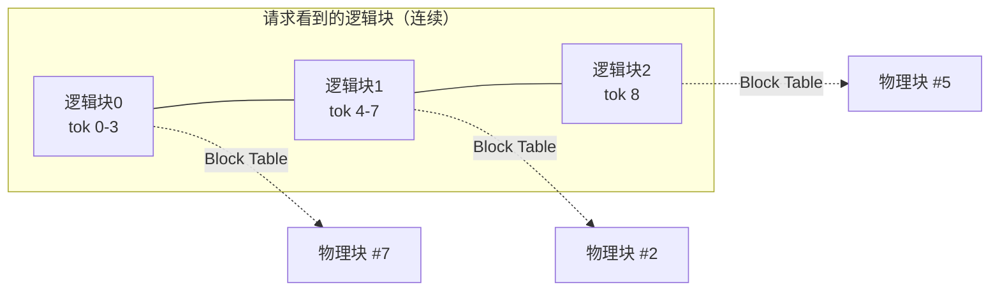
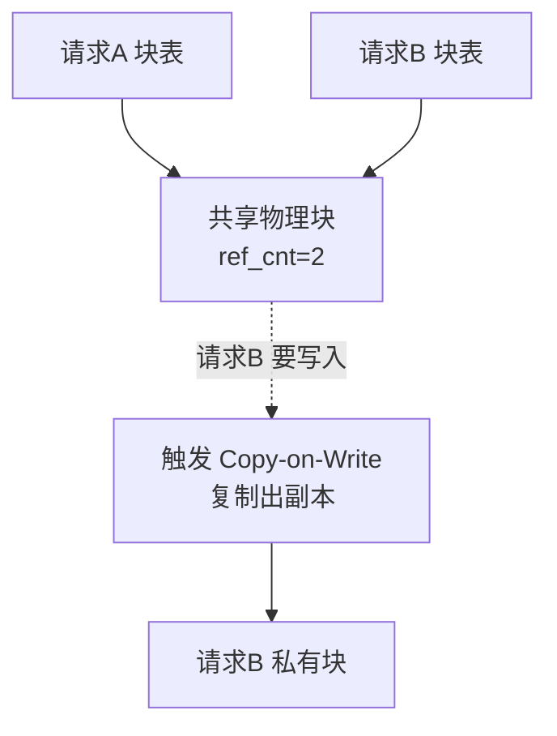
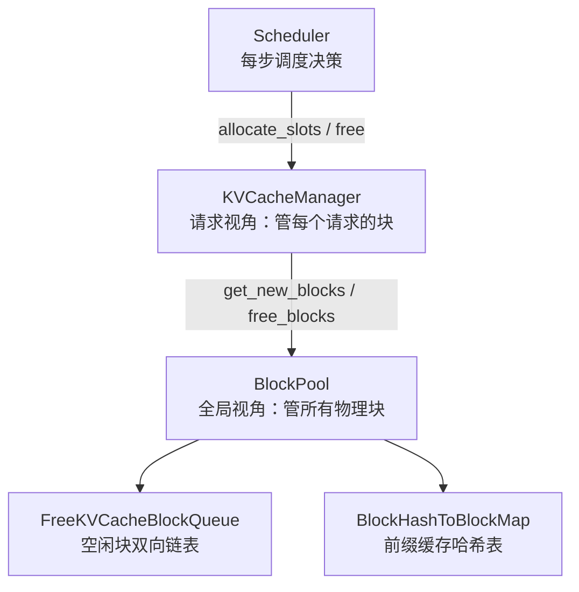

上一章的 KV Cache 显存账本留下了一个尖锐的问题：传统的连续显存分配方式，会因为“预留即浪费”产生大量碎片，实际利用率可能只有两三成。PagedAttention 就是 vLLM 用来解决这个问题的看家本领——它把操作系统管理内存的经典智慧搬到了 GPU 显存上。这一节我们把它彻底讲透：它借鉴了什么思想、Block Table 怎么工作、为什么能消灭碎片，以及它顺带解锁的前缀共享能力。

<!-- more -->

## 📑 目录

- [1. 问题回顾：连续分配的两宗罪](#1-问题回顾连续分配的两宗罪)
- [2. 核心思想：借鉴操作系统的虚拟内存分页](#2-核心思想借鉴操作系统的虚拟内存分页)
- [3. Block Table：逻辑块到物理块的映射](#3-block-table逻辑块到物理块的映射)
- [4. 分页如何消灭碎片](#4-分页如何消灭碎片)
- [5. Kernel 视角：分散的物理块怎么被读出来](#5-kernel-视角分散的物理块怎么被读出来)
- [6. 意外之喜：内存共享与 Copy-on-Write](#6-意外之喜内存共享与-copy-on-write)
- [7. 抢占与恢复：显存不够时怎么办](#7-抢占与恢复显存不够时怎么办)
- [8. 工程实践：PagedAttention 在 vLLM 里怎么调](#8-工程实践pagedattention-在-vllm-里怎么调)
- [9. 源码走读：vLLM V1 的 KV Cache 管理](#9-源码走读vllm-v1-的-kv-cache-管理)
- [10. 代价与权衡](#10-代价与权衡)
- [总结](#-总结)
- [自我检验清单](#-自我检验清单)
- [参考资料](#-参考资料)

---

## 1. 问题回顾：连续分配的两宗罪

在理解解法之前，先把问题钉死。传统推理框架（PagedAttention 出现之前）给每个请求的 KV Cache 分配的是**一整块连续显存**，而且要按“这个请求可能生成的最大长度”来预留。这带来两宗罪：

- **内部碎片（Internal Fragmentation）**：一个请求最大可能生成 2048 个 Token，就先占好 2048 个 Token 的空间，但它实际可能只生成了 100 个就遇到 EOS 停了。剩下 1948 个 Token 的空间被这个请求“锁着”却没用上，其它请求也进不来。
- **外部碎片（External Fragmentation）**：不同请求预留的大块之间会留下大小不一的空隙，这些零碎空间加起来可能不小，但因为每一块都不够放下一个完整请求，等于全废了。

用一个类比：这就像餐厅给每桌客人都按“最多可能来 10 个人”预留一张十人桌。结果大部分桌子只坐了两三个人，大量座位空着；而新来的一桌 4 人客人，却因为没有一张完整的空桌而只能在门口排队——明明加起来的空座位远够坐下他们。

📌 **关键点**：碎片的根源在于**连续 + 预留**这两个约束叠加。只要打破“必须连续”和“必须按最大长度预留”，碎片问题就迎刃而解。这正是 PagedAttention 的切入点。

---

## 2. 核心思想：借鉴操作系统的虚拟内存分页

操作系统几十年前就遇到过一模一样的问题：进程需要连续的内存地址空间，但物理内存被各种进程切得七零八落。操作系统的解法是**虚拟内存分页**——进程看到的是连续的“虚拟地址”，操作系统在背后通过页表（Page Table）把它们映射到任意分散的“物理页”上。进程感觉自己占着一整块连续内存，实际上物理上是东一块西一块拼起来的。

PagedAttention 把这套机制原样搬到了 KV Cache 上：

- 把 KV Cache 切成固定大小的 **KV Block（块）**，每个块存固定数量 Token 的 Key 和 Value（这个数量由 `block_size` 决定，vLLM 中常见取值为 16）。
- 一个请求的 KV Cache 在逻辑上是连续的“逻辑块”序列，物理上却可以散落在显存的任意位置。
- 用一张 **Block Table（块表）** 记录“这个请求的第几个逻辑块，对应物理显存里的哪一个物理块”。

🔑 **核心概念**：**PagedAttention = KV Cache 的虚拟内存分页。** Token 序列被切成块、按需分配、用块表映射，从此显存不再要求连续，也不再需要提前按最大长度预留。

💡 **提示**：vLLM 官方文档特别提醒，这里说的 KV Block 是 vLLM 自己的显存管理单位，和 CUDA 里的 “thread block（线程块）” 完全是两回事，不要混淆。

---

## 3. Block Table：逻辑块到物理块的映射

Block Table 是整个机制的枢纽。我们用一个具体的例子走一遍。

假设 `block_size = 4`（每块存 4 个 Token 的 KV，真实场景常用 16，这里为了好画取 4）。一个请求 Prefill 了 9 个 Token，那么它需要 $\lceil 9/4 \rceil = 3$ 个逻辑块：

- 逻辑块 0：Token 0~3
- 逻辑块 1：Token 4~7
- 逻辑块 2：Token 8（只用了 1 格，还剩 3 格）

vLLM 从空闲物理块池里分配 3 个物理块给它——注意物理块编号可以完全不连续，比如物理块 `#7`、`#2`、`#5`。Block Table 就长这样：

| 逻辑块 | 物理块 | 状态 |
|---|---|---|
| 0 | #7 | 已满（4/4） |
| 1 | #2 | 已满（4/4） |
| 2 | #5 | 部分填充（1/4） |



进入 Decode 阶段后，每生成一个新 Token 就往当前逻辑块的空位里填。逻辑块 2 还剩 3 格，能再接 3 个 Token；填满后（生成到第 12 个 Token），vLLM 才**按需**再申请一个新物理块挂到逻辑块 3——**用多少申请多少，绝不提前预留**。

Attention 计算时，CUDA Kernel 通过 Block Table 拿到每个逻辑位置对应的 `physical_block_number`（物理块号）和 `physical_block_offset`（块内偏移），就能从分散的物理块里正确读到所有历史 KV。

---

## 4. 分页如何消灭碎片

回到第 1 节的两宗罪，看分页是怎么逐一破解的：

- **消灭内部碎片**：不再按最大长度预留，而是每次只分配一个块，填满了再要下一个。浪费被限制在“最后一个块内没填满的部分”，最多不到一个块（比如 `block_size=16` 时最多浪费 15 个 Token 的空间），相比动辄浪费上千 Token 的旧方式，几乎可以忽略。
- **消灭外部碎片**：所有物理块**大小完全相同**，任何一个空闲块都能被任何请求使用。不存在“空间够但形状不对”的问题，空闲块池里的每一块都是等价、可复用的。

| 📊 维度 | 传统连续分配 | PagedAttention |
|---|---|---|
| 显存布局 | 每请求一整块连续显存 | 固定大小块，物理上分散 |
| 分配时机 | 提前按最大长度预留 | 按需逐块分配 |
| 内部碎片 | 严重（预留 >> 实际用量） | 极小（< 1 个块） |
| 外部碎片 | 存在（空隙大小不一） | 消除（块大小统一） |
| 显存利用率 | 偏低 | 接近最优 |

📌 **关键点**：显存利用率提上去，直接意味着**同一张卡能同时塞下更多并发请求**。而上一章讲过，Decode 是 Memory Bound，把更多请求拼进一个 Batch 能显著提升系统吞吐——所以 PagedAttention 省下的显存，最终转化成了实打实的吞吐提升。

---

## 5. Kernel 视角：分散的物理块怎么被读出来

前面都在讲“逻辑上”怎么映射，但有个绕不开的疑问：KV 既然被打散到显存各处，Attention Kernel 计算时怎么还能高效地把它们凑齐？这一节钻进 Kernel 内部看一眼——理解了这里，才算真正吃透 PagedAttention 不只是个显存管理技巧，而是**算子与内存布局的协同设计**。

传统 Attention 假设一个序列的 K、V 在显存里是**连续排列**的，Kernel 直接用一个基地址加偏移就能顺序扫过去。PagedAttention 打破了连续性，于是 Kernel 必须先查块表，把“逻辑位置”翻译成“物理地址”。核心是两个量：

- **`physical_block_number`（物理块号）**：决定去哪一个物理块里取数，乘以块的跨度（block stride）得到块的基址。
- **`physical_block_offset`（块内偏移）**：定位这个 Token 在块内的第几格。

vLLM 官方 Kernel 文档里，Key 指针的地址计算大致是这样一个形式（简化示意，非逐字照搬）：

```cpp
// 根据物理块号 + 头偏移 + 块内偏移，算出这个 token 的 Key 起始地址
const scalar_t* k_ptr = k_cache
                      + physical_block_number * kv_block_stride   // 定位到物理块
                      + kv_head_idx           * kv_head_stride    // 定位到对应 KV 头
                      + physical_block_offset * x;                // 定位块内 token
```

一个 Warp（32 个线程组成的执行单元）在外层循环里逐块推进：每次迭代通过块号跳到下一个物理块，`k_ptr` 随之指向不同块里的 Key。于是**物理上东一块西一块的存储，被 Kernel 当成一段逻辑连续的上下文来访问**。间址查表的代价，就藏在这每次迭代的地址重算里——这也是下文“代价与权衡”要讨论的开销来源。

⚠️ **注意**：vLLM 官方这篇 Kernel 走读文档明确标注为“基于原始论文的历史文档，不再反映 vLLM 当前代码”。所以上面的指针公式请当作**理解原理的示意**，而非当前源码。真正想读实现，要去看 V1 引擎的 Attention 后端（第 2.5 节会讲到 FlashAttention/FlashInfer 等后端如何接管这层逻辑）。

---

## 6. 意外之喜：内存共享与 Copy-on-Write

分页机制还顺带解锁了一个连续分配时代做不到的能力：**多个请求共享同一份物理块**。

因为 KV 现在是以块为单位、通过块表间接引用的，多个请求的块表完全可以指向**同一个物理块**。典型场景：

- **共享前缀**：一批请求用了相同的 System Prompt，或从同一个 Prompt 并行采样多个回答（`n > 1`）。它们的前缀 KV 完全相同，就没必要各存一份——让它们的块表都指向同一批物理块即可。这就是下一节（2.3 Prefix Cache）的物理基础。

那如果共享同一个块的两个请求，后来生成的内容分叉了怎么办？答案是操作系统里另一个经典机制——**写时复制（Copy-on-Write, CoW）**：

- 只读共享时，大家指向同一块，靠**引用计数（ref_cnt）**记录有几个请求在用。
- 当某个请求要往一个被共享的块里写新内容时，先把这个块复制一份成为它的私有块，在副本上写，再更新自己的块表指向副本。其他请求不受影响。



💡 **提示**：这套“引用计数 + 写时复制”和 Linux `fork()` 之后父子进程共享内存页的机制如出一辙。理解了操作系统的分页与 CoW，PagedAttention 几乎没有新东西——这也是它设计上如此优雅的原因。

---

## 7. 抢占与恢复：显存不够时怎么办

分页解决了“怎么高效存”，但还有个现实问题：并发请求太多，物理块池被抽干了，新来的 Decode 步骤申请不到块，怎么办？总不能让请求崩掉。vLLM 的答案是**抢占（Preemption）**——像操作系统调度进程一样，临时“暂停”一部分请求，把资源让给别人，等有空间了再恢复。

触发时机很直接：某一步 Decode 需要为若干请求追加新块，但空闲物理块不够。调度器会挑选部分请求“踢出”，释放它们占用的物理块。被踢出的请求，其已经算好的 KV Cache 有两种处理方式：

| 🔄 恢复方式 | 做法 | ✅ 优点 | ❌ 代价 |
|---|---|---|---|
| **换出（Swapping）** | 把 KV Cache 从 GPU 显存拷贝到 CPU 内存暂存，恢复时再拷回来 | 不用重算，省算力 | 占用 CPU 内存，来回拷贝有 PCIe 传输开销 |
| **重计算（Recomputation）** | 直接丢弃 KV，恢复时把该请求已生成的 Token 当成新 Prompt 重新 Prefill 一遍 | 不占 CPU 内存，实现简单 | 要重跑一次 Prefill，浪费算力 |

用一个类比：换出像是把桌上暂时用不到的资料**收进抽屉**（CPU 内存），要用再拿出来；重计算则是干脆**把草稿扔了**，需要时凭记忆（已生成的 Token）重新推导一遍。哪个划算取决于“抽屉够不够大、传输快不快”和“重推贵不贵”。

📌 **关键点**：抢占是 vLLM 在显存压力下**保证不 OOM、请求不失败**的兜底机制。如果你在日志里频繁看到 preemption 相关的告警，说明并发压得太满——要么调低并发、要么增大 `gpu_memory_utilization` 给 KV Cache 更多空间、要么加卡。它是“系统在硬扛”的信号，不是常态。

---

## 8. 工程实践：PagedAttention 在 vLLM 里怎么调

理论讲完，落到实处：作为使用者，你能通过哪些参数影响 PagedAttention 的行为？下面几个是最相关的引擎参数（基于 vLLM 近期版本，参数默认值可能随版本调整，以你所用版本的 `vllm serve --help` 为准）。

```python
from vllm import LLM

llm = LLM(
    model="meta-llama/Llama-3.1-8B-Instruct",
    # KV Cache 能用多少显存的总闸门：模型权重之外，
    # 剩余显存的这个比例划给 KV Cache 块池。默认 0.9 左右。
    gpu_memory_utilization=0.90,
    # 每个 KV Block 存多少个 token 的 KV。分页的基本粒度。
    block_size=16,
    # 开启前缀缓存，让相同前缀的请求复用物理块（见 2.3 节）。
    enable_prefix_caching=True,
    # 一个 batch 里最多同时处理多少条序列。
    max_num_seqs=256,
)
```

各参数与 PagedAttention 的关系：

- **`gpu_memory_utilization`**：官方文档给出的默认值约为 `0.9`（即把 90% 显存交给 vLLM 实例，权重之外的部分绝大多数拿来做 KV Cache 块池）。调高能容纳更多并发、更少触发抢占，但留给激活值和其它开销的余量变小，太激进可能 OOM。
- **`block_size`**：分页粒度，就是前面反复提到的每块 Token 数。文档将其描述为“以 Token 数计的连续缓存块大小”。调它要在“块表长度/管理开销”和“尾块内部碎片”之间权衡。
- **`enable_prefix_caching`**：开启后，共享前缀（如统一 System Prompt）的请求直接复用已缓存的物理块，省掉重复 Prefill——这正是第 6 节内存共享能力的产品化开关。
- **`max_num_seqs`**：单次迭代最多处理的序列数，配合下一节的 Continuous Batching 决定并发上限。

💡 **提示**：绝大多数场景下，你**不需要手动改 `block_size`**——默认值已在多数模型上调优过。真正常动的旋钮是 `gpu_memory_utilization`（压榨显存）和 `enable_prefix_caching`（有共享前缀就开）。

---

## 9. 源码走读：vLLM V1 的 KV Cache 管理

会用参数还不够，想真正吃透就得看一眼 vLLM 是怎么把“块表 + 空闲块池 + 引用计数”落成代码的。下面基于 vLLM V1 引擎的 `vllm/v1/core/` 目录（代码持续演进，方法签名以你所用版本源码为准，这里讲的是稳定的设计骨架）。

⚠️ **注意**：前面第 5 节引用的那份 Kernel 文档是 V0 时代的历史文档。V1 引擎对调度与 KV Cache 管理做了整体重写，把管理逻辑集中到了 `KVCacheManager` 和 `BlockPool` 两个核心类。下面讲的是 V1 的实现。

### 9.1 两个核心类的分工

V1 把职责切得很清楚：



- **`KVCacheManager`**（`kv_cache_manager.py`）：**请求视角**的管理者。调度器每一步都通过它给请求申请、释放块。核心方法一眼就能对上前面讲的概念：
  - `get_computed_blocks`：前缀缓存查询——返回该请求能命中的、已经算好的块，以及命中了多少 Token。这就是第 6 节“共享前缀”的入口。
  - `allocate_slots`：为请求新增的 Token 申请槽位/块，顺带释放不再需要的块，并检查空闲块是否够用；不够就返回 `None`（交给调度器触发抢占）。这正是第 3 节“按需逐块分配”的代码化身。
  - `free`：请求结束时**逆序**释放它的块——让尾部的块先被回收，因为头部的块更可能被前缀缓存复用，留得越久越好。
- **`BlockPool`**（`block_pool.py`）：**全局视角**的物理块仓库，不关心哪个请求，只管“哪些块空着、哪些块被缓存着”。

### 9.2 空闲块为什么用双向链表

一个容易被忽略的设计细节：`BlockPool` 里所有块存在一个普通列表 `self.blocks: list[KVCacheBlock]`（按 block id 索引），但**空闲块**单独用一个 `FreeKVCacheBlockQueue` 管理——它内部是一条**双向链表**，而不是简单的栈或 `deque`。

为什么费这个劲？因为空闲块要同时满足两种操作：

- **分配时**从头部快速取走 N 个（`popleft_n`）；
- **前缀缓存命中时**，一个原本“空闲但仍缓存着有效内容”的块要被重新激活——需要从链表**中间任意位置**把它摘出来（`remove`）。

普通队列没法 $O(1)$ 地从中间删除，双向链表可以。这就是 vLLM 用双向链表的原因——它服务于“空闲块也可能携带可复用缓存”这一前缀缓存的核心诉求。

### 9.3 引用计数与释放顺序

`ref_cnt`（引用计数）是内存共享的骨架，代码里的行为和第 6 节讲的 CoW 完全对应：

```python
# 伪代码：还原 BlockPool 的关键逻辑（非逐字源码）
def get_new_blocks(self, num_blocks):
    if num_blocks > self.get_num_free_blocks():
        raise ValueError("空闲块不足")          # 触发上层抢占
    blocks = self.free_block_queue.popleft_n(num_blocks)
    for blk in blocks:
        assert blk.ref_cnt == 0                 # 新分配的块必须无人引用
        blk.ref_cnt += 1
    return blocks

def free_blocks(self, ordered_blocks):
    for blk in ordered_blocks:
        blk.ref_cnt -= 1
        if blk.ref_cnt == 0:                    # 没人用了才真正回收
            self.free_block_queue.append(blk)   # 放回空闲链表尾部

def touch(self, blocks):                        # 前缀缓存命中时调用
    for blk in blocks:
        if blk.ref_cnt == 0:                    # 从空闲链表里"抢救"回来
            self.free_block_queue.remove(blk)
        blk.ref_cnt += 1
```

两个值得记住的设计：

1. **释放不等于清空**：`ref_cnt` 归零的块只是回到空闲链表，**内容还在**。如果后续请求的前缀哈希命中它，`touch()` 直接把它复活复用——这就是 Automatic Prefix Caching 省掉重复 Prefill 的底层机制。
2. **带哈希的块留得更久**：释放时，vLLM 把“没缓存价值的块”放链表头（优先被再分配覆盖），“带哈希、有复用潜力的块”放链表尾（晚点才被淘汰）。这是一种朴素但有效的缓存驱逐策略（近似 LRU）。

📌 **关键点**：读源码时抓住这条主线——**`KVCacheManager` 管请求、`BlockPool` 管物理块、`ref_cnt` 管共享、`FreeKVCacheBlockQueue` 管淘汰**。四者一咬合，第 3~7 节讲的分页、共享、CoW、抢占就全落地了。

---

## 10. 代价与权衡

PagedAttention 不是没有成本，工程上要清楚它的取舍：

- ✅ **收益**：显存利用率接近最优、支持前缀共享、支持显存不足时通过换出（Swapping）/重计算（Recompute）抢占恢复而非直接失败。
- ❌ **代价**：Attention Kernel 要额外做一层块表查找与间址访问（第 5 节的指针重算），实现比连续内存的朴素 Attention 复杂；块表本身也要占一点管理开销。

关于 `block_size` 的权衡：块太小，块表变长、管理开销上升；块太大，又会退化出内部碎片（最后一块浪费变多）。vLLM 选择 16 这类中等值作为常见默认，是在管理开销和碎片之间取平衡。

⚠️ **注意**：本文多处强调的“分页 + 块表 + CoW”是 vLLM 稳定不变的**设计地基**，但 V1 引擎里的具体数据结构（如 KV Cache Manager 的实现）已经过多轮重写演进。学习时抓住不变的核心思想，具体代码以最新版本为准。

---

## 📝 总结

- PagedAttention 把**操作系统虚拟内存分页**搬到了 KV Cache：切块、按需分配、块表映射。
- **Block Table** 把请求看到的连续逻辑块，映射到物理上分散的物理块，从此显存无需连续、无需按最大长度预留。
- **Kernel 侧**通过 `physical_block_number` + `physical_block_offset` 查表寻址，把分散的物理块当成逻辑连续的上下文来读——这是算子与内存布局的协同设计。
- 它同时消灭了**内部碎片**（不再超额预留）和**外部碎片**（块大小统一），把显存利用率推到接近最优，进而转化为更高的并发与吞吐。
- 分页天然支持**内存共享 + Copy-on-Write**，为前缀复用（Prefix Cache）打下基础。
- 显存被抽干时，靠**抢占**（换出到 CPU 或重计算）兜底，保证请求不失败而非直接 OOM。
- 工程上常动的旋钮是 `gpu_memory_utilization` 与 `enable_prefix_caching`；`block_size` 需在管理开销与碎片间权衡（vLLM 常用 16）。
- 源码上，V1 引擎由 `KVCacheManager`（管请求）+ `BlockPool`（管物理块）+ `ref_cnt`（管共享）+ `FreeKVCacheBlockQueue`（管淘汰）协作落地。

## 🎯 自我检验清单

- 能说清连续分配下内部碎片和外部碎片各自的成因
- 能用“逻辑块 → 物理块”的映射解释 Block Table 的作用
- 能画出一个请求 Prefill 后的块表，并说明 Decode 时块如何按需增长
- 能解释 Attention Kernel 如何通过物理块号与块内偏移读取分散的 KV
- 能解释 PagedAttention 为什么能同时消除内部和外部碎片
- 能说明内存共享与 Copy-on-Write 如何支持前缀复用与并行采样
- 能区分抢占恢复的两种方式（换出 vs 重计算）及各自的代价
- 能说出 `gpu_memory_utilization`、`block_size`、`enable_prefix_caching` 分别影响什么
- 能说清 vLLM V1 中 `KVCacheManager` 与 `BlockPool` 的职责分工
- 能解释空闲块为什么用双向链表而不是普通队列
- 能分析 `block_size` 取值过大或过小分别带来什么问题
- 能把“省显存”和“提吞吐”通过 Memory Bound 的结论串联起来

## 📚 参考资料

- [Efficient Memory Management for Large Language Model Serving with PagedAttention（vLLM 论文）](https://arxiv.org/abs/2309.06180)
- [vLLM 官方博客：Easy, Fast, and Cheap LLM Serving with PagedAttention](https://blog.vllm.ai/2023/06/20/vllm.html)
- [vLLM Design — PagedAttention Kernel](https://docs.vllm.ai/en/latest/design/paged_attention.html)
- [vLLM Design — Automatic Prefix Caching](https://docs.vllm.ai/en/latest/design/prefix_caching.html)
- [vLLM — Engine Arguments（引擎参数与默认值）](https://docs.vllm.ai/en/latest/configuration/engine_args.html)
- [vLLM V1 源码 — vllm/v1/core（KVCacheManager、BlockPool）](https://github.com/vllm-project/vllm/tree/main/vllm/v1/core)
