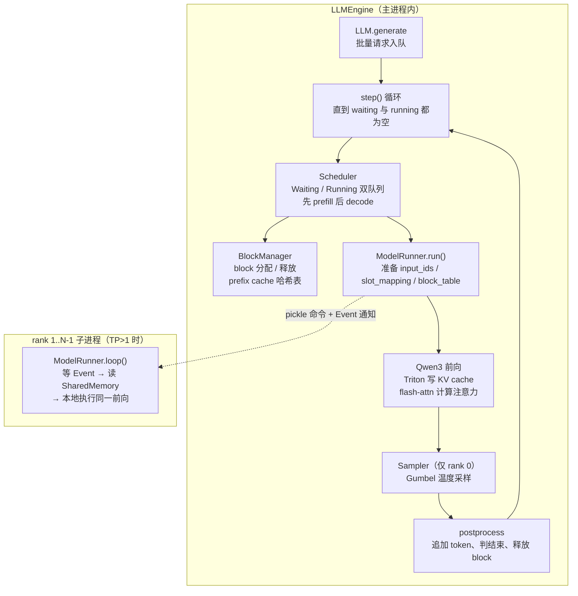
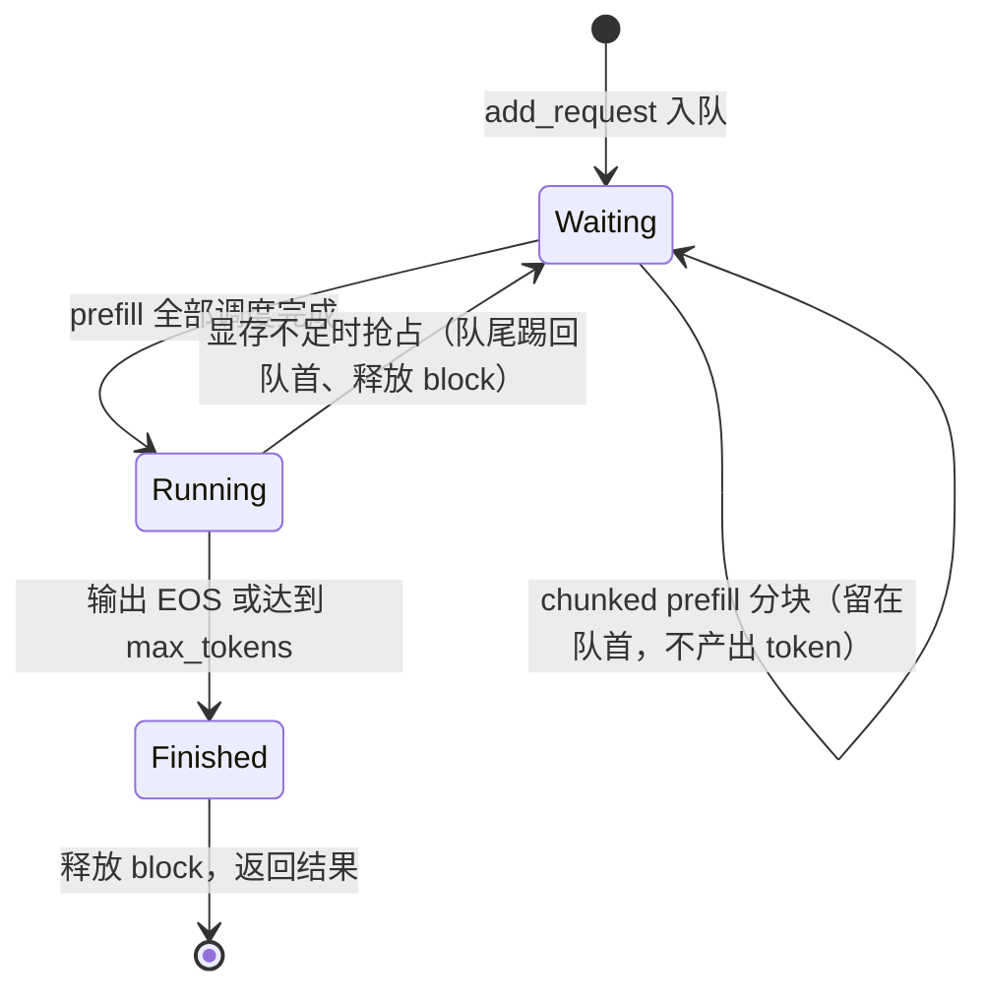

vLLM 的仓库有几十万行代码，而 nano-vllm 用约 1200 行 Python（README 自报口径）就把它的骨架复刻了出来：双队列调度、按 block 记账的 KV cache、基于 xxhash 的前缀缓存、CUDA graph、张量并行。在作者自报的基准里，同一台 RTX 4070 Laptop（8GB）跑 Qwen3-0.6B、256 个请求，nano-vllm 是 1434.13 tok/s，vLLM 是 1361.84 tok/s。读完 3.1 你已经在用 vLLM，这一节回答一个问题：**vLLM 的核心机制，最小实现长什么样？** 答案写在 nano-vllm 的五个核心文件里——调度器 92 行、block 管理器 120 行、模型执行器 257 行、注意力算子 75 行、采样器 12 行。把它们读通，vLLM 对你就不再是黑盒，而是一张“它在哪一步做重了、做全了”的对照表。

<!-- more -->

## 📑 目录

- [1. 为什么读 nano-vllm](#1-为什么读-nano-vllm)
- [2. 全景：一条请求怎么走完整个引擎](#2-全景一条请求怎么走完整个引擎)
- [3. 调度器：双队列与两阶段](#3-调度器双队列与两阶段)
- [4. 显存账本：block 与 KV cache 分配](#4-显存账本block-与-kv-cache-分配)
- [5. Prefix Cache：xxhash 链式哈希](#5-prefix-cachexxhash-链式哈希)
- [6. 注意力与算子：KV 写入、flash-attn 与 CUDA graph](#6-注意力与算子kv-写入flash-attn-与-cuda-graph)
- [7. 采样器：Gumbel 技巧与温度采样](#7-采样器gumbel-技巧与温度采样)
- [8. 张量并行：SharedMemory 与 Event 的极简 IPC](#8-张量并行sharedmemory-与-event-的极简-ipc)
- [9. 性能对比：README 自报的数字](#9-性能对比readme-自报的数字)
- [10. 局限与后续阅读路线](#10-局限与后续阅读路线)
- [总结](#-总结)
- [自我检验清单](#-自我检验清单)
- [参考资料](#-参考资料)

---

## 1. 为什么读 nano-vllm

### 1.1 几十万行 vs 1200 行

为什么不在 3.4 直接读 vLLM 的 Scheduler？因为 vLLM 是工业引擎：Python 之外有大量 C++/CUDA（PagedAttention kernel、自定义 NCCL 封装、多进程 EngineCore、量化与多模态支持……），一个 `Scheduler` 类牵扯几十个模块。问题不是“读不懂某一行”，而是“不知道从哪一行开始、哪些行是核心”。

nano-vllm 的思路相反：**功能裁剪到最小，机制一个不少**。它只支持 Qwen3 系列模型的离线批量推理，但 vLLM 的招牌机制全部保留：连续批处理的迭代级调度、PagedAttention 式的 block 显存管理、前缀缓存、CUDA graph、张量并行。五个核心文件加起来约 560 行（`wc -l` 口径，含空行与注释），就是 vLLM 推理循环的最小骨架。

> 本文所有源码引用对应仓库 main 分支（写作时 HEAD 为 bb823b3，chunked-prefill-refactor 合入后）。行数、默认值与机制描述都以这份代码为准，你 clone 的版本如有差异，以实际代码为准。

### 1.2 最小可运行实现 = 心智地图

🔑 **核心概念**：**最小可运行实现（minimal runnable implementation）——一个能真实跑出结果、但砍掉一切非核心分支的版本。** 它有两个用处：第一，每个文件都能一口气读完，机制之间没有“跳转深坑”；第二，它是 vLLM 的索引——读完 nano-vllm 再看 vLLM，你找的是“它把哪一步做重了”，而不是“这一步是什么”。

读法建议：先跟一条请求走完整个引擎（第 2 节），再逐个机制钻进去（第 3-8 节），最后回到性能与局限（第 9-10 节）校准认知。

## 2. 全景：一条请求怎么走完整个引擎

一条请求从进来到返回，要经过哪些环节？先看整体结构：整个引擎只有两类角色——**LLMEngine**（主进程，持有调度器与 rank 0（进程编号 $0$，主进程） 的模型执行器）和 **ModelRunner**（模型执行器，TP（Tensor Parallel，张量并行，把权重矩阵按行／列切到多卡，每卡算部分结果）>1 时 rank（进程编号 $0\ldots N-1$，每卡一 rank）$1\ldots N-1$ 是 spawn 出来的子进程）。请求的流转如下：



引擎的主动脉是 `generate()` 里的 while 循环，每一步 `step()` 做四件事：

```python
# nanovllm/engine/llm_engine.py（主干逻辑）
def step(self):
    seqs, is_prefill = self.scheduler.schedule()          # ① 调度：选出本步要算的序列
    num_tokens = sum(seq.num_scheduled_tokens for seq in seqs) if is_prefill else -len(seqs)
    token_ids = self.model_runner.call("run", seqs, is_prefill)   # ② 前向 + 采样
    self.scheduler.postprocess(seqs, token_ids, is_prefill)       # ③ 回写：追加 token、判结束
    outputs = [(seq.seq_id, seq.completion_token_ids) for seq in seqs if seq.is_finished]
    return outputs, num_tokens                              # ④ 返回本步产出与吞吐统计
```

注意第 ④ 步的吞吐口径：prefill 步统计的是**本轮实际调度的 prompt token 数**，decode 步统计的是**序列数**（每序列每步恰好 1 个 token），所以 `-len(seqs)` 取负号只是把两类统计区分开。你在 tqdm 进度条上看到的 `Prefill xxx tok/s` 和 `Decode xxx tok/s` 就是这么来的。

📌 **关键点**：整个引擎只有一个循环、一个调度入口。vLLM 的 `step()` 也是如此——理解了这一个循环，就理解了 vLLM 的主干；其余几千行都是在为这个循环补充并发、流式与容错。

## 3. 调度器：双队列与两阶段

调度器只有 92 行，但它回答的问题和 vLLM 的 Scheduler 完全一样：**每一步，GPU 该算哪些请求？** 答案是两个队列、两个阶段。

### 3.1 Waiting 与 Running 两条队列

```python
self.waiting: deque[Sequence] = deque()    # 等位的：prompt 还没算完
self.running: deque[Sequence] = deque()    # 在跑的：正在逐 token 生成
```

打个比方：这像医院叫号——挂号后的请求进候诊室（Waiting），叫到号进诊室（Running），看完病离开（FINISHED）。两条队列都是**先进先出**的双端队列，但两端都能操作：队首出队调度，队尾出队抢占（见 3.4）。

### 3.2 Prefill 阶段：先喂饱新请求

`schedule()` 每一轮先处理 Waiting，再处理 Running。为什么这个顺序？因为 prefill 是矩阵运算（compute bound），decode 是向量运算（memory bound），把新请求的 prefill 排在前面，能让 GPU 尽快进入密集计算——这正是你在 2.2 学过的迭代级调度（continuous batching）的落点。

Prefill 循环受两个预算约束：**每步最多 16384 个 token**（`max_num_batched_tokens` 默认值）和**最多 512 个序列**（`max_num_seqs` 默认值）。从队首取一个序列，能算多少就调度多少；调度完就升级为 RUNNING，挪进 running 队尾。

这里有一个值得细看的机制——**chunked prefill（分块预填充）**：当预算不够一个序列的剩余 token 时，代码里有一句 `if remaining < num_tokens and scheduled_seqs: break`。意思是：**只有本批第一个序列允许“只算一部分”**（`num_scheduled_tokens = min(num_tokens, remaining)`），后续序列必须整段放得下，否则下轮再说。分块未完成的序列留在 waiting 队首、状态仍是 WAITING，下一轮继续从 `num_cached_tokens` 处接着算，并且**不产出 token**（`postprocess` 里 `num_cached_tokens < num_tokens` 时把该序列的采样结果丢弃、不追加 token）。

为什么限制只有第一个序列能分块？因为分块会让批内 token 形状参差、增加调度轮次。nano-vllm 用“只照顾队首”的保守策略换实现简单；vLLM 的 V1 引擎则用统一的 token 预算把 prefill/decode 一起摊平（见本章后续小节）。

### 3.3 Decode 阶段：每序列每步恰好 1 个 token

Waiting 清空（或本轮放不下）后，进入 decode 阶段：从 running 队首逐个取出序列，每个序列**本步只调度 1 个 token**——这就是自回归的本质：新 token 依赖前面所有 token 的输出，串行不可跳过。deque 循环取头，调度完的序列用 `extendleft(reversed(...))` 放回队尾，保证公平轮转。

### 3.4 抢占：从队尾踢回队首

如果 decode 时显存不够了怎么办？`can_append` 检查该序列下一个 token 是否需要新 block（见 [§4 显存账本：block 与 KV cache 分配](#4-显存账本block-与-kv-cache-分配)——该节按 256 token 一格的 block 讲 KV cache 分配与账本，本文仅在此作是否需新 block 的条件判断，具体分配与释放逻辑在该节展开），拿不到就**抢占（preempt）**：

```python
def preempt(self, seq):
    seq.status = SequenceStatus.WAITING      # 降级回等待
    seq.is_prefill = True                    # 下次按 prefill 重算
    self.block_manager.deallocate(seq)       # 释放全部 block
    self.waiting.appendleft(seq)             # 插到 waiting 队首
```

抢占顺序很有讲究：**先踢 running 队尾**（`self.running.pop()`，最晚进入的序列），踢到能放下当前序列为止；实在不够才踢当前序列自己。被踢的序列释放全部 block，回到 waiting 队首——它把显存让了出来，代价是下次要重新走一遍 prefill。这就是你常听到的“抢占 + 重计算（recompute）”：**用计算换显存**。



💡 **提示**：被抢占的序列下次重算时，真的会“全量重算”吗？不一定——第 5 节的前缀缓存会让它找回大部分已算好的 KV。抢占释放的是“占用”，不是“成果”。

## 4. 显存账本：block 与 KV cache 分配

### 4.1 集装箱：256 个 token 一格

第 2 章讲过 PagedAttention 的十人桌比喻：KV cache 不再按请求连续分配，而是切成固定大小的块。nano-vllm 的 block 大小默认 **256 个 token**（`kvcache_block_size=256`，且配置断言必须是 256 的倍数）。每个序列持有一张 **block_table**——记录它的第 i 个逻辑块对应哪块物理显存，这正是 PagedAttention 的“虚拟页 → 物理页”映射。

什么时候需要新 block？看 `may_append` 的条件 `len(seq) % block_size == 1`：当序列长度模 256 余 1 时，说明下一个要算的 token 恰好落在新块的第一个槽位（位置 `len-1` 是 256 的倍数）。换句话说，**每跨过一个块边界，才申请一块新显存**——这正是“按需分配”。

### 4.2 KV cache 分配公式与算例

模型执行器初始化时，KV cache 的大小由一条公式决定：

$$\underbrace{block\_bytes}_{\text{单个 block 的显存}} = \underbrace{2}_{\text{K 和 V 两份}} \times \underbrace{L}_{\text{层数}} \times \underbrace{256}_{\text{block 大小}} \times \underbrace{\frac{H_{kv}}{TP}}_{\text{每卡 KV head 数}} \times \underbrace{d}_{\text{head 维度}} \times \underbrace{2}_{\text{FP16 每元素字节}}$$

可分配的 block 总数则是：

$$num\_blocks = \left\lfloor \frac{total \times gpu\_memory\_utilization - used - (peak - current)}{block\_bytes} \right\rfloor$$

三个减法分别是什么意思？`total × 0.9` 是预算上限（`gpu_memory_utilization` 默认 0.9）；`used` 是当前已被占用的显存；`peak − current` 是**warmup 峰值与当前占用的差**——模型初始化后先跑了一次“假前向”测出峰值，把这段差值留出来，保证之后真实运行复现峰值时不会 OOM。这个公式是保守的：KV cache 拿的是“预算减占用再减余量”剩下的部分。

代入 Qwen3-0.6B 算一笔账（28 层、8 个 KV head、head_dim=128，FP16，TP=1）：

$$block\_bytes = 2 \times 28 \times 256 \times 8 \times 128 \times 2 = 29{,}360{,}128 \text{ B} \approx 28 \text{ MiB}$$

8GB 显卡 × 0.9 ≈ 7.2 GiB 预算，减去权重（0.6B 参数 FP16 约 1.2 GB）和 CUDA 上下文、激活余量，剩约 5 GiB 左右——**大约 180~200 个 block，约 5 万 token 的 KV 容量**。单个请求最长 1024（输入）+ 1024（输出）= 2048 token = 8 个 block，意味着同批大约能装 25 个请求。这个并发上限不是 `max_num_seqs` 决定的，而是显存账本决定的。

> 以上为按公式的估算（待核实），实际以你机器上运行 `nano-vllm` 时分配的 block 数为准。KV cache 张量的形状是 `(2, layers, num_blocks, 256, num_kv_heads, head_dim)`，逐层挂到每个 Attention 模块的 `k_cache` / `v_cache` 上。

## 5. Prefix Cache：xxhash 链式哈希

### 5.1 为什么公共前缀能命中

多轮对话、RAG 请求往往共享同一段前缀（系统提示词、检索到的同一批文档）。如果两个请求的前 512 个 token 完全相同，它们的 KV cache 内容也完全相同——**重复计算就是浪费**。打个比方：打印店里几百份文件共用同一张封面，复印机只需印一次封面，其余直接拿复印件；前缀缓存就是这张“封面”，命中者直接引用。

前缀缓存要回答的问题：**怎么快速判断两个序列共享哪些前缀块？** 答案不是逐 token 比对，而是哈希。

### 5.2 链式哈希与内容校验

每个 block 计算一个 xxhash64 摘要，但有个关键设计——**链式**：

```python
def compute_hash(cls, token_ids, prefix=-1):
    h = xxhash.xxh64()
    if prefix != -1:
        h.update(prefix.to_bytes(8, "little"))   # 前一块的哈希作为前缀参与计算
    h.update(np.array(token_ids).tobytes())
    return h.intdigest()
```

第 i 块的哈希依赖第 i−1 块的哈希。为什么要链起来？因为哈希相等必须**同时意味着内容相等和位置相等**：两块 token 内容相同但前面接的前缀不同，算出的哈希也不同，绝不会被误判为同一块。两个序列共享前缀，当且仅当它们从第 0 块开始的链式哈希逐块相等。

`BlockManager` 维护一张 `hash_to_block_id` 字典：每步前向结束后，`hash_blocks` 给**本轮填满的块**登记哈希（不满 256 的“尾巴”不登记，也不参与缓存）。调度时 `can_allocate` 沿前缀逐块查表，命中一块就少算一块：

- 命中的块 `ref_count += 1`，**不占新的 block**——多个序列的 block_table 指向同一块物理显存，共享 K/V 数据；
- 只有未命中的部分才从空闲列表里取新 block，`num_tokens = seq.num_tokens - num_cached_blocks × block_size` 就是**真正要前向计算的部分**；
- 查表命中后还要比对 `token_ids` 内容——哈希只是索引，内容校验兜底防碰撞。

📌 **关键点**：前缀缓存的收益 = 省显存（命中块不新分配）+ 省计算（命中块的 KV 不重算）。代价是每次调度多一次逐块哈希计算，以及 256 token 的整块粒度——公共前缀不足 256 token 时，一个字都省不到。

### 5.3 抢占与缓存的一个联动细节

读源码时你会发现：`deallocate` 释放 block 时**不会删除**哈希表条目（只有 block 被重新分配出去时才清理）。这意味着被抢占序列的哈希条目还在：如果释放的 block 没被别的序列抢走，重新调度时 `can_allocate` 会原样命中，把同一块显存收回，KV 数据直接复用——**“重计算”通常只重算最后那个（多半不满 256 token 的）尾巴块；若尾巴恰好是整块，该整块也会一并重算**。如果 block 已被别的序列复用（内容被覆盖），内容比对会失败，才退回完整重算。这就是 3.4 的 💡 提示所说的“抢占释放的是占用，不是成果”。

## 6. 注意力与算子：KV 写入、flash-attn 与 CUDA graph

### 6.1 Triton 写 KV：slot_mapping 指路

前向的第一步是把新算出的 K、V 写进缓存。`store_kvcache_kernel` 是一个约 20 行的 Triton kernel，**每个 token 由一个 program 处理**：先读 `slot_mapping[idx]` 拿到这个 token 在缓存里的槽位，再把这一行的 K 和 V 写入 `k_cache` / `v_cache` 的 `slot × D` 偏移处。

槽位是谁算的？host 端 `prepare_prefill` / `prepare_decode`。prefill 阶段，新 token 的槽位是 `block_table[i] × 256 + 块内偏移`；decode 阶段，最后一个 token 的槽位是 `block_table[-1] × 256 + last_block_num_tokens − 1`。**显存管理（block 分配）与计算（写缓存）通过 slot_mapping 解耦**——kernel 完全不知道 block 是什么，只认“槽位”。

kernel 里有一行 `if slot == -1: return`——槽位为 −1 的 token 直接跳过。这是给 CUDA graph 留的暗号，见 6.3。

### 6.2 变长 prefill 与 decode 的 flash-attn

写完后进入注意力计算，prefill 和 decode 走两条不同路径：

- **prefill**：`flash_attn_varlen_func(q, k, v, cu_seqlens_q, cu_seqlens_k, max_seqlen_q, max_seqlen_k, causal=True)`——变长接口用 `cu_seqlens` 描述每个序列的边界，一次 kernel 处理整批不同长度的 prompt。如果有前缀缓存，代码会把 `k, v` 直接换成 `k_cache, v_cache`，并传入 `block_table`，让 flash-attn **从缓存里读前缀部分的 KV**——这就是“命中块的 KV 不重算”在算子层的落点；
- **decode**：`flash_attn_with_kvcache(q.unsqueeze(1), k_cache, v_cache, cache_seqlens=context_lens, block_table=...)`——每个 token 与整段缓存的 KV 做 attention，`context_lens` 告诉 kernel 每个序列已缓存多长。

### 6.3 CUDA graph：按 batch size 网格捕获

decode 每步只有几十个 token，kernel 启动开销占比大。解法是 CUDA graph：把一串 kernel 的启动录制成一张图，之后每次 replay 只花一次启动代价。nano-vllm 的捕获方式是**按 batch size 打网格**：

```python
self.graph_bs = [1, 2, 4, 8] + list(range(16, max_bs + 1, 16))   # max_bs = min(max_num_seqs, 512)
```

对网格里的每个 bs，用固定形状的静态缓冲跑一次 warmup 再 capture；运行时取 `bs >= 实际批大小` 的最近网格，把输入拷进静态缓冲后 `graph.replay()`。三个走 eager（不捕获）的情况：**prefill 阶段、`enforce_eager=True`、批大小超过 512**。

代价是什么？第一，静态缓冲要按最大形状预留显存（最大 bs × 最大 block_table 宽度）；第二，**变长被量化成网格**——bs=17 的请求要用 bs=32 的图，多出的 15 个位置用无效数据填充：`slot_mapping` 填 −1，于是 6.1 里那句 `if slot == -1: return` 正好让填充 token 不写缓存。每个优化都是牺牲与换取的交易：这里**用显存与形状浪费，换 kernel 启动开销**。

## 7. 采样器：Gumbel 技巧与温度采样

整个采样器只有 12 行，还带着 `torch.compile`：

```python
@torch.compile
def forward(self, logits, temperatures):
    logits = logits.float().div_(temperatures.unsqueeze(dim=1))   # 温度缩放
    probs = torch.softmax(logits, dim=-1)                          # 归一化成概率
    sample_tokens = probs.div_(torch.empty_like(probs).exponential_(1).clamp_min_(1e-10)).argmax(dim=-1)
    return sample_tokens
```

问题：如何按概率 `p` 采样一个 token？教科书做法是用累积分布做逆变换采样，但那样要排序、要查表。这里用的是 **Gumbel 技巧**：给每个候选加独立噪声再取最大值，噪声服从 Gumbel 分布时，`argmax_i (log p_i + g_i)` 恰好等价于按 `p` 采样——把“随机采样”变成“带噪声的 argmax”，一条向量化表达式搞定，还天然适合 GPU 与 `torch.compile`。

噪声从哪来？`Exponential(1)` 分布（PDF 为 e^{−x}）有个漂亮的性质：若 `u ~ Exponential(1)`，则 `−log u ~ Gumbel(0,1)`。于是：

$$p_i / u_i \xrightarrow{\text{取 argmax}} \arg\max_i (\log p_i - \log u_i) = \arg\max_i (\log p_i + g_i), \quad g_i \sim \text{Gumbel}$$

除以 `u` 等价于加 Gumbel 噪声（对数域），`clamp_min_(1e-10)` 防止 `u` 太接近 0 导致除零。

💡 **提示**：温度的作用是把 logits 整体缩放——温度越低分布越尖（趋近贪心），越高越平。注意 `SamplingParams` 断言 `temperature > 1e-10`：**temperature=0 的纯贪心在这个实现里是被禁止的**。这是功能裁剪的一个典型例子：vLLM 支持贪心、top-k、top-p、重复惩罚等一整套采样参数，nano-vllm 只留温度这一个旋钮。

## 8. 张量并行：SharedMemory 与 Event 的极简 IPC

多卡推理时，模型怎么切、卡间怎么通信？TP>1 时，`LLMEngine.__init__` 用 `mp.get_context("spawn")` 为 rank $1\ldots N-1$ 各起一个子进程，每个子进程独立初始化 NCCL（`dist.init_process_group("nccl", "tcp://localhost:2333", world_size, rank)`）并加载完整模型，rank 0 的 ModelRunner 则在主进程内。模型层的切分你在 6.2 学过：`Qwen3Attention` 里 `num_heads = total_heads // TP`、`num_kv_heads = total_kv_heads // TP`，QKV 投影与 KV cache 都按这个口径切。

真正的简化在**通信层**。真实 vLLM 的 TP 通信走 NCCL 集合通信（AllReduce（全归约，各卡部分和相加且人人得完整结果；以输出投影列切为例，卡1的 $a x_1$ 与卡2的 $b x_2$ 相加才得 $[a x_1+b x_2]$，故出口必 AllReduce）每层一次），而 nano-vllm 额外造了一套极简 IPC：

- rank 0 创建一块 **1 MiB 的 SharedMemory**（名字就叫 `"nanovllm"`）和每 worker 一个 **Event**；
- 每步 `step()`，rank 0 把命令 pickle 进共享内存（前 4 字节是长度，后面是 `[方法名, 序列列表, is_prefill]`），然后置位所有 Event；
- 各 worker 醒来，读命令、本地执行**同一个前向**（各卡算各自的分片，层间靠 NCCL 集合通信同步），清掉 Event，回到等待。

为了让每步的 IPC 负载尽量小，`Sequence.__getstate__` 对序列的序列化做了裁剪：**prefill 阶段传完整 token 列表，decode 阶段只传 `last_token` 加账本字段**——decode 时 worker 根本不需要整段 prompt，它只需要 block_table、槽位和最后一个 token。采样只在 rank 0 做（其他 rank 收到 `temperatures=None`），避免重复采样不一致。

📌 **关键点**：这套 IPC 的取舍很清晰——**用每步全量 pickle 序列的带宽浪费，换掉多进程间复杂的流式协议**。TP=2 时它够用；到了大 batch、高并发，这就是瓶颈。这正是读源码的价值：看到工程上“够用即可”的边界。

## 9. 性能对比：README 自报的数字

README 里有一张基准表，原样复述如下（**以下数字全部为 README 自报口径，非本站实测**）：

| 推理引擎 | 输出 token 数 | 耗时（秒） | 吞吐（tok/s） |
|---|---|---|---|
| vLLM | 133,966 | 98.37 | 1361.84 |
| Nano-vLLM | 133,966 | 93.41 | 1434.13 |

测试环境（README 披露的配置）：RTX 4070 Laptop（8GB），Qwen3-0.6B，共 256 个请求，输入长度与输出长度均在 100–1024 token 间随机采样。

📌 **关键点**：这张表该怎么读？三个注意。第一，**两侧输出 token 数完全相同（133,966）**，说明请求批次与生成长度口径一致，不是“nano 偷工减料少生成了”；第二，README 未披露采样参数、随机种子、预热轮数与重复次数，**1434 vs 1362 的差距在误差范围内可能反转，不要把它当结论**；第三，合理的结论只有一个：**约 1200 行的最小实现，吞吐与几十万行的 vLLM 在同一量级**——这证明核心机制（而不是周边工程）才是吞吐的主要来源。

## 10. 局限与后续阅读路线

读源码的最后一步是校准边界：nano-vllm 没做哪些事？

- **模型支持**：只有 Qwen3 系列（`Qwen3ForCausalLM`），且权重必须是本地 safetensors 目录；vLLM 的 HuggingFace 全家族、在线 API、多模态都没有；
- **采样**：只有温度采样一个旋钮，无贪心（`temperature` 被断言大于 1e-10）、无 top-k/top-p、无重复惩罚；
- **前缀缓存**：256 token 整块粒度的哈希表，对比 SGLang 的 RadixAttention（任意长度前缀的树形复用）是简化版，见站内 [2.3 Prefix Cache 与 RadixAttention](/AIInfraGuide/inference/模块四-推理优化/第2章-推理引擎核心技术/23-prefix-cache-与-radixattention)；
- **工程面**：无流式输出、无多进程解耦的 tokenizer、TP 的 IPC 每步全量 pickle 序列、`max_model_len` 被配置默认限制在 4096；
- **没有的机制**：量化、投机解码、PD 解耦——这些在本模块第 4、5、7 章各有专文。

读完这篇，你的下一步按顺序走：

1. 回到 [3.1 vLLM 快速入门](/AIInfraGuide/inference/模块四-推理优化/第3章-深入vllm/vllm快速入门)，把 `--gpu-memory-utilization`、`--max-num-seqs`、`--max-num-batched-tokens`、`--block-size` 这几个参数和本文的公式对上号——它们就是第 3、4 节的旋钮；
2. 补机制原理：[2.1 PagedAttention](/AIInfraGuide/inference/模块四-推理优化/第2章-推理引擎核心技术/21-pagedattention)、[2.2 Continuous Batching](/AIInfraGuide/inference/模块四-推理优化/第2章-推理引擎核心技术/22-continuous-batching)、[2.4 Chunked Prefill 与统一调度](/AIInfraGuide/inference/模块四-推理优化/第2章-推理引擎核心技术/24-chunked-prefill-与统一调度)，以及张量并行的切分细节 [6.2 张量并行推理](/AIInfraGuide/inference/模块四-推理优化/第6章-分布式推理/62-张量并行推理)；
3. 带着这张心智地图去读 [第 3 章章首页](/AIInfraGuide/inference/模块四-推理优化/第3章-深入vllm/第3章-深入vllm) 里列出的后续小节（整体架构、V1 引擎、调度器源码导读）——那时你找的就是“vLLM 把哪一步做重了”。

## 📝 总结

1. **最小实现**：nano-vllm 用约 1200 行 Python 复刻 vLLM 骨架，五个核心文件约 560 行——双队列调度、block 显存、前缀缓存、CUDA graph、TP 全部在内，README 自报吞吐（1434 tok/s）与 vLLM（1362 tok/s）同量级；
2. **调度**：Waiting/Running 双队列 + prefill/decode 两阶段；chunked prefill 只允许本批第一个序列分块；显存不足时从 running 队尾抢占、踢回 waiting 队首并释放 block；
3. **显存账本**：block 固定 256 token，单块显存 = 2×L×256×(kv_heads/TP)×head_dim×dtype；预算公式从“预算减占用再减 warmup 峰值余量”推出 block 数；
4. **前缀缓存**：xxhash 链式哈希（第 i 块依赖第 i−1 块的哈希）保证“同内容同位置”才命中，命中块 ref_count+1 共享、不占新 block，内容比对兜底防碰撞；
5. **算子与采样**：Triton kernel 按 slot_mapping 写 KV（−1 跳过）；prefill 走 varlen、decode 走 with_kvcache；CUDA graph 按 bs 网格 [1,2,4,8,16.。512] 捕获；采样用 Gumbel 技巧把“按概率采样”变成“带指数噪声的 argmax”。

## ⚠️ 常见错误做法

- ❌ **把 nano-vllm 的简化实现当成 vLLM 全貌**：读完简化版就以为懂了调度。为什么错：nano-vllm 为教学砍掉了抢占、前缀共享、多 worker、PD 解耦等真实机制，简化版的“每步调度”与生产引擎差异很大。正确做法：把简化版当“主干逻辑”读，再对照官方源码/文档补齐被砍的部分（本文有对照表）。
- ❌ **读源码只看结构不看数据流**：记住类名就结束。为什么错：类与函数是骨架，请求的流转（谁产生、谁消费、状态怎么变）才是理解关键。正确做法：跟一条请求走完“接收 → 调度 → 执行 → 产出”（本文的 sequenceDiagram）。
- ❌ **把某版本的实现细节当永恒事实**：记死 `LLMEngine.step()` 的具体行为。为什么错：vLLM 迭代快，V1 引擎重构了调度与执行路径，旧细节已失效。正确做法：标注版本（本文锚定 nano 版本的 commit），新版行为以官方文档为准。
- ❌ **不跑代码只读注释**：光看注释推断行为。为什么错：注释可能过时或有误，行为以代码为准。正确做法：把最小示例跑起来，用日志/断点验证自己的理解（本文的动手实验）。

## 🎯 自我检验清单

- 能画出 nano-vllm 的 step() 四步循环，并解释 prefill/decode 两类吞吐统计的口径；
- 能画出 Waiting/Running 状态机，说清 chunked prefill 发生的唯一条件（本批第一个序列）；
- 能说明抢占的触发条件、踢人顺序（队尾优先）与后果（释放 block、回到队首、重新 prefill）；
- 能写出单个 block 的显存公式，代入 Qwen3-0.6B（28 层、8 KV head、head_dim=128）手算约 28 MiB，误差不超过 20%；
- 能解释 KV 预算公式里 `(peak − current)` 这一项的作用（为 warmup 峰值保留余量）；
- 能说明链式哈希为什么能同时保证“内容相同”与“位置相同”，以及查表命中后为什么还要比对 token_ids；
- 能说出 ref_count 机制：命中缓存的 block 如何被多个序列共享而不占用新显存；
- 能解释 slot_mapping 的 −1 约定与 CUDA graph 静态填充之间的联动；
- 能推导 `argmax(probs / u)`（u ~ Exponential(1)）等价于 Gumbel-max 采样，并说出 clamp_min 防的是什么；
- 能说出 nano-vllm 相对 vLLM 至少三处功能裁剪，以及“README 自报”的性能数字为什么不能直接当结论。

## 📚 参考资料

**开源项目**
- [nano-vllm 仓库](https://github.com/GeeeekExplorer/nano-vllm)：本文全部源码引用来源，README 含自报基准与用法
- [vLLM 官方仓库](https://github.com/vllm-project/vllm)：几十万行的工业实现，与本文对照阅读
- [flash-attention](https://github.com/Dao-AILab/flash-attention)：`flash_attn_varlen_func` 与 `flash_attn_with_kvcache` 所在库

**论文**
- [Efficient Memory Management for Large Language Model Serving with PagedAttention（Kwon et al., 2023）](https://arxiv.org/abs/2309.06180)：block 显存管理原始出处

**站内文章**
- [3.1 vLLM 快速入门](/AIInfraGuide/inference/模块四-推理优化/第3章-深入vllm/vllm快速入门)：本文的前置篇，部署基线
- [2.1 PagedAttention](/AIInfraGuide/inference/模块四-推理优化/第2章-推理引擎核心技术/21-pagedattention)：block 与 slot_mapping 的原理篇
- [2.2 Continuous Batching](/AIInfraGuide/inference/模块四-推理优化/第2章-推理引擎核心技术/22-continuous-batching)：双队列调度的原理篇
- [6.2 张量并行推理](/AIInfraGuide/inference/模块四-推理优化/第6章-分布式推理/62-张量并行推理)：TP 切分细节
