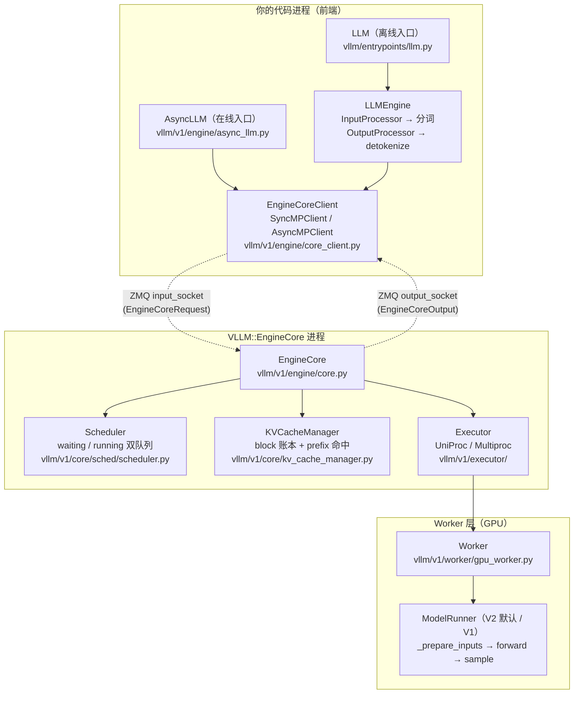
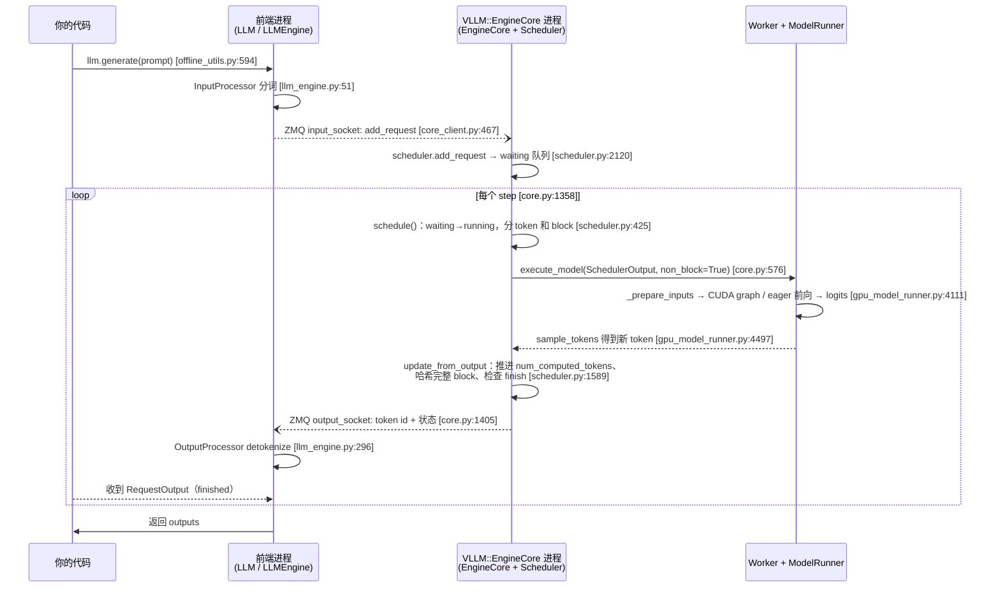

vLLM V1 引擎的架构一句话就能说完：**你的代码进程（前端）负责分词和结果分发，一个叫 EngineCore 的独立进程负责调度和驱动模型，Worker 层负责在 GPU 上真正算**——前两者之间隔着一条 ZMQ 消息队列。调度器每步最多批 16,384 个 token（80GB 级 GPU 的默认值）、最多同时挂 1,024 个序列（源码常量 + 本文实测，见 §5/§9）。3.2 你已经在 nano-vllm 的 1,200 行里认识了"调度 + KV 账本 + 模型执行"这套骨架；这一节把镜头切到 vLLM 本尊：同样的骨架放在三层进程里，分别长什么样、边界在哪、为什么这么分。全部结论锚定 vLLM 0.26.0 源码（每个关键行为都给出 `文件:函数`），最后用 Qwen2.5-Math-7B 跑一个最小复现，让你亲眼看到进程树和 prefix cache 命中。

<!-- more -->

## 📑 目录

- [1. 读前对齐：这一节要回答什么](#1-读前对齐这一节要回答什么)
- [2. 整体架构：三层进程，一条消息边界](#2-整体架构三层进程一条消息边界)
- [3. 入口：离线 LLM 与在线 AsyncLLM](#3-入口离线-llm-与在线-asyncllm)
- [4. EngineCore：让引擎转起来的主循环](#4-enginecore让引擎转起来的主循环)
- [5. Scheduler.schedule()：一个循环处理 prefill 和 decode](#5-schedulerschedule一个循环处理-prefill-和-decode)
- [6. KVCacheManager：KV 块账本](#6-kvcachemanagerkv-块账本)
- [7. Worker 与 ModelRunner：batch 怎样在 GPU 上执行](#7-worker-与-modelrunnerbatch-怎样在-gpu-上执行)
- [8. 一次请求的完整数据流与控制流](#8-一次请求的完整数据流与控制流)
- [9. 最小复现：跑起来，看进程树](#9-最小复现跑起来看进程树)
- [10. 日志与观察](#10-日志与观察)
- [📝 总结](#-总结)
- [🎯 自我检验清单](#-自我检验清单)
- [📚 参考资料](#-参考资料)

## 1. 读前对齐：这一节要回答什么

3.1 里你装好了 vLLM，跑通了 `llm.generate()`；3.2 里你读完了 nano-vllm 的最小实现，知道了"两个队列、一个 token 预算、一本 block 账"。现在的问题是：**vLLM 本尊比 nano-vllm 多了近两万行核心代码（本文分析的 10 个核心文件合计 18,976 行，`wc -l` 实测），多出来的东西长在哪？**

多出来的主要是四件事：多进程（前端和引擎分开）、多 GPU（张量并行的 worker 进程）、在线服务（AsyncIO 流式输出）、以及工程化的缓存管理（prefix cache、KV 池预分配、抢占）。这些分别落在本文要讲的四层角色里：

| 角色 | 回答的问题 | 本文位置 |
| --- | --- | --- |
| LLM / AsyncLLM（前端） | 请求从我的代码出发后先经过谁？ | §3 |
| EngineCore（引擎进程） | 主循环怎么转？谁在什么时候被调用？ | §4 |
| Scheduler + KVCacheManager | 这一步跑谁？KV 块给谁分？ | §5、§6 |
| Worker + ModelRunner（GPU 层） | batch 怎么在显卡上执行？ | §7 |

**版本声明（code 模式红线）**：本文源码对象是 pip 安装的 vLLM **0.26.0**（Python 3.10，`~/.local/lib/python3.10/site-packages/vllm/`），源码路径写法与 GitHub 仓库一致（`vllm/v1/engine/core.py` 等），访问日期 2026-08-19。复现实验硬件：2× NVIDIA RTX 6000D（96GB 显存的国产特供版，单卡 85,651 MiB），日期 2026-08-19。涉及版本差异的地方（例如 Model Runner V1/V2）会逐条写明。

## 2. 整体架构：三层进程，一条消息边界

**vLLM V1 把引擎切成三层：你的代码进程里是前端（入口 + 分词 + 结果分发），一个名为 `VLLM::EngineCore` 的独立进程里是调度核心（Scheduler + KVCacheManager + Executor），再往下是 Worker 层把 batch 送进 GPU。前端和 EngineCore 之间不是函数调用，而是 ZMQ 消息队列——这是整个架构最重要的一条边界。**

为什么要把引擎单独放一个进程？用一个类比：餐厅的**点单台不进厨房**。点单台（前端）干的是杂活——把顾客的话记成订单（分词）、把做好的菜端出去（detokenize、流式推给 HTTP 响应）；这些杂活既琐碎又会抢 CPU 的 GIL。如果它们和炒菜（调度 + GPU 驱动）挤在同一个进程里，一次大 prompt 的分词就能把正在进行的 GPU 步骤阻塞掉。分成两个进程后，厨房（EngineCore）只接收"订单对象"和发送"出餐对象"，杂活全被挡在消息边界外面。这个类比对应的真实机制就是下一张图里的 ZMQ socket。

这张 Mermaid 图讲的是**三层角色和它们之间的通信边界**：实线箭头是进程内的函数调用，虚线箭头是跨进程的 ZMQ 消息（`input_socket` 送请求、`output_socket` 取结果）。



这张图里最容易看错的点：**Executor 和 Worker 在 0.26.0 的 TP=1 配置下就住在 EngineCore 进程里**（`UniProcExecutor` 直接在本进程调 `Worker.execute_model`），不是第四层进程；只有 TP/PP 多卡时，`MultiprocExecutor` 才会为每块 GPU 再 fork 出 worker 进程。§9 的 `ps` 输出会直接证明这一点。

下面这张表把每个角色钉到文件和职责上（来源口径：源码 0.26.0 行号 + §9 实测进程树）：

| 进程 | 角色 | 文件（vLLM 0.26.0） | 被谁调用 |
| --- | --- | --- | --- |
| 你的代码进程 | 离线入口 `LLM.generate` | `vllm/entrypoints/llm.py:LLM`（第 66 行） | 你的代码 |
| 你的代码进程 | 在线入口 `AsyncLLM.generate` | `vllm/v1/engine/async_llm.py:AsyncLLM`（第 70 行） | API server |
| 你的代码进程 | 前后端适配：分词/detokenize + 消息收发 | `vllm/v1/engine/llm_engine.py:LLMEngine`（第 48 行）、`vllm/v1/engine/core_client.py:MPClient`（第 467 行） | LLM / AsyncLLM |
| VLLM::EngineCore 进程 | 主循环 + 调度 + KV 账本 | `vllm/v1/engine/core.py:EngineCore`（第 98 行） | `run_engine_core` 子进程入口（第 1253 行） |
| VLLM::EngineCore 进程（或独立 worker 进程） | 驱动模型执行 | `vllm/v1/worker/gpu_worker.py:Worker`（第 130 行）、`vllm/v1/worker/gpu/model_runner.py`（V2）/ `gpu_model_runner.py`（V1） | Executor |

📌 **关键点**：读懂 vLLM 架构只需要记住一件事——**"分词和 detokenize 在用户进程，调度 + 模型驱动在 EngineCore 进程，中间是 ZMQ"**。其余细节（chunked prefill、prefix cache、CUDA graph）都是这条边界里的填充物，3.4 会逐个展开。

## 3. 入口：离线 LLM 与在线 AsyncLLM

**两种入口最终都走同一条消息通道，区别只在"谁来循环消费结果"：离线 `LLM` 是同步 while 循环，在线 `AsyncLLM` 是一个后台 asyncio 任务。**

先看离线入口。你在 3.1 里写的 `llm.generate(prompts)`，背后是一个朴素到不能再朴素的循环（`vllm/entrypoints/offline_utils.py:_run_engine`，第 573 行起；核心两行在第 594-595 行）：

```python
# vllm/entrypoints/offline_utils.py:594 附近（非逐字源码，保留结构）
while self.llm_engine.has_unfinished_requests():
    step_outputs = self.llm_engine.step()
    for output in step_outputs:
        if output.finished:
            outputs.append(output)
```

每一圈 `step()` 让引擎往前推一个迭代：调度一批 → GPU 算一步 → 收回结果。请求没跑完就一直转，跑完才退出。这个循环和 nano-vllm 的 `while waiting or running` 是同一种心跳，只是被拆到了两个进程里。

在线入口 `AsyncLLM`（`vllm/v1/engine/async_llm.py:524 generate`）不做同步循环。它的 `generate()` 把请求塞进引擎后，把"消费结果"交给一个后台任务 `_run_output_handler`（第 637 行，源码注释原文："Background loop: pulls from EngineCore and pushes to AsyncStreams"）：

```python
# vllm/v1/engine/async_llm.py:_run_output_handler 内部（非逐字源码，保留结构）
async def output_handler():
    while True:
        # 1) 从 EngineCore 进程拉出一批 EngineCoreOutput
        outputs = await engine_core.get_output_async()
        # 2) 分块处理（按 VLLM_V1_OUTPUT_PROC_CHUNK_SIZE 切，避免长时间占住事件循环）
        for chunk in chunks(outputs.outputs):
            processed = output_processor.process_outputs(chunk, ...)
            # 3) 每个请求的输出推进它自己的 asyncio 队列，
            #    generate() 那边 await 的就是这个队列
```

**注意一个容易忽略的细节**：detokenize（把 token id 变成文本）发生在这个后台任务里，也就是**用户进程**里。EngineCore 进程发回来的只是 token id 和 finish 状态——这就是 §2 点单台/厨房分工的具体落点。

那 `LLMEngine` 又在哪儿？源码里的定位很直白（`vllm/v1/engine/llm_engine.py:48`，类 docstring 原文）：

```python
class LLMEngine:
    """Legacy LLMEngine for backwards compatibility."""
```

它是**兼容旧 API 的适配层**：`LLM`（离线）走它，在线服务走 `AsyncLLM`。`LLMEngine.__init__`（第 51 行）里最重要的三行是创建 `InputProcessor`（请求 → EngineCoreRequest，含分词）、`OutputProcessor`（EngineCoreOutput → RequestOutput，含 detokenize），然后调 `EngineCoreClient.make_client(...)` 建立到 EngineCore 的通道。

`make_client`（`vllm/v1/engine/core_client.py:83`）按两个布尔参数分叉出三种客户端：

| 模式 | 返回 | 场景 |
| --- | --- | --- |
| 多进程 + 同步 | `SyncMPClient` | 离线 `LLM`（本文复现用的就是它） |
| 多进程 + asyncio | `AsyncMPClient` | 在线 `AsyncLLM` / API server |
| 单进程（in-proc） | `InprocClient` | 调试用途；源码注释明说 asyncio + 单进程"not currently supported" |

来源口径：`make_client` 第 83-112 行的 if 分支（源码事实）。📌 三种客户端接口完全一致（`add_request` / `get_output` / `abort_requests`），上层代码不关心底下是 ZMQ 还是本进程函数调用——**改"前端和引擎是否同进程"这个开关，只需要换客户端实现**。

## 4. EngineCore：让引擎转起来的主循环

**EngineCore 进程的整个生命周期就是一个 while 循环：先消化输入队列里的请求，再执行一次 step（调度 → 执行 → 回写），把结果塞进输出队列。没有事件分发、没有回调，就是这一圈又一圈。**

子进程入口是 `run_engine_core`（`vllm/v1/engine/core.py:1253`），它 `set_process_title("EngineCore")` 然后进入 `EngineCoreProc.run_busy_loop`（第 1358 行）：

```python
# vllm/v1/engine/core.py:1358（非逐字源码，保留结构）
def run_busy_loop(self):
    while self._handle_shutdown():
        self._process_input_queue()   # 1) 有空位就消化 input_queue（add/abort）
        self._process_engine_step()   # 2) step 一次，把输出放进 output_queue
```

而 step 的正文（`EngineCore.step`，第 576 行）是整个引擎的**心脏**，核心就五步：

```python
# vllm/v1/engine/core.py:576 step()（非逐字源码，保留结构；行号为源码真实行号）
def step(self):
    if not self.scheduler.has_requests():
        return {}, False
    # 1) 调度：这一步跑哪些请求、各跑多少 token
    scheduler_output = self.scheduler.schedule(self._should_throttle_prefills())
    # 2) 异步执行：GPU 前向 + 采样，立即返回 future，不阻塞
    future = self.model_executor.execute_model(scheduler_output, non_block=True)
    model_output = future.result()
    if model_output is None:
        model_output = self.model_executor.sample_tokens(grammar_output)
    # 3) 回写：把采样结果变成"请求状态 + KV 账本"的更新
    engine_core_outputs = self.scheduler.update_from_output(
        scheduler_output, model_output)
    return engine_core_outputs, scheduler_output.total_num_scheduled_tokens > 0
```

这段代码里有三个值得停下来的设计：

1. **`non_block=True`**：`execute_model` 把 batch 提交给 GPU 后立即返回一个 future，Python 侧不用傻等。这是 vLLM 做异步调度的基础——GPU 还在算上一步时，调度器已经在准备下一步了（3.4 展开）。
2. **`execute_model` 和 `sample_tokens` 分成两次调用**：0.26.0 里前向和采样可以是两个独立的 GPU 阶段，中间插进结构化输出的 grammar 约束（`grammar_output`）。nano-vllm 里"forward 完顺手 sample"的写法，在生产代码里被拆开了。
3. **step 的返回值带一个布尔**：`total_num_scheduled_tokens > 0` 告诉主循环"这步真的动了 GPU 吗"。主循环据此决定要不要 `time.sleep(0.001)` 让出 GIL 给后台线程（比如 KV 传输线程）——这种细节在 nano-vllm 里根本不存在。

**EngineCore 是怎么被拉起来的？** `LLMEngine` 初始化时，`make_client` 走多进程分支：客户端进程负责 `multiprocessing.Process(target=run_engine_core, ...)` 起子进程（客户端侧代码在 `core_client.py` 的 `MPClient.__init__` 一族），子进程内 `EngineCoreProc` 完成初始化：`self.model_executor = executor_class(vllm_config)`（core.py 第 125 行）和 `self.scheduler = Scheduler(...)`（第 153 行）——**执行器和调度器都活在 EngineCore 进程里**，这就是 §9 进程树里只有一个 `VLLM::EngineCore` 的原因（TP=1 时）。

## 5. Scheduler.schedule()：一个循环处理 prefill 和 decode

**vLLM V1 的调度器没有"prefill 阶段"和"decode 阶段"的区分——每个请求只有 `num_computed_tokens`（已经算了多少）和 `num_tokens_with_spec`（总共要算多少），调度器每步做的事就是"让每个请求的已算数量尽量追上总量"，在一个 token 预算内统一分配。**

这不是本文的解读，是源码注释原文（`vllm/v1/core/sched/scheduler.py:schedule` 开头，第 427-436 行附近）：

```python
# There's no "decoding phase" nor "prefill phase" in the scheduler.
# Each request just has the num_computed_tokens and
# num_tokens_with_spec. ... At each step, the scheduler tries to assign
# tokens to the requests so that each request's num_computed_tokens can
# catch up its num_tokens_with_spec. This is general enough to cover
# chunked prefills, prefix caching, speculative decoding, ...
```

把这段话翻译成操作：prefill 只是"欠账特别多"的请求，decode 是"每步只欠 1 个 token"的请求，两者走同一段分配代码。3.2 的 nano-vllm 里你见过"先 decode 队列、再 prefill 队列"的写法，vLLM 本尊的队列叫法也不同：`self.running`（已进 batch 的请求）和 `self.waiting`（排队等入场的请求），调度顺序是**先 running 后 waiting**（schedule() 第 471 行起先遍历 `self.running`，第 669 行起再遍历 `self.waiting`）。

预算是多少？`token_budget = self.max_num_scheduled_tokens`（第 445 行），默认值来自 `max_num_batched_tokens`。这里有一个新手常踩的坑：**默认值不是写死的一个数，而是按硬件和入口分档的**（`vllm/engine/arg_utils.py:get_batch_defaults`，第 2431 行起）：

| 条件 | max_num_batched_tokens | max_num_seqs | 来源口径 |
| --- | --- | --- | --- |
| GPU 显存 ≥ 70GiB（非 A100），`LLM` 离线入口 | 16,384 | 1,024 | 源码 `arg_utils.py:2448-2451` |
| GPU 显存 ≥ 70GiB（非 A100），OpenAI API server | 8,192 | 1,024 | 源码 `arg_utils.py:2448-2451` |
| 未命中上述分支的基础默认 | 2,048 | 128 | 源码 `config/scheduler.py:42-44`（`DEFAULT_MAX_NUM_BATCHED_TOKENS` / `DEFAULT_MAX_NUM_SEQS`） |
| 本文复现（RTX 6000D 96GB，`LLM`） | **16,384** | **1,024** | §9 实测日志 |

📌 在线服务故意把 prefill 预算调小（8,192 vs 16,384），是拿吞吐换延迟的旋钮：单步算太多 prefill token 会让在线用户的 decode 排队更久。这个取舍在 3.6 会系统讲。

**分配逻辑的最小骨架**（schedule() 内，非逐字源码）：

```python
# 先照顾 running 队列：每个请求要补 num_new_tokens 个 token
while req_index < len(self.running) and token_budget > 0:
    request = self.running[req_index]
    num_new_tokens = ...            # running 请求通常只需 1 个（decode）
    # chunked prefill：预填充被预算切块
    num_new_tokens = min(num_new_tokens, token_budget)   # 第 509 行
    new_blocks = self.kv_cache_manager.allocate_slots(request, num_new_tokens, ...)
    if new_blocks is None:          # KV 块不够 → 抢占
        # 从 running 尾部开始踢人，直到腾出空间（第 563-605 行）
        self._preempt_request(preempted_req, ...)
        ...
    num_scheduled_tokens[request.request_id] = num_new_tokens
    token_budget -= num_new_tokens
# 再看 waiting 队列：新请求的 prefill（同样受预算切块，第 669 行起）
while (self.waiting or self.skipped_waiting) and token_budget > 0:
    ...
```

**chunked prefill 在这段代码里不是什么特殊功能，而是 `min(num_new_tokens, token_budget)` 这一行的自然结果**：一个 4,096 token 的 prompt，预算只剩 512 时，这一步只给它算 512 个，剩下的 3,584 个下步再来。3.1 里你见过的 `enable_chunked_prefill=True` 开关，控制的就是这种切块是否允许发生在长 prefill 上（0.26.0 默认开启，见 §9 日志的 `enable_chunked_prefill=True`）。

**抢占（preemption）怎么办？** V1 的做法是"踢出去，下轮重算"（`_preempt_request`，第 1212 行，源码行为逐条列出）：

```python
# vllm/v1/core/sched/scheduler.py:1212 _preempt_request（关键行为）
self._free_request_blocks(request)      # 立即释放它占的全部 KV 块
request.status = RequestStatus.PREEMPTED
request.num_computed_tokens = 0          # 已算进度清零 → 下次入场重新 prefill
request.num_preemptions += 1
self.waiting.prepend_request(request)    # 插回 waiting 队首，优先重新入场
```

注意：被抢占的请求**保留输出 token 不丢**（输出已经还给用户了，KV 块全释放，重新 prefill 的是 prompt + 已输出部分的上下文），但**没有任何数据搬到 CPU 显存外**——老版本（V0）的 swap-to-CPU 路径在 V1 里不存在。为什么不做 swap？源码和设计文档都没有写明确理由（文档未说明），从行为看（推测）：一次 swap 要把 KV 块按顺序拷到主机内存再拷回来，跨 PCIe 的搬运在 96GB 显存、TB/s 级 HBM 带宽的机器上往往比重新算一遍 prefill 还慢，而 prefix cache（§6）又能让"重算"比想象中便宜。这条是作者推测，与前面的源码事实分开陈述。

**数字走查**（预算 16,384，思想实验）：running 队列里有 100 个 decode 请求（每个欠 1 个 token）和 1 个 chunked prefill 请求（prompt 4,096，已算 3,000，欠 1,096）。调度顺序先 running 后 waiting：100 个 decode 吃掉 100 token，剩下 16,284 预算全给这个 prefill——但它只欠 1,096，一步算完；本步 `total_num_scheduled_tokens = 1,196`，远小于 16,384。反例：如果 prefill prompt 是 20,000 token，这一步只能给它 16,284（`min` 切块），剩下 3,716 个下步再算——**一个巨型 prefill 不会饿死整个 batch，batch 也不会被它拖死**，这就是 chunked prefill 存在的意义。

## 6. KVCacheManager：KV 块账本

**KV cache 不是"用到才分配"，而是启动时一次性把池子全部开好：引擎先跑一遍 profile 前向，量出模型本身要吃多少显存，剩下的空间全切成 block 池。之后运行时只做"记账和查账"，不再向操作系统要显存。**

池子怎么定大小？`vllm/v1/worker/gpu_worker.py:determine_available_memory`（第 448 行，docstring 原文大意："Profiles the peak memory usage of the model to determine how much memory can be used for KV cache without OOMs"）。流程是：用 dummy 输入跑一次 `profile_run()`（同时完成模型编译），记录峰值显存，再按 `gpu_memory_utilization`（本文复现用 0.85）算出可给 KV 的字节数，最后除以"每个 token 占多少字节"得到 token 数。本文复现的真实日志（来源口径：2026-08-19 实测）：

```text
GPU KV cache size: 1,012,240 tokens
Maximum concurrency for 4,096 tokens per request: 247.13x
```

**每个 token 占多少 KV？** 用复现模型 Qwen2.5-Math-7B-Instruct 算一笔账（来源口径：模型 `config.json` + 算术）：28 层、GQA 4 个 KV 头、head_dim = 3584/28 = 128、bf16 每个数 2 字节：

$$
\text{每 token KV} = \underbrace{2}_{\text{K 和 V}} \times \underbrace{28}_{\text{层}} \times \underbrace{4}_{\text{KV 头}} \times \underbrace{128}_{\text{head\_dim}} \times \underbrace{2\ \text{B}}_{\text{bf16}} = 57{,}344\ \text{B} = 56\ \text{KiB}
$$

于是 `1,012,240 token × 56 KiB ≈ 54 GiB`，和 85,651 MiB（≈ 83.6 GiB）× 0.85 − 权重 14.28 GiB − 激活/编译开销的量级对得上（来源口径：算术估算，profile 日志为实测）。再换算成 block：block_size 实测为 **16**（§9），`1,012,240 / 16 = 63,265` 个 block——这就是整本账本的容量。

账本本体在 `vllm/v1/core/kv_cache_manager.py:KVCacheManager`（第 114 行），三个方法构成运行时全部操作：

| 方法 | 行号 | 干什么 |
| --- | --- | --- |
| `get_computed_blocks(request)` | 207 | 入场前查 prefix cache：这段 prompt 的前缀在哪些已有 block 上？返回"已命中 block + 命中 token 数" |
| `allocate_slots(request, num_new_tokens, ...)` | 283 | 为本步要算的新 token 分配 block；不够时返回 `None`（触发 §5 的抢占） |
| `free(request)` | 506 | 请求结束时归还 block（不立即清零，留作可复用池） |

底层数据结构在另外两个文件：`KVCacheBlock`（`vllm/v1/core/kv_cache_utils.py:118`，每个 block 记录自己的 block id 和内容哈希）和 `FreeKVCacheBlockQueue`（同文件第 184 行，源码注释明说用双向链表实现、"manipulates the linked list" 而不产生 Python 对象分配，模仿 C++ 的 freelist）。哈希查找的实现在 `vllm/v1/core/single_type_kv_cache_manager.py:find_longest_cache_hit`（第 523 行起有 6 个变体，对应 full attention / 滑窗 / mamba 等不同注意力类型）——给定请求的 token 哈希序列，从池里找到**最长的已存在前缀**。3.2 里 nano-vllm 的 `hash_blocks + find_longest_cache_hit` 就是这个机制的 1:1 迷你版。

**prefix cache 为什么"零开销"？** 因为命中路径不产生任何额外计算：block 在写入时就被打上内容哈希（`cache_blocks`，第 689 行），新请求入场时只是拿哈希查表（`get_computed_blocks`），查中了就复用这些 block，prefill 直接跳过已命中的 token。没有"查不到再算"的回退，也没有影子拷贝——复用的就是原来那本 block，请求结束时的 `free` 也只是把引用计数减一，block 继续留在池里等下一个相同前缀。

**最小命中演示**（§9 实测，Qwen2.5-Math-7B，block_size=16）：同一个 68 token 的 prompt 连续跑两轮：

| 轮次 | prompt token 数 | `num_cached_tokens`（命中） | 解释 |
| --- | --- | --- | --- |
| 第 1 轮 | 68 | 0 | 冷启动，池里没有这段前缀 |
| 第 2 轮 | 68 | **64** | 68 = 4×16 + 4：前 64 个 token 是 4 个完整 block，全部命中；最后 4 个不足一个 block，不缓存 |

来源口径：本文 §9 脚本实测输出（2026-08-19）。📌 命中数必然是 block_size 的整数倍——用这个数字做监控时，`cached / 总 prompt ≈ 命中块比例`，是衡量 prefix cache 收益最直接的指标。

## 7. Worker 与 ModelRunner：batch 怎样在 GPU 上执行

**EngineCore 调度出来的 `SchedulerOutput`（谁跑、各跑多少 token、落在哪些 block）要经过 Executor → Worker → ModelRunner 三级才变成 GPU 上的前向计算；TP=1 时这三级都在 EngineCore 进程内，是多卡时才变成跨进程 RPC。**

Executor 是调度器和 GPU 之间的"调度台"（`vllm/v1/executor/`）：

- **`UniProcExecutor`**（`uniproc_executor.py:45`）：单卡。`execute_model`（第 108 行）就是 `self.collective_rpc("execute_model", args=(scheduler_output,), non_block=non_block)`——把 `SchedulerOutput` 直接递给本进程的 `Worker`。
- **`MultiprocExecutor`**（`multiproc_executor.py:103`）：TP/PP 多卡。启动时为每块 GPU fork 一个 `WorkerProc` 子进程（第 557 行），`execute_model` 变成"把 `SchedulerOutput` 广播给所有 worker 进程、等最慢的完成"。3.1 里你见过的 `--tensor-parallel-size 2`，在这里落地。

Worker（`vllm/v1/worker/gpu_worker.py:Worker`，第 130 行）负责"一台显卡上的一切"：`init_device`（第 297 行）初始化 CUDA、`load_model`（第 424 行）加载权重（复现日志：14.19 GiB，2.29 秒）、`determine_available_memory`（第 448 行，§6 讲的 profile）、`compile_or_warm_up_model`（第 746 行，torch.compile + CUDA graph 捕获）。真正每步被调用的是 `execute_model`（第 1087 行），剥掉流水线并行（PP）的中间张量转发后，核心就是一行：

```python
# vllm/v1/worker/gpu_worker.py:1087 execute_model（核心一行）
output = self.model_runner.execute_model(scheduler_output, intermediate_tensors)
```

**版本差异（必须写明）：0.26.0 的 Model Runner 有两版，且默认是 V2。** `gpu_worker.py:378` 的启动日志 `"Using V2 Model Runner"` 对应第 408 行 `self.model_runner = GPUModelRunnerV2(...)`。两版的文件与规模：

| Runner | 文件 | 规模 | 说明 |
| --- | --- | --- | --- |
| V1 | `vllm/v1/worker/gpu_model_runner.py:GPUModelRunner`（第 452 行） | 7,846 行 | 经典实现，`execute_model` 在第 4,111 行 |
| V2 | `vllm/v1/worker/gpu/model_runner.py:GPUModelRunner`（第 121 行） | 1,658 行 | 0.26.0 默认；`execute_model` 在第 1,151 行 |

来源口径：`wc -l` 实测 + `config/vllm.py:550 use_v2_model_runner` 的判定逻辑（环境变量 `VLLM_USE_V2_MODEL_RUNNER` 可强制切换；DSpark 投机解码等特性强制 V2）。两版都保持 `execute_model → sample_tokens` 两段式接口（V2 的 `sample_tokens` 在第 1,395 行），内部实现不同——本文按**最能对应 nano-vllm 的 V1 版**拆解执行流程，V2 的细节留给 3.4。

V1 版 `GPUModelRunner.execute_model`（`gpu_model_runner.py:4111`）的主流程，四步：

```python
# vllm/v1/worker/gpu_model_runner.py:4111（非逐字源码，保留结构；行号为源码真实行号）
def execute_model(self, scheduler_output, intermediate_tensors=None):
    # 1) 更新 persistent batch：把"谁进/谁退/谁换了 block"合并进常驻批结构
    self._update_states(scheduler_output)
    # 2) 准备 GPU 输入：拼 input_ids、block_table、attention 元数据
    logits_indices, spec_decode_metadata = self._prepare_inputs(scheduler_output, ...)   # 第 1,937 行
    # 3) 选 CUDA graph 模式并前向：
    #    decode 小 batch 命中捕获过的 graph 直接重放，prefill 大 batch 走 eager
    model_output = self._model_forward(...)   # 第 4,394 行；日志见第 4,226 行
    #    "Running batch with cudagraph_mode: %s, batch_descriptor: %s"
    # 4) 返回 logits（采样是独立的 sample_tokens，第 4,497 行）
```

四个设计点各用一句话说清：

1. **`_update_states`（persistent batch）**：batch 不每步重建。每个请求在 GPU 上有"常驻座位"，请求结束座位不拆，新请求顶上来——省掉每步重建索引数组的 CPU 开销。
2. **`_prepare_inputs`**：把 `SchedulerOutput` 翻译成 GPU 能吃的张量——`input_ids`（这一步要算哪些 token）、`block_table`（每个请求的 token 落在哪些 block，PagedAttention 的"页表"）、attention 元数据（每个请求算到哪）。
3. **CUDA graph 双模式**：decode 阶段 batch 形状固定（每个请求 1 个 token），启动时把 1~512 各种 batch size 的 graph 都捕获好（§9 日志 `cudagraph_capture_sizes: [1, 2, 4, ..., 512]`），运行时按当前 batch size 选一个**直接重放**，省掉 kernel launch 开销；prefill 形状千变万化，走 eager 编译路径。
4. **`_model_forward` 只负责前向**：采样在 `sample_tokens` 里做——§4 说过，这个分离让结构化输出（grammar bitmask）能插在前向和采样之间。

## 8. 一次请求的完整数据流与控制流

把 §3-§7 串成一次真实调用。这张 sequenceDiagram 讲的是一次**离线 `llm.generate(单条 prompt)` 从你的代码到 GPU 再回到你的代码**的完整路径，方括号里是源码锚点。



两个容易画错的点：

- **分词和 detokenize 都在前端进程**（图里 FE 的两个自环），EngineCore 只见 token id。所以 tokenizer 慢（大词表、长 prompt）不会拖慢 GPU，但**首 token 延迟里有一段是"前端分词 + ZMQ 传递"**，排查 TTFT 时别忘这一段。
- **`update_from_output` 是账本回写点**：请求的 `num_computed_tokens` 前进、完整 block 打哈希入池（prefix cache 的写入路径）、判断是否 finish、该释放的 block 标记释放。调度器"下一步看什么"完全由这一步更新的状态决定——调度与执行之间没有别的隐藏通道。

## 9. 最小复现：跑起来，看进程树

本节全部输出为 2026-08-19 实测：vLLM 0.26.0（pip），Python 3.10，2× RTX 6000D（各 85,651 MiB），模型 `/home/xyh/models/Qwen2.5-Math-7B-Instruct`（Qwen2.5-Math-7B-Instruct，14.19 GiB），`gpu_memory_utilization=0.85`，`max_model_len=4096`，TP=1。复现脚本全文：

```python
# /tmp/vllm_prefix_repro.py（§9 实跑脚本）
import os
os.environ["CUDA_VISIBLE_DEVICES"] = "1"
os.environ["VLLM_LOGGING_LEVEL"] = "INFO"

from vllm import LLM, SamplingParams

llm = LLM(
    model="/home/xyh/models/Qwen2.5-Math-7B-Instruct",
    gpu_memory_utilization=0.85,
    max_model_len=4096,
    enable_prefix_caching=True,
)
long_prompt = (
    "Explain in detail the architecture of a modern LLM inference engine. "
    "Cover how continuous batching works, why paged attention is needed, "
    "how the KV cache is allocated in blocks, what chunked prefill does, "
    "and how a scheduler decides which requests to run in each iteration. "
    "Write your answer as a structured technical summary with clear sections."
)
params = SamplingParams(temperature=0, max_tokens=8)

print("=== ROUND 1 (cold prefix cache) ===")
r1 = llm.generate([long_prompt], params)
print("prompt tokens:", len(r1[0].prompt_token_ids), "cached:", r1[0].num_cached_tokens)

print("=== ROUND 2 (same prompt, expect prefix hit) ===")
r2 = llm.generate([long_prompt], params)
print("prompt tokens:", len(r2[0].prompt_token_ids), "cached:", r2[0].num_cached_tokens)
```

**复现 1：进程树**——引擎运行中执行 `ps -eo pid,ppid,args | grep -E "vllm_arch_repro|VLLM::"`，实测输出（节选）：

```text
3722628 3722626 python3 vllm_arch_repro.py      # 前端：你的代码 + LLMEngine + SyncMPClient
3723864 3722628 VLLM::EngineCore                # 引擎进程：Scheduler + KVCacheManager + Worker（TP=1）
```

进程名 `VLLM::EngineCore` 来自 `run_engine_core` 里的 `set_process_title`（core.py:1253）；vLLM 的日志行也自带进程标记，如 `(EngineCore pid=3730892) INFO ... [core.py:1313]`，排障时靠它区分前端和引擎两个进程的日志。TP=2 时会再多出两个 `VLLM::Worker_T...` 子进程（MultiprocExecutor 的 `WorkerProc`，multiproc_executor.py:557；本机 TP=1 未复现，标注为源码事实 + 未实测）。

**复现 2：架构参数**（从运行中的引擎对象直接读，非猜测）：

```text
=== ARCH PARAMS ===
block_size: 16
max_num_batched_tokens: 16384
max_num_seqs: 1024
gpu_memory_utilization: 0.85
enable_prefix_caching: True
```

**复现 3：KV 池与 prefix 命中**（引擎启动日志 + 两轮生成结果）：

```text
(EngineCore pid=3730892) INFO ... [kv_cache_utils.py:2177] GPU KV cache size: 1,012,240 tokens
(EngineCore pid=3730892) INFO ... [kv_cache_utils.py:2178] Maximum concurrency for 4,096 tokens per request: 247.13x
(EngineCore pid=3730892) INFO ... [gpu_worker.py:378] Using V2 Model Runner
(EngineCore pid=3730892) INFO ... [model_runner.py:305] Model loading took 14.28 GiB and 4.437323 seconds

=== ROUND 1 (cold prefix cache) ===
prompt tokens: 68 cached: 0
=== ROUND 2 (same prompt, expect prefix hit) ===
prompt tokens: 68 cached: 64
round2 output:   To explain the architecture of a modern language
```

三个数字分别对应本文的三张表：1,012,240 token 的池子（§6 的 54 GiB 账本）、64 = 4 × 16 的 prefix 命中（§6 的最小命中演示）、"Using V2 Model Runner"（§7 的版本差异）。**跑不通时最可能的两个原因**：`CUDA_VISIBLE_DEVICES` 指到了一张被占满的卡（本文 GPU0 被一个 `vllm serve` 占了 83.8 GiB，所以脚本固定用 `CUDA_VISIBLE_DEVICES=1`）；或 `max_model_len` 超过模型上限触发重算失败。

## 10. 日志与观察

生产排障时，vLLM 的日志自带"架构定位符"，按下面这张表读（来源口径：§9 实测日志 + 源码行号）：

| 日志特征 | 你看到什么 | 说明什么 |
| --- | --- | --- |
| `(EngineCore pid=xxx) INFO ...` 前缀 | 引擎进程的日志行 | 这一行发生在 EngineCore 进程，不是你的前端进程 |
| `Initializing a V1 LLM engine (v0.26.0) with config: ...` | 完整配置 dump（core.py:116） | 一切"我明明没设 X 为什么是 Y"的默认值问题，先在这里找答案 |
| `Using V2 Model Runner` / `Using ... Model Runner` | 实际生效的 runner（gpu_worker.py:378） | 复现别人问题前先确认 runner 版本 |
| `GPU KV cache size: N tokens` / `Maximum concurrency ... Kx` | KV 池容量（kv_cache_utils.py:2177-2178） | OOM、并发上限问题的一级证据：K = 池容量 / 单请求最长 token 数 |
| `Running batch with cudagraph_mode: ...` | 每步 batch 的 graph 模式（gpu_model_runner.py:4226） | 性能回归时看 decode 步是否还在 FULL graph 模式 |
| `[shutdown] EngineCore: trigger received signal=SIGTERM` | 优雅退出路径（core.py:1313） | 进程"意外消失"先找这一行有没有 |

想看更细的调度行为，两个入口：`VLLM_LOGGING_LEVEL=DEBUG`（能看到 `EngineCore waiting for work` / `EngineCore loop active` 这类主循环心跳，core.py:1379/1394）和 `--log-probs` / metrics（KV 池命中率等，3.6 展开）。

## 11. ⚠️ 常见误读

**误读 A："调度和模型在同一个进程，前端只是个壳。"**
错误根源：nano-vllm 是单进程，容易把心智模型带过来。实际行为：前端（`LLM`/`AsyncLLM`/`LLMEngine`/`EngineCoreClient`）在**你的代码进程**，调度器和模型执行器在 `VLLM::EngineCore` **独立进程**，中间是 ZMQ（core_client.py:467 的 docstring 原文："pushes EngineCoreRequests via input_socket, pulls EngineCoreOutputs via output_socket"）；§9 的 `ps` 直接可见两个进程。这个分离意味着：前端进程的 GIL 争抢（比如大 prompt 分词）不会阻塞正在跑的 GPU 步骤。

**误读 B："调度器先跑 prefill 队列，再跑 decode 队列，两个阶段分开调度。"**
错误根源：把 nano-vllm 的"双队列各自分配"当成 vLLM 本尊的模型。实际行为：V1 调度器源码注释明说"There's no decoding phase nor prefill phase"（scheduler.py:427 起）；真实顺序是**先遍历 `running` 队列、再遍历 `waiting` 队列**（471 / 669 行），两个队列共享同一个 `token_budget`，prefill 和 decode 的差别只剩"这一步各分几个 token"。

**误读 C："KV 不够时像旧版一样把请求 swap 到 CPU 内存。"**
错误根源：vLLM V0 时代的资料（swap 到 CPU、优先级抢占）流传很广。实际行为：0.26.0 的 `_preempt_request`（scheduler.py:1212）只释放 block + 清零 `num_computed_tokens` + 插回 waiting 队首，**没有任何主机内存交换路径**；被抢占的请求重新入场时完整重算 prefill（prefix cache 命中时重算被部分抵消）。

**误读 D："KV cache 按需分配，用到多少向系统要多少显存。"**
错误根源：Python 动态分配的直觉。实际行为：启动时 `determine_available_memory`（gpu_worker.py:448）profile 一遍，按 `gpu_memory_utilization` 一次性把 KV 池切满（§9：1,012,240 token）；运行时 `allocate_slots` 只从池内拿 block，池空了触发抢占，**从不向操作系统要新显存**。副作用：`gpu_memory_utilization` 给低了，池子小，并发能力直接封顶（§9 的 `Maximum concurrency 247.13x` 就是这个池子的换算结果）。

**误读 E："EngineCore 是 vLLM 里的一个类名，进程就一个。"**
错误根源：只读代码没跑过。实际行为：`run_engine_core`（core.py:1253）是 `multiprocessing.Process` 的入口函数，进程标题 `VLLM::EngineCore`；TP>1 时还有每卡一个的 `VLLM::Worker_T...` 进程（multiproc_executor.py:557）。看进程数、算显存占用（每卡 worker 各加载一份权重分片）、配 systemd/cgroup，都要按"进程集合"而不是"一个程序"来算。

## 📝 总结

三句话记忆：

1. **三层一条缝**：前端进程（分词/detokenize/消息收发）— ZMQ — EngineCore 进程（Scheduler + KVCacheManager + Executor）— Worker/GPU（prepare inputs → forward → sample）；TP=1 时 Worker 住在 EngineCore 进程里，TP>1 时每卡再 fork 一个 worker 进程。
2. **心跳只有一句**：`run_busy_loop` 里 `消化 input_queue → schedule() → execute_model(non_block) → update_from_output()`；prefill 和 decode 在 `schedule()` 里是同一件事（"让 num_computed_tokens 追上 num_tokens_with_spec"），chunked prefill 就是 `min(欠账, token_budget)` 的自然结果。
3. **显存是启动时定死的**：profile 一次，KV 池切满（实测 1,012,240 token ≈ 54 GiB），运行时只记账不扩张；KV 不够的代价是抢占 = 释放 + 重算，不是 swap。

## 🎯 自我检验清单

- [ ] 能画出前端进程与 EngineCore 进程之间的消息流，并说出 `SyncMPClient` / `AsyncMPClient` / `InprocClient` 三种客户端各对应什么场景（答对 3/3 场景）。
- [ ] 能写出 `EngineCore.step()` 的四个动作（schedule / execute_model / sample_tokens / update_from_output）及其源码文件（`vllm/v1/engine/core.py`）。
- [ ] 能解释为什么 vLLM V1 调度器"没有 prefill 阶段和 decode 阶段"，并说出 running 与 waiting 队列的调度顺序（先 running 后 waiting）。
- [ ] 能计算：block_size=16、每 token KV 56 KiB 时，一个 68 token prompt 命中多少 token 的 prefix cache（答案：64）。
- [ ] 能算出给定层数 / KV 头数 / head_dim / 精度下"每 token KV 字节数"（误差为 0，公式见 §6）。
- [ ] 能说出 0.26.0 里 Model Runner V1 与 V2 的文件位置、行数差异和默认选择（V2，`gpu/model_runner.py`，1,658 行 vs V1 7,846 行）。
- [ ] 能列出 80GB 级 GPU 上 `max_num_batched_tokens` 的默认值分档（LLM 16,384 / API server 8,192，来源 `arg_utils.py`）。
- [ ] 能解释 V1 抢占为什么是"释放 + 重算"而不是 swap，并说出 `_preempt_request` 里 `num_computed_tokens` 被清零的含义。
- [ ] 能说出 `GPU KV cache size: N tokens` 这行日志出现在哪个函数、决定了什么（`kv_cache_utils.py`，并发上限与 OOM 边界）。
- [ ] 能复述"首 token 延迟里包含前端分词 + ZMQ 传递"这一段，并说明为什么 detokenize 在用户进程做。

## 📚 参考资料

**源码（本文锚点，vLLM 0.26.0，2026-08-19 访问）**

- vLLM 仓库：[github.com/vllm-project/vllm](https://github.com/vllm-project/vllm)——本文路径以 pip 包 `vllm/` 为根，与仓库布局一致
- 引擎核心：`vllm/v1/engine/core.py`（EngineCore、step、run_busy_loop、run_engine_core）、`vllm/v1/engine/llm_engine.py`（LLMEngine 兼容层）、`vllm/v1/engine/async_llm.py`（AsyncLLM）、`vllm/v1/engine/core_client.py`（三种客户端）
- 调度与 KV：`vllm/v1/core/sched/scheduler.py`、`vllm/v1/core/kv_cache_manager.py`、`vllm/v1/core/block_pool.py`、`vllm/v1/core/single_type_kv_cache_manager.py`
- 执行层：`vllm/v1/executor/`、`vllm/v1/worker/gpu_worker.py`、`vllm/v1/worker/gpu_model_runner.py`（V1 runner）、`vllm/v1/worker/gpu/model_runner.py`（V2 runner）

**站内链接**

- [3.1 vLLM 快速入门](/AIInfraGuide/inference/模块四-推理优化/第3章-深入vllm/vllm快速入门)：安装、离线批量推理、OpenAI 兼容服务
- [3.2 nano-vllm 源码导读](/AIInfraGuide/inference/模块四-推理优化/第3章-深入vllm/32-nano-vllm源码导读)：1,200 行最小实现里的双队列调度与 block 账本——本文所有"vLLM 本尊 vs nano-vllm"对照的另一半
- [3.4 V1 引擎深度解析（规划中）](/AIInfraGuide/inference/模块四-推理优化/第3章-深入vllm/第3章-深入vllm)：异步调度、零开销 Prefix Cache、CUDA graph 的展开
