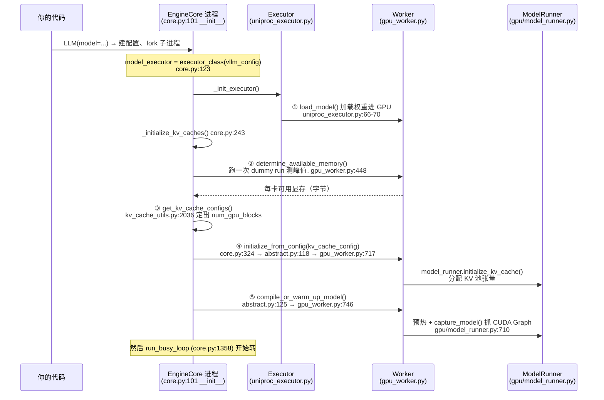

3.3 回答的是"稳态下每一层在干什么"；这一节回答**冷启动和三个性能机制**。vLLM 从 `LLM()` 调用到能跑第一个 step，中间要加载权重、做一次"空转测量"、决定 KV 池大小、分配显存、再花 20 多秒抓 CUDA Graph——这段启动序列在 0.26.0 源码里是一条清晰的调用链，本文把它逐段拆开（§2）。稳态下 vLLM 快，靠三个机制：CUDA Graph 消掉 kernel 启动开销（§4）、async scheduling 把 CPU 调度藏进 GPU 执行时间（§5）、prefix cache 用纯账本操作实现零开销命中（§6）。最后一节把 V1 相对已移除的 V0 引擎改了什么列成一张表（§7），让"V1"这个名字不再只是版本号。

<!-- more -->

## 📑 目录

- [1. 读前对齐：这一节讲什么](#1-读前对齐这一节讲什么)
- [2. 冷启动：从 LLM() 到第一个 step 的五步序列](#2-冷启动从-llm-到第一个-step-的五步序列)
- [3. KV 池大小是怎么算出来的](#3-kv-池大小是怎么算出来的)
- [4. CUDA Graph：decode 为什么能跳过 kernel 启动](#4-cuda-graphdecode-为什么能跳过-kernel-启动)
- [5. Async Scheduling：把 CPU 调度藏进 GPU 执行时间](#5-async-scheduling把-cpu-调度藏进-gpu-执行时间)
- [6. Prefix Cache 为什么说零开销](#6-prefix-cache-为什么说零开销)
- [7. V1 相对 V0 改了什么](#7-v1-相对-v0-改了什么)
- [8. 实测：启动日志逐行对照](#8-实测启动日志逐行对照)
- [📝 总结](#-总结)
- [🎯 自我检验清单](#-自我检验清单)
- [📚 参考资料](#-参考资料)

## 1. 读前对齐：这一节讲什么

3.3 里我们看的是引擎**转起来之后**的样子：`step()` 五步循环、调度器怎么挑请求、KV 账本怎么记。但有两块当时刻意略过：

| 问题 | 本文位置 |
| --- | --- |
| `LLM()` 到第一个 step 之间发生了什么？为什么要 30 秒？ | §2 |
| "GPU KV cache size: 1,012,240 tokens" 这个数怎么来的？ | §3 |
| decode 小 batch 为什么快？CUDA Graph 抓了什么、什么时候用？ | §4 |
| async scheduling 开/关各是什么行为？默认值是什么？ | §5 |
| prefix cache 命中为什么说"零开销"？块指针怎么换的？ | §6 |
| V1 这个名字意味着什么？和 V0 差在哪？ | §7 |

**版本声明（code 模式红线）**：源码对象是 pip 安装的 vLLM **0.26.0**（Python 3.10），路径与 GitHub 仓库一致，访问日期 2026-08-19。实测硬件：2× NVIDIA RTX 6000D（单卡 85,651 MiB），模型 Qwen2.5-Math-7B-Instruct（bf16，权重 14.19 GiB），2026-08-19 运行，日志为 3.3 同一份复现（`/tmp/vllm_arch_repro.log`），不重跑、数字可对照 3.3 §9。

## 2. 冷启动：从 LLM() 到第一个 step 的五步序列

**一句话结论：vLLM 启动 = 加载权重 → 空转一次测显存峰值 → 用剩余显存定 KV 池大小 → 分配 KV 显存 → 预热并抓 CUDA Graph，最后才进主循环。整条链在源码里是一条 `EngineCore.__init__` 串起来的调用，每一步都有锚点。**

为什么需要"空转一次"？类比一下：装修房子之前要先跑一遍水电压力测试，找出真实的峰值用量，才知道能留多少余量。GPU 显存也一样——权重占多少是确定的，但**激活值峰值**（attention workspace、临时 buffer）只有真跑一次 forward 才知道。vLLM 就用一次"dummy run"把峰值测出来，再把剩下的显存全部划给 KV 池。

五步序列（每个箭头都是真实的函数调用，`文件:行号` 为 0.26.0 实测锚点）：



逐步说明（非逐字源码，按真实调用顺序重排的伪代码）：

```python
# vllm/v1/engine/core.py（节选自 EngineCore.__init__, :101 起）
self.model_executor = executor_class(vllm_config)   # :123 UniProc/Multiproc
# Executor._init_executor: 建 Worker → init_device → load_model
#   （uniproc_executor.py:66-70，权重此时进 GPU）
kv_cache_config = self._initialize_kv_caches(vllm_config)  # :243, 见下
# 建 Scheduler（core.py:140 之后，waiting/running 双队列就位，见 3.3 §5）
```

```python
# vllm/v1/engine/core.py（节选自 _initialize_kv_caches, :243 起）
kv_cache_specs = self.model_executor.get_kv_cache_specs()
# 每个注意力层申报：我每 token 要多少 KV 字节（2×KV头数×head_dim×dtype）
available_gpu_memory = self.model_executor.determine_available_memory()
# → Worker.determine_available_memory (gpu_worker.py:448)
#   先跑一次 profile_run（dummy forward），记录峰值显存
kv_cache_configs = get_kv_cache_configs(                 # kv_cache_utils.py:2036
    vllm_config, kv_cache_specs, available_gpu_memory
)
vllm_config.cache_config.num_gpu_blocks = ...num_blocks  # 池子大小定了
self.model_executor.initialize_from_config(kv_cache_configs)  # :324
# → Executor.initialize_from_config (abstract.py:118, collective_rpc 广播)
# → Worker.initialize_from_config (gpu_worker.py:717)
#   → model_runner.initialize_kv_cache：KV 池张量真正分配
# 然后 Executor 再发一次 compile_or_warm_up_model（abstract.py:125）
# → Worker.compile_or_warm_up_model (gpu_worker.py:746)
#   → 预热各 batch size + 抓 CUDA Graph（§4）
```

两个值得注意的细节：

1. **非因果注意力会砍功能**。`_initialize_kv_caches` 开头有一段检查：如果模型里有 `non_causal=True` 的层（例如 Prefix LM），会**主动关掉 chunked prefill 和 prefix caching**，因为这两个机制都假设注意力是因果的（core.py:257-272 的注释写得很直白："would corrupt non-causal prefill"）。也就是说，这两个不是可开关的"优化"，而是有前提条件的正确性机制。
2. **max_model_len 可能被悄悄缩小**。profile 之后如果显存不够装"max_model_len × 单请求 KV"，`get_kv_cache_configs` 会自动下调 `max_model_len`，再用 `collective_rpc("update_max_model_len")` 同步给 worker（core.py:292-299）。你在日志里看到的 max_model_len 未必是你传进去的那个。

## 3. KV 池大小是怎么算出来的

**一句话结论：KV 池大小 =（gpu_memory_utilization × 总显存 − 权重 − profile 测出的激活峰值）÷ 每 token 的 KV 字节数，向下取整到 block 边界。**

公式逐项（Qwen2.5-Math-7B 实测数字，2×RTX 6000D 之一、gpu_mem_util=0.85）：

$$
\text{num\_tokens} = \left\lfloor \frac{\underbrace{0.85 \times 85{,}651\ \text{MiB}}_{\text{上限}} - \underbrace{14.19\ \text{GiB}}_{\text{权重}} - \underbrace{\text{激活峰值}_{\text{profile 实测}}}_{\text{dummy run 得到}}}{\text{bytes/token}} \right\rfloor
$$

| 符号 | 含义 | 本文数字 |
| --- | --- | --- |
| 上限 | `gpu_memory_utilization`（默认 0.92，`config/cache.py:68`）× 总显存 | 0.85 × 85,651 MiB ≈ 72.8 GiB |
| 权重 | 模型权重占用的显存 | 14.19 GiB（bf16） |
| 激活峰值 | dummy forward 测出的瞬时峰值（含 CUDA Graph 内存） | 日志未单列，约 14 GiB 级（上限−权重−KV 的余量） |
| bytes/token | 每 token 的 KV 字节数 | 56 KiB = 2(K,V)×28(层)×4(GQA 头)×128(head_dim)×2B |

代入：(72.8 − 14.19 − ~4.6) GiB ≈ 54 GiB 可给 KV → 54 GiB ÷ 56 KiB/token ≈ **1,012,240 tokens**，正好等于日志里 `kv_cache_utils.py:2177` 打出的 "GPU KV cache size: 1,012,240 tokens"。换算成块：1,012,240 ÷ 16(block_size) = **63,265 块**，这就是 `cache_config.num_gpu_blocks`（core.py:329 写入）的实测值。

顺带解释日志下一行 "Maximum concurrency for 4,096 tokens per request: 247.13x"（kv_cache_utils.py:2178）：1,012,240 ÷ 4096 = 247.13——池子能同时装下 247 个 4,096-token 的请求。**KV 池大小不是调度参数能调的旋钮，它由显存唯一决定**；调度器能调的是"这一步用多少"（3.5 的 token budget）。

## 4. CUDA Graph：decode 为什么能跳过 kernel 启动

**一句话结论：decode 时每个 step 只有 batch×1 个 token 要算，GPU 计算量极小，真正的开销是 CPU 逐个启动几百个 kernel（每次几微秒）；CUDA Graph 把"一整批 kernel 的启动序列"录成图，运行时一次 replay，CPU 开销从几百次降到 1 次。**

为什么 prefill 不需要这么急？prefill 一次算几千个 token，GPU 忙着算，CPU 启动 kernel 的几百微秒早就被盖住了；decode 每个 step 只算几百到几千 FLOPs 量级的东西，kernel 启动开销和计算本身一个量级，GPU 频繁空等。这就是"小 batch 对启动开销敏感"的来源。

vLLM 抓两类图（0.26.0 默认 `FULL_AND_PIECEWISE`，`config/compilation.py:607` 默认 `None` 由编译配置解析）：

| 图类型 | 覆盖范围 | 适用场景 | 源码锚点（V2 runner） |
| --- | --- | --- | --- |
| **FULL** | 整个 forward 一张图 | decode（每步 1 token/序列，batch 形状固定） | `gpu/model_runner.py:1324`：`if batch_desc.cg_mode == CUDAGraphMode.FULL` |
| **PIECEWISE** | torch.compile 编译单元分段抓图，attention 等动态部分走 eager | prefill / chunked prefill（序列长度可变） | `gpu/model_runner.py:1351`：`if ... CUDAGraphMode.PIECEWISE` |
| eager | 不抓图 | 未命中任何 capture 尺寸的 batch | 同上分支的 else 路径 |

关键机制有三个：

1. **按"尺寸桶"抓图，不是每个 batch 都抓**。启动时枚举一批 batch size 桶（本文实测 51 个尺寸，见 §9 日志），运行时把实际 batch **pad 到最近的上桶**再 replay 对应的图。所以图数量是常数，与请求数无关。
2. **FULL 图只用于 decode**。`gpu/model_runner.py:1242` 有一条断言 `assert batch_desc.cg_mode != CUDAGraphMode.FULL`（针对 prefill 场景），FULL 图的形状假设是"每序列 1 个新 token"，prefill 的变长输入进不了这张图。
3. **图会占显存，profile 阶段就把它算进去了**。`profile_cudagraph_memory`（`gpu/model_runner.py:705`）在 KV 池定容**之前**测量 CUDA Graph 的内存占用——所以 §3 公式里的"激活峰值"实际上包含图内存。抓 102 张图（51 PIECEWISE + 51 FULL）的实测耗时见 §9。

⚠️ **常见错误做法：以为 CUDA Graph 让 prefill 更快。** 错。FULL 图只覆盖 decode；prefill 走 PIECEWISE 或 eager。如果你看到"开 CUDA Graph 后长 prompt 处理变慢"，原因往往是 prefill 掉进了 eager 分支或 padding 开销，而不是图本身拖慢了 prefill。正确理解：CUDA Graph 的收益集中在**小 batch、多 step 的 decode 阶段**，batch 越大、序列越长，收益占比越小。

## 5. Async Scheduling：把 CPU 调度藏进 GPU 执行时间

**一句话结论：同步调度下，每个 step 的"调度 + 处理输出"在 CPU 上串行执行，GPU 是空的；async scheduling 让引擎在 GPU 还在跑当前 batch 时就把下一个 batch 调度好排队，CPU 工作被藏进 GPU 执行时间里。**

对比两条时间线（`run_busy_loop` 里的每一步）：

```mermaid
flowchart LR
    subgraph 同步["同步（默认）"]
        A1[CPU 调度 step N] --> A2[GPU 执行 step N] --> A3[CPU 处理输出+调度 step N+1] --> A4[GPU 执行 step N+1]
        A1 -.- A3
    end
    subgraph 异步["async scheduling"]
        B1[CPU 调度 step N] --> B2[GPU 执行 step N]
        B2 --> B4[GPU 执行 step N+1]
        B1 --> B3[CPU 调度 step N+1<br/>(与 B2 并行)]
    end
```

源码行为（0.26.0）：

- 开关在 `EngineCore.__init__`：`self.async_scheduling = vllm_config.scheduler_config.async_scheduling`（core.py:227）；配置字段默认值是 `None`（`config/scheduler.py:158`），**但 `None` 会被 `VllmConfig` 自动解析为"默认开启"**（`config/vllm.py:1059-1107`：除 pooling 模型、非 EAGLE/MTP/NGram/DSpark 类投机解码、不支持的 executor 后端、ROCm DeepEP HT DBO 之外，一律置 True）。实测启动日志直接打出 `Asynchronous scheduling is enabled.`（`config/vllm.py:1109`，§8 可见）。
- 开了之后，主循环入口换成 `step_with_batch_queue`（core.py:225：`self.step if self.batch_queue is None else self.step_with_batch_queue`；函数体 core.py:617）。
- 排队深度由 `batch_queue_size = vllm_config.max_concurrent_batches`（core.py:199）决定，队列是 `deque(maxlen=...)`（core.py:205）。`max_concurrent_batches` 在 `config/vllm.py:512` 定义：async scheduling 开时为 2，即 GPU 上至多"在跑 1 个 + 排队 1 个"batch。
- 代价是显存：同时在飞的 batch 变多，KV 需求按 `max_concurrent_batches × max_num_batched_tokens` 放大（`config/vllm.py:532` 的容量计算就是这么乘的）。

权衡一句话：async scheduling 用**显存**换**CPU 调度延迟**，0.26.0 里默认开着。显存紧张或跑 pooling 模型时用 `--no-async-scheduling` 关掉。另外注意：如果**显式传 True** 却配了 EAGLE/MTP/NGram/DSpark 之外的投机解码方法，会直接报错（`config/vllm.py:1033-1045`）；而默认路径（None）遇到同样情况只是静默降级为关闭（`config/vllm.py:1085-1091`）。

## 6. Prefix Cache 为什么说零开销

3.3 §6 讲过"命中 = 换一本账，不重算"。这一节回答更深一层：**为什么连"记账"本身几乎不花时间？** 三个设计各消掉一个传统缓存的开销点：

| 传统缓存的开销 | vLLM 的做法 | 源码锚点 |
| --- | --- | --- |
| 查找：逐 token 比对前缀 | **块级哈希 + 字典查找**：每 16-token 块的内容哈希做 key，`cached_block_hash_to_block` 字典 O(1) 查块；`find_longest_cache_hit` 从最长前缀向短逐块探测 | `block_pool.py:184`（字典）、`single_type_kv_cache_manager.py:523`（探测函数，6 种块布局各一份） |
| 分配：运行时申请内存 | **对象与块全量预分配**：`KVCacheBlock` 对象启动时就建好，空闲块挂在双向链表 `FreeKVCacheBlockQueue` 上，取块 = 链表头 pop，O(1) | `kv_cache_utils.py:118`（块对象）、`:184`（链表队列） |
| 写回：把数据拷进缓存 | **数据从不移动**：KV 本来就在 GPU 显存池里，"写入缓存"只是把块哈希注册进字典并改引用计数 `ref_cnt`；请求结束 `cache_blocks`（kv_cache_manager.py:689）→ `cache_full_blocks`（block_pool.py:225） | `block_pool.py:667-674`（ref_cnt 语义）、`:702`（touch：ref_cnt 从 0 变 1 表示"从可淘汰变使用中"） |

把 §6 的机制和 3.3 的实测对上：同一 68-token prompt 第二次请求，`find_longest_cache_hit` 用 4 次字典查找（68 ÷ 16 = 4 个完整块，最后 4 个 token 不足一块不缓存）命中 64 个 token——**CPU 侧成本 ≈ 4 次哈希计算 + 4 次字典查，GPU 侧零拷贝、零重算**。这就是"零开销"的准确含义：开销从"重算 64 个 token 的 prefill"降为"四次字典查找"，而不是字面意义的零。

淘汰策略同样是账本操作：块没人引用（`ref_cnt == 0`）时仍在字典里，被新块顶掉时只是从字典 `pop`（block_pool.py:585），GPU 数据原地覆盖。没有内存分配、没有拷贝、没有锁（单线程 EngineCore 进程内完成）。

## 7. V1 相对 V0 改了什么

**一句话结论：V1（2024-10 引入、0.26.0 中唯一引擎）是一次整体重写——统一调度、重算式抢占、prefix cache 默认开、引擎独立进程、KV 池预分配；V0 代码在 0.26.0 里已只剩一个别名文件。**

0.26.0 里的证据：旧路径 `vllm/engine/llm_engine.py` 只剩一行别名 `LLMEngine = V1LLMEngine`（V0 实现已删除），而 V1 的 `vllm/v1/engine/llm_engine.py:48` 的 `LLMEngine` 类注释自称 "Legacy ... backwards compatibility"——连 V1 的 LLMEngine 都只是兼容外壳，真正的引擎是 `EngineCore`。

| 维度 | V0（2023–2024，已从源码移除） | V1（0.26.0 当前） |
| --- | --- | --- |
| 调度 | prefill / decode 两个阶段分开处理 | **统一调度**：一个循环、一个 token 预算，两种请求同批（`scheduler.py:425` 注释："no prefill phase / decode phase"） |
| 抢占 | 把 KV 换出到 CPU 内存（swap） | **重算**：释放块、回 waiting 队首，回来重算（`scheduler.py:1212`，3.3 §6 已实测） |
| Prefix cache | 默认关闭，命中路径与主路径分离 | **默认开**（`config/cache.py:93`：`enable_prefix_caching: bool = True`），零开销路径（§6） |
| 进程模型 | 引擎和用户代码同进程 | **EngineCore 独立子进程 + ZMQ**（3.3 §2） |
| KV 分配 | 请求来时按需分配 | **启动时整池预分配**（§2 五步序列），运行时只换账本 |
| CUDA Graph | 按 batch size 抓图（基础能力） | 同能力，V1 重写了 runner 并引入 PIECEWISE/FULL 双模式（§4） |

📌 表中 V0 列是历史事实，依据 0.26.0 源码注释与公开资料（V1 设计 RFC 与官方博客，见参考资料）；V0 代码本身已不在 0.26.0 源码树中，无法逐行核对。V1 列全部可在 0.26.0 源码中按锚点核对。

## 8. 实测：启动日志逐行对照

3.3 的复现日志（`/tmp/vllm_arch_repro.log`，Qwen2.5-Math-7B、GPU 1、gpu_mem_util=0.85）里，冷启动序列的每一阶段都有行号可对：

```text
13:25:18 [gpu_worker.py:378]  Using V2 Model Runner        ← ④ 之后：ModelRunner V2 就位
13:25:29 [kv_cache_utils.py:2177] GPU KV cache size: 1,012,240 tokens   ← ③ 定容完成
         [kv_cache_utils.py:2178] Maximum concurrency for 4,096 tokens per request: 247.13x
         Capturing CUDA graphs (PIECEWISE): 51/51 [...] 23.47it/s    ← ⑤ 抓 51 个 PIECEWISE 图
         Capturing CUDA graphs (FULL): 51/51 [...] 24.95it/s           ← ⑤ 抓 51 个 FULL 图
13:25:48 [core.py:340] init engine (profile, create kv cache, warmup model) took 24.78 s
                               (compilation: 2.62 s)              ← ②~⑤ 合计 24.78s
（启动早期还有一行：13:25:15 [vllm.py:1109] Asynchronous scheduling is enabled. ← §5 的默认解析结果）
```

三个可以带走的观察：

1. **24.78 s 里大头是 CUDA Graph 抓取**（51+51 张图），torch.compile 编译只占 2.62 s。小模型权重加载也很快（14.19 GiB 从磁盘读）。所以"vLLM 启动慢"的常见优化方向不是加载，而是图数量：`--compilation-config` 里调 `cudagraph_capture_sizes` 能直接缩短这段。
2. **51 个尺寸桶**与 §4 的"常数张图"对应：与请求数无关，重启不变。
3. "init engine ... took 24.78 s" 这行日志在 **core.py:340**，正好是 `_initialize_kv_caches` 的收尾——它统计的就是 §2 序列的第 ②~⑤ 步（profile + 建 KV 池 + 预热 + 抓图），不含权重加载。

## 📝 总结

三句话记忆：

1. **冷启动五步**：加载权重 → profile 测峰值 → 定 KV 池 → 分配 KV → 抓 CUDA Graph；"init engine took 24.78 s" 是后四步的总账，大头在抓 102 张图。
2. **decode 快的机制**：CUDA Graph 把 kernel 启动从每 step 几百次降到 1 次（FULL 图只服务 decode，51 个尺寸桶 padding 复用）；async scheduling 再把 CPU 调度藏进 GPU 执行时间（0.26.0 默认开，用显存换延迟）。
3. **prefix cache 零开销**：块级哈希字典查找 + 预分配块链表 + "数据不动只换账"，命中 64 token 的成本是 4 次字典查找，不是 64 次 prefill。

## 🎯 自我检验清单

- [ ] 能画出 `LLM()` 到 `run_busy_loop` 的冷启动序列，说出五步各自的文件:行号锚点（§2）
- [ ] 能手算 KV 池大小：给定显存、gpu_mem_util、权重、bytes/token，算出 num_tokens 和 num_blocks（§3）
- [ ] 能解释 FULL 图和 PIECEWISE 图各自覆盖什么场景，为什么 FULL 图不能用于 prefill（§4）
- [ ] 能说出 async scheduling 的默认值、排队深度、以及它用显存换了什么（§5）
- [ ] 能列出 prefix cache"零开销"的三个设计，各消掉哪个传统缓存开销点（§6）
- [ ] 能说出 V1 相对 V0 至少四处改动，并指出 0.26.0 里 V0 已移除的证据（§7）

## 📚 参考资料

- vLLM 0.26.0 源码（pip 安装，`~/.local/lib/python3.10/site-packages/vllm/`），关键文件：
  - `vllm/v1/engine/core.py`（:101 EngineCore.__init__、:227 async_scheduling、:243 _initialize_kv_caches、:324 initialize_from_config 调用、:340 启动计时日志、:576 step、:617 step_with_batch_queue、:1253 run_engine_core、:1358 run_busy_loop）
  - `vllm/v1/executor/uniproc_executor.py`（:66-70 _init_executor/load_model、:188 determine_available_memory）
  - `vllm/v1/executor/abstract.py`（:118 initialize_from_config、:125 compile_or_warm_up_model 广播）
  - `vllm/v1/worker/gpu_worker.py`（:378 V2 runner 日志、:424 load_model、:448 determine_available_memory、:717 initialize_from_config、:746 compile_or_warm_up_model）
  - `vllm/v1/worker/gpu/model_runner.py`（V2 runner：:705 profile_cudagraph_memory、:710 capture_model、:1242/1324/1351 FULL/PIECEWISE 分支）
  - `vllm/v1/core/kv_cache_utils.py`（:118 KVCacheBlock、:184 FreeKVCacheBlockQueue、:2036 get_kv_cache_configs、:2177-2178 KV 池日志）
  - `vllm/v1/core/block_pool.py`（:143 BlockPool、:184 cached_block_hash_to_block、:225 cache_full_blocks、:702 touch）
  - `vllm/v1/core/single_type_kv_cache_manager.py`（:523 等 6 个 find_longest_cache_hit）
  - `vllm/config/scheduler.py`（:158 async_scheduling 默认 None）、`vllm/config/cache.py`（:68 gpu_memory_utilization 默认 0.92、:93 enable_prefix_caching 默认 True）、`vllm/config/vllm.py`（:512 max_concurrent_batches、:532 容量计算）
- 3.3 最小复现日志：`/tmp/vllm_arch_repro.log`（2026-08-19，本文 §9 直接引用）
- vLLM V1 设计 RFC 与发布说明（vllm-project/vllm GitHub，2024-10 前后，V1 引入）
- vLLM 官方文档：CUDA Graph / async scheduling / prefix caching 章节（docs.vllm.ai）
