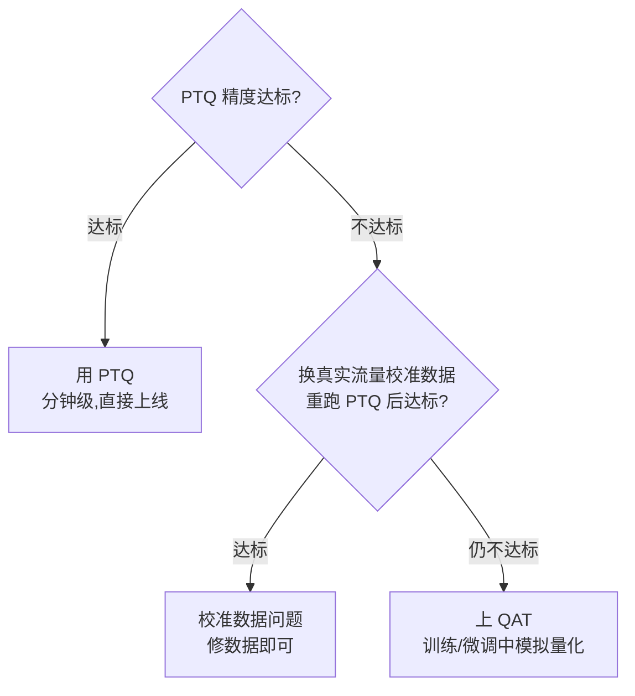

一个 70B 模型，FP16 权重就要占 **140GB 显存**,两张 A100 80GB 也放不下;而 Decode 阶段每生成一个 Token 都要把全部权重从显存里搬一遍，权重字节数减半，每步耗时理论上就能减半。量化就是同时改写这两个数字的技术:用 INT8 把权重压到 1/2、用 INT4 压到 1/4,代价是精度损失。这一节先把量化这件事讲透——为什么值得做、数值上怎么算、粒度怎么选、PTQ 和 QAT 什么区别——给 4.2 的 W8A8 和 4.3 的 INT4 打好地基。

<!-- more -->

## 📑 目录

- [1. 为什么要量化:先算两本账](#1-为什么要量化先算两本账)
- [2. 量化是什么:用整数近似实数](#2-量化是什么用整数近似实数)
- [3. 量化粒度:尺子越多越准，但开销越大](#3-量化粒度尺子越多越准但开销越大)
- [4. PTQ 与 QAT:两条量化生产线](#4-ptq-与-qat两条量化生产线)
- [5. 反直觉预告:量化位数越低不一定越快](#5-反直觉预告量化位数越低不一定越快)
- [6. 本章地图:量化技术全家桶](#6-本章地图量化技术全家桶)
- [总结](#-总结)
- [自我检验清单](#-自我检验清单)
- [参考资料](#-参考资料)

---

## 1. 为什么要量化:先算两本账

量化这个词听起来玄，动机其实非常朴素:**模型太大装不下、搬太慢算不动**。分别对应显存和带宽两本账，先算清楚，你就能理解后面所有量化技术的取舍。

### 1.1 显存账本:模型装得下吗

模型权重占多少显存，一句话:参数量 × 每参数字节数。FP16 每参数 2 字节，所以:

$$
\underbrace{14\ \text{GB}}_{\text{7B 模型 FP16}} = \underbrace{7 \times 10^9}_{\text{参数量}} \times \underbrace{2\ \text{B}}_{\text{FP16 每参数字节数}}
$$

以此类推，一张表算完:

| 📊 模型 | FP16(2B/参数) | INT8(1B/参数) | INT4(0.5B/参数) |
|---|---|---|---|
| 7B | ~14 GB | ~7 GB | ~3.5 GB |
| 70B | ~140 GB | ~70 GB | ~35 GB |
| 175B | ~350 GB | ~175 GB | ~88 GB |

代入一个真实场景:你只有 2 张 A100 80GB(合计 160GB),要上线 70B 模型——FP16 光权重就 140GB,剩下 20GB 连 KV Cache 的零头都不够，直接出局;W8A8 压到 ~70GB,权重能放下但两张卡依然紧张;INT4 weight-only 压到 ~35GB,**单卡就能放下**。这就是学习路线 3.3 里那张经典判断表的来源。

把账算全，70B 场景下显存有三个来源:

| 📊 项目 | 70B 模型典型账单 |
|---|---|
| 权重(FP16) | ~140 GB |
| KV Cache(80 层、GQA 8 个 KV head、ctx 4096、并发 64、FP16) | ~86 GB |
| 激活与临时 buffer | 数 GB |

权重是绝对大头，所以权重量化收益最大;但注意 KV Cache 这一行——**在 7B 这类小模型上，KV Cache 反而可能超过权重**(上文的 32GB > 14GB)。两条线都值得单独优化:权重量化是本章主线，KV Cache 量化留到 4.4。

⚠️ **注意**:**KV Cache 同样是显存大头，而且和权重无关。** 按学习路线 3.1 的算法，LLaMA-2-7B(32 层、32 头、head_dim=128)在上下文 4096、batch=16、FP16 存储下:

$$
\underbrace{2}_{\text{K 和 V}} \times 32 \times 32 \times 128 \times 4096 \times 16 \times 2\text{B} \approx \text{32 GB}
$$

也就是说，一个 7B 模型在长上下文高并发下，KV Cache 可以比权重本身(14GB)还大。权重量化省的是"权重那份",KV Cache 要单独量化——这是 4.4 的主题，先记住这个账单。

### 1.2 带宽账本:decode 的瓶颈在搬权重

显存装不下是"能不能跑"的问题;带宽则是"跑多快"的问题——对量化来说**更本质**。为什么？回顾 1.1 节的结论:Decode 阶段是 Memory Bound——每步只输入 1 个 Token,矩阵退化成向量，算力大量闲置，GPU 大部分时间在等显存搬运。搬的是谁？**权重**。每生成一个 Token,要把全部权重从 HBM 读一遍(权重对所有 Token 共享，所以是按"每步一次"算，而不是按 Token 数):

$$
\underbrace{\frac{14\ \text{GB}}{3.35\ \text{TB/s}} \approx 4.2\ \text{ms}}_{\text{7B FP16:每步搬运权重的理论耗时(H100)}}
$$

按同样的口径算 INT8 和 INT4:

| 📊 权重格式 | 每步搬运量 | 理论耗时/步(H100, 3.35TB/s) | 相对 FP16 |
|---|---|---|---|
| FP16 | 14 GB | ~4.2 ms | 1.0x |
| INT8 | 7 GB | ~2.1 ms | ~2.0x |
| INT4 | 3.5 GB | ~1.05 ms | ~4.0x |

**量化把权重字节数减到 1/2 或 1/4,decode 每步的理论耗时也同比例缩小——这就是"量化直接减 4x"的来历。**

💡 **提示**：上表是**理论下限**——假设带宽被吃满、kernel（GPU 上执行具体计算的底层函数）无额外开销。真实数字还要算上反量化、kernel 效率等，以下均为推理值，需在目标硬件上实测验证，标「待核实」。

吞吐的账顺势就出来了，算个具体的:单条流 FP16 每步 4.2ms,每秒最多约 238 个 Token;换成 INT8 后每步 2.1ms,单流上限约 476 Token/s——**单流吞吐直接翻倍**。再叠加显存红利:省下的显存能塞进更多并发请求，系统级吞吐继续乘倍数。**量化在推理侧是"一鱼两吃":既减延迟，又提吞吐。**

### 1.3 一张照片的比喻:量化到底损失了什么

学习路线里给过一个比喻，这里展开讲:**量化就是把高清照片压缩成缩略图**。原图(FP16)每个像素用 16 位记录颜色，细腻;缩略图(INT8/INT4)每个像素只用 8 位或 4 位，颜色被"四舍五入"到有限的色阶上。收益很直观:相册(显存)占得小、翻相册(带宽)翻得快;代价也很直观:**细节(精度)丢失**——蓝天可能出现色带、边缘可能模糊，但"这是一张照片"的整体信息还在。

用技术语言重述:量化把连续浮点值映射到有限个离散整数，信息必然有损;量化技术的好坏，就是在"损失多少精度"和"省下多少显存带宽"之间找平衡。**没有免费的午餐，量化的代价是精度，换的是显存 + 带宽 + 吞吐。**

---

## 2. 量化是什么:用整数近似实数

### 2.1 核心公式:scale 与 zero_point

问题是什么？**浮点数的范围又大又连续，整数只有固定几个档位，怎么把连续值塞进档位里？** 答案是给整数配两个参数，让它"换算"回浮点:scale(步长)决定每个档位跨多大，zero_point(零点)决定档位偏移多少。

$$
\underbrace{x_q = \text{round}\left(\frac{x - z}{s}\right)}_{\text{量化:连续值 } x \text{ 映射到整数档位}} \quad \Longleftrightarrow \quad \underbrace{\hat{x} = s \cdot x_q + z}_{\text{反量化:整数档位还原成近似浮点值}}
$$

- $x$:原始浮点值;$x_q$:量化后的整数;$\hat{x}$:反量化还原的近似值
- $s$:scale,步长，决定相邻两个整数档位之间的浮点距离
- $z$:zero_point,零点，让整数 0 档位对应浮点值 $z$(通常取整数)
- $\text{round}$:四舍五入

代入一个具体算例。有一组激活值 $[0.0,\ 1.27,\ 2.54,\ 3.81,\ 5.08,\ 6.35]$,用 INT8(256 个档位)非对称量化:

**步骤 1**:算步长 $s = \frac{6.35 - 0}{255} \approx 0.0249$;
**步骤 2**:算零点 $z = \text{round}(-0 / 0.0249) = 0$;
**步骤 3**:逐个量化，如 $x = 1.27 \rightarrow x_q = \text{round}(1.27/0.0249) = 51$;
**步骤 4**:反量化 $\hat{x} = 51 \times 0.0249 = 1.27$。

这个例子里反量化误差为 0,是因为 1.27 恰好落在档位上——真实数据很少这么巧。把六个值的量化过程列成表，一眼看全:

| 📊 原始值 x | 档位 x_q | 反量化 x̂ | 误差 |
|---|---|---|---|
| 0.00 | 0 | 0.000 | 0.000 |
| 1.27 | 51 | 1.270 | 0.000 |
| 2.54 | 102 | 2.540 | 0.000 |
| 3.81 | 153 | 3.810 | 0.000 |
| 5.08 | 204 | 5.080 | 0.000 |
| 6.35 | 255 | 6.350 | 0.000 |

(本例数值恰好都落在档位上，所以误差为 0;真实数据误差会分布在 $\pm s/2$ 内)

误差上界是多少？**每个值的反量化误差不超过半个步长 $s/2$**,本例即约 0.0125,相对 1.27 约 1%。这就是 INT8 量化在分布均匀时精度损失小的数学原因。

### 2.2 对称 vs 非对称:为什么权重和激活各用各的

问题是什么？**整数档位有正有负，但数据分布不一定以 0 为中心，该怎么对齐？** 两种做法:

- **对称量化**:$z = 0$,档位关于 0 对称(INT8 用 $[-127, 127]$)。公式退化为 $x_q = \text{round}(x/s)$,反量化 $x = s \cdot x_q$,省掉 zero_point 的加减。
- **非对称量化**:$z \neq 0$,档位可以整体平移(INT8 用 $[0, 255]$ 表示任意区间 $[\min, \max]$),多一个参数但能贴住数据实际范围。

| 📊 维度 | 对称量化 | 非对称量化 |
|---|---|---|
| 参数 | 只有 scale | scale + zero_point |
| Kernel 复杂度 | 低(省一次加减) | 高(多一次 zero_point 修正) |
| 适用分布 | 以 0 为中心 | 任意区间，如全正 |

为什么**权重常用对称**？权重分布大致以 0 为中心、比较均匀，对称量化不会浪费档位，而且 kernel 更简单——在 Tensor Core（GPU 上专门加速矩阵乘法的硬件单元）上少一次逐元素操作，性能更稳。为什么**激活常用非对称**？激活经过激活函数后往往偏到一侧（如全为正），非对称量化能让 256 个档位全部落在有效区间上，不浪费一半档位表示永远不会出现的负数。

算例直接对比:同一组值 $[0,\ 1.27,\ 2.54,\ 3.81,\ 5.08,\ 6.35]$(全为正),对称量化只能按 $[-6.35,\ 6.35]$ 取 $s = 6.35/127 \approx 0.05$,$1.27 \rightarrow \text{round}(25.4) = 25 \rightarrow$ 反量化 1.25,误差 0.02;非对称量化误差为 0。分布偏斜越严重，对称量化浪费的档位越多——**这就是激活用非对称、权重用对称的算账依据**。

📌 **关键点**:对称非对称之争，本质是"**用一点 kernel 复杂度换档位利用率**"。权重分布对称所以选省事的，激活分布偏斜所以选贴合的。

### 2.3 量化误差的两个来源:舍入与截断

问题是什么？**就算公式写对了，误差从哪来？** 只有两个来源，背下来:

$$
\underbrace{e_{\text{round}} \leq \frac{s}{2}}_{\text{舍入误差:值落在档位之间,四舍五入}} \quad \text{与} \quad \underbrace{e_{\text{clip}} = |x| - s \cdot 127}_{\text{截断误差:值超出档位范围,被砍到边界}}
$$

- **舍入误差(Rounding Error)**:档位不够密，值只能就近落档。上界 $\frac{s}{2}$,分布均匀时误差小。
- **截断误差（Clipping Error）**：值超出 $[-s \cdot 127, s \cdot 127]$，被硬砍到边界。这个误差可能非常大，而且**只要有一个 outlier（远大于普通值的离群数据）就会引爆**。

代入 outlier 算例：一组激活正常值约 1，但有个别 channel（通道，激活向量里的一个维度）的最大值高达 100（这是大模型的常态，4.2 会细讲）。per-tensor 量化时 $s = 100/127 \approx 0.787$，正常值 1 量化成 $\text{round}(1/0.787) = 1$，反量化回来 0.787——**误差 21%**。更狠的视角：正常 channel 的有效量化级别只剩

$$
2^8 \times \frac{1}{100} \approx 2.56
$$

**256 个档位里，正常值只分到 2~3 个，其余全被 outlier 的 scale 吃掉了。** 这就是"一个 outlier 毁掉整张 tensor"的数学机理，也是 4.2 SmoothQuant 要解决的核心问题——先在这里埋个伏笔。

💡 **提示**:误差还有第三个隐性来源——**校准误差**。scale 是用一小批校准数据算出来的，校准数据分布和线上真实数据不一致，scale 就不准。所以量化部署后必须用真实流量验证，不能只在校准集上自嗨。

---

## 3. 量化粒度:尺子越多越准，但开销越大

问题是什么？**一张 tensor 用一个 scale 够吗？** 上一节已经看到，per-tensor 一个 scale 会被 outlier 拖垮。那就多给几把尺子——这就是量化粒度。

- **Per-tensor**:整张矩阵共用一个 scale。实现最简，但对分布不均匀的 tensor 精度差。
- **Per-channel**:每个 channel(如权重的每个输出通道)一个 scale。精度大幅提升，是权重量化的主流选择。
- **Per-group**:把 channel 再分组(如每 128 个一组)共用一个 scale。粒度最细、精度最好，但 scale 数量最多，INT4 量化常用(4.3 详讲)。

打个比方:给全班同学量身高。per-tensor 是**全班用同一把尺子**;per-channel 是**按性别分两把尺子**(男生平均高、女生平均矮，各量各的，精度更高);per-group 是**按身高段发尺子**,每段一把。尺子越多，量得越准——但代价是:尺子本身要存(scale 数组占额外显存)、用尺子时要查(计算时多一步乘 scale 的操作)。

| 📊 粒度 | scale 数量 | 精度 | 额外开销 | 典型用途 |
|---|---|---|---|---|
| Per-tensor | 1 | 差(怕 outlier) | 几乎为零 | 分布均匀的小模型 |
| Per-channel | 输出通道数(如 4096) | 好 | 每通道一次乘法 | 权重量化(4.2、4.3) |
| Per-group | 通道数/组大小 | 最好 | scale 存储与查表 | INT4 量化(GPTQ/AWQ) |

关键问题：per-channel 的 scale 在 GEMM（矩阵乘法）里怎么乘？**只能在矩阵乘法的外维（输出通道）上乘，不能在 K 维（内维，即求和的那一维）上乘**——否则就要打断 Tensor Core 的流水线。好在权重 per-channel 的 scale 恰好落在输出通道维，GEMM 算完后在输出上逐列乘一次即可，几乎零成本。**这就是权重能用 per-channel、而激活不能用（激活的 per-channel 落在 K 维）的原因**——4.2 会看到 SmoothQuant 正是绕开这个限制的。

📌 **关键点**：粒度之争 = 用"scale 的数量"换"每格精度"。**权重侧可以随便细化（per-channel 不打断 kernel），激活侧受硬件限制只能 per-tensor 或 per-token（每行激活一个 scale）**——这个不对称是整章的主线。

---

## 4. PTQ 与 QAT:两条量化生产线

问题是什么？**量化参数(scale/zero_point)怎么得到？** 两条路线，一条便宜一条贵:

### 4.1 PTQ:训练后量化(便宜，默认选项)

流程:模型已经训好了 → 拿几百条校准数据跑一遍前向，统计每层的激活分布 → 算出 scale/zero_point → 权重直接转 INT8/INT4 上线。**不需要训练，分钟级搞定**。代价:scale 是"看数据估出来的",不是"为精度优化的",精度损失靠量化方法本身兜底(SmoothQuant、GPTQ、AWQ 都属于 PTQ 家族)。

### 4.2 QAT:量化感知训练(贵，兜底选项)

流程:训练/微调时就在前向里**插入假的量化操作**(把权重和激活先量化再反量化，叫 Fake Quant),让模型在训练中"适应"量化误差，学出来的参数天然抗量化。**需要训练数据和算力，精度上限最高**——因为模型不是被动挨打，而是主动适应。

| 📊 维度 | PTQ | QAT |
|---|---|---|
| 时机 | 训练后，离线转换 | 训练/微调中，前向模拟量化 |
| 数据需求 | 几百条校准数据 | 完整训练数据 |
| 算力成本 | 分钟级 | 一次完整训练 |
| 精度 | 好(依赖方法) | 最好(模型主动适应) |
| 适用 | 绝大多数 LLM 推理场景 | PTQ 精度不达标、低比特(INT4 以下)、小模型 |

**什么时候必须上 QAT?** 判据很简单:**PTQ 跑完精度不达标，且确认是量化误差而非校准数据问题**。大模型推理场景绝大多数 PTQ 就够了(4.2 会看到 175B 模型 W8A8 PTQ 精度几乎无损),但嵌入式/小模型场景 PTQ 经常崩，那时 QAT 就是唯一解。

诊断顺序用一棵树收束:

---

## 5. 反直觉预告:量化位数越低不一定越快

前面算带宽账，INT4 比 INT8 快一倍，那是不是位数越低越好？**不是。** 两个原因，先记住，4.3 展开:

1. **unpack/dequant 开销**:INT4 是"4 位塞一个字节"的打包格式，用之前要先拆包(unpack)再反量化(dequant),这两步是额外计算。batch 小、计算密度低时，这些开销可能**超过**带宽节省——INT4 反而比 INT8 慢。
2. **Tensor Core 利用率**:INT8 是硬件原生支持的数据类型，INT4 GEMM 要靠专门 kernel(如 Marlin)才能打满;kernel 没优化到位时，INT4 的算力利用率不如 INT8。

另一个认知纠偏:**"量化不是省显存，是省带宽 + 显存"**。速度收益的大头来自带宽账本(1.2 节),显存是附带福利——别把量化当成单纯的"省内存工具",它首先是"提速工具"。

⚠️ **注意**:量化后模型输出质量下降时，排查清单按概率排序:**激活 outlier 特别大的层(需 per-channel 或 SmoothQuant 处理)→ 校准数据不具代表性 → 特殊结构(如 MoE 的 gate)不适合低比特量化**。不要一上来就怪量化方法，先查数据。

什么时候低位量化稳赢，什么时候翻车？一张表钉死边界:

| 📊 场景 | INT4 vs INT8 的胜负 |
|---|---|
| 大 batch、计算密度高 | INT4 通常赢(带宽红利 > dequant 开销) |
| 小 batch、轻负载 | INT4 可能输(dequant/unpack 开销占比高) |
| 显存硬约束(单卡部署) | INT4 赢(1/4 压缩) |
| 精度敏感任务 | INT8 赢(档位多 16 倍) |

---

## 6. 本章地图:量化技术全家桶

这一节是地基，剩下五节各自解决一个具体问题——它们分别是什么？先给你一张地图(每篇的详细内容见对应文章):

- [4.2 W8A8 量化:SmoothQuant 与激活量化](/AIInfraGuide/inference/模块四-推理优化/第4章-量化/42-w8a8-smoothquant):激活有 outlier 量化不动怎么办？用数学等价变换把难度转嫁给权重，INT8 权重 + INT8 激活，精度几乎无损。
- [4.3 Weight-only INT4 量化:GPTQ 与 AWQ](/AIInfraGuide/inference/模块四-推理优化/第4章-量化/43-weight-only-int4-gptq与awq):最省显存的路线，权重压到 1/4,激活保持 FP16;GPTQ 靠二阶信息、AWQ 靠激活分布保护重要权重，还有 Marlin kernel 把 INT4 跑出 INT8 的速度。
- [4.4 KV Cache 量化:KIVI 与 FP8 KV Cache](/AIInfraGuide/inference/模块四-推理优化/第4章-量化/44-kv-cache量化-kivi):1.1 节那 32GB 的账单怎么砍？KIVI 2-bit 与 FP8 KV Cache,长上下文场景的救命稻草。
- [4.5 FP8 与 NVFP4:新一代硬件的低比特浮点](/AIInfraGuide/inference/模块四-推理优化/第4章-量化/45-fp8与nvfp4):Hopper 原生 FP8(E4M3/E5M2)与 Blackwell 的 NVFP4/MXFP4——低比特浮点，省的是"存",不损失"指数范围"。
- [4.6 量化选型与 vLLM 实战](/AIInfraGuide/inference/模块四-推理优化/第4章-量化/46-量化选型与vllm实战):什么时候用 W8A8、什么时候用 INT4,一张决策树讲完，并在 vLLM 里动手验证。

---

## 📝 总结

回到开篇的两个数字:70B 的 140GB 和 decode 每步的 4.2ms。

1. **动机是两本账**:显存账本决定"装不装得下",带宽账本决定"跑多快"——decode 是 Memory Bound,权重字节数减半，每步耗时理论上减半。
2. **数学就一个公式**:$x_q = \text{round}((x-z)/s)$,配 scale 与 zero_point;对称省 kernel 复杂度，非对称省档位浪费;误差只有舍入($\le s/2$)和截断(被 outlier 引爆)两源。
3. **粒度是主线**:per-tensor/per-channel/per-group 是"尺子数量换精度";权重能 per-channel、激活不能，这个不对称是 SmoothQuant 的切入点。
4. **PTQ 是默认， QAT 是兜底**:大模型推理场景 PTQ 够用;PTQ 精度不达标再上 QAT。
5. **两个反直觉**:INT4 不一定比 INT8 快(unpack/dequant 开销、Tensor Core 利用率);量化首先是省带宽，显存是附带。

## 🎯 自我检验清单

- 能口算 7B/70B/175B 模型在 FP16/INT8/INT4 下的权重显存，误差不超过 10%
- 能复述 LLaMA-2-7B 在 ctx=4096、batch=16 下 KV Cache ≈ 32GB 的算法(2×32×32×128×4096×16×2B)
- 能解释为什么 decode 阶段量化权重能直接换速度，并估算 7B FP16 每步搬运的理论耗时(~4ms 量级，H100)
- 能写出量化与反量化公式，并手动演算一组 4 元素向量的 INT8 量化过程，反量化误差不超过 5%
- 能说出对称与非对称量化的差异，以及权重用对称、激活用非对称的原因
- 能区分舍入误差与截断误差，并计算给定 scale 下的舍入误差上界($s/2$)
- 能用有效量化级别公式($2^8 \cdot m_i/m$)解释 outlier 为什么把正常值压到 2~3 个档位
- 能比较 per-tensor/per-channel/per-group 的精度与开销，并解释权重能用 per-channel 而激活不能的原因
- 能说清 PTQ 与 QAT 的流程、数据需求与成本差异，并给出"何时必须上 QAT"的判断
- 能解释"INT4 不一定比 INT8 快"的两个原因(unpack/dequant 开销、Tensor Core 利用率)
- 能按概率排序给出量化后质量下降的排查清单(outlier 层 → 校准数据 → MoE gate)

## 📚 参考资料

**论文**
- [Quantization and Training of Neural Networks for Efficient Integer-Arithmetic-Only Inference - Jacob et al., 2018](https://arxiv.org/abs/1712.05877)(scale/zero_point 定点量化的经典定义)
- [LLM.int8(): 8-bit Matrix Multiplication for Transformers at Scale - Dettmers et al., 2022](https://arxiv.org/abs/2208.07339)(激活 outlier 的系统性研究:0.1% 特征维度、6.7B 阈值)
- [SmoothQuant: Accurate and Efficient Post-Training Quantization for Large Language Models - Xiao et al., 2023](https://arxiv.org/abs/2211.10438)(W8A8 PTQ 代表作，本章 4.2 的主角)

**教程/解读**
- [W8A8模型量化技巧SmoothQuant - 知乎](https://zhuanlan.zhihu.com/p/681574087)(SmoothQuant 中文解读)
- [LLM.int8() and Emergent Features - Tim Dettmers](https://timdettmers.com/2022/08/17/llm-int8-and-emergent-features/)(outlier 涌现现象的科普解读)

**站内**
- [AI Infra 学习路线(3.1 推理基础 / 3.3 量化)](/AIInfraGuide/guides/ai-infra学习路线)(KV Cache 算账与量化检验标准)
- [1.1 LLM 推理基础](/AIInfraGuide/inference/模块四-推理优化/第1章-llm推理基础/11-llm推理基础)(Prefill/Decode 两阶段、Roofline 与 Memory Bound)
- [2.1 PagedAttention](/AIInfraGuide/inference/模块四-推理优化/第2章-推理引擎核心技术/21-pagedattention)(KV Cache 的显存管理，量化之外的省显存路线)
