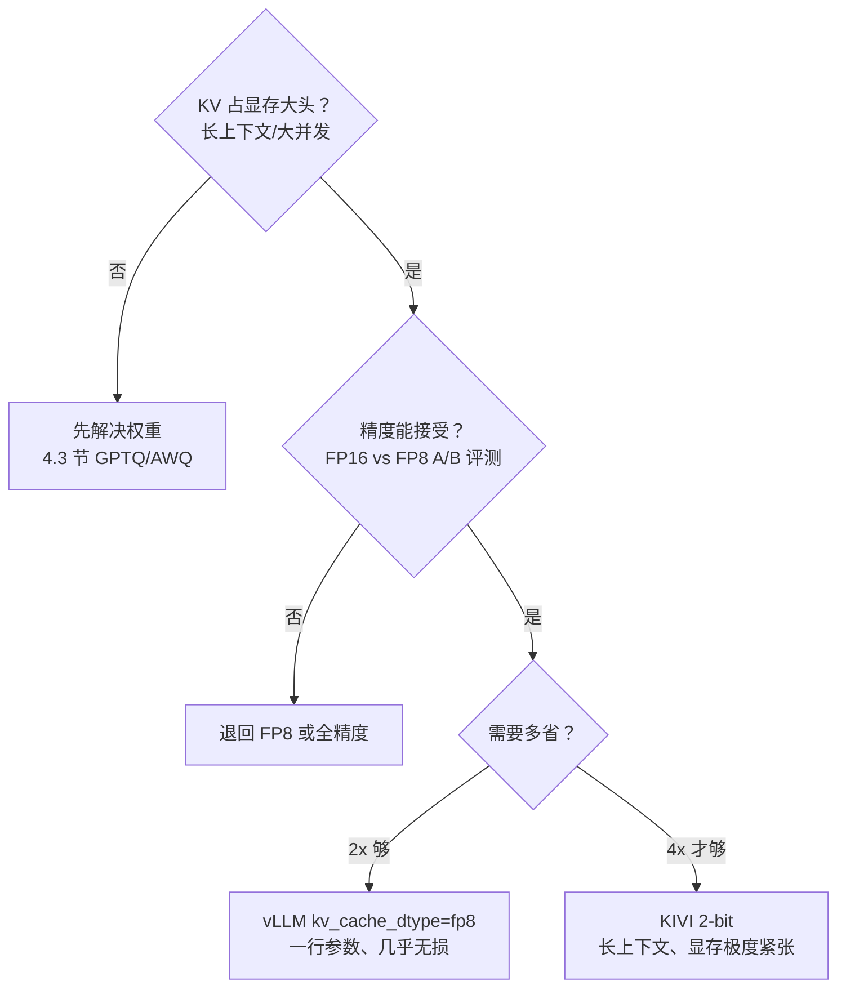

长上下文与高并发场景下，KV Cache 是比模型权重更凶的显存刺客：7B 模型权重只有 14GB，而 32 层、4096 上下文、batch 16 的 KV Cache 就要吃掉约 32GB。KIVI 用 2-bit 量化把 KV 压缩约 4 倍，论文报告峰值显存（含权重）省 2.6 倍、batch 最多扩大 4 倍、真实负载吞吐提升 2.35x~3.47x，而长上下文质量几乎不变。本文讲透 KV 量化为什么难、KIVI 的两个关键设计，以及 vLLM 原生支持的 FP8 KV Cache 这条 2x 工程捷径。

<!-- more -->

## 📑 目录

- [1. 问题：KV Cache 是长上下文的显存刺客](#1-问题kv-cache-是长上下文的显存刺客)
- [2. 为什么 KV Cache 量化这么难](#2-为什么-kv-cache-量化这么难)
- [3. KIVI 的设计一：先摸清 KV 的分布](#3-kivi-的设计一先摸清-kv-的分布)
- [4. KIVI 的设计二：混合粒度——最近 token 高精度](#4-kivi-的设计二混合粒度最近-token-高精度)
- [5. KIVI 的实现与效果](#5-kivi-的实现与效果)
- [6. FP8 KV Cache：vLLM 的工程捷径](#6-fp8-kv-cachevllm-的工程捷径)
- [7. 权衡与选型：什么时候量化 KV](#7-权衡与选型什么时候量化-kv)
- [总结](#-总结)
- [自我检验清单](#-自我检验清单)
- [参考资料](#-参考资料)

---

## 1. 问题：KV Cache 是长上下文的显存刺客

先把账算清楚。KV Cache 的显存公式（复用学习路线 3.1 的账本，符号含义：$L$ 为层数、$H$ 为每层注意力头数、$d$ 为 head 维度、$S$ 为序列长度、$B$ 为 batch、2 为 Key 和 Value 两份、最后乘每元素字节数）：

$$
\underbrace{\text{KV Cache 大小} = 2 \times L \times H \times d \times S \times B}_{\text{每 token 每头每层要存 K 和 V 两份}} \times \underbrace{2\text{ B}}_{\text{FP16 每元素 2 字节}}
$$

代入 LLaMA-2-7B 的配置（32 层、32 头、$d=128$）、上下文 4096、batch 16：

$$
2 \times 32 \times 32 \times 128 \times 4096 \times 16 \times 2\text{ B} \approx 32\text{ GB}
$$

对比一下：这个 7B 模型的 FP16 权重只有约 14GB——**KV Cache 是权重的 2.3 倍**。更关键的是它的增长方式：上下文翻倍、并发翻倍，KV 就线性翻倍。把不同负载组合的账本摊开看：

| 📊 上下文 | batch | KV Cache（FP16） | 是权重的几倍 |
|---|---|---|---|
| 2K | 8 | 约 8GB | 0.6x |
| 4K | 16 | 约 32GB | 2.3x |
| 8K | 32 | 约 128GB | 9.1x |
| 32K | 128 | 约 2TB | 143x |

（每 token 每序列的 KV 是 $2 \times 32 \times 32 \times 128 \times 2\text{ B} = 512\text{ KB}$，直接乘 $S \times B$ 即可。）权重永远是 14GB 不动，KV 却从 8GB 一路涨到 2TB——**负载一大，KV 就从“配角”变成“绝对大头”**。

这里要分清两件事：PagedAttention（2.1 节）解决“同样 2 字节/元素下怎么少浪费”，KV 量化解决“每个元素能不能少于 2 字节”——两者正交，可以叠加：先量化省 4 倍，再用分页把剩下的安排明白。

打个比方：推理像一场考试，权重是**课本**——厚度固定，一次买齐；KV Cache 是**草稿纸**——每算一道题（每生成一个 token）都要往上添两笔，题目越长、考生越多（并发越高），草稿纸越堆越多，最后把整张桌子占满。第 2 章的 2.1 PagedAttention 解决了“草稿纸怎么铺才不浪费”的问题（分页、按需分配），这一节解决的是“**草稿纸能不能写得更密**”——把每个数值从 2 字节压到更少字节。

📌 **关键点**：权重量化（4.3 节）省的是固定成本，KV 量化省的是**随负载线性增长的那部分显存**——长上下文、高并发场景下，后者的天花板收益远大于前者。

---

## 2. 为什么 KV Cache 量化这么难

设问：权重都能压到 4-bit 近无损，KV 照搬行不行？不行，KV 量化有三道坎：

**坎一：KV 是动态生成的，没法提前精挑细选。** 权重是静态的——量化前可以拿校准集反复调优，量化一次用一辈子；KV 是推理过程中每步新算出来的，量化器必须在线工作，没有“先看完整分布再定 scale”的机会。

**坎二：量化误差会累积。** 自回归生成是逐 token 的，第 $t$ 步的 KV 误差会进入第 $t+1$ 步之后的所有 Attention 计算。打个比方：传话游戏——每传一句都带一点失真，传 10 句还听得懂，传 1000 句就完全走样了。KV 的误差就是这样随着序列长度滚雪球，这也是为什么“短序列量化没事、长序列崩了”是 KV 量化最常见的翻车模式。

**坎三：朴素方案（FP16→INT8 per-tensor）精度损失明显。** 原因和 4.2 节 SmoothQuant 讲的是同一个：KV 里存在 outlier——少数 channel 的数值幅度远大于其余。per-tensor 量化用全局一个 scale（由最大值决定），被 outlier 拉大之后，**正常 channel 的相对误差整体变大**。

算一笔账理解这个放大效应（以下为估算口径，用于建立直觉）：假设某层 Key 的 1% outlier 是正常值的 10 倍。per-tensor 的 scale 由最大值决定，outlier 会把 scale 撑大；正常值被量化后只剩 1/10 的档位精度，相对误差放大约 10 倍。而 per-channel 量化让 outlier 只影响它自己那个 channel，正常 channel 的 scale 不受牵连。权重里的 outlier 可以用 GPTQ/AWQ 这类重武器精细处理，KV 是动态生成的，没法做那么重的补偿——所以 KV 量化必须从粒度设计上绕开 outlier。

结论：KV 量化需要一个**懂 KV 分布**的专门设计，而不是把权重量化工具硬搬过来。

---

## 3. KIVI 的设计一：先摸清 KV 的分布

KIVI（Liu et al., 2024，ICML 2024）的出发点很朴素：**先研究 KV 的元素分布，再决定怎么量化**。论文对主流 LLM 的 KV Cache 做了系统的分布分析，得到两个结论：

- **Key Cache 的 outlier 集中在少数固定的 channel 上**——于是 Key 应该 **per-channel 量化**（每个 channel 独立算 scale）；
- **Value Cache 的分布更均匀、outlier 模式不同**——于是 Value 应该 **per-token 量化**。

为什么 Key 必须 per-channel？因为 Attention 分数是 query 与 key 的点积：

$$
s = \frac{q \cdot k}{\sqrt{d}} = \frac{\sum_{i=1}^{d} q_i k_i}{\sqrt{d}}
$$

如果 per-token 量化 Key（一个 token 的所有 channel 共享一个 scale），outlier channel 会把 scale 拉大，**所有 channel 的相对误差一起变大**，误差在沿 head 维度求和时累积；而 per-channel 量化让每个 channel 有自己的 scale，outlier 的误差被**隔离在自身 channel 内**，不会污染其他 channel。

论文的实证数字（Llama-2-13B，Attention 分数的平均相对误差）：

| 📊 量化方式 | Attention 分数平均相对误差 |
|---|---|
| Key per-token 量化 | 47.00 |
| Key per-channel 量化 | **9.60** |

**per-token 的误差是 per-channel 的约 5 倍**——这就是“量化粒度选错，误差差一个数量级”的教材案例。

💡 **提示**：Value 为什么 per-token 就行？因为 Value 在 Attention 里是乘上权重（Softmax 分数）后加权求和，误差被权重平均稀释，不沿 head 维度累积；而 Key 是和 query 做逐元素点积，误差会沿 head 维度直接叠加。**K 和 V 的误差传播路径不同，最优粒度就不同**——这是 KIVI 最重要的方法论贡献。

那为什么不干脆 per-channel 粒度做到头（每个 channel 一个 scale）？因为**scale 也要占显存**：per-channel 时 K 的每个 channel 都要存一个 scale（FP16，2 字节），channel 数等于 head 维度 $d = 128$，scale 开销本身不小。KIVI 的折中是**分组量化**：每 $G = 32$ 个 channel 共享一个 scale，scale 数量降 32 倍，代价是组内仍有一点精度损失——这是“精度 vs scale 开销”的工程平衡，和 4.1 节的量化粒度讨论（per-tensor / per-channel / per-group）是同一根线上的三个点。

---

## 4. KIVI 的设计二：混合粒度——最近 token 高精度

设问：2-bit 只有 4 个档位，为什么还能保持质量？答案藏在第二个设计里：**不是所有 token 的 KV 都值得同等精度**。

直觉上，生成新 token 时，Attention 的权重主要落在**近期 token** 附近——旧 token 的信息已经被“消化”过了。KIVI 论文的实证支持这一点：保留最近 token 的全精度，对困难任务（如 GSM8K）的精度至关重要。

于是 KIVI 把 Key Cache 从时间上切成两段：

$$
\underbrace{\text{Residual 部分：最近 } R \text{ 个 token}}_{\text{全精度（FP16），per-token 存储}} \quad + \quad \underbrace{\text{Grouped 部分：更早的 token}}_{\text{2-bit 量化，per-channel 分组（group size } G = 32\text{）}}
$$

打个比方：这就像记备忘录——**最近几页写得详细（全精度），旧页压缩成摘要（2-bit）**。你回忆事情时主要翻近几页，旧页只是偶尔查证，压一压不影响使用。用技术语言重述：Decode 时新 token 的 Attention 分数主要贡献来自滑动窗口内的近期 KV，residual 部分保证了这部分零误差；窗口之外的旧 KV 即使有量化误差，对输出的影响也有限。

Value Cache 同理：最近 token 保持高精度，旧 token 用 per-token 分组量化（Value 的 outlier 不在固定 channel，所以不沿 channel 分组）。

三个工程要点：

- **无训练（tuning-free）**：KIVI 是纯 PTQ，量化参数（scale、zero-point）从已生成的 KV 在线统计得到，不需要任何训练或校准集；
- **非对称量化**：2-bit 用 group-wise 的 zero-point（零点偏移）量化，配合 per-group scale，把 4 个档位用在刀刃上；
- **滑动窗口**：residual 部分的长度 $R$ 是超参数，论文实验表明窗口越大越稳，但占用也越多——它在“精度”和“压缩率”之间划了一条可调的线。

📌 **关键点**：KIVI = **per-channel（空间上隔离 outlier）+ 混合粒度（时间上保护近期）**。前者解决“误差被 outlier 放大”，后者解决“误差在长序列中累积”——两道坎各有一个针对性设计。

实现时真正要调的超参数只有三个，其余全部自动：

- **$R$（residual 窗口长度）**：最近多少个 token 保持全精度。论文设置 $R \le 128$（远小于序列长度，显存开销可忽略）；$R$ 越大越稳、压缩率越低；论文实验表明窗口太小时（如 $R = 0$），GSM8K 这类难任务明显劣化——它就是你手里“精度 vs 压缩率”的旋钮；
- **$G$（分组大小）**：per-channel 分组量化的 group size，默认 32，影响 scale 开销与精度的平衡；
- **位数**：论文主打 2-bit，也提供了 4-bit 版本（压缩 2 倍、精度更高）——显存不是极度紧张时，4-bit 是更稳的选择。

---

## 5. KIVI 的实现与效果

### 5.1 硬件友好的实现

2-bit 值按位**打包存储**（一个字节装 4 个元素——不打包就省不了 4 倍显存，这是 2-bit 方案成立的前提）。反量化（解包 + 乘 scale + 加 zero-point）则**融合进 Attention kernel**（KIVI 提供 CUDA 和 Triton 两种实现），在计算流水线里完成，不产生额外的显存读写往返。

把“在线量化”这一步落成伪代码，看清每个新 token 的 KV 经历了什么（非逐字源码，理解原理的示意）：

```
// 每生成一个新 token 的 K/V，写入 KV Cache 前：
if 该 token 在 residual 窗口内（最近 R 个）:
    直接存 FP16                    // 近期 token 全精度，零误差
else:
    k_q = quantize_2bit_per_channel_group(k, G=32)   // 旧 key：per-channel 分组
    v_q = quantize_2bit_per_token_group(v, G=32)     // 旧 value：per-token 分组
// Attention kernel 内部：解包 2-bit → 反量化 → 与 Q 的矩阵乘融合，不产生额外显存往返
```

关键就在最后一行：**反量化发生在 kernel 的寄存器里**，KV 从显存读出来就是打包的 2-bit，解包和计算重叠，省下的带宽才真正兑现——这和 4.3 节 Marlin 的思路一模一样：量化省下的字节，要靠 kernel 融合实现才能变成吞吐。

### 5.2 论文报告的关键数字

| 📊 指标 | 论文报告值 |
|---|---|
| 峰值显存（**含模型权重**） | 降低 **2.6x** |
| 可支持 batch size | 最大扩大 **4x** |
| 真实推理负载吞吐 | **2.35x ~ 3.47x** |
| 质量（LongBench 平均） | Llama-2-7B：44.52 → 44.27（降 0.25）；Mistral-7B：46.58 → 45.85（降 0.73） |
| 验证模型 | Llama / Llama-2 / Falcon / Mistral |

⚠️ **注意**：2.6x 是“**含权重的峰值显存**”下降，不是 KV 本身的压缩比——KV 从 FP16 的 2 字节/元素压到 2-bit 的 0.25 字节/元素，**KV 本身约 4 倍压缩**，但权重等其他占用不变，摊到总显存上就是 2.6x。汇报数字时别把这两个口径混了。

除了 2-bit 主版本，KIVI 也提供 4-bit 版本：压缩率降到 2 倍，但精度更稳、对困难任务更友好。**显存不是极度紧张时，4-bit 往往是更务实的选择**——2-bit 多省的那 2 倍，可能要用 residual 窗口和分组大小的一通调优来换。

代入本文第 1 节的账本算一下：7B、4096 上下文、batch 16，KV 从约 32GB 降到约 8GB。假设 KV 显存预算固定为 32GB：FP16 只能装 batch 16（正好 32GB），2-bit 能装到 batch 64（32GB）——**同样的显存，并发翻了 4 倍**，这正是论文“最大 4x batch”的来历，也直接解释了吞吐 2.35x~3.47x 的来源（吞吐提升不是 KV 压缩的直接结果，而是“省下的显存换来的更大 batch”的结果）。

权衡也要说清楚：2-bit 的代价是**困难任务上仍有小损失**（GSM8K 这类推理任务对 KV 精度最敏感，论文明确提到 residual 窗口对这类任务至关重要）；且论文的验证集中在 7B 量级模型，更大模型、更长上下文（128K+）的表现需要自行实测。**论文报告的是质量“几乎不变”，不是“完全不变”**——上线前在目标任务上做 A/B 评测是必须的，别把摘要里的“almost the same quality”当成免检承诺。

---

## 6. FP8 KV Cache：vLLM 的工程捷径

设问：KIVI 这么好，为什么 vLLM 默认提供的却是 FP8 KV Cache？因为工程上**先白捡 2 倍，比追求 4 倍更务实**。

vLLM 原生支持 KV Cache 的 FP8 量化（以你所用版本的 `vllm serve --help` 为准）：

```python
from vllm import LLM

llm = LLM(
    model="meta-llama/Llama-3.1-8B-Instruct",
    # KV Cache 用 FP8 存储：FP16 的 2 字节 → FP8 的 1 字节
    kv_cache_dtype="fp8",        # 可选 fp8_e4m3 / fp8_e5m2
)
```

核心特点：

- **per-tensor 量化**（或 per-attention-head）：一个（或每头一个）scale，实现简单到极致——这正是第 2 节“坎三”说的朴素方案，但 FP8 只有 1 字节、只有 2 倍压缩，精度压力比 INT8 小得多，**几乎无损**；
- **2 倍压缩率**：KV 从 2 字节压到 1 字节，30GB 变 15GB——没有 KIVI 的 4 倍猛，但一行参数、零额外依赖；
- **硬件友好**：FP8 是 Hopper 的原生浮点格式（E4M3 尾数更多精度高 / E5M2 指数更多动态范围大，KV 场景常用 E4M3，细节留给 4.5 节），Kernel 不需要像 2-bit 那样手动解包。

| 📊 维度 | KIVI 2-bit | FP8 KV Cache |
|---|---|---|
| KV 压缩率 | 约 4x | 2x |
| 精度 | 近无损（LongBench 降 <1 分） | 几乎无损 |
| 实现复杂度 | 专门 kernel（CUDA/Triton） | vLLM 一行参数开启 |
| 量化方式 | per-channel + 混合粒度 | per-tensor / per-head |
| 适合场景 | 显存极度紧张、长上下文 | 通用、快速见效 |

落成一句话：**先开 `kv_cache_dtype="fp8"` 白捡 2 倍；还不够，再上 KIVI 拿 4 倍**——绝大多数场景下 FP8 已经够用，KIVI 是留给“显存真的不够”的场景的。

---

## 7. 权衡与选型：什么时候量化 KV

### 7.1 KV 量化 vs 权重量化：各省各的显存

| 量化对象 | 省的是哪部分显存 | 典型触发场景 |
|---|---|---|
| 权重量化（4.3 节 GPTQ/AWQ） | 固定成本（模型权重） | 模型太大、单卡放不下 |
| KV 量化（本节 KIVI/FP8） | 负载相关成本（随上下文×并发增长） | 长上下文、高并发 |
| 两者叠加 | 全都要省 | 大模型 + 长上下文 |

### 7.2 什么时候值得量化 KV

决策规则（量化前的自问三步）：

1. **KV 占显存大头吗？** 用第 1 节的公式算：KV 占比 > 50%（长上下文或大并发时很容易），值得；短上下文（2K 以内）、低并发、KV 占比 < 20%，不值得——先解决权重（4.3 节）；
2. **精度能接受吗？** 量化前先在目标任务上做 FP16 vs FP8（或 2-bit）的 A/B 评测，特别是数学推理类任务（GSM8K 这类对 KV 精度最敏感）；退化超阈值就退回 FP8 或全精度；
3. **省下的显存能换成吞吐吗？** 如果显存本来就富余、并发没打满，KV 量化省下的空间只是躺着吃灰——量化是为“装更多请求”服务的，装不满就别量化。

| 场景 | 推荐方案 |
|---|---|
| 通用场景、想快速省显存 | vLLM `kv_cache_dtype="fp8"` |
| 长上下文（32K+）、显存极度紧张 | KIVI 2-bit（或等待引擎原生支持） |
| 短上下文、并发低、显存富余 | 不量化 KV（省下的用不上） |
| 大模型 + 长上下文同时出现 | 权重 INT4 + KV FP8 叠加（4.6 节讲评估顺序） |

### 7.3 落成一句话的决策树



落成一句话的规则：**短上下文不量化 KV，中等需求开 FP8，显存真不够才上 2-bit；量化永远以“省下的显存换成了更大 batch”为唯一验收标准**。

⚠️ **注意**：KIVI 是论文实现，vLLM 对 2-bit KV Cache 的原生支持仍在演进（vLLM 原生提供的是 FP8 路线）；上 KIVI 意味着要接入论文代码或第三方实现，这是它的工程代价。**别为了 4 倍压缩率背上不成熟依赖**——先 FP8，是绝大多数团队的正确起点。

📌 **关键点**：KV 量化省下的每 GB 显存，只有在“能换成更大 batch、更高并发”时才值钱。量化的目的从来不是把显存数字做小，而是**把吞吐做大**。

---

## 📝 总结

1. **问题规模**：7B 模型 4096 上下文 + batch 16，KV Cache 约 32GB，是权重的 2.3 倍，且随上下文与并发线性增长；
2. **KV 量化三道坎**：动态生成无法离线调优、误差逐 token 累积、per-tensor 朴素方案被 outlier 拖垮；
3. **KIVI 设计一**：分布研究得出 Key per-channel、Value per-token——per-token 的 Attention 分数误差是 per-channel 的约 5 倍（47.00 vs 9.60）；
4. **KIVI 设计二**：混合粒度——最近 token 全精度（residual 窗口）+ 旧 token 2-bit 分组量化，在时间维度上隔离长序列误差累积；
5. **KIVI 效果**：KV 约 4 倍压缩、含权重峰值显存省 2.6x、batch 最大 4x、吞吐 2.35x~3.47x、LongBench 质量降 <1 分；
6. **FP8 捷径**：vLLM 一行参数开启、per-tensor、几乎无损、2 倍压缩——先白捡 2 倍，不够再上 KIVI。

## ⚠️ 常见错误做法

- ❌ **KV Cache 量化直接沿用权重量化的方案**：per-tensor 一把梭。为什么错：KV 是动态生成的，分布随序列变化，per-tensor scale 无法跟踪；且 KV 量化误差直接进入注意力计算，传播更敏感。正确做法：用 KIVI 的 per-channel/per-token 粒度与混合精度策略（关键块高精度）。
- ❌ **以为 KV 量化免费**：只看到 KV 显存减半。为什么错：量化/反量化有计算开销，且精度损失在长上下文下会累积（注意力分数误差）。正确做法：长上下文场景先验证困惑度与任务指标，再决定 4bit/8bit（4.4 的验证流程）。
- ❌ **把 KV 量化与 PagedAttention 分开优化**：量化了 KV 就不管碎片。为什么错：两个优化解决不同问题——量化减体积、分页消除浪费，叠加才能把显存压到极限。正确做法：一起上（vLLM 的 KV cache 量化与分页原生配合）。
- ❌ **忽略量化后的反量化开销**：小 batch 下逐 token 反量化。为什么错：反量化在 Decode 的访存关键路径上，实现不好收益被吃掉。正确做法：用向量化反量化 kernel（KIVI 的 2bit 非对称量化即为此设计）。

## 🎯 自我检验清单

- 能手算 7B 模型（32 层、32 头、head_dim=128）在 4096 上下文、batch 16 下的 KV Cache 显存（≈32GB，误差 20% 以内）
- 能解释 KV Cache 与权重的显存特性差异（固定成本 vs 随负载线性增长），并据此判断谁是大头
- 能说出 KV 量化比权重量化难的三个原因（动态生成、误差累积、per-tensor 被 outlier 拖垮）
- 能解释为什么 Key 适合 per-channel 量化而 Value 适合 per-token 量化（点积累积 vs 加权平均的误差传播差异）
- 能说明 KIVI 混合粒度设计的两段结构（residual 全精度窗口 + grouped 2-bit 部分）及各自的作用
- 能说出 KIVI 论文报告的核心数字：KV 约 4x 压缩、峰值显存 2.6x、吞吐 2.35x~3.47x、LongBench 降 <1 分
- 能区分“2.6x 峰值显存（含权重）”与“KV 本身约 4x 压缩”两个口径，不混淆
- 能用一行参数在 vLLM 中开启 FP8 KV Cache，并说出它的压缩率与量化方式
- 能对比 KIVI 与 FP8 KV Cache 的压缩率、精度、实现复杂度，并给出“先 FP8 再 KIVI”的工程顺序
- 能根据 KV 占比（>50% 还是 <20%）判断是否值得量化 KV
- 能解释“省下的显存只有换成更大 batch 才有价值”这句话的工程含义
- 能设计一个 KV 量化上线前的 A/B 评测（FP16 vs FP8 vs 2-bit，含数学推理任务）

## 📚 参考资料

**论文**
- [KIVI: A Tuning-Free Asymmetric 2bit Quantization for KV Cache - Liu et al., 2024（ICML 2024）](https://arxiv.org/abs/2402.02750)

**教程**
- [LLM 系列：KVCache 量化 1——KIVI 解读（含与 SmoothQuant/GPTQ 的对比）- 稀土掘金](https://juejin.cn/post/7412949574665895974)

**开源项目**
- [KIVI 官方实现（CUDA + Triton Kernel）](https://github.com/jy-yuan/KIVI)

**官方文档**
- [vLLM Quantized KV Cache（kv_cache_dtype 参数与支持格式）](https://docs.vllm.ai/en/stable/features/quantization/quantized_kvcache/)

**站内**
- [第4章：量化（章首页）](/AIInfraGuide/inference/模块四-推理优化/第4章-量化/第4章-量化)
- [4.1 量化基础（对称/非对称、量化粒度、PTQ vs QAT）](/AIInfraGuide/inference/模块四-推理优化/第4章-量化/41-量化基础)
- [4.3 Weight-only INT4 量化（GPTQ 与 AWQ）](/AIInfraGuide/inference/模块四-推理优化/第4章-量化/43-weight-only-int4-gptq与awq)
- [4.5 FP8 与 NVFP4（Hopper 与 Blackwell 的低比特浮点）](/AIInfraGuide/inference/模块四-推理优化/第4章-量化/45-fp8与nvfp4)
- [4.6 量化选型与 vLLM 实战](/AIInfraGuide/inference/模块四-推理优化/第4章-量化/46-量化选型与vllm实战)
- [学习路线第三层：量化检验标准（70B 显存账本与 INT4/INT8 反直觉）](/AIInfraGuide/guides/ai-infra学习路线)
