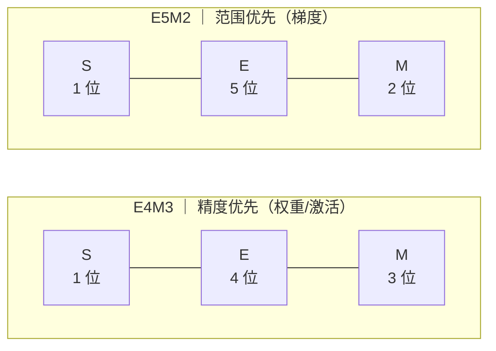

上一节 4.4 把镜头对准了 KV Cache，这一节轮到权重和激活。先给结论：一个 70B 模型用 FP16 存权重要 140GB，换成 FP8 直接砍半到 70GB；而在 H100 上，FP8 的 Tensor Core 稠密算力（约 1,979 TFLOPS）恰好是 FP16（约 989 TFLOPS）的 2 倍——**省一半显存，还白赚一倍的峰值算力**。但要拿到这两份收益，你得先搞清楚 8 位浮点凭什么比 8 位整数更"聪明"，以及 Blackwell 上更激进的 4-bit 浮点（NVFP4/MXFP4）又是怎么把精度救回来的。

<!-- more -->

## 📑 目录

- [1. 为什么需要浮点量化：整数的短板](#1-为什么需要浮点量化整数的短板)
- [2. FP8 的两种格式：E4M3 与 E5M2](#2-fp8-的两种格式e4m3-与-e5m2)
- [3. 缩放：FP8 的灵魂](#3-缩放fp8-的灵魂)
- [4. Hopper 原生支持：FP8 推理的三种用法](#4-hopper-原生支持fp8-推理的三种用法)
- [5. FP8 训练（进阶）：DeepSeek-V3 的实践](#5-fp8-训练进阶deepseek-v3-的实践)
- [6. Blackwell 与 NVFP4/MXFP4](#6-blackwell-与-nvfp4mxfp4)
- [7. 权衡：FP8 vs INT8 vs INT4](#7-权衡fp8-vs-int8-vs-int4)
- [总结](#-总结)
- [自我检验清单](#-自我检验清单)
- [参考资料](#-参考资料)

---

## 1. 为什么需要浮点量化：整数的短板

### 1.1 整数量化的动态范围问题

上一节 4.1 讲过，整数量化是把浮点值映射到等间距的整数刻度上：INT8 只有 256 个刻度，范围固定是 $[-128, 127]$。问题来了：模型权重和激活里，**大数和小数常常同时存在**——一个激活张量的最大值可能是 1000，而大量有用的值集中在 0.01 附近。用 INT8 表示时，scale 由最大值决定，0.01 这个量级的值会直接塌缩成 0 或 ±1，精度全丢。

打个比方：整数刻度就像一把**等间距的直尺**——不管量 1 米还是 1 毫米，刻度密度都一样。而浮点数是一把"对数尺"：小数字刻度密集（精细），大数字刻度稀疏（只能保个大概）。对神经网络这种"小值密集、大值稀疏"的数据分布，对数尺天然更合适。

### 1.2 核心洞察

**FP8 就是把浮点数的"对数刻度"塞进 8 位**——用 1 位符号 + 若干指数位 + 若干尾数位，用很小的位数同时保住"范围"和"相对精度"。相比 INT8 的"绝对误差恒定"，FP8 保证的是"相对误差恒定"：不管值是大是小，误差比例都差不多，这正是它比 INT8 更抗 outlier 的根本原因。

---

## 2. FP8 的两种格式：E4M3 与 E5M2

### 2.1 为什么需要两种格式？

8 位里要分给"指数位"和"尾数位"，而两者是冲突的：指数位多 → 范围大但精度差；尾数位多 → 精度好但范围小。所以 NVIDIA、Arm、Intel 联合提出的 FP8 规范（Micikevicius et al., 2022）干脆定义了**两种格式**，让用户按用途选：

| 📊 维度 | E4M3 | E5M2 |
|---|---|---|
| 位结构 | 1 符号 + 4 指数 + 3 尾数 | 1 符号 + 5 指数 + 2 尾数 |
| 最大表示 | **448** | **57,344** |
| 最小正规数 | $2^{-6} \approx 0.016$ | $2^{-14} \approx 6.1 \times 10^{-5}$ |
| 相对精度（单位舍入） | $\approx 2^{-4} = 6.25\%$ | $\approx 2^{-3} = 12.5\%$ |
| 特殊值 | 不表示 infinity，NaN 单一模式（范围最大化） | 接近 IEEE-754，与 FP16 互转简单 |
| 论文推荐用途 | **权重、激活（前向）** | **梯度（反向）** |

对照 16 位家族：FP16 最大 65,504，BF16 最大约 $3.4 \times 10^{38}$。E4M3 的动态范围比 FP16 窄了 145 倍——这就是后面“缩放”必不可少的伏笔。

两种格式的 8 位怎么分配，一眼看穿（S=符号位，E=指数位，M=尾数位）：

8 位总数不变，区别只在“指数和尾数谁多谁少”：E4M3 多 1 位尾数（精度好、范围小），E5M2 多 1 位指数（范围大、精度差）。

### 2.2 各自的适用场景

为什么论文推荐 E4M3 给权重/激活、E5M2 给梯度？**权重和激活最怕精度损失**——3 位尾数的相对误差（6.25%）比 2 位尾数（12.5%）小一半；而**梯度最怕下溢**——反向传播里梯度值经常小到 $10^{-4}$ 量级，E5M2 的最小正规数 $2^{-14}$ 比 E4M3 的 $2^{-6}$ 小了 256 倍，能接住更小的梯度不变成零。

💡 **提示**：E4M3 的"不表示 infinity"不是偷工减料，而是刻意设计——把那一位编码空间省出来扩展范围。代价是计算中出现 ±inf 会直接变成 NaN 传播，所以用 E4M3 的算子必须保证输入被 scale 控制在 ±448 以内。

### 2.3 数值算例

设一个权重张量最大绝对值 $\max|x| = 300$，量化到 E4M3：

$$
s = \frac{300}{448} \approx 0.67, \qquad x_q = \operatorname{round}\left(\frac{x}{s}\right)
$$

一个原值 $x = 0.5$ 的权重：$x_q = \operatorname{round}(0.75) = 1$，反量化 $\hat{x} = 1 \times 0.67 = 0.67$，绝对误差 0.17，相对误差高达 34%——等等，这误差不小。问题出在 scale 按最大值 300 定，小值 $0.5$ 只占刻度的很小一部分。

**工程结论：per-tensor 缩放（整个张量共用一个 scale）对 outlier 极其敏感**——一个 300 的大值就把 scale 撑大，把 0.5 这类小值压到几个可表示刻度里。解决办法就是第 3 节的缩放粒度：让 scale 跟着局部数据走。

同样的张量如果走 E5M2：$s = 300 / 57344 \approx 0.0052$，$x_q = \operatorname{round}(0.5 / 0.0052) = \operatorname{round}(96) = 96$，反量化 $96 \times 0.0052 \approx 0.5$——几乎无损恢复。E5M2 的范围大 128 倍，小值在刻度里的位置更靠中间，但代价是只有 2 位尾数，大值的相对误差（12.5%）比 E4M3（6.25%）大一倍。这就是"范围与精度不可兼得"的具象化。

---

## 3. 缩放：FP8 的灵魂

### 3.1 为什么必须缩放？

E4M3 最大只能表示 448，而 Transformer 的激活动辄上千、权重分布五花八门。直接量化必然大面积饱和（超出可表示范围的值会被压到边界上）。缩放（Scaling）的做法是：量化前先除以一个 scale 因子把数据压进可表示范围，反量化时再乘回来：

$$
x_q = \operatorname{round}\left( \underbrace{\frac{x}{s}}_{\text{除以 scale 压进} \pm 448} \right), \qquad \hat{x} = \underbrace{x_q}_{\text{8 位浮点存储}} \times \underbrace{s}_{\text{反量化乘回，FP32 精度}}
$$

s 的取值通常是 $\max|x| / 448$（或 57344）。**说白了：scale 就是给每个数据块单独配的"音量旋钮"**——旋钮调得准，8 位就能当 16 位用。

### 3.2 缩放粒度：从均码到量体裁衣

scale 按多大范围共享，直接决定精度与开销的权衡：

- **Per-tensor**：整个张量一个 scale。最简单、无额外存储，但一个 outlier 毁所有——就是 2.3 算例里的惨状。
- **Per-channel（权重）**：每个输出通道一个 scale。权重是静态的，通道级 scale 几乎零成本，效果立竿见影。
- **Per-token（激活）**：每个 token 一个 scale。激活是动态的，运行时算 $\max|x|$ 再量化，多一次归约但避免跨 token 的 outlier 污染。
- **Per-block（细粒度）**：按 $128 \times 128$（权重）或 $1 \times 128$（激活）小方块各配一个 scale。最接近"量体裁衣"，精度最好，但要存更多 scale，且对 Kernel 的矩阵乘（GEMM）实现有硬要求。

打个比方：per-tensor 是给全班同学发**均码校服**——高个子（outlier）把尺码撑大，矮个子全不合身；per-channel/per-block 是**每人量体裁衣**——每个小群体按自己的身材定制，谁都不委屈。代价是裁缝（scale 存储与计算）更忙。

### 3.3 动态缩放 vs 静态缩放

激活是运行时才产生的，scale 从哪来？两条路：

- **动态（Dynamic）**：推理时现场统计 $\max|x|$ 再量化。无需任何校准数据，vLLM 的 `--quantization fp8` 就是这条路；代价是每次多一遍统计开销。
- **静态（Static）**：用校准数据集提前统计好 scale，存在 checkpoint 里，推理时直接用。省运行时开销，但 scale 依赖校准集代表性——校准数据偏了，精度就偏了。

📌 **关键点**：**FP8 的精度问题 80% 是缩放问题，不是位数问题**。选对粒度（per-channel 权重 + per-token 激活是性价比最高的组合）比纠结 E4M3 还是 E5M2 重要得多。

---

## 4. Hopper 原生支持：FP8 推理的三种用法

### 4.1 H100 的硬件账本

先看算力。NVIDIA 官方 H100 规格页给出的数字：FP16 Tensor Core 1,979 TFLOPS、FP8 Tensor Core 3,958 TFLOPS——注意这两行都标注了 **\* with sparsity**（含 2:4 结构化稀疏）。去掉稀疏后稠密（dense）算力各折半：**FP16 ≈ 989 TFLOPS，FP8 ≈ 1,979 TFLOPS，FP8 正好是 FP16 的 2 倍**。这与 NVIDIA 2025 年官方博客的性能演进图（H100 最低精度格式稠密/稀疏 1.9/3.9 PFLOPS）完全吻合。

为什么是 2 倍？Tensor Core 的 FMA 阵列宽度是固定的，8 位数据每周期能塞进两倍于 16 位的元素——**位数减半，吞吐翻倍**，这是硬件白送的。

### 4.2 用法一：Weight-only FP8（W8A16）

能不能只量化权重、激活保持原样？能——这就是最省事的用法。只把权重量化到 FP8，激活保持 FP16/BF16。和 4.3 节 INT4 weight-only 是同一个套路，收益也类似：权重显存减半、Decode 阶段（Memory Bound）的权重读取带宽减半。区别是 FP8 是浮点，量化不用 GPTQ/AWQ 那套 Hessian 保护，**直接 round 就行，精度损失极小**。

### 4.3 用法二：W8A8 FP8（动态/静态缩放）

权重省了一半，那激活呢？也量化，让 Tensor Core 全速跑。权重和激活都量化到 FP8，Tensor Core 吞吐拉满到 1,979 TFLOPS。激活量化用 3.3 节的动态或静态缩放。相比 INT8 的 W8A8（4.2 节 SmoothQuant 那套），FP8 的最大优势是**不需要把 outlier 难题转移到权重**——浮点的对数刻度天然容忍大值，per-token 动态缩放就能压住大多数激活分布，工程上省一大截。

⚠️ **注意**：W8A8 只省一半显存（权重），压缩率不如 INT4；它省的主要是**带宽和算力**。Prefill 阶段（Compute Bound）收益最大。

### 4.4 用法三：FP8 KV Cache

权重和激活都处理完了，KV Cache 这头显存刺客要不要也动刀？4.4 节讲过 KV Cache 量化，FP8 是其中最省心的选择：`--kv-cache-dtype fp8`（vLLM 用 E4M3），KV 显存直接减半，且不需要校准——因为 KV 的分布比激活稳定。长上下文场景，KV 是显存大头（7B/4096 ctx/batch 16 就 32GB），FP8 KV 能救回 16GB。

---

## 5. FP8 训练（进阶）：DeepSeek-V3 的实践

### 5.1 FP8 只能用于推理吗？

不是。NVIDIA Transformer Engine 早就支持 FP8 混合精度训练，默认走 **HYBRID 模式：前向（权重/激活）用 E4M3，反向（梯度）用 E5M2**——这正是第 2 节论文推荐的"E4M3/E5M2 分工"。但 FP8 训练一直没大规模铺开，难点在于：梯度对精度极其敏感，训练过程又长，一个 outlier 就能让 loss 起飞。

### 5.2 DeepSeek-V3 的三个反常识决策

DeepSeek-V3 技术报告（DeepSeek-AI, 2024）首次在 671B 参数（单 token 激活 37B）的超大规模上验证了 FP8 训练的可行性，它做了三个与主流相反的决定：

1. **全张量用 E4M3，不用 E5M2**——论文原话：为了更高精度，所有张量统一 E4M3。为什么敢？因为它把缩放做细了，弥补了 E4M3 范围小的短板。
2. **细粒度缩放**：激活按 $1 \times 128$ tile（每个 token 每 128 通道）一个 scale，权重按 $128 \times 128$ block 一个 scale，scale 一律取 2 的整数次幂（round scaled，避免引入额外舍入误差）。
3. **FP32 提升累加**：Tensor Core 的 FP8 矩阵乘累加（MMA）中间累加位宽有限，DeepSeek 每累积 $N_C = 128$ 个元素就把部分和搬到 CUDA Core 上用完整 FP32 累加，并把细粒度 scale 的反量化顺手做掉——用一点额外指令开销换精度。

### 5.3 账本与结论

- 训练成本：**2.788M H800 GPU 小时**（预训练 14.8T tokens，按 $2/GPU 小时约 $5.6M），全程无不可恢复的 loss spike。
- 精度验证：在 ~16B（1.33T tokens）和 ~230B（0.9T tokens）两个规模上对比 BF16 基线，**FP8 训练的 loss 相对误差始终 < 0.25%**，在训练随机性范围内。
- 额外收益：激活缓存与 MoE 通信的 dispatch 数据也用 FP8，进一步省显存和通信带宽。

📌 **关键点**：FP8 训练可行，但代价是工程复杂度——细粒度缩放、提升累加、特殊算子（如 SwiGLU 输入、Attention 后线性层输入）单独处理。**推理用 FP8 是"开箱即用"，训练用 FP8 是"需要一支基建团队"**，两者难度不在一个量级。

### 5.4 对你的启示

你大概率不会立刻去复刻 DeepSeek 的 FP8 训练框架，但它的三个决策可以直接搬到推理选型里：

- **细粒度缩放是精度救星**：推理时如果 per-tensor 缩放精度不够，照抄它的思路——权重按 $128 \times 128$、激活按 per-token 分组加 scale，先于换格式考虑。
- **scale 取 2 的幂能省事**：乘法变成移位（二进制里乘 2 的幂只是移动小数点），反量化零开销，还能避免额外舍入误差。
- **累加精度比存储精度更重要**：FP8 存储只是"存放"，真正的误差大头在累加——推理框架里 FP32 累加是标配，别为了省那点计算把累加也降到低精度。

一句话：**DeepSeek-V3 证明的是"FP8 配合正确的缩放与累加策略，可以在超大规模上无损使用"**，这套策略对推理同样成立。

---

## 6. Blackwell 与 NVFP4/MXFP4

### 6.1 4-bit 浮点为什么现在才出现？

Blackwell 的 Tensor Core 把最低精度推到了 4-bit 浮点。基础格式 FP4（E2M1）只有 1 符号 + 2 指数 + 1 尾数，**能表示的值只有 15 个**（0、±0.5、±1、±1.5、±2、±3、±4、±6），范围约 -6 到 +6。没有缩放的话，这精度连"能用"都谈不上——所以 4-bit 浮点的全部学问都在缩放上。

### 6.2 NVFP4 vs MXFP4：缩放方案之争

OCP（开放计算项目）的 MX 标准（Rouhani et al., 2023）定义了 **MXFP4**：E2M1 数值 + 每 32 个元素共享一个 8-bit 的 2 的幂次 scale（E8M0）。而 NVIDIA 在 Blackwell 上实现了 **NVFP4**（NVIDIA 官方博客, 2025）：

- **一级缩放**：每 16 个值一个微块（micro-block），共享一个 **FP8（E4M3）scale**——比 MXFP4 的块小一半，且 scale 本身是浮点（可以是非 2 的幂的小数），能更贴合数据的局部分布；
- **二级缩放**：整个张量再乘一个 FP32 scale，兜住整体量级。

| 📊 维度 | FP4 (E2M1) | MXFP4 | NVFP4 |
|---|---|---|---|
| 数值格式 | 1+2+1，范围约 -6~6 | 同左 | 同左 |
| 缩放方式 | 软件自定（无硬件加速） | 每 32 值共享 1 个 E8M0（2 的幂）scale | 每 16 值共享 1 个 E4M3 scale + per-tensor FP32 |
| 硬件加速缩放 | 无 | 有 | 有 |
| 存储开销 | 4 bit/值 | 4.25 bit/值 | 4.5 bit/值 |
| 相对 FP16 压缩 | ~4× | ~3.8× | ~3.5× |

NVFP4 用略多的一点点存储（4.5 vs 4.25 bit/值），换来了更细的缩放粒度，官方口径是"对更大模型，精度下降风险明显更低"。

### 6.3 算力与精度账本

Blackwell 官方 datasheet 的单颗 B200 规格（标注 with sparsity，稠密折半）：**FP4 稠密 ≈ 9 PFLOPS（9,000 TFLOPS），FP8 ≈ 4.5 PFLOPS，FP16/BF16 ≈ 2.25 PFLOPS**——每一档低精度都是上一档的 2 倍，FP4 相对 H100 的 FP8（1.98 PFLOPS）是 4.5 倍。显存端：NVFP4 存 4.5 bit/值，比 FP16 省约 **3.5×**、比 FP8 省约 **1.8×**。

精度证据（NVIDIA 官方博客）：把 DeepSeek-R1-0528 从 FP8 PTQ 到 NVFP4，MMLU-PRO、GPQA、LiveCodeBench、Math-500 等 7 项评测的准确率下降 **≤ 1%**，AIME 2024 甚至反升 2%。

代入算一笔账：单颗 B200 的 FP4 稠密算力（9 PFLOPS）是 H100 FP8 稠密算力（约 1.98 PFLOPS）的 **4.5 倍**，而 NVFP4 的权重显存又是 FP8 的约 1.8 倍压缩。同一批 405B 权重，H100 要两卡才放得下，B200 单卡能塞下还留出 KV 空间——这就是 Blackwell 上 4-bit 浮点的意义。

### 6.4 什么时候值得上 NVFP4？

Blackwell 上 FP8 已经够用，为什么还要 4-bit？答案还是那道老选择题：**显存和带宽**。如果你的模型权重是显存瓶颈（比如 405B 级别）、且对精度有要求，NVFP4 是当前唯一"4-bit 存储 + 精度接近 FP8"的路径。FP16 的 3.5 倍压缩意味着同一张 B200 能塞下 3 倍多的权重，或者把长上下文 KV 的空间省出来。

落成一句话的规则：

- ✅ **Blackwell + 权重显存吃紧 + 精度敏感** → NVFP4（用 ModelOpt 量化，`modelopt_fp4` 加载）。
- ✅ **Blackwell + 常规规模模型** → 先用 FP8，别为了"显得前沿"上 4-bit——少省的那点显存换不来额外的排查成本。
- ✅ **Hopper 及以下** → NVFP4 无原生硬件加速，直接排除。

### 6.5 生态现状

- **量化工具**：NVIDIA TensorRT Model Optimizer 与 vLLM 团队的 llm-compressor 都已支持产出 NVFP4 checkpoint（统一 HF 格式），HF 上已有官方预量化权重（如 `nvidia/DeepSeek-R1-0528-FP4`、`nvidia/Llama-3.1-405B-Instruct-FP4`）。
- **推理框架**：TensorRT-LLM 支持 NVFP4；vLLM 提供早期支持（加载 ModelOpt 的 NVFP4 checkpoint 用 `quantization="modelopt_fp4"`，GEMM kernel 自动选择 CUTLASS/FlashInfer/Marlin，无原生 FP4 kernel 的 GPU 回退为 W4A16）；SGLang 按 NVIDIA 官方博客说法为"即将支持"（2025-06，后续以最新版本为准）。

⚠️ **注意**：4-bit 生态仍在快速演进，上文的框架支持状态是 2025 年中的 snapshot。落地前以你所用版本的官方文档为准（vLLM 的 NVFP4 加载参数、kernel 回退行为都可能变化）。

---

## 7. 权衡：FP8 vs INT8 vs INT4

### 7.1 三张牌怎么选？

| 📊 维度 | INT8 W8A8 | FP8 W8A8 | INT4 weight-only |
|---|---|---|---|
| 压缩率（相对 FP16） | 2× | 2× | 4×（仅权重） |
| 激活量化 | 需 SmoothQuant 转移 outlier | 动态/静态缩放，更省心 | 不量化（W4A16） |
| 精度 | 好（配 SmoothQuant） | 更好（浮点对数刻度） | 好但依赖 GPTQ/AWQ 校准 |
| 硬件支持 | Ampere+ 全系 | **Hopper+ 原生** | Ampere+（Marlin kernel） |
| 生态成熟度 | 最成熟 | vLLM/TRT-LLM 原生 | 最成熟 |
| 典型收益 | 带宽/算力 | 带宽/算力（峰值翻倍） | 显存（Decode 带宽） |

### 7.2 什么时候 FP8 是最优解？

**你的硬件是 Hopper 及以上、想省一半显存又不想折腾精度**——这就是 FP8 的甜区：W8A8 省一半权重显存 + 激活量化零校准成本 + Tensor Core 峰值翻倍，三样全占。INT8 只在老卡（Ampere）上才是对手；INT4 的 4× 压缩率是显存极端紧张（比如 70B 要单卡放下）时的选择，但要接受校准流程和 kernel 效率的折损。

落成一句话的规则：

- ✅ **Hopper+、要 W8A8、精度敏感** → FP8（动态缩放起步，不行再上静态校准）。
- ✅ **Ampere、要 W8A8** → INT8 + SmoothQuant。
- ✅ **显存是唯一瓶颈、Decode 带宽吃紧** → INT4 weight-only（AWQ/GPTQ）。
- ❌ **别为了"显得前沿"在 Ampere 上硬上 FP8**——没有原生 Tensor Core 支持，FP8 退化成软件模拟，比 INT8 还慢。

---

## 📝 总结

- **为什么浮点量化**：整数刻度的绝对误差在大动态范围下会让小值塌缩，FP8 用对数刻度保住相对精度——这是它比 INT8 更抗 outlier 的根源。
- **两种格式**：E4M3（max 448，3 位尾数，精度优先）用于权重/激活，E5M2（max 57,344，2 位尾数，范围优先）用于梯度。
- **缩放是灵魂**：per-tensor → per-channel/per-token → per-block 粒度递进，精度 80% 取决于缩放选得对不对；动态缩放免校准，静态缩放省运行时开销。
- **Hopper 账本**：FP8 稠密算力（1,979 TFLOPS）是 FP16（989）的 2 倍，weight-only / W8A8 / FP8 KV Cache 三种用法覆盖显存、带宽、算力三个瓶颈。
- **训练可行**：DeepSeek-V3 用全 E4M3 + 细粒度缩放 + FP32 提升累加，在 671B 规模验证 loss 相对误差 < 0.25%，但工程复杂度远高于推理。
- **Blackwell 与 4-bit**：NVFP4 用"每 16 值共享 E4M3 scale + per-tensor FP32"的二级缩放，比 MXFP4 更细，精度上 FP8→NVFP4 七项评测 ≤1% 下降，显存再省约 1.8×。
- **选型**：Hopper+ 的 W8A8 首选 FP8；Ampere 用 INT8；显存极限压缩用 INT4。没有免费午餐，压缩率越高，要补的缩放工程越复杂。

## 🎯 自我检验清单

- 能解释为什么 FP8 比 INT8 更抗激活 outlier（对数刻度 vs 等间距刻度，相对误差 vs 绝对误差）
- 能说出 E4M3 与 E5M2 的位结构、最大表示（448 / 57,344）和各自的推荐用途
- 能计算一个张量的 per-tensor scale 并解释为什么 outlier 会毁掉小值的精度
- 能说明 per-tensor / per-channel / per-token / per-block 四种缩放粒度的精度与开销差异
- 能区分动态缩放与静态缩放，并说出各自的前提条件（是否需要校准数据）
- 能报出 H100 的 FP8/FP16 稠密 Tensor Core 算力（约 1,979 / 989 TFLOPS）并解释 2 倍关系
- 能说出 FP8 推理的三种用法（weight-only、W8A8、KV Cache）各自解决什么瓶颈
- 能复述 DeepSeek-V3 FP8 训练的三大决策（全 E4M3、细粒度缩放、FP32 提升累加）及其依据
- 能画出 NVFP4 与 MXFP4 的缩放结构差异（16 值 E4M3 scale vs 32 值 E8M0 scale）
- 能根据硬件（Ampere/Hopper/Blackwell）与瓶颈（显存/带宽/精度）选出 FP8/INT8/INT4 并给出理由

## 📚 参考资料

**论文**

- [FP8 Formats for Deep Learning - Micikevicius et al., 2022](https://arxiv.org/abs/2209.05433)（E4M3/E5M2 格式定义与训练验证的原始论文）
- [DeepSeek-V3 Technical Report - DeepSeek-AI, 2024](https://arxiv.org/abs/2412.19437)（第 3.3 节 FP8 训练：细粒度缩放、全 E4M3、FP32 提升累加）
- [Microscaling Data Formats for Deep Learning - Rouhani et al., 2023](https://arxiv.org/abs/2310.10537)（OCP MX 标准，MXFP4 的来源）

**官方文档**

- [NVIDIA H100 Tensor Core GPU 规格页](https://www.nvidia.com/en-us/data-center/h100/)（FP16/FP8 Tensor Core TFLOPS，注意 * with sparsity 标注）
- [NVIDIA Blackwell Datasheet（GB200/HGX B200）](https://www.nvidia.com/en-us/data-center/blackwell/)（B200 FP4/FP8/FP16 峰值算力）
- [Introducing NVFP4 - NVIDIA 官方博客, 2025](https://developer.nvidia.com/blog/introducing-nvfp4-for-efficient-and-accurate-low-precision-inference/)（NVFP4 格式细节、精度与显存数据）
- [NVIDIA Transformer Engine FP8 Primer](https://docs.nvidia.com/deeplearning/transformer-engine/user-guide/examples/fp8_primer.html)（E4M3/E5M2 结构速查）

**开源项目**

- [vLLM - ModelOpt 量化文档（NVFP4/FP8）](https://docs.vllm.ai/en/latest/features/quantization/modelopt/)
- [TensorRT Model Optimizer](https://github.com/NVIDIA/TensorRT-Model-Optimizer)（NVFP4 量化工具）
- [llm-compressor](https://github.com/vllm-project/llm-compressor)（FP8/NVFP4/INT4 量化与导出）

**站内**

- [第8章 混合精度与显存优化（BF16/FP16 基础）](/AIInfraGuide/distributed/模块三-分布式训练/第8章-混合精度与显存优化)
- [GPU 硬件演进（A100/H100/H200 规格）](/AIInfraGuide/prerequisites/模块一-前置知识/gpu/nvidia-gpu-evolution)
- [4.6 量化选型与 vLLM 实战](/AIInfraGuide/inference/模块四-推理优化/第4章-量化/46-量化选型与vllm实战)
- [AI Infra 学习路线（3.3 量化检验标准）](/AIInfraGuide/guides/ai-infra学习路线)
