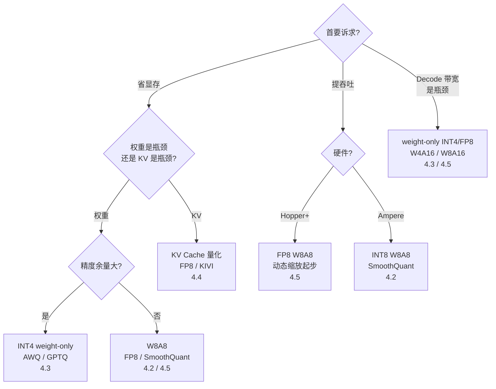

前面五节把量化的零件拆了个遍：基础概念（4.1）、SmoothQuant（4.2）、GPTQ/AWQ（4.3）、KV Cache 量化（4.4）、FP8/NVFP4（4.5）。这一节把它们装成一台可以开走的机器。先给结论：70B 模型 FP16 权重占 140GB，2 张 A100 80GB（合计 160GB）连权重都塞不下；W8A8/FP8 压到 ~70GB 两卡能放但留给 KV Cache 的余量紧张；INT4 压到 ~35GB 单卡即可——**选型的本质不是"位数越低越好"，而是先问清楚你的瓶颈是显存、带宽还是吞吐**。这一节给你一套"症状 → 诊断 → 方案"的决策树、一张显存账本表、一份 vLLM 实战命令和一份故障排查清单。

<!-- more -->

## 📑 目录

- [1. 选型决策树：症状 → 诊断 → 方案](#1-选型决策树症状--诊断--方案)
- [2. 显存账本：70B 模型的四种方案](#2-显存账本70b-模型的四种方案)
- [3. vLLM 启用量化实战](#3-vllm-启用量化实战)
- [4. 可复用评测流程：FP16 vs AWQ-INT4 vs FP8](#4-可复用评测流程fp16-vs-awq-int4-vs-fp8)
- [5. 故障排查清单](#5-故障排查清单)
- [6. 反直觉点汇总表](#6-反直觉点汇总表)
- [7. 端到端小案例：2×A100 部署 70B](#7-端到端小案例2a100-部署-70b)
- [总结](#-总结)
- [自我检验清单](#-自我检验清单)
- [参考资料](#-参考资料)

---

## 1. 选型决策树：症状 → 诊断 → 方案

### 1.1 为什么不能"无脑上 INT4"？

学习路线 3.3 给过一版精简决策树：省显存 → INT4、通用工程友好 → W8A8、长上下文 → KV 量化。但真实项目里，同样"显存不够"，权重超了和 KV 超了是两种病、两种药；同样"想提速"，Prefill 瓶颈和 Decode 瓶颈也不该用同一个方子。所以这一节把决策树升级成**问诊式**：先问症状，再定位病灶，最后开药。

### 1.2 问诊五问

**第一步：确认主要症状。** 把自己当成一个刚拿到推理需求的工程师，按顺序回答：

1. **模型权重 FP16 放得下吗？**（显存账本，见第 2 节）→ 放不下，先解决权重。
2. **KV Cache 是显存大头吗？**（长上下文 / 大并发场景，参考第 1 章的算账方法）→ 是，叠加 KV 量化。
3. **瓶颈是算力还是带宽？**（Prefill 是 Compute Bound，Decode 是 Memory Bound——第 1 章的结论）→ Prefill 卡 → W8A8 类；Decode 卡 → weight-only 类。
4. **你的硬件是什么？**（Ampere / Hopper / Blackwell）→ 决定 FP8、INT8、NVFP4 谁有原生加速。
5. **精度余量有多大？**（下游任务对输出质量是否敏感）→ 敏感 → 别碰 4-bit，优先 W8A8。



### 1.3 落成一句话的规则

- ✅ **权重放不下** → INT4 weight-only（压缩 4×）；精度敏感 → W8A8（压缩 2×）。
- ✅ **KV 放不下** → KV Cache 量化（FP8 起步，KIVI 2-bit 更激进）。
- ✅ **Hopper+ 且要 W8A8** → 直接 FP8，别折腾 INT8 的 SmoothQuant。
- ✅ **Ampere 且要 W8A8** → INT8 + SmoothQuant 是唯一成熟路径。
- ❌ **别把所有量化叠加到 4-bit 以下再叠加 KV 2-bit**——每层量化误差是相乘的，叠到最后质量崩了，排查成本远超省下的显存。

---

## 2. 显存账本：70B 模型的四种方案

### 2.1 账本怎么算？

70B 模型参数量按 $70 \times 10^9$ 计，每参数字节数由精度决定：FP16/BF16 2B、INT8/FP8 1B、INT4 0.5B。权重显存 = 参数量 × 每参数字节：

$$
\underbrace{140\ \text{GB}}_{\text{FP16: } 70 \times 10^9 \times 2\text{B}} \quad \rightarrow \quad \underbrace{70\ \text{GB}}_{\text{W8A8 / FP8: } \times 1\text{B}} \quad \rightarrow \quad \underbrace{35\ \text{GB}}_{\text{INT4 weight-only: } \times 0.5\text{B}}
$$

### 2.2 四种方案对照

| 📊 方案 | 70B 权重显存 | 2×A100 80GB 可容纳？ | 激活/额外开销 | 适用场景 |
|---|---|---|---|---|
| FP16（基线） | ~140GB | ❌ 160GB 总量也装不下 | KV/激活无空间 | 仅作对比基线 |
| W8A8（INT8/FP8） | ~70GB | ✅ 两卡 TP2 每卡 35GB，余量给 KV/激活 | 每卡剩 ~45GB | 精度优先 + Hopper/Ampere |
| INT4 weight-only | ~35GB | ✅ 单卡即可，两卡很宽裕 | 每卡剩 ~75GB（单卡部署） | 显存极端紧张、长上下文 |
| KV Cache 量化叠加 | 不变 | ✅ 在以上任选基础上再省 KV 的一半 | KV 减半 | 长上下文 / 大并发 |

💡 **提示**：别只看权重。8K 上下文、batch 16 的 7B 模型 KV Cache 就有 ~32GB（第 1 章算过），70B 的 KV 只多不少——**先算权重账，再算 KV 账，两个都放得下才算放得下**。

📌 **关键点**：W8A8 和 INT4 的差别不在"谁更省"，而在**省的东西不同**：W8A8 省一半权重显存 + 省带宽 + 激活也量化（Prefill 算力翻倍）；INT4 只省权重（4×）但激活保持 FP16。Decode 场景两者都靠省权重带宽提速，INT4 更狠；Prefill 场景 W8A8 更划算。

---

## 3. vLLM 启用量化实战

### 3.1 vLLM 到底能直接吃哪些格式？

以 vLLM 官方文档（2026 年快照）为准，支持的量化实现包括：**AutoAWQ**（已弃用，功能并入 llm-compressor）、**GPTQModel**、**llm-compressor**（FP8 W8A8 / INT4 W4A16 / INT8 W4A8 / INT8 W8A8）、**NVIDIA Model Optimizer**（FP8 / NVFP4 / MXFP8）、BitsAndBytes、AMD Quark、TorchAO、Quantized KV Cache 等。硬件支持矩阵的关键行：

| 📊 量化实现 | Volta | Turing | Ampere | Ada | Hopper |
|---|---|---|---|---|---|
| AWQ | ❌ | ✅ | ✅ | ✅ | ✅ |
| GPTQ | ✅ | ✅ | ✅ | ✅ | ✅ |
| Marlin（GPTQ/AWQ/FP8/FP4） | ❌ | ✅* | ✅ | ✅ | ✅ |
| llm-compressor FP8 (W8A8) | ❌ | ❌ | ❌ | ✅ | ✅ |

（\* Turing 不支持 Marlin MXFP4。表格随时演进，以你所用版本的官方文档为准。）

### 3.2 直接加载现成量化权重

最快的路径：从 HuggingFace 拉现成的量化 checkpoint，一行参数启动：

```bash
# AWQ INT4（权重已量化好，无需任何额外操作）
vllm serve casperhansen/llama-3.1-8b-instruct-awq \
  --quantization awq \
  --gpu-memory-utilization 0.9

# GPTQ INT4（同理由 gptqmodel 产出，或 HF 上现成权重）
vllm serve TheBloke/Llama-2-7B-Chat-GPTQ \
  --quantization gptq

# FP8 动态量化：BF16/FP16 原版权重直接跑，运行时算 scale，无需校准
vllm serve meta-llama/Llama-3.1-8B-Instruct \
  --quantization fp8

# 静态 FP8（ModelOpt 产出的 checkpoint，如 nvidia/Llama-3.1-8B-Instruct-FP8）
vllm serve nvidia/Llama-3.1-8B-Instruct-FP8 \
  --quantization modelopt

# NVFP4（Blackwell 专属，ModelOpt 产出的 FP4 checkpoint）
vllm serve nvidia/DeepSeek-R1-0528-FP4 \
  --quantization modelopt_fp4

# 叠加 FP8 KV Cache（E4M3），KV 显存再减半
vllm serve meta-llama/Llama-3.1-8B-Instruct \
  --quantization fp8 \
  --kv-cache-dtype fp8
```

⚠️ **注意**：`--quantization` 的取值与兼容性随版本演进（例如 AWQ 历史上同时存在 `awq` 与 `auto_awq` 两种写法），**以你所用版本的 `vllm serve --help` 为准**。参数名对不上时先查 help，别硬猜。

### 3.3 离线量化：拿不到现成权重怎么办？

社区主流工具（2026 年现状，均以各自官方文档为准）：

- **llm-compressor**（vLLM 团队维护）：当前**首选**。原 AutoAWQ 仓库已标记弃用并建议迁移到这里；支持 AWQ、GPTQ、FP8、NVFP4 等方案的产出。
- **GPTQModel**（ModelCloud 维护）：GPTQ 路线的活跃维护者，支持动态 per-module 量化。
- **NVIDIA Model Optimizer**：FP8/NVFP4/MXFP8 的官方路径，导出统一 HF checkpoint。

llm-compressor 的 AWQ 量化示意（伪代码，非逐字源码，以官方示例为准）：

```python
from transformers import AutoModelForCausalLM
from llmcompressor import oneshot
from llmcompressor.modifiers.quantization import GPTQModifier

model = AutoModelForCausalLM.from_pretrained(model_id, torch_dtype="auto", device_map="auto")

# 校准数据：用你的真实业务分布，而不是随便一段网上文本（第 5 节会讲为什么）
oneshot(
    model=model,
    dataset=calibration_dataset,          # 几百条与业务同分布的样本
    recipe=GPTQModifier(targets="Linear", scheme="W4A16", ignore=["lm_head"]),
    max_seq_length=2048,
)
model.save_pretrained(quant_path)         # 导出后即可被 vllm serve 加载
```

💡 **提示**：`ignore=["lm_head"]` 是常见实践——**输出头（lm_head）和 embedding 通常跳过量化**，因为它们对最终 token 概率的精度最敏感，而占比又小，省不了多少显存却容易出大问题。

---

## 4. 可复用评测流程：FP16 vs AWQ-INT4 vs FP8

### 4.1 评测协议怎么定？

"量化后到底行不行"不能靠感觉，要跑一个**可复用、可对比**的协议。固定变量：

- 同一组 prompt（建议 100~200 条，覆盖你的真实业务类型，热门冷门的都要有）
- 固定 `max_tokens`（如 256）、`temperature=0`（消除采样随机性对质量比对的干扰）
- 同一并发档位（如 1/8/32 三档，观察延迟与吞吐的曲线）
- 记录指标：**TTFT（首 token 延迟）、TPOT（每 token 延迟）、throughput（token/s）、显存峰值、GPU 利用率**——第 9 章讲过，报告至少 6 个指标才算数。

### 4.2 压测工具：GenAI-Perf

NVIDIA 的 GenAI-Perf 是官方压测工具（Triton 生态，`pip install genai-perf`），直接打 OpenAI 兼容端点：

```bash
genai-perf profile \
  -m llama-3.1-8b-instruct \
  --endpoint-type chat \
  --service-kind openai \
  --endpoint /v1/chat/completions \
  --url http://localhost:8000 \
  --concurrency 16 \
  --synthetic-input-tokens-mean 512 \
  --synthetic-input-tokens-stddev 0 \
  --output-tokens-mean 256 \
  --output-tokens-stddev 0 \
  --profile-export-file perf_fp16.json
```

三个模型各跑一遍（同一台机器、同样的 `--gpu-memory-utilization`），得到三份 json。参数名可能随版本调整，以 `genai-perf profile --help` 为准。

### 4.3 质量比对：不能只看速度

速度数字好看但生成质量崩了，等于白做。质量比对三件套：

1. **人工盲比**：同一批 prompt 的三种输出打乱顺序，让业务方盲评（LLM-as-Judge 可作辅助，但关键 case 必须人看）。
2. **困惑度（PPL）**：在固定评测集上算 perplexity 差异——FP8 相对 FP16 通常在 1% 以内，INT4 在 1~3% 量级（具体因模型而异，此处为经验量级，以你实测为准）。
3. **任务指标**：如果有下游任务（MMLU、代码通过率、摘要 ROUGE），直接跑任务指标，这是最硬的证据。

结果模板（填你自己的数字）：

| 📊 指标 | FP16 基线 | AWQ-INT4 | FP8 |
|---|---|---|---|
| TTFT P50 / P95（ms） | / | / | / |
| TPOT P50 / P95（ms） | / | / | / |
| Throughput（token/s） | / | / | / |
| 显存峰值（GB） | / | / | / |
| 人工盲评质量 | 基线 | / | / |

📌 **关键点**：评测的价值不在"谁赢"，而在**把"精度换显存/速度"的量化关系钉死在你自己硬件和业务上**——别人博客里的数字不能替你决策。

---

## 5. 故障排查清单

### 5.1 量化后质量明显下降，按什么顺序查？

量化是"看起来简单、调起来玄学"的领域。质量崩了别慌，按下面的顺序排查（对应学习路线 3.3 的检验标准）：

1. **查 outlier 层**：逐层打印激活分布，找 max 异常大的层（典型：早期层的激活）。有 outlier → 用 per-channel 缩放或 SmoothQuant（4.2 的等价变换），别硬扛 per-tensor。
2. **查校准数据代表性**：校准数据和你线上业务同分布吗？代码模型用代码校准、中文业务用中文校准——用通用英文文本校准中文模型，量化误差会集中在你的真实输入上。
3. **查特殊结构**：MoE 的 gate/router 输出对量化极其敏感（4.3 讲过），embedding/lm_head 建议 ignore；MLA、RoPE 相关投影也常是重灾区。
4. **查量化粒度**：per-tensor → per-channel → per-group（如 group_size=128）逐级加细，每级重测一次质量，找到"够用"的那一档。
5. **最后考虑 QAT**：以上都试过仍不行，且你有标注数据与训练资源 → 量化感知训练（4.1 讲过）。QAT 是"用训练成本换精度"的兜底，不是默认选项。

⚠️ **注意**：排查时**一次只改一个变量**。很多人一上来同时换校准集 + 改粒度 + 换工具，出了问题根本不知道是谁干的——把"玄学"变成可归因的实验，靠的就是单变量。

落成一句话的规则：

- ✅ **激活有 outlier** → 换粒度或 SmoothQuant，别换工具。
- ✅ **校准数据不匹配业务** → 换数据，最便宜的修复。
- ✅ **MoE/输出头出问题** → ignore 或单独处理，别全局加细粒度。
- ❌ **别一上来就 QAT**——先确认 PTQ 确实到极限了，QAT 的成本是训练资源的数量级。

---

## 6. 反直觉点汇总表

为什么量化圈这么多"反直觉"结论？因为直觉是在只用 FP16 的环境里养成的，而量化把"存储位数、计算开销、硬件支持"三个维度拆开了。

面试官最爱的提问区，全部来自本章前五节：

| 📊 反直觉点 | 真相 | 出处 |
|---|---|---|
| "位数越低越快"？ | **INT4 不一定比 INT8 快**：INT4 的 unpack/dequant 开销在小 batch 下可能超过带宽节省，且 INT8 的 Tensor Core 支持更成熟 | 4.3 |
| "KV 量化省显存"？ | **只省 KV 的显存**，权重一分不少；收益上限是 KV 在总显存中的占比 | 4.4 |
| "W8A8 精度最好"？ | 是的，但**压缩率只有 2×**，显存压力大时不如 INT4 | 4.2/4.5 |
| "FP8 和 INT8 都是 8-bit"？ | FP8 是浮点：**对数刻度、相对误差恒定、outlier 免疫**，且 Hopper+ 原生算力翻倍；INT8 需要 SmoothQuant 转移 outlier | 4.5 |
| "FP8 是省一半的 INT4 替代品"？ | FP8 是**"省一半 + 高精度"的中间态**：压缩率 2×、精度接近无损；INT4 是 4× 但吃校准质量 | 4.5 |
| "NVFP4 就是更小的 FP8"？ | NVFP4 的精度靠**缩放结构**（16 值微块共享 E4M3 scale）救回来的，不是简单截断 | 4.5 |

📌 **关键点**：记住一条主线——**量化所有的反直觉都来自同一个事实：省下来的资源和多出来的开销，在不同 batch、不同阶段（Prefill/Decode）、不同硬件上权重不同**。所以"XX 一定更快"这种话术都是危险的，正确姿势是"在什么条件下 XX 更快"。

---

## 7. 端到端小案例：2×A100 部署 70B

把全章串起来走一遍。场景：团队要上线 70B 模型，硬件是 2 张 A100 80GB（NVLink 互联），业务要求 8K 上下文、尽量高的并发，输出质量敏感。

**第 1 步：显存账本**（第 2 节）。FP16 权重 140GB > 160GB 总容量 → **必须量化**，没有任何商量余地。

**第 2 步：候选方案筛选**。W8A8（70GB）两卡 TP2 每卡 35GB 权重，每卡剩 45GB 给 KV 和激活——8K 上下文的 70B KV 约 20~40GB（取决于 batch），**能跑但并发受限**；INT4（35GB）单卡都放得下，两卡部署余量巨大。

**第 3 步：精度验证**（第 4 节流程）。拉 AWQ-INT4 和 FP8 两个候选，同一评测协议跑 FP16（用小模型替代或单卡逐层比对）作为参考。质量敏感 → **先看人工盲评，再看出吞吐**。

**第 4 步：决策**。质量达标 → 上 INT4（吞吐/并发最优）；质量差一点 → 回退 FP8 W8A8（省一半，质量近无损，Hopper 上算力翻倍——但你是 Ampere，FP8 无原生加速，这时的 W8A8 走 INT8+SmoothQuant 更稳）。

**第 5 步：上线命令**（第 3 节）：

```bash
# 方案 A：INT4（并发优先）
vllm serve <your-70b-awq> \
  --tensor-parallel-size 2 \
  --quantization awq \
  --max-model-len 8192 \
  --gpu-memory-utilization 0.92

# 方案 B：W8A8（质量优先，Ampere 上走 INT8+SmoothQuant checkpoint）
vllm serve <your-70b-int8> \
  --tensor-parallel-size 2 \
  --quantization compressed-tensors \
  --max-model-len 8192 \
  --gpu-memory-utilization 0.92
```

**第 6 步：上线后回归**。量化版本进入常规压测与质量监控（第 9 章的门禁思路）：TPOT P95 退化、质量抽检波动超过阈值就回滚。**量化不是一次性的，模型更新后要重做校准与评测**。

💡 **提示**：70B 的 INT4 权重单卡能放下 ≠ 应该单卡部署。单卡 80GB 里权重占 35GB，KV/激活预算剩 40GB+，长上下文并发一上来照样吃紧；两卡 TP2 才是常态配置——给 KV 留足空间，抢占（preemption）才不会频繁触发（第 2 章 2.1 讲过）。

---

## 📝 总结

- **选型是问诊**：先确认症状（权重放不下 / KV 放不下 / Prefill 卡 / Decode 卡），再定位硬件与精度余量，最后开药——决策树五问 + 落成一句话规则。
- **账本先于方案**：70B 的 FP16 140GB → W8A8/FP8 70GB → INT4 35GB；权重账和 KV 账都要算，两个放得下才算数。
- **vLLM 是主战场**：`--quantization awq / gptq / fp8 / modelopt / modelopt_fp4` 覆盖主流格式；离线量化首选 llm-compressor，GPTQModel/ModelOpt 各管一路。
- **评测是唯一裁判**：同一协议跑 FP16 vs AWQ-INT4 vs FP8，TTFT/TPOT/throughput/显存/质量五件套，数字钉死在自己硬件上。
- **排查讲顺序**：outlier 层 → 校准数据 → 特殊结构 → 量化粒度 → QAT，一次只改一个变量。
- **反直觉要能解释**：INT4 不一定比 INT8 快、KV 量化只省 KV、W8A8 精度最好但只省一半、FP8 是"省一半+高精度"的中间态。
- **端到端闭环**：2×A100 跑 70B，账本 → 候选 → 精度验证 → 决策 → 上线 → 回归，六步走完才算真正"会用量化"。

## 🎯 自我检验清单

- 能根据"症状 → 诊断 → 方案"五问，为一个 70B 模型在 2×A100 上的部署选出量化方案
- 能口算 70B 模型 FP16 / W8A8 / INT4 的权重显存（140 / 70 / 35GB），误差不超过 20%
- 能说出 W8A8 与 INT4 省的东西分别是什么（权重+带宽+激活 vs 仅权重 4×）
- 能写出 vLLM 加载 AWQ / GPTQ / FP8 动态 / ModelOpt FP8 / NVFP4 的 `--quantization` 参数
- 能说明动态 FP8 与静态 FP8 的前提差异（是否需要校准数据）
- 能用 GenAI-Perf 对同一模型的两个量化版本出 TTFT/TPOT/throughput 对比表
- 能设计一份控制变量的评测协议（固定 prompt/max_tokens/temperature/并发），并解释为什么 temperature=0
- 能按正确顺序排查量化后质量下降（outlier 层 → 校准数据 → 特殊结构 → 粒度 → QAT）
- 能解释"INT4 某些场景比 INT8 慢"的机制（unpack/dequant 开销、小 batch、Tensor Core 支持）
- 能解释为什么 MoE 的 gate 和 lm_head 通常要跳过量化或特殊处理
- 能说清 2×A100 部署 70B 时为何 INT4 权重单卡放得下仍建议两卡 TP2（KV 空间与并发）
- 能在 30 分钟内用 vLLM 把一个量化模型跑起来并产出第一份评测报告

## 📚 参考资料

**论文**

- [AWQ: Activation-aware Weight Quantization for LLM Compression and Acceleration - Lin et al., 2023](https://arxiv.org/abs/2306.00978)
- [GPTQ: Accurate Post-Training Quantization for Generative Pre-trained Transformers - Frantar et al., 2022](https://arxiv.org/abs/2210.17323)
- [SmoothQuant: Accurate and Efficient Post-Training Quantization for Large Language Models - Xiao et al., 2023](https://arxiv.org/abs/2211.10438)
- [FP8 Formats for Deep Learning - Micikevicius et al., 2022](https://arxiv.org/abs/2209.05433)

**官方文档**

- [vLLM Quantization 文档（支持矩阵与硬件兼容表）](https://docs.vllm.ai/en/latest/features/quantization/index.html)
- [vLLM - AutoAWQ 文档](https://docs.vllm.ai/en/latest/features/quantization/auto_awq/)
- [vLLM - GPTQModel 文档](https://docs.vllm.ai/en/latest/features/quantization/gptqmodel/)
- [vLLM - NVIDIA Model Optimizer 文档（FP8/NVFP4）](https://docs.vllm.ai/en/latest/features/quantization/modelopt/)
- [vLLM - FP8 W8A8（llm-compressor）文档](https://docs.vllm.ai/en/latest/features/quantization/llm_compressor/fp8/)

**开源项目**

- [llm-compressor（vLLM 团队，AWQ/GPTQ/FP8/NVFP4 离线量化）](https://github.com/vllm-project/llm-compressor)
- [GenAI-Perf（NVIDIA Triton 压测工具）](https://github.com/NVIDIA/triton-inference-server/tree/main/genai-perf)
- [GPTQModel（ModelCloud，GPTQ 路线维护者）](https://github.com/ModelCloud/GPTQModel)
- [AutoAWQ（已弃用，功能并入 llm-compressor）](https://github.com/casper-hansen/AutoAWQ)

**站内**

- [第 4 章 量化（章首页，4.1~4.5 小节导航）](/AIInfraGuide/inference/模块四-推理优化/第4章-量化/第4章-量化)
- [4.5 FP8 与 NVFP4：新一代硬件的低比特浮点](/AIInfraGuide/inference/模块四-推理优化/第4章-量化/45-fp8与nvfp4)
- [vLLM 快速入门](/AIInfraGuide/inference/模块四-推理优化/第3章-深入vllm/vllm快速入门)
- [2.1 PagedAttention（KV Cache 显存管理与抢占）](/AIInfraGuide/inference/模块四-推理优化/第2章-推理引擎核心技术/21-pagedattention)
- [AI Infra 学习路线（3.3 量化检验标准）](/AIInfraGuide/guides/ai-infra学习路线)
